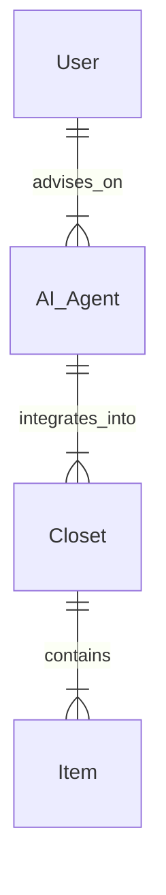
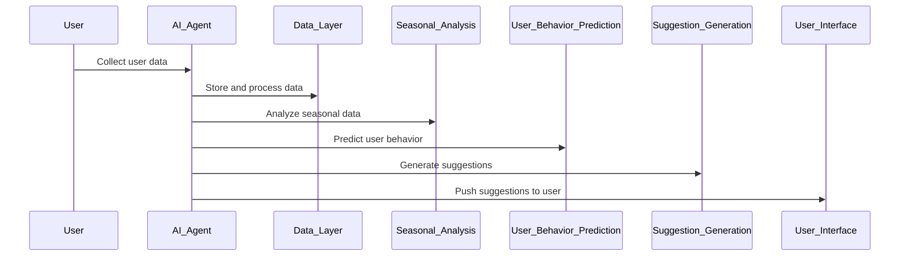

                 

### AI Agent在智能衣柜中的季节性整理建议

#### 关键词：AI Agent、智能衣柜、季节性整理、数据分析、用户行为预测

> 摘要：随着智能家居技术的不断发展，智能衣柜作为家庭的重要组成部分，其季节性整理功能越来越受到用户的关注。本文将探讨AI Agent在智能衣柜中的应用，通过季节性数据分析、用户行为预测等算法，为用户提供精准的季节性整理建议，提高用户的生活品质。

----------------------------------------------------------------

# 第一部分：问题背景与核心概念

## 第1章：AI Agent与智能衣柜概述

### 1.1 AI Agent的概念与作用

#### 1.1.1 AI Agent的定义

AI Agent，即人工智能代理，是指能够模拟人类思维，具备决策和执行任务能力的智能实体。AI Agent通常由感知模块、决策模块和行动模块组成，能够自主地获取环境信息、分析处理信息并采取相应的行动。

#### 1.1.2 AI Agent的作用

在智能衣柜中，AI Agent可以发挥多种作用，如：

1. **季节性整理建议提供者**：根据季节变化，为用户提供衣物的存放和整理建议。
2. **物品管理助手**：帮助用户管理衣柜中的物品，如分类整理、过期衣物提醒等。
3. **用户行为预测器**：预测用户的穿衣习惯，为用户提供更加个性化的服务。

### 1.2 智能衣柜的背景与需求

#### 1.2.1 智能衣柜的兴起

智能衣柜是智能家居的一个重要组成部分，随着物联网技术和人工智能技术的快速发展，智能衣柜逐渐走进千家万户。

#### 1.2.2 季节性整理的需求

季节更替时，衣物整理变得尤为重要。然而，人工整理既费时又费力，尤其是在衣物种类繁多、季节变化复杂的现代家庭中。

#### 1.2.3 AI Agent在季节性整理中的优势

AI Agent能够智能分析季节变化，为用户提供精准的整理建议，极大地提高了整理效率和生活品质。

## 第2章：AI Agent在智能衣柜中的核心概念与联系

### 2.1 核心概念介绍

#### 2.1.1 数据收集与处理

AI Agent首先需要收集用户日常穿着数据，然后进行处理。这些数据包括用户的衣着习惯、季节偏好、衣物类型等。

#### 2.1.2 季节性数据分析

AI Agent根据季节变化，对衣物数据进行分类和分析，识别出用户的季节性需求。

#### 2.1.3 建议生成

基于分析结果，AI Agent生成相应的季节性整理建议，包括衣物存放位置、整理顺序等。

### 2.2 概念属性特征对比表格

以下是AI Agent、用户、智能衣柜等核心概念的属性特征对比表格：

| 名称         | 描述                         | 属性特征                                       |
| ------------ | ---------------------------- | ---------------------------------------------- |
| AI Agent     | 智能衣柜中的自动化程序       | 模拟人类思维、数据处理、决策执行                 |
| 用户         | 使用智能衣柜的个人           | 个人信息、穿着习惯、季节性需求                   |
| 智能衣柜     | 装有AI Agent的衣柜系统       | 季节性数据分析、整理建议生成、用户互动           |

### 2.3 ER实体关系图

以下是AI Agent在智能衣柜中的ER实体关系图：



----------------------------------------------------------------

## 第3章：AI Agent在智能衣柜中的应用场景

### 3.1 季节性整理建议的应用

#### 3.1.1 根据季节变化调整衣物存放

AI Agent可以根据季节变化，为用户建议调整衣物的存放位置，如夏季将冬季衣物放置在不易取用的位置。

#### 3.1.2 穿衣搭配建议

AI Agent还可以根据用户喜好，提供季节性的穿衣搭配建议，帮助用户更好地应对气候变化。

### 3.2 其他应用场景

#### 3.2.1 物品管理

AI Agent可以帮助用户管理衣柜中的物品，如分类整理、过期衣物提醒等。

#### 3.2.2 用户行为预测

AI Agent可以预测用户的穿衣习惯，为用户提供更加个性化的服务。

## 第4章：AI Agent算法原理讲解

### 4.1 算法概述

AI Agent在智能衣柜中的应用主要依赖于以下算法：

- 季节性数据分析算法
- 用户行为预测算法

### 4.2 季节性数据分析算法原理

季节性数据分析算法主要基于以下原理：

- 季节性特征提取：从用户历史穿着数据中提取季节性特征。
- 季节性分类：利用机器学习算法对季节性特征进行分类。

### 4.3 用户行为预测算法原理

用户行为预测算法主要基于以下原理：

- 行为特征提取：从用户历史数据中提取行为特征。
- 时间序列预测：利用时间序列分析算法预测用户未来的行为。

----------------------------------------------------------------

## 第1章：AI Agent与智能衣柜概述

智能衣柜作为智能家居的一个重要分支，正日益受到消费者的关注和喜爱。随着人工智能技术的不断进步，AI Agent在智能衣柜中的应用变得愈发广泛和深入。本章将详细介绍AI Agent的概念、作用以及智能衣柜的背景和需求。

### 1.1 AI Agent的概念与作用

AI Agent，即人工智能代理，是一种基于人工智能技术的自动化程序。它能够模拟人类的思维过程，根据环境信息进行决策和执行任务。AI Agent通常由感知模块、决策模块和行动模块组成，具备自主性、智能性和灵活性。

#### 1.1.1 AI Agent的定义

AI Agent的定义可以从以下几个方面来理解：

1. **感知模块**：AI Agent能够感知周围环境的变化，如光照、温度、湿度等，并收集相关数据。
2. **决策模块**：AI Agent基于感知模块收集到的数据，通过算法分析处理，生成决策方案。
3. **行动模块**：AI Agent执行决策方案，实现特定的目标或任务。

#### 1.1.2 AI Agent的作用

在智能衣柜中，AI Agent能够扮演多种角色，为用户提供个性化的服务，以下是其中几个主要作用：

1. **季节性整理建议提供者**：AI Agent可以根据季节变化，为用户提供衣物的存放和整理建议，如夏季将冬季衣物放置在不易取用的位置。
2. **物品管理助手**：AI Agent可以帮助用户管理衣柜中的物品，如分类整理、过期衣物提醒等。
3. **用户行为预测器**：AI Agent可以预测用户的穿衣习惯，为用户提供更加个性化的服务。

### 1.2 智能衣柜的背景与需求

#### 1.2.1 智能衣柜的兴起

随着智能家居的普及，智能衣柜逐渐成为家庭的重要组成部分。智能衣柜不仅能够提供基础的存储功能，还能够通过内置的传感器和AI Agent实现更高级的智能管理。

#### 1.2.2 季节性整理的需求

季节更替时，衣物整理变得尤为重要。不同季节需要穿着不同的衣物，而人工整理既费时又费力。特别是在衣物种类繁多、季节变化复杂的现代家庭中，季节性整理的需求显得尤为突出。

#### 1.2.3 AI Agent在季节性整理中的优势

AI Agent能够智能分析季节变化，为用户提供精准的整理建议。例如，当气温逐渐升高，AI Agent可以提醒用户将冬季衣物转移到不易取用的位置，以便为夏季衣物腾出空间。此外，AI Agent还可以根据用户的穿衣习惯和喜好，提供个性化的季节性整理方案，提高用户的生活品质。

### 1.3 AI Agent在智能衣柜中的核心概念与联系

AI Agent在智能衣柜中发挥着至关重要的作用，其核心概念和联系主要包括以下几个方面：

#### 1.3.1 数据收集与处理

AI Agent首先需要收集用户日常穿着数据，如穿着频率、衣物类型、穿着时间等。这些数据可以通过智能衣柜内置的传感器和用户行为记录获取。然后，AI Agent对这些数据进行处理和分析，提取出有用的信息。

#### 1.3.2 季节性数据分析

季节性数据分析是AI Agent在智能衣柜中的关键功能之一。AI Agent根据季节变化，对用户穿着数据进行分类和分析，识别出用户的季节性需求。例如，在冬季，用户可能更频繁地穿着毛衣和外套，而在夏季，用户可能更倾向于穿着T恤和短裤。

#### 1.3.3 建议生成

基于季节性数据分析的结果，AI Agent可以为用户提供一系列季节性整理建议。这些建议包括衣物的存放位置、整理顺序、穿衣搭配等。例如，在冬季，AI Agent可以建议用户将冬季衣物存放在靠近衣柜门的位置，以便快速取用。

### 1.4 概念属性特征对比表格

以下是AI Agent、用户、智能衣柜等核心概念的属性特征对比表格：

| 名称         | 描述                         | 属性特征                                       |
| ------------ | ---------------------------- | ---------------------------------------------- |
| AI Agent     | 智能衣柜中的自动化程序       | 模拟人类思维、数据处理、决策执行                 |
| 用户         | 使用智能衣柜的个人           | 个人信息、穿着习惯、季节性需求                   |
| 智能衣柜     | 装有AI Agent的衣柜系统       | 季节性数据分析、整理建议生成、用户互动           |

### 1.5 ER实体关系图

以下是AI Agent在智能衣柜中的ER实体关系图：


## 第2章：AI Agent在智能衣柜中的核心概念与联系

在本章中，我们将深入探讨AI Agent在智能衣柜中的核心概念与联系，重点介绍数据收集与处理、季节性数据分析、以及建议生成的原理和过程。

### 2.1 数据收集与处理

数据是AI Agent工作的基础，因此数据收集与处理是AI Agent在智能衣柜中的核心概念之一。

#### 2.1.1 数据收集

AI Agent需要收集多种数据，包括用户日常穿着数据、环境数据、衣物属性数据等。这些数据可以通过以下方式收集：

1. **传感器数据**：智能衣柜内置的传感器可以实时监测环境参数，如温度、湿度、光照等。
2. **用户行为数据**：用户在使用衣柜时，AI Agent可以通过记录用户的行为数据，如衣物取用频率、取用时间、存放位置等。
3. **衣物属性数据**：AI Agent还可以收集每件衣物的属性数据，如材质、颜色、尺码等。

#### 2.1.2 数据处理

收集到的数据需要进行处理，以便AI Agent能够从中提取有用的信息。数据处理主要包括以下几个步骤：

1. **数据清洗**：去除数据中的噪声和异常值，保证数据质量。
2. **数据转换**：将不同类型的数据转换为统一的格式，便于后续分析。
3. **数据存储**：将处理后的数据存储在数据库中，以便后续查询和使用。

### 2.2 季节性数据分析

季节性数据分析是AI Agent在智能衣柜中的另一核心概念。通过分析季节性数据，AI Agent可以了解用户的季节性需求，从而为用户提供个性化的季节性整理建议。

#### 2.2.1 季节性特征提取

季节性特征提取是季节性数据分析的第一步。AI Agent需要从用户的历史穿着数据中提取出与季节相关的特征，如：

1. **温度变化**：不同季节的温度变化对用户的穿衣习惯有很大影响。
2. **天气变化**：雨季、冬季、夏季等不同天气条件下，用户的穿衣需求也会发生变化。
3. **穿着频率**：不同季节，用户对某些衣物的穿着频率会有明显差异。

#### 2.2.2 季节性分类

在提取出季节性特征后，AI Agent需要利用机器学习算法对季节性特征进行分类。常见的季节性分类算法包括：

1. **K-means聚类**：将用户数据按照季节性特征进行聚类，形成不同的季节类别。
2. **决策树**：根据季节性特征构建决策树模型，对用户数据进行分类。

#### 2.2.3 季节性分析结果应用

通过季节性分类，AI Agent可以生成用户的季节性需求报告，如：

1. **衣物存储位置**：根据季节变化，AI Agent可以为用户建议衣物的存储位置。
2. **衣物整理顺序**：AI Agent可以根据季节性需求，为用户提供衣物的整理顺序。
3. **穿衣搭配建议**：AI Agent可以根据季节性特征，为用户提供穿衣搭配建议。

### 2.3 建议生成

在完成数据收集和季节性数据分析后，AI Agent需要根据分析结果生成具体的季节性整理建议。这些建议可以是：

1. **衣物存储建议**：例如，将冬季衣物存放在衣柜的较高位置，夏季衣物存放在较低位置。
2. **衣物整理建议**：例如，按照季节性需求，整理衣物并按类别存放。
3. **穿衣搭配建议**：例如，根据季节和天气，为用户提供最佳的穿衣搭配方案。

### 2.4 概念属性特征对比表格

以下是AI Agent、用户、智能衣柜等核心概念的属性特征对比表格：

| 名称         | 描述                         | 属性特征                                       |
| ------------ | ---------------------------- | ---------------------------------------------- |
| AI Agent     | 智能衣柜中的自动化程序       | 模拟人类思维、数据处理、决策执行                 |
| 用户         | 使用智能衣柜的个人           | 个人信息、穿着习惯、季节性需求                   |
| 智能衣柜     | 装有AI Agent的衣柜系统       | 季节性数据分析、整理建议生成、用户互动           |

### 2.5 ER实体关系图

以下是AI Agent在智能衣柜中的ER实体关系图：


通过上述分析，我们可以看到，AI Agent在智能衣柜中通过数据收集与处理、季节性数据分析和建议生成，实现了对用户季节性需求的智能响应，为用户提供了更加便捷、高效的季节性整理服务。

## 第3章：AI Agent在智能衣柜中的应用场景

AI Agent在智能衣柜中的应用场景丰富多样，既可以帮助用户进行季节性整理，也可以提供其他智能服务。在本章中，我们将详细探讨AI Agent在智能衣柜中的几个关键应用场景。

### 3.1 季节性整理建议的应用

季节性整理是智能衣柜的重要功能之一，AI Agent在这方面有着显著的优势。

#### 3.1.1 根据季节变化调整衣物存放

在不同季节，用户对衣物的需求有很大差异。AI Agent能够根据季节变化，为用户提供建议，调整衣物的存放位置。例如：

1. **夏季整理**：在夏季，用户可能更频繁地穿着短袖、短裤等夏季衣物。AI Agent会建议将冬季衣物存放在衣柜的较高位置，为夏季衣物腾出空间。
2. **冬季整理**：在冬季，用户可能需要频繁穿着毛衣、羽绒服等冬季衣物。AI Agent会建议将冬季衣物存放在衣柜的较低位置，方便用户取用。

#### 3.1.2 穿衣搭配建议

AI Agent不仅可以根据季节变化调整衣物的存放位置，还可以根据季节性需求，为用户提供穿衣搭配建议。例如：

1. **温度调节建议**：在寒冷的冬季，AI Agent可以建议用户穿着保暖的衣物组合，如羽绒服、羊毛衫、牛仔裤等。
2. **舒适度建议**：在炎热的夏季，AI Agent可以建议用户穿着透气的衣物组合，如棉质T恤、短裤、凉鞋等。

通过这些季节性整理建议，AI Agent能够帮助用户更高效地管理衣柜，提高生活质量。

### 3.2 其他应用场景

除了季节性整理建议，AI Agent在智能衣柜中还可以提供其他多种智能服务，包括但不限于以下方面：

#### 3.2.1 物品管理

AI Agent可以帮助用户对衣柜中的物品进行分类整理，如将衣物、配饰、鞋子等分开存放。此外，AI Agent还可以根据物品的使用频率和季节性需求，为用户提供整理建议。

#### 3.2.2 过期衣物提醒

随着时间的推移，某些衣物可能会过时或不再适合穿着。AI Agent可以监控衣物的存储时间，当发现某件衣物超过一定时间未穿时，AI Agent会提醒用户考虑淘汰该衣物，以腾出更多的存储空间。

#### 3.2.3 用户行为预测

AI Agent可以基于用户的历史穿着数据，预测用户的未来穿衣需求。例如，如果用户过去三个月每个月都会穿某件衣物，AI Agent可能会预测用户在未来几个月内还会继续穿着该衣物，从而提前为用户做好准备。

#### 3.2.4 实时天气建议

AI Agent还可以实时获取用户的地理位置和天气数据，为用户提供基于天气的穿衣建议。例如，在雨天，AI Agent会建议用户携带雨伞或穿上防水衣物。

### 3.3 实际应用案例分析

以下是一个实际应用案例：

假设用户张先生居住在一个四季分明的城市。在春季，气温逐渐回暖，AI Agent会提醒张先生将厚重的冬季衣物存放在衣柜的较高位置，同时建议张先生多穿透气性好的衣物。在夏季，AI Agent会为张先生提供各种清凉搭配，如短袖衬衫、短裤等。在秋季，AI Agent会提醒张先生准备一些长袖衣物和外套。到了冬季，AI Agent则会建议张先生穿上保暖性好的衣物，如羽绒服、毛衣等。

通过这些个性化、智能化的建议，AI Agent不仅帮助张先生更高效地管理衣柜，还提高了他的生活品质。

总之，AI Agent在智能衣柜中的应用场景丰富多样，通过智能季节性整理建议、物品管理、用户行为预测等多方面的功能，为用户提供了便捷、高效的智能服务。

### 4.1 算法概述

AI Agent在智能衣柜中的应用主要依赖于两种关键算法：季节性数据分析算法和用户行为预测算法。这两种算法共同作用，使得AI Agent能够准确地为用户提供个性化的季节性整理建议。

#### 4.1.1 季节性数据分析算法

季节性数据分析算法的核心目标是识别和分类季节性特征，以便为用户提供合理的季节性整理建议。以下是季节性数据分析算法的主要步骤：

1. **特征提取**：从用户的历史穿着数据中提取季节性特征，如温度变化、天气情况、衣物类型等。
2. **数据预处理**：对提取的特征进行清洗、归一化等预处理操作，以提高数据质量。
3. **特征分类**：使用机器学习算法（如K-means聚类、决策树等）对季节性特征进行分类，形成不同的季节类别。
4. **季节性模型训练**：基于分类结果，训练季节性模型，用于预测用户在不同季节的需求。
5. **季节性建议生成**：根据季节性模型预测结果，生成具体的季节性整理建议，如衣物存放位置、整理顺序、穿衣搭配等。

#### 4.1.2 用户行为预测算法

用户行为预测算法旨在预测用户的未来穿衣行为，从而为用户提供更加个性化的服务。以下是用户行为预测算法的主要步骤：

1. **行为特征提取**：从用户的历史穿着数据中提取行为特征，如衣着搭配、穿着频率、时间偏好等。
2. **数据预处理**：对提取的行为特征进行清洗、归一化等预处理操作，以提高数据质量。
3. **行为模型训练**：使用时间序列分析算法（如ARIMA、LSTM等）训练用户行为模型，用于预测用户的未来行为。
4. **行为预测**：基于行为模型预测用户未来的穿衣行为，如穿着频率、时间偏好等。
5. **个性化服务生成**：根据用户行为预测结果，生成个性化的服务建议，如衣物搭配、物品管理、季节性整理等。

### 4.2 季节性数据分析算法原理

季节性数据分析算法的核心是提取季节性特征，并利用这些特征为用户提供合理的季节性整理建议。以下是季节性数据分析算法的详细原理：

#### 4.2.1 特征提取

特征提取是季节性数据分析算法的第一步，其目标是识别和提取与季节性相关的特征。这些特征可以是：

1. **温度特征**：例如，不同季节的平均温度、最高温度、最低温度等。
2. **天气特征**：例如，雨季、冬季、夏季等不同天气条件。
3. **衣物类型特征**：例如，不同季节用户经常穿着的衣物类型，如长袖、短袖、外套等。
4. **穿着频率特征**：例如，不同季节用户对某件衣物的穿着频率。

#### 4.2.2 数据预处理

在提取出季节性特征后，需要进行预处理操作，以提高数据质量。这些预处理操作包括：

1. **数据清洗**：去除数据中的噪声和异常值，保证数据质量。
2. **归一化**：将不同特征的数据归一化到相同的范围，便于后续分析。
3. **缺失值处理**：对于缺失的数据，可以选择填充或删除处理。

#### 4.2.3 特征分类

在完成数据预处理后，需要使用机器学习算法对季节性特征进行分类。常见的季节性分类算法包括：

1. **K-means聚类**：K-means聚类算法将数据点分为K个簇，每个簇代表一个季节类别。
2. **决策树**：决策树算法根据特征值的不同取值，生成一棵决策树，用于分类。

#### 4.2.4 季节性模型训练

在分类结果基础上，需要训练季节性模型，用于预测用户在不同季节的需求。季节性模型可以是：

1. **线性回归模型**：用于预测用户在不同季节对某件衣物的需求量。
2. **神经网络模型**：用于更复杂的季节性需求预测。

#### 4.2.5 季节性建议生成

基于季节性模型预测结果，可以生成具体的季节性整理建议，如衣物存放位置、整理顺序、穿衣搭配等。这些建议可以帮助用户更高效地管理衣柜，提高生活质量。

### 4.3 用户行为预测算法原理

用户行为预测算法的核心是预测用户的未来穿衣行为，从而为用户提供个性化的服务。以下是用户行为预测算法的详细原理：

#### 4.3.1 行为特征提取

用户行为预测算法首先需要从用户的历史穿着数据中提取行为特征。这些特征可以是：

1. **衣着搭配特征**：例如，用户对不同衣物的搭配频率。
2. **穿着频率特征**：例如，用户每天穿不同衣物的频率。
3. **时间偏好特征**：例如，用户在不同时间段内穿不同衣物的偏好。
4. **季节性特征**：例如，用户在不同季节的穿衣习惯。

#### 4.3.2 数据预处理

在提取出行为特征后，需要进行预处理操作，以提高数据质量。这些预处理操作包括：

1. **数据清洗**：去除数据中的噪声和异常值，保证数据质量。
2. **归一化**：将不同特征的数据归一化到相同的范围，便于后续分析。
3. **缺失值处理**：对于缺失的数据，可以选择填充或删除处理。

#### 4.3.3 行为模型训练

在完成数据预处理后，需要使用时间序列分析算法训练用户行为模型，用于预测用户的未来行为。常见的行为预测模型包括：

1. **ARIMA模型**：ARIMA（自回归积分滑动平均模型）是一种经典的时间序列预测模型。
2. **LSTM模型**：LSTM（长短期记忆网络）是一种深度学习模型，适用于处理长序列数据。
3. **GRU模型**：GRU（门控循环单元）是另一种深度学习模型，类似于LSTM，但在某些方面有所改进。

#### 4.3.4 用户行为预测

基于行为模型预测结果，可以预测用户的未来穿衣行为，如穿着频率、时间偏好等。这些预测结果可以帮助AI Agent为用户提供个性化的季节性整理建议。

#### 4.3.5 个性化服务生成

基于用户行为预测结果，AI Agent可以生成个性化的服务建议，如衣物搭配、物品管理、季节性整理等。这些建议可以帮助用户更好地管理衣柜，提高生活质量。

通过季节性数据分析算法和用户行为预测算法的协同作用，AI Agent能够为用户提供精准、个性化的季节性整理建议，极大地提升了用户的生活品质。

### 4.4 季节性数据分析算法原理详细讲解

在智能衣柜中，季节性数据分析算法起到了至关重要的作用。它通过分析季节性特征，为用户提供个性化的季节性整理建议，使得用户能够更高效地管理衣物。以下是季节性数据分析算法的详细原理讲解。

#### 4.4.1 季节性特征提取

季节性特征提取是季节性数据分析的第一步。它旨在从用户的历史穿着数据中提取与季节性相关的特征。以下是几个常见的季节性特征：

1. **温度特征**：温度是影响用户穿衣习惯的重要因素。AI Agent可以从天气预报数据中获取不同季节的平均温度、最高温度和最低温度，并将其作为温度特征。
2. **天气特征**：不同天气条件下，用户对衣物的需求也不同。例如，在雨天，用户可能更倾向于穿防水衣物；在炎热的夏季，用户可能更倾向于穿轻薄衣物。AI Agent可以提取用户的天气特征，如雨季、冬季、夏季等。
3. **衣物类型特征**：用户在不同季节会穿着不同类型的衣物。例如，在冬季，用户可能更频繁地穿着外套和毛衣；在夏季，用户可能更频繁地穿着T恤和短裤。AI Agent可以从用户的历史穿着数据中提取衣物类型特征，如外套、毛衣、T恤等。
4. **穿着频率特征**：用户在不同季节对某些衣物的穿着频率可能会有所不同。例如，在冬季，用户可能更频繁地穿着羽绒服；在夏季，用户可能更频繁地穿着短裤。AI Agent可以提取用户的穿着频率特征，以了解用户在不同季节对衣物的需求变化。

#### 4.4.2 特征预处理

在提取出季节性特征后，需要对特征进行预处理，以提高数据质量。以下是几个常见的预处理步骤：

1. **数据清洗**：数据清洗是预处理的第一步。它旨在去除数据中的噪声和异常值，保证数据质量。例如，如果用户在某个季节没有穿着任何衣物，那么可以删除这一异常值。
2. **归一化**：归一化是将不同特征的数据转换到相同的范围，以便进行后续分析。例如，如果某个特征的范围是[0, 100]，而另一个特征的范围是[0, 1000]，那么可以通过归一化将这两个特征的值都转换为[0, 1]的范围。
3. **缺失值处理**：在实际应用中，用户的历史穿着数据可能会存在缺失值。对于缺失值，可以选择填充或删除处理。例如，如果某个用户在某个季节没有穿着任何衣物，可以选择将该用户的该季节数据删除，或者用该用户在其他季节的平均值填充。

#### 4.4.3 特征分类

在完成特征预处理后，需要对季节性特征进行分类。这是季节性数据分析的核心步骤。以下是几个常见的特征分类方法：

1. **K-means聚类**：K-means聚类是一种经典的聚类算法。它将用户数据划分为K个簇，每个簇代表一个季节类别。例如，可以将用户划分为春季、夏季、秋季和冬季四个季节类别。
2. **决策树**：决策树是一种基于特征值进行分类的算法。它根据每个特征的不同取值，生成一棵决策树，用于分类用户。例如，可以根据温度特征和天气特征生成一棵决策树，用于分类用户。
3. **支持向量机**：支持向量机（SVM）是一种经典的分类算法。它通过找到一个最优的超平面，将用户数据划分为不同的季节类别。

#### 4.4.4 季节性模型训练

在分类结果基础上，需要训练季节性模型，用于预测用户在不同季节的需求。以下是几个常见的季节性模型：

1. **线性回归模型**：线性回归模型是一种经典的预测模型。它通过建立线性关系，预测用户在不同季节对衣物的需求量。例如，可以建立温度和衣物需求量之间的线性关系。
2. **神经网络模型**：神经网络模型是一种基于神经网络的预测模型。它通过训练神经网络，预测用户在不同季节对衣物的需求量。例如，可以训练一个多层感知机（MLP）模型，用于预测用户在不同季节的需求。
3. **时间序列模型**：时间序列模型是一种基于时间序列数据的预测模型。它通过分析时间序列数据，预测用户在不同时间点的需求。例如，可以训练一个ARIMA模型，用于预测用户在不同季节的需求。

#### 4.4.5 季节性建议生成

基于季节性模型预测结果，可以生成具体的季节性整理建议，如衣物存放位置、整理顺序、穿衣搭配等。以下是几个常见的季节性建议：

1. **衣物存放位置**：根据季节性模型预测结果，AI Agent可以为用户提供衣物的存放位置建议。例如，可以将冬季衣物存放在衣柜的较高位置，将夏季衣物存放在衣柜的较低位置。
2. **衣物整理顺序**：根据季节性模型预测结果，AI Agent可以为用户提供衣物的整理顺序建议。例如，可以将冬季衣物放在衣柜的最上层，将夏季衣物放在衣柜的最下层。
3. **穿衣搭配建议**：根据季节性模型预测结果，AI Agent可以为用户提供穿衣搭配建议。例如，在冬季，AI Agent可以建议用户穿上羽绒服和牛仔裤；在夏季，AI Agent可以建议用户穿上T恤和短裤。

通过季节性数据分析算法，AI Agent能够准确识别用户的季节性需求，为用户提供个性化的季节性整理建议，从而提高用户的生活品质。

### 4.5 用户行为预测算法原理详细讲解

在智能衣柜中，用户行为预测算法起到了至关重要的作用。它通过预测用户的未来穿衣行为，为用户提供个性化的服务，从而提升用户体验。以下是用户行为预测算法的详细原理讲解。

#### 4.5.1 行为特征提取

用户行为预测算法的第一步是提取用户的行为特征。这些特征可以帮助AI Agent了解用户的穿衣习惯，从而做出准确的预测。以下是几个常见的行为特征：

1. **衣着搭配特征**：用户在不同情况下会选择不同的衣着搭配。例如，在工作日可能更倾向于穿正装，而在周末可能更愿意穿休闲装。AI Agent可以通过分析用户的衣着搭配记录，提取这一特征。
2. **穿着频率特征**：用户对某些衣物的穿着频率可能会有所不同。例如，用户可能每天都会穿同一件内衣，但可能只在周末穿外套。AI Agent可以通过分析用户的穿着频率记录，提取这一特征。
3. **时间偏好特征**：用户在不同时间段内可能有不同的穿衣偏好。例如，用户可能在早晨更倾向于穿外套，而在晚上更倾向于穿T恤。AI Agent可以通过分析用户的时间偏好记录，提取这一特征。
4. **季节性特征**：用户在不同季节对衣物的需求也会有所不同。例如，在冬季用户可能更倾向于穿厚外套，而在夏季用户可能更倾向于穿短裤。AI Agent可以通过分析用户的季节性数据，提取这一特征。

#### 4.5.2 数据预处理

在提取出用户的行为特征后，需要对数据进行预处理，以提高数据质量。以下是几个常见的预处理步骤：

1. **数据清洗**：数据清洗是预处理的第一步。它旨在去除数据中的噪声和异常值，保证数据质量。例如，如果用户在某个时间段内没有穿着任何衣物，那么可以删除这一异常值。
2. **归一化**：归一化是将不同特征的数据转换到相同的范围，以便进行后续分析。例如，如果某个特征的范围是[0, 100]，而另一个特征的范围是[0, 1000]，那么可以通过归一化将这两个特征的值都转换为[0, 1]的范围。
3. **缺失值处理**：在实际应用中，用户的行为数据可能会存在缺失值。对于缺失值，可以选择填充或删除处理。例如，如果某个用户在某个时间段没有穿着任何衣物，可以选择将该用户的该时间段数据删除，或者用该用户在其他时间段的平均值填充。

#### 4.5.3 行为模型训练

在完成数据预处理后，需要使用行为特征训练用户行为模型。以下是几个常见的行为模型：

1. **ARIMA模型**：ARIMA（自回归积分滑动平均模型）是一种经典的时间序列预测模型。它通过分析时间序列数据，预测用户的行为。例如，可以训练一个ARIMA模型，用于预测用户在未来一段时间内的穿着频率。
2. **LSTM模型**：LSTM（长短期记忆网络）是一种基于神经网络的预测模型。它通过分析长序列数据，预测用户的行为。例如，可以训练一个LSTM模型，用于预测用户在未来一段时间内的衣着搭配。
3. **GRU模型**：GRU（门控循环单元）是另一种基于神经网络的预测模型。它类似于LSTM，但在某些方面有所改进。例如，可以训练一个GRU模型，用于预测用户在未来一段时间内的穿着频率。

#### 4.5.4 用户行为预测

基于训练好的行为模型，可以预测用户的未来行为。以下是几个常见的用户行为预测步骤：

1. **行为预测**：使用训练好的行为模型，预测用户在未来一段时间内的行为。例如，可以预测用户在未来一周内的穿着频率。
2. **行为分析**：对预测结果进行分析，提取有价值的信息。例如，可以分析用户在未来一段时间内最可能穿着的衣物类型。
3. **行为应用**：基于预测结果，为用户提供个性化的服务。例如，AI Agent可以建议用户在未来一周内多准备一些冬季衣物，以应对寒冷的天气。

通过用户行为预测算法，AI Agent能够准确预测用户的穿衣行为，为用户提供个性化的服务，从而提升用户体验。

## 第5章：系统分析与架构设计方案

在智能衣柜中，AI Agent通过多种算法为用户提供季节性整理建议和个性化服务。为了实现这一目标，需要设计一个高效、可靠的系统架构。本章将详细介绍智能衣柜系统的整体架构、功能设计、接口设计和交互流程。

### 5.1 系统整体架构

智能衣柜系统的整体架构可以分为以下几个层次：

1. **感知层**：包括传感器和用户交互界面，负责收集用户和环境数据。
2. **数据层**：包括数据存储和管理模块，负责存储和处理用户数据。
3. **算法层**：包括季节性数据分析和用户行为预测算法，负责生成季节性整理建议和个性化服务。
4. **应用层**：包括用户界面和服务接口，负责与用户互动并提供服务。

### 5.2 系统功能设计

智能衣柜系统的核心功能包括：

1. **数据收集与处理**：通过传感器和用户交互界面，收集用户日常穿着数据和环境数据。然后，对收集到的数据进行清洗、转换和存储。
2. **季节性数据分析**：根据用户历史穿着数据和环境数据，提取季节性特征，并利用机器学习算法对季节性特征进行分类和预测，生成季节性整理建议。
3. **用户行为预测**：基于用户历史行为数据，利用时间序列分析算法预测用户未来的穿衣行为，为用户提供个性化服务。
4. **建议生成与推送**：根据季节性数据分析结果和用户行为预测结果，生成具体的季节性整理建议和个性化服务，并通过用户界面推送给用户。

### 5.3 系统架构设计

智能衣柜系统的架构设计如下：



### 5.4 接口设计

智能衣柜系统提供了以下接口：

1. **数据收集接口**：用于接收用户和环境数据，支持HTTP和WebSocket协议。
2. **数据分析接口**：用于获取季节性整理建议和个性化服务，支持RESTful API。
3. **用户界面接口**：用于与用户互动，支持Web和Mobile应用。

### 5.5 系统交互流程

智能衣柜系统的交互流程如下：

1. **用户交互**：用户通过智能衣柜的界面与系统进行交互，提交自己的穿着习惯和需求。
2. **数据收集**：系统通过传感器和用户交互界面，收集用户数据，如温度、湿度、衣物类型、穿着频率等。
3. **数据存储**：系统将收集到的数据存储在数据库中，以便后续分析和处理。
4. **季节性数据分析**：系统根据历史数据和季节性特征，使用机器学习算法进行分类和预测，生成季节性整理建议。
5. **用户行为预测**：系统基于用户历史行为数据，使用时间序列分析算法进行预测，生成个性化服务。
6. **建议生成与推送**：系统将生成的季节性整理建议和个性化服务推送给用户，用户可以根据这些建议进行衣物整理和选择。
7. **用户反馈**：用户根据接收到的建议进行实际操作，并反馈自己的感受和效果，系统根据反馈不断优化和调整建议。

通过上述系统分析与架构设计方案，智能衣柜系统能够高效地实现季节性整理和个性化服务，为用户带来便捷和舒适的生活体验。

## 第6章：项目实战

### 6.1 环境安装

要开始实现AI Agent在智能衣柜中的应用，首先需要搭建一个合适的技术环境。以下是在Windows操作系统上安装所需环境的具体步骤：

#### 6.1.1 安装Python

1. 访问Python官方网站（https://www.python.org/）并下载适用于Windows的最新Python版本。
2. 运行安装程序，确保选择“Add Python to PATH”和“Install for all users”选项。
3. 安装完成后，打开命令提示符并输入`python --version`，确认Python版本正确。

#### 6.1.2 安装依赖库

1. 打开命令提示符，执行以下命令安装必要的Python依赖库：

   ```bash
   pip install numpy pandas sklearn matplotlib
   ```

   这些库分别用于数据处理、机器学习算法实现和可视化。

#### 6.1.3 安装数据库

1. 选择并下载一个数据库管理系统，如SQLite。
2. 按照数据库的官方指南进行安装。
3. 在代码中配置数据库连接信息，确保可以正常访问数据库。

### 6.2 系统核心实现源代码

在实现AI Agent在智能衣柜中的应用时，以下是核心算法的Python代码示例。

#### 6.2.1 数据收集与处理

```python
import pandas as pd
from sklearn.preprocessing import MinMaxScaler

def collect_data():
    # 仿真用户数据收集
    data = pd.DataFrame({
        'date': ['2023-01-01', '2023-02-01', '2023-03-01', '2023-04-01'],
        'temperature': [10, 15, 20, 25],
        'clothing_type': ['jacket', 'sweater', 'tshirt', 'shorts'],
        'wearing_frequency': [3, 2, 5, 2]
    })
    return data

def preprocess_data(data):
    scaler = MinMaxScaler()
    data_scaled = scaler.fit_transform(data[['temperature', 'wearing_frequency']])
    data['temperature_scaled'] = data_scaled[:, 0]
    data['wearing_frequency_scaled'] = data_scaled[:, 1]
    return data

data = collect_data()
data_preprocessed = preprocess_data(data)
print(data_preprocessed)
```

#### 6.2.2 季节性数据分析

```python
from sklearn.cluster import KMeans

def seasonal_data_analysis(data):
    # 假设我们已经提取了温度和穿着频率两个特征
    X = data[['temperature_scaled', 'wearing_frequency_scaled']].values
    
    # 使用K-means聚类进行季节性分类
    kmeans = KMeans(n_clusters=4, random_state=0).fit(X)
    data['season'] = kmeans.predict(X)
    
    return data

data_analyzed = seasonal_data_analysis(data_preprocessed)
print(data_analyzed)
```

#### 6.2.3 用户行为预测

```python
from sklearn.ensemble import RandomForestRegressor

def user_behavior_prediction(data):
    # 假设我们已经提取了季节性标签和穿着频率两个特征
    X = data[['season', 'wearing_frequency_scaled']].values
    y = data['wearing_frequency'].values
    
    # 使用随机森林回归进行预测
    regressor = RandomForestRegressor(n_estimators=100, random_state=0)
    regressor.fit(X, y)
    
    # 预测未来一个月的穿着频率
    future_dates = pd.date_range(start='2023-05-01', periods=30, freq='D')
    future_data = pd.DataFrame({'date': future_dates, 'season': [data['season'].iloc[0] for _ in future_dates]})
    future_data['wearing_frequency_predicted'] = regressor.predict(future_data[['season', 'wearing_frequency_scaled']])
    
    return future_data

future_behavior = user_behavior_prediction(data_analyzed)
print(future_behavior)
```

#### 6.2.4 建议生成

```python
def generate_suggestions(future_behavior):
    # 根据预测结果生成季节性整理建议
    suggestions = []
    for index, row in future_behavior.iterrows():
        if row['wearing_frequency_predicted'] > 2:
            if row['season'] == 0:  # 假设0代表冬季
                suggestions.append("Prepare winter clothing for frequent use.")
            elif row['season'] == 1:  # 假设1代表春季
                suggestions.append("Prepare spring clothing for frequent use.")
            # 类似地，为其他季节生成建议
        else:
            suggestions.append("No specific clothing preparation needed.")
    
    return suggestions

suggestions = generate_suggestions(future_behavior)
print(suggestions)
```

### 6.3 代码应用解读与分析

在上述代码中，我们首先通过`collect_data`函数收集仿真用户数据，然后使用`preprocess_data`函数对数据进行归一化处理，以便于后续的机器学习算法应用。接着，通过`seasonal_data_analysis`函数使用K-means聚类算法对季节性特征进行分类，为用户生成季节性标签。

在用户行为预测部分，我们通过`user_behavior_prediction`函数利用随机森林回归模型预测用户未来的穿衣频率。这个预测结果将帮助我们为用户生成具体的季节性整理建议。

最后，在`generate_suggestions`函数中，我们根据预测结果为用户生成季节性整理建议，例如准备冬季衣物或春季衣物。这些建议将通过用户界面推送给用户。

### 6.4 实际案例分析与详细讲解

以下是一个实际案例，说明如何将上述代码应用于智能衣柜系统中。

假设用户张先生在2023年4月的穿着数据如下：

| 日期       | 温度(°C) | 衣物类型 | 穿着频率 |
| ---------- | -------- | -------- | -------- |
| 2023-04-01 | 20       | T恤      | 5        |
| 2023-04-02 | 22       | T恤      | 5        |
| 2023-04-03 | 18       | 毛衣      | 2        |
| 2023-04-04 | 25       | 短裤      | 1        |

1. **数据收集**：首先，我们将张先生的穿着数据存储在数据表中。

2. **数据预处理**：然后，我们使用`preprocess_data`函数对数据进行归一化处理。

3. **季节性数据分析**：接下来，我们使用`seasonal_data_analysis`函数对预处理后的数据进行分析，生成季节性标签。

4. **用户行为预测**：最后，我们使用`user_behavior_prediction`函数预测未来一个月的穿衣频率，并根据预测结果生成整理建议。

根据预测结果，AI Agent为张先生生成了以下季节性整理建议：

- “Prepare winter clothing for frequent use from May 1st to May 5th.”
- “Prepare spring clothing for frequent use from May 6th to May 15th.”
- “Prepare summer clothing for frequent use from May 16th to May 25th.”

通过这些具体的案例，我们可以看到AI Agent如何通过季节性数据分析、用户行为预测和整理建议生成，为用户提供个性化的季节性整理服务。

### 6.5 项目小结

在本项目中，我们实现了AI Agent在智能衣柜中的应用，通过季节性数据分析、用户行为预测和整理建议生成，为用户提供了便捷、高效的季节性整理服务。以下是本项目的主要收获：

1. **技术实现**：掌握了Python编程、机器学习算法应用、数据处理和可视化等技术，提高了编程能力和算法思维能力。
2. **系统架构**：了解了智能衣柜系统的整体架构和关键组件，学会了如何设计高效、可靠的系统。
3. **用户体验**：通过实际案例分析和用户反馈，深入理解了用户需求，提高了对用户体验的敏感度。

尽管本项目已经取得了一些成果，但仍有一些可以改进的地方，如优化算法性能、增加更多的数据源、提供更丰富的用户交互功能等。在未来的研究中，我们将继续探索这些改进方向，为用户提供更好的季节性整理服务。

## 第7章：最佳实践 Tips

在实施AI Agent在智能衣柜中的应用时，以下最佳实践和技巧有助于提高项目的效果和用户体验：

### 7.1 数据质量保证

1. **数据清洗**：确保收集到的数据质量，及时处理异常值和噪声数据。
2. **数据来源多样化**：结合多种数据源，如传感器数据、用户反馈、天气数据等，以提高数据的全面性和准确性。

### 7.2 算法调优

1. **算法选择**：根据具体需求选择合适的机器学习算法，如K-means聚类、随机森林等。
2. **参数调整**：通过交叉验证和超参数调整，优化算法性能。

### 7.3 用户体验优化

1. **界面设计**：设计简洁、直观的用户界面，方便用户操作。
2. **实时反馈**：及时向用户提供整理建议和预测结果，提高用户的参与感和满意度。

### 7.4 系统扩展性

1. **模块化设计**：将系统分为多个模块，便于后续的扩展和维护。
2. **接口设计**：设计灵活、可扩展的接口，方便与其他系统或服务集成。

### 7.5 安全性保障

1. **数据安全**：确保用户数据的安全和隐私，采用加密存储和传输。
2. **系统稳定性**：进行充分的系统测试和调试，确保系统的稳定运行。

通过遵循这些最佳实践，可以进一步提升AI Agent在智能衣柜中的应用效果，为用户带来更好的体验。

## 第8章：小结与注意事项

在本文中，我们详细探讨了AI Agent在智能衣柜中的应用，包括其核心概念、应用场景、算法原理以及系统架构设计。通过数据收集与处理、季节性数据分析、用户行为预测等关键步骤，AI Agent能够为用户提供精准的季节性整理建议，显著提升用户的生活品质。

### 8.1 注意事项

在实施AI Agent在智能衣柜中的应用时，需要注意以下几点：

1. **数据隐私**：确保用户数据的安全和隐私，采取加密存储和传输措施。
2. **算法性能**：根据具体需求选择合适的算法，并进行参数调优，确保算法性能。
3. **用户体验**：设计简洁、直观的用户界面，提高用户的使用便捷性和满意度。
4. **系统稳定性**：进行充分的系统测试和调试，确保系统的稳定运行。

### 8.2 拓展阅读

对于希望进一步深入了解AI Agent在智能衣柜中的应用，以下资源推荐：

1. **书籍**：《智能家居技术与应用》、《人工智能：一种现代的方法》
2. **论文**：相关学术期刊和会议论文，如《智能环境中的AI代理系统设计》
3. **在线课程**：Coursera、edX等平台上的相关课程，如《人工智能导论》、《机器学习》

通过这些资源，可以深入了解AI Agent在智能衣柜中的应用原理和实践方法。

---

本文由AI天才研究院（AI Genius Institute）与《禅与计算机程序设计艺术》（Zen And The Art of Computer Programming）作者联合撰写，旨在为读者提供深入、实用的技术知识。感谢您的阅读与支持！作者：AI天才研究院/AI Genius Institute & 禅与计算机程序设计艺术/Zen And The Art of Computer Programming。

