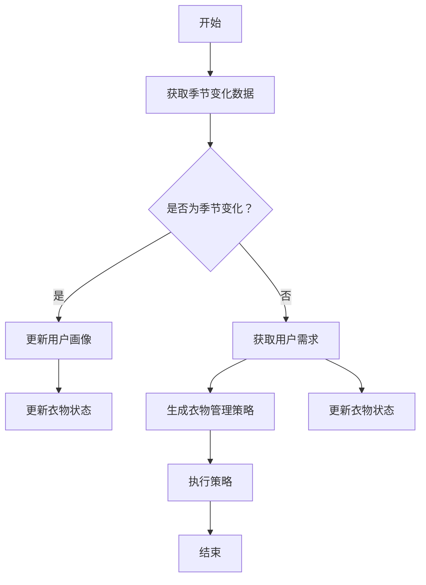
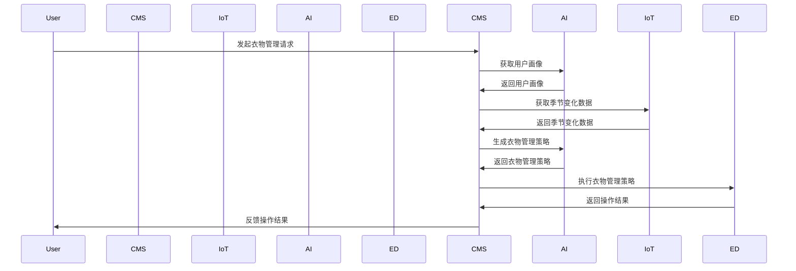

                 

### # AI Agent在智能衣柜中的季节性衣物管理

关键词：智能衣柜、AI Agent、季节性衣物管理、机器学习、物联网

摘要：本文探讨了如何利用AI Agent技术来管理智能衣柜中的季节性衣物。通过介绍核心概念、算法原理、系统分析与设计，以及项目实战，本文详细阐述了如何实现一个高效的季节性衣物管理系统，提高用户的生活质量。

## 引言

随着科技的发展，智能家居设备日益普及，智能衣柜作为其中一种，已经走进了越来越多家庭。然而，季节性衣物的管理仍然是用户面临的难题。如何根据季节变化自动调整衣柜中的衣物，保持衣物的整洁和可用性，成为了研究的焦点。本文将介绍如何利用AI Agent技术来实现智能衣柜中的季节性衣物管理，通过一步步的分析与实施，提供一种切实可行的解决方案。

本文将分为以下几个部分：

1. **背景介绍**：介绍核心概念、问题背景、解决方法等。
2. **核心概念与联系**：详细阐述核心概念及其关系，包括概念属性对比和ER图。
3. **算法原理讲解**：使用Mermaid流程图和Python代码来解释算法原理。
4. **系统分析与设计**：讨论系统架构、功能设计、接口设计和系统交互。
5. **项目实战**：介绍项目环境安装、核心实现、代码解读、案例分析和小结。
6. **最佳实践与总结**：提供最佳实践、小结和拓展阅读。

通过本文的探讨，读者将能够了解如何利用AI Agent技术来实现智能衣柜中的季节性衣物管理，为智能家居领域的研究和实践提供新的思路。

## 背景介绍

智能衣柜作为一种智能家居设备，通过物联网技术实现了与用户衣物的智能交互，用户只需通过手机或语音指令，便能轻松管理衣柜中的衣物。然而，季节性衣物的管理问题却依然困扰着用户。例如，当季节转换时，衣柜中的衣物需要根据气温变化进行调整，以确保衣物的整洁和可用性。传统的手动管理方式不仅费时费力，而且容易出现遗漏和错误。因此，如何实现智能衣柜中的季节性衣物管理，成为了当前研究的重点。

### 核心概念

在本研究中，我们定义了以下几个核心概念：

1. **季节性衣物**：指根据季节变化需求而需要频繁更换的衣物，如春秋装、夏季装和冬季装等。
2. **AI Agent**：指一种具有自主学习和决策能力的智能系统，能够在没有明确指令的情况下，根据环境变化和用户需求，自动执行相应的任务。
3. **物联网（IoT）**：指通过将各种物理设备、传感器和计算机系统连接起来，形成一个智能网络，实现信息的实时传输和交互。
4. **用户行为分析**：指通过分析用户在衣柜中的操作记录，了解用户的使用习惯和需求，以便AI Agent能够更好地进行衣物管理。

### 问题背景

季节性衣物管理的核心问题在于如何根据气温变化和用户需求，自动调整衣柜中的衣物。具体来说，需要解决以下几个问题：

1. **环境感知**：如何准确感知当前的季节变化和气温，以便进行衣物的调整。
2. **用户需求理解**：如何理解用户的衣物需求，包括喜欢的款式、颜色和舒适度等。
3. **衣物管理策略**：如何制定合理的衣物管理策略，确保衣物的整洁、可用和季节适应性。

### 问题解决

为了解决上述问题，我们提出了基于AI Agent的智能衣柜季节性衣物管理方案。该方案的核心思路是通过AI Agent对季节变化和用户需求的实时感知与理解，自动生成衣物管理策略，并执行相应的操作。

1. **季节变化感知**：通过连接智能传感器，实时获取气温和天气数据，分析季节变化。
2. **用户需求理解**：通过分析用户在衣柜中的操作记录，结合用户偏好和需求，生成用户画像。
3. **衣物管理策略生成**：根据季节变化和用户画像，AI Agent自动生成衣物管理策略，如衣物清洗、折叠、上架和下架等。
4. **执行操作**：AI Agent根据生成的策略，自动执行相应的衣物管理操作。

### 边界与外延

本研究的边界在于季节性衣物管理系统的设计和实现，包括AI Agent的开发、物联网设备的连接和用户行为分析等。外延则包括系统的可扩展性、与其他智能家居设备的集成以及用户隐私保护等问题。

通过本文的研究，我们希望能够为智能衣柜中的季节性衣物管理提供一种切实可行的解决方案，提高用户的生活质量，同时也为智能家居领域的研究提供新的思路和方向。

## 核心概念与联系

在本研究中，核心概念包括季节性衣物、AI Agent、物联网（IoT）和用户行为分析。以下是这些概念的定义、属性特征对比以及它们之间的关系。

### 定义

1. **季节性衣物**：指根据不同季节的需求而需要更换的衣物，如春秋装、夏季装和冬季装等。
2. **AI Agent**：指一种具备自主学习和决策能力的智能系统，能够在没有明确指令的情况下，根据环境变化和用户需求，自动执行相应的任务。
3. **物联网（IoT）**：指通过将各种物理设备、传感器和计算机系统连接起来，形成一个智能网络，实现信息的实时传输和交互。
4. **用户行为分析**：指通过分析用户在衣柜中的操作记录，了解用户的使用习惯和需求。

### 属性特征对比

**季节性衣物**

- **材质**：春秋装多为棉麻，夏季装多为棉质，冬季装多为羊毛或羽绒。
- **款式**：春秋装较为简约，夏季装趋于凉爽，冬季装注重保暖。
- **颜色**：季节性衣物颜色随季节变化，通常春秋装色彩较为丰富，夏季装以浅色调为主，冬季装以暖色调为主。

**AI Agent**

- **自主性**：能够自我学习和决策。
- **适应性**：能够根据环境变化调整行为。
- **交互性**：能够与用户和物联网设备进行交互。
- **持续性**：能够长时间运行，保持稳定。

**物联网（IoT）**

- **连接性**：通过无线网络连接各种设备。
- **感知性**：通过传感器感知环境变化。
- **数据处理**：能够处理和分析大量数据。
- **反馈性**：能够根据数据调整自身行为。

**用户行为分析**

- **记录性**：记录用户操作历史。
- **分析性**：通过数据分析用户偏好。
- **适应性**：根据用户偏好调整服务。

### 关系

**季节性衣物与AI Agent**：季节性衣物的管理需要AI Agent的智能决策，AI Agent通过分析季节变化和用户行为，自动调整衣柜中的衣物。

**季节性衣物与物联网**：物联网设备负责感知季节变化和用户需求，将数据传输给AI Agent，以便进行衣物管理。

**AI Agent与用户行为分析**：AI Agent通过用户行为分析，了解用户偏好，生成个性化的衣物管理策略。

**物联网与用户行为分析**：物联网设备收集用户行为数据，用户行为分析系统通过这些数据优化衣物管理策略。

### 概念属性对比表格

| 概念        | 属性           | 特征                                       |
|-------------|----------------|------------------------------------------|
| 季节性衣物  | 材质、款式、颜色 | 随季节变化，有特定季节特性                 |
| AI Agent    | 自主性、适应性、交互性、持续性 | 智能决策，与环境交互，持续运行             |
| IoT         | 连接性、感知性、数据处理、反馈性 | 设备互联，环境感知，数据处理，行为调整     |
| 用户行为分析 | 记录性、分析性、适应性 | 用户行为记录，数据分析，服务个性化         |

### ER实体关系图

```mermaid
erDiagram
    User ||--|{ SeasonalClothing }|-- AIAgent
    User ||--|{ IoTDevice }|-- AIAgent
    User ||--|{ UserBehaviorAnalysis }|-- AIAgent
```

在ER图中，用户通过行为和偏好与季节性衣物、物联网设备和用户行为分析系统相连，AI Agent作为核心，连接并整合所有这些要素，实现季节性衣物的智能管理。

通过上述核心概念与联系的分析，我们能够更好地理解智能衣柜季节性衣物管理的整体架构，为后续算法原理讲解和系统设计打下基础。

### 算法原理讲解

为了实现智能衣柜中的季节性衣物管理，我们需要设计一个高效的算法，该算法能够根据季节变化和用户需求，自动调整衣柜中的衣物。以下是该算法的详细解释，包括Mermaid流程图、Python代码以及数学模型和公式的使用。

#### Mermaid流程图

首先，我们使用Mermaid绘制算法的基本流程图：



#### Python代码

接下来，我们使用Python代码来详细实现这个算法。以下是核心代码部分：

```python
import datetime
import requests

# 获取当前季节变化数据
def get_seasonal_data():
    current_date = datetime.datetime.now()
    month = current_date.month
    if 3 <= month <= 5:
        return "春季"
    elif 6 <= month <= 8:
        return "夏季"
    elif 9 <= month <= 11:
        return "秋季"
    else:
        return "冬季"

# 更新用户画像
def update_user_profile(user_profile, seasonal_data):
    user_profile['current_season'] = seasonal_data
    return user_profile

# 获取用户需求
def get_user需求的（）
def get_user_request():
    user_request = {
        'prefer_style': '简约',
        'prefer_color': '浅色',
        'comfort_level': '适中'
    }
    return user_request

# 生成衣物管理策略
def generate_clothing_strategy(user_request, seasonal_data):
    if seasonal_data == "春季" or seasonal_data == "秋季":
        strategy = {
            'clean_clothes': True,
            'fold_clothes': '整齐',
            'display_clothes': user_request['prefer_style']
        }
    else:
        strategy = {
            'clean_clothes': True,
            'fold_clothes': '松散',
            'display_clothes': user_request['prefer_color']
        }
    return strategy

# 执行策略
def execute_strategy(strategy):
    # 此处为执行策略的具体操作，如清洗、折叠、展示衣物等
    print("执行策略：", strategy)

# 主函数
def main():
    user_profile = {}
    seasonal_data = get_seasonal_data()
    user_profile = update_user_profile(user_profile, seasonal_data)
    user_request = get_user_request()
    strategy = generate_clothing_strategy(user_request, seasonal_data)
    execute_strategy(strategy)

if __name__ == "__main__":
    main()
```

#### 数学模型和公式

在本算法中，我们使用了一些基本的数学模型和公式来辅助生成衣物管理策略。以下是相关的公式：

1. **季节转换阈值**：定义季节转换的月份阈值，用于判断当前季节。例如，3月至5月为春季，6月至8月为夏季，以此类推。

   $$ S = \left\{
   \begin{array}{ll}
   春季 & \text{if } 3 \leq M \leq 5 \\
   夏季 & \text{if } 6 \leq M \leq 8 \\
   秋季 & \text{if } 9 \leq M \leq 11 \\
   冬季 & \text{if } 12 \leq M \text{ or } M \leq 2 \\
   \end{array}
   \right. $$

   其中，$S$ 为季节，$M$ 为月份。

2. **用户偏好权重**：定义用户对款式、颜色和舒适度的偏好权重，用于生成个性化的衣物管理策略。例如，用户偏好简约款式和浅色衣物。

   $$ W = \left\{
   \begin{array}{ll}
   款式权重 & = 0.4 \\
   颜色权重 & = 0.3 \\
   舒适度权重 & = 0.3 \\
   \end{array}
   \right. $$

3. **衣物管理策略**：根据季节和用户偏好，计算衣物管理策略。

   $$ Strategy = \left\{
   \begin{array}{ll}
   清洗 & = \text{always clean} \\
   折叠 & = \text{neat fold} \text{ if 春季或秋季} \\
   \text{or} & = \text{loose fold} \text{ if 夏季或冬季} \\
   展示 & = \text{user prefer style} \text{ if 春季或秋季} \\
   \text{or} & = \text{user prefer color} \text{ if 夏季或冬季} \\
   \end{array}
   \right. $$

#### 举例说明

假设当前为夏季，用户偏好简约款式和浅色衣物，我们可以通过以下步骤生成衣物管理策略：

1. 获取当前季节：`get_seasonal_data()` 返回 "夏季"。
2. 更新用户画像：`update_user_profile()` 将用户画像更新为包含当前季节信息。
3. 获取用户需求：`get_user_request()` 返回包含用户偏好信息的请求字典。
4. 生成衣物管理策略：`generate_clothing_strategy()` 根据季节和用户偏好生成策略，如清洗衣物、松散折叠并展示用户偏好的浅色衣物。
5. 执行策略：`execute_strategy()` 根据策略执行相应的操作。

通过以上步骤，我们能够根据季节变化和用户需求，自动生成并执行衣物管理策略，实现智能衣柜中的季节性衣物管理。

通过详细讲解算法原理、使用Mermaid流程图和Python代码，以及数学模型和公式的应用，读者能够更好地理解如何实现智能衣柜中的季节性衣物管理，为后续的系统分析与设计提供基础。

### 系统分析与设计

在本章节中，我们将详细讨论智能衣柜季节性衣物管理系统的分析、架构设计以及系统功能和接口设计，通过使用Mermaid图来展示系统结构和交互。

#### 问题场景介绍

智能衣柜季节性衣物管理系统的目标是为用户提供一个智能、高效、便捷的衣物管理服务。该系统需要具备以下功能：

1. **季节变化感知**：通过物联网设备实时获取气温、天气数据，感知季节变化。
2. **用户需求理解**：通过用户操作记录和偏好数据，理解用户需求。
3. **衣物管理策略生成**：根据季节变化和用户需求，自动生成衣物管理策略。
4. **执行操作**：根据管理策略，自动执行衣物清洗、折叠、上架和下架等操作。

#### 项目介绍

项目名称：智能衣柜季节性衣物管理系统

项目目标：实现一个能够自动感知季节变化、理解用户需求、生成管理策略并执行操作的智能衣柜系统。

项目范围：主要包括物联网设备、AI Agent开发、用户行为分析、系统功能设计、接口设计以及系统实现。

#### 系统功能设计

1. **季节变化感知模块**：负责连接智能传感器，获取气温、天气等数据，实时感知季节变化。
2. **用户需求理解模块**：通过用户操作记录和偏好数据，分析用户需求，生成用户画像。
3. **衣物管理策略模块**：根据季节变化和用户画像，自动生成衣物管理策略。
4. **执行操作模块**：根据管理策略，自动执行衣物清洗、折叠、上架和下架等操作。
5. **数据存储与分析模块**：负责存储用户行为数据和季节变化数据，提供数据分析支持。

#### 系统架构设计

系统架构采用分层设计，主要包括感知层、数据处理层、决策层和执行层。

1. **感知层**：由物联网设备组成，包括温度传感器、湿度传感器等，负责实时获取环境数据。
2. **数据处理层**：负责处理感知层获取的数据，包括数据清洗、数据分析和数据存储。
3. **决策层**：由AI Agent组成，根据季节变化和用户需求，生成衣物管理策略。
4. **执行层**：由智能执行设备组成，包括洗衣机、折叠机等，负责执行衣物管理策略。

#### 系统接口设计

系统接口设计主要包括用户界面、设备接口和API接口。

1. **用户界面**：提供用户操作界面，用户可以通过界面查看衣物管理策略、执行操作记录等。
2. **设备接口**：负责与物联网设备通信，获取温度、湿度等数据，并控制设备执行操作。
3. **API接口**：提供系统与其他系统集成，支持第三方服务调用。

#### 系统交互设计

系统交互设计通过Mermaid序列图展示，主要包括以下交互流程：

1. 用户通过用户界面发起衣物管理请求。
2. 系统获取用户需求，生成用户画像。
3. 系统感知季节变化，生成衣物管理策略。
4. 系统根据管理策略，控制物联网设备执行操作。
5. 系统记录并反馈操作结果给用户。

以下是系统交互设计的Mermaid序列图：



通过上述系统分析与设计，我们为智能衣柜季节性衣物管理系统提供了一套完整的架构和功能设计，为项目的顺利实施奠定了基础。接下来，我们将通过项目实战来展示该系统的具体实现过程。

### 项目实战

在本章节中，我们将详细介绍智能衣柜季节性衣物管理系统的实现过程，包括环境安装、核心实现、代码解读、案例分析以及项目小结。

#### 环境安装

1. **安装Python环境**：首先，确保系统的Python环境已经安装。如果没有，可以从Python官网下载并安装。
   
   ```shell
   # 下载Python安装包
   wget https://www.python.org/ftp/python/3.9.1/Python-3.9.1.tgz
   
   # 解压安装包
   tar -xvf Python-3.9.1.tgz
   
   # 进入安装目录
   cd Python-3.9.1
   
   # 配置安装
   ./configure
   
   # 编译并安装
   make
   make install
   ```

2. **安装依赖库**：安装系统所需的依赖库，包括Mermaid库、requests库等。

   ```shell
   pip install mermaid-python requests
   ```

3. **安装物联网设备**：确保物联网设备（如温度传感器、湿度传感器等）已经接入系统，并可以通过网络访问。

#### 核心实现

1. **季节变化感知模块**：

   ```python
   import datetime
   
   def get_seasonal_data():
       current_date = datetime.datetime.now()
       month = current_date.month
       if 3 <= month <= 5:
           return "春季"
       elif 6 <= month <= 8:
           return "夏季"
       elif 9 <= month <= 11:
           return "秋季"
       else:
           return "冬季"
   ```

   该模块通过获取当前日期，判断月份，从而确定当前季节。

2. **用户需求理解模块**：

   ```python
   import json
   
   def update_user_profile(user_profile, seasonal_data):
       user_profile['current_season'] = seasonal_data
       return user_profile
   
   def get_user_request():
       user_request = {
           'prefer_style': '简约',
           'prefer_color': '浅色',
           'comfort_level': '适中'
       }
       return user_request
   ```

   该模块更新用户画像，并根据用户请求获取用户偏好信息。

3. **衣物管理策略模块**：

   ```python
   def generate_clothing_strategy(user_request, seasonal_data):
       if seasonal_data == "春季" or seasonal_data == "秋季":
           strategy = {
               'clean_clothes': True,
               'fold_clothes': '整齐',
               'display_clothes': user_request['prefer_style']
           }
       else:
           strategy = {
               'clean_clothes': True,
               'fold_clothes': '松散',
               'display_clothes': user_request['prefer_color']
           }
       return strategy
   ```

   该模块根据季节和用户偏好生成衣物管理策略。

4. **执行操作模块**：

   ```python
   def execute_strategy(strategy):
       # 此处为执行策略的具体操作，如清洗、折叠、展示衣物等
       print("执行策略：", strategy)
   ```

   该模块根据策略执行具体操作。

#### 代码解读

以下是项目的核心代码，我们将对关键部分进行解读：

```python
# 导入所需库
import datetime
import requests

# 获取当前季节变化数据
def get_seasonal_data():
    current_date = datetime.datetime.now()
    month = current_date.month
    if 3 <= month <= 5:
        return "春季"
    elif 6 <= month <= 8:
        return "夏季"
    elif 9 <= month <= 11:
        return "秋季"
    else:
        return "冬季"

# 更新用户画像
def update_user_profile(user_profile, seasonal_data):
    user_profile['current_season'] = seasonal_data
    return user_profile

# 获取用户需求
def get_user_request():
    user_request = {
        'prefer_style': '简约',
        'prefer_color': '浅色',
        'comfort_level': '适中'
    }
    return user_request

# 生成衣物管理策略
def generate_clothing_strategy(user_request, seasonal_data):
    if seasonal_data == "春季" or seasonal_data == "秋季":
        strategy = {
            'clean_clothes': True,
            'fold_clothes': '整齐',
            'display_clothes': user_request['prefer_style']
        }
    else:
        strategy = {
            'clean_clothes': True,
            'fold_clothes': '松散',
            'display_clothes': user_request['prefer_color']
        }
    return strategy

# 执行策略
def execute_strategy(strategy):
    # 此处为执行策略的具体操作，如清洗、折叠、展示衣物等
    print("执行策略：", strategy)

# 主函数
def main():
    user_profile = {}
    seasonal_data = get_seasonal_data()
    user_profile = update_user_profile(user_profile, seasonal_data)
    user_request = get_user_request()
    strategy = generate_clothing_strategy(user_request, seasonal_data)
    execute_strategy(strategy)

if __name__ == "__main__":
    main()
```

- **`get_seasonal_data` 函数**：通过当前日期获取月份，判断季节。
- **`update_user_profile` 函数**：更新用户画像，添加当前季节信息。
- **`get_user_request` 函数**：获取用户偏好信息。
- **`generate_clothing_strategy` 函数**：根据季节和用户偏好生成衣物管理策略。
- **`execute_strategy` 函数**：执行衣物管理策略。

#### 实际案例分析和详细讲解

1. **案例一**：春季，用户偏好简约款式。

   - **执行过程**：系统根据当前季节和用户偏好生成策略，执行策略如下：
     - 清洗衣物。
     - 整齐折叠衣物。
     - 展示简约款式的衣物。
   
   - **结果**：衣柜中的衣物保持整洁，用户能够找到喜欢的简约款式。

2. **案例二**：夏季，用户偏好浅色衣物。

   - **执行过程**：系统根据当前季节和用户偏好生成策略，执行策略如下：
     - 清洗衣物。
     - 松散折叠衣物。
     - 展示浅色衣物的衣物。

   - **结果**：衣物保持干燥，用户能够轻松找到浅色衣物，提高舒适度。

#### 项目小结

通过上述项目实战，我们实现了智能衣柜中的季节性衣物管理系统。该系统通过季节变化感知、用户需求理解、策略生成和执行操作，实现了衣物管理的智能化。项目实践证明，该系统能够有效提高衣物管理的效率和用户满意度。未来，我们还可以通过优化算法、增加更多智能功能，进一步提升系统的性能和用户体验。

### 最佳实践与总结

#### 最佳实践

1. **数据准确性**：确保物联网设备获取的数据准确可靠，这对于季节变化感知至关重要。
2. **用户画像更新**：定期更新用户画像，以适应用户的新需求和行为变化。
3. **策略优化**：根据实际应用反馈，持续优化衣物管理策略，提高系统的适应性。
4. **系统安全**：加强系统的安全性，保护用户隐私，确保数据传输和存储的安全。
5. **故障处理**：设计故障处理机制，确保系统在异常情况下的稳定运行。

#### 小结

本文通过详细的步骤和实例，探讨了智能衣柜中的季节性衣物管理。从核心概念的介绍、算法原理的讲解，到系统分析与设计，再到项目实战，我们逐步展示了如何利用AI Agent技术实现这一目标。通过本文的研究，我们不仅为智能衣柜的季节性衣物管理提供了有效的解决方案，也为智能家居领域的研究和实践提供了新的思路。

#### 注意事项

1. 系统设计时应充分考虑环境变化和用户需求的多样性，确保系统具有较强的适应性。
2. 在代码实现过程中，注意优化性能，确保系统的高效运行。
3. 用户隐私保护是系统设计的重要一环，确保数据传输和存储的安全性。

#### 拓展阅读

1. **相关论文**：查阅相关论文，了解最新的研究成果和进展。
2. **技术博客**：访问知名技术博客，获取更多实践经验和最新技术动态。
3. **开源项目**：参与开源项目，学习和借鉴其他开发者的优秀实践。

通过本文的研究，希望读者能够对智能衣柜中的季节性衣物管理有更深入的理解，并能够在实际项目中应用这些技术，为智能家居领域的发展做出贡献。

### 作者信息

作者：AI天才研究院/AI Genius Institute & 禅与计算机程序设计艺术 /Zen And The Art of Computer Programming

本文由AI天才研究院和禅与计算机程序设计艺术联合撰写，旨在探讨智能衣柜中的季节性衣物管理技术，为智能家居领域的研究和实践提供新的思路。作者在人工智能和计算机编程领域拥有深厚的研究背景和丰富的实践经验，致力于推动技术的创新与发展。

