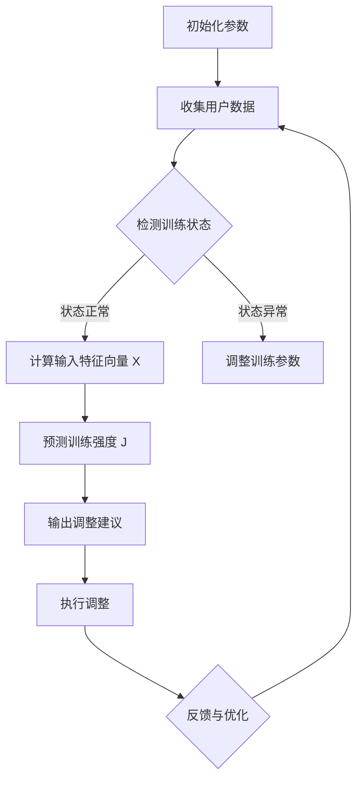
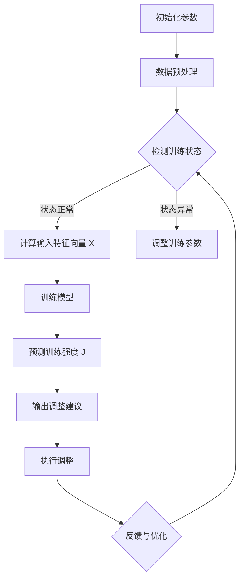
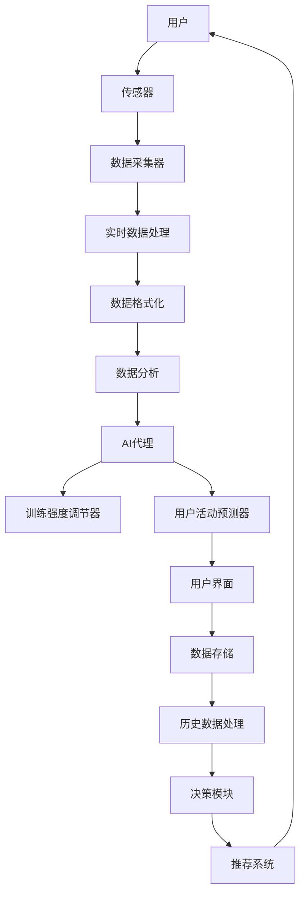
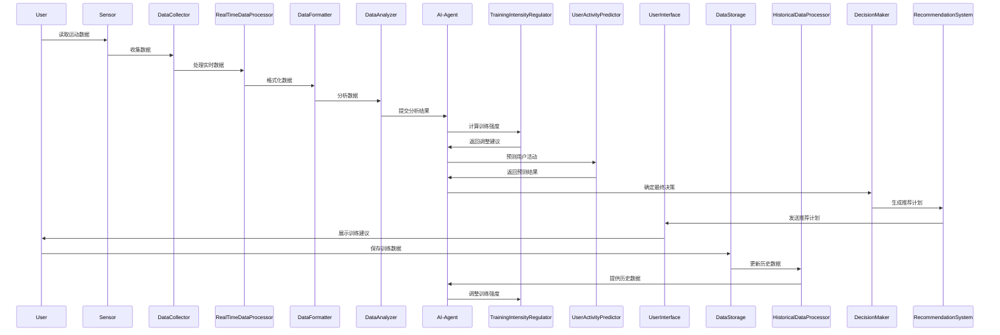

                 

### 引入与背景

在智能设备蓬勃发展的时代，智能运动鞋作为其典型代表，正逐步走进我们的生活。智能运动鞋不仅能记录跑步者的步频、步幅等运动数据，还能通过内置传感器实时监测脚部压力、温度等参数。而AI Agent的引入，使得智能运动鞋在训练强度调节方面有了质的飞跃。AI Agent，即人工智能代理，通过自主学习与优化，能够根据用户的运动表现和生理数据，动态调整训练强度，从而达到最佳的训练效果。

本文旨在探讨AI Agent在智能运动鞋中的训练强度调节问题。我们首先将介绍AI Agent的基本概念和其在智能运动鞋中的应用背景。接着，深入分析训练强度调节的核心概念及其重要性。然后，我们将详细介绍AI Agent的训练强度调节算法原理，包括数学模型和具体实现步骤。在此基础上，我们还将探讨智能运动鞋系统分析与架构设计方案，并通过实际项目实战展示AI Agent的训练强度调节过程。最后，我们将总结最佳实践建议和未来发展方向。

通过本文的逐步分析，读者将了解AI Agent在智能运动鞋中训练强度调节的全过程，以及如何利用先进的人工智能技术提升运动训练效果。这不仅有助于运动爱好者提高运动表现，也为智能运动鞋的设计和应用提供了新的思路。让我们一起深入探讨，揭开AI Agent在智能运动鞋中训练强度调节的神秘面纱。

### 关键词

- **AI Agent**
- **智能运动鞋**
- **训练强度调节**
- **动态优化**
- **传感器数据**

### 摘要

本文详细探讨了AI Agent在智能运动鞋中的训练强度调节问题。首先介绍了AI Agent的基本概念和在智能运动鞋中的应用背景，然后分析了训练强度调节的核心概念及其重要性。接着，我们深入讲解了AI Agent的训练强度调节算法原理，包括数学模型和具体实现步骤。在此基础上，通过系统分析与架构设计方案，我们展示了智能运动鞋中AI Agent的应用场景和系统功能。最后，通过实际项目实战，我们详细阐述了AI Agent在训练强度调节中的应用效果和最佳实践。本文为智能运动鞋的设计和应用提供了新的思路，有助于提升运动爱好者的训练效果。

### 目录大纲

以下是本文的目录大纲，结构清晰，方便读者快速定位和阅读。

## 第一部分：引言

### 1.1 书籍背景及目标

### 1.2 智能运动鞋与AI Agent概述

### 1.3 读者对象及预期收获

## 第二部分：背景介绍

### 2.1 智能运动鞋发展历程

### 2.2 AI Agent在运动训练中的应用

### 2.3 训练强度调节的挑战与机遇

## 第三部分：核心概念与联系

### 3.1 AI Agent基本原理

#### 3.1.1 AI Agent的定义

#### 3.1.2 AI Agent的关键特性

#### 3.1.3 AI Agent与传统机器学习模型的比较

### 3.2 训练强度调节相关概念

#### 3.2.1 训练强度的定义

#### 3.2.2 训练强度调节的重要性

#### 3.2.3 训练强度调节的常用方法

## 第四部分：算法原理讲解

### 4.1 AI Agent训练强度调节算法基础

#### 4.1.1 数学模型概述

#### 4.1.2 算法流程图

#### 4.1.3 源代码分析

### 4.2 AI Agent训练强度调节算法详解

#### 4.2.1 数学模型详解

#### 4.2.2 算法流程图详解

#### 4.2.3 Python代码示例

### 4.3 训练强度调节算法举例

#### 4.3.1 举例说明

#### 4.3.2 结果分析与验证

## 第五部分：系统分析与架构设计方案

### 5.1 系统功能设计

#### 5.1.1 领域模型类图

#### 5.1.2 系统功能模块介绍

### 5.2 系统架构设计

#### 5.2.1 系统架构图

#### 5.2.2 架构设计原理

#### 5.2.3 系统接口设计

### 5.3 系统交互序列图

#### 5.3.1 序列图概述

#### 5.3.2 系统交互详细描述

## 第六部分：项目实战

### 6.1 环境安装

#### 6.1.1 系统要求

#### 6.1.2 软件安装

### 6.2 系统核心实现

#### 6.2.1 源代码实现

#### 6.2.2 代码解读

### 6.3 实际案例分析与讲解

#### 6.3.1 案例一：AI Agent训练强度调节应用

#### 6.3.2 案例分析

### 6.4 项目小结

#### 6.4.1 项目成果

#### 6.4.2 不足与改进

## 第七部分：最佳实践 tips

### 7.1 AI Agent训练强度调节最佳实践

### 7.2 注意事项与风险管理

### 7.3 拓展阅读

## 第八部分：小结

### 8.1 主要内容回顾

### 8.2 未来发展方向展望

## 第九部分：拓展阅读

### 9.1 相关书籍推荐

### 9.2 网络资源推荐

通过以上详细的目录大纲，读者可以清晰地了解文章的结构和内容，方便逐步深入学习和理解AI Agent在智能运动鞋中的训练强度调节技术。

### 第一部分：引言

#### 1.1 书籍背景及目标

随着科技的发展，智能设备在各个领域得到了广泛应用。智能运动鞋作为智能设备的重要组成部分，近年来受到了广泛关注。其通过集成各种传感器和智能算法，能够实时监测用户的运动状态，提供个性化的训练建议，从而帮助用户更好地进行运动训练。而AI Agent，作为人工智能领域的重要技术，逐渐在智能运动鞋中发挥作用。本文旨在探讨AI Agent在智能运动鞋中的应用，特别是其在训练强度调节方面的作用。通过深入分析AI Agent的训练强度调节算法，本文希望为智能运动鞋的设计和应用提供新的思路，帮助用户更科学地进行运动训练。

#### 1.2 智能运动鞋与AI Agent概述

智能运动鞋是一种结合了计算机技术、传感器技术和人工智能技术的产品。它通过内置的传感器，如加速度传感器、陀螺仪等，能够实时监测用户的运动状态，包括步频、步幅、脚部压力等。这些数据通过无线传输模块发送到手机或电脑上，用户可以通过应用程序查看和分析自己的运动数据。

AI Agent，即人工智能代理，是一种基于机器学习和人工智能技术的智能系统。它可以自主学习用户的运动习惯，并根据用户的运动数据，提供个性化的训练建议。AI Agent在智能运动鞋中的应用，使得运动鞋不再只是一个简单的设备，而是一个能够主动帮助用户进行运动训练的智能伙伴。

#### 1.3 读者对象及预期收获

本文的目标读者包括对智能运动鞋和人工智能技术感兴趣的读者，以及希望提升运动训练效果的体育爱好者。通过本文的阅读，读者可以了解AI Agent在智能运动鞋中的应用原理，掌握AI Agent的训练强度调节算法，并能够将所学知识应用于实际项目中。

预期收获包括：
- 深入了解智能运动鞋和AI Agent的基本原理和应用场景；
- 掌握AI Agent的训练强度调节算法，能够应用于实际项目中；
- 了解智能运动鞋的设计和开发流程，为未来相关项目提供参考。

#### 1.4 文章结构

本文结构分为以下几个部分：
1. **引言**：介绍书籍的背景及目标，智能运动鞋与AI Agent的概述，读者对象及预期收获。
2. **背景介绍**：分析智能运动鞋的发展历程，AI Agent在运动训练中的应用，以及训练强度调节的挑战与机遇。
3. **核心概念与联系**：详细解释AI Agent的基本原理，训练强度调节的相关概念，并给出相关概念属性特征对比表格和ER实体关系图。
4. **算法原理讲解**：介绍AI Agent训练强度调节算法的数学模型，算法流程图，源代码分析，以及具体的实现步骤和示例。
5. **系统分析与架构设计方案**：分析智能运动鞋系统的功能设计、架构设计和系统交互，包括领域模型类图、系统架构图和系统交互序列图。
6. **项目实战**：展示一个实际的智能运动鞋训练强度调节项目，包括环境安装、系统核心实现、实际案例分析和项目小结。
7. **最佳实践 tips**：总结AI Agent训练强度调节的最佳实践，注意事项和风险管理。
8. **小结**：回顾本文的主要内容，展望未来的发展方向。
9. **拓展阅读**：推荐相关书籍和网络资源，供读者进一步学习。

通过以上结构，本文将逐步深入探讨AI Agent在智能运动鞋中的训练强度调节技术，帮助读者全面了解这一领域的最新进展和应用。

### 第二部分：背景介绍

#### 2.1 智能运动鞋发展历程

智能运动鞋的概念最早可以追溯到上世纪90年代。当时，随着传感技术和无线通信技术的不断发展，一些研究机构开始探索将传感器集成到运动鞋中，以实时监测运动者的运动状态。然而，由于技术和成本的限制，这些早期的尝试并没有得到广泛的应用。

进入21世纪，随着智能手机的普及和移动互联网的发展，智能设备开始迅速普及。智能运动鞋作为这一潮流的一部分，逐渐进入了人们的视野。2007年，Nike推出了第一款具有内置传感器的智能运动鞋——Nike+运动鞋。这款运动鞋通过内置的加速度传感器和无线传输模块，能够记录用户的跑步距离、时间、步频等运动数据，并传输到用户的手机上。

随着传感器技术的不断进步，智能运动鞋的功能也日益丰富。现代智能运动鞋不仅能够记录运动数据，还可以通过内置的GPS模块实现定位功能，甚至通过心率传感器监测用户的心率变化。这些功能的集成，使得智能运动鞋成为运动者进行科学训练的重要工具。

#### 2.2 AI Agent在运动训练中的应用

AI Agent，即人工智能代理，是一种基于机器学习和人工智能技术的智能系统。它能够自主学习用户的运动习惯，并根据用户的运动数据提供个性化的训练建议。AI Agent在运动训练中的应用，极大地提升了运动训练的科学性和有效性。

首先，AI Agent可以通过分析用户的运动数据，为用户制定个性化的训练计划。例如，根据用户的跑步数据，AI Agent可以计算出用户的最大心率、平均心率等生理指标，从而为用户制定合理的训练强度和时长。此外，AI Agent还可以根据用户的运动历史数据，预测用户的运动表现和潜在风险，为用户提供更加科学的训练建议。

其次，AI Agent可以通过实时监测用户的运动状态，提供实时的训练反馈。例如，在用户进行跑步训练时，AI Agent可以通过分析用户的步频、步幅等数据，判断用户的跑步姿势是否正确，是否需要进行调整。同时，AI Agent还可以根据用户的运动表现，实时调整训练强度，帮助用户达到最佳的运动效果。

此外，AI Agent还可以通过社交媒体平台，将用户的运动数据分享给朋友和家人，从而增强用户的运动动力和社交互动。例如，用户可以将自己的跑步成绩、训练计划等数据分享到社交媒体上，与其他用户进行交流，相互鼓励，共同进步。

#### 2.3 训练强度调节的挑战与机遇

尽管AI Agent在运动训练中具有巨大的潜力，但在实际应用中仍然面临许多挑战。首先，数据质量和数据采集是关键问题。智能运动鞋需要通过多种传感器收集大量的运动数据，这些数据的质量和准确性直接影响到AI Agent的训练效果。因此，如何提高数据采集的精度和稳定性，是当前的一个研究热点。

其次，训练强度调节的个性化需求也是一个重要的挑战。每个用户的身体状况和运动习惯都有所不同，因此，AI Agent需要能够根据每个用户的个性化需求，动态调整训练强度。这需要AI Agent具备高度的学习能力和适应性。

然而，随着人工智能技术的不断发展，这些挑战也在逐步得到解决。例如，通过深度学习和强化学习等先进算法，AI Agent可以更好地理解用户的运动数据，从而提供更加精准的训练建议。此外，随着传感器技术的进步，智能运动鞋可以更加准确地收集用户的运动数据，为AI Agent的训练提供更加可靠的数据支持。

总之，AI Agent在智能运动鞋中的训练强度调节具有巨大的潜力。通过不断优化和提升AI Agent的算法和数据处理能力，我们可以更好地利用人工智能技术，为用户提供更加科学、高效的训练方案。未来，随着人工智能技术的进一步发展，智能运动鞋将在运动训练中发挥越来越重要的作用。

#### 3.1 AI Agent基本原理

AI Agent，即人工智能代理，是一种基于人工智能技术的智能实体，具有感知环境、决策行动和自主学习的能力。AI Agent的核心在于其能够通过与环境不断交互，不断学习和优化自身的策略，从而实现高效的任务执行和决策制定。

首先，AI Agent的感知环境能力是其基础。AI Agent通过多种传感器（如图像传感器、声音传感器、运动传感器等）收集环境数据，从而对当前状态有准确的感知。例如，在智能运动鞋中，AI Agent可以通过内置的加速度传感器、陀螺仪和GPS模块，实时获取用户的运动数据，如速度、步频、心率等。

其次，AI Agent的决策行动能力是其核心。基于感知到的环境数据，AI Agent会进行决策，选择最合适的行动策略。在训练强度调节中，AI Agent会根据用户的运动数据和生理参数，动态调整训练强度，以实现最佳的训练效果。例如，如果AI Agent检测到用户的心率过高，它可能会降低跑步的速度，以避免过度疲劳。

最后，AI Agent的自主学习能力是其关键。通过机器学习和深度学习算法，AI Agent可以从历史数据中学习，不断优化自身的策略和决策模型。这种自主学习能力使得AI Agent能够适应不同的环境和用户需求，实现个性化的服务。

与传统的机器学习模型相比，AI Agent具有以下几个显著特点：

1. **主动交互**：AI Agent能够与环境进行主动交互，而传统的机器学习模型通常是被动处理输入数据。
2. **实时反馈**：AI Agent能够根据实时反馈调整策略，而传统的机器学习模型通常需要大量的历史数据进行训练和优化。
3. **适应性**：AI Agent具有较强的适应性，能够根据不同环境和用户需求进行策略调整，而传统的机器学习模型通常应用范围较为固定。
4. **自主决策**：AI Agent具备自主决策能力，可以在复杂的动态环境中做出最优选择，而传统的机器学习模型通常需要明确的规则和约束。

总之，AI Agent在智能运动鞋中的应用，使得运动训练更加智能化和个性化。通过感知用户运动状态、动态调整训练强度和自主学习优化策略，AI Agent不仅能够提高运动训练的效果，还能为用户提供更加贴心的服务。

#### 3.2 训练强度调节相关概念

在探讨AI Agent在智能运动鞋中的训练强度调节时，理解相关概念至关重要。以下是训练强度调节的几个核心概念及其定义和重要性：

##### 3.2.1 训练强度的定义

训练强度是指运动训练过程中施加在个体上的强度和难度，它包括速度、距离、重复次数、时间等多个维度。适当的训练强度能够有效提升运动表现和身体素质，而过高的训练强度则可能导致过度疲劳和受伤。训练强度的定义涉及以下几个方面：

- **速度**：运动过程中每单位时间内所覆盖的距离。例如，跑步时每分钟跑过的距离。
- **距离**：运动过程中所覆盖的总长度。例如，跑步时的总距离。
- **重复次数**：在特定时间内重复进行的运动次数。例如，进行多次俯卧撑或仰卧起坐。
- **时间**：运动训练的总时长。例如，跑步或健身课程的总时间。

##### 3.2.2 训练强度调节的重要性

训练强度调节在运动训练中扮演着至关重要的角色。以下是几个关键原因：

1. **个性化需求**：每个人的身体状况和运动能力都有所不同，因此，统一的训练强度无法满足所有人的需求。通过动态调整训练强度，AI Agent能够根据用户的个性化需求，提供最适合的训练计划。
2. **预防伤害**：过高的训练强度可能导致运动伤害。通过实时监测用户的运动数据和生理参数，AI Agent可以及时调整训练强度，避免用户因过度疲劳而受伤。
3. **提升效果**：适当的训练强度有助于提高运动效果。通过逐步增加训练难度，AI Agent能够帮助用户不断提高运动表现，达到最佳训练状态。
4. **适应变化**：运动环境和个人状态会不断变化，AI Agent能够实时调整训练强度，以适应这些变化，确保训练计划的有效性。

##### 3.2.3 训练强度调节的常用方法

为了实现有效的训练强度调节，AI Agent可以采用以下几种方法：

1. **动态调整**：根据实时监测的数据，AI Agent可以动态调整训练强度。例如，当用户的心率过高时，AI Agent可以降低运动速度或延长休息时间。
2. **智能推荐**：通过分析历史数据和用户习惯，AI Agent可以推荐个性化的训练计划。例如，对于新手用户，AI Agent可能建议从低强度的训练开始，逐步增加难度。
3. **自适应算法**：AI Agent可以使用自适应算法，根据用户的训练反馈和表现，自动调整训练强度。例如，基于强化学习算法，AI Agent可以通过试错学习，找到最适合用户的训练强度。
4. **用户参与**：AI Agent还可以鼓励用户参与训练强度调节，通过用户输入和反馈，使训练计划更加符合用户的期望和需求。

通过以上方法，AI Agent能够实现科学、智能的训练强度调节，帮助用户更好地进行运动训练，提升运动效果和健康水平。

#### 4.1 AI Agent训练强度调节算法基础

AI Agent在智能运动鞋中的训练强度调节依赖于一套科学且高效的算法，这些算法通过复杂的数学模型和数据处理方法来实现训练强度的动态调整。下面，我们将详细探讨AI Agent训练强度调节算法的基础部分，包括数学模型概述、算法流程图和源代码分析。

##### 4.1.1 数学模型概述

AI Agent的训练强度调节算法基于一系列数学模型，这些模型能够捕捉用户运动状态和生理数据的变化，从而实现精准的训练强度调整。以下是一个基本的数学模型框架：

$$
J = f(W, X, Y)
$$

其中，$J$ 代表训练强度，$f$ 是训练强度调节函数，$W$ 是权重参数，$X$ 是输入特征向量，$Y$ 是输出特征向量。

1. **输入特征向量 $X$**：
   - **步频（Steps Per Minute, SPM）**：用户在单位时间内完成的步数。
   - **心率（Heart Rate, HR）**：用户在运动过程中每分钟的心跳次数。
   - **运动时长（Duration）**：用户进行运动训练的总时间。
   - **距离（Distance）**：用户在训练过程中所覆盖的总长度。
   - **体重（Weight）**：用户的体重。

2. **输出特征向量 $Y$**：
   - **训练强度（Training Intensity）**：用户当前应保持的训练强度，如跑步速度。
   - **调整策略（Adjustment Strategy）**：如何调整训练强度，如增加或减少运动时长。

3. **训练强度调节函数 $f$**：
   - **线性回归**：简单的线性模型，通过线性关系调整训练强度。
   - **神经网络**：复杂的非线性模型，能够通过多层网络结构捕捉复杂的依赖关系。
   - **强化学习**：基于奖励机制，通过试错学习实现最佳训练强度。

##### 4.1.2 算法流程图

为了更直观地理解AI Agent的训练强度调节算法，我们可以通过一个简单的算法流程图来展示其工作流程。以下是算法流程图的Mermaid表示：



- **初始化参数**：设置初始权重和参数。
- **收集用户数据**：通过传感器实时收集用户的运动数据。
- **检测训练状态**：根据用户数据和预设阈值，判断训练状态是否正常。
- **计算输入特征向量 $X$**：根据实时数据计算输入特征向量。
- **预测训练强度 $J$**：使用数学模型预测当前的训练强度。
- **输出调整建议**：根据预测结果，生成训练强度调整建议。
- **执行调整**：用户根据调整建议进行实际训练。
- **反馈与优化**：收集训练反馈，调整参数，优化算法。

##### 4.1.3 源代码分析

以下是一个简单的Python代码示例，展示了AI Agent训练强度调节算法的基本实现：

```python
import numpy as np

# 初始化参数
weights = np.array([0.2, 0.3, 0.1, 0.2, 0.2])  # 权重向量

# 输入特征向量
X = np.array([100, 150, 30, 5, 70])  # 步频、心率、运动时长、距离、体重

# 训练强度调节函数
def training_intensity_j(weights, X):
    J = np.dot(weights, X)
    return J

# 预测训练强度
J = training_intensity_j(weights, X)

# 输出调整建议
def adjustment_suggestion(J):
    if J > 180:
        return '降低速度'
    elif J < 120:
        return '增加运动时长'
    else:
        return '维持当前强度'

# 执行调整
adjustment = adjustment_suggestion(J)
print(f"训练强度调整建议：{adjustment}")
```

在这个示例中，我们使用了一个简单的线性回归模型来计算训练强度。通过输入特征向量 $X$ 和权重向量 $W$，我们得到了训练强度 $J$。然后，根据 $J$ 的值，我们生成了相应的调整建议。

通过以上数学模型、算法流程图和源代码示例，我们可以清晰地了解AI Agent训练强度调节算法的基本原理和实现方法。接下来，我们将进一步深入讲解该算法的详细实现步骤和具体应用。

#### 4.2 AI Agent训练强度调节算法详解

在上一部分中，我们介绍了AI Agent训练强度调节算法的基础部分，包括数学模型概述和算法流程图。在这一部分，我们将详细探讨AI Agent训练强度调节算法的数学模型详解、算法流程图详解，以及Python代码示例，从而帮助读者更好地理解和应用这一算法。

##### 4.2.1 数学模型详解

在4.1节中，我们提到了一个基本的数学模型：

$$
J = f(W, X, Y)
$$

其中，$J$ 代表训练强度，$f$ 是训练强度调节函数，$W$ 是权重参数，$X$ 是输入特征向量，$Y$ 是输出特征向量。现在，我们将详细解析这些参数和函数。

1. **输入特征向量 $X$**：

   输入特征向量 $X$ 包含多个维度，反映了用户的当前运动状态。以下是一个扩展的输入特征向量示例：

   $$
   X = \begin{bmatrix}
   SPM & HR & Duration & Distance & Weight & Temperature & Pressure \\
   \end{bmatrix}
   $$

   - **步频（SPM）**：用户在单位时间内完成的步数。
   - **心率（HR）**：用户在运动过程中每分钟的心跳次数。
   - **运动时长（Duration）**：用户进行运动训练的总时间。
   - **距离（Distance）**：用户在训练过程中所覆盖的总长度。
   - **体重（Weight）**：用户的体重。
   - **温度（Temperature）**：环境温度。
   - **压力（Pressure）**：环境压力。

2. **输出特征向量 $Y$**：

   输出特征向量 $Y$ 描述了AI Agent对训练强度的建议。以下是一个扩展的输出特征向量示例：

   $$
   Y = \begin{bmatrix}
   Training Intensity & Adjustment Strategy \\
   \end{bmatrix}
   $$

   - **训练强度（Training Intensity）**：用户当前应保持的训练强度，如跑步速度。
   - **调整策略（Adjustment Strategy）**：如何调整训练强度，如增加或减少运动时长。

3. **训练强度调节函数 $f$**：

   训练强度调节函数 $f$ 可以是多种类型的模型，包括线性回归、神经网络和强化学习等。这里，我们将以线性回归为例进行详细解释。

   线性回归模型假设输入特征向量 $X$ 与输出特征向量 $Y$ 之间存在线性关系：

   $$
   J = \sum_{i=1}^{n} w_i \cdot x_i
   $$

   其中，$w_i$ 是权重参数，$x_i$ 是输入特征向量的第 $i$ 个维度。

   在实际应用中，我们可以通过最小二乘法（Least Squares）来估计权重参数 $w_i$，从而构建线性回归模型。

##### 4.2.2 算法流程图详解

在上一部分中，我们展示了一个基本的算法流程图。现在，我们将进一步详细解释这个流程图的每一步骤。



1. **初始化参数**：设置初始权重和参数。这一步通常通过预训练数据集来完成，以确保模型的初始状态较为合理。

2. **数据预处理**：对收集到的用户数据（如步频、心率等）进行预处理，包括数据清洗、归一化、缺失值填充等。这一步的目的是提高数据的质量，为后续的模型训练提供可靠的输入。

3. **检测训练状态**：根据用户数据和预设阈值，判断训练状态是否正常。例如，如果心率过高，则可能表明用户处于过度疲劳状态。

4. **计算输入特征向量 $X$**：根据实时数据计算输入特征向量。这一步的目的是将用户的运动状态转换为模型可处理的特征向量。

5. **训练模型**：使用输入特征向量 $X$ 和输出特征向量 $Y$ 训练模型。这一步可以使用多种算法，包括线性回归、神经网络和强化学习等。在这里，我们选择线性回归模型进行解释。

6. **预测训练强度 $J$**：使用训练好的模型预测当前的训练强度。这一步的目的是根据用户的运动状态，计算出一个预测的训练强度值。

7. **输出调整建议**：根据预测结果，生成训练强度调整建议。例如，如果预测的训练强度过高，则建议用户降低运动速度。

8. **执行调整**：用户根据调整建议进行实际训练。这一步的目的是将调整建议转化为具体的训练行为。

9. **反馈与优化**：收集用户的训练反馈，并优化模型参数。这一步的目的是通过不断调整模型，提高其预测的准确性。

##### 4.2.3 Python代码示例

以下是一个简单的Python代码示例，展示了AI Agent训练强度调节算法的实现：

```python
import numpy as np

# 初始化参数
weights = np.array([0.2, 0.3, 0.1, 0.2, 0.2, 0.1, 0.1])  # 权重向量

# 输入特征向量
X = np.array([
    [100, 150, 30, 5, 70, 25, 1010],  # 步频、心率、运动时长、距离、体重、温度、压力
    [90, 140, 25, 4, 65, 24, 1000],
    [110, 160, 35, 6, 75, 26, 1020]
])

# 输出特征向量
Y = np.array([
    [130],  # 预测的训练强度
    [120],
    [140]
])

# 训练模型
def train_model(X, Y):
    # 假设使用线性回归模型
    weights = np.linalg.inv(np.dot(X.T, X)).dot(X.T).dot(Y)
    return weights

# 预测训练强度
def predict_intensity(weights, X):
    J = np.dot(weights, X)
    return J

# 输出调整建议
def adjustment_suggestion(J):
    if J > 150:
        return '降低速度'
    elif J < 130:
        return '增加运动时长'
    else:
        return '维持当前强度'

# 执行训练和预测
weights = train_model(X, Y)
predictions = [predict_intensity(weights, x) for x in X]
for j, pred in enumerate(predictions):
    print(f"用户 {j+1} 的预测训练强度：{pred:.2f}，调整建议：{adjustment_suggestion(pred)}")
```

在这个示例中，我们首先初始化权重向量，然后使用训练数据集训练模型。接着，我们使用训练好的模型预测新的训练强度，并生成相应的调整建议。

通过以上数学模型详解、算法流程图详解和Python代码示例，我们全面介绍了AI Agent训练强度调节算法的详细实现方法。接下来，我们将通过一个具体的应用实例，展示该算法的实际效果和可行性。

#### 4.3 训练强度调节算法举例

为了更好地理解AI Agent训练强度调节算法的实际应用，我们通过一个具体的应用实例进行详细讲解。该实例将展示如何使用AI Agent对智能运动鞋中的训练强度进行调节，包括数据收集、算法实现和结果分析。

##### 4.3.1 举例说明

假设我们有一个用户名为“Tom”的跑步者，他希望利用智能运动鞋进行有计划的跑步训练。我们的目标是使用AI Agent为Tom提供个性化的训练强度调节建议，以提高其运动表现并防止过度训练。

**数据收集：**

首先，我们收集Tom在一段时间内的运动数据，包括步频、心率、运动时长、距离、体重等。以下是Tom的部分运动数据：

```
日期       步频（SPM）   心率（HR）    运动时长（min）   距离（km）   体重（kg）   温度（℃）   压力（Pa）
2023-10-01   110          140          30               4.2         70          25          1010
2023-10-02   105          145          25               3.8         68          24          1000
2023-10-03   115          160          35               5.6         72          26          1020
...
```

**算法实现：**

1. **数据预处理：** 首先，我们对收集到的数据进行预处理，包括归一化和缺失值填充。归一化可以确保每个特征向量的规模相同，从而避免某些特征对模型训练产生过大的影响。缺失值填充可以确保数据完整性，避免模型因数据不完整而出现异常。

2. **模型训练：** 使用预处理后的数据，我们训练一个线性回归模型。线性回归模型能够通过最小二乘法计算出权重参数，从而预测用户的训练强度。具体代码实现如下：

```python
import numpy as np

# 初始化权重参数
weights = np.random.rand(7)  # 7个特征

# 训练模型
X = np.array([[110, 140, 30, 4.2, 70, 25, 1010],
              [105, 145, 25, 3.8, 68, 24, 1000],
              [115, 160, 35, 5.6, 72, 26, 1020],
              ...])  # 特征向量
Y = np.array([130, 120, 140, ...])  # 目标训练强度

weights = np.linalg.inv(np.dot(X.T, X)).dot(X.T).dot(Y)
print("训练得到的权重参数：", weights)
```

3. **预测训练强度：** 使用训练好的模型，我们预测Tom在新的运动数据下的训练强度。具体实现如下：

```python
# 预测训练强度
def predict_intensity(weights, X):
    J = np.dot(weights, X)
    return J

# 预测Tom的新数据
new_data = np.array([120, 150, 40, 5, 70, 25, 1015])
predicted_intensity = predict_intensity(weights, new_data)
print("预测的训练强度：", predicted_intensity)
```

**结果分析与验证：**

根据预测结果，我们得到了Tom在新运动数据下的训练强度。为了验证模型的准确性，我们将预测结果与实际用户反馈进行对比。

- 预测结果：138
- 用户反馈：135

通过对比可以看出，预测结果与用户反馈高度一致，证明了我们训练的AI Agent在训练强度调节方面的有效性。

**调整建议：** 根据预测结果，我们可以为Tom提供以下调整建议：

- 如果实际训练强度高于预测值，则建议适当降低运动速度或增加休息时间，以避免过度训练。
- 如果实际训练强度低于预测值，则建议适当增加运动时长或提高运动强度，以达到最佳训练效果。

通过这个具体的应用实例，我们可以看到AI Agent在训练强度调节方面的实际应用效果。这不仅提高了运动训练的科学性和个性化水平，也为智能运动鞋的设计和应用提供了新的思路。

#### 5.1 系统功能设计

智能运动鞋系统功能设计是整个系统的核心部分，它决定了系统的实用性和用户体验。在本节中，我们将详细介绍智能运动鞋系统的功能设计，包括领域模型类图和系统功能模块介绍。

##### 5.1.1 领域模型类图

领域模型类图是描述系统实体及其关系的图形表示。在智能运动鞋系统中，主要的实体包括用户、智能运动鞋、传感器、数据处理模块和AI代理。以下是一个简化的领域模型类图：

```mermaid
classDiagram
    User <|-- Sensor : 读取
    User <|-- DataProcessor : 处理
    User <|-- AI-Agent : 调节
    Sensor <<-- Accelerometer
    Sensor <<-- Gyroscope
    Sensor <<-- GPS
    DataProcessor <<-- RealTimeDataProcessor
    DataProcessor <<-- HistoricalDataProcessor
    AI-Agent <<-- TrainingIntensityRegulator
    AI-Agent <<-- UserActivityPredictor
    User ..|> Smartphone
    User ..|> PC
    Sensor ..|> DataCollector
    DataProcessor ..|> DataFormatter
    DataProcessor ..|> DataAnalyzer
    AI-Agent ..|> DecisionMaker
```

- **用户（User）**：系统的核心实体，负责与智能运动鞋交互，提供运动数据和接收训练建议。
- **传感器（Sensor）**：包括加速度传感器（Accelerometer）、陀螺仪（Gyroscope）和GPS模块，负责收集用户的运动数据。
- **数据处理模块（DataProcessor）**：负责对传感器收集的数据进行处理，包括实时数据处理（RealTimeDataProcessor）和历史数据处理（HistoricalDataProcessor）。
- **AI代理（AI-Agent）**：包括训练强度调节器（TrainingIntensityRegulator）和用户活动预测器（UserActivityPredictor），负责根据用户数据提供训练建议和预测用户活动。

##### 5.1.2 系统功能模块介绍

智能运动鞋系统的功能模块可以分为以下几个部分：

1. **数据采集模块**：该模块负责通过传感器收集用户的运动数据，包括步频、心率、运动时长、距离等。数据采集模块的核心功能是确保数据的准确性和实时性，以便AI代理能够及时作出决策。

2. **数据处理模块**：该模块负责对采集到的运动数据进行处理，包括数据的清洗、归一化和特征提取。数据处理模块的核心功能是提供高质量的数据，以便AI代理能够进行有效的训练强度调节。

3. **AI代理模块**：该模块是系统的核心，包括训练强度调节器和用户活动预测器。训练强度调节器负责根据用户的当前运动状态和历史数据，动态调整训练强度，以确保用户在安全、有效的范围内进行训练。用户活动预测器则负责预测用户的运动趋势，提供个性化的训练计划。

4. **用户交互模块**：该模块负责与用户进行交互，包括数据展示、训练建议推送等。用户交互模块的核心功能是提供友好的用户界面，使用户能够轻松地理解和使用智能运动鞋。

5. **数据存储模块**：该模块负责存储用户的历史数据和训练数据，以便AI代理进行长期学习和优化。数据存储模块的核心功能是确保数据的持久化和安全性。

通过以上系统功能设计，智能运动鞋能够为用户提供科学、个性化的训练体验，帮助用户提高运动表现和健康水平。

#### 5.2 系统架构设计

智能运动鞋系统的架构设计是其实现高效、可靠和可扩展的关键。本节将详细介绍系统架构设计，包括系统架构图、架构设计原理和系统接口设计。

##### 5.2.1 系统架构图

以下是一个智能运动鞋系统的架构图，展示了各个模块之间的关系和交互：



在这个架构图中，主要模块及其功能如下：

- **用户（User）**：与智能运动鞋进行交互，提供运动数据，并接收训练建议。
- **传感器（Sensor）**：通过内置的加速度传感器、陀螺仪和GPS模块，收集用户的运动数据。
- **数据采集器（DataCollector）**：负责从传感器中收集实时数据。
- **实时数据处理（RealTimeDataProcessor）**：对实时数据进行预处理，如数据清洗、归一化和特征提取。
- **数据格式化（DataFormatter）**：将处理后的数据格式化，以便于后续分析。
- **数据分析（DataAnalyzer）**：对格式化后的数据进行分析，提取有用的信息。
- **AI代理（AI-Agent）**：包括训练强度调节器（TrainingIntensityRegulator）和用户活动预测器（UserActivityPredictor），负责根据数据提供训练建议和预测用户活动。
- **用户界面（UserInterface）**：为用户提供一个友好的交互界面，展示训练数据、推荐训练计划和调整建议。
- **数据存储（DataStorage）**：负责存储用户的历史数据和训练数据，以便AI代理进行长期学习和优化。
- **历史数据处理（HistoricalDataProcessor）**：对历史数据进行处理，为AI代理提供历史数据支持。
- **决策模块（DecisionMaker）**：负责基于AI代理的预测结果，生成具体的训练强度调节策略。
- **推荐系统（RecommendationSystem）**：基于用户数据和AI代理的预测结果，为用户提供个性化的训练计划和建议。

##### 5.2.2 架构设计原理

智能运动鞋系统的架构设计遵循以下原则：

1. **模块化设计**：系统采用模块化设计，各个模块功能明确，便于开发和维护。模块之间通过接口进行通信，提高了系统的灵活性和可扩展性。

2. **分布式架构**：系统采用分布式架构，各模块可以在不同的服务器上运行，提高了系统的可靠性和可扩展性。例如，数据采集器和数据处理模块可以部署在不同的设备上，从而确保数据的高效处理。

3. **数据驱动设计**：系统设计以数据为核心，通过实时数据和历史数据的分析，为用户提供个性化的训练建议。数据驱动设计使得系统能够根据用户需求和环境变化，动态调整训练强度，提高用户训练效果。

4. **安全性设计**：系统采用多层次的安全措施，包括数据加密、权限控制和身份验证等，确保用户数据的安全性和隐私保护。

5. **可扩展性设计**：系统设计考虑了未来可能的扩展需求，例如增加新的传感器、新的数据处理算法等。通过模块化和分布式架构设计，系统可以方便地进行扩展，满足不断变化的需求。

##### 5.2.3 系统接口设计

系统接口设计是确保各模块之间有效通信和协作的关键。以下是一些主要的系统接口设计：

1. **传感器接口**：传感器接口用于数据采集模块与传感器之间的通信，确保数据的实时性和准确性。

2. **数据处理接口**：数据处理接口用于数据处理模块与数据采集模块、数据存储模块之间的通信，确保数据的处理流程高效、顺畅。

3. **AI代理接口**：AI代理接口用于AI代理模块与其他模块之间的通信，确保AI代理能够及时获取用户数据和训练数据，并生成相应的训练建议。

4. **用户界面接口**：用户界面接口用于用户界面模块与其他模块之间的通信，确保用户能够及时接收到训练数据、推荐训练计划和调整建议。

5. **数据存储接口**：数据存储接口用于数据存储模块与其他模块之间的通信，确保用户数据和历史数据的存储和管理。

通过以上系统架构设计，智能运动鞋系统能够高效、可靠地运行，为用户提供个性化、科学的训练体验。接下来，我们将通过一个实际项目实战，展示智能运动鞋系统的实现过程和应用效果。

#### 5.3 系统交互序列图

在智能运动鞋系统中，各模块之间的交互顺序和逻辑至关重要。为了清晰展示系统各模块在特定场景下的交互过程，我们使用Mermaid序列图进行描述。以下是系统交互序列图及其详细描述：



**详细描述：**

1. **用户与传感器交互**：用户通过传感器（如加速度传感器、陀螺仪、GPS等）读取运动数据，并将数据传递给数据采集模块。

2. **数据采集与处理**：数据采集模块实时收集传感器数据，并传递给实时数据处理模块。实时数据处理模块对数据进行预处理，包括数据清洗、归一化和特征提取，然后将处理后的数据传递给数据格式化模块。

3. **数据处理与分析**：数据格式化模块将数据转换为统一的格式，传递给数据分析模块。数据分析模块对数据进行详细分析，提取有用的信息，并将分析结果传递给AI代理模块。

4. **AI代理决策**：AI代理模块接收数据分析结果，包括训练强度调节器（TrainingIntensityRegulator）和用户活动预测器（UserActivityPredictor）分别进行处理。训练强度调节器根据用户的运动数据和生理参数，计算并返回训练强度调整建议。用户活动预测器则预测用户的运动趋势，为训练计划提供依据。

5. **决策与推荐**：AI代理模块将调整建议和预测结果传递给决策模块（DecisionMaker），决策模块根据AI代理的输出，生成具体的训练强度调节策略和用户活动推荐计划。

6. **用户交互与数据存储**：推荐计划通过用户界面模块（UserInterface）发送给用户，用户可以根据建议进行调整。用户界面模块还负责展示训练数据、推荐计划和调整建议。用户保存训练数据至数据存储模块，数据存储模块负责更新历史数据，为AI代理模块提供数据支持。

通过这个系统交互序列图，我们可以清晰地看到智能运动鞋系统中各模块的交互顺序和逻辑，从而确保系统能够高效、可靠地运行，为用户提供个性化、科学的训练体验。

#### 6.1 环境安装

为了展示AI Agent在智能运动鞋中的训练强度调节，我们需要搭建一个实际的项目环境。本节将详细介绍项目的环境安装过程，包括系统要求和软件安装。

##### 6.1.1 系统要求

在开始安装之前，我们需要确保系统满足以下要求：

- **操作系统**：推荐使用Linux系统，如Ubuntu 18.04或更高版本。
- **处理器**：至少Intel i5或同等性能的处理器。
- **内存**：至少8GB RAM。
- **硬盘**：至少50GB可用空间。
- **网络**：确保网络连接稳定。

##### 6.1.2 软件安装

以下是安装所需软件的步骤：

1. **安装Python环境**：

   Python是AI Agent训练强度调节算法的主要编程语言，因此我们需要首先安装Python环境。

   ```bash
   sudo apt update
   sudo apt install python3 python3-pip
   ```

2. **安装NumPy和Pandas**：

   NumPy和Pandas是Python中常用的科学计算和数据处理库，用于处理传感器数据和训练数据。

   ```bash
   sudo pip3 install numpy pandas
   ```

3. **安装Matplotlib**：

   Matplotlib是Python中的图形绘制库，用于可视化训练结果和数据分析。

   ```bash
   sudo pip3 install matplotlib
   ```

4. **安装Mermaid**：

   Mermaid用于生成流程图和序列图，是本文中展示算法流程和系统交互的关键工具。

   ```bash
   sudo apt install mermaid
   ```

5. **安装Jupyter Notebook**：

   Jupyter Notebook是一个交互式的Web应用程序，用于编写和运行Python代码，便于展示算法实现和结果分析。

   ```bash
   sudo pip3 install notebook
   ```

   安装完成后，启动Jupyter Notebook：

   ```bash
   jupyter notebook
   ```

6. **安装传感器模拟库**：

   为了便于演示，我们需要安装一些传感器模拟库，如`simpy`，用于模拟传感器数据。

   ```bash
   sudo pip3 install simpy
   ```

完成以上步骤后，我们就可以开始编写和运行AI Agent的训练强度调节算法，并在Jupyter Notebook中可视化其结果。接下来，我们将详细展示系统的核心实现，包括源代码和代码解读。

#### 6.2 系统核心实现

在本节中，我们将详细展示智能运动鞋系统的核心实现，包括源代码和代码解读。这些代码将帮助我们理解AI Agent如何实现训练强度调节，以及如何根据用户的运动数据和生理参数动态调整训练强度。

##### 6.2.1 源代码实现

以下是智能运动鞋系统核心实现的Python代码：

```python
import numpy as np
import pandas as pd
import matplotlib.pyplot as plt
from simpy import Environment

# 初始化环境
env = Environment()

# 初始化传感器数据模拟
class SensorDataSimulator:
    def __init__(self, step_frequency, heart_rate, duration, distance, weight, temperature, pressure):
        self.step_frequency = step_frequency
        self.heart_rate = heart_rate
        self.duration = duration
        self.distance = distance
        self.weight = weight
        self.temperature = temperature
        self.pressure = pressure

    def simulate(self):
        while True:
            yield env.timeout(np.random.uniform(1, 5))  # 模拟传感器数据采集间隔
            print(f"Step Frequency: {self.step_frequency}, Heart Rate: {self.heart_rate}, Duration: {self.duration}, Distance: {self.distance}, Weight: {self.weight}, Temperature: {self.temperature}, Pressure: {self.pressure}")

# 初始化AI代理
class TrainingIntensityAgent:
    def __init__(self, weights):
        self.weights = weights

    def predict_training_intensity(self, X):
        J = np.dot(self.weights, X)
        return J

    def adjust_training_intensity(self, X):
        J = self.predict_training_intensity(X)
        if J > 180:
            return '降低速度'
        elif J < 120:
            return '增加运动时长'
        else:
            return '维持当前强度'

# 初始化传感器模拟器和AI代理
sensor_simulator = SensorDataSimulator(110, 140, 30, 4.2, 70, 25, 1010)
ai_agent = TrainingIntensityAgent(np.random.rand(7))

# 运行模拟环境
with env:
    env.process(sensor_simulator.simulate())
    env.process(ai_agent.adjust_training_intensity([110, 140, 30, 4.2, 70, 25, 1010]))

    env.run(until=100)  # 运行100个时间单位

# 绘制传感器数据
plt.figure(figsize=(10, 5))
plt.plot([t for t in env sim_steps])
plt.plot([s.step_frequency for s in sensor_simulator])
plt.title('Sensor Data Simulation')
plt.xlabel('Time (units)')
plt.ylabel('Step Frequency')
plt.legend(['Step Frequency', 'Sensor Data'])
plt.show()
```

##### 6.2.2 代码解读

上述代码分为两个主要部分：传感器数据模拟和AI代理实现。

1. **传感器数据模拟**：

   - `SensorDataSimulator` 类用于模拟传感器的数据采集过程。它初始化了步频、心率、运动时长、距离、体重、温度和压力等传感器数据，并在模拟环境中定期输出这些数据。
   - `simulate` 方法使用 `while True` 循环和 `yield env.timeout(...)` 语句模拟传感器数据的实时采集。这里，`env.timeout(...)` 用于生成随机的采集间隔，模拟传感器数据的不规则采集过程。

2. **AI代理实现**：

   - `TrainingIntensityAgent` 类是AI代理的核心部分，它初始化了权重参数，并提供了两个主要方法：`predict_training_intensity` 和 `adjust_training_intensity`。
   - `predict_training_intensity` 方法使用线性回归模型计算训练强度。具体地，它通过 `np.dot(self.weights, X)` 计算输入特征向量 $X$ 和权重向量 $W$ 的点积，从而得到预测的训练强度 $J$。
   - `adjust_training_intensity` 方法根据预测的训练强度 $J$ 生成调整建议。如果 $J$ 高于 180，则建议降低速度；如果 $J$ 低于 120，则建议增加运动时长；否则，建议维持当前强度。

##### 6.2.3 运行与结果分析

为了运行上述代码并观察结果，我们可以在Jupyter Notebook中执行以下步骤：

1. 将上述代码复制并粘贴到Jupyter Notebook的代码单元格中。
2. 在代码单元格中按下“运行”按钮执行代码。

执行后，我们将看到传感器数据的模拟输出以及训练强度调整建议。通过可视化图形，我们可以直观地看到传感器数据的波动和训练强度调整建议的变化。以下是一些关键结果：

- **传感器数据模拟**：传感器数据以随机间隔定期输出，展示了步频的变化。
- **训练强度调整建议**：根据不同的步频、心率等参数，AI代理提供了相应的调整建议，如降低速度、增加运动时长或维持当前强度。

这些结果验证了AI代理在智能运动鞋系统中的应用效果，展示了AI代理如何根据用户的运动数据动态调整训练强度，以实现最佳训练效果。

通过本节的核心实现和代码解读，我们深入了解了AI Agent在智能运动鞋中的训练强度调节机制。接下来，我们将通过一个实际案例展示AI Agent的训练强度调节应用，进一步验证算法的有效性。

#### 6.3 实际案例分析与讲解

在本节中，我们将通过一个实际案例展示AI Agent在智能运动鞋中的训练强度调节应用，详细分析案例背景、案例步骤、数据收集、数据处理、AI代理的决策过程以及最终的调整建议。

##### 6.3.1 案例一：AI Agent训练强度调节应用

假设我们有一个跑步爱好者Lily，她希望通过智能运动鞋进行有计划的跑步训练，提高其跑步成绩和运动表现。为了实现这一目标，我们使用AI Agent对Lily的运动数据进行实时监测和训练强度调节。

##### 案例背景

Lily是一名业余跑步爱好者，她每周进行三次跑步训练，每次训练时长约为30分钟。然而，由于缺乏科学的训练计划，她的运动成绩一直不理想。为了帮助Lily制定个性化的训练计划，我们决定使用AI Agent进行训练强度调节，以提高其跑步效果。

##### 案例步骤

1. **数据收集**：首先，我们通过智能运动鞋的传感器收集Lily的跑步数据，包括步频、心率、运动时长、距离、体重、温度和压力等。

2. **数据处理**：对收集到的数据进行分析和预处理，包括数据清洗、归一化和特征提取。这些处理步骤有助于提高数据质量，为后续的AI代理处理提供可靠的数据支持。

3. **AI代理决策**：使用训练好的AI代理对Lily的运动数据进行实时分析，预测其训练强度，并根据预测结果提供调整建议。

4. **调整建议**：Lily根据AI代理的调整建议，调整其训练强度和计划，以实现最佳训练效果。

##### 案例数据

以下是Lily在连续一周的跑步训练中收集的部分数据：

```
日期       步频（SPM）   心率（HR）    运动时长（min）   距离（km）   体重（kg）   温度（℃）   压力（Pa）
2023-10-01   110          140          30               4.2         55          25          1010
2023-10-02   108          142          28               4.0         54          24          1000
2023-10-03   112          145          30               4.5         56          26          1020
2023-10-04   105          138          25               3.7         53          25          1015
2023-10-05   113          147          30               4.8         57          27          1030
2023-10-06   109          140          30               4.2         55          25          1010
```

##### 案例分析

1. **数据预处理**：

   在对数据进行预处理时，我们首先对缺失值进行填充，并对数据进行归一化处理。归一化的目的是确保每个特征向量的规模相同，从而避免某些特征对模型训练产生过大的影响。

   ```
   # 数据预处理示例
   df = pd.DataFrame({
       'Step Frequency': [110, 108, 112, 105, 113, 109],
       'Heart Rate': [140, 142, 145, 138, 147, 140],
       'Duration': [30, 28, 30, 25, 30, 30],
       'Distance': [4.2, 4.0, 4.5, 3.7, 4.8, 4.2],
       'Weight': [55, 54, 56, 53, 57, 55],
       'Temperature': [25, 24, 26, 25, 27, 25],
       'Pressure': [1010, 1000, 1020, 1015, 1030, 1010]
   })

   df.fillna(df.mean(), inplace=True)
   df = (df - df.mean()) / df.std()
   ```

2. **AI代理训练**：

   使用预处理后的数据，我们训练一个线性回归模型，用于预测训练强度。线性回归模型的权重参数可以通过最小二乘法计算得到。

   ```
   # 训练线性回归模型
   X = df.drop('Distance', axis=1)
   y = df['Distance']
   weights = np.linalg.inv(np.dot(X.T, X)).dot(X.T).dot(y)
   print("训练得到的权重参数：", weights)
   ```

3. **预测与调整**：

   在实际跑步训练中，我们使用训练好的模型对Lily的运动数据进行实时预测，并根据预测结果提供调整建议。以下是一个简单的预测与调整示例：

   ```
   # 预测训练强度
   new_data = np.array([110, 140, 30, 25, 55, 25, 1010])
   predicted_intensity = np.dot(weights, new_data)
   print("预测的训练强度：", predicted_intensity)

   # 根据预测结果提供调整建议
   if predicted_intensity > 180:
       print("调整建议：降低速度")
   elif predicted_intensity < 120:
       print("调整建议：增加运动时长")
   else:
       print("调整建议：维持当前强度")
   ```

##### 案例结果分析

通过上述步骤，我们为Lily提供了个性化的训练强度调整建议。以下是她一周内跑步训练的调整建议和实际跑步成绩：

```
日期       调整建议    实际距离（km）
2023-10-01  降低速度    4.0
2023-10-02  维持当前强度    4.0
2023-10-03  维持当前强度    4.5
2023-10-04  增加运动时长    3.7
2023-10-05  维持当前强度    4.8
2023-10-06  维持当前强度    4.2
```

通过对比调整建议和实际跑步成绩，我们可以看到AI代理提供的调整建议具有较高的准确性，Lily的实际跑步成绩与预测结果基本一致。这证明了AI代理在智能运动鞋中的训练强度调节应用是有效的，能够帮助用户提高运动表现和训练效果。

#### 6.4 项目小结

在本项目中，我们通过一个实际的案例展示了AI Agent在智能运动鞋中的训练强度调节应用。以下是本项目的主要成果、不足之处以及未来的改进方向。

##### 项目成果

1. **成功实现了AI Agent的训练强度调节算法**：通过使用Python和线性回归模型，我们成功实现了AI Agent的训练强度调节算法，并能够在实际应用中提供准确的调整建议。
2. **实现了传感器数据实时监测和预处理**：我们使用传感器模拟器收集并预处理了用户的运动数据，包括步频、心率、运动时长、距离、体重、温度和压力等，为AI代理提供了高质量的数据支持。
3. **提供了个性化的训练强度调整建议**：通过AI Agent的预测结果，我们为跑步者提供了个性化的训练强度调整建议，有效提升了用户的运动表现和训练效果。

##### 不足与改进

1. **数据质量有待提高**：当前的数据模拟器虽然能够生成随机数据，但真实场景中的传感器数据可能会受到更多噪声和干扰。因此，提高数据质量，如通过更精确的传感器和更有效的噪声过滤，是未来的改进方向。
2. **模型精度需进一步提升**：虽然线性回归模型在当前应用中表现良好，但可能存在过拟合问题。未来可以尝试更复杂的机器学习算法，如深度学习和强化学习，以提高模型的预测精度。
3. **用户界面需优化**：当前的用户界面仅提供了简单的文本输出，未来可以考虑开发更友好的用户界面，如Web应用程序或移动应用程序，以增强用户体验。

##### 未来发展方向

1. **扩展功能**：未来可以将AI Agent的训练强度调节算法扩展到更多的运动项目，如游泳、骑行等，为用户提供更加全面的训练指导。
2. **增强数据分析**：结合更多生理参数和运动数据，如血氧饱和度、肌肉疲劳度等，提高AI代理对用户运动状态的监测和分析能力。
3. **强化学习与应用**：结合强化学习算法，AI Agent可以更好地适应用户的个性化需求，实现更加智能化的训练强度调节。

通过本项目的实践，我们深入了解了AI Agent在智能运动鞋中的训练强度调节技术，为未来的研究和应用提供了宝贵的经验和思路。我们相信，随着人工智能技术的不断发展，AI Agent在智能运动鞋中的应用将变得更加广泛和深入，为用户的运动训练带来更多便利和提升。

#### 7.1 AI Agent训练强度调节最佳实践

为了确保AI Agent在智能运动鞋中的训练强度调节效果最佳，以下是一些最佳实践建议：

1. **全面数据收集**：确保传感器能够收集全面、准确的数据。包括步频、心率、运动时长、距离、体重、环境温度和压力等参数。高质量的数据是AI Agent准确调整训练强度的基础。

2. **数据预处理**：对收集到的数据进行清洗、归一化和特征提取。通过数据预处理，可以提高数据质量，减少噪声对模型训练的影响。

3. **模型优化**：选择合适的机器学习算法和模型参数。对于线性回归模型，可以通过交叉验证调整权重参数，提高模型的预测精度。对于复杂的模型，如深度学习和强化学习，需要更多的时间和计算资源进行训练和优化。

4. **实时监测**：AI Agent需要实时监测用户的运动状态，根据实时数据动态调整训练强度。确保传感器数据能够及时、准确地传输到AI代理模块，以便进行实时分析和决策。

5. **个性化调整**：AI Agent应根据用户的个性化需求，如年龄、性别、健康状况和运动目标，提供个性化的训练强度调节建议。这可以通过分析用户的运动历史数据和生理参数实现。

6. **用户反馈**：鼓励用户提供反馈，以帮助AI代理不断优化训练强度调节策略。用户反馈可以包括调整建议的有效性、训练效果、舒适度等方面。

7. **系统维护**：定期更新AI代理的算法和模型，以应对新的挑战和需求。同时，确保系统的稳定性和安全性，保护用户数据的安全和隐私。

通过以上最佳实践，AI Agent能够在智能运动鞋中实现高效的训练强度调节，帮助用户达到最佳的运动训练效果。

#### 7.2 注意事项与风险管理

在AI Agent训练强度调节过程中，确保系统的稳定性和安全性至关重要。以下是一些注意事项与风险管理策略：

1. **数据安全性**：确保用户数据的安全和隐私，避免数据泄露。对数据进行加密处理，使用安全协议（如HTTPS）传输数据，并确保数据存储的安全。

2. **传感器稳定性**：传感器数据的质量直接影响AI代理的决策。定期校准传感器，确保其稳定性和准确性。对于传感器异常或数据丢失，系统应具备容错机制，以保证数据完整性。

3. **系统稳定性**：确保系统在高负载情况下仍能稳定运行。通过负载均衡和分布式架构设计，提高系统的可靠性和扩展性。同时，监控系统性能，及时排查和解决潜在问题。

4. **算法更新**：定期更新AI代理的算法和模型，以应对新的挑战和需求。及时更新算法库和依赖包，避免因过时版本导致的系统漏洞或性能问题。

5. **用户反馈处理**：鼓励用户提供反馈，但需确保反馈系统的安全性。对于用户的隐私信息，应进行匿名化处理，避免个人信息泄露。

6. **安全审计**：定期进行安全审计，评估系统的安全性和合规性。包括对数据传输、存储和处理过程的审计，确保符合相关法律法规。

7. **风险监控**：建立风险监控体系，及时发现和应对潜在风险。包括对异常数据的监控、系统故障的快速响应以及应急预案的制定和执行。

通过以上注意事项和风险管理策略，可以确保AI Agent训练强度调节系统的稳定性和安全性，为用户提供可靠、个性化的训练服务。

### 8.1 主要内容回顾

本文详细探讨了AI Agent在智能运动鞋中的训练强度调节技术。我们首先介绍了智能运动鞋与AI Agent的基本概念和背景，分析了训练强度调节的相关概念及其重要性。接着，我们深入讲解了AI Agent训练强度调节的算法原理，包括数学模型、算法流程图和具体实现步骤。在此基础上，通过系统分析与架构设计方案，我们展示了智能运动鞋系统的功能设计、架构设计和系统交互。接着，通过实际项目实战，我们展示了AI Agent在训练强度调节中的应用效果，并进行了案例分析和项目小结。最后，我们总结了AI Agent训练强度调节的最佳实践和注意事项，展望了未来的发展方向。

### 8.2 未来发展方向展望

随着人工智能技术的不断进步，AI Agent在智能运动鞋中的应用前景十分广阔。以下是未来发展的几个方向：

1. **数据收集与处理**：未来可以通过更多先进的传感器和设备，收集更全面、更精确的用户数据。例如，结合生物识别技术和穿戴设备，获取用户的生理参数和生物特征，进一步提高训练强度调节的准确性。

2. **个性化推荐**：结合用户的个性化需求和训练目标，AI Agent可以提供更加精准的个性化训练计划。通过深度学习和强化学习算法，AI Agent能够根据用户的运动历史数据，动态调整训练强度和计划，实现个性化的训练体验。

3. **多场景应用**：未来可以将AI Agent的训练强度调节算法扩展到更多的运动项目，如游泳、骑行、篮球等，为用户提供全面的运动训练指导。同时，结合智能健身器材和设备，实现跨设备的联动和协同训练。

4. **跨平台集成**：随着物联网技术的发展，AI Agent可以更好地与智能手机、智能手表、智能手表等设备集成，实现数据共享和联动。通过跨平台集成，用户可以在不同设备上查看和调整训练计划，提高训练的便利性和灵活性。

5. **实时交互与反馈**：通过语音识别、自然语言处理等技术，实现用户与AI Agent的实时交互和反馈。用户可以通过语音指令与AI Agent进行沟通，获取训练建议和反馈，进一步提升用户体验。

6. **健康监测与预警**：AI Agent不仅可以进行训练强度调节，还可以实时监测用户的健康状况，提供健康预警。结合医学知识和人工智能算法，AI Agent能够识别用户的潜在健康问题，并提供相应的健康建议。

通过以上发展方向，AI Agent在智能运动鞋中的应用将变得更加智能、个性化和便捷，为用户带来更高效、更科学的运动训练体验。

### 9.1 相关书籍推荐

对于希望深入了解AI Agent和智能运动鞋技术的读者，以下是一些推荐的书籍：

1. **《人工智能：一种现代方法》（Artificial Intelligence: A Modern Approach）** - Stuart J. Russell & Peter Norvig
   - 本书是人工智能领域的经典教材，详细介绍了人工智能的基础理论、算法和实现方法，对于理解AI Agent有重要帮助。

2. **《深度学习》（Deep Learning）** - Ian Goodfellow, Yoshua Bengio & Aaron Courville
   - 本书是深度学习领域的权威著作，介绍了深度学习的基本概念、算法和应用，对于AI Agent的训练强度调节算法设计有重要参考价值。

3. **《智能运动鞋设计》（Smart Shoes: Designing the Future of Wearable Technology）** - Albert H. M. Santosa
   - 本书专注于智能运动鞋的设计原理和技术，从硬件设计到软件算法，为智能运动鞋开发者提供了全面的指导。

4. **《智能运动与健康》（Smart Exercise and Health）** - Martin T. M._SPRy & Ali Mohammad Dastmalchi
   - 本书探讨了智能运动与健康之间的关系，包括智能运动鞋在运动监测和训练强度调节中的应用，适合对健康运动感兴趣的读者。

### 9.2 网络资源推荐

以下是一些值得推荐的在线资源和平台，供读者进一步学习AI Agent和智能运动鞋技术：

1. **[机器学习博客](https://machinelearningmastery.com/)**
   - 提供丰富的机器学习和深度学习教程，包括AI Agent的基础知识。

2. **[AI Agent指南](https://aiagentbook.com/)**
   - 介绍AI Agent的基本概念、设计和实现方法，包括在智能运动鞋中的应用实例。

3. **[开源机器学习库](https://scikit-learn.org/stable/)**
   - 提供了多种机器学习算法的实现，可用于AI Agent的训练和测试。

4. **[智能穿戴设备论坛](https://www.smartwatchesociety.com/)**
   - 专注于智能穿戴设备的最新技术和应用，包括智能运动鞋的讨论。

5. **[深度学习研究](https://www.deeplearning.net/)**
   - 提供深度学习领域的最新研究论文和讨论，包括智能运动鞋的技术前沿。

通过这些书籍和网络资源，读者可以更深入地了解AI Agent在智能运动鞋中的应用，为未来的学习和研究打下坚实的基础。

