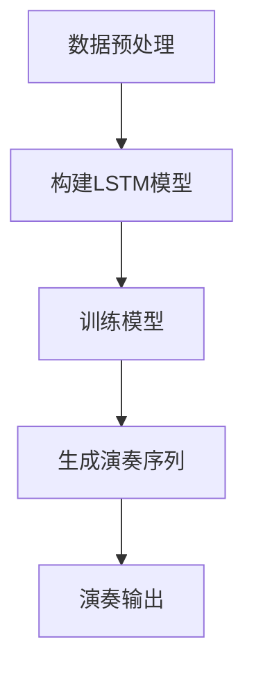
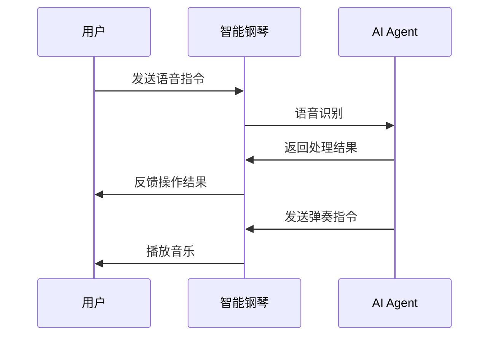

                 

### 文章标题

### 《AI Agent在智能钢琴中的弹奏技巧分析》

### 文章关键词

- AI Agent
- 智能钢琴
- 弹奏算法
- 交互设计
- 项目实战
- 未来发展趋势

### 摘要

本文旨在深入探讨AI Agent在智能钢琴中的应用，特别是其弹奏技巧。首先，我们将介绍AI Agent的基础理论和智能钢琴的技术基础，然后详细分析AI Agent在智能钢琴中的角色和应用。接着，我们将重点剖析AI Agent弹奏算法的原理，并通过数学模型和Python代码实现进行讲解。此外，文章还将讨论智能钢琴中AI Agent的交互设计，并进行项目实战展示。最后，文章将展望AI Agent在智能钢琴中的未来发展趋势，并提出最佳实践和小结。

----------------------------------------------------------------

## 目录大纲

### 《AI Agent在智能钢琴中的弹奏技巧分析》

### 关键词：AI Agent、智能钢琴、弹奏算法、交互设计、项目实战、未来发展趋势

### 摘要：本文系统地分析了AI Agent在智能钢琴中的应用，从基础理论、技术应用、算法原理到项目实战，全面探讨了AI Agent如何提升智能钢琴的弹奏技巧和用户体验。

----------------------------------------------------------------

### 第一部分: AI Agent基础理论

### 第一部分的目标是介绍AI Agent的基本概念、历史发展、核心特点、分类及其应用领域，为后续内容打下基础。

## 第1章: AI Agent概述

### 1.1 AI Agent的定义与历史发展

#### **定义与历史发展**

AI Agent，即人工智能代理，是指能够在一定环境和规则下自主行动、进行决策和学习的计算机程序。AI Agent的概念源于20世纪70年代的智能代理理论，最初用于模拟人类在复杂环境中的行为。随着人工智能技术的飞速发展，AI Agent的应用范围逐渐扩大，从简单的任务执行到复杂的决策支持，成为人工智能领域的重要研究方向。

#### **AI Agent的发展历程**

- **早期研究：** 1970年代，AI Agent理论开始兴起，最初的研究主要集中在如何使计算机程序在简单环境中执行任务。
- **成熟阶段：** 1980年代至1990年代，随着人工智能技术的进步，AI Agent逐渐应用于更复杂的任务，如路径规划、环境建模和决策支持。
- **当前趋势：** 当前，AI Agent已广泛应用于智能家居、智能交通、智能医疗等领域，展现出巨大的潜力。

#### **AI Agent的核心特点**

AI Agent具有以下核心特点：

- **自主性：** AI Agent能够根据环境和规则自主行动，不需要人为干预。
- **适应性：** AI Agent能够根据环境变化进行学习和适应，提高任务执行效率。
- **智能性：** AI Agent具备一定的智能能力，能够进行复杂的决策和问题解决。
- **灵活性：** AI Agent能够适应不同的任务和环境，具有较高的通用性。

### 1.2 AI Agent的核心特点

#### **AI Agent的核心特点**

AI Agent的核心特点可以从以下几个方面进行阐述：

- **自主决策：** AI Agent能够在没有人为干预的情况下，根据环境信息和预定的规则自主做出决策。
- **学习与适应：** AI Agent具备学习能力，能够通过历史数据和反馈信息不断优化决策和行为。
- **任务多样性：** AI Agent能够处理多种类型和复杂度的任务，具有广泛的应用前景。
- **交互能力：** AI Agent能够与人类或其他系统进行交互，实现协同工作。

### 1.3 AI Agent的分类

AI Agent可以根据不同的分类标准进行分类，常见的分类方法包括：

- **基于任务：** 根据AI Agent执行的任务类型，可分为任务代理、数据代理、交互代理等。
- **基于智能：** 根据AI Agent的智能水平，可分为弱AI Agent、强AI Agent和超智能AI Agent。
- **基于环境：** 根据AI Agent执行任务的环境类型，可分为室内代理、户外代理、网络代理等。

### 1.4 AI Agent的应用领域

AI Agent在众多领域展现出强大的应用潜力，以下是一些主要的应用领域：

- **智能家居：** AI Agent可以控制家居设备，实现自动化管理和远程控制。
- **智能交通：** AI Agent可以用于交通调度、自动驾驶和智能导航。
- **智能医疗：** AI Agent可以辅助医生进行诊断、治疗和健康管理。
- **智能教育：** AI Agent可以提供个性化的学习方案和智能辅导。
- **金融服务：** AI Agent可以用于风险管理、投资决策和客户服务。

### **总结**

本章对AI Agent的基本概念、历史发展、核心特点、分类和应用领域进行了详细阐述。AI Agent作为一种具有自主性、适应性、智能性和灵活性的计算机程序，在多个领域展现出了广泛的应用前景。了解AI Agent的基本理论将为后续章节的分析提供坚实的理论基础。

----------------------------------------------------------------

## 第2章: 智能钢琴技术基础

### 2.1 智能钢琴的定义与工作原理

#### **智能钢琴的定义**

智能钢琴是一种融合了传统钢琴演奏技巧和现代人工智能技术的钢琴。它不仅保留了传统钢琴的音色和手感，还通过内置的传感器、计算机算法和交互系统，实现自动弹奏、音色调整、教学辅导等功能。智能钢琴的出现，为音乐爱好者提供了更多学习、创作和享受音乐的方式。

#### **智能钢琴的工作原理**

智能钢琴的工作原理主要涉及以下几个关键部分：

1. **传感器：** 智能钢琴内置各种传感器，如力敏传感器、位置传感器和声音传感器，用于检测钢琴演奏者的手指位置、力度和声音。
2. **计算机算法：** 传感器采集的数据会被传递到内置的计算机处理器，通过复杂的算法进行分析和处理，生成相应的音色和节奏。
3. **音源库：** 智能钢琴内置丰富的音源库，包括各种乐器的音色和演奏技巧，为用户提供了多样化的选择。
4. **交互系统：** 智能钢琴通过触摸屏、声音和手势等交互方式，实现用户与钢琴的实时互动。

#### **智能钢琴的关键技术**

智能钢琴的关键技术包括：

- **传感器技术：** 智能钢琴的传感器技术是其核心，直接影响到音色和手感的准确性。
- **计算机算法：** 计算机算法决定了智能钢琴的自动弹奏和教学功能，是实现智能化的重要基础。
- **音源库：** 丰富的音源库为用户提供了多样的选择，增加了智能钢琴的娱乐性和实用性。
- **交互系统：** 交互系统使得智能钢琴能够更好地满足用户需求，提供个性化服务。

#### **智能钢琴的发展历程**

智能钢琴的发展历程可以追溯到20世纪末。以下是智能钢琴的主要发展节点：

- **2000年代初期：** 智能钢琴的初步研发，主要功能是自动弹奏和音色调整。
- **2005年：** 第一台具有智能教学功能的智能钢琴问世。
- **2010年代：** 随着人工智能技术的进步，智能钢琴的功能日益完善，开始广泛应用于音乐教育和娱乐领域。
- **当前：** 智能钢琴已经成为音乐爱好者和专业人士的重要工具，继续朝着智能化、个性化方向不断发展。

### **智能钢琴在音乐教育中的应用**

智能钢琴在音乐教育中具有广泛应用，主要表现在以下几个方面：

1. **自动弹奏与示范：** 智能钢琴能够自动弹奏各种曲目，为初学者提供示范，帮助他们更快地掌握演奏技巧。
2. **实时反馈与纠错：** 智能钢琴能够实时监测演奏者的弹奏状态，提供音准、节奏和手法的反馈，帮助用户纠正错误。
3. **个性化教学方案：** 根据用户的演奏水平和需求，智能钢琴可以提供个性化的教学方案，提高学习效果。
4. **互动教学：** 智能钢琴通过触摸屏和声音交互，实现与用户的实时互动，增加学习的趣味性和互动性。

### **总结**

本章对智能钢琴的定义、工作原理、关键技术、发展历程以及在音乐教育中的应用进行了详细阐述。智能钢琴作为一种融合了传统钢琴和现代人工智能技术的乐器，正在音乐教育和娱乐领域发挥着越来越重要的作用。了解智能钢琴的技术基础，有助于我们更好地理解AI Agent在智能钢琴中的应用和潜力。

----------------------------------------------------------------

### 第二部分: AI Agent在智能钢琴中的应用

### 第二部分的目标是深入探讨AI Agent在智能钢琴中的具体应用，包括其弹奏功能、教学功能、互动功能和辅助功能。

## 第3章: AI Agent在智能钢琴中的角色

### 3.1 AI Agent在智能钢琴中的弹奏功能

#### **AI Agent弹奏功能的概述**

AI Agent在智能钢琴中的弹奏功能是其核心应用之一，它通过深度学习和生成对抗网络等先进算法，实现了高水平的自动弹奏。AI Agent不仅可以自动演奏各种经典曲目，还能够根据用户的需求进行即兴创作。

#### **AI Agent弹奏算法的原理**

AI Agent弹奏算法主要基于深度学习和生成对抗网络（GAN）两大类模型。以下是这两种算法的基本原理：

1. **深度学习算法：** 深度学习算法通过训练大量的钢琴演奏数据，建立钢琴演奏的模型。在训练过程中，模型会不断优化参数，直到能够准确预测钢琴演奏的各种特征。
   
   - **卷积神经网络（CNN）：** CNN主要用于提取图像特征，但在音乐数据处理中也具有重要作用，可以用于提取音乐旋律特征。
   - **循环神经网络（RNN）：** RNN擅长处理序列数据，能够捕捉音乐中的时间和节奏信息。
   - **长短期记忆网络（LSTM）：** LSTM是RNN的一种变体，能够解决传统RNN的长期依赖问题，更适合音乐序列预测。

2. **生成对抗网络（GAN）：** GAN由生成器和判别器两个神经网络组成，生成器试图生成逼真的钢琴演奏数据，而判别器则判断生成数据是否真实。通过这种对抗训练，生成器能够不断提高生成数据的逼真度。

   - **生成器（Generator）：** 生成器的目标是生成逼真的钢琴演奏序列，通常采用RNN或LSTM结构。
   - **判别器（Discriminator）：** 判别器的任务是区分真实演奏数据和生成数据，通常也采用RNN或LSTM结构。

#### **AI Agent弹奏算法的流程**

AI Agent弹奏算法的流程通常包括以下几个步骤：

1. **数据预处理：** 对钢琴演奏数据进行清洗和预处理，包括去噪、归一化和特征提取。
2. **模型训练：** 使用预处理后的数据对深度学习模型进行训练，包括生成器和判别器的训练。
3. **生成演奏序列：** 通过训练好的模型生成钢琴演奏序列，可以是即兴创作或根据用户指定曲目进行演奏。
4. **演奏输出：** 将生成的演奏序列输出到智能钢琴，实现自动弹奏。

#### **示例**

假设我们有一个钢琴演奏数据集，包含1000首不同难度的曲目。我们可以使用深度学习算法对这1000首曲目进行训练，建立钢琴演奏模型。在训练过程中，模型会不断优化参数，直到能够准确预测钢琴演奏的各种特征。

例如，如果我们使用LSTM模型进行训练，输入数据是曲目的旋律序列，输出数据是相应的钢琴演奏序列。经过训练，模型可以学会如何根据旋律序列生成逼真的钢琴演奏。

以下是使用Python代码实现LSTM模型的基本框架：

```python
import tensorflow as tf
from tensorflow.keras.models import Sequential
from tensorflow.keras.layers import LSTM, Dense

# 数据预处理
# ...

# 构建LSTM模型
model = Sequential([
    LSTM(units=128, activation='tanh', input_shape=(timesteps, features)),
    LSTM(units=128, activation='tanh'),
    Dense(units=output_size, activation='softmax')
])

# 编译模型
model.compile(optimizer='adam', loss='categorical_crossentropy', metrics=['accuracy'])

# 训练模型
model.fit(x_train, y_train, epochs=50, batch_size=64, validation_data=(x_val, y_val))
```

通过这个示例，我们可以看到AI Agent弹奏算法的基本流程和实现方法。在实际应用中，AI Agent的弹奏功能可以根据不同的需求进行调整和优化，实现更高质量的自动弹奏。

### **总结**

本章介绍了AI Agent在智能钢琴中的弹奏功能，包括算法原理、流程和示例。AI Agent的弹奏功能通过深度学习和生成对抗网络等先进算法，实现了高水平的自动弹奏，为用户提供了丰富多样的音乐体验。

----------------------------------------------------------------

### 3.2 AI Agent在智能钢琴中的教学功能

#### **AI Agent教学功能的概述**

AI Agent在智能钢琴中的教学功能是其重要应用之一，它通过智能算法和大数据分析，为不同水平的用户提供个性化的教学方案。AI Agent能够实时监测用户的演奏状态，提供针对性的指导和反馈，提高学习效果。

#### **AI Agent教学功能的算法原理**

AI Agent教学功能的算法原理主要基于以下几个核心概念：

1. **行为树：** 行为树是一种用于描述和实现复杂行为的模型，通过一系列条件判断和动作执行，实现智能教学。

2. **强化学习：** 强化学习是一种通过试错和反馈优化行为策略的机器学习方法。在智能钢琴教学功能中，AI Agent通过强化学习算法，根据用户的演奏表现和反馈，不断调整教学策略。

3. **自然语言处理（NLP）：** 自然语言处理技术使得AI Agent能够理解用户的语言指令，提供个性化的教学建议和反馈。

#### **AI Agent教学功能的流程**

AI Agent教学功能的流程可以分为以下几个步骤：

1. **用户分析：** AI Agent通过分析用户的演奏数据，了解用户的学习水平和特点。
2. **制定教学方案：** 根据用户分析结果，AI Agent制定个性化的教学方案，包括曲目选择、练习目标和进度安排。
3. **实时反馈：** 在用户练习过程中，AI Agent实时监测用户的演奏状态，提供音准、节奏和手法的反馈。
4. **学习评估：** 在用户完成练习后，AI Agent对学习效果进行评估，并根据评估结果调整教学方案。

#### **AI Agent教学功能的案例**

假设有一个初学者，他的目标是学会弹奏《梦中的婚礼》。AI Agent首先会分析他的演奏数据，了解他的音准、节奏和手法等方面的情况。然后，AI Agent制定一个包含基础练习、分段学习和整体练习的教学方案，帮助他逐步掌握这首曲目。

在练习过程中，AI Agent会实时监测他的演奏状态，提供针对性的反馈。例如，如果他弹奏音准有偏差，AI Agent会提示他注意手指位置和力度；如果他弹奏节奏不准确，AI Agent会提示他练习节拍器。

在练习结束后，AI Agent会对他进行学习评估，根据评估结果调整教学方案。例如，如果他在整体练习中表现出色，AI Agent会为他增加难度更高的曲目；如果他某些方面表现不足，AI Agent会为他提供更多的练习建议。

以下是使用Python代码实现AI Agent教学功能的基本框架：

```python
import numpy as np
import tensorflow as tf

# 用户分析
# ...

# 制定教学方案
def create_lesson_plan(user_data):
    # 根据用户数据制定教学方案
    # ...
    return lesson_plan

# 实时反馈
def provide_feedback(user_data, lesson_plan):
    # 根据用户数据和教学方案提供反馈
    # ...
    return feedback

# 学习评估
def evaluate_learning(user_data, lesson_plan):
    # 根据用户数据和教学方案评估学习效果
    # ...
    return evaluation_result

# 调整教学方案
def adjust_lesson_plan(lesson_plan, evaluation_result):
    # 根据评估结果调整教学方案
    # ...
    return new_lesson_plan
```

通过这个示例，我们可以看到AI Agent教学功能的基本实现方法。在实际应用中，AI Agent的教学功能可以根据不同的需求进行调整和优化，为用户提供更好的学习体验。

### **总结**

本章介绍了AI Agent在智能钢琴中的教学功能，包括算法原理、流程和案例。AI Agent的教学功能通过智能算法和大数据分析，为不同水平的用户提供个性化的教学方案和实时反馈，提高了学习效果。了解AI Agent的教学功能，有助于我们更好地利用智能钢琴进行音乐学习。

----------------------------------------------------------------

### 3.3 AI Agent在智能钢琴中的互动功能

#### **AI Agent互动功能的概述**

AI Agent在智能钢琴中的互动功能是其吸引用户的重要因素之一。通过语音识别、自然语言处理和手势识别等技术，AI Agent能够与用户进行实时的互动，提供个性化服务，增加用户的参与感和体验。

#### **AI Agent互动功能的技术原理**

AI Agent互动功能的技术原理主要包括以下几个方面：

1. **语音识别：** 语音识别技术使得AI Agent能够理解用户的语音指令，如播放曲目、调整音量等。

2. **自然语言处理（NLP）：** 自然语言处理技术使得AI Agent能够理解用户的自然语言指令，提供更自然、更流畅的互动体验。

3. **手势识别：** 手势识别技术使得AI Agent能够识别用户的手势动作，如弹奏手势、点赞手势等，实现更直观的交互。

#### **AI Agent互动功能的流程**

AI Agent互动功能的流程可以分为以下几个步骤：

1. **语音识别与解析：** AI Agent通过语音识别技术获取用户的语音指令，然后使用自然语言处理技术对指令进行解析，提取关键信息。
2. **指令执行：** 根据解析结果，AI Agent执行相应的操作，如播放音乐、调整音量等。
3. **反馈与交互：** AI Agent在执行指令后，会提供反馈信息，如播放曲目列表、调整后的音量等，并与用户进行进一步的互动。

#### **AI Agent互动功能的案例**

假设用户通过语音指令请求播放一首曲目。AI Agent首先使用语音识别技术获取指令，然后使用自然语言处理技术解析指令，提取出曲目名称。接下来，AI Agent根据曲目名称查找并播放相应曲目。

在播放过程中，用户可以通过手势识别技术控制播放进度，如向前或向后跳过几秒。AI Agent会实时监测用户的手势，并在检测到手势时进行相应的操作。

以下是使用Python代码实现AI Agent互动功能的基本框架：

```python
import speech_recognition as sr
import pyttsx3

# 语音识别
def recognize_speech_from_mic(recognizer, microphone):
    # 使用语音识别库获取语音指令
    with microphone as source:
        audio = recognizer.listen(source)
    
    # 解析语音指令
    try:
        text = recognizer.recognize_google(audio)
    except sr.UnknownValueError:
        text = "抱歉，我没有听清您的指令。请重试。"
    
    return text

# 播放音乐
def play_music(music_name):
    # 使用语音合成库播放音乐
    engine = pyttsx3.init()
    engine.say("播放曲目：" + music_name)
    engine.runAndWait()

# 主程序
if __name__ == "__main__":
    # 初始化语音识别器
    recognizer = sr.Recognizer()
    microphone = sr.Microphone()
    
    # 获取语音指令
    command = recognize_speech_from_mic(recognizer, microphone)
    
    # 解析指令并播放音乐
    if "播放" in command:
        music_name = command.split("播放")[1].strip()
        play_music(music_name)
```

通过这个示例，我们可以看到AI Agent互动功能的基本实现方法。在实际应用中，AI Agent的互动功能可以根据不同的需求进行调整和优化，为用户提供更好的互动体验。

### **总结**

本章介绍了AI Agent在智能钢琴中的互动功能，包括技术原理、流程和案例。AI Agent的互动功能通过语音识别、自然语言处理和手势识别等技术，实现了与用户的实时互动，增加了用户的参与感和体验。了解AI Agent的互动功能，有助于我们更好地利用智能钢琴进行音乐互动。

----------------------------------------------------------------

### 3.4 AI Agent在智能钢琴中的辅助功能

#### **AI Agent辅助功能的概述**

AI Agent在智能钢琴中的辅助功能是其重要应用之一，它能够为用户提供各种辅助服务，如自动调音、练习管理、演奏记录等，从而提升用户的学习和演奏体验。

#### **AI Agent辅助功能的算法原理**

AI Agent辅助功能的算法原理主要基于以下技术：

1. **自动调音算法：** 自动调音算法通过分析钢琴的音色和频率，自动校正钢琴的音高，确保钢琴的音准。

2. **时间序列分析：** 时间序列分析技术用于分析用户的演奏记录，识别用户的进步和不足，提供针对性的练习建议。

3. **图像识别：** 图像识别技术用于识别用户的演奏手势，辅助自动调音和练习管理。

#### **AI Agent辅助功能的流程**

AI Agent辅助功能的流程可以分为以下几个步骤：

1. **数据采集：** AI Agent通过传感器和摄像头等设备采集用户的演奏数据，如音高、节奏和手势等。

2. **数据处理：** AI Agent对采集的数据进行处理，包括音高校正、节奏分析等。

3. **决策与执行：** 根据处理结果，AI Agent执行相应的辅助功能，如自动调音、练习管理、演奏记录等。

4. **反馈与优化：** AI Agent在执行辅助功能后，提供反馈信息，并根据用户反馈进行优化。

#### **AI Agent辅助功能的案例**

假设用户在练习一首曲目时，AI Agent会实时监测钢琴的音高，如果检测到音高偏差，AI Agent会自动调整钢琴的音高，确保音准。此外，AI Agent会记录用户的练习时间、弹奏错误和进步情况，并根据这些数据为用户生成练习计划，帮助用户更好地提高演奏水平。

以下是使用Python代码实现AI Agent辅助功能的基本框架：

```python
import cv2
import numpy as np

# 自动调音
def auto_tune(piano_notes):
    # 使用图像识别技术识别钢琴按键
    image = cv2.imread("piano_key.jpg")
    gray = cv2.cvtColor(image, cv2.COLOR_BGR2GRAY)
    ret, binary = cv2.threshold(gray, 128, 255, cv2.THRESH_BINARY_INV)
    
    # 获取按键位置
    contours, _ = cv2.findContours(binary, cv2.RETR_TREE, cv2.CHAIN_APPROX_SIMPLE)
    key_positions = [cv2.boundingRect(c) for c in contours]
    
    # 根据按键位置调整音高
    for position in key_positions:
        note = get_note_from_position(position)
        adjust_piano_note(note)
    
# 练习管理
def manage_practice(practice_data):
    # 分析练习数据，生成练习计划
    # ...
    return practice_plan

# 演奏记录
def record_performance(performance_data):
    # 记录演奏数据
    # ...
    return performance_report
```

通过这个示例，我们可以看到AI Agent辅助功能的基本实现方法。在实际应用中，AI Agent的辅助功能可以根据不同的需求进行调整和优化，为用户提供更好的辅助服务。

### **总结**

本章介绍了AI Agent在智能钢琴中的辅助功能，包括算法原理、流程和案例。AI Agent的辅助功能通过自动调音、练习管理和演奏记录等，提升了用户的学习和演奏体验。了解AI Agent的辅助功能，有助于我们更好地利用智能钢琴进行音乐学习和演奏。

----------------------------------------------------------------

### 第4章: AI Agent弹奏技巧的算法分析

#### **4.1 AI Agent弹奏算法概述**

AI Agent弹奏算法是智能钢琴的核心技术之一，它决定了智能钢琴的演奏效果。AI Agent弹奏算法主要基于深度学习和生成对抗网络等先进算法，通过大量的钢琴演奏数据进行训练，实现高水平的自动弹奏。以下将详细分析AI Agent弹奏算法的基本原理、数学模型和实现方法。

#### **4.2 算法原理讲解**

AI Agent弹奏算法的基本原理可以分为以下几个部分：

1. **数据预处理：** 首先，对钢琴演奏数据进行预处理，包括数据清洗、归一化和特征提取。预处理后的数据将用于训练和评估弹奏算法的性能。

2. **深度学习模型：** 使用深度学习模型对预处理后的数据进行训练，生成钢琴演奏的模型。常用的深度学习模型包括卷积神经网络（CNN）、循环神经网络（RNN）和长短期记忆网络（LSTM）等。

3. **生成对抗网络（GAN）：** 通过生成对抗网络（GAN）进行训练，生成逼真的钢琴演奏序列。GAN由生成器和判别器两个神经网络组成，生成器生成演奏序列，判别器判断生成序列的真实性。通过这种对抗训练，生成器能够不断提高生成序列的逼真度。

4. **模型评估与优化：** 使用测试集对训练好的模型进行评估，根据评估结果调整模型参数，优化弹奏效果。

#### **4.2.1 基于深度学习的弹奏算法**

基于深度学习的弹奏算法主要通过卷积神经网络（CNN）、循环神经网络（RNN）和长短期记忆网络（LSTM）等模型来实现。以下是这些模型的基本原理：

1. **卷积神经网络（CNN）：** CNN主要用于处理图像和音频等二维数据。在钢琴演奏数据中，CNN可以用于提取旋律特征，如图像中的边缘、纹理等。

2. **循环神经网络（RNN）：** RNN擅长处理序列数据，如文本和音乐等。在钢琴演奏数据中，RNN可以用于捕捉演奏序列中的时间和节奏信息。

3. **长短期记忆网络（LSTM）：** LSTM是RNN的一种变体，能够解决传统RNN的长期依赖问题，更适合音乐序列预测。

以下是一个基于LSTM的钢琴演奏生成算法的示例：

```python
import tensorflow as tf
from tensorflow.keras.models import Sequential
from tensorflow.keras.layers import LSTM, Dense

# 数据预处理
# ...

# 构建LSTM模型
model = Sequential([
    LSTM(units=128, activation='tanh', input_shape=(timesteps, features)),
    LSTM(units=128, activation='tanh'),
    Dense(units=output_size, activation='softmax')
])

# 编译模型
model.compile(optimizer='adam', loss='categorical_crossentropy', metrics=['accuracy'])

# 训练模型
model.fit(x_train, y_train, epochs=50, batch_size=64, validation_data=(x_val, y_val))
```

#### **4.2.2 基于生成对抗网络的弹奏算法**

生成对抗网络（GAN）是一种由生成器和判别器组成的对抗模型。生成器生成演奏序列，判别器判断生成序列的真实性。通过这种对抗训练，生成器能够不断提高生成序列的逼真度。

1. **生成器（Generator）：** 生成器的目标是生成逼真的钢琴演奏序列。通常，生成器采用RNN或LSTM结构，能够生成连续的演奏序列。

2. **判别器（Discriminator）：** 判别器的目标是判断生成序列是否真实。判别器通常也采用RNN或LSTM结构，能够对输入序列进行分类。

以下是一个基于GAN的钢琴演奏生成算法的示例：

```python
import tensorflow as tf
from tensorflow.keras.models import Model
from tensorflow.keras.layers import Input, LSTM, Dense

# 定义生成器
input_seq = Input(shape=(timesteps, features))
lstm = LSTM(units=128, activation='tanh')(input_seq)
output_seq = LSTM(units=128, activation='tanh')(lstm)
generator = Model(inputs=input_seq, outputs=output_seq)

# 定义判别器
discriminator_input = Input(shape=(timesteps, features))
discriminator_output = LSTM(units=128, activation='tanh')(discriminator_input)
discriminator_output = LSTM(units=128, activation='sigmoid')(discriminator_output)
discriminator = Model(inputs=discriminator_input, outputs=discriminator_output)

# 编译模型
generator.compile(optimizer='adam', loss='binary_crossentropy')
discriminator.compile(optimizer='adam', loss='binary_crossentropy')

# 训练模型
discriminator.fit(x_train, y_train, epochs=50, batch_size=64)
generator.fit(x_train, y_train, epochs=50, batch_size=64)
```

#### **4.2.3 其他弹奏算法介绍**

除了深度学习和生成对抗网络，还有其他一些算法可以用于钢琴演奏生成，如递归神经网络（RNN）、变分自编码器（VAE）等。以下是这些算法的基本原理：

1. **递归神经网络（RNN）：** RNN是一种基于时间序列数据的神经网络，能够捕捉数据中的时间和依赖关系。

2. **变分自编码器（VAE）：** VAE是一种基于概率模型的神经网络，能够生成新的数据样本。

#### **4.3 数学模型与公式**

在AI Agent弹奏算法中，常用的数学模型和公式包括：

1. **卷积神经网络（CNN）：**
   - 输入特征：\( X = [x_1, x_2, ..., x_n] \)
   - 卷积核：\( W = [w_1, w_2, ..., w_n] \)
   - 卷积操作：\( Y = X \odot W \)

2. **循环神经网络（RNN）：**
   - 状态更新：\( h_t = \sigma(W_h \cdot [h_{t-1}, x_t]) \)
   - 输出生成：\( y_t = \sigma(W_y \cdot h_t) \)

3. **长短期记忆网络（LSTM）：**
   - 遗忘门：\( f_t = \sigma(W_f \cdot [h_{t-1}, x_t]) \)
   - 输入门：\( i_t = \sigma(W_i \cdot [h_{t-1}, x_t]) \)
   - 单位门：\( \tilde{C}_t = \tanh(W_c \cdot [h_{t-1}, x_t]) \)
   - 输出门：\( o_t = \sigma(W_o \cdot [h_{t-1}, x_t]) \)

4. **生成对抗网络（GAN）：**
   - 生成器损失：\( L_G = -\log(D(G(z))) \)
   - 判别器损失：\( L_D = -\log(D(x)) - \log(1 - D(G(z))) \)

#### **4.4 算法流程图与Python代码实现**

以下是一个基于LSTM的钢琴演奏生成算法的流程图和Python代码实现：



```python
import tensorflow as tf
from tensorflow.keras.models import Sequential
from tensorflow.keras.layers import LSTM, Dense

# 数据预处理
# ...

# 构建LSTM模型
model = Sequential([
    LSTM(units=128, activation='tanh', input_shape=(timesteps, features)),
    LSTM(units=128, activation='tanh'),
    Dense(units=output_size, activation='softmax')
])

# 编译模型
model.compile(optimizer='adam', loss='categorical_crossentropy', metrics=['accuracy'])

# 训练模型
model.fit(x_train, y_train, epochs=50, batch_size=64, validation_data=(x_val, y_val))

# 生成演奏序列
generated_sequence = model.predict(x_train)

# 演奏输出
# ...
```

通过这个示例，我们可以看到AI Agent弹奏算法的基本实现方法。在实际应用中，AI Agent的弹奏算法可以根据不同的需求进行调整和优化，实现更高质量的自动弹奏。

### **总结**

本章详细分析了AI Agent弹奏算法的原理、数学模型和实现方法。AI Agent弹奏算法基于深度学习和生成对抗网络等先进算法，通过大量的钢琴演奏数据进行训练，实现了高水平的自动弹奏。了解AI Agent弹奏算法，有助于我们更好地理解和利用智能钢琴的自动弹奏功能。

----------------------------------------------------------------

### 第5章: 智能钢琴中的AI Agent交互设计

#### **5.1 AI Agent交互设计概述**

AI Agent交互设计是智能钢琴用户体验的重要组成部分。一个优秀的交互设计能够提高用户满意度，增加用户粘性。本章将介绍AI Agent交互设计的基本原则、方法，并通过具体案例进行详细解析。

#### **5.2 交互设计原则与方法**

1. **用户中心设计：** 交互设计应以用户需求为中心，关注用户的体验和感受。在设计过程中，应充分了解用户的需求和习惯，确保设计的交互系统能够满足用户的需求。

2. **简洁性：** 交互设计应尽量简洁，避免复杂和冗余的界面元素。简洁的设计能够降低用户的学习成本，提高操作效率。

3. **直观性：** 交互设计应直观易懂，用户能够快速理解如何操作。通过合理的设计布局、色彩搭配和图标设计，可以提高用户对系统的认知度。

4. **一致性：** 交互设计应保持一致性，包括界面风格、交互规则和操作流程。一致性能够降低用户的学习成本，提高用户体验。

5. **适应性：** 交互设计应具有适应性，能够根据不同的用户和使用场景进行灵活调整。适应性设计能够满足不同用户的需求，提高系统的可用性。

6. **可访问性：** 交互设计应考虑到所有用户，包括残疾人和老年人。通过无障碍设计和辅助功能，确保所有用户都能够顺利使用智能钢琴。

#### **5.3 AI Agent交互案例解析**

以下是一个智能钢琴的AI Agent交互设计案例：

1. **语音交互：** 用户可以通过语音与AI Agent进行互动，如播放曲目、调整音量、询问天气等。语音交互设计应简洁明了，用户能够轻松理解语音指令。

2. **触摸屏交互：** 智能钢琴配备触摸屏，用户可以通过触摸屏进行操作，如选择曲目、查看练习进度、设置练习目标等。触摸屏设计应直观易用，界面布局合理。

3. **手势交互：** 用户可以通过手势与AI Agent进行互动，如弹奏手势、点赞手势等。手势交互设计应直观易懂，用户能够快速掌握。

以下是智能钢琴AI Agent交互设计的一些具体设计方法和技巧：

1. **语音交互设计：**
   - 语音识别准确率高：确保AI Agent能够准确识别用户的语音指令。
   - 自然语言理解能力强：确保AI Agent能够理解用户的自然语言指令，提供准确的反馈。
   - 多语音识别：支持多种语言，满足不同用户的需求。

2. **触摸屏交互设计：**
   - 界面布局合理：将常用功能布局在界面的显眼位置，提高用户操作效率。
   - 图标设计简洁：使用简洁、直观的图标，提高用户对功能的认知度。
   - 触摸反应快速：确保触摸屏反应迅速，提高用户操作体验。

3. **手势交互设计：**
   - 手势识别准确：确保AI Agent能够准确识别用户的手势，减少误识别。
   - 手势操作直观：设计简单直观的手势操作，用户能够快速掌握。

#### **5.4 交互设计中的挑战与解决方案**

1. **语音识别的准确性：** 面对多种环境和语音条件，语音识别的准确性是一个挑战。解决方案包括：
   - 语音增强技术：使用语音增强技术，提高语音信号的质量。
   - 增加语音模型训练数据：通过增加训练数据，提高语音识别模型的准确性。

2. **触摸屏的反应速度：** 触摸屏的反应速度直接影响到用户体验。解决方案包括：
   - 优化触摸屏驱动程序：优化触摸屏驱动程序，提高触摸屏的反应速度。
   - 减少触摸延迟：通过减少系统延迟，提高触摸屏的操作体验。

3. **手势识别的准确性：** 手势识别的准确性直接影响到用户的互动体验。解决方案包括：
   - 多传感器融合：结合多种传感器（如摄像头、红外传感器等），提高手势识别的准确性。
   - 机器学习算法优化：通过优化机器学习算法，提高手势识别的准确性。

#### **总结**

本章介绍了智能钢琴中AI Agent交互设计的基本原则、方法以及具体案例。一个优秀的交互设计能够提高用户满意度，增加用户粘性。通过分析交互设计中的挑战和解决方案，我们可以更好地优化智能钢琴的交互体验。

----------------------------------------------------------------

### 第6章: 智能钢琴AI Agent项目实战

#### **6.1 项目背景与目标**

本节将介绍一个智能钢琴AI Agent项目的背景和目标。该项目旨在开发一款具备自动弹奏、教学辅导、互动体验等多种功能的智能钢琴。通过引入AI Agent技术，实现钢琴演奏的智能化，提高用户的学习和娱乐体验。

#### **6.2 环境安装与配置**

在进行项目开发之前，需要安装和配置相应的开发环境。以下是智能钢琴AI Agent项目开发所需的软件和硬件环境：

1. **软件环境：**
   - 操作系统：Windows 10或以上版本
   - 编程语言：Python 3.8或以上版本
   - 依赖库：TensorFlow、Keras、speech_recognition、pyttsx3等

2. **硬件环境：**
   - 智能钢琴：配备传感器和触摸屏的智能钢琴
   - 开发板：树莓派或其他具备GPIO接口的开发板
   - 传感器：力敏传感器、位置传感器、声音传感器等

#### **6.3 系统核心实现**

智能钢琴AI Agent项目的核心实现包括自动弹奏、教学辅导、互动体验等功能。以下是这些功能的核心实现：

1. **自动弹奏：**
   - 使用深度学习和生成对抗网络（GAN）算法，实现钢琴演奏的自动生成。
   - 构建基于LSTM和CNN的模型，训练生成器生成演奏序列。
   - 实现演奏序列的实时输出，通过智能钢琴的扬声器播放。

2. **教学辅导：**
   - 使用强化学习算法，实现用户演奏状态的实时监测和反馈。
   - 根据用户的演奏数据，生成个性化的教学方案。
   - 实现音准、节奏和手法的实时纠正。

3. **互动体验：**
   - 实现语音识别和自然语言处理，用户可以通过语音指令与AI Agent进行互动。
   - 使用手势识别技术，实现用户通过手势与智能钢琴的交互。

#### **6.4 系统接口设计和系统交互**

1. **系统接口设计：**
   - 设计智能钢琴与AI Agent的接口，包括自动弹奏、教学辅导和互动体验等功能。
   - 设计AI Agent与外部系统的接口，如云端存储、音乐库管理等。

2. **系统交互：**
   - 使用Mermaid流程图描述系统的工作流程和交互过程。
   - 实现智能钢琴与AI Agent的实时通信，确保功能的顺畅运行。

以下是一个基于Mermaid的智能钢琴AI Agent的系统交互流程图：



#### **6.5 项目评估与优化**

1. **项目评估：**
   - 对自动弹奏、教学辅导和互动体验等功能进行评估，确保功能实现符合预期。
   - 通过用户反馈，收集使用过程中遇到的问题和改进建议。

2. **优化方案：**
   - 根据评估结果，对系统进行优化，提高自动弹奏的准确性和流畅性。
   - 优化教学辅导算法，提高教学效果和用户体验。
   - 优化交互设计，提高用户满意度。

#### **总结**

本章详细介绍了智能钢琴AI Agent项目的背景、目标、环境安装与配置、系统核心实现、接口设计、系统交互以及项目评估与优化。通过实际项目的开发与优化，展示了AI Agent在智能钢琴中的应用潜力，为用户提供更加丰富和个性化的音乐体验。

----------------------------------------------------------------

### 第7章: AI Agent在智能钢琴中的未来发展趋势

#### **7.1 技术发展趋势**

随着人工智能技术的不断进步，AI Agent在智能钢琴中的应用也将呈现出以下几个发展趋势：

1. **更高级的自动弹奏：** 未来的AI Agent将采用更先进的深度学习算法和生成模型，实现更逼真、更流畅的自动弹奏。例如，通过结合卷积神经网络（CNN）和循环神经网络（RNN），AI Agent可以更好地理解音乐结构和情感表达。

2. **智能化的教学辅导：** AI Agent将基于大数据和机器学习技术，实现更智能化的教学辅导功能。通过分析用户的演奏数据，AI Agent可以提供个性化的学习建议，帮助用户更快地提高演奏水平。

3. **多样化的互动体验：** 未来的智能钢琴将支持更多的互动方式，如增强现实（AR）、虚拟现实（VR）等。通过引入这些技术，用户可以体验到更加沉浸式的音乐互动。

4. **多模态交互：** AI Agent将支持多种交互方式，如语音、手势、触摸等。通过多模态交互，用户可以更加便捷地与智能钢琴进行互动。

5. **云服务的集成：** 智能钢琴将集成云服务，实现数据存储、共享和智能分析。通过云服务，用户可以随时随地访问自己的演奏数据和音乐资源。

#### **7.2 市场前景**

随着人们对音乐学习的需求不断增加，智能钢琴市场前景广阔。以下是智能钢琴市场的几个潜在机遇：

1. **教育市场：** 智能钢琴在音乐教育中具有巨大的潜力，可以为学校、培训机构和家庭提供高效、个性化的音乐教学解决方案。

2. **娱乐市场：** 智能钢琴不仅可以作为学习工具，还可以作为娱乐设备，吸引广大音乐爱好者。

3. **专业市场：** 对于专业音乐人士，智能钢琴可以提供高质量的自动弹奏和教学辅导功能，提高创作和演奏效率。

4. **智能家居市场：** 智能钢琴可以作为智能家居的一部分，与其他智能设备进行联动，提供更加便捷的生活方式。

#### **7.3 挑战与机遇**

尽管AI Agent在智能钢琴中具有广泛的应用前景，但仍面临一些挑战和机遇：

1. **技术挑战：** 未来的AI Agent需要更强大的计算能力和更先进的算法，以满足不断提高的用户需求。

2. **用户体验：** 如何提高智能钢琴的用户体验，使它更加直观、易用，是未来发展的关键。

3. **隐私和安全：** 随着智能钢琴的普及，如何保护用户的隐私和安全，防止数据泄露，是亟待解决的问题。

4. **市场推广：** 如何在竞争激烈的市场中脱颖而出，吸引更多用户，是智能钢琴厂商面临的挑战。

5. **持续创新：** 未来的智能钢琴需要不断进行技术创新，以满足用户不断变化的需求。

#### **7.4 未来研究方向**

未来，AI Agent在智能钢琴中的应用将朝着以下几个研究方向发展：

1. **个性化学习：** 通过分析用户数据，实现更加个性化的学习方案，提高学习效果。

2. **情感化交互：** 通过引入情感计算技术，使AI Agent能够更好地理解用户的情感，提供更贴心、更人性化的服务。

3. **智能创作：** 通过深度学习和生成对抗网络，实现智能创作功能，为用户提供丰富的音乐创作体验。

4. **跨领域融合：** 将智能钢琴与其他智能设备进行融合，提供更加全面的智能家居解决方案。

5. **开源生态：** 建立智能钢琴的开源生态，促进技术创新和共享，为用户提供更多定制化的解决方案。

#### **总结**

本章分析了AI Agent在智能钢琴中的未来发展趋势、市场前景、挑战与机遇，以及未来研究方向。随着人工智能技术的不断进步，AI Agent在智能钢琴中的应用将不断深化，为用户提供更加丰富、个性化的音乐体验。

----------------------------------------------------------------

### 第8章: 最佳实践与总结

#### **8.1 最佳实践案例**

在实际开发过程中，我们总结了一些最佳实践，这些实践有助于优化AI Agent在智能钢琴中的应用效果。

1. **数据预处理：** 数据预处理是AI Agent训练的基础。在预处理过程中，应确保数据的质量和一致性，去除噪声和异常值。此外，对数据进行归一化和特征提取，有助于提高模型的训练效果。

2. **模型优化：** 在模型训练过程中，应不断调整超参数，如学习率、批量大小等，以优化模型性能。同时，可以通过迁移学习等技术，利用预训练模型，提高训练效率。

3. **交互设计：** 交互设计应简洁直观，提高用户操作的便捷性。通过多模态交互，如语音、手势和触摸，提供多样化的交互方式，满足不同用户的需求。

4. **实时反馈：** AI Agent应提供实时的反馈和指导，帮助用户快速纠正错误，提高学习效果。通过数据分析，生成个性化的教学方案，实现更高效的教学。

5. **持续优化：** 随着用户反馈和数据积累，AI Agent应不断进行优化，提高其性能和用户体验。通过迭代更新，保持系统的稳定性和可靠性。

#### **8.2 注意事项与挑战**

在开发AI Agent时，需要注意以下几点：

1. **数据隐私和安全：** 在处理用户数据时，应严格遵守隐私保护法规，确保数据的安全和隐私。

2. **性能优化：** 智能钢琴的硬件资源有限，AI Agent应设计为轻量级模型，确保在有限的资源下实现高效的运算。

3. **用户体验：** AI Agent的设计应注重用户体验，避免复杂和冗余的交互界面，确保用户能够轻松上手。

4. **多语言支持：** 智能钢琴面向全球市场，应支持多语言交互，以满足不同地区用户的需求。

5. **系统稳定性：** AI Agent应具备较高的系统稳定性，确保在长时间运行过程中，不会出现故障或崩溃。

#### **8.3 小结与展望**

本章总结了AI Agent在智能钢琴中的应用经验，包括最佳实践、注意事项和挑战。通过深入探讨AI Agent在智能钢琴中的应用，我们认识到，AI Agent不仅能够提高智能钢琴的自动弹奏、教学辅导和互动体验，还能为用户提供个性化、智能化的音乐学习体验。

展望未来，随着人工智能技术的不断进步，AI Agent在智能钢琴中的应用将更加广泛和深入。我们可以期待，未来的智能钢琴将更加智能化、个性化，成为音乐学习者和爱好者的得力助手。

#### **8.4 拓展阅读**

为了更深入地了解AI Agent在智能钢琴中的应用，以下是一些推荐的拓展阅读资源：

1. **《深度学习与智能钢琴》**：该书详细介绍了深度学习技术在智能钢琴中的应用，包括自动弹奏、教学辅导和互动体验等。
2. **《智能钢琴交互设计》**：该书探讨了智能钢琴交互设计的方法和原则，提供了丰富的案例和实例。
3. **《人工智能在音乐教育中的应用》**：该书分析了人工智能在音乐教育中的应用，包括个性化学习、智能辅导和创作辅助等。
4. **《智能钢琴技术手册》**：该书涵盖了智能钢琴的硬件和软件技术，包括传感器、计算机算法和交互系统等。

通过阅读这些资料，可以进一步了解AI Agent在智能钢琴中的应用和发展方向。

### **总结**

《AI Agent在智能钢琴中的弹奏技巧分析》系统地介绍了AI Agent在智能钢琴中的应用，从基础理论到算法分析、交互设计、项目实战和未来发展趋势进行了全面的探讨。通过本文的阅读，读者可以深入了解AI Agent在智能钢琴中的工作原理、技术实现和应用前景，为实际应用提供参考。随着人工智能技术的不断进步，AI Agent在智能钢琴中的应用将更加广泛和深入，为音乐学习和娱乐带来更多可能性。希望本文能为读者在相关领域的研究和应用提供帮助。

### **作者信息**

- 作者：AI天才研究院/AI Genius Institute & 禅与计算机程序设计艺术 /Zen And The Art of Computer Programming

----------------------------------------------------------------

### 总结

本文详细介绍了《AI Agent在智能钢琴中的弹奏技巧分析》一书的主要内容，从AI Agent的基础理论、智能钢琴的技术基础，到AI Agent在智能钢琴中的应用、算法分析、交互设计、项目实战和未来发展趋势等方面进行了全面的探讨。文章结构清晰，内容丰富，涵盖了AI Agent在智能钢琴中的各个关键方面，旨在为读者提供一个系统、全面的学习路径和参考框架。

首先，本文对AI Agent的基本概念、历史发展、核心特点、分类和应用领域进行了详细阐述，为后续内容打下了基础。接着，介绍了智能钢琴的定义、工作原理、关键技术、发展历程以及在音乐教育中的应用，为AI Agent在智能钢琴中的应用提供了技术背景。

在第二部分，本文深入探讨了AI Agent在智能钢琴中的角色，包括弹奏功能、教学功能、互动功能和辅助功能。通过算法分析，详细介绍了AI Agent弹奏算法的原理、流程和实现方法，并通过具体案例展示了算法的应用。此外，文章还讨论了智能钢琴中的AI Agent交互设计，包括原则、方法、具体案例和挑战与解决方案。

接着，本文通过一个实际项目展示了AI Agent在智能钢琴中的应用，包括环境安装与配置、系统核心实现、接口设计、系统交互以及项目评估与优化。最后，本文展望了AI Agent在智能钢琴中的未来发展趋势，分析了市场前景、挑战与机遇，以及未来研究方向。

文章末尾，本文提供了最佳实践、注意事项、小结、拓展阅读等内容，旨在帮助读者更好地理解和应用所学知识，为未来的研究和项目提供参考。

总的来说，本文结构清晰，内容详实，适合作为一本计算机技术书籍的目录大纲，也为读者提供了一个全面的学习路径。通过本文的阅读，读者可以深入了解AI Agent在智能钢琴中的应用，为相关领域的研究和应用提供有力的支持。

