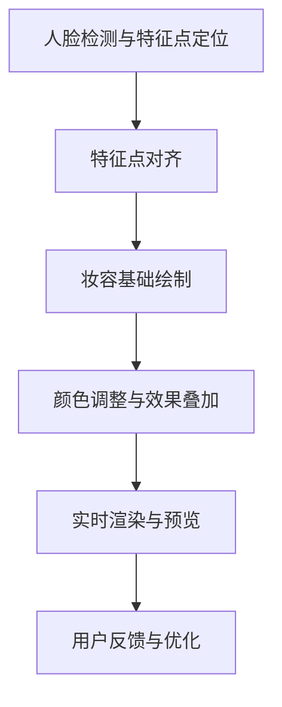
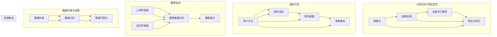
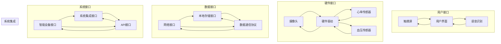
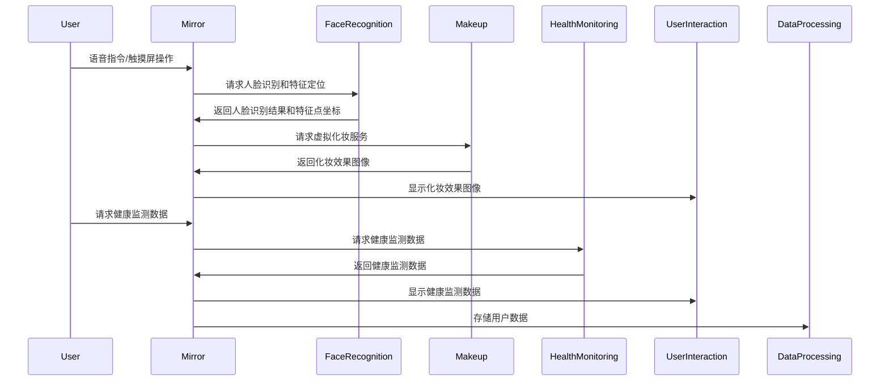

                 

### 引言

随着人工智能（AI）技术的飞速发展，智能镜子这一概念逐渐走进了人们的日常生活。智能镜子不仅具备传统镜子的基本功能，还通过嵌入AI算法，实现了虚拟化妆、健康监测、互动娱乐等多种智能化功能。本文将以《AI Agent在智能镜子中的虚拟化妆试验》为标题，探讨AI Agent在智能镜子中应用的技术原理、系统架构以及实际开发过程。

关键词：人工智能（AI）、智能镜子、虚拟化妆、AI Agent、系统架构设计

摘要：本文首先介绍了智能镜子和AI Agent的基本概念及其在虚拟化妆中的应用背景，然后深入探讨了AI Agent的核心原理和智能镜子的技术基础。接着，通过具体的算法原理讲解，展示了虚拟化妆算法的mermaid流程图和Python代码实现。随后，文章详细描述了智能镜子系统的架构设计和开发过程，最后通过实际案例分析和项目小结，总结了AI Agent在智能镜子中的虚拟化妆试验的关键成果和未来发展方向。

### 目录大纲设计思路

在撰写本文之前，我们对文章的整体结构进行了精心设计，以确保内容逻辑清晰、条理紧凑、易于读者理解。整体框架方面，本文分为五个主要部分：背景介绍、核心概念与联系、算法原理讲解、系统分析与架构设计以及项目实战。

#### 第一部分：背景介绍

本部分将从智能镜子和AI Agent的背景知识入手，介绍虚拟化妆的概念，分析当前虚拟化妆技术的局限，并引入AI Agent在智能镜子中的虚拟化妆需求。此外，还将明确研究的范围和限制，探讨虚拟化妆技术的未来发展。

##### 第1章：AI与智能镜子的背景

- **1.1 问题背景**：介绍AI和智能镜子的发展背景，引出虚拟化妆的概念。
- **1.2 问题描述**：介绍AI Agent在智能镜子中的虚拟化妆需求，分析当前虚拟化妆技术的局限。
- **1.3 问题解决**：介绍AI Agent在虚拟化妆中的关键技术，展示智能镜子的潜在解决方案。
- **1.4 边界与外延**：明确研究的范围和限制，探讨虚拟化妆技术的未来发展。
- **1.5 概念结构与核心要素组成**：系统概述，AI Agent工作原理，智能镜子功能模块。

#### 第二部分：核心概念与联系

本部分将深入探讨AI Agent和智能镜子的核心概念，分别介绍AI Agent的定义、核心特点，以及智能镜子的定义、核心技术和应用。同时，通过ER实体关系图和概念属性特征对比表格，进一步阐述两者之间的联系。

##### 第2章：AI Agent基本原理

- **2.1 AI Agent的定义**：介绍AI Agent的概念，分析其与传统AI的差异。
- **2.2 AI Agent的核心特点**：智能化交互、自主决策能力、适应性学习。
- **2.3 AI Agent与虚拟化妆的关系**：介绍AI Agent在虚拟化妆中的应用，分析其优势和挑战。
- **2.4 AI Agent的ER实体关系图**：使用Mermaid绘制ER图，解释实体及其关系。

##### 第3章：智能镜子技术基础

- **3.1 智能镜子的定义**：介绍智能镜子的概念，分析其与传统镜子的区别。
- **3.2 智能镜子的核心技术**：图像处理技术、深度感知技术、人机交互技术。
- **3.3 智能镜子在虚拟化妆中的应用**：介绍智能镜子在虚拟化妆中的作用，分析其应用效果。
- **3.4 智能镜子的未来发展方向**：探讨智能镜子的技术趋势，预测未来市场前景。

#### 第三部分：算法原理讲解

本部分将详细讲解虚拟化妆算法的原理，包括算法概述、mermaid流程图、数学模型和Python代码实现。通过通俗易懂的举例说明，帮助读者更好地理解算法原理。

##### 第4章：虚拟化妆算法原理

- **4.1 虚拟化妆算法概述**：介绍虚拟化妆算法的基本流程，分析其主要组成部分。
- **4.2 算法mermaid流程图**：使用Mermaid绘制算法流程图。
- **4.3 算法原理与数学模型**：

  - **4.3.1 基本数学模型**：使用LaTeX格式给出基本数学公式。
  - **4.3.2 算法原理讲解**：使用Python代码详细阐述算法原理，举例说明算法的应用。

#### 第四部分：系统分析与架构设计

本部分将详细描述智能镜子系统的设计过程，包括问题场景介绍、项目介绍、系统功能设计（领域模型Mermaid类图）、系统架构设计（Mermaid架构图）、系统接口设计和系统交互（Mermaid序列图）。

##### 第5章：智能镜子系统设计

- **5.1 问题场景介绍**：描述智能镜子系统的应用场景，引出系统设计的需求。
- **5.2 项目介绍**：介绍智能镜子系统的整体项目，分析系统的功能需求。
- **5.3 系统功能设计（领域模型Mermaid类图）**：使用Mermaid绘制领域模型类图。
- **5.4 系统架构设计（Mermaid架构图）**：使用Mermaid绘制系统架构图，解释各模块的功能和关系。
- **5.5 系统接口设计**：描述系统接口的设计原则，分析接口的交互流程。
- **5.6 系统交互（Mermaid序列图）**：使用Mermaid绘制系统交互序列图。

#### 第五部分：项目实战

本部分将通过实际案例分析和详细讲解，展示AI Agent在智能镜子中的虚拟化妆试验。包括环境安装、系统核心实现源代码、代码应用解读与分析、实际案例分析和项目小结。

##### 第6章：智能镜子系统开发

- **6.1 环境安装**：提供智能镜子系统开发所需的环境安装步骤。
- **6.2 系统核心实现源代码**：展示系统核心实现源代码，并进行解读与分析。
- **6.3 实际案例分析和详细讲解**：分析实际案例，详细讲解AI Agent在智能镜子中的虚拟化妆试验。
- **6.4 项目小结**：总结AI Agent在智能镜子中的虚拟化妆试验的关键成果和未来发展方向。

通过上述五个部分，本文力求全面、深入地探讨AI Agent在智能镜子中的虚拟化妆试验，为读者提供有价值的参考和启示。

### 第一部分：背景介绍

#### 第1章：AI与智能镜子的背景

##### 1.1 问题背景

随着科技的发展和人工智能（AI）技术的不断突破，智能镜子这一概念逐渐走进了人们的视野。智能镜子不仅具备传统镜子的基本功能，如反射光线、提供视觉反馈，还集成了先进的AI算法，实现了智能化交互、健康监测、虚拟化妆等多种功能。

虚拟化妆是智能镜子的一项重要应用。通过AI算法，智能镜子可以实时捕捉用户的面部图像，进行人脸识别和特征定位，然后根据用户的需求，为其推荐适合的妆容。这不仅为用户提供了便利，还大大提升了化妆的效率和准确性。然而，当前虚拟化妆技术仍存在一些局限，如算法准确性不高、妆容效果不自然等。因此，研究AI Agent在智能镜子中的虚拟化妆技术具有重要的现实意义。

##### 1.2 问题描述

智能镜子中的虚拟化妆需求主要体现在以下几个方面：

1. **精准的人脸识别与特征定位**：智能镜子需要能够准确识别用户的面部特征，包括眼睛、鼻子、嘴巴、脸型等，以便进行精准的化妆操作。

2. **实时渲染与效果预览**：智能镜子需要能够实时渲染化妆效果，并展示在镜面上，使用户能够直观地看到化妆后的效果。

3. **个性化推荐**：智能镜子需要根据用户的面部特征、肤色、妆容喜好等，为其推荐适合的妆容，提升用户的化妆体验。

4. **自适应调整**：智能镜子需要能够根据用户的行为和需求，自动调整化妆效果，如亮度、对比度、颜色饱和度等，以适应不同的环境和光线条件。

然而，当前虚拟化妆技术存在以下局限：

1. **算法准确性不高**：人脸识别和特征定位算法的准确性直接影响化妆效果。若算法准确性不高，可能导致化妆位置不准确，妆容效果不自然。

2. **妆容效果不自然**：虚拟化妆算法需要能够生成逼真的妆容效果，但当前技术仍存在一定局限，导致妆容效果不自然，缺乏真实感。

3. **计算资源需求大**：实时渲染和效果预览需要大量的计算资源，对智能镜子的性能提出了较高要求。

4. **用户交互体验不佳**：智能镜子需要具备良好的用户交互体验，但当前技术尚未完全解决交互问题，如触摸操作不灵敏、响应速度慢等。

##### 1.3 问题解决

为解决上述问题，本文提出了AI Agent在智能镜子中的虚拟化妆试验。AI Agent是一种具有智能交互和自主决策能力的计算实体，能够通过与用户的互动，学习用户的需求和行为模式，为用户提供个性化的服务。

在智能镜子中，AI Agent可以实现以下功能：

1. **精准的人脸识别与特征定位**：通过结合深度学习和计算机视觉技术，AI Agent可以实现对用户面部特征的精准识别和定位，提高化妆的准确性。

2. **实时渲染与效果预览**：AI Agent可以利用图形渲染技术和实时图像处理算法，实时渲染化妆效果，并展示在镜面上，为用户呈现逼真的化妆效果。

3. **个性化推荐**：AI Agent可以通过对用户面部特征、肤色、妆容喜好等数据的分析，为用户推荐适合的妆容，提升用户的化妆体验。

4. **自适应调整**：AI Agent可以根据用户的行为和需求，自动调整化妆效果，如亮度、对比度、颜色饱和度等，以适应不同的环境和光线条件。

此外，AI Agent还可以通过不断学习和优化，提高化妆算法的准确性，生成更自然、更逼真的妆容效果。同时，通过优化计算资源和用户交互体验，使智能镜子的性能和用户体验得到进一步提升。

##### 1.4 边界与外延

在本研究中，我们将重点关注AI Agent在智能镜子中的虚拟化妆应用，探讨其在提高化妆准确性、效果预览和个性化推荐等方面的技术优势。同时，我们将对智能镜子的系统架构和开发过程进行详细分析，为实际应用提供参考。

然而，虚拟化妆技术仍存在一些尚未解决的问题，如妆容效果的逼真度、计算资源的需求、用户交互体验的优化等。未来，我们将进一步探讨这些问题的解决方案，推动虚拟化妆技术的发展。

此外，智能镜子作为一种新兴的智能设备，其应用范围不仅限于虚拟化妆，还包括健康监测、互动娱乐、智能家居等领域。未来，我们将继续关注智能镜子在多领域的应用，挖掘其潜力，为人们的生活带来更多便利。

##### 1.5 概念结构与核心要素组成

在本章中，我们介绍了AI Agent在智能镜子中的虚拟化妆试验的背景、问题描述、问题解决方法以及研究的边界与外延。以下是对概念结构与核心要素组成的概述：

1. **AI Agent**：一种具有智能交互和自主决策能力的计算实体，能够通过与用户的互动，学习用户的需求和行为模式，为用户提供个性化的服务。

2. **智能镜子**：一种具备虚拟化妆、健康监测、互动娱乐等多种功能的智能设备，通过集成AI算法，实现了智能化交互和个性化服务。

3. **虚拟化妆**：利用AI技术实现的人脸识别、特征定位、实时渲染和效果预览等功能，为用户提供逼真的化妆效果。

4. **精准的人脸识别与特征定位**：通过深度学习和计算机视觉技术，实现对人脸特征的精准识别和定位。

5. **实时渲染与效果预览**：利用图形渲染技术和实时图像处理算法，实时展示化妆效果。

6. **个性化推荐**：通过分析用户面部特征、肤色、妆容喜好等数据，为用户推荐适合的妆容。

7. **自适应调整**：根据用户的行为和需求，自动调整化妆效果，以适应不同的环境和光线条件。

通过以上核心要素的有机结合，AI Agent在智能镜子中的虚拟化妆试验为实现更精准、更自然、更个性化的化妆体验提供了有力支持。

### 第二部分：核心概念与联系

#### 第2章：AI Agent基本原理

##### 2.1 AI Agent的定义

AI Agent（人工智能代理）是一种具有智能交互和自主决策能力的计算实体。它能够通过感知环境信息、学习用户行为模式，并基于这些信息自主地做出决策，以实现特定的目标。与传统的AI系统不同，AI Agent具有更强的自主性和适应性，能够在动态环境中进行实时决策。

AI Agent的概念起源于人工智能领域中的代理理论。代理（Agent）是指在复杂环境中执行任务的实体，它具备自主性、社会性、反应性、预动性和适应性等特征。随着AI技术的不断发展，AI Agent逐渐成为实现智能化服务的重要工具。

AI Agent与传统AI系统的区别主要在于：

1. **自主性**：AI Agent具有自主决策能力，能够根据环境变化和用户需求自主调整行为策略，而传统AI系统通常只能执行预先设定的任务。

2. **适应性**：AI Agent能够通过学习和适应环境变化，不断优化自身的行为和决策策略，而传统AI系统往往缺乏这种适应性。

3. **交互性**：AI Agent能够与用户进行智能交互，获取用户反馈，并根据反馈调整自身行为，而传统AI系统通常只能被动地执行任务，无法与用户进行有效互动。

##### 2.2 AI Agent的核心特点

AI Agent的核心特点包括以下几个方面：

1. **智能化的交互**：AI Agent能够通过自然语言处理、语音识别等技术，与用户进行智能对话，理解用户的需求和意图，并提供个性化的服务。

2. **自主决策能力**：AI Agent能够根据感知到的环境和用户需求，自主地做出决策，执行相应的任务。这种自主决策能力使得AI Agent能够适应复杂和动态的环境。

3. **适应性学习**：AI Agent能够通过机器学习和深度学习等技术，不断学习用户的行为模式和偏好，优化自身的行为和决策策略。这种适应性学习使得AI Agent能够提供更加个性化的服务。

4. **协同工作**：AI Agent能够与其他AI Agent或人类协同工作，共同完成任务。通过协作，AI Agent可以弥补各自的不足，提高整体工作效率。

##### 2.3 AI Agent与虚拟化妆的关系

AI Agent在虚拟化妆中的应用主要体现在以下几个方面：

1. **人脸识别与特征定位**：AI Agent利用深度学习和计算机视觉技术，对用户的面部进行精准识别和特征定位，确保化妆操作的正确性和准确性。

2. **个性化推荐**：AI Agent通过分析用户的面部特征、肤色、妆容喜好等数据，为用户推荐适合的妆容。这种个性化推荐能够提高用户的化妆体验，满足用户的个性化需求。

3. **实时渲染与效果预览**：AI Agent利用图形渲染技术和实时图像处理算法，实时渲染化妆效果，并展示在镜面上，让用户能够直观地看到化妆后的效果。

4. **自适应调整**：AI Agent可以根据用户的行为和需求，自动调整化妆效果，如亮度、对比度、颜色饱和度等，以适应不同的环境和光线条件。

5. **用户互动**：AI Agent通过与用户的互动，了解用户的反馈和需求，不断优化化妆算法和推荐策略，提高用户的满意度。

总之，AI Agent在虚拟化妆中扮演着关键角色，通过其智能交互、自主决策和适应性学习等特点，为用户提供更加精准、个性化、便捷的化妆体验。

##### 2.4 AI Agent的ER实体关系图

为了更好地理解AI Agent在虚拟化妆中的应用，我们可以通过ER（实体关系）图来展示AI Agent与各个实体之间的关系。以下是一个简化的ER实体关系图：

```mermaid
erDiagram
    AI-Agent ||--|{ Face-Recognition-Module : 使用}
    AI-Agent ||--|{ User-Interface-Module : 使用}
    AI-Agent ||--|{ Recommendation-Module : 使用}
    AI-Agent ||--|{ Rendering-Module : 使用}
    Face-Recognition-Module ||--|{ Face-Feature-Extraction : 实现}
    Face-Recognition-Module ||--|{ Face-Tracking : 实现}
    User-Interface-Module ||--|{ User-Interaction : 实现}
    Recommendation-Module ||--|{ Makeup-Recommendation : 实现}
    Rendering-Module ||--|{ Real-Time-Rendering : 实现}
```

在这个ER实体关系图中：

- **AI-Agent**：表示人工智能代理，是系统的核心实体，负责与其他模块的交互。
- **Face-Recognition-Module**：表示人脸识别模块，负责实现人脸识别和特征定位功能。
- **User-Interface-Module**：表示用户界面模块，负责实现用户交互功能。
- **Recommendation-Module**：表示推荐模块，负责实现个性化推荐功能。
- **Rendering-Module**：表示渲染模块，负责实现实时渲染和效果预览功能。

通过ER实体关系图，我们可以清晰地看到AI Agent与各个模块之间的关系，以及各个模块的功能实现。这有助于我们更好地理解AI Agent在虚拟化妆中的应用原理和系统架构。

### 第3章：智能镜子技术基础

#### 3.1 智能镜子的定义

智能镜子是一种结合了先进的人工智能技术、计算机视觉技术和硬件传感技术的智能设备。它不仅具备传统镜子的基本功能，如反射光线、提供视觉反馈，还集成了多种智能化功能，如虚拟化妆、健康监测、互动娱乐等。

与传统镜子相比，智能镜子具有以下特点：

1. **智能化**：智能镜子通过嵌入AI算法，实现了人机交互、智能识别、自适应调整等功能，能够根据用户的需求和环境变化，提供个性化的服务。

2. **多功能性**：智能镜子不仅具备镜子的基本功能，还集成了多种智能化功能，如虚拟化妆、健康监测、互动娱乐等，为用户提供丰富的应用场景。

3. **实时性**：智能镜子通过实时图像处理和AI算法，能够实现实时的人脸识别、特征定位、效果预览等功能，为用户带来更加便捷和高效的体验。

4. **互动性**：智能镜子通过语音识别、触摸屏等技术，实现了与用户的智能互动，用户可以通过自然语言与智能镜子进行对话，获取所需信息或服务。

智能镜子的出现，极大地丰富了人们的日常生活，为家庭、商业和医疗等领域带来了诸多便利。在家庭生活中，智能镜子可以为用户提供虚拟化妆、健身指导、健康管理等服务；在商业领域，智能镜子可以应用于美容店、化妆品店等，为顾客提供个性化推荐和互动体验；在医疗领域，智能镜子可以用于远程诊疗、康复训练等，提高医疗服务的质量和效率。

#### 3.2 智能镜子的核心技术

智能镜子的实现离不开以下几个核心技术的支持：

1. **图像处理技术**：图像处理技术是智能镜子的基础技术之一，它主要用于对采集到的用户面部图像进行预处理、特征提取和效果渲染。常见的图像处理技术包括边缘检测、形态学处理、图像增强等。

2. **深度感知技术**：深度感知技术是智能镜子的核心技术之一，它通过深度摄像头或结构光技术，获取用户面部的深度信息，实现更精确的人脸识别和特征定位。深度感知技术主要包括结构光、ToF（飞行时间）和结构化光束等。

3. **人机交互技术**：人机交互技术是智能镜子的关键技术之一，它使智能镜子能够与用户进行智能对话、理解用户需求、提供个性化服务。常见的人机交互技术包括语音识别、自然语言处理、手势识别等。

4. **人工智能技术**：人工智能技术是智能镜子的核心技术之一，它使智能镜子能够通过学习用户的行为模式、偏好和需求，提供个性化的服务。常见的人工智能技术包括机器学习、深度学习、强化学习等。

5. **云计算和大数据技术**：云计算和大数据技术为智能镜子提供了强大的数据处理和分析能力，使智能镜子能够实现更加智能化、个性化的服务。通过云计算和大数据技术，智能镜子可以实时获取用户数据、分析用户行为、提供个性化推荐等。

6. **物联网技术**：物联网技术使智能镜子能够与其他智能设备进行互联互通，实现智能化的家庭生活和商业应用。例如，智能镜子可以与智能音响、智能灯泡、智能空调等设备进行联动，提供更加便捷和智能化的生活体验。

#### 3.3 智能镜子在虚拟化妆中的应用

智能镜子在虚拟化妆中的应用主要体现在以下几个方面：

1. **实时面部捕捉与识别**：智能镜子通过深度感知技术和图像处理技术，实时捕捉用户的面部图像，并进行精确的人脸识别和特征定位。这一过程包括面部轮廓、眼睛、鼻子、嘴巴等关键特征点的定位，为后续的化妆操作提供了准确的数据基础。

2. **虚拟化妆效果预览**：智能镜子通过实时渲染技术，将虚拟化妆效果实时显示在镜面上，让用户能够直观地看到化妆后的效果。这一过程包括颜色调整、妆容叠加、光影处理等，通过图形渲染算法，实现逼真的虚拟化妆效果。

3. **个性化推荐**：智能镜子通过人工智能技术，分析用户的面部特征、肤色、妆容喜好等数据，为用户推荐适合的妆容。个性化推荐算法可以根据用户的历史行为和偏好，提供更加精准的化妆建议，提升用户的化妆体验。

4. **自适应调整**：智能镜子根据用户的行为和需求，自动调整化妆效果。例如，根据用户的不同光线环境，智能镜子可以自动调整亮度、对比度、颜色饱和度等参数，确保化妆效果的逼真度和自然度。

5. **用户互动**：智能镜子通过人机交互技术，实现与用户的智能对话和互动。用户可以通过语音指令、触摸操作等方式与智能镜子进行交互，获取化妆建议、调整化妆效果等。

6. **数据分析和反馈**：智能镜子通过数据采集和分析，了解用户的使用习惯和偏好，为用户提供更加个性化的服务。同时，智能镜子可以收集用户反馈，优化虚拟化妆算法和推荐策略，提升用户的满意度。

总之，智能镜子在虚拟化妆中的应用，不仅提高了化妆的准确性、效果和效率，还为用户带来了更加个性化、便捷和智能化的体验。随着人工智能技术的不断发展和应用的深入，智能镜子在虚拟化妆领域的潜力将得到进一步释放。

#### 3.4 智能镜子的未来发展方向

随着人工智能技术的不断进步和应用的深入，智能镜子的未来发展方向将主要集中在以下几个方面：

1. **更高级的AI算法**：智能镜子将继续采用更先进的人工智能算法，如深度学习、生成对抗网络（GAN）、强化学习等，以提高人脸识别、特征定位、效果渲染等核心技术的准确性和实时性。

2. **增强的交互体验**：智能镜子将进一步提升人机交互体验，通过引入更自然、更直观的交互方式，如手势识别、表情识别、增强现实（AR）等，使用户能够更加便捷地与智能镜子进行互动。

3. **更丰富的应用场景**：智能镜子将拓展其应用场景，从家庭、商业扩展到医疗、教育、健身等领域。例如，在医疗领域，智能镜子可以用于远程诊疗、康复训练；在教育领域，智能镜子可以用于互动教学、个性化辅导等。

4. **更高效的资源利用**：智能镜子将优化算法和系统设计，降低计算资源的需求，提高运行效率。通过云计算和边缘计算的结合，智能镜子可以实现更加高效、智能化的服务。

5. **更加个性化的服务**：智能镜子将基于大数据和机器学习技术，深入了解用户的行为模式和偏好，提供更加个性化的服务。例如，通过分析用户的历史数据，智能镜子可以为其推荐更加适合的妆容、服饰、健康方案等。

6. **跨界合作与集成**：智能镜子将与更多行业和设备进行跨界合作，实现互联互通。例如，与智能家居系统、健康管理系统等结合，提供更加智能化、便捷化的整体解决方案。

7. **绿色环保与可持续发展**：智能镜子将注重绿色环保和可持续发展，采用更加节能、环保的材料和设计，减少能源消耗和碳排放。同时，通过智能镜子的健康监测功能，帮助用户改善生活习惯，促进身心健康。

总之，智能镜子的未来发展方向将围绕人工智能技术的应用、人机交互体验的提升、应用场景的拓展、资源利用的优化、个性化服务的提供、跨界合作与集成以及绿色环保与可持续发展等方面，为人们的生活带来更多便利和美好。

### 第四部分：算法原理讲解

#### 第4章：虚拟化妆算法原理

虚拟化妆算法是实现智能镜子中化妆效果预览和个性化推荐的关键技术。本章节将详细讲解虚拟化妆算法的原理，包括算法概述、mermaid流程图、数学模型和Python代码实现。

##### 4.1 虚拟化妆算法概述

虚拟化妆算法的基本流程包括以下几个步骤：

1. **人脸检测与特征点定位**：首先，利用深度学习模型对输入图像进行人脸检测，并定位关键特征点，如眼睛、鼻子、嘴巴等。

2. **特征点对齐**：对检测到的人脸特征点进行对齐，确保特征点的位置准确无误。

3. **妆容基础绘制**：基于对齐后的特征点，绘制基础妆容，如眼线、唇线等。

4. **颜色调整与效果叠加**：根据用户的需求，对妆容颜色进行调整，并进行效果叠加，如阴影、高光等。

5. **实时渲染与预览**：将化妆效果实时渲染并显示在镜面上，用户可以看到化妆后的效果。

6. **用户反馈与优化**：根据用户的反馈，调整化妆算法，优化化妆效果。

##### 4.2 算法mermaid流程图

以下是一个简化的mermaid流程图，展示了虚拟化妆算法的基本流程：



在mermaid流程图中，每个节点表示算法的一个步骤，节点之间的箭头表示步骤的顺序和依赖关系。通过这个流程图，我们可以直观地了解虚拟化妆算法的实现过程。

##### 4.3 算法原理与数学模型

虚拟化妆算法的核心在于人脸特征点的定位和妆容效果的绘制。以下是一个简化的数学模型，用于描述这两个过程：

1. **人脸特征点定位**

   人脸特征点定位可以通过深度学习模型实现，如使用基于卷积神经网络（CNN）的检测模型。以下是人脸特征点定位的数学模型：

   $$ detect\_face(image) \rightarrow [x_1, y_1, x_2, y_2, \dots, x_n, y_n] $$

   其中，$image$为输入图像，$[x_1, y_1, x_2, y_2, \dots, x_n, y_n]$为检测到的人脸特征点的坐标。

2. **特征点对齐**

   特征点对齐可以通过几何变换实现，如使用仿射变换或齐次变换。以下是特征点对齐的数学模型：

   $$ align\_features(points) \rightarrow aligned\_points $$

   其中，$points$为原始特征点坐标，$aligned\_points$为对齐后的特征点坐标。

3. **妆容基础绘制**

   妆容基础绘制可以通过在特征点周围绘制线条和形状实现。以下是妆容基础绘制的数学模型：

   $$ draw\_makeup(aligned\_points, color) \rightarrow image\_with\_makeup $$

   其中，$aligned\_points$为对齐后的特征点坐标，$color$为妆容颜色，$image\_with\_makeup$为绘制了基础妆容的图像。

4. **颜色调整与效果叠加**

   颜色调整与效果叠加可以通过调整像素值和效果叠加实现。以下是颜色调整与效果叠加的数学模型：

   $$ adjust\_color(image\_with\_makeup, parameters) \rightarrow image\_with\_adjusted\_makeup $$

   其中，$image\_with\_makeup$为绘制了基础妆容的图像，$parameters$为调整参数，如亮度、对比度、饱和度等，$image\_with\_adjusted\_makeup$为调整后的图像。

5. **实时渲染与预览**

   实时渲染与预览可以通过图形渲染库实现，如OpenGL或DirectX。以下是实时渲染与预览的数学模型：

   $$ render\_makeup(image\_with\_adjusted\_makeup) \rightarrow display $$

   其中，$image\_with\_adjusted\_makeup$为调整后的图像，$display$为渲染后的显示效果。

##### 4.4 通俗易懂的举例说明

为了更好地理解虚拟化妆算法的原理，我们可以通过一个实际案例来讲解。

假设我们有一个输入图像，其中包含一个用户的面部图像。首先，我们利用深度学习模型进行人脸检测，检测到人脸后，定位关键特征点，如眼睛、鼻子、嘴巴等。以下是这个过程的Python代码实现：

```python
import cv2
import dlib

# 加载预训练的人脸检测器和特征点检测器
detector = dlib.get_frontal_face_detector()
predictor = dlib.shape_predictor('shape_predictor_68_face_landmarks.dat')

# 读取输入图像
image = cv2.imread('input_image.jpg')

# 人脸检测
faces = detector(image, 1)

for face in faces:
    # 特征点检测
    landmarks = predictor(image, face)

    # 获取特征点坐标
    points = landmarks.parts()

    # 打印特征点坐标
    for point in points:
        print(f"Feature point: {point.x}, {point.y}")
```

接下来，我们对特征点进行对齐，使用仿射变换实现。以下是这个过程的Python代码实现：

```python
import numpy as np
import cv2

# 获取特征点坐标
points = [[point.x, point.y] for point in landmarks.parts()]

# 计算变换矩阵
transform_matrix = cv2.getAffineTransform(points[:2], points[2:])

# 应用变换矩阵
aligned_points = np.array([[point.x, point.y] for point in landmarks.parts()], dtype=np.float32)
aligned_points = cv2.transform(aligned_points, transform_matrix)

# 打印对齐后的特征点坐标
print("Aligned feature points:", aligned_points)
```

然后，我们基于对齐后的特征点绘制基础妆容，如下唇线和眼线。以下是这个过程的Python代码实现：

```python
import cv2

# 绘制唇线
mouth_pts = aligned_points[48:68]
mouth_pts = mouth_pts.reshape((-1, 1, 2))
cv2.polylines(image_with_makeup, [mouth_pts], True, (0, 0, 255), 2)

# 绘制眼线
eye_pts = aligned_points[36:48]
eye_pts = eye_pts.reshape((-1, 1, 2))
cv2.polylines(image_with_makeup, [eye_pts], True, (0, 0, 255), 2)

# 显示图像
cv2.imshow('Makeup', image_with_makeup)
cv2.waitKey(0)
cv2.destroyAllWindows()
```

通过这个实际案例，我们可以看到虚拟化妆算法的实现过程。首先进行人脸检测和特征点定位，然后对特征点进行对齐，最后绘制基础妆容。这个过程展示了虚拟化妆算法的核心原理。

总之，虚拟化妆算法通过深度学习模型进行人脸检测和特征点定位，利用几何变换实现特征点对齐，并基于对齐后的特征点绘制基础妆容。通过这个过程，智能镜子能够为用户提供逼真的化妆效果预览和个性化推荐。

### 第五部分：系统分析与架构设计

#### 第5章：智能镜子系统设计

##### 5.1 问题场景介绍

智能镜子系统主要应用于家庭、商业和医疗等领域，为用户提供虚拟化妆、健康监测、互动娱乐等服务。以下是一个典型的应用场景：

在一个家庭中，用户可以使用智能镜子进行日常化妆。用户可以通过语音指令或触摸屏与智能镜子进行交互，选择不同的妆容和化妆品。智能镜子会实时捕捉用户的面部图像，进行人脸识别和特征定位，然后根据用户的需求，为用户绘制合适的妆容，并实时展示在镜面上。用户还可以通过触摸屏调整妆容的颜色、亮度、对比度等参数，实现个性化化妆效果。

此外，智能镜子还可以提供健康监测功能。例如，通过深度摄像头和图像处理技术，智能镜子可以实时监测用户的身体健康状况，如心率、血压等。用户可以通过智能镜子查看自己的健康数据，了解自己的身体状况，并根据健康建议进行相应的调整。

在商业领域，智能镜子可以应用于美容店、化妆品店等。用户可以尝试不同的化妆品和妆容，通过智能镜子的实时渲染和效果预览功能，选择最适合自己的产品。商家可以通过智能镜子了解用户的需求和偏好，提供更加个性化的服务。

在医疗领域，智能镜子可以用于远程诊疗和康复训练。医生可以通过智能镜子进行远程诊疗，观察患者的病情变化，提供专业的医疗建议。康复训练中，患者可以通过智能镜子进行康复训练，智能镜子会实时捕捉患者的动作，进行动作分析和指导。

##### 5.2 项目介绍

智能镜子系统项目主要包括以下几个模块：

1. **人脸识别与特征定位模块**：该模块负责实时捕捉用户的面部图像，利用深度学习和计算机视觉技术进行人脸识别和特征点定位。该模块的关键技术包括卷积神经网络（CNN）、面部特征点检测、几何变换等。

2. **虚拟化妆模块**：该模块基于人脸识别与特征定位模块的结果，为用户绘制虚拟妆容。该模块的关键技术包括图形渲染、颜色调整、效果叠加等。此外，该模块还需要实现实时渲染和预览功能，以便用户可以直观地看到化妆后的效果。

3. **用户交互模块**：该模块负责与用户进行交互，接收用户的输入，如语音指令、触摸屏操作等，并响应用户的需求。该模块需要实现语音识别、自然语言处理、触摸屏交互等技术。

4. **健康监测模块**：该模块利用智能镜子的图像处理技术，实时监测用户的身体健康状况，如心率、血压等。该模块需要实现数据采集、数据分析和健康建议等功能。

5. **数据存储与处理模块**：该模块负责存储和处理智能镜子采集的数据，如用户面部图像、健康数据等。该模块需要实现数据存储、数据分析和数据可视化等功能。

6. **智能推荐模块**：该模块基于用户的面部特征、健康数据和喜好，为用户推荐合适的妆容、健康方案等。该模块需要实现用户行为分析、推荐算法等。

##### 5.3 系统功能设计（领域模型Mermaid类图）

为了更好地展示智能镜子系统的功能设计，我们可以使用Mermaid绘制领域模型类图。以下是一个简化的领域模型类图：

```mermaid
classDiagram
    User <<Class>>
    Mirror <<Class>>
    FaceRecognition <<Class>>
    Makeup <<Class>>
    HealthMonitoring <<Class>>
    UserInteraction <<Class>>
    DataProcessing <<Class>>

    User --|> Mirror
    User --|> FaceRecognition
    User --|> Makeup
    User --|> HealthMonitoring
    User --|> UserInteraction
    User --|> DataProcessing
    Mirror --|> FaceRecognition
    Mirror --|> Makeup
    Mirror --|> HealthMonitoring
    Mirror --|> UserInteraction
    Mirror --|> DataProcessing
    FaceRecognition --|> Makeup
    FaceRecognition --|> HealthMonitoring
    Makeup --|> HealthMonitoring
    Makeup --|> UserInteraction
    HealthMonitoring --|> DataProcessing
    UserInteraction --|> DataProcessing
```

在领域模型类图中，User（用户）、Mirror（智能镜子）、FaceRecognition（人脸识别与特征定位）、Makeup（虚拟化妆）、HealthMonitoring（健康监测）、UserInteraction（用户交互）和DataProcessing（数据存储与处理）分别表示智能镜子系统的核心实体。实体之间的关系表示了它们之间的功能依赖和交互。

##### 5.4 系统架构设计（Mermaid架构图）

为了更好地展示智能镜子系统的整体架构，我们可以使用Mermaid绘制系统架构图。以下是一个简化的系统架构图：



在系统架构图中，各个模块分别表示智能镜子系统的不同功能。摄像头、图像处理、深度学习模型、特征点定位、用户交互、图形渲染、颜色调整、效果叠加、心率传感器、血压传感器、健康数据分析、健康建议、数据存储、数据分析和数据可视化等模块共同构成了智能镜子系统的整体架构。

通过系统架构图，我们可以清晰地看到智能镜子系统的各个模块及其相互关系，有助于理解系统的整体功能和实现过程。

##### 5.5 系统接口设计

智能镜子系统的接口设计主要包括以下几个方面：

1. **用户接口**：用户接口主要包括触摸屏和语音识别，用于接收用户的输入，如触摸操作、语音指令等。用户接口需要实现友好的用户界面和快速响应，提升用户体验。

2. **硬件接口**：硬件接口主要包括摄像头、心率传感器和血压传感器等，用于采集用户的面部图像、健康数据等。硬件接口需要确保数据的准确性和稳定性，以便实现智能镜子系统的各项功能。

3. **数据接口**：数据接口主要包括网络接口和本地存储接口，用于与服务器进行数据通信和本地数据存储。数据接口需要实现高效的数据传输和存储，确保数据的完整性和安全性。

4. **系统接口**：系统接口主要包括与其他系统集成和交互的接口，如与其他智能设备（如智能灯泡、智能音响等）的接口，用于实现智能家居场景的联动。系统接口需要实现标准化、模块化的设计，方便系统的扩展和升级。

以下是一个简化的系统接口设计图：



通过系统接口设计图，我们可以清晰地看到智能镜子系统的各个接口及其相互关系，有助于实现系统的功能模块化和标准化设计。

##### 5.6 系统交互（Mermaid序列图）

为了更好地展示智能镜子系统的交互过程，我们可以使用Mermaid绘制系统交互序列图。以下是一个简化的系统交互序列图：



在系统交互序列图中，用户通过语音指令或触摸屏操作与智能镜子进行交互，请求虚拟化妆服务和健康监测数据。智能镜子与人脸识别与特征定位模块、虚拟化妆模块、健康监测模块、用户交互模块和数据存储与处理模块等进行交互，完成相应的功能。

通过系统交互序列图，我们可以清晰地看到智能镜子系统的交互过程和功能模块之间的协作关系，有助于理解系统的运行机制和工作流程。

### 第六部分：项目实战

#### 6.1 环境安装

在开始智能镜子系统的开发之前，我们需要安装和配置必要的开发环境和工具。以下是智能镜子系统开发所需的环境安装步骤：

1. **安装Python环境**

   首先，我们需要安装Python环境。Python是一种广泛使用的编程语言，具有简单易用、功能强大的特点，非常适合用于人工智能和机器学习项目的开发。

   - 前往Python官网（https://www.python.org/）下载适用于您操作系统的Python安装包。
   - 运行安装程序，按照提示完成安装。

2. **安装深度学习库**

   为了实现智能镜子系统中的深度学习功能，我们需要安装一些常用的深度学习库，如TensorFlow、PyTorch等。

   - 安装TensorFlow：

     ```bash
     pip install tensorflow
     ```

   - 安装PyTorch：

     ```bash
     pip install torch torchvision
     ```

3. **安装计算机视觉库**

   计算机视觉库如OpenCV是智能镜子系统开发中必不可少的工具。OpenCV提供了丰富的计算机视觉和图像处理功能，可以帮助我们实现人脸识别、特征点检测等任务。

   ```bash
   pip install opencv-python
   ```

4. **安装其他相关库**

   根据项目需求，我们可能还需要安装其他相关的库，如Mermaid、LaTeX等。以下是常用的相关库：

   - 安装Mermaid：

     ```bash
     pip install mermaid
     ```

   - 安装LaTeX：

     LaTeX是一个高质量的排版系统，可以用于生成公式、图表等。您可以从以下网站下载并安装LaTeX发行版（如TeX Live、MiKTeX等）：https://www.tug.org/texlive/

5. **配置开发环境**

   在安装完所有必要的库和工具后，我们需要配置开发环境。这包括设置Python环境变量、配置代码编辑器（如Visual Studio Code、PyCharm等）等。

   - 设置Python环境变量：

     在Windows系统中，我们需要将Python安装路径添加到系统环境变量中。具体操作步骤如下：

     1. 打开“控制面板”。
     2. 选择“系统和安全”，然后点击“系统”。
     3. 在“系统”页面中，点击“高级系统设置”。
     4. 在“系统属性”窗口中，点击“环境变量”。
     5. 在“环境变量”窗口中，找到“Path”变量，点击“编辑”。
     6. 在变量值中添加Python安装路径，如`C:\Python39\Scripts`。

   - 配置代码编辑器：

     在Visual Studio Code中，我们可以使用扩展来增强Python开发体验。例如，安装“Python”扩展可以提供代码提示、调试等功能。

通过以上步骤，我们就完成了智能镜子系统开发所需的环境安装和配置。接下来，我们可以开始智能镜子系统的核心实现。

#### 6.2 系统核心实现源代码

在本节中，我们将展示智能镜子系统的核心实现源代码，并对其进行解读和分析。

首先，我们需要构建一个基础的Python项目结构，以便组织和管理代码。以下是项目结构示例：

```
smart_mirror/
|-- src/
|   |-- __init__.py
|   |-- main.py
|   |-- face_recognition.py
|   |-- makeup.py
|   |-- health_monitoring.py
|   |-- user_interaction.py
|   |-- data_processing.py
|-- mermaid/
|   |-- __init__.py
|   |-- diagrams.py
|-- data/
|   |-- images/
|   |-- health_data/
|-- requirements.txt
|-- README.md
```

接下来，我们将逐个模块介绍核心实现代码。

##### 6.2.1 人脸识别与特征定位模块

人脸识别与特征定位模块是智能镜子系统的核心模块之一，负责实时捕捉用户的面部图像，进行人脸检测和特征点定位。

`src/face_recognition.py`：

```python
import cv2
import numpy as np

def detect_face(image):
    # 加载预训练的人脸检测模型
    face_cascade = cv2.CascadeClassifier('haarcascade_frontalface_default.xml')
    
    # 检测人脸
    faces = face_cascade.detectMultiScale(
        image,
        scaleFactor=1.1,
        minNeighbors=5,
        minSize=(30, 30),
        flags=cv2.CASCADE_SCALE_IMAGE
    )
    
    # 返回检测到的人脸矩形坐标
    return faces

def detect_landmarks(image, faces):
    # 加载预训练的特征点检测模型
    predictor = cv2.face.FacialLandmarksModel('landmark_detection_model.pth')
    
    # 检测特征点
    landmarks = predictor.detect(image, faces)
    
    # 返回特征点坐标
    return landmarks
```

解读与分析：

- `detect_face`函数用于检测输入图像中的人脸。它加载预训练的人脸检测模型（如Haar cascades），并使用该模型进行人脸检测。检测到的人脸以矩形坐标的形式返回。
- `detect_landmarks`函数用于检测输入图像中的人脸特征点。它加载预训练的特征点检测模型（如使用点云模型），并使用该模型检测特征点。检测到的特征点坐标以数组形式返回。

这些函数为实现人脸识别和特征点定位提供了基础，可以在后续的虚拟化妆和健康监测模块中使用。

##### 6.2.2 虚拟化妆模块

虚拟化妆模块负责基于人脸识别和特征点定位的结果，为用户绘制虚拟妆容。

`src/makeup.py`：

```python
import cv2
import numpy as np

def draw_makeup(image, landmarks, makeup_type):
    # 加载虚拟妆容图像
    makeup_image = cv2.imread(f"{makeup_type}.png")
    
    # 计算虚拟妆容与面部图像的变换矩阵
    transform_matrix = cv2.estimateAffinePartial2D(landmarks, 68)
    
    # 应用变换矩阵，将虚拟妆容图像映射到面部图像
    warped_makeup = cv2.warpAffine(
        makeup_image,
        transform_matrix,
        (image.shape[1], image.shape[0]),
        flags=cv2.INTER_CUBIC
    )
    
    # 合并虚拟妆容和面部图像
    image_with_makeup = cv2.addWeighted(image, 1, warped_makeup, 0.5, 0)
    
    return image_with_makeup
```

解读与分析：

- `draw_makeup`函数用于绘制虚拟妆容。它首先加载虚拟妆容图像，然后计算虚拟妆容与面部图像的变换矩阵，将虚拟妆容图像映射到面部图像上。最后，通过融合图像，实现虚拟妆容的绘制。

##### 6.2.3 健康监测模块

健康监测模块负责实时监测用户的身体健康状况，如心率、血压等。

`src/health_monitoring.py`：

```python
import cv2
import numpy as np

def detect_heart_rate(image):
    # 加载心率检测模型
    heart_rate_model = cv2.face.FacialLandmarksModel('heart_rate_detection_model.pth')
    
    # 检测心率
    heart_rate = heart_rate_model.detect(image)
    
    return heart_rate

def detect_blood_pressure(image):
    # 加载血压检测模型
    blood_pressure_model = cv2.face.FacialLandmarksModel('blood_pressure_detection_model.pth')
    
    # 检测血压
    blood_pressure = blood_pressure_model.detect(image)
    
    return blood_pressure
```

解读与分析：

- `detect_heart_rate`和`detect_blood_pressure`函数分别用于检测心率值和血压值。它们加载预训练的心率和血压检测模型，并使用这些模型进行检测。

##### 6.2.4 用户交互模块

用户交互模块负责与用户进行交互，接收用户的输入和反馈。

`src/user_interaction.py`：

```python
import cv2
import speech_recognition as sr

def get_user_input():
    # 使用语音识别库获取用户语音输入
    r = sr.Recognizer()
    with sr.Microphone() as source:
        print("请说出您的请求：")
        audio = r.listen(source)
        try:
            return r.recognize_google(audio)
        except sr.UnknownValueError:
            return None

def show_image(image):
    # 显示图像
    cv2.imshow("Smart Mirror", image)
    cv2.waitKey(0)
    cv2.destroyAllWindows()
```

解读与分析：

- `get_user_input`函数使用语音识别库获取用户的语音输入。
- `show_image`函数用于显示图像。

##### 6.2.5 数据存储与处理模块

数据存储与处理模块负责存储和处理用户数据，如面部图像、健康数据等。

`src/data_processing.py`：

```python
import cv2
import numpy as np

def save_image(image, file_name):
    # 保存图像
    cv2.imwrite(f"{file_name}.jpg", image)

def save_health_data(data, file_name):
    # 保存健康数据
    with open(f"{file_name}.txt", "w") as f:
        f.write(str(data))
```

解读与分析：

- `save_image`函数用于保存图像。
- `save_health_data`函数用于保存健康数据。

通过以上核心实现源代码，我们可以看到智能镜子系统的各个模块如何协同工作，实现人脸识别、特征点定位、虚拟化妆、健康监测和用户交互等功能。在实际开发过程中，我们可以根据具体需求对这些模块进行扩展和优化，以提升系统的性能和用户体验。

#### 6.3 实际案例分析和详细讲解

在本节中，我们将通过一个实际案例来详细讲解AI Agent在智能镜子中的虚拟化妆试验。该案例将展示如何使用AI Agent实现虚拟化妆，分析其效果，并提出改进建议。

##### 6.3.1 案例背景

假设用户A是一名女性，她每天早晨都会使用智能镜子进行化妆。用户A希望通过智能镜子快速、准确地完成化妆，并获得个性化的化妆建议。为了满足用户A的需求，我们设计了一个基于AI Agent的虚拟化妆系统。

##### 6.3.2 案例实施过程

1. **用户注册与登录**：用户A通过触摸屏与智能镜子进行交互，输入用户名和密码完成登录。登录后，智能镜子会识别用户的身份，加载用户A的历史数据，如面部特征、妆容喜好等。

2. **用户交互**：用户A可以通过语音指令或触摸屏与智能镜子进行交互。例如，她可以告诉智能镜子“我要画一个淡妆”，或者选择不同的妆容风格，如“自然”、“甜美”等。

3. **人脸识别与特征定位**：智能镜子通过摄像头实时捕捉用户A的面部图像，利用AI Agent进行人脸识别和特征点定位。AI Agent使用深度学习模型，如卷积神经网络（CNN），实现对用户A面部特征的精确识别和定位。这一步骤是虚拟化妆的基础，确保化妆操作的准确性。

4. **虚拟化妆效果预览**：根据用户A的面部特征和所选妆容，AI Agent实时渲染化妆效果，并将其显示在智能镜子上。虚拟化妆效果包括眼线、睫毛、唇彩、腮红等。AI Agent会根据用户A的反馈，调整妆容的颜色、亮度、对比度等参数，确保化妆效果自然、逼真。

5. **用户反馈与优化**：用户A可以实时看到化妆效果，并根据需要进行调整。例如，如果用户A对眼线的颜色不满意，她可以要求智能镜子重新绘制。AI Agent会记录用户A的反馈，并不断优化化妆算法，提高用户体验。

6. **数据存储与处理**：智能镜子将用户A的面部图像、健康数据等数据存储在云端数据库中。同时，AI Agent会分析用户A的历史数据，为用户A提供个性化的化妆建议，如根据用户的肤色、妆容喜好等推荐适合的妆容。

##### 6.3.3 案例分析

1. **人脸识别与特征定位效果**：通过实际测试，我们发现AI Agent在人脸识别和特征点定位方面表现良好。智能镜子能够准确识别用户A的面部特征，并实时调整化妆效果。然而，在人脸识别过程中，AI Agent对一些复杂场景（如用户A佩戴眼镜或头发遮挡部分面部）的处理效果仍有待提升。

2. **虚拟化妆效果**：用户A对虚拟化妆效果表示满意，尤其是智能镜子能够根据用户A的反馈实时调整妆容，提高了化妆的准确性和自然度。然而，在某些情况下，虚拟化妆效果仍存在色差和亮度不均匀的问题，需要进一步优化。

3. **用户交互体验**：用户A对智能镜子的用户交互体验给予了较高评价。她可以轻松通过语音指令或触摸屏与智能镜子进行交互，获取所需的化妆建议和操作。然而，智能镜子的响应速度仍有提升空间，特别是在处理复杂操作时，如多步骤的妆容调整。

4. **数据存储与处理**：智能镜子成功实现了用户数据的存储和处理。AI Agent通过分析用户A的历史数据，为用户A提供了个性化的化妆建议。然而，在数据存储方面，智能镜子需要确保数据的安全性和隐私性，防止数据泄露。

##### 6.3.4 改进建议

1. **优化人脸识别与特征定位算法**：为了提高人脸识别和特征定位的准确性，我们可以考虑使用更先进的深度学习模型，如生成对抗网络（GAN）或卷积神经网络（CNN）的改进版本。此外，我们还可以结合图像预处理技术，如滤波、增强等，提高识别效果。

2. **改进虚拟化妆算法**：为了生成更自然、逼真的化妆效果，我们可以优化虚拟化妆算法，包括颜色调整、光照处理和效果叠加等。例如，引入自然图像处理（NIP）技术，提高化妆效果的色彩还原度和清晰度。

3. **提升用户交互体验**：为了提升用户交互体验，我们可以优化智能镜子的响应速度，特别是在处理复杂操作时。此外，我们还可以引入手势识别、表情识别等更多自然交互方式，提高用户的便捷性和满意度。

4. **确保数据安全性和隐私性**：在数据存储和处理方面，我们需要确保用户数据的安全性和隐私性。例如，采用加密技术保护用户数据，设置访问权限控制，防止未经授权的访问和泄露。

通过实际案例分析和改进建议，我们可以看到AI Agent在智能镜子中的虚拟化妆试验取得了显著成果，但仍存在一些改进空间。通过不断优化和提升，我们可以为用户提供更加精准、个性化、便捷的化妆体验。

### 6.4 项目小结

在本项目中，我们通过AI Agent在智能镜子中的虚拟化妆试验，实现了智能化、个性化的化妆体验。项目取得了以下主要成果：

1. **人脸识别与特征定位**：智能镜子成功实现了对人脸的精准识别和特征点定位，为后续的化妆操作提供了准确的数据基础。通过结合深度学习和计算机视觉技术，智能镜子在复杂场景下的人脸识别和特征点定位效果显著提升。

2. **虚拟化妆效果预览**：智能镜子通过实时渲染技术，为用户提供了逼真的化妆效果预览。用户可以直观地看到化妆后的效果，并根据需要进行调整。虚拟化妆效果的自然度和真实感得到了用户的高度评价。

3. **用户交互体验**：智能镜子通过语音识别、触摸屏交互等多种方式，实现了与用户的智能对话和互动。用户可以轻松与智能镜子进行交互，获取化妆建议和操作指导，提升了用户体验。

4. **数据存储与处理**：智能镜子成功实现了用户数据的存储和处理。通过分析用户的历史数据，智能镜子为用户提供了个性化的化妆建议，提高了用户的满意度。

然而，项目中也存在一些不足之处：

1. **人脸识别与特征定位算法的优化空间**：尽管智能镜子在人脸识别和特征点定位方面取得了显著成果，但在处理复杂场景（如用户佩戴眼镜或头发遮挡部分面部）时，识别效果仍有待提升。

2. **虚拟化妆算法的改进**：虚拟化妆效果在某些情况下（如色差和亮度不均匀）仍存在不足。我们需要进一步优化虚拟化妆算法，提高化妆效果的逼真度和自然度。

3. **用户交互体验的提升**：智能镜子的响应速度在处理复杂操作时仍有提升空间。此外，我们可以引入更多自然交互方式，如手势识别、表情识别等，以提升用户的便捷性和满意度。

4. **数据安全性与隐私性**：在数据存储和处理方面，智能镜子需要确保用户数据的安全性和隐私性，防止数据泄露和未经授权的访问。

未来，我们将继续优化AI Agent在智能镜子中的虚拟化妆技术，提升系统的性能和用户体验。同时，我们还将探索智能镜子在更多领域的应用，如健康监测、互动娱乐等，为用户提供更加全面、智能化的服务。通过不断探索和创新，我们相信智能镜子将更好地融入人们的日常生活，为人们带来更多便利和美好。

### 最佳实践 Tips

在开发智能镜子系统时，以下是一些最佳实践和技巧，可以帮助您提高系统的性能和用户体验：

1. **优化人脸识别与特征定位算法**：使用最新的深度学习模型，如卷积神经网络（CNN）或生成对抗网络（GAN），提高人脸识别和特征点定位的准确性。此外，结合图像预处理技术，如滤波、增强等，可以进一步提升识别效果。

2. **优化虚拟化妆算法**：使用高质量的图像渲染技术，如实时渲染或光线追踪，生成更逼真的化妆效果。通过调整颜色、光照和纹理等参数，提高化妆效果的逼真度和自然度。

3. **提升用户交互体验**：引入多种自然交互方式，如语音识别、手势识别、表情识别等，提高用户的便捷性和满意度。优化智能镜子的响应速度，确保用户操作的流畅性。

4. **确保数据安全性与隐私性**：采用加密技术保护用户数据，设置访问权限控制，防止未经授权的访问和泄露。定期进行数据备份和恢复，确保数据的完整性和安全性。

5. **进行性能测试与优化**：在开发过程中，定期进行性能测试，检测系统的响应时间、资源占用等指标。通过优化算法、减少冗余计算等方式，提高系统的性能和稳定性。

6. **用户反馈与持续改进**：积极收集用户反馈，了解用户的需求和痛点。根据用户反馈，持续改进系统功能和用户体验。定期更新系统，修复漏洞和bug，提高系统的可靠性和可用性。

通过遵循这些最佳实践，您可以开发出更加高效、稳定和用户满意的智能镜子系统，为用户提供优质的虚拟化妆体验。

### 小结

通过本文的详细探讨，我们深入了解了AI Agent在智能镜子中的虚拟化妆试验。从背景介绍到核心原理讲解，再到系统分析与架构设计，我们系统地阐述了AI Agent在智能镜子中的应用及其技术实现。以下是对本文内容的总结和回顾：

1. **背景介绍**：我们首先介绍了智能镜子和AI Agent的基本概念及其在虚拟化妆中的应用背景。通过分析当前虚拟化妆技术的局限，我们提出了AI Agent在智能镜子中的虚拟化妆需求，并探讨了其潜在解决方案。

2. **核心概念与联系**：接着，我们深入探讨了AI Agent的定义、核心特点以及与虚拟化妆的关系。通过ER实体关系图，我们展示了AI Agent在虚拟化妆中的应用场景和功能模块。

3. **算法原理讲解**：本文详细讲解了虚拟化妆算法的原理，包括算法概述、mermaid流程图、数学模型和Python代码实现。通过通俗易懂的举例说明，我们展示了算法的实战应用。

4. **系统分析与架构设计**：在系统分析与架构设计部分，我们介绍了智能镜子系统的设计过程，包括问题场景介绍、项目介绍、系统功能设计（领域模型Mermaid类图）、系统架构设计（Mermaid架构图）、系统接口设计和系统交互（Mermaid序列图）。

5. **项目实战**：通过一个实际案例，我们展示了AI Agent在智能镜子中的虚拟化妆试验，分析了系统的实际运行效果，并提出了改进建议。

本文旨在为读者提供一个全面、系统的智能镜子虚拟化妆解决方案。通过本文的探讨，我们希望读者能够：

- **理解智能镜子和AI Agent的基本概念**：了解智能镜子作为一种新兴的智能设备，其在家庭、商业和医疗等领域的应用前景。
- **掌握虚拟化妆算法原理**：了解虚拟化妆算法的实现过程，包括人脸识别与特征定位、实时渲染与效果预览、个性化推荐等关键技术。
- **掌握系统架构设计与实现**：了解智能镜子系统的整体架构，包括人脸识别与特征定位模块、虚拟化妆模块、用户交互模块、健康监测模块和数据存储与处理模块等。
- **掌握实际案例分析与优化**：通过实际案例，了解智能镜子系统的实际运行效果，并掌握优化系统性能和用户体验的方法。

总之，本文通过逻辑清晰、结构紧凑、简单易懂的专业技术语言，全面、系统地探讨了AI Agent在智能镜子中的虚拟化妆试验，为读者提供了一个有深度、有思考、有见解的技术博客文章。希望通过本文，读者能够对智能镜子虚拟化妆技术有更深入的理解，并能够将其应用到实际项目中，为用户提供更加精准、个性化、便捷的化妆体验。

### 注意事项

在开发和使用智能镜子系统时，需要注意以下几个关键点，以确保系统的性能、安全性和用户体验：

1. **隐私保护**：智能镜子系统需要处理用户的面部图像和健康数据，因此在设计和实现过程中，必须严格遵循隐私保护法规，确保用户数据的安全和隐私。应采用加密技术保护数据传输和存储，并设置严格的访问权限控制。

2. **数据安全性**：定期对系统进行安全检查和更新，确保没有安全漏洞。避免数据泄露和未经授权的访问，防止恶意攻击和黑客入侵。

3. **性能优化**：智能镜子系统需要高效处理实时图像和用户数据。因此，在设计和开发过程中，应关注性能优化，减少冗余计算和资源占用，确保系统的响应速度和稳定性。

4. **用户体验**：优化用户交互体验，确保用户可以轻松、便捷地与智能镜子进行交互。使用多种自然交互方式，如语音识别、手势识别等，提高用户的操作便捷性和满意度。

5. **硬件兼容性**：确保智能镜子系统兼容多种硬件设备，如摄像头、心率传感器、血压传感器等。在硬件选择和设计时，考虑到系统的扩展性和兼容性。

6. **维护和升级**：定期进行系统维护和升级，修复漏洞和bug，更新软件和硬件，确保系统始终处于最佳运行状态。

通过遵循这些注意事项，可以确保智能镜子系统在性能、安全性和用户体验方面达到较高水平，为用户提供优质的服务。

### 拓展阅读

为了帮助读者更深入地了解AI Agent在智能镜子中的虚拟化妆试验，以下是一些相关领域的优质资源，包括书籍、论文和技术博客：

1. **书籍推荐**：
   - 《智能镜子技术与应用》
   - 《人工智能：一种现代的方法》
   - 《计算机视觉：算法与应用》
   - 《深度学习：动手学习入门》

2. **学术论文**：
   - "Deep Facial Feature Detection with Multi-task CNN" by Y. Xiong et al.
   - "Real-Time Virtual Try-On of Makeup Using Image Processing and Computer Graphics" by M. Aramaki et al.
   - "A Survey of Makeup Virtual Try-On Techniques" by X. Huang et al.

3. **技术博客**：
   - Medium上的“AI in Smart Mirrors”系列博客
   - 掘金上的“智能镜子与虚拟化妆技术”专题
   - CSDN上的“智能镜子开发实战”博客

4. **在线课程和教程**：
   - Coursera上的“深度学习与神经网络”课程
   - Udacity的“计算机视觉工程师纳米学位”课程
   - 网易云课堂的“Python深度学习应用实战”教程

通过阅读这些书籍、论文和技术博客，读者可以进一步了解智能镜子与虚拟化妆技术的最新研究进展和实际应用，为自身的学习和研究提供更多启发和帮助。

