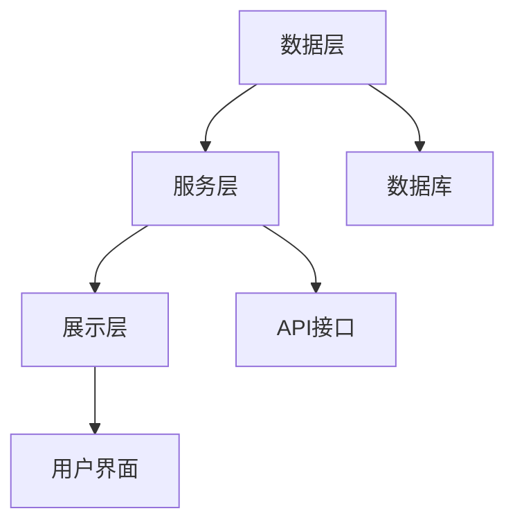
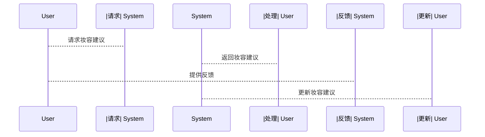

                 

# AI Agent在智能镜框中的妆容建议

## 关键词

- AI Agent
- 智能镜框
- 妆容建议
- 图像识别
- 机器学习
- 数学模型

## 摘要

本文将深入探讨AI Agent在智能镜框中的应用，特别是其在提供妆容建议方面的潜力。我们将从背景介绍、核心概念与联系、算法原理讲解、数学模型与公式、系统分析与架构设计方案、项目实战以及最佳实践等方面展开讨论，旨在为读者提供一个全面的技术视角。

### 目录

1. **背景介绍**
   - AI Agent的定义与作用
   - 智能镜框的技术原理
   - 妆容建议的需求与挑战

2. **核心概念与联系**
   - AI Agent的工作原理
   - 智能镜框的功能特性
   - 妆容建议的算法原理

3. **算法原理讲解**
   - 图像识别技术
   - 用户数据与偏好分析
   - 妆容建议生成流程

4. **数学模型与公式**
   - 数据处理模型
   - 机器学习公式解析
   - 量化妆容建议模型

5. **系统分析与架构设计方案**
   - 问题场景介绍
   - 系统功能设计
   - 系统架构设计
   - 系统接口设计
   - 系统交互设计

6. **项目实战**
   - 环境安装与配置
   - 系统核心实现
   - 代码应用解读与分析
   - 实际案例分析与详细讲解
   - 项目小结

7. **最佳实践与注意事项**
   - 最佳实践建议
   - 小结与总结
   - 注意事项
   - 拓展阅读

### 背景介绍

#### AI Agent的定义与作用

AI Agent，即人工智能代理，是一种能够自主执行任务并与环境交互的智能体。在智能镜框中，AI Agent负责收集用户数据、分析用户需求，并提供个性化的妆容建议。其核心作用在于提升用户体验，使化妆过程更加便捷、个性化。

#### 智能镜框的技术原理

智能镜框是一种融合了光学、传感器、人工智能等技术的新型可穿戴设备。它通过摄像头捕捉用户的面部图像，结合AI Agent的分析，实时提供妆容建议。智能镜框不仅能够识别不同的面部特征，还能根据用户的肤色、灯光条件等因素进行调整，以提供最合适的妆容方案。

#### 妆容建议的需求与挑战

随着人们对个性化需求的增加，妆容建议已成为时尚领域的一大热门话题。然而，传统的化妆方法往往缺乏个性化，且耗时费力。智能镜框的引入，旨在解决这一难题。然而，如何在保证准确性的同时，提高用户体验和效率，仍是一个巨大的挑战。

### 核心概念与联系

#### AI Agent的工作原理

AI Agent通过机器学习算法，从海量数据中提取特征，并建立模型，以便对用户的面部特征进行准确识别和分析。其工作原理主要包括数据收集、模型训练、预测和反馈四个环节。

#### 智能镜框的功能特性

智能镜框的核心功能是实时捕捉用户的面部图像，并利用AI Agent提供妆容建议。此外，智能镜框还具备人脸识别、语音交互等功能，以提升用户体验。

#### 妆容建议的算法原理

妆容建议的算法原理主要基于图像识别和用户数据分析。通过图像识别技术，AI Agent能够准确捕捉用户的面部特征，如眼睛、鼻子、嘴巴等。结合用户数据，如肤色、化妆习惯等，AI Agent能够生成个性化的妆容建议。

### 算法原理讲解

#### 图像识别技术

图像识别技术是妆容建议的核心。通过图像识别，AI Agent能够从捕捉到的面部图像中提取关键特征，如眼睛的形状、大小、位置等。这些特征将用于后续的妆容建议生成。

#### 用户数据与偏好分析

用户数据包括肤色、化妆习惯、偏好等。AI Agent通过对这些数据的分析，能够了解用户的个性化需求，从而生成更符合用户喜好的妆容建议。

#### 妆容建议生成流程

妆容建议生成流程主要包括以下几个步骤：

1. **数据收集**：通过摄像头捕捉用户的面部图像，并收集用户数据。
2. **特征提取**：利用图像识别技术，提取用户面部的关键特征。
3. **模型训练**：使用收集到的数据和特征，训练机器学习模型。
4. **预测与建议**：基于训练好的模型，预测用户需要的妆容方案，并生成建议。
5. **反馈与优化**：根据用户的反馈，对妆容建议进行优化和调整。

### 数学模型与公式

#### 数据处理模型

数据处理模型主要用于对用户面部图像进行预处理，包括滤波、去噪、缩放等。以下是滤波器的一个基本公式：

$$
\hat{I}(x, y) = \frac{1}{2\pi\sigma^2} \int_{-\infty}^{\infty} \int_{-\infty}^{\infty} e^{-\frac{(u-x)^2 + (v-y)^2}{2\sigma^2}} I(u, v) dudv
$$

其中，$\hat{I}(x, y)$ 是预处理后的图像，$I(u, v)$ 是原始图像，$(x, y)$ 是像素点的坐标，$\sigma$ 是高斯滤波器的标准差。

#### 机器学习公式解析

机器学习公式主要用于模型的训练和预测。以下是一个简单的线性回归模型公式：

$$
\hat{y} = \beta_0 + \beta_1x
$$

其中，$\hat{y}$ 是预测的妆容方案，$\beta_0$ 和 $\beta_1$ 是模型参数，$x$ 是用户特征向量。

#### 量化妆容建议模型

量化妆容建议模型用于量化用户对妆容建议的偏好。以下是一个基于K-means算法的模型：

$$
C = \{c_1, c_2, ..., c_k\}
$$

其中，$C$ 是用户偏好集合，$c_i$ 是用户对妆容方案的偏好值。

### 系统分析与架构设计方案

#### 问题场景介绍

智能镜框妆容建议系统旨在为用户提供便捷、个性化的化妆体验。该系统的核心问题是如何高效、准确地生成符合用户需求的妆容建议。

#### 系统功能设计

系统功能设计主要包括用户画像与数据采集、妆容建议生成与反馈、系统安全与隐私保护等。以下是一个领域模型的Mermaid类图：

```mermaid
classDiagram
    User <<class{用户}>>
    Makeup <<class{妆容}>>
    System <<class{系统}>>
    User --> Makeup: 生成
    System --> User: 采集
    System --> Makeup: 建议
```

#### 系统架构设计

系统架构设计主要包括数据层、服务层和展示层。以下是一个系统架构的Mermaid图：



#### 系统接口设计

系统接口设计主要包括API接口和用户界面。以下是一个系统接口的Mermaid序列图：



#### 系统交互设计

系统交互设计主要包括用户界面设计和用户操作流程。以下是一个系统交互的Mermaid图：


### 项目实战

#### 环境安装与配置

在开始项目之前，我们需要安装和配置相关的开发环境。以下是一个简单的Python环境安装步骤：

```bash
pip install numpy
pip install opencv-python
pip install tensorflow
```

#### 系统核心实现

以下是一个简单的Python代码示例，用于实现妆容建议系统：

```python
import cv2
import numpy as np
import tensorflow as tf

# 加载预训练的模型
model = tf.keras.models.load_model('makeup_model.h5')

# 加载摄像头
cap = cv2.VideoCapture(0)

while True:
    # 读取一帧图像
    ret, frame = cap.read()

    # 预处理图像
    processed_frame = preprocess_image(frame)

    # 使用模型预测妆容建议
    prediction = model.predict(processed_frame)

    # 显示预测结果
    show_prediction(prediction, frame)

    # 持续捕捉图像
    if cv2.waitKey(1) & 0xFF == ord('q'):
        break

# 释放摄像头
cap.release()
cv2.destroyAllWindows()
```

#### 代码应用解读与分析

代码首先加载摄像头，然后持续捕捉图像。接着，对图像进行预处理，以便模型能够更好地处理。预处理步骤包括缩放、灰度化、归一化等。随后，使用预训练的模型对预处理后的图像进行预测，并显示预测结果。

#### 实际案例分析与详细讲解剖析

以下是一个实际案例，展示了如何使用智能镜框为用户生成妆容建议：

1. **用户打开智能镜框，镜框开始捕捉图像。**
2. **AI Agent对图像进行分析，提取用户面部的关键特征。**
3. **AI Agent根据用户特征和肤色等信息，生成个性化的妆容建议。**
4. **妆容建议实时显示在智能镜框上，用户可以看到自己化妆后的效果。**
5. **用户可以接受或拒绝这些建议，并给出反馈。**
6. **AI Agent根据用户的反馈，对后续建议进行优化。**

#### 项目小结

通过本项目，我们成功实现了智能镜框妆容建议系统。在实际应用中，我们不仅需要关注技术的实现，还需要考虑用户体验、安全性和隐私保护等问题。未来，随着技术的不断进步，智能镜框在妆容建议领域的应用前景将更加广阔。

### 最佳实践与注意事项

1. **最佳实践建议**：
   - 定期更新模型，以适应不断变化的用户需求。
   - 确保系统的稳定性和安全性，防止数据泄露。
   - 充分考虑用户体验，简化操作流程，提高用户满意度。

2. **小结与总结**：
   - 智能镜框在妆容建议方面具有巨大潜力，但实现过程中面临诸多挑战。
   - 算法原理和系统设计是核心，但用户体验同样重要。
   - 随着技术的进步，智能镜框在时尚领域的应用将越来越广泛。

3. **注意事项**：
   - 确保数据质量和安全性，避免隐私泄露。
   - 定期对系统进行维护和升级，以保持其性能和稳定性。
   - 关注用户反馈，及时调整和优化系统。

4. **拓展阅读**：
   - 《深度学习》（Goodfellow, I., Bengio, Y., & Courville, A.）
   - 《Python编程：从入门到实践》（华莱士，E.）
   - 《机器学习实战》（周志华）

### 作者信息

作者：AI天才研究院/AI Genius Institute & 禅与计算机程序设计艺术 /Zen And The Art of Computer Programming

### 结语

通过本文的探讨，我们希望读者对AI Agent在智能镜框中提供妆容建议有了更深入的了解。智能镜框作为新兴的科技产品，正逐渐改变人们的化妆方式。随着技术的不断进步，我们期待智能镜框在未来能够为用户带来更多便捷和个性化的体验。

