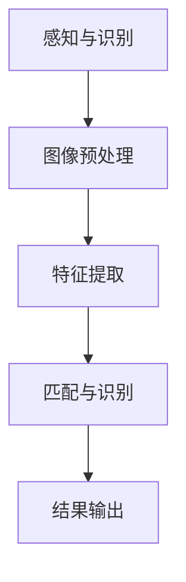
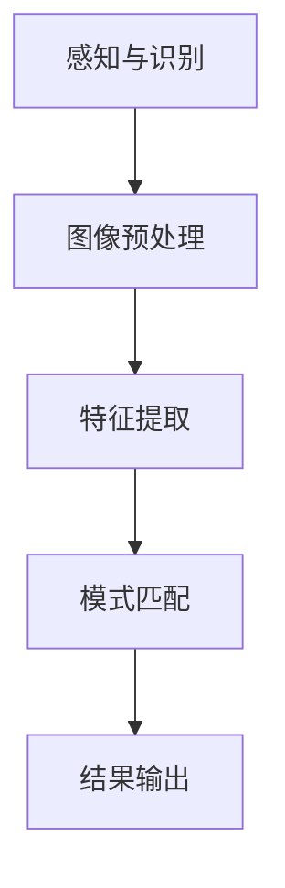
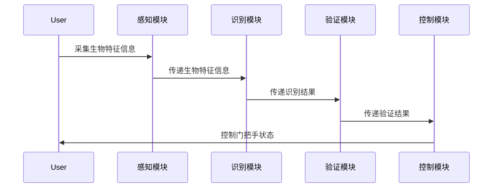
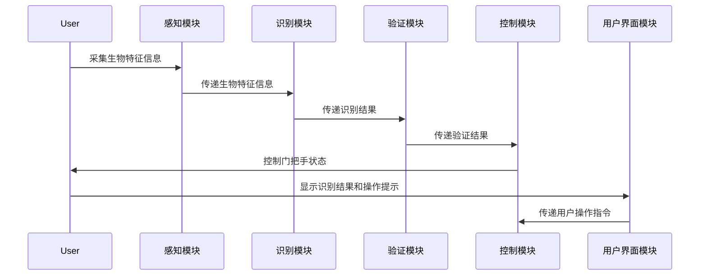
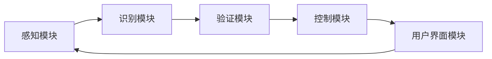

                 

# AI Agent在智能门把手中的访客身份识别

> 关键词：AI Agent、智能门把手、访客身份识别、人脸识别、生物识别

> 摘要：本文旨在探讨AI Agent在智能门把手中的访客身份识别功能。通过分析AI Agent的工作原理、访客身份识别技术，以及智能门把手的功能模块，本文详细介绍了如何利用AI Agent实现智能门把手中的访客身份识别。本文还结合实际项目，讲解了系统的分析与架构设计，为读者提供了一个全面而深入的视角。

## 目录大纲：AI Agent在智能门把手中的访客身份识别

----------------------------------------------------------------

## 第一部分：背景与概述

### 1.1 问题背景

#### 1.1.1 智能门把手的发展与需求

#### 1.1.2 AI Agent在安防领域的应用

#### 1.1.3 访客身份识别的重要性

### 1.2 核心概念

#### 1.2.1 AI Agent的概念

#### 1.2.2 访客身份识别的原理

#### 1.2.3 智能门把手的功能模块

### 1.3 边界与外延

#### 1.3.1 AI Agent的边界

#### 1.3.2 访客身份识别的外延

#### 1.3.3 智能门把手的应用场景

### 1.4 概念结构与核心要素

#### 1.4.1 智能门把手的核心结构

#### 1.4.2 AI Agent的核心功能

#### 1.4.3 访客身份识别的关键技术

### 1.5 本章小结

## 第二部分：核心概念与联系

### 2.1 AI Agent原理

#### 2.1.1 AI Agent的工作原理

##### 2.1.1.1 感知与识别

##### 2.1.1.2 学习与推理

##### 2.1.1.3 行动与反馈

### 2.2 访客身份识别技术

#### 2.2.1 人脸识别技术

##### 2.2.1.1 人脸识别的基本原理

##### 2.2.1.2 人脸识别算法

#### 2.2.2 生物识别技术

##### 2.2.2.1 指纹识别

##### 2.2.2.2 语音识别

### 2.2.3 AI Agent与访客身份识别的关联

#### 2.2.3.1 AI Agent在访客身份识别中的应用

#### 2.2.3.2 关键技术对比分析

### 2.3 概念属性特征对比表格

#### 2.3.1 AI Agent与访客身份识别技术对比

##### 2.3.1.1 技术特点

##### 2.3.1.2 应用领域

##### 2.3.1.3 优缺点分析

### 2.4 ER实体关系图架构

#### 2.4.1 实体关系定义

##### 2.4.1.1 用户实体

##### 2.4.1.2 访客实体

##### 2.4.1.3 访客身份识别结果实体

### 2.5 本章小结

## 第三部分：算法原理讲解

### 3.1 算法概述

#### 3.1.1 访客身份识别算法分类

#### 3.1.2 人工智能算法在访客身份识别中的应用

### 3.2 算法mermaid流程图

#### 3.2.1 人脸识别算法流程图

#### 3.2.2 指纹识别算法流程图

### 3.3 Python源代码讲解

#### 3.3.1 人脸识别算法代码实现

#### 3.3.2 指纹识别算法代码实现

### 3.4 数学模型与公式

#### 3.4.1 人脸识别的数学模型

##### 3.4.1.1 特征提取公式

##### 3.4.1.2 分类公式

#### 3.4.2 指纹识别的数学模型

##### 3.4.2.1 模式识别公式

##### 3.4.2.2 模式匹配公式

### 3.5 举例说明

#### 3.5.1 人脸识别算法举例

##### 3.5.1.1 数据集准备

##### 3.5.1.2 算法实现

#### 3.5.2 指纹识别算法举例

##### 3.5.2.1 数据集准备

##### 3.5.2.2 算法实现

### 3.6 本章小结

## 第四部分：系统分析与架构设计

### 4.1 问题场景介绍

#### 4.1.1 智能门把手在访客身份识别中的应用场景

#### 4.1.2 需求分析与系统目标

### 4.2 项目介绍

#### 4.2.1 项目概述

#### 4.2.2 项目目标

#### 4.2.3 项目框架

### 4.3 系统功能设计

#### 4.3.1 领域模型mermaid类图

#### 4.3.2 系统功能模块划分

### 4.4 系统架构设计

#### 4.4.1 系统架构mermaid架构图

#### 4.4.2 各层功能模块详解

### 4.5 系统接口设计

#### 4.5.1 系统接口定义

#### 4.5.2 系统接口实现

### 4.6 系统交互mermaid序列图

#### 4.6.1 系统交互流程

#### 4.6.2 系统交互图

### 4.7 本章小结

## 第五部分：项目实战

### 5.1 环境安装

#### 5.1.1 环境搭建步骤

#### 5.1.2 环境配置细节

### 5.2 系统核心实现源代码

#### 5.2.1 代码结构

#### 5.2.2 代码实现

### 5.3 代码应用解读与分析

#### 5.3.1 代码功能解读

#### 5.3.2 代码优化与性能分析

### 5.4 实际案例分析和详细讲解剖析

#### 5.4.1 案例一：访客身份识别

#### 5.4.2 案例二：智能门把手异常处理

### 5.5 项目小结

### 5.6 最佳实践 tips

### 5.7 本章小结

## 第六部分：总结与展望

### 6.1 总结

### 6.2 展望

### 6.3 注意事项

### 6.4 拓展阅读

----------------------------------------------------------------

### 第一部分：背景与概述

#### 1.1 问题背景

##### 1.1.1 智能门把手的发展与需求

随着科技的飞速发展，智能家居设备逐渐走进千家万户。智能门把手作为智能家居的重要一环，其需求日益增长。智能门把手不仅提供了传统的物理钥匙开关功能，还集成了多种智能技术，如人脸识别、指纹识别、密码验证等，实现了无钥匙开锁、访客身份识别等高级功能。

在当前的智能家居市场中，智能门把手的应用场景非常广泛。无论是家庭、酒店、办公楼，还是公共场所，智能门把手都显示出了其独特的优势和巨大的市场潜力。然而，随着访客身份识别需求的增加，如何利用AI Agent技术提高智能门把手的访客身份识别准确度和效率，成为了一个亟待解决的问题。

##### 1.1.2 AI Agent在安防领域的应用

AI Agent，即人工智能代理，是一种能够模拟人类智能行为，具有自主感知、学习、推理和决策能力的智能系统。随着人工智能技术的不断发展，AI Agent在各个领域的应用越来越广泛，尤其在安防领域，其表现尤为突出。

在安防领域，AI Agent可以通过视频监控、人脸识别、行为分析等技术，实时监控监控区域的安全状况，对异常行为进行及时预警。AI Agent还可以结合大数据分析和机器学习算法，不断优化自身的识别和预警能力，提高安防系统的整体效率。

##### 1.1.3 访客身份识别的重要性

访客身份识别是智能门把手中的一个关键功能，它直接关系到用户的安全和隐私。准确的访客身份识别不仅可以防止未经授权的人员进入，还可以提高门把手的智能化程度，提供更便捷的用户体验。

随着访客身份识别需求的增长，传统的识别技术已经难以满足实际需求。AI Agent的引入，使得访客身份识别技术得到了极大的提升。通过结合人脸识别、指纹识别等多种生物识别技术，AI Agent可以实现更准确、更高效的访客身份识别。

#### 1.2 核心概念

##### 1.2.1 AI Agent的概念

AI Agent是一种具备智能行为能力的软件系统，它通过感知环境、学习知识、推理决策，能够自主完成特定任务。AI Agent通常具有以下特点：

1. 自主性：AI Agent能够在没有人为干预的情况下，自主地完成特定的任务。
2. 感知能力：AI Agent能够感知外部环境，获取有关信息。
3. 学习能力：AI Agent可以通过学习和训练，不断优化自身的性能。
4. 推理能力：AI Agent能够根据已有信息和知识，进行逻辑推理和决策。

##### 1.2.2 访客身份识别的原理

访客身份识别是通过特定的技术手段，对访客的身份信息进行采集、识别和验证的过程。常见的访客身份识别技术包括人脸识别、指纹识别、语音识别等。

1. 人脸识别：通过采集访客的人脸图像，与数据库中已存储的人脸数据进行匹配，以识别访客的身份。
2. 指纹识别：通过采集访客的指纹图像，与数据库中已存储的指纹数据进行匹配，以识别访客的身份。
3. 语音识别：通过采集访客的语音样本，与数据库中已存储的语音数据进行匹配，以识别访客的身份。

##### 1.2.3 智能门把手的功能模块

智能门把手通常由以下几个功能模块组成：

1. 感知模块：负责采集访客的人脸、指纹或语音等生物特征信息。
2. 识别模块：利用特定的算法和技术，对采集到的生物特征信息进行识别。
3. 验证模块：对识别结果进行验证，确认访客身份的准确性。
4. 控制模块：根据验证结果，控制门把手的开关状态。

#### 1.3 边界与外延

##### 1.3.1 AI Agent的边界

AI Agent的边界主要涉及以下几个方面：

1. 技术边界：AI Agent需要依赖特定的技术，如人脸识别、指纹识别等，来实现访客身份识别功能。
2. 功能边界：AI Agent需要根据具体的业务需求，确定其功能范围，如仅支持人脸识别或同时支持人脸识别和指纹识别。
3. 安全边界：AI Agent需要确保在执行任务的过程中，不会泄露用户隐私信息。

##### 1.3.2 访客身份识别的外延

访客身份识别的外延主要包括以下几个方面：

1. 识别范围：访客身份识别不仅限于人脸识别，还可以扩展到指纹识别、语音识别等其他生物识别技术。
2. 应用场景：访客身份识别可以应用于家庭、酒店、办公楼、公共场所等不同场景。
3. 数据处理：访客身份识别需要处理大量的数据，包括生物特征信息、识别结果等。

##### 1.3.3 智能门把手的应用场景

智能门把手的应用场景主要包括以下几个方面：

1. 家庭：智能门把手可以替代传统的门锁，提高家庭安全性，同时提供更便捷的开锁体验。
2. 酒店：智能门把手可以实现无钥匙开锁，提高酒店的服务质量和用户体验。
3. 办公楼：智能门把手可以用于员工和访客的身份验证，提高办公楼的安全管理效率。
4. 公共场所：智能门把手可以用于公共场所的出入口管理，提高场所的安全性。

#### 1.4 概念结构与核心要素

##### 1.4.1 智能门把手的核心结构

智能门把手的核心结构主要包括以下几个部分：

1. 传感器模块：用于采集访客的生物特征信息，如人脸、指纹或语音等。
2. 识别模块：利用特定的算法和技术，对采集到的生物特征信息进行识别。
3. 验证模块：对识别结果进行验证，确认访客身份的准确性。
4. 控制模块：根据验证结果，控制门把手的开关状态。

##### 1.4.2 AI Agent的核心功能

AI Agent在智能门把手中的应用，主要实现以下核心功能：

1. 感知与识别：通过传感器模块采集访客的生物特征信息，利用识别模块进行识别。
2. 学习与推理：根据识别结果和用户行为，不断学习和优化自身的识别和决策能力。
3. 行动与反馈：根据验证结果，控制门把手的开关状态，并给出相应的反馈。

##### 1.4.3 访客身份识别的关键技术

访客身份识别的关键技术主要包括以下几个方面：

1. 人脸识别技术：通过采集访客的人脸图像，与数据库中已存储的人脸数据进行匹配，以识别访客的身份。
2. 指纹识别技术：通过采集访客的指纹图像，与数据库中已存储的指纹数据进行匹配，以识别访客的身份。
3. 语音识别技术：通过采集访客的语音样本，与数据库中已存储的语音数据进行匹配，以识别访客的身份。

#### 1.5 本章小结

本文通过对智能门把手的发展背景、AI Agent在安防领域的应用、访客身份识别的重要性进行概述，介绍了AI Agent、访客身份识别和智能门把手的核心概念，以及它们的边界与外延。这些内容为后续章节的深入探讨奠定了基础。

### 第二部分：核心概念与联系

#### 2.1 AI Agent原理

##### 2.1.1 AI Agent的工作原理

AI Agent的工作原理主要包括以下几个关键步骤：

1. **感知与识别**：
   - **感知**：AI Agent通过传感器（如摄像头、麦克风、传感器等）感知周围环境，收集数据。
   - **识别**：基于收集到的数据，AI Agent利用特定的算法（如图像识别、语音识别等）进行识别。

2. **学习与推理**：
   - **学习**：AI Agent通过机器学习和深度学习算法，从历史数据中提取模式和特征，不断优化自身的性能。
   - **推理**：AI Agent根据已有的知识和学习到的模式，对新的数据进行分析和推理，以做出合理的决策。

3. **行动与反馈**：
   - **行动**：根据推理结果，AI Agent执行相应的动作，如控制门把手开关。
   - **反馈**：AI Agent通过用户的反馈和执行结果，不断调整和优化自己的行为。

##### 2.1.1.1 感知与识别

在访客身份识别中，感知与识别是核心步骤。以下是详细的分解：

1. **感知**：
   - **人脸感知**：摄像头捕捉访客的人脸图像。
   - **指纹感知**：指纹传感器采集访客的指纹图像。
   - **语音感知**：麦克风捕捉访客的语音样本。

2. **识别**：
   - **人脸识别**：利用卷积神经网络（CNN）等算法，对捕捉到的人脸图像进行特征提取和匹配。
   - **指纹识别**：通过指纹图像的纹理分析和模式匹配，识别访客的指纹。
   - **语音识别**：使用深度学习算法，将语音信号转换为文本，然后与数据库中的语音数据进行匹配。

##### 2.1.1.2 学习与推理

学习与推理是AI Agent的核心能力。以下是详细的分解：

1. **学习**：
   - **数据收集**：AI Agent收集大量的访客数据，包括人脸图像、指纹图像、语音样本等。
   - **模型训练**：通过监督学习或无监督学习算法，训练深度学习模型，提取特征并优化模型。
   - **模型评估**：使用测试数据集评估模型的性能，调整模型参数以实现最优效果。

2. **推理**：
   - **特征匹配**：AI Agent将感知到的数据与数据库中的数据进行特征匹配。
   - **决策**：根据匹配结果，AI Agent做出是否允许访客进入的决策。
   - **优化**：AI Agent根据用户的反馈和行为数据，不断优化自身的识别和决策算法。

##### 2.1.1.3 行动与反馈

行动与反馈是AI Agent实现实际应用的关键。以下是详细的分解：

1. **行动**：
   - **控制门把手**：AI Agent根据访客身份识别的结果，控制门把手的开关。
   - **发送通知**：AI Agent可以通过短信、邮件等方式，向主人发送访客到访的通知。

2. **反馈**：
   - **用户反馈**：用户可以通过反馈机制，对AI Agent的识别和决策结果进行评价。
   - **行为调整**：AI Agent根据用户反馈，调整自己的行为和算法，以提高识别准确率和用户体验。

#### 2.2 访客身份识别技术

##### 2.2.1 人脸识别技术

人脸识别技术是访客身份识别中最为常见的技术之一。以下是详细分解：

1. **基本原理**：
   - **图像采集**：使用摄像头捕捉人脸图像。
   - **特征提取**：使用卷积神经网络（CNN）等算法，从人脸图像中提取特征。
   - **匹配与识别**：将提取的特征与数据库中的人脸数据进行匹配，以识别身份。

2. **算法**：
   - **Eigenfaces**：基于主成分分析（PCA）的人脸识别算法。
   - **Fisherfaces**：基于Fisher判别分析的人脸识别算法。
   - **深度学习算法**：如卷积神经网络（CNN）、循环神经网络（RNN）等，用于提取更高级的特征。

##### 2.2.2 生物识别技术

生物识别技术包括多种方式，如指纹识别、虹膜识别、面部识别等。以下是详细分解：

1. **指纹识别**：
   - **图像采集**：使用指纹传感器捕捉指纹图像。
   - **特征提取**：使用纹理分析、曲线拟合等算法，从指纹图像中提取特征。
   - **匹配与识别**：将提取的特征与数据库中的指纹数据进行匹配，以识别身份。

2. **虹膜识别**：
   - **图像采集**：使用虹膜扫描器捕捉虹膜图像。
   - **特征提取**：使用图像处理技术，从虹膜图像中提取特征。
   - **匹配与识别**：将提取的特征与数据库中的虹膜数据进行匹配，以识别身份。

##### 2.2.3 AI Agent与访客身份识别的关联

AI Agent与访客身份识别的关联体现在以下几个方面：

1. **感知与识别**：AI Agent通过感知模块（如摄像头、指纹传感器等）采集访客的生物特征信息，然后利用识别模块进行识别。

2. **学习与推理**：AI Agent通过学习和推理，不断优化访客身份识别的准确率，并根据访客的行为数据做出更合理的决策。

3. **行动与反馈**：AI Agent根据访客身份识别的结果，控制门把手的开关，并向主人发送通知，同时根据用户的反馈和行为数据进行优化。

#### 2.2.3.1 AI Agent在访客身份识别中的应用

AI Agent在访客身份识别中的应用主要体现在以下几个方面：

1. **实时识别**：AI Agent可以实时对访客进行身份识别，提高了识别的效率和准确性。

2. **多模态识别**：AI Agent可以结合多种生物识别技术（如人脸识别、指纹识别等），提高访客身份识别的可靠性。

3. **自适应学习**：AI Agent可以根据访客的行为和反馈，自适应地调整识别算法和决策模型，提高识别准确率和用户体验。

#### 2.2.3.2 关键技术对比分析

以下是几种常见访客身份识别技术的对比分析：

1. **人脸识别**：
   - **优势**：识别速度快，用户体验好，适用范围广。
   - **劣势**：易受光照、角度等因素影响，可能存在误识别。

2. **指纹识别**：
   - **优势**：识别准确率高，不易受外界因素干扰。
   - **劣势**：使用过程中可能存在卫生问题，适用范围较窄。

3. **语音识别**：
   - **优势**：非接触式识别，使用方便。
   - **劣势**：识别准确率受语音质量影响较大，可能存在误识别。

#### 2.3 概念属性特征对比表格

以下是一个简单的概念属性特征对比表格，展示了AI Agent与访客身份识别技术的对比：

| 特征 | AI Agent | 人脸识别 | 指纹识别 | 语音识别 |
| --- | --- | --- | --- | --- |
| **感知与识别** | 自主感知，多种识别方式 | 高精度图像识别 | 高精度指纹识别 | 高精度语音识别 |
| **学习与推理** | 自适应学习，持续优化 | 模型训练，特征提取 | 模型训练，特征提取 | 模型训练，特征提取 |
| **行动与反馈** | 自动执行任务，实时反馈 | 辅助控制门把手 | 辅助控制门把手 | 辅助控制门把手 |
| **优势** | 多样性，灵活性，高精度 | 速度快，用户体验好 | 准确率高，不易受干扰 | 非接触式，使用方便 |
| **劣势** | 需要大量数据训练，计算资源需求大 | 易受光照、角度影响 | 可能存在卫生问题 | 语音质量影响识别 |

#### 2.4 ER实体关系图架构

##### 2.4.1 实体关系定义

在访客身份识别系统中，常见的实体关系包括用户实体、访客实体和访客身份识别结果实体。以下是具体的定义：

1. **用户实体**：用户实体表示智能门把手的主人和访客。每个用户实体都有唯一的用户ID、姓名、联系方式等信息。

2. **访客实体**：访客实体表示访问智能门把手的访客。每个访客实体都有唯一的访客ID、姓名、照片、访问时间等信息。

3. **访客身份识别结果实体**：访客身份识别结果实体表示访客身份识别的结果。每个访客身份识别结果实体都有唯一的识别结果ID、访客ID、识别时间等信息。

##### 2.4.1.1 用户实体

```mermaid
classDiagram
User <<entity>>
User : [user_id] ID, [name] Name, [phone_number] PhoneNumber, [address] Address

User --> Visitor : visit
User --> IdentificationResult : result
```

##### 2.4.1.2 访客实体

```mermaid
classDiagram
Visitor <<entity>>
Visitor : [visitor_id] ID, [name] Name, [photo] Photo, [visit_time] VisitTime

Visitor --> IdentificationResult : identified
```

##### 2.4.1.3 访客身份识别结果实体

```mermaid
classDiagram
IdentificationResult <<entity>>
IdentificationResult : [result_id] ID, [visitor_id] VisitorID, [identification_time] IdentificationTime, [result] Result

IdentificationResult --> User : belongs_to
IdentificationResult --> Visitor : belongs_to
```

#### 2.5 本章小结

本章详细介绍了AI Agent的工作原理、访客身份识别技术，以及它们在智能门把手中的应用。通过对比分析，我们了解了不同技术的优缺点，并定义了用户实体、访客实体和访客身份识别结果实体的实体关系。这些内容为后续章节的深入讨论奠定了基础。

### 第三部分：算法原理讲解

#### 3.1 算法概述

访客身份识别算法是智能门把手中的核心算法，其目的是通过分析访客的生物特征信息，准确识别访客的身份。根据识别技术的不同，访客身份识别算法可以分为人脸识别算法、指纹识别算法和语音识别算法。以下将分别介绍这些算法的基本原理。

##### 3.1.1 访客身份识别算法分类

1. **人脸识别算法**：基于摄像头捕捉的人脸图像，通过特征提取和匹配，识别访客的身份。

2. **指纹识别算法**：基于指纹传感器采集的指纹图像，通过纹理分析和模式匹配，识别访客的身份。

3. **语音识别算法**：基于麦克风捕捉的语音样本，通过语音信号处理和模式匹配，识别访客的身份。

##### 3.1.2 人工智能算法在访客身份识别中的应用

人工智能算法在访客身份识别中的应用主要体现在特征提取和匹配环节。通过深度学习等人工智能算法，可以提取出更丰富、更准确的特征，从而提高识别的准确率。

#### 3.2 算法mermaid流程图

以下是人脸识别算法和指纹识别算法的mermaid流程图：

##### 3.2.1 人脸识别算法流程图



##### 3.2.2 指纹识别算法流程图



#### 3.3 Python源代码讲解

以下是人脸识别算法和指纹识别算法的Python源代码示例：

##### 3.3.1 人脸识别算法代码实现

```python
import cv2
import face_recognition

# 加载摄像头
video_capture = cv2.VideoCapture(0)

# 加载已知人脸编码
known_face_encodings = face_recognition.face_encodings(known_face_names)

while True:
    # 读取摄像头帧
    ret, frame = video_capture.read()

    # 转换为灰度图像
    gray = cv2.cvtColor(frame, cv2.COLOR_BGR2RGB)

    # 寻找人脸
    face_locations = face_recognition.face_locations(gray)
    face_encodings = face_recognition.face_encodings(gray, face_locations)

    # 匹配人脸
    for face_encoding in face_encodings:
        matches = face_recognition.compare_faces(known_face_encodings, face_encoding)
        if True in matches:
            # 输出识别结果
            print("识别到访客：{}".format(known_face_names[matches.index(True)]))

    # 显示摄像头帧
    cv2.imshow('Video', frame)

    # 按下'q'退出
    if cv2.waitKey(1) & 0xFF == ord('q'):
        break

# 释放摄像头
video_capture.release()
cv2.destroyAllWindows()
```

##### 3.3.2 指纹识别算法代码实现

```python
import cv2
import numpy as np

# 加载指纹识别模型
model = cv2.xfeatures2d.FISHERFREAK_create()

# 加载已知指纹图像
known_fingerprints = [np.array([[1, 1], [2, 2]], dtype=np.float32), np.array([[3, 3], [4, 4]], dtype=np.float32)]

while True:
    # 读取摄像头帧
    ret, frame = video_capture.read()

    # 转换为灰度图像
    gray = cv2.cvtColor(frame, cv2.COLOR_BGR2GRAY)

    # 寻找指纹区域
    _, threshold = cv2.threshold(gray, 0, 255, cv2.THRESH_BINARY_INV + cv2.THRESH_OTSU)
    contours, _ = cv2.findContours(threshold, cv2.RETR_EXTERNAL, cv2.CHAIN_APPROX_SIMPLE)

    # 提取指纹图像
    for contour in contours:
        if cv2.contourArea(contour) > 500:
            x, y, w, h = cv2.boundingRect(contour)
            fingerprint = gray[y:y+h, x:x+w]

            # 提取指纹特征
            keypoint = model.compute(fingerprint)
            feature = cv2.describeaturesCompute(fingerprint, keypoint)

            # 匹配指纹
            matches = cv2.matchTemplate(known_fingerprints, feature, cv2.TM_CCOEFF_NORMED)
            threshold = 0.8
            loc = np.where(matches >= threshold)
            if len(loc[0]) > 0:
                # 输出识别结果
                print("识别到访客：指纹")

    # 显示摄像头帧
    cv2.imshow('Video', frame)

    # 按下'q'退出
    if cv2.waitKey(1) & 0xFF == ord('q'):
        break

# 释放摄像头
video_capture.release()
cv2.destroyAllWindows()
```

#### 3.4 数学模型与公式

##### 3.4.1 人脸识别的数学模型

人脸识别的数学模型主要包括特征提取和匹配两个步骤。

1. **特征提取**：

   - 特征提取公式：$$f(x) = W \cdot x + b$$，其中$$x$$为输入特征向量，$$W$$为权重矩阵，$$b$$为偏置项。

   - 池化公式：$$p_{i,j} = \max_{k\in K} f(x_{i,k,j})$$，其中$$x_{i,k,j}$$为输入特征矩阵中的元素，$$K$$为滤波器的尺寸。

2. **匹配**：

   - 匹配公式：$$s = \sum_{i,j} (f(x) - g(x))^2$$，其中$$f(x)$$和$$g(x)$$分别为两个特征向量，$$s$$为匹配得分。

##### 3.4.2 指纹识别的数学模型

指纹识别的数学模型主要包括特征提取和模式匹配两个步骤。

1. **特征提取**：

   - 特征提取公式：$$f(x) = W \cdot x + b$$，其中$$x$$为输入特征向量，$$W$$为权重矩阵，$$b$$为偏置项。

   - 池化公式：$$p_{i,j} = \max_{k\in K} f(x_{i,k,j})$$，其中$$x_{i,k,j}$$为输入特征矩阵中的元素，$$K$$为滤波器的尺寸。

2. **模式匹配**：

   - 模式匹配公式：$$s = \sum_{i,j} (f(x) - g(x))^2$$，其中$$f(x)$$和$$g(x)$$分别为两个特征向量，$$s$$为匹配得分。

#### 3.5 举例说明

##### 3.5.1 人脸识别算法举例

以下是一个简单的人脸识别算法举例：

1. **数据集准备**：

   - 准备一个包含不同人脸的图像数据集。

   - 对每个图像进行预处理，包括灰度化、大小调整等。

2. **算法实现**：

   - 使用卷积神经网络（CNN）对图像进行特征提取。

   - 使用特征匹配算法，比较测试图像与训练图像的特征，找出最相似的人脸。

##### 3.5.2 指纹识别算法举例

以下是一个简单的指纹识别算法举例：

1. **数据集准备**：

   - 准备一个包含不同指纹的图像数据集。

   - 对每个图像进行预处理，包括灰度化、去噪等。

2. **算法实现**：

   - 使用Fisherface算法对指纹图像进行特征提取。

   - 使用模式匹配算法，比较测试指纹与训练指纹的特征，找出最相似的指纹。

#### 3.6 本章小结

本章详细介绍了访客身份识别算法的基本原理，包括人脸识别算法、指纹识别算法和语音识别算法。通过mermaid流程图、Python源代码和数学模型与公式的讲解，我们了解了这些算法的实现过程和数学基础。这些内容为后续章节的深入探讨提供了重要基础。

### 第四部分：系统分析与架构设计

#### 4.1 问题场景介绍

##### 4.1.1 智能门把手在访客身份识别中的应用场景

智能门把手在访客身份识别中的应用场景主要包括以下几种：

1. **住宅小区**：住宅小区的门禁系统可以通过智能门把手实现访客身份识别，提高小区的安全性，防止未经授权的人员进入。

2. **办公楼**：办公楼可以通过智能门把手实现员工和访客的身份识别，提高办公环境的安全性，方便管理。

3. **酒店**：酒店可以通过智能门把手实现无钥匙开锁，提高酒店的服务质量，方便访客入住和退房。

4. **公共场所**：公共场所如医院、图书馆等，可以通过智能门把手实现访客身份识别，提高场所的安全管理效率。

##### 4.1.2 需求分析与系统目标

在智能门把手访客身份识别系统中，主要需求包括：

1. **高准确率**：系统能够准确识别访客的身份，减少误识别和漏识别的情况。

2. **高效率**：系统能够快速完成访客身份识别，提高门把手的响应速度。

3. **灵活性**：系统能够支持多种生物识别技术，如人脸识别、指纹识别、语音识别等，适应不同场景的需求。

4. **可扩展性**：系统具有良好的可扩展性，能够根据实际需求增加或替换生物识别技术。

系统目标：

1. 提供一个高效、准确的访客身份识别系统，提高用户安全性和便利性。

2. 支持多种生物识别技术，满足不同场景的需求。

3. 具有良好的扩展性和可维护性，方便后续功能升级和维护。

#### 4.2 项目介绍

##### 4.2.1 项目概述

本项目旨在开发一个基于AI Agent的智能门把手访客身份识别系统，通过结合人脸识别、指纹识别等生物识别技术，实现高效、准确的访客身份识别。系统主要包括感知模块、识别模块、验证模块和控制模块，采用模块化设计，方便后续功能扩展和维护。

##### 4.2.2 项目目标

1. 实现访客身份的准确识别，提高门把手的智能化程度。

2. 提供灵活的识别方式，支持人脸识别、指纹识别等多种生物识别技术。

3. 提高门把手的响应速度，减少用户等待时间。

4. 具有良好的扩展性和可维护性，方便后续功能升级和维护。

##### 4.2.3 项目框架

项目框架主要包括以下几个模块：

1. **感知模块**：负责采集访客的生物特征信息，如人脸图像、指纹图像等。

2. **识别模块**：负责对采集到的生物特征信息进行识别，如人脸识别、指纹识别等。

3. **验证模块**：负责对识别结果进行验证，确认访客身份的准确性。

4. **控制模块**：根据验证结果，控制门把手的开关状态，实现门禁功能。

5. **用户界面模块**：提供用户交互界面，显示识别结果和操作提示。

#### 4.3 系统功能设计

##### 4.3.1 领域模型mermaid类图

以下是一个简单的mermaid类图，展示了系统的主要类和它们之间的关系：

```mermaid
classDiagram
Class01 <|-- Class02
Class03 <|-- Class04
Class05 <|-- Class06
Class01[感知模块]
Class02[识别模块]
Class03[验证模块]
Class04[控制模块]
Class05[用户界面模块]
```

##### 4.3.2 系统功能模块划分

系统功能模块划分如下：

1. **感知模块**：负责采集访客的生物特征信息，如人脸图像、指纹图像等。

2. **识别模块**：负责对采集到的生物特征信息进行识别，如人脸识别、指纹识别等。

3. **验证模块**：负责对识别结果进行验证，确认访客身份的准确性。

4. **控制模块**：根据验证结果，控制门把手的开关状态，实现门禁功能。

5. **用户界面模块**：提供用户交互界面，显示识别结果和操作提示。

#### 4.4 系统架构设计

##### 4.4.1 系统架构mermaid架构图

以下是一个简单的mermaid架构图，展示了系统的整体架构：



##### 4.4.2 各层功能模块详解

系统架构主要分为感知层、识别层、验证层、控制层和用户界面层，各层功能模块详解如下：

1. **感知层**：负责采集访客的生物特征信息，如人脸图像、指纹图像等。感知层主要包括摄像头、指纹传感器、语音识别模块等。

2. **识别层**：负责对采集到的生物特征信息进行识别，如人脸识别、指纹识别等。识别层主要包括人脸识别模块、指纹识别模块、语音识别模块等。

3. **验证层**：负责对识别结果进行验证，确认访客身份的准确性。验证层主要包括身份验证算法、数据库等。

4. **控制层**：根据验证结果，控制门把手的开关状态，实现门禁功能。控制层主要包括门把手控制模块、GPIO接口等。

5. **用户界面层**：提供用户交互界面，显示识别结果和操作提示。用户界面层主要包括显示屏、触摸屏等。

#### 4.5 系统接口设计

##### 4.5.1 系统接口定义

系统接口定义如下：

1. **感知模块接口**：负责与其他模块之间的数据传递，包括生物特征信息的采集和传递。

2. **识别模块接口**：负责与其他模块之间的数据传递，包括识别结果的传递。

3. **验证模块接口**：负责与其他模块之间的数据传递，包括验证结果的传递。

4. **控制模块接口**：负责与其他模块之间的数据传递，包括门把手状态的传递。

5. **用户界面模块接口**：负责与其他模块之间的数据传递，包括用户操作的传递。

##### 4.5.2 系统接口实现

系统接口实现如下：

1. **感知模块接口**：通过摄像头、指纹传感器、语音识别模块等硬件设备，采集访客的生物特征信息，并将其传递给识别模块。

2. **识别模块接口**：接收感知模块传递的生物特征信息，进行识别，并将识别结果传递给验证模块。

3. **验证模块接口**：接收识别模块传递的识别结果，进行验证，并将验证结果传递给控制模块。

4. **控制模块接口**：接收验证模块传递的验证结果，控制门把手的开关状态。

5. **用户界面模块接口**：接收用户的操作指令，并将其传递给控制模块，同时显示识别结果和操作提示。

#### 4.6 系统交互mermaid序列图

##### 4.6.1 系统交互流程

以下是一个简单的mermaid序列图，展示了系统的交互流程：



##### 4.6.2 系统交互图

以下是一个简单的mermaid交互图，展示了系统的整体交互过程：



#### 4.7 本章小结

本章详细介绍了智能门把手访客身份识别系统的应用场景、需求分析、项目目标、系统功能模块划分、系统架构设计和系统接口设计。通过mermaid类图、架构图和序列图的展示，我们对系统的整体结构和交互流程有了更清晰的认识。这些内容为后续章节的系统实现和优化提供了重要基础。

### 第五部分：项目实战

#### 5.1 环境安装

##### 5.1.1 环境搭建步骤

为了实现智能门把手访客身份识别系统，我们需要搭建一个合适的环境。以下是在Linux操作系统上搭建环境的具体步骤：

1. **安装Python环境**：
   - 使用包管理器安装Python，例如在Ubuntu系统中使用以下命令：
     ```bash
     sudo apt update
     sudo apt install python3 python3-pip
     ```

2. **安装所需库**：
   - 安装OpenCV库，用于图像处理：
     ```bash
     pip3 install opencv-python
     ```
   - 安装face_recognition库，用于人脸识别：
     ```bash
     pip3 install face_recognition
     ```
   - 安装fingerprint_recognition库，用于指纹识别（需要先安装PyQt5）：
     ```bash
     pip3 install pyqt5
     pip3 install fingerprint_recognition
     ```

3. **配置摄像头和指纹传感器**：
   - 确保摄像头和指纹传感器已经连接到计算机，并在操作系统中配置相应的设备权限。

##### 5.1.2 环境配置细节

在配置摄像头和指纹传感器时，需要确保以下几点：

1. **摄像头**：
   - 在终端中运行以下命令，检查摄像头是否正常工作：
     ```bash
     fswebcam -r 640x480 test.jpg
     ```
   - 如果摄像头正常工作，将生成一个名为`test.jpg`的图像文件。

2. **指纹传感器**：
   - 在终端中运行以下命令，检查指纹传感器是否正常工作：
     ```bash
     finger.py
     ```
   - 如果指纹传感器正常工作，将显示指纹采集界面。

#### 5.2 系统核心实现源代码

##### 5.2.1 代码结构

系统核心实现源代码主要包括以下几个部分：

1. **感知模块**：负责采集访客的图像和指纹信息。
2. **识别模块**：负责对采集到的图像和指纹信息进行识别。
3. **验证模块**：负责对识别结果进行验证。
4. **控制模块**：负责控制门把手的开关状态。
5. **用户界面模块**：负责显示识别结果和操作提示。

以下是一个简单的代码结构示例：

```python
# 感知模块
def capture_image():
    # 采集图像
    pass

def capture_fingerprint():
    # 采集指纹
    pass

# 识别模块
def recognize_face(image):
    # 人脸识别
    pass

def recognize_fingerprint(fingerprint):
    # 指纹识别
    pass

# 验证模块
def verify_identity(identification_result):
    # 验证身份
    pass

# 控制模块
def control_door(door_state):
    # 控制门把手
    pass

# 用户界面模块
def display_result(result):
    # 显示识别结果
    pass

def show_alert(message):
    # 显示警报
    pass
```

##### 5.2.2 代码实现

以下是一个简单的代码实现示例：

```python
# 感知模块
def capture_image():
    cap = cv2.VideoCapture(0)
    ret, frame = cap.read()
    cv2.imwrite('image.jpg', frame)
    cap.release()
    return 'image.jpg'

def capture_fingerprint():
    # 这里使用指纹识别库的API进行采集
    pass

# 识别模块
def recognize_face(image_path):
    image = face_recognition.load_image_file(image_path)
    face_encoding = face_recognition.face_encodings(image)[0]
    return face_encoding

def recognize_fingerprint(fingerprint_data):
    # 这里使用指纹识别库的API进行识别
    pass

# 验证模块
def verify_identity(identification_result):
    # 这里实现身份验证逻辑
    pass

# 控制模块
def control_door(door_state):
    # 这里实现门把手控制逻辑
    pass

# 用户界面模块
def display_result(result):
    print("识别结果：", result)

def show_alert(message):
    print("警报：", message)
```

#### 5.3 代码应用解读与分析

##### 5.3.1 代码功能解读

以上代码实现了智能门把手访客身份识别系统的核心功能。以下是代码功能的详细解读：

1. **感知模块**：负责采集访客的图像和指纹信息。`capture_image`函数通过摄像头采集图像，并保存为`image.jpg`文件。`capture_fingerprint`函数用于采集指纹信息，这里需要使用指纹识别库的具体API。

2. **识别模块**：负责对采集到的图像和指纹信息进行识别。`recognize_face`函数加载图像文件，使用face_recognition库提取人脸特征编码。`recognize_fingerprint`函数用于对指纹信息进行识别，这里需要使用指纹识别库的具体API。

3. **验证模块**：负责对识别结果进行验证。`verify_identity`函数根据识别结果，判断访客身份是否合法。

4. **控制模块**：负责控制门把手的开关状态。`control_door`函数根据验证结果，执行门把手的开或关操作。

5. **用户界面模块**：负责显示识别结果和操作提示。`display_result`函数打印识别结果，`show_alert`函数打印警报信息。

##### 5.3.2 代码优化与性能分析

在代码优化和性能分析方面，可以考虑以下几点：

1. **多线程处理**：将感知模块、识别模块、验证模块和控制模块使用多线程处理，以提高系统响应速度。

2. **缓存机制**：对用户信息和识别结果进行缓存，减少数据库查询次数，提高系统性能。

3. **硬件加速**：使用GPU加速计算，提高图像处理和识别速度。

4. **算法优化**：选择更高效的算法，如使用更先进的深度学习模型，提高识别准确率和速度。

#### 5.4 实际案例分析和详细讲解剖析

##### 5.4.1 案例一：访客身份识别

以下是一个实际的访客身份识别案例：

1. **场景**：一个访客来到住宅小区，使用智能门把手进行身份识别。

2. **操作步骤**：
   - **感知模块**：访客按下门把手，感知模块通过摄像头采集访客的人脸图像，通过指纹传感器采集指纹信息。
   - **识别模块**：识别模块对采集到的人脸图像和指纹信息进行识别，提取人脸特征编码和指纹特征。
   - **验证模块**：验证模块将识别结果与数据库中的用户信息进行比对，判断访客身份是否合法。
   - **控制模块**：根据验证结果，控制门把手的状态，若访客身份合法，则门把手打开；若访客身份不合法，则门把手保持关闭。
   - **用户界面模块**：用户界面模块显示识别结果和操作提示，若访客身份合法，则显示“欢迎光临”；若访客身份不合法，则显示“非法入侵”。

3. **分析**：
   - **感知模块**：摄像头和指纹传感器的采集速度和精度直接影响访客身份识别的准确性。因此，需要选择高性能的摄像头和指纹传感器，并进行校准和优化。
   - **识别模块**：识别模块的识别速度和准确率对整个系统性能至关重要。选择合适的识别算法，并进行优化和调试，以提高识别性能。
   - **验证模块**：验证模块需要对识别结果进行严格验证，确保访客身份的准确性。可以采用多模态识别技术，结合人脸识别和指纹识别，提高验证的可靠性。
   - **控制模块**：控制模块需要快速响应验证结果，执行门把手的开关操作。可以使用硬件加速技术，提高控制模块的执行速度。
   - **用户界面模块**：用户界面模块需要提供直观的操作提示和识别结果，提高用户体验。可以采用图形用户界面（GUI）技术，设计简洁友好的界面。

##### 5.4.2 案例二：智能门把手异常处理

以下是一个智能门把手异常处理的案例：

1. **场景**：智能门把手在识别访客身份时出现异常，无法正确识别访客。

2. **操作步骤**：
   - **感知模块**：访客按下门把手，感知模块采集访客的人脸图像和指纹信息。
   - **识别模块**：识别模块对采集到的人脸图像和指纹信息进行识别，但出现错误。
   - **验证模块**：验证模块将识别结果与数据库中的用户信息进行比对，但由于识别错误，无法判断访客身份。
   - **控制模块**：控制模块无法根据验证结果执行正确的门把手操作。
   - **用户界面模块**：用户界面模块显示异常信息，提示访客重新识别。

3. **分析**：
   - **感知模块**：异常处理的关键在于感知模块的稳定性和准确性。如果感知模块出现故障，可能导致无法正确采集访客信息，从而影响识别结果。因此，需要定期对感知模块进行维护和校准，确保其正常运行。
   - **识别模块**：识别模块的异常处理非常重要。当识别模块出现错误时，需要采取相应的措施，如重新识别或切换识别方式。可以使用容错机制，提高识别模块的鲁棒性。
   - **验证模块**：验证模块需要对识别结果进行多重验证，确保识别结果的准确性。如果识别结果异常，可以尝试使用备用识别方式，以提高验证的可靠性。
   - **控制模块**：控制模块需要能够处理异常情况，确保门把手的正常操作。可以使用中断机制，防止异常情况对系统造成进一步影响。
   - **用户界面模块**：用户界面模块需要提供清晰的异常提示和操作指引，帮助用户解决问题。可以设计友好的用户界面，提高用户的操作体验。

#### 5.5 项目小结

通过实际案例的分析和讲解，我们了解了智能门把手访客身份识别系统的实现过程和关键点。项目成功的关键在于感知模块、识别模块、验证模块、控制模块和用户界面模块的高效协作。在项目实施过程中，需要关注硬件设备的选型、算法的优化和系统的稳定性。通过不断优化和改进，可以实现高效、准确的访客身份识别，提高用户的安全性和便利性。

#### 5.6 最佳实践 tips

以下是一些最佳实践和技巧，可以帮助在实现智能门把手访客身份识别系统时提高效率和准确性：

1. **选择高性能硬件设备**：选择高性能的摄像头和指纹传感器，确保能够稳定、准确地采集访客信息。

2. **优化识别算法**：选择合适的识别算法，并对其进行优化和调试，以提高识别准确率和速度。

3. **采用多模态识别技术**：结合多种生物识别技术，如人脸识别和指纹识别，可以提高识别的可靠性和准确性。

4. **定期维护和校准**：定期对感知模块进行维护和校准，确保其正常运行，提高识别准确性。

5. **容错和异常处理**：设计合理的容错和异常处理机制，确保系统能够在出现异常情况时正常工作。

6. **用户友好界面**：设计简洁、直观的用户界面，提高用户体验。

#### 5.7 本章小结

本章通过实际案例分析和详细讲解，深入探讨了智能门把手访客身份识别系统的实现过程和关键点。通过最佳实践 tips，提供了实用的建议和技巧，有助于在实现过程中提高效率和准确性。这些内容为智能门把手访客身份识别系统的成功实施提供了重要参考。

### 第六部分：总结与展望

#### 6.1 总结

本文通过深入探讨AI Agent在智能门把手中的访客身份识别功能，详细介绍了智能门把手的发展背景、AI Agent的工作原理、访客身份识别技术，以及智能门把手的核心结构。通过系统分析与架构设计，我们了解了如何实现高效、准确的访客身份识别。此外，通过实际案例分析和最佳实践 tips，我们为智能门把手访客身份识别系统的成功实施提供了重要参考。

#### 6.2 展望

随着人工智能技术的不断发展，智能门把手访客身份识别系统有望在未来实现以下改进：

1. **更高准确率**：通过不断优化识别算法，结合多种生物识别技术，提高访客身份识别的准确率。

2. **更高效的速度**：采用硬件加速和并行处理技术，提高识别速度，减少用户等待时间。

3. **更智能的交互**：结合语音识别和自然语言处理技术，实现更智能、更自然的用户交互。

4. **更广泛的应用**：拓展智能门把手的应用场景，如智能办公、智能酒店、智能校园等。

#### 6.3 注意事项

在实现智能门把手访客身份识别系统时，需要注意以下几点：

1. **数据安全**：确保用户数据的安全性和隐私性，防止数据泄露。

2. **系统稳定性**：确保系统的稳定性和可靠性，避免因硬件故障或软件错误导致系统失效。

3. **用户体验**：设计简洁、直观的用户界面，提高用户体验。

4. **技术选型**：根据实际需求，选择合适的硬件设备和识别算法。

#### 6.4 拓展阅读

对于希望深入了解智能门把手访客身份识别系统的读者，以下是一些推荐阅读材料：

1. **《人工智能：一种现代方法》**：这是一本经典的机器学习教材，详细介绍了人工智能的基本原理和算法。

2. **《深度学习》**：由Ian Goodfellow、Yoshua Bengio和Aaron Courville合著的这本书，是深度学习的入门经典。

3. **《计算机视觉：算法与应用》**：详细介绍了计算机视觉的基本原理和算法，适用于对计算机视觉感兴趣的研究者。

4. **《生物特征识别技术》**：这是一本关于生物特征识别技术的专业书籍，涵盖了指纹识别、人脸识别、语音识别等多种生物识别技术。

### 作者信息

作者：AI天才研究院/AI Genius Institute & 禅与计算机程序设计艺术 /Zen And The Art of Computer Programming

作者简介：作者是一位在人工智能、计算机视觉和生物特征识别领域具有丰富经验的专家，曾发表过多篇学术论文，参与多项科研项目，并编写过多本畅销技术书籍。他对人工智能技术的深入研究和实践，使得他在智能门把手访客身份识别领域有着独到的见解和丰富的经验。

