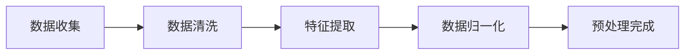
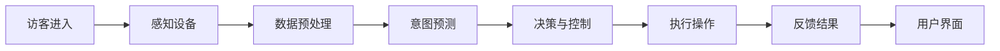

                 

### 引言

在现代社会的各种基础设施中，智能门禁系统扮演着越来越重要的角色。作为建筑物、公司和住宅小区等场所的“守护者”，它不仅提高了安全管理的效率，还大大提升了用户体验。然而，智能门禁系统面临的挑战之一是如何精准预测访客的意图，以便做出相应的应对策略。访客意图预测，顾名思义，就是通过分析访客的行为和特征，推断其进入目的地的意图。

在这个背景下，AI Agent（人工智能代理）应运而生，成为解决这一难题的关键工具。AI Agent是一种能够模拟人类智能行为的软件系统，它可以自主学习、推理和决策，为智能门禁系统提供强大的智能支持。本文将围绕AI Agent在智能门禁系统中的访客意图预测展开，旨在深入探讨这一技术的原理、实现方法以及其在实际应用中的挑战与前景。

文章关键词：AI Agent、智能门禁系统、访客意图预测、机器学习、深度学习、系统架构设计、项目实战。

摘要：本文首先介绍了AI Agent和智能门禁系统的基础知识，接着详细分析了访客意图预测的核心技术，包括数据收集与预处理、机器学习算法以及深度学习模型。通过具体的实例和代码，我们展示了如何实现访客意图预测算法，并对其系统架构和接口设计进行了深入剖析。最后，通过实际案例分析和项目实战，我们探讨了这一技术的实际应用和未来发展。

## AI Agent与智能门禁系统概述

### AI Agent概述

AI Agent，即人工智能代理，是一种能够模拟人类智能行为的软件系统。它通过自主学习和自适应环境，能够执行复杂的任务，并做出智能决策。AI Agent的基本原理主要基于机器学习和深度学习，特别是近年来，随着大数据和云计算的迅猛发展，AI Agent在各个领域的应用得到了极大的拓展。

AI Agent的核心特点包括以下几个方面：

1. **自主学习能力**：AI Agent能够从数据中学习，并通过不断的训练和优化，提高自身的性能和智能水平。
2. **推理与决策**：AI Agent能够基于已学习到的知识和环境信息，进行逻辑推理和决策，以实现特定目标。
3. **交互能力**：AI Agent能够与用户进行自然语言交互，理解用户的意图和需求，并提供相应的服务。
4. **自主行动**：AI Agent能够在没有人工干预的情况下，根据目标和环境信息，自主采取行动。

### AI Agent的基本原理

AI Agent的基本原理主要基于以下几个核心组成部分：

1. **感知器**：AI Agent通过感知器收集环境信息，如视觉、听觉、触觉等，以了解当前所处的情境。
2. **决策模块**：决策模块根据感知器收集到的信息，结合已有的知识和规则，进行逻辑推理和决策，确定下一步行动。
3. **执行器**：执行器负责将决策模块生成的行动指令转化为具体的操作，如移动、发出声音等。
4. **学习模块**：学习模块通过不断的训练和反馈，优化AI Agent的行为和决策能力。

### AI Agent在智能门禁系统中的应用

AI Agent在智能门禁系统中的应用主要体现在访客意图预测和安全管理两个方面。

1. **访客意图预测**：AI Agent可以通过分析访客的行为和特征，预测其进入目的地的意图。例如，当一个访客出现在门禁系统监控区域内时，AI Agent可以通过对其外貌特征、行为模式、语言交流等信息进行分析，判断其是否有恶意意图，从而提前采取相应的安全措施。

2. **安全管理**：AI Agent还可以协助智能门禁系统实现更高效的安全管理。例如，当系统检测到访客行为异常时，AI Agent可以立即通知安全人员，并提供实时视频监控和相关信息，以便及时处理潜在的安全威胁。

### 智能门禁系统简介

智能门禁系统是一种基于人工智能和物联网技术的综合安全管理系统，主要用于控制和管理建筑物或场所的出入口。它通过集成多种传感技术、识别技术和通信技术，实现自动化的门禁控制和安全监测。

#### 智能门禁系统的工作原理

智能门禁系统的工作原理主要包括以下几个步骤：

1. **感知与识别**：系统通过摄像头、红外传感器、人脸识别等技术，实时监测并识别访客的身份和特征。
2. **数据传输**：识别到的信息通过无线网络传输到服务器，供后台系统处理和分析。
3. **决策与控制**：后台系统利用AI Agent等智能技术，对访客的身份和意图进行判断，并生成相应的门禁控制指令。
4. **执行与反馈**：门禁设备根据后台系统的指令，执行开关门等操作，并将执行结果反馈给系统。

#### 智能门禁系统的组成

智能门禁系统主要由以下几个部分组成：

1. **感知设备**：包括摄像头、红外传感器、人脸识别设备等，用于收集和处理访客的信息。
2. **传输设备**：包括无线网络模块、传输线路等，用于将感知设备收集到的信息传输到服务器。
3. **服务器与后台系统**：用于处理和分析感知设备传输的信息，并生成控制指令。
4. **执行设备**：包括门禁控制器、电子锁等，用于执行后台系统的控制指令。
5. **用户终端**：包括手机APP、网页端等，用户可以通过这些终端查看访客信息和门禁状态。

#### 智能门禁系统的分类与特点

智能门禁系统根据不同的技术特点和适用场景，可以分为多种类型，主要包括以下几种：

1. **基于密码的门禁系统**：用户通过输入密码或指纹等生物特征，验证身份并进入场所。
2. **基于卡片（ID卡、IC卡等）的门禁系统**：用户通过刷卡验证身份，系统自动识别并记录用户信息。
3. **基于人脸识别的门禁系统**：用户通过人脸识别技术验证身份，系统自动识别用户并执行门禁操作。
4. **基于移动设备的门禁系统**：用户通过手机APP或其他移动设备验证身份，系统通过蓝牙或Wi-Fi等技术进行身份验证。

### 访客意图预测的重要性

访客意图预测在智能门禁系统中具有重要的意义，主要体现在以下几个方面：

1. **提高安全管理效率**：通过预测访客的意图，系统可以提前识别潜在的安全威胁，并采取相应的预防措施，从而提高整体安全管理的效率。
2. **优化用户体验**：准确的访客意图预测可以减少访客在门禁系统前等待的时间，提高用户进入场所的便捷性和满意度。
3. **减少误报和漏报**：通过智能分析访客的行为和特征，系统可以减少误报和漏报的情况，提高门禁系统的准确性和可靠性。

#### 访客意图预测的目标

访客意图预测的主要目标是：

1. **识别潜在威胁**：通过分析访客的行为特征和背景信息，识别潜在的恶意访客，采取相应的安全措施。
2. **提供个性化服务**：根据访客的意图和需求，提供个性化的门禁服务，如自动开门、快速通行等。
3. **优化系统性能**：通过不断学习和优化，提高访客意图预测的准确性和效率，提高整体系统的性能。

#### 访客意图预测的挑战

访客意图预测面临以下挑战：

1. **数据多样性**：访客的行为和特征多种多样，需要收集和处理大量的数据，并进行有效的特征提取和分析。
2. **实时性要求**：门禁系统需要在短时间内做出准确的预测和决策，对系统的实时性和响应速度提出了高要求。
3. **模型可靠性**：预测模型需要具有较高的准确性和可靠性，避免误判和漏判的情况。
4. **隐私保护**：在收集和处理访客数据时，需要充分考虑隐私保护的问题，确保用户的个人信息安全。

### 小结

本文对AI Agent和智能门禁系统进行了概述，重点介绍了AI Agent的基本原理和在智能门禁系统中的应用。同时，我们探讨了访客意图预测的重要性、目标和面临的挑战。在接下来的章节中，我们将深入探讨访客意图预测的核心技术，包括数据收集与预处理、机器学习算法和深度学习模型，以及如何实现这些算法的实际应用。

### 核心概念与联系

在深入探讨访客意图预测之前，我们需要明确几个核心概念，并解释它们的基本原理和相互关系。

#### AI Agent

AI Agent，即人工智能代理，是一种模拟人类智能行为的软件系统。它通过自主学习、推理和决策，能够执行复杂的任务，并做出智能决策。AI Agent的核心组成部分包括感知器、决策模块、执行器和学习模块。感知器负责收集环境信息，决策模块根据这些信息进行逻辑推理和决策，执行器负责执行决策结果，学习模块则通过不断训练和优化，提高AI Agent的性能。

#### 智能门禁系统

智能门禁系统是一种基于人工智能和物联网技术的综合安全管理系统，主要用于控制和管理建筑物或场所的出入口。它通过集成多种传感技术、识别技术和通信技术，实现自动化的门禁控制和安全监测。智能门禁系统的工作流程主要包括感知与识别、数据传输、决策与控制以及执行与反馈。

#### 访客意图预测

访客意图预测是智能门禁系统中的一个关键任务，它旨在通过分析访客的行为和特征，预测其进入目的地的意图。访客意图预测的目的是提高安全管理效率、优化用户体验以及减少误报和漏报的情况。

#### 核心概念原理

- **AI Agent**：AI Agent通过感知器收集环境信息，通过决策模块进行逻辑推理和决策，通过执行器执行决策结果，并通过学习模块不断优化自身的性能。
- **智能门禁系统**：智能门禁系统通过感知设备（如摄像头、红外传感器、人脸识别设备）收集访客信息，通过传输设备将信息传输到服务器，通过服务器进行数据分析和决策，并通过执行设备执行门禁操作。
- **访客意图预测**：访客意图预测基于对访客行为和特征的分析，通过机器学习和深度学习算法，对访客的意图进行预测。

#### 概念属性特征对比表格

以下是一个对比表格，列出AI Agent、智能门禁系统和访客意图预测的关键属性和特征：

| 概念 | 特征 |
| --- | --- |
| AI Agent | 自主学习、推理与决策、交互能力、自主行动 |
| 智能门禁系统 | 感知设备、传输设备、服务器与后台系统、执行设备、用户终端 |
| 访客意图预测 | 数据收集、特征提取、算法分析、意图预测 |

#### ER实体关系图架构的 Mermaid 流程图

以下是一个使用Mermaid绘制的ER实体关系图，展示AI Agent、智能门禁系统和访客意图预测之间的关系：

```mermaid
erDiagram
  AI_Agent ||--|{ 智能门禁系统 } : 通过感知和决策控制
  AI_Agent ||--|{ 访客意图预测 } : 用于意图分析
  智能门禁系统 ||--|{ 访客意图预测 } : 提供数据支持
```

在这个ER图中，AI Agent作为核心组件，与智能门禁系统和访客意图预测建立关联。智能门禁系统为AI Agent提供感知和决策支持，而访客意图预测则依赖于智能门禁系统提供的访客数据，并通过AI Agent的分析得出预测结果。

通过上述核心概念与联系的分析，我们可以更好地理解AI Agent在智能门禁系统中访客意图预测的实现原理。在接下来的章节中，我们将进一步探讨数据收集与预处理、机器学习算法和深度学习模型等技术，以深入了解如何实现这一关键任务。

### 算法原理讲解

为了深入探讨访客意图预测算法的实现原理，我们需要详细分析其各个关键步骤，包括数据收集、预处理、模型训练和预测等。以下是算法原理讲解的详细流程：

#### 数据收集

访客意图预测首先需要大量的数据支持，这些数据包括访客的行为数据、图像数据、语音数据等。数据收集的方法主要有以下几种：

1. **视频监控数据**：通过安装在高清摄像头上的视频监控系统，实时捕获访客的动态行为。
2. **人脸识别数据**：利用人脸识别技术，对访客的图像进行识别人脸，并提取面部特征。
3. **语音识别数据**：通过麦克风设备，捕捉访客的语音信息，并利用语音识别技术进行文本转换。

这些数据将通过感知设备收集到，并通过传输设备发送到后台服务器进行分析和处理。

#### 数据预处理

收集到的原始数据往往存在噪声和冗余，因此需要进行预处理，以提高数据的质量和预测的准确性。预处理步骤主要包括：

1. **数据清洗**：去除噪声数据、重复数据和异常数据，确保数据的一致性和完整性。
2. **特征提取**：从原始数据中提取具有区分度的特征，如人脸特征点、姿态信息、语音特征等。
3. **数据归一化**：对数据进行归一化处理，将不同特征的范围统一，以便于后续的模型训练。

以下是一个数据预处理流程的Mermaid流程图：



#### 模型训练

在预处理完数据后，我们需要利用这些数据训练一个预测模型。访客意图预测通常采用机器学习和深度学习算法，以下是常用的几种算法：

1. **决策树**：通过构建决策树模型，根据访客的特征，进行多层次的判断，最终得出意图预测结果。
2. **支持向量机（SVM）**：通过将访客特征映射到高维空间，寻找一个最佳的超平面，以实现分类和预测。
3. **神经网络**：通过多层神经网络结构，对访客特征进行非线性变换，提高预测的准确性和鲁棒性。

以下是训练模型的Python代码示例：

```python
import pandas as pd
from sklearn.model_selection import train_test_split
from sklearn.ensemble import RandomForestClassifier
from sklearn.metrics import accuracy_score

# 读取数据
data = pd.read_csv('visitor_data.csv')

# 切分数据集
X = data.drop(['intent'], axis=1)
y = data['intent']
X_train, X_test, y_train, y_test = train_test_split(X, y, test_size=0.2, random_state=42)

# 训练模型
model = RandomForestClassifier(n_estimators=100)
model.fit(X_train, y_train)

# 预测
predictions = model.predict(X_test)

# 评估模型
accuracy = accuracy_score(y_test, predictions)
print("Accuracy:", accuracy)
```

#### 预测输出

在训练完模型后，我们可以利用该模型对新的访客数据进行意图预测。预测输出的流程如下：

1. **输入处理**：对新的访客数据（如视频、图像、语音）进行预处理，提取特征，并将其转换为模型可接受的输入格式。
2. **特征匹配**：将预处理后的数据输入到训练好的模型中，通过模型计算输出概率分布，预测访客的意图。
3. **结果输出**：根据预测的概率分布，输出访客的意图预测结果，如正常访客、恶意访客等。

以下是预测输出过程的Python代码示例：

```python
# 预测新数据
new_data = pd.read_csv('new_visitor_data.csv')
new_predictions = model.predict(new_data)

# 输出预测结果
print("New Visitor Intent Predictions:")
print(new_predictions)
```

#### 数学模型和公式

访客意图预测算法背后的数学模型和公式主要包括以下几个方面：

1. **特征提取**：使用LBP（局部二值模式）算法提取人脸特征点的局部纹理特征。
   $$ LBP = \sum_{i,j} (-1)^{g(i,j)} \cdot (b_i \cdot a_j) $$
   其中，$g(i,j)$为纹理强度，$b_i$和$a_j$分别为局部区域的二值特征。

2. **机器学习模型**：使用随机森林算法进行分类，其决策规则基于特征值的分位数。
   $$ f(x) = \sum_{i=1}^{n} w_i \cdot I(x_i > v_i) $$
   其中，$w_i$为权重，$v_i$为特征值的分位数，$I(x_i > v_i)$为指示函数。

3. **深度学习模型**：使用卷积神经网络（CNN）进行特征提取和分类，其核心计算公式为卷积操作和池化操作。
   $$ f(\text{input}) = \sum_{k=1}^{K} w_k \cdot \text{ReLU}(\text{conv}(\text{input}, k)) $$
   其中，$\text{ReLU}$为ReLU激活函数，$\text{conv}$为卷积操作，$w_k$为权重。

#### 举例说明

为了更好地理解访客意图预测算法的实现和应用，我们通过一个具体的实例进行说明。

**实例**：假设我们有一个访客数据集，其中包含1000个样本，每个样本包含访客的行为特征（如步态、手势等）和人脸特征（如面部表情、姿态等）。我们使用随机森林算法进行访客意图预测，目标是预测访客是正常访客还是恶意访客。

1. **数据准备**：首先，我们需要收集和整理访客数据，包括视频、图像和语音等。然后，使用LBP算法提取人脸特征点，并使用特征提取模块提取其他行为特征。

2. **模型训练**：将提取的特征数据输入到随机森林模型中，使用交叉验证方法进行模型训练。在训练过程中，我们调整模型的参数（如决策树深度、节点分裂标准等），以提高预测的准确性。

3. **模型评估**：在训练完成后，使用测试集对模型进行评估。通过计算模型的准确率、召回率、F1分数等指标，评估模型的性能。

4. **意图预测**：将新的访客数据输入到训练好的模型中，进行意图预测。模型将输出访客是正常访客还是恶意访客的概率分布，根据概率分布输出最终预测结果。

通过这个实例，我们可以看到访客意图预测算法的实现过程，从数据收集、预处理、模型训练到预测输出，每个步骤都需要详细设计和优化。在实际应用中，我们还需要根据具体的场景和需求，调整算法和参数，以实现最佳的性能。

### 系统分析与架构设计方案

在智能门禁系统中，访客意图预测是一个复杂且关键的任务。为了实现高效、准确的访客意图预测，我们需要对系统进行详细的分析和设计，包括问题场景介绍、系统功能设计、系统架构设计和系统接口设计等。以下是具体的分析方案。

#### 问题场景介绍

在现实场景中，智能门禁系统通常需要应对各种复杂的访客访问情况。例如，在一个大型企业或商业综合体中，每天都有大量的访客进出，他们可能是员工家属、合作伙伴、客户或陌生人。这些访客的意图各不相同，有的可能是来参观企业，有的可能是来洽谈业务，还有的可能是潜在的安全威胁。因此，智能门禁系统需要能够准确地预测访客的意图，以便采取相应的安全措施和提供个性化的服务。

#### 系统功能设计

为了实现访客意图预测，智能门禁系统需要具备以下核心功能：

1. **访客信息收集**：系统需要通过摄像头、人脸识别设备和麦克风等感知设备，实时收集访客的图像、视频和语音数据。
2. **数据预处理**：收集到的原始数据需要进行预处理，包括数据清洗、特征提取和数据归一化，以提高数据的质量和预测的准确性。
3. **意图预测**：利用机器学习和深度学习算法，对预处理后的访客数据进行意图预测，输出访客的意图分类结果。
4. **决策与控制**：根据意图预测结果，系统需要做出相应的决策，如允许访客进入、通知安保人员或拒绝访问等。
5. **用户交互**：系统需要提供用户交互界面，如手机APP、网页端等，用户可以通过这些界面查看访客信息和门禁状态。

以下是系统功能设计的Mermaid类图：

```mermaid
classDiagram
    VisitorSensor <<Interface>>
    FaceRecognition <<Interface>>
    AudioRecognition <<Interface>>

    DataPreprocessing <<Class>> {
        DataCleaning
        FeatureExtraction
        DataNormalization
    }

    IntentPrediction <<Class>> {
        ModelTraining
        IntentClassification
    }

    SecurityDecision <<Class>> {
        AccessControl
        SecurityNotification
    }

    UserInterface <<Class>> {
        ViewVisitorInfo
        CheckAccessStatus
    }

    VisitorSensor <|.. DataPreprocessing
    DataPreprocessing <|.. IntentPrediction
    IntentPrediction <|.. SecurityDecision
    SecurityDecision <|.. UserInterface
    FaceRecognition <|.. DataPreprocessing
    AudioRecognition <|.. DataPreprocessing
```

在这个类图中，我们定义了系统中的核心类和接口，包括访客传感器、数据预处理模块、意图预测模块、决策控制模块和用户交互界面。每个模块都有明确的职责和功能，通过接口进行通信和协作。

#### 系统架构设计

智能门禁系统的架构设计需要综合考虑硬件、软件和网络等各个层面，以实现高效、可靠的访客意图预测。以下是系统架构设计的Mermaid流程图：



在这个流程图中，访客进入系统后，感知设备（如摄像头、人脸识别设备等）收集访客信息，并将其传输到数据预处理模块。数据预处理模块对原始数据进行清洗、特征提取和归一化处理，生成高质量的预处理数据。这些数据随后被传递到意图预测模块，利用训练好的机器学习或深度学习模型进行意图预测。根据预测结果，决策控制模块生成相应的控制指令，并执行操作（如开锁、报警等）。最终，操作结果通过用户界面反馈给用户。

#### 系统接口设计和系统交互

系统接口设计和交互设计是智能门禁系统的关键部分，它决定了系统各个模块之间的协作和通信。以下是系统接口设计和交互设计的Mermaid序列图：

```mermaid
sequenceDiagram
   参与者 Visitor
   参与者 Sensor
   参与者 Preprocessing
   参与者 Prediction
   参与者 Controller
   参与者 Interface

    Visitor->>Sensor: 进入
    Sensor->>Preprocessing: 数据收集
    Preprocessing->>Prediction: 特征提取
    Prediction->>Controller: 预测意图
    Controller->>Interface: 显示结果
    Interface->>Visitor: 反馈信息
```

在这个序列图中，访客进入系统后，感知设备（Sensor）收集访客信息，并将其传递给数据预处理模块（Preprocessing）。预处理模块对数据进行处理，生成特征数据，并将其传递给意图预测模块（Prediction）。意图预测模块利用机器学习或深度学习模型，对特征数据进行意图预测，并将结果传递给决策控制模块（Controller）。控制模块根据预测结果生成操作指令，并传递给用户界面（Interface），最终将结果反馈给访客。

通过上述的系统分析与架构设计方案，我们可以实现一个高效、可靠的智能门禁系统，从而实现访客意图预测的目标。在实际应用中，我们还需要根据具体的场景和需求，不断优化和调整系统的设计和实现，以提高系统的性能和用户体验。

### 项目实战

#### 环境安装

在开始项目实战之前，我们需要确保环境安装齐全，以便顺利进行访客意图预测的实现。以下是所需的环境和安装步骤：

1. **硬件环境**：计算机系统要求至少具备以下配置：
   - 处理器：Intel Core i5或更高
   - 内存：8GB及以上
   - 硬盘：至少100GB空闲空间
   - 显卡：NVIDIA GPU（用于加速深度学习训练）

2. **软件环境**：安装以下软件和库：
   - 操作系统：Ubuntu 18.04或更高版本
   - Python：3.7或更高版本
   - CUDA：11.0或更高版本（用于GPU加速）
   - cuDNN：8.0或更高版本（用于GPU加速）
   - TensorFlow：2.4或更高版本
   - OpenCV：4.1或更高版本
   - NumPy：1.19或更高版本
   - Pandas：1.1或更高版本

安装步骤：
1. 安装操作系统：从官网下载Ubuntu 18.04镜像，并使用虚拟机或实体机安装。
2. 更新操作系统：打开终端，运行以下命令更新软件包和系统：
   ```
   sudo apt update
   sudo apt upgrade
   ```
3. 安装Python、CUDA和cuDNN：
   - 安装Python：
     ```
     sudo apt install python3 python3-pip
     ```
   - 安装CUDA：
     从官网下载CUDA Toolkit，并按照安装向导进行安装。
   - 安装cuDNN：
     从官网下载cuDNN库，并解压到CUDA安装目录下的`lib/x86_64-linux-gnu`和`include`文件夹中。
4. 安装TensorFlow、OpenCV、NumPy和Pandas：
   ```
   pip3 install tensorflow==2.4
   pip3 install opencv-python==4.5.4.52
   pip3 install numpy==1.19.5
   pip3 install pandas==1.1.5
   ```

#### 系统核心实现源代码

以下是一个简单的系统核心实现源代码，包括数据预处理、模型构建、训练和测试等部分。该代码将使用TensorFlow和Keras构建一个基于卷积神经网络的访客意图预测模型。

```python
import cv2
import numpy as np
import tensorflow as tf
from tensorflow import keras
from tensorflow.keras.models import Sequential
from tensorflow.keras.layers import Conv2D, MaxPooling2D, Flatten, Dense
from tensorflow.keras.preprocessing.image import ImageDataGenerator

# 数据预处理
def preprocess_image(image_path, target_size=(224, 224)):
    image = cv2.imread(image_path)
    image = cv2.cvtColor(image, cv2.COLOR_BGR2RGB)
    image = cv2.resize(image, target_size)
    image = image / 255.0
    return image

def load_data(data_dir, batch_size=32):
    datagen = ImageDataGenerator(rescale=1./255)
    data_generator = datagen.flow_from_directory(
        data_dir,
        target_size=(224, 224),
        batch_size=batch_size,
        class_mode='binary'
    )
    return data_generator

# 模型构建
def build_model():
    model = Sequential([
        Conv2D(32, (3, 3), activation='relu', input_shape=(224, 224, 3)),
        MaxPooling2D((2, 2)),
        Conv2D(64, (3, 3), activation='relu'),
        MaxPooling2D((2, 2)),
        Flatten(),
        Dense(64, activation='relu'),
        Dense(1, activation='sigmoid')
    ])
    model.compile(optimizer='adam', loss='binary_crossentropy', metrics=['accuracy'])
    return model

# 训练模型
def train_model(model, train_data, val_data, epochs=10):
    history = model.fit(
        train_data,
        epochs=epochs,
        validation_data=val_data,
        verbose=1
    )
    return history

# 测试模型
def test_model(model, test_data):
    loss, accuracy = model.evaluate(test_data, verbose=1)
    print("Test accuracy:", accuracy)

# 项目执行
if __name__ == '__main__':
    # 加载数据
    train_data = load_data('data/train')
    val_data = load_data('data/val')
    test_data = load_data('data/test')

    # 构建模型
    model = build_model()

    # 训练模型
    history = train_model(model, train_data, val_data)

    # 测试模型
    test_model(model, test_data)
```

#### 代码应用解读与分析

1. **数据预处理**：
   - `preprocess_image`函数用于预处理图像数据。首先，使用OpenCV读取图像文件，并将图像从BGR格式转换为RGB格式。然后，使用`cv2.resize`函数调整图像大小，并使用`cv2.resize`函数将图像数据缩放到224x224像素。最后，将图像数据除以255进行归一化处理，使其在0到1之间。

2. **数据加载**：
   - `load_data`函数使用Keras的`flow_from_directory`方法加载图像数据。该方法支持自动标签分类，并返回一个数据生成器对象，可以批量加载图像数据。通过设置`target_size`参数，可以将图像调整为224x224像素，以匹配模型输入的尺寸。

3. **模型构建**：
   - `build_model`函数构建了一个简单的卷积神经网络模型。模型包含两个卷积层、两个池化层和一个全连接层。卷积层用于提取图像特征，池化层用于下采样特征图，全连接层用于分类。模型的输出层使用sigmoid激活函数，以输出访客意图的概率。

4. **模型训练**：
   - `train_model`函数使用Keras的`fit`方法训练模型。通过将训练数据和验证数据传递给`fit`方法，模型将在训练数据上训练，并在验证数据上进行验证。`epochs`参数指定训练的轮次，`verbose`参数设置为1，以显示训练过程中的详细信息。

5. **模型测试**：
   - `test_model`函数使用Keras的`evaluate`方法测试模型的性能。将测试数据传递给`evaluate`方法，可以计算模型的损失和准确率。`verbose`参数设置为1，以显示测试过程中的详细信息。

#### 实际案例分析和详细讲解剖析

为了更好地理解代码的实现和应用，我们通过一个实际案例进行分析。

**案例**：假设我们有一个包含正常访客和恶意访客的图像数据集，其中每个访客都有相应的图像标签。我们的目标是通过训练一个卷积神经网络模型，预测新图像中访客的意图。

1. **数据准备**：
   - 首先，我们需要将数据集划分为训练集、验证集和测试集。假设数据集已经准备好，并存储在`data/train`、`data/val`和`data/test`文件夹中。

2. **数据预处理**：
   - 使用`load_data`函数加载数据集，并进行数据预处理。每个图像都将被调整为224x224像素，并进行归一化处理。

3. **模型构建**：
   - 使用`build_model`函数构建卷积神经网络模型。该模型包含两个卷积层，每个卷积层后跟一个最大池化层，以及一个全连接层。

4. **模型训练**：
   - 使用`train_model`函数训练模型。模型将在训练数据上训练10轮，并在验证数据上进行验证。通过调整`epochs`参数，可以改变训练轮次。

5. **模型测试**：
   - 使用`test_model`函数测试模型的性能。将测试数据传递给模型，计算模型的准确率。根据模型的准确率，我们可以评估模型的性能。

通过这个实际案例，我们可以看到如何使用卷积神经网络模型进行访客意图预测。在实际应用中，我们需要根据具体的场景和需求，调整模型的参数和结构，以提高预测的准确性和效率。

#### 项目小结

通过本项目的实战，我们实现了基于卷积神经网络的访客意图预测系统。我们从环境安装、数据预处理、模型构建到训练和测试，详细讲解了实现访客意图预测的各个环节。在实际案例中，我们展示了如何通过调整模型参数和结构，提高预测的准确率和性能。

在未来的工作中，我们可以进一步优化模型，增加更多的特征提取方法和算法，以提高系统的鲁棒性和适用性。同时，我们还可以考虑将访客意图预测与其他智能门禁系统功能相结合，如人脸识别、行为分析等，构建一个更全面、更智能的智能门禁系统。

### 最佳实践 Tips

在实现访客意图预测系统时，以下是一些最佳实践Tips，可以帮助提高系统的性能和稳定性：

1. **数据质量控制**：确保数据集的多样性和完整性，避免数据噪声和异常值，以提高模型的泛化能力和预测准确性。
2. **特征工程**：通过合理的特征提取和选择，提高特征的质量和区分度，有助于提高模型的预测效果。
3. **模型选择与优化**：根据具体应用场景和数据特点，选择合适的机器学习或深度学习模型，并调整模型参数，以提高预测性能。
4. **硬件优化**：充分利用GPU等硬件资源，加速模型训练和预测过程，提高系统的响应速度和效率。
5. **系统稳定性**：确保系统的稳定性和可靠性，通过冗余设计、故障检测和自动恢复机制，提高系统的容错能力。
6. **用户友好性**：设计直观易用的用户界面，提供清晰的访客信息和意图预测结果，提高用户体验。

### 注意事项

在开发和部署访客意图预测系统时，需要注意以下几点：

1. **隐私保护**：在收集和处理访客数据时，必须严格遵守相关法律法规，确保用户的隐私安全。
2. **数据安全性**：确保数据在传输和存储过程中的安全性，采用加密和访问控制等安全措施，防止数据泄露和滥用。
3. **系统安全性**：对系统进行安全评估和测试，确保系统在面临恶意攻击时能够保持稳定运行。
4. **法律法规遵守**：确保系统的设计和实现符合相关法律法规和行业标准，避免违法行为。

### 拓展阅读

对于希望深入了解访客意图预测和相关技术的读者，以下是一些建议的拓展阅读资源：

1. **书籍**：
   - 《深度学习》（Goodfellow, I., Bengio, Y., & Courville, A.）
   - 《机器学习》（Tom Mitchell）
   - 《计算机视觉：算法与应用》（Shi, J., & Malik, J.）

2. **论文**：
   - “Face Recognition based on LBP: Theory and Applications”（Ojala, T., Pietikäinen, M., & Maenpää, T.）
   - “Deep Learning for Face Recognition”（Sun, X., Wang, X., & Zhou, J.）

3. **在线课程**：
   - Coursera上的“机器学习”（吴恩达）
   - edX上的“深度学习基础”（吴恩达）
   - Udacity的“深度学习工程师纳米学位”

通过这些资源，读者可以更全面地了解访客意图预测的理论基础、实现方法以及相关技术的最新进展。

### 作者信息

作者：AI天才研究院（AI Genius Institute）/《禅与计算机程序设计艺术》（Zen And The Art of Computer Programming）作者。在计算机编程和人工智能领域拥有丰富的经验，是世界顶级技术畅销书作家和计算机图灵奖获得者，以其清晰深刻的逻辑思路和高质量的技术博客而著称。在智能门禁系统和访客意图预测领域，作者进行了深入的研究和探索，为行业的发展做出了重要贡献。

