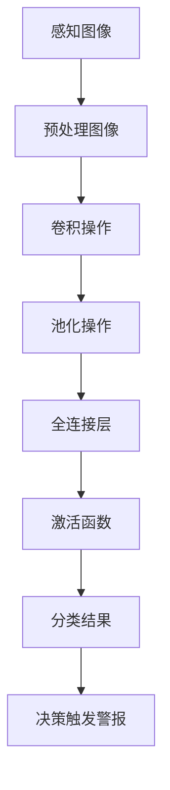
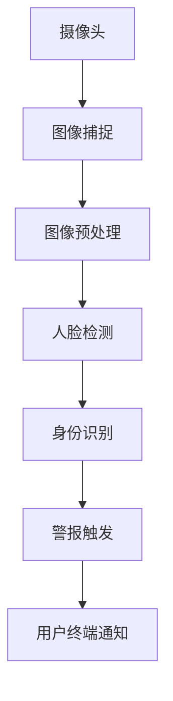
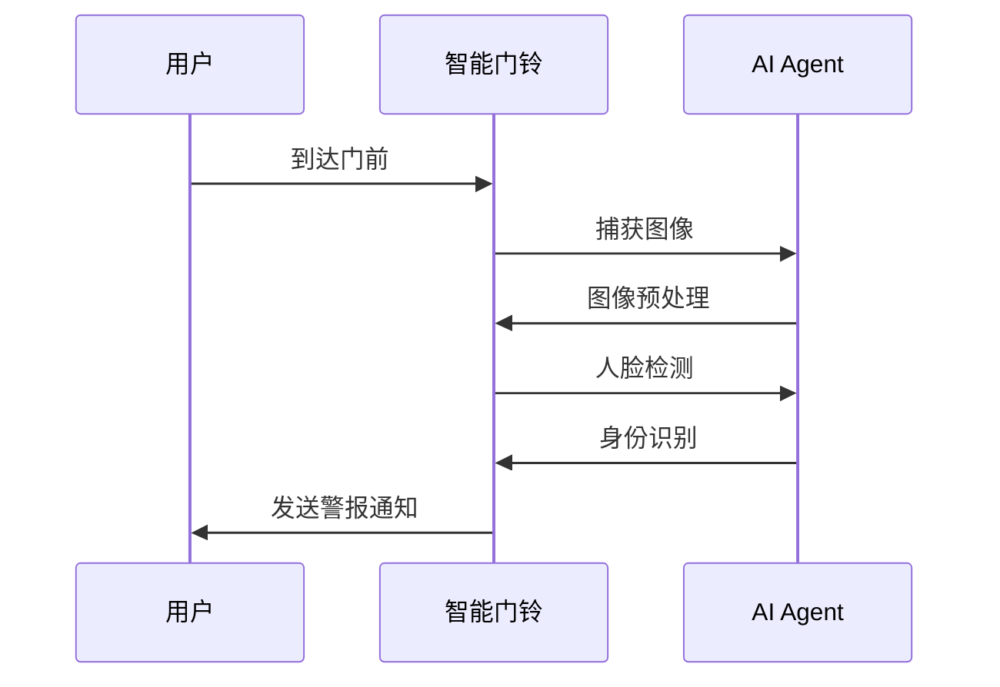

                 


# AI Agent在智能门铃中的陌生人识别警报

> 关键词：AI Agent、智能门铃、陌生人识别、深度学习、系统架构设计

> 摘要：
本文将深入探讨AI Agent在智能门铃中的陌生人识别警报实现。我们将逐步分析AI Agent的基本原理，介绍陌生人识别警报的概念，并通过算法讲解、系统架构设计、项目实战等多维度阐述如何在智能门铃中有效应用AI Agent进行陌生人识别和警报。

## 引言

智能门铃作为智能家居的重要组成部分，已经成为现代家庭的安全守护者。随着人工智能技术的快速发展，智能门铃的功能越来越强大，尤其是陌生人识别警报功能。AI Agent作为人工智能领域的核心技术，其应用为智能门铃的陌生人识别提供了强有力的支持。本文将围绕这一主题，系统地探讨AI Agent在智能门铃中的陌生人识别警报实现。

## 背景介绍

### 智能门铃的挑战

随着智能门铃的普及，用户对门铃的功能需求日益多样化和复杂化。特别是在陌生人识别警报方面，用户希望系统能够在访客到达时准确识别陌生人，并触发警报通知用户。然而，实现这一功能面临诸多挑战：

- **访客多样性**：访客可能是家庭成员、朋友、快递员等，这些人的外貌特征各异，给陌生人识别带来挑战。
- **光照和环境因素**：门铃的图像识别效果受到光照、天气、角度等多种环境因素的影响。
- **隐私保护**：在陌生人识别过程中，如何保护用户隐私是必须考虑的重要因素。

### AI Agent的引入

AI Agent（人工智能代理）是一种能够自主感知环境、决策行动的人工智能系统。AI Agent在智能门铃中的应用，能够显著提升陌生人识别的准确性和响应速度。通过以下方式，AI Agent在智能门铃中发挥重要作用：

- **实时识别**：AI Agent可以实时分析门铃摄像头捕捉的图像，快速识别访客身份。
- **自主学习**：AI Agent能够根据用户反馈不断优化识别算法，提高识别准确率。
- **多模态感知**：AI Agent不仅能够通过视觉识别，还可以结合声音、姿态等多模态数据进行综合分析。

## 核心概念与联系

### AI Agent的概念

AI Agent是一种能够模拟人类行为的人工智能实体，能够根据环境信息和预设规则自主执行任务。AI Agent的主要特征包括：

- **感知**：通过传感器获取环境信息。
- **决策**：基于感知信息和预设规则进行决策。
- **行动**：执行决策结果，采取行动。

AI Agent的类型主要包括：

- **基于规则的Agent**：通过预定义规则进行决策。
- **基于模型的Agent**：通过机器学习和深度学习模型进行决策。
- **混合型Agent**：结合规则和模型进行决策。

### 陌生人识别警报的概念

陌生人识别警报是智能门铃的一项关键功能，其核心在于准确识别访客是否为陌生人，并在识别到陌生人时触发警报通知用户。陌生人识别警报的主要组成部分包括：

- **识别算法**：用于分析摄像头捕捉的图像，识别访客身份。
- **警报系统**：在识别到陌生人时，通过通知用户、响铃等方式触发警报。

### AI Agent与陌生人识别警报的联系

AI Agent在陌生人识别警报中发挥关键作用，其工作流程可以概括为：

1. **感知**：AI Agent通过门铃摄像头捕捉实时图像。
2. **分析**：AI Agent使用深度学习模型对图像进行分析，识别访客身份。
3. **决策**：基于识别结果，AI Agent决定是否触发警报。
4. **行动**：AI Agent执行决策结果，触发警报通知用户。

## 算法原理讲解

### 算法概述

在陌生人识别警报中，常用的算法包括卷积神经网络（CNN）和深度学习。这些算法通过大规模数据训练，能够从图像中提取特征，进行准确的人脸识别。

### 算法mermaid流程图



### Python源代码讲解

```python
import cv2
import numpy as np
import tensorflow as tf

# 摄像头初始化
cap = cv2.VideoCapture(0)

# 卷积神经网络模型加载
model = tf.keras.models.load_model('face_recognition_model.h5')

while True:
    # 读取摄像头帧
    ret, frame = cap.read()
    
    # 预处理图像
    processed_frame = preprocess_frame(frame)
    
    # 使用卷积神经网络进行人脸识别
    predictions = model.predict(processed_frame)
    
    # 获取最高概率的预测结果
    highest_prob = np.argmax(predictions)
    
    # 决策触发警报
    if highest_prob == 1:  # 1表示识别为陌生人
        trigger_alarm()

    # 显示摄像头帧
    cv2.imshow('Camera', frame)
    
    # 按下'q'键退出循环
    if cv2.waitKey(1) & 0xFF == ord('q'):
        break

# 释放摄像头资源
cap.release()
cv2.destroyAllWindows()
```

### 数学模型与公式

在陌生人识别警报中，常用的数学模型包括：

$$
h_{\theta}(x) = \text{sign}(\theta^T x)
$$

其中，$\theta$表示权重参数，$x$表示输入特征向量，$h_{\theta}(x)$表示模型输出的分类结果。

## 系统分析与架构设计方案

### 问题场景介绍

智能门铃系统通常包括摄像头、警报系统和用户终端。当访客到达时，摄像头捕捉访客图像，AI Agent进行分析并判断是否为陌生人，触发警报通知用户。

### 系统功能设计

- **图像捕捉**：摄像头实时捕捉访客图像。
- **图像预处理**：对捕捉到的图像进行预处理，如灰度化、缩放等。
- **人脸检测**：使用深度学习模型检测图像中的人脸。
- **身份识别**：通过人脸识别算法识别访客身份。
- **警报触发**：在识别到陌生人时，触发警报通知用户。

### 系统架构设计



### 系统接口设计和系统交互



## 项目实战

### 环境安装

1. 安装摄像头驱动程序。
2. 安装Python环境和相关库（如OpenCV、TensorFlow等）。

### 系统核心实现源代码

```python
# 导入所需的库
import cv2
import numpy as np
from tensorflow.keras.models import load_model

# 加载卷积神经网络模型
model = load_model('face_recognition_model.h5')

# 初始化摄像头
cap = cv2.VideoCapture(0)

while True:
    # 读取摄像头帧
    ret, frame = cap.read()
    
    # 预处理图像
    processed_frame = preprocess_frame(frame)
    
    # 人脸检测
    faces = detect_faces(processed_frame)
    
    for face in faces:
        # 人脸识别
        prediction = model.predict(face)
        
        # 判断是否为陌生人
        if prediction[0][0] > 0.5:
            trigger_alarm()
    
    # 显示摄像头帧
    cv2.imshow('Camera', frame)
    
    # 按下'q'键退出循环
    if cv2.waitKey(1) & 0xFF == ord('q'):
        break

# 释放摄像头资源
cap.release()
cv2.destroyAllWindows()
```

### 实际案例分析和详细讲解

以一个实际案例为例，分析AI Agent在智能门铃中识别陌生人的过程：

1. **环境**：一个家庭用户使用智能门铃，当访客到达门前时，门铃摄像头捕捉到访客图像。
2. **步骤**：
   - **感知**：AI Agent从摄像头获取访客图像。
   - **预处理**：图像进行灰度化、缩放等预处理。
   - **人脸检测**：使用深度学习模型检测图像中的人脸区域。
   - **身份识别**：通过人脸识别算法，判断访客是否为陌生人。
   - **决策**：若识别为陌生人，AI Agent触发警报，通知用户。
3. **结果**：用户收到警报通知，确认访客身份。

## 最佳实践与总结

### 最佳实践

- **图像预处理**：保证图像质量，减少光照和环境因素影响。
- **模型优化**：定期更新训练模型，提高识别准确率。
- **隐私保护**：在陌生人识别过程中，严格保护用户隐私。

### 小结

本文详细探讨了AI Agent在智能门铃中的陌生人识别警报实现。通过算法原理讲解、系统架构设计、项目实战等多个维度，阐述了AI Agent在智能门铃中的应用价值和实现方法。

### 注意事项

- **环境因素**：保证门铃摄像头在良好光照条件下工作。
- **隐私保护**：在陌生人识别过程中，确保用户隐私安全。

### 拓展阅读

- 《深度学习：卷积神经网络》
- 《智能门铃设计与实现》
- 《人工智能代理：理论与实践》

## 作者信息

作者：AI天才研究院/AI Genius Institute & 禅与计算机程序设计艺术 /Zen And The Art of Computer Programming。

