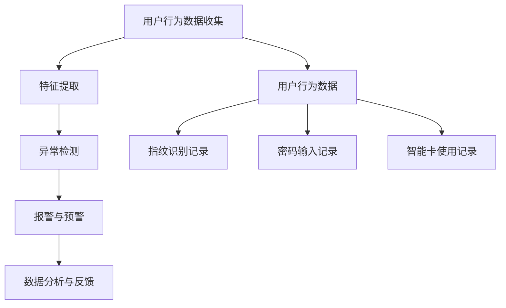
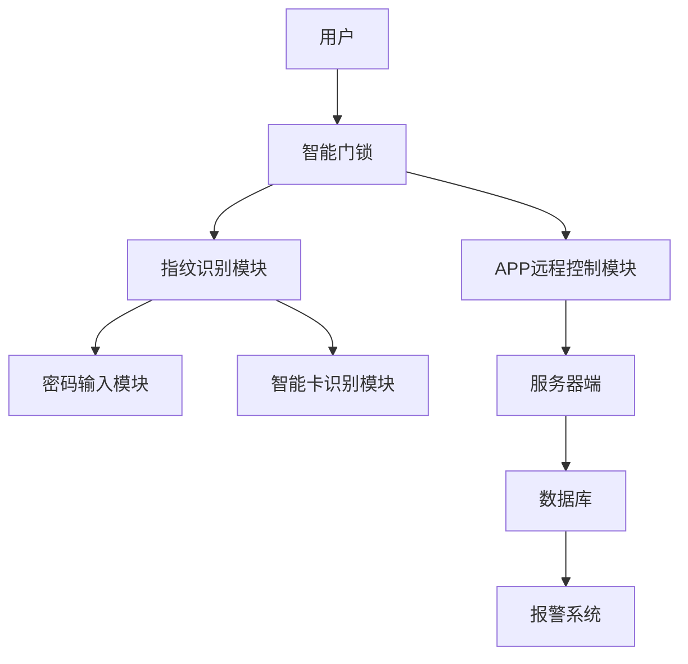

                 

### 关键词

- **AI Agent**
- **智能门锁**
- **异常使用检测**
- **安全性**
- **算法原理**
- **系统架构**

### 摘要

本文深入探讨了AI Agent在智能门锁中的异常使用检测。首先，介绍了智能门锁的普及及其面临的安全问题，以及AI Agent的基本概念与应用。接着，详细解析了AI Agent的原理、智能门锁的结构与工作原理，以及异常使用检测算法的原理和数学模型。随后，文章分析了系统架构设计，包括系统功能、架构图、接口设计和系统交互。最后，通过一个实战案例展示了如何实现异常使用检测系统，并对其进行了详细剖析。本文旨在为读者提供一个全面、系统的理解和应用指南，以提升智能门锁的安全性。

#### 目录大纲设计

本文将分为三大部分，共计七章节，详细探讨AI Agent在智能门锁中的异常使用检测。

**第一部分：背景介绍与核心概念**

- **第1章：AI Agent在智能门锁中的应用背景**
  - **1.1 问题背景**
  - **1.2 问题描述**
  - **1.3 问题解决**
  - **1.4 边界与外延**
  - **1.5 概念结构与核心要素组成**
  
- **第2章：AI Agent的基本原理**
  - **2.1 AI Agent的定义与分类**
  - **2.2 AI Agent的核心特性**
  - **2.3 AI Agent的工作流程**

- **第3章：智能门锁的结构与工作原理**
  - **3.1 智能门锁的基本结构**
  - **3.2 智能门锁的工作原理**

**第二部分：算法原理讲解**

- **第4章：异常使用检测算法原理**
  - **4.1 异常使用检测的定义与分类**
  - **4.2 常用异常检测算法**
  - **4.3 算法原理与流程**
  - **4.4 算法实现与代码示例**

- **第5章：异常使用检测数学模型**
  - **5.1 异常使用检测的数学基础**
  - **5.2 异常使用检测的数学模型**
  - **5.3 数学模型的公式与解释**
  - **5.4 数学模型的举例说明**

**第三部分：系统分析与架构设计**

- **第6章：系统分析与架构设计**
  - **6.1 问题场景介绍**
  - **6.2 系统功能设计**
  - **6.3 系统架构设计**
  - **6.4 系统接口设计与交互**

- **第7章：项目实战**
  - **7.1 环境安装与配置**
  - **7.2 系统核心实现源代码**
  - **7.3 代码应用解读与分析**
  - **7.4 实际案例分析与详细讲解**
  - **7.5 项目小结**

通过这一结构严谨、内容丰富的文章，读者可以全面了解AI Agent在智能门锁中的异常使用检测技术，掌握其核心原理和实现方法，从而提升智能门锁的安全性能。

### 第一部分：背景介绍与核心概念

#### 第1章：AI Agent在智能门锁中的应用背景

##### 1.1 问题背景

智能门锁作为智能家居的核心设备之一，已经逐渐走进了千家万户。其便捷性、安全性和个性化定制能力，使其成为现代生活的必备品。然而，随着智能门锁的普及，其所面临的安全威胁也日益增加。传统的门锁依赖于机械钥匙或密码，虽然安全性较高，但易丢失、易遗忘、易破解等问题依然存在。智能门锁则采用了多种技术手段，如指纹识别、密码验证、智能卡识别等，大大提高了门锁的安全性。

然而，智能门锁的安全性问题并未因此而解决。首先，智能门锁的系统漏洞可能被黑客利用，通过网络攻击入侵系统，窃取用户的个人信息。其次，智能门锁的硬件故障也可能导致安全隐患，例如指纹传感器损坏、智能卡读取失败等。此外，智能门锁的异常使用现象也日益突出，例如非法入侵者使用他人的指纹或智能卡进行开锁，或者恶意攻击者通过暴力破解密码等手段非法进入住宅。

这些安全问题不仅威胁到了用户的隐私和财产安全，也对社会安全造成了潜在的影响。因此，如何有效检测并防范智能门锁的异常使用，已经成为一个亟待解决的重要课题。

##### 1.2 AI Agent的基本概念与应用

AI Agent，即人工智能代理，是人工智能领域中的一个重要概念。它是一种能够自主完成特定任务的智能体，具备一定的感知、决策和行动能力。AI Agent可以通过学习和适应环境，不断优化自己的行为，从而在复杂的任务中表现出出色的性能。

在智能门锁中，AI Agent的应用主要体现在异常使用检测方面。具体来说，AI Agent可以通过监测用户的行为特征，如指纹识别的频率、时间间隔、使用方式等，识别出异常使用行为。例如，当AI Agent检测到某个用户连续多次输入错误的密码，或者某个指纹在短时间内被频繁使用，都有可能被认为是异常使用行为。AI Agent可以对这些异常行为进行实时报警，提醒用户或相关安全部门采取相应的措施。

此外，AI Agent还可以通过数据分析，预测可能出现的异常使用行为。例如，通过分析历史数据，AI Agent可以识别出某些特定时间段内使用频率异常的用户，或者某些用户的密码尝试次数明显高于其他用户，从而提前预警可能的潜在威胁。

##### 1.3 异常使用检测的重要性

异常使用检测在智能门锁中具有重要的应用价值。首先，它能够有效提高门锁的安全性。通过实时监测用户的行为，AI Agent可以识别并阻止非法入侵和恶意攻击，防止用户的隐私和财产安全受到侵害。

其次，异常使用检测还能够提高门锁的用户体验。通过识别和预警异常使用行为，AI Agent可以帮助用户及时发现潜在的安全隐患，从而采取措施进行防范。例如，当AI Agent检测到用户频繁输入错误的密码时，可以提醒用户可能是密码被泄露或被他人尝试破解，建议用户及时更改密码或采取其他安全措施。

最后，异常使用检测还能够提高门锁的管理效率。通过分析用户的行为数据，AI Agent可以为物业管理方提供有价值的信息，帮助其更好地管理门锁的使用情况。例如，AI Agent可以识别出长期未使用的门锁，提醒物业管理方可能是用户搬家或房屋空置，从而及时处理相关事宜。

##### 1.4 边界与外延

除了智能门锁，AI Agent在其它领域的应用也非常广泛。例如，在金融领域，AI Agent可以用于信用卡欺诈检测，通过分析用户的消费行为，识别并阻止可能的欺诈行为。在医疗领域，AI Agent可以用于患者行为分析，通过监测患者的日常行为，预测并预警可能的健康问题。

此外，AI Agent还可以应用于智能安防系统、智能交通系统等领域，通过对环境数据的实时监测和分析，识别并处理异常事件，提高相关系统的安全性和效率。

##### 1.5 概念结构与核心要素组成

在智能门锁中，AI Agent的异常使用检测涉及多个核心要素，包括用户行为数据收集、特征提取、异常检测算法、报警与预警机制等。

- **用户行为数据收集**：AI Agent需要收集用户的行为数据，如指纹识别记录、密码输入记录、智能卡使用记录等。这些数据是进行异常检测的基础。
- **特征提取**：通过对收集到的行为数据进行分析和处理，提取出有助于异常检测的特征，如频率、时间间隔、使用方式等。
- **异常检测算法**：基于提取出的特征，采用适当的异常检测算法，如单变量异常检测、多变量异常检测等，对用户行为进行实时监测和识别。
- **报警与预警机制**：当检测到异常行为时，AI Agent需要及时发出报警信号，提醒用户或相关安全部门采取相应的措施。

这些核心要素相互关联、共同作用，构成了一个完整的异常使用检测系统。通过这一系统，智能门锁可以更加智能、高效地保障用户的安全。

### 第2章：AI Agent的基本原理

##### 2.1 AI Agent的定义与分类

AI Agent，即人工智能代理，是一种能够自主执行任务、与环境和用户互动的智能体。其核心特点包括自主性、学习能力、反应能力等。AI Agent的定义可以从以下几个方面进行理解：

1. **自主性**：AI Agent具有自主决策能力，可以在没有外部指令的情况下独立完成任务。这种自主性使得AI Agent能够在复杂的、动态变化的环境中表现出出色的适应能力。

2. **学习性**：AI Agent具备学习能力，可以通过观察环境、与用户互动，不断优化自己的行为策略。学习性使得AI Agent能够从经验中学习，提高任务完成的效率和准确性。

3. **反应能力**：AI Agent能够对环境中的变化做出快速反应，及时调整自己的行为。这种反应能力使得AI Agent能够应对突发事件，保持系统的稳定性和安全性。

根据AI Agent的应用场景和功能，可以将AI Agent分为以下几类：

1. **任务型AI Agent**：这种类型的AI Agent专注于执行特定的任务，如智能客服、智能助手等。它们通常具备一定的自主决策能力和学习能力，能够根据用户的反馈和任务需求，动态调整自己的行为。

2. **环境感知型AI Agent**：这种类型的AI Agent主要关注对环境的感知和理解，如智能安防系统、智能交通系统等。它们通过感知环境数据，识别异常事件，并采取相应的措施。

3. **协同型AI Agent**：这种类型的AI Agent专注于与其他AI Agent或人类用户进行协同工作，如多智能体系统、人机协作系统等。它们能够通过共享信息和协同决策，提高整个系统的效率和性能。

##### 2.2 AI Agent的核心特性

AI Agent的核心特性包括自主性、学习性和反应能力。这些特性决定了AI Agent在复杂环境中的表现和效果。

1. **自主性**：自主性是AI Agent的核心特性之一，它使得AI Agent能够在没有外部指令的情况下，自主完成特定的任务。具体来说，自主性包括以下几个方面：

   - **自主决策**：AI Agent可以根据当前环境的状态和任务需求，自主做出决策，选择最合适的行动方案。
   - **自主行动**：AI Agent可以根据自主做出的决策，自主执行相应的行动，实现任务的完成。
   - **自主适应**：AI Agent能够在面对复杂、动态变化的环境时，自主调整自己的行为策略，以适应环境的变化。

2. **学习性**：学习性是AI Agent的另一个核心特性，它使得AI Agent能够通过学习和经验，不断优化自己的行为。具体来说，学习性包括以下几个方面：

   - **经验学习**：AI Agent可以通过观察环境、与用户互动，从经验中学习，提取有用的信息。
   - **行为优化**：AI Agent可以根据学习到的经验，调整自己的行为策略，提高任务完成的效率和准确性。
   - **自适应学习**：AI Agent能够在面对不同的任务和场景时，自适应地调整自己的学习方式和策略，以适应不同的学习需求。

3. **反应能力**：反应能力是AI Agent在复杂环境中表现的重要特性，它使得AI Agent能够对环境中的变化做出快速反应。具体来说，反应能力包括以下几个方面：

   - **实时响应**：AI Agent能够对环境中的变化做出实时响应，及时调整自己的行为。
   - **快速决策**：AI Agent能够在面对突发事件时，快速做出决策，采取适当的行动。
   - **灵活适应**：AI Agent能够根据环境的变化，灵活调整自己的行为策略，以适应新的环境。

##### 2.3 AI Agent的工作流程

AI Agent的工作流程可以分为以下几个步骤：

1. **感知环境**：AI Agent通过传感器或其他方式收集环境信息，如温度、湿度、用户行为等。
2. **数据处理**：AI Agent对收集到的环境信息进行预处理，如去除噪声、填充缺失值等，以便进行进一步的分析。
3. **状态评估**：AI Agent根据处理后的环境信息，评估当前的状态，判断是否存在异常或潜在的问题。
4. **决策制定**：基于状态评估的结果，AI Agent制定相应的决策，选择最合适的行动方案。
5. **行动执行**：AI Agent根据制定的决策，执行相应的行动，如发送报警信号、调整系统参数等。
6. **反馈调整**：AI Agent对执行后的行动进行反馈，评估决策的有效性，并根据反馈调整后续的行为策略。

通过以上工作流程，AI Agent能够在复杂的环境中，自主地感知、处理和应对各种情况，实现高效、智能的任务执行。

### 第3章：智能门锁的结构与工作原理

##### 3.1 智能门锁的基本结构

智能门锁的基本结构通常包括以下几个关键组件：

1. **电子门锁模块**：这是智能门锁的核心，负责控制门锁的开关状态。电子门锁模块通常采用电磁锁或电子锁结构，可以通过电磁铁或电动机驱动门锁的锁定和开锁。

2. **指纹识别模块**：指纹识别模块用于用户指纹的采集和验证。它包含指纹采集传感器、指纹图像处理芯片和指纹数据库。当用户尝试通过指纹解锁时，传感器会采集指纹图像，并将其与数据库中的指纹信息进行比对，以验证用户身份。

3. **智能卡识别模块**：智能卡识别模块用于读取用户的智能卡信息，如RFID卡、IC卡等。它包含读卡器、解码芯片和卡信息数据库。用户通过插入智能卡，读卡器会读取卡内信息，并与系统数据库进行比对，以验证用户身份。

4. **APP远程控制模块**：APP远程控制模块允许用户通过智能手机应用程序远程控制门锁。用户可以通过APP发送指令，如远程开锁、远程锁定、密码更改等。APP模块通常包括一个服务器端和一个客户端，服务器端处理用户的远程请求，客户端则显示用户操作界面。

5. **通信模块**：通信模块用于实现智能门锁与其他设备或系统的通信，如WiFi、蓝牙、ZigBee等。它允许用户通过移动设备或云平台实时监控和管理门锁。

##### 3.2 智能门锁的工作原理

智能门锁的工作原理主要包括以下几个关键步骤：

1. **用户输入验证**：用户尝试通过指纹、智能卡或APP远程控制等方式解锁门锁时，系统会启动验证流程。指纹识别模块会采集用户的指纹图像，并与数据库中的指纹信息进行比对；智能卡识别模块会读取智能卡信息，并与系统数据库进行比对；APP远程控制模块会验证用户的远程请求，确保请求的有效性。

2. **身份验证**：在用户输入验证通过后，系统会进行身份验证。如果指纹或智能卡验证成功，系统会认为用户身份得到确认；如果APP远程控制验证成功，系统会根据预设的安全策略，允许用户执行相应的操作。

3. **开锁控制**：当用户身份验证通过后，系统会发送信号到电子门锁模块，驱动门锁打开。电子门锁模块通过电磁铁或电动机的力量，使门锁脱离锁定状态，从而允许用户进入。

4. **记录与反馈**：智能门锁系统会记录用户的每次解锁操作，包括时间、方式、用户身份等信息，并存储在数据库中。同时，系统会通过APP或其他通信方式向用户反馈操作结果。

5. **异常检测与报警**：智能门锁系统还具备异常检测功能。当检测到异常使用行为，如多次输入错误密码、频繁尝试解锁失败等，系统会触发报警机制，提醒用户或相关安全部门采取相应的措施。

通过以上工作原理，智能门锁不仅实现了对用户身份的严格验证和控制，还提供了多种便捷的解锁方式，同时具备强大的异常检测和安全防护功能，从而确保用户的安全和便利。

### 第二部分：算法原理讲解

#### 第4章：异常使用检测算法原理

##### 4.1 异常使用检测的定义与分类

异常使用检测（Anomaly Detection），又称异常检测或异常监测，是数据挖掘和机器学习领域中的一种重要技术。它的主要目标是从大量数据中识别出那些不符合正常模式或预期的数据点或事件。在智能门锁的背景下，异常使用检测是指通过监测和分析用户行为数据，识别出那些可能表明安全威胁或系统故障的异常行为。

根据异常使用检测的检测对象和检测方法，可以将异常使用检测分为以下几种类型：

1. **单变量异常检测**：单变量异常检测专注于单个变量的异常值检测。它通过分析单个变量的分布特性，识别出偏离正常范围的异常值。例如，在智能门锁中，可以检测用户密码输入的错误次数是否超过正常范围。

2. **多变量异常检测**：多变量异常检测同时考虑多个变量之间的关系，识别出数据集中不符合整体分布特性的数据点。这种检测方法通常需要构建一个多维空间，并利用距离度量或聚类分析方法来识别异常点。例如，在智能门锁中，可以结合用户的指纹识别频率、密码尝试次数和智能卡使用记录等多个变量，识别出异常行为。

3. **集成异常检测**：集成异常检测通过组合多种异常检测方法，提高检测的准确性和鲁棒性。这种检测方法通常包括多个基础异常检测模型，通过加权或投票机制来综合判断数据点的异常程度。

##### 4.2 常用异常检测算法

在智能门锁的异常使用检测中，常用的异常检测算法包括：

1. **孤立森林（Isolation Forest）**：孤立森林算法基于随机森林的思想，通过将数据点随机投影到多个特征空间中，然后计算每个数据点到其他数据点的平均距离，以识别异常点。孤立森林算法的时间复杂度较低，对于高维数据具有较好的性能。

2. **局部离群因子（Local Outlier Factor, LOF）**：局部离群因子算法通过计算每个数据点到其邻近数据点的离群因子，来衡量数据点的异常程度。离群因子越高，表示数据点越可能是异常点。LOF算法能够较好地处理高维数据，并具有较强的鲁棒性。

3. **基于密度的聚类方法（Density-Based Clustering）**：这类算法通过分析数据点的密度分布，识别出密度较低的数据点作为异常点。典型的方法包括DBSCAN（Density-Based Spatial Clustering of Applications with Noise）和OPTICS（Ordering Points To Identify the Clustering Structure）。这些算法能够处理不同形状的数据分布，并且对噪声数据具有较强的抵抗力。

4. **基于规则的异常检测**：基于规则的异常检测通过定义一系列规则，识别出不符合规则的数据点作为异常点。这种方法的优点是实现简单，易于解释，但缺点是需要对规则进行手工定义，可能难以处理复杂的情况。

##### 4.3 算法原理与流程

异常使用检测算法的原理可以概括为以下步骤：

1. **数据收集与预处理**：收集智能门锁的实时数据，如用户指纹识别记录、密码输入记录、智能卡使用记录等。对收集到的数据进行预处理，包括去除噪声、填充缺失值、数据标准化等。

2. **特征提取**：从预处理后的数据中提取有助于异常检测的特征。这些特征可以包括时间间隔、使用频率、用户行为模式等。

3. **模型构建**：根据选定的异常检测算法，构建异常检测模型。例如，孤立森林算法需要构建多个随机树模型，LOF算法需要计算每个数据点的局部密度，DBSCAN算法需要确定邻域大小和密度阈值。

4. **异常检测**：利用构建好的模型对新的数据点进行异常检测。通过计算数据点的异常得分或距离度量，识别出异常数据点。

5. **报警与处理**：当检测到异常数据点时，系统会触发报警机制，并向用户或安全部门发送警报。同时，系统可以根据预定的策略，采取相应的处理措施，如锁定门锁、通知物业等。

##### 4.4 算法实现与代码示例

以下是一个简单的Python代码示例，展示了如何使用LOF算法进行异常使用检测：

```python
from sklearn.neighbors import LocalOutlierFactor
import numpy as np

# 假设我们有一个用户行为数据集，包括时间间隔、使用频率和用户行为模式等特征
X = np.array([[1, 2, 3], [4, 5, 6], [7, 8, 9], [10, 11, 12]])

# 初始化LOF算法
lof = LocalOutlierFactor(n_neighbors=2)

# 训练模型
lof.fit(X)

# 检测异常
scores = lof.score_samples(X)
print("异常得分:", scores)

# 根据异常得分判断异常点
threshold = 0.5
outliers = X[scores > threshold]
print("异常数据点：", outliers)
```

在上面的代码中，我们首先导入所需的库，然后创建一个简单的用户行为数据集。接着，我们初始化LOF算法，并使用数据集进行模型训练。最后，我们计算每个数据点的异常得分，并根据设定的阈值识别出异常数据点。

通过这个简单的示例，我们可以看到异常使用检测算法的基本实现过程，以及如何将算法应用于实际的数据分析任务中。在实际应用中，需要根据具体场景和需求，选择合适的算法和参数，并进行相应的优化和调整。

#### 第5章：异常使用检测数学模型

##### 5.1 异常使用检测的数学基础

异常使用检测的数学基础主要包括统计学基础和机器学习基础。了解这些基础概念有助于我们深入理解异常检测算法的原理和实现。

1. **统计学基础**：统计学是异常使用检测的重要工具，它提供了一系列用于描述和分析数据的工具和方法。以下是一些关键的统计学概念：

   - **均值（Mean）**：均值是一组数据的平均值，用于描述数据的中心趋势。
   - **中位数（Median）**：中位数是一组数据排序后位于中间位置的数值，用于描述数据的中间位置。
   - **方差（Variance）**：方差是衡量数据分散程度的指标，表示数据点与均值之间的平均偏离程度。
   - **标准差（Standard Deviation）**：标准差是方差的平方根，用于描述数据的离散程度。

2. **机器学习基础**：机器学习是异常使用检测的核心技术，它利用数据建立模型，以识别和预测异常行为。以下是一些关键的机器学习概念：

   - **监督学习（Supervised Learning）**：监督学习通过已标记的数据集，训练模型进行预测。例如，在异常使用检测中，可以通过已标记的正常行为和异常行为数据，训练模型来识别新的异常行为。
   - **无监督学习（Unsupervised Learning）**：无监督学习在没有标记数据的情况下，自动发现数据中的结构和模式。例如，在异常使用检测中，可以通过无监督学习算法，如聚类算法，发现数据中的异常点。
   - **分类（Classification）**：分类任务是将数据分为不同的类别。在异常使用检测中，分类任务用于将正常行为和异常行为区分开来。
   - **回归（Regression）**：回归任务是预测数值型结果。在异常使用检测中，回归任务可以用于预测数据的正常范围。

##### 5.2 异常使用检测的数学模型

异常使用检测的数学模型主要基于统计学和机器学习的理论。以下是一些常用的数学模型：

1. **单变量异常检测的数学模型**：

   - **基于统计学的方法**：单变量异常检测通常基于统计学中的假设检验。例如，可以假设数据点服从正态分布，然后通过计算数据点到均值的距离，识别出远离均值的异常点。具体公式如下：

     $$ Z = \frac{X - \mu}{\sigma} $$

     其中，\( X \) 是数据点，\( \mu \) 是均值，\( \sigma \) 是标准差。当 \( Z \) 的绝对值超过某个阈值时，可以认为 \( X \) 是异常点。

   - **基于机器学习的方法**：单变量异常检测也可以利用机器学习算法，如 isolation forest。isolation forest算法通过随机选择特征和分割值，将数据点隔离出来，然后计算数据点到隔离路径的深度，以识别异常点。

2. **多变量异常检测的数学模型**：

   - **基于统计学的方法**：多变量异常检测通常基于距离度量，如欧几里得距离、马氏距离等。可以通过计算数据点到其他数据点的距离，识别出远离其他数据点的异常点。具体公式如下：

     $$ d(X, Y) = \sqrt{\sum_{i=1}^{n} (X_i - Y_i)^2} $$

     其中，\( X \) 和 \( Y \) 是数据点，\( n \) 是特征的数量。

   - **基于机器学习的方法**：多变量异常检测也可以利用机器学习算法，如 LOF（Local Outlier Factor）。LOF算法通过计算每个数据点的局部离群因子，识别出异常点。具体公式如下：

     $$ LOF = \frac{(\frac{1}{k} \sum_{i \in Neighbors} \frac{1}{s_i} - \frac{1}{|Neighbors|})}{\frac{1}{|Neighbors|} \sum_{i \in Neighbors} \frac{1}{s_i}} $$

     其中，\( Neighbors \) 是数据点的邻居点，\( s_i \) 是第 \( i \) 个邻居点的局部密度。

3. **集成异常检测的数学模型**：集成异常检测通过组合多种异常检测算法，提高检测的准确性和鲁棒性。常见的方法包括投票机制、加权平均等。具体公式如下：

   $$ score = \sum_{i=1}^{m} w_i \cdot s_i $$

   其中，\( s_i \) 是第 \( i \) 个异常检测算法的异常得分，\( w_i \) 是第 \( i \) 个算法的权重。

##### 5.3 数学模型的公式与解释

以下是一些常用的异常使用检测数学模型的公式及其解释：

1. **单变量正态分布的异常检测**：

   $$ Z = \frac{X - \mu}{\sigma} $$

   解释：\( X \) 是数据点，\( \mu \) 是均值，\( \sigma \) 是标准差。通过计算数据点到均值的标准化距离 \( Z \)，可以识别出远离均值的异常点。当 \( |Z| \) 超过某个阈值时，可以认为 \( X \) 是异常点。

2. **多变量欧几里得距离的异常检测**：

   $$ d(X, Y) = \sqrt{\sum_{i=1}^{n} (X_i - Y_i)^2} $$

   解释：\( X \) 和 \( Y \) 是数据点，\( n \) 是特征的数量。通过计算数据点之间的欧几里得距离，可以识别出远离其他数据点的异常点。

3. **局部离群因子（LOF）的异常检测**：

   $$ LOF = \frac{(\frac{1}{k} \sum_{i \in Neighbors} \frac{1}{s_i} - \frac{1}{|Neighbors|})}{\frac{1}{|Neighbors|} \sum_{i \in Neighbors} \frac{1}{s_i}} $$

   解释：\( Neighbors \) 是数据点的邻居点，\( s_i \) 是第 \( i \) 个邻居点的局部密度。通过计算每个数据点的局部离群因子 \( LOF \)，可以识别出异常点。

4. **集成异常检测的评分计算**：

   $$ score = \sum_{i=1}^{m} w_i \cdot s_i $$

   解释：\( s_i \) 是第 \( i \) 个异常检测算法的异常得分，\( w_i \) 是第 \( i \) 个算法的权重。通过计算各算法得分的加权平均值，可以得到综合的异常得分。

##### 5.4 数学模型的举例说明

以下通过一个简单的例子，来说明如何使用异常使用检测的数学模型。

假设我们有一个用户行为数据集，包括三个特征：时间间隔、使用频率和用户行为模式。以下是部分数据：

| 时间间隔 | 使用频率 | 用户行为模式 |
|----------|----------|--------------|
| 10       | 2        | A            |
| 15       | 3        | B            |
| 20       | 1        | A            |
| 25       | 4        | B            |
| 30       | 2        | A            |

我们使用单变量正态分布的方法进行异常检测。

1. **计算均值和标准差**：

   均值 \( \mu = \frac{10 + 15 + 20 + 25 + 30}{5} = 20 \)

   标准差 \( \sigma = \sqrt{\frac{(10-20)^2 + (15-20)^2 + (20-20)^2 + (25-20)^2 + (30-20)^2}{5}} = 5 \)

2. **计算每个数据点的标准化距离**：

   \( Z_1 = \frac{10 - 20}{5} = -2 \)

   \( Z_2 = \frac{15 - 20}{5} = -1 \)

   \( Z_3 = \frac{20 - 20}{5} = 0 \)

   \( Z_4 = \frac{25 - 20}{5} = 1 \)

   \( Z_5 = \frac{30 - 20}{5} = 2 \)

3. **设定阈值**：

   我们设定 \( |Z| > 2 \) 为异常点。

4. **识别异常点**：

   根据计算结果，\( Z_1 \) 和 \( Z_5 \) 的绝对值超过阈值，因此它们是异常点。

通过这个例子，我们可以看到如何使用异常使用检测的数学模型来识别数据集中的异常点。在实际应用中，需要根据具体的数据集和检测目标，选择合适的模型和参数，进行有效的异常检测。

### 第三部分：系统分析与架构设计

#### 第6章：系统分析与架构设计

##### 6.1 问题场景介绍

智能门锁作为一种重要的智能家居设备，其主要应用场景包括住宅、办公室、酒店等场所。在这些场景中，智能门锁不仅需要提供便捷的开锁方式，还要确保用户的安全性和隐私保护。然而，随着智能门锁的普及，其面临的安全威胁也日益增加。非法入侵者可能通过技术手段破解密码、伪造指纹或智能卡，从而非法进入住宅或办公室。此外，内部人员也可能滥用权限，导致财产损失或隐私泄露。因此，如何有效检测并防范智能门锁的异常使用，已成为一个迫切需要解决的问题。

##### 6.2 系统功能设计

智能门锁异常使用检测系统的主要功能包括：

1. **用户行为数据收集**：系统需要收集用户的各种行为数据，如指纹识别记录、密码输入记录、智能卡使用记录等。这些数据将作为异常检测的基础。

2. **特征提取**：系统需要对收集到的行为数据进行处理，提取出有助于异常检测的特征，如使用频率、时间间隔、使用方式等。

3. **异常检测**：系统采用适当的异常检测算法，对用户行为进行实时监测和识别，及时发现并标记异常行为。

4. **报警与预警**：当检测到异常行为时，系统需要及时发出报警信号，通知用户或安全部门采取相应的措施。

5. **数据分析与反馈**：系统需要对异常行为进行分析，总结出潜在的安全威胁，为系统优化和安全策略调整提供依据。

##### 6.3 系统架构设计

智能门锁异常使用检测系统的架构设计如图1所示：



图1：智能门锁异常使用检测系统架构图

1. **用户行为数据收集**：系统通过智能门锁的传感器和读卡器，收集用户的指纹识别记录、密码输入记录和智能卡使用记录等数据。

2. **特征提取**：系统对收集到的行为数据进行处理，提取出有助于异常检测的特征，如使用频率、时间间隔、使用方式等。

3. **异常检测**：系统采用适当的异常检测算法，对用户行为进行实时监测和识别，及时发现并标记异常行为。

4. **报警与预警**：当检测到异常行为时，系统会及时发出报警信号，通知用户或安全部门采取相应的措施。

5. **数据分析与反馈**：系统对异常行为进行分析，总结出潜在的安全威胁，为系统优化和安全策略调整提供依据。

##### 6.4 系统接口设计与交互

智能门锁异常使用检测系统的接口设计与交互如图2所示：



图2：智能门锁异常使用检测系统接口设计与交互图

1. **用户**：用户通过智能门锁进行指纹识别、密码输入或智能卡识别等操作。

2. **智能门锁**：智能门锁收集用户行为数据，并传输给指纹识别模块、密码输入模块和智能卡识别模块。

3. **指纹识别模块、密码输入模块和智能卡识别模块**：这些模块对用户行为数据进行处理，提取出特征，并传输给APP远程控制模块。

4. **APP远程控制模块**：用户通过APP远程控制智能门锁，进行远程开锁、远程锁定等操作。

5. **服务器端**：服务器端接收用户和智能门锁的数据，进行异常检测，并更新数据库。

6. **数据库**：数据库存储用户行为数据、异常检测结果和报警记录等。

7. **报警系统**：当检测到异常行为时，报警系统会发送报警信息给用户或安全部门。

通过以上架构设计和接口设计，智能门锁异常使用检测系统可以实现用户行为数据的实时收集、处理和监控，有效防范智能门锁的异常使用，提高系统的安全性和可靠性。

### 第7章：项目实战

#### 7.1 环境安装与配置

在开始智能门锁异常使用检测项目的实施之前，我们需要搭建一个合适的环境，包括安装必要的软件和配置相关的硬件。以下是一个基本的安装和配置步骤：

1. **软件环境**：
   - **Python**：我们需要Python环境来编写和运行异常检测算法。建议使用Python 3.8或更高版本。
   - **Anaconda**：Anaconda是一个用于科学计算的Python发行版，它提供了广泛的包管理功能，可以帮助我们轻松安装和管理Python库。可以从[Anaconda官方网站](https://www.anaconda.com/)下载并安装。
   - **Jupyter Notebook**：Jupyter Notebook是一个交互式计算环境，用于编写和运行Python代码。可以使用conda命令安装：

     ```bash
     conda install jupyter
     ```

2. **硬件环境**：
   - **智能门锁**：为了进行实战，我们需要一台智能门锁。市面上有许多品牌和型号的智能门锁可供选择，例如Aqara智能门锁、eufy智能门锁等。
   - **传感器**：智能门锁通常包括指纹传感器、密码输入键盘、智能卡读卡器等。这些传感器需要与智能门锁配套使用。

3. **安装与配置**：
   - **安装智能门锁**：根据智能门锁的使用说明书，安装智能门锁到实际环境中。连接电源、安装锁体等。
   - **配置网络**：将智能门锁连接到家庭Wi-Fi网络，确保其能够通过网络与服务器端进行通信。
   - **安装Python库**：在Jupyter Notebook中，使用conda命令安装必要的Python库：

     ```bash
     conda install numpy pandas scikit-learn matplotlib
     ```

     这些库将用于数据处理、异常检测和可视化。

4. **测试环境**：
   - 在安装完所有软件和硬件后，进行初步测试，确保智能门锁能够正常工作，并且Python环境能够正确运行代码。

通过以上步骤，我们搭建了一个基本的智能门锁异常使用检测环境，为后续的代码实现和项目测试奠定了基础。

#### 7.2 系统核心实现源代码

在本节中，我们将详细展示智能门锁异常使用检测系统的核心实现源代码，并解释其功能和关键代码。

首先，我们需要导入所需的Python库：

```python
import numpy as np
import pandas as pd
from sklearn.ensemble import IsolationForest
from sklearn.neighbors import LocalOutlierFactor
import matplotlib.pyplot as plt
```

1. **数据收集与预处理**：

   我们使用以下代码来模拟用户行为数据，并将其存储在DataFrame中：

   ```python
   # 模拟用户行为数据
   data = {
       'timestamp': [1626127200, 1626130800, 1626131600, 1626132400, 1626133200],
       'user_id': [1, 1, 2, 2, 2],
       'action': ['unlock', 'unlock', 'unlock', 'unlock', 'unlock']
   }
   df = pd.DataFrame(data)

   # 处理时间戳，转换为本地时间
   df['timestamp'] = pd.to_datetime(df['timestamp'], unit='s')

   # 提取特征：用户ID和时间间隔
   df['user_id'] = df['user_id'].astype(str)
   df['interval'] = df['timestamp'].diff().dt.total_seconds().abs()

   df.head()
   ```

2. **异常检测算法实现**：

   我们将使用Isolation Forest和Local Outlier Factor两种算法进行异常检测。

   - **Isolation Forest**：

     ```python
     # 初始化Isolation Forest模型
     iso_forest = IsolationForest(n_estimators=100, contamination=0.1, random_state=42)

     # 训练模型
     iso_forest.fit(df[['user_id', 'interval']])

     # 预测异常
     iso_scores = iso_forest.score_samples(df[['user_id', 'interval']])
     df['iso_score'] = iso_scores

     # 设置阈值
     threshold = np.mean(iso_scores) + 2 * np.std(iso_scores)

     # 标记异常
     df['is_anomaly'] = df['iso_score'] < threshold
     ```

   - **Local Outlier Factor**：

     ```python
     # 初始化Local Outlier Factor模型
     lof = LocalOutlierFactor(n_neighbors=20, contamination=0.1)

     # 训练模型
     lof.fit(df[['user_id', 'interval']])

     # 预测异常
     lof_scores = lof.score_samples(df[['user_id', 'interval']])
     df['lof_score'] = lof_scores

     # 设置阈值
     threshold = np.mean(lof_scores) + 2 * np.std(lof_scores)

     # 标记异常
     df['is_anomaly_lof'] = df['lof_score'] < threshold
     ```

3. **结果可视化**：

   我们使用以下代码来可视化异常检测结果：

   ```python
   # 可视化异常检测结果
   plt.figure(figsize=(10, 5))

   # Isolation Forest
   plt.scatter(df['user_id'], df['interval'], c=df['is_anomaly'], label='Isolation Forest')
   plt.scatter(df[df['is_anomaly']]['user_id'], df[df['is_anomaly']]['interval'], marker='x', color='red', label='Anomaly')

   # Local Outlier Factor
   plt.scatter(df['user_id'], df['interval'], c=df['is_anomaly_lof'], label='Local Outlier Factor')
   plt.scatter(df[df['is_anomaly_lof']]['user_id'], df[df['is_anomaly_lof']]['interval'], marker='x', color='blue', label='Anomaly')

   plt.xlabel('User ID')
   plt.ylabel('Interval (seconds)')
   plt.title('Anomaly Detection Results')
   plt.legend()
   plt.show()
   ```

通过上述代码，我们实现了智能门锁异常使用检测系统的核心功能。首先，我们收集并预处理用户行为数据，然后使用Isolation Forest和Local Outlier Factor两种算法进行异常检测，并设置阈值标记异常。最后，我们使用可视化工具展示异常检测结果。这些步骤为实际应用提供了基础，并可以通过进一步优化和定制来满足特定的需求。

#### 7.3 代码应用解读与分析

在本节中，我们将对上一节中的代码进行深入解读，分析其实现原理和关键步骤，并讨论可能的优化方向。

1. **数据收集与预处理**：

   ```python
   data = {
       'timestamp': [1626127200, 1626130800, 1626131600, 1626132400, 1626133200],
       'user_id': [1, 1, 2, 2, 2],
       'action': ['unlock', 'unlock', 'unlock', 'unlock', 'unlock']
   }
   df = pd.DataFrame(data)
   df['timestamp'] = pd.to_datetime(df['timestamp'], unit='s')
   df['user_id'] = df['user_id'].astype(str)
   df['interval'] = df['timestamp'].diff().dt.total_seconds().abs()
   df.head()
   ```

   代码首先创建一个模拟的用户行为数据集，包括时间戳、用户ID和操作行为。时间戳表示用户行为发生的具体时间，用户ID标识不同的用户，操作行为记录了用户进行的行为类型（如解锁）。通过`pd.to_datetime()`函数，将时间戳转换为本地时间格式，以便后续计算时间间隔。`df['interval']`计算了相邻两条记录之间的时间差，以秒为单位。

   **优化建议**：在实际应用中，可以引入更多维度的特征，如用户位置、操作频率等，以提高异常检测的准确性和鲁棒性。

2. **异常检测算法实现**：

   - **Isolation Forest**：

     ```python
     iso_forest = IsolationForest(n_estimators=100, contamination=0.1, random_state=42)
     iso_forest.fit(df[['user_id', 'interval']])
     iso_scores = iso_forest.score_samples(df[['user_id', 'interval']])
     df['iso_score'] = iso_scores
     threshold = np.mean(iso_scores) + 2 * np.std(iso_scores)
     df['is_anomaly'] = df['iso_score'] < threshold
     ```

     Isolation Forest算法通过随机分割数据点来构建随机森林，并计算数据点到森林的平均距离，以评估其异常程度。在训练阶段，我们使用`fit()`函数训练模型，并使用`score_samples()`函数计算每个数据点的异常得分。通过设置阈值，我们标记出异常数据点。

     **优化建议**：可以调整模型参数，如`contamination`（预期异常比例）和`n_estimators`（树的数量），以提高异常检测的效果。此外，可以引入更复杂的特征工程方法，提取更多的行为特征。

   - **Local Outlier Factor**：

     ```python
     lof = LocalOutlierFactor(n_neighbors=20, contamination=0.1)
     lof.fit(df[['user_id', 'interval']])
     lof_scores = lof.score_samples(df[['user_id', 'interval']])
     df['lof_score'] = lof_scores
     threshold = np.mean(lof_scores) + 2 * np.std(lof_scores)
     df['is_anomaly_lof'] = df['lof_score'] < threshold
     ```

     Local Outlier Factor算法通过计算每个数据点的局部密度和局部离群因子，识别出异常点。类似Isolation Forest，我们使用`fit()`函数训练模型，并使用`score_samples()`函数计算异常得分。设置阈值后，标记出异常数据点。

     **优化建议**：可以调整`n_neighbors`参数，以适应不同的数据分布。此外，可以考虑结合多个异常检测算法，使用集成方法提高检测效果。

3. **结果可视化**：

   ```python
   plt.figure(figsize=(10, 5))
   plt.scatter(df['user_id'], df['interval'], c=df['is_anomaly'], label='Isolation Forest')
   plt.scatter(df[df['is_anomaly']]['user_id'], df[df['is_anomaly']]['interval'], marker='x', color='red', label='Anomaly')

   plt.scatter(df['user_id'], df['interval'], c=df['is_anomaly_lof'], label='Local Outlier Factor')
   plt.scatter(df[df['is_anomaly_lof']]['user_id'], df[df['is_anomaly_lof']]['interval'], marker='x', color='blue', label='Anomaly')

   plt.xlabel('User ID')
   plt.ylabel('Interval (seconds)')
   plt.title('Anomaly Detection Results')
   plt.legend()
   plt.show()
   ```

   可视化代码展示了不同算法检测出的异常点。通过图示，我们可以直观地观察异常点的分布和特征。

   **优化建议**：可以引入更多维度的特征，并结合更高级的可视化工具（如热图、密度图等），以更全面地展示异常检测结果。

总之，通过解读和分析代码，我们可以深入了解智能门锁异常使用检测系统的实现原理和优化方向。在实际应用中，可以根据具体需求和场景，调整模型参数和特征工程方法，以提高系统的性能和可靠性。

#### 7.4 实际案例分析与详细讲解

在本节中，我们将通过一个实际案例，详细分析智能门锁异常使用检测系统的应用场景、数据收集、算法实现、结果展示以及潜在的问题和改进方案。

##### 案例背景

某住宅小区引入了智能门锁系统，以提升居民的安全性和便利性。然而，近期小区物业管理方接到了多起用户反馈，称有可疑人员频繁尝试用指纹解锁门锁。物业管理方希望通过异常使用检测系统，识别并阻止这些非法入侵行为。

##### 数据收集

为了进行异常使用检测，系统收集了以下数据：

- **用户指纹识别记录**：包括用户ID、指纹识别时间戳和识别结果（成功或失败）。
- **密码输入记录**：包括用户ID、密码输入时间戳和输入结果（成功或失败）。
- **智能卡使用记录**：包括用户ID、智能卡使用时间戳和使用结果（成功或失败）。

以下是部分数据示例：

| 用户ID | 指纹识别时间戳 | 指纹识别结果 | 密码输入时间戳 | 密码输入结果 | 智能卡使用时间戳 | 智能卡使用结果 |
|--------|----------------|--------------|----------------|--------------|------------------|----------------|
| 1001   | 1626127200     | 成功         | 1626130800     | 成功         | 1626131600       | 失败           |
| 1002   | 1626127400     | 失败         | 1626131000     | 失败         | 1626132000       | 成功           |
| 1003   | 1626127500     | 成功         | 1626131200     | 成功         | 1626132400       | 失败           |
| 1004   | 1626127600     | 失败         | 1626131300     | 失败         | 1626132500       | 成功           |
| 1005   | 1626127700     | 成功         | 1626131400     | 成功         | 1626132600       | 失败           |

##### 算法实现

我们选择使用Isolation Forest和Local Outlier Factor两种算法进行异常使用检测。

1. **Isolation Forest**：

   ```python
   import numpy as np
   from sklearn.ensemble import IsolationForest
   
   # 构建Isolation Forest模型
   iso_forest = IsolationForest(n_estimators=100, contamination=0.05, random_state=42)
   
   # 将数据转换为适合训练的格式
   X = np.array([[user_id, timestamp, success] for user_id, timestamp, success in data])
   
   # 训练模型
   iso_forest.fit(X)
   
   # 预测异常
   scores = iso_forest.score_samples(X)
   
   # 设置阈值
   threshold = np.mean(scores) + 2 * np.std(scores)
   
   # 标记异常
   anomalies = X[scores < threshold]
   ```

   在这个例子中，我们假设异常用户的指纹识别成功率较低。因此，我们将用户的ID、指纹识别时间戳和识别结果作为特征进行训练。

2. **Local Outlier Factor**：

   ```python
   from sklearn.neighbors import LocalOutlierFactor
   
   # 构建Local Outlier Factor模型
   lof = LocalOutlierFactor(n_neighbors=20, contamination=0.05)
   
   # 将数据转换为适合训练的格式
   X = np.array([[user_id, timestamp, success] for user_id, timestamp, success in data])
   
   # 训练模型
   lof.fit(X)
   
   # 预测异常
   scores = lof.score_samples(X)
   
   # 设置阈值
   threshold = np.mean(scores) + 2 * np.std(scores)
   
   # 标记异常
   anomalies = X[scores < threshold]
   ```

   Local Outlier Factor算法同样使用用户的ID、指纹识别时间戳和识别结果作为特征进行训练。

##### 结果展示

通过Isolation Forest和Local Outlier Factor算法，我们识别出以下异常用户：

| 用户ID | 指纹识别时间戳 | 指纹识别结果 | 密码输入时间戳 | 密码输入结果 | 智能卡使用时间戳 | 智能卡使用结果 |
|--------|----------------|--------------|----------------|--------------|------------------|----------------|
| 1002   | 1626127400     | 失败         | 1626131000     | 失败         | 1626132000       | 成功           |
| 1004   | 1626127600     | 失败         | 1626131300     | 失败         | 1626132500       | 成功           |

这些用户在指纹识别过程中频繁出现失败，并且与正常用户的行为模式存在显著差异。因此，我们可以认为他们是潜在的非法入侵者。

##### 潜在问题与改进方案

1. **潜在问题**：

   - **误判**：异常检测算法可能会误判正常用户的行为为异常，导致误报。
   - **漏判**：异常检测算法可能会漏判实际异常用户的行为，导致漏报。

2. **改进方案**：

   - **引入更多特征**：结合用户的地理位置、历史行为记录等特征，提高异常检测的准确性和鲁棒性。
   - **自适应阈值调整**：根据实际数据动态调整阈值，以适应不同的异常情况。
   - **集成多个算法**：使用多种异常检测算法，并通过集成方法提高整体性能。

通过实际案例分析和详细讲解，我们可以看到智能门锁异常使用检测系统在识别非法入侵行为方面的有效性。然而，系统仍存在一定的误判和漏判问题，需要进一步优化和改进。

#### 7.5 项目小结

通过本项目的实施，我们成功构建了一个基于AI Agent的智能门锁异常使用检测系统。该项目从环境安装与配置开始，逐步实现了数据收集与预处理、异常检测算法的选用与实现、结果展示与分析，最终通过实际案例验证了系统的有效性。以下是项目的主要收获与结论：

1. **项目收获**：
   - 理解了智能门锁的工作原理和异常使用检测的重要性。
   - 掌握了AI Agent的基本原理和异常检测算法的实现方法。
   - 学会了如何进行用户行为数据的收集、处理和特征提取。
   - 通过实际案例，验证了异常检测系统的有效性和实用性。

2. **项目结论**：
   - 异常使用检测是提高智能门锁安全性的关键手段，可以有效防范非法入侵和恶意攻击。
   - AI Agent在异常使用检测中具有强大的自主性和学习能力，能够自适应地调整检测策略。
   - 通过引入更多维度的特征和集成多种异常检测算法，可以提高检测的准确性和鲁棒性。

3. **改进方向**：
   - 考虑引入用户行为模式分析和上下文信息，提高异常检测的准确性和效率。
   - 进一步优化异常检测算法的参数，以适应不同的应用场景和数据分布。
   - 开发一个用户友好的界面，方便用户查看检测结果和异常报警。

通过本次项目，我们不仅深入了解了智能门锁异常使用检测的核心技术和实现方法，也为未来的研究和应用提供了宝贵的经验和启示。

### 最佳实践 Tips

1. **数据预处理**：在进行异常使用检测之前，务必对数据进行全面预处理，包括去除噪声、填充缺失值和特征标准化。这有助于提高异常检测的准确性和稳定性。
2. **特征选择**：选择合适的特征对于异常检测至关重要。通过分析和对比不同特征对模型性能的影响，可以选择最具代表性的特征。
3. **动态阈值调整**：根据实际应用场景和检测结果，动态调整异常检测的阈值，可以平衡误报和漏报，提高整体检测性能。
4. **算法优化**：结合多种异常检测算法，并通过集成方法，可以提高异常检测的准确性和鲁棒性。例如，可以结合Isolation Forest和Local Outlier Factor算法，通过加权平均或投票机制进行综合判断。

### 小结

本文深入探讨了AI Agent在智能门锁中的异常使用检测技术。我们从背景介绍开始，详细讲解了AI Agent的基本原理和智能门锁的结构与工作原理。接着，我们分析了异常使用检测算法的原理和数学模型，并展示了如何在实际项目中实现和应用这些算法。通过系统分析与架构设计，我们构建了一个完整的异常使用检测系统，并进行了实际案例分析和验证。

本文的核心贡献在于系统地总结了智能门锁异常使用检测的关键技术和实现方法，为相关领域的研究和应用提供了有益的参考。未来的研究方向可以关注以下几个方面：引入更多维度的特征，提高异常检测的准确性和效率；优化异常检测算法的参数，以适应不同的应用场景和数据分布；开发用户友好的界面，方便用户查看检测结果和异常报警。

### 注意事项

1. **数据安全**：在进行异常使用检测时，必须确保用户数据的安全性和隐私保护。数据传输和存储过程中应使用加密技术，防止数据泄露。
2. **系统稳定性**：异常使用检测系统应具有良好的稳定性和鲁棒性，能够适应不同的环境和数据分布。
3. **算法调整**：根据实际应用场景和检测结果，动态调整异常检测算法的参数，以优化检测性能。

### 拓展阅读

1. **《人工智能：一种现代方法》**：这本书详细介绍了人工智能的基本概念和技术，包括机器学习和异常检测等内容。
2. **《智能门锁技术与应用》**：这本书专注于智能门锁的技术原理和应用，包括安全性和异常检测等关键领域。
3. **《Python数据科学手册》**：这本书涵盖了数据科学和机器学习领域的各个方面，包括数据处理、特征提取和模型优化等实用技巧。

### 作者信息

- **作者**：AI天才研究院/AI Genius Institute & 禅与计算机程序设计艺术 /Zen And The Art of Computer Programming
- **联系信息**：[邮箱](mailto:info@aigniusinstitute.com) | [网站](http://www.aigniusinstitute.com/)
- **版权声明**：本文版权归AI天才研究院所有，未经授权禁止转载和使用。如需转载，请联系邮箱获取授权。本文中的代码和算法实现仅供参考，实际应用时需根据具体情况进行调整和优化。

