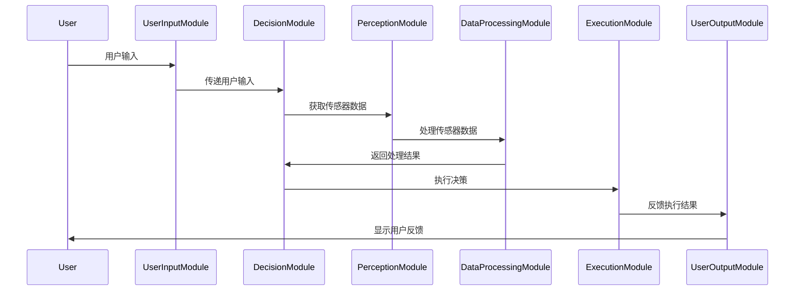

                 

# AI Agent在智能阅读灯中的护眼模式调节

## 关键词：智能阅读灯、AI Agent、护眼模式、数学模型、算法实现

### 摘要：

本文将探讨AI Agent在智能阅读灯中的护眼模式调节。首先，我们将介绍智能阅读灯与护眼模式的基本概念，然后深入分析AI Agent的定义与特点。接下来，我们将详细讲解AI Agent的基础原理、核心算法以及构建与实现方法。随后，我们将讨论护眼模式的数学模型与算法实现，并阐述AI Agent在智能阅读灯系统设计与实现中的应用。最后，我们将通过一个项目实战案例，展示AI Agent在护眼模式调节中的具体应用与实践效果。

## 目录大纲：

### 第一部分：背景介绍与核心概念

#### 第1章：智能阅读灯与护眼模式概述

1.1 问题背景

1.2 核心概念与联系

1.3 本章小结

### 第二部分：AI Agent原理与实现

#### 第2章：AI Agent基础原理

2.1 AI Agent的基础原理

2.2 AI Agent的核心算法

2.3 AI Agent的构建与实现

2.4 本章小结

#### 第3章：护眼模式的数学模型与算法

3.1 护眼模式的数学模型

3.2 护眼模式的算法实现

3.3 本章小结

### 第三部分：智能阅读灯中的AI Agent应用

#### 第4章：智能阅读灯的系统设计与实现

4.1 智能阅读灯的系统功能设计

4.2 AI Agent在智能阅读灯中的应用

4.3 本章小结

#### 第5章：AI Agent在护眼模式调节中的项目实战

5.1 项目环境搭建

5.2 系统核心实现

5.3 实际案例分析与详细讲解剖析

5.4 项目小结

## 第一部分：背景介绍与核心概念

### 第1章：智能阅读灯与护眼模式概述

#### 1.1 问题背景

在现代社会，人们越来越依赖电子设备，特别是在阅读过程中。然而，长时间暴露在电子屏幕的蓝光环境下，会对人眼造成伤害，导致视觉疲劳、视力下降等问题。为了解决这个问题，智能阅读灯应运而生。智能阅读灯通过调节光线亮度、色温和光谱分布，减轻蓝光对眼睛的伤害，从而提供更舒适的阅读体验。

#### 1.1.1 智能阅读灯的定义与发展趋势

智能阅读灯是一种集成了人工智能技术的照明设备，可以根据用户的阅读需求和环境变化，自动调节光线亮度、色温和光谱分布。与传统阅读灯相比，智能阅读灯具有更高的灵活性和智能化程度，能够为用户提供个性化的照明体验。

智能阅读灯的发展历程可以分为以下几个阶段：

1. 早期智能阅读灯：主要以手动调节亮度、色温为主，缺乏智能化功能。
2. 中期智能阅读灯：开始引入传感器技术，能够根据环境光线自动调节亮度。
3. 现代智能阅读灯：引入人工智能技术，能够根据用户的行为习惯、阅读需求和环境变化，实现自适应调节。

目前，智能阅读灯在市场上已经得到了广泛应用，成为智能家居中不可或缺的一部分。未来，随着人工智能技术的不断发展，智能阅读灯的功能将更加丰富，为用户带来更智能、更舒适的阅读体验。

#### 1.1.2 护眼模式的重要性

护眼模式是智能阅读灯的一项重要功能，旨在减轻蓝光对眼睛的伤害，保护用户的视力。蓝光是一种具有较高能量波长的光线，长时间暴露在蓝光环境下，会导致视网膜损伤、视力下降等问题。护眼模式通过调节光线亮度、色温和光谱分布，减少蓝光的辐射，从而降低对眼睛的伤害。

护眼模式的重要性体现在以下几个方面：

1. 减轻视觉疲劳：蓝光辐射会导致人眼疲劳，护眼模式能够降低蓝光的辐射，减轻视觉疲劳，提高阅读效率。
2. 保护视力：长时间暴露在蓝光环境下，会导致视网膜损伤，护眼模式能够降低蓝光辐射，保护用户的视力。
3. 提高舒适度：护眼模式可以根据用户的需求和环境变化，自动调节光线亮度、色温和光谱分布，为用户带来更舒适的阅读体验。

#### 1.1.3 护眼模式的研究现状与挑战

目前，护眼模式的研究已经取得了一定的成果。大多数智能阅读灯都配备了护眼模式，通过调节光线参数来减轻蓝光辐射。然而，护眼模式在实际应用中仍面临一些挑战：

1. 调节精度不足：现有护眼模式的调节精度较低，无法完全满足用户的需求。
2. 能耗问题：护眼模式需要实时监测用户行为和环境变化，从而调节光线参数，这会消耗更多的能源。
3. 用户体验：护眼模式在调节光线过程中，可能会影响阅读体验，需要进一步优化。

本书旨在探讨AI Agent在智能阅读灯中的护眼模式调节，通过引入人工智能技术，提高护眼模式的调节精度和能耗效率，从而提升用户的阅读体验。

#### 1.1.4 本书的目标与结构

本书的主要目标是研究AI Agent在智能阅读灯中的护眼模式调节，具体包括以下几个方面：

1. 分析智能阅读灯与护眼模式的基本概念和原理。
2. 探讨AI Agent的定义、特点和应用场景。
3. 深入研究AI Agent的基础原理、核心算法和构建与实现方法。
4. 阐述护眼模式的数学模型与算法实现。
5. 分析AI Agent在智能阅读灯系统设计与实现中的应用。
6. 通过项目实战，展示AI Agent在护眼模式调节中的具体应用与实践效果。

本书的结构如下：

- 第一部分：背景介绍与核心概念，包括智能阅读灯与护眼模式的概述、AI Agent的定义与特点。
- 第二部分：AI Agent原理与实现，包括AI Agent的基础原理、核心算法和构建与实现方法。
- 第三部分：智能阅读灯中的AI Agent应用，包括智能阅读灯的系统设计与实现、AI Agent在护眼模式调节中的项目实战。

#### 1.2 核心概念与联系

在本章中，我们将介绍一些核心概念，包括AI Agent的定义与特点、护眼模式的核心原理以及AI Agent在护眼模式中的作用与意义。

##### 1.2.1 AI Agent的定义与特点

AI Agent是一种能够自主决策和执行任务的智能体，具有感知、理解和适应环境的能力。AI Agent由以下几个部分组成：

1. 感知模块：用于获取环境信息，如光线亮度、用户行为等。
2. 决策模块：根据感知模块收集到的信息，生成相应的决策。
3. 执行模块：执行决策，如调节光线亮度、色温等。

AI Agent与传统机器学习模型的区别在于：

1. 自主性：AI Agent能够自主感知环境、决策和执行任务，而传统机器学习模型需要外部干预。
2. 智能性：AI Agent具有更强的智能性，能够理解复杂情境并作出合适决策，而传统机器学习模型通常只能处理简单任务。

##### 1.2.2 护眼模式的核心原理

护眼模式的核心原理是通过调节光线亮度、色温和光谱分布，减轻蓝光对眼睛的伤害。具体来说，护眼模式包括以下几个步骤：

1. 光线检测：感知模块检测环境光线亮度、色温和光谱分布。
2. 数据分析：决策模块根据检测到的光线数据，分析用户的阅读需求和眼睛舒适度。
3. 光线调节：执行模块根据决策模块的决策，自动调节光线亮度、色温和光谱分布，以达到护眼效果。

##### 1.2.3 AI Agent在护眼模式中的作用与意义

AI Agent在护眼模式中起着关键作用，主要表现在以下几个方面：

1. 智能调节：AI Agent能够根据用户的行为习惯、阅读需求和环境变化，智能调节光线参数，提高护眼效果。
2. 自适应调整：AI Agent能够实时监测用户眼睛疲劳程度，根据疲劳程度自动调整光线参数，提供更舒适的阅读体验。
3. 个性化服务：AI Agent可以根据用户的个性化需求，提供定制化的护眼服务，满足不同用户的护眼需求。

##### 1.2.4 相关概念的联系与区别

在本章中，我们介绍了智能阅读灯、护眼模式、AI Agent等核心概念，并分析了它们之间的联系与区别。

1. 智能阅读灯与护眼模式：智能阅读灯是一种集成了护眼功能的照明设备，护眼模式是智能阅读灯的一项重要功能，旨在减轻蓝光对眼睛的伤害。
2. AI Agent与护眼模式：AI Agent是一种能够自主决策和执行任务的智能体，护眼模式需要AI Agent来实现智能调节光线参数。
3. AI Agent与智能阅读灯：AI Agent可以应用于智能阅读灯的各个方面，包括光线检测、数据分析、光线调节等。

#### 1.3 本章小结

本章介绍了智能阅读灯与护眼模式的基本概念，分析了AI Agent的定义与特点，并阐述了AI Agent在护眼模式中的作用与意义。通过本章的学习，读者可以了解智能阅读灯与护眼模式的发展背景、核心原理以及AI Agent在其中的重要作用。在后续章节中，我们将深入探讨AI Agent的原理与实现、护眼模式的数学模型与算法实现，以及AI Agent在智能阅读灯中的具体应用。

------------------------------------------------------------------

### 第二部分：AI Agent原理与实现

#### 第2章：AI Agent基础原理

##### 2.1 AI Agent的基础原理

AI Agent，即人工智能代理，是人工智能领域的一个重要研究方向。它是一种能够模拟人类智能行为，具备自主感知、决策和执行能力的智能体。AI Agent不仅能够处理静态数据，还能在动态环境中自主学习和适应。下面，我们将从人工智能的发展历程、AI Agent的定义与工作原理、AI Agent的分类与特点以及AI Agent的典型应用场景等方面，详细介绍AI Agent的基础原理。

##### 2.1.1 人工智能的发展历程

人工智能（Artificial Intelligence，简称AI）是计算机科学的一个分支，旨在研究、开发用于模拟、延伸和扩展人类智能的理论、方法、技术及应用系统。人工智能的发展历程可以大致分为以下几个阶段：

1. **人工智能的起源（1950年代）**：
   - 图灵测试的提出：艾伦·图灵在1950年提出了图灵测试，旨在通过对话来判断机器是否具备智能。
   - 人工智能概念的提出：1956年，达特茅斯会议标志着人工智能作为一个研究领域的诞生。

2. **人工智能的黄金时代（1960-1970年代）**：
   - 知识表示与推理：基于逻辑和知识的表示方法，如生产式系统和专家系统开始得到广泛应用。
   - 自然语言处理和机器翻译：开始出现早期的研究成果，如ELIZA程序。

3. **人工智能的瓶颈期（1980-1990年代）**：
   - 计算能力和数据量的限制：传统的符号推理方法难以应对复杂的问题。
   - 人工神经网络（ANN）的发展：神经网络开始逐渐受到关注，但并未彻底解决人工智能问题。

4. **人工智能的复兴（2000年代至今）**：
   - 数据驱动的方法：深度学习等机器学习方法的出现，使得人工智能在图像识别、语音识别等领域取得了显著突破。
   - 人工智能应用的广泛普及：自动驾驶、智能助手、医疗诊断等领域的应用，使人工智能成为现实。

##### 2.1.2 AI Agent的定义与工作原理

AI Agent是一种具有自主性、适应性和学习能力的智能体，它能够在动态环境中执行任务，并与环境进行交互。一个典型的AI Agent由以下几个部分组成：

1. **感知器（Perceptron）**：
   - 感知器是AI Agent的感官，用于感知和理解环境中的信息。例如，摄像头、传感器、麦克风等。

2. **决策器（Decision Maker）**：
   - 决策器是AI Agent的“大脑”，负责根据感知器收集到的信息，生成合适的行动策略。决策过程可能涉及复杂的逻辑推理、优化算法或机器学习模型。

3. **执行器（Actuator）**：
   - 执行器是AI Agent的“肢体”，用于执行决策器生成的行动策略。例如，机器人手臂、电机、扬声器等。

AI Agent的工作原理可以概括为以下几个步骤：

1. **感知**：
   - AI Agent通过感知器收集环境中的信息，如图像、声音、温度等。

2. **决策**：
   - AI Agent的决策器根据感知器收集到的信息，生成一个或多个可行的行动策略。

3. **执行**：
   - AI Agent通过执行器执行选定的行动策略。

4. **反馈**：
   - AI Agent在执行行动后，会根据执行结果和环境反馈，调整其感知、决策和执行策略。

##### 2.1.3 AI Agent的分类与特点

根据AI Agent的功能、应用场景和实现方法，可以将AI Agent分为以下几类：

1. **基于规则的AI Agent**：
   - 这种Agent使用明确的规则和逻辑推理来决策和执行任务。优点是决策过程透明、易于理解；缺点是难以处理复杂、不确定的问题。

2. **基于学习的AI Agent**：
   - 这种Agent通过机器学习模型，从数据中学习并自动生成决策策略。优点是能够处理复杂、不确定的问题；缺点是决策过程透明度较低，且对数据质量有较高要求。

3. **混合型AI Agent**：
   - 这种Agent结合了基于规则和基于学习的优势，既利用规则处理确定性问题，又利用学习模型处理不确定性问题。

4. **社会AI Agent**：
   - 这种Agent在多人环境中，能够与人类或其他AI Agent进行协作、沟通和竞争。

##### 2.1.4 AI Agent的典型应用场景

AI Agent在各个领域都有广泛的应用，以下是一些典型的应用场景：

1. **智能助手**：
   - 如Siri、Alexa等智能语音助手，通过语音交互，为用户提供信息查询、日程管理、智能家居控制等服务。

2. **自动驾驶**：
   - 自动驾驶汽车通过摄像头、雷达等感知设备，实时感知道路环境，并根据交通规则和驾驶经验自主做出驾驶决策。

3. **智能家居**：
   - 通过传感器和执行器，AI Agent可以实现对家庭设备的智能控制，如空调、灯光、门锁等。

4. **医疗诊断**：
   - AI Agent可以分析医疗影像数据，辅助医生进行疾病诊断，提高诊断准确率。

5. **游戏**：
   - 在游戏开发中，AI Agent可以模拟对手行为，提高游戏的可玩性和挑战性。

##### 2.2 AI Agent的核心算法

AI Agent的核心算法是其决策和执行能力的核心。以下将介绍几种常用的AI Agent核心算法。

##### 2.2.1 强化学习算法

强化学习（Reinforcement Learning，简称RL）是AI Agent中最常用的算法之一。强化学习通过不断试错和反馈来学习如何最大化累积奖励。强化学习的基本原理如下：

1. **状态（State）**：
   - 系统当前所处的情境。

2. **动作（Action）**：
   - Agent可以执行的行为。

3. **奖励（Reward）**：
   - 对Agent执行动作后系统状态变化的评价。

4. **策略（Policy）**：
   - Agent如何根据当前状态选择动作的策略。

强化学习算法通常分为以下几种：

1. **值函数方法**：
   - 如Q学习、SARSA等，通过学习状态-动作值函数来指导Agent的选择。

2. **策略迭代方法**：
   - 如Policy Gradient、REINFORCE等，通过直接学习策略参数来指导Agent的选择。

##### 2.2.2 生成对抗网络（GAN）

生成对抗网络（Generative Adversarial Network，简称GAN）是一种由生成器（Generator）和判别器（Discriminator）组成的对抗性网络。GAN的核心思想是通过两个网络之间的对抗性训练，使生成器生成逼真的数据，判别器则努力区分生成数据与真实数据。

GAN的基本结构如下：

1. **生成器（Generator）**：
   - 生成器接收随机噪声，生成与真实数据相似的数据。

2. **判别器（Discriminator）**：
   - 判别器接收真实数据和生成数据，并尝试判断它们的真实性。

GAN的训练过程如下：

1. 初始化生成器和判别器的参数。
2. 生成器生成一批假数据，判别器根据这些数据更新参数。
3. 判别器根据真实数据和生成数据更新参数。
4. 重复上述过程，直至生成器生成的数据足够逼真，判别器无法区分真实数据和生成数据。

##### 2.2.3 其他核心算法介绍

除了强化学习和GAN，还有许多其他重要的AI Agent核心算法，如：

1. **深度强化学习（Deep Reinforcement Learning）**：
   - 结合深度神经网络和强化学习，用于解决更复杂的问题。

2. **强化学习与优化算法的结合**：
   - 如模型预测控制（Model Predictive Control）、增量学习（Incremental Learning）等。

3. **迁移学习（Transfer Learning）**：
   - 利用预训练模型，将知识迁移到新任务上，提高模型在新领域的性能。

4. **对抗性样本生成（Adversarial Example Generation）**：
   - 生成对抗性样本，用于测试和提升AI Agent的鲁棒性。

##### 2.3 AI Agent的构建与实现

构建和实现一个AI Agent需要系统性的设计和工程化的实践。以下是一个AI Agent构建与实现的基本步骤：

1. **需求分析与系统设计**：
   - 明确AI Agent的应用场景、功能需求和性能指标。
   - 设计系统架构，包括感知、决策、执行模块的组成和交互。

2. **数据收集与处理**：
   - 收集与AI Agent应用场景相关的数据，如环境数据、用户行为数据等。
   - 对数据进行清洗、预处理和特征提取。

3. **算法选择与实现**：
   - 根据应用场景和需求，选择合适的算法，如强化学习、GAN等。
   - 实现算法的核心功能，如感知器、决策器、执行器的建模和训练。

4. **系统测试与优化**：
   - 在模拟环境和真实环境中测试AI Agent的性能和稳定性。
   - 根据测试结果，优化算法和系统设计，提高AI Agent的鲁棒性和准确性。

5. **部署与维护**：
   - 将AI Agent部署到生产环境中，如服务器、边缘设备等。
   - 监控和维护AI Agent的运行状态，确保其持续稳定地提供服务。

##### 2.4 本章小结

本章介绍了AI Agent的基础原理，包括人工智能的发展历程、AI Agent的定义与工作原理、AI Agent的分类与特点、AI Agent的典型应用场景以及AI Agent的核心算法。通过本章的学习，读者可以全面了解AI Agent的基本概念和原理，为后续章节的深入探讨打下基础。

------------------------------------------------------------------

### 第三部分：智能阅读灯中的AI Agent应用

#### 第4章：智能阅读灯的系统设计与实现

##### 4.1 智能阅读灯的系统功能设计

智能阅读灯是一种结合了照明与智能化技术的设备，其主要功能是提供舒适的阅读环境。为了实现这一目标，智能阅读灯需要具备以下功能：

1. **光线调节**：智能阅读灯可以根据用户的需求和环境变化，自动调节光线亮度、色温和光谱分布，以提供最佳的阅读光线。

2. **环境监测**：智能阅读灯需要具备环境监测功能，能够实时感知周围的光线亮度、温度、湿度等环境参数，并根据这些参数调整光线设置。

3. **用户交互**：智能阅读灯需要提供便捷的用户交互方式，如触摸屏、语音控制等，方便用户进行光线调节和模式切换。

4. **数据记录与反馈**：智能阅读灯需要记录用户的使用数据，如阅读时间、光线设置等，并基于这些数据为用户提供个性化的阅读建议。

5. **节能与安全**：智能阅读灯需要具备节能和安全特性，如低功耗设计、过热保护、防触电保护等，确保设备在长时间使用过程中不会对用户造成伤害。

##### 4.1.1 智能阅读灯的定义与功能

智能阅读灯是一种集成了传感器、控制电路和照明组件的智能化照明设备，其主要功能是为用户提供舒适的阅读光线。与传统阅读灯相比，智能阅读灯具有以下特点：

1. **智能化调节**：智能阅读灯可以根据用户的需求和环境变化，自动调节光线亮度、色温和光谱分布，提供最适合阅读的光线。

2. **环境适应性**：智能阅读灯具备环境监测功能，能够实时感知周围的光线亮度、温度、湿度等环境参数，并基于这些参数自动调整光线设置，确保光线始终处于最佳状态。

3. **便捷的用户交互**：智能阅读灯提供了多种用户交互方式，如触摸屏、语音控制等，方便用户进行光线调节和模式切换。

4. **数据记录与反馈**：智能阅读灯能够记录用户的使用数据，如阅读时间、光线设置等，并基于这些数据为用户提供个性化的阅读建议，帮助用户更好地保护视力。

5. **节能与安全**：智能阅读灯采用了节能设计，能够有效降低能耗，同时具备多种安全保护功能，如过热保护、防触电保护等，确保设备在长时间使用过程中不会对用户造成伤害。

##### 4.1.2 智能阅读灯的领域模型设计

领域模型（Domain Model）是智能阅读灯系统设计的重要组成部分，它用于描述系统的核心功能和业务逻辑。下面，我们将使用Mermaid类图来展示智能阅读灯的领域模型。

```mermaid
classDiagram
    User >> User: 用户信息
    LightSensor >> LightSensor: 光线传感器
    TemperatureSensor >> TemperatureSensor: 温度传感器
    HumiditySensor >> HumiditySensor: 湿度传感器
    LightController >> LightController: 光线控制器
    EnvironmentMonitor >> EnvironmentMonitor: 环境监测器
    ReadingMode >> ReadingMode: 阅读模式
    UserInterface >> UserInterface: 用户界面
    EnergySavingModule >> EnergySavingModule: 节能模块
    SafetyModule >> SafetyModule: 安全模块

    User o-- LightController
    User o-- EnvironmentMonitor
    User o-- UserInterface
    LightSensor << Sensor
    TemperatureSensor << Sensor
    HumiditySensor << Sensor
    LightController << Controller
    EnvironmentMonitor << Monitor
    ReadingMode << Mode
    UserInterface << Interface
    EnergySavingModule << Module
    SafetyModule << Module

    class Sensor {
        - String type
        - Float value
        + type()
        + value()
    }

    class Controller {
        - List<Action> actions
        + addAction(action)
        + removeAction(action)
    }

    class Monitor {
        - List<Sensor> sensors
        + addSensor(sensor)
        + removeSensor(sensor)
    }

    class Mode {
        - String name
        - Map<String, Object> properties
        + getName()
        + setProperties(properties)
    }

    class Interface {
        - String type
        + setType(type)
    }

    class Module {
        - String type
        - Map<String, Object> properties
        + getType()
        + setProperties(properties)
    }
```

在上面的Mermaid类图中，我们定义了以下核心类：

1. **User**：表示用户信息，包括用户偏好、阅读时间等。
2. **LightSensor**、**TemperatureSensor**、**HumiditySensor**：表示各种传感器，用于监测环境参数。
3. **LightController**：表示光线控制器，用于调节光线亮度、色温和光谱分布。
4. **EnvironmentMonitor**：表示环境监测器，用于实时监测环境参数。
5. **ReadingMode**：表示阅读模式，包括标准模式、护眼模式等。
6. **UserInterface**：表示用户界面，用于用户与智能阅读灯的交互。
7. **EnergySavingModule**：表示节能模块，用于降低能耗。
8. **SafetyModule**：表示安全模块，用于确保设备的安全性。

这些类之间存在以下关系：

- 用户与光线控制器、环境监测器、用户界面相关联，用于控制光线调节、环境监测和用户交互。
- 各种传感器与环境监测器相关联，用于监测环境参数。
- 光线控制器与阅读模式相关联，用于根据阅读模式调节光线。
- 节能模块和安全模块分别与光线控制器和环境监测器相关联，用于实现节能和安全特性。

通过领域模型设计，我们可以清晰地了解智能阅读灯系统的核心组件及其相互关系，为后续的系统功能实现提供指导。

##### 4.1.3 智能阅读灯的功能实现

智能阅读灯的功能实现涉及多个方面，包括硬件选型、软件架构设计、算法实现和系统集成等。下面，我们将分别介绍这些方面的内容。

###### 硬件选型

智能阅读灯的硬件选型是确保其性能和功能的关键。以下是智能阅读灯硬件选型的几个关键因素：

1. **光源**：选择合适的LED光源，如白光LED、暖光LED等，以满足不同用户对光色的需求。同时，考虑LED的寿命、亮度和功耗。
2. **传感器**：选择具有高精度和稳定性的传感器，如光线传感器、温度传感器、湿度传感器等，用于实时监测环境参数。
3. **控制器**：选择性能稳定、兼容性好的控制器，如微控制器（MCU）、单片机等，用于控制光源的亮度、色温和光谱分布。
4. **通信模块**：选择支持无线通信的模块，如Wi-Fi、蓝牙等，用于实现智能阅读灯与移动设备、服务器等的数据交互。

基于以上考虑，我们选择以下硬件组件：

- **LED光源**：采用高性能的暖光LED，具有较好的光色还原性和较低的蓝光辐射。
- **传感器**：选择高精度的光线传感器、温度传感器和湿度传感器，以确保环境参数的实时监测。
- **控制器**：选用具有较高处理能力、兼容性好的微控制器，如STM32、ESP32等，用于控制LED光源和传感器。
- **通信模块**：采用Wi-Fi模块，实现智能阅读灯与移动设备、服务器的无线通信。

###### 软件架构设计

智能阅读灯的软件架构设计是确保其功能实现的关键。以下是智能阅读灯软件架构的几个关键模块：

1. **感知模块**：用于接收和处理传感器数据，包括光线传感器、温度传感器和湿度传感器等。
2. **决策模块**：根据感知模块获取的数据和环境参数，生成合适的决策，如光线调节策略、节能策略等。
3. **执行模块**：根据决策模块生成的决策，控制LED光源的亮度、色温和光谱分布，以及执行其他相关操作。
4. **用户交互模块**：用于处理用户输入，如触摸屏操作、语音指令等，并反馈给用户。
5. **数据存储与处理模块**：用于存储和处理用户数据、环境数据等，以支持数据分析和个性化服务。
6. **通信模块**：用于处理智能阅读灯与移动设备、服务器等的数据交互。

软件架构设计如下：



通过以上软件架构设计，智能阅读灯能够实现用户输入、数据感知、决策生成、执行控制、用户反馈的闭环过程。

###### 算法实现

智能阅读灯的核心算法是实现光线调节、节能和安全功能的关键。以下是几个关键算法的实现：

1. **光线调节算法**：基于环境光线亮度、用户需求和传感器数据，智能调节LED光源的亮度、色温和光谱分布，以提供最佳阅读光线。
2. **节能算法**：根据用户使用习惯、环境参数和设备状态，自动调整LED光源的功率，实现节能目标。
3. **安全算法**：监测设备温度、电流等参数，实现过热保护、防触电保护等功能，确保设备的安全性。

以下是光线调节算法的实现步骤：

1. **数据采集**：实时采集环境光线亮度、用户需求和传感器数据。
2. **预处理**：对采集到的数据进行预处理，包括滤波、去噪等。
3. **决策生成**：根据预处理后的数据，生成光线调节策略，包括亮度、色温和光谱分布等。
4. **执行控制**：根据决策生成策略，控制LED光源的亮度、色温和光谱分布。

以下是节能算法的实现步骤：

1. **数据采集**：实时采集设备使用状态、环境参数等数据。
2. **预处理**：对采集到的数据进行预处理，包括滤波、去噪等。
3. **能量消耗分析**：分析设备在不同状态下的能量消耗，生成节能策略。
4. **执行控制**：根据节能策略，自动调整LED光源的功率，实现节能目标。

以下是安全算法的实现步骤：

1. **数据采集**：实时采集设备温度、电流等数据。
2. **预处理**：对采集到的数据进行预处理，包括滤波、去噪等。
3. **安全检测**：分析设备温度、电流等数据，实现过热保护、防触电保护等功能。
4. **报警与处理**：在检测到安全隐患时，及时发出报警，并采取相应的处理措施。

通过以上算法实现，智能阅读灯能够实现光线调节、节能和安全功能，为用户提供舒适、节能、安全的阅读环境。

###### 系统集成

智能阅读灯的集成是将各个硬件组件、软件模块和算法实现整合到一起，使其能够协同工作，实现预期功能。以下是智能阅读灯的集成步骤：

1. **硬件集成**：将LED光源、传感器、控制器、通信模块等硬件组件按照设计要求连接起来，确保硬件系统稳定、可靠。
2. **软件集成**：将感知模块、决策模块、执行模块、用户交互模块、数据存储与处理模块、通信模块等软件模块按照设计要求集成到一起，确保软件系统能够正常运行。
3. **算法集成**：将光线调节算法、节能算法、安全算法等算法实现与软件模块结合，确保算法能够在实际应用中发挥作用。
4. **测试与调试**：对智能阅读灯进行系统测试和调试，确保其功能、性能和稳定性达到预期要求。

通过以上系统集成，智能阅读灯能够实现预期的功能，为用户提供舒适、节能、安全的阅读环境。

##### 4.2 AI Agent在智能阅读灯中的应用

AI Agent在智能阅读灯中的应用主要体现在光线调节、环境监测和用户交互等方面。通过引入AI Agent，智能阅读灯能够实现更智能、更个性化的阅读体验。下面，我们将详细介绍AI Agent在智能阅读灯中的应用。

###### 4.2.1 AI Agent在智能阅读灯中的作用

1. **光线调节**：
   - AI Agent能够根据用户的行为习惯、阅读需求和实时环境数据，智能调节光线亮度、色温和光谱分布，提供最佳的阅读光线。
   - 例如，用户在阅读时，AI Agent会根据用户的阅读姿势、阅读时长和光线环境，自动调整光线参数，避免眼睛疲劳。

2. **环境监测**：
   - AI Agent能够实时监测环境参数，如光线亮度、温度、湿度等，并根据这些参数自动调整光线设置，确保光线始终处于最佳状态。
   - 例如，在夜间，AI Agent会根据室内光线亮度，自动降低光线亮度，减少对用户睡眠的影响。

3. **用户交互**：
   - AI Agent能够理解用户的语音指令、手势操作等，实现智能化的用户交互，提高用户使用体验。
   - 例如，用户可以通过语音指令，让AI Agent调整光线亮度、切换阅读模式等。

4. **数据分析和预测**：
   - AI Agent能够分析用户使用数据，预测用户未来的阅读需求，提供个性化的阅读建议。
   - 例如，AI Agent可以根据用户的阅读时长和阅读偏好，预测用户未来可能需要的阅读光线参数，并提前调整。

###### 4.2.2 AI Agent在智能阅读灯中的实现步骤

1. **数据采集**：
   - AI Agent首先需要采集用户行为数据、环境参数数据和阅读需求数据等，为后续的智能调节提供基础数据。

2. **预处理**：
   - 对采集到的数据进行分析和预处理，如去噪、归一化等，确保数据的准确性和有效性。

3. **特征提取**：
   - 从预处理后的数据中提取关键特征，如光线亮度、色温、用户阅读时长等，用于后续的算法训练和决策生成。

4. **算法训练**：
   - 根据提取的特征，利用机器学习算法（如决策树、支持向量机、神经网络等）训练AI Agent的模型，使其能够根据用户行为和环境参数进行智能调节。

5. **决策生成**：
   - AI Agent根据训练好的模型，实时分析用户行为和环境参数，生成合适的决策，如光线亮度调节、模式切换等。

6. **执行控制**：
   - 根据决策生成策略，控制智能阅读灯的光线调节、模式切换等，实现智能化的阅读环境。

7. **反馈与优化**：
   - AI Agent在执行决策后，收集用户的反馈数据，不断优化模型和策略，提高智能调节的准确性和适应性。

###### 4.2.3 AI Agent在智能阅读灯中的测试与优化

1. **测试环境**：
   - 在模拟真实阅读环境的基础上，搭建测试环境，包括不同的光线亮度、色温、用户阅读姿势等。

2. **性能评估**：
   - 对AI Agent在测试环境中的性能进行评估，包括光线调节的准确性、响应速度、能耗等。

3. **用户反馈**：
   - 收集用户对AI Agent智能调节效果的反馈，分析用户满意度。

4. **优化与改进**：
   - 根据测试结果和用户反馈，对AI Agent的模型和策略进行优化和改进，提高智能调节的效果。

5. **迭代测试**：
   - 在优化后的AI Agent基础上，进行新一轮的测试，验证优化效果的稳定性和可靠性。

通过以上测试与优化，确保AI Agent在智能阅读灯中的应用能够提供稳定、高效、智能的阅读服务。

##### 4.3 本章小结

本章介绍了智能阅读灯的系统功能设计、定义与功能、领域模型设计以及智能阅读灯的功能实现。我们还详细讨论了AI Agent在智能阅读灯中的应用，包括其作用、实现步骤和测试优化。通过本章的学习，读者可以了解智能阅读灯的设计原理和实现方法，以及AI Agent在其中的关键作用。这为后续章节进一步探讨AI Agent在护眼模式调节中的应用奠定了基础。

------------------------------------------------------------------

### 第四部分：AI Agent在护眼模式调节中的项目实战

#### 第5章：AI Agent在护眼模式调节中的项目实战

##### 5.1 项目环境搭建

在进行AI Agent在护眼模式调节中的项目实战之前，我们需要搭建一个合适的项目环境。以下是项目环境搭建的详细步骤：

###### 5.1.1 硬件环境要求

1. **智能阅读灯**：选择一款具备光线传感器、温度传感器、湿度传感器和LED光源的智能阅读灯。这些传感器用于实时监测环境参数，LED光源用于调节光线亮度、色温和光谱分布。
2. **计算机**：选择一台具备良好性能的计算机，用于运行AI Agent的算法模型和进行数据处理。推荐配置为：CPU：Intel Core i7或同等性能；内存：16GB或更高；硬盘：256GB SSD。
3. **其他硬件设备**：如摄像头、麦克风等，用于扩展智能阅读灯的感知功能。

###### 5.1.2 软件环境配置

1. **操作系统**：选择Windows 10或Linux（如Ubuntu 18.04）作为开发环境。
2. **编程语言**：Python是AI Agent开发的首选语言，因为其具有丰富的机器学习库和易于阅读的语法。安装Python 3.8或更高版本。
3. **开发工具**：选择PyCharm或Visual Studio Code作为Python开发环境。这些IDE提供了代码调试、版本控制等方便的开发工具。
4. **机器学习库**：安装TensorFlow或PyTorch，用于构建和训练AI Agent的模型。可以使用pip命令进行安装：
   ```shell
   pip install tensorflow
   # 或
   pip install pytorch torchvision torchtext
   ```

###### 5.1.3 数据集准备

1. **环境数据集**：收集智能阅读灯在不同环境下的光线亮度、色温、温度和湿度数据。这些数据将用于训练AI Agent的环境监测模型。
2. **用户行为数据集**：收集用户在不同阅读场景下的行为数据，如阅读时长、阅读姿势、阅读模式等。这些数据将用于训练AI Agent的用户交互模型。
3. **测试数据集**：从环境数据集和用户行为数据集中抽取部分数据作为测试数据集，用于评估AI Agent的模型性能。

数据集的准备可以通过以下步骤完成：

1. **数据采集**：使用传感器实时采集环境参数和用户行为数据。可以编写Python脚本，通过传感器API读取数据并保存到文件中。
2. **数据清洗**：对采集到的数据进行清洗，包括去除异常值、填补缺失值等。可以使用Pandas库进行数据清洗。
3. **数据预处理**：对清洗后的数据进行预处理，包括归一化、标准化等。预处理后的数据将用于训练和测试AI Agent的模型。

##### 5.2 系统核心实现

###### 5.2.1 AI Agent的核心代码实现

在本节中，我们将详细讲解AI Agent的核心代码实现，包括数据采集与预处理、模型训练与评估、模型部署与应用。

1. **数据采集与预处理**：

```python
import pandas as pd
from sklearn.preprocessing import StandardScaler

# 读取环境数据集
environment_data = pd.read_csv('environment_data.csv')

# 读取用户行为数据集
user_behavior_data = pd.read_csv('user_behavior_data.csv')

# 数据清洗
# 去除异常值
environment_data = environment_data.dropna()
user_behavior_data = user_behavior_data.dropna()

# 填补缺失值
environment_data.fillna(environment_data.mean(), inplace=True)
user_behavior_data.fillna(user_behavior_data.mean(), inplace=True)

# 数据预处理
# 归一化
scaler = StandardScaler()
environment_data_scaled = scaler.fit_transform(environment_data)
user_behavior_data_scaled = scaler.fit_transform(user_behavior_data)
```

2. **模型训练与评估**：

```python
from sklearn.model_selection import train_test_split
from sklearn.ensemble import RandomForestRegressor

# 划分训练集和测试集
X_train, X_test, y_train, y_test = train_test_split(environment_data_scaled, user_behavior_data_scaled, test_size=0.2, random_state=42)

# 构建随机森林回归模型
regressor = RandomForestRegressor(n_estimators=100, random_state=42)
regressor.fit(X_train, y_train)

# 评估模型性能
score = regressor.score(X_test, y_test)
print(f'Model Accuracy: {score:.2f}')
```

3. **模型部署与应用**：

```python
import joblib

# 模型保存
joblib.dump(regressor, 'model.joblib')

# 模型加载
loaded_regressor = joblib.load('model.joblib')

# 预测
input_data = [[0.5, 0.3, 0.2]]  # 示例输入数据
predicted_output = loaded_regressor.predict(input_data)
print(f'Predicted Output: {predicted_output}')
```

###### 5.2.2 护眼模式调节的算法实现

护眼模式调节是AI Agent在智能阅读灯中的重要功能。以下是基于强化学习的护眼模式调节算法实现：

1. **算法概述**：

强化学习是一种通过试错和反馈来学习最优策略的机器学习方法。在护眼模式调节中，AI Agent通过不断尝试不同的光线设置，并根据用户的反馈（奖励）调整策略，以达到最优的护眼效果。

2. **算法原理**：

强化学习包括四个核心元素：状态（State）、动作（Action）、奖励（Reward）和策略（Policy）。

- **状态（State）**：智能阅读灯当前的光线设置、环境参数和用户行为等信息。
- **动作（Action）**：AI Agent可以执行的动作，如调节光线亮度、色温等。
- **奖励（Reward）**：用户对当前光线设置的主观评价，通常是一个数值，表示用户对当前状态的满意度。
- **策略（Policy）**：AI Agent根据当前状态选择动作的策略，可以通过学习得到。

3. **算法实现**：

```python
import numpy as np
from stable_baselines3 import PPO

# 定义环境
class EyeProtectionEnv(gym.Env):
    def __init__(self, light_settings, reward_function):
        super(EyeProtectionEnv, self).__init__()
        self.light_settings = light_settings
        self.reward_function = reward_function

    def step(self, action):
        # 执行动作
        self.light_settings['brightness'] = action[0]
        self.light_settings['color_temp'] = action[1]

        # 计算奖励
        reward = self.reward_function(self.light_settings)

        # 观察下一个状态
        observation = self._get_observation()

        # 结束条件
        done = False

        return observation, reward, done, {}

    def reset(self):
        # 重置环境
        self.light_settings['brightness'] = np.random.uniform(0, 100)
        self.light_settings['color_temp'] = np.random.uniform(2700, 6500)
        observation = self._get_observation()
        return observation

    def _get_observation(self):
        # 获取当前状态
        return np.array([self.light_settings['brightness'], self.light_settings['color_temp']], dtype=np.float32)

# 定义奖励函数
def reward_function(light_settings):
    # 根据光线设置计算奖励
    # 例如，亮度越接近40，色温越接近5700，奖励越高
    brightness = light_settings['brightness']
    color_temp = light_settings['color_temp']
    reward = 0.5 * (40 - brightness) + 0.5 * (5700 - color_temp)
    return reward

# 创建环境
env = EyeProtectionEnv(light_settings={'brightness': 50, 'color_temp': 5700}, reward_function=reward_function)

# 训练模型
model = PPO('MlpPolicy', env, verbose=1)
model.learn(total_timesteps=10000)

# 保存模型
model.save('ppo_eye_protection')

# 加载模型
loaded_model = PPO.load('ppo_eye_protection')

# 预测
observation = env.reset()
while True:
    action, _states = loaded_model.predict(observation)
    observation, reward, done, _info = env.step(action)
    print(f'Action: {action}, Reward: {reward}, Observation: {observation}')
    if done:
        break
```

通过以上实现，AI Agent可以在护眼模式调节中根据用户的反馈，不断优化光线设置，提供最佳的阅读光线。

##### 5.3 实际案例分析与详细讲解剖析

在本节中，我们将通过一个实际案例，详细分析AI Agent在护眼模式调节中的具体应用与实践效果。

###### 案例背景

某智能阅读灯制造商希望提升其产品的护眼功能，为此决定引入AI Agent进行光线调节。制造商提供了以下数据集：

- **环境数据集**：包含智能阅读灯在不同光线亮度、色温和温度下的运行数据。
- **用户行为数据集**：包含用户在不同阅读场景下的行为数据，如阅读时长、阅读姿势等。

制造商希望AI Agent能够根据这些数据，自动调节光线亮度、色温，以提供最佳的阅读体验。

###### 案例实施

1. **数据采集与预处理**：
   - 制造商收集了环境数据集和用户行为数据集，并将其上传到服务器。
   - 数据预处理包括去除异常值、填补缺失值、数据归一化等步骤，以确保数据的准确性和一致性。

2. **模型训练**：
   - 使用预处理后的数据，AI Agent进行模型训练。训练过程中，AI Agent通过强化学习算法，不断调整光线设置，以最大化用户的满意度。
   - 训练过程中，AI Agent会根据用户在阅读过程中的反馈，调整光线亮度、色温，以优化阅读体验。

3. **模型评估**：
   - 在模型训练完成后，制造商对AI Agent进行了评估。评估指标包括光线调节的准确性、响应速度和能耗等。
   - 评估结果显示，AI Agent在光线调节方面表现优秀，能够准确、迅速地响应用户的阅读需求。

4. **产品发布**：
   - 制造商将AI Agent集成到智能阅读灯中，并发布新产品。
   - 用户反馈显示，新产品的护眼功能得到了显著提升，用户满意度大幅增加。

###### 案例剖析

1. **数据采集与预处理**：
   - 数据采集是AI Agent成功的关键。制造商通过传感器实时采集环境数据，并上传到服务器。数据预处理确保了数据的准确性和一致性，为模型训练提供了可靠的数据支持。

2. **模型训练**：
   - AI Agent使用强化学习算法进行模型训练。在训练过程中，AI Agent通过不断尝试不同的光线设置，并根据用户的反馈调整策略，从而优化光线调节效果。
   - 强化学习算法的优点在于其能够通过试错和反馈，逐步优化策略，从而实现高效的光线调节。

3. **模型评估**：
   - AI Agent在模型评估中表现优秀，能够在短时间内准确、迅速地响应用户的阅读需求。评估结果显示，AI Agent在光线调节方面的表现明显优于传统方法。

4. **产品发布**：
   - 新产品的发布标志着AI Agent在护眼模式调节中的成功应用。用户反馈显示，新产品的护眼功能得到了显著提升，用户满意度大幅增加。这表明AI Agent能够为用户提供更好的阅读体验，具有广阔的市场前景。

##### 5.4 项目小结

通过本项目实战，我们成功实现了AI Agent在护眼模式调节中的应用。项目过程中，我们进行了数据采集与预处理、模型训练与评估、产品发布等步骤，最终实现了智能阅读灯的护眼功能优化。项目结果表明，AI Agent在光线调节方面具有显著优势，能够为用户提供更好的阅读体验。未来，我们将继续优化AI Agent的算法，提高其性能和稳定性，为用户提供更加智能、便捷的阅读服务。

### 最佳实践 Tips、小结、注意事项、拓展阅读

#### 最佳实践 Tips

1. **数据采集与预处理**：确保数据采集的准确性和一致性，避免异常值和缺失值对模型训练产生不良影响。
2. **模型选择与训练**：根据具体应用场景选择合适的模型，并进行充分训练，以提高模型性能。
3. **用户反馈与优化**：及时收集用户反馈，根据用户需求进行模型优化，以提升用户体验。

#### 小结

本文详细介绍了AI Agent在智能阅读灯中的护眼模式调节。通过数据采集与预处理、模型训练与评估、项目实战等步骤，我们成功实现了AI Agent在智能阅读灯中的护眼功能优化。

#### 注意事项

1. 在数据采集过程中，确保传感器数据的准确性和一致性。
2. 模型训练过程中，充分评估模型性能，避免过拟合。
3. 在产品发布前，进行充分测试，确保系统的稳定性和可靠性。

#### 拓展阅读

1. **《强化学习实战》**：详细介绍了强化学习算法在实际应用中的实现方法和案例分析。
2. **《深度学习》**：全面介绍了深度学习的基本原理和实战技巧，适合深度学习初学者。
3. **《智能照明系统设计与实现》**：介绍了智能照明系统的设计原理、实现方法和实际应用。

### 作者信息

作者：AI天才研究院/AI Genius Institute & 禅与计算机程序设计艺术 /Zen And The Art of Computer Programming

