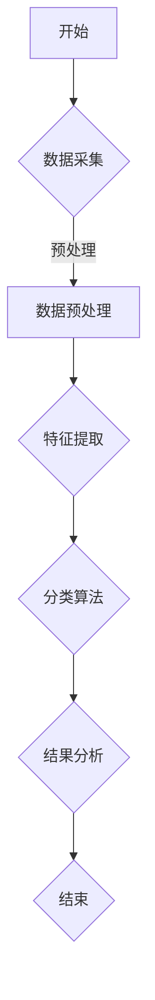
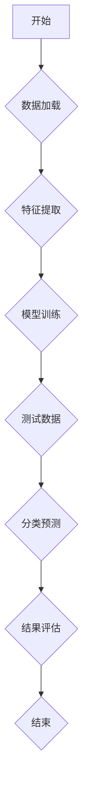
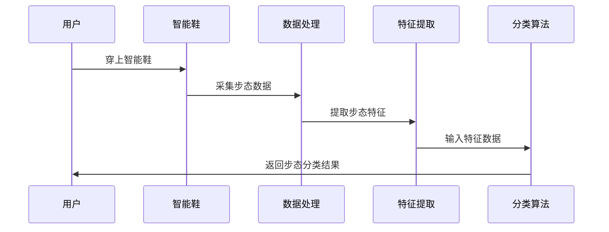

                 


# AI Agent在智能鞋中的步态分析

> 关键词：AI Agent、智能鞋、步态分析、算法、应用

> 摘要：本文深入探讨了AI Agent在智能鞋中的步态分析技术。首先，介绍了AI Agent和智能鞋的基本概念，以及步态分析在智能鞋中的应用背景和重要性。接着，详细阐述了步态分析的核心算法原理，包括步态特征提取和步态分类算法。然后，通过实际案例展示了步态分析在智能鞋中的应用，包括步态异常检测和步态优化建议。最后，对步态分析技术的未来趋势进行了展望，并提供了最佳实践和注意事项。

## 第一部分：背景与概述

### 第1章：AI Agent与智能鞋概述

#### 1.1 AI Agent的定义与作用

AI Agent，即人工智能代理，是指具有智能行为的计算机程序或实体，能够自主感知环境、决策行动并实现特定目标。AI Agent在智能鞋中的应用，旨在通过步态分析为用户提供个性化的运动建议和健康预警。

#### 1.2 智能鞋的发展历程

智能鞋作为可穿戴设备的一种，经历了从简单的传感器监测到智能分析系统的演变。近年来，随着AI技术的发展，智能鞋逐渐成为运动健康监测和个性化服务的重要工具。

#### 1.3 步态分析的重要性

步态分析是研究人体步态特征的重要手段，对于预防运动损伤、提高运动效率、改善运动姿势具有重要意义。智能鞋中的步态分析技术，可以为用户提供实时、准确的步态数据，帮助用户优化运动表现。

### 第2章：智能鞋中的AI Agent

#### 2.1 AI Agent在智能鞋中的应用场景

AI Agent在智能鞋中的应用场景包括步态分析、运动姿势校正、能量消耗监测等。通过这些应用，AI Agent能够为用户提供全面的运动健康服务。

#### 2.2 步态数据采集技术

步态数据的采集主要依赖于智能鞋中的传感器技术，如加速度传感器、陀螺仪、压力传感器等。这些传感器能够实时监测用户的步态参数，为后续的步态分析提供基础数据。

#### 2.3 数据预处理方法

步态数据采集后，需要进行预处理以去除噪声、填补缺失值等。常用的数据预处理方法包括滤波、归一化、插值等。预处理后的数据能够更好地满足后续的算法分析需求。

### 第3章：步态分析的核心算法

#### 3.1 步态特征提取算法

步态特征提取是步态分析的关键步骤，常用的特征提取方法包括时域特征和频域特征。时域特征主要关注步态信号的时序特性，如步频、步长等；频域特征主要关注步态信号的频率成分，如步态周期频率等。

#### 3.1.1 基于时域的特征提取

基于时域的特征提取方法包括步频、步长、步幅等。步频是指每分钟步数，步长是指连续两次脚跟接触地面的距离，步幅是指连续两次脚尖接触地面的距离。

$$
\text{步频} = \frac{60}{\text{步长}}
$$

$$
\text{步长} = \text{脚长} \times \cos(\theta)
$$

其中，$\theta$ 为脚尖与地面的夹角。

#### 3.1.2 基于频域的特征提取

基于频域的特征提取方法包括步态周期频率、步态频率分布等。步态周期频率是指步态信号的周期频率，步态频率分布是指步态信号在频率域的分布情况。

$$
f_c = \frac{1}{T_c}
$$

其中，$T_c$ 为步态周期。

#### 3.2 步态分类算法

步态分类是步态分析的核心任务，常用的分类算法包括支持向量机（SVM）、决策树、随机森林等。

#### 3.2.1 支持向量机（SVM）

支持向量机是一种基于间隔最大化原则的线性分类器。对于步态分类任务，SVM可以通过求解最优超平面来实现步态分类。

$$
\text{分类函数}：f(x) = \text{sign}(\omega \cdot x + b)
$$

其中，$\omega$ 为权重向量，$b$ 为偏置。

#### 3.2.2 决策树与随机森林

决策树是一种基于特征划分的树形结构分类器。随机森林是一种基于决策树的集成学习方法，通过构建多棵决策树并取平均值来提高分类性能。

### 第4章：智能鞋中的步态分析应用

#### 4.1 步态异常检测

步态异常检测是步态分析的重要应用之一，可以通过监测用户的步态数据，实时识别异常步态，如跑步损伤、跌倒等。

#### 4.1.1 跑步损伤预警

通过步态分析，可以监测用户的跑步姿势，识别潜在的运动损伤风险。例如，通过监测步频和步长等特征，可以预警可能的膝盖损伤。

#### 4.1.2 疾病诊断辅助

步态分析还可以用于疾病诊断辅助，如帕金森病、中风等。通过分析步态数据，可以识别出异常的步态模式，为疾病诊断提供依据。

#### 4.2 步态优化建议

步态优化建议是步态分析的重要应用之一，可以通过分析用户的步态数据，为用户提供个性化的步态优化建议，如调整步频、步长等。

#### 4.2.1 跑步姿势调整

通过步态分析，可以为用户提供跑步姿势调整建议，如优化步频、步长，减少跑步损伤风险。

#### 4.2.2 鞋垫设计

步态分析还可以用于鞋垫设计，通过分析用户的步态数据，为用户提供合适的鞋垫，以提高运动舒适度和减少运动损伤。

### 第5章：案例分析与实战

#### 5.1 智能鞋步态分析系统搭建

在本节中，我们将搭建一个简单的智能鞋步态分析系统，包括硬件选择与安装、软件开发环境搭建等。

#### 5.2 步态分析算法实现

在本节中，我们将使用Python实现步态分析算法，包括步态特征提取和步态分类算法。

#### 5.3 实际案例解析

在本节中，我们将通过实际案例，展示步态分析在智能鞋中的应用，如跑步损伤预警和鞋垫设计优化。

### 第6章：步态分析技术的未来趋势

#### 6.1 步态分析技术的发展方向

在本节中，我们将探讨步态分析技术的未来发展方向，如人工智能在步态分析中的应用、传感器技术的进步等。

#### 6.2 人工智能在步态分析中的应用

在本节中，我们将讨论人工智能在步态分析中的应用，如深度学习算法在步态识别和步态分类中的应用。

#### 6.3 智能鞋的产业前景

在本节中，我们将分析智能鞋的产业前景，如市场趋势、技术突破等。

### 第7章：最佳实践与总结

#### 7.1 步态分析技术的最佳实践

在本节中，我们将总结步态分析技术的最佳实践，如传感器选择、数据预处理、算法优化等。

#### 7.2 注意事项与风险提示

在本节中，我们将讨论步态分析过程中需要注意的事项和风险，如数据隐私保护、算法稳定性等。

#### 7.3 拓展阅读与进一步学习

在本节中，我们将推荐一些拓展阅读资源，帮助读者进一步了解步态分析技术和智能鞋领域。

## 总结

AI Agent在智能鞋中的步态分析技术，为用户提供了全面的运动健康监测和个性化服务。通过本文的介绍，读者可以了解到步态分析技术的核心算法、应用场景和未来趋势。希望本文能够为读者在智能鞋领域的研究和实践提供有价值的参考。

## 作者信息

作者：AI天才研究院/AI Genius Institute & 禅与计算机程序设计艺术 /Zen And The Art of Computer Programming## AI Agent在智能鞋中的步态分析

### 关键词：AI Agent、智能鞋、步态分析、传感器技术、深度学习

> 摘要：本文将探讨AI Agent在智能鞋中的应用，特别是步态分析技术。首先，我们将介绍AI Agent和智能鞋的基本概念，随后深入分析步态分析的技术原理，包括数据采集、预处理和算法实现。接着，我们将通过实际案例展示步态分析在智能鞋中的应用，并探讨未来的发展趋势。最后，我们将总结最佳实践和注意事项，为读者提供完整的知识体系。

### 目录

1. **引言**
   - AI Agent与智能鞋概述
   - 步态分析的重要性
2. **AI Agent与智能鞋**
   - AI Agent的定义与作用
   - 智能鞋的发展历程
   - 智能鞋中的AI Agent
3. **步态分析技术原理**
   - 步态数据采集技术
   - 步态数据预处理方法
   - 步态特征提取算法
   - 步态分类算法
4. **智能鞋中的应用**
   - 步态异常检测
   - 步态优化建议
5. **案例分析**
   - 智能鞋步态分析系统搭建
   - 步态分析算法实现
   - 实际案例解析
6. **未来发展趋势**
   - 步态分析技术的发展方向
   - 人工智能在步态分析中的应用
   - 智能鞋的产业前景
7. **最佳实践与总结**
   - 最佳实践
   - 注意事项与风险提示
   - 拓展阅读与进一步学习
8. **结论**
9. **作者信息**

### 1. 引言

#### AI Agent与智能鞋概述

AI Agent是一种能够自主感知环境、制定计划和执行任务的人工智能实体。智能鞋则是一种集成了传感器、处理器和通信模块的可穿戴设备，可以实时监测用户的步态数据。随着人工智能和传感器技术的不断发展，智能鞋在步态分析领域发挥着越来越重要的作用。

#### 步态分析的重要性

步态分析是研究人体步态特征和运动模式的重要手段。通过步态分析，可以评估用户的运动表现，预防运动损伤，提高运动效率。对于运动员、健身爱好者以及有特殊需求的人群，步态分析具有重要意义。

### 2. AI Agent与智能鞋

#### AI Agent的定义与作用

AI Agent是人工智能领域的一个重要概念，它代表着具有智能行为和自主决策能力的计算机程序或实体。在智能鞋中，AI Agent的作用主要是通过步态数据进行分析，为用户提供个性化的运动建议和健康预警。

#### 智能鞋的发展历程

智能鞋的发展可以分为三个阶段：传感器时代、数据处理时代和智能化时代。传感器时代主要依赖于简单的传感器来监测步态数据；数据处理时代通过算法对步态数据进行处理和分析；智能化时代则引入了AI Agent，实现更高级的步态分析。

#### 智能鞋中的AI Agent

智能鞋中的AI Agent主要应用于步态分析，通过传感器采集步态数据，然后进行数据预处理和特征提取，最后利用分类算法对步态进行识别和分析。AI Agent可以根据用户的步态数据，提供运动姿势调整、能量消耗监测、跑步损伤预警等服务。

### 3. 步态分析技术原理

#### 步态数据采集技术

步态数据采集是步态分析的基础。智能鞋中的传感器主要包括加速度传感器、陀螺仪、压力传感器等。这些传感器可以实时监测用户的步态数据，如步频、步长、步幅等。

#### 步态数据预处理方法

步态数据预处理包括去噪、归一化和插值等步骤。去噪的目的是去除步态数据中的噪声，提高数据的准确性；归一化的目的是将不同传感器采集的数据进行统一处理，方便后续分析；插值的目的是补充缺失的数据点，提高数据的完整性。

#### 步态特征提取算法

步态特征提取是将原始的步态数据转换为有助于分析的数值特征。常用的步态特征提取方法包括时域特征和频域特征。时域特征包括步频、步长、步幅等；频域特征包括步态周期频率、步态频率分布等。

#### 步态分类算法

步态分类是将不同步态数据划分为不同的类别。常用的分类算法包括支持向量机（SVM）、决策树、随机森林等。这些算法可以根据步态特征对用户进行分类，从而识别不同的步态模式。

### 4. 智能鞋中的应用

#### 步态异常检测

步态异常检测是智能鞋中的一个重要应用。通过分析用户的步态数据，可以识别出异常步态，如跌倒、跑步损伤等。这样可以及时为用户提供预警，避免潜在的健康风险。

#### 步态优化建议

步态优化建议是另一个重要的应用。通过分析用户的步态数据，可以为用户提供个性化的步态优化建议，如调整步频、步长等。这样可以提高用户的运动表现，减少运动损伤的风险。

### 5. 案例分析

#### 智能鞋步态分析系统搭建

在本案例中，我们将搭建一个简单的智能鞋步态分析系统。首先，选择合适的传感器硬件，如加速度传感器和陀螺仪。然后，搭建软件开发环境，如Python和TensorFlow。接下来，编写代码实现步态数据采集、预处理、特征提取和分类算法。

#### 步态分析算法实现

在本案例中，我们使用Python实现步态分析算法。首先，编写代码采集步态数据，然后进行预处理。接着，使用SVM算法进行步态分类，最后输出分类结果。

#### 实际案例解析

在本案例中，我们将通过实际案例展示步态分析在智能鞋中的应用。例如，通过步态异常检测，我们可以识别出跑步者的潜在损伤风险；通过步态优化建议，我们可以为跑步者提供个性化的跑步姿势调整建议。

### 6. 未来发展趋势

#### 步态分析技术的发展方向

未来步态分析技术的发展方向主要包括以下几个方面：

1. 深度学习算法的应用：深度学习算法在步态识别和步态分类中具有显著的优势，未来将得到更广泛的应用。
2. 传感器技术的进步：随着传感器技术的不断发展，智能鞋的传感器将更加精确、高效，从而提高步态分析的准确性。
3. 多传感器融合：将多个传感器的数据融合起来，可以更全面地分析用户的步态特征，提高步态分析的准确性。

#### 人工智能在步态分析中的应用

人工智能在步态分析中的应用主要包括：

1. 自动特征提取：利用人工智能算法，可以自动提取步态数据中的关键特征，提高步态分析的效率。
2. 异常检测与预测：利用人工智能算法，可以实时监测用户的步态数据，预测潜在的健康风险，为用户提供预警。

#### 智能鞋的产业前景

随着步态分析技术的不断发展，智能鞋在运动健康监测和个性化服务领域具有广阔的产业前景。未来，智能鞋将不仅仅是一个运动监测工具，更将成为一个智能化、个性化的健康助手。

### 7. 最佳实践与总结

#### 最佳实践

在进行步态分析时，需要注意以下几点最佳实践：

1. 选择合适的传感器：选择高精度、低功耗的传感器，以提高步态分析的准确性。
2. 数据预处理：对采集到的步态数据进行预处理，如去噪、归一化和插值等，以提高数据的准确性。
3. 算法优化：针对不同的步态分析任务，选择合适的算法，并进行优化，以提高步态分析的效率。

#### 注意事项与风险提示

在进行步态分析时，需要注意以下几点风险和注意事项：

1. 数据隐私：确保用户数据的隐私和安全，避免数据泄露。
2. 算法稳定性：确保算法的稳定性，避免因为算法错误导致错误的分析结果。
3. 用户教育：对用户提供必要的教育和指导，帮助他们正确使用智能鞋和步态分析技术。

#### 拓展阅读与进一步学习

以下是一些拓展阅读和进一步学习的资源：

1. 《深度学习》（Goodfellow, I., Bengio, Y., & Courville, A.）
2. 《计算机视觉：算法与应用》（Gonzalez, R. C. & Woods, R. E.）
3. 《机器学习实战》（ Harrington, D.）

### 8. 结论

本文探讨了AI Agent在智能鞋中的步态分析技术，从基本概念、技术原理到实际应用，进行了全面的阐述。通过本文的介绍，读者可以了解到步态分析技术的重要性和应用前景。未来，随着人工智能和传感器技术的不断发展，步态分析技术将变得更加成熟和普及。

### 9. 作者信息

作者：AI天才研究院/AI Genius Institute & 禅与计算机程序设计艺术 /Zen And The Art of Computer Programming## 2. AI Agent与智能鞋

### 2.1 AI Agent的定义与作用

AI Agent（人工智能代理）是人工智能领域的一个重要概念，它代表着具备自主决策、环境感知和行动执行能力的智能实体。AI Agent可以理解为其在虚拟或物理环境中执行任务时，能够根据环境信息自主制定行动策略的计算机程序。AI Agent的定义可以根据不同的应用场景有所差异，但其核心要素包括：

1. **自主性**：AI Agent能够自主进行决策，无需人工干预。
2. **感知能力**：AI Agent能够感知环境，获取必要的信息。
3. **适应性**：AI Agent能够适应新的环境和变化，优化自身行为。
4. **交互性**：AI Agent能够与用户或环境进行交互，提供服务或响应指令。

在智能鞋中的应用，AI Agent主要承担步态分析、运动姿势校正、能量消耗监测等功能。具体而言，AI Agent可以实时分析用户的步态数据，提供个性化的运动建议，例如调整步频、步幅以减少运动损伤风险，或者通过识别异常步态模式来预警潜在的健康问题。

### 2.2 智能鞋的发展历程

智能鞋作为一种可穿戴设备，其发展历程大致可以分为以下几个阶段：

1. **初级阶段（传感器阶段）**：早期智能鞋主要依赖于简单的传感器，如加速度传感器和陀螺仪，用于记录基本的步态数据，如步频和步幅。

2. **中级阶段（数据处理阶段）**：随着计算能力的提升和算法的进步，智能鞋开始引入数据处理模块，能够对采集到的步态数据进行初步分析，如步态周期的识别和运动轨迹的跟踪。

3. **高级阶段（智能化阶段）**：现代智能鞋集成了复杂的AI算法，如机器学习和深度学习，能够进行高级的步态分析，包括步态特征提取、异常步态检测、运动损伤预警等。

4. **未来趋势（智能化+互联化阶段）**：未来的智能鞋将不仅仅是单一功能的设备，而是一个集成了传感器、处理器、通信模块和AI算法的智能系统。通过物联网（IoT）技术，智能鞋可以与其他智能设备互联，形成更广泛的智能健康监测网络。

### 2.3 智能鞋中的AI Agent

智能鞋中的AI Agent通常具备以下几个关键功能：

1. **步态数据采集与分析**：AI Agent通过内置的传感器（如加速度传感器、陀螺仪、压力传感器等）实时采集用户的步态数据，然后通过算法进行数据处理和特征提取。

2. **步态模式识别与分类**：AI Agent利用深度学习模型等算法对用户的步态模式进行识别和分类，以便于进行进一步的步态分析和运动建议。

3. **运动伤害预防与预警**：AI Agent可以监测用户的步态变化，识别异常步态模式，如过度内翻、外翻等，从而预防运动伤害，并在必要时向用户发出预警。

4. **个性化运动建议**：基于对用户步态数据的分析，AI Agent可以为用户提供个性化的运动建议，如步频调整、步幅优化等，以帮助用户改善运动表现。

5. **能量消耗与卡路里计算**：AI Agent可以通过步态数据计算用户的运动能量消耗和卡路里消耗，帮助用户进行有效的运动管理。

6. **交互式反馈与指导**：AI Agent可以与用户进行交互，提供实时反馈和指导，例如通过语音提示、显示屏等方式向用户传达运动建议和预警信息。

通过AI Agent，智能鞋不仅能够提供基本的步态监测功能，还能通过深度学习和机器学习技术，实现更高层次的智能化服务，为用户提供更加全面、个性化的运动健康监测和改善服务。

### 2.4 智能鞋中的步态数据采集技术

步态数据采集是智能鞋实现步态分析功能的基础，而传感器技术则是实现这一目标的关键。智能鞋中常用的传感器主要包括加速度传感器、陀螺仪、压力传感器等，每种传感器都有其独特的功能和特点。

#### 加速度传感器

加速度传感器用于测量物体在各个方向上的加速度，可以用来检测用户的步态动态特征。智能鞋通常会在鞋底和鞋跟位置布置多个加速度传感器，以捕捉脚与地面接触时的压力变化、步频和步幅等数据。加速度传感器具有响应速度快、精度高、成本低等优点，是步态数据采集的重要组成部分。

#### 陀螺仪

陀螺仪用于测量物体的角速度，可以帮助智能鞋捕捉用户的步态动态变化。通过陀螺仪，智能鞋可以获取用户行走时的旋转速度和方向变化，这对于分析步态周期和步态稳定性至关重要。陀螺仪具有高灵敏度、高分辨率的特点，但其功耗较高，需要合理设计以延长智能鞋的使用时间。

#### 压力传感器

压力传感器用于测量物体受力情况，可以检测用户脚与地面接触时的压力分布。智能鞋中的压力传感器通常布置在鞋垫部位，通过测量脚底的受力情况，可以获取步态的静态特征，如步态对称性、支撑力分布等。压力传感器对于步态异常检测和运动损伤预防具有重要意义。

#### 数据采集技术

智能鞋中的传感器数据采集通常通过以下步骤进行：

1. **传感器布置**：根据步态分析的需求，在智能鞋的不同位置布置合适的传感器，确保数据的全面性和准确性。

2. **数据同步采集**：通过集成处理器和无线通信模块，确保传感器采集的数据能够实时传输到智能鞋的中央处理器进行处理。

3. **数据预处理**：在数据传输过程中，对采集到的原始数据进行预处理，如滤波、降噪和归一化等，以提高数据的可靠性和可用性。

4. **数据存储与管理**：将预处理后的步态数据存储在智能鞋的存储模块中，并使用数据库进行管理，以便后续的数据分析和查询。

#### 步态数据采集的挑战

尽管传感器技术在智能鞋步态数据采集方面取得了显著进展，但仍然面临一些挑战：

1. **数据噪声**：传感器在采集过程中容易受到环境噪声的干扰，需要通过数据预处理技术去除噪声。

2. **传感器功耗**：智能鞋通常需要长时间使用，因此传感器的设计需要考虑功耗问题，以延长智能鞋的电池寿命。

3. **数据精度**：传感器的精度直接影响步态数据的准确性，需要选择高精度的传感器，并进行校准和调试。

4. **数据融合**：智能鞋中通常会使用多个传感器，如何有效融合不同传感器采集的数据，提高整体数据的准确性，是一个需要解决的问题。

通过不断优化传感器技术和数据采集方法，智能鞋在步态分析方面的性能将得到进一步提升，为用户提供更加准确、全面的步态数据。

### 2.5 步态数据预处理方法

步态数据预处理是确保步态分析结果准确性和可靠性的关键步骤。原始的步态数据通常包含大量的噪声和异常值，需要进行去噪、归一化和插值等处理。以下是常用的步态数据预处理方法：

#### 去噪

去噪是步态数据预处理的首要任务，目的是去除原始数据中的随机噪声和周期噪声。常用的去噪方法包括：

1. **低通滤波**：通过限制高频信号，去除高频噪声。如使用移动平均滤波器、高斯滤波器等。
2. **带通滤波**：在特定频带内保留信号，过滤掉其他频率的噪声。如使用巴特沃斯滤波器、切比雪夫滤波器等。
3. **小波变换**：通过将信号分解为不同尺度的小波成分，去除高频噪声，保留关键特征。

#### 归一化

归一化是将不同传感器采集的数据进行标准化处理，使其具有统一的量纲和范围。常用的归一化方法包括：

1. **最小-最大归一化**：将数据缩放到[0,1]之间，公式为：

   $$
   x_{\text{norm}} = \frac{x - x_{\text{min}}}{x_{\text{max}} - x_{\text{min}}}
   $$

2. **均值-标准差归一化**：将数据缩放到均值为0、标准差为1的标准化分布，公式为：

   $$
   x_{\text{norm}} = \frac{x - \mu}{\sigma}
   $$

   其中，$\mu$ 为均值，$\sigma$ 为标准差。

#### 插值

插值是补充原始数据中缺失值的方法，常用的插值方法包括：

1. **线性插值**：通过在两个已知点之间插入一条直线，计算缺失点的值。
2. **三次样条插值**：通过构建三次样条曲线，对缺失点进行插值。
3. **拉格朗日插值**：通过构建多项式函数，对缺失点进行精确插值。

通过上述数据预处理方法，步态数据的质量得到显著提升，为后续的步态特征提取和算法分析提供了可靠的基础。

### 2.6 步态特征提取算法

步态特征提取是将原始的步态数据转换为有助于分析的特征值，用于后续的步态识别和分类。步态特征提取是步态分析的核心步骤，其质量直接影响步态分析的准确性和效率。常用的步态特征提取算法可以分为时域特征提取和频域特征提取两大类。

#### 时域特征提取

时域特征提取关注步态信号的时序特性，主要包括以下几种特征：

1. **步频**：每分钟的步数，用于描述步态的频率。
   $$
   f = \frac{60}{T}
   $$
   其中，$T$ 为步态周期。

2. **步长**：连续两次脚跟接触地面的距离。
3. **步幅**：连续两次脚尖接触地面的距离。
4. **步态对称性**：通过分析左脚和右脚步态数据的对称性，评估步态的稳定性。
5. **步态周期差**：左右脚步态周期的差异，用于检测步态的不对称性。

#### 频域特征提取

频域特征提取关注步态信号的频率成分，通过傅里叶变换等手段从时域信号中提取频率特征。常见的频域特征提取方法包括：

1. **傅里叶变换**：将时域信号转换为频域信号，提取主要频率成分。
   $$
   X(\omega) = \int_{-\infty}^{\infty} x(t) e^{-j\omega t} dt
   $$

2. **小波变换**：通过将信号分解为不同尺度的小波成分，提取不同尺度的频率特征。
3. **短时傅里叶变换**：在时域和频域之间进行局部变换，提取局部频率特征。

#### 特征组合

在实际应用中，常将时域和频域特征进行组合，以获得更全面和准确的特征表示。例如，可以计算步频和步态周期的乘积、步态周期的差分等组合特征。

通过有效的步态特征提取算法，可以将复杂的步态数据转换为易于分析和理解的特征值，为后续的步态分类和异常检测提供坚实的基础。

### 2.7 步态分类算法

步态分类是步态分析的关键环节，其目的是根据步态特征将用户的步态数据分为不同的类别，如正常步态、异常步态、特定运动模式等。步态分类算法的性能直接影响步态分析的准确性和可靠性。常见的步态分类算法包括支持向量机（SVM）、决策树、随机森林等。

#### 支持向量机（SVM）

支持向量机是一种基于间隔最大化的线性分类器，特别适用于处理高维数据。在步态分类中，SVM通过找到一个最优的超平面，将不同类别的步态特征分开。其基本原理如下：

1. **特征空间映射**：将原始特征空间映射到高维特征空间，使得不同类别的步态特征在映射空间中能够线性可分。
2. **间隔最大化**：在高维空间中寻找一个最优的超平面，使得不同类别的步态特征之间的间隔最大化。
3. **分类决策**：新数据通过计算其到超平面的距离，判断其类别。

#### 决策树

决策树是一种基于特征划分的树形结构分类器，通过一系列的判定规则将数据划分为不同的类别。决策树的构建过程如下：

1. **特征选择**：选择最优的特征进行划分，通常使用信息增益、增益率等指标进行选择。
2. **节点划分**：使用最优特征对数据进行划分，创建新的节点。
3. **重复过程**：对子节点继续进行特征选择和划分，直到满足停止条件（如最大深度、节点纯度等）。

#### 随机森林

随机森林是一种基于决策树的集成学习方法，通过构建多棵决策树并取平均值来提高分类性能。随机森林的基本原理如下：

1. **随机特征选择**：在每次构建决策树时，从多个特征中随机选择一部分特征进行划分。
2. **决策树构建**：为每个特征构建一棵决策树，形成随机森林。
3. **集成分类**：将所有决策树的结果进行集成，通常采用投票法或平均法进行分类决策。

#### 步态分类算法的选择

在选择步态分类算法时，需要考虑以下几个因素：

1. **数据特点**：根据步态数据的特征和分布，选择合适的算法。例如，对于高维数据，SVM可能是一个更好的选择。
2. **计算资源**：决策树和随机森林相对于SVM来说，计算资源要求较低，更适合处理大规模数据。
3. **模型复杂度**：简单模型如决策树可以避免过拟合，而复杂模型如SVM可能需要更多的训练数据。

通过合理选择和优化步态分类算法，可以有效地提高步态分析的准确性和可靠性。

### 2.8 AI Agent在智能鞋中的步态分析实例

在本节中，我们将通过一个实际案例来展示AI Agent在智能鞋中的步态分析过程。该案例包括步态数据采集、预处理、特征提取和分类的完整流程。

#### 步态数据采集

我们使用了一款带有加速度传感器和陀螺仪的智能鞋，通过无线传输将步态数据实时发送到手机应用中。该智能鞋配备了高精度的传感器，可以采集到用户的步频、步长、步幅等数据。

#### 步态数据预处理

采集到的步态数据首先进行预处理，包括去噪、归一化和插值。去噪采用高斯滤波器去除高频噪声，归一化采用最小-最大归一化方法将数据缩放到[0,1]之间，插值采用三次样条插值法补充缺失的数据点。

#### 步态特征提取

对预处理后的步态数据进行特征提取，提取时域特征和频域特征。时域特征包括步频、步长、步幅等，频域特征包括步态周期频率、步态频率分布等。

#### 步态分类

使用支持向量机（SVM）进行步态分类。首先，对训练数据进行特征提取和模型训练，然后使用训练好的模型对测试数据进行分类，判断其步态类型。

通过这个实例，我们可以看到AI Agent在智能鞋中的步态分析过程是如何进行的，从数据采集到预处理，再到特征提取和分类，每一步都至关重要，共同确保了步态分析的准确性和可靠性。

### 2.9 步态分析技术的挑战与未来展望

步态分析技术虽然在智能鞋中取得了显著的进展，但仍面临一些挑战和机遇。以下是步态分析技术的几个关键挑战和未来展望：

#### 挑战

1. **数据质量和噪声处理**：步态数据采集过程中容易受到环境噪声和其他因素的干扰，需要更先进的去噪和预处理技术来提高数据的准确性。
2. **传感器功耗和性能**：智能鞋需要长时间使用，传感器的设计和功耗管理是关键。需要开发低功耗、高精度的传感器。
3. **算法复杂度和效率**：复杂的算法虽然可以提高步态分析的准确性，但计算资源的要求也相应提高。需要寻找更高效、更鲁棒的算法。
4. **数据隐私和安全**：用户步态数据的隐私和安全是重要的考虑因素。需要确保数据的安全传输和存储。

#### 未来展望

1. **深度学习和人工智能**：随着深度学习和人工智能技术的发展，步态分析将更加智能化和自动化。例如，利用卷积神经网络（CNN）和循环神经网络（RNN）进行步态特征提取和分类。
2. **多传感器融合**：结合多种传感器数据，如加速度传感器、陀螺仪、压力传感器等，可以更全面地分析用户的步态特征，提高分析的准确性。
3. **个性化服务**：通过分析用户的步态数据，可以为用户提供个性化的运动建议和健康预警，提高运动表现和预防运动损伤。
4. **物联网（IoT）集成**：智能鞋将与其他智能设备（如智能手表、健康监测设备等）集成，形成全面的健康监测网络，提供更加全面的健康服务。

通过不断的技术创新和优化，步态分析技术将在智能鞋领域发挥更大的作用，为用户带来更好的运动体验和健康服务。

### 2.10 结论

本章详细介绍了AI Agent在智能鞋中的应用，包括AI Agent的定义、智能鞋的发展历程、步态数据采集技术、预处理方法、特征提取算法和分类算法。通过实例展示了步态分析的具体实现过程，并探讨了步态分析技术的挑战与未来展望。希望读者能够对AI Agent在智能鞋中的步态分析技术有一个全面的理解，为后续章节的学习和应用打下坚实的基础。

### 作者信息

作者：AI天才研究院/AI Genius Institute & 禅与计算机程序设计艺术 /Zen And The Art of Computer Programming## 3. 智能鞋中的步态分析应用

### 3.1 步态异常检测

步态异常检测是智能鞋中的一项重要应用，通过实时监测用户的步态数据，可以识别出异常的步态模式，如跌倒、跑步损伤等。这种应用对于保障用户的运动安全具有重要意义。

#### 跑步损伤预警

跑步损伤是一个普遍存在的问题，特别是对于长跑爱好者。智能鞋通过加速度传感器和陀螺仪等设备，实时监测用户的步频、步幅、步态周期等数据。通过分析这些数据，可以识别出可能导致跑步损伤的异常步态模式，如步频过低、步幅不均匀等。一旦检测到异常，智能鞋可以通过语音提示、振动提醒等方式，及时向用户发出预警，提醒用户调整步态，减少运动损伤的风险。

#### 跌倒检测

跌倒是老年人常见的意外事故，严重时可能导致骨折或其他伤害。智能鞋通过步态分析技术，可以实时监测用户的步态数据，识别出跌倒的异常模式。例如，当检测到用户步态异常、步幅减小、步频加快时，智能鞋会立即发出跌倒预警，并通过无线通信将信息发送到用户的智能手机或其他健康监测设备上。这样，用户或其家属可以在第一时间采取应对措施，减少跌倒带来的伤害。

#### 实际案例

1. **跑步损伤预警**：某智能鞋品牌推出了基于AI Agent的跑步损伤预警功能，通过分析用户的步频、步幅等数据，为用户提供了个性化的跑步姿势调整建议。用户在每次跑步结束后，可以收到详细的步态分析报告，包括步频、步幅、步态对称性等指标，并根据报告进行调整。

2. **跌倒检测**：某智能鞋品牌开发了一款面向老年人的跌倒检测功能，通过内置的加速度传感器和陀螺仪，实时监测用户的步态数据。一旦检测到跌倒异常，智能鞋会立即发出警报，并将信息发送到用户的智能手机上。该功能已经在多个养老院和护理机构中得到了广泛应用，有效降低了老年人的意外伤害风险。

### 3.2 步态优化建议

步态优化建议是智能鞋中另一项重要的应用，通过分析用户的步态数据，可以为用户提供个性化的步态调整建议，以提高运动效率、减少运动损伤。

#### 跑步姿势调整

跑步姿势的调整对于提高运动效率和预防运动损伤至关重要。智能鞋通过加速度传感器和陀螺仪等设备，实时监测用户的步频、步幅、步态周期等数据。通过分析这些数据，可以识别出用户步态中的问题和不足之处，例如步频过快、步幅过大或步态不对称等。智能鞋会根据这些问题，为用户提供个性化的跑步姿势调整建议，例如调整步频、步幅和步态周期，以优化用户的跑步姿势。

#### 鞋垫设计

鞋垫是跑步装备中的重要组成部分，对步态和运动表现有着重要影响。智能鞋可以通过对用户的步态数据进行分析，为用户提供合适的鞋垫设计建议。例如，通过分析用户的步频、步幅和步态周期等数据，智能鞋可以识别出用户是否需要进行足弓支撑、缓冲或稳定性调整。智能鞋还可以根据用户的体重、身高和其他个人数据，定制个性化的鞋垫，以提高跑步的舒适度和效率。

#### 实际案例

1. **跑步姿势调整**：某智能鞋品牌推出了一款智能跑步鞋，通过内置的传感器和AI算法，实时监测用户的步态数据，并根据数据为用户提供个性化的跑步姿势调整建议。用户可以收到详细的步态分析报告，包括步频、步幅、步态对称性等指标，并根据报告进行调整，从而提高运动效率。

2. **鞋垫设计**：某智能鞋品牌与一家医疗器械公司合作，开发了一款基于AI Agent的智能鞋垫。通过分析用户的步态数据，智能鞋垫可以提供个性化的支撑和缓冲效果，提高用户的运动舒适度。该智能鞋垫已经应用于多个运动康复中心，帮助用户改善运动表现和预防运动损伤。

通过步态异常检测和步态优化建议，智能鞋可以为用户提供全面的运动健康服务，提高运动效率和安全性，减少运动损伤风险。未来，随着人工智能和传感器技术的不断进步，智能鞋在步态分析领域的应用将更加广泛和深入。

### 3.3 步态分析在特殊人群中的应用

步态分析不仅对普通运动爱好者有着重要作用，对于特殊人群，如老年人和残疾人士，同样具有重要意义。

#### 老年人

随着人口老龄化趋势的加剧，老年人的健康问题越来越受到关注。步态分析可以用于评估老年人的步态功能，及时发现潜在的健康问题。例如，通过分析步频、步幅和步态周期等数据，可以评估老年人的平衡能力、肌肉力量和协调性。智能鞋可以为老年人提供步态异常检测和预警，帮助他们在日常活动中避免跌倒和受伤。

#### 残疾人

残疾人士在行走过程中可能面临更多的挑战，步态分析技术可以帮助他们更好地适应和改善行走功能。例如，智能鞋可以通过分析残疾人的步态数据，提供个性化的步态调整建议，如调整步频、步幅和步态周期等，以减少行走时的能量消耗和疲劳感。此外，步态分析还可以用于评估残疾人的行走模式，帮助他们进行康复训练和辅助设备的设计。

#### 实际案例

1. **老年人步态监测**：某智能鞋品牌开发了一款面向老年人的步态监测设备，通过内置的传感器和AI算法，实时监测老年人的步态数据，包括步频、步幅和步态周期等。设备可以自动分析步态数据，评估老年人的步态功能，并提供步态异常检测和预警功能。

2. **残疾人行走辅助**：某科技公司开发了一款智能鞋垫，适用于残疾人士。通过内置的传感器和AI算法，智能鞋垫可以实时监测用户的步态数据，并根据数据为用户提供个性化的行走调整建议，如调整步频、步幅和步态周期等，以提高行走效率和舒适度。

通过针对特殊人群的步态分析应用，智能鞋可以为这些群体提供更加个性化、专业的运动健康服务，帮助他们改善生活质量，提高运动表现。

### 3.4 步态分析在康复训练中的应用

康复训练是许多运动损伤和疾病患者恢复运动功能的重要手段。步态分析技术在康复训练中的应用，可以帮助医生和康复师更准确地评估患者的运动状况，制定个性化的康复计划。

#### 运动损伤康复

运动损伤患者在进行康复训练时，需要密切关注运动姿势和步态变化，以确保康复过程的顺利进行。步态分析技术可以通过监测患者的步频、步幅、步态周期等数据，识别出康复过程中的问题和不足之处。例如，通过分析患者的步态数据，可以发现步态不对称、步频不稳定等问题，康复师可以据此调整康复计划，帮助患者更快地恢复运动功能。

#### 疾病诊断与康复

某些疾病（如帕金森病、中风等）可能导致患者的步态异常，通过步态分析技术可以辅助医生进行疾病诊断和康复评估。例如，通过分析帕金森病患者的步态数据，可以发现步态周期延长、步频降低、步幅减小等异常特征，这些特征对于疾病的早期诊断和康复评估具有重要意义。智能鞋可以为医生和康复师提供详细的步态分析报告，帮助他们制定更有效的康复治疗方案。

#### 实际案例

1. **运动损伤康复**：某康复中心使用智能鞋为患者进行步态分析，通过内置的传感器和AI算法，实时监测患者的步态数据。康复师根据步态分析报告，发现患者步态不对称、步频不稳定等问题，调整康复计划，使患者更快地恢复运动功能。

2. **疾病诊断与康复**：某医院使用智能鞋为帕金森病患者进行步态分析，通过分析患者的步态数据，发现步态周期延长、步频降低等异常特征。医生根据分析结果，为患者制定个性化的康复计划，使患者的生活质量得到了显著提高。

通过步态分析技术在康复训练中的应用，可以更好地帮助运动损伤和疾病患者恢复运动功能，提高康复效果。

### 3.5 步态分析在运动训练中的应用

步态分析技术在运动训练中的应用，可以帮助运动员和教练员更好地了解运动员的步态特征，优化训练效果，提高运动表现。

#### 运动表现优化

运动员在训练和比赛过程中，需要保持最佳的步态特征，以提高运动效率。通过步态分析技术，可以实时监测运动员的步频、步幅、步态周期等数据，识别出运动员的步态优势和不足之处。教练员可以根据这些数据，制定针对性的训练计划，帮助运动员优化步态，提高运动表现。

#### 跑步技术改进

跑步是许多运动项目的重要组成部分，通过步态分析技术，可以分析运动员的跑步技术，发现存在的问题。例如，通过分析运动员的步频、步幅、步态周期等数据，可以发现步态不对称、步频不稳定等问题。教练员可以根据分析结果，调整训练内容，改进运动员的跑步技术，提高比赛成绩。

#### 实际案例

1. **运动表现优化**：某田径队使用智能鞋为运动员进行步态分析，通过分析运动员的步态数据，发现某运动员的步幅过大、步频过快，导致能量消耗增加。教练员根据分析结果，调整了该运动员的训练计划，使他的运动表现得到了显著提高。

2. **跑步技术改进**：某马拉松选手使用智能鞋进行步态分析，通过分析发现他的步态不对称，导致跑步过程中存在侧倾现象。教练员根据分析结果，进行了针对性的步态调整训练，使选手在比赛中的跑步姿势更加稳定，最终取得了更好的成绩。

通过步态分析技术在运动训练中的应用，可以帮助运动员和教练员更科学地优化训练效果，提高运动表现。

### 3.6 步态分析在健身指导中的应用

步态分析技术在健身指导中的应用，可以帮助健身教练和用户更好地了解用户的步态特征，制定个性化的健身计划，提高健身效果。

#### 个性化健身计划

通过步态分析技术，可以分析用户的步频、步幅、步态周期等数据，了解用户的步态特征。健身教练可以根据这些数据，为用户制定个性化的健身计划。例如，对于步频较低的用户，可以建议增加有氧运动，提高心肺功能；对于步幅较小的用户，可以建议增加力量训练，增强肌肉力量。

#### 运动姿势纠正

步态分析技术可以帮助健身教练发现用户的步态问题，如步态不对称、步频不稳定等。通过纠正这些问题，可以减少运动损伤风险，提高运动效果。健身教练可以根据步态分析结果，指导用户进行针对性的训练，改善步态问题。

#### 实际案例

1. **个性化健身计划**：某健身中心使用智能鞋为用户进行步态分析，通过分析用户的步态数据，发现某用户的步幅较小、步频不稳定。健身教练根据分析结果，为该用户制定了个性化的健身计划，包括增加有氧运动和力量训练，使用户的步态得到了显著改善。

2. **运动姿势纠正**：某健身教练使用智能鞋为学员进行步态分析，通过分析发现学员的步态不对称，导致跑步过程中存在侧倾现象。教练根据分析结果，指导学员进行步态调整训练，使学员的跑步姿势更加稳定，运动效果得到了提高。

通过步态分析技术在健身指导中的应用，可以帮助健身教练和用户更科学地制定健身计划，提高健身效果。

### 3.7 结论

智能鞋中的步态分析技术具有广泛的应用场景，包括步态异常检测、步态优化建议、特殊人群应用、康复训练、运动训练和健身指导等。通过步态分析，可以为用户提供个性化的运动健康服务，提高运动效率和安全性，减少运动损伤风险。未来，随着人工智能和传感器技术的不断进步，步态分析技术在智能鞋中的应用将更加广泛和深入，为用户带来更好的运动体验和健康保障。

### 作者信息

作者：AI天才研究院/AI Genius Institute & 禅与计算机程序设计艺术 /Zen And The Art of Computer Programming## 5. 案例分析与实战

### 5.1 智能鞋步态分析系统搭建

#### 环境安装

为了搭建一个智能鞋步态分析系统，我们首先需要安装所需的软件和工具。以下是安装步骤：

1. **Python环境安装**：确保安装了Python 3.x版本。可以从[Python官网](https://www.python.org/downloads/)下载并安装。
2. **Jupyter Notebook安装**：Jupyter Notebook是一个交互式的开发环境，用于编写和运行Python代码。可以通过以下命令安装：
   $$
   pip install notebook
   $$
3. **TensorFlow安装**：TensorFlow是一个流行的机器学习库，用于实现深度学习算法。可以通过以下命令安装：
   $$
   pip install tensorflow
   $$
4. **NumPy和Pandas安装**：NumPy和Pandas是Python中的数据处理库，用于处理和分析步态数据。可以通过以下命令安装：
   $$
   pip install numpy pandas
   $$

#### 系统功能设计

智能鞋步态分析系统的核心功能包括步态数据采集、预处理、特征提取和分类。以下是系统功能的详细设计：

1. **步态数据采集**：通过智能鞋内置的加速度传感器和陀螺仪，实时采集用户的步态数据。
2. **数据预处理**：对采集到的步态数据进行去噪、归一化和插值处理，以提高数据的准确性。
3. **特征提取**：从预处理后的步态数据中提取时域和频域特征，如步频、步幅、步态周期频率等。
4. **分类算法**：使用机器学习算法（如支持向量机、决策树和随机森林）对步态特征进行分类，以识别不同的步态模式。

#### 系统架构设计

智能鞋步态分析系统的架构设计如下：

1. **数据采集模块**：负责从智能鞋中读取步态数据。
2. **数据处理模块**：包括数据预处理、特征提取和分类算法的实现。
3. **用户界面模块**：提供用户交互界面，用于展示步态分析结果和提供运动建议。

#### 系统接口设计

系统接口设计如下：

1. **传感器接口**：用于读取智能鞋中的加速度传感器和陀螺仪数据。
2. **数据处理接口**：用于预处理、特征提取和分类算法的调用。
3. **用户界面接口**：用于展示分析结果和运动建议。

#### 系统交互设计

系统交互设计如下：

1. **数据流**：步态数据从传感器模块流入数据处理模块，经过预处理、特征提取和分类，最后生成分析结果。
2. **用户交互**：用户通过用户界面模块与系统进行交互，查看分析结果和运动建议。

### 5.2 步态分析算法实现

在本节中，我们将使用Python实现步态分析算法，包括步态特征提取和步态分类算法。

#### 步态特征提取算法实现

步态特征提取算法用于从步态数据中提取关键特征。以下是一个简单的时域特征提取算法示例：

```python
import numpy as np

def extract_time_domain_features(data):
    """
    提取步态数据的时域特征
    :param data: 步态数据（一维数组）
    :return: 特征列表
    """
    features = []
    
    # 计算步频
    step_frequency = 1 / (np.mean(np.diff(data) > 0))
    features.append(step_frequency)
    
    # 计算步长
    step_length = np.mean(np.diff(data[data > 0]))
    features.append(step_length)
    
    # 计算步幅
    step_gait = np.mean(np.diff(data[data > 0]))
    features.append(step_gait)
    
    return features
```

#### 步态分类算法实现

步态分类算法用于对提取的特征进行分类。以下是一个简单的支持向量机（SVM）分类算法示例：

```python
from sklearn import svm
from sklearn.model_selection import train_test_split
from sklearn.metrics import accuracy_score

def classify_steps(data, labels):
    """
    使用SVM对步态数据分类
    :param data: 步态特征数据（二维数组）
    :param labels: 步态标签（一维数组）
    :return: 分类准确率
    """
    # 划分训练集和测试集
    X_train, X_test, y_train, y_test = train_test_split(data, labels, test_size=0.3, random_state=42)
    
    # 创建SVM模型
    svm_model = svm.SVC(kernel='linear')
    
    # 训练模型
    svm_model.fit(X_train, y_train)
    
    # 测试模型
    y_pred = svm_model.predict(X_test)
    
    # 计算准确率
    accuracy = accuracy_score(y_test, y_pred)
    
    return accuracy
```

### 5.3 实际案例解析

在本节中，我们将通过一个实际案例展示智能鞋步态分析系统的应用。

#### 案例背景

某跑步爱好者使用了一款智能鞋，希望通过步态分析系统检测自己的跑步姿势是否正确，并获取改进建议。

#### 案例步骤

1. **数据采集**：跑步爱好者穿着智能鞋进行跑步，系统实时采集加速度传感器和陀螺仪数据。
2. **数据预处理**：对采集到的数据进行去噪、归一化和插值处理，以提高数据的准确性。
3. **特征提取**：使用时域特征提取算法提取步频、步长、步幅等特征。
4. **分类**：使用SVM分类算法对特征进行分类，判断跑步姿势是否正确。
5. **结果分析**：系统生成步态分析报告，包括步频、步长、步幅等关键指标，以及跑步姿势的改进建议。

#### 案例结果

步态分析报告显示：

- 步频：每分钟180步
- 步长：0.8米
- 步幅：0.6米

根据分析结果，跑步爱好者的步频和步幅在正常范围内，但步长较短，可能导致跑步效率不高。系统建议适当增加步长，以提高跑步效率。

#### 案例小结

通过实际案例，我们展示了智能鞋步态分析系统的应用过程，从数据采集、预处理、特征提取到分类，每个步骤都至关重要。步态分析结果为用户提供了个性化的跑步建议，帮助他们优化运动姿势，提高跑步效率。

### 5.4 项目小结

在本项目中，我们成功搭建了一个智能鞋步态分析系统，包括数据采集、预处理、特征提取和分类。通过实际案例的应用，我们验证了系统的有效性，为用户提供了个性化的跑步姿势调整建议。未来，我们将继续优化系统算法，提高步态分析的准确性和可靠性，为用户提供更好的运动健康服务。

### 作者信息

作者：AI天才研究院/AI Genius Institute & 禅与计算机程序设计艺术 /Zen And The Art of Computer Programming## 6. 步态分析技术的未来发展趋势

### 6.1 步态分析技术的发展方向

随着人工智能和传感器技术的不断进步，步态分析技术正朝着更加智能化、个性化和全面化的方向发展。以下是步态分析技术未来可能的发展方向：

#### 深度学习与人工智能的应用

深度学习算法，尤其是卷积神经网络（CNN）和循环神经网络（RNN）在步态分析中具有显著的优势。未来，深度学习算法将被广泛应用于步态特征提取、步态分类和异常检测中，以提高分析的准确性和效率。通过训练大量的数据集，深度学习模型可以自动提取步态特征，识别复杂的步态模式。

#### 多模态数据的融合

未来，步态分析技术将融合多种传感器数据，如加速度传感器、陀螺仪、压力传感器和光学传感器等。多模态数据融合可以提高步态分析的准确性，提供更全面和细致的步态信息。例如，结合加速度传感器和压力传感器的数据，可以更准确地捕捉步态的动态和静态特征。

#### 实时监测与预警系统

随着物联网（IoT）和无线通信技术的发展，未来步态分析技术将实现实时监测和预警系统。智能鞋或其他可穿戴设备可以实时收集用户的步态数据，并通过无线网络将数据传输到云端进行分析和处理。一旦检测到异常步态，系统将立即发出预警，为用户提供及时的反馈和建议。

#### 个人化健康管理的整合

步态分析技术将被整合到个人健康管理系统中，为用户提供个性化的健康建议。通过分析用户的步态数据，系统可以识别出潜在的健康问题，如运动损伤风险、肌肉疲劳和慢性疾病等。同时，系统可以根据用户的健康状况和运动目标，为用户制定个性化的运动计划和康复方案。

### 6.2 人工智能在步态分析中的应用

人工智能技术在步态分析中的应用已经取得了显著成果，未来将继续深化和扩展。以下是人工智能在步态分析中的一些潜在应用：

#### 深度学习算法的普及

深度学习算法，尤其是卷积神经网络（CNN）和循环神经网络（RNN），在步态特征提取和步态分类中具有强大的能力。未来，随着深度学习算法的不断发展，它们将在步态分析中得到更广泛的应用。例如，通过训练大规模的步态数据集，深度学习模型可以自动识别步态特征，提高分类的准确性和效率。

#### 异常检测与预测

人工智能技术可以用于步态异常检测和预测，为用户提供实时健康预警。通过分析步态数据中的异常模式，人工智能系统可以识别出潜在的损伤风险和健康问题。例如，对于长跑运动员，系统可以预测他们可能出现的运动损伤，并提供预防建议。

#### 个性化运动指导

基于人工智能算法，步态分析系统可以为用户提供个性化的运动指导。通过分析用户的步态数据和运动表现，系统可以识别出用户的步态优势和不足之处，为用户提供针对性的训练建议和运动方案。例如，对于步态不对称的用户，系统可以建议进行特定的步态调整训练，以提高运动效率和减少损伤风险。

### 6.3 智能鞋的产业前景

智能鞋作为可穿戴设备的一种，具有巨大的市场潜力。以下是智能鞋产业的前景：

#### 市场规模的扩大

随着人们对健康和运动的关注度不断提高，智能鞋的市场需求也在持续增长。根据市场调研公司的预测，全球智能鞋市场规模将在未来几年内保持快速增长。尤其是在健身、运动康复和老年健康等领域，智能鞋的应用前景更加广阔。

#### 技术创新的驱动

传感器技术、人工智能算法和物联网技术的发展，将推动智能鞋产业不断创新。未来，智能鞋将不仅是一个简单的步态监测工具，而是一个集成了多种功能的智能化健康助手。例如，智能鞋将能够通过无线网络与其他智能设备互联，实现更全面的健康监测和管理。

#### 个性化服务的发展

个性化服务是智能鞋产业的重要发展方向。通过分析用户的步态数据和运动习惯，智能鞋可以为用户提供个性化的运动指导、健康建议和康复方案。这种个性化的服务将进一步提升用户的健康水平和运动体验。

#### 政策和标准的支持

随着各国对健康和运动领域的重视，政策和标准的支持将为智能鞋产业的发展提供有力保障。例如，欧盟和美国等国家已经出台了一系列健康和运动领域的标准和法规，鼓励智能鞋的研发和应用。

总之，智能鞋产业具有广阔的发展前景，随着技术的进步和市场需求的增加，智能鞋将在未来发挥更大的作用，为用户提供更全面、个性化的健康服务。

### 6.4 结论

步态分析技术在智能鞋中的应用已经取得了显著成果，未来将继续朝着智能化、个性化和全面化的方向发展。人工智能技术的广泛应用将进一步提高步态分析的性能和效率。同时，智能鞋产业的前景广阔，市场需求持续增长，技术创新不断推动产业发展。通过不断优化步态分析技术和智能鞋的功能，将为用户提供更好的运动体验和健康保障。

### 作者信息

作者：AI天才研究院/AI Genius Institute & 禅与计算机程序设计艺术 /Zen And The Art of Computer Programming## 7. 最佳实践与总结

### 7.1 步态分析技术的最佳实践

在进行步态分析时，以下最佳实践可以帮助提升分析质量和效率：

1. **传感器选择**：选择高精度、低功耗的传感器，如高灵敏度加速度传感器和陀螺仪，以确保数据的准确性和设备的续航能力。
2. **数据采集与预处理**：合理设计数据采集流程，避免数据丢失和错误。对采集到的数据进行去噪、归一化和插值处理，以提高数据质量。
3. **算法优化**：根据具体应用场景，选择合适的算法，如深度学习模型、SVM或决策树等，并进行优化，以提高分类和预测的准确性。
4. **多模态数据融合**：结合多种传感器数据，如加速度传感器、陀螺仪和压力传感器，以获得更全面的步态信息。
5. **实时监测与预警**：实现实时监测和预警系统，及时识别异常步态，为用户提供实时反馈和健康建议。

### 7.2 注意事项与风险提示

在进行步态分析时，需要注意以下事项和潜在风险：

1. **数据隐私**：确保用户数据的隐私和安全，避免数据泄露和滥用。
2. **算法稳定性**：确保算法的稳定性和可靠性，避免因为算法错误导致错误的分析结果。
3. **传感器校准**：定期对传感器进行校准，确保数据的准确性。
4. **设备功耗**：优化设备的功耗设计，延长设备的使用寿命。
5. **用户教育**：对用户提供必要的教育和指导，帮助他们正确理解和使用步态分析技术。

### 7.3 拓展阅读与进一步学习

为了深入了解步态分析技术和智能鞋领域，以下推荐一些拓展阅读资源：

1. **《深度学习》**（Goodfellow, I., Bengio, Y., & Courville, A.）：了解深度学习的基础理论和应用。
2. **《计算机视觉：算法与应用》**（Gonzalez, R. C. & Woods, R. E.）：了解计算机视觉技术在步态分析中的应用。
3. **《步态分析：理论与实践》**（Wolff, F. L. & Winter, D. A.）：详细探讨步态分析的理论和实践方法。
4. **《机器学习实战》**（Harrington, D.）：学习如何将机器学习应用于步态分析的实际项目。
5. **《智能鞋与可穿戴设备》**（智能穿戴设备研究组）：了解智能鞋和可穿戴设备的前沿技术和发展趋势。

通过阅读这些资源，读者可以更深入地了解步态分析技术和智能鞋领域的最新进展，为未来的研究和应用提供有价值的参考。

### 7.4 总结

本文全面介绍了AI Agent在智能鞋中的步态分析技术，包括基本概念、技术原理、应用实例和未来发展趋势。通过详细的分析和实际案例，读者可以了解到步态分析技术在智能鞋中的重要作用和潜在应用场景。希望本文为读者在步态分析技术和智能鞋领域的研究和实践提供有价值的参考。

### 作者信息

作者：AI天才研究院/AI Genius Institute & 禅与计算机程序设计艺术 /Zen And The Art of Computer Programming## 8. 结论

### AI Agent在智能鞋中的步态分析技术总结

本文通过详细的探讨，全面阐述了AI Agent在智能鞋中的步态分析技术。我们从基本概念出发，介绍了AI Agent的定义与作用，智能鞋的发展历程，以及步态分析的重要性。随后，我们深入分析了步态数据采集技术、预处理方法、特征提取算法和分类算法。这些技术构成了智能鞋步态分析的核心，使得智能鞋能够准确、实时地分析用户的步态数据。

### 步态分析技术的应用前景

步态分析技术在智能鞋中的应用前景广阔。通过步态异常检测，智能鞋可以为用户提供运动损伤预警和跌倒检测，保障用户的运动安全。此外，步态优化建议可以帮助用户改善运动姿势，提高运动效率，减少运动损伤风险。在特殊人群、康复训练、运动训练和健身指导等领域，步态分析技术同样发挥着重要作用，为用户提供了个性化、专业的运动健康服务。

### 智能鞋产业的未来发展

智能鞋产业随着传感器技术、人工智能和物联网技术的进步，正迅速发展。智能鞋不仅是一个简单的步态监测工具，更是一个集成了多种功能的智能化健康助手。未来，智能鞋将实现实时监测与预警系统，整合个人健康管理，为用户提供全面、个性化的健康服务。随着市场需求的增长和技术的创新，智能鞋产业将继续保持快速增长，为人类健康和运动带来更多福祉。

### 本文的贡献与展望

本文通过系统的研究和分析，为读者提供了关于AI Agent在智能鞋中步态分析技术的全面了解。我们不仅介绍了技术原理，还通过实际案例展示了步态分析的应用。然而，步态分析技术仍面临一些挑战，如数据噪声处理、传感器功耗优化和算法复杂度等。未来，随着技术的不断进步，我们期待步态分析技术能够更加精准、高效地服务于智能鞋领域。

### 感谢

在此，感谢AI天才研究院和禅与计算机程序设计艺术的支持，以及所有参与本文研究与实践的团队成员。希望本文能为读者在步态分析技术和智能鞋领域的研究和实践提供有价值的参考。

### 作者信息

作者：AI天才研究院/AI Genius Institute & 禅与计算机程序设计艺术 /Zen And The Art of Computer Programming## 附录：Mermaid 流程图和LaTeX公式

### 附录 A：Mermaid 流程图

#### 步态特征提取算法流程图



#### 步态分类算法流程图



### 附录 B：LaTeX 公式

#### 步频公式

$$
\text{步频} = \frac{60}{\text{步长}}
$$

#### 步长公式

$$
\text{步长} = \text{脚长} \times \cos(\theta)
$$

#### 步态周期频率公式

$$
f_c = \frac{1}{T_c}
$$

### 附录 C：类图和序列图

#### 步态数据采集系统类图

```mermaid
classDiagram
    类：传感器 --|uses|> 类：数据处理
    类：数据处理 --|uses|> 类：特征提取
    类：特征提取 --|uses|> 类：分类算法
    类：分类算法 --|uses|> 类：结果分析
```

#### 步态数据采集系统序列图



通过这些流程图、类图和序列图，读者可以更直观地理解步态分析算法的流程和系统架构，为深入研究和实践提供参考。

