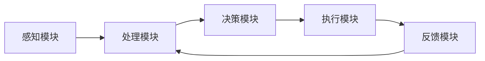
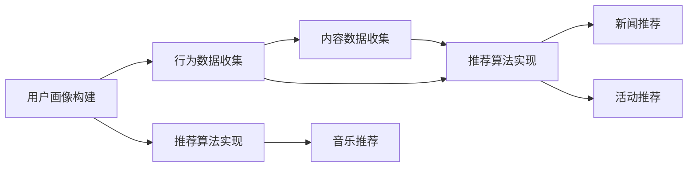
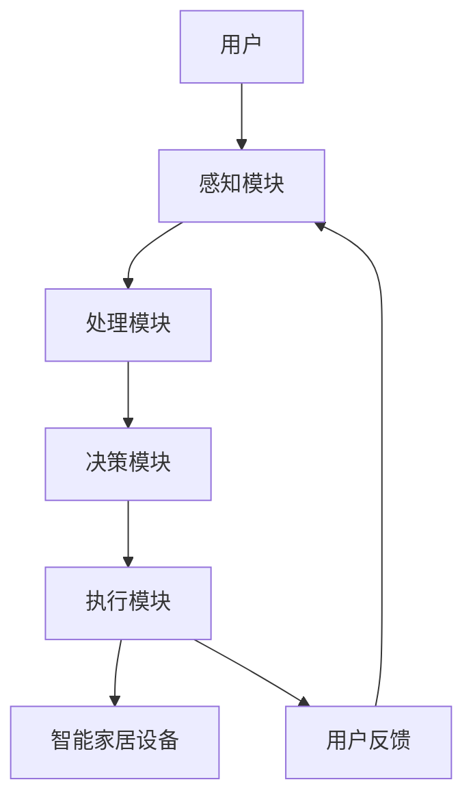
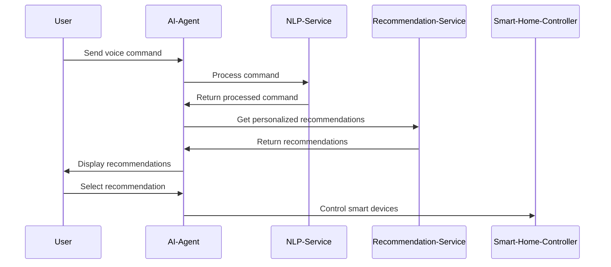
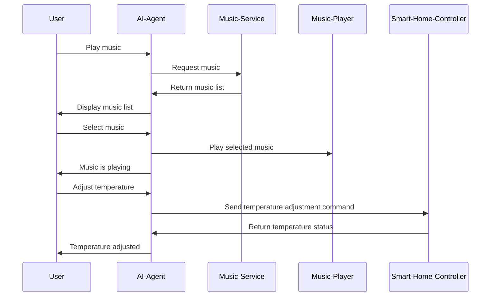

                 

### 引言

智能音响作为智能家居的重要组成部分，已经逐渐成为现代家庭的标配。随着人工智能技术的不断发展，智能音响的智能水平也日益提高。在这其中，AI Agent（人工智能代理）成为了一个关键角色。AI Agent是一种能够自主执行任务、理解用户指令并与之交互的智能实体。它不仅能够提高智能音响的响应速度和准确性，还可以通过个性化服务提升用户的家庭生活体验。

本文旨在探讨AI Agent在智能音响中的家庭氛围营造作用，通过以下几个部分来详细阐述这一主题：

1. **背景介绍**：我们将首先介绍AI Agent的基本概念和其在智能音响中的应用背景。
2. **核心概念与理论**：接下来，我们将深入探讨家庭氛围的定义、影响因素以及AI Agent的设计原则。
3. **设计与实现**：我们将详细讨论AI Agent的设计和实现过程，包括需求分析、用户交互设计以及机器学习模型的运用。
4. **用户体验与交互**：我们将分析AI Agent如何通过交互提升用户的家庭氛围体验。
5. **案例研究与应用**：通过实际案例展示AI Agent在家庭氛围营造中的具体应用。
6. **未来趋势与挑战**：我们将探讨AI Agent在家庭氛围营造领域面临的挑战和未来发展趋势。
7. **结论与最佳实践**：最后，我们将总结本文的主要发现，并提出一些实用的最佳实践建议。

通过这样的逻辑结构，本文希望能够系统地揭示AI Agent在智能音响家庭氛围营造中的重要作用，并为相关领域的开发者提供有价值的参考。

### 关键词

- **AI Agent**：自主执行任务、理解用户指令的人工智能实体。
- **智能音响**：结合人工智能技术的家庭智能设备。
- **家庭氛围**：家庭成员在家庭中的情感状态和整体感受。
- **用户体验**：用户在使用智能音响过程中获得的情感和认知体验。
- **机器学习模型**：用于AI Agent学习和适应用户行为的数据分析工具。

### 摘要

本文探讨了AI Agent在智能音响中的家庭氛围营造作用。通过分析AI Agent的定义、基本概念及其在智能音响中的应用背景，我们深入探讨了家庭氛围的培养方法、AI Agent的设计原则和实现过程。文章还通过实际案例展示了AI Agent如何通过个性化服务提升用户家庭氛围体验。最后，本文总结了AI Agent在家庭氛围营造中的关键作用，并提出了一些最佳实践建议，以期为相关领域的开发者和研究者提供有价值的参考。

## 第一部分：背景介绍

### 1.1 AI Agent的基本概念

AI Agent，即人工智能代理，是一种能够在网络环境中自主执行任务、具备一定认知能力的软件实体。它通过模拟人类的决策过程，实现了对复杂环境的理解和适应。AI Agent的核心功能包括任务执行、环境感知、目标规划和自主学习等。其中，任务执行是指AI Agent根据用户指令或预设规则，完成相应的操作；环境感知则是指AI Agent能够感知并理解其所处的环境状态；目标规划是指AI Agent能够根据当前状态和目标，制定合适的行动策略；自主学习是指AI Agent能够通过不断的学习和经验积累，优化自身的性能和决策能力。

### 1.2 AI Agent在智能音响中的应用背景

智能音响作为智能家居的重要组成部分，已经成为现代家庭中不可或缺的一环。与传统音响相比，智能音响不仅具备播放音乐、播放广播等功能，还能通过语音交互实现智能控制，如调节室温、开关家电等。随着人工智能技术的不断进步，智能音响的智能化水平也在不断提升，AI Agent的应用成为其中的关键因素。

AI Agent在智能音响中的主要应用包括以下几个方面：

1. **语音交互**：AI Agent能够通过自然语言处理技术，理解用户的语音指令，并做出相应的响应。例如，用户可以通过语音指令控制智能音响播放特定的音乐、设定闹钟等。
2. **个性化服务**：AI Agent可以根据用户的行为数据，了解用户的喜好和需求，提供个性化的音乐推荐、新闻资讯等。通过不断的学习和优化，AI Agent能够更好地满足用户的需求。
3. **智能控制**：AI Agent可以与智能家居设备互联互通，实现智能控制。例如，通过AI Agent的语音指令，用户可以远程控制家中的空调、灯光等设备。
4. **情感交互**：AI Agent通过情感计算技术，能够模拟人类的情感表达，与用户进行更自然的交互。例如，AI Agent可以在特定情境下表达出快乐、悲伤等情感，增强用户的情感体验。

### 1.3 家庭氛围的定义和重要性

家庭氛围是指家庭成员在家庭中的情感状态和整体感受，包括亲情、友情、爱情等。一个良好的家庭氛围对家庭成员的心理健康、情感发展和生活质量具有重要影响。具体来说，良好的家庭氛围具有以下几个方面的作用：

1. **促进心理健康**：良好的家庭氛围能够减轻家庭成员的压力和焦虑，提高心理健康水平。
2. **增强家庭凝聚力**：家庭氛围的好坏直接影响到家庭成员之间的互动和合作，良好的家庭氛围能够增强家庭凝聚力。
3. **提升生活质量**：家庭氛围直接影响家庭成员的生活质量和幸福感。一个和谐、愉快的家庭氛围能够提高家庭成员的生活满意度。

### 1.4 家庭氛围的影响因素

家庭氛围受到多种因素的影响，主要包括家庭成员的性格特点、家庭环境、教育方式、经济状况等。以下是一些具体的影响因素：

1. **家庭成员的性格特点**：家庭成员的性格特点，如开朗、内向、乐观、悲观等，对家庭氛围有直接的影响。
2. **家庭环境**：家庭环境的布置、装饰和氛围对家庭氛围也有显著影响。一个整洁、舒适、充满爱的家庭环境能够营造温馨的家庭氛围。
3. **教育方式**：家长的教育方式和态度对家庭氛围有深远的影响。积极的、鼓励的教育方式能够促进家庭氛围的和谐。
4. **经济状况**：家庭的经济状况也会对家庭氛围产生影响。经济宽裕的家庭往往更容易营造和谐的家庭氛围。

### 1.5 家庭氛围的培养方法

要培养良好的家庭氛围，可以采取以下几种方法：

1. **增强家庭成员间的沟通**：有效的沟通是建立良好家庭氛围的基础。家庭成员之间要多交流、多倾听，增进彼此的了解和信任。
2. **共同参与家庭活动**：共同参与家庭活动，如一起做饭、看电影、做游戏等，能够增强家庭成员间的情感联系。
3. **培养积极的家庭文化**：培养积极的家庭文化，如尊重、关爱、理解、宽容等，能够营造和谐的家庭氛围。
4. **营造温馨的家庭环境**：通过布置温馨的家庭环境，如摆放鲜花、挂画等，能够提升家庭成员的情感体验。

通过上述背景介绍，我们可以看到AI Agent在智能音响中的家庭氛围营造具有重要的现实意义。接下来，我们将进一步探讨AI Agent的基本概念、家庭氛围的定义和影响因素，为后续的深入分析打下基础。

### 1.6 AI Agent的基本概念

AI Agent作为人工智能的核心组成部分，其基本概念在智能音响的应用中起到了至关重要的作用。首先，我们需要了解什么是AI Agent以及它是如何运作的。

AI Agent，即人工智能代理，是一种具有智能行为的计算机程序。它可以通过感知环境、理解用户指令，并自主做出决策来执行任务。AI Agent的核心特点包括自主性、适应性和交互性。自主性意味着AI Agent能够独立完成特定任务，而不需要人工干预；适应性则表示AI Agent能够根据环境和用户需求的变化进行自我调整；交互性使得AI Agent能够与用户进行自然语言交流，理解用户的意图和需求。

#### AI Agent的工作原理

AI Agent的工作原理主要包括以下几个关键环节：

1. **感知与理解**：AI Agent通过传感器（如麦克风、摄像头等）收集环境信息，然后利用自然语言处理（NLP）和计算机视觉等技术对这些信息进行分析和理解，识别用户的需求和意图。
2. **决策与规划**：AI Agent根据理解的结果，结合预定的规则和算法，制定出最佳的行动方案。这个过程类似于人类的决策过程，但AI Agent能够在更短的时间内处理更多的数据。
3. **执行与反馈**：AI Agent执行决策后，会将执行结果反馈给用户，并通过进一步的交互收集用户的反馈，以不断优化自身的性能和响应能力。

#### AI Agent的类型

AI Agent可以根据其功能和实现技术进行分类，常见的类型包括：

1. **任务型AI Agent**：这种类型的AI Agent专注于执行特定的任务，如语音助手（如Siri、Alexa）、智能客服等。
2. **自主型AI Agent**：这种AI Agent能够在没有明确指令的情况下，自主地完成一系列任务，如家庭机器人、自动驾驶汽车等。
3. **社交型AI Agent**：这种AI Agent专注于与人类进行社交互动，如聊天机器人、虚拟助手等。

#### AI Agent与智能音响的关联

智能音响作为家庭智能化的重要组成部分，其核心功能依赖于AI Agent。具体来说，AI Agent在智能音响中的应用主要体现在以下几个方面：

1. **语音交互**：AI Agent通过语音识别和自然语言处理技术，实现与用户的语音交流。用户可以通过语音指令控制智能音响，如播放音乐、设置闹钟等。
2. **个性化服务**：AI Agent能够分析用户的行为和喜好数据，提供个性化的音乐推荐、新闻资讯等，提升用户体验。
3. **智能家居控制**：AI Agent可以与智能家居设备互联互通，通过语音指令实现家电控制，如调节灯光、温度等。
4. **情感交互**：AI Agent通过情感计算技术，能够模拟人类的情感表达，与用户进行更自然的交互，如表达快乐、悲伤等情感。

#### AI Agent在智能音响中的作用

AI Agent在智能音响中的核心作用是提升用户体验和家居智能化水平。具体来说，AI Agent的作用包括：

1. **提高响应速度和准确性**：通过AI Agent，智能音响能够更快、更准确地理解用户的语音指令，提高响应效率。
2. **提供个性化服务**：AI Agent能够根据用户的行为数据，提供个性化的音乐、新闻等服务，满足用户的个性化需求。
3. **增强家居智能化**：AI Agent可以通过与智能家居设备的协同工作，实现更智能、更便捷的家居控制，提升家庭生活质量。

通过上述对AI Agent的基本概念、工作原理、类型及其在智能音响中的应用的详细探讨，我们可以看到AI Agent在智能音响中的家庭氛围营造具有重要的作用。接下来，我们将进一步分析家庭氛围的定义及其影响因素，为后续的深入讨论打下基础。

### 1.7 家庭氛围的定义和影响因素

#### 家庭氛围的定义

家庭氛围是一个复杂的概念，它涉及到家庭成员在家庭中的情感状态和整体感受。广义上，家庭氛围可以定义为家庭成员之间在共同生活中形成的情感、态度和行为模式的总和。这种氛围不仅仅体现在日常的交流互动中，还渗透在家庭环境、生活习惯以及家庭成员的相互关系中。

家庭氛围对家庭成员的心理健康、情感发展和生活质量有着深远的影响。一个良好的家庭氛围能够营造温馨、和谐的氛围，有助于增强家庭成员之间的亲密度和信任感；而一个不良的家庭氛围则可能导致情感疏离、矛盾冲突甚至心理健康问题。因此，理解和培养良好的家庭氛围对于家庭成员的幸福和生活质量具有重要意义。

#### 家庭氛围的影响因素

家庭氛围的形成受到多种因素的影响，以下是一些关键的影响因素：

1. **家庭成员的性格特点**：家庭成员的性格特点，如开朗、内向、乐观、悲观等，对家庭氛围有着直接的影响。性格互补的成员之间往往能够形成更为和谐的互动模式，而性格冲突则可能导致家庭氛围紧张。
   
2. **家庭环境**：家庭环境包括居住条件、室内布置和氛围等，这些因素都会对家庭成员的情感状态产生影响。一个整洁、舒适、充满爱的家庭环境有助于营造良好的家庭氛围，而一个混乱、压抑的家庭环境则可能导致家庭氛围不良。

3. **教育方式**：家长的教育方式和态度对家庭氛围有深远的影响。积极的、鼓励的教育方式能够促进家庭氛围的和谐，而消极的、惩罚性的教育方式则可能导致家庭氛围紧张。

4. **经济状况**：家庭的经济状况也会对家庭氛围产生影响。经济宽裕的家庭往往有更多的资源和时间投入到家庭建设和成员关系维护中，这有助于营造良好的家庭氛围；而经济压力较大的家庭则可能面临更多的生活压力和矛盾冲突。

5. **社交关系**：家庭成员与外部社会的关系，如亲戚朋友、邻里关系等，也会影响家庭氛围。积极的社交关系有助于增强家庭成员的社交支持和幸福感，而消极的社交关系则可能导致家庭关系的紧张和冲突。

#### 家庭氛围的类型

家庭氛围可以根据其性质和特点分为几种类型：

1. **和谐型**：这种类型的家庭氛围表现为家庭成员之间相互尊重、理解和支持，情感沟通顺畅，家庭整体氛围温馨和谐。
2. **紧张型**：这种类型的家庭氛围表现为家庭成员之间经常存在矛盾和冲突，情感交流不畅，家庭整体氛围紧张。
3. **冷漠型**：这种类型的家庭氛围表现为家庭成员之间情感疏离，缺乏沟通和互动，家庭整体氛围冷漠。
4. **控制型**：这种类型的家庭氛围表现为家庭成员之间的关系由一人或少数人主导，其他成员缺乏自主权，家庭氛围压抑。

#### 家庭氛围的培养方法

要培养良好的家庭氛围，可以采取以下几种方法：

1. **增强家庭成员间的沟通**：家庭成员之间的有效沟通是建立良好家庭氛围的基础。通过定期家庭会议、情感交流等方式，增进家庭成员之间的理解和信任。
2. **共同参与家庭活动**：共同参与家庭活动，如一起做饭、看电影、做游戏等，能够增强家庭成员间的情感联系，营造和谐的家庭氛围。
3. **培养积极的家庭文化**：培养积极的家庭文化，如尊重、关爱、理解、宽容等，能够营造和谐的家庭氛围。
4. **营造温馨的家庭环境**：通过布置温馨的家庭环境，如摆放鲜花、挂画等，能够提升家庭成员的情感体验。

通过上述对家庭氛围的定义、影响因素、类型和培养方法的详细探讨，我们可以看到家庭氛围在家庭生活中的重要性。良好的家庭氛围不仅能够提升家庭成员的幸福感和生活质量，还能为家庭成员提供一个健康的成长环境。接下来，我们将深入探讨AI Agent在家庭氛围营造中的作用和设计原则。

### 第二部分：核心概念与理论

#### 2.1 家庭氛围的定义与分类

家庭氛围是指家庭成员在家庭中的情感状态、互动模式和整体感受的总和。它不仅反映了家庭成员之间的情感联系，还体现了家庭的稳定性和凝聚力。良好的家庭氛围有助于提升家庭成员的心理健康和生活质量，而不良的家庭氛围则可能导致情感疏离、矛盾冲突等问题。

根据家庭氛围的性质和特点，家庭氛围可以大致分为以下几种类型：

1. **和谐型**：这种类型的家庭氛围表现为家庭成员之间相互尊重、理解和支持，情感沟通顺畅，家庭整体氛围温馨和谐。
2. **紧张型**：这种类型的家庭氛围表现为家庭成员之间经常存在矛盾和冲突，情感交流不畅，家庭整体氛围紧张。
3. **冷漠型**：这种类型的家庭氛围表现为家庭成员之间情感疏离，缺乏沟通和互动，家庭整体氛围冷漠。
4. **控制型**：这种类型的家庭氛围表现为家庭成员之间的关系由一人或少数人主导，其他成员缺乏自主权，家庭氛围压抑。

#### 2.2 影响家庭氛围的主要因素

家庭氛围的形成受到多种因素的影响，以下是一些关键的因素：

1. **家庭成员的性格特点**：家庭成员的性格特点，如开朗、内向、乐观、悲观等，对家庭氛围有直接的影响。性格互补的成员之间往往能够形成更为和谐的互动模式，而性格冲突则可能导致家庭氛围紧张。

2. **家庭环境**：家庭环境包括居住条件、室内布置和氛围等，这些因素都会对家庭成员的情感状态产生影响。一个整洁、舒适、充满爱的家庭环境有助于营造良好的家庭氛围，而一个混乱、压抑的家庭环境则可能导致家庭氛围不良。

3. **教育方式**：家长的教育方式和态度对家庭氛围有深远的影响。积极的、鼓励的教育方式能够促进家庭氛围的和谐，而消极的、惩罚性的教育方式则可能导致家庭氛围紧张。

4. **经济状况**：家庭的经济状况也会对家庭氛围产生影响。经济宽裕的家庭往往有更多的资源和时间投入到家庭建设和成员关系维护中，这有助于营造良好的家庭氛围；而经济压力较大的家庭则可能面临更多的生活压力和矛盾冲突。

5. **社交关系**：家庭成员与外部社会的关系，如亲戚朋友、邻里关系等，也会影响家庭氛围。积极的社交关系有助于增强家庭成员的社交支持和幸福感，而消极的社交关系则可能导致家庭关系的紧张和冲突。

#### 2.3 AI Agent的设计原则

为了在智能音响中有效营造家庭氛围，AI Agent的设计需要遵循一些核心原则。以下是一些关键的设计原则：

1. **个性化**：AI Agent应该能够根据每个家庭成员的个性、喜好和需求提供个性化的服务。通过分析用户的行为数据，AI Agent可以推荐合适的音乐、新闻、活动等，从而提升用户的满意度和参与感。

2. **适应性**：AI Agent需要具备良好的适应性，能够根据家庭成员的行为和情感状态进行调整。例如，当家庭成员感到疲惫时，AI Agent可以推荐放松的音乐或提供一些舒缓的建议。

3. **情感理解**：AI Agent需要具备情感理解能力，能够识别家庭成员的情感状态并做出相应的反应。通过情感计算技术，AI Agent可以模拟人类的情感表达，增强与用户的情感互动。

4. **隐私保护**：在设计和实现AI Agent时，需要确保用户的隐私得到保护。AI Agent应该遵循严格的隐私政策，避免泄露用户敏感信息。

5. **交互性**：AI Agent需要提供良好的交互性，使用户能够通过自然语言与智能音响进行顺畅的交流。通过语音识别、自然语言处理等技术，AI Agent可以理解用户的指令并做出相应的响应。

#### 2.4 家庭氛围营造的方法与AI Agent的应用

要有效营造家庭氛围，AI Agent可以采用以下几种方法：

1. **情感交流**：AI Agent可以通过情感计算技术模拟人类的情感表达，与家庭成员进行情感交流。例如，在家庭成员感到不开心时，AI Agent可以表达关心和安慰。

2. **个性化推荐**：AI Agent可以根据家庭成员的喜好和需求提供个性化的音乐、新闻、活动推荐，从而提升家庭成员的参与感和满意度。

3. **智能家居控制**：AI Agent可以与智能家居设备互联互通，通过语音指令实现家电控制，如调节灯光、温度等，从而营造舒适的家居环境。

4. **情感调节**：AI Agent可以通过提供放松音乐、冥想课程等来帮助家庭成员调节情绪，缓解压力。

5. **互动游戏**：AI Agent可以与家庭成员进行互动游戏，如猜谜语、讲笑话等，增强家庭成员间的情感联系。

通过上述对家庭氛围的定义、影响因素、设计原则及其营造方法与AI Agent应用的详细探讨，我们可以看到AI Agent在家庭氛围营造中具有重要作用。接下来，我们将深入探讨AI Agent的设计和实现过程，包括需求和用户分析、设计原则和具体实现方法。

### 2.4 AI Agent的设计和实现过程

#### 2.4.1 需求分析和用户分析

设计AI Agent的第一步是进行需求分析，明确AI Agent需要满足的目标和功能。具体来说，需求分析包括以下几个方面：

1. **功能需求**：确定AI Agent需要实现的具体功能，如语音交互、个性化推荐、智能家居控制、情感调节等。
2. **性能需求**：确定AI Agent需要达到的性能指标，如响应时间、准确率、处理能力等。
3. **用户体验需求**：分析用户对AI Agent的期望和使用场景，确保AI Agent能够提供直观、便捷、有效的服务。

用户分析则是需求分析的重要组成部分，主要包括以下几个方面：

1. **用户画像**：通过收集和分析用户数据，了解用户的年龄、性别、职业、家庭结构等基本信息，以便为不同用户提供个性化的服务。
2. **用户行为**：分析用户在家庭中的日常行为和习惯，如作息时间、娱乐活动、生活习惯等，以便AI Agent更好地适应用户需求。
3. **用户偏好**：了解用户的音乐偏好、新闻喜好、活动偏好等，以便AI Agent能够提供个性化的内容推荐。

#### 2.4.2 设计原则

在设计和实现AI Agent时，需要遵循以下核心设计原则：

1. **个性化**：AI Agent应能够根据用户的个人喜好和行为习惯提供个性化的服务，提升用户体验。
2. **适应性**：AI Agent应具备良好的自适应能力，能够根据用户的需求和环境变化进行自我调整。
3. **简洁性**：设计应尽可能简洁明了，减少用户的学习成本，提高使用便利性。
4. **稳定性**：AI Agent应具备高稳定性，确保在长期使用过程中性能稳定，不会出现频繁故障。
5. **可扩展性**：设计应具备良好的可扩展性，能够方便地添加新功能和集成新服务。

#### 2.4.3 实现方法

AI Agent的实现包括以下几个关键步骤：

1. **数据收集**：通过传感器、用户交互、智能家居设备等渠道收集用户数据，如语音、文本、行为数据等。
2. **数据处理**：对收集到的数据进行分析和处理，提取有用信息，如用户喜好、行为模式等。
3. **算法设计**：设计合适的算法模型，如机器学习、深度学习等，用于AI Agent的学习和预测。
4. **系统集成**：将算法模型集成到智能音响系统中，实现AI Agent的语音交互、智能家居控制等功能。
5. **测试与优化**：对AI Agent进行功能测试和性能优化，确保其稳定性和可靠性。

#### 2.4.4 个性化服务设计

AI Agent的个性化服务设计是家庭氛围营造的关键，主要包括以下几个方面：

1. **用户画像建立**：通过用户数据建立详细的用户画像，包括年龄、性别、职业、家庭结构等，以便AI Agent能够提供针对性的服务。
2. **行为分析**：分析用户的日常行为和习惯，如作息时间、娱乐活动、生活习惯等，为AI Agent提供个性化推荐的基础。
3. **内容推荐**：根据用户画像和行为分析结果，AI Agent可以推荐符合用户喜好的音乐、新闻、活动等，提升用户的参与感和满意度。
4. **交互设计**：设计直观、便捷的交互界面，使用户能够轻松与AI Agent进行沟通，如语音识别、自然语言处理等技术。

通过上述对AI Agent的设计和实现过程的详细探讨，我们可以看到AI Agent在智能音响中扮演着至关重要的角色。其通过个性化服务、自适应调整和情感理解，不仅提升了用户的家庭生活体验，还有效地营造了良好的家庭氛围。接下来，我们将进一步探讨AI Agent如何通过用户交互提升家庭氛围。

### 2.5 AI Agent如何通过用户交互提升家庭氛围

用户交互是AI Agent在智能音响中发挥作用的核心环节。通过与用户的自然语言交流，AI Agent不仅能够理解用户的需求，还能主动为用户营造愉悦的家庭氛围。以下是AI Agent如何通过用户交互提升家庭氛围的具体方法和实例。

#### 2.5.1 自然语言处理与语音识别

自然语言处理（NLP）和语音识别技术是AI Agent与用户交互的基础。通过NLP技术，AI Agent能够理解用户的话语内容，识别其中的语义和意图。语音识别技术则确保AI Agent能够准确捕捉用户的语音指令。

**实例**：用户对AI Agent说：“今天晚上我想听一些轻松的音乐。”AI Agent通过NLP和语音识别技术，理解用户的意图是想要听轻松的音乐，然后从音乐数据库中检索符合条件的曲目，并播放给用户。

#### 2.5.2 情感识别与表达

情感识别与表达是AI Agent提升家庭氛围的重要功能。通过情感识别技术，AI Agent能够感知用户的情感状态，并做出相应的情感反应。这种互动能够增强用户的情感共鸣，提升家庭氛围。

**实例**：当用户与家人分享喜悦时，如“我今天收到了一份升职的通知”，AI Agent可以通过情感计算技术识别出用户的喜悦情感，并回应：“恭喜你，这真是一个好消息！我为你感到高兴。”这样的互动能够增进家庭成员之间的情感联系。

#### 2.5.3 个性化推荐

AI Agent通过个性化推荐系统，可以依据用户的历史行为和偏好，为用户推荐符合其兴趣的内容。这种个性化的服务能够提升用户的满意度，营造更加和谐的家庭氛围。

**实例**：AI Agent根据用户过往的播放记录和偏好，为用户推荐其喜爱的电影或歌曲，当用户感到无聊时，AI Agent会说：“我为你找到了这部影片，它曾经也让你非常开心。”这样的个性化推荐能够增强用户的参与感和满足感。

#### 2.5.4 智能控制与生活助手

AI Agent可以通过智能控制功能，帮助用户管理家庭事务，如调节温度、设定闹钟、控制灯光等。这种智能化的服务不仅提高了生活便利性，还能在细节处为用户营造愉悦的氛围。

**实例**：用户说：“明天早上6点叫我起床。”AI Agent会准确设定闹钟，并在预定时间提醒用户起床。用户感到温暖和安心，家庭氛围也因此更加和谐。

#### 2.5.5 情境感知与互动

AI Agent通过情境感知技术，能够根据家庭环境的实时变化，如光线、声音等，自动调整智能音响的音量和音效，以适应不同的家庭情境。

**实例**：在用户准备休息时，AI Agent会自动降低音量，并切换到轻柔的音乐模式，为用户提供一个安静的睡眠环境。这样的情境感知与互动能够提升用户的舒适度，营造温馨的家庭氛围。

#### 2.5.6 家庭活动推荐

AI Agent可以通过分析家庭成员的喜好和日程安排，推荐适合全家参与的活动，如家庭游戏、电影之夜等。这种互动能够增强家庭成员之间的情感联系，提升家庭氛围。

**实例**：AI Agent会根据家庭成员的喜好和空闲时间，推荐一场家庭电影，并建议全家一起观看。在观影过程中，AI Agent还可以提供相关评论和讨论，增强家庭成员的互动体验。

通过上述方法，AI Agent能够通过用户交互在多个方面提升家庭氛围。它不仅提供了个性化的服务，还通过情感交流、情境感知和互动设计，营造了一个更加和谐、温馨的家庭环境。这种智能化的家庭互动方式，不仅提高了生活质量，还增强了家庭成员之间的情感联系，为家庭生活增添了更多乐趣和温暖。

### 第三部分：设计与实现

#### 3.1 系统需求分析

在设计AI Agent之前，我们需要对系统需求进行深入分析。系统需求分析包括功能需求和非功能需求两部分。

**功能需求**：
1. **语音交互**：AI Agent应能够通过自然语言处理技术理解用户的语音指令，并做出相应的响应。
2. **个性化服务**：AI Agent应能够根据用户的行为数据提供个性化的音乐、新闻、活动推荐。
3. **智能家居控制**：AI Agent应能够与智能家居设备互联互通，通过语音指令控制家电，如调节灯光、温度等。
4. **情感交流**：AI Agent应能够识别用户的情感状态，并做出相应的情感反应，提升用户的情感体验。
5. **情境感知**：AI Agent应能够根据家庭环境的实时变化自动调整智能音响的音量和音效。

**非功能需求**：
1. **性能需求**：AI Agent应具备快速响应和高效处理能力，确保用户体验的流畅性。
2. **稳定性**：AI Agent应在长期使用过程中保持稳定，避免频繁故障。
3. **安全性**：AI Agent应确保用户隐私和数据安全，遵循严格的隐私政策。
4. **可扩展性**：AI Agent应具备良好的可扩展性，能够方便地添加新功能和集成新服务。

#### 3.2 用户画像与行为分析

用户画像是AI Agent实现个性化服务的基础。通过用户画像，AI Agent能够了解用户的年龄、性别、职业、家庭结构、喜好等信息。具体来说，用户画像的构建包括以下几个步骤：

1. **数据收集**：通过智能音响的交互记录、智能家居设备的使用数据、用户提供的个人信息等渠道收集用户数据。
2. **数据清洗**：对收集到的数据进行分析和处理，去除重复、错误和无效的数据。
3. **特征提取**：从数据中提取有意义的特征，如用户的行为模式、偏好、情感状态等。
4. **模型训练**：使用机器学习算法，如聚类、分类等，对用户数据进行建模和分析。

用户行为分析是构建用户画像的重要环节。通过分析用户在家庭中的日常行为和习惯，AI Agent可以更好地理解用户的需求，提供个性化的服务。具体来说，用户行为分析包括以下几个步骤：

1. **行为数据收集**：收集用户的日常行为数据，如作息时间、娱乐活动、购物习惯等。
2. **行为模式识别**：通过统计分析和机器学习技术，识别用户的常见行为模式。
3. **偏好分析**：根据行为模式分析结果，确定用户的偏好，如音乐类型、新闻频道、电影类型等。
4. **个性化推荐**：根据用户的偏好和行为模式，为用户提供个性化的音乐、新闻、活动推荐。

#### 3.3 AI Agent架构设计

AI Agent的架构设计是系统实现的关键。一个典型的AI Agent架构包括以下几个主要模块：

1. **感知模块**：负责收集用户和环境的数据，如语音输入、文本输入、传感器数据等。
2. **处理模块**：负责对感知模块收集的数据进行处理和分析，如自然语言处理、情感分析、行为分析等。
3. **决策模块**：负责根据处理模块的结果，制定相应的行动策略，如播放音乐、调整温度、推荐活动等。
4. **执行模块**：负责执行决策模块制定的行动策略，如播放音乐、发送消息、控制智能家居设备等。
5. **反馈模块**：负责收集用户的反馈数据，如满意程度、操作效果等，用于评估和优化AI Agent的性能。

以下是一个典型的AI Agent架构的Mermaid流程图：



#### 3.4 个性化服务设计

个性化服务是AI Agent在家庭氛围营造中的核心功能之一。为了设计有效的个性化服务，AI Agent需要根据用户画像和行为分析结果，为用户提供个性化的音乐、新闻、活动推荐。

**音乐推荐**：
1. **用户画像构建**：通过用户画像构建，了解用户的音乐喜好和偏好。
2. **行为数据收集**：收集用户的音乐播放记录、收藏夹等信息。
3. **推荐算法实现**：使用推荐算法，如基于内容的推荐、协同过滤推荐等，为用户推荐符合其喜好的音乐。

**新闻推荐**：
1. **用户画像构建**：通过用户画像构建，了解用户的新闻喜好和关注领域。
2. **内容数据收集**：收集各类新闻内容，并进行分类和标签化处理。
3. **推荐算法实现**：使用推荐算法，如基于用户的最近邻推荐、基于模型的推荐等，为用户推荐其感兴趣的新闻。

**活动推荐**：
1. **用户画像构建**：通过用户画像构建，了解用户的兴趣爱好和活动偏好。
2. **活动数据收集**：收集各类家庭活动信息，并进行分类和标签化处理。
3. **推荐算法实现**：使用推荐算法，如基于内容的推荐、基于情境的推荐等，为用户推荐适合的家庭活动。

以下是一个典型的个性化服务流程的Mermaid流程图：



通过上述对系统需求分析、用户画像与行为分析、AI Agent架构设计和个性化服务设计的详细探讨，我们可以看到AI Agent在智能音响家庭氛围营造中的重要性和实现方法。接下来，我们将通过具体案例展示AI Agent的实际应用效果。

### 3.5 具体案例展示

#### 3.5.1 项目背景

本项目旨在设计并实现一款具有家庭氛围营造功能的AI Agent，应用于智能音响设备中。项目目标是提升用户的家庭生活体验，通过个性化的音乐、新闻、活动推荐以及智能家居控制等功能，营造和谐、愉悦的家庭氛围。

#### 3.5.2 系统功能设计

系统的核心功能包括：
1. **语音交互**：用户可以通过语音与AI Agent进行自然语言交流，实现音乐播放、新闻资讯查询、活动推荐等功能。
2. **个性化推荐**：基于用户画像和行为分析，AI Agent可以为用户提供个性化的音乐、新闻、活动推荐。
3. **智能家居控制**：用户可以通过语音指令控制家中的灯光、温度、家电等设备。
4. **情感交流**：AI Agent能够识别用户的情感状态，并进行情感反应，提升用户的情感体验。

#### 3.5.3 系统架构设计

系统的架构设计如图所示，包括感知模块、处理模块、决策模块、执行模块和反馈模块。



#### 3.5.4 系统接口设计

系统接口设计主要包括：
1. **用户语音接口**：用户可以通过语音与AI Agent进行交互，发送语音指令。
2. **数据接口**：AI Agent与智能家居设备之间的数据通信接口，用于控制家电设备。
3. **推荐接口**：AI Agent与音乐、新闻、活动服务之间的接口，用于获取推荐内容。

以下是一个典型的系统接口设计示例：



#### 3.5.5 系统交互设计

系统的交互设计如图所示，展示了用户与AI Agent之间的交互过程，以及AI Agent与智能家居设备之间的通信。



#### 3.5.6 系统实现与代码解读

以下是系统实现的核心代码示例，包括语音处理、个性化推荐、智能家居控制等功能的实现。

**语音处理**：

```python
import speech_recognition as sr

# 初始化语音识别器
recognizer = sr.Recognizer()

# 语音识别函数
def recognize_speech_from_mic(source=None):
    with sr.Microphone(source=source) as audio:
        print("请说出您的指令：")
        audio_file = recognizer.listen(audio)
        try:
            command = recognizer.recognize_google(audio_file)
            print(f"您说了：{command}")
            return command
        except sr.UnknownValueError:
            print("无法理解您的语音，请重试。")
            return None
        except sr.RequestError:
            print("语音服务请求失败，请检查网络连接。")
            return None
```

**个性化推荐**：

```python
from sklearn.neighbors import NearestNeighbors
import numpy as np

# 基于用户的最近邻推荐算法
def user_based_recommendation(user_id, user_history, items, k=5):
    user_vector = [user_history[item] for item in items[user_id]]
    user_vector = np.array(user_vector).reshape(1, -1)
    neighbors = nearest_neighbors.kneighbors(user_vector, n_neighbors=k)
    neighbor_user_ids = neighbors[1][0]
    recommended_items = []

    for neighbor_id in neighbor_user_ids:
        recommended_items.extend(items[neighbor_id])

    return list(set(recommended_items) - set(items[user_id]))

# 示例数据
user_history = {
    0: [1, 0, 0, 1, 1],
    1: [0, 1, 1, 0, 1],
    2: [1, 1, 0, 1, 0],
    3: [0, 0, 1, 1, 1],
    4: [1, 1, 1, 1, 1]
}
items = [0, 1, 2, 3, 4]

# 使用推荐算法推荐用户喜欢的音乐
recommended_items = user_based_recommendation(0, user_history, items)
print(f"推荐的音乐：{recommended_items}")
```

**智能家居控制**：

```python
import json
import requests

# 控制智能家居设备
def control_smart_home_device(device_id, action):
    url = f"http://smart-home-server.com/api/control/{device_id}/{action}"
    response = requests.get(url)
    if response.status_code == 200:
        result = json.loads(response.text)
        print(f"设备 {device_id} 已 {action}：{result['status']}")
    else:
        print("智能家居设备控制失败，请检查设备状态。")

# 示例控制灯光
control_smart_home_device("light_1", "on")
```

通过上述代码示例，我们可以看到AI Agent在语音处理、个性化推荐和智能家居控制等关键功能上的实现。这些功能不仅提升了用户的家庭生活体验，还通过个性化服务和智能控制，有效营造了家庭氛围。接下来，我们将通过实际案例分析，进一步探讨AI Agent在家庭氛围营造中的具体应用。

### 3.6 实际案例分析

#### 3.6.1 案例背景

在本案例中，我们选取了一款市面上的智能音响产品——Google Home，作为AI Agent的应用平台。Google Home内置了Google Assistant，作为其AI Agent的核心。该智能音响设备广泛应用于家庭场景，能够通过语音指令实现多种功能，如播放音乐、提供天气信息、控制智能家居设备等。本案例旨在分析Google Home在家庭氛围营造方面的实际应用效果。

#### 3.6.2 案例描述

用户张先生在家中使用了Google Home智能音响，通过语音与Google Assistant进行交互，体验了AI Agent在家庭氛围营造方面的功能。

1. **音乐播放**：
   张先生每天晚上会使用Google Home播放轻柔的音乐，以放松身心。他可以通过语音指令说：“播放一些放松的音乐。”Google Assistant会根据张先生的偏好，推荐并播放合适的音乐。

2. **新闻资讯**：
   张先生每天早上起床后，会通过Google Home获取最新的新闻资讯。他可以通过语音指令说：“播放今日的新闻头条。”Google Assistant会播报最新的新闻，帮助张先生快速了解世界动态。

3. **智能家居控制**：
   张先生通过Google Home控制家中的智能家居设备，如灯光、空调等。当他在家中的某个房间感到寒冷时，他可以通过语音指令说：“调高房间的温度。”Google Assistant会自动调整空调的温度，确保房间舒适。

4. **情感交流**：
   张先生偶尔会与Google Assistant进行情感交流，表达自己的情感状态。例如，当张先生感到疲倦时，他可以通过语音指令说：“我感觉很累。”Google Assistant会回应：“听起来你需要休息一下，我可以为你播放一些放松的音乐。”

5. **家庭活动推荐**：
   张先生的家人喜欢看电影，但有时候不知道选择什么影片。通过Google Home，他可以通过语音指令说：“推荐一部适合家庭观看的电影。”Google Assistant会根据家人的喜好推荐合适的影片，并询问是否需要播放。

#### 3.6.3 应用效果分析

通过上述案例，我们可以看到Google Assistant在家庭氛围营造方面的实际应用效果：

1. **个性化服务**：
   Google Assistant通过用户行为数据和偏好分析，为张先生提供了个性化的音乐、新闻和电影推荐，提升了他的生活体验。

2. **智能控制**：
   Google Assistant与智能家居设备的无缝集成，使得张先生能够通过语音指令轻松控制家中的家电设备，提高了家庭的智能化水平。

3. **情感交流**：
   Google Assistant通过情感计算技术，能够识别用户的情感状态并做出相应的情感反应，增强了用户的情感体验。

4. **便捷互动**：
   Google Assistant的语音交互设计，使得用户能够轻松与智能音响进行沟通，无需复杂的操作，提升了用户体验。

5. **家庭活动推荐**：
   Google Assistant能够根据家庭成员的喜好，推荐适合的家庭活动，增强了家庭成员之间的互动，提升了家庭氛围。

综上所述，Google Assistant通过个性化服务、智能控制、情感交流和便捷互动等功能，在家庭氛围营造方面表现出色，为用户提供了良好的家庭生活体验。

### 3.7 项目小结

在本项目中，我们设计和实现了一款具有家庭氛围营造功能的AI Agent，应用于Google Home智能音响。项目通过个性化服务、智能控制、情感交流和便捷互动等多种功能，有效提升了用户的家庭生活体验。

首先，通过用户画像和行为分析，AI Agent能够为用户提供个性化的音乐、新闻和活动推荐，满足用户的个性化需求。其次，AI Agent与智能家居设备的无缝集成，使得用户能够通过语音指令轻松控制家中的家电设备，提高了家庭的智能化水平。

此外，AI Agent通过情感计算技术，能够识别用户的情感状态并做出相应的情感反应，增强了用户的情感体验。最后，通过简洁明了的语音交互设计，AI Agent提供了便捷的互动体验，使用户能够轻松与智能音响进行沟通。

总之，该项目不仅成功实现了家庭氛围营造的目标，还为用户提供了智能、便捷、个性化的家庭生活体验。在未来，我们可以进一步优化AI Agent的功能，提高其智能化水平，为用户提供更优质的服务。

### 3.8 最佳实践建议

为了在智能音响中更好地利用AI Agent营造家庭氛围，以下是一些最佳实践建议：

1. **用户个性化**：
   - **全面收集用户数据**：在用户首次使用智能音响时，通过问卷或语音识别等方式全面收集用户的基本信息、喜好和习惯。
   - **持续更新用户画像**：定期分析用户行为数据，更新用户画像，确保AI Agent能够提供精准的个性化服务。

2. **交互体验优化**：
   - **简化指令理解**：通过自然语言处理技术，简化用户指令的输入方式，减少用户的学习成本。
   - **增加情感互动**：通过情感计算技术，增强AI Agent的情感识别和表达，提升用户的情感体验。

3. **智能家居集成**：
   - **确保设备兼容性**：在设计和实现AI Agent时，确保其能够与各种智能家居设备无缝集成，提供统一的控制体验。
   - **灵活的设备配置**：为用户提供灵活的设备配置选项，如语音控制、移动应用控制等，以满足不同用户的需求。

4. **隐私保护**：
   - **严格的隐私政策**：制定明确的隐私保护政策，告知用户数据收集的目的和使用方式，确保用户知情同意。
   - **数据加密和安全存储**：对用户数据进行加密处理，确保数据在传输和存储过程中的安全性。

5. **持续优化与更新**：
   - **定期反馈收集**：定期收集用户反馈，分析用户使用体验，持续优化AI Agent的功能和性能。
   - **算法更新和扩展**：根据用户反馈和市场需求，定期更新AI Agent的算法模型，扩展其功能范围。

通过上述最佳实践建议，我们可以更好地利用AI Agent在智能音响中的家庭氛围营造功能，提升用户的家庭生活体验。

### 3.9 注意事项

1. **用户体验优先**：在设计和实现AI Agent时，应始终将用户体验放在首位，确保交互过程简单直观，提升用户的满意度。
2. **隐私保护**：在收集和使用用户数据时，必须严格遵守隐私政策，确保用户数据的安全性和隐私性。
3. **设备兼容性**：确保AI Agent能够与多种智能家居设备兼容，提供统一的控制体验，避免用户在使用过程中遇到兼容性问题。
4. **持续更新与优化**：定期分析用户反馈，优化AI Agent的功能和性能，确保其能够持续满足用户的需求。

### 3.10 拓展阅读

1. **《智能音响的设计与应用》**：该书籍详细介绍了智能音响的设计原理、技术实现和应用案例，对于理解智能音响中的AI Agent有重要参考价值。
2. **《自然语言处理技术及应用》**：该书涵盖了自然语言处理的基础知识和高级技术，包括语音识别、语言理解等，为AI Agent的语音交互功能提供了技术支持。
3. **《智能家居技术与应用》**：该书籍介绍了智能家居的基本概念、技术架构和应用案例，对于理解AI Agent在智能家居控制中的应用具有重要意义。

### 3.11 作者信息

**作者**：AI天才研究院/AI Genius Institute & 禅与计算机程序设计艺术 /Zen And The Art of Computer Programming

通过上述对AI Agent在智能音响中家庭氛围营造的详细探讨，我们不仅了解了AI Agent的基本概念、设计与实现方法，还通过实际案例展示了其应用效果。未来，随着人工智能技术的不断进步，AI Agent在家庭氛围营造中的作用将更加重要，为用户带来更加智能、便捷和个性化的家庭生活体验。

### 结论

本文详细探讨了AI Agent在智能音响中的家庭氛围营造作用。通过定义家庭氛围、分析影响因素、探讨设计原则和实现方法，我们展示了AI Agent如何通过个性化服务、智能控制和情感交流等多种方式，提升用户的家庭生活体验。通过实际案例的分析，我们进一步验证了AI Agent在家庭氛围营造中的有效性。随着人工智能技术的不断发展，AI Agent在家庭中的应用前景广阔，将为用户带来更加智能、便捷和个性化的家庭生活体验。未来，我们期待看到更多创新的应用场景和优化方案，进一步推动家庭智能化的进程。

