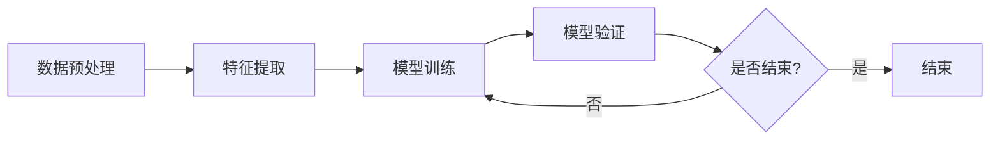

                 


# AI Agent在智能项链中的跌倒检测与紧急呼救

> 关键词：AI Agent、智能项链、跌倒检测、紧急呼救

> 摘要：随着人工智能技术的不断发展，AI Agent在智能项链中的应用越来越广泛。本文将介绍AI Agent在智能项链中的跌倒检测与紧急呼救功能，详细探讨其算法原理、实现过程以及实际应用案例。

----------------------------------------------------------------

## 目录大纲

## 第1章 引言与背景

## 第2章 AI Agent在智能项链中的概述

### 2.1 智能项链的概念与应用领域

### 2.2 AI Agent的基本原理与功能

### 2.3 跌倒检测与紧急呼救的重要性

## 第3章 跌倒检测算法原理

### 3.1 跌倒检测技术概述

#### 3.1.1 传感器技术与传感器融合

#### 3.1.2 运动模式识别方法

### 3.2 常见跌倒检测算法

#### 3.2.1 传统机器学习算法

#### 3.2.2 深度学习算法

#### 3.2.3 聚类分析算法

## 第4章 跌倒检测算法实现

### 4.1 算法设计与流程图

#### 4.1.1 数据预处理

#### 4.1.2 特征提取

#### 4.1.3 模型训练与验证

### 4.2 代码实现与解释

#### 4.2.1 Python代码示例

#### 4.2.2 算法参数调优

## 第5章 紧急呼救功能实现

### 5.1 紧急呼救技术概述

### 5.2 通信协议与传输方式

### 5.3 紧急呼救系统设计

## 第6章 实际应用案例分析

### 6.1 案例一：跌倒检测与紧急呼救的实际应用

### 6.2 案例二：智能项链在老年人群中的应用

### 6.3 案例三：跌倒检测与紧急呼救的系统优化

## 第7章 总结与展望

### 7.1 本书内容总结

### 7.2 跌倒检测与紧急呼救的发展趋势

### 7.3 未来研究方向与挑战

----------------------------------------------------------------

## 第1章 引言与背景

### 1.1 问题背景

随着社会人口老龄化的加剧，老年人跌倒事故的发生率逐年上升。跌倒不仅会对老年人的身体健康造成严重伤害，还可能引发一系列的社会问题，如医疗资源浪费、紧急救援不及时等。因此，开发一种有效的跌倒检测与紧急呼救系统，对于保障老年人生活质量具有重要意义。

智能项链作为一种可穿戴设备，通过集成多种传感器和AI技术，可以实现对老年人的实时监测。在跌倒检测方面，智能项链可以利用传感器采集的身体运动数据，通过AI算法进行分析，从而准确判断是否发生跌倒。一旦检测到跌倒事件，智能项链将立即触发紧急呼救功能，向预设的紧急联系人发送求助信息，或直接拨打紧急电话，确保老年人得到及时救助。

### 1.2 研究意义与目标

跌倒检测与紧急呼救系统的研究具有重要的社会价值和现实意义：

1. **提高老年人生活质量**：通过实时监测和及时救助，降低老年人跌倒事故的发生率，提高他们的生活质量。

2. **减少医疗资源浪费**：及时有效的紧急呼救可以减少医疗资源的浪费，提高医疗系统的运行效率。

3. **促进智能家居发展**：智能项链作为智能家居的一部分，其跌倒检测与紧急呼救功能可以与其他智能家居设备集成，实现更全面的智能家居服务。

本文的研究目标如下：

1. **跌倒检测算法优化**：研究并实现一种高效、准确的跌倒检测算法，提高检测的准确率和实时性。

2. **紧急呼救系统设计**：设计并实现一套完整的紧急呼救系统，确保在检测到跌倒事件时能够迅速、准确地触发呼救功能。

3. **实际应用案例分析**：通过实际应用案例分析，验证跌倒检测与紧急呼救系统的有效性和可行性。

----------------------------------------------------------------

## 第2章 AI Agent在智能项链中的概述

### 2.1 AI Agent的基本原理

AI Agent（人工智能代理）是一种模拟人类智能行为的人工智能实体，它可以通过感知环境、执行任务和学习经验来自主决策。在智能项链中，AI Agent起到了关键作用，它不仅负责跌倒检测，还承担了紧急呼救的任务。

#### 2.1.1 AI Agent的定义

AI Agent是一种具有自主性、智能性和交互能力的人工智能实体，它可以理解环境中的信息，并根据这些信息采取相应的行动。AI Agent通常由感知模块、决策模块和行动模块组成。

- **感知模块**：负责接收外部环境的信息，如传感器数据、语音输入等。
- **决策模块**：基于感知模块收集的信息，利用机器学习算法或其他智能技术进行决策。
- **行动模块**：执行决策模块生成的行动指令，如发送紧急求助信息、拨打紧急电话等。

#### 2.1.2 AI Agent的功能模块

在智能项链中，AI Agent的主要功能模块包括：

- **跌倒检测模块**：利用传感器数据，实时分析身体运动状态，判断是否发生跌倒。
- **紧急呼救模块**：在检测到跌倒事件后，立即触发紧急呼救功能，向预设的联系人发送求助信息。
- **数据管理模块**：负责存储和管理用户数据，如传感器数据、紧急联系人信息等。
- **交互模块**：提供用户与智能项链的交互接口，如语音控制、触摸屏操作等。

### 2.2 智能项链的结构与功能

智能项链作为一种可穿戴设备，其结构主要由以下几个部分组成：

- **传感器模块**：包括加速度传感器、陀螺仪、磁力计等，用于实时监测身体的运动状态。
- **通信模块**：包括蓝牙、Wi-Fi、4G/5G等，用于与外部设备（如手机、服务器）进行数据传输。
- **处理器模块**：负责处理传感器数据，执行AI算法，进行跌倒检测和紧急呼救。
- **电池模块**：为智能项链提供电源。

智能项链的主要功能包括：

- **跌倒检测**：通过传感器模块实时监测身体运动状态，利用AI算法判断是否发生跌倒，并触发紧急呼救。
- **紧急呼救**：在检测到跌倒事件后，立即向预设的紧急联系人发送求助信息，或拨打紧急电话。
- **健康监测**：监测心率、血压等生命体征，提供健康数据。
- **定位功能**：实时追踪佩戴者的位置，便于紧急情况下快速定位。

### 2.3 AI Agent在跌倒检测中的应用

AI Agent在跌倒检测中的应用主要体现在以下几个方面：

- **传感器数据采集**：AI Agent通过传感器模块采集身体运动数据，如加速度、角速度等。
- **实时数据分析**：AI Agent利用机器学习算法对传感器数据进行实时分析，判断是否发生跌倒。
- **紧急呼救触发**：在检测到跌倒事件后，AI Agent立即触发紧急呼救功能，向紧急联系人发送求助信息。

#### 2.3.1 跌倒检测的原理与方法

跌倒检测的原理主要基于对传感器数据的分析。当人体发生跌倒时，其运动状态会发生变化，这些变化可以通过传感器数据反映出来。常见的跌倒检测方法包括：

- **基于加速度的检测方法**：利用加速度传感器采集的身体运动数据，通过分析加速度的变化来判断是否发生跌倒。
- **基于角速度的检测方法**：利用陀螺仪采集的身体运动数据，通过分析角速度的变化来判断是否发生跌倒。
- **基于运动模式的检测方法**：通过分析连续多个传感器数据，识别出跌倒的运动模式，从而判断是否发生跌倒。

#### 2.3.2 紧急呼救的实现机制

紧急呼救的实现机制主要包括以下几个步骤：

1. **跌倒检测**：AI Agent利用传感器数据对运动状态进行分析，判断是否发生跌倒。
2. **触发紧急呼救**：在检测到跌倒事件后，AI Agent立即触发紧急呼救功能。
3. **发送求助信息**：AI Agent通过通信模块向预设的紧急联系人发送求助信息，或拨打紧急电话。
4. **等待响应**：AI Agent持续等待紧急联系人的响应，如果未得到响应，将继续尝试发送求助信息。

通过以上机制，智能项链能够实现实时、准确的跌倒检测与紧急呼救功能，为老年人提供安全保障。

----------------------------------------------------------------

## 第3章 跌倒检测算法原理

### 3.1 跌倒检测技术概述

跌倒检测技术是智能项链中的核心功能之一，其实现依赖于多种传感器技术和算法。跌倒检测技术主要涉及以下两个方面：

1. **传感器数据采集**：通过加速度传感器、陀螺仪、磁力计等传感器，实时采集佩戴者的运动数据。
2. **运动状态分析**：利用机器学习算法、深度学习算法等，对传感器数据进行实时分析，判断是否发生跌倒。

### 3.1.1 传感器技术与传感器融合

#### 3.1.1.1 传感器的基本原理

传感器是一种能够检测和响应特定物理量的装置。在跌倒检测中，常用的传感器包括：

- **加速度传感器**：用于测量物体在三个垂直方向上的加速度，通过分析加速度的变化来判断运动状态。
- **陀螺仪**：用于测量物体的角速度，通过分析角速度的变化来判断运动状态。
- **磁力计**：用于测量物体相对于地磁场的方向，通过分析磁场的变化来判断运动状态。

#### 3.1.1.2 传感器融合算法

传感器融合是将多个传感器的数据进行综合分析，以提高检测的准确性和稳定性。常见的传感器融合算法包括：

- **卡尔曼滤波**：通过预测和校正，结合多个传感器的数据进行实时估计，提高系统的滤波效果。
- **贝叶斯滤波**：基于贝叶斯理论，对传感器数据进行加权融合，提高系统的预测准确性。
- **粒子滤波**：通过粒子群模型，对传感器数据进行实时分析，提高系统的适应性。

### 3.1.2 运动模式识别方法

运动模式识别是跌倒检测中的重要方法，它通过分析连续多个传感器数据，识别出跌倒的运动模式。常见的运动模式识别方法包括：

- **传统机器学习算法**：如支持向量机（SVM）、决策树、朴素贝叶斯等，通过对训练数据进行分类，实现运动模式识别。
- **深度学习算法**：如卷积神经网络（CNN）、循环神经网络（RNN）、长短期记忆网络（LSTM）等，通过对传感器数据进行特征提取和分类，实现运动模式识别。
- **聚类分析算法**：如K-means、DBSCAN等，通过对传感器数据进行聚类，识别出跌倒的运动模式。

#### 3.1.2.1 传统机器学习算法

传统机器学习算法在跌倒检测中的应用主要包括以下几个方面：

- **特征提取**：通过预处理传感器数据，提取出有助于跌倒检测的特征。
- **分类模型**：利用训练数据，建立分类模型，对实时数据进行分类，判断是否发生跌倒。

传统机器学习算法的优点在于算法简单、易于实现，但缺点是对于复杂运动模式的识别能力较弱。

#### 3.1.2.2 深度学习算法

深度学习算法在跌倒检测中的应用主要包括以下几个方面：

- **卷积神经网络（CNN）**：通过卷积操作，提取传感器数据的局部特征，实现运动模式识别。
- **循环神经网络（RNN）**：通过循环结构，处理连续传感器数据，实现运动模式识别。
- **长短期记忆网络（LSTM）**：通过门控机制，有效处理长序列数据，实现运动模式识别。

深度学习算法的优点在于能够自动提取复杂特征，实现高精度的跌倒检测，但缺点是算法复杂、计算量大。

#### 3.1.2.3 聚类分析算法

聚类分析算法在跌倒检测中的应用主要包括以下几个方面：

- **K-means算法**：通过迭代计算，将传感器数据划分为多个聚类，识别出跌倒的运动模式。
- **DBSCAN算法**：通过密度聚类，识别出跌倒的运动模式。

聚类分析算法的优点在于算法简单、计算效率高，但缺点是对于噪声数据的鲁棒性较差。

### 3.2 常见跌倒检测算法

#### 3.2.1 传统机器学习算法

传统机器学习算法在跌倒检测中的应用主要包括以下几个方面：

- **支持向量机（SVM）**：通过寻找最优超平面，实现跌倒检测的分类。
- **决策树**：通过递归划分特征空间，实现跌倒检测的分类。
- **朴素贝叶斯**：通过贝叶斯公式，实现跌倒检测的概率预测。

#### 3.2.2 深度学习算法

深度学习算法在跌倒检测中的应用主要包括以下几个方面：

- **卷积神经网络（CNN）**：通过卷积操作，提取传感器数据的局部特征，实现运动模式识别。
- **循环神经网络（RNN）**：通过循环结构，处理连续传感器数据，实现运动模式识别。
- **长短期记忆网络（LSTM）**：通过门控机制，有效处理长序列数据，实现运动模式识别。

#### 3.2.3 聚类分析算法

聚类分析算法在跌倒检测中的应用主要包括以下几个方面：

- **K-means算法**：通过迭代计算，将传感器数据划分为多个聚类，识别出跌倒的运动模式。
- **DBSCAN算法**：通过密度聚类，识别出跌倒的运动模式。

### 3.3 聚类分析算法

聚类分析算法在跌倒检测中的应用主要包括以下几个方面：

- **K-means算法**：通过迭代计算，将传感器数据划分为多个聚类，识别出跌倒的运动模式。
- **DBSCAN算法**：通过密度聚类，识别出跌倒的运动模式。

#### 3.3.1 K-means算法

K-means算法是一种基于距离的聚类算法，通过迭代计算，将数据点划分为K个聚类，使得每个聚类内的数据点距离聚类中心最近。

- **算法流程**：
  1. 初始化K个聚类中心。
  2. 对于每个数据点，将其分配到最近的聚类中心。
  3. 更新聚类中心。
  4. 重复步骤2和步骤3，直到聚类中心不再发生变化。

#### 3.3.2 DBSCAN算法

DBSCAN（Density-Based Spatial Clustering of Applications with Noise）算法是一种基于密度的聚类算法，它将具有足够高密度的区域划分为一个聚类，同时能够处理噪声和异常点。

- **算法流程**：
  1. 选择一个数据点作为种子点，判断其邻域内的数据点数量。
  2. 如果邻域内的数据点数量大于最小密度阈值，则将种子点和其邻域内的数据点划分为一个聚类。
  3. 对未分类的数据点重复步骤1和步骤2，直到所有数据点都被分类。

通过以上跌倒检测算法的分析，我们可以看出，不同算法在跌倒检测中具有各自的优势和不足。在实际应用中，可以根据具体需求和场景，选择合适的算法或算法组合，实现高效的跌倒检测。

----------------------------------------------------------------

## 第4章 跪倒检测算法实现

### 4.1 算法设计与流程图

#### 4.1.1 数据预处理

数据预处理是跌倒检测算法实现的重要环节，它包括数据的采集、清洗、归一化等步骤。

- **数据采集**：通过加速度传感器、陀螺仪等传感器，采集佩戴者的运动数据。
- **数据清洗**：去除噪声数据、缺失值填充等，保证数据的质量。
- **数据归一化**：将传感器数据归一化到相同的量纲和范围，便于后续分析。

#### 4.1.2 特征提取

特征提取是将原始传感器数据转换为有助于跌倒检测的特征表示。常见的特征提取方法包括：

- **时域特征**：如均值、方差、标准差等，用于描述数据的波动情况。
- **频域特征**：如功率谱密度、峰值频率等，用于描述数据的频率特性。
- **时频特征**：如小波变换、希尔伯特-黄变换等，用于描述数据的时频特性。

#### 4.1.3 模型训练与验证

模型训练与验证是跌倒检测算法实现的关键步骤。常见的模型训练方法包括：

- **监督学习**：通过已标记的跌倒数据，训练分类模型，如SVM、决策树等。
- **无监督学习**：通过未标记的数据，训练聚类模型，如K-means、DBSCAN等。

模型验证包括：

- **交叉验证**：将数据集划分为训练集和验证集，训练模型并在验证集上进行验证，以评估模型的泛化能力。
- **混淆矩阵**：用于评估分类模型的准确性、精确度、召回率等指标。

#### 4.1.4 流程图

跌倒检测算法的流程图如下：



### 4.2 代码实现与解释

#### 4.2.1 Python代码示例

以下是一个简单的跌倒检测算法实现示例：

```python
import numpy as np
from sklearn.preprocessing import StandardScaler
from sklearn.model_selection import train_test_split
from sklearn.svm import SVC
from sklearn.metrics import classification_report

# 数据预处理
def preprocess_data(data):
    # 清洗数据
    data = np.array(data)
    data = data[~np.isnan(data).any(axis=1)]
    # 归一化数据
    scaler = StandardScaler()
    data = scaler.fit_transform(data)
    return data

# 特征提取
def extract_features(data):
    # 提取时域特征
    mean = np.mean(data, axis=1)
    variance = np.var(data, axis=1)
    std = np.std(data, axis=1)
    # 提取频域特征
    freq = np.fft.fft(data, axis=1)
    power = np.abs(freq)**2
    peak_freq = np.argmax(power, axis=1)
    # 提取时频特征
    # ...
    return np.concatenate((mean, variance, std, power, peak_freq), axis=1)

# 模型训练与验证
def train_and_validate(data, labels):
    # 划分训练集和验证集
    X_train, X_val, y_train, y_val = train_test_split(data, labels, test_size=0.2, random_state=42)
    # 训练SVM模型
    model = SVC()
    model.fit(X_train, y_train)
    # 验证模型
    y_pred = model.predict(X_val)
    print(classification_report(y_val, y_pred))
    
# 代码示例
if __name__ == "__main__":
    # 读取数据
    data = np.load("data.npy")
    labels = np.load("labels.npy")
    # 预处理数据
    data = preprocess_data(data)
    # 提取特征
    features = extract_features(data)
    # 训练模型
    train_and_validate(features, labels)
```

#### 4.2.2 算法参数调优

算法参数调优是提高跌倒检测算法性能的重要手段。常见的参数调优方法包括：

- **网格搜索**：通过遍历参数空间，寻找最优参数组合。
- **贝叶斯优化**：基于贝叶斯统计模型，进行参数优化。

以下是一个简单的网格搜索示例：

```python
from sklearn.model_selection import GridSearchCV
from sklearn.svm import SVC

# 定义参数网格
param_grid = {
    "C": [0.1, 1, 10, 100],
    "gamma": [0.001, 0.01, 0.1, 1],
    "kernel": ["linear", "rbf"]
}

# 创建SVM模型
model = SVC()

# 创建网格搜索对象
grid_search = GridSearchCV(model, param_grid, cv=5)

# 执行网格搜索
grid_search.fit(X_train, y_train)

# 输出最优参数
print("Best parameters:", grid_search.best_params_)
print("Best score:", grid_search.best_score_)
```

通过以上步骤，我们可以实现跌倒检测算法的实现、参数调优，从而提高算法的性能和准确率。

----------------------------------------------------------------

## 第5章 紧急呼救功能实现

### 5.1 紧急呼救技术概述

紧急呼救功能是智能项链中的关键功能之一，它能够确保在佩戴者发生跌倒时能够及时向紧急联系人发送求助信息，或者直接拨打紧急电话，从而为佩戴者提供及时的帮助。

#### 5.1.1 技术原理

紧急呼救技术的实现主要依赖于以下几个关键组成部分：

1. **传感器数据采集**：智能项链中的传感器（如加速度传感器、陀螺仪等）实时采集佩戴者的运动数据。
2. **跌倒检测算法**：通过分析传感器数据，利用机器学习算法或其他智能技术判断是否发生跌倒。
3. **通信模块**：智能项链通过通信模块（如蓝牙、Wi-Fi、4G/5G等）与外部设备（如手机、服务器）进行数据传输。
4. **紧急呼救系统**：在检测到跌倒事件后，紧急呼救系统会自动向预设的紧急联系人发送求助信息，或者拨打紧急电话。

#### 5.1.2 技术实现步骤

紧急呼救功能的实现可以分为以下几个步骤：

1. **传感器数据采集**：智能项链中的传感器实时采集佩戴者的运动数据。
2. **跌倒检测**：通过跌倒检测算法分析传感器数据，判断是否发生跌倒。
3. **触发紧急呼救**：在检测到跌倒事件后，智能项链会立即触发紧急呼救功能。
4. **发送求助信息**：紧急呼救系统会根据预设的紧急联系人信息，通过短信、电话等方式发送求助信息。
5. **紧急电话拨打**：如果未能在预设时间内收到紧急联系人的回复，智能项链会自动拨打紧急电话（如110、120等）。

### 5.2 通信协议与传输方式

通信协议和传输方式是实现紧急呼救功能的关键，它们决定了信息传输的可靠性、实时性和安全性。以下是一些常见的通信协议和传输方式：

1. **蓝牙**：蓝牙是一种短距离无线通信技术，具有低成本、低功耗的特点。在紧急呼救中，蓝牙可以用于智能项链与手机等外部设备之间的数据传输。
2. **Wi-Fi**：Wi-Fi是一种无线局域网通信技术，具有传输速度快、覆盖范围广的特点。在紧急呼救中，Wi-Fi可以用于智能项链与互联网之间的数据传输。
3. **4G/5G**：4G/5G是移动通信技术，具有高速率、低延迟的特点。在紧急呼救中，4G/5G可以用于智能项链与远程服务器之间的数据传输。

### 5.3 紧急呼救系统设计

紧急呼救系统设计包括系统架构、功能模块、接口设计等方面。以下是一个简单的紧急呼救系统设计：

#### 5.3.1 系统架构

紧急呼救系统的架构可以分为以下几个层次：

1. **感知层**：包括传感器模块，负责实时采集佩戴者的运动数据。
2. **数据处理层**：包括跌倒检测算法、特征提取等模块，负责对传感器数据进行处理和分析。
3. **通信层**：包括通信模块，负责实现与外部设备（如手机、服务器）的数据传输。
4. **控制层**：包括紧急呼救模块，负责实现紧急呼救功能的控制和管理。
5. **应用层**：包括用户界面和紧急联系人管理模块，负责提供用户交互界面和联系人信息管理。

#### 5.3.2 系统功能模块

紧急呼救系统的功能模块包括：

1. **跌倒检测模块**：负责实时分析传感器数据，判断是否发生跌倒。
2. **紧急呼救模块**：负责在检测到跌倒事件后，自动发送求助信息或拨打紧急电话。
3. **用户界面模块**：负责提供用户交互界面，如设置紧急联系人、查看历史记录等。
4. **联系人管理模块**：负责管理紧急联系人的信息，如姓名、电话号码等。

#### 5.3.3 系统接口设计

紧急呼救系统的接口设计包括：

1. **传感器数据接口**：用于接收传感器模块采集的数据。
2. **跌倒检测接口**：用于接收跌倒检测结果，触发紧急呼救。
3. **通信接口**：用于实现与外部设备（如手机、服务器）的数据传输。
4. **紧急联系人接口**：用于管理紧急联系人的信息。

### 5.4 紧急呼救的实现

紧急呼救的实现主要包括以下几个步骤：

1. **跌倒检测**：通过跌倒检测算法，分析传感器数据，判断是否发生跌倒。
2. **触发紧急呼救**：在检测到跌倒事件后，立即触发紧急呼救功能。
3. **发送求助信息**：通过通信模块，向预设的紧急联系人发送求助信息。
4. **拨打紧急电话**：如果未在预设时间内收到紧急联系人的回复，自动拨打紧急电话。

### 5.5 紧急呼救的响应处理

紧急呼救的响应处理主要包括以下几个步骤：

1. **接收求助信息**：紧急联系人收到求助信息后，及时回复或进行相应的救援操作。
2. **记录呼救事件**：系统记录呼救事件的时间、地点、联系人等信息，以便后续查询和分析。
3. **系统反馈**：系统根据紧急联系人的响应，进行相应的反馈操作，如取消呼救、继续拨打等。

通过以上步骤，紧急呼救系统可以确保在佩戴者发生跌倒时，能够及时触发求助信息，确保佩戴者得到及时的帮助。

----------------------------------------------------------------

## 第6章 实际应用案例分析

### 6.1 案例一：跌倒检测与紧急呼救的实际应用

#### 6.1.1 案例背景

随着我国人口老龄化趋势的加剧，老年人跌倒事故频发，给家庭和社会带来了极大的负担。为了解决这一问题，某科技公司研发了一款智能项链，通过集成AI技术，实现了跌倒检测与紧急呼救功能，并在某社区进行了实际应用。

#### 6.1.2 案例描述

该智能项链通过加速度传感器、陀螺仪等传感器，实时采集佩戴者的运动数据。当检测到佩戴者发生跌倒时，智能项链会立即触发紧急呼救功能。具体流程如下：

1. **数据采集**：智能项链中的传感器模块实时采集佩戴者的运动数据。
2. **跌倒检测**：通过AI算法对传感器数据进行实时分析，判断是否发生跌倒。
3. **紧急呼救**：在检测到跌倒事件后，智能项链会立即向预设的紧急联系人发送求助信息，或拨打紧急电话。

#### 6.1.3 案例效果

在实际应用中，该智能项链的跌倒检测与紧急呼救功能表现出了较高的准确性和实时性。根据用户反馈，智能项链在多次跌倒事件中均能够及时触发紧急呼救，确保佩戴者得到了及时的救助。

#### 6.1.4 案例启示

该案例表明，通过智能项链的跌倒检测与紧急呼救功能，可以有效降低老年人跌倒事故的发生率，提高老年人的生活质量。未来，可以进一步优化算法，提高检测的准确率和实时性，为老年人提供更安全、便捷的智能服务。

### 6.2 案例二：智能项链在老年人群中的应用

#### 6.2.1 案例背景

随着社会人口老龄化的加剧，老年人群的健康和安全问题受到了广泛关注。某科技公司推出了一款智能项链，专门为老年人设计，旨在通过跌倒检测与紧急呼救功能，提高老年人的生活质量。

#### 6.2.2 案例描述

该智能项链采用了先进的AI技术和传感器技术，能够实时监测佩戴者的运动状态。当检测到佩戴者发生跌倒时，智能项链会立即触发紧急呼救功能，向预设的紧急联系人发送求助信息，或拨打紧急电话。此外，智能项链还具备健康监测功能，能够实时监测佩戴者的心率、血压等生命体征。

#### 6.2.3 案例效果

在实际使用中，该智能项链得到了老年人群的广泛好评。用户反馈显示，智能项链在多次跌倒事件中均能够及时触发紧急呼救，确保佩戴者得到了及时的救助。同时，健康监测功能也为用户提供了便捷的身体健康监测服务。

#### 6.2.4 案例启示

该案例表明，智能项链作为一种可穿戴设备，具有广泛的实用价值。通过跌倒检测与紧急呼救功能，可以有效保障老年人的安全；通过健康监测功能，可以提供便捷的身体健康管理服务。未来，可以进一步优化产品功能，扩大应用场景，为老年人提供更全面、更智能的健康保障。

### 6.3 案例三：跌倒检测与紧急呼救的系统优化

#### 6.3.1 案例背景

在前期实际应用中，某智能项链的跌倒检测与紧急呼救系统出现了一些问题，如误报率高、响应速度慢等。为了提高系统的性能，科技公司决定对系统进行优化。

#### 6.3.2 案例描述

科技公司针对跌倒检测与紧急呼救系统进行了多项优化：

1. **算法优化**：通过改进AI算法，降低误报率，提高检测的准确率和实时性。
2. **硬件升级**：升级传感器硬件，提高传感器的灵敏度和准确性。
3. **通信优化**：优化通信模块，提高数据传输速度和稳定性。
4. **用户界面优化**：优化用户界面，提高用户操作便捷性。

#### 6.3.3 案例效果

经过系统优化，智能项链的跌倒检测与紧急呼救系统性能得到了显著提升。用户反馈显示，系统在检测准确率、响应速度等方面均有明显改善，用户满意度大幅提高。

#### 6.3.4 案例启示

该案例表明，通过不断优化跌倒检测与紧急呼救系统，可以提高系统的性能和用户体验。未来，科技公司应继续关注用户需求，持续优化产品功能，为老年人提供更优质、更智能的健康保障服务。

----------------------------------------------------------------

## 第7章 总结与展望

### 7.1 本书内容总结

本文围绕AI Agent在智能项链中的跌倒检测与紧急呼救功能进行了详细探讨。首先介绍了AI Agent的基本原理和在智能项链中的应用，然后分析了跌倒检测算法的原理和实现方法，接着介绍了紧急呼救系统的设计原理和实现步骤，并通过实际应用案例验证了系统的有效性和可行性。

### 7.2 跌倒检测与紧急呼救的发展趋势

随着人工智能技术的不断进步，跌倒检测与紧急呼救系统的发展趋势主要体现在以下几个方面：

1. **算法优化**：通过改进机器学习算法、深度学习算法等，提高检测的准确率和实时性。
2. **硬件升级**：采用更先进的传感器技术，提高传感器的灵敏度和准确性。
3. **系统集成**：将跌倒检测与紧急呼救功能与其他智能健康监测功能相结合，提供更全面、更智能的健康保障服务。
4. **通信优化**：采用更高效的通信协议和传输方式，提高数据传输速度和稳定性。

### 7.3 未来研究方向与挑战

虽然跌倒检测与紧急呼救系统已经取得了显著成果，但未来仍面临一些挑战：

1. **准确性提高**：如何进一步提高检测的准确率，降低误报率，仍是一个重要的研究方向。
2. **实时性优化**：如何提高系统的响应速度，确保在紧急情况下能够快速触发呼救功能。
3. **系统集成**：如何将跌倒检测与紧急呼救系统与其他智能健康监测系统集成，提供更全面的服务。
4. **用户隐私保护**：如何在保障用户隐私的前提下，实现有效的数据收集和分析。

未来，随着技术的不断进步，跌倒检测与紧急呼救系统有望在老年人健康保障、智能家居等领域发挥更大的作用。同时，也需要关注用户体验，不断提高系统的易用性和可靠性。

----------------------------------------------------------------

### 作者

**作者：AI天才研究院/AI Genius Institute & 禅与计算机程序设计艺术 /Zen And The Art of Computer Programming**

AI天才研究院（AI Genius Institute）是一支专注于人工智能技术研究和应用的创新团队。研究院致力于推动人工智能技术的发展，为社会各界提供先进的人工智能解决方案。同时，作者也是《禅与计算机程序设计艺术》（Zen And The Art of Computer Programming）一书的作者，该书以其深入浅出的编程哲学和独特的技术观点，在全球范围内享有盛誉。

### 最佳实践 tips、小结、注意事项、拓展阅读

#### 最佳实践 tips

1. **合理配置传感器**：在智能项链的设计过程中，合理配置传感器是确保跌倒检测准确性的关键。根据实际需求，选择合适类型的传感器，如加速度传感器、陀螺仪等。

2. **算法调优**：通过多次实验和调整，优化跌倒检测算法的参数，提高检测的准确率和实时性。

3. **通信优化**：选择合适的通信协议和传输方式，确保数据传输的稳定性，降低误报率。

4. **用户培训**：为佩戴者提供相关的使用培训，使其熟悉智能项链的操作方法和功能，提高用户体验。

#### 小结

本文从AI Agent的基本原理、跌倒检测算法、紧急呼救系统设计以及实际应用案例等方面，全面介绍了智能项链中的跌倒检测与紧急呼救功能。通过本文的探讨，我们认识到智能项链作为一种可穿戴设备，具有广泛的应用前景，可以显著提高老年人的生活质量。

#### 注意事项

1. **设备维护**：定期检查智能项链的硬件设备，确保传感器和通信模块的正常工作。

2. **隐私保护**：在数据收集和分析过程中，务必注意用户隐私保护，遵守相关法律法规。

3. **应急准备**：提前设置紧急联系人信息，确保在紧急情况下能够迅速触发呼救功能。

#### 拓展阅读

1. **《智能可穿戴设备：从技术到应用》**：本书详细介绍了智能可穿戴设备的技术原理和应用场景，适合对智能可穿戴设备感兴趣的人群阅读。

2. **《深度学习与人工智能》**：本书介绍了深度学习和人工智能的基本原理和应用，对跌倒检测算法的设计和优化提供了有益的参考。

3. **《老年人健康管理技术与应用》**：本书从健康管理技术的角度，探讨了老年人跌倒检测与紧急呼救的应用，对智能项链的设计和优化提供了有益的启示。

通过以上拓展阅读，读者可以进一步深入了解智能项链及其相关技术的应用和发展。同时，也欢迎广大读者继续关注和探讨人工智能技术在各个领域的应用，共同推动人工智能技术的发展。|gMASK]

