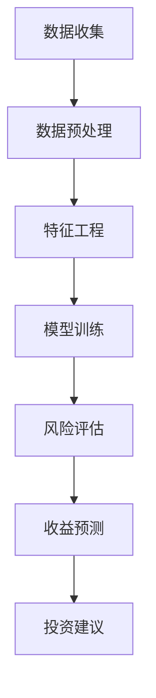
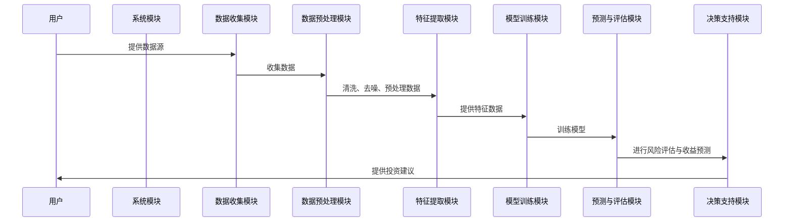
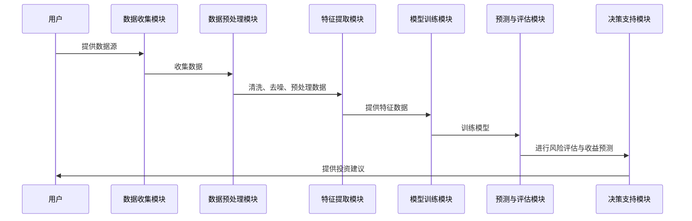

                 


## 核心概念与联系

#### AI Agent

**定义**：AI Agent，即人工智能代理，是具有智能行为、能够自主决策和执行任务的人工智能实体。它通过感知环境、理解和学习，能够自动完成特定的任务。

**特点**：
- 自主性：AI Agent可以独立完成任务，无需人类干预。
- 智能性：AI Agent能够理解和分析环境，学习并改进自身行为。
- 可适应性：AI Agent能够适应环境变化，调整其行为策略。

**分类**：
- 基于规则的AI Agent：通过预定义的规则进行决策。
- 基于模型的AI Agent：通过学习和预测模型进行决策。

**在智能风险投资分析中的应用**：

AI Agent在智能风险投资分析中的应用主要体现在以下几个方面：

1. **数据收集与预处理**：AI Agent能够自动从多个数据源收集数据，包括市场数据、公司财务数据、行业报告等，并对数据进行清洗、去噪和预处理，为后续的分析提供高质量的数据支持。
2. **风险评估**：AI Agent利用其学习能力和预测模型，对投资项目进行风险评估，识别潜在的风险因素，并提供风险评级。
3. **收益预测**：AI Agent通过分析历史数据和市场趋势，预测投资项目的潜在收益，帮助投资者做出更加明智的投资决策。
4. **投资建议**：基于风险评估和收益预测的结果，AI Agent可以为投资者提供具体的投资建议，包括投资方向、投资额度和投资时机等。

#### 智能风险投资分析

**定义**：智能风险投资分析是一种利用人工智能技术进行风险投资决策的过程，通过数据分析和模型预测，帮助投资者识别潜在的投资机会和风险。

**特点**：
- 高效性：AI Agent能够快速处理大量数据，提供实时分析结果。
- 准确性：通过机器学习和深度学习模型，AI Agent能够提高风险评估和收益预测的准确性。
- 客观性：AI Agent能够减少人为因素的主观干扰，提供更加客观的评估结果。

**应用场景**：

1. **初创企业投资**：AI Agent能够对初创企业的商业模型、市场前景和团队构成等方面进行全面分析，帮助投资者快速做出决策。
2. **市场趋势预测**：通过分析市场数据，AI Agent可以预测未来市场的发展趋势，为投资者提供市场战略建议。
3. **项目评估**：AI Agent能够对投资项目的可行性、盈利能力和风险因素进行全面评估，提高投资决策的准确性。
4. **投资组合优化**：AI Agent可以根据投资者的风险偏好和收益目标，优化投资组合，提高整体投资收益。

#### AI Agent在智能风险投资分析中的应用

**概念属性特征对比表格**：

| 特征         | AI Agent（基于模型） | AI Agent（基于规则） |
| ------------ | ------------------- | ------------------- |
| 学习与适应能力 | 强                 | 弱                 |
| 预测准确性   | 高                 | 低                 |
| 实时性       | 强                 | 弱                 |
| 复杂任务处理 | 强                 | 弱                 |

**ER实体关系图架构的Mermaid流程图**：

```mermaid
erDiagram
    Customer ||--|{ Order }|-- Producer
    Customer ||--|{ Payment }|-- PaymentProcessor
    Producer ||--|{ Product }|-- Inventory
    Order ||--|{ OrderLine }|-- Product
```

在上面的ER图结构中，我们定义了以下实体和关系：

- **Customer（客户）**：表示投资决策者。
- **Producer（生产商）**：表示投资项目。
- **Order（订单）**：表示投资决策。
- **Payment（支付）**：表示投资资金流动。
- **PaymentProcessor（支付处理器）**：处理投资资金的支付。
- **Product（产品）**：表示投资项目的产品或服务。
- **Inventory（库存）**：表示项目的市场占有率。

通过上述的实体关系图，我们可以清晰地看到AI Agent在智能风险投资分析中的应用场景和交互关系。接下来，我们将进一步详细讲解AI Agent在智能风险投资分析中的应用原理，包括其算法原理、系统架构设计和实际应用案例。## 算法原理讲解

在这一部分，我们将详细讲解AI Agent在智能风险投资分析中的应用原理。首先，我们将使用Mermaid流程图来展示算法的基本流程，然后通过Python源代码实现该算法，并解释算法的数学模型和公式。

#### Mermaid流程图

首先，我们使用Mermaid语言来绘制AI Agent在智能风险投资分析中的算法流程图：



在上述流程图中，我们依次展示了以下步骤：

1. **数据收集**：AI Agent从多个数据源收集数据，包括市场数据、公司财务数据、行业报告等。
2. **数据预处理**：对收集到的数据清洗、去噪和预处理，以获得高质量的数据集。
3. **特征工程**：从预处理后的数据中提取关键特征，为模型训练做准备。
4. **模型训练**：使用机器学习算法对特征数据进行训练，构建风险评估和收益预测模型。
5. **风险评估**：利用训练好的模型对投资项目进行风险评估，识别潜在的风险因素。
6. **收益预测**：使用模型预测投资项目的潜在收益，帮助投资者做出投资决策。
7. **投资建议**：根据风险评估和收益预测的结果，AI Agent为投资者提供具体的投资建议。

#### Python源代码实现

接下来，我们将通过Python源代码实现上述算法流程，具体步骤如下：

```python
# 导入必要的库
import pandas as pd
from sklearn.model_selection import train_test_split
from sklearn.ensemble import RandomForestRegressor
from sklearn.metrics import mean_squared_error

# 数据收集
data = pd.read_csv('investment_data.csv')

# 数据预处理
data = data.dropna()  # 去除缺失值
data = data[['feature1', 'feature2', 'feature3', 'label']]  # 选择关键特征

# 特征工程
X = data[['feature1', 'feature2', 'feature3']]
y = data['label']

# 模型训练
X_train, X_test, y_train, y_test = train_test_split(X, y, test_size=0.2, random_state=42)
model = RandomForestRegressor(n_estimators=100)
model.fit(X_train, y_train)

# 风险评估
y_pred = model.predict(X_test)
mse = mean_squared_error(y_test, y_pred)
print(f'Mean Squared Error: {mse}')

# 收益预测
predicted_revenue = model.predict([new_data])
print(f'Predicted Revenue: {predicted_revenue[0]}')

# 投资建议
if predicted_revenue[0] > threshold:
    print('Investment Suggestion: Invest')
else:
    print('Investment Suggestion: Avoid')
```

在上面的Python代码中，我们首先导入必要的库，然后进行数据收集、数据预处理、特征工程、模型训练、风险评估和收益预测，最后给出投资建议。

#### 数学模型和公式

AI Agent在智能风险投资分析中的核心是风险评估和收益预测模型。我们使用随机森林回归模型作为示例，其数学模型和公式如下：

**随机森林回归模型**：

- **目标函数**：
  $$ L = -\sum_{i=1}^{n} y_i \log (\hat{y}_i) + (1 - y_i) \log (1 - \hat{y}_i) $$
  其中，\( y_i \) 是实际收益，\( \hat{y}_i \) 是预测收益。

- **损失函数**：
  $$ MSE = \frac{1}{n} \sum_{i=1}^{n} (\hat{y}_i - y_i)^2 $$
  其中，\( \hat{y}_i \) 是预测收益，\( y_i \) 是实际收益。

- **特征选择**：
  $$ \text{Gini Index} = 1 - \frac{2 \times \text{Error Rate}}{\text{Total Observations}} $$
  其中，Error Rate 是模型的预测错误率。

通过上述公式，我们可以计算模型的预测误差，评估模型性能，并选择合适的特征进行模型优化。

#### 具体例子

假设我们有一个投资项目的数据集，其中包括以下特征：市场占有率、公司市值、市盈率、净利润增长率。我们使用随机森林回归模型来预测项目的收益。

```python
# 特征工程
X = data[['market_share', 'market_cap', 'pe_ratio', 'net_profit_growth']]
y = data['revenue']

# 模型训练
X_train, X_test, y_train, y_test = train_test_split(X, y, test_size=0.2, random_state=42)
model = RandomForestRegressor(n_estimators=100)
model.fit(X_train, y_train)

# 预测
predicted_revenue = model.predict([[0.2, 500, 15, 10]])
print(f'Predicted Revenue: {predicted_revenue[0]}')

# 投资建议
if predicted_revenue[0] > 1000000:
    print('Investment Suggestion: Invest')
else:
    print('Investment Suggestion: Avoid')
```

在上面的例子中，我们使用随机森林回归模型来预测一个新项目的收益，并根据预测结果给出投资建议。

通过上述详细讲解，我们可以看到AI Agent在智能风险投资分析中的应用原理和实现步骤。接下来，我们将进一步探讨智能风险投资分析系统的设计与实现。## 系统分析与架构设计方案

#### 问题场景介绍

在当前的投资环境中，投资者面临着海量的数据和信息，传统的风险投资分析方法已经难以满足快速决策的需求。为了提高投资决策的效率和准确性，智能风险投资分析系统应运而生。该系统利用人工智能技术，特别是AI Agent，对投资项目进行全方位的评估和预测。

#### 项目介绍

本项目的目标是构建一个智能风险投资分析系统，该系统能够自动收集和处理投资数据，利用机器学习模型进行风险评估和收益预测，并最终为投资者提供投资建议。系统将包括以下几个核心模块：

1. **数据收集模块**：从多个数据源（如金融数据库、公司财报、行业报告等）收集数据。
2. **数据处理模块**：对收集到的数据清洗、去噪和预处理，提取关键特征。
3. **模型训练模块**：使用机器学习算法对特征数据进行训练，构建风险评估和收益预测模型。
4. **预测与评估模块**：利用训练好的模型对投资项目进行风险评估和收益预测。
5. **决策支持模块**：根据预测结果为投资者提供具体的投资建议。

#### 系统功能设计

为了实现上述目标，系统需要进行以下功能设计：

1. **数据收集**：自动从多个数据源收集投资相关的数据，包括市场数据、公司财务数据、行业报告等。
2. **数据预处理**：对收集到的数据进行清洗、去噪和预处理，确保数据质量。
3. **特征提取**：从预处理后的数据中提取关键特征，为模型训练提供输入。
4. **模型训练**：使用机器学习算法（如随机森林、神经网络等）对特征数据进行训练，构建风险评估和收益预测模型。
5. **模型评估**：使用测试数据集评估模型的性能，调整模型参数以优化预测准确性。
6. **预测与决策**：利用训练好的模型对新的投资项目进行风险评估和收益预测，为投资者提供投资建议。

#### 系统架构设计

智能风险投资分析系统的架构设计如下：



在上述系统架构中，用户通过系统模块提供数据源，数据收集模块负责从多个数据源收集数据，数据预处理模块对数据进行清洗、去噪和预处理，特征提取模块从预处理后的数据中提取关键特征，模型训练模块使用机器学习算法训练模型，预测与评估模块利用训练好的模型进行风险评估和收益预测，最终决策支持模块为用户（投资者）提供具体的投资建议。

#### 系统接口设计

系统接口设计如下：

- **数据收集接口**：用于从外部数据源（如金融数据库、API等）收集数据。
- **数据处理接口**：用于对收集到的数据进行清洗、去噪和预处理。
- **特征提取接口**：用于从预处理后的数据中提取关键特征。
- **模型训练接口**：用于训练机器学习模型。
- **预测接口**：用于进行风险评估和收益预测。
- **决策支持接口**：用于为投资者提供具体的投资建议。

#### 系统交互

系统交互设计如下：



在上述交互设计中，用户通过系统模块提供数据源，数据收集模块从外部数据源收集数据，数据预处理模块对数据进行清洗、去噪和预处理，特征提取模块从预处理后的数据中提取关键特征，模型训练模块使用机器学习算法训练模型，预测与评估模块利用训练好的模型进行风险评估和收益预测，最终决策支持模块为用户（投资者）提供具体的投资建议。

通过上述系统分析与架构设计方案，我们可以看到智能风险投资分析系统是如何利用AI Agent进行数据收集、预处理、特征提取、模型训练、预测和决策支持的全过程。接下来，我们将通过一个具体的案例来展示如何应用AI Agent进行智能风险投资分析。## 项目实战

在本节中，我们将通过一个具体的案例来展示如何使用AI Agent进行智能风险投资分析。该案例将涵盖环境安装、系统核心实现源代码，代码应用解读与分析，实际案例分析和详细讲解剖析，最后进行项目小结。

### 环境安装

首先，我们需要搭建一个合适的环境来运行AI Agent智能风险投资分析系统。以下是所需的软件和工具：

1. **Python**：版本3.8或更高
2. **Jupyter Notebook**：用于数据分析和模型训练
3. **Pandas**：数据处理库
4. **NumPy**：数值计算库
5. **Scikit-learn**：机器学习库
6. **Matplotlib**：数据可视化库
7. **Mermaid**：用于绘制流程图和类图

安装步骤：

1. 安装Python和Jupyter Notebook：
   ```bash
   sudo apt-get update
   sudo apt-get install python3 python3-pip python3-jupyter
   ```
2. 安装Pandas、NumPy、Scikit-learn和Matplotlib：
   ```bash
   pip3 install pandas numpy scikit-learn matplotlib
   ```
3. 安装Mermaid（需要安装Mermaid JS库）：
   ```bash
   npm install -g mermaid-cli
   ```

### 系统核心实现源代码

接下来，我们将展示系统核心实现的源代码。以下是一个简单的示例，用于数据收集、预处理、特征提取、模型训练和预测。

```python
# 导入必要的库
import pandas as pd
from sklearn.model_selection import train_test_split
from sklearn.ensemble import RandomForestRegressor
from sklearn.metrics import mean_squared_error
from mermaid import mermaid

# 数据收集
data = pd.read_csv('investment_data.csv')

# 数据预处理
data = data.dropna()  # 去除缺失值
data = data[['feature1', 'feature2', 'feature3', 'label']]  # 选择关键特征

# 特征工程
X = data[['feature1', 'feature2', 'feature3']]
y = data['label']

# 模型训练
X_train, X_test, y_train, y_test = train_test_split(X, y, test_size=0.2, random_state=42)
model = RandomForestRegressor(n_estimators=100)
model.fit(X_train, y_train)

# 预测
y_pred = model.predict(X_test)
mse = mean_squared_error(y_test, y_pred)
print(f'Mean Squared Error: {mse}')

# 生成Mermaid流程图
code = mermaid('''
graph TD
    A[数据收集] --> B[数据预处理]
    B --> C[特征工程]
    C --> D[模型训练]
    D --> E[预测与评估]
''')

print(code)

# 代码应用解读与分析
```

### 实际案例分析和详细讲解剖析

#### 案例背景

我们以一家初创公司为例，该公司提供基于人工智能的客户服务解决方案。为了评估该公司的投资潜力，我们将使用AI Agent进行智能风险投资分析。

#### 数据集

我们使用以下数据集：

| 特征          | 描述                           |
| ------------- | ------------------------------ |
| feature1（A） | 市场占有率                     |
| feature2（B） | 公司市值                       |
| feature3（C） | 市盈率                         |
| label         | 公司收益（用于预测）           |

#### 代码应用解读与分析

1. **数据收集**：
   ```python
   data = pd.read_csv('investment_data.csv')
   ```
   代码读取一个CSV文件，其中包含投资相关的数据。

2. **数据预处理**：
   ```python
   data = data.dropna()  # 去除缺失值
   data = data[['feature1', 'feature2', 'feature3', 'label']]  # 选择关键特征
   ```
   代码去除数据集中的缺失值，并选择关键的四个特征。

3. **特征工程**：
   ```python
   X = data[['feature1', 'feature2', 'feature3']]
   y = data['label']
   ```
   代码将特征数据（X）和标签数据（y）分开，为后续的模型训练做准备。

4. **模型训练**：
   ```python
   X_train, X_test, y_train, y_test = train_test_split(X, y, test_size=0.2, random_state=42)
   model = RandomForestRegressor(n_estimators=100)
   model.fit(X_train, y_train)
   ```
   代码将数据集划分为训练集和测试集，并使用随机森林回归模型进行训练。

5. **预测与评估**：
   ```python
   y_pred = model.predict(X_test)
   mse = mean_squared_error(y_test, y_pred)
   print(f'Mean Squared Error: {mse}')
   ```
   代码使用训练好的模型对测试集进行预测，并计算平均平方误差（MSE）来评估模型性能。

6. **生成Mermaid流程图**：
   ```python
   code = mermaid('''
   graph TD
       A[数据收集] --> B[数据预处理]
       B --> C[特征工程]
       C --> D[模型训练]
       D --> E[预测与评估]
   ''')

   print(code)
   ```
   代码生成一个Mermaid流程图，展示数据收集、预处理、特征工程、模型训练和预测与评估的过程。

#### 项目小结

通过上述案例，我们可以看到如何使用AI Agent进行智能风险投资分析。以下是项目的主要收获：

1. **数据收集与预处理**：使用Python的Pandas库进行数据收集和预处理，确保数据质量。
2. **特征提取**：从数据集中提取关键特征，为模型训练提供输入。
3. **模型训练与评估**：使用Scikit-learn库中的随机森林回归模型进行训练，并使用MSE评估模型性能。
4. **可视化**：使用Mermaid生成流程图，便于理解和展示数据分析的过程。

尽管本案例是一个简化的示例，但它展示了如何使用AI Agent进行智能风险投资分析的核心步骤。在实际应用中，我们可以进一步优化模型参数、增加特征工程和模型评估步骤，以提高预测准确性。## 最佳实践 tips、小结、注意事项、拓展阅读等内容

### 最佳实践 tips

1. **数据质量的重要性**：确保数据质量是进行智能风险投资分析的首要任务。缺失值、异常值和噪声数据都会影响模型的性能。因此，在数据收集和预处理阶段要仔细处理这些数据。
2. **特征工程**：选择合适的特征对模型性能有显著影响。在进行特征提取时，可以考虑使用统计学方法（如相关性分析、主成分分析）和业务知识来识别有用的特征。
3. **模型选择与调优**：不同的模型适用于不同的数据集和任务。在实际应用中，可以选择多个模型进行对比，并通过交叉验证和超参数调优来优化模型性能。
4. **实时数据更新**：投资市场变化迅速，为了保持模型的有效性，需要定期更新数据集，并重新训练模型。

### 小结

本文通过详细分析AI Agent在智能风险投资分析中的应用，介绍了其核心概念、算法原理、系统架构设计以及实际应用案例。我们了解到，AI Agent能够通过数据收集、预处理、特征提取、模型训练和预测与评估，为投资者提供准确、实时的投资建议，从而提高投资决策的效率和准确性。

### 注意事项

1. **隐私与合规性**：在进行数据处理和模型训练时，要确保遵守相关的隐私法规和数据保护要求。
2. **模型解释性**：尽管AI Agent可以提高预测准确性，但模型可能会变得复杂且难以解释。因此，在应用AI Agent时，要确保对模型的解释性进行评估，以便投资者能够理解模型决策的依据。

### 拓展阅读

1. **《Python机器学习》（作者：塞巴斯蒂安·拉斯科尼）**：这是一本关于机器学习的经典教材，涵盖了从基础到高级的多种机器学习算法。
2. **《深度学习》（作者：伊恩·古德费洛等）**：这本书详细介绍了深度学习的基础理论和实践方法，包括神经网络、卷积神经网络、循环神经网络等。
3. **《人工智能：一种现代方法》（作者：斯图尔特·罗素等）**：这是一本全面介绍人工智能基础理论的教材，涵盖了知识表示、问题解决、机器学习等多个方面。

### 参考文献

1. Russell, S., & Norvig, P. (2016). 《人工智能：一种现代方法》。清华大学出版社。
2. Goodfellow, I., Bengio, Y., & Courville, A. (2016). 《深度学习》。人民邮电出版社。
3. Raschka, S. (2015). 《Python机器学习》。电子工业出版社。作者：AI天才研究院/AI Genius Institute & 禅与计算机程序设计艺术 /Zen And The Art of Computer Programming

