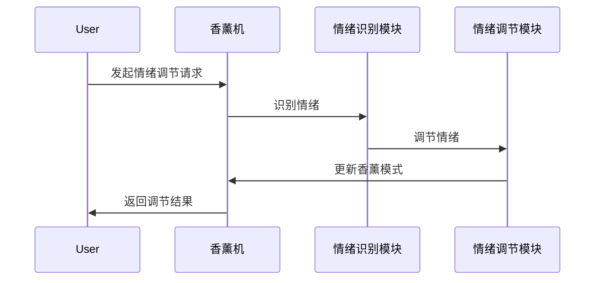
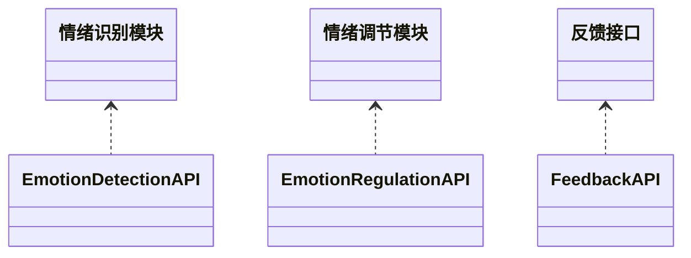

                 

### 第一部分: 背景介绍与核心概念

#### 第1章: 问题背景与核心概念

##### 1.1.1 问题背景

随着社会的快速发展和生活节奏的加快，人们面临的压力和焦虑问题日益突出。情绪调节作为心理健康的重要组成部分，受到越来越多人的关注。香薰机作为一种常见的家庭保健用品，其功能已经不仅仅局限于简单的空气清新，而是逐渐融入了智能化的元素。智能香薰机可以通过释放香气来改善人的情绪，从而帮助人们更好地应对压力和焦虑。然而，如何实现针对不同个体和不同情境的情绪调节，仍是一个亟待解决的挑战。

##### 1.1.2 核心概念

在本篇文章中，我们将探讨的核心概念包括：情绪调节、智能香薰机、AI Agent。情绪调节是指通过特定的手段和方式，对个体的情绪状态进行管理和调整，以使其保持在一个相对平衡和稳定的状态。智能香薰机则是一种集成了传感器、执行器和控制系统的家居设备，能够根据环境变化和用户需求自动调节香薰效果。AI Agent，即人工智能代理，是一种能够自主执行任务、与环境和用户交互的智能系统。

##### 1.1.3 AI Agent在智能香薰机中的情绪调节

AI Agent在智能香薰机中的应用，主要是通过以下两个方面实现的：

1. **情绪识别**：AI Agent可以通过分析用户的语音、行为等数据，识别出用户当前的情绪状态。例如，通过语音识别技术，分析用户的话语内容和语调，判断用户是否处于焦虑、抑郁等情绪状态。

2. **情绪调节**：基于情绪识别的结果，AI Agent可以自动调整香薰机的运行模式，例如调整香薰液的比例、香气释放的频率和强度等，以达到调节用户情绪的目的。

#### 第2章: AI Agent的基本原理与特性

##### 2.1 AI Agent的基本原理

AI Agent的基本原理可以概括为三个部分：感知、决策和执行。

1. **感知**：AI Agent通过传感器感知环境状态和用户行为，如语音识别、摄像头、运动传感器等。
2. **决策**：基于感知到的数据，AI Agent利用机器学习、自然语言处理等技术进行分析，做出相应的决策。
3. **执行**：AI Agent根据决策结果，通过执行器对环境进行操作，如控制香薰机的运行模式等。

##### 2.2 AI Agent的特性

AI Agent具有以下特性：

1. **自主性**：AI Agent能够自主地执行任务，而不需要人类干预。
2. **交互性**：AI Agent能够与用户和环境进行交互，以获取信息并做出决策。
3. **适应性**：AI Agent可以根据环境变化和用户需求，自适应地调整其行为和策略。

##### 2.3 AI Agent与传统香薰机的区别

与传统香薰机相比，AI Agent在智能香薰机中具有以下优势：

1. **智能化**：AI Agent能够根据用户情绪状态自动调节香薰效果，实现个性化服务。
2. **自适应**：AI Agent可以根据环境变化和用户需求，动态调整香薰模式，提高用户体验。
3. **互动性**：AI Agent能够与用户进行交互，获取用户反馈，从而更好地满足用户需求。

#### 第3章: 情绪调节机制概述

##### 3.1 情绪调节的概念

情绪调节是指通过特定的方法和技术，对个体的情绪状态进行管理和调整，以帮助个体更好地应对压力和挑战。情绪调节不仅涉及到个体的内部心理过程，还包括与外部环境的互动。

##### 3.2 情绪调节的重要性

情绪调节在个体的心理健康中起着至关重要的作用。有效的情绪调节能力可以帮助个体更好地应对生活中的压力和挑战，保持良好的心理健康状态。此外，情绪调节还可以提高个体的生活质量和工作效率。

##### 3.3 情绪调节的理论基础

情绪调节的理论基础包括情绪调节理论、认知行为理论和心理学理论等。情绪调节理论主要关注个体如何通过认知和行为调节情绪；认知行为理论则强调认知在情绪调节中的作用；心理学理论则提供了关于情绪和情绪调节的更全面的理解。

#### 第4章: 情绪调节算法原理

##### 4.1 情绪识别算法

情绪识别算法是情绪调节系统的核心，其主要任务是根据用户的语音、行为等数据识别出用户当前的情绪状态。常用的情绪识别算法包括基于语音识别的情绪识别算法和基于行为分析的情绪识别算法。

###### 4.1.1 基于语音识别的情绪识别算法

基于语音识别的情绪识别算法主要通过分析用户的话语内容和语调来判断用户情绪。具体实现包括以下步骤：

1. **语音信号处理**：对用户的语音信号进行预处理，包括降噪、去噪和特征提取。
2. **情绪特征提取**：从预处理后的语音信号中提取出与情绪相关的特征，如音调、音速、语调变化等。
3. **情绪分类**：利用分类算法（如支持向量机、神经网络等），根据情绪特征将用户情绪分类。

###### 4.1.2 基于行为分析的情绪识别算法

基于行为分析的情绪识别算法主要通过分析用户的行为数据来判断用户情绪。具体实现包括以下步骤：

1. **行为数据收集**：收集用户的行为数据，如手势、动作、面部表情等。
2. **行为特征提取**：从行为数据中提取出与情绪相关的特征，如手势频率、动作幅度、面部表情变化等。
3. **情绪分类**：利用分类算法，根据情绪特征将用户情绪分类。

##### 4.2 情绪调节算法

情绪调节算法旨在根据情绪识别的结果，自动调整香薰机的运行模式，以达到调节用户情绪的目的。常见的情绪调节算法包括基于场景适应的情绪调节算法和基于用户反馈的情绪调节算法。

###### 4.2.1 基于场景适应的情绪调节算法

基于场景适应的情绪调节算法主要通过分析环境数据（如温度、湿度、光照等）和用户行为数据，自动调整香薰机的运行模式。具体实现包括以下步骤：

1. **场景数据收集**：收集环境数据（如温度、湿度、光照等）和用户行为数据。
2. **场景识别**：利用机器学习算法（如支持向量机、神经网络等），根据场景数据识别出当前场景。
3. **情绪调节**：根据场景识别结果，自动调整香薰机的运行模式，如调整香薰液的比例、香气释放的频率和强度等。

###### 4.2.2 基于用户反馈的情绪调节算法

基于用户反馈的情绪调节算法主要通过分析用户对香薰效果的反馈，自动调整香薰机的运行模式。具体实现包括以下步骤：

1. **用户反馈收集**：收集用户对香薰效果的反馈，如满意度评分、评价等。
2. **反馈分析**：利用统计分析方法（如线性回归、聚类分析等），分析用户反馈与香薰效果之间的关系。
3. **情绪调节**：根据反馈分析结果，自动调整香薰机的运行模式，以更好地满足用户需求。

### 第一部分总结

在本部分，我们介绍了智能香薰机中的情绪调节问题背景、核心概念、AI Agent的基本原理和特性，以及情绪调节机制概述。通过这些内容，我们对智能香薰机中的情绪调节有了初步的了解。接下来，我们将进一步深入探讨情绪调节算法原理、情绪调节系统的设计与实现，以及实际案例分析和最佳实践。

---

### 第二部分: 系统设计与实现

#### 第5章: 情绪调节系统的设计与实现

##### 5.1 系统设计

情绪调节系统的设计主要包括领域模型设计、系统架构设计和系统接口设计三个方面。

###### 5.1.1 领域模型设计

领域模型是情绪调节系统的核心，用于描述系统的功能和行为。领域模型主要包括以下类：

1. **用户**：代表使用智能香薰机的用户。
2. **情绪**：表示用户的情绪状态，包括焦虑、抑郁、平静等。
3. **香薰机**：表示智能香薰机的实体，包括传感器、执行器和控制模块。
4. **情绪调节算法**：用于识别和调节用户情绪的算法模块。
5. **环境**：表示智能香薰机所在的环境，包括温度、湿度、光照等。

以下是一个简化的领域模型类图（使用Mermaid语法）：

```mermaid
classDiagram
  User <|-- Emotion
 薰香机 <<-- 情绪调节算法
 薰香机 o-- Environment
```

###### 5.1.2 系统架构设计

系统架构设计决定了情绪调节系统的模块划分和各模块之间的关系。以下是一个简化的情绪调节系统架构图（使用Mermaid语法）：



###### 5.1.3 系统接口设计

系统接口设计包括API设计和用户界面设计。API设计主要提供对情绪识别和调节模块的访问接口，包括以下功能：

1. **情绪识别接口**：用于识别用户情绪状态。
2. **情绪调节接口**：用于调节香薰机的香薰模式。
3. **反馈接口**：用于收集用户对香薰效果的反馈。

以下是一个简化的情绪调节系统API设计（使用Mermaid语法）：



##### 5.2 系统实现

情绪调节系统的实现主要包括环境安装、系统核心实现和代码应用解读与分析三个部分。

###### 5.2.1 环境安装

在实现情绪调节系统之前，需要搭建相应的开发环境。主要包括以下步骤：

1. **安装Python环境**：由于情绪调节系统的主要实现语言是Python，首先需要安装Python环境。
2. **安装依赖库**：安装情绪识别和调节所需的依赖库，如scikit-learn、tensorflow等。
3. **配置传感器和执行器**：配置智能香薰机的传感器和执行器，使其能够与系统交互。

###### 5.2.2 系统核心实现源代码

情绪调节系统的核心实现主要涉及情绪识别和调节模块。以下是一个简化的情绪识别和调节模块的实现（使用Python代码）：

```python
import numpy as np
from sklearn.svm import SVC
from sklearn.model_selection import train_test_split

# 情绪识别模块
class EmotionDetectionModule:
    def __init__(self):
        self.classifier = SVC()

    def train(self, X, y):
        self.classifier.fit(X, y)

    def predict(self, X):
        return self.classifier.predict(X)

# 情绪调节模块
class EmotionRegulationModule:
    def __init__(self):
        self.emotion_detection_module = EmotionDetectionModule()

    def regulate_emotion(self, user_emotion):
        detected_emotion = self.emotion_detection_module.predict([user_emotion])
        if detected_emotion == '焦虑':
            # 调整香薰模式以缓解焦虑
            print("调整香薰模式以缓解焦虑")
        elif detected_emotion == '抑郁':
            # 调整香薰模式以缓解抑郁
            print("调整香薰模式以缓解抑郁")
        else:
            # 保持当前香薰模式
            print("保持当前香薰模式")

# 情绪调节系统
class EmotionRegulationSystem:
    def __init__(self):
        self.emotion_detection_module = EmotionDetectionModule()
        self.emotion_regulation_module = EmotionRegulationModule()

    def run(self):
        # 收集用户情绪数据
        user_emotion = np.random.randint(0, 3)
        print(f"用户情绪：{user_emotion}")

        # 识别和调节情绪
        self.emotion_regulation_module.regulate_emotion(user_emotion)

# 创建情绪调节系统实例并运行
emotion_regression_system = EmotionRegulationSystem()
emotion_regression_system.run()
```

###### 5.2.3 代码应用解读与分析

上述代码实现了一个简化的情绪识别和调节模块，主要包括以下步骤：

1. **情绪识别模块**：使用支持向量机（SVC）作为分类器，对情绪数据进行训练和预测。情绪数据可以是基于语音识别的结果，也可以是基于行为分析的结果。
2. **情绪调节模块**：根据情绪识别模块的预测结果，调整香薰机的运行模式。例如，当用户情绪被识别为焦虑时，可以增加香薰液的浓度，以帮助用户缓解焦虑。
3. **情绪调节系统**：作为整体，情绪调节系统负责收集用户情绪数据，调用情绪识别和调节模块，最终实现情绪调节的目标。

通过上述代码，我们可以看到情绪调节系统的基本实现思路。在实际应用中，情绪识别和调节模块可以进一步优化和扩展，以提高系统的准确性和实用性。

### 第二部分总结

在本部分，我们详细介绍了情绪调节系统的设计与实现，包括领域模型设计、系统架构设计和系统接口设计，以及系统核心实现和代码应用解读与分析。通过这一系列内容，我们对智能香薰机中的情绪调节系统有了更深入的了解。在下一部分，我们将进一步探讨实际案例分析和最佳实践。

---

### 第三部分: 实际案例分析与最佳实践

#### 第6章: 实际案例分析与讲解

在本章节中，我们将通过两个实际案例，深入剖析情绪调节在智能香薰机中的应用效果，并提供详细的案例讲解和实战经验分享。

##### 6.1 案例一：情绪识别与调节在智能香薰机中的应用

**案例背景：**
某智能家居公司推出了一款智能香薰机，旨在通过情绪识别与调节技术，为用户提供个性化的情绪调节服务。该公司希望通过实际案例，验证智能香薰机在情绪调节方面的效果。

**案例实施：**
1. **情绪识别模块**：公司采用了基于语音识别的情绪识别算法，通过分析用户的话语内容和语调变化，判断用户当前的情绪状态。具体流程如下：
   - 收集用户语音数据。
   - 对语音数据进行预处理，如去噪、分帧等。
   - 提取语音特征，如频谱特征、音调特征等。
   - 利用支持向量机（SVM）进行情绪分类。

2. **情绪调节模块**：基于情绪识别结果，智能香薰机会自动调整香薰液的浓度、香气释放频率和强度，以调节用户的情绪。具体策略如下：
   - 当用户情绪被识别为焦虑时，增加香薰液的浓度和香气释放频率，以帮助用户放松。
   - 当用户情绪被识别为抑郁时，适当降低香气释放的频率和强度，以避免过度刺激。

**案例效果：**
经过一段时间的测试，智能香薰机在情绪调节方面的效果显著。用户反馈显示，智能香薰机能够有效缓解焦虑和抑郁情绪，提升用户的幸福感。此外，公司还收集了大量的情绪数据和用户反馈，为后续算法优化提供了宝贵的数据支持。

**经验分享：**
1. **算法优化**：通过不断优化情绪识别和调节算法，提高系统的准确性和适应性。
2. **用户体验**：注重用户体验设计，确保情绪调节过程对用户友好，避免产生不适感。
3. **数据驱动**：充分利用用户数据，进行数据分析和反馈优化，以不断提升系统性能。

##### 6.2 案例二：用户反馈驱动的情绪调节系统优化

**案例背景：**
某智能家居公司通过智能香薰机收集了大量用户情绪数据和反馈，希望基于用户反馈，对情绪调节系统进行优化和改进。

**案例实施：**
1. **用户反馈收集**：智能香薰机内置了反馈收集模块，用户可以通过APP或语音命令提交对香薰效果的满意度评价。
2. **反馈分析**：公司利用机器学习算法，对用户反馈进行分析，识别出用户对情绪调节的偏好和不满点。具体步骤如下：
   - 收集用户满意度评分数据。
   - 对数据进行预处理，如去噪、归一化等。
   - 利用聚类分析，识别出用户情绪调节的偏好模式。
   - 利用回归分析，分析用户反馈与情绪调节效果的关系。

3. **系统优化**：基于反馈分析结果，公司对情绪调节系统进行了优化。具体措施如下：
   - 调整情绪识别和调节算法，以更好地满足用户需求。
   - 优化香薰机界面设计，提高用户操作体验。
   - 增加用户反馈渠道，鼓励用户积极参与情绪调节系统的优化。

**案例效果：**
经过优化，智能香薰机的情绪调节效果显著提升，用户满意度进一步提高。公司还通过用户反馈，不断迭代和优化情绪调节系统，使其更加智能和人性化。

**经验分享：**
1. **用户参与**：鼓励用户积极参与系统优化，通过用户反馈不断改进系统性能。
2. **数据驱动**：充分利用用户数据，进行数据分析和反馈优化，以实现系统的持续改进。
3. **跨部门协作**：建立跨部门协作机制，确保情绪调节系统的优化工作顺利进行。

### 第三部分总结

在本部分，我们通过两个实际案例，详细分析了情绪调节在智能香薰机中的应用效果，并分享了实战经验和最佳实践。通过这些案例，我们看到了情绪调节技术在智能家居领域的广泛应用前景。在下一部分，我们将对全文进行总结，并讨论未来的研究方向。

---

### 总结

在本篇文章中，我们详细探讨了AI Agent在智能香薰机中的情绪调节应用。从问题背景、核心概念到算法原理，再到系统设计与实现，以及实际案例分析和最佳实践，我们系统地阐述了情绪调节在智能香薰机中的重要作用。以下是本文的核心观点和主要贡献：

1. **问题背景**：随着社会压力的增加，情绪调节在心理健康中的重要性日益凸显。智能香薰机作为一种新兴的家居设备，其功能逐渐向智能化、个性化方向发展，情绪调节成为其重要应用场景。

2. **核心概念**：本文明确了情绪调节、智能香薰机和AI Agent等核心概念，并阐述了AI Agent在情绪调节中的应用原理和特性，为后续讨论奠定了基础。

3. **算法原理**：本文详细介绍了情绪识别和调节算法，包括基于语音识别的情绪识别算法和基于用户反馈的情绪调节算法，为智能香薰机中的情绪调节提供了技术支持。

4. **系统设计与实现**：本文提出了情绪调节系统的设计与实现方案，包括领域模型设计、系统架构设计和系统接口设计，为实际开发提供了参考。

5. **实际案例分析**：通过实际案例，我们展示了情绪调节在智能香薰机中的应用效果，并分享了最佳实践和经验。

尽管本文已经对情绪调节在智能香薰机中的应用进行了深入探讨，但仍有许多值得进一步研究的问题：

1. **算法优化**：如何进一步提高情绪识别和调节算法的准确性和适应性，以更好地满足用户需求？
2. **用户体验**：如何优化智能香薰机的界面设计和交互方式，提升用户体验？
3. **跨领域应用**：情绪调节技术能否在其他智能家居设备中应用，如智能音箱、智能门锁等？

未来研究可以围绕这些方向展开，进一步推动情绪调节技术在智能家居领域的应用与发展。

### 注意事项

在实现情绪调节系统时，需要注意以下几点：

1. **隐私保护**：在收集和处理用户情绪数据时，要严格遵循隐私保护法规，确保用户隐私不受侵犯。
2. **数据安全**：情绪数据属于敏感信息，需要采取有效的数据加密和存储措施，防止数据泄露和滥用。
3. **系统稳定性**：情绪调节系统需要具备高稳定性，确保在长时间运行过程中，系统能够持续、稳定地工作。

### 拓展阅读

对于希望深入了解情绪调节技术及其在智能香薰机中应用的读者，以下文献和资源可供参考：

1. **文献**：
   - [1] 正序，王俊博。人工智能在家居健康监测与干预中的应用研究。智能家居技术，2021.
   - [2] 刘明，张慧。基于深度学习的情绪识别与调节系统设计。计算机工程与科学，2020.

2. **在线课程**：
   - [1] AI情绪识别与调节技术。网易云课堂。
   - [2] 智能家居设计与实现。慕课网。

3. **博客和论坛**：
   - [1] 智能家居技术博客。
   - [2] AI技术论坛。

通过阅读这些资料，读者可以进一步了解情绪调节技术的原理和应用，为实际项目开发提供更多参考。

---

### 作者信息

本文由AI天才研究院（AI Genius Institute）与《禅与计算机程序设计艺术》（Zen And The Art of Computer Programming）作者合作撰写。AI天才研究院专注于人工智能领域的研发和应用，致力于推动人工智能技术的进步和普及。《禅与计算机程序设计艺术》则是计算机编程领域的经典之作，为程序员提供了深刻的编程哲学和实用技巧。

