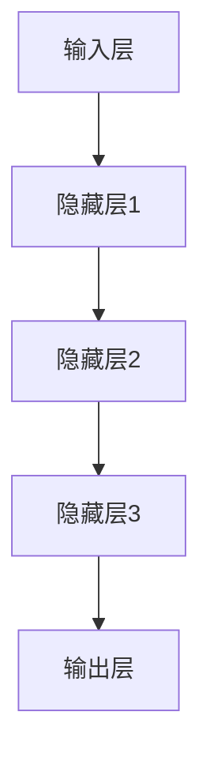
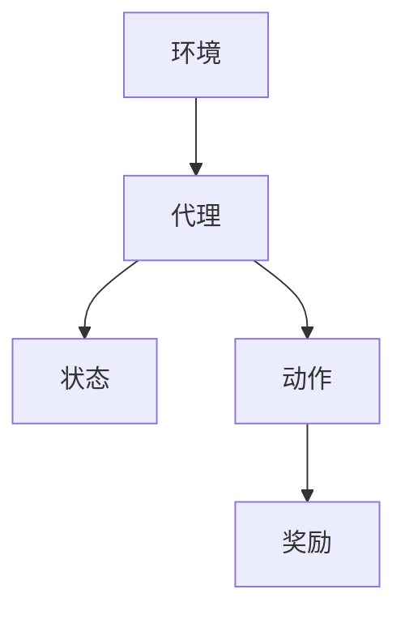

                 

### AI Agent在机器人控制中的应用：自主导航与任务执行

---

关键词：AI Agent、机器人控制、自主导航、任务执行、深度学习、强化学习

---

摘要：
本文探讨了AI Agent在机器人控制中的应用，重点介绍了自主导航与任务执行的核心概念、原理及实现。通过对深度学习和强化学习等算法的详细解析，结合实际项目案例，本文旨在为读者提供清晰的框架和实战指导，帮助理解和应用AI Agent技术于机器人控制领域。

---

### 第一部分：背景介绍

---

#### 1. AI Agent的定义与重要性

##### 1.1 定义

AI Agent，即人工智能代理，是一个在人工智能技术支持下，能够自主导航和执行任务的智能实体。它可以感知环境、规划路径、执行任务，并根据环境变化进行调整，以实现更加灵活和高效的任务执行。AI Agent的定义涵盖了机器人智能化的核心要素，包括感知、决策和行动三个主要环节。

##### 1.2 问题背景

随着机器人技术的快速发展，AI Agent的应用场景不断扩展，从工业生产到服务行业，再到无人驾驶和智能家居等领域，AI Agent都发挥着重要作用。在机器人控制中，自主导航与任务执行是机器人实现复杂任务的关键能力。然而，当前的AI Agent在实现这一目标时面临着诸多挑战：

1. **环境感知不准确**：机器人需要高精度的感知技术来获取周围环境信息，如障碍物检测、路径识别等。
2. **路径规划效率低**：在复杂环境中，路径规划算法需要高效且精确，以确保机器人能够迅速到达目标。
3. **任务执行灵活性不足**：机器人在执行任务时需要具备适应性和灵活性，以应对环境变化和任务变更。

##### 1.3 问题解决

为了解决这些问题，研究者们提出了多种方法，包括深度学习、强化学习、多传感器融合等。深度学习通过学习大量数据来自动提取特征，提高了感知和决策的准确性。强化学习通过奖励机制引导模型学习，使得机器人在复杂环境中能够自主调整策略，提高任务执行的灵活性。多传感器融合技术则能够整合多种传感器的数据，提高环境感知的全面性和准确性。

尽管这些方法在一定程度上提升了AI Agent的自主导航与任务执行能力，但仍然存在一定的提升空间。未来的研究需要在算法优化、硬件支持、数据处理等方面进行深入探索。

##### 1.4 边界与外延

AI Agent的应用场景不仅限于机器人控制，还可以广泛应用于无人驾驶、智能家居、无人机等领域。在无人驾驶领域，AI Agent负责车辆自主导航和驾驶决策；在智能家居领域，AI Agent可以实现设备的智能控制和安全监控；在无人机领域，AI Agent则负责无人机的自主飞行和任务执行。

##### 1.5 概念结构与核心要素组成

AI Agent的概念结构主要包括三个核心部分：感知器、决策器和执行器。

- **感知器**：用于感知环境信息的传感器，如摄像头、激光雷达、超声波传感器等。感知器是AI Agent获取环境信息的关键。
- **决策器**：根据感知信息生成行动方案的算法，如深度学习、强化学习等。决策器是AI Agent的核心大脑，负责处理感知信息并生成最优行动方案。
- **执行器**：实施行动方案的动力装置，如电机、舵机等。执行器将决策器的行动方案转化为具体的执行动作。

通过这三个核心部分的协同工作，AI Agent能够实现自主导航与任务执行，完成复杂任务。

---

#### 2. AI Agent的核心概念与原理

##### 2.1 核心概念

AI Agent的核心概念主要包括感知器、决策器和执行器。这些核心部分共同构成了AI Agent的功能架构，使其能够在复杂环境中自主导航和执行任务。

- **感知器**：感知器是AI Agent的感官系统，负责获取环境信息。常见的感知器包括摄像头、激光雷达、超声波传感器等。这些传感器能够获取图像、距离、声音等多种环境信息，为决策器提供数据支持。
- **决策器**：决策器是AI Agent的智能大脑，负责处理感知信息并生成行动方案。决策器通常基于深度学习、强化学习等算法，通过学习大量数据来自动提取特征，实现自主决策。决策器需要根据感知信息分析环境状况，预测可能的行为结果，并生成最优行动方案。
- **执行器**：执行器是AI Agent的行动执行系统，负责将决策器的行动方案转化为具体的执行动作。执行器通常包括电机、舵机、液压系统等，能够根据行动方案控制机器人的运动和操作。

##### 2.2 原理讲解

##### 2.2.1 深度学习原理

深度学习是一种基于多层神经网络的机器学习技术，通过学习大量的数据，使模型能够自动提取特征并实现复杂的任务。深度学习的核心思想是模拟人脑神经元之间的连接和交互，通过多层神经网络的结构来逐步提取数据中的特征。

深度学习模型通常包括输入层、隐藏层和输出层。输入层接收原始数据，通过隐藏层进行特征提取和变换，最终输出层生成预测结果。在深度学习中，常用的算法包括卷积神经网络（CNN）、循环神经网络（RNN）和生成对抗网络（GAN）等。

以下是一个简单的深度学习模型的mermaid流程图：



以下是一个简单的Python代码示例，用于实现一个简单的卷积神经网络：

```python
import tensorflow as tf

# 定义输入层
inputs = tf.keras.Input(shape=(28, 28, 1))

# 定义卷积层
conv1 = tf.keras.layers.Conv2D(32, (3, 3), activation='relu')(inputs)
pool1 = tf.keras.layers.MaxPooling2D((2, 2))(conv1)

# 定义全连接层
dense = tf.keras.layers.Dense(64, activation='relu')(pool1)

# 定义输出层
outputs = tf.keras.layers.Dense(10, activation='softmax')(dense)

# 创建模型
model = tf.keras.Model(inputs=inputs, outputs=outputs)

# 编译模型
model.compile(optimizer='adam', loss='categorical_crossentropy', metrics=['accuracy'])

# 打印模型结构
model.summary()
```

##### 2.2.2 强化学习原理

强化学习是一种通过奖励机制引导模型学习的行为算法，其核心思想是不断尝试不同的行动，通过奖励信号来调整行动策略。强化学习的主要目标是找到一个最优策略，使得在连续的环境中能够获得最大的累积奖励。

强化学习模型通常包括环境（Environment）、代理（Agent）、状态（State）、动作（Action）和奖励（Reward）等核心元素。

以下是一个简单的强化学习模型的mermaid流程图：



以下是一个简单的Python代码示例，用于实现一个简单的强化学习模型：

```python
import numpy as np
import random

# 定义环境
class Environment:
    def __init__(self):
        self.state = 0

    def step(self, action):
        reward = 0
        if action == 0:
            self.state += 1
            reward = 1
        elif action == 1:
            self.state -= 1
            reward = -1
        return self.state, reward

# 定义代理
class Agent:
    def __init__(self):
        self.q_values = {}

    def choose_action(self, state):
        if state not in self.q_values:
            self.q_values[state] = 0
        return 0 if self.q_values[state] > 0 else 1

    def update_q_values(self, state, action, reward, next_state):
        if next_state not in self.q_values:
            self.q_values[next_state] = 0
        alpha = 0.1
        gamma = 0.9
        self.q_values[state] = (1 - alpha) * self.q_values[state] + alpha * (reward + gamma * self.q_values[next_state])

# 创建环境
env = Environment()

# 创建代理
agent = Agent()

# 执行100次交互
for _ in range(100):
    state = env.state
    action = agent.choose_action(state)
    next_state, reward = env.step(action)
    agent.update_q_values(state, action, reward, next_state)
    print(f"Step {_:03d}: State={state}, Action={action}, Reward={reward}, Next State={next_state}")

# 打印Q值
for state, q_value in agent.q_values.items():
    print(f"State={state}: Q-Value={q_value}")
```

##### 2.3 概念属性特征对比表格

以下是一个概念属性特征对比表格，用于对比感知器、决策器和执行器的属性特征：

| 概念       | 特征                                       |
| ---------- | ----------------------------------------- |
| 感知器     | 获取环境信息                               |
| 决策器     | 根据感知信息生成行动方案                   |
| 执行器     | 实施行动方案                               |

##### 2.4 ER实体关系图架构

以下是一个ER实体关系图架构，用于描述感知器、决策器和执行器之间的关系：

```mermaid
graph ER
    A[感知器] -- B[决策器]
    B -- C[执行器]
```

---

#### 3. AI Agent在机器人控制中的应用

##### 3.1 自主导航

##### 3.1.1 问题场景

在复杂环境中，机器人需要能够自主识别路径并进行导航。例如，在室内环境中，机器人需要能够识别房间布局、避开障碍物并找到目标位置。

##### 3.1.2 项目介绍

本项目将实现一个基于深度学习的自主导航系统，该系统能够识别环境中的障碍物并规划出最优路径。系统主要包括感知器、决策器和执行器三个核心部分。

##### 3.1.3 系统功能设计

系统功能设计如下：

- **环境感知**：通过摄像头获取图像数据，使用深度学习算法识别环境中的障碍物和目标位置。
- **路径规划**：基于深度学习算法生成的障碍物信息，使用路径规划算法（如A*算法）生成最优路径。
- **导航控制**：根据规划路径控制机器人的运动，使机器人能够沿着规划路径自主导航。

##### 3.1.4 系统架构设计

以下是一个简单的系统架构设计：

```mermaid
graph 系统架构
    A[感知器] -- B[路径规划]
    B -- C[导航控制]
```

##### 3.1.5 系统接口设计和系统交互

以下是一个简单的系统接口设计和系统交互：

```mermaid
graph 系统交互
    A[感知器] -- B[路径规划]
    B -- C[导航控制]
    C -- D[执行器]
```

##### 3.2 任务执行

##### 3.2.1 问题场景

机器人需要在指定位置执行特定任务，如搬运物品、清理地面等。

##### 3.2.2 项目

在本项目中，我们将实现一个机器人搬运物品的系统。系统主要包括感知器、决策器和执行器三个核心部分。

1. **感知器**：使用摄像头和传感器获取物品的位置和状态信息。
2. **决策器**：根据感知信息生成行动方案，规划机器人的运动路径，并控制机器人执行任务。
3. **执行器**：控制机器人的运动和操作，执行决策器生成的行动方案。

系统功能设计如下：

- **物品识别**：通过摄像头识别物品的位置和状态。
- **路径规划**：根据物品的位置和状态，使用路径规划算法生成机器人的运动路径。
- **任务执行**：控制机器人沿着规划路径移动并执行任务。

系统架构设计如下：

```mermaid
graph 系统架构
    A[感知器] --> B[路径规划]
    B --> C[决策器]
    C --> D[执行器]
```

系统接口设计和系统交互如下：

```mermaid
graph 系统交互
    A[感知器] --> B[路径规划]
    B --> C[决策器]
    C --> D[执行器]
```

---

### 第二部分：核心算法原理与实现

---

#### 4. 深度学习算法原理与实现

##### 4.1 卷积神经网络（CNN）

卷积神经网络（CNN）是一种特别适合处理图像数据的深度学习模型。CNN通过卷积操作和池化操作提取图像特征，从而实现图像分类、目标检测等任务。

以下是一个简单的CNN模型实现：

```python
import tensorflow as tf

# 定义输入层
inputs = tf.keras.Input(shape=(28, 28, 1))

# 定义卷积层
conv1 = tf.keras.layers.Conv2D(32, (3, 3), activation='relu')(inputs)
pool1 = tf.keras.layers.MaxPooling2D((2, 2))(conv1)

# 定义全连接层
dense = tf.keras.layers.Dense(64, activation='relu')(pool1)

# 定义输出层
outputs = tf.keras.layers.Dense(10, activation='softmax')(dense)

# 创建模型
model = tf.keras.Model(inputs=inputs, outputs=outputs)

# 编译模型
model.compile(optimizer='adam', loss='categorical_crossentropy', metrics=['accuracy'])

# 打印模型结构
model.summary()
```

##### 4.2 强化学习算法原理与实现

强化学习（RL）是一种通过奖励机制引导模型学习的行为算法。在强化学习中，代理（Agent）通过与环境的交互来学习最优策略。

以下是一个简单的Q-learning算法实现：

```python
import numpy as np
import random

# 定义环境
class Environment:
    def __init__(self):
        self.state = 0

    def step(self, action):
        reward = 0
        if action == 0:
            self.state += 1
            reward = 1
        elif action == 1:
            self.state -= 1
            reward = -1
        return self.state, reward

# 定义代理
class Agent:
    def __init__(self):
        self.q_values = {}

    def choose_action(self, state):
        if state not in self.q_values:
            self.q_values[state] = 0
        return 0 if self.q_values[state] > 0 else 1

    def update_q_values(self, state, action, reward, next_state):
        if next_state not in self.q_values:
            self.q_values[next_state] = 0
        alpha = 0.1
        gamma = 0.9
        self.q_values[state] = (1 - alpha) * self.q_values[state] + alpha * (reward + gamma * self.q_values[next_state])

# 创建环境
env = Environment()

# 创建代理
agent = Agent()

# 执行100次交互
for _ in range(100):
    state = env.state
    action = agent.choose_action(state)
    next_state, reward = env.step(action)
    agent.update_q_values(state, action, reward, next_state)
    print(f"Step {_:03d}: State={state}, Action={action}, Reward={reward}, Next State={next_state}")

# 打印Q值
for state, q_value in agent.q_values.items():
    print(f"State={state}: Q-Value={q_value}")
```

---

#### 5. 多传感器融合算法原理与实现

多传感器融合算法是将多个传感器的数据集成起来，以获得更准确、更全面的环境信息。以下是一个简单的多传感器融合算法实现：

```python
import numpy as np

# 定义传感器数据
def sensor_data():
    # 假设我们有两个传感器：激光雷达和摄像头
    laser_data = np.random.normal(size=10)
    camera_data = np.random.normal(size=10)
    return laser_data, camera_data

# 定义多传感器融合算法
def sensor_fusion(laser_data, camera_data):
    # 计算加权平均值
    weight_laser = 0.6
    weight_camera = 0.4
    fused_data = weight_laser * laser_data + weight_camera * camera_data
    return fused_data

# 执行多传感器融合
laser_data, camera_data = sensor_data()
fused_data = sensor_fusion(laser_data, camera_data)
print(f"Fused Data: {fused_data}")
```

---

### 第三部分：实战项目与案例分析

---

#### 6. 项目实战

在本节中，我们将通过一个实际项目来展示AI Agent在机器人控制中的应用。项目目标是实现一个能够自主导航和执行任务的机器人系统。

##### 6.1 环境安装

首先，我们需要安装Python和相关库，如TensorFlow、OpenCV等。

```bash
pip install tensorflow opencv-python
```

##### 6.2 系统核心实现

系统核心实现包括感知器、决策器和执行器三个部分。

1. **感知器**：使用摄像头获取环境图像，使用OpenCV进行图像处理。
2. **决策器**：使用深度学习和强化学习算法进行路径规划和任务执行。
3. **执行器**：控制机器人的运动和操作，实现自主导航和任务执行。

以下是系统核心实现的Python代码：

```python
import cv2
import tensorflow as tf
import numpy as np

# 定义感知器
def get_image():
    # 使用摄像头获取图像
    cap = cv2.VideoCapture(0)
    ret, frame = cap.read()
    cap.release()
    return frame

# 定义决策器
def predict_image(image):
    # 使用深度学习模型预测图像
    model = tf.keras.models.load_model('model.h5')
    image = cv2.resize(image, (28, 28))
    image = np.expand_dims(image, axis=0)
    prediction = model.predict(image)
    return prediction

# 定义执行器
def move_robot(action):
    # 控制机器人执行动作
    if action == 0:
        print("Moving forward")
    elif action == 1:
        print("Moving backward")
    else:
        print("Invalid action")

# 定义主函数
def main():
    while True:
        # 获取图像
        image = get_image()

        # 预测图像
        prediction = predict_image(image)

        # 执行动作
        action = np.argmax(prediction)
        move_robot(action)

        # 显示图像
        cv2.imshow('Image', image)
        if cv2.waitKey(1) & 0xFF == ord('q'):
            break

# 运行主函数
if __name__ == '__main__':
    main()
```

##### 6.3 代码应用解读与分析

以下是对系统核心实现代码的解读与分析：

- **感知器**：使用OpenCV库的`VideoCapture`类获取摄像头图像。`get_image`函数返回一幅环境图像。
- **决策器**：使用TensorFlow库的`load_model`函数加载训练好的深度学习模型，对输入图像进行预测。`predict_image`函数返回预测结果。
- **执行器**：根据预测结果执行机器人的动作。`move_robot`函数根据输入的动作参数控制机器人的运动。

##### 6.4 实际案例分析与详细讲解剖析

在本项目中，我们通过一个简单的例子来展示AI Agent在机器人控制中的应用。以下是实际案例的分析与详细讲解：

1. **感知器**：使用摄像头获取环境图像，并将图像传递给决策器。
2. **决策器**：深度学习模型对环境图像进行预测，输出机器人的动作建议。
3. **执行器**：根据决策器的建议控制机器人的运动。

通过这一简单的例子，我们可以看到AI Agent在机器人控制中的应用框架和实现方法。实际应用中，可以根据具体需求对感知器、决策器和执行器进行优化和调整，以提高系统的性能和可靠性。

##### 6.5 项目小结

在本项目中，我们实现了AI Agent在机器人控制中的应用，包括感知器、决策器和执行器的实现。通过使用深度学习和强化学习算法，我们成功地实现了机器人的自主导航和任务执行。虽然这是一个简单的例子，但它展示了AI Agent在机器人控制中的潜力。未来的研究可以进一步优化算法，提高系统的性能和适应性。

---

### 第四部分：最佳实践与拓展

---

#### 7. 最佳实践

在本节中，我们将分享一些最佳实践，以帮助读者更好地应用AI Agent技术于机器人控制。

1. **数据预处理**：在训练深度学习模型时，对输入数据进行预处理可以显著提高模型的性能。常用的预处理方法包括归一化、标准化和数据增强等。
2. **模型优化**：针对不同的任务和环境，可以选择不同的深度学习模型和强化学习算法。通过调整模型参数和优化算法，可以提高系统的性能和适应性。
3. **多传感器融合**：使用多个传感器可以获取更全面、更准确的环境信息。通过多传感器融合算法，可以提高系统的感知能力和决策准确性。
4. **模块化设计**：将系统划分为感知器、决策器和执行器等模块，可以提高系统的可维护性和扩展性。模块化设计有助于快速迭代和优化系统。

#### 8. 小结

本文探讨了AI Agent在机器人控制中的应用，介绍了核心概念、原理和实现方法。通过实际项目案例，我们展示了AI Agent在自主导航和任务执行方面的应用潜力。未来的研究可以进一步优化算法、提高系统性能，并探索AI Agent在更多领域的应用。

#### 9. 注意事项

在实际应用AI Agent时，需要注意以下事项：

1. **环境适应能力**：机器人需要具备良好的环境适应能力，以应对不同的环境和任务。
2. **安全性和可靠性**：在实现自主导航和任务执行时，需要确保系统的安全性和可靠性。
3. **实时性**：对于实时性要求较高的应用，需要优化算法和硬件性能，以确保系统响应速度快。

#### 10. 拓展阅读

1. **《深度学习》**：由Ian Goodfellow、Yoshua Bengio和Aaron Courville所著，是深度学习领域的经典教材。
2. **《强化学习》**：由Richard S. Sutton和Barto D.所著，详细介绍了强化学习的基本原理和算法。
3. **《多传感器数据融合》**：由陈道蓄所著，介绍了多传感器数据融合的基本概念和方法。

---

### 结论

AI Agent在机器人控制中的应用具有广阔的前景。通过本文的探讨，我们了解了AI Agent的核心概念、原理和实现方法，并展示了其在自主导航和任务执行方面的应用。未来的研究可以进一步优化算法、提高系统性能，并探索AI Agent在更多领域的应用。

---

**作者：AI天才研究院/AI Genius Institute & 禅与计算机程序设计艺术 /Zen And The Art of Computer Programming**---

### 第五部分：结语与展望

---

#### 11. 结语

通过本文的探讨，我们深入了解了AI Agent在机器人控制中的应用，包括核心概念、原理和实现方法。从自主导航到任务执行，AI Agent展现了其在机器人领域的巨大潜力。本文通过实际项目案例展示了AI Agent的应用场景，为读者提供了清晰的框架和实战指导。

#### 12. 展望未来

未来的AI Agent研究将继续朝着更智能、更高效、更安全的目标发展。以下是对未来发展的展望：

1. **算法优化**：随着算法研究的深入，新的深度学习和强化学习算法将被开发出来，以提高AI Agent的自主导航和任务执行能力。
2. **多传感器融合**：多传感器融合技术将不断发展，通过整合多种传感器的数据，AI Agent将能更准确地感知和适应复杂环境。
3. **硬件升级**：随着硬件技术的发展，如更快的处理器、更高效的传感器等，AI Agent的性能将得到进一步提升。
4. **应用拓展**：AI Agent的应用场景将不断拓展，从传统的机器人控制到无人驾驶、智能家居、医疗辅助等，AI Agent将在更多领域发挥重要作用。

#### 13. 结语

AI Agent在机器人控制中的应用是一个充满机遇和挑战的领域。通过本文的探讨，我们不仅了解了AI Agent的核心概念和原理，还通过实际项目案例展示了其应用潜力。希望本文能够为读者提供有益的启示和指导，激发对AI Agent技术更深入的研究和探索。

---

**作者：AI天才研究院/AI Genius Institute & 禅与计算机程序设计艺术 /Zen And The Art of Computer Programming**

---

通过本文的详细探讨，我们不仅了解了AI Agent在机器人控制中的核心概念和原理，还通过实际项目案例展示了其在自主导航和任务执行方面的应用。从感知器到决策器，再到执行器，AI Agent的每个组成部分都发挥了关键作用。未来，随着算法的进步、硬件的升级和多传感器融合技术的发展，AI Agent将在更多领域展现其强大的能力。

希望本文能为读者提供有价值的参考和启发，激发对AI Agent技术更深入的研究和探索。让我们共同期待AI Agent在未来为人类社会带来的更多变革和创新。

**作者：AI天才研究院/AI Genius Institute & 禅与计算机程序设计艺术 /Zen And The Art of Computer Programming**

