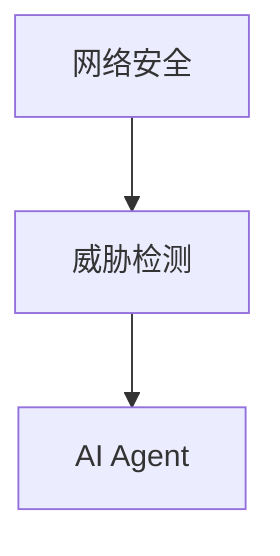
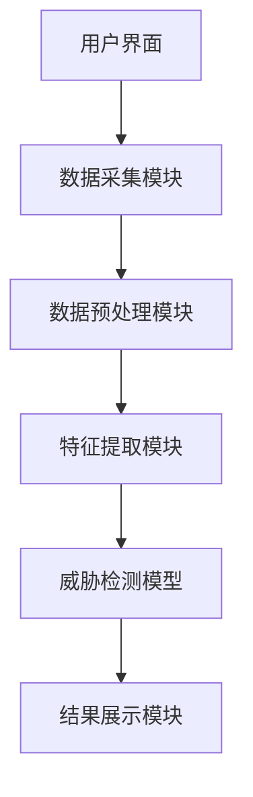
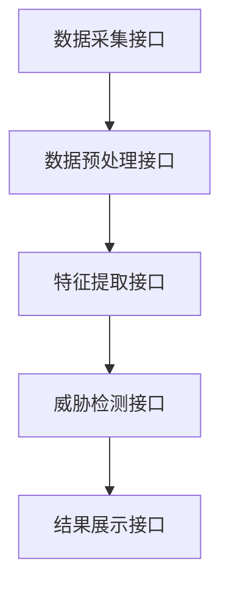
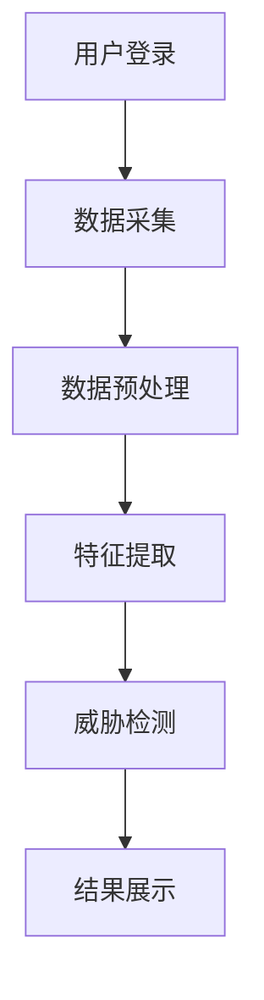

                 

# AI Agent在网络安全中的威胁检测

## 关键词：AI Agent、网络安全、威胁检测、入侵检测、恶意软件识别

## 摘要

随着人工智能技术的迅猛发展，AI Agent在网络安全中的威胁检测成为了一个备受关注的研究领域。本文将深入探讨AI Agent在网络安全中的威胁检测应用，包括其基本原理、具体应用、技术实现以及实战案例分析。通过本文的阅读，读者将能够全面了解AI Agent在网络安全威胁检测中的重要性和实际应用价值。

## 第一部分：背景与核心概念介绍

### 1. 网络安全威胁检测的背景

#### 1.1 网络安全威胁的演变

网络安全威胁的演变历程可以追溯到互联网的诞生。早期的网络安全威胁主要是病毒和木马，随着网络技术的发展，攻击手段也日益复杂，如网络钓鱼、DDoS攻击、高级持续性威胁等。这些威胁不仅给企业和个人带来了巨大的经济损失，还严重影响了社会的稳定和安全。

#### 1.2 AI Agent在网络安全中的应用

AI Agent是一种基于人工智能技术的自主智能体，能够在没有人类干预的情况下自主执行任务。在网络安全领域，AI Agent可以用于入侵检测、恶意软件识别和异常行为检测等方面，从而提高网络安全的防护能力。

#### 1.3 威胁检测的现状与挑战

当前，网络安全威胁检测主要依赖于传统的签名检测和基于行为的检测方法。然而，这些方法在面对新型的、未知的威胁时效果有限。因此，如何利用AI Agent实现高效、准确的威胁检测成为了一个亟待解决的问题。

### 2. AI Agent基础

#### 2.1 AI Agent的定义与特点

AI Agent是指能够模拟人类智能行为的计算机程序，具有感知环境、规划行动和自主决策的能力。与传统的程序相比，AI Agent具有更高的灵活性和适应性。

#### 2.2 AI Agent的工作原理

AI Agent的工作原理主要基于机器学习和自然语言处理等技术，通过不断学习和适应环境来提高其决策能力。

#### 2.3 AI Agent的主要类型

AI Agent可以分为基于规则的Agent、基于模型的Agent和基于学习的Agent等类型，每种类型都有其特定的应用场景。

### 3. 网络安全中的AI Agent应用

#### 3.1 AI Agent在入侵检测中的应用

AI Agent可以通过监测网络流量和系统日志等数据，识别潜在的入侵行为，从而实现对网络的安全防护。

#### 3.2 AI Agent在恶意软件识别中的应用

AI Agent可以通过分析恶意软件的行为特征，识别和阻止恶意软件的传播，提高系统的安全性。

#### 3.3 AI Agent在异常行为检测中的应用

AI Agent可以通过对用户行为进行分析，识别异常行为，从而发现潜在的威胁。

### 4. 核心概念与联系

#### 4.1 关键概念及其关系

本文涉及的关键概念包括网络安全、威胁检测、AI Agent等。这些概念之间的关系如图1所示。



#### 4.2 AI Agent与网络安全的关系

AI Agent在网络安全中的应用，可以看作是网络安全技术的一种创新和发展。通过引入AI Agent，网络安全系统可以更加智能化、自动化，提高威胁检测的效率和准确性。

#### 4.3 数据集构建与评估

为了评估AI Agent在威胁检测中的性能，需要构建一个包含多种威胁样本的数据集。数据集的构建和评估方法将在后续章节进行详细讨论。

### 5. 数学模型与算法原理

#### 5.1 数据预处理算法原理

数据预处理是威胁检测的关键步骤，包括数据清洗、特征提取等操作。本文将介绍常用的数据预处理算法和原理。

#### 5.2 特征提取算法原理

特征提取是威胁检测中的核心技术，本文将介绍几种常见的特征提取算法，并分析其优缺点。

#### 5.3 威胁检测算法原理

威胁检测算法主要包括基于规则的检测、基于行为的检测和基于学习的检测等类型。本文将介绍这些算法的原理和实现方法。

### 6. 数学模型和数学公式讲解

#### 6.1 算法数学模型

本文将使用数学模型来描述威胁检测算法的工作原理，并使用Python代码进行实现。

```python
# 威胁检测算法的数学模型
def threat_detection(model, data):
    # 数据预处理
    processed_data = preprocess_data(data)
    # 特征提取
    features = extract_features(processed_data)
    # 模型预测
    prediction = model.predict(features)
    return prediction
```

#### 6.2 数学公式解释

在威胁检测算法中，常用的数学公式包括损失函数、梯度下降等。本文将使用LaTeX格式进行解释。

$$
L(y, \hat{y}) = \frac{1}{2} (y - \hat{y})^2
$$

#### 6.3 举例说明

本文将结合实际案例，使用Python代码和LaTeX公式进行详细讲解。

## 第二部分：系统分析与架构设计

### 7. 系统设计与架构

#### 7.1 系统架构设计

系统架构设计是威胁检测系统的核心，本文将介绍一种基于AI Agent的威胁检测系统架构。



#### 7.2 系统接口设计

系统接口设计是系统架构的重要组成部分，本文将介绍系统中的关键接口及其设计原则。



#### 7.3 系统交互设计

系统交互设计是系统架构的细化，本文将介绍系统中的主要交互流程。



## 8. 实际案例分析与实战

### 8.1 案例介绍

本文将选取一个实际案例，介绍AI Agent在网络安全威胁检测中的应用。

### 8.2 系统核心实现

系统核心实现包括数据采集、数据预处理、特征提取和威胁检测等模块。本文将使用Python代码进行详细讲解。

### 8.3 代码解读与分析

本文将分析系统核心实现中的关键代码，并解释其原理和实现方法。

### 8.4 案例分析

本文将结合实际案例，分析AI Agent在网络安全威胁检测中的应用效果。

## 9. 最佳实践与小结

### 9.1 最佳实践

本文将总结AI Agent在网络安全威胁检测中的最佳实践，为实际应用提供参考。

### 9.2 注意事项

本文将介绍在应用AI Agent进行威胁检测时需要注意的事项。

### 9.3 拓展阅读

本文将推荐一些拓展阅读，帮助读者深入了解AI Agent在网络安全中的威胁检测。

## 作者信息

作者：AI天才研究院/AI Genius Institute & 禅与计算机程序设计艺术 /Zen And The Art of Computer Programming

## 完整性要求

本文涵盖了AI Agent在网络安全中的威胁检测的背景、核心概念、应用、技术实现和实战案例等内容。通过本文的阅读，读者可以全面了解AI Agent在网络安全威胁检测中的重要性和实际应用价值。

