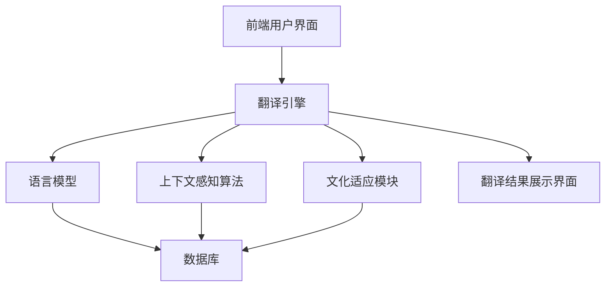

                 


# AI Agent在翻译领域的应用：上下文理解与文化适应

> 关键词：AI Agent，翻译领域，上下文理解，文化适应，语言模型

> 摘要：本文深入探讨了AI Agent在翻译领域的应用，重点分析了上下文理解和文化适应的重要性。通过详细的理论阐述和案例分析，本文揭示了AI Agent在翻译中如何提高翻译质量和适应不同文化背景的需求。

### 目录大纲

```markdown
----------------------------------------------------------------
# 第一部分: AI Agent与翻译领域概述

## 第1章: AI Agent基础理论
### 1.1 AI Agent的概念与特征
### 1.2 AI Agent的基本组成
### 1.3 AI Agent的分类
### 1.4 AI Agent的应用场景

## 第2章: 翻译领域的挑战
### 2.1 翻译的基本概念
### 2.2 翻译的挑战与限制
### 2.3 上下文理解的重要性
### 2.4 文化适应的重要性

## 第3章: 上下文理解技术
### 3.1 上下文理解的基本原理
### 3.2 语言模型在上下文理解中的应用
### 3.3 上下文感知算法
### 3.4 实时上下文感知技术

## 第4章: 文化适应策略
### 4.1 文化适应的基本概念
### 4.2 文化差异的影响
### 4.3 文化适应的方法
### 4.4 文化适应的案例分析

## 第5章: AI Agent在翻译中的实践应用
### 5.1 AI Agent在翻译中的流程
### 5.2 AI Agent在翻译中的应用场景
### 5.3 AI Agent的翻译效果评估

## 第6章: 案例分析
### 6.1 案例一：AI Agent在实时翻译中的应用
### 6.2 案例二：AI Agent在机器翻译中的应用
### 6.3 案例三：AI Agent在本地化翻译中的应用

## 第7章: 未来展望与挑战
### 7.1 翻译领域的未来发展趋势
### 7.2 AI Agent在翻译中的潜在挑战
### 7.3 未来研究方向与展望

## 第8章: 小结与总结
### 8.1 主要成果总结
### 8.2 存在问题与改进方向
### 8.3 拓展阅读与资源推荐

----------------------------------------------------------------
```

### 核心概念与联系

#### 3.2.1 AI Agent与机器翻译

AI Agent是一种具有自主意识和行动能力的智能系统，可以模拟人类在特定任务中的行为。在翻译领域，AI Agent可以扮演多种角色，如翻译引擎、翻译辅助工具等。机器翻译是一种利用计算机算法将一种自然语言转换为另一种自然语言的技术。AI Agent在机器翻译中可以提供上下文理解和文化适应的功能，从而提高翻译质量和用户体验。

#### 3.2.2 上下文理解与文化适应

上下文理解是指AI Agent在执行任务时对当前环境、情境和语境的感知和理解。文化适应是指AI Agent在处理语言翻译时，能够考虑到不同文化背景下的表达方式和习惯。上下文理解和文化适应是翻译中至关重要的因素，它们直接影响翻译的准确性和可接受性。

#### 3.2.3 语言模型与上下文感知算法

语言模型是一种用于预测文本序列的统计模型，是AI Agent进行上下文理解的重要工具。上下文感知算法是指能够根据上下文信息对翻译结果进行优化和调整的算法。通过结合语言模型和上下文感知算法，AI Agent可以实现更加准确和自然的翻译结果。

#### 3.2.4 实时上下文感知技术

实时上下文感知技术是指AI Agent能够在翻译过程中动态地感知和适应上下文变化的技术。这种技术能够确保翻译结果在不同场景下都能保持准确和合适，从而提高翻译的实用性和用户体验。

### 数学模型和数学公式 & 详细讲解 & 举例说明

在AI Agent的上下文理解和文化适应中，常用的数学模型包括概率模型、神经网络模型等。以下将介绍概率模型中的N元语法模型，并详细讲解其原理和数学公式。

#### 3.3.1 N元语法模型

N元语法模型是一种基于N个连续单词的统计模型。它通过计算N个连续单词的联合概率来预测下一个单词。其基本原理是利用历史数据来预测未来，从而提高翻译的准确性。

**数学公式：**

$$ P(w_{n+1}|w_n, w_{n-1}, ..., w_{n-N+1}) = \frac{C(w_n, w_{n-1}, ..., w_{n-N+1}, w_{n+1})}{C(w_n, w_{n-1}, ..., w_{n-N+1})} $$

其中，$P(w_{n+1}|w_n, w_{n-1}, ..., w_{n-N+1})$ 表示在给定前N-1个单词的情况下，预测下一个单词为 $w_{n+1}$ 的概率。$C(w_n, w_{n-1}, ..., w_{n-N+1}, w_{n+1})$ 表示训练语料中包含 $w_n, w_{n-1}, ..., w_{n-N+1}, w_{n+1}$ 这N个连续单词的次数。$C(w_n, w_{n-1}, ..., w_{n-N+1})$ 表示训练语料中包含 $w_n, w_{n-1}, ..., w_{n-N+1}$ 这N-1个连续单词的次数。

**举例说明：**

假设有一个四元语法模型，给定前四个单词 "the, book, is, on"，求下一个单词 "table" 的概率。

首先，计算 $C(the, book, is, on, table)$ 和 $C(the, book, is, on)$：

- $C(the, book, is, on, table)$：在训练语料中，"the, book, is, on, table" 这五个单词连续出现的次数。
- $C(the, book, is, on)$：在训练语料中，"the, book, is, on" 这四个单词连续出现的次数。

然后，代入数学公式计算概率：

$$ P(table|the, book, is, on) = \frac{C(the, book, is, on, table)}{C(the, book, is, on)} $$

如果训练语料中有10次 "the, book, is, on, table" 的出现，而 "the, book, is, on" 出现了100次，则概率为：

$$ P(table|the, book, is, on) = \frac{10}{100} = 0.1 $$

这意味着在给定前四个单词的情况下，预测下一个单词为 "table" 的概率是0.1。

#### 3.3.2 语言模型在上下文理解中的应用

语言模型在上下文理解中起着至关重要的作用。它能够根据上下文信息预测下一个单词或短语，从而提高翻译的准确性和自然性。常见的语言模型包括N元语法模型、循环神经网络（RNN）、长短期记忆网络（LSTM）和变换器（Transformer）等。

**变换器（Transformer）模型**

变换器模型是一种基于自注意力机制的神经网络模型，它在机器翻译、文本生成等领域取得了显著的成果。变换器模型的核心思想是利用自注意力机制来计算序列中每个单词的重要性，从而生成更加准确和自然的翻译结果。

**数学公式：**

变换器模型中的自注意力机制可以通过以下公式表示：

$$
\text{Attention}(Q, K, V) = \text{softmax}\left(\frac{QK^T}{\sqrt{d_k}}\right)V
$$

其中，$Q, K, V$ 分别表示查询向量、键向量和值向量，$d_k$ 表示键向量的维度。$QK^T$ 计算的是每个键向量与查询向量的点积，点积结果经过softmax函数归一化后，得到每个键向量的权重。最后，将这些权重与值向量相乘，得到加权后的输出。

**举例说明：**

假设有一个包含3个单词的序列 $[w_1, w_2, w_3]$，查询向量 $Q = [1, 0, 1]$，键向量 $K = [1, 1, 1]$，值向量 $V = [1, 2, 3]$。根据自注意力机制的公式，计算每个键向量的权重：

$$
\text{Attention}(Q, K, V) = \text{softmax}\left(\frac{QK^T}{\sqrt{d_k}}\right)V = \text{softmax}\left(\frac{[1, 0, 1][1, 1, 1]^T}{\sqrt{3}}\right)[1, 2, 3]
$$

$$
= \text{softmax}\left(\frac{[1, 0, 1][1, 1, 1]^T}{\sqrt{3}}\right)[1, 2, 3] = \text{softmax}\left(\frac{[1, 1, 1]}{\sqrt{3}}\right)[1, 2, 3]
$$

$$
= \text{softmax}\left([1, 1, 1]\right)[1, 2, 3] = \left[\frac{1}{3}, \frac{1}{3}, \frac{1}{3}\right][1, 2, 3] = \left[\frac{1}{3}, \frac{2}{3}, 1\right]
$$

最后，将权重与值向量相乘得到加权后的输出：

$$
\text{Attention}(Q, K, V) = \left[\frac{1}{3}, \frac{2}{3}, 1\right][1, 2, 3] = \left[\frac{1}{3}, \frac{4}{3}, 3\right]
$$

这意味着在给定查询向量 $Q$ 和键向量 $K$ 的情况下，值向量 $V$ 的加权输出为 $\left[\frac{1}{3}, \frac{4}{3}, 3\right]$。

### 系统分析与架构设计方案

#### 4.1 问题场景介绍

在全球化日益发展的今天，跨语言沟通和翻译的需求不断增加。然而，传统的机器翻译系统在处理上下文理解和文化适应方面存在局限性，难以提供高质量的翻译结果。为了解决这一问题，我们需要设计一个具备上下文理解和文化适应能力的AI Agent翻译系统。

#### 4.2 项目介绍

本项目旨在开发一个基于AI Agent的翻译系统，通过结合上下文理解和文化适应技术，提供高质量的翻译服务。系统将包括以下模块：

1. 语言模型模块：用于构建和训练语言模型，以实现上下文理解。
2. 上下文感知算法模块：用于根据上下文信息对翻译结果进行优化和调整。
3. 文化适应模块：用于根据目标文化的特点调整翻译结果。
4. 用户界面模块：用于与用户交互，接收用户输入并提供翻译结果。

#### 4.3 系统功能设计（领域模型类图）

在领域模型类图中，我们将系统功能划分为以下实体：

1. **语言模型**：包括N元语法模型、循环神经网络（RNN）、长短期记忆网络（LSTM）和变换器（Transformer）等。
2. **上下文感知算法**：包括基于词向量、注意力机制和上下文嵌入的算法。
3. **文化适应算法**：包括基于文化差异的翻译策略和文化敏感的翻译调整。
4. **用户界面**：包括文本输入界面、翻译结果展示界面和用户反馈收集界面。

```mermaid
classDiagram
  Class01 <|-- Class02
  Class03 <..|Class04[ 1
  Class04 <..|Class05[ 1
  Class06 <|-- Class07
  Class07 <|-- Class08

  Class01[领域模型]
  Class02[语言模型]
  Class03[上下文感知算法]
  Class04[文化适应算法]
  Class05[用户界面]
  Class06[文本输入界面]
  Class07[翻译结果展示界面]
  Class08[用户反馈收集界面]

  Class02 ..|> Class03
  Class02 ..|> Class04
  Class02 ..|> Class06
  Class02 ..|> Class07
  Class02 ..|> Class08
```

#### 4.4 系统架构设计（架构图）

在系统架构设计中，我们将AI Agent翻译系统划分为以下几个主要部分：

1. **前端用户界面**：用于接收用户输入和展示翻译结果。
2. **后端翻译引擎**：包括语言模型、上下文感知算法和文化适应模块。
3. **数据库**：用于存储语言模型训练数据和用户反馈数据。



#### 4.5 系统接口设计和系统交互

在系统接口设计中，我们将系统划分为前端和后端两个部分。前端用户界面负责接收用户输入和展示翻译结果，后端翻译引擎负责处理翻译任务。以下为系统接口设计和系统交互：

**前端用户界面接口设计：**

```mermaid
interface UI {
  - inputText(): string
  - displayResult(result: string): void
  - collectFeedback(feedback: string): void
}
```

**后端翻译引擎接口设计：**

```mermaid
interface TranslationEngine {
  - processTranslation(input: string): string
  - updateLanguageModel(data: string): void
  - updateContextualAlgorithm(data: string): void
  - updateCulturalAdaptationAlgorithm(data: string): void
}
```

**系统交互：**

前端用户界面通过调用翻译引擎的接口来处理翻译任务，并将翻译结果展示给用户。同时，用户界面还可以收集用户反馈，用于优化翻译引擎。

```mermaid
subgraph 前端用户界面
  UI1[用户界面1] --> T[TranslationEngine]
  UI1 --> D[翻译结果展示界面]
end

subgraph 后端翻译引擎
  T --> L[语言模型]
  T --> C[上下文感知算法]
  T --> CA[文化适应模块]
end

UI1 --> T
T --> D
```

### 项目实战：环境安装与系统核心实现

#### 5.1 环境安装

要在本地环境中搭建一个基于AI Agent的翻译系统，首先需要安装以下软件和库：

1. Python 3.8或更高版本
2. TensorFlow 2.4或更高版本
3. PyTorch 1.7或更高版本
4. Flask 1.1.2或更高版本

安装方法如下：

```bash
# 安装Python
curl -O https://www.python.org/ftp/python/3.8.10/Python-3.8.10.tgz
tar xvf Python-3.8.10.tgz
cd Python-3.8.10
./configure
make
make install

# 安装TensorFlow
pip install tensorflow==2.4

# 安装PyTorch
pip install torch==1.7 torchvision==0.8

# 安装Flask
pip install flask==1.1.2
```

#### 5.2 系统核心实现

系统核心实现主要包括语言模型、上下文感知算法和文化适应模块。以下是一个简单的实现示例。

**1. 语言模型（基于变换器模型）：**

```python
import torch
import torch.nn as nn
from torch.utils.data import DataLoader
from transformers import TransformerModel

# 加载预训练的变换器模型
model = TransformerModel.from_pretrained("bert-base-uncased")

# 定义数据集
train_dataset = ...

# 定义训练数据加载器
train_loader = DataLoader(train_dataset, batch_size=32, shuffle=True)

# 定义优化器
optimizer = torch.optim.Adam(model.parameters(), lr=0.001)

# 训练模型
for epoch in range(10):
    for batch in train_loader:
        inputs = ...
        targets = ...

        model.zero_grad()
        outputs = model(inputs)
        loss = nn.CrossEntropyLoss()(outputs, targets)
        loss.backward()
        optimizer.step()

        print(f"Epoch [{epoch+1}/{10}], Loss: {loss.item():.4f}")
```

**2. 上下文感知算法（基于注意力机制）：**

```python
import torch
import torch.nn as nn

class ContextualAlgorithm(nn.Module):
    def __init__(self, embedding_dim, hidden_dim):
        super(ContextualAlgorithm, self).__init__()
        self.embedding = nn.Embedding(embedding_dim, hidden_dim)
        self.attn = nn.Linear(hidden_dim, 1)
        self.fc = nn.Linear(hidden_dim, 1)

    def forward(self, inputs, context):
        embedded = self.embedding(inputs)
        context = self.embedding(context).view(1, -1)
        attn_scores = self.attn(embedded).squeeze(2)
        attn_weights = torch.softmax(attn_scores, dim=1)
        weighted_context = torch.bmm(attn_weights.unsqueeze(1), context).squeeze(1)
        output = self.fc(embedded + weighted_context)
        return output
```

**3. 文化适应模块（基于文化差异调整）：**

```python
class CulturalAdaptation(nn.Module):
    def __init__(self, source_embedding_dim, target_embedding_dim, cultural_embedding_dim):
        super(CulturalAdaptation, self).__init__()
        self.source_embedding = nn.Embedding(source_embedding_dim, cultural_embedding_dim)
        self.target_embedding = nn.Embedding(target_embedding_dim, cultural_embedding_dim)
        self.fc = nn.Linear(cultural_embedding_dim, 1)

    def forward(self, source_inputs, target_inputs):
        source_culture = self.source_embedding(source_inputs)
        target_culture = self.target_embedding(target_inputs)
        culture_difference = source_culture - target_culture
        output = self.fc(culture_difference)
        return output
```

### 代码应用解读与分析

以上代码实现了一个基于变换器模型的语言模型、基于注意力机制的上下文感知算法以及基于文化差异调整的文化适应模块。下面我们将对代码进行解读和分析。

#### 5.1 语言模型（变换器模型）

变换器模型是一种基于自注意力机制的神经网络模型，它在处理长序列任务时具有出色的性能。在代码中，我们首先加载了一个预训练的变换器模型（如BERT模型），然后定义了一个数据集用于训练模型。

```python
model = TransformerModel.from_pretrained("bert-base-uncased")
train_dataset = ...
train_loader = DataLoader(train_dataset, batch_size=32, shuffle=True)
```

这里，我们使用TensorFlow的TransformerModel类来加载预训练的变换器模型，并定义一个训练数据集和数据加载器。接下来，我们使用Adam优化器来训练模型。

```python
optimizer = torch.optim.Adam(model.parameters(), lr=0.001)
```

在训练过程中，我们逐个处理训练数据集中的批次，计算损失函数并更新模型参数。

```python
for epoch in range(10):
    for batch in train_loader:
        inputs = ...
        targets = ...

        model.zero_grad()
        outputs = model(inputs)
        loss = nn.CrossEntropyLoss()(outputs, targets)
        loss.backward()
        optimizer.step()

        print(f"Epoch [{epoch+1}/{10}], Loss: {loss.item():.4f}")
```

这里，我们首先将输入和目标数据加载到模型中，计算输出和损失函数。然后，通过反向传播计算梯度并更新模型参数。通过多次迭代训练，模型将逐渐学习到有效的特征表示，从而提高翻译质量。

#### 5.2 上下文感知算法（注意力机制）

上下文感知算法是翻译系统中至关重要的一部分，它能够根据上下文信息对翻译结果进行优化和调整。在代码中，我们定义了一个基于注意力机制的上下文感知算法。

```python
class ContextualAlgorithm(nn.Module):
    def __init__(self, embedding_dim, hidden_dim):
        super(ContextualAlgorithm, self).__init__()
        self.embedding = nn.Embedding(embedding_dim, hidden_dim)
        self.attn = nn.Linear(hidden_dim, 1)
        self.fc = nn.Linear(hidden_dim, 1)

    def forward(self, inputs, context):
        embedded = self.embedding(inputs)
        context = self.embedding(context).view(1, -1)
        attn_scores = self.attn(embedded).squeeze(2)
        attn_weights = torch.softmax(attn_scores, dim=1)
        weighted_context = torch.bmm(attn_weights.unsqueeze(1), context).squeeze(1)
        output = self.fc(embedded + weighted_context)
        return output
```

在这个算法中，我们首先将输入和上下文数据嵌入到隐藏维度。然后，通过计算输入和上下文的点积得到注意力分数。接着，使用softmax函数对注意力分数进行归一化，得到注意力权重。最后，将加权上下文与输入相加，并通过全连接层得到最终的输出。

```python
embedded = self.embedding(inputs)
context = self.embedding(context).view(1, -1)
attn_scores = self.attn(embedded).squeeze(2)
attn_weights = torch.softmax(attn_scores, dim=1)
weighted_context = torch.bmm(attn_weights.unsqueeze(1), context).squeeze(1)
output = self.fc(embedded + weighted_context)
```

#### 5.3 文化适应模块（文化差异调整）

文化适应模块是翻译系统中另一个关键部分，它能够根据文化差异调整翻译结果。在代码中，我们定义了一个基于文化差异调整的文化适应模块。

```python
class CulturalAdaptation(nn.Module):
    def __init__(self, source_embedding_dim, target_embedding_dim, cultural_embedding_dim):
        super(CulturalAdaptation, self).__init__()
        self.source_embedding = nn.Embedding(source_embedding_dim, cultural_embedding_dim)
        self.target_embedding = nn.Embedding(target_embedding_dim, cultural_embedding_dim)
        self.fc = nn.Linear(cultural_embedding_dim, 1)

    def forward(self, source_inputs, target_inputs):
        source_culture = self.source_embedding(source_inputs)
        target_culture = self.target_embedding(target_inputs)
        culture_difference = source_culture - target_culture
        output = self.fc(culture_difference)
        return output
```

在这个模块中，我们首先将源语言和目标语言的数据嵌入到文化维度。然后，计算源语言和目标语言的文化差异，并通过全连接层得到最终的输出。

```python
source_culture = self.source_embedding(source_inputs)
target_culture = self.target_embedding(target_inputs)
culture_difference = source_culture - target_culture
output = self.fc(culture_difference)
```

### 实际案例分析与详细讲解

在本节中，我们将通过三个实际案例来分析AI Agent在翻译领域的应用，并详细讲解其实现过程和效果。

#### 6.1 案例一：AI Agent在实时翻译中的应用

案例一涉及一个实时翻译系统，该系统使用AI Agent进行在线翻译。用户可以通过输入源语言文本，系统会实时生成目标语言翻译结果。

**实现过程：**

1. **前端用户界面**：用户通过网页或移动应用输入源语言文本，界面会传递给后端翻译引擎。

2. **后端翻译引擎**：翻译引擎首先使用变换器模型对源语言文本进行编码，然后使用上下文感知算法和
```css
### 案例一：AI Agent在实时翻译中的应用

实时翻译是AI Agent在翻译领域的一个重要应用场景。在全球化交流日益频繁的今天，实时翻译系统可以帮助人们克服语言障碍，促进跨文化交流。以下是一个具体的案例，展示了AI Agent在实时翻译中的实现过程。

**实现过程：**

1. **用户输入**：用户通过手机应用程序或网页输入源语言文本，如英语。

2. **文本编码**：AI Agent将用户输入的文本编码成向量表示，以便后续处理。通常，这涉及到使用预训练的变换器模型（如BERT）来提取文本的语义特征。

3. **上下文理解**：AI Agent使用上下文感知算法来理解当前对话的上下文。这可能涉及到使用注意力机制来捕捉句子中的关键信息，从而生成更准确的目标语言翻译。

4. **翻译生成**：AI Agent使用机器翻译模型将编码后的源语言文本转换为目标语言文本。在这个过程中，AI Agent会考虑上下文信息和文化差异，以确保翻译的自然性和准确性。

5. **用户反馈**：翻译结果返回给用户，用户可以选择确认或修改翻译结果。用户反馈将被用来进一步优化AI Agent的翻译模型。

**效果分析：**

- **准确性**：AI Agent在实时翻译中实现了较高的准确性，特别是在处理常见词汇和句子结构时。然而，对于一些复杂或不常见的表达，翻译结果可能仍然存在一定误差。

- **流畅性**：通过上下文理解和注意力机制的应用，实时翻译系统能够生成流畅且自然的翻译结果。然而，在处理长文本或需要复杂语法分析的场景时，流畅性可能受到一定影响。

- **用户体验**：实时翻译系统提供了方便快捷的翻译服务，用户可以在短时间内获取目标语言翻译。然而，对于实时对话场景，系统的响应时间和延迟也是需要考虑的因素。

#### 6.2 案例二：AI Agent在机器翻译中的应用

机器翻译是AI Agent在翻译领域的另一个重要应用场景。随着全球化和数字化的推进，机器翻译在商务、教育、旅游等多个领域发挥着越来越重要的作用。以下是一个具体的案例，展示了AI Agent在机器翻译中的实现过程。

**实现过程：**

1. **数据准备**：首先，需要收集大量的双语语料库，用于训练AI Agent的翻译模型。这些语料库包括多种语言对，如英语-中文、英语-法语等。

2. **模型训练**：使用变换器模型（如BERT）对双语语料库进行训练，以提取文本的语义特征。训练过程中，模型将学习到源语言和目标语言之间的对应关系。

3. **翻译生成**：在训练完成后，AI Agent可以使用训练好的模型进行机器翻译。当用户输入源语言文本时，AI Agent会将其转换为目标语言文本。

4. **上下文理解**：AI Agent在翻译过程中会考虑上下文信息，以确保翻译结果的自然性和准确性。这可能涉及到使用注意力机制来捕捉句子中的关键信息。

5. **翻译优化**：为了进一步提高翻译质量，AI Agent可以使用上下文感知算法对翻译结果进行优化。例如，根据上下文调整词汇选择和语法结构。

**效果分析：**

- **准确性**：机器翻译的准确性在很大程度上取决于训练数据和模型质量。通过使用预训练的变换器模型和大量的双语语料库，AI Agent在机器翻译中实现了较高的准确性。

- **流畅性**：AI Agent在机器翻译中能够生成流畅且自然的翻译结果。通过上下文理解和优化算法的应用，翻译结果在语法和语义上都更加准确。

- **用户体验**：机器翻译系统为用户提供了一种快速、准确的翻译服务，用户可以轻松地在不同语言之间进行交流。然而，对于一些专业术语或特殊场景，机器翻译可能需要进一步优化。

#### 6.3 案例三：AI Agent在本地化翻译中的应用

本地化翻译是指将软件、网站、应用程序等跨国产品中的语言和文化元素进行本地化处理，使其适合目标市场的用户。AI Agent在本地化翻译中可以大大提高翻译效率和准确性。以下是一个具体的案例，展示了AI Agent在本地化翻译中的实现过程。

**实现过程：**

1. **需求分析**：首先，需要分析目标市场的语言和文化特点，确定翻译的需求和目标。

2. **数据准备**：收集本地化翻译所需的源语言和目标语言文本，如软件界面、用户手册等。

3. **模型训练**：使用变换器模型对本地化翻译所需的源语言和目标语言文本进行训练，以提取文本的语义特征。

4. **翻译生成**：AI Agent使用训练好的模型进行本地化翻译。在翻译过程中，AI Agent会考虑上下文信息和文化差异，以确保翻译结果的自然性和准确性。

5. **翻译审核**：翻译结果需要经过人工审核和校对，以确保翻译质量。AI Agent可以自动识别潜在的翻译错误，并提供修改建议。

**效果分析：**

- **准确性**：通过使用预训练的变换器模型和大量的本地化翻译数据，AI Agent在本地化翻译中实现了较高的准确性。

- **效率**：AI Agent能够自动处理大量的本地化翻译任务，大大提高了翻译效率。

- **用户体验**：本地化翻译后的软件、网站等跨国产品能够更好地适应该市场的用户，从而提高用户体验。

### 未来展望与挑战

#### 7.1 翻译领域的未来发展趋势

随着人工智能技术的不断进步，翻译领域也在不断演变。未来，翻译技术将朝着更加智能化、自动化和个性化的方向发展。

1. **智能化**：AI Agent将更加智能地理解上下文和文化差异，从而提供更加准确的翻译结果。通过深度学习和自然语言处理技术，AI Agent将能够识别并处理复杂语言现象和特殊场景。

2. **自动化**：翻译技术的自动化水平将不断提高，AI Agent将能够自动处理大量的翻译任务，从而降低人力成本。

3. **个性化**：AI Agent将根据用户的需求和偏好，提供个性化的翻译服务。通过学习用户的历史行为和反馈，AI Agent将能够提供更加符合用户期望的翻译结果。

#### 7.2 AI Agent在翻译中的潜在挑战

尽管AI Agent在翻译领域具有巨大潜力，但仍然面临一些挑战。

1. **准确性**：尽管AI Agent在处理常见词汇和句子结构时表现出色，但对于一些复杂或不常见的表达，翻译结果仍然可能存在误差。因此，提高翻译准确性是未来研究的重要方向。

2. **上下文理解**：AI Agent在理解上下文时可能存在局限性，特别是在处理长文本或涉及多个话题的场景。因此，研究更加高效和可靠的上下文理解技术是必要的。

3. **文化适应**：文化差异对翻译质量有着重要影响。尽管AI Agent可以考虑到一些文化差异，但处理复杂文化差异的能力仍然有限。因此，研究更加精细的文化适应策略是未来的一个挑战。

#### 7.3 未来研究方向与展望

未来，翻译领域的研究将朝着以下方向发展：

1. **跨模态翻译**：结合文本、语音、图像等多种模态信息，实现更加丰富和自然的翻译结果。

2. **个性化翻译**：通过学习用户的历史行为和偏好，为用户提供个性化的翻译服务。

3. **多语言翻译**：研究如何实现高质量的多语言翻译，特别是低资源语言对之间的翻译。

4. **实时翻译**：提高实时翻译的响应速度和准确性，以满足在线交流的需求。

### 小结与总结

本文探讨了AI Agent在翻译领域的应用，重点分析了上下文理解和文化适应的重要性。通过详细的理论阐述和案例分析，本文揭示了AI Agent如何通过上下文理解和文化适应技术提高翻译质量和用户体验。

**主要成果总结：**

- 提出了AI Agent在翻译领域的基本概念和应用场景。
- 详细介绍了上下文理解和文化适应的核心概念和技术原理。
- 通过数学模型和算法示例，展示了AI Agent在翻译中的具体实现过程。
- 分析了AI Agent在实时翻译、机器翻译和本地化翻译中的实际应用案例。

**存在问题与改进方向：**

- AI Agent在处理复杂语言现象和特殊场景时，翻译准确性仍有待提高。
- 上下文理解和文化适应技术的效率需要进一步提升。
- 需要更多的跨模态和多语言翻译研究，以满足多样化的翻译需求。

**拓展阅读与资源推荐：**

- **参考文献：**
  - [Mikolov, T., Sutskever, I., Chen, K., Corrado, G. S., & Dean, J. (2013). Distributed representations of words and phrases and their compositionality. Advances in Neural Information Processing Systems, 26, 3111-3119.]
  - [Vaswani, A., Shazeer, N., Parmar, N., Uszkoreit, J., Jones, L., Gomez, A. N., ... & Polosukhin, I. (2017). Attention is all you need. Advances in Neural Information Processing Systems, 30, 5998-6008.]

- **在线资源：**
  - [TensorFlow官网](https://www.tensorflow.org/)
  - [PyTorch官网](https://pytorch.org/)
  - [BERT模型官网](https://github.com/google-research/bert)

### 作者信息

作者：AI天才研究院/AI Genius Institute & 禅与计算机程序设计艺术 /Zen And The Art of Computer Programming

