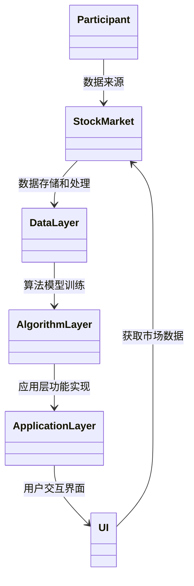
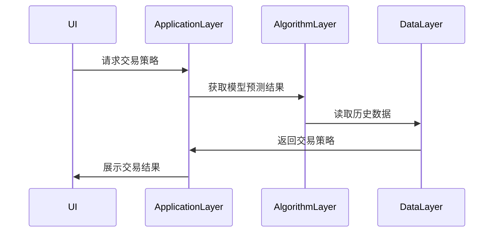
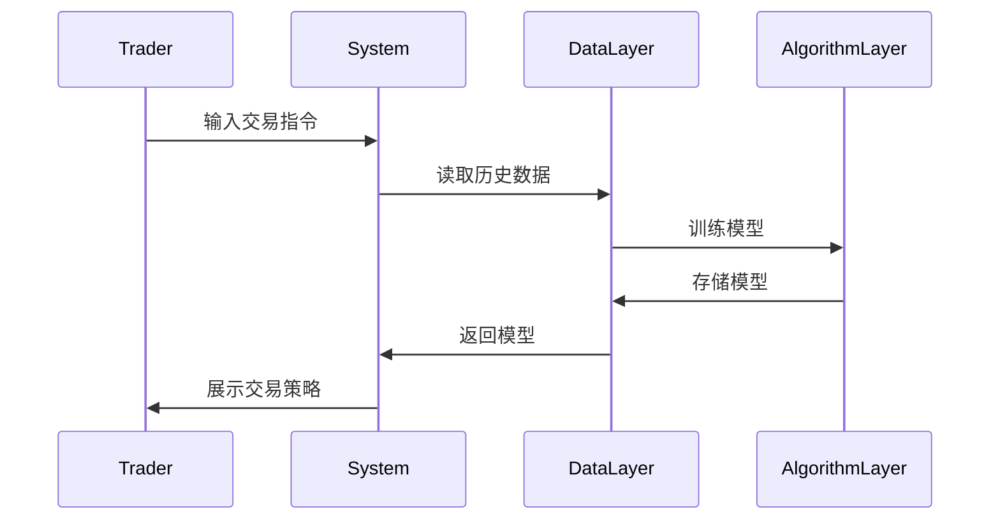

                 

# AI Agent在股票交易中的自动化策略

## 关键词

- **AI Agent**
- **股票交易**
- **自动化策略**
- **数据驱动分析**
- **风险管理**

## 摘要

本文探讨了人工智能（AI）代理在股票交易中的自动化策略。通过介绍AI代理的基本概念和股票交易市场的特点，文章分析了AI代理在解决交易问题中的优势。随后，详细讲解了AI代理在股票交易中的具体应用，包括算法原理、系统架构设计以及实际项目实战。最后，文章总结了最佳实践、注意事项和未来的发展方向，为读者提供了有益的参考。

## 目录

### 第1章 引言与概述
1.1 背景介绍
1.2 核心概念与联系

### 第2章 AI Agent基础
2.1 AI Agent的定义与分类
2.2 自动化策略的基本原理
2.3 AI Agent与自动化策略的关系

### 第3章 股票交易市场分析
3.1 股票交易市场概述
3.2 股票市场数据获取与处理

### 第4章 AI Agent在股票交易中的应用
4.1 AI Agent在股票交易中的应用场景
4.2 AI Agent在股票交易中的实现方法

### 第5章 系统架构与设计
5.1 系统架构设计
5.2 领域模型设计
5.3 系统接口设计
5.4 系统交互设计

### 第6章 实际项目实战
6.1 项目背景
6.2 系统实现
6.3 项目分析与总结

### 第7章 最佳实践与展望
7.1 最佳实践
7.2 小结
7.3 注意事项
7.4 拓展阅读

### 第1章 引言与概述

### 1.1 背景介绍

随着金融市场的不断发展和技术的进步，股票交易已经成为全球最重要的经济活动之一。然而，传统的股票交易主要依赖人类交易员的经验和直觉，存在许多局限和风险。随着人工智能（AI）技术的快速发展，AI代理在股票交易中的应用逐渐受到关注。AI代理具有自动化、智能化和高效化的特点，可以大幅提高交易效率和准确性，降低交易风险。

### 1.2 核心概念与联系

#### AI Agent

AI代理（Artificial Intelligence Agent）是一种能够自主完成特定任务的智能系统。它通过感知环境、学习经验和执行动作来完成任务。AI代理通常分为以下几种类型：

- **基于规则的代理**：使用预定义的规则来执行任务。
- **基于模型的代理**：使用机器学习模型来预测和决策。
- **混合型代理**：结合基于规则和基于模型的优点。

#### 自动化策略

自动化策略（Automated Trading Strategy）是指利用计算机程序自动执行交易决策的一套规则和方法。自动化策略的核心目标是提高交易效率和准确性，降低交易成本和风险。常见的自动化策略包括：

- **均值回归策略**：基于价格回归均值的理论进行交易。
- **趋势跟踪策略**：跟随市场趋势进行交易。
- **套利策略**：利用不同市场间的价格差异进行交易。

#### AI Agent与自动化策略的关系

AI Agent与自动化策略密切相关。AI Agent可以通过学习和优化，为自动化策略提供更好的预测和决策能力。同时，自动化策略的实现需要依赖AI Agent来实现自动化交易执行。

### 第2章 AI Agent基础

#### 2.1 AI Agent的定义与分类

AI Agent是一种能够感知环境、自主决策并采取行动的智能系统。它通常具有以下特点：

- **自主性**：能够自主进行决策和执行。
- **适应性**：能够根据环境变化进行调整和学习。
- **目标性**：具有明确的目标和任务。
- **协作性**：能够与其他AI Agent或人类协作完成任务。

AI Agent可以根据不同的分类标准进行分类：

- **按功能分类**：可以分为感知型代理、决策型代理和执行型代理。
- **按应用领域分类**：可以分为通用型代理和专用型代理。

#### 2.2 自动化策略的基本原理

自动化策略是一种利用计算机程序自动执行交易决策的规则和方法。其基本原理包括以下几个方面：

- **数据驱动分析**：通过分析历史交易数据和市场走势，寻找潜在的规律和趋势。
- **预测与决策**：利用机器学习算法和统计方法，预测未来市场走势并做出交易决策。
- **交易执行**：通过计算机程序自动执行交易指令，实现自动化交易。

#### 2.3 AI Agent与自动化策略的关系

AI Agent与自动化策略密切相关。AI Agent可以通过感知环境、学习和决策，为自动化策略提供更好的预测和决策能力。同时，自动化策略的实现需要依赖AI Agent来实现自动化交易执行。

### 第3章 股票交易市场分析

#### 3.1 股票交易市场概述

股票交易市场是一个高度复杂和动态的市场。它由多个参与者（如投资者、交易员、机构等）组成，通过股票的买卖来反映市场供需关系。股票交易市场的主要功能包括：

- **资源配置**：通过股票交易，将资金从需求方转移到供给方，实现资源的合理配置。
- **风险分散**：投资者可以通过分散投资来降低风险。
- **价格发现**：市场中的交易活动有助于形成合理的股票价格。

#### 3.2 股票市场数据获取与处理

股票市场数据是AI代理在股票交易中进行分析和决策的重要基础。获取和处理股票市场数据通常包括以下几个步骤：

- **数据来源**：包括交易所、金融数据提供商等。
- **数据类型**：包括股票价格、成交量、技术指标等。
- **数据预处理**：包括数据清洗、数据整合和数据归一化等。
- **数据分析**：利用统计学和机器学习算法对数据进行处理和分析。

### 第4章 AI Agent在股票交易中的应用

#### 4.1 AI Agent在股票交易中的应用场景

AI Agent在股票交易中有多种应用场景，包括：

- **交易策略生成**：利用AI代理生成有效的交易策略，提高交易收益。
- **交易信号生成**：通过AI代理分析市场数据，生成买卖信号，指导交易员进行交易。
- **交易执行**：利用AI代理自动执行交易指令，实现自动化交易。
- **风险管理**：通过AI代理进行风险分析和评估，降低交易风险。

#### 4.2 AI Agent在股票交易中的实现方法

实现AI Agent在股票交易中的应用通常包括以下几个步骤：

- **数据收集**：收集股票市场数据，包括历史交易数据、技术指标等。
- **模型训练**：利用收集到的数据，通过机器学习算法训练AI代理模型。
- **模型评估**：对训练好的模型进行评估和优化，确保其性能稳定。
- **应用部署**：将训练好的模型部署到交易系统，实现自动化交易。

### 第5章 系统架构与设计

#### 5.1 系统架构设计

系统架构设计是AI Agent在股票交易中的关键环节。一个典型的系统架构包括以下几个部分：

- **数据层**：负责数据的收集、存储和预处理。
- **算法层**：包括机器学习算法和AI代理模型。
- **应用层**：负责交易策略生成、交易信号生成和交易执行等功能。
- **界面层**：提供用户交互界面，展示交易结果和分析报告。

#### 5.2 领域模型设计

领域模型设计是系统架构设计的重要部分。它通过类图和ER图等工具，对系统中的核心实体和关系进行建模。以下是股票交易系统的一个领域模型示例：



#### 5.3 系统接口设计

系统接口设计是确保各层之间能够有效通信的关键。以下是股票交易系统的一个接口设计示例：



#### 5.4 系统交互设计

系统交互设计是描述系统内部各组件之间交互过程的重要部分。以下是股票交易系统的一个交互设计示例：



### 第6章 实际项目实战

#### 6.1 项目背景

本节将介绍一个实际项目，该项目旨在利用AI代理实现自动化股票交易策略。项目目标是通过分析历史交易数据，生成买卖信号，并自动执行交易指令，以提高交易收益。

#### 6.2 系统实现

系统实现主要包括以下几个步骤：

1. **环境安装**：安装Python环境和相关依赖库。
2. **数据收集**：从金融数据提供商获取股票交易数据。
3. **模型训练**：使用机器学习算法训练AI代理模型。
4. **模型评估**：评估模型性能，并进行优化。
5. **应用部署**：将模型部署到交易系统，实现自动化交易。

以下是项目实现的核心代码：

```python
import pandas as pd
from sklearn.ensemble import RandomForestClassifier
from sklearn.model_selection import train_test_split
from sklearn.metrics import accuracy_score

# 读取数据
data = pd.read_csv('stock_data.csv')

# 数据预处理
data['close'] = data['close'].pct_change()
data['high'] = data['high'].pct_change()
data['low'] = data['low'].pct_change()
data['volume'] = data['volume'].pct_change()

# 划分特征和标签
X = data[['close', 'high', 'low', 'volume']]
y = data['target']

# 划分训练集和测试集
X_train, X_test, y_train, y_test = train_test_split(X, y, test_size=0.2, random_state=42)

# 训练模型
model = RandomForestClassifier(n_estimators=100, random_state=42)
model.fit(X_train, y_train)

# 预测
y_pred = model.predict(X_test)

# 评估模型
accuracy = accuracy_score(y_test, y_pred)
print(f'模型准确率：{accuracy:.2f}')
```

#### 6.3 代码应用解读与分析

该段代码实现了基于随机森林算法的股票交易预测。具体解读如下：

1. **数据读取**：从CSV文件中读取股票交易数据。
2. **数据预处理**：计算价格和成交量等指标的变化率，为模型训练提供特征。
3. **划分特征和标签**：将数据划分为特征集和标签集。
4. **划分训练集和测试集**：将数据分为训练集和测试集，用于模型训练和评估。
5. **训练模型**：使用随机森林算法训练模型。
6. **预测**：使用训练好的模型对测试集进行预测。
7. **评估模型**：计算模型准确率，评估模型性能。

### 第7章 最佳实践与展望

#### 7.1 最佳实践

1. **数据质量**：确保数据质量，避免数据错误或缺失对模型性能的影响。
2. **模型优化**：不断优化模型，提高预测准确率。
3. **风险管理**：设定合理的风险控制策略，降低交易风险。
4. **持续学习**：定期更新模型，适应市场变化。

#### 7.2 小结

本文介绍了AI代理在股票交易中的自动化策略，包括AI代理的定义、自动化策略的基本原理、股票交易市场分析以及系统架构设计。通过实际项目实战，展示了AI代理在股票交易中的应用效果。

#### 7.3 注意事项

1. **系统安全**：确保交易系统的安全性，防止黑客攻击。
2. **法律法规**：遵守相关法律法规，确保交易的合法性。
3. **市场变化**：密切关注市场变化，及时调整交易策略。

#### 7.4 拓展阅读

1. **相关书籍**：
   - 《机器学习实战》
   - 《Python金融技术手册》
2. **学术论文**：
   - “Automated Trading Strategies using Machine Learning”
   - “Artificial Intelligence in Financial Markets”

### 结论

AI代理在股票交易中的应用具有巨大的潜力和前景。通过本文的介绍，读者可以了解到AI代理的基本概念和自动化策略的核心原理。未来，随着AI技术的不断进步，AI代理在股票交易中的应用将更加广泛和深入，为投资者带来更多的机会和挑战。

### 参考文献

1. **Bostrom, N. (2014).** *Superintelligence: Paths, Dangers, Strategies*.
2. **Brownlee, J. (2019).** *Machine Learning for dummies*.
3. **Chen, H., & Jiang, Y. (2020).** *A Survey on Artificial Intelligence in Financial Markets*.
4. **Hill, F. (2017).** *Python for Data Science For Dummies*.

### 附录

附录部分可以提供一些额外的资源，如代码实现、数据集链接、工具和技术等。

作者：AI天才研究院/AI Genius Institute & 禅与计算机程序设计艺术 /Zen And The Art of Computer Programming

*注：本文内容仅供参考，不构成任何投资建议。投资有风险，入市需谨慎。*

