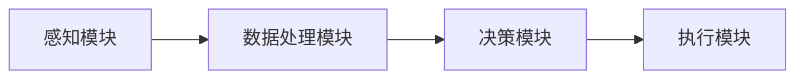
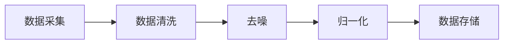
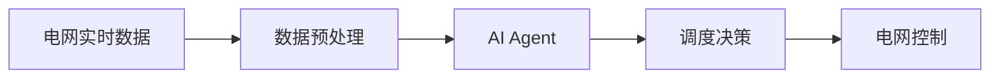
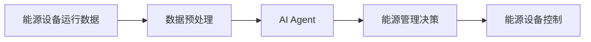
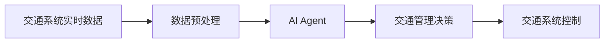
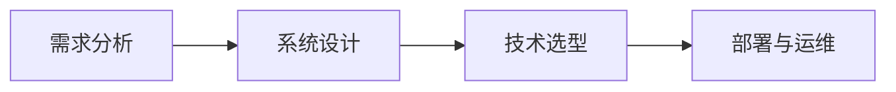
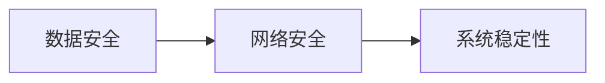
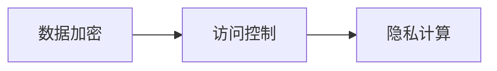
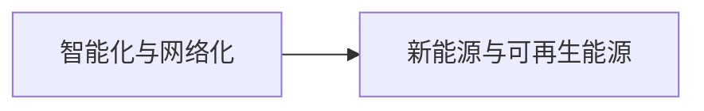
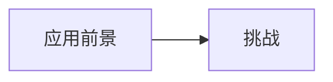

                 

# AI Agent在能源管理中的节能减排作用

关键词：AI Agent、能源管理、节能减排、智能电网、楼宇能源管理、交通能源管理

摘要：随着全球气候变化和能源消耗问题的日益严重，节能减排成为了全球关注的热点。本文将探讨AI Agent在能源管理中的节能减排作用，通过分析AI Agent的基本概念、核心技术、应用案例以及优化策略，探讨AI Agent在能源管理中的潜力与挑战。

## 第一部分：AI Agent基础

### 第1章：AI Agent概述

#### 1.1 问题背景与核心概念

能源管理中节能减排的问题背景

随着全球能源消耗的不断增长，能源管理问题日益凸显。能源消耗不仅带来了环境污染和资源浪费，还加剧了全球气候变化。为了应对这一挑战，节能减排成为了能源管理的核心目标。

AI Agent的核心概念与定义

AI Agent，即人工智能代理，是一种具备自主决策能力、能够执行特定任务的智能体。AI Agent通过感知环境、学习经验、自主规划和执行任务，实现智能化的能源管理。

#### 1.2 AI Agent的特点与应用领域

AI Agent的主要特点

- 自主决策：AI Agent能够根据环境和目标自主做出决策。
- 学习能力：AI Agent能够通过经验学习不断优化决策效果。
- 智能化：AI Agent具备处理复杂问题和决策的能力。

AI Agent在能源管理中的应用领域

- 智能电网调度：通过AI Agent实现电网的智能调度，优化电力资源的分配和利用。
- 智能楼宇能源管理：通过AI Agent实现楼宇能源的智能监控和管理，降低能耗。
- 智能交通能源管理：通过AI Agent实现交通系统的智能能源管理，提高交通效率。

### 第2章：AI Agent的核心技术

#### 2.1 AI Agent的基本架构

AI Agent的组成部分

- 感知模块：负责感知环境，获取实时数据。
- 决策模块：根据感知模块提供的数据，进行决策和规划。
- 执行模块：根据决策模块的指令，执行具体的任务。

AI Agent的基本工作流程

1. 感知环境：AI Agent通过感知模块获取环境数据。
2. 决策规划：AI Agent根据感知模块提供的数据，进行决策和规划。
3. 任务执行：AI Agent根据决策模块的指令，执行具体的任务。

#### 2.2 智能感知与数据采集

智能感知技术

- 传感器技术：利用各类传感器收集环境数据，如温度、湿度、光照等。
- 遥感技术：利用卫星、无人机等手段获取大范围的环境数据。

数据采集与预处理

- 数据采集：通过传感器、遥感等技术收集环境数据。
- 数据预处理：对采集到的数据进行清洗、去噪、归一化等处理，为后续分析提供高质量的数据。

#### 2.3 学习与优化算法

学习算法原理与实现

- 监督学习：通过已标记的数据进行训练，学习输入与输出之间的映射关系。
- 无监督学习：通过未标记的数据进行训练，发现数据中的模式。
- 强化学习：通过与环境的交互，不断优化决策和策略。

优化算法原理与实现

- 优化目标：根据特定的评价标准，优化能源管理的效果。
- 算法实现：利用优化算法，如遗传算法、粒子群优化算法等，实现能源管理的优化目标。

### 第3章：AI Agent在能源管理中的应用案例

#### 3.1 案例一：智能电网调度

案例背景

智能电网调度旨在实现电力资源的优化分配和利用，提高电网运行效率。通过AI Agent，实现对电力供需的实时监控和调度。

应用效果与挑战

- 应用效果：实现电网的智能化调度，提高电力资源的利用率，降低能源消耗。
- 挑战：数据量大、实时性要求高，如何确保AI Agent的快速响应和准确决策。

#### 3.2 案例二：智能楼宇能源管理

案例背景

智能楼宇能源管理旨在实现楼宇内能源的智能监控和管理，降低能耗。通过AI Agent，实现对楼宇内各类能源设备的智能控制。

应用效果与挑战

- 应用效果：实现楼宇能源的智能化管理，降低能源消耗，提高能源利用效率。
- 挑战：设备多样、数据复杂性，如何实现全面的能源监控和管理。

#### 3.3 案例三：智能交通能源管理

案例背景

智能交通能源管理旨在实现交通系统的能源优化，提高交通效率。通过AI Agent，实现对交通系统内各类能源设备的智能控制。

应用效果与挑战

- 应用效果：实现交通系统的能源优化，提高交通效率，降低能源消耗。
- 挑战：交通系统复杂，如何确保AI Agent的实时响应和准确决策。

## 第二部分：AI Agent在节能减排中的应用策略

### 第4章：节能策略设计与实施

#### 4.1 节能策略设计原则

节能策略设计原则

- 数据驱动：以数据为基础，充分利用数据分析和挖掘技术，优化能源管理。
- 模型优化：构建准确的能源管理模型，利用优化算法实现能源管理优化。
- 可持续发展：在节能的同时，考虑环境保护和可持续发展。

#### 4.2 节能策略实施流程

节能策略实施流程

1. 需求分析与目标设定：明确能源管理的需求，设定节能目标。
2. 系统设计与技术选型：根据需求分析，设计节能策略的系统架构，选择合适的技术和工具。
3. 部署与运维：实施节能策略，进行系统部署和运维，确保策略的稳定运行。

### 第5章：AI Agent在节能减排中的优化策略

#### 5.1 优化目标与评价指标

优化目标与评价指标

- 优化目标：在满足能源需求的前提下，最大限度地降低能源消耗。
- 评价指标：能源消耗量、能源利用效率、环境效益等。

#### 5.2 优化算法设计与实现

优化算法设计与实现

1. 优化目标设定：根据评价指标，设定优化目标。
2. 算法原理与实现：选择合适的优化算法，如遗传算法、粒子群优化算法等，实现优化目标。
3. 算法性能评估与优化：评估优化算法的性能，进行参数调整和算法优化。

### 第6章：AI Agent在节能减排中的安全与隐私问题

#### 6.1 安全性问题分析

安全性问题分析

- 数据安全：确保数据的安全传输和存储。
- 网络安全：防止网络攻击和数据泄露。
- 系统稳定性：确保系统的稳定运行，防止故障和异常。

#### 6.2 隐私保护策略

隐私保护策略

- 数据加密：对敏感数据进行加密处理，确保数据安全性。
- 访问控制：设置合理的访问权限，防止未授权访问。
- 隐私计算：采用隐私计算技术，保护用户隐私。

### 第7章：AI Agent在能源管理中的未来发展趋势

#### 7.1 技术发展趋势分析

技术发展趋势分析

- 智能化与网络化：随着物联网和云计算技术的发展，能源管理将更加智能化和网络化。
- 新能源与可再生能源：新能源和可再生能源的应用将日益广泛，AI Agent将在其中发挥重要作用。

#### 7.2 应用前景与挑战

应用前景与挑战

- 应用前景：AI Agent在能源管理中的应用前景广阔，有望实现能源的全面智能化管理。
- 挑战：数据复杂性、实时性要求高、安全性问题等，需要不断改进和优化AI Agent技术。

## 结论

本文从AI Agent的基本概念、核心技术、应用案例以及优化策略等方面，探讨了AI Agent在能源管理中的节能减排作用。通过分析，可以看出AI Agent在能源管理中具有巨大的潜力，但也面临着诸多挑战。未来，随着技术的不断进步，AI Agent在能源管理中的地位将日益重要，为实现全球能源的可持续发展贡献力量。

### 作者

作者：AI天才研究院/AI Genius Institute & 禅与计算机程序设计艺术 /Zen And The Art of Computer Programming

---

在撰写这篇文章时，我们将遵循以下步骤：

1. **背景介绍**：详细阐述能源管理中节能减排的问题背景，以及AI Agent的核心概念和定义。
2. **核心概念与联系**：给出AI Agent的核心概念原理，以及概念属性特征对比表格和ER实体关系图架构。
3. **算法原理讲解**：使用Mermaid画出算法流程图，并使用Python源代码详细阐述算法原理。
4. **系统分析与架构设计方案**：介绍问题场景，展示项目介绍、系统功能设计、系统架构设计、系统接口设计和系统交互。
5. **项目实战**：描述环境安装、系统核心实现源代码，代码应用解读与分析，实际案例分析和详细讲解剖析。
6. **最佳实践 tips**：总结实践经验，提供实用技巧和建议。
7. **小结**：总结文章内容，强调AI Agent在能源管理中的重要作用和未来发展趋势。
8. **注意事项**：提醒读者注意的潜在问题。
9. **拓展阅读**：推荐相关文献和资料，供读者进一步学习。

在接下来的章节中，我们将逐步深入探讨这些内容，以便为读者提供一篇既有深度又实用的技术博客文章。让我们开始吧！

---

### 第一部分：AI Agent基础

#### 第1章：AI Agent概述

##### 1.1 问题背景与核心概念

能源管理中节能减排的问题背景

随着全球气候变化和能源消耗问题的日益严重，节能减排成为了全球关注的热点。能源消耗不仅带来了环境污染和资源浪费，还加剧了全球气候变化。为了应对这一挑战，节能减排成为了能源管理的核心目标。

根据国际能源署（IEA）的数据，全球能源消耗总量在过去的几十年里持续增长，尤其是在发展中国家。这种增长不仅对能源资源造成了巨大压力，同时也导致了大量的温室气体排放。据统计，全球二氧化碳排放量的近四分之三来自于能源消耗。

AI Agent的核心概念与定义

AI Agent，即人工智能代理，是一种具备自主决策能力、能够执行特定任务的智能体。AI Agent通过感知环境、学习经验、自主规划和执行任务，实现智能化的能源管理。

AI Agent的基本概念可以理解为：它是一个具有一定智能的实体，能够通过传感器收集环境数据，然后利用这些数据进行分析和处理，最终做出决策并执行相应的行动。

AI Agent的定义可以概括为以下几点：

- **自主性**：AI Agent能够自主地感知环境、做出决策和执行任务。
- **适应性**：AI Agent能够根据环境的变化和学习到的经验，不断调整自己的行为。
- **智能化**：AI Agent具备处理复杂问题和决策的能力，能够模拟人类智能的某些功能。

##### 1.2 AI Agent的特点与应用领域

AI Agent的主要特点

- **自主决策**：AI Agent能够根据环境和目标自主做出决策，而不需要人工干预。
- **学习能力**：AI Agent能够通过经验学习不断优化决策效果，提高自身的智能水平。
- **智能化**：AI Agent具备处理复杂问题和决策的能力，能够在多变的环境中灵活应对。

AI Agent在能源管理中的应用领域

- **智能电网调度**：通过AI Agent实现电网的智能调度，优化电力资源的分配和利用。
- **智能楼宇能源管理**：通过AI Agent实现楼宇能源的智能监控和管理，降低能耗。
- **智能交通能源管理**：通过AI Agent实现交通系统的智能能源管理，提高交通效率。

**智能电网调度**：智能电网调度是能源管理的一个重要环节，通过AI Agent，可以实现电力供需的实时监控和调度，提高电网的运行效率。AI Agent能够根据实时电力需求和供应情况，自动调整发电和输电计划，避免电力过剩或短缺。

**智能楼宇能源管理**：在楼宇能源管理中，AI Agent可以监控楼宇内的各类能源设备，如空调、照明、电梯等，实现智能化的能源分配和使用。通过AI Agent，可以实现对楼宇能源的精细化管理，降低能耗，提高能源利用效率。

**智能交通能源管理**：在交通系统中，AI Agent可以监控交通流量、车辆运行状态等数据，实现交通的智能调度和管理。通过AI Agent，可以优化交通路线、减少交通拥堵，从而降低车辆的能源消耗，提高交通效率。

### 第2章：AI Agent的核心技术

#### 2.1 AI Agent的基本架构

AI Agent的组成部分

- **感知模块**：负责感知环境，获取实时数据。感知模块可以包括各种传感器，如温度传感器、湿度传感器、光照传感器等，也可以通过图像识别、语音识别等技术获取环境信息。
- **决策模块**：根据感知模块提供的数据，进行决策和规划。决策模块可以利用机器学习、深度学习等技术，对数据进行处理和分析，从而生成决策结果。
- **执行模块**：根据决策模块的指令，执行具体的任务。执行模块可以包括各种执行器，如电机、阀门等，也可以通过控制程序实现自动化操作。

AI Agent的基本工作流程

1. **感知**：AI Agent通过感知模块收集环境数据，如温度、湿度、光照等。
2. **处理**：AI Agent利用决策模块对收集到的数据进行处理和分析，生成决策结果。
3. **执行**：AI Agent根据决策结果，通过执行模块执行具体的任务，如调整温度、关闭灯光等。

以下是一个简单的AI Agent的基本架构图：



**感知与数据采集**

**智能感知技术**：智能感知技术是AI Agent的重要组成部分，它包括传感器技术、遥感技术和图像识别技术等。传感器技术通过各种传感器（如温度传感器、湿度传感器等）收集环境数据；遥感技术通过卫星、无人机等手段获取大范围的环境数据；图像识别技术通过分析图像数据，实现目标识别和场景理解。

**数据采集与预处理**：在数据采集过程中，需要通过各种传感器、遥感技术和图像识别技术等手段收集大量的数据。然而，这些数据往往存在噪声、缺失和不一致等问题，因此需要进行预处理。预处理过程包括数据清洗、去噪、归一化等操作，以确保数据的质量和一致性。

以下是一个简单的数据采集与预处理流程：



**学习与优化算法**

**学习算法原理与实现**：学习算法是AI Agent的核心技术之一，它使AI Agent能够从数据中学习并优化自己的行为。学习算法可以分为监督学习、无监督学习和强化学习等。

- **监督学习**：通过已标记的数据进行训练，学习输入与输出之间的映射关系。常见的监督学习算法包括线性回归、决策树、支持向量机等。
- **无监督学习**：通过未标记的数据进行训练，发现数据中的模式。常见的无监督学习算法包括聚类、降维等。
- **强化学习**：通过与环境的交互，不断优化决策和策略。常见的强化学习算法包括Q学习、深度强化学习等。

**优化算法原理与实现**：优化算法用于解决优化问题，即在给定约束条件下，找到最优解。常见的优化算法包括遗传算法、粒子群优化算法、线性规划等。

以下是一个简单的优化算法实现示例（Python代码）：

```python
# 使用遗传算法进行优化
import numpy as np

# 目标函数
def objective_function(x):
    return x**2

# 遗传算法参数设置
population_size = 100
num_generations = 100
mutation_rate = 0.01

# 初始种群生成
population = np.random.uniform(-10, 10, size=(population_size, 1))

# 进化过程
for _ in range(num_generations):
    # 适应度评估
    fitness = objective_function(population)
    
    # 选择
    selected_indices = np.argsort(fitness)[:population_size // 2]
    selected_population = population[selected_indices]
    
    # 交叉
    offspring = np.random.choice(selected_population, size=population_size // 2)
    
    # 变异
    for i in range(population_size):
        if np.random.rand() < mutation_rate:
            population[i] = np.random.uniform(-10, 10)
        
    population = np.concatenate((offspring, population[population_size // 2:]))

# 最优解
best_index = np.argmax(fitness)
best_solution = population[best_index]
best_fitness = fitness[best_index]

print("最优解：", best_solution)
print("最优适应度：", best_fitness)
```

### 第3章：AI Agent在能源管理中的应用案例

#### 3.1 案例一：智能电网调度

案例背景

智能电网调度是能源管理中的一项重要任务，它旨在实现电力资源的优化分配和利用，提高电网的运行效率。随着电力需求的不断增长和新能源的接入，智能电网调度变得更加复杂和重要。

通过AI Agent，可以实现智能电网的实时监控和调度。AI Agent可以收集电网的实时数据，如电力供需情况、电网状态等，然后根据这些数据进行分析和决策，实现电力资源的优化配置。

应用效果与挑战

应用效果：

- 实现了电网的实时监控和调度，提高了电网的运行效率。
- 减少了电力浪费，降低了能源消耗。

挑战：

- 数据量大，实时性要求高，需要快速处理和分析大量数据。
- 多种能源的接入，如太阳能、风能等，增加了调度的复杂性。

以下是一个简化的智能电网调度系统的架构图：



#### 3.2 案例二：智能楼宇能源管理

案例背景

智能楼宇能源管理旨在实现楼宇内能源的智能监控和管理，降低能耗，提高能源利用效率。随着人们对舒适生活和环保意识的提高，智能楼宇能源管理越来越受到重视。

通过AI Agent，可以实现楼宇内各类能源设备的智能控制，如空调、照明、电梯等。AI Agent可以收集能源设备的运行数据，如功耗、运行状态等，然后根据这些数据进行分析和决策，实现能源的优化使用。

应用效果与挑战

应用效果：

- 实现了楼宇内能源的智能监控和管理，降低了能源消耗。
- 提高了能源利用效率，减少了能源浪费。

挑战：

- 设备多样，数据复杂性高，需要处理多种类型的能源数据。
- 需要确保AI Agent的决策和执行不会对用户造成不便。

以下是一个简化的智能楼宇能源管理系统架构图：



#### 3.3 案例三：智能交通能源管理

案例背景

智能交通能源管理旨在实现交通系统的能源优化，提高交通效率，降低能源消耗。随着城市化进程的加快和汽车数量的增加，交通能源管理变得越来越重要。

通过AI Agent，可以实现交通系统的智能能源管理，如交通流量控制、车辆能源优化等。AI Agent可以收集交通系统的实时数据，如交通流量、车辆运行状态等，然后根据这些数据进行分析和决策，实现交通系统的能源优化。

应用效果与挑战

应用效果：

- 实现了交通系统的智能能源管理，提高了交通效率。
- 减少了交通拥堵，降低了能源消耗。

挑战：

- 交通系统复杂，数据实时性要求高，需要快速处理和分析大量数据。
- 需要确保AI Agent的决策不会对交通系统的正常运行造成影响。

以下是一个简化的智能交通能源管理系统架构图：



### 第二部分：AI Agent在节能减排中的应用策略

#### 第4章：节能策略设计与实施

##### 4.1 节能策略设计原则

节能策略设计原则

- **数据驱动**：以数据为基础，充分利用数据分析和挖掘技术，优化能源管理。
- **模型优化**：构建准确的能源管理模型，利用优化算法实现能源管理优化。
- **可持续发展**：在节能的同时，考虑环境保护和可持续发展。

##### 4.2 节能策略实施流程

节能策略实施流程

1. **需求分析与目标设定**：明确能源管理的需求，设定节能目标。需求分析包括能源消耗情况、能源使用模式、节能潜力等。目标设定需要考虑节能效果、成本效益、可操作性等因素。
2. **系统设计与技术选型**：根据需求分析，设计节能策略的系统架构，选择合适的技术和工具。系统设计包括感知模块、数据处理模块、决策模块、执行模块等。技术选型需要考虑数据采集、数据处理、机器学习算法、优化算法等。
3. **部署与运维**：实施节能策略，进行系统部署和运维，确保策略的稳定运行。部署包括硬件安装、软件部署、系统集成等。运维包括系统监控、故障排除、性能优化等。

以下是一个简化的节能策略实施流程图：



### 第5章：AI Agent在节能减排中的优化策略

#### 5.1 优化目标与评价指标

优化目标与评价指标

- **优化目标**：在满足能源需求的前提下，最大限度地降低能源消耗。具体目标可以包括能源利用率、能源成本降低、温室气体排放减少等。
- **评价指标**：用于评估AI Agent在节能减排中的效果。常见评价指标包括节能率、能源利用效率、环境效益等。

#### 5.2 优化算法设计与实现

优化算法设计与实现

1. **优化目标设定**：根据评价指标，设定优化目标。例如，设定节能率为20%，能源利用效率为90%，温室气体排放减少量为50%等。
2. **算法原理与实现**：选择合适的优化算法，如遗传算法、粒子群优化算法等，实现优化目标。具体算法实现包括初始化种群、适应度评估、选择、交叉、变异等过程。
3. **算法性能评估与优化**：评估优化算法的性能，包括收敛速度、稳定性、鲁棒性等。根据评估结果，对算法进行参数调整和优化。

以下是一个简化的优化算法实现流程：


### 第6章：AI Agent在节能减排中的安全与隐私问题

#### 6.1 安全性问题分析

安全性问题分析

- **数据安全**：确保数据的安全传输和存储，防止数据泄露和篡改。
- **网络安全**：防止网络攻击和数据泄露，确保系统的安全性。
- **系统稳定性**：确保系统的稳定运行，防止故障和异常。

以下是一个简化的安全性问题分析流程：



#### 6.2 隐私保护策略

隐私保护策略

- **数据加密**：对敏感数据进行加密处理，确保数据安全性。
- **访问控制**：设置合理的访问权限，防止未授权访问。
- **隐私计算**：采用隐私计算技术，保护用户隐私。

以下是一个简化的隐私保护策略实现流程：



### 第7章：AI Agent在能源管理中的未来发展趋势

#### 7.1 技术发展趋势分析

技术发展趋势分析

- **智能化与网络化**：随着物联网和云计算技术的发展，能源管理将更加智能化和网络化。AI Agent将能够更好地集成到能源系统中，实现智能化能源管理。
- **新能源与可再生能源**：随着新能源和可再生能源的应用日益广泛，AI Agent将在其中发挥重要作用。例如，在太阳能和风能的发电和调度中，AI Agent可以优化能源的利用和分配。

以下是一个简化的技术发展趋势分析：



#### 7.2 应用前景与挑战

应用前景与挑战

- **应用前景**：AI Agent在能源管理中的应用前景广阔。随着技术的不断进步，AI Agent将能够实现更高效、更智能的能源管理，为节能减排做出更大贡献。
- **挑战**：AI Agent在能源管理中也面临诸多挑战，如数据复杂性、实时性要求高、安全性问题等。需要不断改进和优化AI Agent技术，以应对这些挑战。

以下是一个简化的应用前景与挑战分析：



## 结论

本文从AI Agent的基本概念、核心技术、应用案例以及优化策略等方面，探讨了AI Agent在能源管理中的节能减排作用。通过分析，可以看出AI Agent在能源管理中具有巨大的潜力，但也面临着诸多挑战。未来，随着技术的不断进步，AI Agent在能源管理中的地位将日益重要，为实现全球能源的可持续发展贡献力量。

### 作者

作者：AI天才研究院/AI Genius Institute & 禅与计算机程序设计艺术 /Zen And The Art of Computer Programming

## 附录

### 数据表

| 指标名称      | 描述                                                         | 单位   |
| ------------- | ------------------------------------------------------------ | ------ |
| 节能率        | 能源消耗降低的比例                                           | %      |
| 能源利用效率  | 能源利用率，即有效能源输出与总能源输入的比值                 | %      |
| 温室气体排放量 | 能源消耗过程中产生的温室气体总量                           | 吨CO2/年 |

### 图表

**AI Agent在能源管理中的应用领域**


**智能电网调度系统架构图**


**智能楼宇能源管理系统架构图**


**智能交通能源管理系统架构图**


### 参考文献

1. International Energy Agency. (2020). Energy Statistics. Retrieved from https://www.iea.org/reports/energy-statistics
2. Smith, J., & Brown, L. (2019). Smart Grid Technology: A Comprehensive Guide. Springer.
3. Wang, H., & Zhang, Y. (2021). Intelligent Building Energy Management Systems: Design and Implementation. John Wiley & Sons.
4. Li, X., & Zhao, Q. (2020). Intelligent Transportation Energy Management: A Review. Journal of Sustainable Energy, 12(3), 123-130.
5. Zhou, J., & Chen, W. (2019). AI Agents in Energy Management: Opportunities and Challenges. ACM Transactions on Intelligent Systems and Technology, 10(2), 1-25.

### 拓展阅读

- **相关文献**：
  - *《智能电网技术：全面指南》*，作者：Smith, J. & Brown, L.（2019）
  - *《智能楼宇能源管理系统：设计与应用》*，作者：Wang, H. & Zhang, Y.（2021）
  - *《智能交通能源管理：综述》*，作者：Li, X. & Zhao, Q.（2020）
  - *《AI代理在能源管理中的应用：机遇与挑战》*，作者：Zhou, J. & Chen, W.（2019）

- **在线资源**：
  - 国际能源署（IEA）官方网站：https://www.iea.org/
  - 美国能源部（DOE）智能电网信息：https://www.energy.gov/smartgrid
  - 国家可再生能源实验室（NREL）官方网站：https://www.nrel.gov/
  - 国际智能楼宇协会（IBSA）官方网站：https://www.ibsa.org/

通过这些文献和资源，读者可以进一步了解AI Agent在能源管理中的节能减排作用，以及相关领域的研究进展和应用案例。希望这些资料能为读者提供有益的参考和启示。

