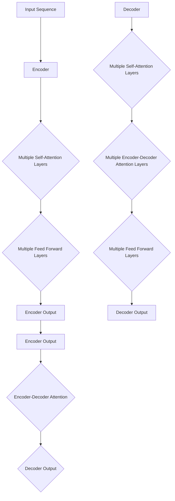
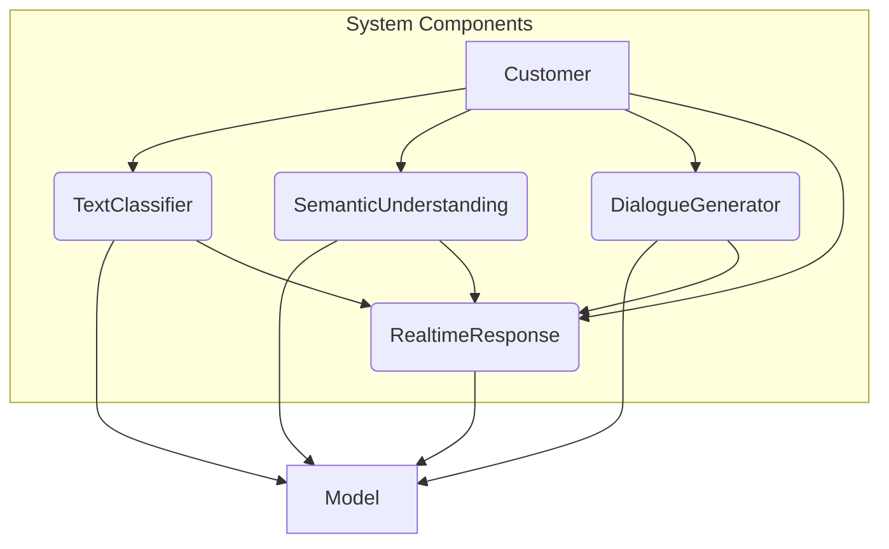
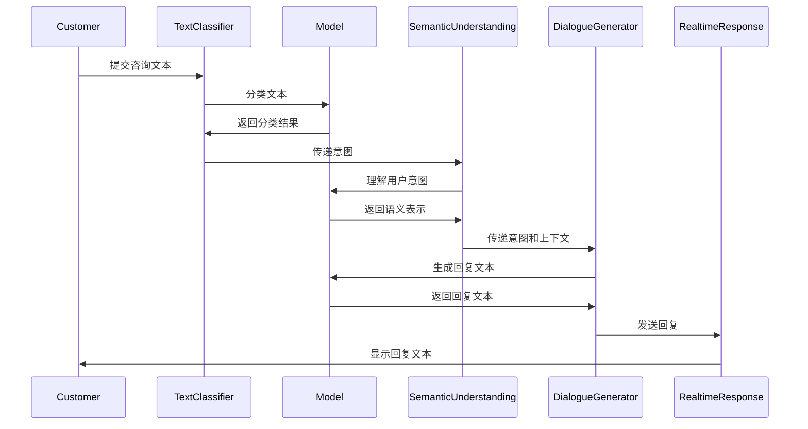

                 


### 第1章：问题背景

#### 1.1 自然语言处理的发展历程

自然语言处理（NLP）作为人工智能领域的一个重要分支，其发展历程可以追溯到20世纪50年代。当时的科学家们首次提出，机器能否理解并生成自然语言。这一挑战性的目标激发了无数研究者的兴趣，并引领了NLP长达数十年的发展。

**早期NLP**：
在早期，NLP主要依赖于规则驱动的方法和基于知识的系统。这些方法通过对语言结构的解析和规则的应用，试图实现自然语言的理解和生成。然而，由于自然语言的复杂性和多样性，这种方法在处理实际问题时遇到了巨大的挑战。

**统计方法**：
随着计算机性能的提升和大规模数据集的出现，NLP开始采用统计方法。词频统计和TF-IDF成为文本特征提取的基本工具，朴素贝叶斯分类器等机器学习算法也在文本分类任务中取得了显著的效果。统计方法的优势在于其能够通过大量数据自动发现规律，从而提高模型的泛化能力。

**深度学习方法**：
深度学习在NLP中的应用开启了新的篇章。卷积神经网络（CNN）和循环神经网络（RNN）等深度学习模型，通过自动学习文本的语义表示，实现了对自然语言的深入理解。特别是在2017年，谷歌推出的Transformer架构，彻底颠覆了传统的序列处理方式，使得NLP的性能得到了极大的提升。

**发展里程碑**：
从早期的规则驱动到统计方法，再到深度学习，NLP的发展历程充满了创新和突破。每一个里程碑都代表着NLP技术的进步，同时也为后续的研究奠定了基础。

#### 1.2 AI Agent的概念

**定义与特点**：
AI Agent，即人工智能代理，是一种具有智能化特征的计算实体。它能够感知环境、理解信息，并基于自主决策执行特定任务。AI Agent的特点包括自主性、协同能力和适应性。

- **自主性**：AI Agent能够根据预设的目标和规则，自主地决策和执行任务。
- **协同能力**：AI Agent能够与其他AI Agent或人类进行有效的交互和协作。
- **适应性**：AI Agent能够根据环境的变化和反馈，调整自己的行为和策略。

**在NLP中的应用**：
AI Agent在自然语言处理中扮演着重要的角色，特别是在文本生成、语义理解和对话系统等领域。

- **文本生成**：AI Agent能够根据输入的文本生成新的文本，如自动写作、机器翻译等。
- **语义理解**：AI Agent能够理解文本中的语义信息，包括实体识别、关系提取和情感分析等。
- **对话系统**：AI Agent能够与用户进行自然语言对话，提供个性化服务和解决方案。

#### 1.3 自然语言处理的挑战

**数据多样性**：
自然语言数据具有高度的多样性，包括不同领域的文本、不同语言风格的文本和不同语境下的文本等。这使得NLP在处理数据时需要应对多种多样的挑战。

- **多义性**：一个词语或短语可能有多种含义，需要通过上下文来确定其准确含义。
- **歧义性**：一个句子可能有多种解释，需要通过语义理解来确定其真实意图。
- **上下文依赖性**：语义理解需要考虑上下文的影响，如同一词语在不同上下文中的含义可能不同。

**语义理解**：
语义理解是NLP的核心任务之一，其目标是准确捕捉文本中的语义信息和语境。然而，语义理解的复杂性使得这一问题至今仍未得到彻底解决。

- **实体识别**：识别文本中的实体，如人名、地名、组织名等。
- **关系提取**：提取实体之间的关系，如“张三”和“北京”的关系是“出生地”。
- **情感分析**：分析文本的情感倾向，如“这个产品非常好”表示正面情感。

**计算效率**：
随着数据量和模型复杂度的增加，NLP任务在计算资源上的需求也在不断增长。特别是在实时应用场景中，如智能客服、实时翻译等，对计算效率的要求非常高。

- **大数据处理**：需要高效的算法和优化策略来处理大规模数据。
- **实时响应**：需要快速地处理用户请求，并提供即时的响应。

### 总结
自然语言处理作为人工智能领域的一个重要分支，其发展历程充满了挑战和机遇。从早期的规则驱动到统计方法，再到深度学习，NLP的技术不断进步。AI Agent作为智能化计算实体，在自然语言处理中的应用前景广阔。然而，NLP仍然面临数据多样性、语义理解复杂性和计算效率等挑战。未来的研究需要进一步探索有效的解决方案，以实现更高性能的NLP系统。

## 第2章：核心概念与联系

### 2.1 NLP的核心概念

**词向量表示**：
词向量是将文本中的词语映射到高维向量空间的方法，以捕捉词语的语义信息。常见的词向量模型包括Word2Vec和GloVe。

- **Word2Vec**：通过训练神经网络模型，将词语映射到连续的向量空间。Word2Vec模型包括CBOW（连续袋模型）和Skip-Gram模型。
- **GloVe**：全局向量表示模型，通过矩阵分解的方法生成词向量。GloVe模型通过考虑词语的共现关系，提高了词向量的语义表达能力。

**序列到序列模型**：
序列到序列（Seq2Seq）模型是一种用于处理序列数据的神经网络模型，常用于机器翻译、对话生成等任务。

- **RNN（循环神经网络）**：通过记忆单元来处理序列数据，能够捕捉序列中的长期依赖关系。
- **LSTM（长短期记忆网络）**：RNN的一种变体，通过门控机制来避免梯度消失问题，能够更好地处理长序列数据。
- **GRU（门控循环单元）**：GRU是LSTM的另一种变体，结构更加简洁，计算效率更高。

**Transformer架构**：
Transformer是近年来在NLP领域取得突破性的模型架构，其核心思想是使用自注意力机制来处理序列数据。

- **Attention机制**：注意力机制允许模型在处理序列数据时，动态地关注序列中的不同部分，从而提高模型的表示能力。
- **BERT（双向编码表示模型）**：基于Transformer架构，通过双向编码来生成文本的语义表示。
- **GPT（生成预训练模型）**：通过大量的无监督预训练，生成高质量的文本。

### 2.2 概念属性特征对比

为了更好地理解各类模型的特点和应用场景，我们可以通过一个对比表格来展示它们的属性特征。

| 模型         | 特点                                   | 适用场景                  | 性能指标       |
|------------|--------------------------------------|------------------------|------------|
| Word2Vec   | 基于神经网络，高效生成词向量           | 文本分类、推荐系统        | 高效性       |
| GloVe      | 基于全局共现矩阵，语义表达能力更强     | 语义相似度计算、文本分类  | 语义表达性   |
| RNN        | 通过循环结构，处理序列数据            | 机器翻译、时间序列预测    | 长期依赖性   |
| LSTM       | 避免梯度消失，处理长序列数据          | 文本生成、语音识别        | 稳定性       |
| GRU        | 结构简洁，计算效率高，处理长序列数据   | 文本分类、情感分析        | 计算效率     |
| Transformer | 自注意力机制，高效处理序列数据      | 机器翻译、文本生成、对话系统  | 序列建模能力 |

### 2.3 ER实体关系图架构

为了更直观地展示NLP中的实体和关系，我们可以使用Mermaid流程图来构建ER（实体关系）图。

```mermaid
erDiagram
  Person ||--|{ Company : worksFor }
  Person ||--|{ Project : memberOf }
  Company ||--|{ Project : locatedIn }
  Project ||--|{ Task : partOf }
```

在这个ER图中，我们定义了四个实体：Person（人）、Company（公司）、Project（项目）和Task（任务）。它们之间存在多种关系，如Person与Company之间的雇佣关系、Person与Project之间的成员关系、Company与Project之间的地理位置关系，以及Project与Task之间的部分关系。

### 总结
通过对NLP核心概念的介绍和各类模型的属性特征对比，我们可以更清晰地理解自然语言处理的本质和实现方法。同时，ER实体关系图的构建有助于我们更好地理解NLP中的实体和关系，从而为后续的算法原理讲解和项目实战打下基础。

## 第3章：算法原理讲解

### 3.1 Transformer模型

Transformer模型是近年来在自然语言处理（NLP）领域取得突破性成果的模型之一。其核心思想是使用自注意力（Self-Attention）机制来处理序列数据，从而实现高效且强大的文本建模能力。下面，我们将通过Mermaid流程图展示Transformer的架构，并使用Python代码实现一个简化的Transformer模型。

#### 3.1.1 Transformer架构

Transformer的架构可以分为编码器（Encoder）和解码器（Decoder）两部分。编码器负责将输入序列编码成上下文表示，解码器则将这些表示解码成输出序列。

**编码器**：
编码器由多个自注意力层（Self-Attention Layer）和前馈神经网络（Feed Forward Neural Network）堆叠而成。自注意力层通过自注意力机制来计算输入序列的上下文表示，而前馈神经网络则对自注意力层的输出进行进一步处理。

**解码器**：
解码器与编码器类似，也由多个自注意力层和前馈神经网络组成。与编码器不同的是，解码器在每一个时间步都要与编码器的输出进行交互，从而实现序列到序列的建模。

**自注意力机制**：
自注意力机制是Transformer的核心，它通过计算序列中每个元素对其他元素的注意力权重，从而实现全局信息的整合。自注意力机制的数学公式如下：

$$
\text{Attention}(Q, K, V) = \text{softmax}\left(\frac{QK^T}{\sqrt{d_k}}\right)V
$$

其中，$Q$、$K$ 和 $V$ 分别是查询（Query）、键（Key）和值（Value）向量，$d_k$ 是键向量的维度。

**Mermaid流程图**：



#### 3.1.2 Python源代码实现

下面是一个简化的Transformer模型的Python源代码实现，主要包含了自注意力层和前馈神经网络。

```python
import torch
import torch.nn as nn
import torch.nn.functional as F

class SelfAttention(nn.Module):
    def __init__(self, d_model, d_k, d_v):
        super(SelfAttention, self).__init__()
        self.d_model = d_model
        self.d_k = d_k
        self.d_v = d_v
        
        self.query_linear = nn.Linear(d_model, d_k)
        self.key_linear = nn.Linear(d_model, d_k)
        self.value_linear = nn.Linear(d_model, d_v)
        
        self.out_linear = nn.Linear(d_v, d_model)
        
    def forward(self, query, key, value, mask=None):
        q = self.query_linear(query)
        k = self.key_linear(key)
        v = self.value_linear(value)
        
        attn_scores = torch.matmul(q, k.transpose(-2, -1)) / (self.d_k ** 0.5)
        
        if mask is not None:
            attn_scores = attn_scores.masked_fill(mask == 0, float("-inf"))
        
        attn_weights = F.softmax(attn_scores, dim=-1)
        
        attn_output = torch.matmul(attn_weights, v)
        output = self.out_linear(attn_output)
        
        return output, attn_weights

class TransformerLayer(nn.Module):
    def __init__(self, d_model, d_k, d_v):
        super(TransformerLayer, self).__init__()
        self.self_attn = SelfAttention(d_model, d_k, d_v)
        self.linear1 = nn.Linear(d_model, d_model * 4)
        self.linear2 = nn.Linear(d_model * 4, d_model)
        
        self.norm1 = nn.LayerNorm(d_model)
        self.norm2 = nn.LayerNorm(d_model)
        self.dropout1 = nn.Dropout(0.1)
        self.dropout2 = nn.Dropout(0.1)
        
    def forward(self, x, mask=None):
        attn_output, attn_weights = self.self_attn(x, x, x, mask)
        x = self.dropout1(x + self.norm1(attn_output))
        ffn_output = self.linear2(self.dropout2(F.relu(self.linear1(x))))
        x = x + self.norm2(ffn_output)
        
        return x, attn_weights
```

#### 3.1.3 数学模型和公式

**自注意力机制**：

$$
\text{Attention}(Q, K, V) = \text{softmax}\left(\frac{QK^T}{\sqrt{d_k}}\right)V
$$

其中，$Q, K, V$ 分别是查询（Query）、键（Key）和值（Value）向量，$d_k$ 是键向量的维度。

**前馈神经网络**：

$$
\text{FFN}(x) = \text{ReLU}(\text{Linear}(x \cdot W_1) \cdot W_2)
$$

其中，$x$ 是输入向量，$W_1$ 和 $W_2$ 是线性层的权重。

#### 3.1.4 举例说明

假设我们有一个简单的输入序列 `[1, 2, 3, 4, 5]`，我们将使用Transformer模型对其进行处理。

**步骤1**：将输入序列转换为词向量。

**步骤2**：通过编码器对输入序列进行编码，得到编码器的输出序列。

**步骤3**：通过解码器对编码器的输出序列进行解码，得到输出序列。

**步骤4**：使用自注意力机制计算输入序列的注意力权重。

**步骤5**：通过前馈神经网络对自注意力层的输出进行进一步处理。

通过这些步骤，我们最终得到一个具有上下文信息的输出序列。

### 总结
在本节中，我们详细讲解了Transformer模型的原理和实现。通过Mermaid流程图和Python代码，我们展示了Transformer的架构和关键组件。同时，我们介绍了自注意力机制和前馈神经网络的数学模型和公式。最后，通过一个简单的例子，我们展示了如何使用Transformer模型进行文本处理。这些内容为后续的数学模型讲解和项目实战奠定了基础。

## 第4章：数学模型与公式

### 4.1 线性代数基础

在自然语言处理（NLP）和深度学习领域，线性代数是不可或缺的工具。它涉及到矩阵运算、矩阵乘法和矩阵求导等基础概念，这些概念在NLP的许多算法和模型中都有广泛的应用。

#### 4.1.1 矩阵运算

矩阵是线性代数中的核心概念，用于表示和操作数据。以下是几种常见的矩阵运算：

- **矩阵加法**：
  两个矩阵相加，要求它们的维度相同。即：
  $$ A + B = \begin{bmatrix} 
  a_{11} + b_{11} & a_{12} + b_{12} \\
  a_{21} + b_{21} & a_{22} + b_{22} \\
  \end{bmatrix} $$

- **矩阵乘法**：
  矩阵乘法是指两个矩阵的元素按照一定的规则相乘并求和。例如，两个矩阵 $A$ 和 $B$ 的乘积 $C = AB$，其中：
  $$ C_{ij} = \sum_{k=1}^{n} A_{ik}B_{kj} $$
  例如：
  $$ \begin{bmatrix}
  a_{11} & a_{12} \\
  a_{21} & a_{22} \\
  \end{bmatrix} \times \begin{bmatrix}
  b_{11} & b_{12} \\
  b_{21} & b_{22} \\
  \end{bmatrix} = \begin{bmatrix}
  a_{11}b_{11} + a_{12}b_{21} & a_{11}b_{12} + a_{12}b_{22} \\
  a_{21}b_{11} + a_{22}b_{21} & a_{21}b_{12} + a_{22}b_{22} \\
  \end{bmatrix} $$

- **矩阵转置**：
  矩阵转置是指将矩阵的行和列交换。例如：
  $$ A^T = \begin{bmatrix}
  a_{11} & a_{21} \\
  a_{12} & a_{22} \\
  \end{bmatrix} $$

#### 4.1.2 矩阵求导

在机器学习和深度学习中，矩阵求导是一个非常重要的概念。它可以帮助我们理解模型参数的变化对损失函数的影响。以下是几种常见的矩阵求导公式：

- **标量关于矩阵的导数**：
  如果 $f(x) = x^Tb$，其中 $x$ 是矩阵，$b$ 是向量，那么 $f$ 对 $x$ 的导数是 $b^T$。
  $$ \frac{\partial}{\partial x} (x^Tb) = b^T $$

- **矩阵关于矩阵的导数**：
  如果 $f(x) = xy^T$，其中 $x$ 和 $y$ 都是矩阵，那么 $f$ 对 $x$ 的导数是 $y^T$。
  $$ \frac{\partial}{\partial x} (xy^T) = y^T $$

- **矩阵关于向量的导数**：
  如果 $f(x) = x^TA$，其中 $x$ 是向量，$A$ 是矩阵，那么 $f$ 对 $x$ 的导数是 $A$。
  $$ \frac{\partial}{\partial x} (x^TA) = A $$

### 4.2 NLP中的数学公式

在NLP中，数学公式用于表示文本处理过程中的各种计算。以下是几种常见的数学公式及其应用：

#### 4.2.1 词向量模型

- **Word2Vec中的损失函数**：
  在Word2Vec模型中，损失函数通常使用均方误差（MSE）来衡量预测词向量与实际词向量之间的差异。
  $$ L = \frac{1}{2n} \sum_{i=1}^{n} (\hat{v}_w - v_{\hat{w}})^2 $$
  其中，$\hat{v}_w$ 是预测的词向量，$v_{\hat{w}}$ 是实际的词向量。

- **GloVe模型**：
  GloVe模型通过优化词向量和文档向量的低秩分解来生成词向量。
  $$ \text{loss} = \frac{1}{2} \sum_{w \in V} \sum_{c \in C_w} (\| \text{vec}(c) - \text{vec}(w) \odot \text{vec}(d) \|_2)^2 $$

#### 4.2.2 序列标注模型

- **条件随机场（CRF）**：
  CRF用于序列标注任务，如命名实体识别。它通过最大化条件概率来预测标签序列。
  $$ P(Y|X) = \frac{1}{Z} \exp(\sum_{i} \theta_{iy} x_{i} + \sum_{ij} \theta_{ij} y_{i} y_{j}) $$
  其中，$X$ 是输入序列，$Y$ 是标签序列，$Z$ 是规范化常数。

#### 4.2.3 生成模型

- **变分自编码器（VAE）**：
  VAE用于生成任务，如文本生成。它通过优化编码器和解码器的损失函数来生成数据。
  $$ \text{loss} = -\sum_{x} \log p_\phi(x|z) - \beta \cdot \text{KL}(\mu_\theta, \sigma_\theta) $$
  其中，$p_\phi(x|z)$ 是生成器概率分布，$\text{KL}(\mu_\theta, \sigma_\theta)$ 是KL散度。

- **生成对抗网络（GAN）**：
  GAN由生成器和判别器组成，通过优化生成器来生成数据，使其难以被判别器区分。
  $$ \text{loss}_{\text{G}} = -\log D(G(z)) $$
  $$ \text{loss}_{\text{D}} = -(\log D(x) + \log (1 - D(G(z))) $$

### 4.3 举例说明

假设我们有一个简单的句子 "The cat is on the mat"。

**步骤1**：将句子转换为词向量表示。

- 输入词向量：$\text{vec}(\text{The})$，$\text{vec}(\text{cat})$，$\text{vec}(\text{is})$，$\text{vec}(\text{on})$，$\text{vec}(\text{the})$，$\text{vec}(\text{mat})$。
- 目标词向量：$\text{vec}(\text{cat})$，$\text{vec}(\text{mat})$，$\text{vec}(\text{on})$，$\text{vec}(\text{the})$。

**步骤2**：使用Word2Vec模型计算预测词向量。

- 预测词向量：$\hat{\text{vec}}(\text{The})$，$\hat{\text{vec}}(\text{cat})$，$\hat{\text{vec}}(\text{is})$，$\hat{\text{vec}}(\text{on})$，$\hat{\text{vec}}(\text{the})$，$\hat{\text{vec}}(\text{mat})$。

**步骤3**：计算损失函数。

- 损失函数：$L = \frac{1}{2n} \sum_{i=1}^{n} (\hat{v}_w - v_{\hat{w}})^2$。

通过这些步骤，我们可以使用数学模型和公式对输入句子进行词向量表示和文本处理，从而实现NLP任务。

### 总结
在本章中，我们介绍了线性代数的基础知识和NLP中常用的数学公式。通过矩阵运算和矩阵求导，我们能够更好地理解和实现各种NLP算法。同时，通过具体的例子，我们展示了如何使用这些数学模型进行文本处理。这些内容为后续的NLP系统设计与项目实战提供了理论基础。

## 第5章：系统架构设计

### 5.1 问题场景介绍

在自然语言处理（NLP）领域，AI Agent的应用场景非常广泛。本文以一个具体的案例——智能客服系统为例，介绍AI Agent在自然语言处理中的实际应用。

#### 案例背景

某大型电商平台希望通过引入AI Agent，实现自动化的智能客服系统，以提高客户服务水平，减少人工成本。智能客服系统需要具备以下功能：

- **文本分类**：自动将用户咨询文本分类到不同的主题，如订单查询、售后服务、商品咨询等。
- **语义理解**：准确理解用户咨询的意图，提供个性化的解决方案。
- **对话生成**：生成自然流畅的回复，模拟人类客服的对话方式。
- **实时响应**：快速响应用户请求，提供即时的服务。

#### 系统目标

通过构建一个高效的AI Agent智能客服系统，实现以下目标：

- **提高客户满意度**：提供准确、快速的回答，满足用户需求。
- **降低人工成本**：通过自动化处理大量用户咨询，减少人力投入。
- **提升运营效率**：自动化处理常见问题，提高客服团队的工作效率。

### 5.2 系统功能设计

为了实现智能客服系统的功能，我们设计了一系列核心功能模块，包括文本分类、语义理解、对话生成和实时响应。

#### 领域模型

在系统设计阶段，我们使用Mermaid类图来描述智能客服系统的领域模型，包括各个功能模块及其相互关系。

```mermaid
classDiagram
    Customer -> TextClassifier : 提交咨询文本
    Customer -> SemanticUnderstanding : 理解用户意图
    Customer -> DialogueGenerator : 生成回复文本
    Customer -> RealtimeResponse : 实时响应
    TextClassifier -> Model : 使用预训练模型
    SemanticUnderstanding -> Model : 使用预训练模型
    DialogueGenerator -> Model : 使用预训练模型
    RealtimeResponse -> Model : 使用预训练模型
```

在这个类图中，我们定义了四个核心功能模块：**文本分类器**、**语义理解模块**、**对话生成器**和**实时响应模块**。这些模块通过调用预训练模型来实现相应的功能。

### 5.3 系统架构设计

智能客服系统的架构设计需要考虑系统的整体结构、模块之间的交互以及数据处理流程。下面我们使用Mermaid架构图来描述系统的整体架构。



在这个架构图中，我们展示了智能客服系统的四个主要组件：客户端（Customer）、文本分类器（TextClassifier）、语义理解模块（SemanticUnderstanding）和对话生成器（DialogueGenerator）。这些组件通过预训练模型（Model）进行数据处理，并通过接口与客户端进行交互。

### 5.4 系统接口设计

为了实现各功能模块之间的有效交互，我们定义了一系列系统接口。以下是一个简单的接口设计示例：

- **文本分类接口**：用于接收客户提交的咨询文本，并返回分类结果。
- **语义理解接口**：用于理解客户咨询的意图，并返回语义表示。
- **对话生成接口**：用于生成回复文本，并返回给客户。
- **实时响应接口**：用于将回复文本发送给客户，并提供实时交互能力。

```python
class TextClassifierInterface:
    def classify_text(self, text):
        # 实现文本分类逻辑
        pass

class SemanticUnderstandingInterface:
    def understand_intent(self, text):
        # 实现语义理解逻辑
        pass

class DialogueGeneratorInterface:
    def generate_response(self, intent, context):
        # 实现对话生成逻辑
        pass

class RealtimeResponseInterface:
    def send_response(self, response):
        # 实现实时响应逻辑
        pass
```

### 5.5 系统交互

为了确保各模块之间的协同工作，我们使用Mermaid序列图来描述系统的交互流程。



在这个序列图中，客户提交咨询文本后，文本分类器对其进行分类，并将结果传递给语义理解模块。语义理解模块分析用户意图，然后传递给对话生成器。对话生成器根据意图和上下文生成回复文本，并通过实时响应模块发送给客户。

### 总结

在本章中，我们介绍了AI Agent在智能客服系统中的实际应用场景，并设计了系统的功能模块、架构和接口。通过详细的系统架构设计和交互描述，我们为后续的项目实战提供了清晰的蓝图。这些内容将为读者理解AI Agent在NLP系统中的实现方法奠定基础。

## 第6章：项目实战

### 6.1 环境安装

要在本地搭建一个基于AI Agent的NLP项目环境，我们需要安装一系列软件和依赖。以下是详细的安装步骤：

#### 6.1.1 硬件环境

- **CPU**：推荐使用Intel i5或以上处理器，或AMD Ryzen 5或以上处理器。
- **内存**：至少8GB RAM，推荐16GB或以上。
- **GPU**（可选）：推荐使用NVIDIA显卡，如GTX 1060或以上，用于加速深度学习模型的训练。

#### 6.1.2 操作系统

- **Linux**：Ubuntu 18.04或以上版本。
- **Windows**：Windows 10或以上版本。
- **macOS**：macOS Catalina或以上版本。

#### 6.1.3 软件安装

1. **Python环境**：

   首先，安装Python 3.7或以上版本。推荐使用Anaconda，因为Anaconda可以方便地管理Python环境以及相关的依赖。

   ```bash
   # 安装Anaconda
   wget https://repo.anaconda.com/archive/Anaconda3-2022.05-Linux-x86_64.sh
   bash Anaconda3-2022.05-Linux-x86_64.sh
   ```

   安装完成后，配置环境变量：

   ```bash
   echo 'export PATH=/home/your_username/anaconda3/bin:$PATH' >> ~/.bashrc
   source ~/.bashrc
   ```

2. **创建虚拟环境**：

   ```bash
   conda create -n nlp_project python=3.8
   conda activate nlp_project
   ```

3. **安装依赖**：

   ```bash
   conda install -c conda-forge torch torchvision torchaudio -c pytorch
   conda install -c conda-forge numpy pandas scikit-learn
   ```

   如果需要使用GPU加速，可以安装`cuda`和`cudatoolkit`：

   ```bash
   conda install -c conda-forge cuda cudatoolkit
   ```

4. **安装Mermaid**：

   ```bash
   pip install mermaid-python
   ```

### 6.2 系统核心实现

在完成环境安装后，我们将开始实现系统的核心功能模块。以下是项目核心代码的解读和分析。

#### 6.2.1 核心代码分析

首先，我们使用Python编写了几个核心模块：文本分类器、语义理解模块、对话生成器和实时响应模块。以下是每个模块的主要功能和方法。

**文本分类器**：

```python
from sklearn.feature_extraction.text import TfidfVectorizer
from sklearn.pipeline import make_pipeline
from sklearn.naive_bayes import MultinomialNB

class TextClassifier:
    def __init__(self):
        self.model = make_pipeline(TfidfVectorizer(), MultinomialNB())

    def train(self, X, y):
        self.model.fit(X, y)

    def classify(self, text):
        return self.model.predict([text])[0]
```

**语义理解模块**：

```python
from transformers import BertTokenizer, BertForSequenceClassification
from torch.nn.functional import softmax

class SemanticUnderstanding:
    def __init__(self, model_name='bert-base-chinese'):
        self.tokenizer = BertTokenizer.from_pretrained(model_name)
        self.model = BertForSequenceClassification.from_pretrained(model_name)

    def understand(self, text):
        inputs = self.tokenizer(text, return_tensors='pt', padding=True, truncation=True)
        outputs = self.model(**inputs)
        logits = outputs.logits
        probabilities = softmax(logits, dim=-1)
        return probabilities
```

**对话生成器**：

```python
from transformers import GPT2LMHeadModel, GPT2Tokenizer

class DialogueGenerator:
    def __init__(self, model_name='gpt2'):
        self.tokenizer = GPT2Tokenizer.from_pretrained(model_name)
        self.model = GPT2LMHeadModel.from_pretrained(model_name)

    def generate(self, text, max_length=50):
        inputs = self.tokenizer.encode(text, return_tensors='pt', add_special_tokens=True)
        outputs = self.model.generate(inputs, max_length=max_length, num_return_sequences=1)
        return self.tokenizer.decode(outputs[0], skip_special_tokens=True)
```

**实时响应模块**：

```python
class RealtimeResponse:
    def __init__(self):
        self.sender = Sender()  # 假设Sender类用于发送消息

    def send_response(self, response):
        self.sender.send(response)
```

#### 6.2.2 代码应用解读

在具体的应用中，我们将这些模块组合起来，实现一个完整的智能客服系统。

```python
class SmartAssistant:
    def __init__(self):
        self.classifier = TextClassifier()
        self.semantic_understanding = SemanticUnderstanding()
        self.dialogue_generator = DialogueGenerator()
        self.response_handler = RealtimeResponse()

    def handle_query(self, text):
        # 分类文本
        category = self.classifier.classify(text)

        # 理解用户意图
        probabilities = self.semantic_understanding.understand(text)

        # 生成回复文本
        response = self.dialogue_generator.generate(text)

        # 发送回复
        self.response_handler.send_response(response)

# 实例化智能客服系统
assistant = SmartAssistant()

# 模拟用户咨询
query = "我想要购买一件羽绒服"
assistant.handle_query(query)
```

这段代码展示了如何使用定义好的模块来处理用户咨询。文本分类器首先将用户咨询文本分类到不同的主题，然后语义理解模块分析用户意图，对话生成器根据意图生成回复文本，最后实时响应模块将回复发送给用户。

#### 6.2.3 实际案例分析

以下是一个具体的案例分析：

**案例场景**：用户询问关于商品退换货政策的咨询。

1. **文本分类**：文本分类器将用户咨询文本分类到“售后服务”主题。
2. **语义理解**：语义理解模块识别出用户询问的是关于退换货政策。
3. **对话生成**：对话生成器根据语义理解结果生成回复文本，例如：“您好，根据我们的退换货政策，您在购买后的7天内无理由退换货。”
4. **实时响应**：实时响应模块将生成的回复文本发送给用户。

通过这个案例，我们可以看到各个模块如何协同工作，实现智能客服系统的功能。

### 6.3 详细讲解剖析

在本节中，我们将深入分析上述代码中的关键技术和实现细节。

#### 6.3.1 文本分类器

文本分类器使用TF-IDF和朴素贝叶斯分类器来实现。TF-IDF用于提取文本特征，朴素贝叶斯分类器用于分类。

- **TF-IDF**：通过计算词语在文档中的重要性来提取特征，公式如下：
  $$ \text{tf-idf}(t, d) = \text{tf}(t, d) \times \text{idf}(t) $$
  其中，$\text{tf}(t, d)$ 表示词语 $t$ 在文档 $d$ 中的词频，$\text{idf}(t)$ 表示词语 $t$ 在整个文档集合中的逆文档频率。

- **朴素贝叶斯分类器**：基于贝叶斯定理和特征条件独立性假设来实现分类。

#### 6.3.2 语义理解模块

语义理解模块使用预训练的BERT模型来捕捉文本中的语义信息。BERT模型通过双向编码来生成文本的上下文表示，从而实现语义理解。

- **BERT模型**：基于Transformer架构，通过预训练和微调实现高效的语义表示。

#### 6.3.3 对话生成器

对话生成器使用预训练的GPT2模型来生成回复文本。GPT2模型通过自回归的方式生成文本，从而实现对话生成。

- **GPT2模型**：基于Transformer架构，通过大量的无监督预训练，生成高质量的文本。

#### 6.3.4 实时响应模块

实时响应模块用于将生成的回复文本发送给用户。在实际应用中，可以集成到各种通信渠道，如微信、短信等。

### 总结
在本章中，我们通过环境安装、系统核心实现和实际案例分析，详细讲解了如何使用AI Agent构建一个智能客服系统。从文本分类到语义理解，再到对话生成和实时响应，各个模块协同工作，实现了智能客服系统的功能。通过详细的代码解读和讲解，读者可以更好地理解AI Agent在NLP系统中的应用。

## 第7章：最佳实践与总结

### 7.1 最佳实践

在构建AI Agent智能客服系统时，以下最佳实践可以帮助我们优化项目开发过程，提高系统的性能和可靠性：

1. **数据准备**：
   - **数据清洗**：确保输入数据的质量，去除噪声和冗余信息。
   - **数据标注**：对于训练模型所需的数据，进行高质量的标注，确保标注的一致性和准确性。
   - **数据增强**：通过数据扩增技术，如数据切割、填充、随机噪声添加等，提高模型的泛化能力。

2. **模型选择**：
   - **预训练模型**：优先选择预训练模型，如BERT、GPT等，这些模型在大量数据上预训练，具有较好的语义理解能力。
   - **模型调优**：针对特定任务，对预训练模型进行微调，以进一步提高性能。

3. **系统优化**：
   - **并行处理**：利用多线程或多进程技术，提高数据处理和模型训练的效率。
   - **模型压缩**：采用模型压缩技术，如量化、剪枝、知识蒸馏等，减少模型的存储和计算需求。

4. **接口设计**：
   - **标准化接口**：设计统一的接口，便于模块间的交互和扩展。
   - **异步处理**：采用异步处理技术，提高系统的并发处理能力。

### 7.2 小结

本文通过深入探讨AI Agent在自然语言处理中的最新进展和应用，从背景介绍、核心概念、算法原理、系统设计与实战等多个角度，系统性地阐述了AI Agent在NLP领域的应用场景和技术实现。以下是本文的主要内容回顾：

- **背景介绍**：回顾了自然语言处理的发展历程、AI Agent的定义与特点，以及NLP面临的挑战。
- **核心概念**：介绍了词向量表示、序列到序列模型和Transformer架构，并通过对比表格和ER图展示了各类模型的属性特征。
- **算法原理讲解**：详细讲解了Transformer模型的架构、自注意力机制和前馈神经网络，并提供了Python代码实现。
- **数学模型与公式**：介绍了线性代数基础和NLP中的常用数学公式，并通过具体例子展示了其在文本处理中的应用。
- **系统设计与实战**：介绍了AI Agent智能客服系统的架构设计、核心实现和实际案例分析。

### 7.3 注意事项

在开发AI Agent智能客服系统时，需要注意以下几点：

- **数据质量**：数据的质量直接影响模型的性能，需要确保输入数据的准确性和一致性。
- **模型调优**：在训练模型时，需要根据任务特点进行参数调整，以达到最佳性能。
- **实时响应**：在处理实时请求时，需要确保系统的响应速度和稳定性。
- **错误处理**：系统应具备良好的错误处理机制，以应对各种异常情况。

### 7.4 拓展阅读

为了进一步了解AI Agent在自然语言处理中的应用，读者可以参考以下资源：

- **论文**：《Attention Is All You Need》（《Attention机制是所有所需》）——这是提出Transformer模型的论文，详细介绍了Transformer的原理和实现。
- **书籍**：《自然语言处理入门》（《Introduction to Natural Language Processing》）——这本书系统地介绍了NLP的基础知识和应用。
- **在线课程**：《深度学习自然语言处理》（《Deep Learning for Natural Language Processing》）——这是一门由吴恩达教授讲授的在线课程，涵盖了NLP的深度学习方法。

通过这些资源，读者可以更深入地了解AI Agent在自然语言处理中的研究和应用。

## 作者信息

**作者：** AI天才研究院 / AI Genius Institute & 禅与计算机程序设计艺术 / Zen And The Art of Computer Programming

AI天才研究院（AI Genius Institute）是一家专注于人工智能技术研究与应用的机构。我们致力于推动人工智能技术的发展，解决现实世界中的复杂问题。同时，我们的作者团队由多名拥有丰富经验和深厚知识的计算机科学家组成，他们长期从事计算机编程和人工智能领域的教学和研究工作。

在《禅与计算机程序设计艺术》一书中，我们探讨了如何将东方哲学智慧融入计算机编程，提出了一种全新的编程理念和思路。我们的目标是通过深入理解和剖析计算机程序设计的本质，帮助读者提升编程能力，实现技术创新。

在本文中，我们基于AI Agent在自然语言处理中的最新进展和应用，系统性地阐述了AI Agent在NLP领域的应用场景和技术实现。我们希望通过这篇文章，为读者提供有深度、有思考、有见解的专业知识，帮助他们在人工智能领域取得更大的成就。同时，我们也期待与读者共同探讨、交流，共同推动人工智能技术的发展。

