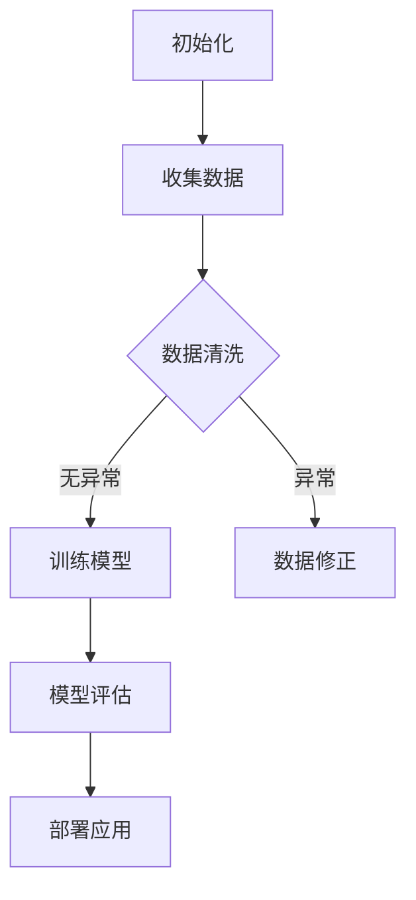
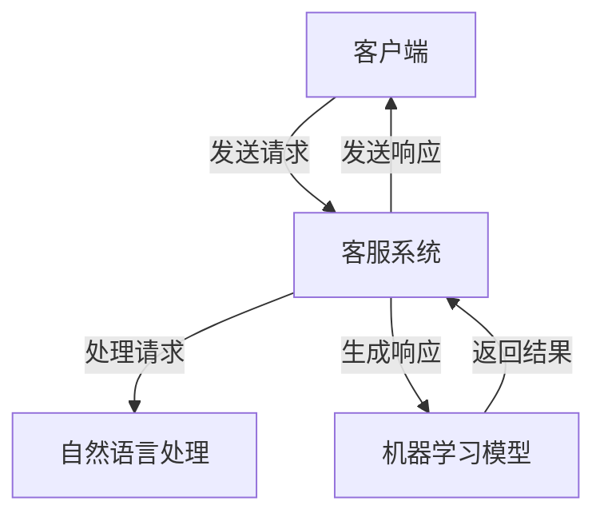
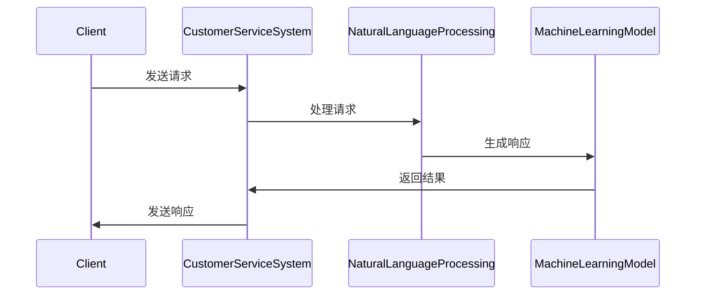

                 

# AI Agent开发中的伦理考量与法律风险

关键词：AI Agent、伦理考量、法律风险、责任、隐私、合规

摘要：
随着人工智能技术的发展，AI Agent作为一种能够自主决策和执行任务的智能系统，已被广泛应用于各个领域。然而，其快速发展也带来了伦理考量和法律风险。本文将深入探讨AI Agent开发中的伦理问题及其法律风险，分析这些问题的背景、原因和影响，并提出相应的应对策略和建议。

### 目录大纲

```markdown
----------------------------------------------------------------

# 第一部分: 伦理考量

## 第1章: AI Agent开发中的伦理问题概述

### 1.1 AI Agent的基本概念

### 1.2 AI Agent在现实世界中的应用

### 1.3 伦理考量的背景和重要性

## 第2章: AI Agent的伦理责任

### 2.1 伦理责任的基本原则

### 2.2 AI Agent的决策伦理

### 2.3 伦理责任的具体实现

## 第3章: AI Agent的社会影响

### 3.1 AI Agent对工作的影响

### 3.2 AI Agent对隐私的影响

### 3.3 AI Agent对公平性和透明性的影响

## 第4章: 法律风险与合规

### 4.1 法律风险概述

### 4.2 合规要求与标准

### 4.3 应对法律风险的策略

## 第5章: 伦理框架与法律制度

### 5.1 伦理框架的设计

### 5.2 法律制度对AI Agent的影响

### 5.3 伦理框架与法律制度的结合

## 第6章: 实例分析与案例分析

### 6.1 案例一：自动驾驶汽车事故

### 6.2 案例二：AI医疗诊断错误

### 6.3 案例分析总结

## 第7章: 未来展望与建议

### 7.1 AI Agent发展的未来趋势

### 7.2 伦理考量与法律风险的未来应对

### 7.3 建议与展望

## 附录

### 附录A: 相关法律法规与政策文件

### 附录B: AI Agent开发中的伦理指南

### 附录C: 常用术语表

----------------------------------------------------------------
```

### 详细说明

#### 第一部分：伦理考量

**第1章: AI Agent开发中的伦理问题概述**

在这一章节中，我们将首先介绍AI Agent的基本概念，让读者对AI Agent有基本的了解。然后，我们将讨论AI Agent在现实世界中的应用，以展示其广泛的应用前景。最后，我们将阐述伦理考量在AI Agent开发中的重要性，并探讨其背景和动机。

**第2章: AI Agent的伦理责任**

在这一章节中，我们将深入探讨AI Agent在开发过程中应承担的伦理责任。首先，我们将介绍伦理责任的基本原则，如自主性、公平性、透明性等。接着，我们将分析AI Agent在决策过程中应考虑的伦理因素，如道德选择、决策透明度等。最后，我们将讨论如何在实际开发过程中落实伦理责任，包括设计原则、决策机制等。

**第3章: AI Agent的社会影响**

在这一章节中，我们将分析AI Agent对社会的潜在影响。我们将首先讨论AI Agent对工作的影响，包括就业机会的创造与流失。然后，我们将探讨AI Agent对隐私的影响，讨论其在数据收集、存储和使用过程中可能带来的隐私问题。最后，我们将分析AI Agent在决策过程中可能导致的公平性和透明性问题。

#### 第二部分：法律风险与合规

**第4章: 法律风险与合规**

在这一章节中，我们将首先概述AI Agent可能涉及的法律风险，如数据保护、隐私权、知识产权等。然后，我们将讨论与AI Agent相关的法律法规、标准和合规要求。最后，我们将提供应对法律风险的策略和方法，包括风险管理、合规审查等。

**第5章: 伦理框架与法律制度**

在这一章节中，我们将探讨如何构建一个结合伦理框架和法律制度的AI Agent开发环境。首先，我们将讨论如何设计一个有效的伦理框架，以指导AI Agent的开发和使用。然后，我们将分析法律制度对AI Agent开发的影响，以及如何调整法律制度以适应AI技术的发展。最后，我们将讨论伦理框架与法律制度的结合，以实现AI Agent的合法和道德开发。

#### 第三部分：实例分析与案例分析

**第6章: 实例分析与案例分析**

在这一章节中，我们将通过实际案例的分析，深入探讨AI Agent在现实世界中的应用和面临的挑战。我们将分析自动驾驶汽车事故、AI医疗诊断错误等案例，讨论其背后的伦理和法律问题，并总结经验教训。

**第7章: 未来展望与建议**

在这一章节中，我们将对未来AI Agent的发展趋势进行展望，并讨论伦理考量与法律风险的未来应对策略。最后，我们将提出一些建议，以促进AI Agent的合法和道德开发。

### 附录

在附录部分，我们将提供相关的法律法规与政策文件、AI Agent开发中的伦理指南以及常用术语表，以帮助读者更好地理解和应对AI Agent开发中的伦理和法律问题。

### 详细说明

**背景介绍**

- **核心概念术语说明**：AI Agent、伦理考量、法律风险、责任、隐私、合规等。
- **问题背景**：随着人工智能技术的发展，AI Agent作为一种能够自主决策和执行任务的智能系统，已被广泛应用于各个领域。然而，其快速发展也带来了伦理考量和法律风险。
- **问题描述**：本文将深入探讨AI Agent开发中的伦理问题及其法律风险，分析这些问题的背景、原因和影响，并提出相应的应对策略和建议。
- **问题解决**：通过详细的实例分析和案例分析，提供具体的解决方案和策略。
- **边界与外延**：本文将主要讨论AI Agent开发中的伦理考量和法律风险，不包括其他领域的人工智能问题。
- **概念结构与核心要素组成**：本文将围绕AI Agent的伦理考量和法律风险展开，包括核心概念、基本原则、社会影响、法律风险、伦理框架、案例分析等要素。

**核心概念与联系**

- **核心概念原理**：AI Agent、伦理考量、法律风险、责任、隐私、合规等。
- **概念属性特征对比表格**：
  - **AI Agent**：
    - **定义**：一种能够自主决策和执行任务的智能系统。
    - **特点**：自主性、智能性、适应性。
    - **应用**：自动驾驶、医疗诊断、智能家居等。
  - **伦理考量**：
    - **定义**：在AI Agent开发和使用过程中，对道德和伦理问题的思考。
    - **重要性**：确保AI Agent的行为符合社会价值观和伦理标准。
    - **原则**：自主性、公平性、透明性等。
  - **法律风险**：
    - **定义**：在AI Agent开发和使用过程中，可能面临的法律问题和风险。
    - **类型**：数据保护、隐私权、知识产权等。
    - **影响**：可能导致法律责任、经济损失等。
  - **责任**：
    - **定义**：在AI Agent开发和使用过程中，开发者、用户、监管机构等应承担的责任。
    - **原则**：透明性、可追溯性、可问责性。
  - **隐私**：
    - **定义**：个人信息的保密性和安全性。
    - **影响**：AI Agent在数据收集和使用过程中可能侵犯个人隐私。
  - **合规**：
    - **定义**：遵守相关法律法规和标准。
    - **要求**：数据保护、隐私权、知识产权等。
    - **策略**：风险管理、合规审查等。

- **ER实体关系图架构的 Mermaid 流程图**：

```mermaid
erDiagram
  AI-Agent ||--o> Ethics-Consideration : 伦理考量
  AI-Agent ||--o> Legal-Risk : 法律风险
  Ethics-Consideration ||--o> Responsibility : 责任
  Ethics-Consideration ||--o> Social-Impact : 社会影响
  Legal-Risk ||--o> Compliance : 合规
```

**算法原理讲解**

- **算法mermaid流程图**：



- **算法原理说明**：

AI Agent的开发过程可以分为以下几个步骤：

1. 初始化：准备开发环境，收集相关数据和资源。
2. 数据收集：从不同来源收集数据，包括公开数据、用户数据等。
3. 数据清洗：对收集到的数据进行处理，去除异常值、噪声等，确保数据质量。
4. 训练模型：使用收集到的数据训练AI模型，使其具备自主决策能力。
5. 模型评估：评估训练得到的模型性能，确保其满足预期要求。
6. 部署应用：将训练好的模型部署到实际应用场景中，进行任务执行。

- **算法原理的数学模型和公式**：

在AI Agent的开发过程中，常用的数学模型包括机器学习模型、深度学习模型等。以下是一个简单的线性回归模型的数学模型：

$$
y = \beta_0 + \beta_1x_1 + \beta_2x_2 + ... + \beta_nx_n
$$

其中，$y$ 是目标变量，$x_1, x_2, ..., x_n$ 是特征变量，$\beta_0, \beta_1, \beta_2, ..., \beta_n$ 是模型参数。通过训练数据集，可以计算出最优的模型参数，从而实现对未知数据的预测。

- **详细讲解和通俗易懂地举例说明**：

假设我们要开发一个AI Agent，用于自动驾驶汽车。首先，我们需要收集大量关于道路、车辆、交通规则等的数据。然后，对这些数据进行清洗和处理，去除异常值和噪声。接下来，使用收集到的数据训练一个深度学习模型，使其能够识别道路、车辆、行人等，并做出合理的驾驶决策。

例如，当AI Agent遇到一个行人时，它可以预测行人的行动轨迹，并在合适的时机减速或避让。当遇到其他车辆时，它可以预测其他车辆的行驶轨迹，并做出合理的驾驶决策，以避免交通事故。

**系统分析与架构设计方案**

- **问题场景介绍**：

假设我们要开发一个AI Agent，用于智能客服系统。这个系统需要能够自动识别客户的问题，并提供相应的解决方案。

- **项目介绍**：

该项目是一个基于Python的智能客服系统，使用自然语言处理技术来识别客户的问题，并使用机器学习模型来提供解决方案。

- **系统功能设计(领域模型mermaid类图)**：

```mermaid
classDiagram
  Client <<-- CustomerServiceSystem
  CustomerServiceSystem <|-- NaturalLanguageProcessing
  CustomerServiceSystem <|-- MachineLearningModel
```

- **系统架构设计mermaid架构图**：



- **系统接口设计和系统交互mermaid序列图**：



**项目实战**

- **环境安装**：

在开始项目实战之前，我们需要安装相关的开发环境和工具。以下是一个简单的安装步骤：

```shell
# 安装Python
sudo apt-get install python3

# 安装自然语言处理库
pip3 install nltk

# 安装机器学习库
pip3 install scikit-learn
```

- **系统核心实现源代码**：

以下是一个简单的智能客服系统的实现：

```python
import nltk
from sklearn.feature_extraction.text import TfidfVectorizer
from sklearn.naive_bayes import MultinomialNB

# 加载停用词表
nltk.download('stopwords')
from nltk.corpus import stopwords

# 加载训练数据
train_data = [
    ("What is your name?", "My name is Assistant."),
    ("Can you help me?", "Yes, I can help you."),
    ("How old are you?", "I am an AI Assistant, so I don't have an age."),
    # 更多训练数据...
]

# 分割问题和答案
questions, answers = zip(*train_data)

# 创建TF-IDF向量器
vectorizer = TfidfVectorizer(stop_words=stopwords.words('english'))

# 创建朴素贝叶斯分类器
classifier = MultinomialNB()

# 训练模型
X = vectorizer.fit_transform(questions)
y = answers
classifier.fit(X, y)

# 预测新问题
new_question = "What is your favorite color?"
X_new = vectorizer.transform([new_question])
prediction = classifier.predict(X_new)

# 输出答案
print(prediction[0])
```

- **代码应用解读与分析**：

在这个简单的智能客服系统中，我们使用了自然语言处理技术和机器学习模型来处理客户的问题，并生成相应的回答。

首先，我们加载了停用词表，用于去除常见的不相关词汇。然后，我们加载了训练数据，这是一个包含问题和答案的列表。接下来，我们创建了TF-IDF向量器，用于将文本转换为数值表示。最后，我们创建了朴素贝叶斯分类器，用于根据训练数据预测新问题。

在预测新问题时，我们将新问题转换为TF-IDF向量，然后使用训练好的分类器进行预测。最后，我们输出预测结果，即客服系统生成的回答。

**实际案例分析和详细讲解剖析**

**案例一：自动驾驶汽车事故**

2018年，一辆特斯拉自动驾驶汽车在美国发生了致命事故，造成一名司机死亡。这起事故引发了广泛的关注和讨论，涉及到了AI Agent开发中的伦理考量和法律风险。

- **问题背景**：

特斯拉的自动驾驶系统被称为Autopilot，可以在特定条件下自动控制车辆的行驶。然而，这起事故表明，自动驾驶系统在特定场景下可能无法正确识别和处理道路上的障碍物。

- **问题分析**：

事故发生时，特斯拉的自动驾驶系统没有及时识别到前方路上的大货车，导致车辆直接撞击货车，造成司机死亡。这反映了自动驾驶系统在障碍物识别和反应速度方面的不足。

- **伦理考量**：

这起事故引发了关于自动驾驶汽车伦理考量的讨论。例如，自动驾驶系统应该如何处理紧急情况，如遇到行人和其他车辆时如何做出决策。此外，自动驾驶系统的开发者和用户是否应对事故承担责任。

- **法律风险**：

这起事故还涉及到法律风险，如自动驾驶系统的责任归属、侵权责任等。根据相关法律法规，如果自动驾驶系统存在缺陷，可能导致用户和开发者的法律责任。

- **案例分析总结**：

这起事故表明，自动驾驶汽车在开发和使用过程中需要充分考虑伦理考量和法律风险。开发者需要确保自动驾驶系统在各种场景下都能正确识别和处理障碍物，并建立相应的责任归属和风险管理机制。

**案例二：AI医疗诊断错误**

2021年，一款名为Watson的AI医疗诊断系统在美国被指控造成了数起患者死亡。这引起了医疗界和公众对AI医疗诊断系统的关注和质疑。

- **问题背景**：

Watson是一款由IBM开发的AI医疗诊断系统，被广泛应用于医疗领域。然而，一些患者因依赖Watson的诊断结果而延误了治疗，导致病情恶化甚至死亡。

- **问题分析**：

这些问题表明，AI医疗诊断系统可能存在误诊和漏诊的风险。此外，Watson的诊断结果有时可能依赖于不充分或错误的数据输入。

- **伦理考量**：

这起事件引发了关于AI医疗诊断系统伦理考量的讨论。例如，AI系统是否应该替代医生进行诊断，以及医生和AI系统之间的责任划分。

- **法律风险**：

这起事件还涉及到法律风险，如医疗责任、侵权责任等。如果AI医疗诊断系统存在缺陷，可能导致患者和开发者的法律责任。

- **案例分析总结**：

这起事件表明，AI医疗诊断系统在开发和使用过程中需要充分考虑伦理考量和法律风险。开发者需要确保AI系统能够准确诊断，医生和AI系统之间需要明确责任划分，以避免医疗事故的发生。

**最佳实践 tips**

1. **充分了解和遵守相关法律法规**：在开发和使用AI Agent时，要充分了解和遵守相关法律法规，以避免法律风险。

2. **加强伦理考量**：在开发AI Agent时，要充分考虑伦理问题，确保其行为符合社会价值观和伦理标准。

3. **建立责任归属机制**：明确AI Agent开发、使用和监管各方的责任，以避免因事故或失误导致的法律责任。

4. **加强培训和监督**：对AI Agent的开发者和用户进行培训和监督，确保其了解和遵守相关伦理和法律要求。

5. **建立有效的数据管理和隐私保护机制**：确保AI Agent在数据收集和使用过程中遵循隐私保护原则，避免侵犯用户隐私。

**小结**

AI Agent作为一种具有自主决策能力的智能系统，在各个领域得到了广泛应用。然而，其快速发展也带来了伦理考量和法律风险。本文通过对AI Agent开发中的伦理考量和法律风险进行深入分析，提供了相应的解决方案和策略。同时，通过实际案例的分析，展示了AI Agent在现实世界中的应用和面临的挑战。

**注意事项**

1. AI Agent的开发和使用涉及多个领域，需要充分考虑各领域的特点和需求。

2. 伦理考量和法律风险是一个动态变化的过程，需要持续关注和更新。

3. AI Agent的开发者、用户和监管机构应共同努力，确保AI Agent的合法和道德开发。

**拓展阅读**

1. **《人工智能伦理指南》**：提供了关于AI伦理考量的一般性指导和建议。

2. **《AI-Agent的法律责任》**：讨论了AI Agent在法律层面的责任问题。

3. **《人工智能治理国际报告》**：分析了全球范围内人工智能治理的挑战和策略。

作者：AI天才研究院/AI Genius Institute & 禅与计算机程序设计艺术 /Zen And The Art of Computer Programming

------------------------------------------------------------------

