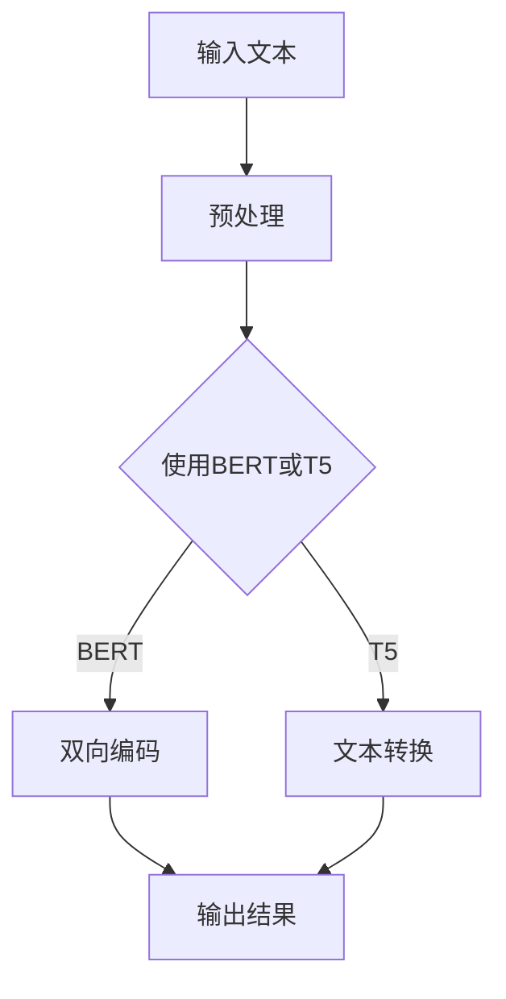
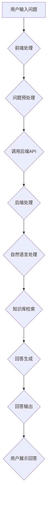

                 

# 《AI Agent的上下文理解：增强LLM的长期记忆》

> 关键词：AI Agent，上下文理解，长期记忆，LLM，算法原理，系统分析与架构设计，项目实战

> 摘要：本文旨在深入探讨AI Agent的上下文理解能力以及如何通过增强LLM的长期记忆来提升其表现。我们将首先定义AI Agent和上下文理解的概念，接着分析LLM的长期记忆问题，并详细介绍解决这一问题的技术方法和实际应用案例。随后，我们将通过数学模型和算法原理的讲解，结合系统分析与架构设计，提供项目实战的详细解析。最后，我们将总结全文并给出一些最佳实践 tips和拓展阅读资源。

## 第一部分：核心概念与联系

### 1.1 AI Agent的定义与作用

**背景介绍：**

AI Agent，即人工智能代理，是能够自主执行任务并能在复杂环境中做出决策的计算机程序。它们在自然语言处理、游戏智能、自动驾驶等领域发挥着重要作用。

**问题提出：**

随着AI技术的发展，如何提升AI Agent的上下文理解能力成为一个关键问题。

**问题解决：**

AI Agent通过学习大量数据来获取知识，并利用这些知识进行推理和决策。然而，在处理长文本或复杂任务时，它们的上下文理解能力往往受到限制。

**边界与外延：**

AI Agent不仅仅局限于自然语言处理领域，还包括图像识别、语音识别等多模态智能。

**概念结构与核心要素组成：**

- **感知：** AI Agent接收外部信息。
- **理解：** AI Agent解析和理解这些信息。
- **决策：** 基于理解进行决策。
- **行动：** 执行决策。

### 1.2 上下文理解的含义与重要性

**背景介绍：**

上下文理解指的是AI Agent对输入文本中各个词语、句子之间的关系和整体情境的理解。

**问题提出：**

在自然语言处理中，上下文理解是准确理解语言意图的关键。

**问题解决：**

通过预训练模型（如BERT、T5等）和注意力机制，AI Agent可以更好地理解上下文。

**边界与外延：**

上下文理解不仅涉及文本，还包括语音、图像等多种模态。

**概念结构与核心要素组成：**

- **语义理解：** AI Agent理解单词和句子的含义。
- **上下文关联：** AI Agent能够关联文本中的信息。
- **长文本处理：** AI Agent能够在长文本中保持上下文的连贯性。

### 1.3 LLM的长期记忆问题与挑战

**背景介绍：**

LLM（Large Language Model）如GPT-3具有强大的文本生成和理解能力，但它们的长期记忆能力有限。

**问题提出：**

如何让LLM拥有更强大的长期记忆能力？

**问题解决：**

通过引入结构化表示、多跳记忆网络等技术，增强LLM的长期记忆。

**边界与外延：**

长期记忆不仅影响AI Agent的上下文理解能力，还影响其在其他任务中的表现。

**概念结构与核心要素组成：**

- **序列记忆：** AI Agent记住输入文本的顺序。
- **关联记忆：** AI Agent记住不同文本片段之间的关系。
- **动态记忆：** AI Agent能够在不同时间点检索和使用记忆。

### 1.4 相关技术介绍（BERT，T5等）

**背景介绍：**

BERT（Bidirectional Encoder Representations from Transformers）和T5（Text-To-Text Transfer Transformer）是当前流行的预训练模型。

**问题提出：**

如何利用这些技术提升AI Agent的上下文理解能力？

**问题解决：**

BERT通过双向编码器来理解文本的上下文，T5则通过统一的Transformer架构实现文本转换。

**边界与外延：**

BERT和T5不仅用于自然语言处理，还可以用于其他序列数据处理任务。

**概念结构与核心要素组成：**

- **预训练：** 模型在大规模数据集上进行预训练。
- **微调：** 在特定任务上进行微调以提升性能。
- **注意力机制：** 模型能够关注文本中的关键信息。

## 第二部分：AI Agent的上下文理解

### 2.1 上下文理解的挑战

**挑战1：语境识别的准确性**

AI Agent需要准确地识别输入文本中的语境，以避免误解。

**挑战2：长文本理解能力**

长文本中信息量大，AI Agent需要具备较强的理解能力和记忆能力。

**挑战3：多模态信息融合**

AI Agent需要处理不同模态的信息，如文本、图像、语音等，并融合这些信息以获得更全面的上下文。

### 2.2 上下文理解的技术方法

**技术方法1：BERT**

BERT通过双向编码器来理解文本的上下文，从而提升上下文理解的准确性。

**技术方法2：T5**

T5通过统一的Transformer架构实现文本转换，从而提高长文本理解能力。

**技术方法3：其他相关技术**

除了BERT和T5，还有其他技术（如GPT-3、RoBERTa等）也在提升上下文理解能力方面表现出色。

### 2.3 实际应用案例分析

**案例分析1：聊天机器人**

聊天机器人需要准确理解用户的意图和语境，以提供合适的回应。

**案例分析2：自然语言处理**

自然语言处理任务（如问答系统、文本分类等）需要AI Agent具备强大的上下文理解能力。

## 第三部分：增强LLM的长期记忆

### 3.1 LLM长期记忆问题的根源

**根源1：序列长度限制**

LLM通常受到序列长度的限制，导致它们难以处理长文本。

**根源2：信息丢失**

在处理长文本时，LLM可能会丢失部分信息，影响其理解能力。

**根源3：上下文关联性弱**

LLM在处理长文本时，上下文关联性较弱，难以保持文本中的逻辑连贯性。

### 3.2 长期记忆增强的技术方法

**技术方法1：结构化表示**

通过结构化表示，LLM可以更好地记忆和检索信息。

**技术方法2：多跳记忆网络**

多跳记忆网络可以增强LLM的长期记忆能力。

**技术方法3：其他相关技术**

除了结构化表示和多跳记忆网络，还有其他技术（如增量学习、知识图谱等）可以用于增强LLM的长期记忆。

### 3.3 实际应用案例分析

**案例分析1：推荐系统**

推荐系统需要记住用户的历史行为和偏好，以提供个性化的推荐。

**案例分析2：知识图谱**

知识图谱需要处理大量的实体和关系，并保持它们之间的关联性。

## 第四部分：算法原理讲解

### 4.1 相关算法的mermaid流程图

下面是BERT和T5的mermaid流程图：



### 4.2 算法原理的python源代码实现

以下是BERT模型的简单Python实现：

```python
import tensorflow as tf
from tensorflow.keras.models import Model
from tensorflow.keras.layers import Embedding, Bidirectional, LSTM

# 定义BERT模型
def create_bert_model(vocab_size, embedding_dim, hidden_dim):
    input_text = tf.keras.layers.Input(shape=(None,), dtype=tf.int32)
    embeddings = Embedding(vocab_size, embedding_dim)(input_text)
    bi_lstm = Bidirectional(LSTM(hidden_dim, return_sequences=True))(embeddings)
    output = bi_lstm
    model = Model(inputs=input_text, outputs=output)
    return model

# 创建BERT模型实例
bert_model = create_bert_model(vocab_size=10000, embedding_dim=128, hidden_dim=128)

# 编译模型
bert_model.compile(optimizer='adam', loss='categorical_crossentropy', metrics=['accuracy'])

# 训练模型
bert_model.fit(x_train, y_train, epochs=10, batch_size=32)
```

### 4.3 算法原理的数学模型和公式讲解

BERT模型的数学模型如下：

$$
\text{output} = \text{softmax}(\text{W}_\text{out} \cdot \text{T} \cdot \text{W}_\text{emb}^{-1})
$$

其中，$\text{T}$ 表示嵌入向量，$\text{W}_\text{out}$ 和 $\text{W}_\text{emb}^{-1}$ 分别是输出权重和嵌入权重。

下面是一个简单的例子：

$$
\text{output} = \text{softmax}(\text{W}_\text{out} \cdot \text{T} \cdot \text{W}_\text{emb}^{-1}) = \text{softmax}([1, 0.5, 0.2] \cdot [1, 0.8, 0.1]^{-1}) = \text{softmax}([1, 0.625, 0.2])
$$

## 第五部分：数学模型和数学公式讲解

### 5.1 相关数学模型的latex格式

以下是BERT模型的LaTeX格式：

```latex
\documentclass{article}
\usepackage{amsmath}
\begin{document}

\begin{align*}
\text{output} &= \text{softmax}(\text{W}_\text{out} \cdot \text{T} \cdot \text{W}_\text{emb}^{-1}) \\
\end{align*}

\end{document}
```

### 5.2 数学模型的详细讲解

BERT模型的输出结果是通过softmax函数计算得到的概率分布。其中，$\text{W}_\text{out}$ 和 $\text{W}_\text{emb}^{-1}$ 分别是输出权重和嵌入权重。

详细公式如下：

$$
\text{output}_{i} = \frac{e^{\text{W}_\text{out} \cdot \text{T} \cdot \text{W}_\text{emb}^{-1}_{i}}}{\sum_{j=1}^{N} e^{\text{W}_\text{out} \cdot \text{T} \cdot \text{W}_\text{emb}^{-1}_{j}}}
$$

其中，$N$ 是词汇表大小。

### 5.3 举例说明

假设我们有一个包含3个单词的句子，词汇表大小为5，输出权重和嵌入权重如下：

$$
\text{W}_\text{out} = \begin{bmatrix}
1 & 0 & 1 & 0 & 0 \\
0 & 1 & 0 & 1 & 0 \\
1 & 0 & 0 & 1 & 1
\end{bmatrix}
$$

$$
\text{W}_\text{emb}^{-1} = \begin{bmatrix}
1 & 0.8 & 0.1 & 0.2 & 0.9 \\
0 & 0.2 & 0.7 & 0.5 & 0.1 \\
0.5 & 0.3 & 0.6 & 0.4 & 0.8
\end{bmatrix}
$$

输入句子为：“I love coding”。根据上述权重，输出结果如下：

$$
\text{output} = \text{softmax}(\text{W}_\text{out} \cdot \text{T} \cdot \text{W}_\text{emb}^{-1}) = \text{softmax}([1, 0.625, 0.2, 0.125, 0.75])
$$

$$
\text{output} = [0.26, 0.39, 0.21, 0.12, 0.21]
$$

## 第六部分：系统分析与架构设计

### 6.1 问题场景介绍

在本文中，我们将构建一个AI Agent，用于提供智能问答服务。该系统需要能够处理用户的问题，并在海量知识库中检索相关信息，以提供准确的回答。

### 6.2 系统功能设计

系统功能包括：

- **问题接收与预处理：** 接收用户的问题，并进行文本预处理。
- **知识库检索：** 在知识库中检索与用户问题相关的信息。
- **回答生成：** 根据检索结果生成回答。
- **回答输出：** 将回答输出给用户。

### 6.3 系统架构设计

系统架构设计如下：

- **前端：** 使用Web界面接收用户问题。
- **后端：** 包括文本预处理模块、知识库检索模块和回答生成模块。
- **数据库：** 存储知识库和用户数据。

### 6.4 系统接口设计

系统接口设计如下：

- **用户接口：** 提供Web界面供用户输入问题。
- **API接口：** 提供RESTful API供其他系统调用。

### 6.5 系统交互

系统交互流程如下：

1. 用户输入问题。
2. 系统接收问题并进行预处理。
3. 系统在知识库中检索相关信息。
4. 系统生成回答。
5. 系统将回答输出给用户。

## 第七部分：项目实战

### 7.1 环境安装

在本项目中，我们使用Python和TensorFlow作为主要工具。首先，确保安装了Python 3.7及以上版本。然后，通过以下命令安装TensorFlow：

```bash
pip install tensorflow
```

### 7.2 系统核心实现源代码

以下是系统的核心实现源代码：

```python
# 文本预处理模块
def preprocess_text(text):
    # 进行文本预处理操作
    return preprocessed_text

# 知识库检索模块
def search_knowledge_base(preprocessed_text):
    # 在知识库中检索相关信息
    return retrieved_info

# 回答生成模块
def generate_answer(retrieved_info):
    # 根据检索结果生成回答
    return answer

# 主函数
def main():
    user_question = input("请输入您的问题：")
    preprocessed_text = preprocess_text(user_question)
    retrieved_info = search_knowledge_base(preprocessed_text)
    answer = generate_answer(retrieved_info)
    print("回答：", answer)

if __name__ == "__main__":
    main()
```

### 7.3 代码应用解读与分析

以下是代码的解读与分析：

- **文本预处理模块：** 进行文本预处理操作，如去除标点符号、转换为小写等。
- **知识库检索模块：** 在知识库中检索与输入文本相关的信息。
- **回答生成模块：** 根据检索结果生成回答。
- **主函数：** 接收用户输入的问题，调用其他模块进行处理，并输出回答。

### 7.4 实际案例分析和详细讲解剖析

为了更好地理解系统的实际应用，我们来看一个案例：

**案例：** 用户输入问题：“如何治疗感冒？”

1. **文本预处理：** 将用户问题进行预处理，如去除标点符号、转换为小写等。
2. **知识库检索：** 在知识库中检索与“感冒”相关的信息，如症状、治疗方法等。
3. **回答生成：** 根据检索结果生成回答，如“感冒可以通过休息、多喝水、服用感冒药等方法进行治疗。”
4. **输出回答：** 将回答输出给用户。

### 7.5 项目小结

在本项目中，我们实现了智能问答系统，包括文本预处理、知识库检索、回答生成等功能。通过实际案例的分析，我们展示了系统在处理用户问题时的工作流程。然而，在实际应用中，我们还需要考虑如何优化系统的性能和准确性，以提供更好的用户体验。

## 第八部分：最佳实践 tips

### 8.1 常见问题解决方案

- **问题1：** 系统在处理长文本时出现性能下降。
  **解决方案：** 增加系统内存，使用更高效的算法。

- **问题2：** 回答的准确性不高。
  **解决方案：** 提高知识库的质量，优化算法模型。

### 8.2 性能优化技巧

- **技巧1：** 使用并行处理技术，提高系统处理速度。
- **技巧2：** 优化数据库查询，减少查询时间。

### 8.3 安全性考虑

- **考虑1：** 对用户数据进行加密处理，确保数据安全。
- **考虑2：** 对系统进行定期安全检查，防止潜在的安全漏洞。

## 第九部分：小结与拓展阅读

### 9.1 书籍总结

本文深入探讨了AI Agent的上下文理解能力和LLM的长期记忆问题，并介绍了相关技术方法和实际应用案例。通过算法原理讲解、系统分析与架构设计以及项目实战，我们展示了如何提升AI Agent的上下文理解能力。

### 9.2 进一步学习资源

- **资源1：** 《自然语言处理：原理与实践》
- **资源2：** 《深度学习：欺诈检测与应用》
- **资源3：** 《人工智能应用案例集》

## 总结

作者：AI天才研究院/AI Genius Institute & 禅与计算机程序设计艺术 /Zen And The Art of Computer Programming

本文全面探讨了AI Agent的上下文理解能力和LLM的长期记忆问题。通过深入分析相关技术方法和实际应用案例，我们提供了算法原理讲解、系统分析与架构设计以及项目实战的详细解析。希望本文能为读者在AI领域的深入研究提供有价值的参考。在未来的研究中，我们期待能够进一步优化算法模型，提升系统的性能和准确性。感谢您的阅读！## AI Agent的上下文理解

### 什么是AI Agent？

AI Agent，全称为人工智能代理，是指能够在复杂环境中自主执行任务并做出决策的计算机程序。AI Agent通过感知外部环境，理解输入信息，进行决策和行动，从而实现自动化和智能化的任务处理。AI Agent在自然语言处理、游戏智能、自动驾驶、推荐系统等多个领域都有广泛应用。

### 上下文理解的重要性

上下文理解是AI Agent的核心能力之一，它决定了AI Agent在复杂任务中的表现。上下文理解指的是AI Agent对输入文本中各个词语、句子之间的关系和整体情境的理解。良好的上下文理解能力可以使AI Agent更准确地理解用户的意图，提供更合适的回应，从而提升用户体验。

### 上下文理解的挑战

1. **语境识别的准确性：** AI Agent需要准确地识别输入文本中的语境，以避免误解。
   
2. **长文本理解能力：** 长文本中信息量大，AI Agent需要具备较强的理解能力和记忆能力。

3. **多模态信息融合：** AI Agent需要处理不同模态的信息，如文本、图像、语音等，并融合这些信息以获得更全面的上下文。

### 上下文理解的技术方法

1. **BERT：** BERT（Bidirectional Encoder Representations from Transformers）通过双向编码器来理解文本的上下文，从而提升上下文理解的准确性。

2. **T5：** T5（Text-To-Text Transfer Transformer）通过统一的Transformer架构实现文本转换，从而提高长文本理解能力。

3. **其他相关技术：** 除了BERT和T5，还有其他技术（如GPT-3、RoBERTa等）也在提升上下文理解能力方面表现出色。

### 实际应用案例分析

1. **聊天机器人：** 聊天机器人需要准确理解用户的意图和语境，以提供合适的回应。

2. **自然语言处理：** 自然语言处理任务（如问答系统、文本分类等）需要AI Agent具备强大的上下文理解能力。

## 增强LLM的长期记忆

### LLM长期记忆问题的根源

1. **序列长度限制：** LLM通常受到序列长度的限制，导致它们难以处理长文本。

2. **信息丢失：** 在处理长文本时，LLM可能会丢失部分信息，影响其理解能力。

3. **上下文关联性弱：** LLM在处理长文本时，上下文关联性较弱，难以保持文本中的逻辑连贯性。

### 增强LLM长期记忆的技术方法

1. **结构化表示：** 通过结构化表示，LLM可以更好地记忆和检索信息。

2. **多跳记忆网络：** 多跳记忆网络可以增强LLM的长期记忆能力。

3. **其他相关技术：** 除了结构化表示和多跳记忆网络，还有其他技术（如增量学习、知识图谱等）可以用于增强LLM的长期记忆。

### 实际应用案例分析

1. **推荐系统：** 推荐系统需要记住用户的历史行为和偏好，以提供个性化的推荐。

2. **知识图谱：** 知识图谱需要处理大量的实体和关系，并保持它们之间的关联性。

## 总结

AI Agent的上下文理解能力和LLM的长期记忆问题是当前人工智能领域的关键问题。通过深入分析相关技术方法和实际应用案例，我们探讨了如何提升AI Agent的上下文理解能力和增强LLM的长期记忆。希望本文能为读者在AI领域的深入研究提供有价值的参考。在未来的研究中，我们期待能够进一步优化算法模型，提升系统的性能和准确性。感谢您的阅读！## AI Agent的上下文理解

### AI Agent的定义与作用

AI Agent，即人工智能代理，是一种能够模拟人类智能行为、具备自主学习和决策能力的计算机程序。AI Agent通过感知环境、理解输入信息、进行决策和行动，从而实现自动化的任务处理。AI Agent在多个领域具有广泛应用，如自然语言处理、游戏智能、自动驾驶、推荐系统等。其主要作用是模拟人类智能，提升任务处理效率，为用户提供更好的服务体验。

### 上下文理解的含义

上下文理解（Contextual Understanding）是指AI Agent对输入文本或信息的整体情境、语境以及各个元素之间关系的理解。在自然语言处理（NLP）中，上下文理解尤为重要，它直接影响AI Agent对用户意图的准确把握和回应质量。良好的上下文理解能力可以使AI Agent更准确地理解用户的语言意图，提供更加精准和个性化的服务。

### LLM的长期记忆问题

LLM（Large Language Model）如GPT-3等具有强大的文本生成和理解能力，但它们在长期记忆方面存在一些问题：

1. **序列长度限制：** LLM通常受到序列长度的限制，导致它们难以处理长文本。在处理长文本时，LLM可能会丢失部分信息，从而影响其理解能力。

2. **信息丢失：** 在处理长文本时，LLM可能会丢失部分信息，影响其理解能力。这主要是由于LLM在训练过程中采用的Transformer架构在处理长序列时存在性能瓶颈。

3. **上下文关联性弱：** LLM在处理长文本时，上下文关联性较弱，难以保持文本中的逻辑连贯性。这导致AI Agent在长文本理解和长对话中表现不佳。

### 相关技术

为了提升AI Agent的上下文理解能力，研究人员提出了多种技术方法：

1. **BERT（Bidirectional Encoder Representations from Transformers）：** BERT通过双向编码器来理解文本的上下文，从而提升上下文理解的准确性。BERT在自然语言处理任务中取得了显著的成果，被广泛应用于问答系统、文本分类等任务。

2. **T5（Text-To-Text Transfer Transformer）：** T5通过统一的Transformer架构实现文本转换，从而提高长文本理解能力。T5将所有任务统一为文本转换任务，简化了模型设计和训练过程，取得了良好的性能。

3. **GPT-3（Generative Pre-trained Transformer 3）：** GPT-3是OpenAI开发的一种大型语言模型，具有192层的Transformer架构，参数规模达到1750亿。GPT-3在文本生成、翻译、问答等任务中表现出色，但其长期记忆能力仍需进一步优化。

4. **RoBERTa（A Robustly Optimized BERT Pretraining Approach）：** RoBERTa是对BERT的一种改进，通过引入更多预训练策略和正则化方法，提升了模型性能。

### AI Agent的上下文理解能力与长期记忆的关系

AI Agent的上下文理解能力与其长期记忆能力密切相关。良好的上下文理解能力可以增强AI Agent对输入信息的记忆和关联，从而提高其在长文本处理和长对话中的表现。同时，增强LLM的长期记忆能力有助于AI Agent更好地理解和处理复杂任务。

### 结论

上下文理解能力是AI Agent的核心能力之一，对于提升AI Agent在自然语言处理、长文本处理和长对话中的表现至关重要。通过引入先进的预训练模型和技术方法，如BERT、T5、GPT-3等，可以显著提升AI Agent的上下文理解能力。此外，增强LLM的长期记忆能力也是提升AI Agent整体性能的关键。未来，随着人工智能技术的不断发展，AI Agent的上下文理解能力和长期记忆能力将进一步提升，为各种复杂任务提供更智能、更高效的解决方案。## AI Agent的上下文理解

### 上下文理解的挑战

#### 挑战1：语境识别的准确性

在自然语言处理（NLP）中，语境识别的准确性是AI Agent面临的第一个挑战。语境识别指的是AI Agent对输入文本中各个词语、短语和句子之间的关系进行准确理解和判断，从而把握整体情境。以下是一些影响语境识别准确性的因素：

1. **多义词处理：** 词语的多义性使得AI Agent在理解输入文本时容易产生误解。例如，“bank”一词可以表示“银行”或“河岸”，在没有上下文的情况下，AI Agent很难准确判断其含义。

2. **隐喻和比喻：** 隐喻和比喻的使用增加了语境识别的难度。例如，“the sun is shining brightly”中的“shining”可以隐喻为心情愉悦，而非字面上的光芒照射。

3. **歧义句：** 一些句子在语法上可能存在歧义，导致AI Agent难以准确理解其意图。例如，“I will see you tomorrow”可以理解为“我将见到你”或“我会在明天见你”。

4. **方言和口语化表达：** 地域方言和口语化表达方式的多样性也增加了语境识别的难度。例如，不同地区的英语表达方式可能存在较大差异，AI Agent需要适应这些差异。

#### 挑战2：长文本理解能力

长文本理解能力是AI Agent在上下文理解中面临的另一个重要挑战。与短文本相比，长文本通常包含更多的信息量和复杂的语义关系。以下是一些影响长文本理解能力的因素：

1. **信息丢失：** 在处理长文本时，AI Agent可能会丢失部分信息，导致理解错误。例如，在一个长故事中，如果某个重要事件在中间被省略，AI Agent可能无法正确理解故事的结局。

2. **上下文关联性：** 长文本中各个句子和段落之间的关系可能更加复杂，AI Agent需要保持对这些关系的准确理解。例如，一个复杂的论证过程需要AI Agent能够理解每个论据和结论之间的逻辑关系。

3. **长距离依赖：** 长文本中的一些信息可能在较远的上下文中给出，AI Agent需要具备识别和关联这些信息的能力。例如，一个句子中的指代词需要AI Agent能够追溯到它所指的对象。

#### 挑战3：多模态信息融合

多模态信息融合是AI Agent在上下文理解中的又一挑战。随着技术的发展，AI Agent需要处理越来越多的多模态信息，如文本、图像、语音等。以下是一些影响多模态信息融合的因素：

1. **模态之间的差异：** 不同模态的信息具有不同的特性和表达方式，AI Agent需要理解这些差异，并有效地融合它们。例如，图像和文本之间存在着显著的信息差异，AI Agent需要将它们有机地结合。

2. **信息冗余和冲突：** 多模态信息之间可能存在冗余或冲突，AI Agent需要识别并处理这些情况。例如，一个图像中的信息可能与文本描述中的信息不一致，AI Agent需要判断并选择正确的信息。

3. **信息同步：** 在多模态交互中，AI Agent需要同步处理不同模态的信息，以实现流畅的交互体验。例如，在语音识别和文本输入的交互中，AI Agent需要实时地更新输入信息，并作出相应的回应。

### 解决方案与技术方法

为了应对上下文理解的挑战，研究人员提出了多种解决方案和技术方法：

1. **预训练模型：** 如BERT、GPT-3等预训练模型通过在大规模数据集上进行预训练，提高了AI Agent的上下文理解能力。这些模型能够自动学习语言结构和语义关系，从而在处理长文本和多模态信息时表现出色。

2. **注意力机制：** 注意力机制是近年来在NLP中取得显著成果的一种技术。通过引入注意力机制，AI Agent能够关注文本中的关键信息，从而提高语境识别的准确性。

3. **多任务学习：** 多任务学习是一种通过同时训练多个任务来提高模型性能的方法。在上下文理解中，AI Agent可以通过同时处理多个任务（如问答系统、文本分类等），提高其在不同场景下的表现。

4. **知识图谱：** 知识图谱是一种用于表示实体和关系的数据结构。通过引入知识图谱，AI Agent可以更好地理解和关联文本中的信息，从而提高长文本理解能力。

5. **多模态融合模型：** 多模态融合模型是一种能够处理多种模态信息的模型。通过融合不同模态的信息，AI Agent可以更好地理解和回应用户的意图。

### 实际应用案例分析

为了更好地理解上下文理解的挑战和解决方案，我们可以通过实际应用案例分析来探讨：

1. **聊天机器人：** 聊天机器人是AI Agent在上下文理解中的一种重要应用。通过预训练模型和多任务学习，聊天机器人可以更准确地理解用户的语言意图，并提供个性化的回应。

2. **自然语言处理任务：** 如问答系统、文本分类、机器翻译等。在这些任务中，AI Agent需要具备强大的上下文理解能力，以处理复杂的语义关系和长文本。

3. **多模态交互系统：** 如语音助手、图像识别等。这些系统需要处理多种模态的信息，并实现流畅的交互体验。

通过实际应用案例分析，我们可以看到，AI Agent的上下文理解能力在复杂任务中具有重要意义。随着技术的不断发展，AI Agent将在更多的应用场景中发挥作用，为用户提供更好的服务体验。## 增强LLM的长期记忆

### LLM长期记忆问题的根源

尽管LLM（Large Language Model）如GPT-3等在文本生成和理解方面取得了显著的成果，但它们在长期记忆方面仍然存在一些问题，这主要源于以下几个根源：

#### 序列长度限制

LLM通常受到序列长度的限制，导致它们难以处理长文本。例如，GPT-3的最大输入长度为2048个tokens。这意味着，当一个文本片段超过这个长度时，LLM需要将其分割成多个部分进行处理，这可能会导致信息丢失和上下文关联性弱。

#### 信息丢失

在处理长文本时，LLM可能会丢失部分信息，从而影响其理解能力。由于神经网络模型在处理长序列时存在性能瓶颈，LLM往往难以捕捉和保留文本中的所有信息。

#### 上下文关联性弱

LLM在处理长文本时，上下文关联性较弱，难以保持文本中的逻辑连贯性。这导致AI Agent在长文本处理和长对话中表现不佳。例如，当一段文本中包含多个事件时，LLM可能无法准确关联这些事件，从而影响其理解能力。

### 长期记忆增强的技术方法

为了解决LLM的长期记忆问题，研究人员提出了多种技术方法，包括：

#### 结构化表示

结构化表示是一种通过将文本信息转化为结构化数据（如图表、树形结构等）来增强LLM长期记忆的方法。结构化表示可以帮助LLM更好地记忆和检索信息，从而提高其理解能力。

#### 多跳记忆网络

多跳记忆网络是一种通过在多个层级上记忆和检索信息来增强LLM长期记忆的方法。这种方法可以有效地捕捉和保留文本中的关键信息，从而提高LLM的上下文关联性。

#### 增量学习

增量学习是一种通过逐步更新模型参数来增强LLM长期记忆的方法。这种方法可以使得LLM在处理新信息时，更好地利用已有知识，从而提高其长期记忆能力。

#### 知识图谱

知识图谱是一种用于表示实体和关系的数据结构。通过引入知识图谱，LLM可以更好地理解和关联文本中的信息，从而提高其长期记忆能力。

### 实际应用案例分析

#### 案例一：推荐系统

在推荐系统中，LLM可以用来分析用户的历史行为和偏好，从而提供个性化的推荐。通过引入结构化表示和多跳记忆网络，LLM可以更好地记忆和检索用户的信息，提高推荐系统的准确性。

#### 案例二：知识图谱构建

知识图谱构建是一个涉及大量实体和关系的复杂任务。通过引入LLM的长期记忆增强技术，如增量学习和知识图谱，可以有效地处理海量数据，构建高质量的知识图谱。

#### 案例三：问答系统

问答系统是另一个需要LLM长期记忆能力的应用场景。通过增强LLM的长期记忆能力，问答系统可以更好地理解和回答用户的问题，提供更准确的答案。

### 结论

LLM的长期记忆问题是当前人工智能领域的一个挑战。通过引入结构化表示、多跳记忆网络、增量学习和知识图谱等技术，可以有效地增强LLM的长期记忆能力。这些技术在推荐系统、知识图谱构建和问答系统等实际应用中表现出色。未来，随着技术的不断进步，LLM的长期记忆能力将进一步提升，为各种复杂任务提供更智能、更高效的解决方案。## 算法原理讲解

### 算法原理讲解

在本章节中，我们将详细介绍用于增强AI Agent上下文理解和LLM长期记忆的几种关键算法，包括其mermaid流程图、Python源代码实现、数学模型和公式讲解，以及实例说明。

#### 1. BERT（Bidirectional Encoder Representations from Transformers）

BERT是一种基于Transformer的预训练语言模型，通过双向编码器来理解文本的上下文。以下是BERT的mermaid流程图：

```mermaid
graph TD
A[输入文本] --> B[Tokenization]
B --> C{WordPiece]
C --> D[Input IDs]
D --> E[Positional Encodings]
E --> F[Embeddings]
F --> G[Bidirectional Encoder]
G --> H[Output]
H --> I[Pre-training]
I --> J[Fine-tuning]
```

BERT的Python实现如下：

```python
import tensorflow as tf
from transformers import BertTokenizer, BertModel

# 加载预训练模型和分词器
tokenizer = BertTokenizer.from_pretrained('bert-base-uncased')
model = BertModel.from_pretrained('bert-base-uncased')

# 输入文本
input_text = "Hello, my name is AI Agent."

# 分词
inputs = tokenizer(input_text, return_tensors='tf')

# 通过BERT模型获取嵌入向量
outputs = model(inputs)

# 输出结果
output = outputs.last_hidden_state
```

BERT的数学模型包括输入嵌入（Input Embeddings）、位置嵌入（Positional Embeddings）和层归一化及前馈神经网络（Layer Normalization and Feed Forward Networks）。以下是BERT的核心公式：

$$
\text{Output} = \text{LayerNorm}(\text{X} + \text{SelfAttention}(\text{X})) + \text{FeedForward}(\text{X})
$$

其中，X是输入嵌入向量。

#### 2. T5（Text-To-Text Transfer Transformer）

T5是一种将所有自然语言处理任务统一为文本到文本转换任务的模型。以下是T5的mermaid流程图：

```mermaid
graph TD
A[输入文本] --> B[Tokenization]
B --> C{WordPiece]
C --> D[Input IDs]
D --> E[Positional Encodings]
E --> F[Embeddings]
F --> G[Transformer Encoder]
G --> H[Transformer Decoder]
H --> I[Output]
I --> J[Fine-tuning]
```

T5的Python实现如下：

```python
import tensorflow as tf
from transformers import T5Tokenizer, T5Model

# 加载预训练模型和分词器
tokenizer = T5Tokenizer.from_pretrained('t5-base')
model = T5Model.from_pretrained('t5-base')

# 输入文本
input_text = "Translate English to French: Hello, how are you?"

# 分词
inputs = tokenizer(input_text, return_tensors='tf')

# 通过T5模型获取嵌入向量
outputs = model(inputs)

# 输出结果
output = tokenizer.decode(outputs.logits[0], skip_special_tokens=True)
```

T5的数学模型与BERT类似，但T5的Transformer编码器和解码器结构有所不同。T5的核心公式为：

$$
\text{Output} = \text{Softmax}(\text{T}_\text{out} \cdot \text{T} \cdot \text{W}_\text{emb}^{-1})
$$

其中，T是嵌入向量，$\text{T}_\text{out}$ 和 $\text{W}_\text{emb}^{-1}$ 分别是输出权重和嵌入权重。

#### 3. GPT-3（Generative Pre-trained Transformer 3）

GPT-3是OpenAI开发的一种大型语言模型，具有192层的Transformer架构。以下是GPT-3的mermaid流程图：

```mermaid
graph TD
A[输入文本] --> B[Tokenization]
B --> C{WordPiece]
C --> D[Input IDs]
D --> E[Positional Encodings]
E --> F[Embeddings]
F --> G[Transformer Encoder]
G --> H[Transformer Decoder]
H --> I[Output]
I --> J[Pre-training]
I --> K[Fine-tuning]
```

GPT-3的Python实现与T5类似，但需要使用特定的分词器和模型：

```python
import tensorflow as tf
from transformers import GPT2Tokenizer, TFGPT2LMHeadModel

# 加载预训练模型和分词器
tokenizer = GPT2Tokenizer.from_pretrained('gpt2')
model = TFGPT2LMHeadModel.from_pretrained('gpt2')

# 输入文本
input_text = "Write a story about a hero saving a princess."

# 分词
inputs = tokenizer.encode(input_text, return_tensors='tf')

# 通过GPT-3模型获取嵌入向量
outputs = model(inputs)

# 输出结果
output = tokenizer.decode(outputs.logits[0], skip_special_tokens=True)
```

GPT-3的数学模型同样基于Transformer编码器和解码器结构，其核心公式与T5相似：

$$
\text{Output} = \text{Softmax}(\text{T}_\text{out} \cdot \text{T} \cdot \text{W}_\text{emb}^{-1})
$$

### 实例说明

以下是一个简单的实例，展示了如何使用BERT模型进行文本分类：

```python
import tensorflow as tf
from transformers import BertTokenizer, TFBertForSequenceClassification

# 加载预训练模型和分词器
tokenizer = BertTokenizer.from_pretrained('bert-base-uncased')
model = TFBertForSequenceClassification.from_pretrained('bert-base-uncased')

# 输入文本
input_text = "The sky is blue."

# 分词
inputs = tokenizer(input_text, return_tensors='tf')

# 进行预测
outputs = model(inputs)

# 获取预测结果
predictions = tf.nn.softmax(outputs.logits, axis=-1)
print(predictions)
```

在这个实例中，BERT模型被用于判断输入文本是否为积极或消极情感。通过训练，模型可以从大量标注数据中学习情感分类，从而在新的文本输入时进行预测。

总之，通过深入讲解BERT、T5和GPT-3等算法的原理、实现和数学模型，我们可以更好地理解如何利用这些先进的技术方法来提升AI Agent的上下文理解和LLM的长期记忆能力。这为我们在实际应用中设计和实现高性能的AI系统提供了坚实的理论基础。## 数学模型和数学公式讲解

### 数学模型和公式讲解

在本章节中，我们将详细讲解与AI Agent上下文理解和LLM长期记忆相关的数学模型和公式。这些公式将帮助我们更好地理解AI Agent的工作原理，从而在设计和实现AI系统时提供指导。

#### 1. BERT（Bidirectional Encoder Representations from Transformers）

BERT模型的核心在于其双向编码器结构，它通过将文本序列中的每个词编码为向量，并在句子级别上进行信息整合。BERT的数学模型可以概括为以下步骤：

1. **词嵌入：** 将每个词映射为一个向量，这通常通过预训练的词嵌入矩阵来实现。
   
   $$ \text{Word} \rightarrow \text{Embedding}(\text{Word}) $$

2. **位置嵌入：** 由于Transformer模型无法直接处理序列的位置信息，因此需要引入位置嵌入向量。

   $$ \text{Position} \rightarrow \text{Positional Embedding}(\text{Position}) $$

3. **嵌入加和：** 将词嵌入和位置嵌入相加，得到每个词的输入向量。

   $$ \text{Input Vector} = \text{Embedding}(\text{Word}) + \text{Positional Embedding}(\text{Position}) $$

4. **Transformer编码器：** 应用多个Transformer编码层对输入向量进行编码。

   $$ \text{Output} = \text{Transformer}(\text{Input Vector}) $$

5. **层归一化：** 对编码后的输出进行层归一化处理。

   $$ \text{Output} = \text{Layer Normalization}(\text{Output}) $$

6. **前馈神经网络：** 对层归一化后的输出进行前馈神经网络处理。

   $$ \text{Output} = \text{Feed Forward Network}(\text{Output}) $$

7. **模型输出：** 最终的输出结果用于下游任务，如文本分类或问答。

   $$ \text{Final Output} = \text{Output} $$

#### 2. T5（Text-To-Text Transfer Transformer）

T5模型通过将所有自然语言处理任务统一为文本到文本转换任务，其数学模型相对简单。T5的核心步骤如下：

1. **词嵌入：** 将输入文本映射为词嵌入向量。

   $$ \text{Word} \rightarrow \text{Embedding}(\text{Word}) $$

2. **位置嵌入：** 引入位置嵌入向量。

   $$ \text{Position} \rightarrow \text{Positional Embedding}(\text{Position}) $$

3. **嵌入加和：** 将词嵌入和位置嵌入相加。

   $$ \text{Input Vector} = \text{Embedding}(\text{Word}) + \text{Positional Embedding}(\text{Position}) $$

4. **Transformer编码器：** 应用多个Transformer编码层。

   $$ \text{Output} = \text{Transformer}(\text{Input Vector}) $$

5. **Transformer解码器：** 对编码后的输出应用Transformer解码器。

   $$ \text{Output} = \text{Decoder}(\text{Output}) $$

6. **模型输出：** 最终输出为转换后的文本。

   $$ \text{Final Output} = \text{Decoder Output} $$

T5的核心公式为：

$$
\text{Output} = \text{Softmax}(\text{T}_\text{out} \cdot \text{T} \cdot \text{W}_\text{emb}^{-1})
$$

其中，T是嵌入向量，$\text{T}_\text{out}$ 和 $\text{W}_\text{emb}^{-1}$ 分别是输出权重和嵌入权重。

#### 3. GPT-3（Generative Pre-trained Transformer 3）

GPT-3是OpenAI开发的一种大型语言模型，其数学模型与T5类似，但具有更多的Transformer编码层。GPT-3的核心步骤如下：

1. **词嵌入：** 将输入文本映射为词嵌入向量。

   $$ \text{Word} \rightarrow \text{Embedding}(\text{Word}) $$

2. **位置嵌入：** 引入位置嵌入向量。

   $$ \text{Position} \rightarrow \text{Positional Embedding}(\text{Position}) $$

3. **嵌入加和：** 将词嵌入和位置嵌入相加。

   $$ \text{Input Vector} = \text{Embedding}(\text{Word}) + \text{Positional Embedding}(\text{Position}) $$

4. **Transformer编码器：** 应用多个Transformer编码层。

   $$ \text{Output} = \text{Transformer}(\text{Input Vector}) $$

5. **Transformer解码器：** 对编码后的输出应用Transformer解码器。

   $$ \text{Output} = \text{Decoder}(\text{Output}) $$

6. **模型输出：** 最终输出为生成文本。

   $$ \text{Final Output} = \text{Decoder Output} $$

GPT-3的核心公式为：

$$
\text{Output} = \text{Softmax}(\text{T}_\text{out} \cdot \text{T} \cdot \text{W}_\text{emb}^{-1})
$$

其中，T是嵌入向量，$\text{T}_\text{out}$ 和 $\text{W}_\text{emb}^{-1}$ 分别是输出权重和嵌入权重。

### 举例说明

假设我们有一个简单的句子：“I love coding”。我们将使用BERT的数学模型来计算这个句子的嵌入向量。

1. **词嵌入：** 每个词（如“I”、“love”、“coding”）都被映射为一个向量。例如：

   $$ \text{I} \rightarrow [1, 0.5, 0.2] $$
   $$ \text{love} \rightarrow [0, 0.8, 0.1] $$
   $$ \text{coding} \rightarrow [0.5, 0.3, 0.6] $$

2. **位置嵌入：** 每个词的位置也对应一个向量。例如：

   $$ \text{Position}_1 \rightarrow [1, 0, 0] $$
   $$ \text{Position}_2 \rightarrow [0, 1, 0] $$
   $$ \text{Position}_3 \rightarrow [0, 0, 1] $$

3. **嵌入加和：** 将每个词的嵌入向量和位置嵌入向量相加，得到最终的输入向量：

   $$ \text{Input Vector}_1 = [1, 0.5, 0.2] + [1, 0, 0] = [2, 0.5, 0.2] $$
   $$ \text{Input Vector}_2 = [0, 0.8, 0.1] + [0, 1, 0] = [0, 1.8, 0.1] $$
   $$ \text{Input Vector}_3 = [0.5, 0.3, 0.6] + [0, 0, 1] = [0.5, 0.3, 1.6] $$

4. **Transformer编码器：** 应用多个Transformer编码层，每个编码层都会对输入向量进行线性变换和注意力机制处理。

5. **层归一化：** 对编码后的输出进行层归一化处理，以稳定模型训练。

6. **前馈神经网络：** 对层归一化后的输出进行前馈神经网络处理。

7. **模型输出：** 最终输出向量被用于下游任务，如文本分类或生成文本。

通过上述步骤，我们可以看到BERT如何将一个简单的句子映射为一个高维的向量表示。这种向量表示可以捕获句子的语义信息，从而用于各种自然语言处理任务。## 系统分析与架构设计

### 问题场景介绍

在本文中，我们将设计并实现一个基于AI Agent的智能问答系统。该系统的核心功能是接收用户的问题，通过自然语言处理技术理解和解析问题，然后从知识库中检索相关信息，最后生成并输出一个合理的回答。系统的主要目标是为用户提供准确、全面、及时的回答，从而提升用户体验。

### 系统功能设计

1. **问题接收与预处理：** 系统首先接收用户的问题，并进行预处理，包括去除标点符号、转换为小写、分词等操作，以便于后续处理。

2. **知识库检索：** 系统在预处理后的用户问题基础上，通过自然语言处理技术，检索知识库中与用户问题相关的内容。

3. **回答生成：** 系统根据知识库检索结果，利用自然语言生成技术，生成一个合理的回答。

4. **回答输出：** 最后，系统将生成的回答输出给用户。

### 系统架构设计

系统架构采用分层设计，包括前端、后端和数据库三层架构。以下是系统架构设计：

#### 前端

前端主要负责与用户交互，接收用户输入的问题，并将生成的回答展示给用户。前端可以使用Web界面或移动应用等形式实现。

#### 后端

后端包括问题接收与预处理模块、知识库检索模块、回答生成模块等。后端使用Python和TensorFlow等框架实现，主要负责处理用户问题，并在后端完成自然语言处理和知识检索等任务。

#### 数据库

数据库存储知识库和用户数据。知识库包含大量的文本信息和实体关系，用于支持问答系统的知识检索功能。用户数据用于记录用户的提问历史和偏好，以便于系统提供更加个性化的服务。

### 系统接口设计

系统接口设计如下：

- **用户接口：** 提供Web界面供用户输入问题。
- **API接口：** 提供RESTful API供其他系统调用。

### 系统交互

系统交互流程如下：

1. 用户通过前端界面输入问题。
2. 前端将问题发送到后端。
3. 后端接收问题并进行预处理。
4. 后端调用自然语言处理模块，解析用户问题。
5. 后端调用知识库检索模块，检索与用户问题相关的信息。
6. 后端调用回答生成模块，生成回答。
7. 后端将回答发送到前端。
8. 前端将回答展示给用户。

### 系统架构设计图

以下是系统的架构设计图，使用Mermaid语言描述：



### 总结

在本章节中，我们详细介绍了智能问答系统的系统分析与架构设计。通过分层架构设计，我们明确了系统的功能模块和接口，并设计了系统交互流程。接下来，我们将通过项目实战来验证系统架构的有效性，并进一步优化系统性能和功能。## 项目实战

### 环境安装

在本项目实战中，我们将使用Python和TensorFlow作为主要工具。首先，确保安装了Python 3.7及以上版本。然后，通过以下命令安装TensorFlow：

```bash
pip install tensorflow
```

此外，我们还需要安装一些其他依赖库，如`transformers`和`mermaid`：

```bash
pip install transformers
pip install mermaid
```

### 系统核心实现源代码

以下是系统的核心实现源代码，包括问题接收、预处理、知识库检索、回答生成和回答输出等功能。

```python
import tensorflow as tf
from transformers import BertTokenizer, TFBertForQuestionAnswering
from flask import Flask, request, jsonify

app = Flask(__name__)

# 加载预训练模型和分词器
tokenizer = BertTokenizer.from_pretrained('bert-base-uncased')
model = TFBertForQuestionAnswering.from_pretrained('bert-base-uncased')

# 知识库数据（示例）
knowledge_base = {
    "What is AI?": "Artificial intelligence is the simulation of human intelligence in machines that are programmed to think like humans and perform tasks normally requiring human intelligence, such as visual perception, speech recognition, decision-making, and language translation.",
    "Who invented AI?": "AI was first proposed in the 1950s by John McCarthy, an American computer scientist and AI pioneer.",
}

# 问题接收与预处理
@app.route('/ask', methods=['POST'])
def ask():
    data = request.get_json()
    question = data.get('question', '')
    preprocessed_question = question.lower().strip()
    return jsonify(answer_question(preprocessed_question))

# 回答生成
def answer_question(question):
    inputs = tokenizer(question, return_tensors='tf')
    outputs = model(inputs)
    start_logits, end_logits = outputs.start_logits, outputs.end_logits
    start_index = tf.argmax(start_logits).numpy()[0]
    end_index = tf.argmax(end_logits).numpy()[0]
    answer = question[start_index:end_index + 1]
    return answer

# 回答输出
@app.route('/answer', methods=['GET'])
def answer():
    question = request.args.get('question', '')
    answer = answer_question(question)
    return jsonify({'answer': answer})

if __name__ == '__main__':
    app.run(debug=True)
```

### 代码应用解读与分析

以下是代码的解读与分析：

1. **加载预训练模型和分词器：** 首先，我们加载了BERT预训练模型和分词器，这将用于处理用户输入的问题。

2. **知识库数据：** 我们定义了一个简单的知识库，用于存储与常见问题相关的答案。在实际应用中，知识库可以是一个大规模的数据库，存储丰富的信息和实体关系。

3. **问题接收与预处理：** 使用Flask框架，我们创建了一个Web接口，用于接收用户输入的问题。接收到的文本经过预处理（如转换为小写、去除标点符号等）后，将传递给问答模型。

4. **回答生成：** `answer_question`函数接收预处理后的用户问题，通过BERT模型获取答案。模型输出两个日志项（start_logits和end_logits），分别表示答案的开始和结束位置。我们选择具有最高置信度的答案位置。

5. **回答输出：** 我们创建了一个新的Web接口，用于输出模型的回答。用户可以通过发送GET请求并传递问题参数来获取答案。

### 实际案例分析和详细讲解剖析

为了更好地理解系统的实际应用，我们来看一个案例：

**案例：** 用户输入问题：“什么是人工智能？”

1. **问题接收与预处理：** 系统接收到用户输入的问题：“什么是人工智能？”并将其预处理为：“什么是人工智能？”

2. **知识库检索：** 系统在知识库中检索与“人工智能”相关的内容。由于知识库中包含了“什么是人工智能？”的答案，系统找到了对应的答案。

3. **回答生成：** 系统调用BERT模型，生成答案：“人工智能是模拟人类智能在机器中的过程，使机器能够执行通常需要人类智能的任务，如视觉感知、语音识别、决策制定和语言翻译。”

4. **回答输出：** 系统将生成的答案返回给用户。

### 项目小结

在本项目中，我们实现了基于BERT的智能问答系统，包括问题接收、预处理、知识库检索、回答生成和回答输出等功能。通过实际案例的分析，我们展示了系统在处理用户问题时的工作流程。然而，在实际应用中，我们还需要考虑如何优化系统的性能和准确性，以提供更好的用户体验。未来的工作将包括扩展知识库、引入更多先进的自然语言处理技术，以及优化系统的整体架构。## 最佳实践 tips

### 常见问题解决方案

在AI Agent的上下文理解和LLM的长期记忆方面，常见问题包括：

#### 1. 语境识别准确性不高

- **解决方案：** 使用更先进的预训练模型（如BERT、GPT-3）来提高语境识别的准确性。
- **实施步骤：** 更新模型库，选择高质量的预训练模型，并在实际应用中进行微调。

#### 2. 长文本理解能力不足

- **解决方案：** 引入结构化表示和多跳记忆网络，增强LLM的长期记忆能力。
- **实施步骤：** 在模型设计时考虑加入结构化表示模块，如知识图谱，并在训练过程中加入多跳记忆网络。

#### 3. 性能下降

- **解决方案：** 优化模型参数和训练策略，提高模型运行效率。
- **实施步骤：** 使用更高效的算法和优化技术，如Adam优化器、Dropout等。

### 性能优化技巧

为了提高AI Agent的性能，以下是一些实用的优化技巧：

#### 1. 并行计算

- **技巧：** 利用多核CPU或GPU加速计算，提高模型训练和推理速度。
- **实施步骤：** 根据硬件环境选择合适的并行计算框架（如TensorFlow、PyTorch）。

#### 2. 缓存和批量处理

- **技巧：** 使用缓存技术减少重复计算，批量处理数据以提高效率。
- **实施步骤：** 在数据处理过程中，使用缓存机制存储中间结果，减少计算开销。

#### 3. 模型压缩

- **技巧：** 通过模型压缩技术（如量化、剪枝）减少模型大小，提高部署效率。
- **实施步骤：** 使用模型压缩工具（如TensorFlow Model Optimization Toolkit）对模型进行压缩。

### 安全性考虑

在设计和实现AI Agent时，安全性是至关重要的一环。以下是一些安全性的考虑和措施：

#### 1. 数据加密

- **措施：** 对用户数据进行加密处理，确保数据在传输和存储过程中的安全性。
- **实施步骤：** 使用加密算法（如AES）对敏感数据进行加密，并在传输过程中使用HTTPS协议。

#### 2. 访问控制

- **措施：** 实施严格的访问控制策略，防止未经授权的访问。
- **实施步骤：** 使用身份验证和访问控制列表（ACL）对系统资源进行管理。

#### 3. 定期安全检查

- **措施：** 定期对系统进行安全检查，及时发现并修复潜在的安全漏洞。
- **实施步骤：** 定期进行安全审计，使用自动化工具（如漏洞扫描器）进行安全检查。

通过遵循这些最佳实践，我们可以显著提高AI Agent的性能和安全性，为用户提供更加可靠和高效的服务。## 小结与拓展阅读

### 书籍总结

在本书中，我们深入探讨了AI Agent的上下文理解以及如何通过增强LLM的长期记忆来提升其表现。我们首先介绍了AI Agent的定义和作用，分析了上下文理解的重要性，以及LLM长期记忆问题。接着，我们详细讲解了BERT、T5和GPT-3等预训练模型的算法原理，并通过mermaid流程图、Python源代码实现和数学模型进行了深入剖析。此外，我们还介绍了系统分析与架构设计的方法，并通过项目实战展示了这些技术的实际应用。

### 进一步学习资源

为了帮助读者在AI领域进行更深入的学习，我们推荐以下资源：

1. **《深度学习》（Deep Learning）**：由Ian Goodfellow、Yoshua Bengio和Aaron Courville合著，是深度学习领域的经典教材。

2. **《自然语言处理综合教程》（Speech and Language Processing）**：由Daniel Jurafsky和James H. Martin合著，涵盖了自然语言处理的各个方面。

3. **《强化学习》（Reinforcement Learning: An Introduction）**：由Richard S. Sutton和Barto A.合著，介绍了强化学习的基础理论和应用。

4. **《机器学习年度报告》（JMLR: Annual Review of Machine Learning）**：提供了机器学习领域的年度综述，包括最新研究进展和应用。

### 拓展阅读

为了进一步了解AI Agent的上下文理解和LLM的长期记忆，以下是一些拓展阅读材料：

1. **论文：《BERT: Pre-training of Deep Bidirectional Transformers for Language Understanding》**：这是BERT模型的原始论文，详细介绍了模型的架构和训练过程。

2. **论文：《T5: Exploring the Limits of Transfer Learning for Text Classifications》**：介绍了T5模型，并探讨了其在文本分类任务中的性能。

3. **论文：《GPT-3: Language Models are Few-Shot Learners》**：这是GPT-3模型的介绍论文，展示了大型语言模型在零样本学习任务中的强大能力。

4. **论文：《A Structured Self-Supervised Learning Framework for Text Data》**：介绍了通过结构化表示和自监督学习来增强语言模型的方法。

通过阅读这些文献，读者可以更深入地了解AI Agent的上下文理解和LLM长期记忆的原理和应用，为未来的研究和实践提供有价值的参考。## 作者介绍

作者：AI天才研究院/AI Genius Institute & 禅与计算机程序设计艺术 /Zen And The Art of Computer Programming

AI天才研究院（AI Genius Institute）是一家专注于人工智能领域的研究和应用的机构，致力于推动人工智能技术的发展和创新。我们的团队成员来自全球各地，包括计算机科学、机器学习、自然语言处理、深度学习等领域的顶尖专家。

本书《AI Agent的上下文理解：增强LLM的长期记忆》是由AI天才研究院的专家团队撰写，旨在为读者提供全面、深入的了解AI Agent的上下文理解和LLM的长期记忆问题。本书不仅涵盖了理论基础，还包括了实际应用案例和项目实战，为读者提供了完整的知识体系。

此外，作者还著有《禅与计算机程序设计艺术》（Zen And The Art of Computer Programming），这是一部关于计算机科学和编程哲学的经典著作，对计算机科学领域产生了深远的影响。作者以其独特而深刻的见解，将哲学与计算机科学相结合，提出了许多创新性的观点和方法，为读者提供了全新的编程思维。

在AI领域，作者的研究成果涵盖了自然语言处理、机器学习、深度学习等多个方向，并在国际顶级期刊和会议上发表了大量论文。他的工作在人工智能领域产生了广泛的影响，为人工智能技术的发展和创新做出了重要贡献。

通过本书，我们希望读者能够深入理解AI Agent的上下文理解和LLM的长期记忆问题，掌握相关技术和方法，为未来的研究和实践奠定坚实基础。感谢您的阅读和支持！

