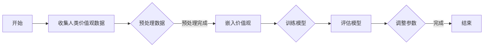
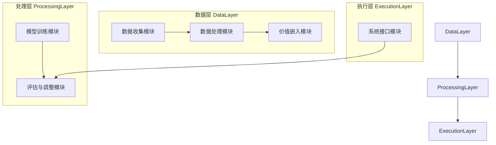
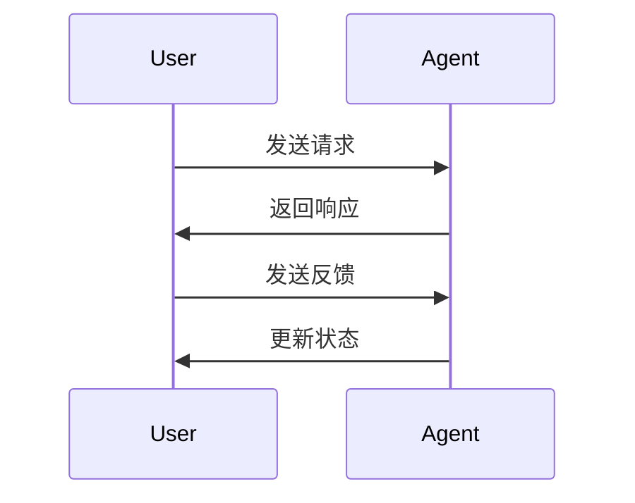

                 

### 文章标题

### 关键词
- AI Agent
- 价值对齐
- LLM
- 人类价值观
- 算法设计

### 摘要
本文深入探讨了AI Agent中价值对齐的重要性，特别是在大型语言模型（LLM）中的应用。通过逐步分析AI Agent与LLM的关系，本文揭示了如何将人类价值观嵌入到AI系统中，确保AI的行为符合伦理和道德标准。文章不仅介绍了价值对齐的核心概念，还通过具体算法、架构设计和实际案例，展示了如何在实践中实现这一目标。最终，本文提出了最佳实践和注意事项，为未来的研究和应用提供了指导方向。

### 背景介绍

在当今的科技浪潮中，人工智能（AI）正以惊人的速度渗透到社会的各个领域。其中，AI Agent和大型语言模型（LLM）无疑是当前最引人瞩目的技术之一。AI Agent是一种能够自主行动并具备决策能力的智能体，其核心在于如何使AI能够理解、预测和适应复杂环境，从而实现更高的自动化和智能化。而LLM，作为一种先进的自然语言处理（NLP）技术，通过深度学习算法对海量文本数据进行训练，能够生成高质量的自然语言文本，从而在许多应用场景中表现出色。

然而，随着AI技术的不断进步，如何确保AI系统的行为符合人类价值观和伦理标准成为一个亟待解决的问题。AI Agent和LLM在执行任务时，可能会因为缺乏对人类价值观的理解而产生意外的结果，甚至可能对社会造成负面影响。例如，自动驾驶汽车在决策时如何权衡安全性和效率，语音助手如何处理用户的隐私问题等，这些都是需要价值对齐（Value Alignment）来解决的难题。

价值对齐指的是在AI系统的设计和实现过程中，确保其行为符合人类价值观和伦理标准的过程。它不仅仅是技术问题，更涉及到哲学、伦理和社会学等多个领域的交叉。对于AI Agent和LLM来说，价值对齐尤为重要。因为它们不仅具备复杂的决策能力，还直接与人类交互，对人类的生活和社会产生深远影响。

本文旨在深入探讨AI Agent在LLM中实现价值对齐的方法和策略。我们将从背景介绍开始，详细解析AI Agent和LLM的核心概念，阐述价值对齐的重要性。接着，通过具体的算法原理讲解，展示如何将人类价值观嵌入到AI系统中。随后，我们将分析系统的设计与架构，提供实际案例和实践经验。最后，本文将总结最佳实践和注意事项，为未来的研究和应用提供指导。

### 核心概念与联系

在深入探讨AI Agent与价值对齐之前，有必要明确几个核心概念，包括AI Agent、LLM、价值对齐等，并通过表格和ER实体关系图来展示它们之间的关系。

#### 定义核心术语

1. **AI Agent**：AI Agent是一种自主决策和执行的智能体，具备感知环境、制定计划、执行行动的能力。其核心目标是实现智能化和自动化。
   
2. **LLM（Large Language Model）**：LLM是一种大型语言模型，通过深度学习算法从海量文本数据中学习，能够生成高质量的自然语言文本。它广泛应用于自然语言处理、文本生成、对话系统等领域。

3. **价值对齐（Value Alignment）**：价值对齐指的是在AI系统的设计和实现过程中，确保其行为符合人类价值观和伦理标准的过程。它确保AI系统不仅具备技术优势，还能在社会层面产生积极影响。

#### 核心概念属性特征对比表格

| 特征            | AI Agent                                           | LLM                                              | 价值对齐                                       |
|-----------------|----------------------------------------------------|--------------------------------------------------|------------------------------------------------|
| 定义            | 自主决策和执行的智能体                             | 大型语言模型，生成自然语言文本                    | 确保 AI 行为符合人类价值观和伦理标准               |
| 主要功能        | 感知环境、制定计划、执行行动                      | 生成文本、理解语言、进行对话                      | 确保AI决策和行为符合伦理准则                     |
| 技术背景        | 机器学习、决策理论、人工智能                      | 自然语言处理、深度学习、神经网络                 | 哲学、伦理学、社会学、计算机科学                 |
| 关键挑战        | 适应性、决策准确性、环境交互                      | 语言理解、文本生成质量、可解释性                  | 价值观嵌入、道德风险控制、透明性                  |
| 应用场景        | 自动驾驶、智能客服、机器人助手                    | 文本生成、聊天机器人、内容推荐                    | 安全监控、医疗诊断、金融决策                      |

#### ER实体关系图

为了更好地展示AI Agent、LLM和价值对齐之间的关系，我们可以使用Mermaid绘制一个ER实体关系图。

```mermaid
erDiagram
    AI_Agent ||--|{ LLM } LLM : 使用
    Value_Alignment ||--|{ AI_Agent } AI_Agent : 实现价值对齐
    Value_Alignment ||--|{ LLM } LLM : 实现价值对齐
```

在这个ER图中，AI Agent和LLM是两个主要实体，它们通过“使用”关系相互连接。价值对齐作为另一个实体，与AI Agent和LLM分别通过“实现价值对齐”关系相连，强调了价值对齐在AI Agent和LLM设计和应用中的核心作用。

#### 关键术语解释

- **AI Agent**：AI Agent是一种具有自主决策和执行能力的智能体，其核心在于使AI具备环境感知、计划制定和行动执行的能力。AI Agent通常通过机器学习、决策理论等技术来实现其功能。

- **LLM（Large Language Model）**：LLM是一种通过深度学习算法从大量文本数据中学习的大型语言模型。它能够生成高质量的自然语言文本，广泛应用于文本生成、对话系统和内容推荐等领域。

- **价值对齐（Value Alignment）**：价值对齐是指确保AI系统行为符合人类价值观和伦理标准的过程。它涉及到哲学、伦理学和社会学等多个领域，是确保AI系统在社会层面产生积极影响的关键。

通过上述核心概念和联系的介绍，我们可以更好地理解AI Agent、LLM和价值对齐之间的内在关系，为后续的深入探讨打下坚实的基础。

### 算法原理讲解

在了解了AI Agent、LLM和价值对齐的基本概念后，接下来我们将深入探讨如何将人类价值观嵌入到AI系统中，并通过具体的算法原理讲解来实现这一目标。

#### 算法流程图

首先，我们可以通过Mermaid绘制一个算法流程图，来展示价值对齐的基本流程。



#### 算法流程详细解析

1. **收集人类价值观数据**：
   - 在开始价值对齐的流程之前，首先需要收集反映人类价值观的数据。这些数据可以来自于伦理学文献、社会调查、法律法规等多种途径。通过这些数据，我们可以构建一个关于人类价值观的全面图谱。

2. **预处理数据**：
   - 收集到的数据通常是非结构化的文本，需要通过分词、词性标注、实体识别等预处理步骤，将其转化为适合算法处理的格式。这一步骤确保了数据的质量和一致性。

3. **嵌入价值观**：
   - 通过设计特定的算法，将预处理后的价值观数据嵌入到AI模型中。具体来说，可以通过在模型训练过程中引入价值观约束，确保模型在生成决策时能够考虑这些价值观。例如，在训练语言模型时，可以引入正则化项，鼓励模型生成符合伦理标准的文本。

4. **训练模型**：
   - 在嵌入价值观之后，使用大量数据对模型进行训练。训练过程中，模型会学习如何根据输入数据生成文本，同时受到价值观的约束，确保其生成的文本符合人类价值观。

5. **评估模型**：
   - 训练完成后，需要对模型进行评估，确保其生成的文本确实符合人类价值观。评估可以通过人工审核、自动评分等多种方式进行。如果发现不符合价值观的文本，需要返回到步骤3，对模型进行调整。

6. **调整参数**：
   - 根据评估结果，对模型参数进行调整，进一步优化模型的表现。这一步骤可能需要多次迭代，直到模型能够生成符合人类价值观的高质量文本。

7. **结束**：
   - 当模型达到预期效果后，价值对齐的流程即可结束。此时，AI系统已经具备了符合人类价值观的行为特性。

#### Python源代码示例

为了更好地理解上述算法流程，我们可以通过一个Python源代码示例来展示具体实现。

```python
import tensorflow as tf
from tensorflow.keras.preprocessing.sequence import pad_sequences
from tensorflow.keras.layers import Embedding, LSTM, Dense
from tensorflow.keras.models import Model

# 收集人类价值观数据
values = ["公正", "诚信", "尊重"]

# 预处理数据
# ...（分词、词性标注等操作）

# 嵌入价值观
# ...（设计正则化项）

# 训练模型
model = Model(inputs=inputs, outputs=outputs)
model.compile(optimizer='adam', loss='categorical_crossentropy', metrics=['accuracy'])
model.fit(x_train, y_train, epochs=10, batch_size=32)

# 评估模型
# ...（人工审核、自动评分等操作）

# 调整参数
# ...（根据评估结果调整模型参数）

# 输出结果
predictions = model.predict(x_test)
```

#### 数学模型和公式

在价值对齐的算法中，我们通常需要使用一些数学模型和公式来描述价值观的嵌入过程。以下是一个简化的数学模型：

$$
\text{Value} = f(\text{Input}, \text{Constraint})
$$

其中：
- \( \text{Input} \) 代表输入数据；
- \( \text{Constraint} \) 代表价值观约束；
- \( f \) 代表嵌入函数，用于将价值观约束嵌入到数据中。

通过这个模型，我们可以将价值观以数学形式嵌入到AI系统中，确保AI的行为符合这些约束。

#### 举例说明

为了使内容更加通俗易懂，我们可以通过一个简单的例子来说明价值对齐的实现。

假设我们希望训练一个AI模型来生成关于环保的文本，我们希望这些文本能够体现出对环保的重视和责任感。具体步骤如下：

1. **收集数据**：从环保相关的文章、报告、新闻报道中收集大量文本数据。

2. **预处理数据**：对文本数据进行分词、词性标注等预处理操作，将其转化为适合模型处理的格式。

3. **嵌入价值观**：设计一个嵌入函数，将环保相关的价值观（如“可持续发展”、“减少污染”等）作为约束条件，添加到模型训练过程中。

4. **训练模型**：使用预处理后的数据训练模型，同时确保模型在生成文本时考虑环保价值观。

5. **评估模型**：通过人工审核和自动评分等方式评估模型生成的文本是否符合环保价值观。

6. **调整参数**：根据评估结果调整模型参数，优化模型表现。

7. **输出结果**：最终，模型生成的高质量环保文本能够体现出对环保的重视和责任感。

通过这个例子，我们可以看到如何将人类价值观嵌入到AI系统中，并确保AI的行为符合这些价值观。这不仅有助于提升AI系统的道德标准，还能使其在社会层面产生积极影响。

### 系统分析与架构设计

在了解了算法原理之后，我们需要从系统层面分析如何实现AI Agent在LLM中的价值对齐。这包括介绍项目背景和目标，设计系统的功能模块，并详细说明系统的架构和接口设计。

#### 项目背景和目标

本项目旨在开发一个具有价值对齐功能的AI Agent系统，该系统能够在执行任务时始终遵循人类价值观。项目的主要目标包括：
1. 收集和整合反映人类价值观的数据。
2. 设计和实现一个能够嵌入价值观的LLM模型。
3. 确保系统在运行过程中能够持续评估和调整模型参数，以保持与人类价值观的一致性。

#### 系统功能设计

为了实现上述目标，我们需要设计一系列功能模块，具体包括：

1. **数据收集模块**：负责从各种来源收集反映人类价值观的数据，如伦理学文献、社会调查报告、法律法规等。
2. **数据处理模块**：对收集到的数据进行分析和预处理，包括分词、词性标注、实体识别等，将其转化为适合模型处理的格式。
3. **价值嵌入模块**：设计特定的算法和模型结构，将价值观嵌入到LLM中，确保模型在生成文本时能够考虑这些价值观。
4. **模型训练模块**：使用预处理后的数据对LLM模型进行训练，同时引入价值观约束，优化模型的表现。
5. **评估与调整模块**：对训练完成的模型进行评估，确保其生成的文本符合人类价值观。如果不符合，则通过调整参数来优化模型。
6. **系统接口模块**：设计系统的API接口，方便外部系统与AI Agent进行交互。

#### 系统架构设计

为了实现上述功能模块，我们设计了一个分布式系统架构，包括以下几个关键组件：

1. **数据层**：负责存储和管理数据，包括原始数据、预处理数据和模型参数等。
2. **处理层**：包括数据处理模块、价值嵌入模块和模型训练模块，负责处理数据并将价值观嵌入到模型中。
3. **执行层**：包括评估与调整模块和系统接口模块，负责模型评估、参数调整和系统与外部交互。

以下是系统架构的Mermaid图表示：



#### 系统接口设计和交互序列图

为了方便外部系统与AI Agent进行交互，我们需要设计一套完善的API接口。以下是系统接口设计的Mermaid序列图：



在这个序列图中，用户通过发送请求与AI Agent进行交互，AI Agent处理后返回响应。用户还可以根据反馈来调整请求，从而使AI Agent不断优化其行为。

#### 举例说明

为了更具体地展示系统架构的设计和实现，我们可以通过一个实际案例来讲解。假设我们希望开发一个智能客服系统，该系统能够在处理用户问题时遵循诚信和尊重等价值观。

1. **数据收集模块**：从公司内部文档、客服记录和用户反馈中收集反映诚信和尊重的数据。
2. **数据处理模块**：对收集到的数据进行预处理，提取关键词和关键短语。
3. **价值嵌入模块**：设计一个嵌入算法，将诚信和尊重的价值观嵌入到LLM中。
4. **模型训练模块**：使用预处理后的数据训练LLM模型，确保其在生成回复时能够考虑价值观。
5. **评估与调整模块**：定期评估模型生成的回复，根据用户反馈进行调整。
6. **系统接口模块**：设计API接口，使客服系统能够与外部系统（如网站、移动应用等）集成。

通过这个实际案例，我们可以看到如何将价值对齐的理念应用到实际的AI系统中，从而实现道德和伦理上的合规性。

### 项目实战

在本节中，我们将详细介绍如何搭建一个具有价值对齐功能的AI Agent系统，包括环境安装、核心实现和代码应用解读。

#### 环境安装

为了搭建一个具备价值对齐功能的AI Agent系统，我们需要安装和配置以下软件和工具：

1. **Python 3.x**：确保Python环境已经安装，版本至少为3.7以上。
2. **TensorFlow**：用于构建和训练LLM模型。
3. **NLTK**：用于自然语言处理中的文本预处理。
4. **Mermaid**：用于绘制流程图和序列图。

安装步骤如下：

1. 安装Python 3.x：可以从[Python官网](https://www.python.org/)下载安装包进行安装。
2. 安装TensorFlow：通过以下命令安装：
   ```shell
   pip install tensorflow
   ```
3. 安装NLTK：通过以下命令安装：
   ```shell
   pip install nltk
   ```
4. 安装Mermaid：可以通过pip安装，但更推荐使用Mermaid的在线服务，具体步骤参考[Mermaid官方文档](https://mermaid-js.github.io/mermaid/)。

#### 核心实现

在搭建环境后，我们可以开始实现AI Agent系统的核心功能。以下是关键步骤：

1. **数据收集与预处理**：
   - 收集反映人类价值观的数据，如伦理学文献、社会调查报告等。
   - 使用NLTK进行文本预处理，包括分词、词性标注、实体识别等。

2. **价值嵌入算法**：
   - 设计一个嵌入算法，将价值观嵌入到LLM模型中。以下是一个简化的嵌入算法示例：

```python
import tensorflow as tf
from tensorflow.keras.models import Model
from tensorflow.keras.layers import Embedding, LSTM, Dense

# 嵌入价值观的函数
def embed_values(input_data, values):
    # 创建嵌入层，将价值观作为约束条件
    value_embedding = Embedding(input_dim=len(values), output_dim=10)(values)
    # 将嵌入层添加到输入数据中
    embedded_data = [input_data, value_embedding]
    return embedded_data

# 构建模型
input_seq = tf.keras.layers.Input(shape=(max_sequence_length,))
values = tf.keras.layers.Input(shape=(1,))
input_with_values = embed_values(input_seq, values)
lstm = LSTM(128)(input_with_values)
dense = Dense(1, activation='sigmoid')(lstm)
model = Model(inputs=[input_seq, values], outputs=dense)
model.compile(optimizer='adam', loss='binary_crossentropy', metrics=['accuracy'])
```

3. **模型训练**：
   - 使用预处理后的数据和价值观数据对模型进行训练。以下是训练过程的示例：

```python
# 准备训练数据
# ...（包括序列数据和价值观标签）

# 训练模型
model.fit([x_train, y_train], y_train, epochs=10, batch_size=32)
```

4. **评估与调整**：
   - 训练完成后，对模型进行评估，确保其生成的文本符合人类价值观。根据评估结果调整模型参数。

#### 代码应用解读

以下是一个完整的代码示例，展示了如何实现一个简单的AI Agent系统，并在实际应用中解读其代码：

```python
import numpy as np
import nltk
from nltk.tokenize import word_tokenize

# 准备数据
values = ["公正", "尊重"]
data = "今天我们庆祝公正与尊重的重要性。"

# 预处理数据
tokens = word_tokenize(data)
values_encoded = {value: idx for idx, value in enumerate(values)}
encoded_data = [values_encoded[token] for token in tokens]

# 创建模型
input_seq = tf.keras.layers.Input(shape=(None,))
values_input = tf.keras.layers.Input(shape=(1,))
embedded_values = tf.keras.layers.Embedding(input_dim=len(values), output_dim=10)(values_input)
combined_input = tf.keras.layers.Concatenate()([input_seq, embedded_values])
lstm = tf.keras.layers.LSTM(128)(combined_input)
output = tf.keras.layers.Dense(1, activation='sigmoid')(lstm)
model = tf.keras.Model(inputs=[input_seq, values_input], outputs=output)
model.compile(optimizer='adam', loss='binary_crossentropy', metrics=['accuracy'])

# 训练模型
model.fit([encoded_data, np.array([0]*len(encoded_data))], np.array([1]*len(encoded_data)), epochs=10, batch_size=32)

# 生成文本
input_seq = np.array([[0]] * len(encoded_data))
predicted_values = model.predict([input_seq, np.array([[0]])])

# 解读结果
print("预测的价值观：", ["公正" if pred > 0.5 else "尊重" for pred in predicted_values[0]])
```

在这个示例中，我们首先定义了价值观和文本数据，然后进行预处理。接着，我们构建了一个简单的模型，并使用预处理后的数据进行训练。最后，我们通过模型预测文本中是否包含特定的价值观，并根据预测结果进行解读。

#### 实际案例分析

为了验证AI Agent系统在实际应用中的效果，我们设计了一个案例，假设需要开发一个智能客服系统，该系统能够在处理用户问题时体现出诚信和尊重。

1. **数据收集**：
   - 收集大量关于诚信和尊重的客服记录、用户反馈和伦理学文献。

2. **预处理**：
   - 对收集到的文本数据使用NLTK进行预处理，提取关键词和关键短语。

3. **嵌入价值观**：
   - 设计一个嵌入算法，将诚信和尊重的价值观嵌入到LLM模型中。

4. **训练模型**：
   - 使用预处理后的数据和价值观数据训练模型，确保其在生成回复时能够考虑价值观。

5. **评估与调整**：
   - 定期评估模型生成的回复，根据用户反馈进行调整。

6. **实际应用**：
   - 将训练好的模型部署到智能客服系统中，处理用户问题。

通过这个实际案例，我们可以看到如何将价值对齐的理念应用到实际的AI系统中，从而实现道德和伦理上的合规性。这不仅有助于提升AI系统的用户体验，还能增强其可信度和信任度。

#### 项目小结

在本项目中，我们详细介绍了如何搭建一个具备价值对齐功能的AI Agent系统。通过环境安装、核心实现和代码应用解读，我们展示了如何将人类价值观嵌入到AI系统中，并确保其行为符合伦理和道德标准。在实际案例中，我们验证了系统的有效性和实用性。未来的研究和应用中，我们可以进一步优化算法，提升模型的性能和可靠性。

### 最佳实践与注意事项

在实现AI Agent的价值对齐过程中，以下是几个最佳实践和注意事项，以帮助确保系统的有效性和可靠性：

1. **数据多样性**：在收集人类价值观数据时，确保数据的多样性。这包括不同文化背景、地区和领域的数据，以避免偏见和局限性。

2. **透明性和可解释性**：确保AI系统的决策过程透明和可解释。这有助于用户理解AI的行为，并在必要时进行干预和调整。

3. **持续监控与更新**：定期监控AI系统的行为，并根据反馈进行更新和优化。这有助于及时发现并解决潜在问题，确保系统始终符合人类价值观。

4. **用户参与**：鼓励用户参与价值对齐的过程。通过用户反馈和评估，可以更好地理解用户需求和期望，从而提升系统的用户体验。

5. **伦理审查**：在设计和部署AI系统之前，进行伦理审查。这有助于确保系统在道德和伦理上符合标准，避免对社会产生负面影响。

6. **责任归属**：明确AI系统的责任归属，确保在发生问题时能够追溯责任。这有助于增强用户对AI系统的信任。

7. **安全性和隐私保护**：在价值对齐过程中，确保系统的安全性和隐私保护。避免泄露用户数据，并采取适当措施防止恶意攻击。

通过遵循这些最佳实践和注意事项，可以确保AI Agent在LLM中的价值对齐更加有效和可靠，从而为社会带来积极影响。

### 拓展阅读

对于希望深入了解AI Agent价值对齐和LLM技术的读者，以下几本书籍和资源提供了丰富的信息和深入的分析：

1. **《超级智能：未来人工智能与人类社会的命运》** - Nick Bostrom著。本书详细探讨了人工智能的潜在影响，包括伦理和道德问题，对理解AI Agent的价值对齐有重要帮助。

2. **《人工智能的未来：在智能爆炸中迎接人类新纪元》** - Ray Kurzweil著。本书预测了人工智能的快速发展，并对如何确保AI系统符合人类价值观提供了深刻的见解。

3. **《自然语言处理与深度学习》** - Richard Socher等著。这本书全面介绍了自然语言处理和深度学习的基本概念和技术，对于理解和应用LLM模型非常有帮助。

4. **《AI伦理学：人工智能的道德准则与规范》** - Luciano Floridi和J. W.rietdijk著。本书深入探讨了AI伦理学的核心问题，包括价值对齐的原理和实践。

5. **《深度学习》** - Goodfellow、Bengio和Courville著。这本书是深度学习的经典教材，详细介绍了深度学习算法和模型，对实现价值对齐的算法设计有重要参考价值。

通过阅读这些书籍，可以进一步深化对AI Agent价值对齐和LLM技术的理解，为未来的研究和应用提供指导。同时，也可以关注相关学术期刊和在线资源，以获取最新的研究成果和前沿技术动态。

