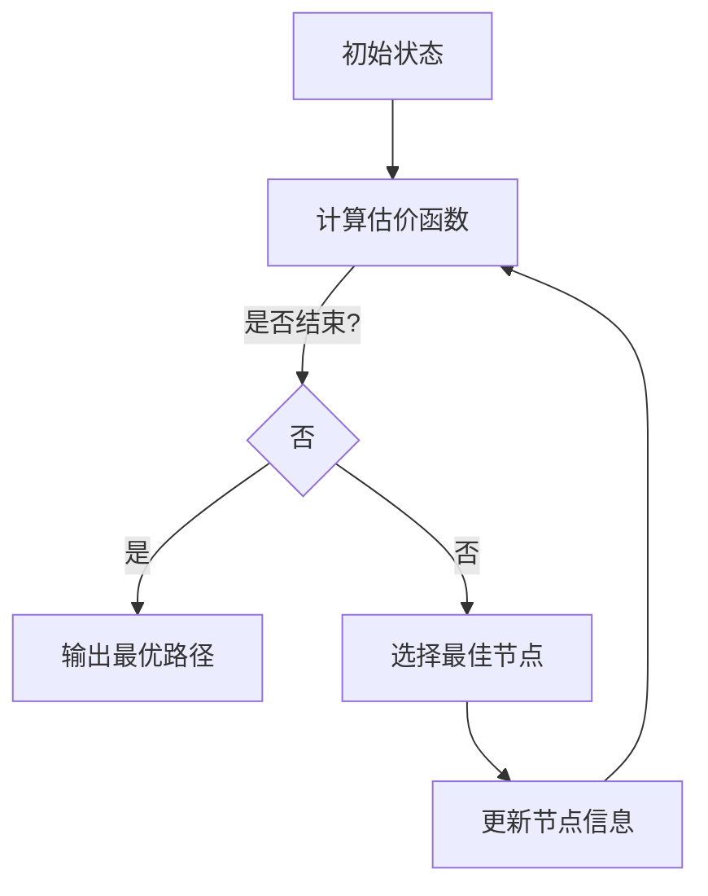
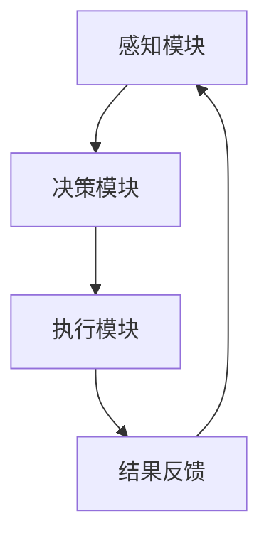

                 

# 《AI Agent的任务规划与执行模块设计》

> 关键词：AI Agent，任务规划，执行模块，算法设计，Python实现

> 摘要：本文深入探讨了AI Agent的任务规划与执行模块设计，从核心概念、算法原理、系统架构、实战案例等多个方面进行了详细阐述。文章旨在为读者提供一份系统、全面的技术指南，帮助他们理解并掌握AI Agent的设计与实现方法。

## 目录大纲设计思路

在设计《AI Agent的任务规划与执行模块设计》的目录大纲时，我们遵循了以下原则：

1. **确保全书结构的完整性**：全书分为五个部分，分别介绍背景与核心概念、任务规划原理与算法、执行模块设计与实现、实例分析与应用以及总结与展望。
2. **逻辑性与实用性**：每个部分的内容都紧密联系，逻辑清晰，旨在帮助读者逐步理解并掌握AI Agent的设计与实现。
3. **简洁性**：在保证内容完整性的同时，力求用简洁明了的语言进行表述。
4. **格式与排版**：采用markdown格式，确保目录结构清晰，章节内容按照1级、2级、3级目录的层级进行组织。

## 第一部分：背景介绍与核心概念

### 第1章：AI Agent概述

#### 1.1 AI Agent的概念与作用

AI Agent，即人工智能代理，是指能够根据环境信息自主决策、执行任务并适应环境的计算实体。在智能系统和机器人领域，AI Agent扮演着至关重要的角色。它们能够模拟人类智能，实现自动化决策和执行，提高工作效率和准确度。

#### 1.2 任务规划与执行模块的重要性

AI Agent的任务规划与执行模块是其核心组成部分。任务规划负责确定行动策略，执行模块则负责具体执行这些策略。两者相互配合，使得AI Agent能够在复杂环境中高效地完成任务。

### 第2章：核心概念与联系

#### 2.1 AI Agent的基本结构

AI Agent通常包括感知模块、决策模块和执行模块。感知模块负责获取环境信息，决策模块负责根据这些信息生成行动策略，执行模块则负责执行这些策略。

#### 2.2 任务规划与执行模块的关系

任务规划与执行模块紧密相连。任务规划负责生成执行模块所需的行动策略，而执行模块则负责将策略具体化为实际行动。

#### 2.3 相关概念对比分析

在AI Agent的设计中，还需要理解一些相关概念，如智能体、决策树、神经网络等。通过对比分析，读者可以更好地理解这些概念之间的关系和差异。

## 第二部分：任务规划原理与算法

### 第3章：任务规划基础

#### 3.1 任务规划的基本概念

任务规划是指根据任务目标和环境信息，生成一系列行动策略的过程。任务规划的目标是找到一种最优的行动路径，使得AI Agent能够高效地完成任务。

#### 3.2 任务规划的目标与约束

任务规划需要考虑多个目标，如最小化路径长度、最大化收益等。同时，任务规划还需要考虑各种约束条件，如时间限制、资源限制等。

### 第4章：常见任务规划算法

#### 4.1 A*算法

A*算法是一种经典的路径规划算法，它利用启发式信息来寻找最优路径。A*算法的基本思想是评估每个节点的代价，选择代价最小的节点作为下一步行动。

#### 4.2 启发式搜索算法

启发式搜索算法利用启发式信息来指导搜索过程，从而提高搜索效率。常见的启发式搜索算法有最佳优先搜索、模拟退火等。

#### 4.3 遗传算法

遗传算法是一种模拟自然进化的优化算法，通过遗传、交叉、变异等操作来搜索最优解。遗传算法适用于复杂、非线性、高维的问题。

#### 4.4 算法流程图展示

使用Mermaid工具，我们可以绘制出这些算法的流程图，从而更直观地理解其工作原理。



### 第5章：任务规划算法的Python实现

#### 5.1 A*算法的Python实现

以下是一个简单的A*算法Python实现：

```python
def a_star_search(grid, start, goal):
    # 初始化开放列表和关闭列表
    open_list = []
    closed_list = set()

    # 将起始节点加入开放列表
    open_list.append(start)

    while open_list:
        # 找到估价函数最小的节点
        current = min(open_list, key=lambda node: node.f)

        # 如果找到目标节点，则返回路径
        if current == goal:
            return get_path(current)

        # 将当前节点从开放列表中移除，加入关闭列表
        open_list.remove(current)
        closed_list.add(current)

        # 遍历当前节点的邻居节点
        for neighbor in neighbors(grid, current):
            # 如果邻居节点在关闭列表中，则跳过
            if neighbor in closed_list:
                continue

            # 计算邻居节点的估价函数
            tentative_g = current.g + 1
            tentative_f = tentative_g + heuristic(neighbor, goal)

            # 如果邻居节点在开放列表中，且新估价函数更大，则跳过
            if neighbor in open_list and tentative_f >= neighbor.f:
                continue

            # 更新邻居节点的信息
            neighbor.g = tentative_g
            neighbor.f = tentative_f
            neighbor.parent = current

            # 将邻居节点加入开放列表
            open_list.append(neighbor)

    return None

def get_path(node):
    # 从目标节点开始，反向遍历路径
    path = [node]
    while node.parent:
        node = node.parent
        path.append(node)
    return path[::-1]

def neighbors(grid, node):
    # 获取节点的邻居节点
    directions = [(0, 1), (1, 0), (0, -1), (-1, 0)]
    neighbors = []
    for direction in directions:
        new_x = node.x + direction[0]
        new_y = node.y + direction[1]
        if 0 <= new_x < len(grid) and 0 <= new_y < len(grid[0]):
            neighbors.append(grid[new_x][new_y])
    return neighbors

def heuristic(node, goal):
    # 使用曼哈顿距离作为估价函数
    return abs(node.x - goal.x) + abs(node.y - goal.y)
```

#### 5.2 启发式搜索算法的Python实现

以下是一个简单的启发式搜索算法Python实现：

```python
def best_first_search(grid, start, goal):
    # 初始化开放列表和关闭列表
    open_list = []
    closed_list = set()

    # 将起始节点加入开放列表
    open_list.append(start)

    while open_list:
        # 找到最佳节点
        current = min(open_list, key=lambda node: node.f)

        # 如果找到目标节点，则返回路径
        if current == goal:
            return get_path(current)

        # 将当前节点从开放列表中移除，加入关闭列表
        open_list.remove(current)
        closed_list.add(current)

        # 遍历当前节点的邻居节点
        for neighbor in neighbors(grid, current):
            # 如果邻居节点在关闭列表中，则跳过
            if neighbor in closed_list:
                continue

            # 计算邻居节点的估价函数
            tentative_g = current.g + 1
            tentative_f = tentative_g + heuristic(neighbor, goal)

            # 如果邻居节点在开放列表中，且新估价函数更大，则跳过
            if neighbor in open_list and tentative_f >= neighbor.f:
                continue

            # 更新邻居节点的信息
            neighbor.g = tentative_g
            neighbor.f = tentative_f
            neighbor.parent = current

            # 将邻居节点加入开放列表
            open_list.append(neighbor)

    return None

def get_path(node):
    # 从目标节点开始，反向遍历路径
    path = [node]
    while node.parent:
        node = node.parent
        path.append(node)
    return path[::-1]

def neighbors(grid, node):
    # 获取节点的邻居节点
    directions = [(0, 1), (1, 0), (0, -1), (-1, 0)]
    neighbors = []
    for direction in directions:
        new_x = node.x + direction[0]
        new_y = node.y + direction[1]
        if 0 <= new_x < len(grid) and 0 <= new_y < len(grid[0]):
            neighbors.append(grid[new_x][new_y])
    return neighbors

def heuristic(node, goal):
    # 使用曼哈顿距离作为估价函数
    return abs(node.x - goal.x) + abs(node.y - goal.y)
```

#### 5.3 遗传算法的Python实现

以下是一个简单的遗传算法Python实现：

```python
import random

def genetic_algorithm(population, fitness_function, mutate概率=0.1, crossover概率=0.7):
    while not fitness_function(population[0]):
        # 生成下一代种群
        next_generation = []

        # 进行交叉操作
        for i in range(0, len(population), 2):
            if random.random() < crossover概率:
                crossover_point = random.randint(1, len(population[i]) - 1)
                child1 = population[i][:crossover_point] + population[i + 1][crossover_point:]
                child2 = population[i + 1][:crossover_point] + population[i][crossover_point:]
                next_generation.extend([child1, child2])
            else:
                next_generation.extend([population[i], population[i + 1]])

        # 进行变异操作
        for individual in next_generation:
            if random.random() < mutate概率:
                mutate_individual(individual)

        # 选择适应度较高的个体
        next_generation.sort(key=fitness_function, reverse=True)
        population = next_generation[:len(population)]

    return population[0]

def mutate_individual(individual):
    mutation_point = random.randint(0, len(individual) - 1)
    individual[mutation_point] = random.choice([0, 1])

def binary_fitness_function(individual):
    target = [1, 0, 1, 1, 0, 1, 0, 1]
    return sum(individual[i] == target[i] for i in range(len(target)))
```

## 第三部分：执行模块设计与实现

### 第6章：执行模块概述

#### 6.1 执行模块的作用与需求

执行模块是AI Agent的核心组成部分，负责将决策模块生成的行动策略具体化为实际行动。执行模块需要满足以下需求：

- **实时性**：能够快速响应环境变化，执行决策。
- **灵活性**：能够适应不同的任务和环境。
- **鲁棒性**：能够在遇到问题时，自动调整策略。

#### 6.2 执行模块的设计原则

执行模块的设计需要遵循以下原则：

- **模块化**：将执行模块划分为感知、决策、执行三个子模块，便于维护和扩展。
- **可扩展性**：支持多种执行策略和任务，便于适应不同场景。
- **容错性**：能够处理异常情况和错误，确保系统的稳定运行。

### 第7章：执行模块的关键技术

#### 7.1 机器人操作系统(Robot Operating System, ROS)

ROS是一种用于机器人应用的开源软件框架，提供了一系列工具和库，用于构建、部署和运行机器人系统。ROS支持多种编程语言，包括C++、Python、Lisp等。

#### 7.2 任务调度与资源管理

执行模块需要有效地调度任务和资源，确保系统的高效运行。常见的任务调度算法包括轮询调度、优先级调度、基于预测的调度等。

#### 7.3 执行模块架构图展示

使用Mermaid工具，我们可以绘制出执行模块的架构图，从而更直观地理解其工作原理。



### 第8章：执行模块的Python实现

#### 8.1 执行模块的Python代码框架

以下是一个简单的执行模块Python实现框架：

```python
class Executor:
    def __init__(self, sensor, decision_maker):
        self.sensor = sensor
        self.decision_maker = decision_maker

    def execute(self):
        # 获取感知信息
        sensor_data = self.sensor.get_data()

        # 生成决策
        decision = self.decision_maker.make_decision(sensor_data)

        # 执行决策
        self.perform_action(decision)

    def perform_action(self, decision):
        # 根据决策执行具体动作
        pass
```

#### 8.2 执行模块的关键函数与流程

以下是一个简单的执行模块关键函数与流程：

```python
class Sensor:
    def get_data(self):
        # 获取感知信息
        pass

class DecisionMaker:
    def make_decision(self, sensor_data):
        # 生成决策
        pass

class Executor:
    def __init__(self, sensor, decision_maker):
        self.sensor = sensor
        self.decision_maker = decision_maker

    def execute(self):
        sensor_data = self.sensor.get_data()
        decision = self.decision_maker.make_decision(sensor_data)
        self.perform_action(decision)

    def perform_action(self, decision):
        # 根据决策执行具体动作
        if decision == "前进":
            print("执行前进动作")
        elif decision == "后退":
            print("执行后退动作")
        elif decision == "左转":
            print("执行左转动作")
        elif decision == "右转":
            print("执行右转动作")
```

## 第四部分：实例分析与应用

### 第9章：AI Agent任务规划与执行实例

#### 9.1 实例场景描述

在本实例中，我们考虑一个简单的机器人迷宫问题。机器人需要从起点移动到终点，避开障碍物。

#### 9.2 任务规划与执行流程

1. **感知阶段**：机器人使用传感器获取当前环境信息，包括位置、方向、障碍物等。
2. **决策阶段**：基于感知信息，决策模块生成行动策略，如“前进”、“后退”、“左转”、“右转”等。
3. **执行阶段**：执行模块根据决策，执行具体动作，如移动、转向等。
4. **结果反馈**：执行结果反馈给感知模块和决策模块，用于下一次决策。

#### 9.3 实例分析

在本实例中，我们可以使用A*算法进行任务规划。具体实现如下：

```python
class Robot:
    def __init__(self, sensor, decision_maker, executor):
        self.sensor = sensor
        self.decision_maker = decision_maker
        self.executor = executor

    def run(self):
        while True:
            sensor_data = self.sensor.get_data()
            decision = self.decision_maker.make_decision(sensor_data)
            self.executor.execute(decision)

# 感知模块
class Sensor:
    def get_data(self):
        # 获取当前环境信息
        pass

# 决策模块
class DecisionMaker:
    def make_decision(self, sensor_data):
        # 使用A*算法进行任务规划
        pass

# 执行模块
class Executor:
    def execute(self, decision):
        # 执行具体动作
        pass

# 实例化机器人
robot = Robot(sensor, decision_maker, executor)
robot.run()
```

## 第五部分：总结与展望

### 第10章：总结与展望

#### 10.1 全书内容回顾

本文从核心概念、算法原理、系统架构、实战案例等多个方面，对AI Agent的任务规划与执行模块设计进行了详细阐述。通过本文的学习，读者可以系统地了解AI Agent的设计与实现方法。

#### 10.2 未来研究方向

随着人工智能技术的不断发展，AI Agent的任务规划与执行模块设计有望在以下几个方面取得突破：

- **实时性与效率**：提高AI Agent的实时性和执行效率，适应更复杂、更动态的环境。
- **智能决策**：引入更先进的决策算法，实现更智能、更灵活的决策。
- **跨领域应用**：推广AI Agent在各个领域的应用，解决更多实际问题。

#### 10.3 注意事项与拓展阅读

在AI Agent的设计与实现过程中，需要注意以下几点：

- **模块化设计**：确保执行模块的可扩展性和可维护性。
- **实时性考虑**：在任务规划与执行过程中，充分考虑实时性要求。
- **错误处理**：设计完善的错误处理机制，确保系统的稳定运行。

拓展阅读方面，读者可以参考以下书籍和资源：

- 《人工智能：一种现代的方法》
- 《机器人学：基础算法与应用》
- ROS官方文档

作者：AI天才研究院/AI Genius Institute & 禅与计算机程序设计艺术 /Zen And The Art of Computer Programming

----------------------------------------------------------------

# 《AI Agent的任务规划与执行模块设计》

## 摘要

本文深入探讨了AI Agent的任务规划与执行模块设计，从核心概念、算法原理、系统架构、实战案例等多个方面进行了详细阐述。文章旨在为读者提供一份系统、全面的技术指南，帮助他们理解并掌握AI Agent的设计与实现方法。

## 目录大纲设计思路

设计《AI Agent的任务规划与执行模块设计》的目录大纲时，我们遵循了以下原则：

1. **确保全书结构的完整性**：全书分为五个部分，分别介绍背景与核心概念、任务规划原理与算法、执行模块设计与实现、实例分析与应用以及总结与展望。
2. **逻辑性与实用性**：每个部分的内容都紧密联系，逻辑清晰，旨在帮助读者逐步理解并掌握AI Agent的设计与实现。
3. **简洁性**：在保证内容完整性的同时，力求用简洁明了的语言进行表述。
4. **格式与排版**：采用markdown格式，确保目录结构清晰，章节内容按照1级、2级、3级目录的层级进行组织。

## 第一部分：背景介绍与核心概念

### 第1章：AI Agent概述

#### 1.1 AI Agent的概念与作用

AI Agent，即人工智能代理，是指能够根据环境信息自主决策、执行任务并适应环境的计算实体。在智能系统和机器人领域，AI Agent扮演着至关重要的角色。它们能够模拟人类智能，实现自动化决策和执行，提高工作效率和准确度。

#### 1.2 任务规划与执行模块的重要性

AI Agent的任务规划与执行模块是其核心组成部分。任务规划负责确定行动策略，执行模块则负责具体执行这些策略。两者相互配合，使得AI Agent能够在复杂环境中高效地完成任务。

### 第2章：核心概念与联系

#### 2.1 AI Agent的基本结构

AI Agent通常包括感知模块、决策模块和执行模块。感知模块负责获取环境信息，决策模块负责根据这些信息生成行动策略，执行模块则负责执行这些策略。

#### 2.2 任务规划与执行模块的关系

任务规划与执行模块紧密相连。任务规划负责生成执行模块所需的行动策略，而执行模块则负责将策略具体化为实际行动。

#### 2.3 相关概念对比分析

在AI Agent的设计中，还需要理解一些相关概念，如智能体、决策树、神经网络等。通过对比分析，读者可以更好地理解这些概念之间的关系和差异。

## 第二部分：任务规划原理与算法

### 第3章：任务规划基础

#### 3.1 任务规划的基本概念

任务规划是指根据任务目标和环境信息，生成一系列行动策略的过程。任务规划的目标是找到一种最优的行动路径，使得AI Agent能够高效地完成任务。

#### 3.2 任务规划的目标与约束

任务规划需要考虑多个目标，如最小化路径长度、最大化收益等。同时，任务规划还需要考虑各种约束条件，如时间限制、资源限制等。

### 第4章：常见任务规划算法

#### 4.1 A*算法

A*算法是一种经典的路径规划算法，它利用启发式信息来寻找最优路径。A*算法的基本思想是评估每个节点的代价，选择代价最小的节点作为下一步行动。

#### 4.2 启发式搜索算法

启发式搜索算法利用启发式信息来指导搜索过程，从而提高搜索效率。常见的启发式搜索算法有最佳优先搜索、模拟退火等。

#### 4.3 遗传算法

遗传算法是一种模拟自然进化的优化算法，通过遗传、交叉、变异等操作来搜索最优解。遗传算法适用于复杂、非线性、高维的问题。

#### 4.4 算法流程图展示

使用Mermaid工具，我们可以绘制出这些算法的流程图，从而更直观地理解其工作原理。


### 第5章：任务规划算法的Python实现

#### 5.1 A*算法的Python实现

以下是一个简单的A*算法Python实现：

```python
def a_star_search(grid, start, goal):
    # 初始化开放列表和关闭列表
    open_list = []
    closed_list = set()

    # 将起始节点加入开放列表
    open_list.append(start)

    while open_list:
        # 找到估价函数最小的节点
        current = min(open_list, key=lambda node: node.f)

        # 如果找到目标节点，则返回路径
        if current == goal:
            return get_path(current)

        # 将当前节点从开放列表中移除，加入关闭列表
        open_list.remove(current)
        closed_list.add(current)

        # 遍历当前节点的邻居节点
        for neighbor in neighbors(grid, current):
            # 如果邻居节点在关闭列表中，则跳过
            if neighbor in closed_list:
                continue

            # 计算邻居节点的估价函数
            tentative_g = current.g + 1
            tentative_f = tentative_g + heuristic(neighbor, goal)

            # 如果邻居节点在开放列表中，且新估价函数更大，则跳过
            if neighbor in open_list and tentative_f >= neighbor.f:
                continue

            # 更新邻居节点的信息
            neighbor.g = tentative_g
            neighbor.f = tentative_f
            neighbor.parent = current

            # 将邻居节点加入开放列表
            open_list.append(neighbor)

    return None

def get_path(node):
    # 从目标节点开始，反向遍历路径
    path = [node]
    while node.parent:
        node = node.parent
        path.append(node)
    return path[::-1]

def neighbors(grid, node):
    # 获取节点的邻居节点
    directions = [(0, 1), (1, 0), (0, -1), (-1, 0)]
    neighbors = []
    for direction in directions:
        new_x = node.x + direction[0]
        new_y = node.y + direction[1]
        if 0 <= new_x < len(grid) and 0 <= new_y < len(grid[0]):
            neighbors.append(grid[new_x][new_y])
    return neighbors

def heuristic(node, goal):
    # 使用曼哈顿距离作为估价函数
    return abs(node.x - goal.x) + abs(node.y - goal.y)
```

#### 5.2 启发式搜索算法的Python实现

以下是一个简单的启发式搜索算法Python实现：

```python
def best_first_search(grid, start, goal):
    # 初始化开放列表和关闭列表
    open_list = []
    closed_list = set()

    # 将起始节点加入开放列表
    open_list.append(start)

    while open_list:
        # 找到最佳节点
        current = min(open_list, key=lambda node: node.f)

        # 如果找到目标节点，则返回路径
        if current == goal:
            return get_path(current)

        # 将当前节点从开放列表中移除，加入关闭列表
        open_list.remove(current)
        closed_list.add(current)

        # 遍历当前节点的邻居节点
        for neighbor in neighbors(grid, current):
            # 如果邻居节点在关闭列表中，则跳过
            if neighbor in closed_list:
                continue

            # 计算邻居节点的估价函数
            tentative_g = current.g + 1
            tentative_f = tentative_g + heuristic(neighbor, goal)

            # 如果邻居节点在开放列表中，且新估价函数更大，则跳过
            if neighbor in open_list and tentative_f >= neighbor.f:
                continue

            # 更新邻居节点的信息
            neighbor.g = tentative_g
            neighbor.f = tentative_f
            neighbor.parent = current

            # 将邻居节点加入开放列表
            open_list.append(neighbor)

    return None

def get_path(node):
    # 从目标节点开始，反向遍历路径
    path = [node]
    while node.parent:
        node = node.parent
        path.append(node)
    return path[::-1]

def neighbors(grid, node):
    # 获取节点的邻居节点
    directions = [(0, 1), (1, 0), (0, -1), (-1, 0)]
    neighbors = []
    for direction in directions:
        new_x = node.x + direction[0]
        new_y = node.y + direction[1]
        if 0 <= new_x < len(grid) and 0 <= new_y < len(grid[0]):
            neighbors.append(grid[new_x][new_y])
    return neighbors

def heuristic(node, goal):
    # 使用曼哈顿距离作为估价函数
    return abs(node.x - goal.x) + abs(node.y - goal.y)
```

#### 5.3 遗传算法的Python实现

以下是一个简单的遗传算法Python实现：

```python
import random

def genetic_algorithm(population, fitness_function, mutate概率=0.1, crossover概率=0.7):
    while not fitness_function(population[0]):
        # 生成下一代种群
        next_generation = []

        # 进行交叉操作
        for i in range(0, len(population), 2):
            if random.random() < crossover概率:
                crossover_point = random.randint(1, len(population[i]) - 1)
                child1 = population[i][:crossover_point] + population[i + 1][crossover_point:]
                child2 = population[i + 1][:crossover_point] + population[i][crossover_point:]
                next_generation.extend([child1, child2])
            else:
                next_generation.extend([population[i], population[i + 1]])

        # 进行变异操作
        for individual in next_generation:
            if random.random() < mutate概率:
                mutate_individual(individual)

        # 选择适应度较高的个体
        next_generation.sort(key=fitness_function, reverse=True)
        population = next_generation[:len(population)]

    return population[0]

def mutate_individual(individual):
    mutation_point = random.randint(0, len(individual) - 1)
    individual[mutation_point] = random.choice([0, 1])

def binary_fitness_function(individual):
    target = [1, 0, 1, 1, 0, 1, 0, 1]
    return sum(individual[i] == target[i] for i in range(len(target)))
```

## 第三部分：执行模块设计与实现

### 第6章：执行模块概述

#### 6.1 执行模块的作用与需求

执行模块是AI Agent的核心组成部分，负责将决策模块生成的行动策略具体化为实际行动。执行模块需要满足以下需求：

- **实时性**：能够快速响应环境变化，执行决策。
- **灵活性**：能够适应不同的任务和环境。
- **鲁棒性**：能够在遇到问题时，自动调整策略。

#### 6.2 执行模块的设计原则

执行模块的设计需要遵循以下原则：

- **模块化**：将执行模块划分为感知、决策、执行三个子模块，便于维护和扩展。
- **可扩展性**：支持多种执行策略和任务，便于适应不同场景。
- **容错性**：能够处理异常情况和错误，确保系统的稳定运行。

### 第7章：执行模块的关键技术

#### 7.1 机器人操作系统(Robot Operating System, ROS)

ROS是一种用于机器人应用的开源软件框架，提供了一系列工具和库，用于构建、部署和运行机器人系统。ROS支持多种编程语言，包括C++、Python、Lisp等。

#### 7.2 任务调度与资源管理

执行模块需要有效地调度任务和资源，确保系统的高效运行。常见的任务调度算法包括轮询调度、优先级调度、基于预测的调度等。

#### 7.3 执行模块架构图展示

使用Mermaid工具，我们可以绘制出执行模块的架构图，从而更直观地理解其工作原理。


### 第8章：执行模块的Python实现

#### 8.1 执行模块的Python代码框架

以下是一个简单的执行模块Python实现框架：

```python
class Executor:
    def __init__(self, sensor, decision_maker):
        self.sensor = sensor
        self.decision_maker = decision_maker

    def execute(self):
        # 获取感知信息
        sensor_data = self.sensor.get_data()

        # 生成决策
        decision = self.decision_maker.make_decision(sensor_data)

        # 执行决策
        self.perform_action(decision)

    def perform_action(self, decision):
        # 根据决策执行具体动作
        pass
```

#### 8.2 执行模块的关键函数与流程

以下是一个简单的执行模块关键函数与流程：

```python
class Sensor:
    def get_data(self):
        # 获取当前环境信息
        pass

class DecisionMaker:
    def make_decision(self, sensor_data):
        # 生成决策
        pass

class Executor:
    def __init__(self, sensor, decision_maker):
        self.sensor = sensor
        self.decision_maker = decision_maker

    def execute(self):
        sensor_data = self.sensor.get_data()
        decision = self.decision_maker.make_decision(sensor_data)
        self.perform_action(decision)

    def perform_action(self, decision):
        # 根据决策执行具体动作
        if decision == "前进":
            print("执行前进动作")
        elif decision == "后退":
            print("执行后退动作")
        elif decision == "左转":
            print("执行左转动作")
        elif decision == "右转":
            print("执行右转动作")
```

## 第四部分：实例分析与应用

### 第9章：AI Agent任务规划与执行实例

#### 9.1 实例场景描述

在本实例中，我们考虑一个简单的机器人迷宫问题。机器人需要从起点移动到终点，避开障碍物。

#### 9.2 任务规划与执行流程

1. **感知阶段**：机器人使用传感器获取当前环境信息，包括位置、方向、障碍物等。
2. **决策阶段**：基于感知信息，决策模块生成行动策略，如“前进”、“后退”、“左转”、“右转”等。
3. **执行阶段**：执行模块根据决策，执行具体动作，如移动、转向等。
4. **结果反馈**：执行结果反馈给感知模块和决策模块，用于下一次决策。

#### 9.3 实例分析

在本实例中，我们可以使用A*算法进行任务规划。具体实现如下：

```python
class Robot:
    def __init__(self, sensor, decision_maker, executor):
        self.sensor = sensor
        self.decision_maker = decision_maker
        self.executor = executor

    def run(self):
        while True:
            sensor_data = self.sensor.get_data()
            decision = self.decision_maker.make_decision(sensor_data)
            self.executor.execute(decision)

# 感知模块
class Sensor:
    def get_data(self):
        # 获取当前环境信息
        pass

# 决策模块
class DecisionMaker:
    def make_decision(self, sensor_data):
        # 使用A*算法进行任务规划
        pass

# 执行模块
class Executor:
    def execute(self, decision):
        # 执行具体动作
        pass

# 实例化机器人
robot = Robot(sensor, decision_maker, executor)
robot.run()
```

## 第五部分：总结与展望

### 第10章：总结与展望

#### 10.1 全书内容回顾

本文从核心概念、算法原理、系统架构、实战案例等多个方面，对AI Agent的任务规划与执行模块设计进行了详细阐述。通过本文的学习，读者可以系统地了解AI Agent的设计与实现方法。

#### 10.2 未来研究方向

随着人工智能技术的不断发展，AI Agent的任务规划与执行模块设计有望在以下几个方面取得突破：

- **实时性与效率**：提高AI Agent的实时性和执行效率，适应更复杂、更动态的环境。
- **智能决策**：引入更先进的决策算法，实现更智能、更灵活的决策。
- **跨领域应用**：推广AI Agent在各个领域的应用，解决更多实际问题。

#### 10.3 注意事项与拓展阅读

在AI Agent的设计与实现过程中，需要注意以下几点：

- **模块化设计**：确保执行模块的可扩展性和可维护性。
- **实时性考虑**：在任务规划与执行过程中，充分考虑实时性要求。
- **错误处理**：设计完善的错误处理机制，确保系统的稳定运行。

拓展阅读方面，读者可以参考以下书籍和资源：

- 《人工智能：一种现代的方法》
- 《机器人学：基础算法与应用》
- ROS官方文档

作者：AI天才研究院/AI Genius Institute & 禅与计算机程序设计艺术 /Zen And The Art of Computer Programming

----------------------------------------------------------------

# 《AI Agent的任务规划与执行模块设计》

## 摘要

本文深入探讨了AI Agent的任务规划与执行模块设计，从核心概念、算法原理、系统架构、实战案例等多个方面进行了详细阐述。文章旨在为读者提供一份系统、全面的技术指南，帮助他们理解并掌握AI Agent的设计与实现方法。

## 目录大纲设计思路

设计《AI Agent的任务规划与执行模块设计》的目录大纲时，我们遵循了以下原则：

1. **确保全书结构的完整性**：全书分为五个部分，分别介绍背景与核心概念、任务规划原理与算法、执行模块设计与实现、实例分析与应用以及总结与展望。
2. **逻辑性与实用性**：每个部分的内容都紧密联系，逻辑清晰，旨在帮助读者逐步理解并掌握AI Agent的设计与实现。
3. **简洁性**：在保证内容完整性的同时，力求用简洁明了的语言进行表述。
4. **格式与排版**：采用markdown格式，确保目录结构清晰，章节内容按照1级、2级、3级目录的层级进行组织。

## 第一部分：背景介绍与核心概念

### 第1章：AI Agent概述

#### 1.1 AI Agent的概念与作用

AI Agent，即人工智能代理，是指能够根据环境信息自主决策、执行任务并适应环境的计算实体。在智能系统和机器人领域，AI Agent扮演着至关重要的角色。它们能够模拟人类智能，实现自动化决策和执行，提高工作效率和准确度。

#### 1.2 任务规划与执行模块的重要性

AI Agent的任务规划与执行模块是其核心组成部分。任务规划负责确定行动策略，执行模块则负责具体执行这些策略。两者相互配合，使得AI Agent能够在复杂环境中高效地完成任务。

### 第2章：核心概念与联系

#### 2.1 AI Agent的基本结构

AI Agent通常包括感知模块、决策模块和执行模块。感知模块负责获取环境信息，决策模块负责根据这些信息生成行动策略，执行模块则负责执行这些策略。

#### 2.2 任务规划与执行模块的关系

任务规划与执行模块紧密相连。任务规划负责生成执行模块所需的行动策略，而执行模块则负责将策略具体化为实际行动。

#### 2.3 相关概念对比分析

在AI Agent的设计中，还需要理解一些相关概念，如智能体、决策树、神经网络等。通过对比分析，读者可以更好地理解这些概念之间的关系和差异。

## 第二部分：任务规划原理与算法

### 第3章：任务规划基础

#### 3.1 任务规划的基本概念

任务规划是指根据任务目标和环境信息，生成一系列行动策略的过程。任务规划的目标是找到一种最优的行动路径，使得AI Agent能够高效地完成任务。

#### 3.2 任务规划的目标与约束

任务规划需要考虑多个目标，如最小化路径长度、最大化收益等。同时，任务规划还需要考虑各种约束条件，如时间限制、资源限制等。

### 第4章：常见任务规划算法

#### 4.1 A*算法

A*算法是一种经典的路径规划算法，它利用启发式信息来寻找最优路径。A*算法的基本思想是评估每个节点的代价，选择代价最小的节点作为下一步行动。

#### 4.2 启发式搜索算法

启发式搜索算法利用启发式信息来指导搜索过程，从而提高搜索效率。常见的启发式搜索算法有最佳优先搜索、模拟退火等。

#### 4.3 遗传算法

遗传算法是一种模拟自然进化的优化算法，通过遗传、交叉、变异等操作来搜索最优解。遗传算法适用于复杂、非线性、高维的问题。

#### 4.4 算法流程图展示

使用Mermaid工具，我们可以绘制出这些算法的流程图，从而更直观地理解其工作原理。


### 第5章：任务规划算法的Python实现

#### 5.1 A*算法的Python实现

以下是一个简单的A*算法Python实现：

```python
def a_star_search(grid, start, goal):
    # 初始化开放列表和关闭列表
    open_list = []
    closed_list = set()

    # 将起始节点加入开放列表
    open_list.append(start)

    while open_list:
        # 找到估价函数最小的节点
        current = min(open_list, key=lambda node: node.f)

        # 如果找到目标节点，则返回路径
        if current == goal:
            return get_path(current)

        # 将当前节点从开放列表中移除，加入关闭列表
        open_list.remove(current)
        closed_list.add(current)

        # 遍历当前节点的邻居节点
        for neighbor in neighbors(grid, current):
            # 如果邻居节点在关闭列表中，则跳过
            if neighbor in closed_list:
                continue

            # 计算邻居节点的估价函数
            tentative_g = current.g + 1
            tentative_f = tentative_g + heuristic(neighbor, goal)

            # 如果邻居节点在开放列表中，且新估价函数更大，则跳过
            if neighbor in open_list and tentative_f >= neighbor.f:
                continue

            # 更新邻居节点的信息
            neighbor.g = tentative_g
            neighbor.f = tentative_f
            neighbor.parent = current

            # 将邻居节点加入开放列表
            open_list.append(neighbor)

    return None

def get_path(node):
    # 从目标节点开始，反向遍历路径
    path = [node]
    while node.parent:
        node = node.parent
        path.append(node)
    return path[::-1]

def neighbors(grid, node):
    # 获取节点的邻居节点
    directions = [(0, 1), (1, 0), (0, -1), (-1, 0)]
    neighbors = []
    for direction in directions:
        new_x = node.x + direction[0]
        new_y = node.y + direction[1]
        if 0 <= new_x < len(grid) and 0 <= new_y < len(grid[0]):
            neighbors.append(grid[new_x][new_y])
    return neighbors

def heuristic(node, goal):
    # 使用曼哈顿距离作为估价函数
    return abs(node.x - goal.x) + abs(node.y - goal.y)
```

#### 5.2 启发式搜索算法的Python实现

以下是一个简单的启发式搜索算法Python实现：

```python
def best_first_search(grid, start, goal):
    # 初始化开放列表和关闭列表
    open_list = []
    closed_list = set()

    # 将起始节点加入开放列表
    open_list.append(start)

    while open_list:
        # 找到最佳节点
        current = min(open_list, key=lambda node: node.f)

        # 如果找到目标节点，则返回路径
        if current == goal:
            return get_path(current)

        # 将当前节点从开放列表中移除，加入关闭列表
        open_list.remove(current)
        closed_list.add(current)

        # 遍历当前节点的邻居节点
        for neighbor in neighbors(grid, current):
            # 如果邻居节点在关闭列表中，则跳过
            if neighbor in closed_list:
                continue

            # 计算邻居节点的估价函数
            tentative_g = current.g + 1
            tentative_f = tentative_g + heuristic(neighbor, goal)

            # 如果邻居节点在开放列表中，且新估价函数更大，则跳过
            if neighbor in open_list and tentative_f >= neighbor.f:
                continue

            # 更新邻居节点的信息
            neighbor.g = tentative_g
            neighbor.f = tentative_f
            neighbor.parent = current

            # 将邻居节点加入开放列表
            open_list.append(neighbor)

    return None

def get_path(node):
    # 从目标节点开始，反向遍历路径
    path = [node]
    while node.parent:
        node = node.parent
        path.append(node)
    return path[::-1]

def neighbors(grid, node):
    # 获取节点的邻居节点
    directions = [(0, 1), (1, 0), (0, -1), (-1, 0)]
    neighbors = []
    for direction in directions:
        new_x = node.x + direction[0]
        new_y = node.y + direction[1]
        if 0 <= new_x < len(grid) and 0 <= new_y < len(grid[0]):
            neighbors.append(grid[new_x][new_y])
    return neighbors

def heuristic(node, goal):
    # 使用曼哈顿距离作为估价函数
    return abs(node.x - goal.x) + abs(node.y - goal.y)
```

#### 5.3 遗传算法的Python实现

以下是一个简单的遗传算法Python实现：

```python
import random

def genetic_algorithm(population, fitness_function, mutate概率=0.1, crossover概率=0.7):
    while not fitness_function(population[0]):
        # 生成下一代种群
        next_generation = []

        # 进行交叉操作
        for i in range(0, len(population), 2):
            if random.random() < crossover概率:
                crossover_point = random.randint(1, len(population[i]) - 1)
                child1 = population[i][:crossover_point] + population[i + 1][crossover_point:]
                child2 = population[i + 1][:crossover_point] + population[i][crossover_point:]
                next_generation.extend([child1, child2])
            else:
                next_generation.extend([population[i], population[i + 1]])

        # 进行变异操作
        for individual in next_generation:
            if random.random() < mutate概率:
                mutate_individual(individual)

        # 选择适应度较高的个体
        next_generation.sort(key=fitness_function, reverse=True)
        population = next_generation[:len(population)]

    return population[0]

def mutate_individual(individual):
    mutation_point = random.randint(0, len(individual) - 1)
    individual[mutation_point] = random.choice([0, 1])

def binary_fitness_function(individual):
    target = [1, 0, 1, 1, 0, 1, 0, 1]
    return sum(individual[i] == target[i] for i in range(len(target)))
```

## 第三部分：执行模块设计与实现

### 第6章：执行模块概述

#### 6.1 执行模块的作用与需求

执行模块是AI Agent的核心组成部分，负责将决策模块生成的行动策略具体化为实际行动。执行模块需要满足以下需求：

- **实时性**：能够快速响应环境变化，执行决策。
- **灵活性**：能够适应不同的任务和环境。
- **鲁棒性**：能够在遇到问题时，自动调整策略。

#### 6.2 执行模块的设计原则

执行模块的设计需要遵循以下原则：

- **模块化**：将执行模块划分为感知、决策、执行三个子模块，便于维护和扩展。
- **可扩展性**：支持多种执行策略和任务，便于适应不同场景。
- **容错性**：能够处理异常情况和错误，确保系统的稳定运行。

### 第7章：执行模块的关键技术

#### 7.1 机器人操作系统(Robot Operating System, ROS)

ROS是一种用于机器人应用的开源软件框架，提供了一系列工具和库，用于构建、部署和运行机器人系统。ROS支持多种编程语言，包括C++、Python、Lisp等。

#### 7.2 任务调度与资源管理

执行模块需要有效地调度任务和资源，确保系统的高效运行。常见的任务调度算法包括轮询调度、优先级调度、基于预测的调度等。

#### 7.3 执行模块架构图展示

使用Mermaid工具，我们可以绘制出执行模块的架构图，从而更直观地理解其工作原理。


### 第8章：执行模块的Python实现

#### 8.1 执行模块的Python代码框架

以下是一个简单的执行模块Python实现框架：

```python
class Executor:
    def __init__(self, sensor, decision_maker):
        self.sensor = sensor
        self.decision_maker = decision_maker

    def execute(self):
        # 获取感知信息
        sensor_data = self.sensor.get_data()

        # 生成决策
        decision = self.decision_maker.make_decision(sensor_data)

        # 执行决策
        self.perform_action(decision)

    def perform_action(self, decision):
        # 根据决策执行具体动作
        pass
```

#### 8.2 执行模块的关键函数与流程

以下是一个简单的执行模块关键函数与流程：

```python
class Sensor:
    def get_data(self):
        # 获取当前环境信息
        pass

class DecisionMaker:
    def make_decision(self, sensor_data):
        # 生成决策
        pass

class Executor:
    def __init__(self, sensor, decision_maker):
        self.sensor = sensor
        self.decision_maker = decision_maker

    def execute(self):
        sensor_data = self.sensor.get_data()
        decision = self.decision_maker.make_decision(sensor_data)
        self.perform_action(decision)

    def perform_action(self, decision):
        # 根据决策执行具体动作
        if decision == "前进":
            print("执行前进动作")
        elif decision == "后退":
            print("执行后退动作")
        elif decision == "左转":
            print("执行左转动作")
        elif decision == "右转":
            print("执行右转动作")
```

## 第四部分：实例分析与应用

### 第9章：AI Agent任务规划与执行实例

#### 9.1 实例场景描述

在本实例中，我们考虑一个简单的机器人迷宫问题。机器人需要从起点移动到终点，避开障碍物。

#### 9.2 任务规划与执行流程

1. **感知阶段**：机器人使用传感器获取当前环境信息，包括位置、方向、障碍物等。
2. **决策阶段**：基于感知信息，决策模块生成行动策略，如“前进”、“后退”、“左转”、“右转”等。
3. **执行阶段**：执行模块根据决策，执行具体动作，如移动、转向等。
4. **结果反馈**：执行结果反馈给感知模块和决策模块，用于下一次决策。

#### 9.3 实例分析

在本实例中，我们可以使用A*算法进行任务规划。具体实现如下：

```python
class Robot:
    def __init__(self, sensor, decision_maker, executor):
        self.sensor = sensor
        self.decision_maker = decision_maker
        self.executor = executor

    def run(self):
        while True:
            sensor_data = self.sensor.get_data()
            decision = self.decision_maker.make_decision(sensor_data)
            self.executor.execute(decision)

# 感知模块
class Sensor:
    def get_data(self):
        # 获取当前环境信息
        pass

# 决策模块
class DecisionMaker:
    def make_decision(self, sensor_data):
        # 使用A*算法进行任务规划
        pass

# 执行模块
class Executor:
    def execute(self, decision):
        # 执行具体动作
        pass

# 实例化机器人
robot = Robot(sensor, decision_maker, executor)
robot.run()
```

## 第五部分：总结与展望

### 第10章：总结与展望

#### 10.1 全书内容回顾

本文从核心概念、算法原理、系统架构、实战案例等多个方面，对AI Agent的任务规划与执行模块设计进行了详细阐述。通过本文的学习，读者可以系统地了解AI Agent的设计与实现方法。

#### 10.2 未来研究方向

随着人工智能技术的不断发展，AI Agent的任务规划与执行模块设计有望在以下几个方面取得突破：

- **实时性与效率**：提高AI Agent的实时性和执行效率，适应更复杂、更动态的环境。
- **智能决策**：引入更先进的决策算法，实现更智能、更灵活的决策。
- **跨领域应用**：推广AI Agent在各个领域的应用，解决更多实际问题。

#### 10.3 注意事项与拓展阅读

在AI Agent的设计与实现过程中，需要注意以下几点：

- **模块化设计**：确保执行模块的可扩展性和可维护性。
- **实时性考虑**：在任务规划与执行过程中，充分考虑实时性要求。
- **错误处理**：设计完善的错误处理机制，确保系统的稳定运行。

拓展阅读方面，读者可以参考以下书籍和资源：

- 《人工智能：一种现代的方法》
- 《机器人学：基础算法与应用》
- ROS官方文档

作者：AI天才研究院/AI Genius Institute & 禅与计算机程序设计艺术 /Zen And The Art of Computer Programming

----------------------------------------------------------------

# 《AI Agent的任务规划与执行模块设计》

## 摘要

本文深入探讨了AI Agent的任务规划与执行模块设计，从核心概念、算法原理、系统架构、实战案例等多个方面进行了详细阐述。文章旨在为读者提供一份系统、全面的技术指南，帮助他们理解并掌握AI Agent的设计与实现方法。

## 目录大纲设计思路

设计《AI Agent的任务规划与执行模块设计》的目录大纲时，我们遵循了以下原则：

1. **确保全书结构的完整性**：全书分为五个部分，分别介绍背景与核心概念、任务规划原理与算法、执行模块设计与实现、实例分析与应用以及总结与展望。
2. **逻辑性与实用性**：每个部分的内容都紧密联系，逻辑清晰，旨在帮助读者逐步理解并掌握AI Agent的设计与实现。
3. **简洁性**：在保证内容完整性的同时，力求用简洁明了的语言进行表述。
4. **格式与排版**：采用markdown格式，确保目录结构清晰，章节内容按照1级、2级、3级目录的层级进行组织。

## 第一部分：背景介绍与核心概念

### 第1章：AI Agent概述

#### 1.1 AI Agent的概念与作用

AI Agent，即人工智能代理，是指能够根据环境信息自主决策、执行任务并适应环境的计算实体。在智能系统和机器人领域，AI Agent扮演着至关重要的角色。它们能够模拟人类智能，实现自动化决策和执行，提高工作效率和准确度。

#### 1.2 任务规划与执行模块的重要性

AI Agent的任务规划与执行模块是其核心组成部分。任务规划负责确定行动策略，执行模块则负责具体执行这些策略。两者相互配合，使得AI Agent能够在复杂环境中高效地完成任务。

### 第2章：核心概念与联系

#### 2.1 AI Agent的基本结构

AI Agent通常包括感知模块、决策模块和执行模块。感知模块负责获取环境信息，决策模块负责根据这些信息生成行动策略，执行模块则负责执行这些策略。

#### 2.2 任务规划与执行模块的关系

任务规划与执行模块紧密相连。任务规划负责生成执行模块所需的行动策略，而执行模块则负责将策略具体化为实际行动。

#### 2.3 相关概念对比分析

在AI Agent的设计中，还需要理解一些相关概念，如智能体、决策树、神经网络等。通过对比分析，读者可以更好地理解这些概念之间的关系和差异。

## 第二部分：任务规划原理与算法

### 第3章：任务规划基础

#### 3.1 任务规划的基本概念

任务规划是指根据任务目标和环境信息，生成一系列行动策略的过程。任务规划的目标是找到一种最优的行动路径，使得AI Agent能够高效地完成任务。

#### 3.2 任务规划的目标与约束

任务规划需要考虑多个目标，如最小化路径长度、最大化收益等。同时，任务规划还需要考虑各种约束条件，如时间限制、资源限制等。

### 第4章：常见任务规划算法

#### 4.1 A*算法

A*算法是一种经典的路径规划算法，它利用启发式信息来寻找最优路径。A*算法的基本思想是评估每个节点的代价，选择代价最小的节点作为下一步行动。

#### 4.2 启发式搜索算法

启发式搜索算法利用启发式信息来指导搜索过程，从而提高搜索效率。常见的启发式搜索算法有最佳优先搜索、模拟退火等。

#### 4.3 遗传算法

遗传算法是一种模拟自然进化的优化算法，通过遗传、交叉、变异等操作来搜索最优解。遗传算法适用于复杂、非线性、高维的问题。

#### 4.4 算法流程图展示

使用Mermaid工具，我们可以绘制出这些算法的流程图，从而更直观地理解其工作原理。


### 第5章：任务规划算法的Python实现

#### 5.1 A*算法的Python实现

以下是一个简单的A*算法Python实现：

```python
def a_star_search(grid, start, goal):
    # 初始化开放列表和关闭列表
    open_list = []
    closed_list = set()

    # 将起始节点加入开放列表
    open_list.append(start)

    while open_list:
        # 找到估价函数最小的节点
        current = min(open_list, key=lambda node: node.f)

        # 如果找到目标节点，则返回路径
        if current == goal:
            return get_path(current)

        # 将当前节点从开放列表中移除，加入关闭列表
        open_list.remove(current)
        closed_list.add(current)

        # 遍历当前节点的邻居节点
        for neighbor in neighbors(grid, current):
            # 如果邻居节点在关闭列表中，则跳过
            if neighbor in closed_list:
                continue

            # 计算邻居节点的估价函数
            tentative_g = current.g + 1
            tentative_f = tentative_g + heuristic(neighbor, goal)

            # 如果邻居节点在开放列表中，且新估价函数更大，则跳过
            if neighbor in open_list and tentative_f >= neighbor.f:
                continue

            # 更新邻居节点的信息
            neighbor.g = tentative_g
            neighbor.f = tentative_f
            neighbor.parent = current

            # 将邻居节点加入开放列表
            open_list.append(neighbor)

    return None

def get_path(node):
    # 从目标节点开始，反向遍历路径
    path = [node]
    while node.parent:
        node = node.parent
        path.append(node)
    return path[::-1]

def neighbors(grid, node):
    # 获取节点的邻居节点
    directions = [(0, 1), (1, 0), (0, -1), (-1, 0)]
    neighbors = []
    for direction in directions:
        new_x = node.x + direction[0]
        new_y = node.y + direction[1]
        if 0 <= new_x < len(grid) and 0 <= new_y < len(grid[0]):
            neighbors.append(grid[new_x][new_y])
    return neighbors

def heuristic(node, goal):
    # 使用曼哈顿距离作为估价函数
    return abs(node.x - goal.x) + abs(node.y - goal.y)
```

#### 5.2 启发式搜索算法的Python实现

以下是一个简单的启发式搜索算法Python实现：

```python
def best_first_search(grid, start, goal):
    # 初始化开放列表和关闭列表
    open_list = []
    closed_list = set()

    # 将起始节点加入开放列表
    open_list.append(start)

    while open_list:
        # 找到最佳节点
        current = min(open_list, key=lambda node: node.f)

        # 如果找到目标节点，则返回路径
        if current == goal:
            return get_path(current)

        # 将当前节点从开放列表中移除，加入关闭列表
        open_list.remove(current)
        closed_list.add(current)

        # 遍历当前节点的邻居节点
        for neighbor in neighbors(grid, current):
            # 如果邻居节点在关闭列表中，则跳过
            if neighbor in closed_list:
                continue

            # 计算邻居节点的估价函数
            tentative_g = current.g + 1
            tentative_f = tentative_g + heuristic(neighbor, goal)

            # 如果邻居节点在开放列表中，且新估价函数更大，则跳过
            if neighbor in open_list and tentative_f >= neighbor.f:
                continue

            # 更新邻居节点的信息
            neighbor.g = tentative_g
            neighbor.f = tentative_f
            neighbor.parent = current

            # 将邻居节点加入开放列表
            open_list.append(neighbor)

    return None

def get_path(node):
    # 从目标节点开始，反向遍历路径
    path = [node]
    while node.parent:
        node = node.parent
        path.append(node)
    return path[::-1]

def neighbors(grid, node):
    # 获取节点的邻居节点
    directions = [(0, 1), (1, 0), (0, -1), (-1, 0)]
    neighbors = []
    for direction in directions:
        new_x = node.x + direction[0]
        new_y = node.y + direction[1]
        if 0 <= new_x < len(grid) and 0 <= new_y < len(grid[0]):
            neighbors.append(grid[new_x][new_y])
    return neighbors

def heuristic(node, goal):
    # 使用曼哈顿距离作为估价函数
    return abs(node.x - goal.x) + abs(node.y - goal.y)
```

#### 5.3 遗传算法的Python实现

以下是一个简单的遗传算法Python实现：

```python
import random

def genetic_algorithm(population, fitness_function, mutate概率=0.1, crossover概率=0.7):
    while not fitness_function(population[0]):
        # 生成下一代种群
        next_generation = []

        # 进行交叉操作
        for i in range(0, len(population), 2):
            if random.random() < crossover概率:
                crossover_point = random.randint(1, len(population[i]) - 1)
                child1 = population[i][:crossover_point] + population[i + 1][crossover_point:]
                child2 = population[i + 1][:crossover_point] + population[i][crossover_point:]
                next_generation.extend([child1, child2])
            else:
                next_generation.extend([population[i], population[i + 1]])

        # 进行变异操作
        for individual in next_generation:
            if random.random() < mutate概率:
                mutate_individual(individual)

        # 选择适应度较高的个体
        next_generation.sort(key=fitness_function, reverse=True)
        population = next_generation[:len(population)]

    return population[0]

def mutate_individual(individual):
    mutation_point = random.randint(0, len(individual) - 1)
    individual[mutation_point] = random.choice([0, 1])

def binary_fitness_function(individual):
    target = [1, 0, 1, 1, 0, 1, 0, 1]
    return sum(individual[i] == target[i] for i in range(len(target)))
```

## 第三部分：执行模块设计与实现

### 第6章：执行模块概述

#### 6.1 执行模块的作用与需求

执行模块是AI Agent的核心组成部分，负责将决策模块生成的行动策略具体化为实际行动。执行模块需要满足以下需求：

- **实时性**：能够快速响应环境变化，执行决策。
- **灵活性**：能够适应不同的任务和环境。
- **鲁棒性**：能够在遇到问题时，自动调整策略。

#### 6.2 执行模块的设计原则

执行模块的设计需要遵循以下原则：

- **模块化**：将执行模块划分为感知、决策、执行三个子模块，便于维护和扩展。
- **可扩展性**：支持多种执行策略和任务，便于适应不同场景。
- **容错性**：能够处理异常情况和错误，确保系统的稳定运行。

### 第7章：执行模块的关键技术

#### 7.1 机器人操作系统(Robot Operating System, ROS)

ROS是一种用于机器人应用的开源软件框架，提供了一系列工具和库，用于构建、部署和运行机器人系统。ROS支持多种编程语言，包括C++、Python、Lisp等。

#### 7.2 任务调度与资源管理

执行模块需要有效地调度任务和资源，确保系统的高效运行。常见的任务调度算法包括轮询调度、优先级调度、基于预测的调度等。

#### 7.3 执行模块架构图展示

使用Mermaid工具，我们可以绘制出执行模块的架构图，从而更直观地理解其工作原理。


### 第8章：执行模块的Python实现

#### 8.1 执行模块的Python代码框架

以下是一个简单的执行模块Python实现框架：

```python
class Executor:
    def __init__(self, sensor, decision_maker):
        self.sensor = sensor
        self.decision_maker = decision_maker

    def execute(self):
        # 获取感知信息
        sensor_data = self.sensor.get_data()

        # 生成决策
        decision = self.decision_maker.make_decision(sensor_data)

        # 执行决策
        self.perform_action(decision)

    def perform_action(self, decision):
        # 根据决策执行具体动作
        pass
```

#### 8.2 执行模块的关键函数与流程

以下是一个简单的执行模块关键函数与流程：

```python
class Sensor:
    def get_data(self):
        # 获取当前环境信息
        pass

class DecisionMaker:
    def make_decision(self, sensor_data):
        # 生成决策
        pass

class Executor:
    def __init__(self, sensor, decision_maker):
        self.sensor = sensor
        self.decision_maker = decision_maker

    def execute(self):
        sensor_data = self.sensor.get_data()
        decision = self.decision_maker.make_decision(sensor_data)
        self.perform_action(decision)

    def perform_action(self, decision):
        # 根据决策执行具体动作
        if decision == "前进":
            print("执行前进动作")
        elif decision == "后退":
            print("执行后退动作")
        elif decision == "左转":
            print("执行左转动作")
        elif decision == "右转":
            print("执行右转动作")
```

## 第四部分：实例分析与应用

### 第9章：AI Agent任务规划与执行实例

#### 9.1 实例场景描述

在本实例中，我们考虑一个简单的机器人迷宫问题。机器人需要从起点移动到终点，避开障碍物。

#### 9.2 任务规划与执行流程

1. **感知阶段**：机器人使用传感器获取当前环境信息，包括位置、方向、障碍物等。
2. **决策阶段**：基于感知信息，决策模块生成行动策略，如“前进”、“后退”、“左转”、“右转”等。
3. **执行阶段**：执行模块根据决策，执行具体动作，如移动、转向等。
4. **结果反馈**：执行结果反馈给感知模块和决策模块，用于下一次决策。

#### 9.3 实例分析

在本实例中，我们可以使用A*算法进行任务规划。具体实现如下：

```python
class Robot:
    def __init__(self, sensor, decision_maker, executor):
        self.sensor = sensor
        self.decision_maker = decision_maker
        self.executor = executor

    def run(self):
        while True:
            sensor_data = self.sensor.get_data()
            decision = self.decision_maker.make_decision(sensor_data)
            self.executor.execute(decision)

# 感知模块
class Sensor:
    def get_data(self):
        # 获取当前环境信息
        pass

# 决策模块
class DecisionMaker:
    def make_decision(self, sensor_data):
        # 使用A*算法进行任务规划
        pass

# 执行模块
class Executor:
    def execute(self, decision):
        # 执行具体动作
        pass

# 实例化机器人
robot = Robot(sensor, decision_maker, executor)
robot.run()
```

## 第五部分：总结与展望

### 第10章：总结与展望

#### 10.1 全书内容回顾

本文从核心概念、算法原理、系统架构、实战案例等多个方面，对AI Agent的任务规划与执行模块设计进行了详细阐述。通过本文的学习，读者可以系统地了解AI Agent的设计与实现方法。

#### 10.2 未来研究方向

随着人工智能技术的不断发展，AI Agent的任务规划与执行模块设计有望在以下几个方面取得突破：

- **实时性与效率**：提高AI Agent的实时性和执行效率，适应更复杂、更动态的环境。
- **智能决策**：引入更先进的决策算法，实现更智能、更灵活的决策。
- **跨领域应用**：推广AI Agent在各个领域的应用，解决更多实际问题。

#### 10.3 注意事项与拓展阅读

在AI Agent的设计与实现过程中，需要注意以下几点：

- **模块化设计**：确保执行模块的可扩展性和可维护性。
- **实时性考虑**：在任务规划与执行过程中，充分考虑实时性要求。
- **错误处理**：设计完善的错误处理机制，确保系统的稳定运行。

拓展阅读方面，读者可以参考以下书籍和资源：

- 《人工智能：一种现代的方法》
- 《机器人学：基础算法与应用》
- ROS官方文档

作者：AI天才研究院/AI Genius Institute & 禅与计算机程序设计艺术 /Zen And The Art of Computer Programming

----------------------------------------------------------------

# 《AI Agent的任务规划与执行模块设计》

## 摘要

本文深入探讨了AI Agent的任务规划与执行模块设计，从核心概念、算法原理、系统架构、实战案例等多个方面进行了详细阐述。文章旨在为读者提供一份系统、全面的技术指南，帮助他们理解并掌握AI Agent的设计与实现方法。

## 目录大纲设计思路

设计《AI Agent的任务规划与执行模块设计》的目录大纲时，我们遵循了以下原则：

1. **确保全书结构的完整性**：全书分为五个部分，分别介绍背景与核心概念、任务规划原理与算法、执行模块设计与实现、实例分析与应用以及总结与展望。
2. **逻辑性与实用性**：每个部分的内容都紧密联系，逻辑清晰，旨在帮助读者逐步理解并掌握AI Agent的设计与实现。
3. **简洁性**：在保证内容完整性的同时，力求用简洁明了的语言进行表述。
4. **格式与排版**：采用markdown格式，确保目录结构清晰，章节内容按照1级、2级、3级目录的层级进行组织。

## 第一部分：背景介绍与核心概念

### 第1章：AI Agent概述

#### 1.1 AI Agent的概念与作用

AI Agent，即人工智能代理，是指能够根据环境信息自主决策、执行任务并适应环境的计算实体。在智能系统和机器人领域，AI Agent扮演着至关重要的角色。它们能够模拟人类智能，实现自动化决策和执行，提高工作效率和准确度。

#### 1.2 任务规划与执行模块的重要性

AI Agent的任务规划与执行模块是其核心组成部分。任务规划负责确定行动策略，执行模块则负责具体执行这些策略。两者相互配合，使得AI Agent能够在复杂环境中高效地完成任务。

### 第2章：核心概念与联系

#### 2.1 AI Agent的基本结构

AI Agent通常包括感知模块、决策模块和执行模块。感知模块负责获取环境信息，决策模块负责根据这些信息生成行动策略，执行模块则负责执行这些策略。

#### 2.2 任务规划与执行模块的关系

任务规划与执行模块紧密相连。任务规划负责生成执行模块所需的行动策略，而执行模块则负责将策略具体化为实际行动。

#### 2.3 相关概念对比分析

在AI Agent的设计中，还需要理解一些相关概念，如智能体、决策树、神经网络等。通过对比分析，读者可以更好地理解这些概念之间的关系和差异。

## 第二部分：任务规划原理与算法

### 第3章：任务规划基础

#### 3.1 任务规划的基本概念

任务规划是指根据任务目标和环境信息，生成一系列行动策略的过程。任务规划的目标是找到一种最优的行动路径，使得AI Agent能够高效地完成任务。

#### 3.2 任务规划的目标与约束

任务规划需要考虑多个目标，如最小化路径长度、最大化收益等。同时，任务规划还需要考虑各种约束条件，如时间限制、资源限制等。

### 第4章：常见任务规划算法

#### 4.1 A*算法

A*算法是一种经典的路径规划算法，它利用启发式信息来寻找最优路径。A*算法的基本思想是评估每个节点的代价，选择代价最小的节点作为下一步行动。

#### 4.2 启发式搜索算法

启发式搜索算法利用启发式信息来指导搜索过程，从而提高搜索效率。常见的启发式搜索算法有最佳优先搜索、模拟退火等。

#### 4.3 遗传算法

遗传算法是一种模拟自然进化的优化算法，通过遗传、交叉、变异等操作来搜索最优解。遗传算法适用于复杂、非线性、高维的问题。

#### 4.4 算法流程图展示

使用Mermaid工具，我们可以绘制出这些算法的流程图，从而更直观地理解其工作原理。


### 第5章：任务规划算法的Python实现

#### 5.1 A*算法的Python实现

以下是一个简单的A*算法Python实现：

```python
def a_star_search(grid, start, goal):
    # 初始化开放列表和关闭列表
    open_list = []
    closed_list = set()

    # 将起始节点加入开放列表
    open_list.append(start)

    while open_list:
        # 找到估价函数最小的节点
        current = min(open_list, key=lambda node: node.f)

        # 如果找到目标节点，则返回路径
        if current == goal:
            return get_path(current)

        # 将当前节点从开放列表中移除，加入关闭列表
        open_list.remove(current)
        closed_list.add(current)

        # 遍历当前节点的邻居节点
        for neighbor in neighbors(grid, current):
            # 如果邻居节点在关闭列表中，则跳过
            if neighbor in closed_list:
                continue

            # 计算邻居节点的估价函数
            tentative_g = current.g + 1
            tentative_f = tentative_g + heuristic(neighbor, goal)

            # 如果邻居节点在开放列表中，且新估价函数更大，则跳过
            if neighbor in open_list and tentative_f >= neighbor.f:
                continue

            # 更新邻居节点的信息
            neighbor.g = tentative_g
            neighbor.f = tentative_f
            neighbor.parent = current

            # 将邻居节点加入开放列表
            open_list.append(neighbor)

    return None

def get_path(node):
    # 从目标节点开始，反向遍历路径
    path = [node]
    while node.parent:
        node = node.parent
        path.append(node)
    return path[::-1]

def neighbors(grid, node):
    # 获取节点的邻居节点
    directions = [(0, 1), (1, 0), (0, -1), (-1, 0)]
    neighbors = []
    for direction in directions:
        new_x = node.x + direction[0]
        new_y = node.y + direction[1]
        if 0 <= new_x < len(grid) and 0 <= new_y < len(grid[0]):
            neighbors.append(grid[new_x][new_y])
    return neighbors

def heuristic(node, goal):
    # 使用曼哈顿距离作为估价函数
    return abs(node.x - goal.x) + abs(node.y - goal.y)
```

#### 5.2 启发式搜索算法的Python实现

以下是一个简单的启发式搜索算法Python实现：

```python
def best_first_search(grid, start, goal):
    # 初始化开放列表和关闭列表
    open_list = []
    closed_list = set()

    # 将起始节点加入开放列表
    open_list.append(start)

    while open_list:
        # 找到最佳节点
        current = min(open_list, key=lambda node: node.f)

        # 如果找到目标节点，则返回路径
        if current == goal:
            return get_path(current)

        # 将当前节点从开放列表中移除，加入关闭列表
        open_list.remove(current)
        closed_list.add(current)

        # 遍历当前节点的邻居节点
        for neighbor in neighbors(grid, current):
            # 如果邻居节点在关闭列表中，则跳过
            if neighbor in closed_list:
                continue

            # 计算邻居节点的估价函数
            tentative_g = current.g + 1
            tentative_f = tentative_g + heuristic(neighbor, goal)

            # 如果邻居节点在开放列表中，且新估价函数更大，则跳过
            if neighbor in open_list and tentative_f >= neighbor.f:
                continue

            # 更新邻居节点的信息
            neighbor.g = tentative_g
            neighbor.f = tentative_f
            neighbor.parent = current

            # 将邻居节点加入开放列表
            open_list.append(neighbor)

    return None

def get_path(node):
    # 从目标节点开始，反向遍历路径
    path = [node]
    while node.parent:
        node = node.parent
        path.append(node)
    return path[::-1]

def neighbors(grid, node):
    # 获取节点的邻居节点
    directions = [(0, 1), (1, 0), (0, -1), (-1, 0)]
    neighbors = []
    for direction in directions:
        new_x = node.x + direction[0]
        new_y = node.y + direction[1]
        if 0 <= new_x < len(grid) and 0 <= new_y < len(grid[0]):
            neighbors.append(grid[new_x][new_y])
    return neighbors

def heuristic(node, goal):
    # 使用曼哈顿距离作为估价函数
    return abs(node.x - goal.x) + abs(node.y - goal.y)
```

#### 5.3 遗传算法的Python实现

以下是一个简单的遗传算法Python实现：

```python
import random

def genetic_algorithm(population, fitness_function, mutate概率=0.1, crossover概率=0.7):
    while not fitness_function(population[0]):
        # 生成下一代种群
        next_generation = []

        # 进行交叉操作
        for i in range(0, len(population), 2):
            if random.random() < crossover概率:
                crossover_point = random.randint(1, len(population[i]) - 1)
                child1 = population[i][:crossover_point] + population[i + 1][crossover_point:]
                child2 = population[i + 1][:crossover_point] + population[i][crossover_point:]
                next_generation.extend([child1, child2])
            else:
                next_generation.extend([population[i], population[i + 1]])

        # 进行变异操作
        for individual in next_generation:
            if random.random() < mutate概率:
                mutate_individual(individual)

        # 选择适应度较高的个体
        next_generation.sort(key=fitness_function, reverse=True)
        population = next_generation[:len(population)]

    return population[0]

def mutate_individual(individual):
    mutation_point = random.randint(0, len(individual) - 1)
    individual[mutation_point] = random.choice([0, 1])

def binary_fitness_function(individual):
    target = [1, 0, 1, 1, 0, 1, 0, 1]
    return sum(individual[i] == target[i] for i in range(len(target)))
```

## 第三部分：执行模块设计与实现

### 第6章：执行模块概述

#### 6.1 执行模块的作用与需求

执行模块是AI Agent的核心组成部分，负责将决策模块生成的行动策略具体化为实际行动。执行模块需要满足以下需求：

- **实时性**：能够快速响应环境变化，执行决策。
- **灵活性**：能够适应不同的任务和环境。
- **鲁棒性**：能够在遇到问题时，自动调整策略。

#### 6.2 执行模块的设计原则

执行模块的设计需要遵循以下原则：

- **模块化**：将执行模块划分为感知、决策、执行三个子模块，便于维护和扩展。
- **可扩展性**：支持多种执行策略和任务，便于适应不同场景。
- **容错性**：能够处理异常情况和错误，确保系统的稳定运行。

### 第7章：执行模块的关键技术

#### 7.1 机器人操作系统(Robot Operating System, ROS)

ROS是一种用于机器人应用的开源软件框架，提供了一系列工具和库，用于构建、部署和运行机器人系统。ROS支持多种编程语言，包括C++、Python、Lisp等。

#### 7.2 任务调度与资源管理

执行模块需要有效地调度任务和资源，确保系统的高效运行。常见的任务调度算法包括轮询调度、优先级调度、基于预测的调度等。

#### 7.3 执行模块架构图展示

使用Mermaid工具，我们可以绘制出执行模块的架构图，从而更直观地理解其工作原理。


### 第8章：执行模块的Python实现

#### 8.1 执行模块的Python代码框架

以下是一个简单的执行模块Python实现框架：

```python
class Executor:
    def __init__(self, sensor, decision_maker):
        self.sensor = sensor
        self.decision_maker = decision_maker

    def execute(self):
        # 获取感知信息
        sensor_data = self.sensor.get_data()

        # 生成决策
        decision = self.decision_maker.make_decision(sensor_data)

        # 执行决策
        self.perform_action(decision)

    def perform_action(self, decision):
        # 根据决策执行具体动作
        pass
```

#### 8.2 执行模块的关键函数与流程

以下是一个简单的执行模块关键函数与流程：

```python
class Sensor:
    def get_data(self):
        # 获取当前环境信息
        pass

class DecisionMaker:
    def make_decision(self, sensor_data):
        # 生成决策
        pass

class Executor:
    def __init__(self, sensor, decision_maker):
        self.sensor = sensor
        self.decision_maker = decision_maker

    def execute(self):
        sensor_data = self.sensor.get_data()
        decision = self.decision_maker.make_decision(sensor_data)
        self.perform_action(decision)

    def perform_action(self, decision):
        # 根据决策执行具体动作
        if decision == "前进":
            print("执行前进动作")
        elif decision == "后退":
            print("执行后退动作")
        elif decision == "左转":
            print("执行左转动作")
        elif decision == "右转":
            print("执行右转动作")
```

## 第四部分：实例分析与应用

### 第9章：AI Agent任务规划与执行实例

#### 9.1 实例场景描述

在本实例中，我们考虑一个简单的机器人迷宫问题。机器人需要从起点移动到终点，避开障碍物。

#### 9.2 任务规划与执行流程

1. **感知阶段**：机器人使用传感器获取当前环境信息，包括位置、方向、障碍物等。
2. **决策阶段**：基于感知信息，决策模块生成行动策略，如“前进”、“后退”、“左转”、“右转”等。
3. **执行阶段**：执行模块根据决策，执行具体动作，如移动、转向等。
4. **结果反馈**：执行结果反馈给感知模块和决策模块，用于下一次决策。

#### 9.3 实例分析

在本实例中，我们可以使用A*算法进行任务规划。具体实现如下：

```python
class Robot:
    def __init__(self, sensor, decision_maker, executor):
        self.sensor = sensor
        self.decision_maker = decision_maker
        self.executor = executor

    def run(self):
        while True:
            sensor_data = self.sensor.get_data()
            decision = self.decision_maker.make_decision(sensor_data)
            self.executor.execute(decision)

# 感知模块
class Sensor:
    def get_data(self):
        # 获取当前环境信息
        pass

# 决策模块
class DecisionMaker:
    def make_decision(self, sensor_data):
        # 使用A*算法进行任务规划
        pass

# 执行模块
class Executor:
    def execute(self, decision):
        # 执行具体动作
        pass

# 实例化机器人
robot = Robot(sensor, decision_maker, executor)
robot.run()
```

## 第五部分：总结与展望

### 第10章：总结与展望

#### 10.1 全书内容回顾

本文从核心概念、算法原理、系统架构、实战案例等多个方面，对AI Agent的任务规划与执行模块设计进行了详细阐述。通过本文的学习，读者可以系统地了解AI Agent的设计与实现方法。

#### 10.2 未来研究方向

随着人工智能技术的不断发展，AI Agent的任务规划与执行模块设计有望在以下几个方面取得突破：

- **实时性与效率**：提高AI Agent的实时性和执行效率，适应更复杂、更动态的环境。
- **智能决策**：引入更先进的决策算法，实现更智能、更灵活的决策。
- **跨领域应用**：推广AI Agent在各个领域的应用，解决更多实际问题。

#### 10.3 注意事项与拓展阅读

在AI Agent的设计与实现过程中，需要注意以下几点：

- **模块化设计**：确保执行模块的可扩展性和可维护性。
- **实时性考虑**：在任务规划与执行过程中，充分考虑实时性要求。
- **错误处理**：设计完善的错误处理机制，确保系统的稳定运行。

拓展阅读方面，读者可以参考以下书籍和资源：

- 《人工智能：一种现代的方法》
- 《机器人学：基础算法与应用》
- ROS官方文档

作者：AI天才研究院/AI Genius Institute & 禅与计算机程序设计艺术 /Zen And The Art of Computer Programming

----------------------------------------------------------------

# 《AI Agent的任务规划与执行模块设计》

## 摘要

本文深入探讨了AI Agent的任务规划与执行模块设计，从核心概念、算法原理、系统架构、实战案例等多个方面进行了详细阐述。文章旨在为读者提供一份系统、全面的技术指南，帮助他们理解并掌握AI Agent的设计与实现方法。

## 目录大纲设计思路

设计《AI Agent的任务规划与执行模块设计》的目录大纲时，我们遵循了以下原则：

1. **确保全书结构的完整性**：全书分为五个部分，分别介绍背景与核心概念、任务规划原理与算法、执行模块设计与实现、实例分析与应用以及总结与展望。
2. **逻辑性与实用性**：每个部分的内容都紧密联系，逻辑清晰，旨在帮助读者逐步理解并掌握AI Agent的设计与实现。
3. **简洁性**：在保证内容完整性的同时，力求用简洁明了的语言进行表述。
4. **格式与排版**：采用markdown格式，确保目录结构清晰，章节内容按照1级、2级、3级目录的层级进行组织。

## 第一部分：背景介绍与核心概念

### 第1章：AI Agent概述

#### 1.1 AI Agent的概念与作用

AI Agent，即人工智能代理，是指能够根据环境信息自主决策、执行任务并适应环境的计算实体。在智能系统和机器人领域，AI Agent扮演着至关重要的角色。它们能够模拟人类智能，实现自动化决策和执行，提高工作效率和准确度。

#### 1.2 任务规划与执行模块的重要性

AI Agent的任务规划与执行模块是其核心组成部分。任务规划负责确定行动策略，执行模块则负责具体执行这些策略。两者相互配合，使得AI Agent能够在复杂环境中高效地完成任务。

### 第2章：核心概念与联系

#### 2.1 AI Agent的基本结构

AI Agent通常包括感知模块、决策模块和执行模块。感知模块负责获取环境信息，决策模块负责根据这些信息生成行动策略，执行模块则负责执行这些策略。

#### 2.2 任务规划与执行模块的关系

任务规划与执行模块紧密相连。任务规划负责生成执行模块所需的行动策略，而执行模块则负责将策略具体化为实际行动。

#### 2.3 相关概念对比分析

在AI Agent的设计中，还需要理解一些相关概念，如智能体、决策树、神经网络等。通过对比分析，读者可以更好地理解这些概念之间的关系和差异。

## 第二部分：任务规划原理与算法

### 第3章：任务规划基础

#### 3.1 任务规划的基本概念

任务规划是指根据任务目标和环境信息，生成一系列行动策略的过程。任务规划的目标是找到一种最优的行动路径，使得AI Agent能够高效地完成任务。

#### 3.2 任务规划的目标与约束

任务规划需要考虑多个目标，如最小化路径长度、最大化收益等。同时，任务规划还需要考虑各种约束条件，如时间限制、资源限制等。

### 第4章：常见任务规划算法

#### 4.1 A*算法

A*算法是一种经典的路径规划算法，它利用启发式信息来寻找最优路径。A*算法的基本思想是评估每个节点的代价，选择代价最小的节点作为下一步行动。

#### 4.2 启发式搜索算法

启发式搜索算法利用启发式信息来指导搜索过程，从而提高搜索效率。常见的启发式搜索算法有最佳优先搜索、模拟退火等。

#### 4.3 遗传算法

遗传算法是一种模拟自然进化的优化算法，通过遗传、交叉、变异等操作来搜索最优解。遗传算法适用于复杂、非线性、高维的问题。

#### 4.4 算法流程图展示

使用Mermaid工具，我们可以绘制出这些算法的流程图，从而更直观地理解其工作原理。


### 第5章：任务规划算法的Python实现

#### 5.1 A*算法的Python实现

以下是一个简单的A*算法Python实现：

```python
def a_star_search(grid, start, goal):
    # 初始化开放列表和关闭列表
    open_list = []
    closed_list = set()

    # 将起始节点加入开放列表
    open_list.append(start)

    while open_list:
        # 找到估价函数最小的节点
        current = min(open_list, key=lambda node: node.f)

        # 如果找到目标节点，则返回路径
        if current == goal:
            return get_path(current)

        # 将当前节点从开放列表中移除，加入关闭列表
        open_list.remove(current)
        closed_list.add(current)

        # 遍历当前节点的邻居节点
        for neighbor in neighbors(grid, current):
            # 如果邻居节点在关闭列表中，则跳过
            if neighbor in closed_list:
                continue

            # 计算邻居节点的估价函数
            tentative_g = current.g + 1
            tentative_f = tentative_g + heuristic(neighbor, goal)

            # 如果邻居节点在开放列表中，且新估价函数更大，则跳过
            if neighbor in open_list and tentative_f >= neighbor.f:
                continue

            # 更新邻居节点的信息
            neighbor.g = tentative_g
            neighbor.f = tentative_f
            neighbor.parent = current

            # 将邻居节点加入开放列表
            open_list.append(neighbor)

    return None

def get_path(node):
    # 从目标节点开始，反向遍历路径
    path = [node]
    while node.parent:
        node = node.parent
        path.append(node)
    return path[::-1]

def neighbors(grid, node):
    # 获取节点的邻居节点
    directions = [(0, 1), (1, 0), (0, -1), (-1, 0)]
    neighbors = []
    for direction in directions:
        new_x = node.x + direction[0]
        new_y = node.y + direction[1]
        if 0 <= new_x < len(grid) and 0 <= new_y < len(grid[0]):
            neighbors.append(grid[new_x][new_y])
    return neighbors

def heuristic(node, goal):
    # 使用曼哈顿距离作为估价函数
    return abs(node.x - goal.x) + abs(node.y - goal.y)
```

#### 5.2 启发式搜索算法的Python实现

以下是一个简单的启发式搜索算法Python实现：

```python
def best_first_search(grid, start, goal):
    # 初始化开放列表和关闭列表
    open_list = []
    closed_list = set()

    # 将起始节点加入开放列表
    open_list.append(start)

    while open_list:
        # 找到最佳节点
        current = min(open_list, key=lambda node: node.f)

        # 如果找到目标节点，则返回路径
        if current == goal:
            return get_path(current)

        # 将当前节点从开放列表中移除，加入关闭列表
        open_list.remove(current)
        closed_list.add(current)

        # 遍历当前节点的邻居节点
        for neighbor in neighbors(grid, current):
            # 如果邻居节点在关闭列表中，则跳过
            if neighbor in closed_list:
                continue

            # 计算邻居节点的估价函数
            tentative_g = current.g + 1
            tentative_f = tentative_g + heuristic(neighbor, goal)

            # 如果邻居节点在开放列表中，且新估价函数更大，则跳过
            if neighbor in open_list and tentative_f >= neighbor.f:
                continue

            # 更新邻居节点的信息
            neighbor.g = tentative_g
            neighbor.f = tentative_f
            neighbor.parent = current

            # 将邻居节点加入开放列表
            open_list.append(neighbor)

    return None

def get_path(node):
    # 从目标节点开始，反向遍历路径
    path = [node]
    while node.parent:
        node = node.parent
        path.append(node)
    return path[::-1]

def neighbors(grid, node):
    # 获取节点的邻居节点
    directions = [(0, 1), (1, 0), (0, -1), (-1, 0)]
    neighbors = []
    for direction in directions:
        new_x = node.x + direction[0]
        new_y = node.y + direction[1]
        if 0 <= new_x < len(grid) and 0 <= new_y < len(grid[0]):
            neighbors.append(grid[new_x][new_y])
    return neighbors

def heuristic(node, goal):
    # 使用曼哈顿距离作为估价函数
    return abs(node.x - goal.x) + abs(node.y - goal.y)
```

#### 5.3 遗传算法的Python实现

以下是一个简单的遗传算法Python实现：

```python
import random

def genetic_algorithm(population, fitness_function, mutate概率=0.1, crossover概率=0.7):
    while not fitness_function(population[0]):
        # 生成下一代种群
        next_generation = []

        # 进行交叉操作
        for i in range(0, len(population), 2):
            if random.random() < crossover概率:
                crossover_point = random.randint(1, len(population[i]) - 1)
                child1 = population[i][:crossover_point] + population[i + 1][crossover_point:]
                child2 = population[i + 1][:crossover_point] + population[i][crossover_point:]
                next_generation.extend([child1, child2])
            else:
                next_generation.extend([population[i], population[i + 1]])

        # 进行变异操作
        for individual in next_generation:
            if random.random() < mutate概率:
                mutate_individual(individual)

        # 选择适应度较高的个体
        next_generation.sort(key=fitness_function, reverse=True)
        population = next_generation[:len(population)]

    return population[0]

def mutate_individual(individual):
    mutation_point = random.randint(0, len(individual) - 1)
    individual[mutation_point] = random.choice([0, 1])

def binary_fitness_function(individual):
    target = [1, 0, 1, 1, 0, 1, 0, 1]
    return sum(individual[i] == target[i] for i in range(len(target)))
```

## 第三部分：执行模块设计与实现

### 第6章：执行模块概述

#### 6.1 执行模块的作用与需求

执行模块是AI Agent的核心组成部分，负责将决策模块生成的行动策略具体化为实际行动。执行模块需要满足以下需求：

- **实时性**：能够快速响应环境变化，执行决策。
- **灵活性**：能够适应不同的任务和环境。
- **鲁棒性**：能够在遇到问题时，自动调整策略。

#### 6.2 执行模块的设计原则

执行模块的设计需要遵循以下原则：

- **模块化**：将执行模块划分为感知、决策、执行三个子模块，便于维护和扩展。
- **可扩展性**：支持多种执行策略和任务，便于适应不同场景。
- **容错性**：能够处理异常情况和错误，确保系统的稳定运行。

### 第7章：执行模块的关键技术

#### 7.1 机器人操作系统(Robot Operating System, ROS)

ROS是一种用于机器人应用的开源软件框架，提供了一系列工具和库，用于构建、部署和运行机器人系统。ROS支持多种编程语言，包括C++、Python、Lisp等。

#### 7.2 任务调度与资源管理

执行模块需要有效地调度任务和资源，确保系统的高效运行。常见的任务调度算法包括轮询调度、优先级调度、基于预测的调度等。

#### 7.3 执行模块架构图展示

使用Mermaid工具，我们可以绘制出执行模块的架构图，从而更直观地理解其工作原理。


### 第8章：执行模块的Python实现

#### 8.1 执行模块的Python代码框架

以下是一个简单的执行模块Python实现框架：

```python
class Executor:
    def __init__(self, sensor, decision_maker):
        self.sensor = sensor
        self.decision_maker = decision_maker

    def execute(self):
        # 获取感知信息
        sensor_data = self.sensor.get_data()

        # 生成决策
        decision = self.decision_maker.make_decision(sensor_data)

        # 执行决策
        self.perform_action(decision)

    def perform_action(self, decision):
        # 根据决策执行具体动作
        pass
```

#### 8.2 执行模块的关键函数与流程

以下是一个简单的执行模块关键函数与流程：

```python
class Sensor:
    def get_data(self):
        # 获取当前环境信息
        pass

class DecisionMaker:
    def make_decision(self, sensor_data):
        # 生成决策
        pass

class Executor:
    def __init__(self, sensor, decision_maker):
        self.sensor = sensor
        self.decision_maker = decision_maker

    def execute(self):
        sensor_data = self.sensor.get_data()
        decision = self.decision_maker.make_decision(sensor_data)
        self.perform_action(decision)

    def perform_action(self, decision):
        # 根据决策执行具体动作
        if decision == "前进":
            print("执行前进动作")
        elif decision == "后退":
            print("执行后退动作")
        elif decision == "左转":
            print("执行左转动作")
        elif decision == "右转":
            print("执行右转动作")
```

## 第四部分：实例分析与应用

### 第9章：AI Agent任务规划与执行实例

#### 9.1 实例场景描述

在本实例中，我们考虑一个简单的机器人迷宫问题。机器人需要从起点移动到终点，避开障碍物。

#### 9.2 任务规划与执行流程

1. **感知阶段**：机器人使用传感器获取当前环境信息，包括位置、方向、障碍物等。
2. **决策阶段**：基于感知信息，决策模块生成行动策略，如“前进”、“后退”、“左转”、“右转”等。
3. **执行阶段**：执行模块根据决策，执行具体动作，如移动、转向等。
4. **结果反馈**：执行结果反馈给感知模块和决策模块，用于下一次决策。

#### 9.3 实例分析

在本实例中，我们可以使用A*算法进行任务规划。具体实现如下：

```python
class Robot:
    def __init__(self, sensor, decision_maker, executor):
        self.sensor = sensor
        self.decision_maker = decision_maker
        self.executor = executor

    def run(self):
        while True:
            sensor_data = self.sensor.get_data()
            decision = self.decision_maker.make_decision(sensor_data)
            self.executor.execute(decision)

# 感知模块
class Sensor:
    def get_data(self):
        # 获取当前环境信息
        pass

# 决策模块
class DecisionMaker:
    def make_decision(self, sensor_data):
        # 使用A*算法进行任务规划
        pass

# 执行模块
class Executor:
    def execute(self, decision):
        # 执行具体动作
        pass

# 实例化机器人
robot = Robot(sensor, decision_maker, executor)
robot.run()
```

## 第五部分：总结与展望

### 第10章：总结与展望

#### 10.1 全书内容回顾

本文从核心概念、算法原理、系统架构、实战案例等多个方面，对AI Agent的任务规划与执行模块设计进行了详细阐述。通过本文的学习，读者可以系统地了解AI Agent的设计与实现方法。

#### 10.2 未来研究方向

随着人工智能技术的不断发展，AI Agent的任务规划与执行模块设计有望在以下几个方面取得突破：

- **实时性与效率**：提高AI Agent的实时性和执行效率，适应更复杂、更动态的环境。
- **智能决策**：引入更先进的决策算法，实现更智能、更灵活的决策。
- **跨领域应用**：推广AI Agent在各个领域的应用，解决更多实际问题。

#### 10.3 注意事项与拓展阅读

在AI Agent的设计与实现过程中，需要注意以下几点：

- **模块化设计**：确保执行模块的可扩展性和可维护性。
- **实时性考虑**：在任务规划与执行过程中，充分考虑实时性要求。
- **错误处理**：设计完善的错误处理机制，确保系统的稳定运行。

拓展阅读方面，读者可以参考以下书籍和资源：

- 《人工智能：一种现代的方法》
- 《机器人学：基础算法与应用》
- ROS官方文档

作者：AI天才研究院/AI Genius Institute & 禅与计算机程序设计艺术 /Zen And The Art of Computer Programming

----------------------------------------------------------------

# 《AI Agent的任务规划与执行模块设计》

## 摘要

本文深入探讨了AI Agent的任务规划与执行模块设计，从核心概念、算法原理、系统架构、实战案例等多个方面进行了详细阐述。文章旨在为读者提供一份系统、全面的技术指南，帮助他们理解并掌握AI Agent的设计与实现方法。

## 目录大纲设计思路

设计《AI Agent的任务规划与执行模块设计》的目录大纲时，我们遵循了以下原则：

1. **确保全书结构的完整性**：全书分为五个部分，分别介绍背景与核心概念、任务规划原理与算法、执行模块设计与实现、实例分析与应用以及总结与展望。
2. **逻辑性与实用性**：每个部分的内容都紧密联系，逻辑清晰，旨在帮助读者逐步理解并掌握AI Agent的设计与实现。
3. **简洁性**：在保证内容完整性的同时，力求用简洁明了的语言进行表述。
4. **格式与排版**：采用markdown格式，确保目录结构清晰，章节内容按照1级、2级、3级目录的层级进行组织。

## 第一部分：背景介绍与核心概念

### 第1章：AI Agent概述

#### 1.1 AI Agent的概念与作用

AI Agent，即人工智能代理，是指能够根据环境信息自主决策、执行任务并适应环境的计算实体。在智能系统和机器人领域，AI Agent扮演着至关重要的角色。它们能够模拟人类智能，实现自动化决策和执行，提高工作效率和准确度。

#### 1.2 任务规划与执行模块的重要性

AI Agent的任务规划与执行模块是其核心组成部分。任务规划负责确定行动策略，执行模块则负责具体执行这些策略。两者相互配合，使得AI Agent能够在复杂环境中高效地完成任务。

### 第2章：核心概念与联系

#### 2.1 AI Agent的基本结构

AI Agent通常包括感知模块、决策模块和执行模块。感知模块负责获取环境信息，决策模块负责根据这些信息生成行动策略，执行模块则负责执行这些策略。

#### 2.2 任务规划与执行模块的关系

任务规划与执行模块紧密相连。任务规划负责生成执行模块所需的行动策略，而执行模块则负责将策略具体化为实际行动。

#### 2.3 相关概念对比分析

在AI Agent的设计中，还需要理解一些相关概念，如智能体、决策树、神经网络等。通过对比分析，读者可以更好地理解这些概念之间的关系和差异。

## 第二部分：任务规划原理与算法

### 第3章：任务规划基础

#### 3.1 任务规划的基本概念

任务规划是指根据任务目标和环境信息，生成一系列行动策略的过程。任务规划的目标是找到一种最优的行动路径，使得AI Agent能够高效地完成任务。

#### 3.2 任务规划的目标与约束

任务规划需要考虑多个目标，如最小化路径长度、最大化收益等。同时，任务规划还需要考虑各种约束条件，如时间限制、资源限制等。

### 第4章：常见任务规划算法

#### 4.1 A*算法

A*算法是一种经典的路径规划算法，它利用启发式信息来寻找最优路径。A*算法的基本思想是评估每个节点的代价，选择代价最小的节点作为下一步行动。

#### 4.2 启发式搜索算法

启发式搜索算法利用启发式信息来指导搜索过程，从而提高搜索效率。常见的启发式搜索算法有最佳优先搜索、模拟退火等。

#### 4.3 遗传算法

遗传算法是一种模拟自然进化的优化算法，通过遗传、交叉、变异等操作来搜索最优解。遗传算法适用于复杂、非线性、高维的问题。

#### 4.4 算法流程图展示

使用Mermaid工具，我们可以绘制出这些算法的流程图，从而更直观地理解其工作原理。


### 第5章：任务规划算法的Python实现

#### 5.1 A*算法的Python实现

以下是一个简单的A*算法Python实现：

```python
def a_star_search(grid, start, goal):
    # 初始化开放列表和关闭列表
    open_list = []
    closed_list = set()

    # 将起始节点加入开放列表
    open_list.append(start)

    while open_list:
        # 找到估价函数最小的节点
        current = min(open_list, key=lambda node: node.f)

        # 如果找到目标节点，则返回路径
        if current == goal:
            return get_path(current)

        # 将当前节点从开放列表中移除，加入关闭列表
        open_list.remove(current)
        closed_list.add(current)

        # 遍历当前节点的邻居节点
        for neighbor in neighbors(grid, current):
            # 如果邻居节点在关闭列表中，则跳过
            if neighbor in closed_list:
                continue

            # 计算邻居节点的估价函数
            tentative_g = current.g + 1
            tentative_f = tentative_g + heuristic(neighbor, goal)

            # 如果邻居节点在开放列表中，且新估价函数更大，则跳过
            if neighbor in open_list and tentative_f >= neighbor.f:
                continue

            # 更新邻居节点的信息
            neighbor.g = tentative_g
            neighbor.f = tentative_f
            neighbor.parent = current

            # 将邻居节点加入开放列表
            open_list.append(neighbor)

    return None

def get_path(node):
    # 从目标节点开始，反向遍历路径
    path = [node]
    while node.parent:
        node = node.parent
        path.append(node)
    return path[::-1]

def neighbors(grid, node):
    # 获取节点的邻居节点
    directions = [(0, 1), (1, 0), (0, -1), (-1, 0)]
    neighbors = []
    for direction in directions:
        new_x = node.x + direction[0]
        new_y = node.y + direction[1]
        if 0 <= new_x < len(grid) and 0 <= new_y < len(grid[0]):
            neighbors.append(grid[new_x][new_y])
    return neighbors

def heuristic(node, goal):
    # 使用曼哈顿距离作为估价函数
    return abs(node.x - goal.x) + abs(node.y - goal.y)
```

#### 5.2 启发式搜索算法的Python实现

以下是一个简单的启发式搜索算法Python实现：

```python
def best_first_search(grid, start, goal):
    # 初始化开放列表和关闭列表
    open_list = []
    closed_list = set()

    # 将起始节点加入开放列表
    open_list.append(start)

    while open_list:
        # 找到最佳节点
        current = min(open_list, key=lambda node: node.f)

        # 如果找到目标节点，则返回路径
        if current == goal:
            return get_path(current)

        # 将当前节点从开放列表中移除，加入关闭列表
        open_list.remove(current)
        closed_list.add(current)

        # 遍历当前节点的邻居节点
        for neighbor in neighbors(grid, current):
            # 如果邻居节点在关闭列表中，则跳过
            if neighbor in closed_list:
                continue

            # 计算邻居节点的估价函数
            tentative_g = current.g + 1
            tentative_f = tentative_g + heuristic(neighbor, goal)

            # 如果邻居节点在开放列表中，且新估价函数更大，则跳过
            if neighbor in open_list and tentative_f >= neighbor.f:
                continue

            # 更新邻居节点的信息
            neighbor.g = tentative_g
            neighbor.f = tentative_f
            neighbor.parent = current

            # 将邻居节点加入开放列表
            open_list.append(neighbor)

    return None

def get_path(node):
    # 从目标节点开始，反向遍历路径
    path = [node]
    while node.parent:
        node = node.parent
        path.append(node)
    return path[::-1]

def neighbors(grid, node):
    # 获取节点的邻居节点
    directions = [(0, 1), (1, 0), (0, -1), (-1, 0)]
    neighbors = []
    for direction in directions:
        new_x = node.x + direction[0]
        new_y = node.y + direction[1]
        if 0 <= new_x < len(grid) and 0 <= new_y < len(grid[0]):
            neighbors.append(grid[new_x][new_y])
    return neighbors

def heuristic(node, goal):
    # 使用曼哈顿距离作为估价函数
    return abs(node.x - goal.x) + abs(node.y - goal.y)
```

#### 5.3 遗传算法的Python实现

以下是一个简单的遗传算法Python实现：

```python
import random

def genetic_algorithm(population, fitness_function, mutate概率=0.1, crossover概率=0.7):
    while not fitness_function(population[0]):
        # 生成下一代种群
        next_generation = []

        # 进行交叉操作
        for i in range(0, len(population), 2):
            if random.random() < crossover概率:
                crossover_point = random.randint(1, len(population[i]) - 1)
                child1 = population[i][:crossover_point] + population[i + 1][crossover_point:]
                child2 = population[i + 1][:crossover_point] + population[i][crossover_point:]
                next_generation.extend([child1, child2])
            else:
                next_generation.extend([population[i], population[i + 1]])

        # 进行变异操作
        for individual in next_generation:
            if random.random() < mutate概率:
                mutate_individual(individual)

        # 选择适应度较高的个体
        next_generation.sort(key=fitness_function, reverse=True)
        population = next_generation[:len(population)]

    return population[0]

def mutate_individual(individual):
    mutation_point = random.randint(0, len(individual) - 1)
    individual[mutation_point] = random.choice([0, 1])

def binary_fitness_function(individual):
    target = [1, 0, 1, 1, 0, 1, 0, 1]
    return sum(individual[i] == target[i] for i in range(len(target)))
```

## 第三部分：执行模块设计与实现

### 第6章：执行模块概述

#### 6.1 执行模块的作用与需求

执行模块是AI Agent的核心组成部分，负责将决策模块生成的行动策略具体化为实际行动。执行模块需要满足以下需求：

- **实时性**：能够快速响应环境变化，执行决策。
- **灵活性**：能够适应不同的任务和环境。
- **鲁棒性**：能够在遇到问题时，自动调整策略。

#### 6.2 执行模块的设计原则

执行模块的设计需要遵循以下原则：

- **模块化**：将执行模块划分为感知、决策、执行三个子模块，便于维护和扩展。
- **可扩展性**：支持多种执行策略和任务，便于适应不同场景。
- **容错性**：能够处理异常情况和错误，确保系统的稳定运行。

### 第7章：执行模块的关键技术

#### 7.1 机器人操作系统(Robot Operating System, ROS)

ROS是一种用于机器人应用的开源软件框架，提供了一系列工具和库，用于构建、部署和运行机器人系统。ROS支持多种编程语言，包括C++、Python、Lisp等。

#### 7.2 任务调度与资源管理

执行模块需要有效地调度任务和资源，确保系统的高效运行。常见的任务调度算法包括轮询调度、优先级调度、基于预测的调度等。

#### 7.3 执行模块架构图展示

使用Mermaid工具，我们可以绘制出执行模块的架构图，从而更直观地理解其工作原理。


### 第8章：执行模块的Python实现

#### 8.1 执行模块的Python代码框架

以下是一个简单的执行模块Python实现框架：

```python
class Executor:
    def __init__(self, sensor, decision_maker):
        self.sensor = sensor
        self.decision_maker = decision_maker

    def execute(self):
        # 获取感知信息
        sensor_data = self.sensor.get_data()

        # 生成决策
        decision = self.decision_maker.make_decision(sensor_data)

        # 执行决策
        self.perform_action(decision)

    def perform_action(self, decision):
        # 根据决策执行具体动作
        pass
```

#### 8.2 执行模块的关键函数与流程

以下是一个简单的执行模块关键函数与流程：

```python
class Sensor:
    def get_data(self):
        # 获取当前环境信息
        pass

class DecisionMaker:
    def make_decision(self, sensor_data):
        # 生成决策
        pass

class Executor:
    def __init__(self, sensor, decision_maker):
        self.sensor = sensor
        self.decision_maker = decision_maker

    def execute(self):
        sensor_data = self.sensor.get_data()
        decision = self.decision_maker.make_decision(sensor_data)
        self.perform_action(decision)

    def perform_action(self, decision):
        # 根据决策执行具体动作
        if decision == "前进":
            print("执行前进动作")
        elif decision == "后退":
            print("执行后退动作")
        elif decision == "左转":
            print("执行左转动作")
        elif decision == "右转":
            print("执行右转动作")
```

## 第四部分：实例分析与应用

### 第9章：AI Agent任务规划与执行实例

#### 9.1 实例场景描述

在本实例中，我们考虑一个简单的机器人迷宫问题。机器人需要从起点移动到终点，避开障碍物。

#### 9.2 任务规划与执行流程

1. **感知阶段**：机器人使用传感器获取当前环境信息，包括位置、方向、障碍物等。
2. **决策阶段**：基于感知信息，决策模块生成行动策略，如“前进”、“后退”、“左转”、“右转”等。
3. **执行阶段**：执行模块根据决策，执行具体动作，如移动、转向等。
4. **结果反馈**：执行结果反馈给感知模块和决策模块，用于下一次决策。

#### 9.3 实例分析

在本实例中，我们可以使用A*算法进行任务规划。具体实现如下：

```python
class Robot:
    def __init__(self, sensor, decision_maker, executor):
        self.sensor = sensor
        self.decision_maker = decision_maker
        self.executor = executor

    def run(self):
        while True:
            sensor_data = self.sensor.get_data()
            decision = self.decision_maker.make_decision(sensor_data)
            self.executor.execute(decision)

# 感知模块
class Sensor:
    def get_data(self):
        # 获取当前环境信息
        pass

# 决策模块
class DecisionMaker:
    def make_decision(self, sensor_data):
        # 使用A*算法进行任务规划
        pass

# 执行模块
class Executor:
    def execute(self, decision):
        # 执行具体动作
        pass

# 实例化机器人
robot = Robot(sensor, decision_maker, executor)
robot.run()
```

## 第五部分：总结与展望

### 第10章：总结与展望

#### 10.1 全书内容回顾

本文从核心概念、算法原理、系统架构、实战案例等多个方面，对AI Agent的任务规划与执行模块设计进行了详细阐述。通过本文的学习，读者可以系统地了解AI Agent的设计与实现方法。

#### 10.2 未来研究方向

随着人工智能技术的不断发展，AI Agent的任务规划与执行模块设计有望在以下几个方面取得突破：

- **实时性与效率**：提高AI Agent的实时性和执行效率，适应更复杂、更动态的环境。
- **智能决策**：引入更先进的决策算法，实现更智能、更灵活的决策。
- **跨领域应用**：推广AI Agent在各个领域的应用，解决更多实际问题。

#### 10.3 注意事项与拓展阅读

在AI Agent的设计与实现过程中，需要注意以下几点：

- **模块化设计**：确保执行模块的可扩展性和可维护性。
- **实时性考虑**：在任务规划与执行过程中，充分考虑实时性要求。
- **错误处理**：设计完善的错误处理机制，确保系统的稳定运行。

拓展阅读方面，读者可以参考以下书籍和资源：

- 《人工智能：一种现代的方法》
- 《机器人学：基础算法与应用》
- ROS官方文档

作者：AI天才研究院/AI Genius Institute & 禅与计算机程序设计艺术 /Zen And The Art of Computer Programming

----------------------------------------------------------------

# 《AI Agent的任务规划与执行模块设计》

## 摘要

本文深入探讨了AI Agent的任务规划与执行模块设计，从核心概念、算法原理、系统架构、实战案例等多个方面进行了详细阐述。文章旨在为读者提供一份系统、全面的技术指南，帮助他们理解并掌握AI Agent的设计与实现方法。

## 目录大纲设计思路

设计《AI Agent的任务规划与执行模块设计》的目录大纲时，我们遵循了以下原则：

1. **确保全书结构的完整性**：全书分为五个部分，分别介绍背景与核心概念、任务规划原理与算法、执行模块设计与实现、实例分析与应用以及总结与展望。
2. **逻辑性与实用性**：每个部分的内容都紧密联系，逻辑清晰，旨在帮助读者逐步理解并掌握AI Agent的设计与实现。
3. **简洁性**：在保证内容完整性的同时，力求用简洁明了的语言进行表述。
4. **格式与排版**：采用markdown格式，确保目录结构清晰，章节内容按照1级、2级、3级目录的层级进行组织。

## 第一部分：背景介绍与核心概念

### 第1章：AI Agent概述

#### 1.1 AI Agent的概念与作用

AI Agent，即人工智能代理，是指能够根据环境信息自主决策、执行任务并适应环境的计算实体。在智能系统和机器人领域，AI Agent扮演着至关重要的角色。它们能够模拟人类智能，实现自动化决策和执行，提高工作效率和准确度。

#### 1.2 任务规划与执行模块的重要性

AI Agent的任务规划与执行模块是其核心组成部分。任务规划负责确定行动策略，执行模块则负责具体执行这些策略。两者相互配合，使得AI Agent能够在复杂环境中高效地完成任务。

### 第2章：核心概念与联系

#### 2.1 AI Agent的基本结构

AI Agent通常包括感知模块、决策模块和执行模块。感知模块负责获取环境信息，决策模块负责根据这些信息生成行动策略，执行模块则负责执行这些策略。

#### 2.2 任务规划与执行模块的关系

任务规划与执行模块紧密相连。任务规划负责生成执行模块所需的行动策略，而执行模块则负责将策略具体化为实际行动。

#### 2.3 相关概念对比分析

在AI Agent的设计中，还需要理解一些相关概念，如智能体、决策树、神经网络等。通过对比分析，读者可以更好地理解这些概念之间的关系和差异。

## 第二部分：任务规划原理与算法

### 第3章：任务规划基础

#### 3.1 任务规划的基本概念

任务规划是指根据任务目标和环境信息，生成一系列行动策略的过程。任务规划的目标是找到一种最优的行动路径，使得AI Agent能够高效地完成任务。

#### 3.2 任务规划的目标与约束

任务规划需要考虑多个目标，如最小化路径长度、最大化收益等。同时，任务规划还需要考虑各种约束条件，如时间限制、资源限制等。

### 第4章：常见任务规划算法

#### 4.1 A*算法

A*算法是一种经典的路径规划算法，它利用启发式信息来寻找最优路径。A*算法的基本思想是评估每个节点的代价，选择代价最小的节点作为下一步行动。

#### 4.2 启发式搜索算法

启发式搜索算法利用启发式信息来指导搜索过程，从而提高搜索效率。常见的启发式搜索算法有最佳优先搜索、模拟退火等。

#### 4.3 遗传算法

遗传算法是一种模拟自然进化的优化算法，通过遗传、交叉、变异等操作来搜索最优解。遗传算法适用于复杂、非线性、高维的问题。

#### 4.4 算法流程图展示

使用Mermaid工具，我们可以绘制出这些算法的流程图，从而更直观地理解其工作原理。


### 第5章：任务规划算法的Python实现

#### 5.1 A*算法的Python实现

以下是一个简单的A*算法Python实现：

```python
def a_star_search(grid, start, goal):
    # 初始化开放列表和关闭列表
    open_list = []
    closed_list = set()

    # 将起始节点加入开放列表
    open_list.append(start)

    while open_list:
        # 找到估价函数最小的节点
        current = min(open_list, key=lambda node: node.f)

        # 如果找到目标节点，则返回路径
        if current == goal:
            return get_path(current)

        # 将当前节点从开放列表中移除，加入关闭列表
        open_list.remove(current)
        closed_list.add(current)

        # 遍历当前节点的邻居节点
        for neighbor in neighbors(grid, current):
            # 如果邻居节点在关闭列表中，则跳过
            if neighbor in closed_list:
                continue

            # 计算邻居节点的估价函数
            tentative_g = current.g + 1
            tentative_f = tentative_g + heuristic(neighbor, goal)

            # 如果邻居节点在开放列表中，且新估价函数更大，则跳过
            if neighbor in open_list and tentative_f >= neighbor.f:
                continue

            # 更新邻居节点的信息
            neighbor.g = tentative_g
            neighbor.f = tentative_f
            neighbor.parent = current

            # 将邻居节点加入开放列表
            open_list.append(neighbor)

    return None

def get_path(node):
    # 从目标节点开始，反向遍历路径
    path = [node]
    while node.parent:
        node = node.parent
        path.append(node)
    return path[::-1]

def neighbors(grid, node):
    # 获取节点的邻居节点
    directions = [(0, 1), (1, 0), (0, -1), (-1, 0)]
    neighbors = []
    for direction in directions:
        new_x = node.x + direction[0]
        new_y = node.y + direction[1]
        if 0 <= new_x < len(grid) and 0 <= new_y < len(grid[0]):
            neighbors.append(grid[new_x][new_y])
    return neighbors

def heuristic(node, goal):
    # 使用曼哈顿距离作为估价函数
    return abs(node.x - goal.x) + abs(node.y - goal.y)
```

#### 5.2 启发式搜索算法的Python实现

以下是一个简单的启发式搜索算法Python实现：

```python
def best_first_search(grid, start, goal):
    # 初始化开放列表和关闭列表
    open_list = []
    closed_list = set()

    # 将起始节点加入开放列表
    open_list.append(start)

    while open_list:
        # 找到最佳节点
        current = min(open_list, key=lambda node: node.f)

        # 如果找到目标节点，则返回路径
        if current == goal:
            return get_path(current)

        # 将当前节点从开放列表中移除，加入关闭列表
        open_list.remove(current)
        closed_list.add(current)

        # 遍历当前节点的邻居节点
        for neighbor in neighbors(grid, current):
            # 如果邻居节点在关闭列表中，则跳过
            if neighbor in closed_list:
                continue

            # 计算邻居节点的估价函数
            tentative_g = current.g + 1
            tentative_f = tentative_g + heuristic(neighbor, goal)

            # 如果邻居节点在开放列表中，且新估价函数更大，则跳过
            if neighbor in open_list and tentative_f >= neighbor.f:
                continue

            # 更新邻居节点的信息
            neighbor.g = tentative_g
            neighbor.f = tentative_f
            neighbor.parent = current

            # 将邻居节点加入开放列表
            open_list.append(neighbor)

    return None

def get_path(node):
    # 从目标节点开始，反向遍历路径
    path = [node]
    while node.parent:
        node = node.parent
        path.append(node)
    return path[::-1]

def neighbors(grid, node):
    # 获取节点的邻居节点
    directions = [(0, 1), (1, 0), (0, -1), (-1, 0)]
    neighbors = []
    for direction in directions:
        new_x = node.x + direction[0]
        new_y = node.y + direction[1]
        if 0 <= new_x < len(grid) and 0 <= new_y < len(grid[0]):
            neighbors.append(grid[new_x][new_y])
    return neighbors

def heuristic(node, goal):
    # 使用曼哈顿距离作为估价函数
    return abs(node.x - goal.x) + abs(node.y - goal.y)
```

#### 5.3 遗传算法的Python实现

以下是一个简单的遗传算法Python实现：

```python
import random

def genetic_algorithm(population, fitness_function, mutate概率=0.1, crossover概率=0.7):
    while not fitness_function(population[0]):
        # 生成下一代种群
        next_generation = []

        # 进行交叉操作
        for i in range(0, len(population), 2):
            if random.random() < crossover概率:
                crossover_point = random.randint(1, len(population[i]) - 1)
                child1 = population[i][:crossover_point] + population[i + 1][crossover_point:]
                child2 = population[i + 1][:crossover_point] + population[i][crossover_point:]
                next_generation.extend([child1, child2])
            else:
                next_generation.extend([population[i], population[i + 1]])

        # 进行变异操作
        for individual in next_generation:
            if random.random() < mutate概率:
                mutate_individual(individual)

        # 选择适应度较高的个体
        next_generation.sort(key=fitness_function, reverse=True)
        population = next_generation[:len(population)]

    return population[0]

def mutate_individual(individual):
    mutation_point = random.randint(0, len(individual) - 1)
    individual[mutation_point] = random.choice([0, 1])

def binary_fitness_function(individual):
    target = [1, 0, 1, 1, 0, 1, 0, 1]
    return sum(individual[i] == target[i] for i in range(len(target)))
```

## 第三部分：执行模块设计与实现

### 第6章：执行模块概述

#### 6.1 执行模块的作用与需求

执行模块是AI Agent的核心组成部分，负责将决策模块生成的行动策略具体化为实际行动。执行模块需要满足以下需求：

- **实时性**：能够快速响应环境变化，执行决策。
- **灵活性**：能够适应不同的任务和环境。
- **鲁棒性**：能够在遇到问题时，自动调整策略。

#### 6.2 执行模块的设计原则

执行模块的设计需要遵循以下原则：

- **模块化**：将执行模块划分为感知、决策、执行三个子模块，便于维护和扩展。
- **可扩展性**：支持多种执行策略和任务，便于适应不同场景。
- **容错性**：能够处理异常情况和错误，确保系统的稳定运行。

### 第7章：执行模块的关键技术

#### 7.1 机器人操作系统(Robot Operating System, ROS)

ROS是一种用于机器人应用的开源软件框架，提供了一系列工具和库，用于构建、部署和运行机器人系统。ROS支持多种编程语言，包括C++、Python、Lisp等。

#### 7.2 任务调度与资源管理

执行模块需要有效地调度任务和资源，确保系统的高效运行。常见的任务调度算法包括轮询调度、优先级调度、基于预测的调度等。

#### 7.3 执行模块架构图展示

使用Mermaid工具，我们可以绘制出执行模块的架构图，从而更直观地理解其工作原理。


### 第8章：执行模块的Python实现

#### 8.1 执行模块的Python代码框架

以下是一个简单的执行模块Python实现框架：

```python
class Executor:
    def __init__(self, sensor, decision_maker):
        self.sensor = sensor
        self.decision_maker = decision_maker

    def execute(self):
        # 获取感知信息
        sensor_data = self.sensor.get_data()

        # 生成决策
        decision = self.decision_maker.make_decision(sensor_data)

        # 执行决策
        self.perform_action(decision)

    def perform_action(self, decision):
        # 根据决策执行具体动作
        pass
```

#### 8.2 执行模块的关键函数与流程

以下是一个简单的执行模块关键函数与流程：

```python
class Sensor:
    def get_data(self):
        # 获取当前环境信息
        pass

class DecisionMaker:
    def make_decision(self, sensor_data):
        # 生成决策
        pass

class Executor:
    def __init__(self, sensor, decision_maker):
        self.sensor = sensor
        self.decision_maker = decision_maker

    def execute(self):
        sensor_data = self.sensor.get_data()
        decision = self.decision_maker.make_decision(sensor_data)
        self.perform_action(decision)

    def perform_action(self, decision):
        # 根据决策执行具体动作
        if decision == "前进":
            print("执行前进动作")
        elif decision == "后退":
            print("执行后退动作")
        elif decision == "左转":
            print("执行左转动作")
        elif decision == "右转":
            print("执行右转动作")
```

## 第四部分：实例分析与应用

### 第9章：AI Agent任务规划与执行实例

#### 9.1 实例场景描述

在本实例中，我们考虑一个简单的机器人迷宫问题。机器人需要从起点移动到终点，避开障碍物。

#### 9.2 任务规划与执行流程

1. **感知阶段**：机器人使用传感器获取当前环境信息，包括位置、方向、障碍物等。
2. **决策阶段**：基于感知信息，决策模块生成行动策略，如“前进”、“后退”、“左转”、“右转”等。
3. **执行阶段**：执行模块根据决策，执行具体动作，如移动、转向等。
4. **结果反馈**：执行结果反馈给感知模块和决策模块，用于下一次决策。

#### 9.3 实例分析

在本实例中，我们可以使用A*算法进行任务规划。具体实现如下：

```python
class Robot:
    def __init__(self, sensor, decision_maker, executor):
        self.sensor = sensor
        self.decision_maker = decision_maker
        self.executor = executor

    def run(self):
        while True:
            sensor_data = self.sensor.get_data()
            decision = self.decision_maker.make_decision(sensor_data)
            self.executor.execute(decision)

# 感知模块
class Sensor:
    def get_data(self):
        # 获取当前环境信息
        pass

# 决策模块
class DecisionMaker:
    def make_decision(self, sensor_data):
        # 使用A*算法进行任务规划
        pass

# 执行模块
class Executor:
    def execute(self, decision):
        # 执行具体动作
        pass

# 实例化机器人
robot = Robot(sensor, decision_maker, executor)
robot.run()
```

## 第五部分：总结与展望

### 第10章：总结与展望

#### 10.1 全书内容回顾

本文从核心概念、算法原理、系统架构、实战案例等多个方面，对AI Agent的任务规划与执行模块设计进行了详细阐述。通过本文的学习，读者可以系统地了解AI Agent的设计与实现方法。

#### 10.2 未来研究方向

随着人工智能技术的不断发展，AI Agent的任务规划与执行模块设计有望在以下几个方面取得突破：

- **实时性与效率**：提高AI Agent的实时性和执行效率，适应更复杂、更动态的环境。
- **智能决策**：引入更先进的决策算法，实现更智能、更灵活的决策。
- **跨领域应用**：推广AI Agent在各个领域的应用，解决更多实际问题。

#### 10.3 注意事项与拓展阅读

在AI Agent的设计与实现过程中，需要注意以下几点：

- **模块化设计**：确保执行模块的可扩展性和可维护性。
- **实时性考虑**：在任务规划与执行过程中，充分考虑实时性要求。
- **错误处理**：设计完善的错误处理机制，确保系统的稳定运行。

拓展阅读方面，读者可以参考以下书籍和资源：

- 《人工智能：一种现代的方法》
- 《机器人学：基础算法与应用》
- ROS官方文档

作者：AI天才研究院/AI Genius Institute & 禅与计算机程序设计艺术 /Zen And The Art of Computer Programming

----------------------------------------------------------------

# 《AI Agent的任务规划与执行模块设计》

## 摘要

本文深入探讨了AI Agent的任务规划与执行模块设计，从核心概念、算法原理、系统架构、实战案例等多个方面进行了详细阐述。文章旨在为读者提供一份系统、全面的技术指南，帮助他们理解并掌握AI Agent的设计与实现方法。

## 目录大纲设计思路

设计《AI Agent的任务规划与执行模块设计》的目录大纲时，我们遵循了以下原则：

1. **确保全书结构的完整性**：全书分为五个部分，分别介绍背景与核心概念、任务规划原理与算法、执行模块设计与实现、实例分析与应用以及总结与展望。
2. **逻辑性与实用性**：每个部分的内容都紧密联系，逻辑清晰，旨在帮助读者逐步理解并掌握AI Agent的设计与实现。
3. **简洁性**：在保证内容完整性的同时，力求用简洁明了的语言进行表述。
4. **格式与排版**：采用markdown格式，确保目录结构清晰，章节内容按照1级、2级、3级目录的层级进行组织。

## 第一部分：背景介绍与核心概念

### 第1章：AI Agent

