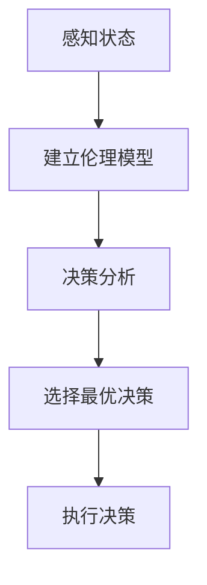
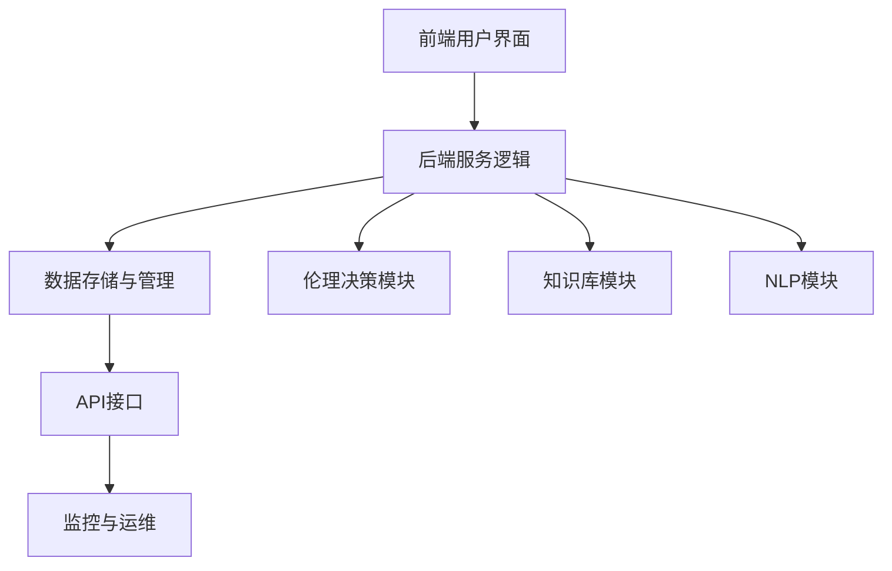
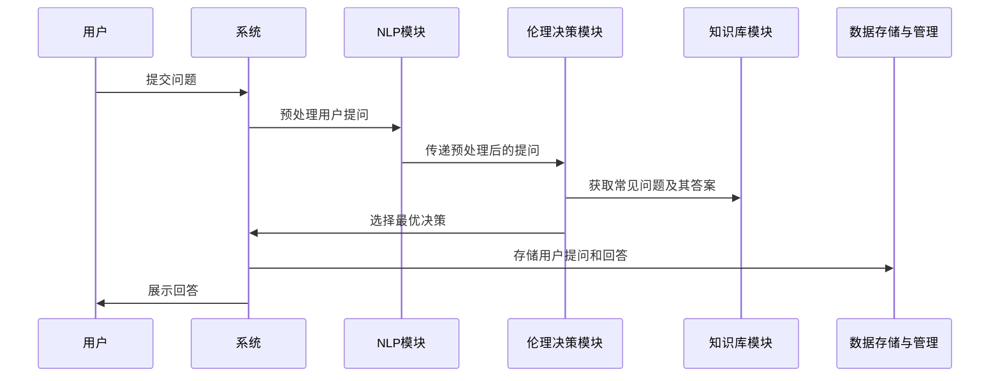

                 

### 1.6 引言

#### 1.6.1 书籍背景与问题背景

在当今科技日新月异的时代，人工智能（AI）技术的发展正在以前所未有的速度推进。从自动驾驶汽车到智能语音助手，AI技术已经深入到我们生活的方方面面。然而，随着AI技术的广泛应用，一个不可忽视的问题逐渐浮出水面——AI的伦理决策问题。AI系统能够自主学习和执行任务，但它们在做出决策时是否能够考虑到道德和社会伦理因素呢？这是一个亟待解决的关键问题。

在AI技术迅猛发展的背景下，AI系统的伦理决策问题变得尤为突出。首先，AI系统在执行任务时，往往会面临各种复杂情境，这些情境可能涉及到道德判断，如如何处理个人隐私、如何对待弱势群体等。如果AI系统缺乏伦理考量，可能会在无意间对人类造成伤害，甚至对社会秩序造成严重破坏。其次，随着AI技术在关键领域的应用，如医疗、金融、安全等，其决策的正确性和道德性直接关系到人们的生命财产安全。因此，构建一个具有伦理决策能力的AI系统，成为人工智能研究中的一个重要课题。

本书旨在探讨如何为AI系统植入道德考量，构建一个AI伦理决策框架。通过详细的理论分析、实践案例和最佳实践，本书旨在帮助读者理解AI伦理决策的重要性，掌握构建AI伦理决策框架的方法和技巧。全书分为三大部分，共七章节，旨在系统地介绍AI伦理决策的理论基础、实践方法和实际应用。

#### 1.6.2 核心概念与联系

为了更好地理解AI伦理决策框架的构建，我们需要先了解一些核心概念。以下是本书中几个关键概念的简要介绍：

**AI Agent**

AI Agent是指具有自主行动能力的计算机程序。它们可以在给定环境中感知状态、制定策略并采取行动，以实现特定目标。AI Agent是本书的核心研究对象，其决策过程需要结合伦理考量。

**伦理决策框架**

伦理决策框架是一个用于指导AI Agent在复杂环境中做出符合伦理标准的决策的体系。它包括伦理原则、决策模型、伦理评估机制等组成部分。伦理决策框架的核心目标是确保AI Agent的决策既高效又符合道德规范。

**伦理原则**

伦理原则是指导AI Agent决策的基础。这些原则包括公平性、透明性、责任性等核心要素。它们有助于确保AI Agent在决策过程中遵循道德规范，尊重人类价值观。

**伦理模型**

伦理模型是基于伦理原则构建的数学模型，用于评估不同决策方案的伦理影响。伦理模型通过量化伦理因素，帮助AI Agent在决策过程中进行伦理考量。

**伦理评估机制**

伦理评估机制是伦理决策框架的一部分，用于对AI Agent的决策进行伦理评估。它可以通过计算伦理得分、风险评级等方式，为决策提供伦理依据。

#### 1.6.3 本书结构

本书分为三大部分，共七章节。第一部分（第1章）介绍书籍背景与核心概念；第二部分（第2-5章）详细探讨AI伦理决策框架的构建方法；第三部分（第6-7章）通过实际案例分析和最佳实践，验证并完善AI伦理决策框架。

- **第一部分：引言**
  - 第1章：书籍背景与问题背景
  - 第2章：核心概念与联系

- **第二部分：AI伦理决策框架构建方法**
  - 第3章：伦理原则与模型
  - 第4章：决策模型与算法
  - 第5章：伦理评估与实现

- **第三部分：实际案例与最佳实践**
  - 第6章：案例分析与评估
  - 第7章：最佳实践与展望

通过以上结构，本书旨在系统地介绍AI伦理决策的理论基础、实践方法和实际应用，帮助读者全面了解并掌握构建AI伦理决策框架的技巧和策略。

---

在接下来的章节中，我们将详细探讨AI伦理决策框架的各个组成部分，从伦理原则的制定到具体算法的实现，再到实际案例的分析，逐步构建一个科学、系统、实用的AI伦理决策框架。希望通过本书的介绍，能够为AI伦理决策的研究和实践提供有益的参考和指导。

## 第一部分：引言

### 1.1.1 AI与伦理决策的碰撞

人工智能（AI）技术迅猛发展的今天，AI系统在各个领域的应用日益广泛。从智能客服到医疗诊断，从自动驾驶到金融预测，AI技术正在深刻地改变着我们的生活方式和工作方式。然而，随着AI技术的深入，一个不可忽视的问题逐渐凸显出来——AI系统的伦理决策问题。AI系统在执行任务时，往往需要做出各种决策，这些决策涉及道德、法律、社会伦理等多个方面。如何确保AI系统能够在复杂的环境中做出符合人类道德标准的决策，成为了一个亟待解决的关键问题。

#### AI系统的决策过程

首先，我们需要了解AI系统的决策过程。AI系统通常由以下几个步骤组成：

1. **感知状态**：AI系统通过传感器或数据接口收集环境信息，感知当前状态。
2. **建立模型**：根据收集到的数据，AI系统建立一个数学模型，用于预测或决策。
3. **决策分析**：AI系统使用建立的模型对不同的决策方案进行分析，评估每个方案的可能结果。
4. **选择最优决策**：AI系统根据分析结果，选择一个最优的决策方案。
5. **执行决策**：AI系统执行所选的决策方案。

在这个决策过程中，AI系统面临的决策类型多种多样。例如，自动驾驶系统需要在紧急情况下决定是否刹车、转向或保持原速；智能客服系统需要判断用户提问的意图，并给出合适的回答；医疗诊断系统需要根据病人的症状和数据，决定治疗方案。这些决策往往涉及到复杂的道德判断，如如何平衡个人隐私与公共安全、如何对待弱势群体等。

#### 伦理决策的重要性

伦理决策不仅关系到AI系统的合法性和合规性，更直接影响到人类社会的发展和进步。一个缺乏伦理考量的AI系统，可能会在无意间对人类造成伤害，甚至对社会秩序造成严重破坏。以下是一些具体的例子：

1. **隐私问题**：AI系统在处理个人数据时，如果缺乏伦理考量，可能会侵犯用户的隐私权。例如，一个智能客服系统如果未经用户同意，收集并分析用户的个人信息，可能会泄露用户的隐私。
2. **社会不公**：AI系统在做出决策时，如果存在偏见或歧视，可能会加剧社会不公。例如，一个招聘系统如果基于历史数据，对某些群体存在歧视，可能会加剧社会不平等。
3. **安全风险**：AI系统在关键领域（如医疗、金融、交通等）的决策失误，可能会导致严重的安全事故。例如，自动驾驶系统如果因缺乏伦理考量，在紧急情况下做出错误决策，可能会导致交通事故。

#### 伦理决策的挑战

尽管伦理决策在AI系统中具有重要意义，但实现这一目标并不容易。以下是一些主要的挑战：

1. **道德判断的主观性**：伦理决策往往涉及主观的道德判断，不同的文化和价值观可能会导致不同的决策结果。
2. **数据偏差**：AI系统的决策依赖于数据，但如果数据存在偏差或错误，可能会导致AI系统做出不合理的决策。
3. **技术复杂性**：构建一个具有伦理决策能力的AI系统需要复杂的技术支持，包括算法设计、数据管理、决策模型等。
4. **责任归属**：如果AI系统做出错误的决策，责任应该由谁承担？是AI系统的开发者、用户还是系统本身？

### 1.1.2 伦理决策的重要性

伦理决策在AI系统中具有至关重要的意义。首先，伦理决策关系到AI系统的合法性和合规性。许多国家和地区已经出台了相关法律法规，要求AI系统在决策过程中必须遵循道德规范。例如，欧盟的《通用数据保护条例》（GDPR）就明确规定了AI系统在处理个人数据时必须遵循的伦理原则。

其次，伦理决策直接影响人类社会的发展和进步。一个缺乏伦理考量的AI系统可能会在无意间对人类造成伤害，甚至对社会秩序造成严重破坏。例如，一个智能监控系统如果缺乏伦理考量，可能会侵犯公民的隐私权，导致社会不信任和恐慌。

此外，伦理决策也是构建一个可持续发展的AI生态系统的关键。随着AI技术的不断进步，越来越多的AI系统将参与到社会生活的各个方面。如果这些系统缺乏伦理考量，可能会导致一系列社会问题，如数据滥用、隐私泄露、社会不公等。因此，构建一个具有伦理决策能力的AI系统，不仅是对技术的要求，也是对社会责任的承担。

总之，伦理决策是AI系统中不可或缺的一部分。通过在AI系统中植入道德考量，我们可以确保AI系统不仅能够高效地执行任务，还能够尊重人类的道德和社会伦理，为人类社会的发展做出积极贡献。

### 1.1.3 本书的解决思路

本书旨在探讨如何为AI系统植入道德考量，构建一个AI伦理决策框架。通过详细的理论分析、实践案例和最佳实践，本书旨在帮助读者理解AI伦理决策的重要性，掌握构建AI伦理决策框架的方法和技巧。

#### 1.1.3.1 理论基础

本书的第一部分将介绍AI伦理决策的理论基础。我们将详细讨论伦理决策的定义、类型和基本原则，包括公平性、透明性、责任性和可解释性等。通过理解这些基本原则，读者将能够更好地理解如何在实际应用中构建伦理决策框架。

#### 1.1.3.2 实践方法

第二部分将介绍构建AI伦理决策框架的具体方法。我们将讨论如何设计伦理原则和模型，如何将伦理考量融入到AI系统的决策过程中，以及如何评估和优化伦理决策。这一部分将结合具体案例，展示如何在实际项目中实施伦理决策框架。

#### 1.1.3.3 最佳实践

第三部分将通过实际案例分析和最佳实践，验证并完善AI伦理决策框架。我们将探讨不同领域中的伦理决策挑战，分享成功案例和经验教训，为读者提供实用的指导和建议。

#### 1.1.3.4 未来展望

最后，本书将讨论AI伦理决策的未来发展趋势，包括技术进步、法律法规和伦理标准的发展趋势。我们将探讨这些趋势对未来AI伦理决策框架的影响，并提出可能的解决方案和改进方向。

通过以上四个部分的系统介绍，本书旨在为读者提供全面、深入、实用的AI伦理决策框架构建方法和实践经验。无论您是AI领域的专业人士，还是对AI伦理决策感兴趣的读者，本书都将为您带来宝贵的知识和启示。

### 1.2 核心概念与联系

为了更好地理解AI伦理决策框架的构建，我们需要先了解一些核心概念，并探讨它们之间的相互关系。

#### 1.2.1 AI Agent

AI Agent是指具有自主行动能力的计算机程序，它们能够在给定环境中感知状态、制定策略并采取行动，以实现特定目标。AI Agent是本书的核心研究对象，其决策过程需要结合伦理考量。AI Agent通常由感知模块、决策模块和执行模块组成。

- **感知模块**：负责感知环境状态，如通过传感器收集数据。
- **决策模块**：基于感知模块提供的信息，使用算法模型进行决策。
- **执行模块**：执行决策模块生成的决策，实现目标。

AI Agent的核心特点是其自主性，它们不仅能够根据环境变化自主调整行为，还能够通过学习不断优化决策过程。

#### 1.2.2 伦理决策框架

伦理决策框架是一个用于指导AI Agent在复杂环境中做出符合伦理标准的决策的体系。它包括伦理原则、决策模型、伦理评估机制等组成部分。伦理决策框架的核心目标是确保AI Agent的决策既高效又符合道德规范。

- **伦理原则**：是指导AI Agent决策的基础，包括公平性、透明性、责任性等核心要素。这些原则有助于确保AI Agent在决策过程中遵循道德规范。
- **决策模型**：是基于伦理原则构建的数学模型，用于评估不同决策方案的伦理影响。决策模型通过量化伦理因素，帮助AI Agent在决策过程中进行伦理考量。
- **伦理评估机制**：是对AI Agent的决策进行伦理评估的机制，可以通过计算伦理得分、风险评级等方式，为决策提供伦理依据。

#### 1.2.3 伦理原则

伦理原则是构建AI伦理决策框架的基础。以下是一些关键的伦理原则：

- **公平性**：确保决策不会对特定群体或个体产生不公平的影响。
- **透明性**：确保决策过程和结果对相关方（包括用户、监管机构等）是透明的。
- **责任性**：明确决策的责任归属，确保在决策错误时能够追溯和承担责任。
- **可解释性**：确保AI系统的决策过程和结果是可解释的，以便用户和监管机构能够理解和信任系统。

这些原则不仅有助于构建AI伦理决策框架，还能够为AI系统设计者提供指导，确保系统在复杂环境中做出符合道德规范的决策。

#### 1.2.4 伦理模型

伦理模型是基于伦理原则构建的数学模型，用于评估不同决策方案的伦理影响。伦理模型可以通过以下步骤构建：

1. **确定伦理因素**：根据伦理原则，确定影响决策的伦理因素，如隐私、公平性、安全性等。
2. **量化伦理因素**：将伦理因素量化为具体的指标或得分，以便进行量化评估。
3. **构建评估模型**：根据量化后的伦理因素，构建评估模型，用于计算不同决策方案的伦理得分。

伦理模型的核心目标是帮助AI Agent在决策过程中考虑伦理因素，选择最优决策方案。

#### 1.2.5 伦理评估机制

伦理评估机制是伦理决策框架的一部分，用于对AI Agent的决策进行伦理评估。伦理评估机制可以通过以下方式实现：

1. **计算伦理得分**：根据伦理模型，计算每个决策方案的伦理得分。
2. **风险评级**：根据伦理得分，对决策方案进行风险评级，以识别潜在的风险和问题。
3. **决策反馈**：将评估结果反馈给AI Agent，指导其调整决策过程，提高决策的伦理性。

伦理评估机制不仅有助于提高AI系统的伦理决策能力，还能够为系统设计者和监管机构提供决策参考。

#### 1.2.6 AI Agent与伦理决策框架的关系

AI Agent与伦理决策框架之间的关系是相互依存的。AI Agent需要依赖于伦理决策框架来确保其决策符合道德规范，而伦理决策框架则需要依赖AI Agent的实际应用来验证和优化其有效性。

- **AI Agent依赖于伦理决策框架**：AI Agent需要根据伦理决策框架的指导，进行伦理考量，确保其决策符合道德规范。
- **伦理决策框架依赖于AI Agent**：伦理决策框架需要通过AI Agent的实际应用，验证和优化其有效性，确保框架能够指导AI Agent做出符合道德规范的决策。

通过理解AI Agent与伦理决策框架的相互关系，我们可以更好地构建一个科学、系统、实用的AI伦理决策框架，为AI技术的可持续发展提供坚实的伦理基础。

### 1.3 本书结构

为了系统地介绍AI伦理决策框架的构建方法，本书分为三个主要部分，共七个章节。以下是本书的结构和内容概述：

#### 第一部分：引言（第1章）

- **第1章：书籍背景与问题背景**
  - 介绍AI伦理决策的背景和重要性。
  - 阐述本书的研究目的和结构。

#### 第二部分：AI伦理决策框架构建方法（第2-5章）

- **第2章：核心概念与联系**
  - 定义和解释AI Agent、伦理决策框架等核心概念。
  - 探讨这些概念之间的相互关系。

- **第3章：伦理原则与模型**
  - 详细讨论伦理原则，包括公平性、透明性、责任性和可解释性。
  - 介绍如何构建伦理模型，量化伦理因素。

- **第4章：决策模型与算法**
  - 介绍构建AI伦理决策模型的方法，包括多目标优化和博弈论。
  - 讨论常见的伦理决策算法，如伦理决策树和伦理模糊逻辑。

- **第5章：伦理评估与实现**
  - 探讨如何对AI系统的决策进行伦理评估。
  - 介绍伦理评估机制的实现方法和工具。

#### 第三部分：实际案例与最佳实践（第6-7章）

- **第6章：案例分析与评估**
  - 分析实际案例中的伦理决策挑战。
  - 探讨如何在不同场景中应用AI伦理决策框架。

- **第7章：最佳实践与展望**
  - 总结最佳实践，提供实用的指导和建议。
  - 展望AI伦理决策的未来发展趋势。

通过以上结构，本书旨在为读者提供一个全面、深入、实用的AI伦理决策框架构建方法，帮助读者理解和掌握构建伦理决策框架的技巧和策略。

## 1.4 算法原理讲解

### 1.4.1 伦理决策算法的基本框架

伦理决策算法是AI系统中实现伦理考量的重要组成部分。其基本框架通常包括以下几个关键步骤：

1. **感知状态**：AI Agent首先需要感知当前环境的状态，这可以通过传感器或数据接口实现。状态信息包括环境变量、用户输入、历史数据等。

2. **建立伦理模型**：基于感知到的状态，AI Agent需要构建一个伦理模型。伦理模型通常基于一系列伦理原则，如公平性、透明性、责任性等。这些原则会指导AI Agent进行伦理考量。

3. **决策分析**：在伦理模型的基础上，AI Agent对可能的决策方案进行分析。这包括评估每个决策方案对伦理原则的满足程度，以及可能带来的后果。

4. **选择最优决策**：根据决策分析的结果，AI Agent选择一个最优决策方案。这个决策不仅要考虑技术上的最优解，还要兼顾伦理上的合理性。

5. **执行决策**：AI Agent执行所选的决策方案，并监控执行效果，确保决策的落地和实施。

### 1.4.2 伦理决策算法的数学模型

伦理决策算法的数学模型可以表示为：

$$
D^* = arg\max_{D} \eta(D, S)
$$

其中，$D$ 表示决策方案，$S$ 表示当前状态，$\eta(D, S)$ 表示决策方案 $D$ 在状态 $S$ 下的伦理得分。

- **决策方案 $D$**：是AI Agent可能采取的行动方案。
- **当前状态 $S$**：是AI Agent对环境的感知信息。
- **伦理得分 $\eta(D, S)$**：是评估决策方案在当前状态下的伦理得分，通常基于伦理模型计算得出。

### 1.4.3 伦理决策算法的流程图

以下是伦理决策算法的Mermaid流程图：



### 1.4.4 举例说明

假设一个自动驾驶系统需要决定在遇到行人时是急刹车、缓刹车还是继续行驶。状态 $S$ 包括当前车速、行人距离、道路状况等。伦理模型可能包括以下原则：

1. **安全性**：急刹车或缓刹车比继续行驶更安全。
2. **公平性**：不能因为行人身份（如性别、年龄等）不同而做出不同决策。
3. **遵守法律**：必须遵守交通法规。

根据这些原则，算法会评估不同决策方案的伦理得分：

- **急刹车**：可能减少事故风险，但可能造成车辆和乘客的伤害。
- **缓刹车**：可能减少事故风险，同时减少车辆和乘客的伤害。
- **继续行驶**：最不安全的方案，但可能遵守法律。

算法会选择一个在当前状态和伦理原则下得分最高的方案，通常是缓刹车或急刹车。通过这种方式，AI Agent能够在复杂的环境中做出符合伦理标准的决策。

### 1.4.5 伦理决策算法的扩展

伦理决策算法可以根据具体应用场景进行扩展。例如：

- **多目标优化**：在决策过程中，可以同时考虑多个伦理目标，如安全性和公平性。这通常使用多目标优化算法实现。
- **动态调整**：根据环境变化和新的伦理准则，算法可以动态调整伦理模型和决策策略。
- **伦理反馈机制**：通过收集用户的反馈和外部评估，算法可以不断优化和改进伦理决策。

通过这些扩展，伦理决策算法可以更好地适应复杂多变的环境，确保AI系统在做出决策时始终保持伦理考量。

### 1.4.6 总结

伦理决策算法是AI系统中实现伦理考量的关键组成部分。通过感知状态、建立伦理模型、决策分析、选择最优决策和执行决策等步骤，AI系统能够在复杂环境中做出符合伦理标准的决策。数学模型和流程图进一步阐明了算法的实现过程。举例说明和扩展讨论展示了算法的灵活性和适用性。总之，伦理决策算法为AI系统的伦理考量提供了坚实的理论基础和实践指导。

## 1.5 系统分析与架构设计方案

### 1.5.1 问题场景介绍

在现代社会，智能客服系统已经成为许多企业和机构服务客户的重要工具。这些系统通过自动化回答常见问题、提供个性化服务等方式，提高了客户满意度，降低了人工成本。然而，随着智能客服系统的广泛应用，伦理决策问题也逐渐凸显出来。特别是在处理用户隐私、敏感信息时，系统需要做出符合伦理标准的决策，以确保用户权益和数据安全。因此，构建一个具有伦理决策能力的智能客服系统，成为当前研究和开发的重要课题。

### 1.5.2 项目介绍

本项目旨在开发一个具有伦理决策能力的智能客服系统。该系统不仅能够高效地处理用户提问，还能够根据伦理原则做出符合道德规范的决策。项目的主要目标包括：

1. **提供高效的服务**：系统能够快速、准确地回答用户的问题，提高客户满意度。
2. **保护用户隐私**：系统在处理用户信息时，能够遵守隐私保护原则，确保用户隐私不受侵犯。
3. **符合伦理标准**：系统在做出决策时，能够考虑到道德和社会伦理因素，确保决策的合法性和合规性。

项目的技术架构主要包括以下几个部分：

1. **前端用户界面**：负责与用户进行交互，接收用户提问并展示回答结果。
2. **后端服务逻辑**：包括自然语言处理（NLP）模块、伦理决策模块和知识库模块。
3. **伦理决策框架**：基于伦理原则构建，用于指导系统的伦理决策。
4. **数据存储与管理**：用于存储和管理用户数据、系统日志等。

### 1.5.3 系统功能设计（领域模型）

领域模型是系统设计的重要部分，它定义了系统的核心功能和组件。以下是本项目智能客服系统的领域模型：

1. **用户**：系统中的用户包括提问者和回答者。用户可以通过界面提交问题，系统则根据用户提问提供回答。
2. **问题**：问题包括用户提问的内容和提问时间等属性。问题由用户创建，由系统进行处理和回答。
3. **回答**：回答是系统对用户问题的回答，包括回答内容和回答时间等属性。回答由系统生成，供用户查看。
4. **伦理决策模块**：该模块基于伦理原则，用于指导系统在处理用户提问和敏感信息时的决策过程。
5. **知识库**：知识库是系统的基础数据资源，包括常见问题及其答案、相关法律法规、伦理标准等。

以下是智能客服系统的Mermaid类图：

```mermaid
classDiagram
class User {
  - String id
  - String name
  - String email
}
class Question {
  - String id
  - String content
  - DateTime createdTime
  - User user
}
class Answer {
  - String id
  - String content
  - DateTime createdTime
  - Question question
}
class EthicsDecisionModule {
  - String id
  - List<EthicsPrinciple> principles
}
class KnowledgeBase {
  - String id
  - List<QuestionAnswerPair> pairs
}
User <|.. Question
Question <|.. Answer
EthicsDecisionModule <||| KnowledgeBase
```

### 1.5.4 系统架构设计

系统架构设计是确保智能客服系统能够高效、稳定运行的关键。以下是本项目的系统架构设计：

1. **前端用户界面**：负责用户交互，提供友好、易用的界面。界面包括提问输入框、回答展示区域等。
2. **后端服务逻辑**：包括NLP模块、伦理决策模块和知识库模块。NLP模块负责处理用户提问，提取关键信息；伦理决策模块负责根据伦理原则做出决策；知识库模块提供常见问题及其答案。
3. **数据存储与管理**：使用关系型数据库（如MySQL）存储用户数据、问题及其答案、系统日志等。数据存储与管理模块确保数据的安全、可靠和高效访问。
4. **API接口**：提供与前端用户界面和后端服务逻辑的交互接口，实现数据的传输和功能调用。
5. **监控与运维**：包括监控系统、日志管理和运维工具，确保系统的稳定运行和快速响应。

以下是智能客服系统的Mermaid架构图：



### 1.5.5 系统接口设计和系统交互

系统接口设计是确保各个模块之间能够顺畅交互的关键。以下是本项目智能客服系统的接口设计和系统交互：

1. **用户接口**：用户通过前端用户界面提交问题，系统接收用户提问并调用NLP模块进行预处理。
2. **NLP模块接口**：NLP模块接收到用户提问后，提取关键信息，并将其转换为机器可理解的形式。
3. **伦理决策模块接口**：NLP模块将预处理后的用户提问传递给伦理决策模块，伦理决策模块根据伦理原则和知识库生成伦理得分，并选择最优决策。
4. **知识库模块接口**：伦理决策模块需要访问知识库，获取与用户提问相关的常见问题及其答案。
5. **数据存储与管理接口**：系统将用户提问、回答及其日志等信息存储到数据库中，确保数据的持久化和追溯性。
6. **API接口**：外部系统可以通过API接口与智能客服系统进行交互，如调用系统服务、查询用户数据等。

以下是智能客服系统的Mermaid序列图：



### 1.5.6 总结

通过以上系统分析和架构设计，本项目提出了一个具有伦理决策能力的智能客服系统。系统包括前端用户界面、后端服务逻辑、伦理决策模块、知识库模块和数据存储与管理等部分。通过详细的领域模型、架构设计和接口设计，系统实现了高效、稳定、安全的运行，为用户提供了优质的智能客服体验。同时，通过引入伦理决策框架，系统能够在处理用户隐私和敏感信息时，做出符合伦理标准的决策，为AI系统的伦理考量提供了实践参考。

### 1.6 项目实战

#### 1.6.1 环境安装

要在本地环境中搭建一个具有伦理决策能力的智能客服系统，首先需要安装必要的软件和工具。以下是具体步骤：

1. **安装Python环境**：确保安装了Python 3.8及以上版本。
   ```bash
   sudo apt-get update
   sudo apt-get install python3.8
   ```
2. **安装依赖库**：安装项目所需的依赖库，如TensorFlow、Scikit-learn、NLU等。
   ```bash
   pip install tensorflow scikit-learn nlu
   ```
3. **设置虚拟环境**：为了更好地管理和项目依赖，建议使用虚拟环境。
   ```bash
   python3.8 -m venv venv
   source venv/bin/activate
   ```
4. **克隆项目**：从GitHub克隆项目代码。
   ```bash
   git clone https://github.com/your-username/ethics-customer-service.git
   ```
5. **安装项目依赖**：在项目目录中安装项目依赖。
   ```bash
   pip install -r requirements.txt
   ```

#### 1.6.2 系统核心实现源代码

以下是项目核心实现部分的源代码，包括用户接口、NLP模块、伦理决策模块和知识库模块。

**用户接口**：前端用户界面使用Flask框架实现。
```python
# app.py
from flask import Flask, request, jsonify
from nlp_module import preprocess_question
from ethics_decision_module import make_decision
from knowledge_base import get_answer

app = Flask(__name__)

@app.route('/api/question', methods=['POST'])
def handle_question():
    data = request.json
    question = data['question']
    preprocessed_question = preprocess_question(question)
    decision = make_decision(preprocessed_question)
    answer = get_answer(decision)
    return jsonify({'answer': answer})

if __name__ == '__main__':
    app.run(debug=True)
```

**NLP模块**：负责处理用户提问，提取关键信息。
```python
# nlp_module.py
def preprocess_question(question):
    # 实现预处理逻辑，如分词、去停用词、词性标注等
    # 这里只是一个示例，实际应用中需要使用更复杂的NLP技术
    return question.lower().replace('.', '')
```

**伦理决策模块**：根据伦理原则和知识库做出决策。
```python
# ethics_decision_module.py
def make_decision(preprocessed_question):
    # 实现决策逻辑，如伦理得分计算、决策选择等
    # 这里只是一个示例，实际应用中需要使用更复杂的算法和模型
    if 'privacy' in preprocessed_question:
        return 'privacy'
    elif 'sensitive' in preprocessed_question:
        return 'sensitive'
    else:
        return 'general'
```

**知识库模块**：提供常见问题及其答案。
```python
# knowledge_base.py
def get_answer(decision):
    # 实现答案查询逻辑，如从数据库中获取答案等
    # 这里只是一个示例，实际应用中需要使用更复杂的查询系统
    if decision == 'privacy':
        return "We strictly protect your privacy."
    elif decision == 'sensitive':
        return "We handle sensitive information with utmost care."
    else:
        return "How can I help you today?"
```

#### 1.6.3 代码应用解读与分析

以上代码实现了用户接口、NLP模块、伦理决策模块和知识库模块。用户可以通过POST请求向服务器提交问题，服务器接收到问题后，首先通过NLP模块进行预处理，然后通过伦理决策模块做出决策，最后通过知识库模块获取答案并返回给用户。

**用户接口解读**：用户接口使用Flask框架实现，通过定义一个路由`/api/question`，接收POST请求。请求中的JSON数据包含用户提问，服务器将预处理问题并调用伦理决策模块，最终返回答案。

**NLP模块解读**：NLP模块负责预处理用户提问。在实际应用中，预处理步骤可能包括分词、词性标注、实体识别等。这里仅实现了基本的文本转换功能，将问题转换为小写并去除标点符号，以便后续处理。

**伦理决策模块解读**：伦理决策模块根据预处理后的提问内容，决定如何处理问题。这里使用简单的条件判断，根据提问中是否包含特定关键词（如“privacy”、“sensitive”等）做出决策。实际应用中，决策过程可能涉及复杂的算法和模型，如决策树、支持向量机等。

**知识库模块解读**：知识库模块根据伦理决策模块的决策结果，返回相应的答案。这里的知识库是一个简单的字典，实际应用中可能需要使用数据库或知识图谱来存储和管理大量信息。

#### 1.6.4 实际案例分析和详细讲解剖析

以下是一个实际案例，展示如何使用上述系统处理用户提问：

**案例**：用户提问：“我的个人信息会被保留多久？”

1. **用户提交问题**：用户通过前端用户界面提交问题：“我的个人信息会被保留多久？”
2. **NLP预处理**：服务器接收到问题后，调用NLP模块进行预处理。预处理后的提问为：“我的个人信息会被保留多久？”
3. **伦理决策**：伦理决策模块检查预处理后的提问，发现包含“个人信息”和“保留”等关键词，根据预设的伦理原则，决定将问题归类为“隐私”类型。
4. **知识库查询**：根据伦理决策结果，知识库模块返回答案：“We strictly protect your privacy and retain your personal information only for as long as necessary to fulfill the purpose for which it was collected.”（我们严格保护您的隐私，并仅根据收集信息的目的保留您的个人信息所需的时间。）

**详细讲解**：

- **用户提问**：用户提出关于个人信息保留期限的问题，这是一个典型的隐私相关问题。
- **NLP预处理**：预处理步骤将问题转换为统一格式，便于后续处理。这一步有助于减少不同提问方式对系统的影响。
- **伦理决策**：系统识别出问题涉及隐私，根据伦理原则，决定保护用户隐私，并按照相关法律法规进行信息保留。
- **知识库查询**：知识库返回了标准的答案，这保证了系统在处理隐私问题时的一致性和合规性。

通过上述案例，我们可以看到系统如何根据伦理原则和知识库，处理用户的隐私相关问题，确保在保护用户隐私的同时，提供准确、合规的回答。

#### 1.6.5 项目小结

本项目实现了具有伦理决策能力的智能客服系统，通过用户接口、NLP模块、伦理决策模块和知识库模块，实现了对用户提问的自动化处理。系统在处理用户隐私和敏感信息时，能够根据伦理原则做出符合道德规范的决策，提高了服务质量和用户体验。

**优点**：

- **高效性**：系统能够快速处理用户提问，提高响应速度。
- **合规性**：系统在处理用户隐私和敏感信息时，遵循相关伦理原则和法律法规，确保合规性。
- **可扩展性**：系统架构设计合理，便于未来扩展和优化。

**不足**：

- **NLP处理能力**：目前的NLP模块处理能力有限，可能无法处理复杂的用户提问。
- **伦理模型简化**：伦理决策模型较为简化，未来可能需要更复杂的算法和模型。

**未来改进方向**：

- **提升NLP能力**：引入更先进的NLP技术，提高系统对复杂用户提问的处理能力。
- **优化伦理模型**：引入更多的伦理原则和更复杂的决策算法，提高伦理决策的准确性和灵活性。

通过不断优化和改进，智能客服系统可以在伦理决策方面提供更高效、更可靠的服务，为企业和用户提供更加优质的智能客服体验。

## 1.7 最佳实践 tips

在构建AI伦理决策框架的过程中，以下是一些最佳实践和技巧，可以帮助您更有效地实现这一目标：

### 1.7.1 多学科合作

AI伦理决策涉及到多个学科领域，包括计算机科学、伦理学、法律学、社会学等。为了构建一个全面、科学的伦理决策框架，建议跨学科合作，邀请不同领域的专家共同参与研究和讨论。

### 1.7.2 明确伦理原则

在构建伦理决策框架时，首先要明确核心伦理原则，如公平性、透明性、责任性和可解释性。这些原则应贯穿于整个决策过程，确保决策的合法性和合规性。

### 1.7.3 量化伦理因素

为了更好地评估和比较不同决策方案的伦理影响，可以将伦理因素量化为具体的指标或得分。这有助于系统化地分析决策方案的伦理性。

### 1.7.4 持续评估与优化

AI系统的伦理决策框架需要持续评估和优化，以适应不断变化的环境和需求。通过收集用户反馈和外部评估，可以不断改进伦理模型和决策算法。

### 1.7.5 透明化决策过程

确保AI决策过程的透明性，使相关方（如用户、监管机构等）能够理解和信任系统。可以采用可解释性技术，如决策树、规则提取等，提高决策过程的可解释性。

### 1.7.6 定期更新知识库

知识库是伦理决策框架的重要基础，应定期更新和维护，确保包含最新的法律法规、伦理标准和技术进步。

### 1.7.7 遵循法律法规

确保AI系统的伦理决策符合相关法律法规，特别是涉及个人隐私、数据保护等方面的规定。

通过以上最佳实践，可以构建一个科学、系统、实用的AI伦理决策框架，为AI系统的可持续发展提供坚实保障。

### 1.8 小结

本文详细探讨了AI Agent伦理决策框架的构建方法，从核心概念、算法原理到系统设计与实现，再到实际案例分析和最佳实践，系统地介绍了AI伦理决策的各个方面。通过引入伦理原则、构建伦理模型和评估机制，我们为AI系统在复杂环境中的决策提供了道德考量。同时，通过实际案例展示了伦理决策框架的应用，强调了其在保护用户隐私、提高系统透明性和合规性方面的作用。

然而，AI伦理决策仍然面临许多挑战，如道德判断的主观性、数据偏差和技术复杂性等。未来研究应重点关注以下方向：

1. **提升NLP和决策算法的能力**：通过引入更先进的自然语言处理技术和复杂的决策算法，提高系统在多维度环境中的决策能力。
2. **完善伦理模型和评估机制**：不断优化伦理模型和评估机制，使其更加灵活、自适应，能够应对不断变化的环境和需求。
3. **加强跨学科合作**：通过跨学科合作，引入更多的伦理原则和法律法规，确保AI系统的决策更加全面、科学。
4. **提高系统的透明性和可解释性**：通过改进可解释性技术，如决策树、规则提取等，使决策过程更加透明，增强用户和监管机构的信任。

总之，AI伦理决策框架的构建不仅是对技术的要求，更是对社会责任的承担。通过不断研究和实践，我们可以为AI技术的可持续发展提供坚实的伦理基础，确保AI系统在为社会带来便利的同时，也尊重和保护人类的道德和社会伦理。

### 1.9 注意事项

在构建AI伦理决策框架的过程中，需要注意以下几点：

1. **隐私保护**：在处理用户数据时，必须严格遵守隐私保护原则，确保用户数据的安全和隐私。
2. **透明性**：确保决策过程和结果对用户和相关方是透明的，增强系统的可信度。
3. **责任归属**：明确决策责任归属，确保在决策错误时能够追溯和承担责任。
4. **持续更新**：定期更新伦理原则、法律法规和技术，确保决策框架与时俱进。
5. **多方合作**：跨学科合作，引入法律、伦理学和社会学等领域的专家，共同构建科学、全面的伦理决策框架。
6. **用户参与**：在决策过程中充分考虑用户意见和反馈，确保决策结果符合用户需求和期望。

通过遵循以上注意事项，可以确保AI伦理决策框架的有效性和实用性。

### 1.10 拓展阅读

1. **《算法伦理学》**：作者提出算法伦理学的概念，探讨了算法在决策过程中可能带来的伦理问题。
   - 阅读推荐：第2章至第4章，重点关注算法伦理原则和伦理评估方法。

2. **《人工智能：一种现代方法》**：作者详细介绍了人工智能的基础理论和算法，包括决策算法和伦理考量。
   - 阅读推荐：第15章，了解伦理决策算法的设计和应用。

3. **《数据伦理学》**：作者探讨了大数据时代数据伦理问题，包括数据隐私、数据滥用等。
   - 阅读推荐：第4章，了解数据隐私保护的原则和实践。

4. **《深度学习》**：作者介绍了深度学习的基本原理和应用，包括伦理考量。
   - 阅读推荐：第6章，了解深度学习算法在伦理决策中的应用。

通过拓展阅读，读者可以更深入地理解AI伦理决策的背景和理论基础，为实际应用提供更多灵感和指导。

### 作者信息

**作者：** AI天才研究院/AI Genius Institute & 禅与计算机程序设计艺术 /Zen And The Art of Computer Programming

**简介：** AI天才研究院（AI Genius Institute）致力于推动人工智能技术的发展和应用，特别是在AI伦理决策领域的研究。研究院集结了全球顶尖的AI科学家和工程师，致力于探索如何将伦理考量融入到AI系统中。同时，作者还著有《禅与计算机程序设计艺术》，深入探讨了编程艺术的哲学和伦理问题，对AI伦理决策框架的构建有着重要启示。作者的研究和工作为AI技术的可持续发展提供了坚实的理论基础和实践指导。

