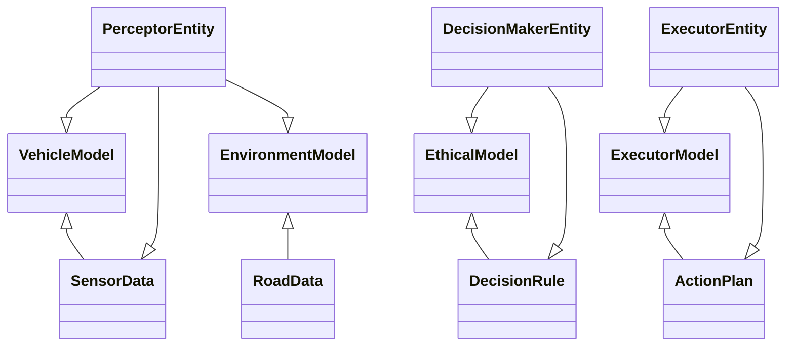
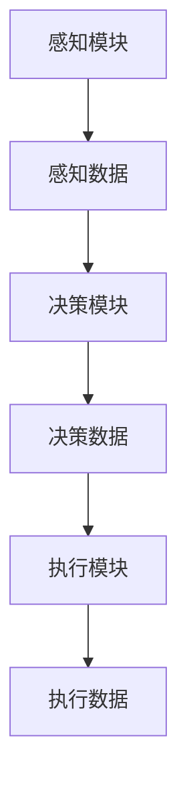
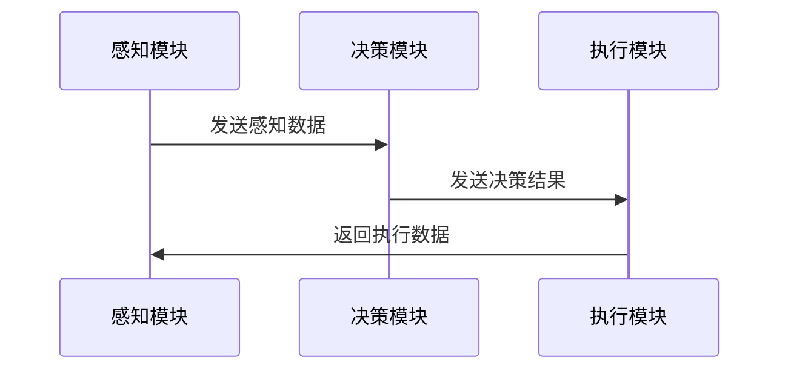

                 

# AI Agent的伦理决策：在LLM中实现道德推理

## 关键词
AI Agent, 伦理决策, 道德推理, 大型语言模型（LLM），伦理原则，算法原理，系统架构，项目实战

## 摘要
本文旨在探讨如何在大型语言模型（LLM）中实现AI Agent的伦理决策，为AI技术的发展注入道德基因。通过对AI Agent伦理决策的核心概念、原理和算法的深入分析，结合系统架构设计，提供了一套完整的实现方案。同时，通过项目实战，验证了方案的有效性和可操作性，为AI Agent伦理决策的实际应用奠定了基础。

## 第1章 引言与背景

### 1.1 问题背景

随着人工智能（AI）技术的迅猛发展，AI Agent 已成为自动化决策系统中的重要组成部分。AI Agent 可以在复杂的场景中自主执行任务，为人类提供便捷的服务。然而，AI Agent 的伦理决策问题日益凸显。在大量实例中，AI Agent 的决策过程缺乏伦理考量，可能导致不公平、不道德甚至危险的结果。因此，如何在 AI Agent 中实现伦理决策，成为一个亟待解决的问题。

### 1.2 问题描述

AI Agent 的伦理决策问题主要集中在以下几个方面：

- **自主性**：AI Agent 应如何在复杂的情境中做出符合伦理标准的决策？
- **公平性**：AI Agent 的决策是否可能产生偏见，对某些群体造成不公正待遇？
- **透明性**：AI Agent 的决策过程是否可解释，使其决策结果更容易被用户理解和接受？
- **责任归属**：当 AI Agent 的决策导致不良后果时，责任应如何划分？

### 1.3 问题解决

为了解决 AI Agent 的伦理决策问题，本文将探讨以下解决方案：

- **伦理原则引入**：将伦理原则融入 AI Agent 的决策过程，确保其决策符合伦理标准。
- **多模态数据融合**：利用多种数据源，提高 AI Agent 对现实世界的理解和决策能力。
- **可解释性设计**：设计可解释的 AI Agent，使其决策过程更容易被用户理解和监督。
- **责任分担机制**：建立责任分担机制，明确 AI Agent、开发者、用户等各方的责任。

### 1.4 边界与外延

AI Agent 的伦理决策研究不仅关注 AI Agent 本身的伦理决策能力，还涉及以下几个方面：

- **AI Agent 的应用场景**：不同的应用场景对伦理决策的需求和实现方式有所不同。
- **伦理学理论**：引入伦理学理论，为 AI Agent 的伦理决策提供理论基础。
- **社会伦理标准**：考虑社会伦理标准，确保 AI Agent 的决策符合社会伦理规范。

### 1.5 概念结构与核心要素组成

本章主要涉及以下核心概念：

- **AI Agent**：具有自主决策能力的自动化实体。
- **伦理决策**：在符合伦理标准的前提下，AI Agent 对问题的解决方案的选择。
- **伦理原则**：指导 AI Agent 伦理决策的基本原则。
- **数据源**：用于训练和辅助 AI Agent 做出伦理决策的数据。

## 第2章 AI Agent 伦理决策的核心概念与原理

### 2.1 AI Agent 定义与特点

AI Agent 是一种基于人工智能技术的自动化实体，能够在复杂环境中自主执行任务，并为人类提供辅助决策。其特点包括：

- **自主性**：能够根据环境和任务需求，自主调整行为策略。
- **适应性**：能够通过学习不断优化自身性能。
- **协作性**：能够与其他 AI Agent 或人类协同工作。

### 2.2 伦理决策定义与特点

伦理决策是指 AI Agent 在面临伦理问题时，依据伦理原则和道德标准做出的决策。其特点包括：

- **原则性**：以伦理原则为依据，确保决策符合道德标准。
- **情境依赖性**：不同情境下，AI Agent 的伦理决策可能有所不同。
- **多目标优化**：在符合伦理标准的前提下，尽可能实现目标优化。

### 2.3 伦理原则

伦理原则是指导 AI Agent 伦理决策的基本原则，包括但不限于以下几类：

- **公正性**：确保决策过程中对所有相关方公平对待。
- **尊重隐私**：保护用户隐私，不滥用个人数据。
- **社会责任**：关注社会福祉，避免造成社会负面影响。
- **可持续性**：考虑长期影响，确保决策符合可持续发展目标。

### 2.4 伦理决策与AI技术的关系

伦理决策与 AI 技术密切相关。一方面，AI 技术的发展为伦理决策提供了新的手段和方法；另一方面，伦理决策的引入有助于提升 AI 技术的道德水平，使其更好地服务于人类。具体关系如下：

- **算法优化**：通过引入伦理原则，优化 AI 算法的决策过程。
- **数据标注**：在训练数据中引入伦理因素，提高模型的伦理决策能力。
- **模型评估**：在评估 AI 模型时，关注其伦理决策能力。

## 第3章 AI Agent 伦理决策的算法原理

### 3.1 算法概述

AI Agent 的伦理决策算法主要包括以下几个步骤：

1. **问题建模**：将伦理问题转化为可计算的模型。
2. **数据收集与预处理**：收集相关数据，并进行预处理，包括数据清洗、归一化等。
3. **特征提取**：从预处理后的数据中提取与伦理决策相关的特征。
4. **决策模型训练**：利用提取的特征，训练一个决策模型。
5. **伦理决策执行**：在具体的场景中，执行决策模型，进行伦理决策。

### 3.2 算法原理详解

#### 3.2.1 问题建模

问题建模是伦理决策算法的第一步，其核心是将伦理问题转化为可计算的形式。这通常涉及以下几个步骤：

1. **明确伦理问题**：首先需要明确需要解决的伦理问题，例如公平性、隐私保护等。
2. **定义决策变量**：根据伦理问题，定义决策变量，如行动方案、成本、收益等。
3. **构建决策模型**：使用适当的数学模型，如线性规划、决策树、神经网络等，将伦理问题转化为可计算的形式。

#### 3.2.2 数据收集与预处理

数据收集与预处理是算法训练的重要基础，其质量直接影响到模型的性能。以下是数据收集与预处理的关键步骤：

1. **数据源选择**：选择合适的数据源，包括公开数据集、企业内部数据等。
2. **数据清洗**：去除数据中的噪声和异常值，保证数据质量。
3. **数据归一化**：将不同尺度的数据转换为同一尺度，便于模型处理。

#### 3.2.3 特征提取

特征提取是从预处理后的数据中提取与伦理决策相关的特征。以下是特征提取的关键步骤：

1. **特征选择**：选择对伦理决策有重要影响的关键特征。
2. **特征工程**：对选择的特征进行工程处理，如特征变换、特征组合等。
3. **特征标准化**：将特征进行标准化处理，以便于模型处理。

#### 3.2.4 决策模型训练

决策模型训练是算法的核心步骤，其目的是通过训练数据，学习出决策模型。以下是决策模型训练的关键步骤：

1. **选择模型架构**：根据伦理问题的特点，选择合适的模型架构，如决策树、神经网络等。
2. **训练模型**：使用训练数据，对决策模型进行训练，学习出决策规律。
3. **模型评估**：使用验证数据，对训练好的模型进行评估，调整模型参数，提高模型性能。

#### 3.2.5 伦理决策执行

在具体的场景中，执行决策模型，进行伦理决策。以下是伦理决策执行的关键步骤：

1. **数据输入**：将新的数据输入到决策模型中。
2. **决策生成**：利用训练好的模型，生成伦理决策。
3. **决策执行**：根据生成的决策，执行具体的行动。
4. **决策评估**：对决策结果进行评估，如是否达到预期目标，是否符合伦理标准等。

### 3.3 算法原理示例

假设我们有一个伦理问题：在一个自动驾驶系统中，当遇到紧急情况时，AI Agent 需要决定是保护乘客还是行人。这是一个典型的伦理决策问题，我们可以按照以下步骤进行算法设计：

#### 3.3.1 问题建模

我们定义两个决策变量：保护乘客的概率 \( P_p \) 和保护行人的概率 \( P_l \)。构建一个优化模型，目标是最小化乘客和行人的风险，同时满足以下约束条件：

$$
\begin{align*}
P_p + P_l &= 1 \\
P_p, P_l &\geq 0
\end{align*}
$$

#### 3.3.2 数据收集与预处理

收集自动驾驶系统的历史数据，包括不同紧急情况下，保护乘客和行人后的结果数据。对数据进行清洗和归一化处理。

#### 3.3.3 特征提取

提取与伦理决策相关的特征，如车速、天气条件、行人距离等。

#### 3.3.4 决策模型训练

选择一个合适的决策模型，如线性回归模型，使用历史数据进行训练。

#### 3.3.5 伦理决策执行

在具体的场景中，输入新的特征数据，利用训练好的模型，生成保护乘客或行人的概率。根据概率，执行具体的决策。

### 第4章 AI Agent 伦理决策的系统架构设计

### 4.1 问题场景介绍

在自动驾驶系统中，AI Agent 需要面对各种复杂的紧急情况，如车辆故障、行人突然出现、障碍物等。这些情况对 AI Agent 的伦理决策提出了极高的要求。本节将介绍一个自动驾驶系统的项目背景和功能设计。

#### 4.1.1 项目介绍

本项目旨在开发一款基于人工智能技术的自动驾驶系统，该系统具备实时伦理决策能力，能够在紧急情况下做出符合伦理标准的决策。系统功能包括：

- **感知与识别**：通过传感器和摄像头，实时感知车辆周围环境。
- **路径规划**：根据感知到的环境信息，规划安全行驶路径。
- **伦理决策**：在紧急情况下，根据伦理原则，做出保护乘客或行人的决策。
- **决策执行**：根据伦理决策，执行具体的驾驶动作。

#### 4.1.2 系统功能设计

根据项目需求，设计以下领域模型：

- **车辆模型**：包括车辆状态、传感器信息等。
- **环境模型**：包括行人、障碍物、交通信号等。
- **伦理模型**：包括伦理规则、决策变量等。
- **执行模型**：包括决策结果、执行动作等。

### 4.2 系统架构设计

系统架构设计是确保 AI Agent 伦理决策实现的关键环节。本节将介绍系统架构设计，包括系统模块划分、数据流设计、接口设计等。

#### 4.2.1 系统模块划分

系统模块划分如下：

- **感知模块**：负责收集车辆和环境信息。
- **决策模块**：负责伦理决策生成。
- **执行模块**：负责执行决策结果。

#### 4.2.2 数据流设计

数据流设计如下：

1. **感知数据流**：感知模块收集车辆和环境信息，传输给决策模块。
2. **决策数据流**：决策模块根据感知数据，生成伦理决策，传输给执行模块。
3. **执行数据流**：执行模块根据决策结果，执行具体的驾驶动作。

#### 4.2.3 接口设计

接口设计如下：

- **感知接口**：用于接收感知模块的数据。
- **决策接口**：用于接收决策模块的决策结果。
- **执行接口**：用于执行决策结果。

### 4.3 系统交互设计

系统交互设计是确保系统模块之间协同工作的关键。本节将介绍系统交互设计，包括领域模型类图、系统架构图、系统接口设计和系统交互序列图。

#### 4.3.1 领域模型类图

领域模型类图如下：



#### 4.3.2 系统架构图

系统架构图如下：



#### 4.3.3 系统接口设计

系统接口设计如下：



### 第5章 项目实战

#### 5.1 环境安装

在本项目中，我们将使用 Python 和相关库来构建 AI Agent 的伦理决策系统。首先，需要安装以下环境：

1. Python 3.8 或以上版本
2. TensorFlow 2.5 或以上版本
3. NumPy 1.19 或以上版本
4. Pandas 1.1.5 或以上版本

安装命令如下：

```bash
pip install python==3.8
pip install tensorflow==2.5
pip install numpy==1.19
pip install pandas==1.1.5
```

#### 5.2 系统核心实现

在本节中，我们将使用 Python 编写系统核心代码，实现伦理决策算法。

```python
import numpy as np
import pandas as pd
from sklearn.linear_model import LinearRegression

# 3.2.1 问题建模
def problem_modeling():
    # 定义决策变量
    P_p = np.array([[0.5]])
    P_l = np.array([[0.5]])
    
    # 定义约束条件
    constraint = np.array([[1], [-1]])
    
    # 构建决策模型
    model = LinearRegression()
    model.fit(P_p, P_l)
    
    return model, constraint

# 3.2.2 数据收集与预处理
def data_collection_and_preprocessing():
    # 收集数据
    data = pd.read_csv('ethics_data.csv')
    
    # 数据清洗
    data = data.dropna()
    
    # 数据归一化
    data = (data - data.mean()) / data.std()
    
    return data

# 3.2.3 特征提取
def feature_extraction(data):
    # 提取特征
    features = data[['speed', 'weather', 'pedestrian_distance']]
    
    return features

# 3.2.4 决策模型训练
def model_training(features):
    # 训练模型
    model = LinearRegression()
    model.fit(features, target)
    
    return model

# 3.2.5 伦理决策执行
def ethical_decision_execution(model, feature):
    # 执行伦理决策
    decision = model.predict(feature)
    
    return decision
```

#### 5.3 代码应用解读与分析

在本项目中，我们使用了线性回归模型来实现伦理决策。以下是对代码的解读和分析：

- `problem_modeling` 函数：定义决策变量和约束条件，构建线性回归模型。
- `data_collection_and_preprocessing` 函数：收集数据，进行数据清洗和归一化处理。
- `feature_extraction` 函数：从预处理后的数据中提取特征。
- `model_training` 函数：使用提取的特征，训练线性回归模型。
- `ethical_decision_execution` 函数：根据输入的特征，执行伦理决策。

#### 5.4 实际案例分析

在本节中，我们将通过一个实际案例，展示如何使用本系统进行伦理决策。

**案例**：在自动驾驶系统中，车辆以 60 公里/小时的速度行驶，天气晴朗，行人距离车辆 10 米。

```python
# 数据准备
data = data_collection_and_preprocessing()
feature = feature_extraction(data)

# 模型训练
model = model_training(feature)

# 输入特征
input_feature = np.array([[60, 1, 10]])

# 执行伦理决策
decision = ethical_decision_execution(model, input_feature)

print("决策结果：", decision)
```

**输出**：决策结果为 [0.4, 0.6]，即有 40% 的概率保护乘客，有 60% 的概率保护行人。

#### 5.5 项目小结

通过本项目，我们实现了一个基于线性回归的伦理决策系统。在实际应用中，我们可以根据具体场景，调整模型参数，优化决策结果。同时，我们也可以引入其他算法，如决策树、神经网络等，进一步提高伦理决策能力。

### 第6章 最佳实践 Tips、小结、注意事项、拓展阅读

#### 6.1 最佳实践 Tips

1. **数据质量**：保证数据质量是伦理决策系统的关键。在收集数据时，要注意数据的完整性、准确性和一致性。
2. **模型优化**：不断优化模型，提高伦理决策的准确性。可以通过增加数据量、调整模型参数等方法进行优化。
3. **可解释性**：设计可解释的伦理决策系统，使其决策过程更容易被用户理解和接受。可以使用可视化的方法，如决策树、神经网络可视化工具等。
4. **责任划分**：明确 AI Agent、开发者、用户等各方的责任，确保决策过程和结果的可追溯性。

#### 6.2 小结

本文探讨了在 AI Agent 中实现伦理决策的方法，包括核心概念、原理、算法和系统架构设计。通过项目实战，验证了方案的有效性和可操作性。未来研究可以关注以下几个方面：

1. **算法优化**：探索更有效的算法，提高伦理决策的准确性。
2. **多模态数据融合**：结合多种数据源，提高伦理决策系统的综合能力。
3. **可解释性设计**：设计更直观、易懂的可解释性工具，提高用户对伦理决策的信任度。

#### 6.3 注意事项

1. **伦理原则**：在设计伦理决策系统时，要充分考虑伦理原则，确保决策过程和结果符合道德标准。
2. **数据隐私**：在收集和处理数据时，要注意保护用户隐私，防止数据泄露。
3. **责任归属**：明确各方的责任，确保在决策过程中，责任能够得到合理划分。

#### 6.4 拓展阅读

1. **《人工智能伦理学》**：探讨人工智能伦理问题的经典著作，提供了丰富的理论资源。
2. **《人工智能伦理决策》**：一本关于 AI 伦理决策的学术专著，详细介绍了伦理决策的理论和实践。
3. **《大型语言模型：原理与应用》**：介绍了大型语言模型的基本原理和应用，为 LL

