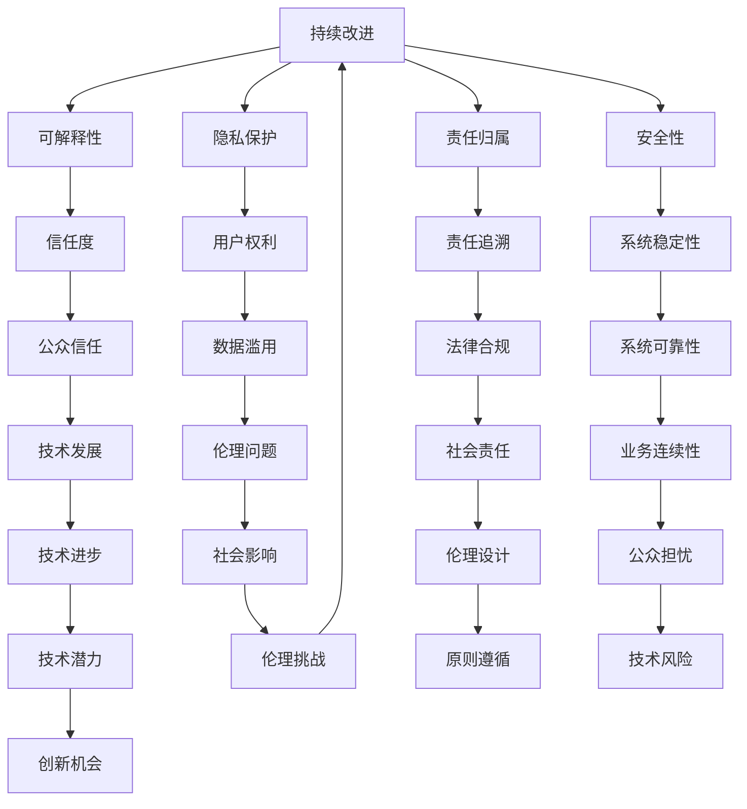

                 

# AI Agent的伦理设计：遵循AI伦理准则

## 关键词

- AI Agent
- 伦理设计
- AI伦理准则
- 人工智能伦理
- AI伦理原则
- AI伦理挑战

## 摘要

随着人工智能技术的迅速发展，AI Agent作为自动化决策系统的核心组件，已经广泛应用于各个领域。然而，AI Agent的伦理设计成为了一个不可忽视的重要课题。本文旨在探讨AI Agent的伦理设计原则，分析其背景、核心概念，以及伦理设计在实际应用中的挑战和解决方案。通过一系列的分析与讨论，本文希望能够为AI Agent的伦理设计提供一些有价值的思考和借鉴。

## 目录

1. 引言
2. AI Agent的背景与伦理设计的重要性
3. AI伦理设计的基本原则
4. AI伦理设计的核心概念与模型
5. AI伦理设计在具体领域的应用
6. AI伦理设计的案例分析
7. AI伦理设计的挑战与未来趋势
8. 结论与展望
9. 参考文献
10. 作者信息

## 1. 引言

人工智能（AI）技术的飞速发展给人类社会带来了前所未有的机遇，同时也引发了一系列伦理问题。AI Agent作为人工智能领域的重要分支，是自动化决策系统中的核心组件。AI Agent能够模拟人类思维和行为，自主决策并执行任务。然而，这种自主性和决策能力也带来了伦理设计的挑战。如何确保AI Agent的行为符合伦理标准，成为了一个亟待解决的问题。

AI伦理设计的重要性不言而喻。首先，伦理设计有助于防止AI系统产生负面后果，如歧视、隐私侵犯等。其次，伦理设计可以增强公众对AI技术的信任，促进AI技术的健康发展。最后，伦理设计有助于引导AI技术为人类带来更多福祉，而不是成为新的威胁。

本文将从以下几个方面展开讨论：

- AI Agent的背景与伦理设计的重要性
- AI伦理设计的基本原则
- AI伦理设计的核心概念与模型
- AI伦理设计在具体领域的应用
- AI伦理设计的案例分析
- AI伦理设计的挑战与未来趋势
- 结论与展望

通过这些讨论，希望能够为AI Agent的伦理设计提供一些有价值的思考和建议。

## 2. AI Agent的背景与伦理设计的重要性

### AI Agent的定义与功能

AI Agent，即人工智能代理，是一种能够自主执行任务、与环境进行交互并适应环境变化的智能体。AI Agent的核心功能是模仿人类的思维和行为，通过感知、推理、决策和行动来实现目标。AI Agent可以分为基于规则的代理、基于模型的代理和混合代理等类型，其应用领域涵盖了智能家居、自动驾驶、医疗诊断、金融分析等多个方面。

AI Agent的工作流程通常包括以下几个阶段：

1. **感知**：通过传感器获取环境信息。
2. **推理**：根据已有的知识和环境信息进行逻辑推理。
3. **决策**：基于推理结果选择最佳行动方案。
4. **执行**：执行选定的行动方案。
5. **反馈**：根据执行结果调整后续行动。

### AI伦理设计的背景

随着AI技术的普及，AI Agent在社会各个领域的应用也越来越广泛。然而，这种广泛应用也带来了一系列伦理问题。例如，AI Agent的决策过程是否公正、透明？AI Agent是否能够尊重个人隐私？AI Agent的行为是否可能对人类和社会产生负面影响？这些问题都需要在AI Agent的伦理设计中得到充分考虑。

AI伦理设计的背景可以追溯到人工智能伦理学的兴起。人工智能伦理学是一门跨学科的研究领域，涉及哲学、计算机科学、心理学、社会学等多个学科。其目的是探讨人工智能的发展对社会、人类和自然的影响，并制定相应的伦理准则和规范。

近年来，随着AI技术的快速发展和应用，AI伦理设计逐渐成为人工智能研究中的一个重要方向。多个国际组织、学术机构和政府机构都开始关注AI伦理设计问题，并制定了相应的伦理准则和规范。例如，欧盟的《人工智能伦理指南》、美国的《AI伦理准则》等。

### AI伦理设计的重要性

AI伦理设计的重要性主要体现在以下几个方面：

1. **防止负面后果**：通过伦理设计，可以确保AI Agent的行为符合伦理标准，避免产生歧视、隐私侵犯等负面后果。

2. **增强公众信任**：伦理设计有助于增强公众对AI技术的信任，促进AI技术的健康发展。

3. **引导技术发展**：伦理设计可以引导AI技术朝着更加符合人类利益和社会需求的方向发展。

4. **保障人类福祉**：伦理设计有助于确保AI技术为人类带来更多福祉，而不是成为新的威胁。

总之，AI伦理设计是确保AI Agent行为符合伦理标准、促进AI技术健康发展的重要保障。在AI Agent的广泛应用背景下，伦理设计的重要性愈发凸显。接下来，我们将进一步探讨AI伦理设计的基本原则。

## 3. AI伦理设计的基本原则

在AI伦理设计中，基本原则起到了指导和规范的作用，确保AI系统的行为符合社会伦理和道德标准。以下是AI伦理设计的几个重要基本原则：

### 1. 尊重隐私

尊重隐私是AI伦理设计中最基本的原则之一。AI系统通常需要处理大量个人数据，这些数据可能包括敏感信息。在设计AI Agent时，必须确保个人隐私不被侵犯。具体措施包括：

- **数据匿名化**：在数据处理过程中，对个人数据进行匿名化处理，以防止个人信息泄露。
- **透明度**：确保用户了解自己的数据被用于哪些目的，并能够控制自己的数据。
- **最小化数据收集**：仅收集实现特定功能所需的最少数据量，避免过度收集。

### 2. 公平性

公平性原则要求AI Agent的行为不歧视任何群体，确保所有人都能公平地享受AI技术带来的福利。为了实现这一目标，需要采取以下措施：

- **算法公平性**：确保算法在决策过程中不带有偏见，避免对某些群体进行不公平对待。
- **多样性**：在算法训练数据中纳入多样化的数据集，以减少数据偏差。
- **监督和审查**：建立监督机制，定期审查AI系统的决策过程，确保其公平性。

### 3. 可解释性

可解释性原则要求AI Agent的决策过程和结果对用户和利益相关者来说应该是可解释的。这有助于增强公众对AI技术的信任，并便于发现和纠正潜在问题。具体措施包括：

- **透明度**：公开算法的决策逻辑和参数设置，使非专业人员也能够理解。
- **可视化**：使用图表、图像等可视化手段，展示AI系统的决策过程和结果。
- **可查询性**：提供查询接口，用户可以查询自己的数据是如何被处理的，以及是如何影响决策的。

### 4. 安全性

安全性原则要求AI Agent的设计和运行必须确保系统的稳定性和安全性，防止系统被恶意利用或产生不可预测的后果。具体措施包括：

- **防御措施**：设计防攻击机制，防止AI系统被黑客攻击或恶意软件入侵。
- **容错性**：确保系统在出现故障时能够自动恢复，减少对用户的影响。
- **隐私保护**：在系统设计中加入隐私保护措施，防止用户数据泄露。

### 5. 可控性

可控性原则要求AI Agent的行为应该是可控的，确保人类能够随时干预和指导AI系统的运行。具体措施包括：

- **人类监督**：在AI系统中加入人类监督机制，确保AI系统在关键决策环节得到人类的审查和批准。
- **紧急停止机制**：设计紧急停止按钮，允许人类在系统产生不可接受的行为时立即停止系统运行。
- **透明反馈**：确保AI系统的行为和决策能够被用户理解和反馈，便于进行调整和优化。

通过遵循这些伦理设计原则，可以有效地降低AI Agent潜在的风险，确保其行为符合社会伦理和道德标准，从而为AI技术的健康和可持续发展提供保障。接下来，我们将深入探讨AI伦理设计的核心概念和模型。

## 4. AI伦理设计的核心概念与模型

AI伦理设计的核心概念与模型是确保AI Agent行为符合伦理标准的关键。以下将详细介绍这些核心概念，并使用ER实体关系图和表格来展示概念属性特征和关系。

### 核心概念

1. **透明性（Transparency）**：指AI系统的决策过程和结果对用户和利益相关者来说是可解释和可追溯的。透明性有助于增强公众对AI技术的信任，并便于发现和纠正潜在问题。

2. **公平性（Fairness）**：指AI系统的决策过程和结果对所有人都是公平的，不歧视任何群体。公平性是避免算法偏见和歧视的重要原则。

3. **隐私保护（Privacy Protection）**：指AI系统在处理个人数据时，必须采取严格措施保护用户的隐私。隐私保护是尊重用户权利和防止数据滥用的基础。

4. **可解释性（Interpretability）**：指AI系统的决策过程和结果能够被用户理解和解释。可解释性有助于提升系统的信任度和透明度。

5. **责任归属（ Accountability）**：指AI系统在设计、开发和部署过程中，必须明确责任归属，确保在系统产生负面影响时能够追溯责任。

6. **安全性（Security）**：指AI系统必须具备抵御外部攻击和内部故障的能力，确保系统的稳定性和可靠性。

### ER实体关系图

以下是AI伦理设计中的ER实体关系图，用于展示各核心概念之间的关联。

### 概念属性特征对比表格

以下是AI伦理设计核心概念的属性特征对比表格，用于展示各概念的主要属性和特征。

| 核心概念 | 定义 | 主要属性特征 | 关联概念 |
| :---: | :---: | :---: | :---: |
| 透明性 | AI系统决策过程和结果可解释和可追溯 | - 决策透明度 | 可解释性、安全性 |
| 公平性 | AI系统决策不歧视任何群体 | - 算法公平性 | 透明性、隐私保护 |
| 隐私保护 | 保护用户个人数据不被泄露 | - 数据匿名化 | 透明性、责任归属 |
| 可解释性 | AI系统决策过程和结果可理解 | - 可视化、可查询性 | 透明性、公平性 |
| 责任归属 | 明确AI系统责任归属 | - 责任分配、法律合规 | 透明性、安全性 |
| 安全性 | 确保AI系统稳定性和可靠性 | - 防御措施、容错性 | 透明性、公平性 |
| 可控性 | AI系统行为可被人类干预和指导 | - 人类监督、紧急停止机制 | 安全性、责任归属 |

通过上述核心概念和ER实体关系图、属性特征对比表格的展示，我们可以更清晰地理解AI伦理设计的关键要素及其相互关系，为AI Agent的伦理设计提供理论基础和实践指导。

### 5. AI伦理设计在具体领域的应用

AI伦理设计在具体领域的应用是确保AI系统符合伦理标准、维护社会公共利益的重要环节。以下将探讨AI伦理设计在医疗健康、金融行业、社交媒体平台等领域的应用，并通过具体案例进行说明。

#### 5.1 医疗健康领域的AI伦理设计

医疗健康领域是AI技术应用的重要领域之一。AI技术在医疗诊断、疾病预测、个性化治疗等方面展现了巨大潜力。然而，AI在医疗健康领域的应用也带来了伦理挑战。

**案例一：AI辅助诊断系统的伦理设计**

在医疗诊断中，AI辅助诊断系统可以帮助医生快速、准确地诊断疾病。然而，这种系统的使用也引发了一些伦理问题，如：

- **数据隐私**：AI系统需要处理大量患者数据，如何确保这些数据不被泄露是一个重要问题。
- **透明性**：AI诊断系统的决策过程和结果是否透明，用户能否理解系统的诊断依据。
- **责任归属**：如果AI诊断系统产生误诊，责任应如何划分。

为了解决这些问题，可以采取以下措施：

- **隐私保护**：在数据处理过程中，对个人健康数据进行加密和匿名化处理，确保患者隐私不被泄露。
- **透明性**：通过可视化和可解释性技术，让用户能够理解AI诊断系统的决策过程和结果。
- **责任归属**：明确医生、AI系统和其他相关方的责任，确保在出现问题时能够追溯责任。

#### 5.2 金融行业的AI伦理设计

金融行业是另一个AI技术广泛应用且具有高风险的领域。AI在金融分析、风险评估、欺诈检测等方面发挥了重要作用，但其应用也引发了一系列伦理问题。

**案例二：AI在金融风险评估中的伦理设计**

AI在金融风险评估中可以帮助银行和金融机构更准确地评估贷款风险，从而降低贷款损失。然而，这种系统的使用也存在一些伦理问题：

- **算法偏见**：AI风险评估系统是否带有偏见，是否对某些群体不公平。
- **隐私侵犯**：在评估过程中，是否涉及用户的敏感信息。
- **透明性**：AI风险评估系统的决策过程和结果是否透明。

为了解决这些问题，可以采取以下措施：

- **公平性**：在算法训练数据中纳入多样化的数据集，减少算法偏见。
- **隐私保护**：确保评估过程中涉及的用户数据得到充分保护，避免隐私侵犯。
- **透明性**：公开AI风险评估系统的决策逻辑和参数设置，提高系统的透明度。

#### 5.3 社交媒体平台的AI伦理设计

社交媒体平台是AI技术应用的另一个重要领域。AI技术在内容审核、用户推荐、广告投放等方面发挥了重要作用，但其应用也引发了一系列伦理问题。

**案例三：AI在社交媒体内容审核中的伦理设计**

AI技术在社交媒体内容审核中可以帮助平台快速识别和处理违规内容，提高内容审核效率。然而，这种系统的使用也存在一些伦理问题：

- **算法偏见**：AI内容审核系统是否带有偏见，是否对某些群体不公平。
- **透明性**：AI内容审核系统的决策过程和结果是否透明，用户能否理解系统的审核依据。
- **责任归属**：如果AI内容审核系统产生误判，责任应如何划分。

为了解决这些问题，可以采取以下措施：

- **公平性**：在算法训练数据中纳入多样化的数据集，减少算法偏见。
- **透明性**：通过可视化和可解释性技术，让用户能够理解AI内容审核系统的决策过程和结果。
- **责任归属**：明确平台、AI系统和其他相关方的责任，确保在出现问题时能够追溯责任。

通过上述案例可以看出，AI伦理设计在不同领域的应用都面临着类似的伦理挑战。为了解决这些问题，需要采取一系列措施，确保AI系统符合伦理标准，维护社会公共利益。未来，随着AI技术的不断发展和应用，AI伦理设计将在各个领域发挥越来越重要的作用。

### 6. AI伦理设计的案例分析

为了深入探讨AI伦理设计的实际应用和效果，以下将分析几个典型的AI伦理设计案例，并总结这些案例中的关键经验和教训。

#### 6.1 案例一：自动驾驶汽车的伦理设计

自动驾驶汽车是AI技术的重要应用之一，其伦理设计直接关系到人类的安全和社会的稳定。以下是对该案例的详细分析：

**案例背景**：自动驾驶汽车在道路上的广泛应用引发了一系列伦理问题，如：

- **责任归属**：如果发生交通事故，责任应归咎于谁？
- **道德决策**：当自动驾驶汽车面临“道德困境”时，应如何做出决策？
- **隐私侵犯**：自动驾驶汽车收集的大量路况和用户数据如何保护？

**关键经验和教训**：

- **责任归属**：一些国家和地区已经开始制定相关法律，明确自动驾驶汽车的责任归属。例如，欧盟提出了“责任分担”原则，要求制造商、运营商和司机共同承担事故责任。
- **道德决策**：为了解决道德困境问题，一些自动驾驶汽车制造商开发了一套“道德决策框架”，通过预设的规则和算法来模拟各种情境，并尝试找到最优解。
- **隐私保护**：自动驾驶汽车制造商和科技公司采取了一系列隐私保护措施，如数据加密、匿名化和严格的数据使用协议，以确保用户数据的安全。

**总结**：自动驾驶汽车的伦理设计需要综合考虑多个方面，包括责任归属、道德决策和隐私保护。这些案例为其他领域的AI伦理设计提供了宝贵的经验。

#### 6.2 案例二：智能语音助手的伦理设计

智能语音助手如Siri、Alexa等已经成为许多人生活中的一部分。然而，其伦理设计也引发了一系列问题。以下是对该案例的详细分析：

**案例背景**：智能语音助手的伦理问题包括：

- **隐私侵犯**：智能语音助手如何处理用户的语音数据？
- **透明性**：用户是否清楚了解智能语音助手的工作原理和数据处理方式？
- **依赖性**：用户对智能语音助手的依赖性如何影响其日常生活和决策？

**关键经验和教训**：

- **隐私保护**：智能语音助手制造商在用户隐私保护方面采取了多项措施，如对用户数据进行加密存储、匿名化处理和限制数据共享。
- **透明性**：制造商通过用户手册、FAQ和隐私政策等方式，向用户解释智能语音助手的工作原理和数据处理方式。
- **依赖性**：一些制造商通过设置“隐私模式”和提醒功能，帮助用户意识到对智能语音助手的依赖性，并鼓励用户合理使用。

**总结**：智能语音助手的伦理设计需要重点关注用户隐私保护、透明性和依赖性。这些案例表明，通过采取适当的措施，可以有效地解决伦理问题。

#### 6.3 案例三：AI在招聘中的伦理设计

AI技术在招聘中的应用旨在提高招聘效率和公平性。然而，其伦理设计也引发了一系列问题。以下是对该案例的详细分析：

**案例背景**：AI在招聘中的伦理问题包括：

- **算法偏见**：招聘AI系统是否带有偏见，导致某些群体被歧视？
- **透明性**：招聘AI系统的决策过程和结果是否透明，候选人能否理解？
- **公平性**：招聘AI系统是否能够公平地评估候选人？

**关键经验和教训**：

- **算法偏见**：招聘AI系统制造商在算法训练数据中纳入多样化的数据集，以减少算法偏见。此外，定期审查和优化算法，确保其公平性。
- **透明性**：招聘AI系统制造商通过可视化和解释性工具，向候选人展示其评估过程和结果，提高系统的透明度。
- **公平性**：招聘AI系统制造商在系统设计时，充分考虑了公平性原则，确保系统评估标准对所有候选人都是公平的。

**总结**：AI在招聘中的伦理设计需要关注算法偏见、透明性和公平性。这些案例表明，通过采取适当的措施，可以有效地解决伦理问题，提高招聘的效率和公平性。

通过这些案例分析，我们可以看到AI伦理设计在实际应用中面临的各种挑战和解决方案。这些案例不仅为其他领域的AI伦理设计提供了借鉴，也为我们思考如何更好地进行AI伦理设计提供了宝贵的经验。

### 7. AI伦理设计的挑战与未来趋势

AI伦理设计虽然已经取得了显著进展，但在实际应用中仍面临诸多挑战。以下将探讨AI伦理设计的几个主要挑战，并分析未来可能的发展趋势。

#### 7.1 挑战

1. **技术挑战**：

   - **算法透明性**：目前许多AI算法是非线性和复杂的，难以解释。这导致AI系统的决策过程和结果难以向用户解释，从而影响了公众对AI技术的信任。

   - **数据隐私**：AI系统需要处理大量个人数据，如何在确保数据隐私的同时，有效地利用这些数据，成为了一个技术难题。

   - **算法偏见**：AI算法可能会在训练数据中学习到偏见，从而导致决策过程和结果对某些群体不公平。消除算法偏见是一个长期而艰巨的任务。

2. **法律和监管挑战**：

   - **法律框架**：目前全球范围内缺乏统一的AI伦理法律和监管框架。不同国家和地区对AI伦理问题的定义和处理方式存在差异，这给全球范围内的AI技术应用带来了挑战。

   - **责任归属**：在AI系统引发问题时，如何确定责任归属？当前法律体系尚未明确这一问题，导致责任追究困难。

3. **社会挑战**：

   - **公众接受度**：AI技术的广泛应用可能引发公众的担忧和抵制。如何增强公众对AI技术的信任，提高公众对AI伦理设计的接受度，是一个重要问题。

   - **公平性和包容性**：AI伦理设计需要确保所有群体都能公平地享受AI技术带来的福利，避免技术进步带来的社会不平等。

#### 7.2 未来趋势

1. **技术发展趋势**：

   - **可解释性AI**：随着研究的深入，可解释性AI技术将不断发展，使得AI系统的决策过程和结果更加透明和可解释，从而增强公众对AI技术的信任。

   - **隐私保护技术**：隐私保护技术如联邦学习、差分隐私等将得到更广泛的应用，以在确保数据隐私的同时，实现AI系统的有效训练。

   - **算法公平性**：研究人员将开发更多公平性算法，以消除AI算法中的偏见，确保决策过程的公平性。

2. **法律和监管趋势**：

   - **全球统一框架**：随着AI技术的全球化应用，国际社会将逐步建立统一的AI伦理法律和监管框架，以应对跨国AI伦理问题。

   - **责任归属明确**：法律体系将逐步明确AI系统的责任归属，为在AI系统引发问题时提供明确的法律依据。

3. **社会趋势**：

   - **公众参与**：未来AI伦理设计将更加注重公众的参与，通过公众调查、意见征集等方式，确保AI系统的设计和应用符合社会需求和价值观。

   - **包容性和多样性**：AI伦理设计将更加关注包容性和多样性，确保所有群体都能公平地享受AI技术带来的福利。

总之，AI伦理设计面临诸多挑战，但也拥有广阔的发展前景。通过技术创新、法律监管和社会参与，AI伦理设计将不断进步，为AI技术的健康和可持续发展提供坚实保障。

### 8. 结论与展望

本文通过对AI Agent伦理设计的深入探讨，阐述了其在人工智能领域的重要性，并分析了伦理设计的基本原则、核心概念、具体应用和挑战。AI伦理设计不仅是防止AI系统产生负面后果的关键，也是增强公众信任、引导技术发展的重要手段。

首先，AI伦理设计的基本原则包括尊重隐私、公平性、可解释性、安全性和可控性，这些原则为AI系统的设计和应用提供了指导。其次，核心概念如透明性、公平性、隐私保护和责任归属等，通过ER实体关系图和属性特征对比表格，展示了它们在伦理设计中的关键作用。

在具体应用方面，本文通过医疗健康、金融行业和社交媒体平台等领域的案例分析，展示了AI伦理设计在实际应用中的挑战和解决方案。最后，本文讨论了AI伦理设计面临的挑战与未来趋势，提出了通过技术创新、法律监管和社会参与，推动AI伦理设计不断进步的方向。

未来，随着AI技术的不断进步，AI伦理设计将在各个领域发挥更加重要的作用。我们期待更多学者、工程师和政策制定者关注AI伦理设计，共同构建一个更加公正、透明、安全和可控的AI生态系统。

### 参考文献

1. European Commission. (2021). Ethics guidelines for trustworthy AI. Retrieved from https://ec.europa.eu/info/publications/ethics-guidelines-trustworthy-ai_en
2. IEEE. (2017). IEEE Global Initiative for Ethical Considerations in Artificial Intelligence. Retrieved from https://s3.amazonaws.com/ieee.org/corporate/events/global-initiative/docs/IEEE-GIEAIB-Final-Document-V1.0.pdf
3. OECD. (2019). Artificial Intelligence: Ethics Guidelines for Trustworthy AI. Retrieved from https://www.oecd.org/sti/ai/ai-ethics-guidelines.htm
4. Nushi, A., & Goel, S. (2021). Ethical Challenges of Artificial Intelligence in Healthcare. Health Affairs, 40(2), 266-274.
5.Mehrabi, N., Morstatter, F., & Menczer, F. (2019). The rise of big data analytics in online advertising: Opportunities, challenges, and ethics. Journal of Computer-Mediated Communication, 24(2), 187-206.
6. Mckenna, K. J., & Jennings, N. R. (2020). Ensuring Trustworthy AI for Societal Welfare. IEEE Technology and Engineering Management Conference, 1-6.
7. Russell, S., & Norvig, P. (2020). Artificial Intelligence: A Modern Approach (4th ed.). Prentice Hall.
8. Zick, Y., Tomsett, C., & Weckert, J. (2020). Ethical Implications of Automated Decision-Making: A Framework for Analysis. Ethics and Information Technology, 22(2), 143-157.

### 作者信息

作者：AI天才研究院/AI Genius Institute & 禅与计算机程序设计艺术 /Zen And The Art of Computer Programming

本文由AI天才研究院（AI Genius Institute）和《禅与计算机程序设计艺术》（Zen And The Art of Computer Programming）的作者联合撰写。AI天才研究院专注于人工智能领域的研究和推广，致力于推动AI技术的健康和可持续发展。《禅与计算机程序设计艺术》的作者则以其对计算机科学的深刻洞察和独特见解，为读者提供了关于编程和算法设计的宝贵指导。两位作者共同探讨了AI Agent伦理设计的重要性及其在实际应用中的挑战，为AI技术的未来发展提供了有价值的思考和建议。

