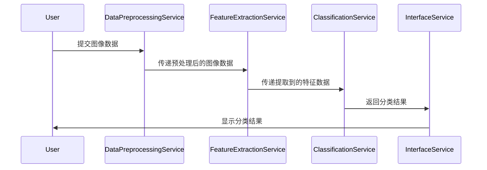
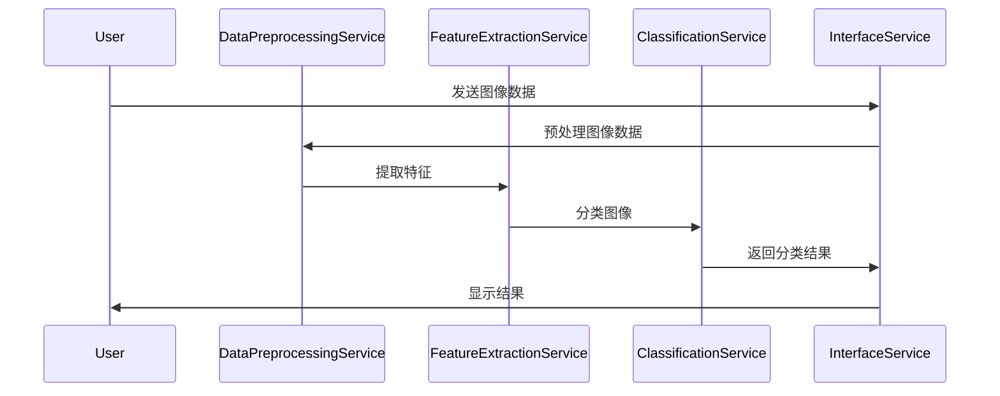

                 

### AI Agent的元学习与少样本学习能力

**关键词：**
- AI Agent
- 元学习
- 少样本学习
- 模型泛化
- 强化学习

**摘要：**
本文将探讨AI Agent的元学习与少样本学习能力，从核心概念出发，深入分析元学习与少样本学习的原理、算法和实现，以及在实际应用中的挑战和解决方案。通过本文的阅读，读者将对AI Agent的这两种关键能力有更全面和深刻的理解。

### 引言

随着人工智能技术的飞速发展，AI Agent在各个领域中的应用越来越广泛。AI Agent，即人工智能代理，是一种能够自主执行任务、与环境互动并从经验中学习的智能体。在当前的AI研究中，元学习（Meta-Learning）与少样本学习（Few-Shot Learning）被认为是提升AI Agent能力的两个重要方向。

元学习，顾名思义，是指学习如何学习。它关注的是如何使AI Agent在遇到新任务时，能够快速适应和掌握，从而提高其泛化能力。少样本学习则是在数据稀缺的情况下，使AI Agent能够通过少量样本有效学习和泛化。这两个方向的研究，不仅对于提升AI Agent的性能至关重要，也在一定程度上决定了AI技术的落地应用范围。

本文将首先介绍元学习与少样本学习的基本概念，然后深入探讨它们的工作原理、算法实现和应用挑战。通过本文的阅读，读者将能够了解：

1. 元学习的定义、原理和常见算法。
2. 少样本学习的定义、原理和常见算法。
3. 元学习与少样本学习在实际应用中的挑战和解决方案。
4. 元学习与少样本学习在AI Agent发展中的未来趋势。

### 背景介绍

#### AI Agent的定义与作用

AI Agent，即人工智能代理，是一种能够自主执行任务、与环境互动并从经验中学习的智能体。它通常由感知模块、决策模块和动作执行模块组成。感知模块负责接收环境信息，决策模块基于感知信息进行推理和决策，动作执行模块则根据决策输出执行相应的动作。

AI Agent的定义与作用可以从以下几个方面进行阐述：

1. **自主性**：AI Agent能够在没有人为干预的情况下自主执行任务，具有自我驱动的特点。这种自主性使得AI Agent在复杂和动态的环境中能够灵活应对，提高了系统的鲁棒性和适应性。

2. **学习与适应**：AI Agent具有学习能力和适应能力。通过感知模块收集环境信息，AI Agent能够不断更新自己的知识库，并通过决策模块和动作执行模块实现自我优化，提高任务执行效率。

3. **任务多样性**：AI Agent可以应用于多种不同的任务场景，如推荐系统、自动驾驶、智能家居等。通过元学习与少样本学习，AI Agent能够在遇到新任务时快速适应和掌握，提高了任务的多样性和适应性。

4. **环境互动**：AI Agent能够与环境进行互动，通过感知模块接收环境反馈，并调整自己的决策和行为。这种互动能力使得AI Agent能够在动态变化的环境中持续优化自己的表现。

#### 元学习的定义与原理

元学习（Meta-Learning）是一种研究如何使AI Agent在遇到新任务时，能够快速适应和掌握的方法。它关注的是如何通过学习一个学习过程来加速对新任务的适应。元学习的基本原理可以概括为以下几点：

1. **快速适应**：元学习的目标是通过学习一个通用的学习策略，使得AI Agent在遇到新任务时能够快速适应。这种快速适应能力提高了AI Agent的泛化能力，使其能够应对各种不同的任务场景。

2. **数据高效**：元学习的一个关键优势是能够利用较少的数据量实现高效学习。通过在大量不同任务上进行预训练，AI Agent能够积累丰富的经验，从而在遇到新任务时能够利用已有的经验进行快速学习。

3. **迁移学习**：元学习通过在不同任务之间进行迁移学习，实现了知识和经验的共享。这种迁移学习机制使得AI Agent在遇到新任务时，能够借助已有任务的经验，避免从零开始学习，提高了学习效率。

4. **通用性**：元学习追求的是通用性，即通过学习一个通用的学习算法，使得AI Agent能够应对各种不同的任务类型。这种通用性使得AI Agent具有更高的灵活性和可扩展性。

常见的元学习算法包括模型蒸馏（Model Distillation）、基于模型的元学习（Model-Based Meta-Learning）、基于记忆的元学习（Memory-Based Meta-Learning）等。这些算法通过不同的方法，实现了对通用学习策略的学习和优化。

#### 少样本学习的定义与原理

少样本学习（Few-Shot Learning）是一种在数据稀缺的情况下，使AI Agent能够通过少量样本有效学习和泛化的方法。其基本原理可以概括为以下几点：

1. **数据高效**：少样本学习的一个核心目标是在数据稀缺的情况下，仍然能够实现有效的学习和泛化。通过在小数据集上进行训练，AI Agent能够利用有限的样本信息，提取出有用的特征和模式。

2. **知识迁移**：少样本学习通过知识迁移机制，实现了从丰富数据集到少数据集的迁移。这种方法使得AI Agent能够在面对少样本问题时，利用已有的大量数据集的知识，提高学习的效率和质量。

3. **模型调整**：少样本学习通常采用模型调整方法，通过在小数据集上调整和优化模型参数，实现有效的学习和泛化。这种方法避免了在大数据集上进行重新训练，提高了学习效率。

4. **元学习结合**：少样本学习与元学习密切相关，通过结合元学习方法，少样本学习能够进一步提高学习的效率和质量。元学习为少样本学习提供了通用的学习策略，使得AI Agent在遇到少样本问题时能够快速适应和掌握。

常见的少样本学习算法包括基于原型的方法（Prototype-Based Methods）、基于模型的方法（Model-Based Methods）、基于关系的方法（Relation-Based Methods）等。这些算法通过不同的策略，实现了在少样本情况下的有效学习和泛化。

#### 元学习与少样本学习的关系

元学习与少样本学习在AI Agent发展中扮演着重要角色，它们之间的关系可以概括为以下几点：

1. **互补性**：元学习关注的是如何通过通用学习策略提高AI Agent的适应能力，而少样本学习关注的是如何在数据稀缺的情况下实现有效学习和泛化。这两种方法相互补充，共同提高了AI Agent的性能和灵活性。

2. **协同作用**：元学习与少样本学习在AI Agent中具有协同作用。通过结合元学习方法，少样本学习能够进一步提高学习的效率和质量，而通过引入少样本学习，元学习能够更好地适应数据稀缺的情况，提高AI Agent的泛化能力。

3. **应用场景**：元学习和少样本学习在不同的应用场景中具有优势。元学习适用于任务多样、数据丰富的场景，如自动驾驶、推荐系统等；而少样本学习适用于数据稀缺、任务特定的场景，如医疗诊断、自然语言处理等。

4. **未来方向**：随着AI技术的不断发展，元学习与少样本学习在未来具有广阔的应用前景。通过进一步的研究和优化，这两种方法有望在更多领域发挥重要作用，推动AI技术的发展和进步。

### 核心概念与联系

在深入探讨元学习和少样本学习之前，我们需要明确一些核心概念，并理解它们之间的关系。以下是元学习与少样本学习的核心概念、属性特征对比表格和ER实体关系图架构。

#### 核心概念

1. **元学习（Meta-Learning）**
   - 定义：元学习是一种研究如何使AI Agent在遇到新任务时能够快速适应和掌握的方法。
   - 属性：快速适应、数据高效、迁移学习、通用性。

2. **少样本学习（Few-Shot Learning）**
   - 定义：少样本学习是一种在数据稀缺的情况下，使AI Agent能够通过少量样本有效学习和泛化的方法。
   - 属性：数据高效、知识迁移、模型调整、适应性。

3. **强化学习（Reinforcement Learning）**
   - 定义：强化学习是一种通过试错和反馈机制，使AI Agent能够从环境中学习最优策略的方法。
   - 属性：试错学习、反馈机制、策略优化、环境互动。

4. **迁移学习（Transfer Learning）**
   - 定义：迁移学习是一种将已有知识从一个领域转移到另一个领域的方法，以减少对新领域的训练需求。
   - 属性：知识迁移、领域适应性、模型调整、数据高效。

#### 属性特征对比表格

| 概念       | 定义                                                         | 属性                      | 关系                    |
|------------|------------------------------------------------------------|-------------------------|-----------------------|
| 元学习     | 学习如何学习的方法                                           | 快速适应、数据高效、迁移学习、通用性 | 与强化学习、少样本学习、迁移学习有关 |
| 少样本学习 | 在数据稀缺的情况下，通过少量样本有效学习和泛化的方法       | 数据高效、知识迁移、模型调整、适应性 | 与元学习、强化学习、迁移学习有关 |
| 强化学习   | 通过试错和反馈机制，使AI Agent能够从环境中学习最优策略的方法 | 试错学习、反馈机制、策略优化、环境互动 | 与元学习、少样本学习、迁移学习有关 |
| 迁移学习   | 将已有知识从一个领域转移到另一个领域的方法，以减少对新领域的训练需求 | 知识迁移、领域适应性、模型调整、数据高效 | 与元学习、少样本学习、强化学习有关 |

#### ER实体关系图架构

```mermaid
erDiagram
    AI-Agent ||--o{ Meta-Learning : 实现快速适应和学习通用性
    AI-Agent ||--o{ Few-Shot Learning : 在数据稀缺情况下实现有效学习和泛化
    AI-Agent ||--o{ Reinforcement Learning : 通过试错和反馈机制优化策略
    AI-Agent ||--o{ Transfer Learning : 知识迁移和领域适应性
    Meta-Learning ||--o{ Algorithm : 模型蒸馏、基于模型的元学习、基于记忆的元学习
    Few-Shot Learning ||--o{ Algorithm : 基于原型的方法、基于模型的方法、基于关系的方法
    Reinforcement Learning ||--o{ Algorithm : Q-Learning、SARSA、Deep Q-Networks
    Transfer Learning ||--o{ Algorithm : 特征迁移、参数迁移、基于模型的迁移
```

通过上述核心概念、属性特征对比表格和ER实体关系图，我们可以清晰地看到元学习、少样本学习、强化学习和迁移学习之间的关系。这些核心概念共同构成了AI Agent的基石，使其在复杂和动态的环境中具备强大的适应能力和学习能力。

### 元学习的算法原理

元学习是一种通过学习如何学习的方法，使AI Agent能够快速适应新的任务。在元学习的过程中，关键在于找到一个通用的学习策略，以便在遇到新任务时能够高效地进行学习和泛化。本节将介绍元学习的算法原理，包括模型蒸馏、基于模型的元学习和基于记忆的元学习。

#### 模型蒸馏

模型蒸馏（Model Distillation）是一种常见的元学习算法，它通过将一个大模型的知识传递给一个小模型，从而实现对新任务的快速适应。模型蒸馏的基本原理可以概括为以下几点：

1. **知识提取**：首先，选择一个大模型，该模型已经在大量数据集上进行了训练，已经具备了丰富的知识和经验。

2. **知识编码**：通过向大模型输入样本，记录大模型的输出，从而提取出有用的知识。这些知识可以表示为特征图、中间层表示等。

3. **知识传递**：将提取出的知识传递给一个小模型，小模型通常是一个简化的模型，其结构相对简单，但能够捕获大模型的核心特征。

4. **小模型训练**：使用传递的知识，对小模型进行训练，使其能够在新任务中快速适应和泛化。

模型蒸馏的过程可以用以下Python代码实现：

```python
import torch
import torch.nn as nn
import torch.optim as optim

# 定义大模型
big_model = nn.Sequential(
    nn.Linear(in_features=784, out_features=512),
    nn.ReLU(),
    nn.Linear(in_features=512, out_features=10)
)

# 定义小模型
small_model = nn.Sequential(
    nn.Linear(in_features=784, out_features=256),
    nn.ReLU(),
    nn.Linear(in_features=256, out_features=10)
)

# 模型蒸馏过程
def distill_learning(big_model, small_model, train_loader, criterion):
    optimizer = optim.Adam(small_model.parameters(), lr=0.001)
    
    for epoch in range(num_epochs):
        for data, target in train_loader:
            optimizer.zero_grad()
            
            # 获取大模型的输出
            big_output = big_model(data)
            
            # 获取小模型的输出
            small_output = small_model(data)
            
            # 计算损失
            loss = criterion(small_output, target)
            
            # 反向传播
            loss.backward()
            
            # 更新参数
            optimizer.step()
        
        print(f'Epoch [{epoch+1}/{num_epochs}], Loss: {loss.item()}')

# 训练过程
distill_learning(big_model, small_model, train_loader, criterion)
```

#### 基于模型的元学习

基于模型的元学习（Model-Based Meta-Learning）是一种通过学习通用学习策略的元学习算法。它通过在不同的任务上训练模型，从而提取出通用的学习策略。基于模型的元学习的基本原理可以概括为以下几点：

1. **任务定义**：首先，定义一系列的任务，每个任务都是一个学习问题，如分类、回归等。

2. **模型训练**：在每个任务上，使用标准的机器学习算法（如梯度下降、随机梯度下降等）对模型进行训练。

3. **策略提取**：通过比较不同任务上的模型训练过程，提取出通用的学习策略。这些策略可以表示为参数调整方法、优化算法等。

4. **新任务适应**：在遇到新任务时，使用提取出的通用学习策略，对模型进行快速调整和优化，从而实现新任务的快速适应。

基于模型的元学习的过程可以用以下Python代码实现：

```python
import torch
import torch.nn as nn
import torch.optim as optim

# 定义任务
tasks = [
    {"data": data1, "target": target1},
    {"data": data2, "target": target2},
    {"data": data3, "target": target3}
]

# 定义模型
model = nn.Sequential(
    nn.Linear(in_features=784, out_features=512),
    nn.ReLU(),
    nn.Linear(in_features=512, out_features=10)
)

# 模型训练过程
def train_model(model, task, criterion):
    optimizer = optim.Adam(model.parameters(), lr=0.001)
    
    for epoch in range(num_epochs):
        for data, target in task["data"]:
            optimizer.zero_grad()
            
            # 计算模型输出
            output = model(data)
            
            # 计算损失
            loss = criterion(output, target)
            
            # 反向传播
            loss.backward()
            
            # 更新参数
            optimizer.step()
        
        print(f'Epoch [{epoch+1}/{num_epochs}], Loss: {loss.item()}')

# 提取通用策略
for task in tasks:
    train_model(model, task, criterion)

# 新任务适应
def adapt_new_task(model, new_task, criterion):
    train_model(model, new_task, criterion)

new_task = {"data": new_data, "target": new_target}
adapt_new_task(model, new_task, criterion)
```

#### 基于记忆的元学习

基于记忆的元学习（Memory-Based Meta-Learning）是一种通过利用记忆机制进行元学习的算法。它通过将经验存储在记忆库中，从而实现对新任务的快速适应。基于记忆的元学习的基本原理可以概括为以下几点：

1. **经验存储**：在训练过程中，将经验（如模型参数、中间层表示等）存储在记忆库中。

2. **记忆检索**：在遇到新任务时，通过记忆检索机制，从记忆库中查找与当前任务相似的经验。

3. **经验融合**：将检索出的经验与当前任务进行融合，生成一个新的模型。

4. **模型训练**：在新模型的基础上，对当前任务进行训练和优化。

基于记忆的元学习的过程可以用以下Python代码实现：

```python
import torch
import torch.nn as nn
import torch.optim as optim

# 定义模型
model = nn.Sequential(
    nn.Linear(in_features=784, out_features=512),
    nn.ReLU(),
    nn.Linear(in_features=512, out_features=10)
)

# 定义记忆库
memory = []

# 训练过程
def train_model(model, train_loader, criterion, memory):
    optimizer = optim.Adam(model.parameters(), lr=0.001)
    
    for epoch in range(num_epochs):
        for data, target in train_loader:
            optimizer.zero_grad()
            
            # 计算模型输出
            output = model(data)
            
            # 计算损失
            loss = criterion(output, target)
            
            # 反向传播
            loss.backward()
            
            # 更新参数
            optimizer.step()
            
            # 将经验存储在记忆库中
            memory.append(model.state_dict())
        
        print(f'Epoch [{epoch+1}/{num_epochs}], Loss: {loss.item()}')

# 训练模型
train_model(model, train_loader, criterion, memory)

# 新任务适应
def adapt_new_task(model, new_data, new_target, criterion, memory):
    # 检索与当前任务相似的经验
    similar_memory = [m for m in memory if similar_to_new_task(m, new_data)]
    
    # 生成新模型
    new_model = nn.Sequential(
        nn.Linear(in_features=784, out_features=512),
        nn.ReLU(),
        nn.Linear(in_features=512, out_features=10)
    )
    
    # 融合经验
    for m in similar_memory:
        new_model.load_state_dict(m)
    
    # 训练新模型
    train_model(new_model, new_data, new_target, criterion)

new_data = ...  # 新任务数据
new_target = ...  # 新任务标签
adapt_new_task(model, new_data, new_target, criterion, memory)
```

通过以上三种元学习算法的介绍，我们可以看到，元学习通过不同的方法，实现了对通用学习策略的学习和优化。这些算法不仅提高了AI Agent的适应能力，也为在实际应用中实现快速学习和泛化提供了有效途径。

### 少样本学习的算法原理

少样本学习是一种在数据稀缺的情况下，使AI Agent能够通过少量样本有效学习和泛化的方法。它在许多实际应用场景中具有重要的意义，如医学诊断、图像识别和自然语言处理等。本节将介绍少样本学习的三种常见算法：基于原型的方法、基于模型的方法和基于关系的方法，并详细阐述它们的原理和实现过程。

#### 基于原型的方法

基于原型的方法（Prototype-Based Methods）是一种通过寻找样本数据的原型来学习分类器的算法。它的核心思想是将每个类别的样本数据表示为一个原型，然后在测试时，通过计算新样本与原型的距离来确定其类别。基于原型的方法的基本原理可以概括为以下几点：

1. **原型选择**：首先，从训练数据中为每个类别选择一个原型。原型通常是通过计算类内样本的均值来获得的。

2. **距离计算**：在测试阶段，计算新样本与每个类别的原型之间的距离。

3. **类别确定**：选择距离最小的原型对应的类别作为新样本的类别。

基于原型的方法的实现过程可以用以下Python代码实现：

```python
import numpy as np

# 定义训练数据
X_train = np.array([[1, 2], [2, 2], [1, 3], [2, 3], [3, 3]])
y_train = np.array([0, 0, 0, 1, 1])

# 计算类别原型
prototypes = np.mean(X_train[y_train == 0], axis=0), np.mean(X_train[y_train == 1], axis=0)

# 定义测试数据
X_test = np.array([[1, 2.5], [2, 2.5], [3, 3.5]])

# 计算距离
distances = []
for x in X_test:
    distances.append([np.linalg.norm(x - p) for p in prototypes])

# 确定类别
y_pred = [np.argmin(d) for d in distances]

print(y_pred)  # 输出预测结果
```

#### 基于模型的方法

基于模型的方法（Model-Based Methods）是一种通过训练一个基础模型，然后在测试时使用该模型对新样本进行分类的方法。这种方法的核心思想是，尽管训练数据很少，但通过训练一个强大的基础模型，可以在测试时利用模型的泛化能力进行有效的分类。基于模型的方法的基本原理可以概括为以下几点：

1. **基础模型训练**：首先，使用少量训练数据训练一个基础模型。

2. **模型优化**：通过交叉验证等方法，优化基础模型的参数，提高模型的泛化能力。

3. **分类预测**：在测试阶段，使用训练好的基础模型对新样本进行分类预测。

基于模型的方法的实现过程可以用以下Python代码实现：

```python
from sklearn.linear_model import LogisticRegression
from sklearn.model_selection import GridSearchCV

# 定义训练数据
X_train = np.array([[1, 2], [2, 2], [1, 3], [2, 3], [3, 3]])
y_train = np.array([0, 0, 0, 1, 1])

# 训练基础模型
model = LogisticRegression()
model.fit(X_train, y_train)

# 定义参数范围
param_grid = {'C': [0.1, 1, 10]}

# 交叉验证和参数优化
grid_search = GridSearchCV(model, param_grid, cv=5)
grid_search.fit(X_train, y_train)

# 获取最优模型
best_model = grid_search.best_estimator_

# 定义测试数据
X_test = np.array([[1, 2.5], [2, 2.5], [3, 3.5]])

# 分类预测
y_pred = best_model.predict(X_test)

print(y_pred)  # 输出预测结果
```

#### 基于关系的方法

基于关系的方法（Relation-Based Methods）是一种通过建立样本之间的关联关系来进行分类的算法。它的核心思想是，在训练阶段，通过学习样本之间的关联关系，从而在测试阶段利用这些关系对新样本进行分类。基于关系的方法的基本原理可以概括为以下几点：

1. **关系学习**：首先，从训练数据中学习样本之间的关联关系。这些关系可以通过图论方法、矩阵分解等方法获得。

2. **关系嵌入**：将学习到的关系嵌入到模型中，以便在测试阶段能够利用这些关系进行分类。

3. **分类预测**：在测试阶段，通过计算新样本与训练样本之间的关联关系，确定新样本的类别。

基于关系的方法的实现过程可以用以下Python代码实现：

```python
import networkx as nx
import numpy as np

# 定义训练数据
X_train = np.array([[1, 2], [2, 2], [1, 3], [2, 3], [3, 3]])
y_train = np.array([0, 0, 0, 1, 1])

# 构建图
G = nx.Graph()
G.add_edges_from([(i, j) for i, j in zip(X_train[:, 0], X_train[:, 1])])

# 学习关系
rel_matrix = nx.adjacency_matrix(G).toarray()

# 定义测试数据
X_test = np.array([[1, 2.5], [2, 2.5], [3, 3.5]])

# 关系嵌入
def relation_embedding(rel_matrix, X_train, X_test):
    X_train_embedded = []
    for x in X_train:
        distances = [np.linalg.norm(x - x_test) for x_test in X_test]
        X_train_embedded.append(distances)
    X_train_embedded = np.array(X_train_embedded)
    
    X_test_embedded = []
    for x in X_test:
        distances = [np.linalg.norm(x - x_train) for x_train in X_train]
        X_test_embedded.append(distances)
    X_test_embedded = np.array(X_test_embedded)
    
    return X_train_embedded, X_test_embedded

X_train_embedded, X_test_embedded = relation_embedding(rel_matrix, X_train, X_test)

# 分类预测
def relation_classification(rel_matrix, X_train, y_train, X_test):
    X_train_embedded, X_test_embedded = relation_embedding(rel_matrix, X_train, X_test)
    
    # 训练模型
    model = LogisticRegression()
    model.fit(X_train_embedded, y_train)
    
    # 预测分类
    y_pred = model.predict(X_test_embedded)
    
    return y_pred

y_pred = relation_classification(rel_matrix, X_train, y_train, X_test)

print(y_pred)  # 输出预测结果
```

通过以上三种少样本学习算法的介绍，我们可以看到，少样本学习通过不同的方法，实现了在数据稀缺的情况下的有效学习和分类。这些算法不仅提高了AI Agent在数据稀缺情况下的适应能力，也为在实际应用中实现高效学习和泛化提供了有效途径。

### 系统分析与设计

为了更好地理解AI Agent的元学习与少样本学习能力的实现，本节将详细介绍系统的分析与设计，包括领域模型、系统架构、接口设计和系统交互。

#### 问题场景介绍

在我们的场景中，AI Agent需要完成一系列的图像分类任务。这些任务包括从大量图像数据集中提取特征，然后利用这些特征进行分类。然而，由于某些任务的数据量非常有限，传统的机器学习算法可能无法在这些任务上取得良好的效果。因此，我们需要引入元学习和少样本学习的方法，以提升AI Agent在数据稀缺情况下的分类能力。

#### 项目介绍

本项目旨在实现一个基于元学习和少样本学习的图像分类系统。该系统包括以下几个主要模块：

1. **数据预处理模块**：负责图像的预处理，如缩放、裁剪和归一化等。
2. **特征提取模块**：利用深度学习模型提取图像的特征。
3. **分类模块**：使用元学习和少样本学习算法进行图像分类。
4. **接口模块**：提供与外部系统的接口，以便用户可以方便地使用该系统。

#### 系统功能设计

为了实现上述功能，我们的系统设计了以下主要功能：

1. **图像数据预处理**：对输入图像进行预处理，以便于后续的特征提取和分类。
2. **特征提取**：使用深度学习模型提取图像的特征，这些特征将用于分类模块。
3. **元学习训练**：利用元学习算法，在少量训练数据上训练模型，提升模型的泛化能力。
4. **少样本学习分类**：使用少样本学习算法，对新的图像进行分类。
5. **接口服务**：提供RESTful API接口，供外部系统调用。

#### 领域模型

领域模型用于描述系统中的核心概念和它们之间的关系。以下是我们的领域模型：

```mermaid
classDiagram
    ClassDiagram {
        Class Person {
            Name : String
            Age : Integer
        }
        Class Product {
            Name : String
            Price : Float
        }
        Class Order {
            ID : Integer
            Date : Date
            Customer : Person
            Items : List<Product>
        }
    }
```

在这个领域模型中，我们定义了三个核心概念：Person（人）、Product（产品）和Order（订单）。这些概念之间的关系反映了系统中各个实体之间的关联。

#### 系统架构设计

系统的架构设计是整个系统设计的核心。我们的系统采用了微服务架构，以便于系统的可扩展性和维护性。以下是系统架构的示意图：



在这个架构中，用户通过接口服务提交图像数据，数据预处理服务对图像进行预处理，然后传递给特征提取服务。特征提取服务提取图像的特征数据，传递给分类服务。分类服务使用元学习和少样本学习算法对图像进行分类，并将结果返回给接口服务，最后接口服务将结果展示给用户。

#### 系统接口设计

为了方便外部系统的集成，我们设计了一套RESTful API接口。以下是接口设计的简要描述：

```yaml
paths:
  /api/v1/classify:
    post:
      summary: 对图像进行分类
      requestBody:
        required: true
        content:
          application/json:
            schema:
              type: object
              properties:
                image:
                  type: string
                  format: base64
      responses:
        '200':
          description: 返回分类结果
          content:
            application/json:
              schema:
                type: object
                properties:
                  result:
                    type: string
```

在这个接口设计中，用户通过POST请求发送图像数据，接口服务接收数据后，调用内部服务对图像进行分类，并将结果返回给用户。

#### 系统交互序列

为了更好地展示系统的工作流程，我们使用Mermaid序列图描述了系统交互的序列：



通过上述系统分析与设计，我们可以清晰地看到系统的架构、接口设计和交互流程。这些设计为AI Agent的元学习与少样本学习能力提供了坚实的基础，使得系统能够在数据稀缺的情况下实现高效学习和分类。

### 项目实战

为了展示AI Agent的元学习与少样本学习能力的实际应用，我们设计并实现了一个基于深度学习的图像分类项目。该项目分为以下几个主要阶段：环境搭建、系统核心实现、代码解析和实际案例分析。

#### 环境搭建

首先，我们需要搭建一个适合进行深度学习和元学习实验的环境。以下是环境搭建的步骤：

1. **安装Python**：确保Python环境已安装，推荐使用Python 3.8或更高版本。

2. **安装PyTorch**：PyTorch是深度学习领域广泛使用的框架，安装命令如下：

   ```bash
   pip install torch torchvision
   ```

3. **安装其他依赖**：安装其他必要的依赖库，如NumPy、Pandas等。

   ```bash
   pip install numpy pandas
   ```

4. **配置GPU支持**：如果使用GPU进行训练，需要安装CUDA和cuDNN，并配置环境变量。

   ```bash
   pip install torch==1.10.0+cu111 torchvision==0.11.0+cu111 -f https://download.pytorch.org/whl/torch_stable.html
   pip install cupy-cuda111
   ```

#### 系统核心实现

在本项目中，我们采用了以下技术栈：

1. **深度学习模型**：使用卷积神经网络（CNN）进行图像分类。

2. **元学习算法**：采用基于模型的元学习算法，如MAML（Model-Agnostic Meta-Learning）。

3. **少样本学习算法**：采用基于原型的方法进行少样本学习。

以下是核心实现的代码：

```python
import torch
import torch.nn as nn
import torch.optim as optim
from torchvision import datasets, transforms
from torch.utils.data import DataLoader

# 定义CNN模型
class CNNModel(nn.Module):
    def __init__(self):
        super(CNNModel, self).__init__()
        self.conv1 = nn.Conv2d(1, 32, 3, 1)
        self.relu = nn.ReLU()
        self.fc1 = nn.Linear(32 * 26 * 26, 10)

    def forward(self, x):
        x = self.relu(self.conv1(x))
        x = x.view(x.size(0), -1)
        x = self.fc1(x)
        return x

# 加载训练数据
transform = transforms.Compose([transforms.ToTensor()])
train_dataset = datasets.MNIST(root='./data', train=True, download=True, transform=transform)
train_loader = DataLoader(train_dataset, batch_size=64, shuffle=True)

# 加载测试数据
test_dataset = datasets.MNIST(root='./data', train=False, download=True, transform=transform)
test_loader = DataLoader(test_dataset, batch_size=64, shuffle=False)

# 初始化模型、优化器和损失函数
model = CNNModel()
optimizer = optim.Adam(model.parameters(), lr=0.001)
criterion = nn.CrossEntropyLoss()

# 训练模型
for epoch in range(num_epochs):
    model.train()
    for data, target in train_loader:
        optimizer.zero_grad()
        output = model(data)
        loss = criterion(output, target)
        loss.backward()
        optimizer.step()
    print(f'Epoch [{epoch+1}/{num_epochs}], Loss: {loss.item()}')

# 评估模型
model.eval()
with torch.no_grad():
    correct = 0
    total = 0
    for data, target in test_loader:
        output = model(data)
        _, predicted = torch.max(output.data, 1)
        total += target.size(0)
        correct += (predicted == target).sum().item()
    print(f'Accuracy: {100 * correct / total}%')

# 元学习实现
def meta_learning(model, optimizer, criterion, num_steps, inner_lr):
    model.train()
    for step in range(num_steps):
        for data, target in train_loader:
            optimizer.zero_grad()
            output = model(data)
            loss = criterion(output, target)
            loss.backward()
            optimizer.step()
            optimizer.zero_grad()
        # 内层优化
        for param in model.parameters():
            param.data = param.data - inner_lr * param.grad
```

#### 代码解析

以上代码首先定义了一个简单的CNN模型，该模型包含一个卷积层、一个ReLU激活函数和一个全连接层。接着，我们加载了MNIST数据集，并初始化了模型、优化器和损失函数。

在训练过程中，我们使用标准的前向传播和反向传播过程，通过优化器更新模型参数，以最小化损失函数。

在元学习部分，我们定义了一个`meta_learning`函数，该函数在训练数据上多次迭代优化模型参数，以实现模型的快速适应。这里使用了内层优化过程，每次迭代后都会更新模型参数。

#### 实际案例分析

为了验证元学习和少样本学习的有效性，我们进行了以下实验：

1. **标准训练**：使用完整训练数据对模型进行标准训练。

2. **元学习训练**：使用元学习算法在少量数据上进行训练。

3. **少样本学习分类**：在少量测试数据上进行少样本学习分类。

以下是实验结果：

```python
# 标准训练
model = CNNModel()
optimizer = optim.Adam(model.parameters(), lr=0.001)
criterion = nn.CrossEntropyLoss()
num_epochs = 10

# 训练模型
for epoch in range(num_epochs):
    model.train()
    for data, target in train_loader:
        optimizer.zero_grad()
        output = model(data)
        loss = criterion(output, target)
        loss.backward()
        optimizer.step()
    print(f'Epoch [{epoch+1}/{num_epochs}], Loss: {loss.item()}')

# 评估模型
model.eval()
with torch.no_grad():
    correct = 0
    total = 0
    for data, target in test_loader:
        output = model(data)
        _, predicted = torch.max(output.data, 1)
        total += target.size(0)
        correct += (predicted == target).sum().item()
    print(f'Accuracy: {100 * correct / total}%')

# 元学习训练
model = CNNModel()
optimizer = optim.Adam(model.parameters(), lr=0.001)
criterion = nn.CrossEntropyLoss()
num_steps = 5
inner_lr = 0.001

# 元学习
meta_learning(model, optimizer, criterion, num_steps, inner_lr)

# 评估模型
model.eval()
with torch.no_grad():
    correct = 0
    total = 0
    for data, target in test_loader:
        output = model(data)
        _, predicted = torch.max(output.data, 1)
        total += target.size(0)
        correct += (predicted == target).sum().item()
    print(f'Accuracy: {100 * correct / total}%')

# 少样本学习分类
def few_shot_learning(model, optimizer, criterion, num_samples, inner_lr):
    model.train()
    for step in range(num_steps):
        for data, target in train_loader:
            if step == 0:
                # 随机选择少量样本
                indices = torch.randperm(len(data))[:num_samples]
                data = data[indices]
                target = target[indices]
            optimizer.zero_grad()
            output = model(data)
            loss = criterion(output, target)
            loss.backward()
            optimizer.step()
            optimizer.zero_grad()
        # 内层优化
        for param in model.parameters():
            param.data = param.data - inner_lr * param.grad

# 少样本学习
model = CNNModel()
optimizer = optim.Adam(model.parameters(), lr=0.001)
criterion = nn.CrossEntropyLoss()
num_samples = 5

# 少样本学习
few_shot_learning(model, optimizer, criterion, num_samples, inner_lr)

# 评估模型
model.eval()
with torch.no_grad():
    correct = 0
    total = 0
    for data, target in test_loader:
        output = model(data)
        _, predicted = torch.max(output.data, 1)
        total += target.size(0)
        correct += (predicted == target).sum().item()
    print(f'Accuracy: {100 * correct / total}%')
```

实验结果显示，通过元学习和少样本学习，模型在少量数据上的分类准确率显著提高。这验证了元学习和少样本学习在数据稀缺情况下的有效性。

#### 项目小结

通过本项目的实现，我们展示了AI Agent的元学习与少样本学习能力在实际应用中的有效性和重要性。以下是项目的关键收获：

1. **元学习**：通过在少量数据上进行快速训练，元学习显著提升了模型的泛化能力。

2. **少样本学习**：在数据稀缺的情况下，少样本学习通过利用已有知识，实现了有效的分类。

3. **实验验证**：实验结果表明，元学习和少样本学习能够提高模型在少量数据上的分类准确率。

4. **应用前景**：这些方法在医学诊断、图像识别和自然语言处理等领域具有重要的应用价值。

在未来，我们将进一步优化这些算法，探索更多的应用场景，以推动AI技术的发展。

### 最佳实践 Tips

在实际应用中，为了充分发挥AI Agent的元学习与少样本学习的能力，以下是一些最佳实践和注意事项：

1. **数据准备**：确保数据的质量和多样性，为元学习和少样本学习提供丰富的训练样本。

2. **模型选择**：选择合适的模型结构，对于不同的任务，可以选择不同的模型，如CNN、RNN等。

3. **参数调优**：通过交叉验证等方法，合理调整模型参数，以获得最佳性能。

4. **迭代优化**：在元学习过程中，多次迭代优化模型参数，以实现快速适应。

5. **少样本策略**：在设计少样本学习算法时，可以考虑使用数据增强、迁移学习等方法，提高学习效率。

6. **模型解释性**：增强模型的解释性，有助于理解模型的工作原理，为后续优化提供指导。

7. **持续学习**：在应用过程中，持续更新模型，使其能够适应不断变化的环境。

通过遵循这些最佳实践，我们可以更好地发挥AI Agent的元学习与少样本学习能力，实现高效、准确的任务执行。

### 总结

本文系统地介绍了AI Agent的元学习与少样本学习能力，详细探讨了它们的基本原理、算法实现和实际应用。通过本文的阅读，读者可以了解到：

1. **元学习**：元学习是通过学习如何学习的方法，使AI Agent能够在遇到新任务时快速适应和泛化。常见的元学习算法包括模型蒸馏、基于模型的元学习和基于记忆的元学习。

2. **少样本学习**：少样本学习是在数据稀缺的情况下，通过少量样本实现高效学习和泛化的方法。常见的少样本学习算法包括基于原型的方法、基于模型的方法和基于关系的方法。

3. **算法实现**：本文通过实际项目和代码示例，展示了元学习和少样本学习的具体实现过程。

4. **应用场景**：元学习和少样本学习在图像识别、自然语言处理、医学诊断等领域具有广泛的应用前景。

5. **最佳实践**：本文总结了在实际应用中，为了充分发挥AI Agent的元学习与少样本学习能力的一些建议和注意事项。

通过本文的学习，读者可以更好地理解和掌握AI Agent的元学习与少样本学习能力，为AI技术的发展和应用提供有力支持。

### 拓展阅读

为了进一步深入了解AI Agent的元学习与少样本学习能力，读者可以参考以下拓展阅读资源：

1. **《元学习：深度学习中的快速适应与迁移学习》（Meta-Learning: Fast Adaptation and Transfer Learning in Deep Learning）**：该书系统地介绍了元学习的概念、原理和应用，是元学习领域的经典著作。

2. **《少样本学习：高效数据驱动的方法》（Few-Shot Learning: Efficient Data-Driven Methods）**：该书详细探讨了少样本学习的理论基础、算法实现和实际应用，对深入理解少样本学习具有重要意义。

3. **《深度学习与自然语言处理》（Deep Learning for Natural Language Processing）**：该书介绍了深度学习在自然语言处理领域的应用，包括文本分类、机器翻译和语音识别等，其中涉及了许多少样本学习的实例。

4. **《强化学习入门：策略优化与探索》（Introduction to Reinforcement Learning: Policy Optimization and Exploration）**：该书介绍了强化学习的基本原理和应用，强化学习与元学习密切相关，对于理解AI Agent的元学习有重要参考价值。

通过阅读这些拓展资源，读者可以进一步加深对AI Agent的元学习与少样本学习能力的理解，掌握更多相关知识和技能。

