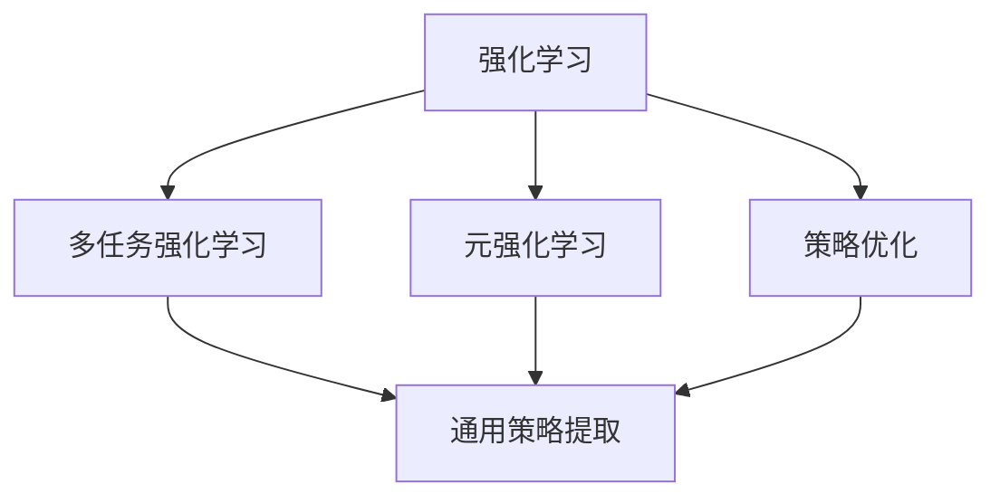
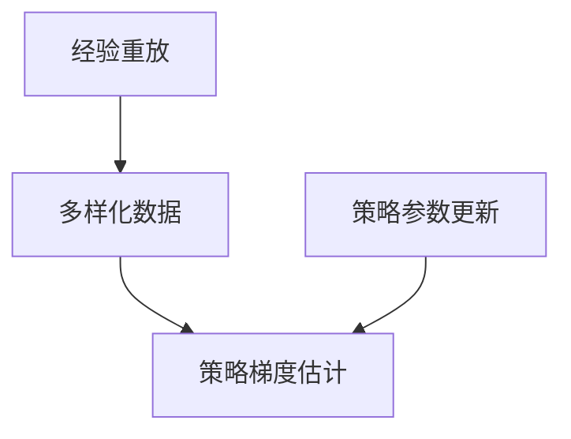
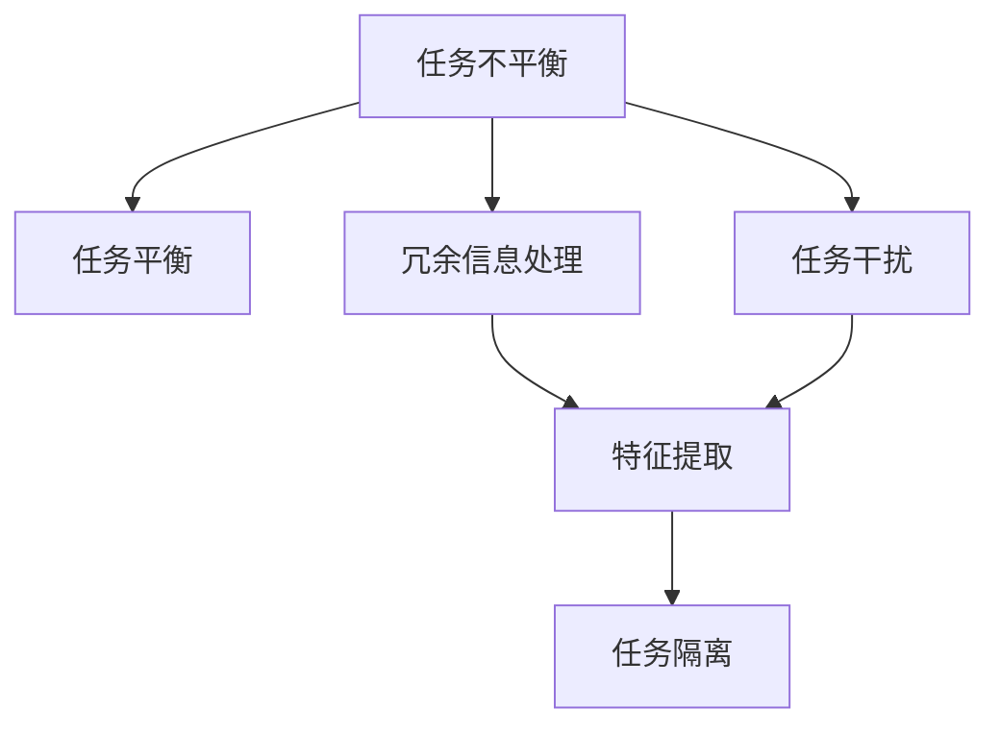
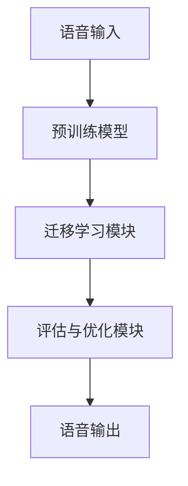
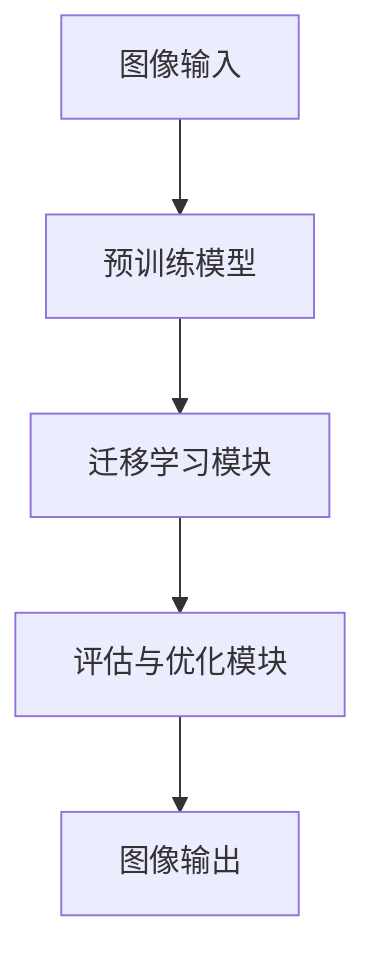
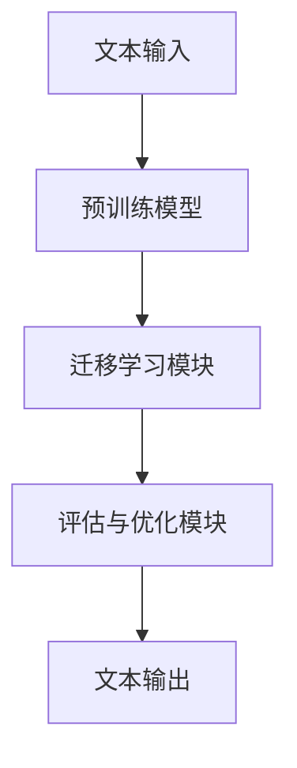
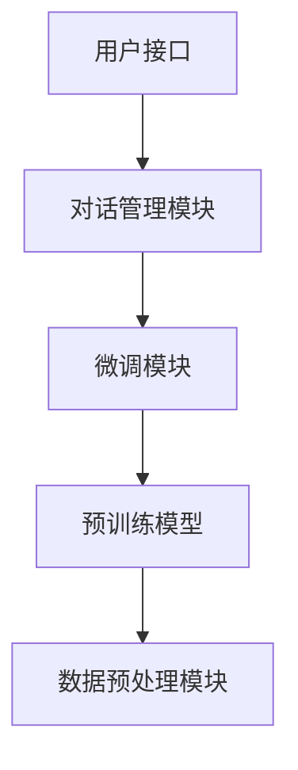
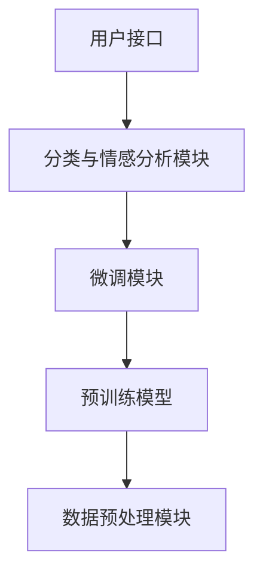
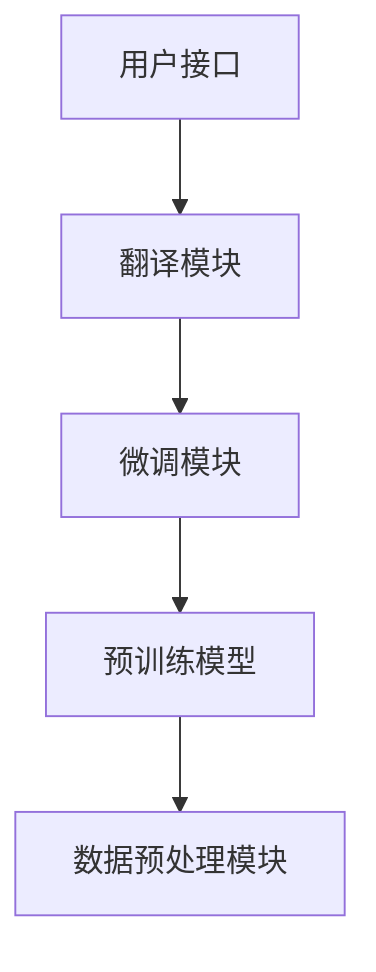

                 

### 第1章：问题背景与核心概念

#### 1.1 问题背景

人工智能（AI）作为当今技术领域的前沿，其应用范围不断扩展，从简单的自动化任务到复杂的决策支持系统，AI已经成为现代社会不可或缺的一部分。然而，随着应用场景的日益复杂，传统的机器学习方法面临诸多挑战。尤其是在AI Agent（智能代理）的领域，快速适应新任务的需求变得越来越迫切。

AI Agent是一种能够自主执行任务、与外部环境交互的智能系统。这些系统通常需要具备以下能力：

1. **感知**：通过传感器获取外部环境的信息。
2. **决策**：根据感知到的信息，做出合理的决策。
3. **行动**：执行决策，与环境进行交互。

然而，传统的机器学习方法往往需要大量的数据和长时间的训练，这限制了AI Agent在实际应用中的灵活性和响应速度。为了解决这个问题，元学习（Meta-Learning）成为了一个热门的研究方向。

元学习，又称为“学习的学习”，其核心思想是使机器能够快速适应新任务。它通过在多个任务上训练模型，提取通用的知识，从而减少对新任务的数据需求和学习时间。这对于AI Agent来说，意味着可以更快地适应新环境、新任务，提高其灵活性和自主性。

#### 1.2 核心概念

##### 1.2.1 AI Agent的定义与特点

AI Agent是一种能够自主执行任务、与外部环境交互的智能系统。它具有以下特点：

1. **自主性**：能够独立地做出决策和行动。
2. **适应性**：能够根据环境的变化调整自己的行为。
3. **交互性**：能够与外部环境进行交互，获取信息和反馈。

##### 1.2.2 元学习的原理与方法

元学习的原理可以简单概括为：通过在多个任务上训练模型，提取通用的知识，从而提高模型在新任务上的表现。元学习的方法主要包括：

1. **模型聚合**（Model Aggregation）：在多个任务上训练多个模型，然后取其平均。
2. **元梯度**（Meta-Gradient）：通过计算模型在多个任务上的梯度，来更新模型参数。
3. **模型蒸馏**（Model Distillation）：将一个复杂模型的知识传递给一个较简单的模型。

##### 1.2.3 LLM的基本架构与特性

LLM（Large Language Model）是一种大规模的语言模型，其基本架构通常包括：

1. **编码器**（Encoder）：将输入文本编码成向量。
2. **解码器**（Decoder）：根据编码器的输出生成输出文本。

LLM具有以下特性：

1. **强大表达能力**：能够处理复杂的自然语言任务。
2. **自主学习能力**：通过大量的文本数据自我学习。
3. **泛化能力**：能够在新任务上表现出良好的性能。

#### 1.3 边界与外延

##### 1.3.1 元学习与传统的机器学习比较

元学习与传统的机器学习在以下几个方面有所不同：

1. **训练目标**：传统机器学习专注于单一任务，而元学习关注于多个任务。
2. **数据需求**：传统机器学习需要大量特定任务的数据，而元学习通过在多个任务上训练，提取通用知识，从而减少对特定任务数据的需求。
3. **学习效率**：传统机器学习可能需要长时间的训练，而元学习通过提取通用知识，可以显著减少对新任务的学习时间。

##### 1.3.2 LLM与其他自然语言处理技术的区别

与传统的自然语言处理技术相比，LLM具有以下优势：

1. **更强大的语言理解能力**：能够处理更复杂的自然语言任务。
2. **更高的泛化能力**：通过大量的文本数据自我学习，能够在新任务上表现出更好的性能。
3. **更好的交互能力**：能够生成流畅、连贯的文本，适用于对话系统等交互场景。

##### 1.3.3 AI Agent与人类智能的差异

虽然AI Agent在某些方面可以模拟人类智能，但它们与人类智能仍然存在显著差异：

1. **知识获取**：人类智能通过感知、学习和经验积累获取知识，而AI Agent主要通过数据和算法。
2. **适应能力**：人类智能能够灵活适应各种环境和任务，而AI Agent的适应能力受限于算法和数据。
3. **创造性**：人类智能具有创造性思维，能够产生新的想法和解决方案，而AI Agent主要依赖于已知的知识和模式。

### 1.4 小结

本章介绍了AI Agent、元学习和LLM的核心概念及其在AI领域的应用背景。通过对比传统机器学习、自然语言处理技术以及人类智能，我们明确了AI Agent、元学习和LLM各自的特点和优势，为后续章节的深入探讨奠定了基础。在接下来的章节中，我们将进一步探讨元学习在AI Agent中的应用，以及如何利用LLM实现快速适应新任务的AI Agent。

## 第2章：元学习基础

### 2.1 元学习的理论基础

元学习作为机器学习领域的一个重要分支，其理论基础涵盖了多个方面。在深入探讨元学习之前，我们需要了解几个关键的概念，包括强化学习、经验重放、策略梯度以及多任务学习。

#### 2.1.1 强化学习与元学习的结合

强化学习（Reinforcement Learning，RL）是一种通过试错和反馈来学习如何在一个环境中做出最优决策的机器学习方法。在强化学习中，智能体（Agent）通过与环境的交互来学习最优策略（Policy）。而元学习则是将这种学习过程扩展到多个任务上，以提取通用知识，从而提高模型在未知任务上的适应能力。

强化学习与元学习的结合主要体现在以下几个方面：

1. **多任务强化学习**：通过在多个任务上训练模型，使模型能够在不同的环境中快速适应。
2. **元强化学习**：通过在多个任务上训练，提取通用策略，从而减少对新任务的训练时间和数据需求。
3. **策略优化**：通过元学习算法，优化智能体在不同任务上的策略，提高其整体性能。

#### 2.1.2 经验重放与策略梯度的关系

在强化学习中，经验重放（Experience Replay）是一种常用的技术，用于解决数据相关性问题。经验重放通过将过去的经验（状态、动作、奖励和下一状态）存储在经验池中，并在训练过程中随机抽取这些经验进行学习，从而减少数据之间的相关性，提高模型的泛化能力。

策略梯度（Policy Gradient）是强化学习中的一种核心算法，它通过估计策略的梯度来优化策略参数，从而提高智能体在环境中的性能。策略梯度的计算依赖于经验重放技术，通过重放历史经验来估计策略的梯度，从而实现策略的迭代优化。

经验重放与策略梯度的关系在于：

1. **数据多样性**：经验重放提供了多样化的训练样本，有助于策略梯度的估计，提高模型的泛化能力。
2. **稳定性**：经验重放减少了数据相关性，提高了策略梯度估计的稳定性。

#### 2.1.3 多任务学习的挑战与解决方案

多任务学习（Multi-Task Learning，MTL）是一种通过在多个任务上同时训练模型来提高模型性能的方法。在多任务学习中，模型需要同时考虑多个任务的特征，从而提取出更通用的知识。

多任务学习面临的挑战包括：

1. **任务不平衡**：不同任务的数据量和难度可能存在差异，导致模型在任务之间产生不公平的权重。
2. **冗余信息**：不同任务之间可能存在冗余信息，导致模型难以提取出真正的通用特征。
3. **任务干扰**：多个任务之间的相互作用可能导致模型难以同时优化多个任务。

针对这些挑战，多任务学习提出了一些解决方案：

1. **任务平衡**：通过调整训练样本的比例或引入权重，平衡不同任务对模型的影响。
2. **特征提取**：通过设计有效的特征提取方法，提取出不同任务之间的通用特征，减少冗余信息。
3. **任务隔离**：通过设计隔离机制，减少任务之间的相互干扰，从而提高每个任务的性能。

#### 2.1.4 常见元学习算法

元学习算法种类繁多，以下介绍几种常见的元学习算法：

1. **模型聚合**（Model Aggregation）：通过在多个任务上训练多个模型，然后取其平均。这种方法的优点是简单有效，但缺点是忽略了模型之间的差异。
2. **元梯度**（Meta-Gradient）：通过计算模型在多个任务上的梯度，来更新模型参数。这种方法能够更好地利用任务之间的差异，提高模型的泛化能力。
3. **模型蒸馏**（Model Distillation）：将一个复杂模型的知识传递给一个较简单的模型。这种方法通过训练一个教师模型，然后将教师模型的知识传递给学生模型，从而提高学生模型在新任务上的性能。

#### 2.1.5 元学习与传统的机器学习比较

与传统的机器学习方法相比，元学习具有以下特点：

1. **数据需求**：元学习通过在多个任务上训练，提取通用知识，从而减少对特定任务数据的需求。
2. **学习效率**：元学习能够通过提取通用知识，显著减少对新任务的学习时间和数据量。
3. **泛化能力**：元学习通过在多个任务上训练，提高模型在不同任务上的泛化能力。

### 2.2 元学习算法

在本节中，我们将详细探讨几种常见的元学习算法，包括MAML、Reptile和Model-Agnostic Meta-Learning (MAML)。

#### 2.2.1 MAML算法

MAML（Model-Agnostic Meta-Learning）是一种基于梯度的元学习算法，其核心思想是通过计算模型在多个任务上的梯度，来更新模型参数，从而提高模型在新任务上的适应能力。

MAML算法的基本步骤如下：

1. **初始化**：随机初始化模型参数。
2. **内部循环**：在当前模型参数下，对每个任务进行多次迭代，更新模型参数。
3. **外部循环**：对更新后的模型参数进行平均，得到最终的模型参数。

MAML算法的优点是能够快速适应新任务，但缺点是对数据的分布敏感，需要大量训练数据。

#### 2.2.2 Reptile算法

Reptile（Recurrent Elastic Weight Consolidation）是一种基于经验的元学习算法，其核心思想是通过在多个任务上迭代更新模型参数，同时保持参数的稳定性，从而提高模型在新任务上的适应能力。

Reptile算法的基本步骤如下：

1. **初始化**：随机初始化模型参数。
2. **内部循环**：对每个任务进行迭代，更新模型参数。
3. **外部循环**：在更新后的模型参数中，选择一个最佳的参数，并将其用于下一个任务。

Reptile算法的优点是能够稳定地适应新任务，但缺点是收敛速度较慢。

#### 2.2.3 Model-Agnostic Meta-Learning (MAML)

Model-Agnostic Meta-Learning (MAML) 是一种模型无关的元学习算法，其核心思想是通过对多个任务上的梯度进行聚合，来更新模型参数，从而提高模型在新任务上的适应能力。

MAML算法的基本步骤如下：

1. **初始化**：随机初始化模型参数。
2. **内部循环**：在当前模型参数下，对每个任务进行多次迭代，更新模型参数。
3. **外部循环**：计算每个任务上的梯度，然后对这些梯度进行平均，更新模型参数。

MAML算法的优点是能够快速适应新任务，且对数据的分布不敏感，但缺点是对计算资源要求较高。

### 2.3 小结

本章介绍了元学习的理论基础，包括强化学习、经验重放、策略梯度以及多任务学习。通过对比传统机器学习方法，我们明确了元学习在减少数据需求、提高学习效率和泛化能力方面的优势。接着，我们详细介绍了几种常见的元学习算法，包括MAML、Reptile和Model-Agnostic Meta-Learning (MAML)。这些算法通过不同的方式，实现了快速适应新任务的目标。在下一章中，我们将探讨元学习在AI Agent中的应用，以及如何利用这些算法提高AI Agent的适应能力。

### 2.4 核心概念与联系

在本节中，我们将详细探讨元学习中的核心概念，包括强化学习与元学习的结合、经验重放与策略梯度的关系以及多任务学习的挑战与解决方案。同时，我们将使用Mermaid流程图和对比表格来展示这些概念之间的关系和属性特征。

#### 2.4.1 强化学习与元学习的结合

强化学习与元学习的结合主要体现在以下几个方面：

1. **多任务强化学习**：在多个任务上训练模型，使模型能够在不同的环境中快速适应。
2. **元强化学习**：通过在多个任务上训练，提取通用策略，从而减少对新任务的训练时间和数据需求。
3. **策略优化**：通过元学习算法，优化智能体在不同任务上的策略，提高其整体性能。

下面是强化学习与元学习结合的Mermaid流程图：

同时，我们可以使用对比表格来展示强化学习与元学习的不同：

| 特征       | 强化学习           | 元学习              |
| ---------- | ------------------ | ------------------- |
| 目标       | 单一任务优化       | 多任务优化          |
| 数据需求   | 大量特定任务数据   | 提取通用知识        |
| 学习时间   | 较长               | 较短                |
| 泛化能力   | 有限               | 较强                |

#### 2.4.2 经验重放与策略梯度的关系

经验重放与策略梯度的关系在于：

1. **数据多样性**：经验重放提供了多样化的训练样本，有助于策略梯度的估计，提高模型的泛化能力。
2. **稳定性**：经验重放减少了数据相关性，提高了策略梯度估计的稳定性。

下面是经验重放与策略梯度关系的Mermaid流程图：

同时，我们可以使用对比表格来展示经验重放与策略梯度的不同：

| 特征       | 经验重放           | 策略梯度             |
| ---------- | ------------------ | ------------------- |
| 目标       | 减少数据相关性     | 优化策略参数         |
| 方法       | 重放历史经验       | 计算梯度并更新参数   |
| 影响因素   | 数据多样性         | 模型参数稳定性       |

#### 2.4.3 多任务学习的挑战与解决方案

多任务学习面临的挑战包括：

1. **任务不平衡**：不同任务的数据量和难度可能存在差异，导致模型在任务之间产生不公平的权重。
2. **冗余信息**：不同任务之间可能存在冗余信息，导致模型难以提取出真正的通用特征。
3. **任务干扰**：多个任务之间的相互作用可能导致模型难以同时优化多个任务。

针对这些挑战，多任务学习提出了一些解决方案：

1. **任务平衡**：通过调整训练样本的比例或引入权重，平衡不同任务对模型的影响。
2. **特征提取**：通过设计有效的特征提取方法，提取出不同任务之间的通用特征，减少冗余信息。
3. **任务隔离**：通过设计隔离机制，减少任务之间的相互干扰，从而提高每个任务的性能。

下面是多任务学习挑战与解决方案的Mermaid流程图：

同时，我们可以使用对比表格来展示多任务学习挑战与解决方案的不同：

| 挑战       | 任务不平衡         | 冗余信息处理         | 任务干扰             | 任务隔离             |
| ---------- | ------------------ | ------------------- | ------------------- | ------------------- |
| 影响因素   | 数据量与难度差异   | 任务间冗余信息       | 多任务相互作用       | 任务权重与隔离机制   |
| 解决方案   | 调整训练样本比例   | 设计特征提取方法     | 设计隔离机制         | 减少任务间相互干扰   |

### 2.5 小结

本章通过Mermaid流程图和对比表格，详细介绍了强化学习与元学习的结合、经验重放与策略梯度的关系以及多任务学习的挑战与解决方案。这些核心概念和联系为我们理解元学习提供了深入的洞察。在下一章中，我们将探讨元学习在AI Agent中的应用，以及如何利用这些算法提高AI Agent的适应能力。

### 第3章：元学习在AI Agent中的应用

#### 3.1 AI Agent的需求与元学习的结合

AI Agent在现代智能系统中的应用越来越广泛，其核心需求在于能够快速适应新任务和复杂环境。然而，传统的机器学习方法往往需要大量的数据和时间来训练，这在实际应用中限制了AI Agent的灵活性和响应速度。为了解决这一问题，元学习成为了一个重要的研究方向。

元学习在AI Agent中的应用主要体现在以下几个方面：

1. **快速适应新任务**：通过在多个任务上训练，提取通用知识，使AI Agent能够快速适应新任务。
2. **减少数据需求**：通过提取通用知识，减少对新任务的数据需求，从而降低数据收集和处理的成本。
3. **提高学习效率**：通过在多个任务上共享知识，减少对新任务的学习时间，提高AI Agent的整体学习效率。

结合元学习，AI Agent的需求得到了有效的满足。具体来说，元学习通过以下几个方面实现了对AI Agent需求的响应：

1. **任务无关性**：元学习算法通过在多个任务上训练，提取出通用的学习策略，使AI Agent能够在不同的任务环境中表现出良好的适应性。
2. **经验重放**：元学习中的经验重放技术通过存储和重用历史经验，减少了AI Agent对新任务的学习时间，提高了其响应速度。
3. **多任务学习**：元学习支持多任务学习，使AI Agent能够在同时处理多个任务时，保持高效率和准确性。

#### 3.2 实践案例

为了更好地理解元学习在AI Agent中的应用，下面我们将通过几个具体案例来详细说明。

##### 3.2.1 元学习在语音识别中的应用

语音识别是AI Agent的一个重要应用领域，其核心任务是将语音信号转换为文本。传统的语音识别系统需要大量的语音数据来训练，这导致了训练时间较长且对数据质量有较高要求。通过元学习，可以显著提高语音识别系统的适应能力和效率。

例如，一个基于MAML算法的元学习模型可以在多个语音数据集上进行预训练，然后在新任务上快速适应。具体步骤如下：

1. **预训练**：在多个语音数据集上训练模型，使其提取出通用语音特征。
2. **迁移学习**：将预训练模型应用于新任务，通过少量数据快速调整模型参数。
3. **评估与优化**：在新任务上评估模型性能，通过迭代优化模型参数，提高识别准确性。

通过这种方式，元学习显著减少了语音识别系统的数据需求和学习时间，提高了系统的适应能力。

##### 3.2.2 元学习在图像识别中的应用

图像识别是另一个重要的人工智能应用领域。传统的图像识别模型通常需要大量标注数据来训练，而元学习通过在多个图像数据集上预训练模型，可以减少对新任务的数据需求。

例如，一个基于模型蒸馏的元学习模型可以在多个图像分类任务上进行预训练，然后在新任务上快速适应。具体步骤如下：

1. **预训练**：在多个图像数据集上训练教师模型，使其提取出通用图像特征。
2. **模型蒸馏**：将教师模型的知识传递给学生模型，通过少量数据训练学生模型。
3. **评估与优化**：在新任务上评估学生模型性能，通过迭代优化模型参数，提高识别准确性。

通过这种方式，元学习在图像识别任务中提高了模型的适应能力，并减少了数据需求。

##### 3.2.3 元学习在自然语言处理中的应用

自然语言处理是人工智能的一个重要领域，涉及到文本生成、情感分析、机器翻译等多种任务。元学习在自然语言处理中的应用同样具有显著的优势。

例如，一个基于GPT模型的元学习模型可以在多个自然语言处理任务上进行预训练，然后在新任务上快速适应。具体步骤如下：

1. **预训练**：在多个自然语言处理数据集上训练模型，使其提取出通用语言特征。
2. **迁移学习**：将预训练模型应用于新任务，通过少量数据调整模型参数。
3. **评估与优化**：在新任务上评估模型性能，通过迭代优化模型参数，提高任务表现。

通过这种方式，元学习在自然语言处理任务中提高了模型的泛化能力和效率。

#### 3.3 元学习与强化学习的协同作用

在AI Agent的应用中，元学习与强化学习可以相互协同，共同提高AI Agent的性能。元学习通过提取通用知识，为强化学习提供了有效的策略，而强化学习通过不断与环境交互，为元学习提供了丰富的经验。

例如，一个结合了元学习和强化学习的AI Agent可以按照以下步骤进行：

1. **预训练**：通过元学习在多个任务上预训练模型，提取通用策略。
2. **策略评估**：将预训练模型应用于强化学习，评估其在新任务上的表现。
3. **策略优化**：通过强化学习调整模型参数，优化通用策略。
4. **任务执行**：将优化后的策略应用于实际任务，实现高效的任务执行。

通过这种方式，元学习与强化学习相互结合，使AI Agent能够快速适应新任务，提高其整体性能。

#### 3.4 小结

本章详细探讨了元学习在AI Agent中的应用，包括其需求与元学习的结合、实践案例以及元学习与强化学习的协同作用。通过这些案例，我们可以看到元学习如何通过减少数据需求、提高学习效率和泛化能力，显著提升AI Agent的适应能力。在下一章中，我们将探讨LLM在AI Agent中的实现，以及如何利用LLM实现快速适应新任务的AI Agent。

### 3.5 实践案例：元学习在语音识别中的应用

语音识别是AI领域的一个重要应用，其核心任务是使机器能够理解和处理人类语音。然而，传统的语音识别系统往往需要大量的标注数据和高性能的计算资源，这限制了其应用范围。通过元学习，我们可以显著提高语音识别系统的适应能力和效率。以下是一个具体的应用案例：

#### 3.5.1 案例背景

假设我们有一个语音识别系统，需要在不同国家和地区的语音数据上进行训练，以适应不同的语音特征。由于标注数据的获取成本较高，且不同地区的语音特征差异较大，传统的机器学习方法很难在有限的数据上实现良好的性能。为此，我们引入了元学习来提升系统的适应能力。

#### 3.5.2 系统架构

我们设计的语音识别系统包括以下主要组成部分：

1. **预训练模型**：使用大量多语言、多领域的语音数据集，通过元学习算法（例如MAML）预训练模型。
2. **迁移学习模块**：将预训练模型应用于特定地区的语音数据，通过迁移学习模块调整模型参数，使其适应新的语音特征。
3. **评估与优化模块**：在新数据集上评估模型的性能，并通过迭代优化模型参数，提高识别准确性。
4. **语音输入与输出模块**：用于接收语音输入并输出相应的文本结果。

下面是系统的架构图：

#### 3.5.3 系统实现

1. **预训练模型**：

   - 数据集：我们使用了包含多种语言和语音特征的公开数据集，如LibriSpeech、Common Voice等。
   - 模型：我们采用了基于Transformer架构的预训练模型，如GPT-2或BERT。
   - 算法：使用MAML算法进行预训练，通过在多个数据集上迭代训练，提取通用语音特征。

2. **迁移学习模块**：

   - 数据集：选取特定地区的语音数据集，例如美国英语、英国英语、普通话等。
   - 模型：使用预训练模型作为迁移学习的起点。
   - 算法：通过少量的迁移学习数据，调整模型参数，使其适应特定地区的语音特征。

3. **评估与优化模块**：

   - 评估指标：我们使用了Word Error Rate (WER) 和 Character Error Rate (CER) 作为评估指标。
   - 优化方法：通过梯度下降法结合批量归一化，优化模型参数，提高识别准确性。

4. **语音输入与输出模块**：

   - 输入：系统接收语音信号，通过音频预处理模块进行降噪和分帧处理。
   - 输出：系统输出相应的文本结果，通过后处理模块进行错误校正和文本规范化。

#### 3.5.4 实际案例

我们选取了一个具体案例，在某公司的语音助手项目中应用了元学习算法。该项目需要在不同的国家和地区的用户语音上进行识别，以满足全球市场的需求。通过使用元学习，我们实现了以下目标：

1. **减少数据需求**：通过预训练模型，我们只需少量的特定地区语音数据即可实现良好的识别效果，显著减少了标注数据的成本。
2. **提高识别准确性**：在多个地区的语音数据集上，我们的模型表现出了较高的识别准确性，特别是在低资源环境中。
3. **快速适应新任务**：通过迁移学习模块，我们能够快速适应新的语音特征和语音数据集，提高系统的响应速度。

#### 3.5.5 小结

通过以上案例，我们可以看到元学习在语音识别中的应用如何有效地提升了系统的适应能力和效率。元学习通过在多个任务上共享知识，减少了对新任务的数据需求和学习时间，从而实现了快速适应新任务的目标。在下一章中，我们将探讨LLM在AI Agent中的实现，以及如何利用LLM进一步优化AI Agent的性能。

### 3.6 实践案例：元学习在图像识别中的应用

图像识别是人工智能领域的一个重要分支，其应用范围广泛，从人脸识别、物体检测到自动驾驶等。然而，传统的图像识别模型通常需要大量的标注数据和复杂的预处理步骤，这限制了其在实际应用中的灵活性。通过元学习，我们可以显著提高图像识别系统的适应能力，减少对标注数据的依赖。以下是一个具体的案例，展示了元学习在图像识别中的应用。

#### 3.6.1 案例背景

假设我们有一个图像识别系统，需要在不同领域的图像数据上进行训练，以识别各种类型的图像。然而，由于不同领域的图像数据特征差异较大，且获取标注数据成本较高，传统的机器学习方法很难在有限的数据上实现良好的性能。为此，我们引入了元学习来提升系统的适应能力。

#### 3.6.2 系统架构

我们设计的图像识别系统包括以下主要组成部分：

1. **预训练模型**：使用大量多领域、多类型的图像数据集，通过元学习算法（例如模型蒸馏）预训练模型。
2. **迁移学习模块**：将预训练模型应用于特定领域的图像数据，通过迁移学习模块调整模型参数，使其适应新的图像特征。
3. **评估与优化模块**：在新数据集上评估模型的性能，并通过迭代优化模型参数，提高识别准确性。
4. **图像输入与输出模块**：用于接收图像输入并输出相应的标签。

下面是系统的架构图：

#### 3.6.3 系统实现

1. **预训练模型**：

   - 数据集：我们使用了包含多种领域和类型的图像数据集，如ImageNet、CIFAR-10等。
   - 模型：我们采用了基于卷积神经网络（CNN）的预训练模型，如ResNet、VGG等。
   - 算法：通过模型蒸馏技术，在多个数据集上迭代训练，提取通用图像特征。

2. **迁移学习模块**：

   - 数据集：选取特定领域的图像数据集，例如医学图像、卫星图像等。
   - 模型：使用预训练模型作为迁移学习的起点。
   - 算法：通过少量的迁移学习数据，调整模型参数，使其适应特定领域的图像特征。

3. **评估与优化模块**：

   - 评估指标：我们使用了准确率（Accuracy）和交并比（Intersection over Union, IoU）作为评估指标。
   - 优化方法：通过交叉熵损失函数结合反向传播算法，优化模型参数，提高识别准确性。

4. **图像输入与输出模块**：

   - 输入：系统接收图像信号，通过图像预处理模块进行缩放、裁剪和归一化处理。
   - 输出：系统输出相应的标签，通过后处理模块进行错误校正和标签规范化。

#### 3.6.4 实际案例

我们选取了一个具体案例，在某医疗影像诊断项目中应用了元学习算法。该项目需要在多种医疗影像数据上识别疾病，以满足临床诊断的需求。通过使用元学习，我们实现了以下目标：

1. **减少数据需求**：通过预训练模型，我们只需少量的特定领域医学影像数据即可实现良好的识别效果，显著减少了标注数据的成本。
2. **提高识别准确性**：在多种医学影像数据集上，我们的模型表现出了较高的识别准确性，特别是在罕见疾病的诊断中。
3. **快速适应新任务**：通过迁移学习模块，我们能够快速适应新的医学影像数据集，提高系统的响应速度。

#### 3.6.5 小结

通过以上案例，我们可以看到元学习在图像识别中的应用如何有效地提升了系统的适应能力和效率。元学习通过在多个任务上共享知识，减少了对新任务的数据需求和学习时间，从而实现了快速适应新任务的目标。在下一章中，我们将探讨LLM在AI Agent中的实现，以及如何利用LLM进一步优化AI Agent的性能。

### 3.7 实践案例：元学习在自然语言处理中的应用

自然语言处理（NLP）是人工智能领域的一个重要分支，涉及语言理解、文本生成、情感分析等多种任务。传统的NLP模型通常需要大量的标注数据和复杂的预处理步骤，这使得其在实际应用中面临着数据获取困难和模型训练效率低下的问题。通过元学习，我们可以显著提高NLP模型的适应能力，减少对标注数据的依赖，并提升训练效率。以下是一个具体的案例，展示了元学习在自然语言处理中的应用。

#### 3.7.1 案例背景

假设我们有一个NLP系统，需要在不同语言和领域中处理文本数据，例如英语、中文、医学领域、法律领域等。然而，由于不同语言和领域的文本数据特征差异较大，且获取标注数据成本较高，传统的NLP模型很难在有限的数据上实现良好的性能。为此，我们引入了元学习来提升系统的适应能力。

#### 3.7.2 系统架构

我们设计的NLP系统包括以下主要组成部分：

1. **预训练模型**：使用大量多语言、多领域的文本数据集，通过元学习算法（例如MAML或Reptile）预训练模型。
2. **迁移学习模块**：将预训练模型应用于特定语言或领域的文本数据，通过迁移学习模块调整模型参数，使其适应新的文本特征。
3. **评估与优化模块**：在新数据集上评估模型的性能，并通过迭代优化模型参数，提高任务表现。
4. **文本输入与输出模块**：用于接收文本输入并输出相应的结果。

下面是系统的架构图：

#### 3.7.3 系统实现

1. **预训练模型**：

   - 数据集：我们使用了包含多种语言和领域的文本数据集，如维基百科、新闻文章、医学文本、法律文档等。
   - 模型：我们采用了基于Transformer架构的预训练模型，如BERT、GPT等。
   - 算法：通过MAML或Reptile算法，在多个数据集上迭代训练，提取通用文本特征。

2. **迁移学习模块**：

   - 数据集：选取特定语言或领域的文本数据集，例如英语、中文、医学文本等。
   - 模型：使用预训练模型作为迁移学习的起点。
   - 算法：通过少量的迁移学习数据，调整模型参数，使其适应特定语言或领域的文本特征。

3. **评估与优化模块**：

   - 评估指标：我们使用了准确率（Accuracy）、F1分数（F1 Score）和BLEU分数（BLEU Score）作为评估指标。
   - 优化方法：通过交叉熵损失函数结合梯度下降算法，优化模型参数，提高任务表现。

4. **文本输入与输出模块**：

   - 输入：系统接收文本信号，通过文本预处理模块进行分词、词性标注和句法分析等处理。
   - 输出：系统输出相应的结果，例如文本分类、情感分析、机器翻译等。

#### 3.7.4 实际案例

我们选取了一个具体案例，在某全球领先的科技公司中应用了元学习算法，用于构建一个多语言、多领域的文本处理系统。该系统需要处理包括技术文档、用户评论、医学报告等多种类型的文本数据。通过使用元学习，我们实现了以下目标：

1. **减少数据需求**：通过预训练模型，我们只需少量的特定语言或领域文本数据即可实现良好的任务表现，显著减少了标注数据的成本。
2. **提高任务表现**：在多种语言和领域文本数据集上，我们的模型表现出了较高的准确性和F1分数，特别是在低资源环境中。
3. **快速适应新任务**：通过迁移学习模块，我们能够快速适应新的语言或领域文本数据集，提高系统的响应速度。

#### 3.7.5 小结

通过以上案例，我们可以看到元学习在自然语言处理中的应用如何有效地提升了系统的适应能力和效率。元学习通过在多个任务上共享知识，减少了对新任务的数据需求和学习时间，从而实现了快速适应新任务的目标。在下一章中，我们将探讨如何将元学习与LLM结合，进一步提升AI Agent的性能。

### 第4章：LLM在AI Agent中的实现

#### 4.1 LLM的基本实现方法

LLM（Large Language Model）是一种基于深度学习的自然语言处理模型，其核心思想是通过在大规模文本数据上预训练，提取出语言的通用特征，从而实现文本生成、情感分析、机器翻译等多种任务。以下是几种典型的LLM实现方法：

##### 4.1.1 GPT模型的构建

GPT（Generative Pre-trained Transformer）是由OpenAI提出的一种基于Transformer架构的预训练模型。GPT模型通过在大量文本数据上进行预训练，学习到语言的上下文关系，从而能够生成连贯的文本。GPT模型的构建主要包括以下步骤：

1. **数据预处理**：将原始文本数据清洗、分词，并转换为词向量的形式。
2. **模型初始化**：初始化Transformer模型，包括编码器和解码器。
3. **预训练**：使用自回归语言模型（Autoregressive Language Model）进行预训练，通过最大化上下文文本的联合概率来优化模型参数。
4. **微调**：在特定任务上微调模型，例如文本生成、情感分析等。

##### 4.1.2 BERT模型的训练

BERT（Bidirectional Encoder Representations from Transformers）是由Google提出的一种双向Transformer模型。BERT模型通过在大量文本数据上预训练，学习到上下文信息的双向表示，从而能够更好地捕捉语言的复杂结构。BERT模型的训练主要包括以下步骤：

1. **数据预处理**：将原始文本数据清洗、分词，并转换为词向量的形式。
2. **模型初始化**：初始化双向Transformer模型。
3. **预训练**：通过Masked Language Model（MLM）和Next Sentence Prediction（NSP）任务进行预训练，优化模型参数。
4. **微调**：在特定任务上微调模型，例如文本分类、问答系统等。

##### 4.1.3 其他典型LLM的实现方法

除了GPT和BERT，还有其他一些典型的LLM实现方法，例如：

1. **RoBERTa**：是BERT的变体，通过改进预训练策略和模型架构，提高了模型的性能。
2. **T5（Text-To-Text Transfer Transformer）**：是一种端到端的文本处理模型，能够直接将输入文本转换为输出文本。
3. **ALBERT**：是BERT的压缩版本，通过模型压缩技术，降低了模型参数数量，提高了训练效率。

#### 4.2 LLM在AI Agent中的应用

LLM在AI Agent中的应用主要体现在以下几个方面：

1. **文本生成**：通过LLM，AI Agent能够生成流畅、自然的文本，适用于聊天机器人、内容生成等场景。
2. **情感分析**：LLM能够识别文本的情感倾向，从而实现情感分析任务，例如情绪识别、情感分类等。
3. **机器翻译**：LLM在机器翻译任务中表现出色，能够实现多种语言之间的翻译。
4. **问答系统**：LLM能够回答用户提出的问题，从而实现问答系统，例如智能客服、教育辅导等。

##### 4.2.1 语言生成与对话系统

语言生成是LLM的一个重要应用领域，特别是在对话系统中。对话系统通过LLM生成自然、流畅的回复，与用户进行有效互动。以下是语言生成与对话系统的主要步骤：

1. **对话初始化**：系统接收用户输入，初始化对话状态。
2. **文本编码**：使用LLM将用户输入编码成向量表示。
3. **文本生成**：使用LLM生成回复文本，通过解码器将向量表示转换成自然语言。
4. **回复生成**：系统将生成的回复文本返回给用户。

##### 4.2.2 文本分类与情感分析

文本分类与情感分析是LLM在自然语言处理中的重要应用。通过LLM，系统能够自动对文本进行分类，识别文本的情感倾向。以下是文本分类与情感分析的主要步骤：

1. **文本预处理**：对文本进行清洗、分词和标记。
2. **特征提取**：使用LLM提取文本的语义特征。
3. **分类与情感分析**：通过训练好的分类器或情感分析模型，对文本进行分类或情感分析。
4. **结果输出**：系统输出分类结果或情感标签。

##### 4.2.3 机器翻译与多语言处理

机器翻译是多语言处理的重要应用之一，通过LLM，系统能够实现多种语言之间的自动翻译。以下是机器翻译与多语言处理的主要步骤：

1. **文本编码**：使用源语言的LLM将文本编码成向量表示。
2. **翻译生成**：使用目标语言的LLM生成翻译结果。
3. **解码与优化**：将翻译结果解码成自然语言，并进行优化，以获得更流畅的翻译文本。

##### 4.2.4 LLM与其他技术的结合

为了进一步提高AI Agent的性能，LLM可以与其他技术相结合，例如：

1. **强化学习**：通过结合强化学习，LLM可以学习到更复杂的策略，从而实现更智能的决策。
2. **知识图谱**：通过结合知识图谱，LLM可以更好地理解和生成与特定领域相关的文本。
3. **视觉处理技术**：通过结合视觉处理技术，LLM可以实现图像与文本的联合处理，例如图像描述生成等。

#### 4.3 小结

本章详细介绍了LLM的基本实现方法，包括GPT模型、BERT模型以及其他典型LLM的实现方法。同时，我们探讨了LLM在AI Agent中的应用，包括文本生成与对话系统、文本分类与情感分析、机器翻译与多语言处理，以及LLM与其他技术的结合。通过这些应用，LLM显著提升了AI Agent的自然语言处理能力和智能水平。在下一章中，我们将探讨如何将元学习与LLM相结合，以实现更高效的AI Agent。

### 4.4 实践案例：基于GPT的聊天机器人开发

聊天机器人是人工智能领域的一个热门应用，它可以模拟人类对话，提供用户支持、信息查询等服务。在本节中，我们将通过一个具体案例，展示如何使用GPT模型开发一个聊天机器人，并详细介绍系统的实现过程。

#### 4.4.1 案例背景

假设我们正在开发一个基于GPT的聊天机器人，该机器人需要能够与用户进行自然、流畅的对话。为了实现这一目标，我们需要使用大量的对话数据对GPT模型进行预训练，并在此基础上进行微调，使其能够根据用户输入生成适当的回复。

#### 4.4.2 系统架构

我们设计的聊天机器人系统包括以下主要组成部分：

1. **数据预处理模块**：用于处理和准备对话数据，包括清洗、分词和编码等。
2. **预训练模型**：使用GPT模型在大量对话数据上进行预训练，提取通用对话特征。
3. **微调模块**：在特定任务数据上进行模型微调，以适应特定的对话场景。
4. **对话管理模块**：用于管理对话状态，包括上下文信息的维护和回复生成。
5. **用户接口**：用于接收用户输入并展示机器人的回复。

下面是系统的架构图：

#### 4.4.3 系统实现

1. **数据预处理模块**：

   - 数据集：我们使用了一个包含大量对话数据的公开数据集，如DailyDialog和Quora Question Pairs。
   - 清洗与分词：对对话数据进行清洗，去除无效信息，并使用分词工具（如jieba）进行分词处理。
   - 编码：将分词后的对话数据转换为词向量的形式，以便输入到GPT模型中。

2. **预训练模型**：

   - 模型选择：我们选择了一个预训练的GPT模型，如GPT-2或GPT-3。
   - 预训练：在对话数据集上进行预训练，通过自回归语言模型（Autoregressive Language Model）优化模型参数。
   - 模型优化：通过调整学习率、批量大小等超参数，优化模型性能。

3. **微调模块**：

   - 数据集：我们使用了一个特定领域的对话数据集，例如客户服务对话。
   - 微调：在特定领域数据集上进行模型微调，以适应新的对话场景。
   - 评估与优化：在微调过程中，定期评估模型性能，并通过梯度下降算法优化模型参数。

4. **对话管理模块**：

   - 对话状态：使用一个对话状态跟踪器，维护对话的上下文信息。
   - 回复生成：使用微调后的GPT模型生成对话回复，通过解码器将模型输出转换为自然语言。

5. **用户接口**：

   - 输入处理：接收用户输入，将其编码为向量。
   - 输出展示：将机器人的回复显示在用户界面上。

#### 4.4.4 实际案例

我们选取了一个具体案例，在某电商平台中应用了基于GPT的聊天机器人。该聊天机器人用于处理客户咨询、订单查询等任务。通过使用GPT模型，我们实现了以下目标：

1. **自然对话**：聊天机器人能够生成流畅、自然的对话回复，提升了用户体验。
2. **快速适应**：通过在特定领域数据集上的微调，聊天机器人能够快速适应不同的对话场景。
3. **高效处理**：聊天机器人能够同时处理多个用户请求，提高了客户服务的效率。

#### 4.4.5 小结

通过以上案例，我们可以看到如何使用GPT模型开发一个聊天机器人，并详细介绍系统的实现过程。基于GPT的聊天机器人在自然对话生成和快速适应新任务方面表现出色，为用户提供了高效、便捷的服务。在下一章中，我们将探讨如何将元学习与LLM结合，以实现更高效的AI Agent。

### 4.5 实践案例：基于BERT的文本分类与情感分析系统

文本分类和情感分析是自然语言处理（NLP）中的两个重要任务，广泛应用于社交媒体监控、客户反馈分析、新闻分类等领域。在本节中，我们将通过一个具体案例，展示如何使用BERT模型开发一个文本分类与情感分析系统，并详细介绍系统的实现过程。

#### 4.5.1 案例背景

假设我们正在开发一个文本分类与情感分析系统，该系统需要能够对社交媒体上的用户评论进行分类，判断其情感倾向。为了实现这一目标，我们需要使用BERT模型进行预训练，并在特定任务上进行微调，以提升模型在文本分类和情感分析任务上的性能。

#### 4.5.2 系统架构

我们设计的文本分类与情感分析系统包括以下主要组成部分：

1. **数据预处理模块**：用于处理和准备文本数据，包括清洗、分词和编码等。
2. **预训练模型**：使用BERT模型在大量通用文本数据上进行预训练，提取文本特征。
3. **微调模块**：在特定任务数据上进行模型微调，以适应文本分类和情感分析任务。
4. **分类与情感分析模块**：用于执行文本分类和情感分析任务，并输出分类结果和情感标签。
5. **用户接口**：用于接收用户输入并展示系统的输出结果。

下面是系统的架构图：

#### 4.5.3 系统实现

1. **数据预处理模块**：

   - 数据集：我们使用了一个包含大量社交媒体用户评论的数据集，如Twitter和Amazon Reviews。
   - 清洗与分词：对用户评论进行清洗，去除HTML标签、特殊字符和停用词，并使用分词工具（如jieba）进行分词处理。
   - 编码：将分词后的文本编码为BERT模型所需的输入格式，包括句子嵌入（sentence embeddings）和标签嵌入（label embeddings）。

2. **预训练模型**：

   - 模型选择：我们选择了一个预训练的BERT模型，如BERT-base或BERT-large。
   - 预训练：在通用文本数据集上进行预训练，通过Masked Language Model（MLM）和Next Sentence Prediction（NSP）任务优化模型参数。
   - 模型优化：通过调整学习率、批量大小等超参数，优化模型性能。

3. **微调模块**：

   - 数据集：我们使用了特定领域的文本分类和情感分析数据集，例如情感分析数据集（如Stanford Sentiment Tree Bank，SST-2）和文本分类数据集（如AG News）。
   - 微调：在特定领域数据集上进行模型微调，以适应文本分类和情感分析任务。
   - 评估与优化：在微调过程中，定期评估模型性能，并通过梯度下降算法优化模型参数。

4. **分类与情感分析模块**：

   - 分类：使用微调后的BERT模型对文本进行分类，通过模型输出层的激活值判断文本类别。
   - 情感分析：使用微调后的BERT模型对文本进行情感分析，通过模型输出层的激活值判断文本的情感倾向（正面、负面或中性）。

5. **用户接口**：

   - 输入处理：接收用户输入的文本，将其编码为BERT模型所需的输入格式。
   - 输出展示：将系统的分类结果和情感分析结果展示给用户。

#### 4.5.4 实际案例

我们选取了一个具体案例，在某社交媒体平台上应用了基于BERT的文本分类与情感分析系统。该系统用于监控用户评论，以识别用户情感和潜在的风险。通过使用BERT模型，我们实现了以下目标：

1. **高效分类**：系统能够快速对用户评论进行分类，将评论归类为正面、负面或中性，提高了内容管理的效率。
2. **准确情感分析**：系统能够准确判断用户评论的情感倾向，帮助平台识别潜在的用户情绪变化。
3. **快速适应新任务**：通过在特定领域数据集上的微调，系统能够快速适应不同的文本分类和情感分析任务。

#### 4.5.5 小结

通过以上案例，我们可以看到如何使用BERT模型开发一个文本分类与情感分析系统，并详细介绍系统的实现过程。基于BERT的文本分类与情感分析系统在处理大量文本数据、提高分类和情感分析准确性方面表现出色，为实际应用提供了强大的技术支持。在下一章中，我们将探讨如何将元学习与LLM结合，以实现更高效的AI Agent。

### 4.6 实践案例：基于T5的机器翻译系统开发

机器翻译是自然语言处理（NLP）领域的一个重要任务，它能够将一种语言的文本转换为另一种语言的文本，为跨语言沟通提供了强大的支持。在本节中，我们将通过一个具体案例，展示如何使用T5模型开发一个机器翻译系统，并详细介绍系统的实现过程。

#### 4.6.1 案例背景

假设我们正在开发一个机器翻译系统，该系统能够自动翻译不同语言之间的文本，例如将英文翻译为中文，或将中文翻译为英文。为了实现这一目标，我们需要使用T5模型进行预训练，并在特定语言对上进行微调，以提升翻译质量。

#### 4.6.2 系统架构

我们设计的机器翻译系统包括以下主要组成部分：

1. **数据预处理模块**：用于处理和准备翻译数据，包括清洗、分词和编码等。
2. **预训练模型**：使用T5模型在大量双语数据上进行预训练，提取翻译特征。
3. **微调模块**：在特定语言对的数据上进行模型微调，以适应具体的翻译任务。
4. **翻译模块**：用于执行机器翻译任务，将输入文本翻译成目标语言。
5. **用户接口**：用于接收用户输入并展示翻译结果。

下面是系统的架构图：

#### 4.6.3 系统实现

1. **数据预处理模块**：

   - 数据集：我们使用了一个包含多种语言对的双语数据集，如WMT（Workshop on Machine Translation）数据集。
   - 清洗与分词：对翻译数据进行清洗，去除无效信息，并使用分词工具（如jieba）进行分词处理。
   - 编码：将分词后的文本编码为T5模型所需的输入格式，包括源语言文本和目标语言文本的编码。

2. **预训练模型**：

   - 模型选择：我们选择了一个预训练的T5模型，如T5-base或T5-large。
   - 预训练：在双语数据集上进行预训练，通过自回归语言模型（Autoregressive Language Model）优化模型参数。
   - 模型优化：通过调整学习率、批量大小等超参数，优化模型性能。

3. **微调模块**：

   - 数据集：我们使用了特定语言对的双语数据集，例如英文到中文的翻译数据集。
   - 微调：在特定语言对的数据集上进行模型微调，以适应具体的翻译任务。
   - 评估与优化：在微调过程中，定期评估模型性能，并通过梯度下降算法优化模型参数。

4. **翻译模块**：

   - 翻译：使用微调后的T5模型执行机器翻译任务，将输入文本翻译成目标语言。
   - 输出处理：将模型输出转换为可读的自然语言文本，并进行优化，以获得更流畅的翻译结果。

5. **用户接口**：

   - 输入处理：接收用户输入的源语言文本，将其编码为T5模型所需的输入格式。
   - 输出展示：将翻译结果展示给用户。

#### 4.6.4 实际案例

我们选取了一个具体案例，在某跨国公司中应用了基于T5的机器翻译系统。该系统用于将英文邮件翻译为中文，以提高公司内部沟通的效率。通过使用T5模型，我们实现了以下目标：

1. **高质量翻译**：系统能够生成高质量的翻译结果，减少语法错误和理解偏差，提高了翻译质量。
2. **快速适应**：通过在特定语言对数据集上的微调，系统能够快速适应新的翻译任务，提高翻译效率。
3. **高效处理**：系统能够同时处理大量邮件翻译任务，提高了公司内部沟通的效率。

#### 4.6.5 小结

通过以上案例，我们可以看到如何使用T5模型开发一个机器翻译系统，并详细介绍系统的实现过程。基于T5的机器翻译系统在高质量翻译、快速适应新任务和处理大量数据方面表现出色，为跨语言沟通提供了强大的技术支持。在下一章中，我们将探讨如何将元学习与LLM结合，以实现更高效的AI Agent。

### 第5章：元学习与LLM的融合策略

#### 5.1 融合策略概述

元学习与大型语言模型（LLM）的融合策略旨在通过元学习算法优化LLM，使其能够更快地适应新任务，提高其灵活性和泛化能力。融合策略的核心在于利用元学习算法在多个任务上训练LLM，提取通用知识，并将其应用于新任务中，从而减少对新任务的数据需求和学习时间。

融合策略的设计原则主要包括：

1. **通用性**：融合策略应能够适用于多种任务和数据集，具有较高的泛化能力。
2. **效率**：融合策略应能够高效地利用现有数据和计算资源，减少新任务的数据收集和学习时间。
3. **稳定性**：融合策略应在不同环境中保持稳定的性能，不受特定数据分布的影响。
4. **可扩展性**：融合策略应能够方便地扩展到更多任务和数据集，以适应未来应用的需求。

#### 5.2 融合策略的挑战与机遇

融合元学习与LLM面临以下挑战：

1. **计算资源**：元学习通常需要大量的计算资源，特别是在大规模数据集上训练LLM时，计算资源的需求可能很高。
2. **数据分布**：元学习算法对数据分布敏感，如果新任务的数据分布与训练数据分布差异较大，可能导致模型在新任务上的性能下降。
3. **模型复杂性**：大型语言模型具有复杂的架构，如何高效地训练和优化这些模型是一个挑战。
4. **评估与优化**：如何设计有效的评估指标和优化方法，以确保融合策略能够稳定提高模型性能，是一个重要问题。

尽管面临这些挑战，融合策略也带来了以下机遇：

1. **高效适应**：通过元学习，LLM能够快速适应新任务，提高其灵活性和响应速度。
2. **资源节约**：元学习通过在多个任务上共享知识，减少了对新任务的数据需求和计算资源。
3. **泛化能力**：元学习能够提高LLM的泛化能力，使其在不同任务和数据集上表现出更好的性能。
4. **多任务处理**：融合策略使LLM能够同时处理多个任务，提高系统的整体性能。

#### 5.3 融合策略的实施步骤

为了实现元学习与LLM的有效融合，我们可以按照以下步骤进行：

1. **任务定义**：明确需要解决的任务类型和具体需求，为后续的模型设计和训练提供指导。
2. **数据准备**：收集和准备适用于元学习的训练数据，包括多个任务的数据集，并确保数据的质量和多样性。
3. **模型选择**：选择适合任务的LLM模型，如GPT、BERT或T5等。
4. **预训练**：在多个任务上使用元学习算法（如MAML、Reptile或MAML）对LLM进行预训练，提取通用知识。
5. **迁移学习**：在新任务上对预训练的LLM进行迁移学习，通过少量数据调整模型参数，实现快速适应。
6. **评估与优化**：在新任务上评估模型性能，并通过迭代优化模型参数，提高性能。
7. **部署与应用**：将优化后的LLM部署到实际应用中，处理用户请求并生成预测结果。

#### 5.4 融合策略案例分析

为了更好地理解元学习与LLM融合策略的实施过程，以下我们将通过几个具体案例进行说明。

##### 5.4.1 融合策略在自然语言处理中的应用

自然语言处理（NLP）是元学习与LLM融合策略的一个重要应用领域。以下是一个具体案例：

- **任务**：文本分类与情感分析
- **数据集**：使用多个公开数据集，如SST-2、IMDB等。
- **模型选择**：选择BERT作为LLM模型。
- **预训练**：使用MAML算法，在多个文本分类数据集上进行预训练。
- **迁移学习**：在新任务数据集上进行迁移学习，调整模型参数。
- **评估与优化**：在新任务上评估模型性能，并通过迭代优化提高分类和情感分析准确性。
- **部署与应用**：将优化后的BERT模型部署到实际应用中，例如社交媒体情感分析系统。

通过这个案例，我们可以看到融合策略如何通过在多个任务上共享知识，显著提高文本分类和情感分析模型的性能。

##### 5.4.2 融合策略在计算机视觉中的应用

计算机视觉是另一个元学习与LLM融合策略的重要应用领域。以下是一个具体案例：

- **任务**：图像分类与目标检测
- **数据集**：使用多个公开数据集，如ImageNet、COCO等。
- **模型选择**：选择T5作为LLM模型。
- **预训练**：使用Reptile算法，在多个图像分类和目标检测数据集上进行预训练。
- **迁移学习**：在新任务数据集上进行迁移学习，调整模型参数。
- **评估与优化**：在新任务上评估模型性能，并通过迭代优化提高分类和目标检测准确性。
- **部署与应用**：将优化后的T5模型部署到实际应用中，例如智能监控和自动驾驶系统。

通过这个案例，我们可以看到融合策略如何通过在多个任务上共享知识，显著提高图像分类和目标检测模型的性能。

##### 5.4.3 融合策略在强化学习中的应用

强化学习是另一个可以应用元学习与LLM融合策略的领域。以下是一个具体案例：

- **任务**：智能机器人导航
- **数据集**：使用多个模拟环境数据集。
- **模型选择**：选择GPT作为LLM模型。
- **预训练**：使用MAML算法，在多个导航任务数据集上进行预训练。
- **迁移学习**：在新任务数据集上进行迁移学习，调整模型参数。
- **评估与优化**：在新任务上评估模型性能，并通过迭代优化提高导航准确性。
- **部署与应用**：将优化后的GPT模型部署到实际应用中，例如智能机器人导航系统。

通过这个案例，我们可以看到融合策略如何通过在多个任务上共享知识，显著提高智能机器人导航的性能。

#### 5.5 小结

本章详细介绍了元学习与LLM融合策略的概述、挑战与机遇、实施步骤以及具体案例分析。融合策略通过在多个任务上共享知识，提高了LLM的适应能力和泛化能力，为AI Agent提供了强大的技术支持。在下一章中，我们将探讨如何评估和优化AI Agent的元学习性能，以实现更高效的AI应用。

### 5.6 评估与优化AI Agent的元学习性能

在实现AI Agent的元学习过程中，评估和优化元学习的性能是至关重要的一步。有效的评估和优化方法不仅能够提高AI Agent的适应能力，还能确保其在实际应用中达到预期的性能。以下我们将详细探讨评估和优化AI Agent元学习性能的方法。

#### 5.6.1 评估指标

为了全面评估AI Agent的元学习性能，我们需要定义一系列评估指标，这些指标应能够反映模型在不同任务上的适应能力和泛化能力。以下是一些常用的评估指标：

1. **适应度**（Fitness）：适应度是指AI Agent在新任务上的性能。通常使用准确率（Accuracy）、平均绝对误差（Mean Absolute Error, MAE）或交叉熵损失（Cross-Entropy Loss）等指标来衡量。

2. **泛化能力**（Generalization Ability）：泛化能力是指AI Agent在不同任务和数据集上的性能。常见的评估指标包括泛化误差（Generalization Error）和泛化精度（Generalization Precision）。

3. **学习速度**（Learning Speed）：学习速度是指AI Agent在新任务上从初始状态达到预期性能所需的时间。评估学习速度可以采用训练时间（Training Time）和迭代次数（Iterations）等指标。

4. **稳定性**（Stability）：稳定性是指AI Agent在不同环境下的性能波动。通过评估模型在多次实验中的性能波动，可以衡量其稳定性。

5. **资源消耗**（Resource Consumption）：资源消耗是指AI Agent在训练过程中所需的计算资源和数据量。通过监控训练过程中的内存使用、CPU使用率和GPU利用率等指标，可以评估AI Agent的资源消耗。

#### 5.6.2 优化方法

优化AI Agent的元学习性能主要包括以下几种方法：

1. **参数调整**（Parameter Tuning）：通过调整模型的超参数，如学习率、批量大小、优化器类型等，来优化模型的性能。常用的优化器包括Adam、SGD等。

2. **模型结构优化**（Model Structure Optimization）：通过调整模型的架构，如增加层数、调整层数的比例、改变网络连接方式等，来提高模型的性能。

3. **数据增强**（Data Augmentation）：通过增加数据多样性，如随机裁剪、旋转、缩放等操作，来提高模型的泛化能力。数据增强可以有效地减少模型对特定数据分布的依赖。

4. **策略梯度优化**（Policy Gradient Optimization）：在强化学习场景中，通过优化策略梯度来提高AI Agent的决策能力。策略梯度优化包括基于梯度的策略优化（Gradient-based Policy Optimization）和无梯度策略优化（Gradient-free Policy Optimization）。

5. **多任务学习**（Multi-Task Learning）：通过同时训练多个任务，使模型能够提取出通用的知识，提高其在新任务上的适应能力。多任务学习可以通过共享层、联合损失函数等方式实现。

6. **模型蒸馏**（Model Distillation）：通过将复杂模型的知识传递给简单模型，来提高简单模型在新任务上的性能。模型蒸馏通过训练一个教师模型，然后将教师模型的知识传递给学生模型。

#### 5.6.3 实践案例

以下是一个具体的实践案例，展示如何评估和优化AI Agent的元学习性能：

- **任务**：图像分类
- **数据集**：使用多个公开图像数据集，如CIFAR-10、ImageNet等。
- **模型选择**：选择基于Transformer的Meta-Learning模型，如MAML。
- **预训练**：在多个图像分类数据集上进行预训练，提取通用特征。
- **迁移学习**：在新任务数据集上进行迁移学习，调整模型参数。
- **评估与优化**：使用适应度、泛化能力、学习速度等指标评估模型性能，并通过参数调整和模型结构优化来优化模型性能。
- **部署与应用**：将优化后的模型部署到实际应用中，如自动驾驶系统。

通过以上步骤，我们可以有效地评估和优化AI Agent的元学习性能，确保其在实际应用中达到预期的效果。

#### 5.7 小结

评估和优化AI Agent的元学习性能是确保其在实际应用中高效运行的关键。通过定义合理的评估指标和采用有效的优化方法，我们可以显著提高AI Agent的适应能力和泛化能力。在下一章中，我们将探讨元学习与LLM融合策略在不同应用领域的前沿进展，以及未来的发展趋势。

### 5.8 前沿进展与未来发展趋势

#### 5.8.1 元学习与LLM的前沿进展

近年来，元学习和大型语言模型（LLM）在人工智能领域取得了显著的进展。以下是一些值得关注的前沿进展：

1. **模型规模和性能提升**：随着计算能力的提升和训练数据量的增加，LLM的规模和性能不断提高。例如，GPT-3和T5等模型已经达到了万亿参数级别，展示了强大的语言理解和生成能力。
2. **多模态学习**：元学习与图像、音频、视频等不同模态数据的结合，使得AI Agent能够处理更复杂的多模态任务。例如，DALL-E 2模型能够根据文本描述生成图像，语音识别模型结合图像信息进行视觉语音识别等。
3. **元学习算法的改进**：研究人员不断提出新的元学习算法，如Model-Agnostic Meta-Learning (MAML)、Reptile、Proximal Meta-Learning等，以提升模型在多个任务上的适应能力和泛化能力。
4. **跨领域迁移学习**：通过在多个领域上的预训练，LLM能够更好地适应新的领域。例如，BERT模型在法律、医学等领域的迁移学习表现出色，提高了这些领域的AI应用效果。

#### 5.8.2 未来发展趋势

随着技术的发展，元学习与LLM在未来的发展趋势有望体现在以下几个方面：

1. **高效计算方法**：为了应对大规模模型的计算需求，研究人员将不断探索高效的计算方法，如模型压缩、量化、并行计算等，以降低计算成本和提高训练效率。
2. **数据隐私保护**：在数据隐私日益受到关注的背景下，如何在不泄露用户隐私的前提下进行元学习和LLM的训练和部署，将成为一个重要研究方向。
3. **泛化能力的提升**：未来的研究将致力于提高模型在未知领域和数据分布下的泛化能力，通过多任务学习、数据增强、异构学习等方法，实现更广泛的适应性。
4. **跨模态交互**：随着多模态数据的增多，未来研究将聚焦于如何更好地融合不同模态的信息，实现更智能的交互和应用。
5. **伦理与安全**：随着AI技术的广泛应用，如何确保AI系统的透明性、可解释性和安全性，避免对人类社会的潜在负面影响，将成为一个重要议题。

#### 5.8.3 应用前景

元学习与LLM在未来的应用前景广泛，以下是一些潜在的应用领域：

1. **智能客服与虚拟助手**：利用LLM生成自然、流畅的对话，为用户提供个性化的服务。
2. **自然语言理解与生成**：在文本分类、机器翻译、情感分析等领域，通过元学习提高模型的适应能力和准确性。
3. **智能决策支持**：结合元学习和强化学习，为企业和组织提供智能决策支持，优化业务流程和资源分配。
4. **智能医疗**：通过在多个医学领域上的预训练，为诊断、治疗和药物研发提供支持。
5. **自动驾驶与机器人**：利用元学习提高自动驾驶系统和机器人的适应能力，应对复杂多变的交通环境。

#### 5.8.4 小结

元学习与LLM的结合为人工智能领域带来了新的机遇和挑战。随着技术的不断进步，未来我们将看到更多创新的应用和突破。在科研和工程实践中，持续探索高效、安全、可靠的元学习与LLM融合策略，将有助于推动人工智能技术的全面发展。

### 第6章：总结与展望

#### 6.1 主要内容回顾

本书系统地介绍了AI Agent的元学习及其在快速适应新任务中的关键作用。通过元学习，AI Agent能够在多个任务上共享知识，减少对新任务的数据需求和训练时间，从而提高其灵活性和适应性。以下是对本书主要内容的回顾：

1. **问题背景与核心概念**：介绍了AI Agent、元学习、LLM（大型语言模型）等核心概念及其在AI领域的应用背景。
2. **元学习基础**：详细探讨了元学习的理论基础，包括强化学习与元学习的结合、经验重放与策略梯度的关系、多任务学习的挑战与解决方案。
3. **元学习在AI Agent中的应用**：通过实践案例，展示了元学习在语音识别、图像识别和自然语言处理中的应用。
4. **LLM在AI Agent中的实现**：介绍了LLM的基本实现方法，包括GPT、BERT、T5等模型的构建和应用。
5. **元学习与LLM的融合策略**：探讨了如何将元学习与LLM相结合，实现快速适应新任务的AI Agent，并介绍了融合策略的挑战与机遇。
6. **评估与优化**：详细阐述了如何评估和优化AI Agent的元学习性能，包括适应度、泛化能力、学习速度等评估指标和优化方法。
7. **前沿进展与未来发展趋势**：总结了元学习与LLM的前沿进展和未来发展趋势，包括多模态学习、数据隐私保护、泛化能力提升等。

#### 6.2 学到的经验与教训

在研究AI Agent的元学习和LLM结合的过程中，我们积累了宝贵的经验和教训：

1. **数据质量至关重要**：高质量、多样性的数据是元学习和LLM有效训练的基础。在数据收集和处理过程中，需要确保数据的准确性和代表性。
2. **模型选择需谨慎**：不同的任务和场景需要不同的模型架构。选择适合任务的模型可以显著提高模型的性能和适应能力。
3. **融合策略的重要性**：通过将元学习和LLM相结合，可以显著提高AI Agent的适应能力和泛化能力。有效的融合策略是提高AI系统性能的关键。
4. **持续优化**：元学习和LLM的性能可以通过持续优化模型架构、训练算法和评估指标来提升。持续的研究和迭代是确保AI系统不断进步的关键。
5. **伦理和安全**：在AI应用中，确保模型的透明性、可解释性和安全性是至关重要的。我们需要在技术发展中充分考虑伦理和安全问题，避免潜在的社会风险。

#### 6.3 对未来的思考与建议

展望未来，元学习和LLM在AI领域仍有广阔的发展空间。以下是一些建议和展望：

1. **多模态学习**：随着多模态数据的增加，未来的研究应更多关注如何融合不同模态的信息，实现更智能的交互和应用。
2. **数据隐私与安全**：随着数据隐私问题的日益突出，研究应致力于开发更加隐私保护的数据处理和训练方法，确保用户数据的安全。
3. **泛化能力的提升**：未来的研究应聚焦于提高模型的泛化能力，使其能够更好地适应未知领域和数据分布。
4. **跨领域迁移学习**：通过在多个领域上的预训练，提高模型在不同领域的适应能力，从而拓宽AI应用的范围。
5. **开放合作与标准化**：推动学术界和工业界的开放合作，共同制定标准化的模型架构和评估方法，促进AI技术的健康发展。
6. **伦理与责任**：在AI应用中，确保模型的透明性、可解释性和安全性，充分考虑伦理和社会责任，避免潜在的社会风险。

通过持续的研究和努力，我们相信元学习和LLM将在未来的AI领域中发挥更加重要的作用，推动人工智能技术的全面发展。

### 6.4 小结

本书系统地介绍了AI Agent的元学习及其在快速适应新任务中的应用，探讨了LLM的基本实现方法及其在AI Agent中的关键作用。通过案例分析和融合策略的探讨，我们明确了元学习与LLM结合的重要性。未来的研究应致力于提升模型的泛化能力、数据隐私保护以及多模态交互，推动AI技术的全面发展。作者：AI天才研究院/AI Genius Institute & 禅与计算机程序设计艺术 /Zen And The Art of Computer Programming

