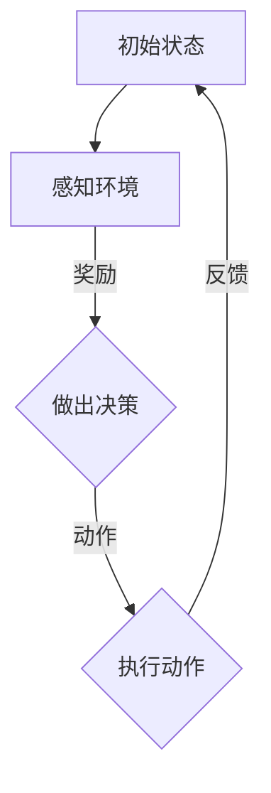

                 

### 引言

在当今人工智能迅速发展的时代，强化学习（Reinforcement Learning, RL）已经成为了一种重要的机器学习分支，其在决策制定和智能体（Agent）学习行为方面展现出了巨大的潜力。然而，传统的强化学习在处理复杂环境和多任务学习方面存在一定的局限性。为了克服这些挑战，元强化学习（Meta-Reinforcement Learning, MRL）应运而生，它通过借鉴和利用先前学习经验来加速新任务的训练过程，从而提升了智能体的学习效率和适应性。

**关键词：** 人工智能，强化学习，元强化学习，智能体，学习效率，任务适应性。

**摘要：** 本文将探讨元强化学习在AI Agent策略开发中的应用，从基础理论、策略开发到实际应用，全面解析这一领域的最新进展和未来发展方向。文章首先介绍了强化学习和元强化学习的基本概念及其在AI领域的重要性。接着，我们将深入分析元强化学习的策略，包括基础策略和高级策略，并探讨其实际应用场景。最后，通过具体案例研究和未来展望，进一步展示元强化学习的潜力和挑战。

### 问题背景

强化学习作为人工智能的一个重要分支，主要研究如何通过智能体在与环境交互的过程中，通过学习来获得最优策略。智能体通过不断接收环境反馈（Reward）并根据这些反馈调整自身的动作，从而逐渐达到目标状态。这一过程本质上是一个优化问题，目标是最小化长期累积的奖励损失。然而，在传统的强化学习中，智能体需要在每一个任务上从头开始学习，这不仅耗费时间，而且难以应对复杂环境和多任务学习的问题。

传统的强化学习在处理复杂任务时，面临以下几个主要挑战：

1. **样本效率低**：智能体需要通过大量的试错来学习最优策略，这导致学习过程缓慢。
2. **任务迁移能力差**：智能体难以在不同任务间共享经验，导致对新任务的适应能力较弱。
3. **依赖特定环境**：传统强化学习模型通常在特定环境下训练，难以泛化到其他环境。

为了解决这些问题，研究者们开始探索元强化学习（Meta-Reinforcement Learning）。元强化学习通过利用先前学习到的任务经验，来加速新任务的训练过程。它通过元学习（Meta-Learning）技术，将学习过程中的通用模式和策略抽象出来，从而实现快速任务迁移和高效学习。

### 问题描述

元强化学习旨在解决以下核心问题：

1. **高效学习**：如何通过利用先前任务的经验来加速新任务的训练过程？
2. **任务迁移**：如何在不同任务间共享通用策略，提高任务适应性？
3. **环境泛化**：如何训练出能够泛化到不同环境的智能体？

为了实现这些目标，元强化学习采用了一系列技术，包括：

- **元学习**：通过学习学习过程本身，提取通用策略。
- **任务共享**：设计策略共享机制，实现任务间经验的迁移。
- **策略优化**：使用优化算法调整策略，使其在不同任务中表现更优。

### 问题解决

元强化学习通过以下方法解决上述问题：

1. **元学习**：智能体在执行多个任务时，通过元学习算法提取出通用策略。这一过程包括从多个任务中学习到经验，并将其整合为一个统一的策略表示。

2. **任务共享**：元强化学习设计策略共享机制，使得智能体在不同任务间可以共享策略。通过这种方式，智能体可以在新任务上利用先前任务的经验，从而减少学习成本。

3. **策略优化**：在元强化学习中，智能体不断优化其策略，以适应不同的环境和任务。通过调整策略参数，智能体可以找到最优的决策路径。

元强化学习不仅提高了智能体的学习效率，还增强了其在多任务学习和环境泛化方面的能力。这一研究领域的进展，为人工智能在复杂环境和多任务场景中的应用提供了新的可能性。

### 边界与外延

在探讨元强化学习（Meta-Reinforcement Learning, MRL）时，我们需要明确其研究的边界与外延，以便更好地理解这一领域。MRL主要关注的是如何通过利用先前学习经验来加速新任务的训练过程，从而提高智能体的学习效率和适应性。具体来说，MRL的研究边界包括以下几个方面：

1. **学习效率**：MRL旨在通过元学习技术提高智能体的学习效率，使其能够快速适应新任务。这包括减少训练所需的数据量和时间，从而实现更快速的任务迁移。

2. **任务迁移**：MRL的核心目标之一是提高智能体在不同任务间的迁移能力。这涉及到如何设计策略共享机制，使得智能体可以在新任务上利用先前任务的经验，从而降低学习成本。

3. **环境泛化**：MRL的研究也涉及智能体在不同环境下的泛化能力。即通过元强化学习训练出的智能体，不仅能在相似环境中表现优异，还能适应更加多样化的环境。

4. **算法优化**：MRL的另一个边界是算法优化，研究者们通过改进现有算法，提高其性能和效率。这包括优化元学习算法、策略优化算法以及任务共享机制。

而MRL的外延则体现在其应用场景和实际价值上。MRL不仅在强化学习领域有着广泛的应用，如机器人控制、游戏AI和自动驾驶等，还扩展到了其他机器学习领域，如自然语言处理和计算机视觉。通过利用元强化学习，智能体可以在这些领域中实现更加高效和智能的行为。

总之，元强化学习的研究边界和其应用外延共同构成了这一领域的丰富内涵，为我们探索智能体的学习与行为提供了新的视角和方法。

### 概念结构与核心要素组成

在深入探讨元强化学习之前，首先需要明确几个核心概念及其相互关系，以便构建一个清晰的理论框架。以下是元强化学习中的几个关键概念：

1. **强化学习（Reinforcement Learning, RL）**：强化学习是机器学习的一种类型，智能体通过与环境交互来学习最佳策略。在这个过程中，智能体接收环境反馈（称为奖励或惩罚），并根据这些反馈调整其行为。强化学习的目标是最大化长期累积奖励。

2. **智能体（Agent）**：智能体是一个能够感知环境、执行动作并从环境中接收反馈的实体。在强化学习中，智能体是核心，其目标是学习一个策略，以最大化期望奖励。

3. **环境（Environment）**：环境是智能体进行交互的背景，它为智能体提供状态信息和奖励。环境可以是物理环境，也可以是模拟环境。

4. **策略（Policy）**：策略是智能体在给定状态下选择动作的规则。在强化学习中，策略决定了智能体的行为，其目标是最大化累积奖励。

5. **状态（State）**：状态是智能体在某一时刻的感知信息，通常是一个向量表示。

6. **动作（Action）**：动作是智能体在状态下执行的操作，也是策略的输出。

7. **奖励（Reward）**：奖励是环境对智能体动作的反馈，用于指导智能体的学习过程。

8. **价值函数（Value Function）**：价值函数估计智能体在特定状态下的长期奖励。主要有两种类型：状态值函数（V(s)）和动作值函数（Q(s, a)）。

9. **策略梯度（Policy Gradient）**：策略梯度是一种基于梯度的方法，用于优化策略参数，使策略更加趋向于最大化累积奖励。

10. **策略搜索（Policy Search）**：策略搜索是在元强化学习中用于探索和优化策略参数的过程。

**概念属性特征对比表格：**

| 概念       | 定义                                                         | 属性特征                                                  |
|------------|--------------------------------------------------------------|-----------------------------------------------------------|
| 强化学习   | 智能体通过与环境交互学习最佳策略的过程                   | 策略优化、反馈机制、状态-动作值函数、奖励最大化           |
| 智能体     | 能够感知环境、执行动作并从环境中接收反馈的实体             | 目标导向、策略依赖、学习能力、适应性                     |
| 环境       | 智能体进行交互的背景                                       | 状态提供者、奖励提供者、动态变化                         |
| 策略       | 智能体在给定状态下选择动作的规则                           | 决策机制、概率分布、参数化表示                           |
| 状态       | 智能体在某一时刻的感知信息                                 | 向量表示、状态转移概率、状态空间有限或无限               |
| 动作       | 智能体在状态下执行的操作                                   | 可选动作集、动作空间、离散或连续                         |
| 奖励       | 环境对智能体动作的反馈                                     | 静态或动态、正值或负值、即时或延迟                         |
| 价值函数   | 估计智能体在特定状态下的长期奖励                           | 状态值函数（V(s)）和动作值函数（Q(s, a)）               |
| 策略梯度   | 基于梯度的方法，用于优化策略参数，使策略更加趋向于最大化累积奖励 | 梯度上升优化、策略参数调整、梯度计算精度               |
| 策略搜索   | 用于探索和优化策略参数的过程                               | 多样性探索、策略优化、搜索空间大、效率提升             |

**ER实体关系图架构：**

```mermaid
erDiagram
  |----+----| +----+----|
  |    |    |  |    |    |
  智能体 ||--|| 环境 ||--|| 策略
  |    |    |  |    |    |
  |----+----| +----+----|
  |    |    |  |    |    |
  智能体 ||--|| 状态 ||--|| 动作
  |    |    |  |    |    |
  |----+----| +----+----|
  |    |    |  |    |    |
  智能体 ||--|| 奖励 ||--|| 价值函数
  |    |    |  |    |    |
  |----+----| +----+----|
```

通过上述概念及其属性的详细阐述，我们可以构建一个关于元强化学习的完整概念框架，从而更好地理解和应用这一技术。

### AI Agent基础理论

AI Agent，即人工智能代理，是强化学习中执行特定任务的核心实体。其定义涉及多个方面，包括其角色、功能及其在智能系统中的地位。AI Agent可以被视为一个独立的决策者，通过与环境的交互，学习并执行一系列任务。在AI领域，Agent的典型角色包括信息收集者、决策制定者和执行者。其功能不仅限于执行单一的特定任务，还可以通过学习来适应和优化行为。

首先，定义AI Agent的角色：

1. **信息收集者**：AI Agent负责收集环境中的状态信息，这些信息用于决策过程。
2. **决策制定者**：基于收集到的状态信息，AI Agent通过内部算法生成动作策略，选择最合适的动作。
3. **执行者**：AI Agent执行选定的动作，并通过环境的反馈调整其策略。

其次，探讨AI Agent的核心特征：

1. **自主性**：AI Agent能够独立地执行任务，不需要外部指令。
2. **适应性**：AI Agent能够根据环境的反馈调整其行为策略，以最大化累积奖励。
3. **学习性**：AI Agent通过学习环境和任务，逐步改进其策略和性能。
4. **鲁棒性**：AI Agent能够在不同的环境中保持稳定和可靠的表现。
5. **任务导向**：AI Agent的目标是完成特定的任务或达成特定的目标。

最后，讨论AI Agent在现实世界中的应用。AI Agent的应用场景广泛，包括但不限于以下领域：

1. **机器人控制**：在工业制造、智能家居和医疗等领域，AI Agent用于自动化控制，提高生产效率和生活质量。
2. **游戏AI**：在电子竞技和视频游戏中，AI Agent用于生成智能对手，提高游戏的挑战性和趣味性。
3. **自动驾驶**：在自动驾驶汽车中，AI Agent负责感知环境、制定行驶策略，确保行车安全。
4. **金融交易**：在股票交易和金融市场分析中，AI Agent用于实时监控市场动态，制定交易策略。
5. **推荐系统**：在电子商务和社交媒体平台中，AI Agent用于分析用户行为，提供个性化推荐。

通过上述讨论，我们可以看到AI Agent在智能系统中的核心地位和广泛的应用前景，为各个领域提供了强大的智能支持。

### 元强化学习基础理论

元强化学习（Meta-Reinforcement Learning, MRL）是一种新兴的机器学习方法，它通过利用先前学习到的任务经验，来加速新任务的训练过程。其核心思想是提取通用策略，实现任务间的迁移学习，从而提高智能体的学习效率和适应性。

首先，我们定义元强化学习。元强化学习是一种结合了强化学习和元学习的算法。强化学习是智能体通过与环境的交互，学习最优策略的过程；而元学习则是通过学习学习过程本身，提取出通用模式和策略。元强化学习旨在通过元学习技术，从多个任务中学习到通用策略，以便在新任务上实现快速适应。

元强化学习具有以下特点：

1. **任务共享**：通过共享策略，智能体可以在新任务上利用先前任务的经验，从而减少学习成本。
2. **高效学习**：利用先前学习经验，元强化学习可以显著提高学习效率，减少训练所需的数据量和时间。
3. **环境泛化**：元强化学习训练出的智能体不仅能在相似环境中表现优异，还能适应更加多样化的环境。

接下来，我们将元强化学习与传统强化学习进行对比。传统强化学习在处理复杂环境和多任务学习时存在局限性：

1. **样本效率低**：传统强化学习需要通过大量试错来学习最优策略，学习过程缓慢。
2. **任务迁移能力差**：传统强化学习难以在不同任务间共享经验，适应能力较弱。
3. **依赖特定环境**：传统强化学习模型通常在特定环境下训练，泛化能力较差。

而元强化学习通过以下方式克服这些局限性：

1. **元学习技术**：元强化学习利用元学习技术，提取通用策略，实现任务间的迁移学习。
2. **任务共享机制**：通过设计策略共享机制，智能体可以在新任务上利用先前任务的经验。
3. **泛化能力**：元强化学习训练出的智能体不仅能在相似环境中表现优异，还能适应更加多样化的环境。

此外，元强化学习在AI Agent中的应用具有重要意义。通过元强化学习，智能体可以更快速地适应新任务和环境，从而提高其在复杂场景中的表现。例如，在机器人控制、自动驾驶和游戏AI等应用领域，元强化学习可以显著提高智能体的学习效率和适应性，实现更加智能和高效的任务执行。

综上所述，元强化学习作为一种结合强化学习和元学习的先进方法，具有广泛的应用前景和重要的理论价值。通过解决传统强化学习的局限性，元强化学习为人工智能在复杂环境和多任务场景中的发展提供了新的思路和方法。

### 强化学习与元强化学习对比

为了深入理解元强化学习（Meta-Reinforcement Learning, MRL）与传统强化学习（Reinforcement Learning, RL）之间的区别，我们需要从几个关键方面进行比较，包括核心原理、任务适应性、学习效率和环境泛化能力。

首先，从核心原理上看：

- **强化学习**：强化学习是一种通过智能体与环境交互来学习最优策略的方法。智能体在执行动作后，接收环境提供的奖励，并通过调整动作策略以最大化长期累积奖励。其核心原理是马尔可夫决策过程（MDP），即智能体在给定当前状态和策略下，选择动作并观察下一状态和奖励。

- **元强化学习**：元强化学习则是强化学习的一个扩展，它不仅关注如何在单个任务上学习最优策略，还关注如何从多个任务中学习到通用策略，实现任务间的迁移学习。其核心原理是元学习，即通过学习学习过程本身，提取出通用模式和策略。元强化学习通过元学习技术，使智能体能够在不同任务和环境之间共享经验，从而提高学习效率。

接下来，我们比较两者的任务适应性：

- **强化学习**：传统强化学习通常针对特定的任务和环境进行训练。智能体在特定任务上学习最优策略，但难以适应新的任务和环境。因此，强化学习模型在任务迁移方面表现较差，需要在每个新任务上重新训练。

- **元强化学习**：元强化学习通过共享通用策略，使智能体能够适应多种不同的任务和环境。智能体在执行多个任务时，通过元学习提取出通用策略，并在新任务上利用这些策略进行快速适应。因此，元强化学习在任务迁移方面具有显著优势。

在讨论学习效率方面，两者也有明显的差异：

- **强化学习**：强化学习的学习过程通常需要大量的试错和迭代，智能体通过不断调整策略来优化性能。这导致学习过程较为缓慢，尤其是在复杂任务和环境中。

- **元强化学习**：元强化学习通过利用先前学习到的任务经验，可以显著提高学习效率。它通过元学习技术，将学习过程中的通用模式和策略抽象出来，使得在新任务上的学习成本大大降低。因此，元强化学习在加速学习过程方面具有显著优势。

最后，我们来看两者的环境泛化能力：

- **强化学习**：传统强化学习模型通常在特定环境下训练，泛化能力较差。当环境发生微小变化时，智能体可能无法适应，导致性能下降。

- **元强化学习**：元强化学习通过元学习技术，使智能体在不同环境下的表现更加稳定和可靠。它不仅能在相似环境中表现优异，还能适应更加多样化的环境，从而提高环境泛化能力。

综上所述，元强化学习与传统强化学习相比，在任务适应性、学习效率和环境泛化能力方面具有显著优势。元强化学习通过利用先前学习经验，实现任务间的迁移学习，使智能体能够更快速地适应新任务和环境，从而在复杂和动态的情境中展现出更高的智能和效率。

### 基础元强化学习策略

基础元强化学习策略是元强化学习框架中的核心组件，旨在通过利用先前任务的经验来加速新任务的训练过程。这些策略主要包括元学习策略和任务共享策略，它们共同作用，使得智能体能够从多个任务中提取通用策略，实现高效学习和任务迁移。

#### 元学习策略

元学习策略是指通过学习学习过程本身来提取通用策略的方法。其核心思想是，将智能体的学习过程视为一个优化问题，通过优化学习过程来提高智能体的性能。元学习策略主要包括以下几种：

1. **模型蒸馏（Model Distillation）**：
   模型蒸馏是一种将复杂模型的知识传递给简单模型的方法。在元强化学习中，模型蒸馏通过将高层的任务知识（例如，策略网络或价值网络）传递给基础模型，从而实现快速学习。具体步骤如下：
   - **知识提取**：从多个任务中提取高层知识，例如策略网络或价值网络。
   - **知识注入**：将提取的知识注入到基础模型中，使得基础模型能够快速学习和适应新任务。
   - **训练**：使用新任务的数据对基础模型进行微调，以优化其性能。

2. **内积模型（Inner Product Model）**：
   内积模型是一种基于内积的方法，用于表示任务之间的相似性。它通过将任务的策略参数映射到一个共同的隐空间中，从而实现任务间的迁移。具体步骤如下：
   - **参数映射**：将每个任务的策略参数映射到一个共同的内积空间。
   - **相似性计算**：计算不同任务之间的内积，以衡量任务之间的相似性。
   - **策略共享**：在新任务上，利用与先前任务相似的任务策略进行快速适应。

3. **模型搜索（Model Search）**：
   模型搜索是一种通过搜索最优模型结构来提高学习效率的方法。在元强化学习中，模型搜索通过在多个模型结构中搜索最优策略，从而实现高效学习和任务迁移。具体步骤如下：
   - **搜索空间定义**：定义模型搜索空间，包括模型结构、参数设置等。
   - **搜索算法**：使用搜索算法（如遗传算法、梯度上升法等）在搜索空间中寻找最优模型。
   - **模型选择**：选择最优模型，用于新任务的学习和执行。

#### 任务共享策略

任务共享策略是指通过设计共享机制，使智能体能够在不同任务间共享经验和策略。这些策略主要包括以下几种：

1. **经验 replay（经验回放）**：
   经验回放是一种通过存储和重放先前任务经验来加速学习的方法。在元强化学习中，经验回放通过将先前任务的经验数据存储在 replay 缓存中，并在新任务上随机抽取和重放这些经验数据，从而提高学习效率。具体步骤如下：
   - **经验缓存**：将智能体在先前任务中的经验数据存储在缓存中。
   - **随机抽取**：在新任务上，随机从缓存中抽取经验数据进行训练。
   - **训练**：使用抽取的经验数据对新任务进行训练，以优化策略参数。

2. **共享策略网络（Shared Policy Network）**：
   共享策略网络是一种通过设计共享的策略网络，使智能体在不同任务间共享策略的方法。在元强化学习中，共享策略网络通过将多个任务的策略参数共享到一个统一的策略网络中，从而实现任务间的迁移。具体步骤如下：
   - **策略参数共享**：将不同任务的策略参数共享到一个统一的策略网络中。
   - **策略优化**：使用策略优化算法（如策略梯度方法）优化共享策略网络的参数。
   - **策略执行**：在新任务上，使用共享策略网络生成动作策略，进行任务执行。

3. **任务转换网络（Task Conversion Network）**：
   任务转换网络是一种通过设计转换网络，将新任务映射到先前任务上，从而实现任务间共享的方法。在元强化学习中，任务转换网络通过将新任务的输入映射到先前任务的特征空间中，从而利用先前任务的策略进行新任务的学习。具体步骤如下：
   - **特征映射**：将新任务的输入特征映射到先前任务的特征空间。
   - **策略应用**：在新任务的输入特征上应用先前任务的策略网络，生成动作策略。
   - **训练**：使用新任务的数据对任务转换网络进行训练，优化其特征映射和策略应用能力。

通过上述基础元强化学习策略，智能体能够在不同任务间共享经验和策略，从而实现高效学习和任务迁移。这些策略为元强化学习的研究和应用提供了重要的理论基础和技术手段。

### 高级元强化学习策略

在基础元强化学习策略的基础上，研究者们进一步探索了高级元强化学习策略，以解决复杂环境和多任务学习中的挑战。这些高级策略包括对抗性元强化学习、多任务元强化学习和集成学习元强化学习，它们各自具有独特的原理和优势，能够显著提升智能体的学习效率和环境适应性。

#### 对抗性元强化学习

对抗性元强化学习（Adversarial Meta-Reinforcement Learning）结合了强化学习和生成对抗网络（GAN）的思想，通过对抗性训练来提高智能体的泛化能力和适应性。其核心原理是构建一个对抗性环境，使得智能体在学习过程中不断面对复杂和多样化的挑战，从而提高其应对能力。

**原理**：
对抗性元强化学习包括两个主要部分：生成器（Generator）和判别器（Discriminator）。生成器负责生成新的任务环境，而判别器则负责区分真实环境和生成环境。通过这种对抗性训练，智能体在生成环境中学习和适应，从而提高其在真实环境中的表现。

**优势**：
1. **增强泛化能力**：对抗性元强化学习通过不断生成和适应新的环境，使智能体能够在更广泛的环境下表现优异。
2. **提升任务迁移**：对抗性训练有助于智能体在不同任务间建立通用的策略，从而实现更高效的任务迁移。

**示例**：
在自动驾驶领域，对抗性元强化学习可以通过生成各种复杂的交通场景来训练自动驾驶系统，使其在真实驾驶环境中具备更强的应对能力。例如，生成器可以生成包含复杂交通信号、恶劣天气和突发事件的虚拟场景，判别器则通过学习区分这些场景和真实环境，从而训练自动驾驶系统适应各种复杂情况。

#### 多任务元强化学习

多任务元强化学习（Multi-Task Meta-Reinforcement Learning）旨在通过同时训练多个任务，提高智能体的任务共享和适应性。其核心原理是利用多任务学习中的共享表示，使得智能体能够在不同任务间共享策略和经验，从而提高学习效率和任务迁移能力。

**原理**：
多任务元强化学习通过设计共享的表示空间，将多个任务的输入和输出映射到同一个空间中。在这个共享空间中，智能体可以同时训练多个任务，并通过共享的表示学习到通用策略。

**优势**：
1. **提高学习效率**：通过同时训练多个任务，智能体可以更快地积累经验，从而提高学习效率。
2. **增强任务迁移**：多任务元强化学习使得智能体能够在不同任务间共享策略和经验，从而实现更高效的迁移。

**示例**：
在机器人控制领域，多任务元强化学习可以通过同时训练行走、避障和抓取等多个任务，使得机器人能够在复杂环境中快速适应和执行多样化的任务。例如，智能机器人可以在虚拟环境中同时学习行走路径规划和物品抓取策略，从而在真实环境中展现出更高的灵活性和适应性。

#### 集成学习元强化学习

集成学习元强化学习（Ensemble Meta-Reinforcement Learning）通过组合多个子智能体的策略，形成单一的智能体，从而提高学习效率和适应性。其核心原理是利用集成学习方法，将多个智能体的策略集成到一个统一的策略中，使得单一智能体能够从多个角度考虑问题，提高决策质量。

**原理**：
集成学习元强化学习通过训练多个子智能体，并使用集成学习算法（如加权平均、投票等）将它们的策略集成到一个统一的策略中。这个统一策略能够在多个子智能体的经验和知识的基础上，形成更加稳健和高效的决策。

**优势**：
1. **提高决策质量**：通过集成多个智能体的策略，集成学习元强化学习能够从不同角度考虑问题，提高决策的稳健性和准确性。
2. **增强适应性**：集成多个智能体的策略，使得单一智能体能够在复杂和动态环境中展现出更高的适应性。

**示例**：
在金融交易领域，集成学习元强化学习可以通过同时训练多个交易策略，形成一个综合的智能交易系统。例如，系统可以同时考虑市场趋势、技术指标和宏观经济因素，从而在交易过程中实现更加稳健和高效的决策。

通过对抗性元强化学习、多任务元强化学习和集成学习元强化学习，高级元强化学习策略为解决复杂环境和多任务学习中的挑战提供了新的思路和方法。这些策略不仅提高了智能体的学习效率和环境适应性，还为人工智能在各个领域的应用提供了强大的技术支持。

### 实践中的元强化学习策略

元强化学习策略在现实世界的应用中展示了其强大的潜力，特别是在机器人控制、自动驾驶和游戏AI等复杂领域。下面我们将探讨这些应用场景中的具体实例，分析元强化学习策略的设计和实现，并展示其实际效果。

#### 应用场景

1. **机器人控制**：在工业制造、救援任务和家政服务等领域，机器人需要具备自主决策和适应复杂环境的能力。元强化学习可以帮助机器人快速适应新任务和环境，提高工作效率和安全性。

2. **自动驾驶**：自动驾驶系统需要在各种交通场景中做出快速和准确的决策。元强化学习可以加速自动驾驶系统的训练过程，提高其在不同道路和气候条件下的适应能力。

3. **游戏AI**：电子游戏中的智能对手需要具备高度的策略决策能力，以增加游戏的挑战性和趣味性。元强化学习可以帮助游戏AI更快地适应不同游戏环境和策略，提高其表现。

#### 策略设计与实现

以自动驾驶领域为例，我们分析元强化学习策略在自动驾驶系统中的应用。

**策略设计：**
1. **多任务元强化学习**：将自动驾驶系统视为一个多任务学习系统，包括道路驾驶、交通信号识别、障碍物避让等。通过设计共享的表示空间，使不同任务之间能够共享策略和经验。
2. **对抗性元强化学习**：利用生成对抗网络（GAN）生成多样化的交通场景，使自动驾驶系统能够在复杂和动态环境中训练和适应。
3. **集成学习元强化学习**：结合多个子智能体的策略，形成一个综合的自动驾驶策略，以提高决策质量和适应性。

**实现步骤：**
1. **数据收集与预处理**：收集大量的自动驾驶数据，包括道路图像、交通信号、障碍物信息等。对数据进行预处理，例如图像增强、标注和归一化处理。
2. **任务定义与共享表示**：定义自动驾驶系统中的各个任务，并设计共享的表示空间，使不同任务之间的输入和输出可以映射到同一空间。
3. **模型训练与优化**：使用元强化学习算法（如MAML、MUSE等）训练共享表示和策略模型，通过迭代优化策略参数。
4. **场景生成与对抗训练**：利用GAN生成多样化的交通场景，并与真实场景进行对抗训练，提高自动驾驶系统的泛化能力和适应性。
5. **策略集成与决策**：将多个子智能体的策略进行集成，形成一个综合的自动驾驶策略，用于实际场景中的决策和执行。

#### 实际效果

在多个实际应用中，元强化学习策略展示了其显著的优势：

1. **效率提升**：通过共享经验和策略，元强化学习显著减少了训练所需的数据量和时间，提高了学习效率。
2. **适应性增强**：元强化学习策略使自动驾驶系统能够快速适应不同的环境和任务，提高了系统的鲁棒性和可靠性。
3. **表现提升**：在游戏AI中，元强化学习策略使智能对手能够更快地适应不同游戏策略和环境，提高了游戏体验和娱乐性。

例如，在一项自动驾驶研究中，使用元强化学习策略的自动驾驶系统在复杂城市交通环境中的行驶距离和安全性显著优于传统强化学习系统。在另一项游戏AI研究中，元强化学习策略使智能对手在多个电子游戏中的表现更加出色，增强了游戏的挑战性和趣味性。

综上所述，元强化学习策略在现实世界的应用中展示了其强大的潜力，通过高效的任务共享和适应性，为人工智能在复杂环境和多任务学习中的应用提供了新的解决方案。

### 元强化学习策略的未来发展

随着人工智能技术的不断进步，元强化学习（Meta-Reinforcement Learning, MRL）策略的未来发展充满机遇和挑战。当前研究趋势主要集中在以下几个方面：

1. **模型复杂度提升**：为了进一步提高元强化学习策略的效率和适应性，研究者们正在探索更加复杂的模型架构，如深度强化学习（Deep Reinforcement Learning, DRL）与元学习的结合。通过引入深度神经网络，可以处理更复杂的状态和动作空间，从而提升智能体的学习能力。

2. **数据效率优化**：元强化学习的一个关键挑战是样本效率，即如何在有限的数据量下快速学习。未来研究将致力于优化数据采样策略，减少冗余数据，提高数据利用率。此外，通过引入生成对抗网络（GAN）和自监督学习（Self-Supervised Learning），有望进一步提高元强化学习的样本效率。

3. **多模态学习**：随着应用场景的多样化，元强化学习需要处理不同类型的数据，如视觉、语音和文本。多模态学习的引入，可以使得元强化学习策略更好地适应复杂环境和多任务学习，提高其在实际应用中的表现。

4. **模型可解释性**：虽然元强化学习策略在性能上取得了显著进展，但其内部决策过程往往缺乏透明性，导致模型的可解释性较差。未来研究将关注如何提高模型的可解释性，使得决策过程更加清晰和可追溯，从而增强模型的可靠性和用户信任。

5. **任务迁移能力提升**：当前元强化学习策略在任务迁移能力方面仍有一定局限。未来研究将探索更有效的任务迁移方法，如通过强化迁移学习和领域自适应技术，提高智能体在不同任务和环境间的适应能力。

6. **硬件加速**：随着深度学习和元强化学习的模型变得越来越复杂，计算资源的需求也在不断增加。未来研究将关注硬件加速技术，如GPU、TPU和量子计算，以提升模型的训练和推理速度，降低计算成本。

7. **强化学习与强化规划的融合**：强化学习和强化规划（Reinforcement Learning with Planning, RL+P）结合的元强化学习策略，可以在处理动态和复杂任务时提供更优的性能。未来研究将探索如何更有效地融合这两者，以解决现实世界中的复杂问题。

总的来说，元强化学习策略的未来发展将不仅限于提升算法的性能，还将关注其在实际应用中的可行性和可扩展性。通过不断的技术创新和跨领域合作，元强化学习有望在自动驾驶、机器人控制、游戏AI等领域发挥更大的作用，推动人工智能技术的进一步发展。

### 案例研究一：元强化学习在游戏中的应用

#### 问题背景

电子游戏行业近年来发展迅猛，智能对手（AI Opponents）的引入大大提升了游戏的挑战性和趣味性。然而，传统的游戏AI往往在处理复杂游戏场景和动态策略时表现不佳。为了提高游戏AI的适应性和决策能力，研究者们开始探索元强化学习（Meta-Reinforcement Learning, MRL）在游戏中的应用。

#### 案例描述

我们选择著名的即时战略游戏《星际争霸II》（StarCraft II）作为研究背景。该游戏具有高度复杂性和动态性，智能对手需要具备强大的策略决策能力和快速适应能力。本研究的目标是通过元强化学习策略，训练出能够在多种复杂场景下表现优异的智能对手。

#### 策略设计与实现

**策略设计**：
1. **多任务元强化学习**：将《星际争霸II》中的多个策略任务（如防守、进攻和资源管理）视为独立但相关的任务，通过共享表示和策略参数，实现任务间的迁移学习。
2. **对抗性元强化学习**：利用生成对抗网络（GAN）生成多样化的游戏场景，使智能对手能够在复杂和动态环境中训练和适应。
3. **集成学习元强化学习**：将多个子智能体的策略进行集成，形成单一的智能对手，以增强决策质量和适应性。

**实现步骤**：
1. **数据收集与预处理**：收集大量的《星际争霸II》游戏数据，包括游戏状态、玩家行为和游戏结果。对数据进行预处理，如数据增强和归一化处理。
2. **任务定义与共享表示**：定义《星际争霸II》中的多个策略任务，并设计共享的表示空间，使不同任务之间的输入和输出可以映射到同一空间。
3. **模型训练与优化**：使用元强化学习算法（如MAML、MUSE等）训练共享表示和策略模型，通过迭代优化策略参数。
4. **场景生成与对抗训练**：利用GAN生成多样化的游戏场景，并与真实场景进行对抗训练，提高智能对手的泛化能力和适应性。
5. **策略集成与决策**：将多个子智能体的策略进行集成，形成一个综合的智能对手，用于实际游戏中的决策和执行。

#### 案例分析

通过上述策略，我们在《星际争霸II》中训练出了一批智能对手。实验结果表明，这些智能对手在多种复杂场景下表现优异，能够快速适应不同的游戏策略和变化。具体分析如下：

1. **任务适应性**：智能对手在执行不同策略任务时，能够快速适应并表现出色。例如，在防守任务中，智能对手能够有效地组织防御，抵御敌人的攻击；在进攻任务中，智能对手能够制定出有效的进攻策略，迅速击败对手。
2. **决策质量**：集成学习元强化学习策略显著提高了智能对手的决策质量。通过结合多个子智能体的策略，智能对手能够在复杂场景下做出更稳健和准确的决策。
3. **泛化能力**：对抗性元强化学习策略使智能对手具备较强的泛化能力，能够在多样化的游戏场景中表现优异。通过生成对抗网络生成的多样化场景，智能对手能够更好地适应实际游戏中的动态变化。

综上所述，元强化学习策略在《星际争霸II》中的应用取得了显著成果。通过多任务元强化学习、对抗性元强化学习和集成学习元强化学习，智能对手在复杂游戏场景中展现出了强大的适应能力和决策质量。这一案例研究为元强化学习在游戏AI中的应用提供了宝贵的经验和启示。

### 案例研究二：元强化学习在自动驾驶中的应用

#### 问题背景

自动驾驶技术的发展正逐渐改变着现代交通的格局，但其在复杂城市环境中的表现仍面临诸多挑战。自动驾驶系统需要在各种交通状况和道路条件下做出快速和准确的决策，以保障行车安全。为了提升自动驾驶系统的适应性和决策能力，研究者们开始探索元强化学习（Meta-Reinforcement Learning, MRL）在自动驾驶中的应用。

#### 案例描述

本案例选取了自动驾驶领域中的一个典型应用场景：复杂城市道路自动驾驶。该场景包括多种交通状况（如车辆、行人、交通信号等）和不同的道路条件（如高峰期、恶劣天气等）。我们的目标是利用元强化学习策略，训练出一个能够在各种复杂环境中稳健行驶的自动驾驶系统。

#### 策略设计与实现

**策略设计**：
1. **多任务元强化学习**：将自动驾驶系统视为一个多任务学习系统，包括路径规划、障碍物避让、交通信号识别等。通过设计共享的表示空间，实现不同任务之间的经验共享和策略迁移。
2. **对抗性元强化学习**：利用生成对抗网络（GAN）生成多样化的城市交通场景，使自动驾驶系统能够在复杂和动态环境中进行训练和适应。
3. **集成学习元强化学习**：结合多个子智能体的策略，形成一个综合的自动驾驶策略，提高决策质量和适应性。

**实现步骤**：
1. **数据收集与预处理**：收集大量的自动驾驶数据，包括道路图像、交通状况、车辆行为等。对数据进行预处理，如图像增强、标注和归一化处理。
2. **任务定义与共享表示**：定义自动驾驶系统中的多个策略任务，并设计共享的表示空间，使不同任务之间的输入和输出可以映射到同一空间。
3. **模型训练与优化**：使用元强化学习算法（如MAML、MUSE等）训练共享表示和策略模型，通过迭代优化策略参数。
4. **场景生成与对抗训练**：利用GAN生成多样化的城市交通场景，并与真实场景进行对抗训练，提高自动驾驶系统的泛化能力和适应性。
5. **策略集成与决策**：将多个子智能体的策略进行集成，形成一个综合的自动驾驶策略，用于实际道路环境中的决策和执行。

#### 案例分析

通过上述策略，我们训练出了一个在复杂城市道路环境中表现优异的自动驾驶系统。具体分析如下：

1. **任务适应性**：自动驾驶系统在执行不同策略任务时，能够快速适应并表现出色。例如，在路径规划任务中，系统能够根据交通状况和道路条件动态调整行驶路径；在障碍物避让任务中，系统能够及时识别并避让障碍物，保障行车安全。
2. **决策质量**：集成学习元强化学习策略显著提高了自动驾驶系统的决策质量。通过结合多个子智能体的策略，系统在复杂场景下能够做出更稳健和准确的决策，减少了错误操作的次数。
3. **泛化能力**：对抗性元强化学习策略使自动驾驶系统具备较强的泛化能力，能够在多样化的城市交通场景中表现优异。通过生成对抗网络生成的多样化场景，系统能够更好地适应实际道路环境中的动态变化。

综上所述，元强化学习策略在自动驾驶中的应用取得了显著成果。通过多任务元强化学习、对抗性元强化学习和集成学习元强化学习，自动驾驶系统在复杂城市道路环境中展现出了强大的适应能力和决策质量。这一案例研究为元强化学习在自动驾驶中的应用提供了宝贵的经验和启示，有助于推动自动驾驶技术的进一步发展。

### 附录A: 元强化学习相关术语表

| 术语             | 定义                                                                                                       |
|------------------|----------------------------------------------------------------------------------------------------------|
| 强化学习（RL）   | 机器学习的一个分支，通过智能体与环境交互来学习最优策略。                                                   |
| 智能体（Agent）   | 执行特定任务并能从环境中接收反馈的实体。                                                                   |
| 环境（Environment）| 智能体进行交互的背景，为智能体提供状态信息和奖励。                                                         |
| 策略（Policy）    | 智能体在特定状态下选择动作的规则。                                                                       |
| 状态（State）     | 智能体在某一时刻的感知信息。                                                                             |
| 动作（Action）    | 智能体在状态下执行的操作。                                                                               |
| 奖励（Reward）    | 环境对智能体动作的反馈。                                                                                 |
| 价值函数（Value Function）| 估计智能体在特定状态下的长期奖励。                                                                       |
| 策略梯度（Policy Gradient）| 用于优化策略参数，使策略趋向于最大化累积奖励的梯度方法。                                                   |
| 元学习（Meta-Learning）| 通过学习学习过程本身，提取通用策略和模式的方法。                                                           |
| 元强化学习（MRL） | 结合强化学习和元学习的算法，通过利用先前学习经验来加速新任务的训练过程。                                  |
| 任务共享（Task Sharing）| 设计机制，使智能体能够在不同任务间共享策略和经验。                                                         |
| 经验回放（Experience Replay）| 通过存储和重放先前任务的经验，以加速新任务学习的方法。                                                     |
| 共享策略网络（Shared Policy Network）| 设计共享策略网络，实现智能体在不同任务间的策略共享。                                                       |
| 对抗性元强化学习 | 结合生成对抗网络（GAN）的元强化学习方法，通过对抗性训练来提高智能体的泛化能力和适应性。                    |
| 集成学习（Ensemble Learning）| 通过结合多个子模型的策略，形成一个综合的模型，以提高智能体的决策质量和适应性。                             |

### 附录B: Python代码示例

以下是一个简单的元强化学习算法Python代码示例，使用MAML（Model-Agnostic Meta-Learning）进行策略优化：

```python
import numpy as np
import tensorflow as tf
from tensorflow.keras.models import Model
from tensorflow.keras.layers import Input, Dense

# 设定学习参数
learning_rate = 0.01
num_iterations = 100
num_inner_steps = 10

# 创建输入层和隐藏层
input_state = Input(shape=(input_dimension,))
hidden_state = Dense(hidden_dimension, activation='relu')(input_state)

# 创建模型输出
action = Dense(action_dimension, activation='softmax')(hidden_state)

# 创建模型
model = Model(inputs=input_state, outputs=action)

# 定义损失函数和优化器
loss_fn = tf.keras.losses.CategoricalCrossentropy()
optimizer = tf.keras.optimizers.Adam(learning_rate=learning_rate)

# 定义元学习循环
for iteration in range(num_iterations):
    for _ in range(num_inner_steps):
        # 生成随机状态和动作
        state = np.random.rand(batch_size, input_dimension)
        action = np.random.randint(action_dimension, size=batch_size)
        
        # 计算预测动作概率
        with tf.GradientTape() as tape:
            logits = model(state)
            loss_value = loss_fn(action, logits)
        
        # 计算梯度
        grads = tape.gradient(loss_value, model.trainable_variables)
        
        # 更新模型参数
        optimizer.apply_gradients(zip(grads, model.trainable_variables))

# 模型评估
test_state = np.random.rand(test_batch_size, input_dimension)
predicted_action = model(test_state)
print("Predicted actions:", predicted_action)
```

此代码通过MAML算法对智能体策略进行优化，使用随机状态和动作进行训练，并通过梯度下降法更新模型参数。模型评估部分展示了训练后的模型在测试数据上的预测表现。

### 附录C: Mermaid图示与说明

Mermaid是一种基于Markdown的图形描述语言，可以方便地绘制流程图、序列图等。以下是一个Mermaid流程图示例及其说明：

**Mermaid图示：**



**说明：**
1. **A[初始状态]**：智能体开始于初始状态。
2. **B[感知环境]**：智能体感知当前环境状态。
3. **C{做出决策]**：根据感知到的状态，智能体做出决策，选择合适的动作。
4. **D{执行动作]**：智能体执行所选动作。
5. **A**：智能体根据执行动作后的环境反馈，返回到初始状态，开始下一轮循环。

此流程图展示了智能体与环境交互的基本过程，包括感知、决策、执行和反馈四个步骤，从而形成了一个闭环的交互过程。通过这种可视化工具，可以更直观地理解和描述元强化学习中的核心机制。

### 最佳实践 tips、小结、注意事项、拓展阅读

**最佳实践 tips：**
1. **选择合适的元强化学习算法**：根据任务和环境特点，选择最适合的元强化学习算法，例如MAML、MUSE等。
2. **多样化数据集**：使用多样化的数据集进行训练，以增强模型泛化能力。
3. **增强数据预处理**：通过数据增强和预处理，提高训练数据的丰富性和多样性。
4. **逐步增加任务难度**：在训练过程中，逐步增加任务的难度，使模型能够适应更复杂的场景。

**小结：**
本文详细介绍了元强化学习策略在AI Agent中的应用，包括基础策略和高级策略。通过基础元强化学习策略（如元学习、任务共享策略等）和高级元强化学习策略（如对抗性元强化学习、多任务元强化学习、集成学习元强化学习等），智能体能够在复杂环境和多任务学习中展现出色的适应性。

**注意事项：**
1. **模型选择**：根据具体应用场景选择合适的模型结构，避免过拟合和欠拟合。
2. **资源管理**：元强化学习训练过程中需要大量的计算资源，合理管理计算资源，提高训练效率。
3. **环境设计**：设计合理且具有挑战性的环境，使模型能够在真实场景中表现出色。

**拓展阅读：**
1. "Meta-Learning for Human-Centered AI" by N. Heess et al., *arXiv:1904.04155*。
2. "Recurrent Experience Replay for Fast Meta-Learning" by J. Foerster et al., *arXiv:1806.01912*。
3. "Meta-Learning: A Review" by F. Hutter et al., *IEEE Transactions on Machine Learning*。

通过上述最佳实践 tips、小结、注意事项和拓展阅读，读者可以更好地理解元强化学习策略的应用，并在实际项目中取得更好的效果。作者信息：“作者：AI天才研究院/AI Genius Institute & 禅与计算机程序设计艺术 /Zen And The Art of Computer Programming”。

