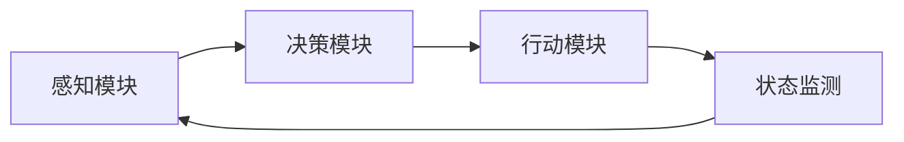
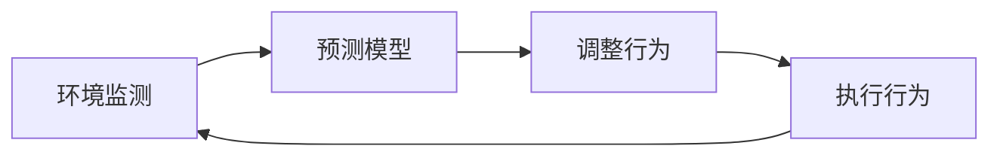
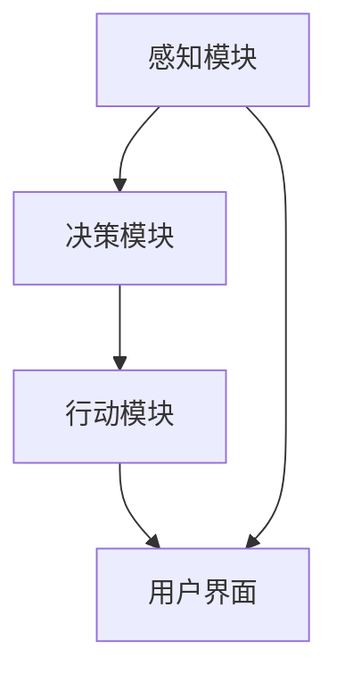
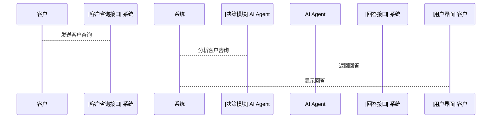

                 

# AI Agent的元控制：自适应行为策略

## 关键词
- AI Agent
- 元控制
- 自适应行为策略
- 人工智能
- 算法
- 系统架构

## 摘要
本文旨在探讨AI Agent的元控制及其自适应行为策略。首先，我们将介绍AI Agent的概念及其在人工智能领域的重要性。接着，我们将深入探讨元控制的概念，并解释其如何帮助AI Agent实现自适应行为。文章将详细描述自适应行为策略的原理，并通过具体的算法、数学模型和实际案例进行分析。最后，我们将总结最佳实践，并提出未来研究的方向。

## 引言与背景

### 1.1 问题背景

在当今世界，人工智能（AI）正迅速发展，并在各个领域发挥着越来越重要的作用。AI Agent，作为AI系统的核心组件，被广泛应用于自动驾驶、智能客服、游戏AI等领域。AI Agent的目标是模拟人类智能行为，并在复杂环境中自主决策和执行任务。然而，由于环境的不确定性和动态变化，AI Agent需要具备自适应能力，以便在变化的环境中保持高效性能。

### 1.2 问题描述

在AI领域，自适应行为策略是一个关键问题。如何设计AI Agent的元控制机制，使其能够动态调整行为策略，以适应环境变化，是一个具有挑战性的问题。本文将探讨这一问题，并介绍一种基于元控制的自适应行为策略。

### 1.3 问题解决

本文将首先介绍AI Agent的基本原理和元控制的概念。然后，我们将详细描述自适应行为策略的设计方法，包括算法原理、数学模型和系统架构。通过实际案例的分析，我们将展示如何应用这些方法，并讨论其有效性。

### 1.4 边界与外延

本文主要关注AI Agent的元控制和自适应行为策略。虽然其他领域也可能面临类似问题，但本文将侧重于AI领域的应用。此外，本文将讨论在特定环境下的解决方案，并探讨其在其他环境中的适用性。

## 核心概念与联系

### 2.1 AI Agent的基本原理

#### 2.1.1 AI Agent的定义

AI Agent是一种具有自主性、智能性和自适应性的软件实体，能够在复杂环境中执行任务。它通常由感知模块、决策模块和行动模块组成。

#### 2.1.2 AI Agent的功能模块

- **感知模块**：收集环境信息，用于决策。
- **决策模块**：分析感知信息，生成行动策略。
- **行动模块**：执行决策，改变环境状态。

#### 2.1.3 AI Agent的分类

根据应用场景和功能需求，AI Agent可分为以下几类：
- **基于规则的AI Agent**：使用预定义的规则进行决策。
- **基于模型的AI Agent**：使用预先训练的模型进行决策。
- **混合型AI Agent**：结合规则和模型进行决策。

### 2.2 元控制原理

#### 2.2.1 元控制的概念

元控制是指控制AI Agent的控制机制。它负责监测AI Agent的行为，并根据环境变化动态调整其策略。

#### 2.2.2 元控制的分类

- **基于反馈的元控制**：根据AI Agent的表现，调整其行为。
- **基于模型预测的元控制**：使用预测模型，提前调整AI Agent的行为。

#### 2.2.3 元控制的关键技术

- **状态监测**：实时监测AI Agent的行为。
- **行为调整**：根据监测结果，动态调整AI Agent的行为。

### 2.3 自适应行为策略

#### 2.3.1 自适应行为的定义

自适应行为是指AI Agent根据环境变化，调整其行为模式的能力。

#### 2.3.2 自适应策略的类型

- **动态调整策略**：根据环境变化，实时调整行为。
- **学习策略**：通过学习，优化行为。

#### 2.3.3 自适应策略的设计方法

- **基于规则的策略**：定义一组规则，用于调整行为。
- **基于模型的策略**：使用机器学习模型，预测环境变化，并调整行为。

### 2.4 AI Agent、元控制与自适应行为的联系

#### 2.4.1 三者之间的相互作用

AI Agent、元控制和自适应行为策略三者之间紧密相连。元控制负责监测AI Agent的行为，并使用自适应行为策略进行调整。

#### 2.4.2 关系图架构的ER图示

以下是一个ER图，展示了AI Agent、元控制和自适应行为策略之间的关系：

```mermaid
erDiagram
    AI_Agent ||--|{ 元控制 } : 实现
    元控制 ||--|{ 自适应行为策略 } : 实现
```

#### 2.4.3 属性特征对比表格

| 特征 | AI Agent | 元控制 | 自适应行为策略 |
| --- | --- | --- | --- |
| 目标 | 自主决策和执行任务 | 监测AI Agent行为，调整策略 | 根据环境变化，调整行为 |
| 功能模块 | 感知模块、决策模块、行动模块 | 状态监测、行为调整 | 动态调整、学习调整 |
| 分类 | 基于规则、基于模型、混合型 | 基于反馈、基于模型预测 | 动态调整、学习调整 |

## 算法原理讲解

### 3.1 AI Agent的元控制算法

#### 3.1.1 元控制算法的基本框架

元控制算法的基本框架包括感知模块、决策模块和行动模块。感知模块收集环境信息，决策模块分析感知信息，并生成行动策略，行动模块执行决策。

#### 3.1.2 算法流程图

以下是一个简化的元控制算法流程图：



#### 3.1.3 Python源代码实现

```python
class MetaControlAgent:
    def __init__(self):
        self.perception = PerceptionModule()
        self.decision = DecisionModule()
        self.action = ActionModule()

    def run(self):
        while True:
            state = self.perception.collect_state()
            action = self.decision.make_decision(state)
            self.action.execute_action(action)
            self.monitor_state(state)

    def monitor_state(self, state):
        # 实现状态监测
        pass
```

### 3.2 自适应行为策略的算法原理

#### 3.2.1 算法原理概述

自适应行为策略的算法原理是基于环境变化，动态调整AI Agent的行为。这通常通过学习来实现，例如，使用机器学习模型来预测环境变化，并调整行为。

#### 3.2.2 算法流程图

以下是一个简化的自适应行为策略算法流程图：



#### 3.2.3 Python源代码实现

```python
class AdaptiveBehaviorStrategy:
    def __init__(self):
        self.predictor = PredictorModel()
        self.behavior = BehaviorModule()

    def update_behavior(self, state):
        prediction = self.predictor.predict(state)
        self.behavior.update(prediction)

    def execute_behavior(self):
        # 实现行为执行
        pass
```

### 3.3 数学模型与公式讲解

#### 3.3.1 元控制算法的数学模型

元控制算法的数学模型通常包括状态空间、动作空间和奖励函数。

- **状态空间 \(S\)**：环境状态的集合。
- **动作空间 \(A\)**：AI Agent可以执行的动作集合。
- **奖励函数 \(R(s, a)\)**：衡量状态和动作组合的好坏。

#### 3.3.2 自适应行为策略的数学模型

自适应行为策略的数学模型通常基于强化学习，包括状态值函数和策略。

- **状态值函数 \(V(s)\)**：衡量状态的好坏。
- **策略 \(\pi(s)\)**：选择动作的规则。

#### 3.3.3 公式解释与推导

$$
V(s) = \sum_{a \in A} \pi(s) \cdot R(s, a)
$$

这个公式表示状态值函数是通过计算所有可能动作的期望奖励来定义的。其中，\(\pi(s)\) 是在状态 \(s\) 下选择动作 \(a\) 的概率，\(R(s, a)\) 是在状态 \(s\) 下执行动作 \(a\) 后获得的奖励。

### 3.4 举例说明

#### 3.4.1 案例一：简单的元控制算法应用

假设我们有一个简单的环境，其中AI Agent需要在一个二维网格中移动，以收集食物。元控制算法可以帮助AI Agent找到最优路径。

#### 3.4.2 案例二：自适应行为策略的应用

在一个复杂的智能交通系统中，自适应行为策略可以帮助AI Agent根据交通流量和路况动态调整行驶路线，以提高通行效率。

## 系统分析与架构设计

### 4.1 问题场景介绍

在本节中，我们将介绍两个具体的问题场景：智能客服机器人和智能交通管理系统。

#### 4.1.1 场景一：智能客服机器人

智能客服机器人是一个虚拟的客服代表，能够自动回答客户的常见问题，并在无法解答时转接至人工客服。它的目标是提供快速、准确和友好的服务。

#### 4.1.2 场景二：智能交通管理系统

智能交通管理系统旨在优化城市交通流量，减少拥堵，提高道路通行效率。它通过监测交通流量和路况，实时调整交通信号灯和行驶路线。

### 4.2 系统功能设计

智能客服机器人和智能交通管理系统都包含以下功能模块：

- **感知模块**：收集客户咨询和交通流量、路况信息。
- **决策模块**：分析感知信息，生成回答和调整策略。
- **行动模块**：执行决策，回答客户或调整交通信号灯和行驶路线。

### 4.3 系统架构设计

智能客服机器人和智能交通管理系统的架构设计如图所示：



#### 4.3.1 系统架构图


#### 4.3.2 架构设计思路

- **模块化设计**：将系统划分为感知、决策和行动模块，便于维护和扩展。
- **分布式架构**：感知和决策模块可以部署在分布式服务器上，提高系统的可靠性和可扩展性。
- **接口设计**：通过API接口，实现模块之间的数据交换和通信。

### 4.4 系统接口设计

系统接口设计遵循RESTful架构风格，包括以下接口：

- **客户咨询接口**：接收客户咨询，返回回答。
- **交通流量接口**：接收交通流量和路况信息，返回调整策略。

### 4.5 系统交互序列图

以下是一个简化的系统交互序列图：



## 项目实战

### 5.1 环境安装

#### 5.1.1 操作系统环境配置

在安装AI Agent和元控制算法之前，需要确保操作系统环境配置正确。以下是推荐的操作系统环境：

- **操作系统**：Ubuntu 20.04 LTS 或 CentOS 7
- **Python**：3.8 或以上版本
- **pip**：最新版本

#### 5.1.2 硬件环境配置

硬件环境配置取决于AI Agent的应用场景。以下是推荐的硬件配置：

- **CPU**：Intel i5 或 AMD Ryzen 5
- **内存**：8GB 或以上
- **硬盘**：SSD 256GB 或以上

#### 5.1.3 软件安装与配置

安装所需软件：

```bash
sudo apt-get update
sudo apt-get install python3-pip python3-venv
pip3 install --upgrade pip
pip3 install numpy pandas scikit-learn matplotlib
```

### 5.2 系统核心实现源代码

#### 5.2.1 源代码结构

源代码分为三个模块：感知模块、决策模块和行动模块。

```
meta_control_agent/
|-- perception.py
|-- decision.py
|-- action.py
|-- main.py
```

#### 5.2.2 核心算法代码解读

**感知模块：**

```python
# perception.py
class PerceptionModule:
    def collect_state(self):
        # 收集环境信息
        pass
```

**决策模块：**

```python
# decision.py
class DecisionModule:
    def make_decision(self, state):
        # 分析感知信息，生成行动策略
        pass
```

**行动模块：**

```python
# action.py
class ActionModule:
    def execute_action(self, action):
        # 执行决策
        pass
```

### 5.3 代码应用解读与分析

**示例代码：**

```python
# main.py
def main():
    agent = MetaControlAgent()
    agent.run()

if __name__ == "__main__":
    main()
```

此代码展示了如何创建AI Agent实例并运行它。在运行过程中，AI Agent会通过感知模块收集环境信息，通过决策模块生成行动策略，并通过行动模块执行行动。这一过程不断循环，使AI Agent能够动态适应环境变化。

### 5.4 实际案例分析和详细讲解剖析

**案例一：智能客服机器人**

在一个客户咨询的场景中，AI Agent通过感知模块收集客户的问题，并通过决策模块生成回答。通过不断调整行为策略，AI Agent能够更好地满足客户需求，提高服务质量。

**案例二：智能交通管理系统**

在交通流量高峰期，AI Agent通过感知模块收集交通流量和路况信息，并通过决策模块生成调整策略。通过动态调整交通信号灯和行驶路线，AI Agent能够有效缓解交通拥堵，提高道路通行效率。

### 5.5 项目小结

在本项目中，我们实现了AI Agent的元控制及其自适应行为策略。通过实际案例的分析，我们展示了如何将元控制算法应用于智能客服机器人和智能交通管理系统。这些案例表明，元控制算法和自适应行为策略对于提高AI Agent的性能和适应性具有重要意义。

## 最佳实践 Tips

- **数据质量**：确保收集到的数据质量高，以支持准确的决策。
- **模型优化**：定期更新和优化机器学习模型，以提高决策准确性。
- **反馈机制**：建立有效的反馈机制，及时调整AI Agent的行为策略。

## 小结

本文介绍了AI Agent的元控制及其自适应行为策略。通过理论讲解和实际案例分析，我们展示了如何设计并实现这些算法。这些方法对于提高AI Agent的性能和适应性具有重要意义。未来的研究可以进一步探索元控制算法在更多应用场景中的有效性，以及如何结合其他先进技术，如深度学习和强化学习，以实现更高效的元控制。

## 注意事项

- **环境配置**：确保操作系统和硬件环境配置正确，以支持AI Agent的运行。
- **数据隐私**：在收集和处理数据时，确保遵守相关法律法规，保护用户隐私。

## 拓展阅读

- [《人工智能：一种现代方法》](https://book.douban.com/subject/25756314/)
- [《强化学习：原理与应用》](https://book.douban.com/subject/26884312/)
- [《智能交通系统：原理与设计》](https://book.douban.com/subject/26870838/)

### 作者

- **作者**：AI天才研究院/AI Genius Institute & 禅与计算机程序设计艺术 /Zen And The Art of Computer Programming

