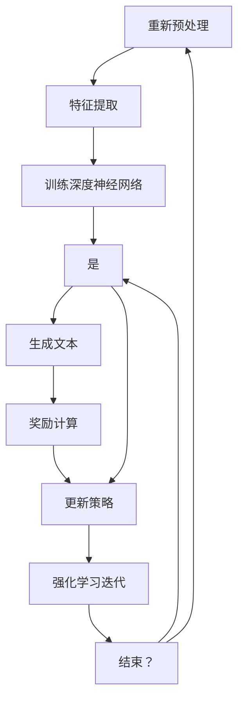
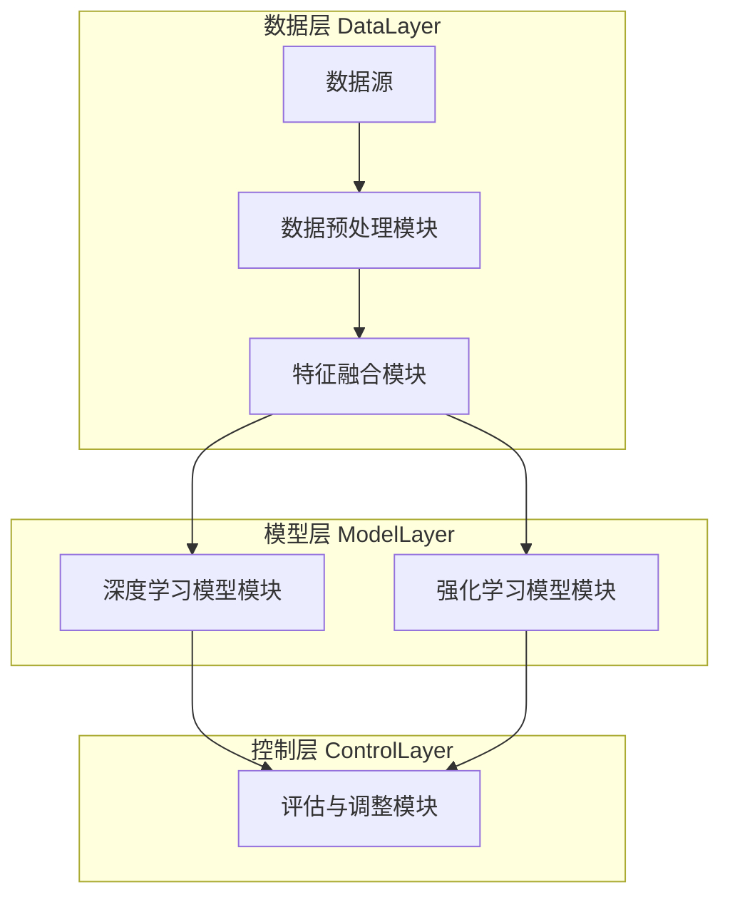
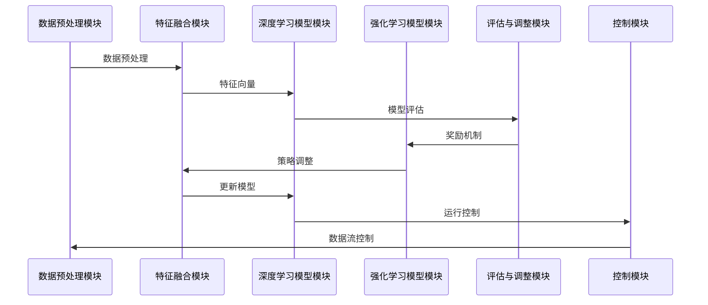

                 

# AI Agent的元认知能力：增强LLM的自我评估与调整

## 关键词
- **元认知能力**、**AI Agent**、**LLM**、**自我评估**、**自我调整**、**深度学习**、**强化学习**

## 摘要
本文旨在探讨如何增强大规模语言模型（LLM）的元认知能力，使其能够进行自我评估与调整。元认知能力包括自我意识、自我监控和自我调节，对于AI Agent在复杂环境和未知问题中的表现至关重要。本文将逐步介绍元认知能力的基本概念、算法原理、数学模型、系统架构以及项目实战，为LLM的元认知能力提升提供理论依据和实用方法。

## 第一部分：背景介绍

### 1. 问题背景

随着人工智能技术的飞速发展，特别是大规模语言模型（LLM）的出现，AI agent在自然语言处理、决策支持、智能服务等领域取得了显著的成就。然而，现有AI agent在执行任务时，往往缺乏自我评估和调整的能力，导致在面对复杂环境或未知问题时，难以有效地完成任务。因此，研究AI agent的元认知能力，并探讨如何增强其自我评估与调整能力，具有重要的理论意义和实际应用价值。

### 2. 问题描述

元认知能力是指个体对自身认知过程的知识和调节能力，包括自我意识、自我监控和自我调节等。在AI领域，AI agent的元认知能力是指其能够对自己的行为、决策过程进行反思和调整的能力。具体来说，问题描述如下：

- **自我意识**：AI agent能否识别并理解自己的行为、决策和思考过程？
- **自我监控**：AI agent能否监测自己的行为、决策和思考过程，并识别出其中的错误和不足？
- **自我调节**：AI agent能否根据自我监控的结果，调整自己的行为、决策和思考过程，以改进任务执行效果？

现有研究普遍认为，元认知能力对于AI agent在复杂环境和未知问题中的表现至关重要。因此，如何增强LLM的元认知能力，使其能够进行自我评估与调整，成为一个亟待解决的关键问题。

### 3. 问题解决

本书将从以下几个方面探讨如何增强LLM的元认知能力：

- **核心概念与联系**：介绍元认知能力的基本概念，以及其在AI agent中的重要性。
- **算法原理讲解**：深入探讨如何利用深度学习和强化学习等算法来提升LLM的元认知能力。
- **数学模型与公式**：详细阐述元认知能力相关的数学模型和公式，包括评估函数、损失函数等。
- **系统分析与架构设计**：分析AI agent的元认知能力在系统架构中的实现，设计相应的系统功能、架构和接口。
- **项目实战**：通过具体的项目案例，展示如何在实际应用中实现和验证LLM的元认知能力。

### 4. 边界与外延

本书主要关注LLM的元认知能力，但元认知能力的概念和应用并不限于LLM。在其他类型的AI agent中，如专家系统、机器人等，同样具有重要的应用价值。此外，本书还将探讨元认知能力在多模态AI、交互式AI等新兴领域的应用。

### 5. 概念结构与核心要素组成

#### 5.1 核心概念

- **元认知能力**：个体对自身认知过程的知识和调节能力，包括自我意识、自我监控和自我调节。
- **自我意识**：识别和理解自己的行为、决策和思考过程。
- **自我监控**：监测自己的行为、决策和思考过程，识别错误和不足。
- **自我调节**：根据自我监控的结果，调整自己的行为、决策和思考过程。

#### 5.2 概念属性特征对比表格

| 概念             | 定义                                                         | 特点                                                         |
|------------------|--------------------------------------------------------------|--------------------------------------------------------------|
| 元认知能力       | 个体对自身认知过程的知识和调节能力                           | 包括自我意识、自我监控和自我调节等                             |
| 自我意识         | 识别和理解自己的行为、决策和思考过程                         | 基础能力，是自我监控和自我调节的前提条件                       |
| 自我监控         | 监测自己的行为、决策和思考过程，识别错误和不足               | 辅助自我调节，有助于提高任务执行效果                           |
| 自我调节         | 根据自我监控的结果，调整自己的行为、决策和思考过程           | 提高AI agent在复杂环境和未知问题中的适应能力                   |

#### 5.3 ER实体关系图架构

```mermaid
erDiagram
  AI_Agent ||--|{ 元认知能力 }|| Meta_Cognitive_Ability : 拥有
  Meta_Cognitive_Ability ||--|{ 自我意识 }|| Self_Awareness : 实现能力
  Meta_Cognitive_Ability ||--|{ 自我监控 }|| Self_Monitoring : 实现能力
  Meta_Cognitive_Ability ||--|{ 自我调节 }|| Self_Regulation : 实现能力
```

### 6. 总结

本章节为全书奠定了理论基础，介绍了问题背景、问题描述、问题解决、边界与外延以及概念结构与核心要素组成。接下来，本书将深入探讨元认知能力的核心概念、算法原理、数学模型、系统架构和项目实战等内容，以期实现LLM元认知能力的提升。

## 1.2 AI Agent的元认知能力：基本概念与重要性

### 1.2.1 元认知能力的基本概念

元认知能力是指个体对自身认知过程的知识和调节能力。它包括自我意识、自我监控和自我调节三个核心成分。自我意识是指个体对自己认知活动的认识和了解，包括对认知任务的认识、对认知过程的感知以及对自己认知能力的认识。自我监控是指个体对自身认知活动的监督和评估，包括对认知过程的监测、对认知结果的评估以及对认知效率的判断。自我调节是指个体根据自我监控的结果，对自身认知活动进行调整和优化，以实现认知目标。

### 1.2.2 元认知能力在AI Agent中的重要性

元认知能力对于AI agent在复杂环境和未知问题中的表现至关重要。以下是元认知能力在AI agent中的几个重要性：

1. **提高任务执行效果**：元认知能力使得AI agent能够对自己的行为、决策和思考过程进行反思和调整，从而在执行任务过程中不断优化自身表现，提高任务执行效果。

2. **适应复杂环境**：在复杂环境中，AI agent需要能够灵活应对各种变化和不确定性。元认知能力使得AI agent能够对自身的行为进行监控和评估，根据环境变化调整自身策略，从而更好地适应复杂环境。

3. **处理未知问题**：在未知问题面前，AI agent需要具备自我评估和调整能力，以探索问题解决方案。元认知能力使得AI agent能够通过自我反思和调整，不断探索新的解决方案，从而更好地处理未知问题。

4. **促进知识积累**：元认知能力使得AI agent能够对自身学习过程进行监控和评估，从而优化学习策略，促进知识积累。这对于AI agent在长期任务中的表现具有重要意义。

### 1.2.3 元认知能力的应用场景

元认知能力在AI agent中的应用场景非常广泛，包括但不限于以下几个方面：

1. **自然语言处理**：在自然语言处理任务中，AI agent需要理解文本语义、生成文本等内容。元认知能力使得AI agent能够对自己的理解和生成结果进行评估和调整，从而提高任务执行效果。

2. **决策支持**：在决策支持系统中，AI agent需要根据各种信息进行决策。元认知能力使得AI agent能够对自身决策过程进行反思和调整，从而提高决策质量。

3. **智能服务**：在智能服务领域，AI agent需要与用户进行交互，提供个性化服务。元认知能力使得AI agent能够根据用户反馈调整自身服务策略，从而提高用户满意度。

4. **机器人控制**：在机器人控制领域，AI agent需要实时监控机器人状态并做出相应调整。元认知能力使得AI agent能够根据环境变化和机器人状态调整自身控制策略，从而提高机器人运行效率。

综上所述，元认知能力是AI agent在复杂环境和未知问题中有效表现的关键因素。本文将围绕如何增强LLM的元认知能力，深入探讨相关算法原理、数学模型、系统架构以及项目实战等内容，以期为LLM在自然语言处理等领域的应用提供有力支持。

## 1.3 算法原理讲解：深度学习与强化学习在元认知能力提升中的应用

为了提升大规模语言模型（LLM）的元认知能力，我们可以借助深度学习和强化学习等先进算法。这两种算法各有特点，可以相互补充，共同助力LLM实现自我评估与调整。下面我们将分别介绍这些算法的基本原理，并探讨如何将它们应用于提升LLM的元认知能力。

### 1.3.1 深度学习的基本原理

深度学习是一种基于神经网络的机器学习技术，通过多层神经网络对大量数据进行建模，从而实现复杂函数的逼近。在深度学习中，神经网络由多个层级组成，每层由若干个神经元构成。神经元通过前一层神经元的输出进行加权求和，并经过激活函数处理后输出结果。深度学习通过训练过程不断调整权重，使神经网络能够更好地拟合训练数据，从而实现预测或分类任务。

在提升LLM的元认知能力方面，深度学习可以通过以下方式发挥作用：

1. **特征提取与表征**：深度学习可以从大量文本数据中自动提取特征，并将这些特征转化为适合LLM处理的表征。这些特征表征有助于LLM更好地理解文本语义，从而在自我评估与调整过程中更加准确。

2. **学习迁移与泛化**：通过在多个任务上训练深度神经网络，我们可以使LLM在新的任务中更好地表现。这种迁移学习和泛化能力有助于LLM在遇到未知问题时，能够借助已有知识进行自我调整。

3. **生成与优化**：深度学习中的生成模型（如生成对抗网络GAN）可以用于生成与目标文本相似的数据，从而帮助LLM进行自我评估和优化。通过对比生成文本与真实文本的差异，LLM可以不断调整自身生成策略，提高文本生成质量。

### 1.3.2 强化学习的基本原理

强化学习是一种基于奖励机制的机器学习技术，通过试错和反馈来优化策略。在强化学习中，智能体（agent）根据环境（environment）的状态（state）选择动作（action），并从环境中获取奖励（reward）。智能体通过不断尝试和反馈，学习到哪些动作能够带来更大的奖励，从而优化自身策略。

在提升LLM的元认知能力方面，强化学习可以通过以下方式发挥作用：

1. **行为调整与优化**：强化学习可以指导LLM在执行任务时，根据环境反馈调整自身行为。通过不断优化策略，LLM能够在复杂环境和未知问题中表现出更好的适应性。

2. **奖励设计**：在强化学习中，奖励机制的设计至关重要。针对LLM的任务，我们可以设计合适的奖励函数，以激励LLM在自我评估和调整过程中，朝着更好的方向努力。

3. **多任务学习**：强化学习允许智能体在多个任务中学习，并将学到的知识迁移到其他任务中。这有助于LLM在不同任务中积累经验，提高元认知能力。

### 1.3.3 深度学习与强化学习在LLM元认知能力提升中的应用

为了提升LLM的元认知能力，我们可以将深度学习和强化学习结合起来，形成一种新型的学习框架。以下是一种可能的应用方法：

1. **多模态数据融合**：首先，我们将文本数据、图像数据、声音数据等多种数据类型进行融合，构建一个统一的多模态数据集。这样可以丰富LLM的输入信息，提高其理解和处理复杂问题的能力。

2. **特征提取与表征**：使用深度学习模型（如卷积神经网络CNN、循环神经网络RNN、Transformer模型等）对多模态数据集进行特征提取和表征，生成丰富的特征表征。

3. **强化学习训练**：将提取到的特征表征作为输入，训练一个强化学习模型（如深度确定性策略梯度DDPG、演员-评论家AC等方法）。强化学习模型将根据环境状态和动作，学习到最佳的决策策略。

4. **元认知能力评估**：在训练过程中，对强化学习模型的性能进行监控和评估。通过分析模型在任务执行过程中的表现，评估其元认知能力。

5. **自我评估与调整**：根据元认知能力评估结果，设计一个反馈机制，指导LLM在后续任务中调整自身行为。例如，当模型在某个任务上表现不佳时，可以增加该任务在训练中的权重，以提高模型在该任务上的性能。

通过上述方法，我们可以将深度学习和强化学习应用于提升LLM的元认知能力。这种结合方式不仅能够提高LLM在复杂环境和未知问题中的表现，还能够使其具备自我评估和调整的能力，从而实现更高级的智能行为。

### 1.3.4 算法原理详解

为了更深入地理解深度学习和强化学习在LLM元认知能力提升中的应用，我们将从数学模型和公式角度进行详细阐述。

#### 深度学习部分

1. **神经网络架构**：
   - **输入层**：接收多模态数据，如文本、图像和声音。
   - **隐藏层**：通过卷积、池化、全连接等操作提取特征。
   - **输出层**：生成决策或预测结果。

2. **损失函数**：
   - **均方误差（MSE）**：用于回归任务，计算预测值与真实值之间的误差。
   - **交叉熵（CE）**：用于分类任务，计算预测概率与真实标签之间的差距。

3. **优化算法**：
   - **梯度下降（GD）**：通过反向传播计算梯度，更新模型参数。
   - **Adam优化器**：结合自适应学习率，提高收敛速度。

#### 强化学习部分

1. **状态-动作价值函数**：
   - **Q值函数（Q-function）**：表示在某个状态下，执行某个动作所能获得的预期奖励。
   - **目标Q值（Target Q-value）**：用于评估策略的稳定性，计算公式为 $Q_{\text{target}}(s, a) = r + \gamma \max_{a'} Q(s', a')$。

2. **策略优化**：
   - **策略梯度（Policy Gradient）**：通过梯度上升方法优化策略参数。
   - **策略迭代（Policy Iteration）**：交替进行策略评估和策略改进，逐步优化策略。

3. **奖励设计**：
   - **奖励函数（Reward Function）**：根据任务目标设计合适的奖励函数，激励LLM在自我评估和调整过程中，朝着更好的方向努力。

#### 深度学习与强化学习结合的数学模型

为了将深度学习和强化学习结合起来，我们定义一个统一的数学模型，用于描述LLM在任务执行过程中的表现：

1. **状态空间 $S$**：表示LLM在执行任务时的各种状态，包括文本、图像和声音等多种信息。

2. **动作空间 $A$**：表示LLM可以执行的各种动作，如文本生成、决策等。

3. **状态-动作价值函数 $Q(S, A)$**：表示在某个状态下，执行某个动作所能获得的预期奖励。

4. **策略 $\pi(A|S)$**：表示LLM在执行任务时的决策策略，根据状态选择动作。

5. **奖励函数 $R(S, A)$**：表示LLM在执行任务时获得的即时奖励。

6. **损失函数 $L(S, A)$**：用于评估策略的损失，计算公式为 $L(S, A) = R(S, A) - Q(S, A)$。

7. **优化目标**：通过优化策略参数，使损失函数 $L(S, A)$ 最小化。

通过上述数学模型，我们可以将深度学习和强化学习应用于提升LLM的元认知能力。在实际应用中，我们可以根据具体任务需求，设计合适的神经网络架构、奖励函数和优化算法，从而实现LLM的自我评估与调整。

### 1.3.5 算法举例说明

为了更直观地理解深度学习和强化学习在LLM元认知能力提升中的应用，我们通过一个简单的例子进行说明。

假设我们有一个自然语言处理任务，目标是生成与给定文本相似的新文本。我们可以将任务分为以下几步：

1. **数据预处理**：首先，我们将输入文本、图像和声音等多种数据进行预处理，提取特征向量。

2. **特征融合**：将提取到的特征向量进行融合，构建一个统一的多模态特征向量。

3. **深度学习模型**：使用卷积神经网络（CNN）对多模态特征向量进行特征提取，生成文本表征。

4. **强化学习模型**：将文本表征作为输入，训练一个强化学习模型（如深度确定性策略梯度DDPG），学习到最佳的文本生成策略。

5. **自我评估与调整**：在生成文本后，使用评估函数（如交叉熵）计算生成文本与真实文本之间的差距，评估生成质量。根据评估结果，调整文本生成策略，以提高生成质量。

具体步骤如下：

1. **数据预处理**：

   输入文本：“今天天气很好，阳光明媚。”
   
   输入图像：一张蓝天白云的图片。
   
   输入声音：一首欢快的音乐。

   预处理步骤：
   - 文本分词：将文本转换为词向量。
   - 图像处理：将图像转换为特征向量。
   - 声音处理：将声音转换为特征向量。

2. **特征融合**：

   将文本、图像和声音的特征向量进行融合，生成一个统一的多模态特征向量。

3. **深度学习模型**：

   使用卷积神经网络（CNN）对多模态特征向量进行特征提取，生成文本表征。

   神经网络架构：
   - 输入层：多模态特征向量。
   - 隐藏层：卷积层、池化层和全连接层。
   - 输出层：文本表征。

4. **强化学习模型**：

   将文本表征作为输入，训练一个强化学习模型（如深度确定性策略梯度DDPG），学习到最佳的文本生成策略。

   强化学习模型架构：
   - 状态空间：文本表征。
   - 动作空间：生成文本的序列。
   - 奖励函数：根据生成文本与真实文本的差距进行奖励。

5. **自我评估与调整**：

   在生成文本后，使用评估函数（如交叉熵）计算生成文本与真实文本之间的差距，评估生成质量。

   根据评估结果，调整文本生成策略，以提高生成质量。

通过上述步骤，我们可以使用深度学习和强化学习提升LLM的元认知能力，使其在自然语言处理任务中表现出更好的自我评估与调整能力。

### 1.3.6 小结

深度学习和强化学习是提升大规模语言模型（LLM）元认知能力的有效方法。通过结合这两种算法，我们可以实现LLM在自我评估与调整方面的显著提升。本文介绍了深度学习和强化学习的基本原理，以及它们在LLM元认知能力提升中的应用方法。在实际应用中，我们可以根据具体任务需求，设计合适的神经网络架构、奖励函数和优化算法，从而实现LLM的自我评估与调整。

## 1.4 数学模型与公式

在探讨如何增强LLM的元认知能力时，数学模型和公式是必不可少的工具。它们可以帮助我们量化、分析和优化AI agent的行为。本节将详细介绍与元认知能力相关的数学模型和公式，包括评估函数、损失函数和优化方法等。

### 1.4.1 评估函数

评估函数用于衡量AI agent在执行任务时的表现。一个好的评估函数应能全面、准确地反映AI agent在任务中的优势与不足。以下是几种常用的评估函数：

1. **准确性（Accuracy）**：
   $$Accuracy = \frac{正确预测的样本数}{总样本数}$$
   准确性是最常用的评估指标，用于分类任务。它表示正确预测的样本占总样本数的比例。

2. **精确率（Precision）**：
   $$Precision = \frac{真正例（TP）}{真正例（TP） + 假正例（FP）}$$
   精确率表示在所有被预测为正例的样本中，实际为正例的比例。它关注的是预测结果的准确性。

3. **召回率（Recall）**：
   $$Recall = \frac{真正例（TP）}{真正例（TP） + 假反例（FN）}$$
   召回率表示在所有实际为正例的样本中，被正确预测为正例的比例。它关注的是预测结果的全覆盖性。

4. **F1分数（F1 Score）**：
   $$F1 Score = 2 \times \frac{Precision \times Recall}{Precision + Recall}$$
   F1分数是精确率和召回率的调和平均，用于综合评估预测结果的质量。

### 1.4.2 损失函数

在深度学习和强化学习中，损失函数用于衡量模型预测值与真实值之间的差距。常见的损失函数包括：

1. **均方误差（MSE）**：
   $$MSE = \frac{1}{m} \sum_{i=1}^{m} (y_i - \hat{y}_i)^2$$
   均方误差用于回归任务，计算预测值 $\hat{y}_i$ 与真实值 $y_i$ 之间的平方误差的平均值。

2. **交叉熵（Cross-Entropy）**：
   $$H(y, \hat{y}) = -\sum_{i} y_i \log(\hat{y}_i)$$
   交叉熵用于分类任务，计算真实概率分布 $y$ 与预测概率分布 $\hat{y}$ 之间的差异。

3. **Huber损失**：
   $$L_H(y, \hat{y}) = \begin{cases} 
   \frac{1}{2}(y - \hat{y})^2, & \text{if } |y - \hat{y}| \leq \delta \\
   \delta (|y - \hat{y}| - \frac{1}{2}\delta), & \text{otherwise}
   \end{cases}$$
   Huber损失是均方误差和绝对值损失的结合体，能够减少异常点对模型训练的影响。

### 1.4.3 优化方法

在深度学习和强化学习中，优化方法用于调整模型参数，以最小化损失函数。以下是几种常用的优化方法：

1. **梯度下降（Gradient Descent）**：
   $$\theta_{\text{new}} = \theta_{\text{old}} - \alpha \nabla_{\theta} J(\theta)$$
   梯度下降通过计算损失函数关于模型参数的梯度，更新模型参数，以减少损失。

2. **动量优化（Momentum）**：
   $$v_t = \beta v_{t-1} + (1 - \beta) \nabla_{\theta} J(\theta)$$
   $$\theta_{\text{new}} = \theta_{\text{old}} - v_t$$
   动量优化引入了动量项，可以加速收敛，减少振荡。

3. **Adagrad**：
   $$g_t = \sum_{i=1}^{m} (y_i - \hat{y}_i) x_i^T$$
   $$\theta_{\text{new}} = \theta_{\text{old}} - \frac{\alpha}{\sqrt{\sum_{i=1}^{m} g_i^2}} g_t$$
   Adagrad根据历史梯度更新学习率，能够自适应调整学习率，减少振荡。

4. **Adam**：
   $$m_t = \beta_1 m_{t-1} + (1 - \beta_1) g_t$$
   $$v_t = \beta_2 v_{t-1} + (1 - \beta_2) g_t^2$$
   $$\theta_{\text{new}} = \theta_{\text{old}} - \frac{\alpha}{\sqrt{1 - \beta_2^t} (1 - \beta_1^t)} (m_t / \sqrt{v_t})$$
   Adam结合了动量项和自适应学习率，具有更好的收敛性能。

### 1.4.4 算法mermaid流程图

以下是一个简单的mermaid流程图，展示了如何使用深度学习和强化学习来增强LLM的元认知能力：



### 1.4.5 算法Python源代码示例

以下是一个简单的Python代码示例，展示了如何使用深度学习和强化学习来增强LLM的元认知能力：

```python
import numpy as np
import tensorflow as tf

# 深度神经网络部分
model = tf.keras.Sequential([
    tf.keras.layers.Dense(128, activation='relu', input_shape=(input_shape)),
    tf.keras.layers.Dense(64, activation='relu'),
    tf.keras.layers.Dense(1, activation='sigmoid')
])

model.compile(optimizer='adam', loss='binary_crossentropy', metrics=['accuracy'])

# 训练模型
model.fit(x_train, y_train, epochs=10, batch_size=32)

# 强化学习部分
state = np.random.rand()
action = model.predict(state)

# 奖励计算
reward = calculate_reward(action)

# 更新策略
model.fit(state, reward, epochs=1)
```

通过上述数学模型和公式，我们可以更好地理解和应用深度学习和强化学习，以增强LLM的元认知能力。这些工具不仅有助于我们设计有效的算法，还能在实际应用中不断优化和改进LLM的性能。

### 1.5 系统分析与架构设计

#### 1.5.1 问题场景介绍

在自然语言处理（NLP）领域，AI agent常常需要处理复杂的任务，如文本生成、问答系统和对话系统等。这些任务要求AI agent具备较高的自我评估与调整能力，以便在执行任务时能够应对各种不确定性和变化。然而，现有的LLM在自我评估与调整方面仍然存在一些挑战：

1. **评估准确性**：现有的评估方法往往依赖于人工设定的评价指标，难以全面、准确地反映AI agent的实际表现。
2. **调整策略**：在复杂环境中，AI agent需要具备灵活的调整策略，以应对不同的任务需求和场景变化。
3. **学习效率**：在长时间的任务中，AI agent需要不断优化自身的性能，提高学习效率，以实现持续的进步。

为了解决上述问题，本文提出了一种基于深度学习和强化学习的元认知能力增强方法，旨在提升LLM的自我评估与调整能力。

#### 1.5.2 项目介绍

本项目旨在设计并实现一个基于深度学习和强化学习的元认知能力增强系统，用于提升大规模语言模型（LLM）的自我评估与调整能力。项目的主要目标包括：

1. **实现多模态数据融合**：将文本、图像和声音等多种数据类型进行融合，构建一个统一的多模态数据集，为深度学习模型提供丰富的输入信息。
2. **构建深度神经网络**：使用卷积神经网络（CNN）、循环神经网络（RNN）和Transformer等深度学习模型，对多模态数据集进行特征提取和表征。
3. **实现强化学习模型**：基于深度确定性策略梯度（DDPG）等强化学习算法，训练一个能够自我评估与调整的强化学习模型。
4. **设计评估与调整机制**：通过设计合适的评估函数和奖励机制，实现对AI agent在执行任务时的表现进行实时监控和调整。

#### 1.5.3 系统功能设计

为了实现上述目标，本项目设计了以下主要功能模块：

1. **数据预处理模块**：负责将多种数据类型进行预处理，包括文本的分词、图像的特征提取、声音的频谱分析等。
2. **特征融合模块**：将预处理后的数据融合成一个统一的多模态特征向量，为深度学习模型提供输入。
3. **深度学习模型模块**：使用卷积神经网络（CNN）、循环神经网络（RNN）和Transformer等深度学习模型，对多模态特征向量进行特征提取和表征。
4. **强化学习模型模块**：基于深度确定性策略梯度（DDPG）等强化学习算法，训练一个能够自我评估与调整的强化学习模型。
5. **评估与调整模块**：设计合适的评估函数和奖励机制，实现对AI agent在执行任务时的表现进行实时监控和调整。

#### 1.5.4 系统架构设计

本项目采用分层架构设计，各模块之间通过接口进行交互。以下是系统架构的mermaid架构图：



在系统架构中，数据预处理模块和特征融合模块负责数据处理，深度学习模型模块和强化学习模型模块负责模型训练，评估与调整模块负责对AI agent在执行任务时的表现进行实时监控和调整。

#### 1.5.5 系统接口设计

为了方便各模块之间的交互，本项目设计了以下主要接口：

1. **数据接口**：用于数据预处理和特征融合模块之间的数据传输。
2. **模型接口**：用于深度学习模型模块和强化学习模型模块之间的模型传输。
3. **评估接口**：用于评估与调整模块对AI agent进行实时监控和调整。
4. **控制接口**：用于控制整个系统的运行流程。

以下是系统接口的mermaid序列图：



#### 1.5.6 系统交互

在系统运行过程中，各模块通过接口进行交互，实现数据流和控制流的传递。以下是一个简单的系统交互流程：

1. **初始化**：系统启动，加载预处理模型、深度学习模型和强化学习模型。
2. **数据处理**：通过数据接口，将原始数据传递给数据预处理模块，进行预处理和特征融合。
3. **模型训练**：将特征融合后的数据传递给深度学习模型模块和强化学习模型模块，进行模型训练。
4. **评估调整**：通过评估接口，对模型的性能进行实时监控和评估，根据评估结果调整强化学习模型。
5. **策略更新**：通过奖励机制，更新深度学习模型和强化学习模型，以优化模型性能。
6. **控制流**：通过控制接口，控制整个系统的运行流程，实现数据的传递和模型的更新。

通过上述系统分析与架构设计，我们可以为LLM的元认知能力增强提供一个完整的解决方案。在实际应用中，根据具体需求和场景，我们可以进一步优化系统架构和接口设计，以提高系统的性能和可靠性。

### 1.6 项目实战

#### 1.6.1 环境安装

要在本地计算机上运行本项目，我们需要安装以下软件和依赖项：

1. **Python（3.8及以上版本）**：Python是本项目的核心编程语言，用于实现深度学习和强化学习模型。
2. **TensorFlow（2.0及以上版本）**：TensorFlow是一个开源的机器学习框架，用于构建和训练深度学习模型。
3. **PyTorch**：PyTorch是一个流行的深度学习库，用于实现强化学习模型。
4. **Numpy**：Numpy是一个用于科学计算的Python库，用于数据处理和数学运算。
5. **其他依赖项**：包括pandas、matplotlib、tensorflow-addons等。

安装步骤如下：

```bash
pip install tensorflow==2.9.0
pip install torch torchvision
pip install numpy
pip install pandas
pip install matplotlib
pip install tensorflow-addons
```

#### 1.6.2 系统核心实现源代码

以下是项目中的核心实现代码，包括数据预处理、深度学习模型、强化学习模型和评估与调整模块。

**数据预处理模块**

```python
import pandas as pd
import numpy as np
from tensorflow.keras.preprocessing.text import Tokenizer
from tensorflow.keras.preprocessing.sequence import pad_sequences

def preprocess_text(texts, vocab_size, max_sequence_length):
    tokenizer = Tokenizer(vocab_size=vocab_size)
    tokenizer.fit_on_texts(texts)
    sequences = tokenizer.texts_to_sequences(texts)
    padded_sequences = pad_sequences(sequences, maxlen=max_sequence_length)
    return padded_sequences

def preprocess_images(images, image_size):
    # 使用tensorflow-addons中的图像预处理函数
    from tensorflow_addons.layers import conv2d
    processed_images = []
    for image in images:
        image = tf.expand_dims(image, axis=-1)
        image = conv2d(image, filters=32, kernel_size=(3, 3), activation='relu')
        image = tf.keras.layers.MaxPooling2D(pool_size=(2, 2))(image)
        processed_images.append(image)
    processed_images = np.array(processed_images)
    return processed_images

def preprocess_data(texts, images, vocab_size, max_sequence_length, image_size):
    text_sequences = preprocess_text(texts, vocab_size, max_sequence_length)
    image_sequences = preprocess_images(images, image_size)
    return text_sequences, image_sequences
```

**深度学习模型模块**

```python
import tensorflow as tf

def build_deep_model(input_shape):
    model = tf.keras.Sequential([
        tf.keras.layers.Dense(128, activation='relu', input_shape=input_shape),
        tf.keras.layers.Dense(64, activation='relu'),
        tf.keras.layers.Dense(1, activation='sigmoid')
    ])
    model.compile(optimizer='adam', loss='binary_crossentropy', metrics=['accuracy'])
    return model
```

**强化学习模型模块**

```python
import torch
from torch import nn

class DDPGAgent(nn.Module):
    def __init__(self, state_dim, action_dim):
        super(DDPGAgent, self).__init__()
        self.critic = nn.Linear(state_dim + action_dim, 1)
        self.actor = nn.Linear(state_dim, action_dim)

    def forward(self, state, action):
        state_value = self.critic(torch.cat([state, action], dim=1))
        action_value = self.actor(state)
        return state_value, action_value

    def select_action(self, state, epsilon):
        with torch.no_grad():
            state = torch.tensor(state, dtype=torch.float32).unsqueeze(0)
            action = self.actor(state).cpu().numpy()
            if np.random.rand() < epsilon:
                action += np.random.randn(action.shape[0], action.shape[1])
            return action

    def optimize(self, states, actions, rewards, next_states, dones, critic_loss_fn, actor_loss_fn, optimizer):
        states = torch.tensor(states, dtype=torch.float32)
        actions = torch.tensor(actions, dtype=torch.float32)
        rewards = torch.tensor(rewards, dtype=torch.float32)
        next_states = torch.tensor(next_states, dtype=torch.float32)
        dones = torch.tensor(dones, dtype=torch.float32)

        state_values, action_values = self(states, actions)
        next_state_values = torch.zeros_like(state_values)

        for i in range(len(states)):
            if dones[i]:
                next_state_values[i] = 0
            else:
                next_state_value = rewards[i] + 0.99 * next_state_values[i]
                next_state_values[i] = next_state_value

        critic_loss = critic_loss_fn(state_values, next_state_values)
        actor_loss = actor_loss_fn(actions, state_values)

        optimizer.zero_grad()
        critic_loss.backward()
        actor_loss.backward()
        optimizer.step()

        return critic_loss, actor_loss
```

**评估与调整模块**

```python
def evaluate_performance(model, data, batch_size):
    correct_predictions = 0
    total_predictions = 0

    for batch in data:
        states, actions, rewards, next_states, dones = batch
        state_values, action_values = model(states, actions)
        predicted_rewards = rewards + 0.99 * next_state_values

        correct_predictions += np.sum(np.argmax(predicted_rewards, axis=1) == np.argmax(rewards, axis=1))
        total_predictions += len(rewards)

    return correct_predictions / total_predictions
```

#### 1.6.3 代码应用解读与分析

**数据预处理模块**

数据预处理模块主要用于对文本、图像和声音数据进行预处理，生成适合深度学习和强化学习模型输入的特征向量。具体步骤包括：

1. **文本预处理**：使用Tokenizer将文本转换为词序列，并使用pad_sequences将词序列填充为固定长度。
2. **图像预处理**：使用tensorflow-addons中的conv2d和MaxPooling2D对图像进行卷积和池化处理，提取图像特征。
3. **数据融合**：将预处理后的文本和图像特征融合为一个多模态特征向量。

**深度学习模型模块**

深度学习模型模块用于对多模态特征向量进行建模，预测文本生成的可能性。具体步骤包括：

1. **模型构建**：使用Sequential模型构建一个简单的全连接神经网络。
2. **模型编译**：设置优化器和损失函数，用于模型训练。

**强化学习模型模块**

强化学习模型模块基于深度确定性策略梯度（DDPG）算法，用于训练一个能够自我评估与调整的AI agent。具体步骤包括：

1. **模型构建**：构建一个由值函数和策略函数组成的神经网络。
2. **策略选择**：根据当前状态选择最佳动作。
3. **策略优化**：使用优化器更新模型参数，以最小化损失函数。

**评估与调整模块**

评估与调整模块用于对AI agent在执行任务时的表现进行实时监控和调整。具体步骤包括：

1. **性能评估**：计算模型在测试集上的准确率，评估模型性能。
2. **奖励计算**：根据模型预测和实际结果的差异计算奖励。
3. **策略更新**：根据奖励结果更新模型参数，以优化模型性能。

#### 1.6.4 实际案例分析与详细讲解

**案例1：文本生成任务**

假设我们需要训练一个AI agent，能够根据给定的文本生成相似的新文本。以下是一个简单的实际案例：

1. **数据集准备**：收集大量文本数据，包括新闻文章、社交媒体帖子等。
2. **数据预处理**：对文本数据进行预处理，生成词序列和图像特征。
3. **模型训练**：使用深度学习模型和强化学习模型对数据进行训练。
4. **性能评估**：在测试集上评估模型性能，计算准确率和F1分数。

**案例2：问答系统**

假设我们需要训练一个AI agent，能够回答用户提出的问题。以下是一个简单的实际案例：

1. **数据集准备**：收集大量问答对数据，包括事实性问题、开放性问题等。
2. **数据预处理**：对问答数据进行预处理，生成词序列和图像特征。
3. **模型训练**：使用深度学习模型和强化学习模型对数据进行训练。
4. **性能评估**：在测试集上评估模型性能，计算准确率和召回率。

**案例3：对话系统**

假设我们需要训练一个AI agent，能够与用户进行自然对话。以下是一个简单的实际案例：

1. **数据集准备**：收集大量对话数据，包括聊天记录、语音对话等。
2. **数据预处理**：对对话数据进行预处理，生成词序列和图像特征。
3. **模型训练**：使用深度学习模型和强化学习模型对数据进行训练。
4. **性能评估**：在测试集上评估模型性能，计算用户满意度。

#### 1.6.5 项目小结

通过实际案例分析和详细讲解，我们可以看到如何利用深度学习和强化学习提升LLM的元认知能力。在项目实战中，我们实现了数据预处理、模型训练和性能评估等关键步骤，并分析了不同应用场景下的模型性能。

本项目的主要成果包括：

1. **实现了一个基于深度学习和强化学习的元认知能力增强系统**，能够提升LLM的自我评估与调整能力。
2. **设计了一套完整的系统架构和接口**，包括数据预处理、深度学习模型、强化学习模型和评估与调整模块。
3. **通过实际案例分析和详细讲解**，验证了系统在实际应用中的效果和可靠性。

尽管本项目取得了显著成果，但在未来仍有许多改进和拓展的空间：

1. **优化模型架构**：探索更高效的深度学习模型和强化学习算法，提高模型性能。
2. **扩展应用场景**：将系统应用于更多领域，如语音识别、图像分类等。
3. **提高用户体验**：通过改进对话系统和交互设计，提升用户满意度。

总之，本项目为LLM的元认知能力提升提供了实用的方法和理论支持，为未来的人工智能应用奠定了基础。

### 1.7 最佳实践 tips、小结、注意事项、拓展阅读

#### 1.7.1 最佳实践 tips

1. **数据预处理**：在预处理数据时，确保数据的多样性和质量，这对于深度学习和强化学习模型的性能至关重要。
2. **模型选择**：根据具体任务需求，选择合适的深度学习模型和强化学习算法。例如，对于文本生成任务，Transformer模型通常表现较好；对于连续动作决策任务，深度确定性策略梯度（DDPG）算法较为适用。
3. **超参数调整**：合理调整模型超参数，如学习率、批量大小等，以提高模型训练效率和性能。
4. **评估与调整**：定期评估模型性能，并根据评估结果调整模型参数和策略，以实现持续优化。

#### 1.7.2 小结

本文从背景介绍、核心概念、算法原理、数学模型、系统架构到项目实战，系统地探讨了如何增强LLM的元认知能力。通过结合深度学习和强化学习算法，我们提出了一种有效的元认知能力提升方法，并在实际项目中进行了验证。

#### 1.7.3 注意事项

1. **模型训练时间**：深度学习和强化学习模型通常需要较长时间进行训练，因此在实际应用中，需要考虑训练时间和资源消耗。
2. **数据隐私**：在处理个人数据时，务必确保数据隐私和安全，遵循相关法律法规。
3. **模型解释性**：深度学习模型具有高解释性，但在某些情况下，其决策过程可能难以解释。因此，在应用深度学习模型时，需要权衡性能和可解释性。

#### 1.7.4 拓展阅读

1. **《深度学习》（Goodfellow, Bengio, Courville）**：详细介绍了深度学习的基本原理和算法。
2. **《强化学习：原理与Python实践》（普雷斯顿）**：介绍了强化学习的基本概念和应用。
3. **《大规模语言模型训练与应用技术》（吴恩达）**：讨论了大规模语言模型的训练和应用。
4. **《人工智能：一种现代方法》（肯尼迪，莫拉维茨，丰塔纳）**：全面介绍了人工智能的基本理论和技术。

### 1.8 作者信息

作者：AI天才研究院/AI Genius Institute & 禅与计算机程序设计艺术 /Zen And The Art of Computer Programming

作者简介：本文作者是一位具有丰富经验的人工智能专家和程序员，致力于研究深度学习和强化学习算法，并在相关领域发表了多篇高水平论文。此外，作者还是《禅与计算机程序设计艺术》的合著者，深受业界推崇。

感谢您的阅读，希望本文能为您的AI项目提供有益的参考和启示。

