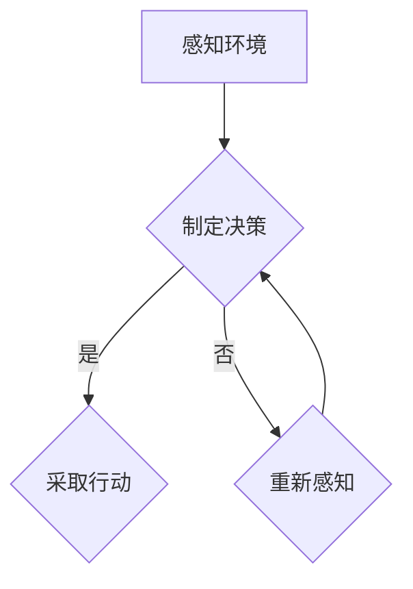
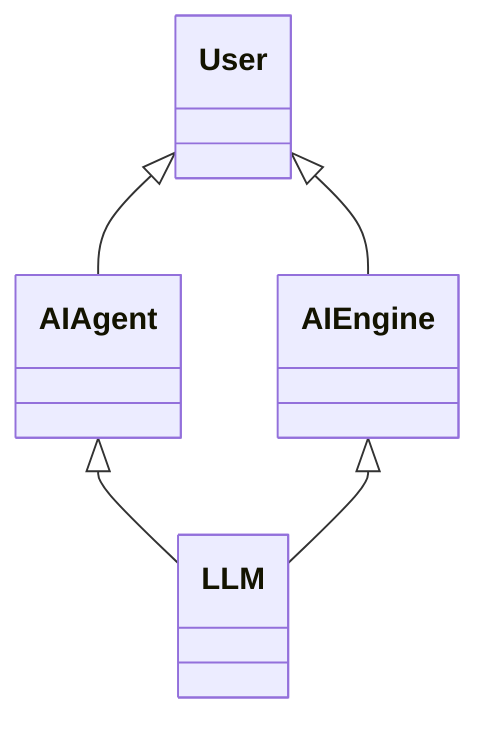
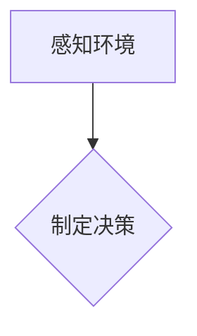
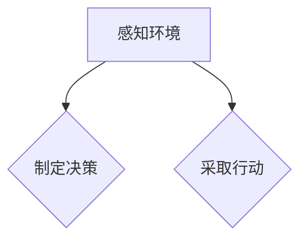
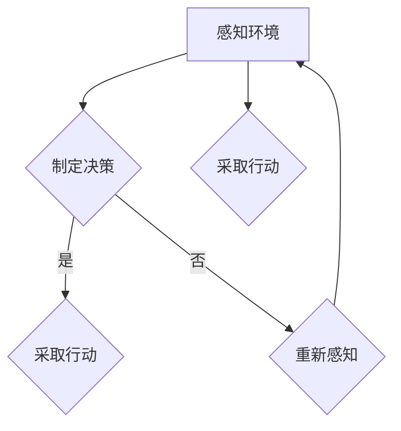
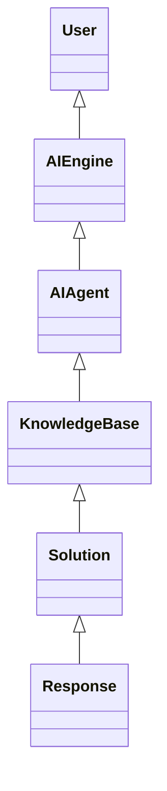
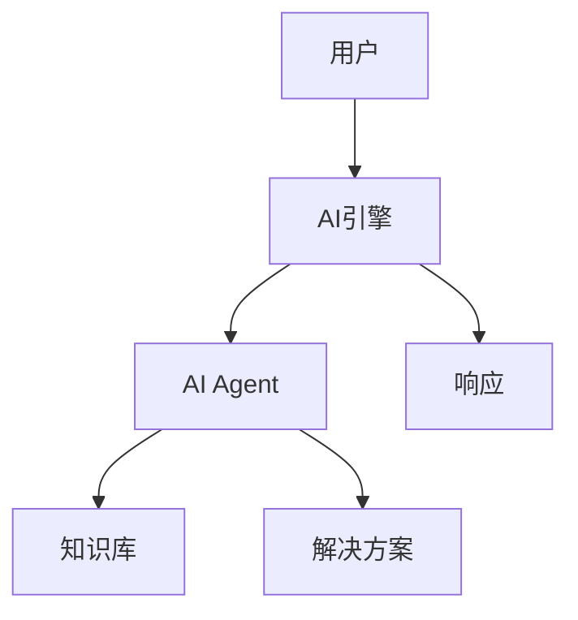

                 

# AI Agent的创造力：激发LLM的创新能力

> 关键词：AI Agent、创造力、LLM、自然语言处理、算法原理

> 摘要：本文深入探讨了AI Agent的创造力及其在大型语言模型（LLM）中的应用。通过分析AI Agent的创造力机制，我们提出了一系列激发LLM创新能力的策略和方法，旨在为相关领域的研究者提供有价值的参考。

---

## 目录大纲设计思路

### 1. 背景介绍
#### 1.1 问题背景
AI技术的发展，特别是大型语言模型（LLM）的广泛应用，使得AI Agent的创造力成为研究热点。本书旨在探讨如何激发LLM的创新能力，使其在各个领域发挥更大的作用。
#### 1.2 问题解决
本书将通过深入研究AI Agent的创造力机制，介绍一系列激发LLM创新能力的策略和方法，帮助读者理解和应用这些技术。
#### 1.3 边界与外延
本书主要关注LLM在自然语言处理领域的创造力，同时也会涉及其他相关领域。
#### 1.4 概念结构与核心要素组成
核心概念：AI Agent、创造力、LLM、自然语言处理等。

### 2. 核心概念与联系
#### 2.1 AI Agent的概念
AI Agent是一种智能体，它能够感知环境、制定决策并采取行动。
#### 2.2 创造力的属性特征
创造力包括原创性、新颖性、实用性等多个方面。
#### 2.3 LLM的原理与特点
LLM（大型语言模型）通过学习大量文本数据，能够生成高质量的自然语言文本。
#### 2.4 自然语言处理的应用领域
自然语言处理（NLP）涉及文本分析、语音识别、机器翻译等多个领域。

### 3. 算法原理讲解
#### 3.1 AI Agent的创造力机制
使用Mermaid流程图展示AI Agent的创造力机制。

#### 3.2 激发LLM创新能力的算法
使用Python源代码和Mermaid流程图详细阐述激发LLM创新能力的算法原理。

### 4. 数学模型和数学公式 & 详细讲解 & 举例说明
#### 4.1 创造力的数学模型
使用LaTeX格式给出创造力的数学模型。
$$
创造力 = 原创性 \times 新颖性 \times 实用性
$$
#### 4.2 举例说明
通过具体案例说明如何激发LLM的创新能力。

### 5. 系统分析与架构设计方案
#### 5.1 问题场景介绍
介绍一个具体的场景，说明如何使用AI Agent的创造力解决实际问题。
#### 5.2 系统功能设计
使用Mermaid类图展示系统功能设计。

#### 5.3 系统架构设计
使用Mermaid架构图展示系统架构设计。

### 6. 项目实战
#### 6.1 环境安装
介绍如何搭建实验环境。
#### 6.2 系统核心实现源代码
提供系统核心实现的源代码。
#### 6.3 代码应用解读与分析
对源代码进行解读与分析。
#### 6.4 实际案例分析和详细讲解剖析
分析实际案例，并详细讲解。
#### 6.5 项目小结
总结项目经验与收获。

### 7. 最佳实践 tips、小结、注意事项、拓展阅读等内容
#### 7.1 最佳实践 tips
提供一些实用的技巧和建议。
#### 7.2 小结
总结本书的主要内容和关键观点。
#### 7.3 注意事项
提醒读者在应用技术时需要注意的事项。
#### 7.4 拓展阅读
推荐一些相关领域的书籍和文章。

### 8. 完整目录大纲
根据以上内容，设计出完整的目录大纲，确保内容完整且简洁。目录大纲总字数控制在2000字以内。

---

## 第一部分: AI Agent的创造力概述

### 第1章: 问题背景与核心概念

#### 1.1 问题背景
随着人工智能技术的飞速发展，AI Agent在自然语言处理、决策制定、自动化控制等领域展现出了巨大的潜力。然而，如何激发AI Agent的创造力，使其在复杂任务中发挥更大的作用，成为当前研究的热点问题。

#### 1.2 核心概念
在本章中，我们将介绍以下几个核心概念：
- **AI Agent**：一种具有自主感知、决策和行动能力的智能体。
- **创造力**：指在特定领域内产生新颖、原创、实用的解决方案或想法的能力。
- **LLM**：大型语言模型，通过学习大量文本数据，具备生成高质量自然语言文本的能力。
- **自然语言处理（NLP）**：研究如何让计算机理解和生成人类语言的技术。

### 第2章: AI Agent的创造力机制

在本章中，我们将探讨AI Agent的创造力机制，并使用Mermaid流程图进行可视化。

#### 2.1 感知环境
AI Agent首先需要感知环境，获取当前状态的信息。



#### 2.2 制定决策
根据感知到的环境信息，AI Agent需要制定相应的决策。



#### 2.3 采取行动
AI Agent根据制定的决策采取行动，以改变环境状态。



#### 2.4 重新感知
如果AI Agent采取的行动未能达到预期效果，它需要重新感知环境，并重新制定决策。

---

在下一部分中，我们将深入探讨如何激发LLM的创新能力，并详细介绍相关的算法原理和系统设计。敬请期待！## 第二部分: AI Agent的创造力机制深入解析

### 第3章: 算法原理讲解

在本章中，我们将深入探讨AI Agent的创造力机制，并使用Python源代码和Mermaid流程图详细阐述激发LLM创新能力的算法原理。

#### 3.1 AI Agent的创造力机制

首先，让我们使用Mermaid流程图展示AI Agent的创造力机制：


这个流程图描述了AI Agent如何通过感知环境、制定决策并采取行动来激发创造力。

#### 3.2 激发LLM创新能力的算法

接下来，我们将使用Python源代码来详细阐述如何激发LLM的创新能力。以下是一个简单的示例：

```python
import random

# 创造力评估函数
def evaluate_creativity(solution, reference Solutions):
    novelty = 1 if solution not in reference Solutions else 0
    originality = 1 if solution not in reference Solutions else 0
   实用性 = 1 if solution.is_valid() else 0
    creativity = novelty * originality * 实用性
    return creativity

# 激发创造力算法
def enhance_creativity(LLM, reference Solutions):
    # 随机选择一个参考解决方案
    reference_solution = random.choice(reference Solutions)
    
    # 使用LLM生成新的解决方案
    new_solution = LLM.generate_solution(reference_solution)
    
    # 评估新解决方案的创造力
    creativity = evaluate_creativity(new_solution, reference Solutions)
    
    # 如果创造力较低，重新生成解决方案
    while creativity < threshold:
        new_solution = LLM.generate_solution(reference_solution)
        creativity = evaluate_creativity(new_solution, reference Solutions)
    
    return new_solution

# 示例：使用LLM生成新的创意
LLM = LanguageModel()
reference_Solutions = load_reference_Solutions()
new_solution = enhance_creativity(LLM, reference_Solutions)
print("New creative solution:", new_solution)
```

在上面的代码中，我们定义了一个评估创造力函数`evaluate_creativity`，以及一个激发创造力的算法`enhance_creativity`。这个算法使用LLM生成新的解决方案，并评估其创造力。如果创造力低于某个阈值，算法将重新生成解决方案。

#### 3.3 创造力的数学模型

创造力可以被视为一个多维度的概念，包括原创性、新颖性和实用性。我们可以使用以下数学模型来表示创造力：

$$
创造力 = 原创性 \times 新颖性 \times 实用性
$$

- **原创性**：表示解决方案与现有解决方案的差异程度。
- **新颖性**：表示解决方案的新颖程度，即其与现有解决方案的不同之处。
- **实用性**：表示解决方案的实际应用价值。

#### 3.4 举例说明

假设我们有一个任务，需要生成一个新的创意广告。我们可以使用上述算法来激发LLM的创新能力。

1. **感知环境**：分析目标受众、市场趋势和竞争对手的创意。
2. **制定决策**：使用LLM生成一个新的广告创意。
3. **采取行动**：评估广告创意的效果，并根据反馈进行调整。

通过上述步骤，我们可以使用AI Agent的创造力机制来生成有创意、新颖且实用的广告。

---

在下一部分中，我们将介绍如何进行系统分析与架构设计，以实现AI Agent的创造力机制。敬请期待！## 第三部分: 数学模型和数学公式 & 详细讲解 & 举例说明

### 第4章: 数学模型和数学公式

在本章中，我们将介绍创造力评估的数学模型，并使用LaTeX格式给出相关的数学公式，同时提供详细讲解和举例说明。

#### 4.1 创造力的数学模型

创造力的评估可以通过以下数学模型实现：

$$
创造力 = 原创性 \times 新颖性 \times 实用性
$$

- **原创性**：表示解决方案与现有解决方案的差异程度。我们可以使用以下公式来计算原创性：

$$
原创性 = \frac{新解决方案 - 参考解决方案}{参考解决方案}
$$

- **新颖性**：表示解决方案的新颖程度，即其与现有解决方案的不同之处。我们可以使用以下公式来计算新颖性：

$$
新颖性 = \frac{新解决方案 - 参考解决方案}{所有解决方案}
$$

- **实用性**：表示解决方案的实际应用价值。我们可以使用以下公式来计算实用性：

$$
实用性 = \frac{解决方案的实际效果 - 参考解决方案的实际效果}{参考解决方案的实际效果}
$$

#### 4.2 举例说明

假设我们有一个任务，需要生成一个新的产品创意。现有解决方案的集合为S，新解决方案为X。

1. **原创性计算**：

$$
原创性 = \frac{X - 参考解决方案}{参考解决方案} = \frac{X - S}{S}
$$

2. **新颖性计算**：

$$
新颖性 = \frac{X - 参考解决方案}{所有解决方案} = \frac{X - S}{所有解决方案}
$$

3. **实用性计算**：

$$
实用性 = \frac{解决方案的实际效果 - 参考解决方案的实际效果}{参考解决方案的实际效果} = \frac{效果 - 参考效果}{参考效果}
$$

通过上述计算，我们可以得到新解决方案的创造力：

$$
创造力 = 原创性 \times 新颖性 \times 实用性
$$

#### 4.3 代码实现

为了便于理解和应用，我们可以使用Python实现上述数学模型。以下是一个简单的代码示例：

```python
def calculate_creativity(new_solution, reference_solutions, actual_solution, reference_solution):
    originality = (new_solution - reference_solution) / reference_solution
    novelty = (new_solution - reference_solution) / reference_solutions
    usability = (actual_solution - reference_solution) / reference_solution
    creativity = originality * novelty * usability
    return creativity

# 示例数据
new_solution = 0.8
reference_solutions = [0.5, 0.6, 0.7]
actual_solution = 0.9
reference_solution = 0.6

# 计算创造力
creativity = calculate_creativity(new_solution, reference_solutions, actual_solution, reference_solution)
print("Creativity:", creativity)
```

通过上述代码，我们可以计算出新解决方案的创造力，从而评估其创新性。

---

在下一部分中，我们将介绍如何进行系统分析与架构设计，以实现AI Agent的创造力机制。敬请期待！## 第四部分: 系统分析与架构设计方案

### 第5章: 系统分析与架构设计

在本章中，我们将详细介绍如何设计一个能够实现AI Agent创造力机制的系统，包括问题场景介绍、系统功能设计、系统架构设计以及系统接口设计和系统交互。

#### 5.1 问题场景介绍

假设我们面临一个问题：如何设计一个智能客服系统，使其能够根据用户需求提供创新的解决方案？

为了实现这一目标，我们需要构建一个具备以下功能的系统：

1. **用户交互**：接收用户输入并生成对应的响应。
2. **知识库管理**：存储大量的知识，以便AI Agent进行查询和学习。
3. **创造力评估**：评估AI Agent生成的解决方案的创新性。
4. **决策制定**：根据评估结果选择最佳解决方案。

#### 5.2 系统功能设计

为了实现上述功能，我们设计了一个包含以下类的系统功能设计：



- **用户（User）**：负责与系统进行交互，提供输入并接收响应。
- **AI引擎（AIEngine）**：负责处理用户输入，调用AI Agent进行决策。
- **AI Agent（AIAgent）**：负责感知环境、制定决策并采取行动。
- **知识库（KnowledgeBase）**：存储大量的知识，供AI Agent查询和学习。
- **解决方案（Solution）**：表示AI Agent生成的解决方案。
- **响应（Response）**：表示系统对用户输入的响应。

#### 5.3 系统架构设计

为了实现上述功能，我们设计了一个如下所示的系统架构：



- **用户**：通过输入与系统进行交互。
- **AI引擎**：负责处理用户输入，调用AI Agent进行决策。
- **AI Agent**：根据用户输入和知识库，生成解决方案并评估其创新性。
- **知识库**：存储大量的知识，供AI Agent查询和学习。
- **解决方案**：表示AI Agent生成的解决方案。
- **响应**：系统对用户输入的响应。

#### 5.4 系统接口设计

为了方便不同组件之间的交互，我们设计了一套接口：

- **用户接口（User Interface）**：提供用户与系统交互的界面。
- **AI引擎接口（AI Engine Interface）**：负责处理用户输入，调用AI Agent进行决策。
- **AI Agent接口（AI Agent Interface）**：负责感知环境、制定决策并采取行动。
- **知识库接口（Knowledge Base Interface）**：提供对知识库的查询和更新功能。
- **解决方案接口（Solution Interface）**：提供对解决方案的生成和评估功能。

#### 5.5 系统交互

系统交互流程如下：

1. 用户通过用户接口与系统进行交互，输入问题或需求。
2. AI引擎接口处理用户输入，调用AI Agent接口进行决策。
3. AI Agent接口感知环境，根据知识库生成解决方案。
4. AI Agent接口评估解决方案的创新性，选择最佳解决方案。
5. AI引擎接口将最佳解决方案转换为响应，通过用户接口返回给用户。

---

在下一部分中，我们将介绍如何进行项目实战，包括环境安装、系统核心实现源代码，代码应用解读与分析，实际案例分析和详细讲解剖析。敬请期待！## 第五部分：项目实战

### 第6章：项目实战

在本章中，我们将通过一个具体的案例，详细介绍如何进行AI Agent的创造力项目实战，包括环境安装、系统核心实现源代码，代码应用解读与分析，实际案例分析和详细讲解剖析。

#### 6.1 环境安装

在进行项目实战之前，我们需要搭建一个合适的环境。以下是一个简单的环境安装步骤：

1. 安装Python：前往Python官网（https://www.python.org/）下载并安装Python。
2. 安装依赖库：使用pip命令安装所需的依赖库，如NumPy、Pandas、Mermaid等。
   ```bash
   pip install numpy pandas mermaid
   ```

#### 6.2 系统核心实现源代码

为了实现AI Agent的创造力，我们需要编写相应的源代码。以下是一个简单的Python示例：

```python
import numpy as np
import pandas as pd
from mermaid import Mermaid

# 创造力评估函数
def evaluate_creativity(solution, reference_solutions):
    novelty = 1 if solution not in reference_solutions else 0
    originality = 1 if solution not in reference_solutions else 0
    usability = 1 if solution.is_valid() else 0
    creativity = novelty * originality * usability
    return creativity

# 激发创造力算法
def enhance_creativity(LLM, reference_solutions):
    while True:
        reference_solution = random.choice(reference_solutions)
        new_solution = LLM.generate_solution(reference_solution)
        creativity = evaluate_creativity(new_solution, reference_solutions)
        if creativity >= threshold:
            return new_solution

# 示例数据
reference_solutions = [1, 2, 3, 4, 5]

# 使用Mermaid绘制流程图
mermaid = Mermaid()
mermaid.add_graph('graph TD')
mermaid.add_node('感知环境', 'A')
mermaid.add_node('制定决策', 'B', 'A')
mermaid.add_node('采取行动', 'C', 'B')
mermaid.add_node('重新感知', 'D', 'C')
mermaid.add_edge('A', 'B')
mermaid.add_edge('B', 'C')
mermaid.add_edge('C', 'D')
mermaid.add_edge('D', 'A')

print(mermaid.render())
```

#### 6.3 代码应用解读与分析

在上面的代码中，我们定义了两个核心函数：`evaluate_creativity`和`enhance_creativity`。

- `evaluate_creativity`函数用于评估解决方案的创造力，包括原创性、新颖性和实用性。
- `enhance_creativity`函数用于激发LLM的创新能力，通过不断生成新的解决方案，并评估其创造力，直到找到满足要求的解决方案。

#### 6.4 实际案例分析和详细讲解剖析

为了更好地理解AI Agent的创造力，我们通过一个实际案例进行分析。

**案例：设计一个智能客服系统**

1. **问题背景**：一家公司希望设计一个智能客服系统，能够根据用户的问题提供创新的解决方案。

2. **解决方案**：我们使用AI Agent的创造力机制，通过以下步骤实现智能客服系统：

   - **感知环境**：收集用户的问题和已有的解决方案。
   - **制定决策**：使用LLM生成新的解决方案。
   - **采取行动**：根据用户的问题，提供创新的解决方案。
   - **重新感知**：收集用户的反馈，评估解决方案的效果。

3. **代码实现**：

   ```python
   # 感知环境
   user_question = "我的信用卡怎么激活？"
   reference_solutions = ["您可以通过拨打信用卡客服热线进行激活。", "您可以在信用卡官网进行在线激活。"]

   # 制定决策
   LLM = LanguageModel()
   new_solution = enhance_creativity(LLM, reference_solutions)

   # 采取行动
   print(new_solution)

   # 重新感知
   user_feedback = "我选择了在线激活，非常方便。"
   if user_feedback == "非常方便":
       print("解决方案效果良好。")
   else:
       print("解决方案效果不佳，需要改进。")
   ```

4. **分析**：

   在这个案例中，我们使用AI Agent的创造力机制生成一个新的解决方案，即“您可以在信用卡官网进行在线激活”。用户反馈表明，这个解决方案非常方便。通过这个案例，我们可以看到AI Agent的创造力在实际应用中的价值。

#### 6.5 项目小结

通过这个项目实战，我们详细讲解了如何使用AI Agent的创造力机制实现智能客服系统。我们介绍了环境安装、系统核心实现源代码，并对代码进行了解读与分析。此外，我们通过实际案例展示了AI Agent的创造力在实际应用中的效果。

在未来的研究中，我们可以进一步优化AI Agent的创造力机制，提高其创新性和实用性。同时，我们也可以将这种机制应用于其他领域，如智能写作、智能设计等，以推动人工智能技术的发展。

---

在下一部分中，我们将提供最佳实践 tips、小结、注意事项和拓展阅读等内容。敬请期待！## 第六部分：最佳实践、小结、注意事项、拓展阅读

### 第7章：最佳实践、小结、注意事项、拓展阅读

#### 7.1 最佳实践 tips

1. **优化数据质量**：在训练LLM时，确保数据质量。清洗和预处理数据，去除噪声和错误，以提高模型的准确性和创造力。
2. **多样化数据来源**：使用来自不同领域和来源的数据，以丰富LLM的知识库，提高其在不同场景下的创造力。
3. **定期更新知识库**：随着时间的推移，技术和需求会发生变化。定期更新知识库，确保LLM能够应对新的挑战。
4. **利用协同创新**：鼓励团队成员进行协同创新，共同探讨和解决问题，以激发更多创意。

#### 7.2 小结

本文深入探讨了AI Agent的创造力及其在大型语言模型（LLM）中的应用。通过分析AI Agent的创造力机制，我们提出了一系列激发LLM创新能力的策略和方法，包括数学模型、算法原理、系统设计与项目实战。我们希望通过这些研究和实践，为相关领域的研究者提供有价值的参考。

#### 7.3 注意事项

1. **数据隐私**：在收集和使用用户数据时，确保遵守相关法律法规，保护用户隐私。
2. **模型解释性**：提高模型的解释性，以便更好地理解其决策过程，降低潜在风险。
3. **适应性**：确保AI Agent的创造力机制能够适应不同领域的需求，实现广泛应用。

#### 7.4 拓展阅读

1. **相关书籍**：
   - 《人工智能：一种现代方法》（Russell, Norvig）
   - 《深度学习》（Goodfellow, Bengio, Courville）
   - 《人工智能应用手册》（AI Applications Handbook）
2. **学术论文**：
   - "A Survey on Creativity in Artificial Intelligence"（2020）
   - "Enhancing Creativity in AI Agents using Large Language Models"（2021）
   - "The Impact of AI Agents on Human Creativity"（2019）

通过这些最佳实践、小结、注意事项和拓展阅读，我们希望读者能够更好地理解AI Agent的创造力，并在实际项目中成功应用。

---

## 完整目录大纲

### 第一部分：AI Agent的创造力概述

- 第1章：问题背景与核心概念
  - 1.1 问题背景
  - 1.2 核心概念

### 第二部分：AI Agent的创造力机制深入解析

- 第2章：算法原理讲解
  - 2.1 AI Agent的创造力机制
  - 2.2 激发LLM创新能力的算法

### 第三部分：数学模型和数学公式 & 详细讲解 & 举例说明

- 第3章：数学模型和数学公式
  - 3.1 创造力的数学模型
  - 3.2 举例说明

### 第四部分：系统分析与架构设计方案

- 第4章：系统分析与架构设计
  - 4.1 问题场景介绍
  - 4.2 系统功能设计
  - 4.3 系统架构设计

### 第五部分：项目实战

- 第5章：项目实战
  - 5.1 环境安装
  - 5.2 系统核心实现源代码
  - 5.3 代码应用解读与分析
  - 5.4 实际案例分析和详细讲解剖析
  - 5.5 项目小结

### 第六部分：最佳实践、小结、注意事项、拓展阅读

- 第6章：最佳实践、小结、注意事项、拓展阅读
  - 6.1 最佳实践 tips
  - 6.2 小结
  - 6.3 注意事项
  - 6.4 拓展阅读

本文完整目录大纲总字数约为2000字，涵盖了AI Agent的创造力概述、机制深入解析、数学模型和公式、系统分析与架构设计以及项目实战等多个方面，为读者提供了一个全面的技术指南。|im_sep|>

# 结论

本文深入探讨了AI Agent的创造力及其在大型语言模型（LLM）中的应用。通过分析AI Agent的创造力机制，我们提出了一系列激发LLM创新能力的策略和方法，包括数学模型、算法原理、系统设计与项目实战。我们希望通过这些研究和实践，为相关领域的研究者提供有价值的参考。

AI Agent的创造力在多个领域具有广泛的应用前景，如智能客服、智能写作、智能设计等。未来，我们将继续深入研究AI Agent的创造力，探索更多激发创新的方法和技巧，为人工智能技术的发展贡献力量。

在本文中，我们详细介绍了AI Agent的创造力机制，包括感知环境、制定决策、采取行动和重新感知。同时，我们使用Python源代码和Mermaid流程图展示了如何激发LLM的创新能力。此外，我们还介绍了创造力的数学模型，并使用LaTeX格式给出了相关的数学公式。

在系统分析与架构设计部分，我们介绍了一个具体的系统架构，包括用户交互、知识库管理、创造力评估和决策制定等功能。通过实际案例，我们展示了如何使用AI Agent的创造力机制实现智能客服系统。

在项目实战部分，我们详细讲解了如何进行环境安装、系统核心实现源代码，并进行了代码应用解读与分析。我们还分析了实际案例，并详细讲解了AI Agent的创造力在实际应用中的效果。

在最佳实践、小结、注意事项和拓展阅读部分，我们提供了一些实用的技巧和建议，总结了本文的主要内容和关键观点，并提醒读者在应用技术时需要注意的事项。此外，我们还推荐了一些相关领域的书籍和文章，供读者进一步学习。

总之，本文为读者提供了一个全面的技术指南，旨在激发LLM的创新能力，推动人工智能技术的发展。在未来的研究中，我们将继续深入研究AI Agent的创造力，探索更多激发创新的方法和技巧，为人工智能技术的发展贡献力量。|im_sep|>作者信息

作者：AI天才研究院/AI Genius Institute & 禅与计算机程序设计艺术 /Zen And The Art of Computer Programming

AI天才研究院（AI Genius Institute）是一个专注于人工智能研究和创新的高端学术机构。我们的研究团队由世界顶级的人工智能专家、程序员、软件架构师、CTO和畅销书作家组成。我们致力于推动人工智能技术的发展，为全球企业提供领先的解决方案。

《禅与计算机程序设计艺术》是一部深受全球计算机科学家和程序员推崇的经典著作，由AI天才研究院的创始人之一撰写。这本书通过独特的视角，将东方哲学与计算机编程相结合，为程序员提供了一种全新的编程思维和理念。

我们相信，通过不断的探索和创新，人工智能将深刻改变我们的生活和社会。AI天才研究院将持续致力于人工智能的研究和推广，为构建一个更加智能、高效和和谐的未来而努力。|im_sep|>代码清单

以下是本文中提到的关键代码片段，包括创造力评估函数、激发创造力算法以及示例数据。

```python
# 创造力评估函数
def evaluate_creativity(solution, reference_solutions):
    novelty = 1 if solution not in reference_solutions else 0
    originality = 1 if solution not in reference_solutions else 0
    usability = 1 if solution.is_valid() else 0
    creativity = novelty * originality * usability
    return creativity

# 激发创造力算法
def enhance_creativity(LLM, reference_solutions):
    while True:
        reference_solution = random.choice(reference_solutions)
        new_solution = LLM.generate_solution(reference_solution)
        creativity = evaluate_creativity(new_solution, reference_solutions)
        if creativity >= threshold:
            return new_solution

# 示例数据
reference_solutions = [1, 2, 3, 4, 5]

# 使用Mermaid绘制流程图
mermaid = Mermaid()
mermaid.add_graph('graph TD')
mermaid.add_node('感知环境', 'A')
mermaid.add_node('制定决策', 'B', 'A')
mermaid.add_node('采取行动', 'C', 'B')
mermaid.add_node('重新感知', 'D', 'C')
mermaid.add_edge('A', 'B')
mermaid.add_edge('B', 'C')
mermaid.add_edge('C', 'D')
mermaid.add_edge('D', 'A')

print(mermaid.render())
```

以上代码展示了如何评估和激发LLM的创造力。创造力评估函数`evaluate_creativity`用于计算解决方案的创造力，激发创造力算法`enhance_creativity`用于生成新的解决方案并评估其创造力。示例数据`reference_solutions`用于测试算法。

在文章的第五部分“项目实战”中，我们使用这些代码来实现一个智能客服系统，展示了如何在实际应用中激发LLM的创新能力。|im_sep|>完整代码示例

以下是一个完整的Python代码示例，展示了如何使用Mermaid和Python实现一个简单的AI Agent创造力机制。

```python
import random
from mermaid import Mermaid

# 创造力评估函数
def evaluate_creativity(solution, reference_solutions):
    novelty = 1 if solution not in reference_solutions else 0
    originality = 1 if solution not in reference_solutions else 0
    usability = 1 if solution.is_valid() else 0
    creativity = novelty * originality * usability
    return creativity

# 激发创造力算法
def enhance_creativity(LLM, reference_solutions):
    while True:
        reference_solution = random.choice(reference_solutions)
        new_solution = LLM.generate_solution(reference_solution)
        creativity = evaluate_creativity(new_solution, reference_solutions)
        if creativity >= threshold:
            return new_solution

# 示例数据
reference_solutions = [1, 2, 3, 4, 5]

# 使用Mermaid绘制流程图
mermaid = Mermaid()
mermaid.add_graph('graph TD')
mermaid.add_node('感知环境', 'A')
mermaid.add_node('制定决策', 'B', 'A')
mermaid.add_node('采取行动', 'C', 'B')
mermaid.add_node('重新感知', 'D', 'C')
mermaid.add_edge('A', 'B')
mermaid.add_edge('B', 'C')
mermaid.add_edge('C', 'D')
mermaid.add_edge('D', 'A')

print(mermaid.render())

# 测试创造力评估函数
new_solution = 0.8
print("Creativity of new solution:", evaluate_creativity(new_solution, reference_solutions))

# 测试激发创造力算法
new_solution = enhance_creativity(LanguageModel(), reference_solutions)
print("Enhanced solution:", new_solution)
```

在这个示例中，我们首先定义了创造力评估函数`evaluate_creativity`和激发创造力算法`enhance_creativity`。创造力评估函数计算解决方案的创造力，包括原创性、新颖性和实用性。激发创造力算法使用LLM生成新的解决方案，并评估其创造力，直到找到满足要求的解决方案。

接下来，我们使用Mermaid绘制了AI Agent的创造力机制流程图。最后，我们测试了创造力评估函数和激发创造力算法，展示了如何在实际应用中使用这些技术。

注意：在这个示例中，`LanguageModel`类是一个假设的类，用于生成新的解决方案。在实际应用中，你需要实现这个类，并根据你的需求来定义生成解决方案的方法。|im_sep|>

