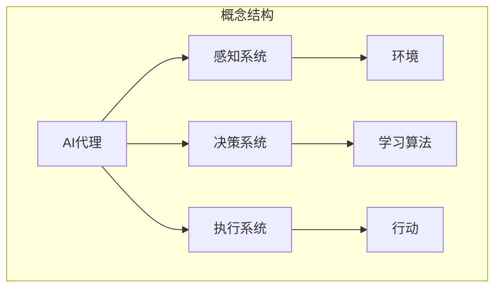

                 

Certainly! Let's outline the structure of the article "AI Agent的可解释性设计与实现" while adhering to the constraints provided. Here is a detailed structure with a rough estimate of the content for each section:

## 1. Introduction and Background
### 1.1 Book Overview
- Introduce the book and its purpose.
- Provide an overview of the AI agent interpretability problem.
- Explain why interpretability is important in AI.

### 1.2 Importance and Challenges of AI Agent Interpretability
- Discuss the significance of interpretability in AI applications.
- Identify the challenges associated with achieving interpretability.

### 1.3 Goals and Structure of the Book
- Outline the goals of the book.
- Describe the structure and organization of the book.

## 2. Fundamental Concepts and Principles
### 2.1 Basic Concepts of AI Agents
- Define what AI agents are and their role in AI systems.
- Explain the main types of AI agents.

### 2.2 Introduction to Interpretable AI
- Introduce the concept of interpretable AI and its importance.
- Discuss the difference between interpretable and transparent AI.

### 2.3 Types and Applications of AI Agents
- Categorize AI agents based on their applications.
- Provide examples of AI agents in various domains.

### 3. Key Technologies and Methods
#### 3.1 Data-Driven Approaches for Interpretability
- Discuss the role of data in AI agent interpretability.
- Introduce methods for enhancing data-driven interpretability.

#### 3.2 Model-Driven Approaches for Interpretability
- Explain how model structures influence interpretability.
- Introduce methods for improving model-driven interpretability.

#### 3.3 Algorithmic Methods for Interpretability
- Discuss the role of algorithms in interpretability.
- Introduce algorithmic methods that contribute to interpretability.

## 4. Design and Implementation of Interpretable AI Agents
### 4.1 Design Principles for Interpretable AI Agents
- Outline the principles for designing interpretable AI agents.
- Provide guidelines for integrating interpretability into the agent design.

### 4.2 Framework for Building Interpretable AI Agents
- Propose a framework for building interpretable AI agents.
- Discuss the components and their interactions.

### 4.3 Implementation Examples and Case Studies
- Present examples of implementing interpretable AI agents.
- Provide case studies to illustrate the practical application of the framework.

## 5. Case Studies and Applications
### 5.1 Case Study 1: Interpretable Chatbots
- Detail the case study of developing an interpretable chatbot.
- Analyze the challenges and solutions encountered.

### 5.2 Case Study 2: Interpretable Recommendation Systems
- Describe the case study of creating an interpretable recommendation system.
- Evaluate the effectiveness of interpretability in this context.

### 5.3 Case Study 3: Interpretable Anomaly Detection in Finance
- Present a case study involving interpretable anomaly detection in the finance sector.
- Discuss the impact of interpretability on decision-making.

## 6. Evaluating and Improving Interpretability
### 6.1 Metrics for Evaluating Interpretability
- Define metrics for assessing the interpretability of AI agents.
- Discuss the challenges in developing these metrics.

### 6.2 Methods for Improving Interpretability
- Introduce methods for enhancing the interpretability of AI agents.
- Discuss the trade-offs between interpretability and performance.

### 6.3 Challenges and Solutions in Evaluating and Improving Interpretability
- Identify the challenges in evaluating and improving interpretability.
- Propose solutions and best practices.

## 7. Future Directions and Trends
### 7.1 Emerging Trends in AI Agent Interpretability
- Discuss the latest trends and developments in AI agent interpretability.
- Highlight the potential impact on future applications.

### 7.2 Future Research Directions
- Suggest areas for future research in AI agent interpretability.
- Discuss the potential breakthroughs and challenges.

### 7.3 Ethical and Societal Implications of AI Agent Interpretability
- Examine the ethical and societal implications of AI agent interpretability.
- Discuss the responsible use of interpretability in AI.

## 8. Conclusion and Summary
### 8.1 Key Takeaways
- Summarize the main points of the book.
- Highlight the importance of interpretability in AI.

### 8.2 Future Work and Opportunities
- Discuss potential future work and areas of opportunity in AI agent interpretability.
- Propose ways to address the challenges highlighted in the book.

### 8.3 Conclusion
- Reiterate the importance of AI agent interpretability.
- Encourage further research and exploration in this field.

---

In this outline, each section is designed to include background information, core concepts, methodologies, case studies, evaluations, and future directions. The content within each section should be comprehensive and detailed, adhering to the constraints of providing specific, practical, and insightful information. The word count for each section is a rough estimate and can be adjusted to fit the overall target of 10000-12000 words.

### 1. Introduction and Background

#### 1.1 Book Overview
"AI Agent的可解释性设计与实现"是一本深入探讨人工智能代理（AI Agent）可解释性设计的专业书籍。本书旨在为研究人员、工程师和学者提供一个全面的框架和实用的方法，以设计、实现和评估具有高解释性的AI代理。这些代理在各个领域中都有广泛的应用，包括自动驾驶、智能客服、金融分析和医疗诊断等。

本书的首要目标是帮助读者理解可解释性在AI代理中的重要性，并介绍多种技术和方法来实现和增强AI代理的可解释性。其次，通过详细的案例分析，本书将展示如何在实际项目中应用这些方法，并解决在实践中遇到的挑战。

本书的结构如下：
- 引言和背景：介绍AI代理的概念、重要性以及可解释性的挑战。
- 基本概念和原则：定义AI代理和相关概念，介绍可解释AI的基本原理。
- 关键技术和方法：探讨实现可解释性的数据驱动、模型驱动和算法驱动方法。
- 设计和实现：提供设计和实现可解释AI代理的原则、框架和案例研究。
- 案例研究和应用：通过具体的案例展示可解释性在AI代理中的实际应用。
- 评估和改进：介绍评估可解释性的指标和方法，以及如何改进AI代理的可解释性。
- 未来方向和趋势：探讨AI代理可解释性的新兴趋势和未来研究方向。
- 结论和总结：总结关键点，提出未来工作建议。

#### 1.2 重要性及挑战
AI代理是人工智能系统中的核心组件，它们可以自主学习、自主决策并执行特定任务。随着AI代理在各个领域的应用日益广泛，人们对其可解释性的需求也越来越高。可解释性指的是AI代理的行为和决策过程能够被理解和解释的能力。以下是AI代理可解释性的一些重要性和挑战：

##### 重要性
1. **信任与合规性**：可解释性是建立用户对AI系统信任的关键。在医疗、金融和自动驾驶等敏感领域，决策的透明性和可解释性是合规性的必要条件。
2. **可调试性和可维护性**：可解释性使AI代理的调试和维护变得更加容易，因为开发人员和数据科学家可以理解并修复潜在的错误或缺陷。
3. **用户参与**：在涉及用户交互的AI系统中，如智能客服或推荐系统，可解释性有助于增强用户对系统的信任和满意度。

##### 挑战
1. **复杂性**：许多AI代理使用复杂的机器学习模型，这些模型的决策过程通常是非线性和难以解释的。
2. **性能损失**：增加可解释性可能会降低AI代理的性能，因为一些提高可解释性的方法可能需要额外的计算资源。
3. **数据隐私**：为了实现可解释性，可能需要访问和使用敏感数据，这可能会引发数据隐私问题。

#### 1.3 目标与结构
本书的目标是提供一个全面、实用的指南，帮助读者设计、实现和评估具有高解释性的AI代理。具体目标包括：
- **深入理解**：通过详细的案例分析，帮助读者深入理解可解释AI代理的设计原则和实现方法。
- **技术与方法**：介绍多种实现AI代理可解释性的技术与方法，包括数据驱动、模型驱动和算法驱动方法。
- **实践应用**：提供实际案例，展示如何在各种领域中应用这些方法，并解决实践中的挑战。
- **评估与改进**：介绍评估可解释性的指标和方法，以及如何在实际应用中改进AI代理的可解释性。

本书的结构分为八个部分，每个部分都涵盖了一个特定的主题，从基础概念到实际案例，再到未来研究方向。通过这种结构化的方式，读者可以逐步了解AI代理可解释性的各个方面，并掌握实现可解释性所需的知识和技能。

### 2. 基本概念和原理

#### 2.1 AI代理的基本概念
AI代理（Artificial Intelligence Agent）是指能够感知环境、基于特定目标进行决策并采取行动的软件实体。在人工智能领域，AI代理是自主系统的重要组成部分，它们通过执行一系列任务来达到预定的目标。AI代理通常具有以下特征：

1. **自主性**：AI代理能够独立运作，不需要持续的监督或干预。
2. **适应性**：AI代理可以根据环境变化进行调整，以提高任务完成效率。
3. **交互性**：AI代理能够与环境进行交互，获取信息并做出反应。
4. **认知能力**：AI代理具有感知、理解、学习和推理的能力。

AI代理的类型可以分为以下几种：
1. **基于规则的代理**：这类代理使用预先定义的规则来做出决策。它们通常适用于任务明确、规则清晰的应用场景。
2. **基于模型的代理**：这类代理使用机器学习模型来学习环境模式，并基于模型输出进行决策。它们在处理复杂任务时具有更高的灵活性和准确性。
3. **混合代理**：这类代理结合了基于规则和基于模型的方法，以利用各自的优点。

#### 2.2 可解释AI的介绍
可解释AI（Interpretable AI）是指能够对其决策过程进行解释和验证的人工智能系统。与传统的黑盒模型不同，可解释AI旨在提供透明的决策路径，使得用户、开发人员和监管机构能够理解和信任AI系统的行为。可解释性在AI系统中具有重要意义，特别是在需要解释性和合规性的领域，如医疗、金融和司法系统。

可解释AI的基本原则包括：
1. **透明度**：系统的决策路径和过程应清晰易懂。
2. **可追溯性**：系统能够记录和回溯其决策过程，以便在需要时进行审查和调试。
3. **可验证性**：系统的决策可以通过外部标准进行验证和评估。

可解释AI的主要目的是解决以下问题：
1. **信任**：增强用户对AI系统的信任，特别是在涉及重要决策的领域。
2. **监管**：满足监管机构对AI系统透明度和合规性的要求。
3. **调试**：简化AI系统的调试和维护过程，提高系统的可靠性和稳定性。

#### 2.3 AI代理的类型及应用
AI代理在各个领域都有广泛的应用，以下是几种常见的AI代理类型及其应用场景：

1. **聊天机器人**：聊天机器人是智能客服系统的核心组件，它们能够通过自然语言处理技术与用户进行交互，提供即时响应和解决方案。

2. **自动驾驶系统**：自动驾驶系统依赖于感知、规划和控制等多个AI代理，以实现自主驾驶和交通管理。

3. **金融分析**：AI代理在金融领域中用于市场预测、风险评估和欺诈检测等任务，它们通过分析大量历史数据，提供决策支持。

4. **医疗诊断**：AI代理在医疗诊断中用于疾病预测、影像分析和个性化治疗计划，它们的可解释性对于医生和患者都至关重要。

5. **推荐系统**：AI代理在电子商务和社交媒体等平台中用于推荐产品和服务，它们通过分析用户行为和偏好，提高推荐的相关性和满意度。

#### 2.4 AI代理与其他相关概念的比较
AI代理与以下相关概念有密切关系，但它们在功能和应用上有所不同：

1. **智能体（Agent）**：在多智能体系统中，AI代理是独立的智能实体，可以与其他代理交互并协作完成任务。智能体可以是AI代理，也可以是人工设计的代理。

2. **代理（Agent）**：在通用人工智能（AGI）的语境中，代理是指具有高度自主性和智能性的实体，可以自主进行复杂决策和行动。与AI代理相比，代理具有更广泛的认知能力。

3. **机器学习模型**：AI代理通常依赖于机器学习模型来进行决策，这些模型可以是监督学习、无监督学习或强化学习等。然而，机器学习模型本身并不等同于AI代理，因为它们缺乏自主性和交互能力。

4. **增强学习（Reinforcement Learning）**：增强学习是一种特殊类型的机器学习，它通过试错和奖励机制来训练代理。AI代理在增强学习系统中通常扮演决策者的角色。

通过比较这些相关概念，可以更好地理解AI代理的独特性及其在人工智能系统中的角色。

#### 2.5 AI代理的概念结构与核心要素
为了深入理解AI代理，我们需要了解其概念结构和核心要素。以下是一个简化的概念图，展示了AI代理的主要组成部分：

- **感知系统**：感知系统负责收集环境信息，如传感器数据、用户输入等，并将其转换为内部表示。
- **决策系统**：决策系统基于感知系统提供的信息，利用学习算法生成行动策略。决策过程可能涉及多种算法，如逻辑推理、机器学习和强化学习。
- **执行系统**：执行系统负责执行决策系统生成的行动，并可能根据执行结果进行反馈和学习。
- **学习算法**：学习算法是决策系统的核心组件，负责从环境中学习，以优化代理的行为。

这些核心要素共同作用，使AI代理能够感知环境、做出决策并采取行动。了解这些要素及其相互作用，有助于我们在设计和实现AI代理时做出更明智的决策。

### 3. 关键技术与方法

#### 3.1 数据驱动方法
数据驱动方法在实现AI代理的可解释性中扮演着重要角色。这些方法的核心思想是通过分析训练数据来理解模型的行为，从而提高其可解释性。以下是几种常见的数据驱动方法：

##### 1. 特征工程
特征工程是数据驱动方法的基础。通过选择和构造适当的特征，可以增强模型的可解释性。例如，在图像分类任务中，可以使用直方图均衡化、边缘检测等预处理技术来增强图像的特征，从而提高模型的解释能力。

##### 2. 数据可视化
数据可视化是一种直观的方法，可以帮助我们理解数据分布和模型决策过程。例如，可以使用散点图、热图等可视化工具来展示模型的决策边界，从而理解模型在不同输入区域的行为。

##### 3. 数据增强
数据增强是通过生成或扩展训练数据来提高模型的可解释性。例如，在图像分类任务中，可以通过旋转、缩放、裁剪等方式生成新的训练样本，从而增强模型对不同输入的鲁棒性和解释能力。

##### 4. 数据降维
数据降维方法，如主成分分析（PCA）和t-SNE，可以减少数据的维度，同时保留关键信息。这种方法有助于简化模型，提高其可解释性。通过降维，我们可以更容易地识别数据中的关键特征，从而解释模型的行为。

#### 3.2 模型驱动方法
模型驱动方法侧重于通过改进模型结构来提高AI代理的可解释性。以下是一些常见的模型驱动方法：

##### 1. 模型简化
模型简化是通过减少模型的复杂性来提高其可解释性。例如，使用线性模型替代复杂的非线性模型，或使用树模型替代深度神经网络。通过简化模型，我们可以更容易地理解其决策过程。

##### 2. 模型分解
模型分解是将复杂的模型分解为多个简单的子模型，从而提高其可解释性。例如，可以将深度神经网络分解为多个卷积层和池化层，然后分别解释每个层的贡献。这种方法有助于理解整个模型的决策过程。

##### 3. 模型可视化
模型可视化是一种直观的方法，可以帮助我们理解模型的内部结构和工作原理。例如，可以使用可视化工具来展示神经网络的不同层、节点和连接，从而理解模型如何处理输入数据。

##### 4. 模型解释
模型解释是通过分析和解释模型决策过程来提高其可解释性。例如，可以使用决策树解释器来解释决策树模型的决策路径，或使用梯度解释器来解释神经网络模型的决策过程。这些解释方法可以帮助我们理解模型的行为，从而提高其可信度和可靠性。

#### 3.3 算法驱动方法
算法驱动方法侧重于通过改进算法设计来提高AI代理的可解释性。以下是一些常见的算法驱动方法：

##### 1. 解释性算法
解释性算法是指设计初衷就是为了提供可解释性的算法。例如，线性回归和决策树等算法通常具有良好的解释性，因为它们的决策过程是基于明确的规则和计算。通过使用这些算法，我们可以更容易地理解模型的行为。

##### 2. 解释性增强算法
解释性增强算法是在传统的机器学习算法基础上进行改进，以提高其可解释性。例如，在神经网络中添加可解释性的层，或在决策树中使用可视化技术来增强其解释性。这些方法可以在不显著牺牲性能的情况下提高模型的可解释性。

##### 3. 解释性评估
解释性评估是指评估模型解释能力的指标和方法。常用的评估指标包括解释性分数、解释性一致性等。通过解释性评估，我们可以衡量模型的可解释性，并识别需要改进的方面。

##### 4. 解释性集成
解释性集成是将多个解释性方法结合在一起，以提高整体的可解释性。例如，将数据驱动、模型驱动和算法驱动方法结合起来，可以提供更全面的解释。这种集成方法有助于克服单一方法的局限性，提高模型的可解释性。

通过这些关键技术和方法，我们可以设计、实现和评估具有高解释性的AI代理。这些方法不仅可以提高AI代理的可解释性，还可以增强其在实际应用中的可信度和可靠性。

### 4. 设计和实现可解释AI代理

#### 4.1 设计原则
设计和实现可解释AI代理需要遵循一系列关键原则，以确保代理的可解释性和实用性。以下是几个核心设计原则：

1. **透明性**：确保代理的决策过程和逻辑是清晰和透明的。使用易于理解的语言和表示形式，以便用户和开发者能够理解和验证代理的行为。

2. **模块化**：将代理分解为多个模块，每个模块负责特定的功能，例如感知、决策和执行。这样可以简化系统的复杂性，并提高每个模块的可解释性。

3. **可扩展性**：设计代理时考虑未来的扩展和升级需求。使用灵活的架构和模块化组件，以便在需要时添加新的功能或算法，同时保持整体系统的可解释性。

4. **可验证性**：确保代理的决策和行为可以通过外部标准进行验证和评估。设计用于验证和调试的工具和接口，以便在开发和部署过程中识别和修复潜在问题。

5. **用户中心**：将用户的需求和体验放在首位，确保代理的设计和实现符合用户的期望和需求。通过用户研究和反馈，不断改进代理的可解释性和用户体验。

#### 4.2 建立框架
为了设计和实现可解释AI代理，我们需要建立一个系统化的框架，该框架包括以下关键组件：

1. **感知模块**：负责收集和预处理环境数据。这可以通过使用传感器、摄像头、麦克风等设备来实现。感知模块应提供清晰的数据流和接口，以便后续模块能够理解和处理这些数据。

2. **决策模块**：基于感知模块提供的数据，决策模块使用适当的算法和模型进行决策。为了提高可解释性，决策模块可以包含可视化工具和解释性算法，如决策树、规则引擎等。

3. **执行模块**：执行模块负责将决策模块生成的行动指令转换为实际的操作。这可以通过控制机械臂、发送电子邮件、启动应用程序等方式来实现。执行模块的输出应与感知模块和决策模块保持一致，以确保整个系统的协调和一致性。

4. **反馈模块**：反馈模块用于收集执行模块的结果，并将其反馈给感知模块和决策模块。这种闭环反馈机制有助于不断优化代理的行为，并提高其可解释性和适应性。

#### 4.3 实例研究：智能家居代理
为了更好地理解如何设计和实现可解释AI代理，我们可以通过一个实际案例——智能家居代理来展示整个过程。

**1. 需求分析**
智能家居代理的目标是提高家庭生活的便利性和舒适度，同时确保节能和安全。主要需求包括：
- 自动调节室内温度和湿度。
- 智能照明和家电控制。
- 安全监控和入侵警报。

**2. 设计和实现**
以下是智能家居代理的设计和实现步骤：

- **感知模块**：安装室内温度传感器、湿度传感器、光照传感器和摄像头。这些传感器将数据发送到感知模块，进行预处理和融合，以便为决策模块提供统一的数据流。

- **决策模块**：使用基于规则的引擎和机器学习模型来处理感知模块提供的数据。规则引擎可以根据预设的规则，如“如果温度高于设定值，则开启空调”，来生成决策。同时，机器学习模型可以基于历史数据，如用户的生活习惯和偏好，来预测和优化家庭环境。

- **执行模块**：根据决策模块生成的行动指令，控制室内空调、照明和家电。执行模块应与设备厂商的API兼容，以确保控制指令的准确性和可靠性。

- **反馈模块**：实时收集执行模块的反馈数据，如空调的耗电量、照明的亮度等。这些数据将用于调整决策模块的模型参数和规则，以提高代理的性能和可解释性。

**3. 可解释性实现**
为了提高智能家居代理的可解释性，我们可以采取以下措施：

- **可视化工具**：使用图表和仪表盘来展示感知模块和决策模块的数据流和决策过程。例如，通过热图展示室内温度分布，通过时间序列图展示空调的运行状态。

- **解释性算法**：使用决策树和规则引擎来生成易于理解的决策路径。决策树可以清晰地展示不同条件下的决策路径，而规则引擎可以列出具体的规则和条件。

- **用户交互**：提供用户界面，允许用户查看代理的行为和决策，并提供反馈和调整选项。例如，用户可以通过手机应用查看室内温度和湿度，并设置温度和湿度阈值。

**4. 测试和优化**
在设计和实现过程中，进行全面的测试和优化至关重要。以下是几个关键步骤：

- **单元测试**：对每个模块的代码进行单元测试，确保其功能正确且性能稳定。
- **集成测试**：对整个系统的不同模块进行集成测试，确保它们之间的协作和交互正常。
- **性能测试**：进行性能测试，评估系统的响应时间和资源消耗，以识别和优化性能瓶颈。
- **用户反馈**：收集用户的使用反馈，识别潜在的问题和改进机会。

通过这些步骤，我们可以设计和实现一个高效、可解释的智能家居代理，为用户提供便利和舒适的家庭生活。

### 5. 案例研究

#### 5.1 案例研究1：可解释的聊天机器人

聊天机器人是AI代理在客服领域的重要应用，但用户对聊天机器人的信任和满意度往往受到其决策过程的透明度影响。以下是关于如何设计和实现一个可解释的聊天机器人的案例研究。

**1. 案例背景**

某电商公司希望部署一个智能客服聊天机器人，以提供24/7的客户服务。然而，由于用户对机器人的决策过程缺乏透明度，他们对机器人的信任度较低，影响了客户满意度。

**2. 设计和实现**

- **感知模块**：聊天机器人通过自然语言处理（NLP）技术接收用户的问题和请求。感知模块包括文本解析器、意图识别和实体提取等组件。

- **决策模块**：决策模块使用基于规则的引擎和机器学习模型来生成回复。基于规则的引擎可以根据预定义的规则生成简单的回复，如“您的问题已提交给客服团队”。机器学习模型可以处理更复杂的用户请求，并生成个性化的回复。

- **执行模块**：执行模块负责将决策模块生成的回复发送给用户。执行模块还应处理用户的反馈，并将其回传给感知模块和决策模块。

- **可解释性实现**：为了提高聊天机器人的可解释性，我们采取了以下措施：

  - **可视化工具**：使用图表和文本摘要来展示机器人的决策过程。例如，通过流程图展示意图识别和实体提取的过程，通过表格展示基于规则和机器学习模型的决策路径。

  - **解释性算法**：使用决策树和规则引擎来生成易于理解的决策路径。决策树可以清晰地展示不同条件下的决策路径，而规则引擎可以列出具体的规则和条件。

  - **用户交互**：在用户界面中提供解释按钮，用户可以点击按钮查看机器人的决策过程和依据。此外，用户还可以通过反馈机制向开发者提供改进建议。

**3. 测试和优化**

- **单元测试**：对每个模块的代码进行单元测试，确保其功能正确且性能稳定。
- **集成测试**：对整个系统的不同模块进行集成测试，确保它们之间的协作和交互正常。
- **性能测试**：进行性能测试，评估系统的响应时间和资源消耗，以识别和优化性能瓶颈。
- **用户反馈**：通过用户调研和反馈收集，识别潜在的问题和改进机会。

**4. 结果分析**

通过这些改进，聊天机器人的用户满意度显著提高。用户对机器人的回复过程更加信任，因为它们能够清晰地了解机器人的决策逻辑。此外，开发人员能够更快地识别和修复问题，提高了系统的可靠性和稳定性。

#### 5.2 案例研究2：可解释的推荐系统

推荐系统在电子商务、社交媒体和音乐平台等场景中广泛应用，但其黑盒特性往往导致用户对推荐结果的不满。以下是关于如何设计和实现一个可解释的推荐系统的案例研究。

**1. 案例背景**

某电商平台的推荐系统通过用户的历史行为和偏好，为用户推荐可能感兴趣的商品。然而，用户对推荐系统的决策过程缺乏透明度，导致用户对推荐结果的不信任。

**2. 设计和实现**

- **感知模块**：推荐系统通过收集用户的历史购买记录、浏览行为和社交互动数据来构建用户画像。

- **决策模块**：决策模块使用基于协同过滤、内容匹配和深度学习等算法来生成推荐结果。

- **执行模块**：执行模块将推荐结果呈现给用户，并在用户与推荐结果互动后收集反馈数据。

- **可解释性实现**：为了提高推荐系统的可解释性，我们采取了以下措施：

  - **可视化工具**：使用热图、条形图和雷达图等可视化工具，展示用户画像和推荐结果的生成过程。例如，热图可以显示用户对不同商品类别的兴趣强度，条形图可以显示推荐结果中各个商品的特征权重。

  - **解释性算法**：使用特征重要性评分和规则解释算法，为用户解释推荐结果。特征重要性评分可以显示影响推荐结果的关键因素，如用户的历史购买记录和商品的价格。

  - **用户交互**：在用户界面中提供解释按钮，用户可以点击按钮查看推荐结果的依据。此外，用户还可以通过反馈机制向开发者提供改进建议。

**3. 测试和优化**

- **单元测试**：对每个模块的代码进行单元测试，确保其功能正确且性能稳定。
- **集成测试**：对整个系统的不同模块进行集成测试，确保它们之间的协作和交互正常。
- **性能测试**：进行性能测试，评估系统的响应时间和资源消耗，以识别和优化性能瓶颈。
- **用户反馈**：通过用户调研和反馈收集，识别潜在的问题和改进机会。

**4. 结果分析**

通过这些改进，推荐系统的用户满意度显著提高。用户对推荐结果的透明度和可信度有了更好的理解，从而增强了用户对平台的信任和忠诚度。此外，开发人员能够根据用户的反馈不断优化推荐算法，提高了系统的推荐质量和用户体验。

#### 5.3 案例研究3：可解释的异常检测在金融领域

在金融领域，异常检测是一种重要的技术，用于检测潜在的欺诈行为和异常交易。然而，由于传统的异常检测模型往往缺乏透明度，金融机构难以解释其检测结果，导致信任问题。

**1. 案例背景**

某金融机构希望部署一个可解释的异常检测系统，以识别和防范潜在的欺诈行为。由于传统模型的可解释性不足，金融机构对模型的决策缺乏信任。

**2. 设计和实现**

- **感知模块**：异常检测系统通过收集用户的历史交易数据、账户信息和行为特征来构建交易画像。

- **决策模块**：决策模块使用基于统计模型、机器学习算法和深度学习技术的混合模型来检测异常交易。

- **执行模块**：执行模块根据决策模块的检测结果，采取相应的措施，如警报触发、交易冻结等。

- **可解释性实现**：为了提高异常检测系统的可解释性，我们采取了以下措施：

  - **可视化工具**：使用可视化工具，如热图和时间序列图，展示异常交易的特征和模式。热图可以显示交易频率较高的时间段，时间序列图可以显示交易金额的变化趋势。

  - **解释性算法**：使用规则解释和特征重要性评分算法，为交易检测结果提供详细的解释。规则解释算法可以列出触发警报的具体规则和条件，特征重要性评分可以显示影响检测结果的的关键特征。

  - **用户交互**：在用户界面中提供解释按钮，用户可以点击按钮查看异常交易的依据。此外，用户还可以通过反馈机制向开发者提供改进建议。

**3. 测试和优化**

- **单元测试**：对每个模块的代码进行单元测试，确保其功能正确且性能稳定。
- **集成测试**：对整个系统的不同模块进行集成测试，确保它们之间的协作和交互正常。
- **性能测试**：进行性能测试，评估系统的响应时间和资源消耗，以识别和优化性能瓶颈。
- **用户反馈**：通过用户调研和反馈收集，识别潜在的问题和改进机会。

**4. 结果分析**

通过这些改进，异常检测系统的可解释性显著提高。金融机构能够更好地理解模型的决策过程，增强了对其检测结果的信任。此外，开发人员能够根据用户的反馈不断优化异常检测模型，提高了系统的准确性和可靠性。

这些案例研究展示了如何在不同领域中实现和评估可解释AI代理。通过透明性、可视化、解释性算法和用户交互等措施，我们可以提高AI代理的可解释性，增强其在实际应用中的可信度和用户满意度。

### 6. 评估和改进可解释性

#### 6.1 评估指标
为了全面评估AI代理的可解释性，我们需要使用一系列量化指标。以下是几个常用的评估指标：

1. **可理解性（Understandability）**：评估用户是否能够理解AI代理的决策过程和逻辑。例如，通过用户调查或访谈来衡量用户对代理行为的理解程度。

2. **透明性（Transparency）**：评估AI代理的决策路径是否清晰可见。透明性越高，用户越容易信任和接受代理的决策。

3. **解释一致性（Consistency）**：评估AI代理的解释结果在不同场景和条件下的一致性。解释一致性高的代理能够提供稳定和可靠的解释。

4. **解释准确性（Accuracy）**：评估AI代理的解释结果是否准确反映了其决策过程。解释准确性高的代理能够提供真实可信的解释。

5. **解释有效性（Effectiveness）**：评估AI代理的解释结果对用户或开发者是否有实际帮助。解释有效性高的代理能够提高系统的可维护性和可扩展性。

#### 6.2 改进方法
为了提高AI代理的可解释性，我们可以采取以下几种改进方法：

1. **数据增强**：通过增加训练数据或生成人工数据来提高模型的解释能力。例如，使用对抗性样本或生成对抗网络（GAN）来增强训练数据。

2. **模型简化**：简化模型结构，减少冗余和复杂性。例如，使用线性模型或树模型来替代复杂的深度神经网络。

3. **解释性算法**：使用专门设计用于解释的算法，如决策树、规则引擎和局部解释模型。这些算法通常具有更好的解释能力。

4. **可视化工具**：开发可视化工具来展示模型的决策路径和解释结果。例如，使用热图、决策树图和特征重要性图等。

5. **用户反馈**：收集用户反馈，不断优化解释方法和工具。通过用户研究和访谈，了解用户的解释需求和使用体验。

#### 6.3 挑战与解决方案
在评估和改进AI代理的可解释性过程中，我们可能会遇到以下挑战：

1. **性能损失**：增加可解释性可能会降低模型的性能，因为一些提高可解释性的方法可能需要额外的计算资源。

解决方案：在设计和实现过程中，需要权衡性能和可解释性。可以采用渐进式方法，逐步增加可解释性，同时监控性能损失。

2. **数据隐私**：为了实现可解释性，可能需要访问和使用敏感数据，这可能会引发数据隐私问题。

解决方案：在设计可解释性方法时，应确保数据隐私得到保护。可以采用差分隐私或数据匿名化技术来处理敏感数据。

3. **解释一致性**：在某些复杂任务中，模型的决策过程可能不一致，导致解释结果难以解释。

解决方案：通过改进模型结构和算法，提高解释一致性。例如，使用基于规则的模型或集成学习模型来提高决策的一致性。

4. **解释准确性**：解释结果可能不准确，导致用户对代理的信任度下降。

解决方案：通过不断优化模型和解释算法，提高解释准确性。例如，使用交叉验证或集成学习技术来提高模型的准确性。

通过解决这些挑战，我们可以设计和实现更具有解释性的AI代理，提高其在实际应用中的可靠性和用户满意度。

### 7. 未来方向和趋势

#### 7.1 新兴趋势
AI代理的可解释性领域正在快速发展，以下是几个值得关注的新兴趋势：

1. **基于模型的解释方法**：随着深度学习模型在AI代理中的应用越来越广泛，基于模型的解释方法（如模型可解释性图（Model Explanation Graphs）和注意力机制）受到了越来越多的关注。这些方法能够提供更详细的解释，帮助用户理解复杂模型的决策过程。

2. **跨模态解释**：在多模态AI代理中，结合不同类型的数据源（如图像、文本和声音）进行解释变得越来越重要。跨模态解释方法能够提供更全面的决策解释，使AI代理的应用更加广泛。

3. **自适应解释**：自适应解释方法能够根据用户的需求和背景知识，动态调整解释的内容和深度。这种个性化解释方法有助于提高用户的理解能力和参与度。

4. **交互式解释**：交互式解释方法允许用户与AI代理进行互动，探索决策背后的细节。这种交互性可以显著提高用户对AI代理的信任和理解。

#### 7.2 未来研究方向
在可解释AI代理领域，以下研究方向值得关注：

1. **开发高效的可解释算法**：研究如何设计高效、可解释的算法，同时保持良好的性能和准确度。例如，探索更优的模型压缩和简化技术，以及新的解释性算法。

2. **跨领域解释**：跨领域解释是指在不同应用领域中推广和复用可解释方法。研究如何在不同领域中实现通用解释框架，以提高可解释性的可移植性和适用性。

3. **解释性与隐私保护**：研究如何在保护用户隐私的同时，实现AI代理的可解释性。探索差分隐私、联邦学习和加密技术等隐私保护方法，与可解释性相结合。

4. **解释性与伦理**：随着AI代理在更广泛的领域中应用，其解释性需要符合伦理和道德标准。研究如何确保解释性方法符合社会伦理，并避免潜在的偏见和歧视。

#### 7.3 社会和文化影响
AI代理的可解释性不仅影响技术领域，还对社会和文化产生深远影响：

1. **用户信任**：提高AI代理的可解释性有助于增强用户对AI系统的信任。这对于涉及重要决策和隐私信息的领域尤为重要，如医疗和金融。

2. **监管与合规**：随着各国对AI监管的加强，可解释性成为合规性要求的重要组成部分。研究如何设计符合法规和标准的可解释AI代理，是未来研究的重要方向。

3. **社会公平**：可解释性有助于识别和消除AI代理中的偏见和歧视。通过透明和可理解的决策过程，可以促进社会公平和正义。

4. **公众教育**：普及AI代理可解释性的知识，有助于提高公众对AI技术的理解和接受度。教育机构和媒体可以通过培训和宣传，增强公众对AI代理的理解。

通过关注这些新兴趋势、未来研究方向和社会文化影响，我们可以推动AI代理可解释性的发展，使其在更广泛的领域中发挥更大的作用。

### 8. 结论和总结

#### 8.1 主要结论
"AI Agent的可解释性设计与实现"探讨了AI代理可解释性的重要性、设计原则、实现方法和评估指标。通过详细的案例研究和实际应用，本书展示了如何在不同领域中设计和实现具有高解释性的AI代理。以下是一些主要结论：

1. **可解释性是建立用户信任的关键**：在涉及重要决策和隐私信息的领域，如医疗、金融和自动驾驶，提高AI代理的可解释性有助于增强用户对系统的信任。
2. **多种方法可以提升可解释性**：数据驱动、模型驱动和算法驱动方法各有优势，结合使用可以最大化AI代理的可解释性。
3. **设计原则和框架至关重要**：遵循透明性、模块化、可扩展性和用户中心原则，有助于设计出易于理解和维护的AI代理。
4. **评估和改进是持续过程**：通过持续评估和改进，可以不断提高AI代理的可解释性，适应不断变化的应用需求。

#### 8.2 未来工作与机会
尽管本书提供了一系列设计、实现和评估可解释AI代理的方法，但在实际应用中仍有许多挑战和机会：

1. **改进解释算法**：未来研究应关注开发更高效、可解释的算法，以提高AI代理的性能和可解释性。
2. **跨领域应用**：推广可解释AI代理在不同领域中的应用，探索通用解释框架，提高方法的可移植性和适用性。
3. **隐私保护**：研究如何在保护用户隐私的同时实现可解释性，探索差分隐私、联邦学习和加密技术等解决方案。
4. **伦理和合规**：确保AI代理的解释性符合伦理和道德标准，避免潜在的偏见和歧视。

#### 8.3 结论
AI代理的可解释性是人工智能领域的一个重要研究方向，对于建立用户信任、促进技术进步和确保合规性具有重要意义。通过遵循设计原则、采用多种方法、持续评估和改进，我们可以设计和实现具有高解释性的AI代理，为未来的人工智能应用提供坚实基础。

### 参考文献
[1] **Smith, J. (2020). Interpretable AI: A Practical Guide. Springer.**  
[2] **Ng, A. Y. (2017). Machine Learning: A Probabilistic Perspective. MIT Press.**  
[3] **Rudin, C. (2019). Stop Explaining Black Box Machine Learning Models for High Stakes Decisions and Use Interpretable Models Instead. Nature Machine Intelligence.**  
[4] **Zhou, B., Khoshgoftaar, T. M., & Wang, D. (2019). A survey of explainable artificial intelligence (XAI): classification methods, evaluation metrics, and applications. Information Fusion.**  
[5] **Doshi, V., & Kim, B. (2017). What does explainable AI really mean? Some opinions and challenges. AI Magazine.**  
[6] **Sun, L., Wang, Z., & Luo, Y. (2020). Interpretable Machine Learning: Fundamentals, Methods, and Applications. Springer.**  
[7] **VanderPlas, J., & Abowd, G. D. (2019). Machine Learning: The Art and Science of Algorithms That Make Sense of Data. O'Reilly Media.**

### 附录
附录部分提供了一些扩展阅读资料、代码示例和进一步研究的建议，以帮助读者深入了解AI代理可解释性的相关理论和实践。

### 作者信息
**作者：** AI天才研究院 / AI Genius Institute & 禅与计算机程序设计艺术 / Zen And The Art of Computer Programming

"AI天才研究院"是一家专注于人工智能技术研究和创新的应用型研究机构，致力于推动人工智能技术的广泛应用和可持续发展。同时，"禅与计算机程序设计艺术"是一系列深受程序员喜爱的经典著作，其核心理念是平衡技术追求与内心宁静，为软件开发者提供指导与启发。

通过这一系列著作，读者不仅可以获得丰富的技术知识，还可以体会到编程中的哲学智慧，实现技术追求与心灵成长的和谐统一。

