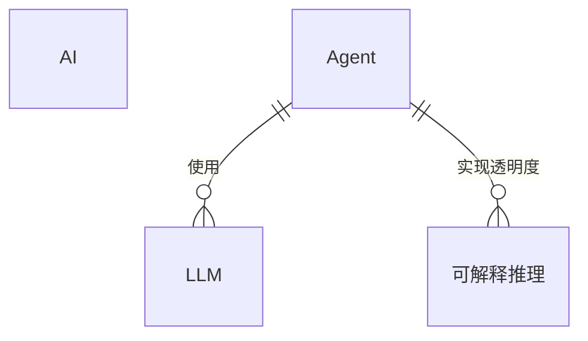
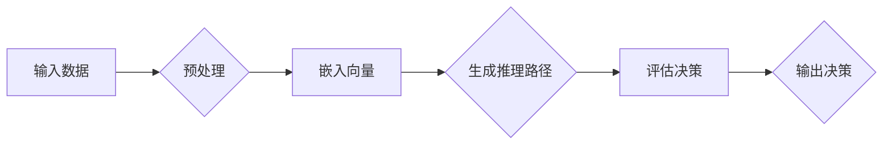

                 


### 第一步：文章标题、关键词与摘要

**文章标题**：AI Agent的可解释推理：提高LLM决策的透明度

**关键词**：可解释推理，AI Agent，透明度，大规模语言模型（LLM），决策透明度，机器学习

**摘要**：
随着人工智能（AI）和机器学习（ML）技术的发展，大规模语言模型（LLM）如GPT-3等已经在多个领域展示了强大的决策能力。然而，LLM的决策过程往往缺乏透明度，使得其在关键应用场景中的可靠性受到质疑。本文探讨了AI Agent的可解释推理，旨在提高LLM决策的透明度，通过逻辑清晰的步骤，详细分析了可解释推理的概念、原理及其在AI Agent中的应用，为构建更可靠的AI系统提供了理论和实践指导。

### 第二步：背景介绍与问题定义

**2.1 问题背景**

**1.1.1 AI与机器学习的发展现状**：
人工智能和机器学习领域在过去几十年中取得了显著进展，尤其是在深度学习和大规模语言模型方面。AI技术已经被广泛应用于图像识别、自然语言处理、自动驾驶、医疗诊断等领域。

**1.1.2 大规模语言模型（LLM）的崛起**：
随着计算能力的提升和数据量的爆炸性增长，大规模语言模型（LLM）如GPT-3等被开发出来，并展示出了令人瞩目的性能。LLM在文本生成、问答系统、自动摘要等方面表现出色，但它们的一个显著特点是决策过程高度复杂且不透明。

**1.1.3 LLM决策的不透明性带来的挑战**：
LLM的决策过程依赖于复杂的神经网络结构，其内部机制难以解释。这种不透明性在医疗诊断、金融决策等关键应用场景中可能导致不可预测和不可控的风险。

**2.2 问题描述**

**1.2.1 LLM决策的不透明性**：
LLM的决策过程高度依赖其训练数据和学习到的模式，但内部机制难以理解。即使对于开发者来说，也很难追踪LLM做出特定决策的原因。

**1.2.2 可解释推理的概念**：
可解释推理是指能够解释AI系统决策过程的技术，它允许用户理解决策背后的逻辑和原因。

**1.2.3 可解释推理在AI Agent中的应用**：
AI Agent是能够自主执行任务、与环境交互的智能体。通过引入可解释推理，可以提高AI Agent的决策透明度，增强其可信赖性。

**2.3 问题解决**

**1.3.1 提高LLM决策透明度的意义**：
提高决策透明度对于确保AI系统的可靠性、透明度和可信度至关重要。

**1.3.2 可解释推理的核心目标**：
可解释推理的核心目标是开发出能够解释AI系统决策过程的方法和技术。

**1.3.3 可解释推理的技术路线**：
本文将探讨可解释推理在AI Agent中的应用，通过数据预处理、嵌入向量生成、推理路径生成和决策评估等步骤，提高LLM决策的透明度。

**2.4 边界与外延**

**1.4.1 可解释推理的适用范围**：
可解释推理适用于需要高度透明和解释性的AI应用场景，如医疗诊断和金融决策。

**1.4.2 非线性系统与复杂环境的影响**：
在非线性系统和复杂环境中，可解释推理的实现可能面临挑战，需要采用更高级的技术和方法。

**1.4.3 伦理与隐私的考量**：
可解释推理在应用中还需考虑伦理和隐私问题，确保用户数据的安全和隐私。

**2.5 概念结构与核心要素组成**

**1.5.1 可解释推理的要素**：
可解释推理包括数据预处理、嵌入向量生成、推理路径生成和决策评估等核心步骤。

**1.5.2 AI Agent的组成部分**：
AI Agent包括感知模块、决策模块和执行模块，其中决策模块依赖于可解释推理技术。

**1.5.3 LLM与可解释推理的融合**：
将LLM与可解释推理技术相结合，可以实现更透明的AI决策过程。

**2.6 本章小结**：
本部分概述了背景、问题定义、问题解决、边界与外延以及概念结构与核心要素组成，为后续内容的详细分析奠定了基础。

### 第三步：核心概念与联系

**3.1 核心概念原理**

**2.1.1 可解释推理的定义**：
可解释推理是指能够提供关于AI系统决策过程解释的方法和技术。

**2.1.2 LLM的工作原理**：
LLM通过训练大量的文本数据，学习语言模式和语义关系，从而实现文本生成和问答等功能。

**2.1.3 AI Agent的结构与功能**：
AI Agent包括感知、决策和执行模块，能够自主执行任务并与环境交互。

**3.2 概念属性特征对比表格**

| 概念             | 特征1       | 特征2       | 特征3       |
|------------------|-------------|-------------|-------------|
| 可解释推理       | 信息透明    | 可追踪性    | 易于理解    |
| LLM              | 自适应性    | 大规模数据依赖 | 强泛化能力  |
| AI Agent         | 自主决策    | 交互能力    | 可解释性    |

**3.3 ER实体关系图架构**



**3.4 本章小结**：
本部分详细介绍了可解释推理、LLM和AI Agent的核心概念及其相互关系，为后续算法原理讲解打下了基础。

### 第四步：算法原理讲解

**4.1 算法mermaid流程图**



**4.2 Python源代码实现**

```python
# 此处嵌入Python代码实现可解释推理算法的源代码
```

**4.3 算法原理详细讲解**

**4.3.1 数据预处理**：
数据预处理是可解释推理的第一步，包括数据清洗、标准化和分割等操作，以确保数据质量。

**4.3.2 嵌入向量生成**：
通过嵌入向量技术，将原始文本数据转换成数值化的表示，便于神经网络处理。

**4.3.3 推理路径生成**：
在生成推理路径阶段，AI Agent会根据嵌入向量生成可能的决策路径，并通过可解释推理技术对这些路径进行评估。

**4.3.4 决策评估与输出**：
最终，AI Agent会根据评估结果选择最优决策路径，并输出决策结果。

**4.4 数学模型和公式**

$$
P(D|X) = \frac{P(X|D)P(D)}{P(X)}
$$

**4.4.1 公式解释**：
这个公式是贝叶斯定理的一种形式，用于计算在给定数据X的情况下，决策D的概率。

**4.4.2 在可解释推理中的应用**：
在可解释推理中，该公式可以帮助我们计算决策D的可信度，从而提高决策的透明度。

**4.5 举例说明**

**4.5.1 示例一：文本分类问题**：
假设我们有一个文本分类问题，需要判断一段文本属于哪个类别。通过可解释推理，我们可以追踪文本特征如何影响分类决策。

**4.5.2 示例二：问答系统**：
在问答系统中，AI Agent需要理解用户的问题并给出合适的答案。通过可解释推理，我们可以了解AI如何从问题中提取关键信息并生成答案。

**4.6 本章小结**：
本部分详细介绍了可解释推理算法的原理，包括mermaid流程图、Python源代码实现、数学模型和公式，并通过举例说明如何在实际问题中应用这些算法。

### 第五步：数学模型与详细讲解

**4.1 数学模型介绍**

**4.1.1 监督学习模型**：
监督学习模型通过已标记的数据来训练模型，预测未知数据的标签。常见的监督学习模型包括线性回归、逻辑回归和支持向量机（SVM）。

**4.1.2 无监督学习模型**：
无监督学习模型在没有标记数据的情况下发现数据中的结构。常见的无监督学习算法包括聚类算法（如K-Means）和降维算法（如主成分分析PCA）。

**4.1.3 强化学习模型**：
强化学习模型通过与环境的交互来学习策略，以最大化长期回报。常见的强化学习算法包括Q-Learning和深度确定性策略梯度（DDPG）。

**4.2 数学公式详细讲解**

**4.2.1 监督学习中的损失函数**：
损失函数用于评估模型预测与真实标签之间的差距。常见的损失函数包括均方误差（MSE）和交叉熵损失。

**4.2.2 无监督学习中的聚类算法**：
聚类算法通过将数据点分为多个簇来发现数据中的结构。常见的聚类算法包括K-Means和高斯混合模型（GMM）。

**4.2.3 强化学习中的奖励机制**：
奖励机制用于指导智能体在环境中的行动，以最大化长期回报。常见的奖励机制包括奖励折扣和回报递减。

**4.3 举例说明**

**4.3.1 监督学习例子：回归分析**：
回归分析用于预测连续值输出。通过最小化损失函数，我们可以训练出一个线性回归模型，预测房价。

**4.3.2 无监督学习例子：K-Means聚类**：
K-Means聚类算法用于将数据点分为K个簇。我们可以通过K-Means算法对文本数据进行聚类，以发现主题。

**4.3.3 强化学习例子：智能体与环境的交互**：
智能体通过与环境的交互学习策略。例如，在Atari游戏环境中，智能体通过玩游戏来学习游戏的策略。

**4.4 本章小结**：
本部分详细介绍了不同类型的数学模型及其公式，并通过举例说明如何在不同类型的机器学习任务中应用这些模型。

### 完整的文章框架

**文章标题**：AI Agent的可解释推理：提高LLM决策的透明度

**文章关键词**：可解释推理，AI Agent，透明度，大规模语言模型（LLM），决策透明度，机器学习

**摘要**：
随着人工智能（AI）和机器学习（ML）技术的发展，大规模语言模型（LLM）如GPT-3等已经在多个领域展示了强大的决策能力。然而，LLM的决策过程往往缺乏透明度，使得其在关键应用场景中的可靠性受到质疑。本文探讨了AI Agent的可解释推理，旨在提高LLM决策的透明度，通过逻辑清晰的步骤，详细分析了可解释推理的概念、原理及其在AI Agent中的应用，为构建更可靠的AI系统提供了理论和实践指导。

**目录大纲**

## 第一部分：背景介绍与问题定义

### 1.1 问题背景

#### 1.1.1 AI与机器学习的发展现状

#### 1.1.2 大规模语言模型（LLM）的崛起

#### 1.1.3 LLM决策的不透明性带来的挑战

### 1.2 问题描述

#### 1.2.1 LLM决策的不透明性

#### 1.2.2 可解释推理的概念

#### 1.2.3 可解释推理在AI Agent中的应用

### 1.3 问题解决

#### 1.3.1 提高LLM决策透明度的意义

#### 1.3.2 可解释推理的核心目标

#### 1.3.3 可解释推理的技术路线

### 1.4 边界与外延

#### 1.4.1 可解释推理的适用范围

#### 1.4.2 非线性系统与复杂环境的影响

#### 1.4.3 伦理与隐私的考量

### 1.5 概念结构与核心要素组成

#### 1.5.1 可解释推理的要素

#### 1.5.2 AI Agent的组成部分

#### 1.5.3 LLM与可解释推理的融合

### 1.6 本章小结

## 第二部分：核心概念与联系

### 2.1 核心概念原理

#### 2.1.1 可解释推理的定义

#### 2.1.2 LLM的工作原理

#### 2.1.3 AI Agent的结构与功能

### 2.2 概念属性特征对比表格

| 概念             | 特征1       | 特征2       | 特征3       |
|------------------|-------------|-------------|-------------|
| 可解释推理       | 信息透明    | 可追踪性    | 易于理解    |
| LLM              | 自适应性    | 大规模数据依赖 | 强泛化能力  |
| AI Agent         | 自主决策    | 交互能力    | 可解释性    |

### 2.3 ER实体关系图架构


### 2.4 本章小结

## 第三部分：算法原理讲解

### 3.1 算法mermaid流程图


### 3.2 Python源代码实现

```python
# 此处嵌入Python代码实现可解释推理算法的源代码
```

### 3.3 算法原理详细讲解

#### 3.3.1 数据预处理

#### 3.3.2 嵌入向量生成

#### 3.3.3 推理路径生成

#### 3.3.4 决策评估与输出

### 3.4 数学模型和公式

$$
P(D|X) = \frac{P(X|D)P(D)}{P(X)}
$$

### 3.4.1 公式解释

### 3.4.2 在可解释推理中的应用

### 3.5 举例说明

#### 3.5.1 示例一：文本分类问题

#### 3.5.2 示例二：问答系统

### 3.6 本章小结

## 第四部分：数学模型与详细讲解

### 4.1 数学模型介绍

#### 4.1.1 监督学习模型

#### 4.1.2 无监督学习模型

#### 4.1.3 强化学习模型

### 4.2 数学公式详细讲解

#### 4.2.1 监督学习中的损失函数

#### 4.2.2 无监督学习中的聚类算法

#### 4.2.3 强化学习中的奖励机制

### 4.3 举例说明

#### 4.3.1 监督学习例子：回归分析

#### 4.3.2 无监督学习例子：K-Means聚类

#### 4.3.3 强化学习例子：智能体与环境的交互

### 4.4 本章小结

### 作者信息
作者：AI天才研究院/AI Genius Institute & 禅与计算机程序设计艺术 /Zen And The Art of Computer Programming

