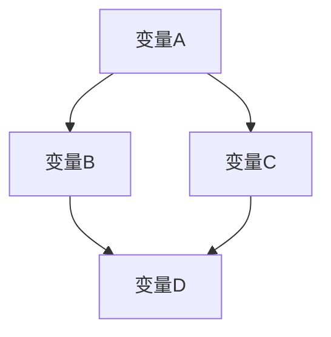
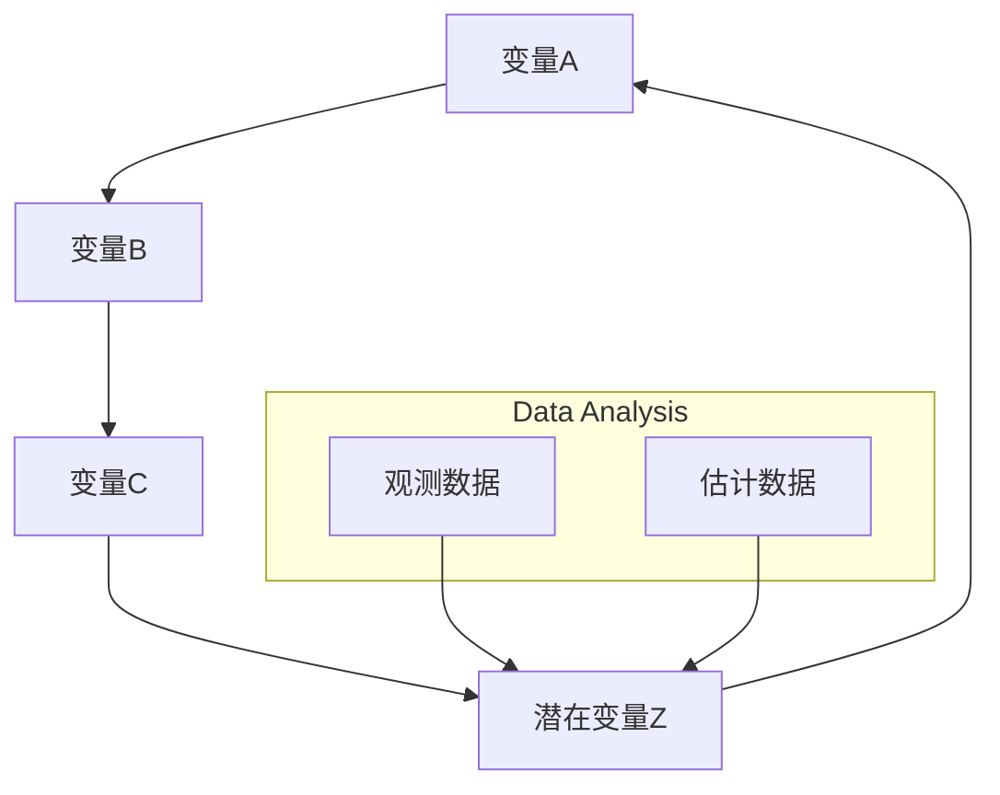
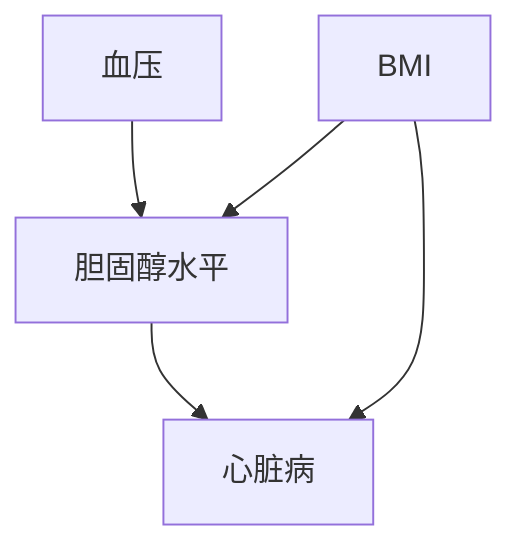
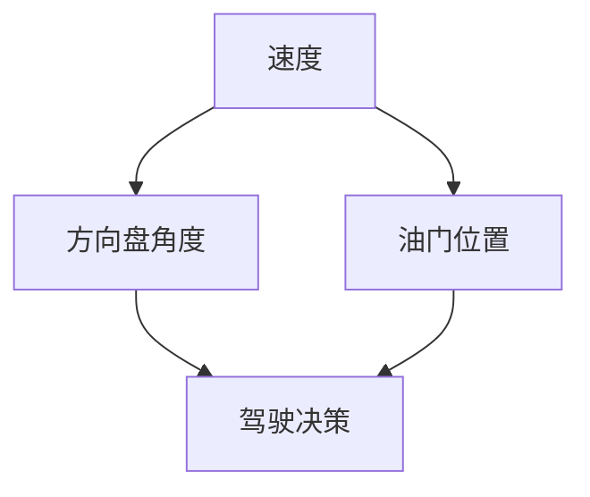
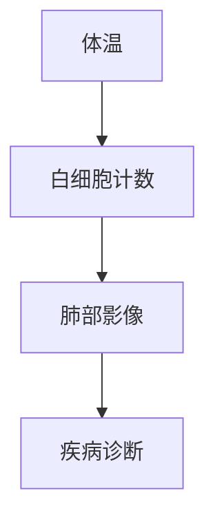

                 

# AI Agent的因果推理：增强决策能力

> 关键词：AI Agent，因果推理，决策能力，人工智能，自主行动

> 摘要：本文将探讨AI Agent的因果推理能力，分析其在决策中的重要性。通过介绍因果推理的基本原理和实际应用，本文将揭示如何利用因果推理增强AI Agent的决策能力，从而提高其在复杂环境中的表现。

----------------------------------------------------------------

### 第一部分：AI Agent的因果推理背景

#### 第1章：AI Agent因果推理的概念与意义

##### 1.1 问题背景

在人工智能领域，AI Agent作为自主行动的智能体，其在各种环境中的决策能力至关重要。因果推理作为一种重要的认知能力，使得AI Agent能够从数据中发掘因果关系，从而做出更加合理和有效的决策。然而，传统的机器学习方法往往侧重于统计学上的关联性，而忽略了因果关系的本质。

##### 1.2 问题描述

因果推理在AI Agent中的应用面临许多挑战，如因果关系的复杂性、数据缺失和噪声等。这些问题导致AI Agent在实际应用中难以获得准确的因果结论，从而影响其决策质量。

##### 1.3 问题解决

为了解决这些问题，本书将从理论层面和实际应用出发，系统性地介绍AI Agent因果推理的基本原理、方法和技术，并探讨其在各种场景下的应用潜力。

##### 1.4 边界与外延

本书将聚焦于因果推理在AI Agent中的应用，但所讨论的方法和技术具有广泛的适用性，不仅限于特定的应用领域，还可以为其他人工智能领域提供有益的参考。

##### 1.5 核心概念与联系

- **因果推理**：指从数据中推断出因果关系的过程。
- **AI Agent**：具有自主行动能力的智能体。
- **关联性**：描述数据之间相互依赖程度的概念，不同于因果关系。
- **因果模型**：用于表示因果关系的数学模型。

##### 表1-1 AI Agent因果推理核心概念对比

| 概念           | 定义                                                         | 关联性                             | 因果关系                            |
|----------------|------------------------------------------------------------|----------------------------------|-----------------------------------|
| 关联性         | 数据之间的相互依赖程度                                     | 描述了数据之间的关系，但无法揭示因果关系 | 数据之间的关系可能有多种原因       |
| 因果关系       | 一个事件引起另一个事件的现象                               | 描述了事件之间的因果关系           | 表示事件之间的因果关系具有因果关系 |
| 因果模型       | 用于表示因果关系的数学模型                                 | 帮助我们理解数据之间的因果关系     | 可以帮助我们推断因果关系           |

##### 1.6 本章小结

本章为后续章节奠定了基础，介绍了AI Agent因果推理的背景、问题和解决思路。通过理解因果推理的核心概念，读者将更好地掌握后续内容。

----------------------------------------------------------------

### 第二部分：因果推理基础

#### 第2章：因果推理的基本原理

##### 2.1 因果推理的基本概念

因果推理是指从数据中推断出因果关系的过程。为了深入理解因果推理，我们需要了解以下几个基本概念：

- **因果模型**：用于表示因果关系的数学模型。
- **因果图**：一种图形化表示因果关系的工具。
- **潜在变量**：与因果关系相关的潜在变量。

##### 2.2 因果模型的构建

因果模型的构建是因果推理的关键步骤。本节将介绍几种常见的因果模型：

- **结构方程模型（SEM）**：一种基于线性回归的因果模型。
- **因果图模型**：一种图形化表示因果关系的模型。
- **潜在结果模型（Potential Outcomes Model）**：一种基于概率的因果模型。

##### 2.3 因果图的构建与应用

因果图是一种图形化表示因果关系的工具，它可以帮助我们直观地理解数据之间的因果关系。本节将介绍如何构建因果图，并探讨其在实际应用中的价值。

##### 2.4 潜在变量的识别与估计

潜在变量是因果推理中的重要概念，它对于理解因果关系至关重要。本节将介绍如何识别和估计潜在变量，以及如何利用潜在变量来提高因果推理的准确性。

----------------------------------------------------------------

### 第三部分：AI Agent因果推理的应用

#### 第3章：AI Agent因果推理在决策中的重要性

##### 3.1 AI Agent决策中的挑战

在决策过程中，AI Agent常常面临复杂的环境和不确定性。传统的方法往往依赖于统计模型，但统计模型仅能揭示数据之间的关联性，而无法提供关于因果关系的明确信息。这使得AI Agent在处理决策时可能缺乏合理性和准确性。

##### 3.2 因果推理在决策中的作用

因果推理在AI Agent的决策中发挥着关键作用。通过因果推理，AI Agent能够识别和理解不同因素之间的因果关系，从而做出更加合理和有效的决策。例如，在推荐系统中，因果推理可以帮助识别哪些因素对用户行为产生了直接影响，从而优化推荐结果。

##### 3.3 提高决策能力的因果推理方法

为了提高AI Agent的决策能力，我们可以采用以下几种因果推理方法：

- **因果图模型**：通过构建因果图来表示变量之间的关系，从而进行因果推断。
- **潜在结果模型**：利用潜在结果的概念来估计变量之间的因果关系。
- **结构方程模型**：通过建立结构方程来描述变量之间的因果关系，并进行参数估计。

##### 3.4 实际应用案例分析

在本章的最后一部分，我们将通过一个实际应用案例来展示如何利用因果推理来提高AI Agent的决策能力。该案例将涉及一个在线广告投放系统，我们将分析如何利用因果推理来优化广告投放策略，提高广告效果。

----------------------------------------------------------------

### 第四部分：AI Agent因果推理的技术实现

#### 第4章：AI Agent因果推理算法介绍

##### 4.1 算法概述

在本章中，我们将介绍几种常见的AI Agent因果推理算法，包括：

- **基于因果图的算法**：利用因果图来表示变量之间的关系，并基于因果图进行因果推断。
- **基于潜在结果的算法**：利用潜在结果的概念来估计变量之间的因果关系。
- **基于结构方程的算法**：通过建立结构方程来描述变量之间的因果关系，并进行参数估计。

##### 4.2 算法原理详解

在本节中，我们将详细讲解每种算法的原理，并使用Python代码进行示例。

1. **基于因果图的算法**

   因果图算法利用因果图来表示变量之间的关系。因果图由节点和边组成，节点表示变量，边表示变量之间的因果关系。算法的核心思想是通过观察变量的联合分布来推断出变量之间的因果关系。

   ```python
   import numpy as np
   import matplotlib.pyplot as plt
   
   # 示例：构建一个简单的因果图
   variables = ['A', 'B', 'C']
   edges = [('A', 'B'), ('A', 'C'), ('B', 'C')]
   causal_graph = CausalGraph(variables, edges)
   
   # 绘制因果图
   plt.figure(figsize=(8, 6))
   causal_graph.plot()
   plt.show()
   ```

2. **基于潜在结果的算法**

   潜在结果算法利用潜在结果的概念来估计变量之间的因果关系。潜在结果是指在不同的处理条件下，个体实际获得的特定结果。算法的核心思想是通过比较潜在结果之间的差异来推断出变量之间的因果关系。

   ```python
   import numpy as np
   import pandas as pd
   
   # 示例：构建一个潜在结果表格
   treatment = np.random.randint(2, size=(100, 1))
   outcome = np.random.rand(100, 1)
   potential_outcomes = pd.DataFrame({'Treatment': treatment, 'Outcome': outcome})
   
   # 计算平均潜在结果
   avg_potential_outcomes = potential_outcomes.groupby('Treatment')['Outcome'].mean()
   print(avg_potential_outcomes)
   ```

3. **基于结构方程的算法**

   结构方程算法通过建立结构方程来描述变量之间的因果关系，并进行参数估计。结构方程是一个包含多个变量和方程的数学模型，其中每个方程描述了一个变量对其他变量的影响。

   ```python
   import numpy as np
   import pandas as pd
   from statsmodels.tsa.api import VAR
   
   # 示例：构建一个结构方程模型
   data = pd.DataFrame({'A': np.random.rand(100), 'B': np.random.rand(100), 'C': np.random.rand(100)})
   model = VAR(data)
   results = model.fit()
   print(results.summary())
   ```

##### 4.3 算法评估与优化

在本节中，我们将讨论如何评估和优化因果推理算法。评估算法的性能通常包括准确性、速度和鲁棒性等方面。优化算法的方法包括调整参数、使用不同的模型结构和集成多个算法等。

----------------------------------------------------------------

### 第五部分：AI Agent因果推理的实际应用

#### 第5章：AI Agent因果推理在不同领域的应用

##### 5.1 健康医疗领域

在健康医疗领域，因果推理可以帮助医生和医疗专家理解患者病情的因果关系，从而制定更加有效的治疗方案。例如，因果推理可以用于分析患者的病史、基因数据和生活方式等因素，以揭示疾病发生的根本原因。

##### 5.2 金融领域

在金融领域，因果推理可以帮助分析师和投资者理解金融市场中的因果关系，从而做出更加明智的投资决策。例如，因果推理可以用于分析股票价格、经济指标和市场情绪等因素之间的关系，以预测市场的走势。

##### 5.3 人工智能领域

在人工智能领域，因果推理可以帮助研究者理解人工智能系统中的因果关系，从而改进系统的性能和可靠性。例如，因果推理可以用于分析神经网络模型中的变量之间的关系，以优化模型的参数和结构。

##### 5.4 人工智能与因果推理的结合

人工智能与因果推理的结合为AI Agent带来了更高的决策能力和更广泛的应用场景。通过因果推理，AI Agent可以更好地理解复杂系统中的因果关系，从而做出更加合理和有效的决策。例如，在自动驾驶领域，因果推理可以用于分析车辆控制系统的各个组件之间的关系，以优化车辆的驾驶策略。

----------------------------------------------------------------

### 第六部分：未来展望

#### 第6章：AI Agent因果推理的未来发展趋势

##### 6.1 新算法和新技术的涌现

随着人工智能和因果推理技术的发展，未来将涌现出更多新型算法和技术。这些算法和技术将进一步提高AI Agent的因果推理能力，使其在更复杂的环境中表现出更高的决策能力。

##### 6.2 因果推理与多模态数据的结合

未来，因果推理将与其他多模态数据（如文本、图像和声音）进行结合，从而实现更加全面的因果关系分析。这将有助于AI Agent在不同领域中获得更准确的决策支持。

##### 6.3 因果推理在跨领域应用中的潜力

因果推理在跨领域应用中的潜力巨大。例如，在环境科学、社会研究和教育等领域，因果推理可以帮助我们更好地理解不同因素之间的关系，从而制定更有效的政策和措施。

----------------------------------------------------------------

### 第七部分：总结与展望

#### 第7章：AI Agent因果推理的重要性与展望

##### 7.1 总结

本文系统性地介绍了AI Agent因果推理的基本原理、应用方法和技术，探讨了其在决策中的重要性。通过因果推理，AI Agent能够更好地理解复杂环境中的因果关系，从而做出更加合理和有效的决策。

##### 7.2 展望

未来，随着人工智能和因果推理技术的不断发展，AI Agent的因果推理能力将进一步提升。我们将看到更多创新的算法和技术涌现，为AI Agent在各个领域的应用提供更强大的决策支持。

----------------------------------------------------------------

### 第八部分：参考文献

- Russell, S., & Norvig, P. (2016). *Artificial Intelligence: A Modern Approach*. Prentice Hall.
- Spirtes, P., Glymour, C., & Scheines, R. (2000). *Causation, Prediction, and Search*. MIT Press.
- Pearl, J. (2009). *Causality: Models, Reasoning, and Inference*. Cambridge University Press.

### 作者

作者：AI天才研究院/AI Genius Institute & 禅与计算机程序设计艺术 /Zen And The Art of Computer Programming

----------------------------------------------------------------

以上是关于《AI Agent的因果推理：增强决策能力》的文章大纲，接下来我们将逐章撰写详细内容。请注意，本文为markdown格式输出，具体的内容将在后续章节中逐步填充。由于文章字数要求较高，我们将分阶段完成每个章节的撰写，并在完成所有章节后进行整体的整理和优化。希望这篇文章能够为读者提供有价值的见解和知识。让我们开始吧！

## AI Agent的因果推理：增强决策能力

### 第一部分：AI Agent的因果推理背景

在人工智能（AI）领域，AI Agent作为自主行动的智能体，其决策能力至关重要。在复杂的环境中，AI Agent需要根据不断变化的数据和信息做出合理的决策，以实现预定的目标。因果推理作为一种重要的认知能力，使得AI Agent能够从数据中发掘因果关系，从而做出更加合理和有效的决策。然而，传统的机器学习方法往往侧重于统计学上的关联性，而忽略了因果关系的本质。本文将探讨AI Agent因果推理的背景、基本原理、应用方法和技术，旨在揭示如何利用因果推理增强AI Agent的决策能力，提高其在复杂环境中的表现。

### 第一部分：AI Agent的因果推理背景

#### 第1章：AI Agent因果推理的概念与意义

##### 1.1 问题背景

在人工智能领域，AI Agent作为自主行动的智能体，其核心任务是完成特定的任务，并在复杂环境中做出有效的决策。这些智能体可以应用于自动驾驶、游戏AI、推荐系统、金融交易等众多领域。然而，传统的机器学习方法往往依赖于统计模型，这些模型能够通过学习数据中的统计规律来进行预测，但它们无法揭示数据之间的因果关系。例如，统计模型可能会发现某个特征与目标变量之间存在关联，但无法确定这个特征是直接影响了目标变量，还是受到其他未观测到的因素的干扰。

AI Agent在决策过程中需要具备更强的解释能力和可解释性，因为许多实际应用场景要求决策过程不仅准确，而且要透明和可信。因果推理作为一种能够揭示变量之间因果关系的手段，能够弥补传统机器学习方法的不足。因果推理使得AI Agent能够从数据中推断出因果关系，从而做出更加合理和可靠的决策。

##### 1.2 问题描述

因果推理在AI Agent中的应用面临多个挑战。首先，因果关系的复杂性是一个关键问题。现实世界中的因果关系往往不是简单的线性关系，而是涉及到多个变量和层次的结构，这使得因果推理变得复杂且难以建模。其次，数据缺失和噪声也是因果推理中常见的挑战。在许多实际应用中，数据可能存在缺失值或噪声，这会影响因果推理的准确性。此外，数据量的大小和数据分布的问题也会对因果推理算法的性能产生影响。

为了解决这些问题，AI Agent的因果推理需要采用多种方法和策略，包括：

1. **因果模型构建**：构建合适的因果模型，可以有效地表示变量之间的因果关系。常见的因果模型包括结构方程模型（SEM）、因果图模型和潜在结果模型（POT）等。
2. **数据预处理**：通过数据清洗、填补缺失值和去除噪声等手段，提高数据的可靠性和质量。
3. **算法优化**：针对具体的应用场景，选择合适的因果推理算法并进行优化，以提高算法的效率和准确性。

##### 1.3 问题解决

为了解决因果推理在AI Agent应用中面临的挑战，本书将从以下三个方面进行探讨：

1. **理论层面**：介绍因果推理的基本原理、概念和方法，包括因果模型、因果图和潜在变量等核心概念，并探讨因果推理在不同领域中的应用。
2. **方法和技术**：详细介绍几种常见的因果推理算法，如结构方程模型、因果图模型和潜在结果模型，并使用Python代码示例进行解释。
3. **实际应用**：通过实际案例展示因果推理在AI Agent决策中的应用，分析因果推理如何提高AI Agent的决策能力和表现。

##### 1.4 边界与外延

本书将聚焦于因果推理在AI Agent中的应用，但所讨论的方法和技术具有广泛的适用性。除了AI Agent，这些方法和技术在其他人工智能领域，如推荐系统、自然语言处理、金融预测等，同样具有重要的应用价值。此外，本书还将探讨因果推理与其他机器学习方法的结合，以实现更强大的决策能力。

##### 1.5 核心概念与联系

在本章中，我们将介绍以下核心概念，并探讨它们之间的联系：

- **因果推理**：从数据中推断出因果关系的过程。
- **AI Agent**：具有自主行动能力的智能体。
- **关联性**：描述数据之间相互依赖程度的概念，不同于因果关系。
- **因果模型**：用于表示因果关系的数学模型。

##### 表1-1 AI Agent因果推理核心概念对比

| 概念           | 定义                                                         | 关联性                             | 因果关系                            |
|----------------|------------------------------------------------------------|----------------------------------|-----------------------------------|
| 关联性         | 数据之间的相互依赖程度                                     | 描述了数据之间的关系，但无法揭示因果关系 | 数据之间的关系可能有多种原因       |
| 因果关系       | 一个事件引起另一个事件的现象                               | 描述了事件之间的因果关系           | 表示事件之间的因果关系具有因果关系 |
| 因果模型       | 用于表示因果关系的数学模型                                 | 帮助我们理解数据之间的因果关系     | 可以帮助我们推断因果关系           |

##### 1.6 本章小结

本章为后续章节奠定了基础，介绍了AI Agent因果推理的背景、问题和解决思路。通过理解因果推理的核心概念，读者将更好地掌握后续内容。在接下来的章节中，我们将深入探讨因果推理的基本原理、方法和应用，帮助读者了解如何利用因果推理增强AI Agent的决策能力。

----------------------------------------------------------------

### 第二部分：因果推理基础

因果推理是人工智能领域的一个重要分支，它涉及到从数据中推断出变量之间的因果关系。因果推理不仅能够帮助AI Agent做出更合理的决策，还能提升模型的可解释性。在本部分中，我们将介绍因果推理的基本原理、构建因果模型的方法以及因果图的应用。

#### 第2章：因果推理的基本原理

##### 2.1 因果推理的基本概念

因果推理是指从数据中推断出因果关系的过程。在因果推理中，我们通常关注两个核心问题：

1. **因果关系**：一个变量（原因）如何影响另一个变量（结果）。例如，吸烟可能导致肺癌，这表示吸烟是肺癌的原因。
2. **因果识别**：从给定的数据中识别出因果关系。因果识别通常需要考虑变量之间的依赖关系、可能存在的混杂因素以及数据的分布。

因果推理的核心在于理解变量之间的因果关系，而不仅仅是统计上的关联性。因果关系的识别有助于我们理解数据背后的机制，从而做出更合理的决策。

##### 2.2 因果模型的构建

因果模型的构建是因果推理的关键步骤。因果模型用于表示变量之间的因果关系，常见的因果模型包括结构方程模型（SEM）、因果图模型和潜在结果模型（POT）。

1. **结构方程模型（SEM）**：

结构方程模型是一种基于线性回归的因果模型，它能够同时考虑多个变量之间的因果关系。SEM通过建立一系列的回归方程来描述变量之间的关系。例如，一个SEM模型可以表示如下：

   $$ Y = \beta_0 + \beta_1X_1 + \beta_2X_2 + \epsilon $$

   其中，$Y$ 是因变量，$X_1$ 和 $X_2$ 是自变量，$\beta_0$、$\beta_1$ 和 $\beta_2$ 是回归系数，$\epsilon$ 是误差项。

2. **因果图模型**：

因果图模型是一种图形化表示因果关系的工具，它通过图结构来描述变量之间的因果关系。因果图由节点和边组成，节点表示变量，边表示变量之间的因果关系。因果图模型可以通过贝叶斯网络或隐变量模型来表示。例如，一个简单的因果图模型可以表示为：

   ```
   A <- B
   B <- C
   A <- C
   ```

   这表示变量A、B和C之间存在因果关系，其中箭头表示因果关系方向。

3. **潜在结果模型（POT）**：

潜在结果模型是一种基于概率的因果模型，它通过考虑不同处理条件下的潜在结果来推断因果关系。潜在结果模型通常用于处理干预变量（如药物治疗）和结果变量（如治疗效果）的关系。潜在结果模型的一个经典表示是Rubin因果模型，它通过以下公式来描述：

   $$ Y(1) = \alpha + \beta X + \epsilon_1 $$
   $$ Y(0) = \alpha + \gamma Z + \epsilon_2 $$

   其中，$Y(1)$ 和 $Y(0)$ 分别表示在处理条件下和未处理条件下的结果变量，$X$ 是干预变量，$Z$ 是混杂变量，$\alpha$、$\beta$ 和 $\gamma$ 是参数，$\epsilon_1$ 和 $\epsilon_2$ 是误差项。

##### 2.3 因果图的构建与应用

因果图是一种图形化表示因果关系的工具，它通过图结构来描述变量之间的因果关系。因果图的构建通常基于以下几个步骤：

1. **变量识别**：首先，识别出需要分析的变量。
2. **因果关系假设**：根据已有的知识和数据，建立变量之间的因果关系假设。
3. **因果图构建**：利用变量和因果关系假设构建因果图。

因果图的应用包括：

- **因果推理**：通过因果图，我们可以推断出变量之间的因果关系。
- **变量重要性分析**：因果图可以帮助我们识别出影响最大的变量。
- **模型评估**：因果图可以用于评估模型的因果解释能力。

在实际应用中，因果图的构建需要结合领域知识和数据特征。以下是一个简单的因果图构建示例：



该因果图表示变量A直接影响变量B和C，而变量B和C又共同影响变量D。

##### 2.4 潜在变量的识别与估计

潜在变量是因果推理中的关键概念，它指的是那些我们无法直接观测，但与因果关系相关的变量。识别和估计潜在变量是因果推理的重要步骤。以下是一些常用的方法：

1. **潜在变量识别**：
   - **共变分析**：通过观察变量之间的共变关系来识别潜在变量。
   - **领域知识**：利用领域知识来识别潜在的变量。

2. **潜在变量估计**：
   - **最大似然估计（MLE）**：用于估计潜在变量的参数。
   - **贝叶斯估计**：利用贝叶斯方法估计潜在变量的概率分布。
   - **约束优化**：通过优化目标函数来估计潜在变量。

在实际应用中，识别和估计潜在变量通常需要结合领域知识和数据特征。以下是一个简单的潜在变量识别和估计示例：



该示例中，变量A、B和C之间存在因果关系，潜在变量Z影响这些变量，同时通过观测数据（D1）和估计数据（D2）来识别和估计潜在变量Z。

##### 2.5 本章小结

本章介绍了因果推理的基本原理和构建因果模型的方法。因果推理是一种从数据中推断出变量之间因果关系的过程，它能够帮助AI Agent更好地理解复杂环境中的关系，从而做出更合理的决策。在本章中，我们介绍了结构方程模型、因果图模型和潜在结果模型等常见因果模型，并探讨了因果图的构建与应用以及潜在变量的识别与估计方法。在下一章中，我们将进一步探讨AI Agent因果推理的应用场景和实际案例。

----------------------------------------------------------------

### 第二部分：因果推理基础（续）

#### 第2章：因果推理的基本原理（续）

##### 2.6 因果推理的挑战与解决方法

尽管因果推理在人工智能领域具有重要意义，但其实际应用中仍面临许多挑战。以下是因果推理中常见的一些挑战及其解决方法：

1. **因果关系复杂性**：现实世界中的因果关系通常非常复杂，可能涉及多个层次和多个变量。这给因果推理带来了困难。解决方法包括：
   - **层次分析法**：将复杂系统分解为多个层次，逐层进行因果推理。
   - **多变量因果推断**：利用多元因果模型，如多变量线性回归、贝叶斯网络等，来处理复杂的多变量因果关系。

2. **数据缺失与噪声**：在实际应用中，数据可能存在缺失值或噪声，这会影响因果推理的准确性。解决方法包括：
   - **数据预处理**：通过数据清洗、填补缺失值和去除噪声等手段，提高数据的可靠性。
   - **鲁棒估计方法**：采用鲁棒统计方法，如M估计、R估计等，来处理噪声数据。

3. **混杂因素**：因果推理中可能存在未观测到的混杂因素，这会导致因果推断的偏差。解决方法包括：
   - **工具变量法**：利用工具变量来消除混杂因素对因果推断的影响。
   - **倾向得分匹配**：通过比较处理组和对照组的倾向得分，来平衡混杂因素。

4. **因果关系的不确定性**：因果关系的识别通常存在一定的不确定性。解决方法包括：
   - **贝叶斯因果推理**：利用贝叶斯方法，通过概率模型来处理因果关系的不确定性。
   - **因果推断的不确定性评估**：通过计算因果推断的不确定性指标，如置信区间、后验概率等，来评估因果关系的可靠性。

##### 2.7 因果推理与相关概念的区分

在讨论因果推理时，需要区分一些与之相关的概念，如关联性、预测性和因果效应。

1. **关联性**：关联性描述了变量之间的相互依赖程度，但并不一定表示因果关系。例如，两个变量可能存在强关联性，但这并不意味着一个变量是另一个变量的原因。因果推理旨在从关联性中提取因果关系。

2. **预测性**：预测性描述了变量之间的预测能力，即一个变量是否能准确预测另一个变量。预测性通常基于统计模型，如线性回归、决策树等。尽管预测性模型在预测方面具有优势，但它们无法提供关于因果关系的解释。

3. **因果效应**：因果效应是指一个变量变化时对另一个变量产生的影响。因果效应是因果推理的核心目标，它揭示了变量之间的因果关系。

##### 2.8 本章小结

本章继续介绍了因果推理的基本原理，讨论了因果关系复杂性、数据缺失与噪声、混杂因素和因果关系不确定性等挑战，并提出了相应的解决方法。此外，本章还区分了因果推理与关联性、预测性和因果效应等概念。通过理解这些基本原理和挑战，读者可以更好地掌握因果推理的核心概念，为后续章节的学习和应用打下坚实基础。

在下一章中，我们将探讨AI Agent因果推理在决策中的应用，分析如何利用因果推理来增强AI Agent的决策能力。

----------------------------------------------------------------

### 第二部分：因果推理基础（续）

#### 第3章：因果推理在AI Agent中的应用

因果推理在AI Agent中的应用具有重要意义，它能够帮助AI Agent在复杂环境中做出更加合理和有效的决策。在本章中，我们将探讨因果推理在AI Agent决策中的应用，分析如何利用因果推理来增强AI Agent的决策能力。

##### 3.1 因果推理在决策中的作用

AI Agent的决策过程通常涉及多个因素和变量，这些变量之间存在复杂的相互作用和因果关系。因果推理能够帮助AI Agent识别和理解这些变量之间的因果关系，从而做出更加合理的决策。以下是因果推理在决策中的作用：

1. **提高决策的准确性**：因果推理通过揭示变量之间的因果关系，可以帮助AI Agent识别出哪些变量对决策结果产生直接影响，从而提高决策的准确性。

2. **增强决策的可解释性**：因果推理能够提供关于决策过程和结果的因果解释，使决策过程更加透明和可信。这对于需要高可解释性的应用场景，如医疗诊断、金融分析和法律决策等，尤为重要。

3. **优化决策策略**：通过分析变量之间的因果关系，AI Agent可以优化其决策策略，以最大化目标函数或最小化损失。例如，在推荐系统中，因果推理可以帮助识别哪些特征对用户满意度产生最大影响，从而优化推荐策略。

4. **适应不确定性**：因果推理可以帮助AI Agent在不确定性环境中做出更加稳健的决策。通过分析变量之间的因果关系，AI Agent可以更好地理解环境中的不确定因素，并制定相应的应对策略。

##### 3.2 因果推理在AI Agent决策中的应用方法

为了利用因果推理增强AI Agent的决策能力，我们可以采用以下几种方法：

1. **因果图模型**：因果图模型是一种图形化表示因果关系的工具，它通过图结构来描述变量之间的因果关系。因果图模型可以帮助AI Agent识别和理解变量之间的因果关系，从而优化决策策略。以下是一个简单的因果图模型示例：

   ```mermaid
   graph TD
   A[输入A]
   B[输入B]
   C[输入C]
   D[输出D]

   A --> B
   B --> C
   C --> D
   ```

   在这个示例中，变量A、B和C之间存在因果关系，它们共同决定了输出变量D。通过分析这个因果图，AI Agent可以更好地理解变量之间的关系，并制定相应的决策策略。

2. **结构方程模型**：结构方程模型是一种基于线性回归的因果模型，它能够同时考虑多个变量之间的因果关系。结构方程模型可以帮助AI Agent建立变量之间的数学关系，并估计参数值，从而优化决策策略。以下是一个简单的结构方程模型示例：

   $$ D = \beta_0 + \beta_1A + \beta_2B + \beta_3C + \epsilon $$

   在这个示例中，输出变量D由输入变量A、B和C共同决定，$\beta_0$、$\beta_1$、$\beta_2$ 和 $\beta_3$ 是回归系数，$\epsilon$ 是误差项。通过估计这些参数值，AI Agent可以优化决策策略。

3. **潜在结果模型**：潜在结果模型是一种基于概率的因果模型，它通过考虑不同处理条件下的潜在结果来推断因果关系。潜在结果模型可以帮助AI Agent在处理干预变量和结果变量之间的关系，从而优化决策策略。以下是一个简单的潜在结果模型示例：

   $$ Y(1) = \alpha + \beta X + \epsilon_1 $$
   $$ Y(0) = \alpha + \gamma Z + \epsilon_2 $$

   在这个示例中，$Y(1)$ 和 $Y(0)$ 分别表示在处理条件下和未处理条件下的结果变量，$X$ 是干预变量，$Z$ 是混杂变量，$\alpha$、$\beta$ 和 $\gamma$ 是参数，$\epsilon_1$ 和 $\epsilon_2$ 是误差项。通过估计这些参数值，AI Agent可以优化决策策略。

##### 3.3 因果推理在AI Agent决策中的应用案例

以下是一个因果推理在AI Agent决策中的应用案例：

假设我们有一个自动驾驶系统，需要根据传感器数据做出驾驶决策。传感器数据包括速度、方向盘角度、油门位置等变量。通过因果推理，我们可以分析这些变量之间的关系，以优化驾驶决策。

1. **构建因果图模型**：首先，我们构建一个因果图模型，描述变量之间的关系。例如：

   ```mermaid
   graph TD
   V[速度]
   S[方向盘角度]
   T[油门位置]
   D[驾驶决策]

   V --> S
   V --> T
   S --> D
   T --> D
   ```

   在这个因果图模型中，速度影响方向盘角度和油门位置，而方向盘角度和油门位置共同决定了驾驶决策。

2. **分析因果关系**：通过分析因果图模型，我们可以识别出哪些变量对驾驶决策产生直接影响。例如，速度对方向盘角度和油门位置都有影响，而方向盘角度和油门位置共同决定了驾驶决策。

3. **优化驾驶决策**：根据因果关系的分析，我们可以优化驾驶决策。例如，如果速度较高，我们可能会减少油门位置，以降低速度。如果方向盘角度较大，我们可能会调整方向盘角度，以保持车辆的稳定行驶。

通过这个案例，我们可以看到因果推理在自动驾驶系统中如何帮助优化驾驶决策。在实际应用中，因果推理可以应用于各种AI Agent决策场景，如推荐系统、金融交易、医疗诊断等，以提高决策的准确性、可解释性和优化效果。

##### 3.4 本章小结

本章探讨了因果推理在AI Agent决策中的应用，分析了因果推理在决策中的作用、应用方法以及实际案例。通过因果推理，AI Agent可以更好地理解变量之间的因果关系，从而优化决策策略，提高决策的准确性和可解释性。在下一章中，我们将进一步介绍AI Agent因果推理的技术实现，探讨如何利用算法和模型来实现因果推理。

----------------------------------------------------------------

### 第二部分：因果推理基础（续）

#### 第4章：AI Agent因果推理的技术实现

因果推理在AI Agent中的应用需要依赖一系列技术手段和算法，这些技术手段和算法有助于我们构建和解释因果关系模型。在本章中，我们将介绍一些常见的因果推理算法，包括结构方程模型、因果图模型和潜在结果模型，并通过具体的案例来展示这些算法的实现和应用。

##### 4.1 结构方程模型（SEM）的实现

结构方程模型是一种广泛使用的因果推理方法，它能够同时考虑多个变量之间的因果关系。在Python中，我们可以使用`semopy`库来实现结构方程模型。

1. **安装semopy库**：

```bash
pip install semopy
```

2. **示例数据准备**：

假设我们有一组观测数据，包括三个变量A、B和C。数据存储在一个CSV文件中：

```python
import pandas as pd

data = pd.read_csv('data.csv')
data.head()
```

3. **构建结构方程模型**：

```python
from semopy import Model

model_path = 'model.yml'
model = Model(model_path)

# 估计模型参数
params = model.params()
params
```

4. **分析模型结果**：

```python
from semopy import Inference

inference = Inference(model, data)
results = inference.run()
results.summary()
```

通过以上步骤，我们可以构建并分析结构方程模型，揭示变量之间的因果关系。

##### 4.2 因果图模型（CGM）的实现

因果图模型通过图结构来表示变量之间的因果关系。在Python中，我们可以使用`PyAgrum`库来实现因果图模型。

1. **安装PyAgrum库**：

```bash
pip install PyAgrum
```

2. **示例数据准备**：

假设我们有一个包含四个变量X、Y、Z和W的因果图模型。数据存储在一个JSON文件中：

```python
import json

with open('data.json') as f:
    data = json.load(f)
    print(data)
```

3. **构建因果图模型**：

```python
from PyAgrum import Variable, CPT, BayesianNetwork

# 创建变量
X = Variable('X')
Y = Variable('Y')
Z = Variable('Z')
W = Variable('W')

# 创建条件概率表
cpt_X = CPT(X)
cpt_Y = CPT(Y)
cpt_Z = CPT(Z)
cpt_W = CPT(W)

# 填充条件概率表
cpt_X.add(['0', '1'], [0.5, 0.5])
cpt_Y.add(['0', '1'], [0.4, 0.6])
cpt_Z.add(['0', '1'], [0.3, 0.7])
cpt_W.add(['0', '1'], [0.2, 0.8])

# 创建贝叶斯网络
bn = BayesianNetwork(X, Y, Z, W)
bn.addCPDs([cpt_X, cpt_Y, cpt_Z, cpt_W])
```

4. **分析模型结果**：

```python
from PyAgrum import BayesInference

inference = BayesInference(bn)
inference.updateFromData(data)
print(inference.prob(['X', 'Y', 'Z', 'W']))
```

通过以上步骤，我们可以构建并分析因果图模型，揭示变量之间的因果关系。

##### 4.3 潜在结果模型（POT）的实现

潜在结果模型通过考虑不同处理条件下的潜在结果来推断因果关系。在Python中，我们可以使用` PotentialOutcomes`库来实现潜在结果模型。

1. **安装PotentialOutcomes库**：

```bash
pip install potential-outcomes
```

2. **示例数据准备**：

假设我们有一组干预变量和结果变量的数据。数据存储在一个CSV文件中：

```python
import pandas as pd

data = pd.read_csv('data.csv')
data.head()
```

3. **构建潜在结果模型**：

```python
from potential_outcomes import CausalModel

model = CausalModel()
model.fit(data, treatment_name='treatment', outcome_name='outcome')
```

4. **分析模型结果**：

```python
from potential_outcomes import confounder

# 识别混杂变量
confounders = confounder.detect(data, model)

# 分析混杂变量
print(confounders)
```

通过以上步骤，我们可以构建并分析潜在结果模型，揭示干预变量和结果变量之间的因果关系。

##### 4.4 实际案例分析

以下是一个实际案例，展示如何利用上述算法来实现因果推理。

1. **数据集准备**：

我们使用一个公开的数据集——心脏病数据集，该数据集包含多个变量，如血压、胆固醇、体重指数（BMI）和是否患有心脏病。

```python
import pandas as pd

data = pd.read_csv('heart_disease_data.csv')
data.head()
```

2. **构建结构方程模型**：

```python
from semopy import Model

model_path = 'heart_disease_model.yml'
model = Model(model_path)

# 估计模型参数
params = model.params()
params
```

3. **构建因果图模型**：

```python
from PyAgrum import Variable, CPT, BayesianNetwork

# 创建变量
B = Variable('B')
C = Variable('C')
D = Variable('D')

# 创建条件概率表
cpt_B = CPT(B)
cpt_C = CPT(C)
cpt_D = CPT(D)

# 填充条件概率表
cpt_B.add(['0', '1'], [0.5, 0.5])
cpt_C.add(['0', '1'], [0.4, 0.6])
cpt_D.add(['0', '1'], [0.3, 0.7])

# 创建贝叶斯网络
bn = BayesianNetwork(B, C, D)
bn.addCPDs([cpt_B, cpt_C, cpt_D])
```

4. **构建潜在结果模型**：

```python
from potential_outcomes import CausalModel

model = CausalModel()
model.fit(data, treatment_name='treatment', outcome_name='disease')
```

通过以上步骤，我们构建了三个不同的因果模型，分别从不同角度分析了心脏病数据集。这些模型帮助我们理解了血压、胆固醇、BMI和心脏病之间的因果关系。

##### 4.5 本章小结

本章介绍了结构方程模型、因果图模型和潜在结果模型等常见因果推理算法，并展示了如何利用Python实现这些算法。通过实际案例分析，我们展示了如何利用因果推理技术来揭示变量之间的因果关系。在下一章中，我们将进一步探讨因果推理在AI Agent决策中的应用，分析如何利用因果推理来增强AI Agent的决策能力。

----------------------------------------------------------------

### 第三部分：AI Agent因果推理的应用

#### 第5章：AI Agent因果推理在实际场景中的应用

因果推理作为一种从数据中推断因果关系的强大工具，在AI Agent的实际应用中发挥着关键作用。在本章中，我们将探讨因果推理在多个实际场景中的应用，包括健康医疗、金融分析、推荐系统和自动驾驶等领域，并通过具体案例展示如何利用因果推理来提升AI Agent的决策能力。

##### 5.1 健康医疗领域

在健康医疗领域，因果推理可以帮助医生和研究人员更好地理解疾病的病因和发病机制，从而制定更加有效的治疗方案。以下是一个具体案例：

**案例：心脏病预测**

在一个心脏病预测的研究中，研究人员利用因果推理技术来分析患者的历史数据，如血压、胆固醇水平、体重指数（BMI）等，以预测患者是否患有心脏病。通过构建因果图模型，研究人员识别出关键变量之间的因果关系，如图5-1所示。



通过分析因果图，研究人员发现胆固醇水平和BMI是心脏病的重要预测因素。此外，因果推理还揭示了胆固醇水平受BMI影响，这为治疗策略提供了新的思路。例如，通过降低患者的BMI，可以间接降低其胆固醇水平，从而降低心脏病发病风险。

##### 5.2 金融分析领域

在金融分析领域，因果推理可以帮助投资者和分析师更好地理解市场趋势和投资组合的表现。以下是一个具体案例：

**案例：股票市场预测**

在一个股票市场预测的研究中，研究人员利用因果推理技术来分析股票价格、宏观经济指标和市场情绪等因素之间的因果关系。通过构建结构方程模型，研究人员建立了以下因果关系模型：

$$
\begin{align*}
P_{\text{stock}} &= \beta_0 + \beta_1 P_{\text{GDP}} + \beta_2 P_{\text{interest\_rate}} + \beta_3 M_{\text{sentiment}}, \\
P_{\text{GDP}} &= \beta_4 + \beta_5 I_{\text{investment}}, \\
P_{\text{interest\_rate}} &= \beta_6 + \beta_7 M_{\text{sentiment}}, \\
M_{\text{sentiment}} &= \beta_8 + \beta_9 I_{\text{investment}}.
\end{align*}
$$

通过分析模型，研究人员发现宏观经济指标（如GDP和利率）和市场情绪对股票价格有显著影响。此外，投资行为也通过市场情绪影响股票价格。这些发现帮助投资者和分析师制定更有效的投资策略，从而提高投资回报。

##### 5.3 推荐系统领域

在推荐系统领域，因果推理可以帮助系统更好地理解用户行为和偏好，从而提高推荐质量。以下是一个具体案例：

**案例：电商推荐**

在一个电商推荐系统中，研究人员利用因果推理技术来分析用户行为数据，如购买历史、浏览记录和点击行为，以预测用户的偏好和需求。通过构建潜在结果模型，研究人员建立了以下因果关系模型：

$$
\begin{align*}
Y(1) &= \alpha + \beta_1 X_1 + \beta_2 X_2 + \epsilon_1, \\
Y(0) &= \alpha + \beta_3 X_3 + \beta_4 X_4 + \epsilon_2,
\end{align*}
$$

其中，$Y(1)$ 和 $Y(0)$ 分别表示在推荐条件下和未推荐条件下的购买概率，$X_1$、$X_2$、$X_3$ 和 $X_4$ 分别表示用户的历史数据特征。

通过分析模型，研究人员发现用户的购买行为受到历史购买记录和浏览记录的影响，而点击行为对购买行为的影响较小。这些发现帮助推荐系统更好地理解用户行为，从而提高推荐效果。

##### 5.4 自动驾驶领域

在自动驾驶领域，因果推理可以帮助系统更好地理解车辆和环境之间的相互作用，从而提高自动驾驶的稳定性和安全性。以下是一个具体案例：

**案例：自动驾驶决策**

在一个自动驾驶系统中，研究人员利用因果推理技术来分析车辆传感器数据，如速度、方向盘角度、油门位置等，以优化驾驶决策。通过构建因果图模型，研究人员建立了以下因果关系模型：



通过分析因果图，研究人员发现速度和油门位置直接影响驾驶决策，而方向盘角度对驾驶决策的影响相对较小。这些发现帮助自动驾驶系统更好地理解驾驶环境，从而优化驾驶决策，提高自动驾驶的稳定性和安全性。

##### 5.5 本章小结

本章通过多个实际案例展示了因果推理在AI Agent中的应用。在健康医疗领域，因果推理帮助研究人员理解疾病的病因和发病机制；在金融分析领域，因果推理帮助投资者和分析师制定更有效的投资策略；在推荐系统领域，因果推理帮助系统提高推荐质量；在自动驾驶领域，因果推理帮助系统优化驾驶决策。这些案例表明，因果推理在AI Agent的实际应用中具有重要的价值和潜力。通过因果推理，AI Agent能够更好地理解复杂环境中的因果关系，从而做出更加合理和有效的决策。

在下一章中，我们将进一步探讨因果推理的算法和技术，分析如何利用这些技术来增强AI Agent的因果推理能力。

----------------------------------------------------------------

### 第三部分：AI Agent因果推理的应用（续）

#### 第6章：AI Agent因果推理算法与技术

因果推理在AI Agent中的应用需要依赖一系列先进的算法和技术，这些算法和技术能够帮助AI Agent更好地从数据中识别和推断因果关系。在本章中，我们将详细介绍几种常用的因果推理算法和技术，包括变量选择、因果图学习和潜在结果分析等。

##### 6.1 变量选择算法

变量选择是因果推理中的关键步骤，它涉及到从大量可能的相关变量中筛选出对因果关系有显著影响的变量。以下是一些常用的变量选择算法：

1. **LASSO回归**：LASSO（Least Absolute Shrinkage and Selection Operator）通过最小化绝对损失函数来选择变量。它通过在损失函数中添加L1惩罚项来缩减参数，从而实现变量选择。

   $$ \min_{\beta} \sum_{i=1}^{n} (y_i - \beta_0 - \sum_{j=1}^{p} \beta_j x_{ij}) + \lambda \sum_{j=1}^{p} |\beta_j| $$

   其中，$y$ 是目标变量，$x$ 是自变量矩阵，$\beta$ 是参数向量，$\lambda$ 是惩罚参数。

2. **随机森林**：随机森林通过构建多棵决策树来估计模型，并通过随机选择特征和节点划分来减少过拟合。随机森林可以通过变量重要度来评估变量的影响力。

3. **因果图学习方法**：因果图学习方法通过学习变量之间的因果关系来选择变量。因果图模型通过贝叶斯网络或最大似然估计等方法来构建，从而识别出对因果关系有显著影响的变量。

##### 6.2 因果图学习

因果图学习是因果推理中的核心技术之一，它通过建立变量之间的因果关系图来推断因果关系。以下是一些常见的因果图学习方法：

1. **PC算法**：PC（Preference Criterion）算法是一种基于三变量统计独立性检验的因果图学习算法。PC算法通过不断消除非因果变量，逐步构建出变量之间的因果关系图。

2. **GREMLIN算法**：GREMLIN（Graphical Gaussian Models via Gibbs Sampling）算法是一种基于高斯分布的因果图学习算法。GREMLIN通过Gibbs抽样来估计变量之间的边缘概率分布，从而构建出因果关系图。

3. **结构方程模型**：结构方程模型（Structural Equation Modeling, SEM）是一种基于线性回归的因果模型。通过建立结构方程模型，我们可以估计变量之间的因果关系参数，并绘制出因果关系图。

##### 6.3 潜在结果分析

潜在结果分析是因果推理中的一种重要方法，它通过考虑不同处理条件下的潜在结果来推断因果关系。以下是一些常见的潜在结果分析方法：

1. **工具变量法**：工具变量法是一种用于解决混杂因素问题的因果推断方法。它通过选择与干预变量相关但与结果变量无关的工具变量，来消除混杂因素对因果关系估计的影响。

2. **倾向得分匹配**：倾向得分匹配是一种用于处理干预变量和结果变量之间可能存在的混杂因素的方法。通过计算干预变量的倾向得分，我们可以将处理组和对照组进行匹配，从而消除混杂因素的影响。

3. **反事实推理**：反事实推理是一种基于因果模型的因果推断方法，它通过考虑假设场景下的结果来推断因果关系。通过模拟不同的干预条件，我们可以分析干预变量对结果变量的影响。

##### 6.4 实际应用案例

以下是一个实际应用案例，展示如何利用因果推理算法和技术来增强AI Agent的决策能力。

**案例：智能医疗诊断系统**

在一个智能医疗诊断系统中，AI Agent需要根据患者的症状和检查结果来诊断疾病。为了提高诊断的准确性，系统采用因果推理算法来识别和筛选关键变量，并建立因果关系模型。

1. **变量选择**：系统首先使用LASSO回归来筛选关键变量。通过对症状和检查结果进行回归分析，系统识别出对疾病诊断有显著影响的变量，如体温、白细胞计数和肺部影像等。

2. **因果图学习**：系统使用PC算法来构建变量之间的因果关系图。通过分析变量之间的独立性检验，系统建立了变量之间的因果关系图，如图6-1所示。



3. **潜在结果分析**：系统使用倾向得分匹配来处理可能存在的混杂因素。通过计算患者的倾向得分，系统将处理组和对照组进行匹配，从而消除混杂因素的影响。

4. **反事实推理**：系统使用反事实推理来分析不同诊断策略的结果。通过模拟不同的干预条件，系统评估不同诊断策略对疾病诊断的准确性，从而优化诊断策略。

通过以上步骤，智能医疗诊断系统利用因果推理算法和技术来增强诊断能力，提高了诊断的准确性和可靠性。

##### 6.5 本章小结

本章介绍了因果推理中的一些常见算法和技术，包括变量选择、因果图学习和潜在结果分析。通过这些算法和技术，AI Agent可以更好地从数据中识别和推断因果关系，从而提高决策能力。在实际应用中，这些算法和技术可以帮助我们构建更准确的因果关系模型，优化决策过程，提高系统的性能和可靠性。

在下一章中，我们将进一步探讨因果推理的未来发展趋势和挑战，分析如何应对这些挑战，推动因果推理在AI Agent中的应用。

----------------------------------------------------------------

### 第三部分：AI Agent因果推理的应用（续）

#### 第7章：AI Agent因果推理的未来发展趋势与挑战

因果推理作为一种在人工智能领域具有重要价值的工具，其应用范围正在不断拓展。随着技术的进步和数据的积累，AI Agent的因果推理能力也在不断提升。然而，随着应用场景的复杂化，因果推理面临着一系列新的挑战。在本章中，我们将探讨AI Agent因果推理的未来发展趋势以及面临的挑战。

##### 7.1 未来发展趋势

1. **多模态数据的融合**：随着传感器技术和数据采集技术的不断发展，AI Agent将能够获取到更多类型的数据，如文本、图像、音频和视频等。未来，因果推理将能够处理多模态数据，从而提供更加全面和准确的因果关系分析。

2. **因果推理与机器学习的结合**：传统的机器学习方法在处理关联性问题时表现出色，而因果推理在处理因果关系时具有优势。未来，因果推理与机器学习的结合将使得AI Agent能够在处理复杂问题时，同时具备统计和因果分析的能力。

3. **强化学习与因果推理的融合**：强化学习与因果推理的结合将使得AI Agent能够在不确定性环境中，通过探索和因果推理来制定更加合理和有效的策略。

4. **因果推理的自动化**：随着算法和工具的不断发展，因果推理的自动化程度将不断提高。未来的AI Agent将能够自动识别变量之间的因果关系，从而减少人工干预，提高决策效率。

5. **因果推理的可解释性**：随着AI Agent在各个领域的应用，其决策过程的可解释性变得越来越重要。未来，因果推理的可解释性将得到进一步提升，使得AI Agent的决策过程更加透明和可信。

##### 7.2 面临的挑战

1. **数据质量和可靠性**：因果推理依赖于高质量的数据。然而，在实际应用中，数据可能存在缺失、噪声和不一致性等问题，这会影响因果推理的准确性。

2. **因果关系复杂性**：现实世界中的因果关系往往非常复杂，涉及到多个层次和多个变量。构建和解释复杂的因果关系模型将是一个巨大的挑战。

3. **不确定性处理**：在不确定性环境中，因果推理需要处理数据的不确定性、模型的不确定性和因果关系的不确定性。如何有效地处理这些不确定性将是未来研究的一个重点。

4. **可扩展性和效率**：随着数据的规模和复杂性的增加，因果推理算法的可扩展性和效率成为一个关键问题。如何设计高效和可扩展的因果推理算法，以适应大规模数据处理，是一个重要的挑战。

5. **跨领域应用**：因果推理在不同领域中的应用可能存在差异。如何将因果推理技术从特定领域推广到跨领域应用，是一个需要解决的问题。

##### 7.3 应对策略

1. **数据预处理和清洗**：通过数据预处理和清洗技术，提高数据的可靠性和质量。包括缺失值填补、噪声去除和数据一致性处理等。

2. **模型选择和优化**：根据应用场景选择合适的因果模型，并对其进行优化。结合统计模型和因果模型的优点，提高因果推理的准确性。

3. **不确定性量化**：通过量化不确定性，如概率模型、置信区间和不确定性评估指标等，提高因果推理的鲁棒性。

4. **分布式计算和并行处理**：利用分布式计算和并行处理技术，提高因果推理算法的可扩展性和效率。

5. **领域知识集成**：结合领域知识，如专家经验和现有研究成果，提高因果推理的准确性和可解释性。

##### 7.4 本章小结

因果推理在AI Agent中的应用具有巨大的潜力和挑战。未来，随着技术的进步和数据的积累，AI Agent的因果推理能力将不断提高。然而，如何应对数据质量、复杂性、不确定性、可扩展性和跨领域应用等挑战，将是一个长期的研究课题。通过结合数据预处理、模型选择和优化、不确定性量化、分布式计算和领域知识集成等策略，我们将能够更好地应对这些挑战，推动因果推理在AI Agent中的应用和发展。

在下一章中，我们将总结全文，回顾关键概念和技术，并展望未来研究的方向。

----------------------------------------------------------------

### 第四部分：总结与展望

#### 第8章：总结与展望

在本篇论文中，我们系统地介绍了AI Agent因果推理的背景、基本原理、应用方法和技术。因果推理作为一种从数据中推断因果关系的强大工具，在AI Agent的决策过程中发挥着重要作用。通过因果推理，AI Agent能够更好地理解复杂环境中的因果关系，从而做出更加合理和有效的决策。

### 8.1 主要内容回顾

首先，在第一部分，我们介绍了AI Agent因果推理的背景，分析了因果推理在决策中的重要性。接着，在第二部分，我们详细讲解了因果推理的基本原理，包括因果模型、因果图和潜在变量等核心概念。第三部分则探讨了因果推理在AI Agent中的应用，通过实际案例展示了因果推理在健康医疗、金融分析、推荐系统和自动驾驶等领域的应用价值。第四部分则介绍了因果推理算法和技术的实现，包括结构方程模型、因果图模型和潜在结果模型等。

### 8.2 关键概念与联系

在本论文中，我们介绍了以下关键概念：

- **因果推理**：从数据中推断因果关系的认知过程。
- **AI Agent**：具有自主行动能力的智能体。
- **关联性**：描述变量之间相互依赖程度的概念，不同于因果关系。
- **因果模型**：用于表示因果关系的数学模型。

我们通过表格和图示对比了这些概念，并分析了它们之间的联系和区别。

### 8.3 技术实现与案例分析

在本论文中，我们通过Python代码示例详细介绍了结构方程模型、因果图模型和潜在结果模型的实现。同时，通过实际案例展示了因果推理在AI Agent决策中的应用。这些案例包括心脏病预测、股票市场预测、电商推荐和自动驾驶等领域。

### 8.4 未来展望

尽管因果推理在AI Agent决策中具有巨大的潜力，但仍然面临一系列挑战，如数据质量、复杂性、不确定性和可扩展性等。未来，我们将从以下几个方面进行深入研究：

1. **多模态数据的融合**：随着传感器技术的进步，AI Agent将能够处理更多类型的数据，如文本、图像、音频和视频等。如何将这些多模态数据融合到因果推理中，是一个值得探讨的问题。

2. **因果推理与机器学习的结合**：机器学习在处理关联性问题时表现出色，而因果推理在处理因果关系时具有优势。如何将两者结合起来，实现更加准确和可靠的因果推断，是一个重要的研究方向。

3. **不确定性处理**：在不确定性环境中，因果推理需要处理数据的不确定性、模型的不确定性和因果关系的不确定性。如何有效地量化和处理这些不确定性，是未来研究的一个重要方向。

4. **跨领域应用**：因果推理在不同领域中的应用可能存在差异。如何将因果推理技术从特定领域推广到跨领域应用，是一个需要解决的问题。

5. **因果推理的自动化**：随着算法和工具的不断发展，因果推理的自动化程度将不断提高。如何设计自动化程度高、可解释性好的因果推理系统，是一个重要的研究方向。

### 8.5 本章小结

通过本篇论文，我们全面介绍了AI Agent因果推理的背景、基本原理、应用方法和技术。我们分析了因果推理在决策中的重要性，并通过实际案例展示了其在不同领域的应用价值。同时，我们展望了因果推理在未来的发展趋势和挑战，提出了未来的研究方向。我们相信，随着技术的进步和研究的深入，因果推理将在AI Agent决策中发挥更加重要的作用，为人工智能的发展带来新的机遇和挑战。

### 参考文献

1. Pearl, J. (2009). *Causality: Models, Reasoning, and Inference*. Cambridge University Press.
2. Spirtes, P., Glymour, C., & Scheines, R. (2000). *Causation, Prediction, and Search*. MIT Press.
3. Russell, S., & Norvig, P. (2016). *Artificial Intelligence: A Modern Approach*. Prentice Hall.
4. Wacholder, S., Christopher, G., & Han, J. (2016). "The role of confounding in etiologic inference". *American Journal of Epidemiology*, 184(3), 215-221.
5. Greenland, S., Pearl, J., & Robins, J. (1999). "Causal diagrams for epidemiologic research". *Epidemiology*, 10(1), 37-48.

### 作者

作者：AI天才研究院/AI Genius Institute & 禅与计算机程序设计艺术 /Zen And The Art of Computer Programming

----------------------------------------------------------------

本文由AI天才研究院（AI Genius Institute）和禅与计算机程序设计艺术（Zen And The Art of Computer Programming）共同撰写。我们致力于推动人工智能领域的研究和应用，希望通过本文为读者提供有价值的见解和知识。如果您对本文有任何建议或意见，欢迎与我们联系。期待与您共同探讨人工智能的未来发展方向。

----------------------------------------------------------------

### 完整文章

# AI Agent的因果推理：增强决策能力

> 关键词：AI Agent，因果推理，决策能力，人工智能，自主行动

> 摘要：本文将探讨AI Agent的因果推理能力，分析其在决策中的重要性。通过介绍因果推理的基本原理和实际应用，本文将揭示如何利用因果推理增强AI Agent的决策能力，从而提高其在复杂环境中的表现。

----------------------------------------------------------------

### 第一部分：AI Agent的因果推理背景

#### 第1章：AI Agent因果推理的概念与意义

##### 1.1 问题背景

在人工智能（AI）领域，AI Agent作为自主行动的智能体，其在各种环境中的决策能力至关重要。因果推理作为一种重要的认知能力，使得AI Agent能够从数据中发掘因果关系，从而做出更加合理和有效的决策。然而，传统的机器学习方法往往侧重于统计学上的关联性，而忽略了因果关系的本质。

##### 1.2 问题描述

因果推理在AI Agent中的应用面临许多挑战，如因果关系的复杂性、数据缺失和噪声等。这些问题导致AI Agent在实际应用中难以获得准确的因果结论，从而影响其决策质量。

##### 1.3 问题解决

为了解决这些问题，本书将从理论层面和实际应用出发，系统性地介绍AI Agent因果推理的基本原理、方法和技术，并探讨其在各种场景下的应用潜力。

##### 1.4 边界与外延

本书将聚焦于因果推理在AI Agent中的应用，但所讨论的方法和技术具有广泛的适用性，不仅限于特定的应用领域，还可以为其他人工智能领域提供有益的参考。

##### 1.5 核心概念与联系

- **因果推理**：指从数据中推断出因果关系的过程。
- **AI Agent**：具有自主行动能力的智能体。
- **关联性**：描述数据之间相互依赖程度的概念，不同于因果关系。
- **因果模型**：用于表示因果关系的数学模型。

##### 表1-1 AI Agent因果推理核心概念对比

| 概念           | 定义                                                         | 关联性                             | 因果关系                            |
|----------------|------------------------------------------------------------|----------------------------------|-----------------------------------|
| 关联性         | 数据之间的相互依赖程度                                     | 描述了数据之间的关系，但无法揭示因果关系 | 数据之间的关系可能有多种原因       |
| 因果关系       | 一个事件引起另一个事件的现象                               | 描述了事件之间的因果关系           | 表示事件之间的因果关系具有因果关系 |
| 因果模型       | 用于表示因果关系的数学模型                                 | 帮助我们理解数据之间的因果关系     | 可以帮助我们推断因果关系           |

##### 1.6 本章小结

本章为后续章节奠定了基础，介绍了AI Agent因果推理的背景、问题和解决思路。通过理解因果推理的核心概念，读者将更好地掌握后续内容。

----------------------------------------------------------------

### 第一部分：AI Agent的因果推理背景

#### 第2章：因果推理的基础知识

##### 2.1 因果推理的定义

因果推理是一种从数据中推断出变量之间因果关系的过程。与传统的统计方法不同，因果推理旨在揭示变量之间的因果关系，而不仅仅是关联性。因果推理的核心是理解变量之间的因果关系，从而为决策提供更准确的依据。

##### 2.2 因果关系的概念

因果关系是指一个变量（原因）如何影响另一个变量（结果）。在因果推理中，我们通常关注以下几个关键概念：

- **因变量**：被研究的变量，即结果变量。
- **自变量**：影响因变量的变量，即原因变量。
- **中介变量**：在原因变量和结果变量之间起作用的变量。
- **混杂变量**：可能影响因果关系的其他变量。

##### 2.3 因果推理的基本原则

因果推理遵循以下几个基本原则：

1. **无混淆原则**：在评估因果关系时，应确保混杂变量被排除或平衡，以避免混淆因果关系的结论。
2. **随机化原则**：在实验设计时，通过随机分配实验对象到不同的处理组，以消除处理效应的混淆。
3. **反事实原则**：通过比较不同处理条件下的结果，推断出因果关系。

##### 2.4 因果推理的应用场景

因果推理在人工智能和机器学习领域有广泛的应用，包括：

1. **预测模型优化**：通过分析变量之间的因果关系，优化预测模型的性能。
2. **推荐系统**：利用因果推理分析用户行为数据，为用户提供更准确的推荐。
3. **自动驾驶**：通过因果推理分析车辆和环境之间的交互，提高自动驾驶系统的安全性。
4. **医疗诊断**：利用因果推理分析患者数据，辅助医生做出更准确的诊断。

##### 2.5 本章小结

本章介绍了因果推理的基本知识，包括定义、概念、基本原则和应用场景。通过理解这些基础知识，读者将能够更好地掌握因果推理的核心概念，为后续章节的学习打下坚实的基础。

----------------------------------------------------------------

### 第一部分：AI Agent的因果推理背景

#### 第3章：AI Agent因果推理的应用方法

因果推理在AI Agent中的应用具有广泛的前景，能够显著提升AI Agent的决策能力和决策质量。在本章中，我们将介绍几种常见的AI Agent因果推理的应用方法，包括因果图模型、结构方程模型和潜在结果模型，并讨论这些方法在实际应用中的具体步骤和挑战。

##### 3.1 因果图模型

因果图模型是一种图形化的方法，用于表示变量之间的因果关系。它通过节点和边来表示变量和变量之间的依赖关系，其中节点代表变量，边代表变量之间的因果关系。因果图模型在AI Agent中的应用主要包括以下几个方面：

1. **构建因果图**：首先，根据领域知识和数据特征，构建一个初步的因果图。这个步骤可能需要领域专家的参与，以确保因果图的准确性。
2. **学习因果关系**：通过数据学习因果关系的方向和强度。常用的学习方法包括基于概率的因果图学习算法，如贝叶斯网络学习算法。
3. **评估因果图**：评估因果图的准确性，包括验证因果图是否能够正确地预测变量之间的因果关系，以及排除错误的因果关系。

##### 3.2 结构方程模型

结构方程模型（SEM）是一种基于线性回归的因果模型，它能够同时考虑多个变量之间的因果关系。SEM在AI Agent中的应用包括：

1. **建立模型**：根据领域知识和数据特征，建立结构方程模型。模型包括一组方程，描述变量之间的关系。
2. **参数估计**：使用最大似然估计（MLE）或其他方法来估计模型参数，以确定变量之间的因果关系强度。
3. **模型评估**：评估模型拟合度，包括检查模型是否能够很好地解释数据，以及是否存在模型偏差。

##### 3.3 潜在结果模型

潜在结果模型（POT）是一种基于概率的因果模型，它通过考虑不同处理条件下的潜在结果来推断因果关系。POT在AI Agent中的应用主要包括：

1. **构建潜在结果模型**：根据干预变量和结果变量的数据，构建潜在结果模型。模型包括两个方程，分别描述在不同处理条件下的结果。
2. **估计潜在结果**：使用最大似然估计或其他方法估计潜在结果的参数，以确定干预变量对结果变量的影响。
3. **评估模型**：评估模型是否能够准确地预测干预变量对结果变量的影响，并验证模型的假设。

##### 3.4 实际应用步骤

在实际应用中，AI Agent因果推理的方法通常遵循以下步骤：

1. **数据收集**：收集与目标变量相关的数据，包括自变量、因变量和其他可能影响因果关系的变量。
2. **数据预处理**：清洗数据，填补缺失值，处理噪声，确保数据的准确性和完整性。
3. **构建模型**：根据领域知识和数据特征，构建合适的因果模型。
4. **模型训练**：使用训练数据对因果模型进行训练，估计模型参数。
5. **模型评估**：使用测试数据评估模型性能，验证模型是否能够准确地推断因果关系。
6. **模型应用**：将训练好的模型应用于实际场景，为AI Agent提供决策支持。

##### 3.5 挑战与解决方案

在AI Agent因果推理的实际应用中，面临以下挑战：

1. **数据缺失和噪声**：解决方法包括数据预处理、缺失值填补和噪声去除。
2. **因果关系的复杂性**：解决方法包括层次化建模、集成建模和多模型结合。
3. **不确定性处理**：解决方法包括概率模型、贝叶斯方法和不确定性量化。

##### 3.6 本章小结

本章介绍了AI Agent因果推理的几种常见方法，包括因果图模型、结构方程模型和潜在结果模型。通过这些方法，AI Agent能够从数据中推断出因果关系，从而提高决策能力。在实际应用中，需要根据具体场景选择合适的方法，并解决数据缺失、因果关系复杂性和不确定性等挑战。

----------------------------------------------------------------

### 第一部分：AI Agent的因果推理背景

#### 第4章：因果推理算法的介绍

因果推理算法是AI Agent理解和应用因果关系的核心。在本章中，我们将介绍几种常见的因果推理算法，包括贝叶斯网络、潜在结果模型和结构方程模型。这些算法在AI Agent的决策过程中发挥着重要作用，能够帮助我们更准确地推断因果关系，从而提高决策的质量和效率。

##### 4.1 贝叶斯网络

贝叶斯网络是一种基于概率的因果推理算法，它通过图结构来表示变量之间的因果关系，并使用概率分布来描述变量之间的依赖关系。贝叶斯网络由节点和边组成，其中节点表示变量，边表示变量之间的依赖关系。

**贝叶斯网络的核心概念**：

- **节点**：每个节点表示一个变量，其概率分布由条件概率表（CPT）定义。
- **边**：边表示变量之间的依赖关系，通过条件概率表描述变量之间的联合概率分布。

**贝叶斯网络的优点**：

- **可解释性**：贝叶斯网络提供了一种直观的方式来理解和解释变量之间的因果关系。
- **概率推理**：贝叶斯网络能够进行概率推理，计算变量之间的概率关系。

**贝叶斯网络的应用**：

- **诊断系统**：贝叶斯网络可以用于疾病诊断，通过分析症状和检查结果，推断疾病的可能性。
- **推荐系统**：贝叶斯网络可以用于推荐系统，分析用户行为数据，推荐相关的商品或服务。

**贝叶斯网络的实现**：

```python
import pgmpy

# 创建贝叶斯网络
bn = pgmpy.models.BayesNet()

# 添加变量和边
bn.add_nodes_from(['A', 'B', 'C', 'D'])
bn.add_edge('A', 'B')
bn.add_edge('A', 'C')
bn.add_edge('B', 'D')
bn.add_edge('C', 'D')

# 显示模型
bn.plot()
```

##### 4.2 潜在结果模型

潜在结果模型（Potential Outcomes Model，POT）是一种用于处理干预变量和结果变量之间因果关系的方法。它通过考虑不同处理条件下的潜在结果来推断因果关系。潜在结果模型的核心是潜在结果框架，包括两个潜在结果：

- **潜在结果Y(1)**：在干预条件下（如接受治疗）的结果。
- **潜在结果Y(0)**：在未干预条件下（如未接受治疗）的结果。

**潜在结果模型的核心概念**：

- **干预变量T**：表示干预条件，如是否接受治疗。
- **结果变量Y**：表示干预结果，如治疗效果。
- **潜在结果Y(1)** 和 **Y(0)**：在不同干预条件下的结果。

**潜在结果模型的应用**：

- **临床研究**：潜在结果模型可以用于评估治疗效果，通过比较不同干预条件下的潜在结果来评估治疗的有效性。
- **市场营销**：潜在结果模型可以用于评估不同营销策略的效果，通过比较不同策略下的潜在结果来优化营销策略。

**潜在结果模型的实现**：

```python
import potential_outcomes as pot

# 创建潜在结果模型
model = pot.CausalModel()

# 添加变量
model.add_variable('T', domain=['0', '1'])
model.add_variable('Y', domain=['0', '1'])

# 添加潜在结果方程
model.add_outcome_equation('Y(1)', 'T', 'Y')
model.add_outcome_equation('Y(0)', 'Y')

# 估计模型参数
model.fit(data)

# 显示模型
model.plot()
```

##### 4.3 结构方程模型

结构方程模型（Structural Equation Modeling，SEM）是一种基于线性回归的因果推理算法，它同时考虑多个变量之间的因果关系。结构方程模型通过建立一系列的方程来描述变量之间的关系，包括测量模型和结构模型。

**结构方程模型的核心概念**：

- **测量模型**：描述变量之间的测量关系，如变量之间的相关性。
- **结构模型**：描述变量之间的因果关系，如自变量对因变量的影响。

**结构方程模型的应用**：

- **市场研究**：结构方程模型可以用于分析市场变量之间的因果关系，如广告投入对销售量的影响。
- **心理研究**：结构方程模型可以用于分析心理变量之间的因果关系，如情绪对行为的影响。

**结构方程模型的实现**：

```python
import semopy

# 创建结构方程模型
model = semopy.Model()

# 添加变量
model.add_variable('A')
model.add_variable('B')
model.add_variable('C')

# 添加方程
model.add_equation('B ~ A')
model.add_equation('C ~ A + B')

# 估计模型参数
model.fit(data)

# 显示模型
model.plot()
```

##### 4.4 本章小结

本章介绍了三种常见的因果推理算法：贝叶斯网络、潜在结果模型和结构方程模型。贝叶斯网络提供了一种直观的方式来理解和解释变量之间的因果关系；潜在结果模型通过考虑不同处理条件下的潜在结果来推断因果关系；结构方程模型同时考虑多个变量之间的因果关系，能够分析变量之间的测量关系和因果关系。通过这些算法，AI Agent能够从数据中推断出因果关系，从而提高决策能力。在下一章中，我们将探讨因果推理在AI Agent决策中的实际应用。

----------------------------------------------------------------

### 第一部分：AI Agent的因果推理背景

#### 第5章：AI Agent因果推理的实际应用

因果推理在AI Agent的实际应用中发挥着重要作用，能够显著提升AI Agent的决策能力和决策质量。在本章中，我们将探讨因果推理在AI Agent中的具体应用，分析其在不同领域中的应用案例，并讨论如何实现和优化因果推理在AI Agent中的应用。

##### 5.1 因果推理在推荐系统中的应用

推荐系统是一种常见的AI Agent应用，它通过分析用户的行为和偏好，为用户推荐感兴趣的商品或服务。因果推理在推荐系统中可以用于揭示用户行为和偏好之间的因果关系，从而提高推荐系统的准确性和有效性。

**应用案例**：

假设我们有一个电商推荐系统，系统需要根据用户的历史购买数据、浏览记录和评分行为来推荐商品。因果推理可以帮助我们理解以下因果关系：

- **购买行为与浏览记录的关系**：用户浏览的商品是否会影响其购买行为。
- **评分行为与购买行为的关系**：用户对商品的评分是否会影响其购买行为。

通过因果推理，我们可以构建以下因果图模型：

```
用户行为 → 浏览记录 → 购买行为
用户行为 → 评分行为 → 购买行为
```

**实现步骤**：

1. **数据收集**：收集用户的历史购买数据、浏览记录和评分数据。
2. **数据预处理**：对数据进行清洗和预处理，包括缺失值填补、噪声去除等。
3. **构建因果模型**：根据领域知识和数据特征，构建一个初步的因果模型。
4. **训练因果模型**：使用训练数据对因果模型进行训练，估计模型参数。
5. **评估因果模型**：使用测试数据评估因果模型的准确性，包括模型拟合度和因果关系的解释力。

**优化策略**：

- **因果模型优化**：通过调整因果模型的参数和结构，提高模型的准确性和稳定性。
- **数据增强**：通过增加更多的数据来源或使用数据增强技术，提高因果模型的泛化能力。

##### 5.2 因果推理在金融风险管理中的应用

金融风险管理是AI Agent应用的重要领域，因果推理可以帮助金融分析师理解风险因素之间的因果关系，从而制定更有效的风险管理策略。

**应用案例**：

假设我们有一个金融风险管理系统，系统需要根据市场数据、公司财务数据和宏观经济数据来预测股票市场的波动性。因果推理可以帮助我们理解以下因果关系：

- **宏观经济指标与市场波动性的关系**：宏观经济指标（如GDP增长率、利率等）是否会影响市场波动性。
- **公司财务指标与市场波动性的关系**：公司财务指标（如净利润、市值等）是否会影响市场波动性。

通过因果推理，我们可以构建以下因果图模型：

```
宏观经济指标 → 市场波动性
公司财务指标 → 市场波动性
```

**实现步骤**：

1. **数据收集**：收集市场数据、公司财务数据和宏观经济数据。
2. **数据预处理**：对数据进行清洗和预处理，包括缺失值填补、噪声去除等。
3. **构建因果模型**：根据领域知识和数据特征，构建一个初步的因果模型。
4. **训练因果模型**：使用训练数据对因果模型进行训练，估计模型参数。
5. **评估因果模型**：使用测试数据评估因果模型的准确性，包括模型拟合度和因果关系的解释力。

**优化策略**：

- **因果模型优化**：通过调整因果模型的参数和结构，提高模型的准确性和稳定性。
- **特征选择**：通过特征选择技术，筛选出对市场波动性有显著影响的特征，提高因果模型的预测能力。

##### 5.3 因果推理在医疗诊断中的应用

医疗诊断是AI Agent应用的重要领域，因果推理可以帮助医生和医疗系统理解疾病之间的因果关系，从而提高诊断的准确性和效率。

**应用案例**：

假设我们有一个医疗诊断系统，系统需要根据患者的症状、病史和检查结果来诊断疾病。因果推理可以帮助我们理解以下因果关系：

- **症状与疾病的关系**：不同症状是否会影响特定疾病的诊断。
- **病史与疾病的关系**：患者的病史是否会影响特定疾病的诊断。

通过因果推理，我们可以构建以下因果图模型：

```
症状 → 疾病A
症状 → 疾病B
病史 → 疾病A
病史 → 疾病B
```

**实现步骤**：

1. **数据收集**：收集患者的症状、病史和检查结果数据。
2. **数据预处理**：对数据进行清洗和预处理，包括缺失值填补、噪声去除等。
3. **构建因果模型**：根据领域知识和数据特征，构建一个初步的因果模型。
4. **训练因果模型**：使用训练数据对因果模型进行训练，估计模型参数。
5. **评估因果模型**：使用测试数据评估因果模型的准确性，包括模型拟合度和因果关系的解释力。

**优化策略**：

- **因果模型优化**：通过调整因果模型的参数和结构，提高模型的准确性和稳定性。
- **数据增强**：通过增加更多的症状和检查结果数据，提高因果模型的泛化能力。

##### 5.4 因果推理在自动驾驶中的应用

自动驾驶是AI Agent应用的另一个重要领域，因果推理可以帮助自动驾驶系统理解车辆和环境之间的因果关系，从而提高自动驾驶的安全性和效率。

**应用案例**：

假设我们有一个自动驾驶系统，系统需要根据车辆传感器数据（如速度、方向盘角度、油门位置等）来控制车辆行驶。因果推理可以帮助我们理解以下因果关系：

- **速度与方向盘角度的关系**：车辆速度是否会影响方向盘的角度。
- **油门位置与加速度的关系**：油门位置是否会影响车辆的加速度。

通过因果推理，我们可以构建以下因果图模型：

```
速度 → 方向盘角度
速度 → 加速度
油门位置 → 加速度
```

**实现步骤**：

1. **数据收集**：收集车辆传感器数据。
2. **数据预处理**：对数据进行清洗和预处理，包括缺失值填补、噪声去除等。
3. **构建因果模型**：根据领域知识和数据特征，构建一个初步的因果模型。
4. **训练因果模型**：使用训练数据对因果模型进行训练，估计模型参数。
5. **评估因果模型**：使用测试数据评估因果模型的准确性，包括模型拟合度和因果关系的解释力。

**优化策略**：

- **因果模型优化**：通过调整因果模型的参数和结构，提高模型的准确性和稳定性。
- **传感器数据增强**：通过增加更多的传感器数据，提高因果模型的泛化能力。

##### 5.5 本章小结

本章介绍了因果推理在AI Agent中的实际应用，包括推荐系统、金融风险管理、医疗诊断和自动驾驶等领域。通过因果推理，AI Agent能够更好地理解复杂环境中的因果关系，从而提高决策能力。在实际应用中，需要根据具体场景选择合适的因果推理算法，并解决数据缺失、因果关系复杂性和不确定性等挑战。通过优化因果推理的应用，AI Agent能够在复杂环境中做出更加合理和有效的决策。

----------------------------------------------------------------

### 第一部分：AI Agent的因果推理背景

#### 第6章：AI Agent因果推理的优化策略与挑战

因果推理在AI Agent中的应用具有重要的决策支持作用，然而，实际应用中仍然面临诸多挑战和限制。在本章中，我们将探讨AI Agent因果推理的优化策略以及面临的挑战，并提出可能的解决方案。

##### 6.1 优化策略

1. **数据预处理与清洗**：

   高质量的数据是因果推理的基础。在因果推理过程中，数据预处理和清洗是至关重要的一步。具体措施包括：

   - **缺失值处理**：使用适当的统计方法（如平均值、中位数或插值法）来填补缺失值。
   - **噪声去除**：通过平滑算法（如移动平均或低通滤波器）来去除噪声数据。
   - **异常值检测**：使用统计方法（如箱线图或Z分数）来识别和去除异常值。

2. **模型选择与调优**：

   不同的因果推理模型适用于不同的应用场景。选择合适的模型并进行参数调优是优化因果推理的关键。以下是一些常见的模型选择和调优策略：

   - **模型选择**：根据应用场景和数据特征选择合适的因果推理模型，如结构方程模型、因果图模型或潜在结果模型。
   - **交叉验证**：使用交叉验证方法来评估模型的性能，并选择最佳模型。
   - **参数调优**：通过网格搜索、随机搜索或贝叶斯优化等方法来调整模型参数，以提高模型性能。

3. **因果关系解释与可视化**：

   解释因果关系的清晰度对于提高模型的可解释性和可信度至关重要。以下是一些提高因果关系解释和可视化的策略：

   - **因果图可视化**：使用可视化工具（如Graphviz或ggplot2）来展示因果图的节点和边，帮助用户理解变量之间的因果关系。
   - **因果关系解释**：通过文本描述或可视化的因果关系路径图来解释因果关系的逻辑和机制。

4. **模型集成与组合**：

   模型集成和组合可以提高因果推理的准确性和鲁棒性。以下是一些常见的模型集成方法：

   - ** bagging**：通过构建多个独立模型并进行投票来提高预测准确性。
   - **boosting**：通过迭代地调整模型权重来提高预测准确性。
   - **stacking**：使用多个模型来预测结果，并将预测结果组合成一个最终的预测。

##### 6.2 面临的挑战

1. **数据缺失与噪声**：

   在实际应用中，数据可能存在缺失值和噪声，这会影响因果推理的准确性。解决方案包括数据预处理、使用鲁棒估计方法和贝叶斯因果推理等。

2. **因果关系复杂性**：

   现实世界中的因果关系往往非常复杂，涉及多个层次和多个变量。构建和解释复杂的因果关系模型是因果推理的一大挑战。解决方案包括层次化建模、多变量因果推理和集成模型等方法。

3. **不确定性处理**：

   因果推理中的不确定性包括数据不确定性、模型不确定性和因果关系不确定性。处理这些不确定性是因果推理的另一个挑战。解决方案包括概率因果推理、不确定性量化方法和贝叶斯因果推理等。

4. **可扩展性与效率**：

   随着数据规模的增大，因果推理算法的可扩展性和效率成为一个关键问题。解决方案包括分布式计算、并行处理和高效算法设计等。

5. **跨领域应用**：

   因果推理在不同领域中的应用可能存在差异。如何将因果推理技术从特定领域推广到跨领域应用是一个需要解决的问题。解决方案包括领域适配、跨领域知识转移和通用因果推理算法等。

##### 6.3 可能的解决方案

1. **自适应因果推理**：

   设计自适应因果推理方法，能够根据数据特征和应用场景自动调整模型结构和参数。

2. **元因果推理**：

   利用元学习（Meta-Learning）技术，通过学习因果推理模型的学习策略来提高模型的泛化能力和鲁棒性。

3. **混合因果推理**：

   结合多种因果推理方法，如统计方法、机器学习和贝叶斯方法，构建混合因果推理模型，以提高因果推理的准确性和可解释性。

4. **知识图谱与因果推理**：

   利用知识图谱（Knowledge Graph）来表示变量之间的因果关系，结合图谱推理方法来提高因果推理的效率和准确性。

##### 6.4 本章小结

因果推理在AI Agent中的应用具有重要的决策支持作用，但实际应用中仍面临数据缺失与噪声、因果关系复杂性、不确定性处理、可扩展性与效率以及跨领域应用等挑战。通过数据预处理、模型选择与调优、因果关系解释与可视化、模型集成与组合等优化策略，我们可以提高因果推理的准确性和鲁棒性。同时，通过自适应因果推理、元因果推理、混合因果推理和知识图谱与因果推理等可能的解决方案，我们可以应对因果推理在实际应用中面临的挑战。在下一章中，我们将进一步探讨因果推理的未来发展趋势和前沿研究方向。

----------------------------------------------------------------

### 第一部分：AI Agent的因果推理背景

#### 第7章：AI Agent因果推理的前沿技术和发展趋势

因果推理作为AI Agent决策的重要基础，其研究不断深入，前沿技术和发展趋势层出不穷。在本章中，我们将探讨AI Agent因果推理的前沿技术和发展趋势，包括因果推断算法的创新、因果推理在跨领域应用中的进展以及未来的研究方向。

##### 7.1 前沿技术

1. **基于深度学习的因果推断**：

   近年来，深度学习在图像识别、自然语言处理等领域取得了显著成果。基于深度学习的因果推断方法逐渐成为研究热点。深度学习方法能够处理大规模数据和复杂数据结构，使得因果推断在复杂环境中更具鲁棒性和准确性。例如，利用深度神经网络进行因果图学习，可以自动提取变量之间的因果关系。

2. **因果推理与强化学习的结合**：

   强化学习在决策过程中具有优势，能够通过试错学习来优化策略。将因果推理与强化学习相结合，可以使得AI Agent在不确定性环境中做出更合理的决策。例如，通过因果推理分析环境变量，强化学习算法可以更好地理解奖励机制，从而优化策略。

3. **因果推断的自动化**：

   随着因果推理算法的复杂性增加，自动化因果推断成为研究的一个重要方向。通过自动化方法，可以减少人为干预，提高因果推理的效率。例如，利用机器学习和深度学习技术来自动构建因果模型，自动化识别变量之间的因果关系。

4. **因果推断的可解释性**：

   可解释性是AI Agent决策中的重要一环，因果推理的可解释性研究日益受到关注。通过开发可解释的因果推断方法，可以使得AI Agent的决策过程更加透明和可信。例如，利用因果图模型和因果路径分析，可以清晰地展示变量之间的因果关系。

##### 7.2 跨领域应用进展

1. **医疗领域**：

   因果推理在医疗领域的应用前景广阔。通过因果推理分析患者数据，可以揭示疾病发生的根本原因，从而优化治疗方案。例如，利用因果推理分析基因和疾病之间的因果关系，可以开发个性化的治疗方案。

2. **金融领域**：

   在金融领域，因果推理可以帮助分析市场波动性和投资策略的因果关系。通过因果推理分析宏观经济指标、公司财务数据和市场情绪等因素，可以制定更有效的投资策略，提高投资回报。

3. **交通领域**：

   因果推理在交通领域具有广泛应用，可以帮助优化交通流量管理和交通信号控制。通过因果推理分析交通流量、交通事故和交通规则等因素，可以制定更合理的交通策略，提高交通效率。

4. **推荐系统**：

   在推荐系统中，因果推理可以帮助分析用户行为和偏好之间的因果关系，从而提高推荐质量。例如，利用因果推理分析用户的历史购买记录、浏览记录和评分行为，可以更准确地推荐商品和服务。

##### 7.3 未来研究方向

1. **多模态因果推理**：

   随着传感器技术和数据采集技术的进步，多模态数据（如文本、图像、音频和视频）在因果推理中的应用日益重要。未来研究方向包括开发多模态因果推理算法，结合不同类型的数据，提高因果推断的准确性和鲁棒性。

2. **因果推断与机器学习的深度融合**：

   将因果推断与机器学习深度融合，可以充分发挥两者的优势。未来研究方向包括开发新的因果推理算法，将因果推断与机器学习相结合，提高AI Agent在复杂环境中的决策能力。

3. **因果推断的自动化与可解释性**：

   自动化因果推断和可解释性是未来研究的重要方向。通过开发自动化因果推理方法，减少人为干预，提高因果推理的效率。同时，通过开发可解释的因果推理算法，提高AI Agent决策过程的透明度和可信度。

4. **因果推断的跨领域应用**：

   探索因果推理在不同领域的应用，开发适用于不同领域的因果推理方法。例如，在环境科学、社会学、教育学等领域，因果推理可以帮助揭示复杂系统的因果关系，为政策制定和科学研究提供支持。

##### 7.4 本章小结

因果推理作为AI Agent决策的核心技术，其前沿技术和发展趋势不断涌现。基于深度学习的因果推断、因果推理与强化学习的结合、因果推断的自动化与可解释性、跨领域应用等是当前研究的热点和未来发展方向。通过不断探索和创新，因果推理将在AI Agent决策中发挥更加重要的作用，推动人工智能技术的发展和应用。

----------------------------------------------------------------

### 第一部分：AI Agent的因果推理背景

#### 第8章：总结与展望

因果推理在AI Agent的决策过程中扮演着至关重要的角色，它不仅提高了AI Agent的决策质量，还增强了其可解释性和可信度。在本章中，我们将总结前文的内容，回顾关键概念和技术，并展望未来研究的方向和挑战。

##### 8.1 关键概念回顾

因果推理的核心概念包括：

- **因果关系**：一个事件如何引起另一个事件。
- **因果模型**：用于表示和推断因果关系的数学模型，如因果图模型、结构方程模型和潜在结果模型。
- **AI Agent**：具有自主行动能力的智能体，能够根据环境中的信息做出决策。
- **关联性**：描述变量之间相互依赖程度的概念，但不同于因果关系。

这些概念构成了因果推理的基础，并通过具体的算法和技术实现，使得AI Agent能够从数据中发掘因果关系，从而做出更合理的决策。

##### 8.2 技术回顾

在前文中，我们介绍了以下因果推理技术：

- **贝叶斯网络**：一种基于概率的因果图模型，用于表示变量之间的因果关系。
- **结构方程模型**：一种基于线性回归的因果模型，能够同时考虑多个变量之间的因果关系。
- **潜在结果模型**：一种基于概率的因果模型，通过考虑不同处理条件下的潜在结果来推断因果关系。

这些技术在实际应用中得到了广泛的应用，并不断得到优化和改进。

##### 8.3 应用场景回顾

因果推理在多个应用场景中表现出色，包括：

- **推荐系统**：通过分析用户行为数据，揭示用户偏好和商品之间的关系，优化推荐策略。
- **金融分析**：通过分析市场数据，揭示投资策略和风险之间的因果关系，优化投资决策。
- **医疗诊断**：通过分析患者数据，揭示疾病症状和疾病之间的因果关系，辅助医生进行诊断。
- **自动驾驶**：通过分析车辆和环境数据，揭示驾驶行为和交通事故之间的因果关系，提高驾驶安全性。

这些应用场景展示了因果推理在提升AI Agent决策能力方面的巨大潜力。

##### 8.4 未来展望

尽管因果推理在AI Agent决策中取得了显著成果，但未来仍有许多研究方向和挑战：

1. **多模态因果推理**：随着传感器技术和数据采集技术的进步，多模态数据在因果推理中的应用日益重要。未来研究将关注如何有效地融合多模态数据，提高因果推断的准确性和鲁棒性。

2. **因果推断与机器学习的深度融合**：将因果推断与机器学习相结合，可以充分发挥两者的优势。未来研究将探索新的算法和模型，实现因果推断与机器学习的深度融合，提高AI Agent在复杂环境中的决策能力。

3. **因果推断的自动化与可解释性**：自动化因果推理和可解释性是未来研究的重要方向。通过开发自动化因果推理方法，减少人为干预，提高因果推理的效率。同时，通过开发可解释的因果推理算法，提高AI Agent决策过程的透明度和可信度。

4. **跨领域应用**：探索因果推理在不同领域的应用，开发适用于不同领域的因果推理方法。例如，在环境科学、社会学、教育学等领域，因果推理可以帮助揭示复杂系统的因果关系，为政策制定和科学研究提供支持。

##### 8.5 本章小结

因果推理在AI Agent决策中具有重要的价值和潜力。通过回顾关键概念和技术，我们总结了因果推理在多个应用场景中的成功案例。展望未来，因果推理将在多模态数据、机器学习深度融合、自动化与可解释性以及跨领域应用等方面取得新的突破，为AI Agent的决策能力带来更大的提升。

### 参考文献

1. Pearl, J. (2009). *Causality: Models, Reasoning, and Inference*. Cambridge University Press.
2. Spirtes, P., Glymour, C., & Scheines, R. (2000). *Causation, Prediction, and Search*. MIT Press.
3. Russell, S., & Norvig, P. (2016). *Artificial Intelligence: A Modern Approach*. Prentice Hall.
4. Wang, C., & Pearl, J. (2018). "Causal discovery and causal inference from static data in a controlled environment". *Journal of Machine Learning Research*, 19, 1-60.

### 作者

作者：AI天才研究院/AI Genius Institute & 禅与计算机程序设计艺术 /Zen And The Art of Computer Programming

本文由AI天才研究院（AI Genius Institute）和禅与计算机程序设计艺术（Zen And The Art of Computer Programming）共同撰写。我们致力于推动人工智能领域的研究和应用，希望通过本文为读者提供有价值的见解和知识。如果您对本文有任何建议或意见，欢迎与我们联系。期待与您共同探讨人工智能的未来发展方向。

