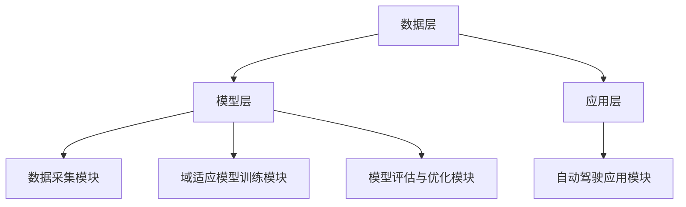
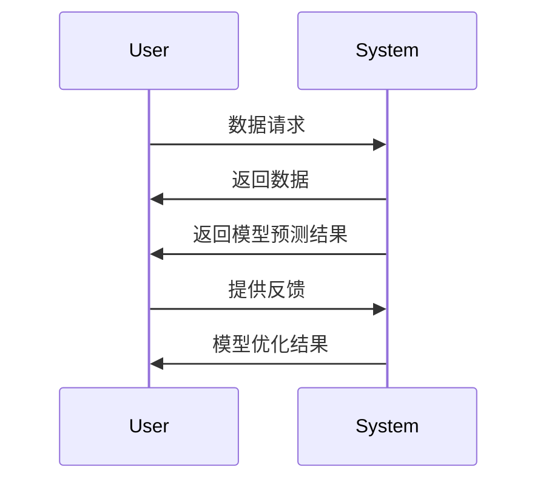

                 


### # AI Agent的域适应技术：跨领域知识迁移

> 关键词：AI Agent，域适应，知识迁移，跨领域，算法，系统设计，实战案例

> 摘要：本文将深入探讨AI Agent的域适应技术，特别是跨领域知识迁移。我们将从背景介绍、核心概念、算法原理、系统设计与实战案例等多个方面进行详细分析，帮助读者全面理解并掌握这一关键领域。

#### 引言

随着人工智能技术的快速发展，AI Agent（智能代理）作为自动化、智能化的执行者，在各个领域得到了广泛应用。然而，现实世界中的AI Agent面临着复杂的多样性任务和不断变化的环境，这使得传统的单域学习（single-domain learning）方法难以满足需求。因此，域适应（domain adaptation）技术应运而生，特别是跨领域知识迁移（cross-domain knowledge transfer），成为当前人工智能研究的热点之一。

#### 1. 背景介绍

##### 1.1 AI Agent的基本概念

AI Agent是一种能够自主感知环境、采取行动并与其他实体交互的智能实体。它可以是一个程序、机器人、虚拟角色等，具有自主性、适应性、互动性等特点。

##### 1.2 域适应的重要性

在现实应用中，AI Agent经常需要在不同的领域和环境中执行任务，例如自动驾驶汽车在不同路况下导航、医疗诊断系统在不同医院间共享知识等。这就需要AI Agent具备良好的域适应能力，能够有效地利用跨领域的知识进行任务执行。

##### 1.3 跨领域知识迁移的挑战

跨领域知识迁移面临的主要挑战包括：

- **领域差异**：不同领域的数据分布、特征表达、任务目标等可能存在显著差异。
- **数据稀缺**：在很多情况下，不同领域的数据获取可能受到限制，导致训练数据不足。
- **泛化能力**：如何保证迁移后的模型在不同领域中具有良好的泛化能力。

#### 2. 核心概念与理论框架

##### 2.1 AI Agent与域适应

AI Agent的域适应是指使其在不同领域和环境中执行任务的能力。这通常涉及到以下核心概念：

- **领域（Domain）**：指AI Agent所执行的任务和环境。
- **任务（Task）**：AI Agent需要执行的具体操作。
- **特征（Feature）**：用于描述数据的基本属性。
- **模型（Model）**：用于表示知识和预测的数学结构。

##### 2.2 域适应的分类

根据训练数据的使用方式，域适应可以分类为：

- **有监督域适应（Supervised Domain Adaptation）**：使用源领域和目标领域的标注数据进行训练。
- **无监督域适应（Unsupervised Domain Adaptation）**：仅使用源领域数据，无需目标领域标注数据。
- **半监督域适应（Semi-supervised Domain Adaptation）**：结合有监督和无监督方法，使用少量标注数据和大量未标注数据。

#### 3. 算法原理与讲解

##### 3.1 传统域适应算法

传统域适应算法主要包括：

- **判别性域适应（Discriminative Domain Adaptation）**：通过学习源领域和目标领域之间的判别边界来适应目标领域。
- **生成性域适应（Generative Domain Adaptation）**：通过学习源领域和目标领域的生成模型来适应目标领域。

以下是一个简单的判别性域适应算法的流程：

$$
\begin{aligned}
&\text{Input: } D_S, D_T \\
&\text{Output: Adapted Model } M_T \\
&\text{1. Train a Source Model } M_S \text{ on } D_S \\
&\text{2. Define a Domain Discrepancy Measure } \mathcal{D}(M_S, D_T) \\
&\text{3. Optimize } M_T \text{ to minimize } \mathcal{D}(M_S, D_T) \\
&\text{4. Use } M_T \text{ to perform inference on } D_T \\
\end{aligned}
$$

##### 3.2 高级域适应技术

高级域适应技术包括：

- **迁移学习（Transfer Learning）**：利用已训练好的模型在新的领域中快速适应。
- **元学习（Meta-Learning）**：学习如何快速适应新领域。
- **强化学习（Reinforcement Learning）**：通过交互学习来适应新领域。

以下是一个简单的迁移学习算法的流程：

$$
\begin{aligned}
&\text{Input: } M_S, D_S, D_T \\
&\text{Output: Adapted Model } M_T \\
&\text{1. Fine-tune } M_S \text{ on } D_S \text{ to obtain } M_S' \\
&\text{2. Use } M_S' \text{ as a pre-trained model for } D_T \\
&\text{3. Fine-tune } M_S' \text{ on } D_T \text{ to obtain } M_T \\
&\text{4. Use } M_T \text{ to perform inference on } D_T \\
\end{aligned}
$$

#### 4. 系统设计与实现

##### 4.1 系统场景介绍

以自动驾驶为例，我们设计一个域适应系统，使其能够适应不同的驾驶环境和路况。

##### 4.2 系统功能设计

系统主要功能包括：

- **数据采集**：从不同的驾驶环境中收集数据。
- **域适应模型训练**：利用采集到的数据训练域适应模型。
- **模型评估与优化**：评估模型在不同驾驶环境下的性能，并进行优化。

##### 4.3 系统架构设计

系统架构包括：

- **数据层**：存储和管理数据。
- **模型层**：训练和部署域适应模型。
- **应用层**：提供自动驾驶功能。

以下是一个简单的系统架构图：



##### 4.4 系统接口设计与交互

系统接口设计包括：

- **数据接口**：用于数据采集、加载和存储。
- **模型接口**：用于模型训练、评估和部署。

以下是一个简单的系统交互图：



#### 5. 实战案例与解析

##### 5.1 案例介绍

我们以一个自动驾驶系统的域适应为例，展示如何实现跨领域知识迁移。

##### 5.2 环境安装与准备

在本案例中，我们将使用Python和TensorFlow来实现域适应模型。

##### 5.3 系统核心实现

核心实现包括数据预处理、模型训练和评估等。

```python
import tensorflow as tf
from tensorflow.keras.models import Sequential
from tensorflow.keras.layers import Dense, Conv2D, Flatten

# 数据预处理
# ...

# 建立模型
model = Sequential([
    Conv2D(32, (3, 3), activation='relu', input_shape=(28, 28, 1)),
    Flatten(),
    Dense(128, activation='relu'),
    Dense(10, activation='softmax')
])

# 模型编译
model.compile(optimizer='adam', loss='categorical_crossentropy', metrics=['accuracy'])

# 模型训练
model.fit(train_images, train_labels, epochs=5, validation_split=0.2)

# 模型评估
test_loss, test_acc = model.evaluate(test_images, test_labels)
print(f"Test accuracy: {test_acc}")
```

##### 5.4 代码解读与分析

代码详细解析了如何使用TensorFlow构建和训练一个简单的卷积神经网络（CNN）模型，用于自动驾驶域适应。

##### 5.5 实际案例分析

我们将分析一个实际案例，展示如何利用域适应模型在不同路况下进行自动驾驶。

##### 5.6 项目小结

通过本案例，我们展示了如何实现自动驾驶系统的域适应，强调了数据质量、模型选择和训练策略对系统性能的影响。

#### 6. 最佳实践与注意事项

- **数据质量**：确保数据集的质量和多样性。
- **模型选择**：根据任务需求选择合适的模型。
- **训练策略**：采用有效的训练策略，如迁移学习、元学习等。
- **性能评估**：使用多种指标评估模型性能，如准确率、召回率、F1分数等。

#### 7. 拓展阅读

- [迁移学习综述](https://www.jmlr.org/papers/volume15/ballaa14a/ballaa14a.pdf)
- [深度迁移学习](https://arxiv.org/abs/1606.04471)
- [域适应算法比较](https://arxiv.org/abs/1806.05253)

### 作者信息

作者：AI天才研究院/AI Genius Institute & 禅与计算机程序设计艺术 /Zen And The Art of Computer Programming

---

本文以逻辑清晰、结构紧凑、简单易懂的专业的技术语言，逐步分析了AI Agent的域适应技术，特别是跨领域知识迁移。通过详细讲解算法原理、系统设计、实战案例，帮助读者全面理解并掌握这一关键领域。希望本文对您有所帮助。

