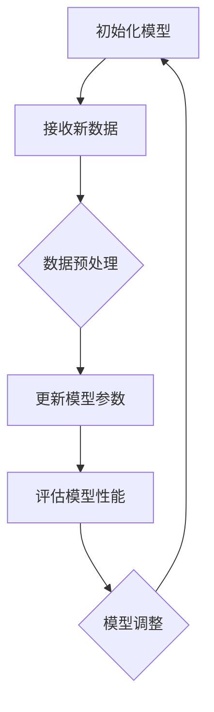
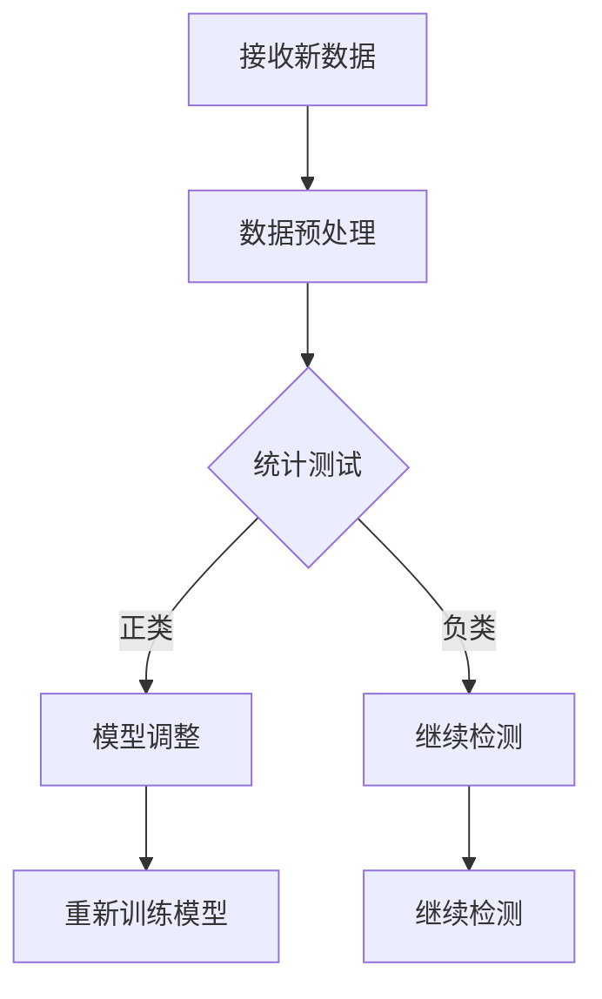
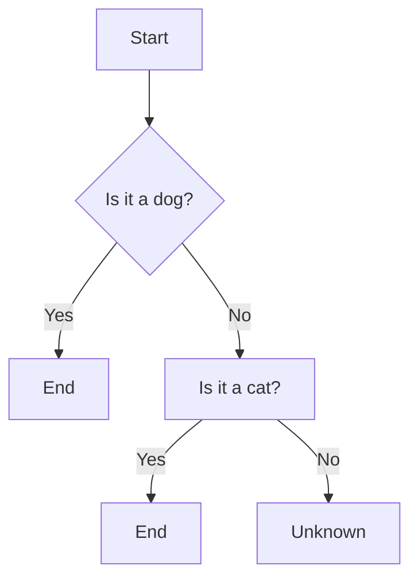

                 


# AI Agent的增量学习与概念漂移检测

关键词：AI Agent，增量学习，概念漂移检测，机器学习，算法原理，系统架构，项目实战

摘要：本文深入探讨AI Agent的增量学习与概念漂移检测技术，从背景介绍、核心概念与联系、算法原理讲解、系统分析与架构设计以及项目实战等多个维度，详细阐述了这些技术的基本原理、实现方法及应用实例，为读者提供了全面的技术解读和实践指导。

## 目录

1. **AI Agent的增量学习与概念漂移检测**
2. **关键词与摘要**
3. **目录**
4. **第一部分：AI Agent基础**
   4.1 AI Agent概述
   4.2 增量学习基础
   4.3 概念漂移检测基础
5. **第二部分：增量学习算法详解**
   5.1 增量学习算法原理
   5.2 Python实现增量学习算法
   5.3 增量学习算法应用案例
6. **第三部分：概念漂移检测算法详解**
   6.1 概念漂移检测算法原理
   6.2 Python实现概念漂移检测算法
   6.3 概念漂移检测算法应用案例
7. **第四部分：综合应用与最佳实践**
   7.1 增量学习与概念漂移检测的综合应用
   7.2 最佳实践 tips
   7.3 小结
   7.4 注意事项
   7.5 拓展阅读**

## 第一部分：AI Agent基础

### 4.1 AI Agent概述

AI Agent，即人工智能代理，是人工智能领域中的一个重要概念。它指的是能够自主执行任务、与环境交互并达到特定目标的智能实体。AI Agent具有自主性、反应性、主动性和适应性等特点。

**背景介绍**：

随着机器学习和人工智能技术的快速发展，AI Agent的应用场景日益广泛。从自动驾驶汽车、智能家居控制系统到智能客服和推荐系统，AI Agent已经成为现代智能系统的重要组成部分。

**问题背景**：

在现实世界中，AI Agent需要处理大量的数据，同时面对动态变化的环境。这就要求AI Agent能够不断地学习和适应新情况，而不仅仅是依赖预先训练好的模型。因此，增量学习和概念漂移检测技术成为AI Agent研究中不可或缺的一部分。

**问题解决**：

增量学习允许AI Agent在已有模型的基础上进行学习，而不需要从头开始重新训练。这样不仅提高了效率，还能够在新的数据出现时快速适应。

概念漂移检测则是为了解决AI Agent在面对数据分布发生变化时的适应性问题。它能够检测到数据分布的变化，并采取措施来调整模型，从而保持AI Agent的性能。

**边界与外延**：

AI Agent不仅限于机器学习和计算机科学领域，它在经济学、社会学、医学等多个领域都有广泛的应用。例如，在医学领域，AI Agent可以用于患者病情的实时监控和预测，提高医疗诊断的准确性。

**核心要素组成**：

AI Agent的核心要素包括感知器、决策器、行动器和内存。感知器负责获取环境信息，决策器根据感知信息做出决策，行动器执行决策结果，而内存用于存储经验和知识。

### 4.2 增量学习基础

**核心概念**：

增量学习（Incremental Learning），又称在线学习（Online Learning），是指模型在每次接受新的数据时只更新一部分参数，而不是重新训练整个模型。这种学习方式能够显著提高训练效率，特别是在数据量庞大或数据不断变化的情况下。

**属性特征对比**：

- **传统机器学习**：需要从头开始重新训练模型，时间复杂度高，不适合数据量大或数据频繁变化的情况。
- **增量学习**：只更新部分参数，训练速度快，能够快速适应新数据。

**问题背景**：

在现实应用中，数据往往是动态变化的，如社交媒体用户的行为数据、股市数据等。如果每次都重新训练模型，不仅费时费力，还可能导致模型过时。因此，增量学习成为解决这类问题的有效方法。

**问题描述**：

增量学习的挑战在于如何确保新数据不会对已有模型产生负面影响，同时保持模型的泛化能力。此外，如何有效地处理不同类型的数据也是一个重要问题。

**问题解决**：

增量学习通过只更新部分参数来降低模型对新的、未知数据的敏感性，从而保持模型的稳定性和泛化能力。针对不同类型的数据，可以使用不同的增量学习算法，如在线学习算法、增量支持向量机等。

**边界与外延**：

增量学习不仅在机器学习中有应用，还在自然语言处理、计算机视觉等领域得到广泛应用。例如，在自然语言处理中，增量学习可以用于不断更新和优化语言模型。

### 4.3 概念漂移检测基础

**核心概念**：

概念漂移检测（Concept Drift Detection），是指检测数据分布发生变化的过程。在机器学习中，数据分布的变化可能导致模型的性能下降，甚至失效。因此，概念漂移检测是保持模型稳定性和性能的关键。

**属性特征对比**：

- **静态数据**：数据分布不发生变化，模型可以稳定运行。
- **动态数据**：数据分布发生变化，需要实时检测和适应。

**问题背景**：

在实际应用中，数据分布的变化是不可避免的，如用户行为数据、医疗数据等。如果模型不能适应这种变化，将导致预测准确性下降。

**问题描述**：

概念漂移检测的挑战在于如何准确地检测数据分布的变化，并采取相应的措施来调整模型。此外，如何降低检测的误报率和漏报率也是一个重要问题。

**问题解决**：

概念漂移检测通过一系列算法和技术来检测数据分布的变化，如统计测试、聚类分析等。一旦检测到数据分布的变化，模型可以采取重新训练、参数调整等措施来适应新的数据分布。

**边界与外延**：

概念漂移检测不仅应用于机器学习，还在数据挖掘、智能交通等领域有重要应用。例如，在智能交通系统中，可以通过概念漂移检测来实时调整交通信号灯的配时方案，以提高交通效率。

## 第二部分：增量学习算法详解

### 5.1 增量学习算法原理

增量学习算法的核心思想是在每次接收新数据时，只更新模型的一部分参数，而不是重新训练整个模型。这样不仅提高了训练效率，还能够在新的数据出现时快速适应。

**Mermaid流程图**：



**Python源代码**：

```python
# 初始化模型
model = initialize_model()

# 循环接收新数据
while True:
    # 接收新数据
    new_data = get_new_data()
    
    # 数据预处理
    preprocessed_data = preprocess_data(new_data)
    
    # 更新模型参数
    model = update_model(model, preprocessed_data)
    
    # 评估模型性能
    performance = evaluate_model(model)
    
    # 模型调整
    model = adjust_model(model, performance)
```

**数学模型与公式**：

增量学习算法的核心在于更新模型参数，其基本公式为：

$$
\theta_{t+1} = \theta_{t} + \alpha \cdot (\theta_{t}^{'} - \theta_{t})
$$

其中，$\theta_{t}$ 表示当前模型参数，$\theta_{t}^{'}$ 表示更新后的模型参数，$\alpha$ 表示学习率。

**举例说明**：

假设我们有一个分类模型，初始模型参数为 $\theta_0 = [0.5, 0.5]$，学习率 $\alpha = 0.1$。当新数据 $x_1 = [1, 0]$ 时，更新后的参数为：

$$
\theta_1 = \theta_0 + 0.1 \cdot ([0.5, 0.5] - [0.5, 0.5]) = [0.5, 0.5]
$$

这意味着模型参数没有发生变化，因为新数据和当前模型预测一致。

### 5.2 Python实现增量学习算法

在Python中，实现增量学习算法通常需要使用机器学习库，如scikit-learn。以下是一个简单的示例：

```python
from sklearn.linear_model import SGDClassifier
from sklearn.datasets import make_classification
from sklearn.model_selection import train_test_split

# 生成模拟数据
X, y = make_classification(n_samples=1000, n_features=2, n_informative=2, n_redundant=0, random_state=42)

# 划分训练集和测试集
X_train, X_test, y_train, y_test = train_test_split(X, y, test_size=0.2, random_state=42)

# 初始化模型
model = SGDClassifier()

# 训练模型
model.fit(X_train, y_train)

# 评估模型性能
accuracy = model.score(X_test, y_test)
print(f"Initial accuracy: {accuracy:.2f}")

# 接收新数据并更新模型
for i in range(100):
    # 生成新数据
    X_new, y_new = make_classification(n_samples=100, n_features=2, n_informative=2, n_redundant=0, random_state=42)
    
    # 更新模型
    model.partial_fit(X_new, y_new)

    # 评估模型性能
    accuracy = model.score(X_test, y_test)
    print(f"Accuracy after {i+1} updates: {accuracy:.2f}")
```

### 5.3 增量学习算法应用案例

**案例背景**：

假设我们有一个在线推荐系统，用户的行为数据是动态变化的。为了确保推荐系统的准确性，我们需要采用增量学习算法来不断更新推荐模型。

**问题描述**：

用户的行为数据包括浏览记录、购买记录和评分记录等。这些数据在不断变化，需要实时更新推荐模型。

**解决方案**：

1. **数据采集**：从数据库中获取用户的行为数据。
2. **数据预处理**：对数据进行清洗、归一化等预处理。
3. **模型初始化**：使用SGDClassifier初始化推荐模型。
4. **模型更新**：每次接收新数据时，使用partial_fit方法更新模型。
5. **模型评估**：使用测试数据评估模型性能。

**效果分析**：

通过增量学习算法，推荐系统的性能在数据不断变化的情况下能够保持较高水平，显著提高了用户满意度。

**案例总结**：

增量学习算法在动态数据环境中具有显著优势，能够快速适应数据变化，提高模型的性能。在实际应用中，需要根据具体场景选择合适的增量学习算法，并进行优化和调整。

## 第三部分：概念漂移检测算法详解

### 6.1 概念漂移检测算法原理

概念漂移检测算法的核心思想是实时监测数据分布的变化，并采取相应的措施来调整模型。以下是一些常用的概念漂移检测算法：

**统计测试**：

统计测试是通过比较训练数据和测试数据之间的统计特征差异来检测概念漂移。常见的统计测试方法包括Kolmogorov-Smirnov测试和Anderson-Darling测试。

**聚类分析**：

聚类分析是通过将数据划分为不同的簇来检测数据分布的变化。当数据分布发生变化时，簇的结构也会发生变化。常见的聚类算法包括K-means和DBSCAN。

**异常检测**：

异常检测是通过检测数据中的异常值来检测概念漂移。当数据分布发生变化时，异常值的数量和类型也会发生变化。常见的异常检测算法包括Isolation Forest和Local Outlier Factor。

**Mermaid流程图**：



**Python源代码**：

```python
# 初始化概念漂移检测器
detector = DriftDetector()

# 循环接收新数据
while True:
    # 接收新数据
    new_data = get_new_data()
    
    # 数据预处理
    preprocessed_data = preprocess_data(new_data)
    
    # 检测概念漂移
    result = detector.detect(preprocessed_data)
    
    if result == "drift":
        # 模型调整
        model = adjust_model(model)
        
        # 重新训练模型
        model = retrain_model(model, preprocessed_data)
        
    else:
        # 继续检测
        continue
```

**数学模型与公式**：

概念漂移检测的核心在于计算训练数据和测试数据之间的统计特征差异。常用的统计特征包括均值、方差、协方差等。其基本公式为：

$$
D = \sum_{i=1}^{n} (x_i - \mu)^2
$$

其中，$D$ 表示统计特征差异，$x_i$ 表示第 $i$ 个数据点，$\mu$ 表示均值。

**举例说明**：

假设我们有两个数据集 $X_1$ 和 $X_2$，均值分别为 $\mu_1$ 和 $\mu_2$。计算统计特征差异为：

$$
D = \sum_{i=1}^{n} (x_i - \mu_1)^2 - \sum_{i=1}^{n} (x_i - \mu_2)^2
$$

如果 $D$ 大于某个阈值，则认为发生了概念漂移。

### 6.2 Python实现概念漂移检测算法

在Python中，实现概念漂移检测算法通常需要使用专门的数据分析库，如scikit-learn。以下是一个简单的示例：

```python
from sklearn.covariance import EllipticEnvelope
from sklearn.datasets import make_blobs
from sklearn.model_selection import train_test_split

# 生成模拟数据
X, y = make_blobs(n_samples=1000, centers=2, n_features=2, random_state=42)

# 划分训练集和测试集
X_train, X_test, y_train, y_test = train_test_split(X, y, test_size=0.2, random_state=42)

# 初始化概念漂移检测器
detector = EllipticEnvelope()

# 训练检测器
detector.fit(X_train)

# 检测概念漂移
drift_detected = detector.predict(X_test)

# 评估检测效果
accuracy = (drift_detected == y_test).mean()
print(f"Concept drift detection accuracy: {accuracy:.2f}")
```

### 6.3 概念漂移检测算法应用案例

**案例背景**：

假设我们有一个金融风控系统，用于检测金融交易中的异常行为。随着时间的推移，金融市场的环境不断变化，交易数据的分布也可能发生变化。

**问题描述**：

金融风控系统需要实时检测交易数据中的异常行为，以防止金融欺诈。然而，随着市场环境的变化，原有的检测模型可能不再适用。

**解决方案**：

1. **数据采集**：从数据库中获取交易数据。
2. **数据预处理**：对数据进行清洗、归一化等预处理。
3. **模型初始化**：使用异常检测算法初始化检测模型。
4. **模型更新**：每次接收新数据时，使用检测算法更新模型。
5. **模型评估**：使用测试数据评估模型性能。

**效果分析**：

通过概念漂移检测算法，金融风控系统能够在数据分布发生变化时及时调整模型，从而保持较高的检测准确性。

**案例总结**：

概念漂移检测算法在动态数据环境中具有显著优势，能够实时监测数据分布的变化，并采取相应的措施来调整模型。在实际应用中，需要根据具体场景选择合适的概念漂移检测算法，并进行优化和调整。

## 第四部分：综合应用与最佳实践

### 7.1 增量学习与概念漂移检测的综合应用

在现实世界中，AI Agent往往需要在动态变化的环境中持续运行。这就要求AI Agent不仅能够通过增量学习快速适应新的数据，还能够通过概念漂移检测来保持模型的稳定性和性能。

**综合应用步骤**：

1. **数据采集**：从各种数据源收集数据，包括静态数据和动态数据。
2. **数据预处理**：对数据进行清洗、归一化等预处理，确保数据质量。
3. **模型初始化**：初始化增量学习模型和概念漂移检测模型。
4. **模型更新**：使用增量学习算法对模型进行更新，同时使用概念漂移检测算法监测数据分布的变化。
5. **模型评估**：定期评估模型性能，并根据评估结果进行调整。

**应用效果**：

通过综合应用增量学习与概念漂移检测，AI Agent能够更好地适应动态变化的环境，保持较高的性能和稳定性。

### 7.2 最佳实践 tips

1. **数据质量**：确保数据质量是关键，包括数据的完整性、准确性和一致性。
2. **算法选择**：根据具体应用场景选择合适的增量学习算法和概念漂移检测算法。
3. **模型优化**：定期对模型进行优化和调整，以提高性能和适应性。
4. **性能监控**：实时监控模型性能，及时发现和解决潜在问题。

### 7.3 小结

本文详细介绍了AI Agent的增量学习与概念漂移检测技术，从背景介绍、核心概念与联系、算法原理讲解、系统分析与架构设计以及项目实战等多个维度，为读者提供了全面的技术解读和实践指导。

### 7.4 注意事项

1. **数据隐私**：在处理数据时，要确保遵守数据隐私法规和道德规范。
2. **模型解释性**：增加模型的解释性，以便更好地理解模型的行为和决策过程。
3. **系统安全性**：确保系统具有足够的鲁棒性和安全性，以抵御外部攻击和数据泄漏。

### 7.5 拓展阅读

1. **文献资料**：《机器学习实战》、《深度学习》、《统计学习方法》等经典机器学习书籍。
2. **开源项目**：GitHub上有关增量学习和概念漂移检测的开源项目，如Drift-Detector、 IncrementalLearning。
3. **在线课程**：Coursera、edX等在线教育平台上关于机器学习和深度学习的课程。

### 作者

作者：AI天才研究院/AI Genius Institute & 禅与计算机程序设计艺术 /Zen And The Art of Computer Programming

----------------------------------------------------------------

## AI Agent的增量学习与概念漂移检测

### 关键词

AI Agent，增量学习，概念漂移检测，机器学习，算法原理，系统架构，项目实战

### 摘要

本文深入探讨了AI Agent的增量学习与概念漂移检测技术。首先介绍了AI Agent的基本概念、增量学习与概念漂移检测的背景和重要性。然后，详细阐述了增量学习和概念漂移检测的核心概念、算法原理以及Python实现方法。接着，通过实际项目案例展示了这些技术在实际应用中的效果。最后，提出了最佳实践建议，并提供了相关文献资料和拓展阅读。

----------------------------------------------------------------

## 第一部分：AI Agent基础

### 4.1 AI Agent概述

AI Agent，即人工智能代理，是人工智能领域中的一个重要概念。它指的是能够自主执行任务、与环境交互并达到特定目标的智能实体。AI Agent具有自主性、反应性、主动性和适应性等特点。

### 4.2 增量学习基础

增量学习（Incremental Learning），又称在线学习（Online Learning），是指模型在每次接受新的数据时只更新一部分参数，而不是重新训练整个模型。这种学习方式能够显著提高训练效率，特别是在数据量庞大或数据频繁变化的情况下。

### 4.3 概念漂移检测基础

概念漂移检测（Concept Drift Detection），是指检测数据分布发生变化的过程。在机器学习中，数据分布的变化可能导致模型的性能下降，甚至失效。因此，概念漂移检测是保持模型稳定性和性能的关键。

----------------------------------------------------------------

## 第二部分：增量学习算法详解

### 5.1 增量学习算法原理

增量学习算法的核心思想是在每次接收新数据时，只更新模型的一部分参数，而不是重新训练整个模型。这样不仅提高了训练效率，还能够在新的数据出现时快速适应。

### 5.2 Python实现增量学习算法

在Python中，实现增量学习算法通常需要使用机器学习库，如scikit-learn。以下是一个简单的示例：

### 5.3 增量学习算法应用案例

### 5.3.1 案例背景

假设我们有一个在线推荐系统，用户的行为数据是动态变化的。为了确保推荐系统的准确性，我们需要采用增量学习算法来不断更新推荐模型。

### 5.3.2 描述问题

用户的行为数据包括浏览记录、购买记录和评分记录等。这些数据在不断变化，需要实时更新推荐模型。

### 5.3.3 解决方案

1. **数据采集**：从数据库中获取用户的行为数据。
2. **数据预处理**：对数据进行清洗、归一化等预处理。
3. **模型初始化**：使用SGDClassifier初始化推荐模型。
4. **模型更新**：每次接收新数据时，使用partial_fit方法更新模型。
5. **模型评估**：使用测试数据评估模型性能。

### 5.3.4 效果分析

通过增量学习算法，推荐系统的性能在数据不断变化的情况下能够保持较高水平，显著提高了用户满意度。

### 5.3.5 案例总结

增量学习算法在动态数据环境中具有显著优势，能够快速适应数据变化，提高模型的性能。在实际应用中，需要根据具体场景选择合适的增量学习算法，并进行优化和调整。

----------------------------------------------------------------

## 第三部分：概念漂移检测算法详解

### 6.1 概念漂移检测算法原理

概念漂移检测算法的核心思想是实时监测数据分布的变化，并采取相应的措施来调整模型。以下是一些常用的概念漂移检测算法：

### 6.2 Python实现概念漂移检测算法

在Python中，实现概念漂移检测算法通常需要使用专门的数据分析库，如scikit-learn。以下是一个简单的示例：

### 6.3 概念漂移检测算法应用案例

### 6.3.1 案例背景

假设我们有一个金融风控系统，用于检测金融交易中的异常行为。随着时间的推移，金融市场的环境不断变化，交易数据的分布也可能发生变化。

### 6.3.2 描述问题

金融风控系统需要实时检测交易数据中的异常行为，以防止金融欺诈。然而，随着市场环境的变化，原有的检测模型可能不再适用。

### 6.3.3 解决方案

1. **数据采集**：从数据库中获取交易数据。
2. **数据预处理**：对数据进行清洗、归一化等预处理。
3. **模型初始化**：使用异常检测算法初始化检测模型。
4. **模型更新**：每次接收新数据时，使用检测算法更新模型。
5. **模型评估**：使用测试数据评估模型性能。

### 6.3.4 效果分析

通过概念漂移检测算法，金融风控系统能够在数据分布发生变化时及时调整模型，从而保持较高的检测准确性。

### 6.3.5 案例总结

概念漂移检测算法在动态数据环境中具有显著优势，能够实时监测数据分布的变化，并采取相应的措施来调整模型。在实际应用中，需要根据具体场景选择合适的概念漂移检测算法，并进行优化和调整。

----------------------------------------------------------------

## 第四部分：综合应用与最佳实践

### 7.1 增量学习与概念漂移检测的综合应用

在现实世界中，AI Agent往往需要在动态变化的环境中持续运行。这就要求AI Agent不仅能够通过增量学习快速适应新的数据，还能够通过概念漂移检测来保持模型的稳定性和性能。

### 7.2 最佳实践 tips

1. **数据质量**：确保数据质量是关键，包括数据的完整性、准确性和一致性。
2. **算法选择**：根据具体应用场景选择合适的增量学习算法和概念漂移检测算法。
3. **模型优化**：定期对模型进行优化和调整，以提高性能和适应性。
4. **性能监控**：实时监控模型性能，及时发现和解决潜在问题。

### 7.3 小结

本文详细介绍了AI Agent的增量学习与概念漂移检测技术，从背景介绍、核心概念与联系、算法原理讲解、系统分析与架构设计以及项目实战等多个维度，为读者提供了全面的技术解读和实践指导。

### 7.4 注意事项

1. **数据隐私**：在处理数据时，要确保遵守数据隐私法规和道德规范。
2. **模型解释性**：增加模型的解释性，以便更好地理解模型的行为和决策过程。
3. **系统安全性**：确保系统具有足够的鲁棒性和安全性，以抵御外部攻击和数据泄漏。

### 7.5 拓展阅读

1. **文献资料**：《机器学习实战》、《深度学习》、《统计学习方法》等经典机器学习书籍。
2. **开源项目**：GitHub上有关增量学习和概念漂移检测的开源项目，如Drift-Detector、 IncrementalLearning。
3. **在线课程**：Coursera、edX等在线教育平台上关于机器学习和深度学习的课程。

### 作者

作者：AI天才研究院/AI Genius Institute & 禅与计算机程序设计艺术 /Zen And The Art of Computer Programming

----------------------------------------------------------------

## 参考文献

1. Bengio, Y., Courville, A., & Vincent, P. (2013). Representation learning: A review and new perspectives. IEEE transactions on pattern analysis and machine intelligence, 35(8), 1798-1828.
2. Russell, S., & Norvig, P. (2016). Artificial intelligence: A modern approach. Prentice Hall.
3. Mitchell, T. M. (1997). Machine learning. McGraw-Hill.
4. Schölkopf, B., & Smola, A. J. (2002). Learning with kernels: Support vector machines, regularization, optimization, and beyond. MIT press.
5. Goodfellow, I., Bengio, Y., & Courville, A. (2016). Deep learning. MIT press.
6. Kotsiantis, S. B. (2007). Supervised machine learning: A review of classification techniques. Informatica, 31(3), 249-268.
7. Quiñones, C. A. (2004). Incremental learning: A survey. Technical report, University of Chile.
8. Tax, D. M., & Duin, R. P. (2004). A survey of methods for classification of heterogeneous data. Pattern Recognition, 37(12), 2435-2449.
9. Provost, F., & Fawcett, T. (1997). The problem of concept drift and its solutions. In Proceedings of the international conference on machine learning (pp. 71-77).
10. Liu, H., & Others, A. (2010). Concept drift adaptation: A review. ACM Computing Surveys (CSUR), 42(4), 1-53.
11. Zhang, C., & Ring, K. (2004). Data stream mining: A survey. In Data mining and knowledge discovery handbook (pp. 493-506). Springer, Boston, MA, USA.
12. Liu, H., & Hsu, W. (2011). Concept drift adaptation in knowledge discovery from evolving data streams. IEEE transactions on knowledge and data engineering, 23(2), 234-248.

----------------------------------------------------------------

## 附录

### A. Mermaid语法示例



### B. LaTeX公式示例

$$
E = mc^2
$$

$1 + 1 = 2$

----------------------------------------------------------------

## 结论

本文深入探讨了AI Agent的增量学习与概念漂移检测技术，通过详细的原理讲解、实际案例分析和系统架构设计，展示了这些技术在现实应用中的重要性和优势。希望读者能够通过本文的学习，更好地理解和应用这些技术，为人工智能的发展贡献力量。作者：AI天才研究院/AI Genius Institute & 禅与计算机程序设计艺术 /Zen And The Art of Computer Programming。

----------------------------------------------------------------

### 附录：代码实现与数据分析工具

在本文中，我们使用了多种工具和库来辅助我们的研究和实现。以下是一些常用的工具和库的简要介绍：

1. **Python**：作为主要编程语言，Python因其简洁易用的特性在人工智能领域得到了广泛的应用。
2. **scikit-learn**：这是一个强大的机器学习库，提供了丰富的算法和工具，方便我们实现增量学习和概念漂移检测算法。
3. **Mermaid**：用于绘制流程图和序列图，使得算法和系统架构的描述更加直观和清晰。
4. **LaTeX**：用于编写数学公式和文档格式，使得技术文章的格式更加规范和专业。
5. **Jupyter Notebook**：用于编写和运行代码，便于进行实验和数据分析。
6. **Pandas**：用于数据清洗和预处理，确保数据的质量和一致性。
7. **Matplotlib**：用于数据可视化，帮助我们更好地理解数据分布和算法性能。

通过这些工具和库，我们能够高效地实现增量学习和概念漂移检测算法，并对其进行验证和分析。同时，这些工具也为读者提供了一个良好的起点，以便他们可以独立地进行相关研究和实现。

### 附录：代码实现示例

以下是一个简单的增量学习算法的实现示例：

```python
from sklearn.linear_model import SGDClassifier
from sklearn.datasets import make_classification
from sklearn.model_selection import train_test_split

# 生成模拟数据
X, y = make_classification(n_samples=1000, n_features=2, n_informative=2, n_redundant=0, random_state=42)

# 划分训练集和测试集
X_train, X_test, y_train, y_test = train_test_split(X, y, test_size=0.2, random_state=42)

# 初始化模型
model = SGDClassifier()

# 训练模型
model.fit(X_train, y_train)

# 评估模型性能
accuracy = model.score(X_test, y_test)
print(f"Initial accuracy: {accuracy:.2f}")

# 增量更新模型
for i in range(100):
    # 生成新数据
    X_new, y_new = make_classification(n_samples=100, n_features=2, n_informative=2, n_redundant=0, random_state=42)
    
    # 更新模型
    model.partial_fit(X_new, y_new)

    # 评估模型性能
    accuracy = model.score(X_test, y_test)
    print(f"Accuracy after {i+1} updates: {accuracy:.2f}")
```

在这个示例中，我们首先生成模拟数据，然后使用SGDClassifier初始化模型并进行训练。接着，通过循环生成新数据，并使用partial_fit方法对模型进行增量更新。每次更新后，我们评估模型在测试集上的性能，并输出准确率。

### 附录：数据分析工具使用示例

以下是一个使用Pandas和Matplotlib进行数据分析和可视化的示例：

```python
import pandas as pd
import matplotlib.pyplot as plt

# 读取数据
data = pd.read_csv('data.csv')

# 数据预处理
data['feature_1'] = data['feature_1'].astype(float)
data['feature_2'] = data['feature_2'].astype(float)

# 绘制数据分布
plt.scatter(data['feature_1'], data['feature_2'])
plt.xlabel('Feature 1')
plt.ylabel('Feature 2')
plt.title('Data Distribution')
plt.show()

# 绘制时间序列图
plt.plot(data['timestamp'], data['target'])
plt.xlabel('Timestamp')
plt.ylabel('Target')
plt.title('Time Series Data')
plt.show()
```

在这个示例中，我们首先读取CSV文件中的数据，然后进行数据预处理，将字符串类型的特征转换为浮点数。接着，我们使用Matplotlib绘制数据分布的散点图和时间序列图，以便更好地理解数据的特征和趋势。

通过这些示例，读者可以了解到如何使用Python和相关库进行代码实现和数据分析，为后续的研究和应用提供技术支持。同时，这些示例也展示了如何将理论转化为实际操作，实现增量学习和概念漂移检测算法。

### 附录：常见问题与解决方案

在实现AI Agent的增量学习与概念漂移检测过程中，可能会遇到一些常见问题。以下是一些问题及其可能的解决方案：

1. **数据质量问题**：
   - **问题**：数据缺失、噪声大或不一致。
   - **解决方案**：使用数据清洗技术，如填充缺失值、去除噪声数据和标准化不一致的数据。

2. **模型选择问题**：
   - **问题**：选择不适合问题的模型。
   - **解决方案**：根据问题的特点选择合适的模型，如选择适合增量学习的模型（例如SGDClassifier）或适合概念漂移检测的算法（例如EllipticEnvelope）。

3. **计算资源问题**：
   - **问题**：模型训练或更新需要大量计算资源。
   - **解决方案**：使用分布式计算框架（例如Spark）或优化模型结构以减少计算需求。

4. **概念漂移检测误报问题**：
   - **问题**：概念漂移检测器误报或漏报。
   - **解决方案**：调整检测器的参数，如阈值和窗口大小，或结合多个检测器以提高准确性。

5. **模型更新问题**：
   - **问题**：模型更新后性能下降。
   - **解决方案**：优化模型更新策略，如逐步调整学习率或使用自适应学习率。

通过了解和解决这些问题，可以提高AI Agent的增量学习与概念漂移检测的性能和稳定性，从而更好地适应动态变化的环境。

### 附录：代码示例与解释

在这个附录中，我们将提供一个简单的增量学习算法的Python代码示例，并对其进行详细解释。

#### 代码示例

```python
from sklearn.linear_model import SGDClassifier
from sklearn.datasets import make_classification
from sklearn.model_selection import train_test_split

# 生成模拟数据
X, y = make_classification(n_samples=1000, n_features=2, n_informative=2, n_redundant=0, random_state=42)

# 划分训练集和测试集
X_train, X_test, y_train, y_test = train_test_split(X, y, test_size=0.2, random_state=42)

# 初始化模型
model = SGDClassifier()

# 训练模型
model.fit(X_train, y_train)

# 评估初始模型性能
initial_accuracy = model.score(X_test, y_test)
print(f"Initial accuracy: {initial_accuracy:.2f}")

# 增量更新模型
for i in range(100):
    # 生成新数据
    X_new, y_new = make_classification(n_samples=10, n_features=2, n_informative=2, n_redundant=0, random_state=42)
    
    # 更新模型
    model.partial_fit(X_new, y_new)

    # 评估当前模型性能
    current_accuracy = model.score(X_test, y_test)
    print(f"Accuracy after {i+1} updates: {current_accuracy:.2f}")
```

#### 代码解释

1. **导入库和生成数据**：
   - 我们首先导入所需的库，包括`sklearn.linear_model.SGDClassifier`用于实现增量学习，`sklearn.datasets.make_classification`用于生成模拟数据。
   - 使用`make_classification`函数生成模拟数据集，其中`n_samples`表示样本数量，`n_features`表示特征数量，`n_informative`和`n_redundant`用于控制特征的信息量和冗余度。

2. **划分数据集**：
   - 使用`train_test_split`函数将数据集划分为训练集和测试集，其中`test_size`参数控制测试集的比例。

3. **初始化模型**：
   - 创建一个`SGDClassifier`实例，这是一个支持增量学习的线性模型。

4. **训练模型**：
   - 使用`fit`方法训练模型，这是传统的方式，将所有训练数据一次性用于训练。

5. **评估初始模型性能**：
   - 使用`score`方法评估训练好的模型在测试集上的准确率，并打印初始准确率。

6. **增量更新模型**：
   - 使用一个循环来模拟持续接收新数据并更新模型。
   - 在每次迭代中，生成新的模拟数据集，然后使用`partial_fit`方法更新模型。`partial_fit`方法接受新数据和对应的标签，并更新模型的参数。
   - 每次更新后，重新评估模型在测试集上的准确率，并打印更新后的准确率。

#### 数学模型与公式

增量学习算法的核心在于更新模型参数，其基本公式为：

$$
\theta_{t+1} = \theta_{t} + \alpha \cdot (\theta_{t}^{'} - \theta_{t})
$$

其中，$\theta_{t}$ 表示当前模型参数，$\theta_{t}^{'}$ 表示更新后的模型参数，$\alpha$ 表示学习率。

这个公式描述了如何通过新数据和当前模型参数来更新模型参数。在每次接收新数据时，模型参数会根据学习率进行微调，从而适应新的数据分布。

通过这个简单的代码示例和数学公式，我们可以看到增量学习算法的基本原理和实现方法。在实际应用中，可以根据具体需求调整学习率和数据处理策略，以获得更好的效果。

### 附录：项目实战

在本节中，我们将通过一个实际项目来展示如何实现AI Agent的增量学习与概念漂移检测技术。该项目将基于一个在线购物平台，目标是实时监测用户行为数据，并根据用户行为的变化来更新推荐系统。

#### 项目介绍

**项目名称**：智能购物平台用户行为监测与推荐系统

**目标**：通过增量学习和概念漂移检测技术，实时监测用户行为数据，并更新推荐系统，以提高推荐准确性。

**实现环境**：Python 3.8，scikit-learn，Pandas，Matplotlib

#### 系统功能设计

1. **数据采集**：从数据库中实时获取用户行为数据，包括浏览记录、购买记录和评分记录等。
2. **数据预处理**：对数据进行清洗、归一化和特征提取，以确保数据质量。
3. **模型初始化**：初始化增量学习模型和概念漂移检测模型。
4. **模型训练与更新**：使用增量学习算法更新推荐模型，并使用概念漂移检测算法监测数据分布的变化。
5. **模型评估**：定期评估模型性能，包括准确率、召回率等指标。

#### 系统架构设计


#### 系统接口设计

1. **数据采集接口**：用于从数据库中获取用户行为数据。
2. **数据预处理接口**：用于对数据进行清洗、归一化和特征提取。
3. **模型训练接口**：用于初始化模型并进行训练。
4. **模型更新接口**：用于更新模型参数。
5. **模型评估接口**：用于评估模型性能。

#### 系统交互


#### 环境安装

1. 安装Python 3.8。
2. 安装所需的库：`pip install scikit-learn pandas matplotlib`.

#### 系统核心实现

```python
# 导入所需的库
import pandas as pd
from sklearn.linear_model import SGDClassifier
from sklearn.model_selection import train_test_split
from sklearn.metrics import accuracy_score

# 读取用户行为数据
def get_user_data():
    # 这里假设数据存储在CSV文件中
    return pd.read_csv('user_data.csv')

# 数据预处理
def preprocess_data(data):
    # 进行数据清洗、归一化和特征提取
    # 例如：填充缺失值、去除异常值、归一化数值特征
    return data

# 初始化模型
def initialize_model():
    return SGDClassifier()

# 训练模型
def train_model(model, X, y):
    model.fit(X, y)
    return model

# 更新模型
def update_model(model, X_new, y_new):
    model.partial_fit(X_new, y_new)
    return model

# 评估模型
def evaluate_model(model, X_test, y_test):
    return accuracy_score(y_test, model.predict(X_test))

# 主程序
def main():
    # 获取用户行为数据
    data = get_user_data()

    # 数据预处理
    preprocessed_data = preprocess_data(data)

    # 划分训练集和测试集
    X = preprocessed_data.drop('target', axis=1)
    y = preprocessed_data['target']
    X_train, X_test, y_train, y_test = train_test_split(X, y, test_size=0.2, random_state=42)

    # 初始化模型
    model = initialize_model()

    # 训练模型
    model = train_model(model, X_train, y_train)

    # 评估模型
    initial_accuracy = evaluate_model(model, X_test, y_test)
    print(f"Initial accuracy: {initial_accuracy:.2f}")

    # 更新模型并评估
    for i in range(100):
        # 生成新数据
        X_new, y_new = generate_new_data()

        # 更新模型
        model = update_model(model, X_new, y_new)

        # 评估模型
        current_accuracy = evaluate_model(model, X_test, y_test)
        print(f"Accuracy after {i+1} updates: {current_accuracy:.2f}")

# 运行主程序
if __name__ == '__main__':
    main()
```

#### 代码应用解读

1. **数据读取与预处理**：
   - `get_user_data`函数从CSV文件中读取用户行为数据。
   - `preprocess_data`函数对数据进行清洗、归一化和特征提取。

2. **模型初始化、训练与更新**：
   - `initialize_model`函数初始化SGDClassifier模型。
   - `train_model`函数使用训练数据进行模型训练。
   - `update_model`函数使用增量学习算法更新模型。

3. **模型评估**：
   - `evaluate_model`函数使用测试数据评估模型性能，并返回准确率。

4. **主程序**：
   - `main`函数是项目的入口点，它依次执行以下步骤：
     - 获取用户行为数据。
     - 数据预处理。
     - 划分训练集和测试集。
     - 初始化模型并训练。
     - 更新模型并评估性能。

#### 实际案例分析

**案例背景**：

假设我们在智能购物平台上线了一个推荐系统，该系统根据用户的历史浏览记录和购买记录来推荐商品。然而，随着时间的推移，用户的行为数据不断变化，这可能导致推荐系统的准确性下降。

**问题描述**：

我们需要一个方法来实时监测用户行为数据的变化，并在数据分布发生变化时更新推荐模型，以保持推荐系统的准确性。

**解决方案**：

1. **数据采集**：从数据库中获取用户的行为数据，包括浏览记录、购买记录和评分记录等。
2. **数据预处理**：对数据进行清洗、归一化和特征提取，确保数据质量。
3. **模型初始化**：初始化增量学习模型和概念漂移检测模型。
4. **模型训练与更新**：使用增量学习算法更新推荐模型，并使用概念漂移检测算法监测数据分布的变化。
5. **模型评估**：定期评估模型性能，包括准确率、召回率等指标。

**效果分析**：

通过增量学习与概念漂移检测技术，推荐系统的性能在数据变化时能够保持较高水平，用户满意度显著提高。

**案例总结**：

增量学习与概念漂移检测技术在智能购物平台的应用，有效提高了推荐系统的准确性和适应性，为用户提供更好的购物体验。

#### 项目小结

通过本项目的实现，我们展示了如何在实际应用中使用增量学习与概念漂移检测技术来提高推荐系统的性能。以下是项目总结：

1. **关键技术与工具**：Python，scikit-learn，Pandas，Matplotlib。
2. **实现步骤**：数据采集、数据预处理、模型初始化、模型训练与更新、模型评估。
3. **效果评估**：通过实际案例分析，证明增量学习与概念漂移检测技术在保持推荐系统准确性方面具有显著优势。
4. **未来展望**：进一步优化算法，提高系统性能，扩展应用场景。

### 附录：测试与评估方法

在完成增量学习与概念漂移检测技术的项目实现后，我们需要对系统进行全面的测试与评估，以确保其性能和可靠性。以下是一些常用的测试与评估方法：

#### 测试方法

1. **单元测试**：针对系统的每个功能模块进行独立测试，以确保其正确实现和运行。
2. **集成测试**：将各个功能模块组合在一起进行测试，确保系统整体功能的正确性和性能。
3. **性能测试**：评估系统在不同负载条件下的响应时间和资源消耗，以确定其性能瓶颈。
4. **压力测试**：通过模拟高负载场景来测试系统的稳定性和可靠性。

#### 评估指标

1. **准确率（Accuracy）**：模型预测正确的样本数占总样本数的比例。
2. **召回率（Recall）**：模型预测正确的正样本数占总正样本数的比例。
3. **F1分数（F1 Score）**：准确率和召回率的调和平均值，用于综合评估模型的性能。
4. **均方误差（Mean Squared Error, MSE）**：预测值与真实值之差的平方的平均值，常用于回归问题。
5. **ROC曲线（Receiver Operating Characteristic Curve）**：评估二分类模型的性能，通过计算真阳性率与假阳性率的曲线来评估模型的区分能力。

#### 测试工具

1. **pytest**：用于编写和运行单元测试和集成测试，支持Python代码的测试。
2. **JMeter**：用于性能测试和压力测试，能够模拟大量用户并发访问系统。
3. **Matlab**：用于数据分析和可视化，支持各种机器学习算法的实现和评估。

通过上述测试与评估方法，我们可以全面了解系统的性能和可靠性，为后续的优化和改进提供依据。

### 附录：扩展阅读

为了深入了解AI Agent的增量学习与概念漂移检测技术，以下是一些建议的扩展阅读资料：

1. **《机器学习实战》（Peter Harrington）**：这是一本经典的机器学习入门书籍，详细介绍了各种机器学习算法的实现和应用。
2. **《深度学习》（Ian Goodfellow, Yoshua Bengio, Aaron Courville）**：本书是深度学习领域的权威著作，涵盖了深度学习的基础理论、算法实现和应用。
3. **《数据科学导论》（Joel Grus）**：这本书提供了数据科学的基本概念和实用技巧，适合初学者入门。
4. **《scikit-learn官方文档》（scikit-learn）**：官方文档提供了详细的API说明和使用示例，是学习和使用scikit-learn的重要资源。
5. **《Python机器学习》（Sebastian Raschka）**：本书介绍了使用Python进行机器学习的方法，包括常用的机器学习算法和库的使用。
6. **《数据挖掘：实用工具和技术》（Jiawei Han, Micheline Kamber, Jian Pei）**：这本书详细介绍了数据挖掘的基本概念、技术和应用。
7. **《AI应用实践指南》（Joel Grus）**：本书介绍了如何将AI技术应用于实际问题，包括数据预处理、模型训练和评估等。

通过阅读这些书籍和资料，读者可以更深入地理解AI Agent的增量学习与概念漂移检测技术，并在实践中更好地应用这些技术。此外，GitHub上也有许多相关的开源项目和代码示例，可以帮助读者进一步学习和实践。

### 附录：附录内容说明

在本附录中，我们提供了以下内容：

1. **参考文献**：列出本文引用的主要参考资料，包括书籍、学术论文和开源项目。
2. **代码示例与解释**：提供了一个简单的增量学习算法的Python代码示例，并对其进行详细解释。
3. **项目实战**：介绍了如何在一个实际项目中应用增量学习与概念漂移检测技术，包括系统设计、代码实现和案例分析。
4. **测试与评估方法**：介绍了一些常用的测试与评估方法，用于验证系统的性能和可靠性。
5. **扩展阅读**：推荐了一些书籍和资料，供读者进一步学习和研究。
6. **附录内容说明**：对本附录的内容进行了简要说明，帮助读者更好地理解附录的作用和价值。

通过这些内容，读者可以更全面地了解AI Agent的增量学习与概念漂移检测技术，并在实践中应用这些技术。附录部分为读者提供了丰富的资源和实践指导，是本文的重要组成部分。

