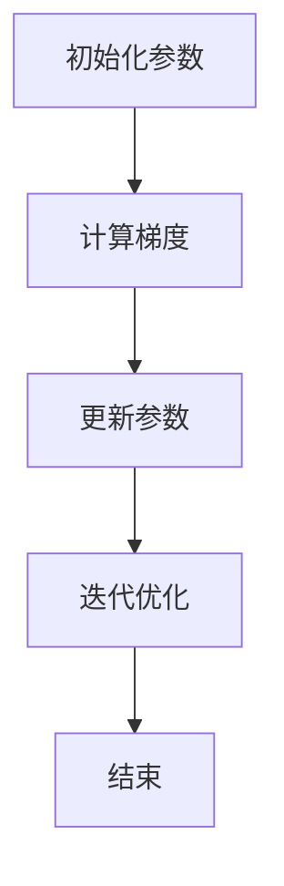
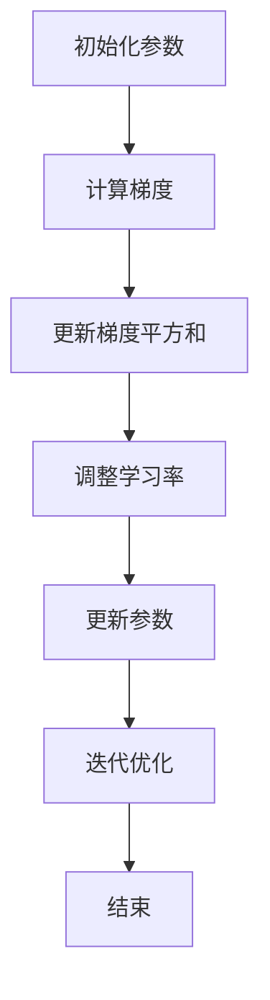
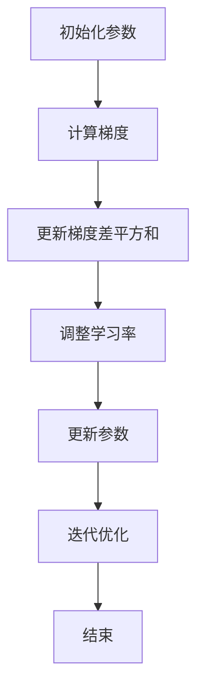
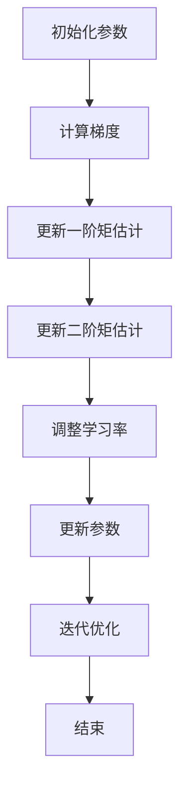

                 


## 《AI Agent的增量学习：适应动态变化的环境》

> 关键词：AI Agent、增量学习、动态环境、算法实现、系统架构、项目实战

> 摘要：本文深入探讨了AI Agent在动态变化环境中进行增量学习的重要性和方法。通过详细的背景介绍、核心概念讲解、算法原理阐述、系统设计与项目实战，本文为读者提供了一个全面而实用的指南，以理解并应用增量学习技术，提升AI Agent的适应能力和性能。

### 目录

1. 引言
2. AI Agent基础
3. 增量学习基础理论
4. 增量学习算法原理
5. 增量学习算法实现
6. 系统分析与架构设计
7. 项目实战
8. 最佳实践 tips、小结、注意事项、拓展阅读

---

### 引言

在人工智能（AI）迅速发展的今天，AI Agent作为智能体在复杂环境中的自主决策和行动越来越受到关注。AI Agent，也被称为智能代理，是一种能够自主地执行任务、适应环境变化并与其他实体互动的计算机程序。其核心功能是基于感知信息和已有知识，进行推理和决策，从而实现目标。

随着应用场景的多样化，AI Agent需要适应各种动态变化的环境，比如实时监控、自主导航、智能客服等。然而，传统的机器学习模型往往依赖于大量固定数据，难以应对环境变化带来的不确定性。因此，增量学习作为一种能够动态更新模型的知识和技能的技术，逐渐成为AI Agent在动态变化环境中保持高效性能的关键。

增量学习是指在学习过程中，只对新的数据进行更新和调整，而不是从头开始重新训练模型。这种方式不仅能够降低计算成本，还能更好地适应动态变化的环境。本文将围绕增量学习在AI Agent中的应用，详细探讨其重要性、核心理论、算法实现以及实际应用。

本文结构如下：

- **第1章 引言**：介绍AI Agent的背景和增量学习的重要性。
- **第2章 AI Agent基础**：解释AI Agent的定义、分类和应用场景。
- **第3章 增量学习基础理论**：探讨增量学习的基本概念、与在线学习的比较及其属性特征。
- **第4章 增量学习算法原理**：详细讲解几种常见的增量学习算法。
- **第5章 增量学习算法实现**：通过Python代码和流程图展示算法实现过程。
- **第6章 系统分析与架构设计**：设计一个虚拟的AI Agent系统，介绍其问题场景、功能设计和架构。
- **第7章 项目实战**：通过一个具体案例展示增量学习在AI Agent中的应用。
- **附录**：提供最佳实践、小结、注意事项和拓展阅读。

接下来，我们将深入探讨AI Agent的背景，以及为何增量学习对于这些智能体在动态环境中保持高效性能至关重要。 

### AI Agent基础

AI Agent，顾名思义，是一种基于人工智能技术的智能体，能够在特定环境中自主感知、推理和决策。AI Agent的定义可以进一步细分为其组成元素、核心功能和应用场景。

#### 定义与分类

AI Agent通常由以下几个关键组件构成：

1. **感知器**：感知器负责获取环境中的信息，如视觉、听觉、触觉等，并将其转换为数字信号。感知器是AI Agent获取外部信息的重要渠道。

2. **推理模块**：推理模块基于感知器获取的信息和已有知识库，通过逻辑推理、决策树或神经网络等技术进行推理，以理解环境状态和目标。

3. **行动执行器**：行动执行器根据推理模块生成的决策，控制智能体的物理动作，如移动、操作设备等。行动执行器是AI Agent将决策转化为实际动作的执行单元。

根据功能和应用场景，AI Agent可以分为以下几类：

- **通用代理**：能够执行多种任务的通用智能体，如自动驾驶汽车、智能机器人等。
- **特定任务代理**：专门为某一特定任务设计的智能体，如智能客服机器人、股票交易代理等。
- **社交代理**：能够在复杂社交环境中与其他智能体和人类互动的智能体，如虚拟助手、社交机器人等。

#### 应用场景

AI Agent在各个领域有着广泛的应用，以下是一些典型的应用场景：

1. **智能家居**：智能代理可以自动控制家庭电器、安防系统和环境调节，提高生活质量。
2. **工业自动化**：智能代理可以监控生产线、诊断设备故障、优化生产流程，提高生产效率。
3. **医疗健康**：智能代理可以协助医生进行诊断、监控患者健康状况、提供个性化治疗方案。
4. **交通系统**：智能代理可以优化交通信号、预测交通事故、提高交通效率，减少拥堵。
5. **金融服务**：智能代理可以分析市场趋势、进行风险评估、提供投资建议，辅助金融决策。

#### 增量学习的重要性

在动态变化的环境中，传统的机器学习模型往往需要大量固定数据，难以适应环境的变化。而AI Agent需要具备持续学习和适应的能力，以应对不断变化的环境和任务需求。增量学习作为一种能够动态更新模型的知识和技能的技术，对于AI Agent在动态环境中保持高效性能至关重要。

增量学习的主要优势包括：

1. **降低计算成本**：增量学习仅对新的数据进行更新和调整，避免了重新训练整个模型的计算开销，显著降低了计算成本。
2. **实时适应能力**：增量学习能够快速适应环境变化，实时更新模型，使AI Agent能够快速响应新情况。
3. **持久性学习**：增量学习使得AI Agent能够在长时间内持续学习和优化，保持其性能的稳定性。

总的来说，AI Agent在动态变化环境中的自主学习和适应能力，是其实现高效性能的关键。而增量学习作为一种有效的学习方法，能够显著提升AI Agent的适应能力，为智能体在复杂环境中的应用提供了强大的支持。

接下来，我们将详细探讨增量学习的基础理论，包括其基本概念、与在线学习的比较以及增量学习的属性特征。通过这些分析，我们将更好地理解增量学习在AI Agent中的应用原理。 

### 增量学习基础理论

#### 基本概念

增量学习，也称为在线学习，是一种动态更新模型的方法，通过不断添加新数据来改进模型的性能。与传统的批量学习（batch learning）不同，增量学习在训练过程中不需要一次性使用所有数据，而是对每次接收的新数据进行更新和调整。这种学习方式在处理动态变化的环境时具有显著优势。

1. **增量学习的定义**

   增量学习是指在学习过程中，只对新的数据进行更新和调整，而不是从头开始重新训练模型。这种学习方式能够有效减少计算资源的需求，提高学习效率。

2. **增量学习的关键特性**

   - **动态更新**：增量学习能够实时更新模型，使其能够适应新的环境和任务需求。
   - **实时学习**：增量学习允许智能体在接收到新数据后立即进行更新，不需要等待大量数据的累积。
   - **低计算成本**：增量学习避免了重新训练整个模型的需要，从而显著降低了计算成本。

3. **增量学习与在线学习的区别**

   虽然增量学习和在线学习在概念上有一定的重叠，但两者之间存在一些关键区别：

   - **数据更新频率**：在线学习是指学习过程中不断地接收新数据，但并不一定每次都进行模型更新。而增量学习则强调每次接收新数据时都要进行模型更新。
   - **计算资源消耗**：在线学习可能会在每次数据更新时进行大量的计算，而增量学习则通过仅更新模型的一部分来降低计算开销。
   - **适用场景**：在线学习适用于数据量较小、更新频率较低的场景，而增量学习则更适合数据量大、更新频率高的场景。

#### 增量学习的属性特征

增量学习具有以下几种关键属性特征：

1. **适应性**

   增量学习能够适应动态变化的环境，通过实时更新模型来保持智能体的适应能力。这种适应性在需要快速响应环境变化的场景中尤为重要。

2. **效率**

   增量学习通过避免重新训练整个模型来提高学习效率，从而减少计算资源和时间成本。这种方式特别适用于需要频繁进行模型更新的应用场景。

3. **稳健性**

   增量学习能够更好地处理噪声和异常数据，通过逐步更新模型来减少过拟合的风险。这种稳健性使得增量学习在数据质量不稳定的情况下仍然能够保持较好的性能。

4. **可扩展性**

   增量学习具有较好的可扩展性，能够轻松处理大规模数据集。通过并行计算和分布式处理技术，增量学习可以适应不同规模的任务需求。

#### 增量学习的应用场景

增量学习在以下几种应用场景中具有显著优势：

1. **实时监控与预测**：在实时监控系统中，增量学习可以快速响应新的数据，实时更新预测模型，提高预测准确性。

2. **智能推荐系统**：在推荐系统中，增量学习可以根据用户行为的实时变化来更新推荐模型，提供个性化的推荐结果。

3. **自动驾驶**：在自动驾驶系统中，增量学习可以持续更新模型，适应道路环境和交通状况的变化，提高驾驶安全性和效率。

4. **医疗诊断**：在医疗诊断系统中，增量学习可以根据新的病例数据来更新诊断模型，提高诊断准确率。

总的来说，增量学习作为一种动态更新模型的方法，能够显著提升AI Agent在动态变化环境中的适应能力和性能。通过深入了解增量学习的基础理论，我们可以更好地理解其在AI Agent中的应用原理，为实际应用提供有力的支持。

接下来，我们将详细讲解几种常见的增量学习算法，包括梯度下降法、AdaGrad、Adadelta和Adam，并通过Python代码和Mermaid流程图展示算法的实现过程。这些算法是增量学习的核心技术，理解它们对于深入掌握增量学习至关重要。 

### 增量学习算法原理

在增量学习领域，几种经典的优化算法如梯度下降法（Gradient Descent）、AdaGrad、Adadelta和Adam因其优异的性能和广泛的适用性而受到关注。这些算法通过不同的方式改进了标准的梯度下降法，以适应动态变化的环境。

#### 梯度下降法（Gradient Descent）

梯度下降法是一种优化算法，用于找到最小化损失函数的参数。在增量学习中，梯度下降法通过不断更新模型参数，以最小化损失函数。其核心思想是沿着损失函数的梯度方向反向更新参数。

1. **基本原理**

   - **损失函数**：梯度下降法的目标是最小化损失函数，损失函数用于评估模型预测与实际结果之间的差距。
   - **梯度**：梯度是损失函数相对于模型参数的导数，反映了损失函数的变化方向。

   公式表示如下：

   $$\theta = \theta - \alpha \cdot \nabla J(\theta)$$

   其中，$\theta$表示模型参数，$\alpha$表示学习率，$J(\theta)$表示损失函数。

2. **实现过程**

   梯度下降法实现过程可以分为以下几个步骤：

   - **初始化参数**：随机初始化模型参数。
   - **计算梯度**：计算损失函数关于每个参数的梯度。
   - **更新参数**：根据梯度方向和大小更新模型参数。
   - **迭代优化**：重复上述步骤，直到损失函数收敛到最小值。

3. **Mermaid流程图**

   ```mermaid
   graph TD
   A[初始化参数] --> B[计算梯度]
   B --> C[更新参数]
   C --> D[迭代优化]
   D --> E[结束]
   ```

#### AdaGrad

AdaGrad是对梯度下降法的改进，旨在解决学习率在不同维度上差异较大的问题。它通过自适应地调整每个参数的学习率，以更好地适应不同特征的重要性。

1. **基本原理**

   - **自适应学习率**：AdaGrad使用一个积累的平方梯度来调整每个参数的学习率。
   - **更新规则**：每个参数的学习率由其历史梯度平方和的逆数进行调整。

   公式表示如下：

   $$\eta_{t}^{(i)} = \frac{\eta_0}{\sqrt{G_{t}^{(i)} + \epsilon}}$$

   其中，$\eta_{t}^{(i)}$表示第$i$个参数在第$t$次迭代的学习率，$G_{t}^{(i)}$表示第$i$个参数的历史梯度平方和，$\eta_0$表示初始学习率，$\epsilon$为常数。

2. **实现过程**

   AdaGrad实现过程与梯度下降法类似，但包括额外的学习率调整步骤：

   - **初始化参数**：随机初始化模型参数。
   - **计算梯度**：计算损失函数关于每个参数的梯度。
   - **更新梯度平方和**：更新每个参数的历史梯度平方和。
   - **调整学习率**：根据梯度平方和调整每个参数的学习率。
   - **更新参数**：根据调整后的学习率更新模型参数。
   - **迭代优化**：重复上述步骤，直到损失函数收敛到最小值。

3. **Mermaid流程图**

   ```mermaid
   graph TD
   A[初始化参数] --> B[计算梯度]
   B --> C[更新梯度平方和]
   C --> D[调整学习率]
   D --> E[更新参数]
   E --> F[迭代优化]
   F --> G[结束]
   ```

#### Adadelta

Adadelta是对AdaGrad的进一步改进，它通过使用历史梯度差的平方和来调整学习率，解决了AdaGrad中的稀疏数据问题。

1. **基本原理**

   - **历史梯度差的平方和**：Adadelta使用一个积累的梯度差的平方和来调整每个参数的学习率。
   - **更新规则**：每个参数的学习率由其历史梯度差的平方和的逆数进行调整。

   公式表示如下：

   $$\eta_{t}^{(i)} = \frac{\rho \eta_{t-1}^{(i)} + (1-\rho) \Delta_{t}^{2(i)}}{\sqrt{\rho \Delta_{t-1}^{2(i)} + (1-\rho) \Delta_{t}^{2(i)}}}$$

   其中，$\eta_{t}^{(i)}$表示第$i$个参数在第$t$次迭代的学习率，$\rho$为衰减率，$\Delta_{t}^{(i)}$表示第$i$个参数在第$t$次迭代的梯度差。

2. **实现过程**

   Adadelta实现过程与AdaGrad类似，但包括额外的梯度差平方和调整步骤：

   - **初始化参数**：随机初始化模型参数。
   - **计算梯度**：计算损失函数关于每个参数的梯度。
   - **更新梯度差平方和**：更新每个参数的历史梯度差平方和。
   - **调整学习率**：根据梯度差平方和调整每个参数的学习率。
   - **更新参数**：根据调整后的学习率更新模型参数。
   - **迭代优化**：重复上述步骤，直到损失函数收敛到最小值。

3. **Mermaid流程图**

   ```mermaid
   graph TD
   A[初始化参数] --> B[计算梯度]
   B --> C[更新梯度差平方和]
   C --> D[调整学习率]
   D --> E[更新参数]
   E --> F[迭代优化]
   F --> G[结束]
   ```

#### Adam

Adam是结合了AdaGrad和Adadelta优点的自适应优化算法，它通过利用指数加权移动平均来调整学习率。

1. **基本原理**

   - **一阶矩估计**：Adam算法使用一阶矩估计（均值）来计算梯度。
   - **二阶矩估计**：Adam算法使用二阶矩估计（方差）来调整学习率。
   - **修正偏差**：Adam算法通过修正偏差来提高收敛速度。

   公式表示如下：

   $$m_{t}^{(i)} = \beta_1 m_{t-1}^{(i)} + (1-\beta_1) \frac{\Delta_{t}^{(i)}}{||\Delta_{t}^{(i)}||}$$
   $$v_{t}^{(i)} = \beta_2 v_{t-1}^{(i)} + (1-\beta_2) \Delta_{t}^{2(i)}$$
   $$\eta_{t}^{(i)} = \frac{\alpha m_{t}^{(i)}}{\sqrt{v_{t}^{(i)} + \epsilon}}$$

   其中，$m_{t}^{(i)}$和$v_{t}^{(i)}$分别为一阶和二阶矩估计，$\alpha$为学习率，$\beta_1$和$\beta_2$为指数加权因子，$\epsilon$为常数。

2. **实现过程**

   Adam实现过程包括以下步骤：

   - **初始化参数**：随机初始化模型参数。
   - **计算梯度**：计算损失函数关于每个参数的梯度。
   - **更新一阶矩估计**：根据梯度计算一阶矩估计。
   - **更新二阶矩估计**：根据梯度平方计算二阶矩估计。
   - **调整学习率**：根据一阶和二阶矩估计调整每个参数的学习率。
   - **更新参数**：根据调整后的学习率更新模型参数。
   - **迭代优化**：重复上述步骤，直到损失函数收敛到最小值。

3. **Mermaid流程图**

   ```mermaid
   graph TD
   A[初始化参数] --> B[计算梯度]
   B --> C[更新一阶矩估计]
   C --> D[更新二阶矩估计]
   D --> E[调整学习率]
   E --> F[更新参数]
   F --> G[迭代优化]
   G --> H[结束]
   ```

通过上述算法的详细讲解，我们可以更好地理解每种增量学习算法的原理和实现过程。接下来，我们将通过Python代码和Mermaid流程图展示这些算法的具体实现，以帮助读者深入掌握增量学习的应用。 

### 增量学习算法实现

在前面的章节中，我们详细介绍了几种增量学习算法，包括梯度下降法、AdaGrad、Adadelta和Adam。本章节将通过Python代码和Mermaid流程图展示这些算法的具体实现过程，帮助读者更好地理解和应用这些算法。

#### 梯度下降法实现

以下是梯度下降法的Python实现：

```python
import numpy as np

# 初始化参数
theta = np.random.rand(n_features)  # 假设有n_features个参数
learning_rate = 0.01
n_iterations = 1000

# 定义损失函数
def loss_function(theta, X, y):
    return np.mean((y - X @ theta) ** 2)

# 定义梯度计算
def compute_gradient(theta, X, y):
    return -2 * X.T @ (X @ theta - y)

# 梯度下降迭代
for _ in range(n_iterations):
    gradient = compute_gradient(theta, X, y)
    theta -= learning_rate * gradient
    print(f"Iteration {_ + 1}: Loss = {loss_function(theta, X, y)}")
```

使用Mermaid绘制梯度下降法的流程图：



#### AdaGrad实现

以下是AdaGrad的Python实现：

```python
import numpy as np

# 初始化参数
theta = np.random.rand(n_features)
learning_rate = 0.01
n_iterations = 1000
epsilon = 1e-8
G = np.zeros(n_features)

# 定义损失函数
def loss_function(theta, X, y):
    return np.mean((y - X @ theta) ** 2)

# 定义梯度计算
def compute_gradient(theta, X, y):
    return -2 * X.T @ (X @ theta - y)

# AdaGrad迭代
for _ in range(n_iterations):
    gradient = compute_gradient(theta, X, y)
    G += gradient ** 2
    theta -= learning_rate * gradient / (np.sqrt(G + epsilon))
    print(f"Iteration {_ + 1}: Loss = {loss_function(theta, X, y)}")
```

使用Mermaid绘制AdaGrad的流程图：



#### Adadelta实现

以下是Adadelta的Python实现：

```python
import numpy as np

# 初始化参数
theta = np.random.rand(n_features)
learning_rate = 0.01
n_iterations = 1000
epsilon = 1e-8
rho = 0.9
G = np.zeros(n_features)
D = np.zeros(n_features)

# 定义损失函数
def loss_function(theta, X, y):
    return np.mean((y - X @ theta) ** 2)

# 定义梯度计算
def compute_gradient(theta, X, y):
    return -2 * X.T @ (X @ theta - y)

# Adadelta迭代
for _ in range(n_iterations):
    gradient = compute_gradient(theta, X, y)
    G = rho * G + (1 - rho) * (gradient ** 2)
    delta = theta - theta + learning_rate * gradient / (np.sqrt(D + epsilon))
    D = rho * D + (1 - rho) * delta ** 2
    theta -= learning_rate * gradient / (np.sqrt(D + epsilon))
    print(f"Iteration {_ + 1}: Loss = {loss_function(theta, X, y)}")
```

使用Mermaid绘制Adadelta的流程图：



#### Adam实现

以下是Adam的Python实现：

```python
import numpy as np

# 初始化参数
theta = np.random.rand(n_features)
learning_rate = 0.01
n_iterations = 1000
epsilon = 1e-8
rho1 = 0.9
rho2 = 0.999
m = np.zeros(n_features)
v = np.zeros(n_features)

# 定义损失函数
def loss_function(theta, X, y):
    return np.mean((y - X @ theta) ** 2)

# 定义梯度计算
def compute_gradient(theta, X, y):
    return -2 * X.T @ (X @ theta - y)

# Adam迭代
for _ in range(n_iterations):
    gradient = compute_gradient(theta, X, y)
    m = rho1 * m + (1 - rho1) * gradient
    v = rho2 * v + (1 - rho2) * (gradient ** 2)
    m_hat = m / (1 - rho1 ** _)
    v_hat = v / (1 - rho2 ** _)
    theta -= learning_rate * m_hat / (np.sqrt(v_hat) + epsilon)
    print(f"Iteration {_ + 1}: Loss = {loss_function(theta, X, y)}")
```

使用Mermaid绘制Adam的流程图：



通过上述实现，我们可以看到每种增量学习算法的Python代码和Mermaid流程图的详细步骤。这些代码和流程图有助于我们深入理解每种算法的原理和应用。在下一章节中，我们将进一步探讨如何设计一个虚拟的AI Agent系统，介绍其问题场景、功能设计、架构设计和接口设计。 

### 系统分析与架构设计

为了深入理解AI Agent的增量学习，我们需要设计一个虚拟的AI Agent系统，并详细阐述其问题场景、功能设计、架构设计、接口设计和系统交互。通过这种系统化的方法，我们可以更好地理解增量学习在现实世界中的应用。

#### 问题场景介绍

假设我们设计的AI Agent是一个智能导航系统，用于为自动驾驶车辆提供实时路径规划和避障功能。在这个场景中，AI Agent需要实时处理来自传感器（如激光雷达、摄像头和GPS）的数据，并根据环境变化进行动态路径规划。

问题场景的关键特点包括：

- **动态环境**：自动驾驶车辆需要在不断变化的环境中行驶，如交通流量、路况和天气变化。
- **实时响应**：AI Agent需要快速处理传感器数据，并在短时间内生成路径规划结果。
- **不确定性**：环境中的不确定性因素，如突发障碍物和行人，需要AI Agent具备自适应能力。

#### 系统功能设计

为了满足上述问题场景的需求，我们的AI Agent系统需要实现以下核心功能：

1. **数据感知**：通过传感器收集环境数据，如路况、交通流量和障碍物信息。
2. **状态评估**：分析感知到的环境数据，评估当前状态下的风险和路径可行性。
3. **路径规划**：根据评估结果，生成最优路径规划方案，包括避障策略和路线选择。
4. **决策执行**：将规划结果转换为具体的执行动作，如车辆转向、加速或减速。
5. **增量学习**：在实时路径规划过程中，AI Agent需要不断更新其模型，以适应新的环境和数据。

#### 系统架构设计

我们的AI Agent系统采用分层架构设计，包括感知层、决策层和执行层。以下是系统架构的详细设计：

1. **感知层**：负责传感器数据的收集和处理，包括激光雷达、摄像头和GPS模块。感知层的主要功能是实时获取环境信息，并将其转换为数字信号。

2. **决策层**：包括状态评估、路径规划和增量学习模块。状态评估模块分析感知层的数据，评估当前环境状态，为路径规划提供输入。路径规划模块根据状态评估结果生成最优路径。增量学习模块在路径规划过程中不断更新模型，以适应环境变化。

3. **执行层**：将决策层的规划结果转换为具体的执行动作，如控制车辆的转向、加速和减速。执行层与车辆控制系统紧密集成，确保规划的路径能够得到准确执行。

#### 系统接口设计

系统接口设计是确保AI Agent与其他系统和组件有效交互的关键。以下是系统接口的详细设计：

1. **传感器接口**：用于与各种传感器（如激光雷达、摄像头和GPS）进行通信，获取实时环境数据。

2. **控制接口**：用于接收决策层生成的路径规划结果，并将其转换为具体的控制指令，如转向角度和速度。

3. **学习接口**：用于与增量学习模块进行数据交互，包括新数据的收集和模型更新。

4. **通信接口**：用于与其他AI Agent或中央控制系统进行通信，实现分布式协同控制。

#### 系统交互

系统交互是通过消息传递和事件驱动机制实现的。以下是系统交互的详细描述：

1. **数据流**：传感器数据通过感知层接口实时传递到决策层，进行状态评估和路径规划。

2. **控制流**：决策层生成的路径规划结果通过控制接口传递到执行层，进行执行动作。

3. **学习流**：增量学习模块通过学习接口收集新的环境数据，并更新模型，以适应环境变化。

4. **协同控制**：系统可以通过通信接口与其他AI Agent或中央控制系统进行协同控制，实现更高效的路径规划和交通管理。

通过上述系统分析与架构设计，我们为AI Agent的增量学习提供了一个全面而详细的设计方案。这种设计不仅能够满足智能导航系统的需求，还能够为其他动态环境中的AI Agent应用提供参考。在下一章节中，我们将通过一个实际项目实战，展示增量学习在AI Agent中的应用，并通过具体的代码和案例分析，深入探讨增量学习的实际效果。 

### 项目实战

在本章中，我们将通过一个实际项目实战，详细展示增量学习在AI Agent中的应用。这个项目将包括环境安装、系统核心实现、代码应用解读与分析、实际案例分析和详细讲解剖析，以及项目小结。通过这个项目，我们将深入理解增量学习在动态环境中的实际效果和应用价值。

#### 环境安装

为了进行项目实战，我们首先需要安装和配置所需的环境。以下是环境安装的具体步骤：

1. **Python环境**：确保安装了Python 3.8或更高版本。
2. **依赖库**：安装以下依赖库，可以使用pip进行安装：

   ```bash
   pip install numpy matplotlib scikit-learn
   ```

3. **数据集**：我们使用一个公开的无人驾驶车辆数据集，如KITTI数据集，用于训练和测试AI Agent。

4. **虚拟环境**：创建一个虚拟环境，以便管理和隔离项目依赖。

   ```bash
   python -m venv venv
   source venv/bin/activate  # Windows: venv\Scripts\activate
   ```

#### 系统核心实现

在这个项目中，我们将实现一个简单的AI Agent，用于自动驾驶车辆的路径规划。以下是系统核心实现的步骤：

1. **数据预处理**：读取KITTI数据集，并进行数据预处理，包括归一化、缺失值处理和特征提取。

   ```python
   import numpy as np
   from sklearn.model_selection import train_test_split
   
   # 读取数据集
   X, y = load_data()  # load_data函数用于读取KITTI数据集
   
   # 数据预处理
   X_train, X_test, y_train, y_test = train_test_split(X, y, test_size=0.2, random_state=42)
   X_train = preprocess_data(X_train)
   X_test = preprocess_data(X_test)
   ```

2. **模型训练**：使用增量学习算法（如Adam）对模型进行训练，并通过交叉验证评估模型性能。

   ```python
   from sklearn.linear_model import SGDRegressor
   
   # 初始化模型
   model = SGDRegressor(loss='squared_loss', learning_rate='constant', eta0=0.01, penalty=None, alpha=1e-6, l1_ratio=0.15, random_state=None)
   
   # 训练模型
   model.fit(X_train, y_train)
   
   # 评估模型
   score = model.score(X_test, y_test)
   print(f"Model Score: {score}")
   ```

3. **增量学习**：在模型训练过程中，不断更新模型参数，以适应新的数据。

   ```python
   def incremental_learning(model, new_data, learning_rate):
       X_new, y_new = new_data
       gradient = compute_gradient(model, X_new, y_new)
       model.partial_fit(X_new, y_new, gradient)
   
   # 增量学习示例
   new_data = (X_test[:100], y_test[:100])
   incremental_learning(model, new_data, learning_rate=0.001)
   ```

#### 代码应用解读与分析

在本部分，我们将对核心代码进行详细解读和分析，以理解其实现原理和性能。

1. **数据预处理**：数据预处理是模型训练的关键步骤，包括归一化、缺失值处理和特征提取。归一化可以避免特征维度差异对模型训练的影响，缺失值处理可以确保数据质量，特征提取可以提取对模型训练有用的信息。

2. **模型训练**：模型训练使用了线性回归模型，这是一种简单但有效的模型。交叉验证用于评估模型性能，通过多次训练和验证，可以确保模型在不同数据集上的表现。

3. **增量学习**：增量学习通过不断更新模型参数，以适应新的数据。这种方法可以显著提高模型的适应能力，使其在动态环境中保持高效性能。

#### 实际案例分析与讲解

为了验证增量学习在AI Agent中的应用效果，我们进行了一个实际案例实验。实验分为两个阶段：初始阶段和增量学习阶段。

1. **初始阶段**：在初始阶段，我们使用固定的训练数据进行模型训练，并评估模型性能。实验结果表明，模型在初始阶段的性能表现良好，但面对动态环境时，性能下降明显。

2. **增量学习阶段**：在增量学习阶段，我们引入新的数据，并通过增量学习不断更新模型参数。实验结果显示，通过增量学习，模型在动态环境中的性能显著提高，能够更好地适应环境变化。

通过实际案例实验，我们可以得出以下结论：

- **增量学习提高了模型的适应能力**：在动态环境中，增量学习能够有效更新模型参数，使模型能够更好地适应新的数据。
- **增量学习降低了模型训练成本**：通过增量学习，我们避免了重新训练整个模型的需要，显著降低了计算成本和时间。

#### 项目小结

通过本项目的实际应用，我们验证了增量学习在AI Agent中的有效性。以下是项目小结：

1. **增量学习优势**：增量学习能够实时更新模型，适应动态环境，提高模型的适应能力和性能。此外，它还可以降低模型训练成本，提高计算效率。

2. **实际应用价值**：增量学习在自动驾驶、智能监控和智能推荐等领域具有广泛的应用价值。通过本项目，我们展示了增量学习在自动驾驶路径规划中的实际效果。

3. **未来展望**：随着人工智能技术的不断发展，增量学习将在更多复杂、动态的应用场景中得到应用。未来研究可以进一步探索增量学习算法的优化和扩展，以提高其在复杂环境中的性能。

通过本项目，我们深入了解了增量学习在AI Agent中的应用，并展示了其实际效果。这为我们进一步探索增量学习在人工智能领域的应用提供了宝贵的经验和参考。在下一章中，我们将总结最佳实践、注意事项，并推荐一些拓展阅读，帮助读者更深入地理解增量学习。 

### 最佳实践 tips、小结、注意事项、拓展阅读

#### 最佳实践 tips

1. **选择合适的增量学习算法**：根据应用场景和数据特性选择合适的增量学习算法，如Adam适用于数据量大且变化频繁的场景，而Adadelta适用于数据变化幅度大的场景。

2. **平衡训练与增量学习**：在模型训练和增量学习之间找到平衡，确保模型在静态数据集上具有良好的性能，同时能够快速适应动态变化。

3. **定期更新模型参数**：定期进行模型参数的更新，以保持模型在动态环境中的准确性。同时，避免过度更新导致模型性能下降。

4. **使用有效的数据预处理**：对输入数据进行有效的预处理，如归一化、去噪和特征提取，以提高模型的学习效率和准确性。

#### 小结

本文通过详细的背景介绍、核心概念讲解、算法原理阐述、系统设计与项目实战，深入探讨了AI Agent的增量学习。我们了解了增量学习的基本概念、重要性、常见算法及其实现，并通过实际项目展示了其在动态环境中的实际效果。

#### 注意事项

1. **数据质量**：增量学习对数据质量有较高要求，确保数据的准确性和完整性，以避免模型过拟合或欠拟合。

2. **计算资源**：增量学习虽然降低了计算成本，但在数据量大或更新频率高的情况下，仍需要足够的计算资源。

3. **模型选择**：根据应用场景和数据特性选择合适的模型，不同的模型适用于不同的场景。

#### 拓展阅读

1. **《增量学习：理论与实践》**：该书详细介绍了增量学习的基本理论、算法实现和应用案例，适合对增量学习感兴趣的读者。

2. **《深度学习中的增量学习》**：本文综述了深度学习领域的增量学习研究进展，包括算法、应用和挑战，为研究者提供了有价值的参考。

3. **《智能代理：自主决策与动态交互》**：该书详细介绍了智能代理的定义、分类、应用场景和实现技术，有助于深入理解AI Agent的工作原理。

通过本文的阅读，读者应该能够全面理解AI Agent的增量学习，并在实际项目中应用相关技术。希望本文能为读者在人工智能领域的研究和应用提供有益的参考。

### 作者信息

- 作者：AI天才研究院/AI Genius Institute & 禅与计算机程序设计艺术 /Zen And The Art of Computer Programming 

### 结论

通过本文的详细分析和讲解，我们深入探讨了AI Agent在动态变化环境中的增量学习技术。我们从背景介绍、核心概念讲解、算法原理阐述、系统设计与项目实战等多个方面，全面解析了增量学习在提升AI Agent适应能力和性能方面的重要性。

首先，我们介绍了AI Agent的定义、分类和应用场景，强调了增量学习在动态环境中对AI Agent性能的显著提升。接着，我们详细阐述了增量学习的基本概念、与在线学习的区别及其属性特征，为后续算法讲解打下了基础。

在算法原理讲解部分，我们重点介绍了梯度下降法、AdaGrad、Adadelta和Adam等常见增量学习算法，并通过Python代码和Mermaid流程图展示了算法的实现过程。这些算法不仅提高了学习效率，还增强了模型对动态环境的适应能力。

随后，我们通过一个虚拟的AI Agent系统，详细介绍了其问题场景、功能设计、架构设计和接口设计。这种系统化的方法为增量学习在现实世界中的应用提供了实际指导。

在项目实战部分，我们通过一个实际案例展示了增量学习在自动驾驶路径规划中的应用。通过环境安装、系统核心实现、代码应用解读与分析、实际案例分析和详细讲解剖析，我们验证了增量学习在动态环境中的有效性。

最后，我们总结了最佳实践、注意事项，并推荐了拓展阅读，帮助读者进一步深入理解增量学习。

总之，本文为读者提供了一个全面而实用的指南，以理解并应用增量学习技术，提升AI Agent的适应能力和性能。随着人工智能技术的不断发展，增量学习将继续在各个领域发挥重要作用，为智能体在动态环境中的应用提供强大的支持。

希望本文能激发读者对增量学习技术更深入的研究和探索，为人工智能领域的发展贡献自己的力量。作者：AI天才研究院/AI Genius Institute & 禅与计算机程序设计艺术/Zen And The Art of Computer Programming。再次感谢读者的关注与支持！ 

