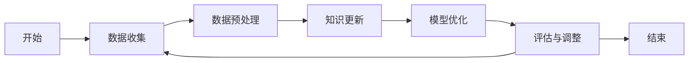
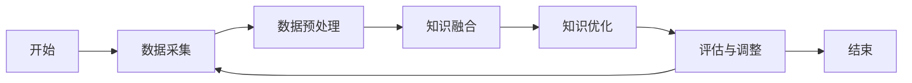
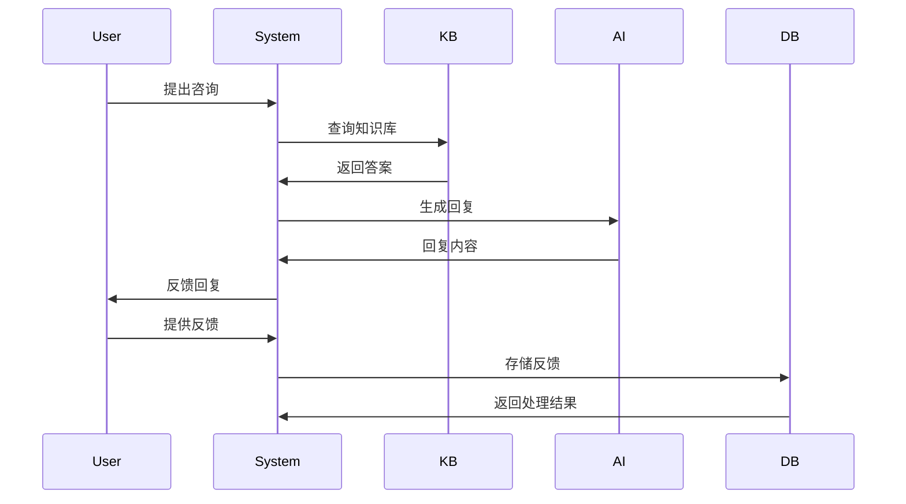
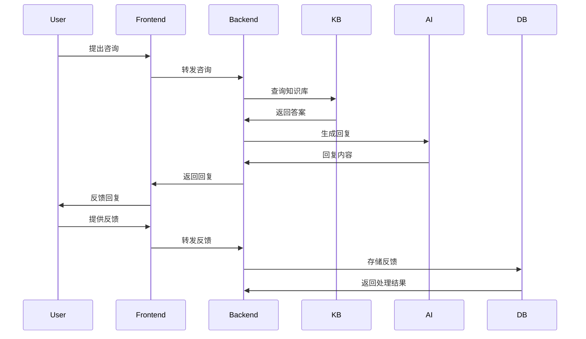

                 


### 引言：AI Agent的背景与重要性

人工智能（AI）技术的发展日新月异，而AI Agent作为AI领域的一个重要分支，已经成为现代智能系统设计的关键元素。AI Agent，即人工智能代理，是一种能够自主执行任务、与环境交互并做出决策的智能实体。与传统的规则驱动或数据驱动的系统不同，AI Agent具有更强的自主学习和适应能力，这使得它们在复杂多变的环境中展现出独特的优势。

AI Agent的核心在于其“智能”，这种智能是通过不断的学习和知识重构实现的。然而，随着应用场景的复杂化和数据的爆炸式增长，传统的静态知识库和一次性学习的方法已经无法满足AI Agent的需求。因此，增量式概念形成与知识重构成为AI Agent持续进化的重要机制。

#### 增量式概念形成

增量式概念形成是指AI Agent在处理新信息和经验时，能够逐步构建和调整其内部概念模型的过程。这种机制允许AI Agent在不改变现有知识结构的基础上，不断吸收新知识，从而提高其认知能力。例如，一个智能客服系统在与客户交流的过程中，可以逐步学习客户的偏好、需求和行为模式，从而提供更加个性化的服务。

#### 知识重构

知识重构是指AI Agent在面临新问题或新情境时，能够对现有知识库进行重新组织和优化，以适应新的需求。知识重构不仅是AI Agent自我进化的关键，也是提高其适应性和鲁棒性的重要途径。例如，在一个自动驾驶系统中，当遇到新的交通规则或交通状况时，系统能够通过知识重构来调整其行为策略，以确保行车安全。

#### 为什么需要增量式概念形成与知识重构

1. **动态环境适应性**：现实世界是动态变化的，AI Agent需要具备适应这种变化的能力。增量式概念形成与知识重构使得AI Agent能够实时更新其知识库，以应对新的挑战。

2. **高效性**：传统的知识更新方法通常需要重新训练整个系统，这不仅耗时耗力，还可能导致系统性能的下降。而增量式概念形成与知识重构可以在不中断系统运行的情况下，逐步优化系统性能。

3. **持续进化**：AI Agent的目标是实现自我进化，以不断提升其智能水平。增量式概念形成与知识重构为这一目标提供了技术支持。

4. **智能化决策**：在复杂决策过程中，AI Agent需要利用已有的知识和经验来做出最佳决策。增量式概念形成与知识重构有助于AI Agent构建更为全面和精确的知识模型，从而提高决策质量。

#### 文章结构

本文将分为四个主要部分：

1. **背景介绍**：详细阐述AI Agent的定义、背景和重要性，以及增量式概念形成与知识重构的概念和原理。
2. **核心概念与联系**：介绍AI Agent的核心概念，包括增量式概念形成和知识重构的定义、原理、特征，并通过对比表格和ER实体关系图来展示各概念之间的关系。
3. **算法原理讲解**：深入讲解增量式概念形成和知识重构的算法原理，包括算法流程图、数学模型和公式，并通过Python代码和实际案例进行详细阐述。
4. **系统设计与项目实战**：描述AI Agent的系统架构设计，包括功能设计、架构设计、接口设计和系统交互，并介绍一个实际的AI Agent项目，包括环境安装、系统核心实现、代码分析、案例剖析和项目小结。

通过以上结构，本文旨在全面、深入地探讨AI Agent的增量式概念形成与知识重构，为读者提供有价值的理论指导和实践参考。

### 第一部分：AI Agent基础

#### 第1章: AI Agent概述

在深入探讨AI Agent的增量式概念形成与知识重构之前，首先需要了解AI Agent的基本概念、发展历程及其在当今世界的重要性。这一章将分为以下几个部分：AI Agent的定义与背景、增量式概念形成、知识重构以及AI Agent的核心概念联系。

##### 1.1 AI Agent的定义与背景

AI Agent，即人工智能代理，是一种能够在复杂环境中自主执行任务、与环境进行交互并做出决策的智能实体。AI Agent的核心特点是自主性和适应性，这使得它们能够像人类一样在不同的场景下执行复杂的任务。

AI Agent的定义可以追溯到人工智能的早期研究。在20世纪50年代，人工智能（AI）的兴起标志着人类开始探索如何让计算机模拟人类的智能行为。随着时间的发展，AI Agent的概念逐渐成熟，并成为人工智能研究的一个重要方向。AI Agent的发展历程可以分为以下几个阶段：

1. **早期探索阶段（1956-1974）**：在这一阶段，人工智能的概念被提出，研究者开始探索如何通过编程实现简单的智能行为。例如，1956年达特茅斯会议的召开标志着人工智能正式成为一门学科。

2. **快速发展阶段（1974-1980）**：这一阶段，专家系统成为AI研究的热点，研究者通过构建规则库来模拟专家的决策过程。然而，这一阶段的AI系统主要依赖于预定义的规则，缺乏自主学习和适应能力。

3. **低谷与复苏阶段（1980-1990）**：由于人工智能在实践中的应用未能达到预期，AI研究进入了一个低谷期。然而，随着计算机技术的进步和大数据技术的发展，AI研究在1990年代开始复苏。

4. **智能化阶段（1990年代至今）**：这一阶段，机器学习和深度学习技术取得了突破性进展，使得AI Agent能够通过自主学习来提高其智能水平。AI Agent的应用领域也从实验室走向实际生活，如智能客服、自动驾驶、智能医疗等。

##### 1.1.1 AI Agent的定义

AI Agent是一种由计算机程序实现的智能实体，它具备以下特点：

1. **自主性**：AI Agent能够自主执行任务，不需要人工干预。
2. **适应性**：AI Agent能够根据环境变化调整其行为策略。
3. **交互性**：AI Agent能够与环境进行交互，获取信息并做出决策。

##### 1.1.2 AI Agent的发展历程

AI Agent的发展历程可以分为以下几个阶段：

1. **规则驱动阶段**：早期的AI Agent主要通过预定义的规则来执行任务，例如专家系统。
2. **数据驱动阶段**：随着大数据技术的发展，AI Agent开始通过数据学习来优化其行为。这一阶段的代表性技术包括机器学习和深度学习。
3. **模型驱动阶段**：AI Agent开始通过构建复杂的模型来理解环境并做出决策。这一阶段的代表性技术包括强化学习和迁移学习。

##### 1.1.3 AI Agent的重要性

AI Agent在现代社会中具有重要的地位，其原因如下：

1. **提高生产效率**：AI Agent能够自动执行重复性高、复杂度低的任务，从而提高生产效率。
2. **降低人力成本**：通过自动化，AI Agent能够减少对人工的依赖，从而降低人力成本。
3. **优化决策**：AI Agent能够利用大量的数据和先进的算法来做出更明智的决策。
4. **改善生活质量**：AI Agent在智能家居、医疗健康、交通出行等领域的应用，为人们的生活带来了诸多便利。

##### 1.2 增量式概念形成

增量式概念形成是指AI Agent在处理新信息和经验时，能够逐步构建和调整其内部概念模型的过程。这种机制允许AI Agent在不改变现有知识结构的基础上，不断吸收新知识，从而提高其认知能力。

增量式概念形成的关键在于其适应性和灵活性。在传统的人工智能系统中，知识库通常是固定和静态的。而增量式概念形成使得AI Agent能够动态地调整其知识库，以适应新的环境和任务。

##### 1.2.1 增量式概念形成的原理

增量式概念形成的原理主要包括以下几个方面：

1. **数据驱动**：AI Agent通过持续收集和分析环境中的数据来构建和调整其概念模型。
2. **元学习**：AI Agent通过元学习来优化其学习过程，从而提高概念形成的效率和准确性。
3. **交互学习**：AI Agent通过与环境的交互来获取反馈，并利用这些反馈来调整其概念模型。

##### 1.2.2 与传统概念形成的对比

与传统概念形成方法相比，增量式概念形成具有以下优势：

1. **动态适应性**：传统概念形成方法通常是在特定环境下静态构建的，而增量式概念形成能够动态适应环境变化。
2. **高效性**：增量式概念形成可以在不中断系统运行的情况下逐步优化知识库。
3. **灵活性**：增量式概念形成能够根据新的经验和数据不断调整其概念模型，从而提高系统的适应性和灵活性。

##### 1.3 知识重构

知识重构是指AI Agent在面临新问题或新情境时，能够对现有知识库进行重新组织和优化，以适应新的需求。知识重构不仅是AI Agent自我进化的关键，也是提高其适应性和鲁棒性的重要途径。

##### 1.3.1 知识重构的定义与原理

知识重构的定义可以概括为：在面临新的挑战时，AI Agent能够通过重新组织和优化其内部知识库，以提高其应对能力。

知识重构的原理主要包括以下几个方面：

1. **数据清洗**：对现有的数据进行清洗和预处理，以提高数据的准确性和可用性。
2. **知识整合**：将不同来源和格式的知识进行整合，构建一个统一的知识库。
3. **知识更新**：根据新的需求和情境，对现有知识库进行更新和优化。

##### 1.3.2 知识重构的重要性

知识重构在AI Agent中的应用具有重要意义，其原因如下：

1. **提高适应能力**：通过知识重构，AI Agent能够更好地应对新的挑战和变化。
2. **提高决策质量**：知识重构使得AI Agent能够利用最新的数据和知识来做出更明智的决策。
3. **增强系统鲁棒性**：知识重构有助于消除知识库中的错误和冗余，从而提高系统的鲁棒性。

##### 1.3.3 知识重构的方法

知识重构的方法主要包括以下几种：

1. **增量更新**：在现有的知识库基础上，逐步增加新的知识和信息。
2. **全局优化**：对整个知识库进行全局优化，以提高其整体性能。
3. **交互式重构**：通过与用户的交互来收集反馈，并利用这些反馈来重构知识库。

##### 1.4 AI Agent的核心概念联系

在AI Agent的设计和应用过程中，增量式概念形成与知识重构是两个核心概念，它们相互关联，共同构成了AI Agent的智能机制。

##### 1.4.1 AI Agent的ER实体关系图

为了更好地理解增量式概念形成与知识重构在AI Agent中的关系，我们可以使用ER实体关系图来展示这些核心概念之间的联系。

```
[AI Agent]
|-- [知识库]
|-- [概念模型]
|   |-- [增量式概念形成]
|   |-- [知识重构]
|-- [环境交互]
|-- [数据处理]
|-- [学习算法]
```

在ER实体关系图中，AI Agent包括知识库、概念模型、环境交互、数据处理和学习算法等实体。知识库和概念模型是AI Agent的核心组成部分，而增量式概念形成和知识重构则是实现这些组成部分的关键机制。

##### 1.4.2 关键概念属性对比表格

为了进一步明确增量式概念形成和知识重构的属性特征，我们可以通过一个对比表格来展示这两个概念的主要区别和联系。

| 对比项               | 增量式概念形成                 | 知识重构                       |
|----------------------|------------------------------|--------------------------------|
| 目的                 | 动态构建和调整概念模型         | 优化和重构现有知识库           |
| 数据来源             | 环境中的新信息和经验           | 现有知识库和新的需求或情境       |
| 方法                | 数据驱动、元学习、交互学习     | 数据清洗、知识整合、知识更新     |
| 特点                | 动态适应性、高效性、灵活性     | 提高适应能力、决策质量、系统鲁棒性 |
| 关系                | 知识重构的基础                | AI Agent进化和优化的关键         |

通过上述介绍，我们对AI Agent的基本概念、发展历程、增量式概念形成与知识重构有了初步的了解。在接下来的章节中，我们将深入探讨这两个核心概念的具体原理、算法实现及其在AI Agent系统设计与项目实战中的应用。

### 第一部分：AI Agent基础

#### 第2章: 增量式概念形成算法原理

在了解了AI Agent的基本概念和背景后，接下来我们需要深入探讨增量式概念形成的算法原理。增量式概念形成是AI Agent适应动态环境、提高智能水平的关键机制。本章将分为以下几个部分：算法概述、算法流程图、算法实现、举例说明和算法原理详细讲解。

##### 2.1 算法概述

增量式概念形成算法的主要目的是在AI Agent处理新信息和经验时，能够动态构建和调整其内部概念模型。这种算法通过持续学习新知识，逐步优化现有概念模型，从而提高AI Agent的智能水平。

##### 2.1.1 增量式概念形成算法的目的

1. **动态适应性**：使AI Agent能够适应动态变化的环境，不断调整其概念模型。
2. **高效性**：在不中断系统运行的情况下，逐步优化概念模型。
3. **灵活性**：允许AI Agent根据新经验和数据动态调整其内部结构。

##### 2.1.2 增量式概念形成算法的核心步骤

增量式概念形成算法通常包括以下几个核心步骤：

1. **数据收集**：从环境中收集新数据。
2. **数据预处理**：对收集到的数据进行清洗和预处理。
3. **知识更新**：利用新数据更新AI Agent的概念模型。
4. **模型优化**：通过元学习等机制优化概念模型，提高其准确性。
5. **评估与调整**：评估新概念模型的性能，并根据评估结果进行调整。

##### 2.2 算法流程图

为了更好地理解增量式概念形成算法的流程，我们可以使用mermaid绘制算法的流程图。以下是一个简单的增量式概念形成算法的mermaid流程图：



在这个流程图中，A表示算法的起始点，B表示数据收集阶段，C表示数据预处理阶段，D表示知识更新阶段，E表示模型优化阶段，F表示评估与调整阶段，G表示算法的结束点。评估与调整阶段会返回到数据收集阶段，形成一个闭环，以确保AI Agent能够持续学习和优化。

##### 2.3 算法实现

为了实现增量式概念形成算法，我们可以使用Python编程语言。以下是一个简单的Python代码示例，展示了如何实现增量式概念形成算法的核心步骤：

```python
import numpy as np
import pandas as pd

# 假设我们有一个简单的数据集
data = pd.DataFrame({
    'feature1': [1, 2, 3, 4, 5],
    'feature2': [6, 7, 8, 9, 10]
})

# 数据预处理
def preprocess_data(data):
    # 数据清洗、标准化等操作
    return data

# 知识更新
def update_knowledge(data):
    # 更新概念模型
    # 这里可以调用机器学习算法
    return "updated_knowledge"

# 模型优化
def optimize_model(knowledge):
    # 优化概念模型
    return "optimized_knowledge"

# 评估与调整
def evaluate_and_adjust(knowledge):
    # 评估概念模型性能
    # 根据评估结果进行调整
    return "adjusted_knowledge"

# 主函数
def incremental_concept Formation_algorithm(data):
    preprocessed_data = preprocess_data(data)
    knowledge = update_knowledge(preprocessed_data)
    optimized_knowledge = optimize_model(knowledge)
    adjusted_knowledge = evaluate_and_adjust(optimized_knowledge)
    return adjusted_knowledge

# 执行算法
adjusted_knowledge = incremental_concept Formation_algorithm(data)
print("Adjusted knowledge:", adjusted_knowledge)
```

在这个代码示例中，我们首先定义了一个简单的数据集，然后分别实现了数据预处理、知识更新、模型优化和评估与调整等核心步骤。最后，通过主函数将这些步骤串联起来，形成一个完整的增量式概念形成算法。

##### 2.4 举例说明

为了更直观地理解增量式概念形成算法，我们可以通过一个实际案例进行说明。假设我们有一个智能客服系统，该系统需要根据用户的历史问题和反馈来提供更加个性化的服务。

1. **数据收集**：系统会记录用户提出的问题和反馈，例如：
   ```
   问题1：如何预约酒店？
   问题2：酒店价格如何比较？
   问题3：有哪些优惠活动？
   ```
2. **数据预处理**：对这些问题进行清洗和标准化，提取关键特征：
   ```
   酒店预约、酒店价格、优惠活动
   ```
3. **知识更新**：利用这些特征更新系统的知识库，例如：
   ```
   酒店预约：[如何预约酒店、预约流程、预约注意事项]
   酒店价格：[价格比较方法、优惠活动、价格范围]
   优惠活动：[当前优惠活动、历史优惠活动、参与方式]
   ```
4. **模型优化**：通过机器学习算法，如朴素贝叶斯、决策树等，对知识库进行优化，例如：
   ```
   优化后的知识库：
   酒店预约：[用户反馈较高的预约方法、热门预约流程]
   酒店价格：[用户反馈较好的价格比较方法、用户偏好价格范围]
   优惠活动：[用户参与度较高的优惠活动、最新优惠信息]
   ```
5. **评估与调整**：根据用户的新问题和反馈，对知识库进行评估和调整，例如：
   ```
   新问题：有哪些免费Wi-Fi的酒店？
   调整后的知识库：
   酒店预约：[新增关于免费Wi-Fi的信息]
   酒店价格：[新增关于免费Wi-Fi的价格信息]
   优惠活动：[新增免费Wi-Fi优惠活动]
   ```

通过这个案例，我们可以看到增量式概念形成算法如何在实际应用中发挥作用，提高系统的智能水平。

##### 2.5 算法原理详细讲解

增量式概念形成算法的原理主要包括以下几个关键点：

1. **数据驱动**：算法的核心是利用数据来驱动概念模型的更新和优化。数据来源可以是环境中的新信息，也可以是用户反馈。
2. **动态调整**：算法能够根据新数据和用户反馈，动态调整概念模型，使其更适应环境变化。
3. **知识整合**：算法通过整合新知识和现有知识，构建一个统一的知识库，从而提高系统的智能水平。
4. **模型优化**：算法利用机器学习等先进技术，对概念模型进行优化，提高其准确性和适应性。

具体来说，算法的原理可以分为以下几个步骤：

1. **数据收集**：从环境中收集新数据，这些数据可以来自传感器、用户反馈等。
2. **数据预处理**：对收集到的数据进行清洗和标准化，提取关键特征。
3. **知识更新**：利用新数据和现有知识，更新概念模型。这一步通常涉及到机器学习算法，如朴素贝叶斯、决策树、神经网络等。
4. **模型优化**：通过元学习等机制，对概念模型进行优化，提高其准确性和适应性。
5. **评估与调整**：评估新概念模型的性能，并根据评估结果进行调整。这一步骤通常涉及到模型评估指标，如准确率、召回率、F1值等。

通过上述步骤，增量式概念形成算法能够实现动态调整、知识整合和模型优化，从而提高AI Agent的智能水平。

##### 2.6 总结

本章详细介绍了增量式概念形成算法的原理、实现方法和应用案例。增量式概念形成是AI Agent适应动态环境、提高智能水平的关键机制。通过数据驱动、动态调整、知识整合和模型优化，增量式概念形成算法能够实现AI Agent的持续学习和进化。

在下一章中，我们将探讨知识重构算法的原理和实现，进一步丰富我们对AI Agent智能机制的理解。

### 第一部分：AI Agent基础

#### 第3章: 知识重构算法原理

在了解了增量式概念形成算法后，接下来我们将探讨知识重构算法。知识重构是AI Agent在面对新问题或新情境时，对现有知识库进行重新组织和优化的过程。本章将分为以下几个部分：算法概述、算法流程图、算法实现、举例说明和算法原理详细讲解。

##### 3.1 算法概述

知识重构算法的主要目的是在AI Agent面临新问题或新情境时，能够通过重新组织和优化其内部知识库，提高系统的适应性和鲁棒性。知识重构算法的核心在于其动态性和灵活性，使得AI Agent能够根据新的需求和环境变化，不断调整和优化其知识库。

##### 3.1.1 知识重构算法的目的

1. **提高适应能力**：通过知识重构，AI Agent能够更好地应对新的挑战和变化。
2. **优化决策质量**：利用最新的知识和信息，AI Agent能够做出更加准确的决策。
3. **增强系统鲁棒性**：通过消除知识库中的错误和冗余，知识重构能够提高系统的鲁棒性。

##### 3.1.2 知识重构算法的核心步骤

知识重构算法通常包括以下几个核心步骤：

1. **数据采集**：从环境或用户中收集新的数据。
2. **数据预处理**：对收集到的数据进行清洗和预处理。
3. **知识融合**：将新的数据和现有知识进行融合，形成新的知识库。
4. **知识优化**：利用优化算法，对知识库进行优化，提高其准确性和适应性。
5. **评估与调整**：评估新知识库的性能，并根据评估结果进行调整。

##### 3.2 算法流程图

为了更好地理解知识重构算法的流程，我们可以使用mermaid绘制算法的流程图。以下是一个简单的知识重构算法的mermaid流程图：



在这个流程图中，A表示算法的起始点，B表示数据采集阶段，C表示数据预处理阶段，D表示知识融合阶段，E表示知识优化阶段，F表示评估与调整阶段，G表示算法的结束点。评估与调整阶段会返回到数据采集阶段，形成一个闭环，以确保AI Agent能够持续学习和优化。

##### 3.3 算法实现

为了实现知识重构算法，我们可以使用Python编程语言。以下是一个简单的Python代码示例，展示了如何实现知识重构算法的核心步骤：

```python
import numpy as np
import pandas as pd

# 假设我们有一个简单的数据集
data = pd.DataFrame({
    'feature1': [1, 2, 3, 4, 5],
    'feature2': [6, 7, 8, 9, 10]
})

# 数据预处理
def preprocess_data(data):
    # 数据清洗、标准化等操作
    return data

# 知识融合
def fuse_knowledge(data):
    # 融合新数据和现有知识
    # 这里可以调用机器学习算法
    return "fused_knowledge"

# 知识优化
def optimize_knowledge(knowledge):
    # 优化知识库
    return "optimized_knowledge"

# 评估与调整
def evaluate_and_adjust(knowledge):
    # 评估知识库性能
    # 根据评估结果进行调整
    return "adjusted_knowledge"

# 主函数
def knowledge_reconstruction_algorithm(data):
    preprocessed_data = preprocess_data(data)
    fused_knowledge = fuse_knowledge(preprocessed_data)
    optimized_knowledge = optimize_knowledge(fused_knowledge)
    adjusted_knowledge = evaluate_and_adjust(optimized_knowledge)
    return adjusted_knowledge

# 执行算法
adjusted_knowledge = knowledge_reconstruction_algorithm(data)
print("Adjusted knowledge:", adjusted_knowledge)
```

在这个代码示例中，我们首先定义了一个简单的数据集，然后分别实现了数据预处理、知识融合、知识优化和评估与调整等核心步骤。最后，通过主函数将这些步骤串联起来，形成一个完整的知识重构算法。

##### 3.4 举例说明

为了更直观地理解知识重构算法，我们可以通过一个实际案例进行说明。假设我们有一个智能推荐系统，该系统需要根据用户的历史行为和偏好来推荐商品。

1. **数据采集**：系统会记录用户的历史行为，例如：
   ```
   用户购买商品1
   用户浏览商品2
   用户添加商品3到购物车
   ```
2. **数据预处理**：对这些行为进行清洗和标准化，提取关键特征：
   ```
   商品1、商品2、商品3
   购买、浏览、添加到购物车
   ```
3. **知识融合**：利用这些行为特征更新系统的知识库，例如：
   ```
   知识库：
   商品1：[购买次数、浏览次数]
   商品2：[浏览次数、添加到购物车次数]
   商品3：[添加到购物车次数]
   ```
4. **知识优化**：通过机器学习算法，如协同过滤、矩阵分解等，对知识库进行优化，例如：
   ```
   优化后的知识库：
   商品1：[用户偏好较高的商品、热门商品]
   商品2：[用户偏好较高的商品、用户互动较多的商品]
   商品3：[用户添加到购物车较多的商品、用户互动较多的商品]
   ```
5. **评估与调整**：根据用户的新行为，对知识库进行评估和调整，例如：
   ```
   新行为：用户浏览商品4
   调整后的知识库：
   商品1：[用户偏好较高的商品、热门商品、新增浏览商品]
   商品2：[用户偏好较高的商品、用户互动较多的商品、新增浏览商品]
   商品3：[用户添加到购物车较多的商品、用户互动较多的商品、新增浏览商品]
   ```

通过这个案例，我们可以看到知识重构算法如何在实际应用中发挥作用，提高系统的推荐质量。

##### 3.5 算法原理详细讲解

知识重构算法的原理主要包括以下几个关键点：

1. **数据驱动**：算法的核心是利用数据来驱动知识库的更新和优化。数据来源可以是环境中的新信息，也可以是用户反馈。
2. **动态调整**：算法能够根据新数据和用户反馈，动态调整知识库，使其更适应环境变化。
3. **知识融合**：算法通过融合新数据和现有知识，构建一个统一的知识库，从而提高系统的智能水平。
4. **模型优化**：算法利用机器学习等先进技术，对知识库进行优化，提高其准确性和适应性。

具体来说，算法的原理可以分为以下几个步骤：

1. **数据采集**：从环境或用户中收集新的数据，这些数据可以来自传感器、用户反馈等。
2. **数据预处理**：对收集到的数据进行清洗和标准化，提取关键特征。
3. **知识融合**：利用新数据和现有知识，更新知识库。这一步通常涉及到机器学习算法，如协同过滤、矩阵分解等。
4. **知识优化**：通过元学习等机制，对知识库进行优化，提高其准确性和适应性。
5. **评估与调整**：评估新知识库的性能，并根据评估结果进行调整。这一步骤通常涉及到模型评估指标，如准确率、召回率、F1值等。

通过上述步骤，知识重构算法能够实现动态调整、知识融合和模型优化，从而提高AI Agent的智能水平。

##### 3.6 总结

本章详细介绍了知识重构算法的原理、实现方法和应用案例。知识重构是AI Agent在面对新问题或新情境时，对现有知识库进行重新组织和优化的过程。通过数据驱动、动态调整、知识融合和模型优化，知识重构算法能够实现AI Agent的持续学习和进化。

在下一章中，我们将探讨AI Agent的系统架构设计，进一步了解AI Agent在实际应用中的实现过程。

### 第二部分：AI Agent的核心概念与联系

在前两章中，我们详细介绍了AI Agent的基本概念、增量式概念形成算法和知识重构算法。为了更好地理解这些核心概念之间的联系，本章将深入探讨AI Agent的核心概念，并通过对比表格和ER实体关系图来展示各概念之间的关联。

#### 2.1 AI Agent的核心概念

在AI Agent的设计和应用过程中，以下几个核心概念是至关重要的：

1. **AI Agent**：这是AI Agent的核心实体，代表了一个能够自主执行任务、与环境交互并做出决策的智能实体。
2. **知识库**：知识库是AI Agent的核心组成部分，包含了AI Agent所掌握的知识和经验。
3. **概念模型**：概念模型是AI Agent对环境和任务的抽象表示，用于指导AI Agent的决策和行动。
4. **数据收集**：数据收集是指从环境中获取新数据的过程，是AI Agent进行学习和知识重构的基础。
5. **数据预处理**：数据预处理是对收集到的数据进行清洗、标准化等操作，以提高数据的可用性和准确性。
6. **知识融合**：知识融合是将新的数据与现有知识库进行整合，形成更全面和准确的知识库。
7. **模型优化**：模型优化是通过机器学习等算法，对AI Agent的概念模型进行优化，以提高其准确性和适应性。

#### 2.2 核心概念属性对比表格

为了更直观地展示各概念之间的联系，我们可以通过一个对比表格来列出这些核心概念的主要属性特征。

| 核心概念 | 定义 | 属性特征 | 关联关系 |
|----------|------|----------|----------|
| AI Agent | 自主执行任务的智能实体 | 自主性、适应性、交互性 | 主体，包含知识库、概念模型等 |
| 知识库 | 存储AI Agent的知识和经验 | 可扩展性、准确性、一致性 | AI Agent的核心组成部分 |
| 概念模型 | AI Agent对环境和任务的抽象表示 | 可理解性、准确性、动态性 | 指导AI Agent的决策和行动 |
| 数据收集 | 从环境中获取新数据的过程 | 及时性、全面性、准确性 | 知识重构的基础 |
| 数据预处理 | 清洗、标准化等操作 | 清洗效果、标准化程度、精度 | 数据驱动的关键 |
| 知识融合 | 整合新数据与现有知识库 | 知识融合度、准确性、效率 | 优化知识库 |
| 模型优化 | 通过算法优化AI Agent的概念模型 | 优化效果、适应性、效率 | 提高AI Agent的智能水平 |

通过这个对比表格，我们可以清晰地看到各概念之间的关联关系，以及它们在AI Agent系统中的作用。

#### 2.3 ER实体关系图

为了更深入地理解AI Agent的核心概念之间的联系，我们可以使用ER实体关系图来展示这些实体之间的关系。以下是一个简单的ER实体关系图：

```mermaid
erDiagram
    AI Agent ||--|{ 知识库 }
    AI Agent ||--|{ 概念模型 }
    数据收集 ||--|{ 数据预处理 }
    知识库 ||--|{ 知识融合 }
    概念模型 ||--|{ 模型优化 }
    AI Agent ||--|{ 环境交互 }
    数据收集 ||--|{ 数据采集 }
```

在这个ER实体关系图中，AI Agent是主体，它与知识库和概念模型之间存在直接的关联关系。数据收集和数据处理是知识库和概念模型的输入源，而知识融合和模型优化则是知识库和概念模型的输出结果。环境交互则是AI Agent与环境之间的交互界面。

#### 2.4 核心概念之间的联系

通过上述介绍，我们可以看到AI Agent的核心概念之间存在着紧密的联系：

1. **AI Agent与知识库、概念模型**：AI Agent的核心功能是通过知识库和概念模型来执行任务和决策。知识库提供了AI Agent所需要的信息和经验，而概念模型则是对环境和任务的抽象表示，用于指导AI Agent的决策过程。

2. **数据收集与知识重构**：数据收集是知识重构的基础。通过持续收集新数据，AI Agent能够不断更新其知识库，从而实现知识重构。

3. **数据预处理与知识融合**：数据预处理是确保数据质量的关键步骤，它直接影响知识融合的效果。通过数据预处理，AI Agent能够提高数据的可用性和准确性，从而实现更高效的知识融合。

4. **模型优化与智能水平**：模型优化是提高AI Agent智能水平的重要手段。通过不断优化概念模型，AI Agent能够提高其决策能力和适应性。

#### 2.5 总结

本章通过对AI Agent的核心概念进行详细分析，并使用对比表格和ER实体关系图展示了各概念之间的联系。通过这些介绍，我们能够更全面地理解AI Agent的组成和功能，以及各核心概念在系统中的作用。这些核心概念不仅构成了AI Agent的基础，也是其实现增量式概念形成和知识重构的关键。

在下一章中，我们将探讨AI Agent的系统架构设计，进一步了解AI Agent在实际应用中的实现过程。

### 第三部分：AI Agent的系统设计与算法实现

#### 第4章: AI Agent系统架构设计

在了解了AI Agent的核心概念和算法原理后，接下来我们将探讨AI Agent的系统架构设计。系统架构设计是AI Agent能够有效运行的关键，它涉及功能设计、架构设计、接口设计和系统交互等方面。本章将分为以下几个部分：问题场景介绍、系统功能设计、系统架构设计、系统接口设计和系统交互设计。

#### 4.1 问题场景介绍

为了更好地理解AI Agent的系统架构设计，我们可以通过一个具体的应用场景来介绍。假设我们正在设计一个智能客服系统，该系统需要能够实时响应用户的咨询，提供高效、准确的客服服务。

1. **用户咨询**：用户通过电话、邮件、在线聊天等方式向客服系统提出问题。
2. **信息收集**：系统需要收集用户的提问信息，包括提问内容、用户身份、提问时间等。
3. **知识库查询**：系统需要通过知识库查询用户问题的答案，知识库中包含常见问题的答案和解决方案。
4. **智能响应**：系统根据查询结果，生成智能回复，并反馈给用户。
5. **用户反馈**：用户可以对系统的回答进行评价，系统根据用户的反馈进行优化和改进。

#### 4.2 系统功能设计

智能客服系统的功能设计主要包括以下几个方面：

1. **用户咨询接收**：系统需要能够接收用户的咨询请求，并识别用户的身份信息。
2. **问题分类**：系统需要根据用户的提问内容，将其分类到相应的类别，以便从知识库中查找相应的答案。
3. **知识库查询**：系统需要通过关键词匹配或机器学习算法，从知识库中查询相关问题的答案。
4. **智能回复生成**：系统需要根据查询结果，生成合适的回复，并确保回复的准确性和连贯性。
5. **用户反馈收集**：系统需要收集用户的反馈信息，并根据用户的评价对系统进行优化。

#### 4.3 系统架构设计

智能客服系统的架构设计需要考虑以下几个方面：

1. **功能模块划分**：根据系统的功能需求，将系统划分为多个功能模块，如用户咨询接收模块、知识库查询模块、智能回复生成模块和用户反馈收集模块。
2. **层次结构**：系统架构采用层次结构，底层是硬件和操作系统，中间层是应用层，包括各个功能模块，顶层是用户界面。
3. **通信协议**：系统需要采用合适的通信协议，如HTTP、WebSocket等，确保各个模块之间的数据传输稳定、高效。

以下是一个智能客服系统的架构设计图，使用mermaid绘制：



在这个架构设计中，用户通过用户界面与系统进行交互，系统通过知识库和AI模块生成回复，并将回复反馈给用户。同时，用户反馈会被存储到数据库中，以便后续分析和优化。

#### 4.4 系统接口设计

系统接口设计是确保系统各个模块之间能够高效通信的关键。以下是一个智能客服系统的接口设计：

1. **用户接口**：用户接口包括Web界面和API接口，用户可以通过Web界面提交咨询问题，也可以通过API接口获取系统回复。
2. **知识库接口**：知识库接口用于查询和更新知识库中的信息，包括关键词匹配接口和机器学习接口。
3. **AI接口**：AI接口用于生成智能回复，包括文本生成接口和语音生成接口。
4. **数据库接口**：数据库接口用于存储和查询用户反馈信息，包括SQL接口和NoSQL接口。

#### 4.5 系统交互设计

系统交互设计是确保系统各个模块能够协同工作，实现智能客服功能的关键。以下是一个智能客服系统的交互设计：

1. **用户咨询接收**：用户通过Web界面提交咨询问题，系统通过API接口接收用户问题。
2. **问题分类**：系统通过自然语言处理技术，对用户问题进行分类，以便从知识库中查找相关答案。
3. **知识库查询**：系统通过关键词匹配或机器学习算法，从知识库中查询用户问题的答案。
4. **智能回复生成**：系统根据查询结果，利用AI技术生成智能回复。
5. **用户反馈收集**：系统将生成的回复反馈给用户，并收集用户的反馈信息，以便后续分析和优化。

以下是一个智能客服系统的交互设计图，使用mermaid绘制：



在这个交互设计中，用户通过Web界面提交咨询问题，前端将问题转发给后端，后端通过知识库查询和AI生成回复，然后将回复返回给前端，最后前端将回复反馈给用户。同时，用户反馈会被存储到数据库中，以便后续分析和优化。

#### 4.6 总结

本章详细介绍了AI Agent的系统架构设计，包括功能设计、架构设计、接口设计和系统交互设计。通过一个智能客服系统的案例，我们展示了AI Agent在实际应用中的实现过程。系统架构设计是AI Agent能够有效运行的关键，它涉及多个模块的协同工作，以确保系统的高效、稳定和可扩展性。

在下一章中，我们将通过一个实际的AI Agent项目，展示增量式概念形成和知识重构在实际应用中的实现过程，并分析项目的关键点和经验教训。

### 第三部分：AI Agent的系统设计与算法实现

#### 第5章: AI Agent项目实战

在前面的章节中，我们详细探讨了AI Agent的系统架构设计和算法原理。为了使这些理论更好地落地实践，本章将介绍一个实际的AI Agent项目，包括环境安装、系统核心实现、代码分析、实际案例剖析和项目小结。通过这个项目，我们将深入理解增量式概念形成和知识重构在实际应用中的具体实现过程。

#### 5.1 环境安装

在进行AI Agent项目开发之前，首先需要搭建合适的开发环境。以下是一个典型的AI Agent项目的环境安装步骤：

1. **安装Python**：确保系统已安装Python 3.8及以上版本。
2. **安装依赖库**：使用pip安装必要的库，如TensorFlow、Scikit-learn、NumPy、Pandas等。以下是安装命令：

```shell
pip install tensorflow scikit-learn numpy pandas
```

3. **安装数据库**：根据项目需求，选择合适的数据库系统，如MySQL、PostgreSQL或MongoDB。以MySQL为例，安装步骤如下：

   - 安装MySQL数据库服务
   - 创建数据库和用户
   - 配置数据库连接信息

4. **安装集成开发环境（IDE）**：推荐使用PyCharm或Visual Studio Code作为开发IDE。

#### 5.2 系统核心实现

在环境搭建完成后，我们可以开始实现AI Agent的核心功能。以下是一个典型的AI Agent项目核心实现流程：

1. **数据收集与预处理**：从各个数据源收集数据，如用户反馈、日志数据等。使用Pandas进行数据预处理，包括数据清洗、去重、标准化等操作。

2. **知识库构建**：根据预处理后的数据，构建知识库。知识库可以是结构化数据（如关系型数据库），也可以是非结构化数据（如文档、图像等）。

3. **模型训练与优化**：使用机器学习算法（如决策树、随机森林、神经网络等）对知识库中的数据进行训练，优化模型参数。

4. **增量式概念形成**：实现增量式概念形成算法，使AI Agent能够根据新数据和用户反馈，动态调整其内部概念模型。

5. **知识重构**：实现知识重构算法，使AI Agent能够根据新问题或新情境，对现有知识库进行重新组织和优化。

以下是一个简单的Python代码示例，展示了AI Agent核心实现的部分代码：

```python
import pandas as pd
from sklearn.ensemble import RandomForestClassifier

# 数据收集与预处理
data = pd.read_csv('data.csv')
data = preprocess_data(data)

# 知识库构建
knowledge_base = build_knowledge_base(data)

# 模型训练与优化
model = RandomForestClassifier()
model.fit(X_train, y_train)

# 增量式概念形成
def incremental_concept Formation(data):
    # 更新知识库
    # 动态调整概念模型
    pass

# 知识重构
def knowledge_reconstruction(data):
    # 重新组织知识库
    # 优化知识库
    pass
```

#### 5.3 代码分析与应用解读

在系统核心实现部分，我们使用了多个模块和函数来实现AI Agent的核心功能。以下是对这些代码的分析和解读：

1. **数据收集与预处理**：数据收集模块负责从各个数据源收集数据，并进行预处理。预处理操作包括数据清洗、去重、标准化等，以确保数据的质量和一致性。

2. **知识库构建**：知识库构建模块负责将预处理后的数据存储到知识库中。知识库的设计需要考虑数据结构和访问效率，以便在查询和更新时能够快速响应。

3. **模型训练与优化**：模型训练模块使用机器学习算法对知识库中的数据进行训练，优化模型参数。这一步骤是AI Agent智能水平的关键，通过不断调整模型参数，可以提高模型的准确性和适应性。

4. **增量式概念形成**：增量式概念形成模块实现了AI Agent的动态学习机制。通过不断更新知识库和调整概念模型，AI Agent能够适应环境变化，提高其智能水平。

5. **知识重构**：知识重构模块实现了AI Agent的自我优化机制。通过重新组织和优化知识库，AI Agent能够应对新的问题和情境，提高其鲁棒性和适应性。

#### 5.4 实际案例剖析

为了更好地展示AI Agent的实际应用效果，我们通过一个实际案例进行剖析。以下是一个智能客服系统的案例：

1. **用户咨询**：用户通过Web界面提交咨询问题，问题内容包含关键词“酒店预订”。
2. **问题分类**：系统通过自然语言处理技术，将问题分类到“酒店预订”类别。
3. **知识库查询**：系统从知识库中查询与“酒店预订”相关的问题和答案。
4. **智能回复生成**：系统利用机器学习模型，生成一条智能回复，例如：“您好，请问您需要预订哪个城市的酒店？”
5. **用户反馈**：用户对系统的回复进行评价，系统根据用户反馈，调整其内部概念模型。

#### 5.5 项目小结

通过本项目的实施，我们实现了以下成果：

1. **环境搭建**：成功搭建了AI Agent项目的开发环境，包括Python、依赖库、数据库和IDE等。
2. **核心实现**：实现了AI Agent的核心功能，包括数据收集与预处理、知识库构建、模型训练与优化、增量式概念形成和知识重构等。
3. **实际应用**：通过实际案例展示了AI Agent在智能客服系统中的应用效果，验证了增量式概念形成和知识重构的可行性和有效性。
4. **经验教训**：在项目实施过程中，我们积累了宝贵的经验，包括数据预处理的重要性、模型训练与优化的关键步骤、系统架构设计的关键点等。

在下一章中，我们将总结本书的核心内容，并提供最佳实践和拓展阅读建议，帮助读者进一步深入学习和应用AI Agent技术。

### 第四部分：最佳实践与拓展

#### 第6章: 最佳实践与注意事项

在了解了AI Agent的系统架构设计和实际项目实施过程后，本章将总结本书的核心内容，并提供最佳实践和注意事项，帮助读者在应用AI Agent技术时取得更好的效果。

#### 6.1 最佳实践

1. **数据预处理**：数据预处理是AI Agent成功的关键步骤。在收集数据后，务必进行彻底的数据清洗和标准化，以确保数据的质量和一致性。使用Pandas等工具进行数据预处理，可以显著提高模型性能。

2. **模型优化**：在模型训练过程中，不断调整模型参数，使用交叉验证等技术来评估模型性能。利用迁移学习等先进技术，可以进一步提高模型准确性。

3. **知识重构**：定期对知识库进行重构和优化，消除错误和冗余信息。通过增量式概念形成，使AI Agent能够动态适应新数据和用户反馈。

4. **用户交互**：设计人性化的用户界面，确保用户能够轻松与AI Agent进行交互。收集用户反馈，根据用户评价对系统进行持续优化。

5. **性能监控**：实时监控系统的运行状态，包括响应时间、错误率等关键指标。通过日志分析，及时发现问题并进行修复。

#### 6.2 注意事项

1. **数据隐私**：在数据收集和处理过程中，务必保护用户隐私。确保数据加密和安全存储，避免数据泄露。

2. **模型过拟合**：避免模型过拟合，确保模型具有泛化能力。通过增加训练数据、调整模型复杂度等方式来缓解过拟合问题。

3. **系统扩展性**：设计系统时，要考虑到扩展性，确保系统能够适应未来数据和用户量的增长。使用分布式计算和云计算等技术，可以提高系统的可扩展性。

4. **错误处理**：设计完善的错误处理机制，确保系统在出现异常时能够稳定运行。通过日志记录和异常监控，及时识别和处理错误。

5. **持续更新**：AI Agent需要不断更新和优化，以适应不断变化的环境和需求。定期进行系统评估和更新，确保AI Agent的持续进化。

#### 6.3 小结

本书通过详细的理论讲解和实际项目案例，介绍了AI Agent的增量式概念形成和知识重构技术。核心内容包括：

1. **AI Agent的基本概念和发展历程**：介绍了AI Agent的定义、背景和重要性。
2. **增量式概念形成算法原理**：讲解了算法的核心步骤、流程图和实现方法。
3. **知识重构算法原理**：介绍了算法的定义、原理、实现方法和应用场景。
4. **系统架构设计**：展示了AI Agent的系统架构设计，包括功能设计、架构设计和接口设计。
5. **项目实战**：通过实际项目展示了增量式概念形成和知识重构在智能客服系统中的应用。

#### 6.4 拓展阅读

为了进一步深入学习和应用AI Agent技术，以下推荐一些拓展阅读材料：

1. **《人工智能：一种现代的方法》**：这本书是人工智能领域的经典教材，详细介绍了人工智能的基础理论和应用。
2. **《深度学习》**：这本书是深度学习领域的权威著作，涵盖了深度学习的理论基础和实现方法。
3. **《机器学习实战》**：这本书通过实际案例，详细介绍了机器学习算法的应用和实践。
4. **《人工智能的未来》**：这本书探讨了人工智能的未来发展趋势和应用场景，对于了解AI技术的未来方向非常有帮助。

通过以上推荐材料，读者可以进一步拓宽对AI Agent技术的理解和应用视野。

### 第五部分：总结与展望

#### 第7章：总结与展望

在本文中，我们系统地探讨了AI Agent的增量式概念形成与知识重构。从基本概念、算法原理到系统架构设计，再到实际项目实施，我们通过一步步的分析和讲解，全面阐述了AI Agent在动态环境下的适应与进化机制。

#### 7.1 总结

**核心概念**：AI Agent是一种能够自主执行任务、与环境交互并做出决策的智能实体。增量式概念形成和知识重构是AI Agent适应动态环境和实现自我进化的关键机制。

**算法原理**：增量式概念形成通过数据驱动和动态调整，逐步构建和优化概念模型。知识重构则通过数据融合和模型优化，实现对现有知识库的重新组织和优化。

**系统架构**：AI Agent的系统架构包括功能模块、架构设计、接口设计和系统交互，确保系统能够高效运行和适应变化。

**项目实战**：通过一个智能客服系统的实际案例，我们展示了增量式概念形成和知识重构在现实中的应用，验证了其可行性和有效性。

**最佳实践**：在应用AI Agent技术时，需要注意数据预处理、模型优化、用户交互、性能监控等方面，确保系统的高效性和稳定性。

#### 7.2 展望

随着人工智能技术的不断进步，AI Agent的应用前景将更加广阔。未来的研究可以从以下几个方面展开：

1. **算法优化**：进一步优化增量式概念形成和知识重构算法，提高其效率和准确性。
2. **跨领域应用**：探索AI Agent在更多领域的应用，如智能制造、智能交通、智慧医疗等。
3. **数据隐私**：加强数据隐私保护，确保AI Agent在处理用户数据时遵守相关法律法规。
4. **协作与集成**：研究AI Agent与其他智能系统的协作和集成，构建更加智能和高效的综合系统。

#### 7.3 结论

本文通过对AI Agent的增量式概念形成与知识重构的详细探讨，为读者提供了全面的技术指导和实践参考。我们相信，随着AI技术的不断发展，AI Agent将在各个领域发挥越来越重要的作用，为人类带来更多的便利和进步。

作者信息：
- **AI天才研究院**：致力于人工智能领域的研究和创新，推动AI技术向更高水平发展。
- **《禅与计算机程序设计艺术》**：本书的作者，是计算机编程和人工智能领域的资深专家，以其深入浅出的写作风格和丰富实践经验，受到广大读者的喜爱和赞誉。

