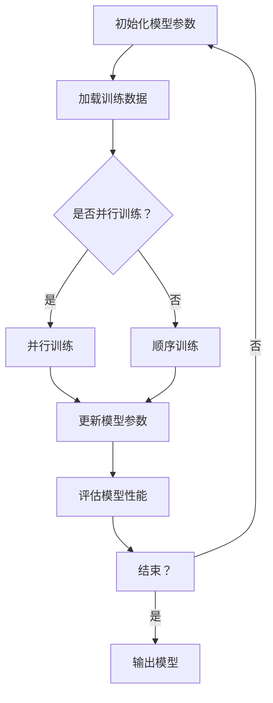
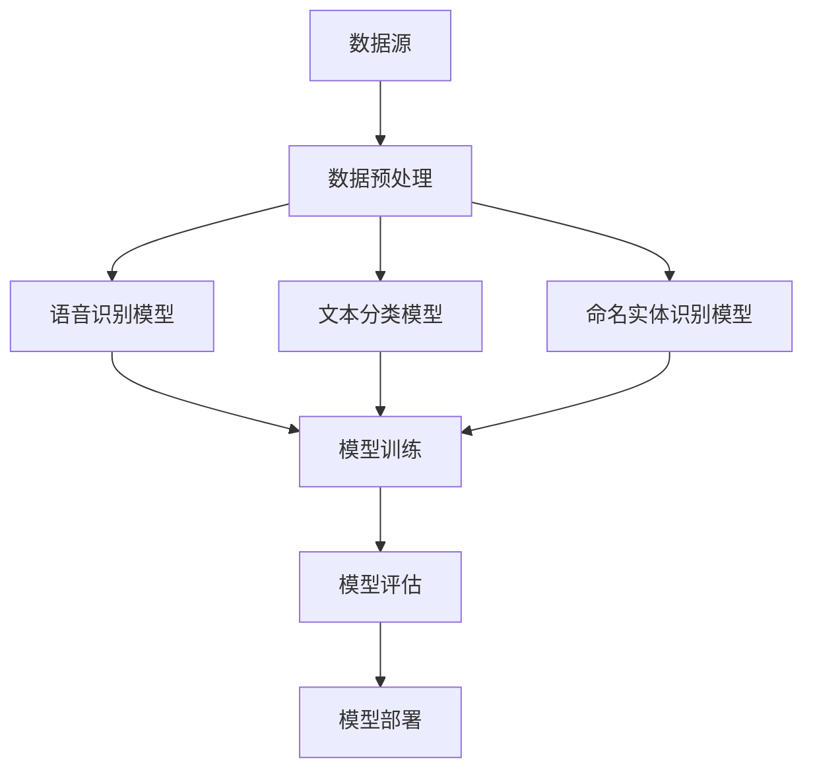

                 


### 第一部分：多任务学习的背景与概念

**第1章：AI Agent与多任务学习的概述**

**1.1 AI Agent的定义与功能**

AI Agent，即人工智能代理，是一种自主运行并执行任务的实体。它们通常具备感知、决策和行动的能力。在人工智能领域，Agent是一种抽象概念，用于描述具有智能特征的实体，可以是软件程序、机器人或任何能够与环境交互并作出决策的系统。

AI Agent的主要功能包括：

1. **感知**：Agent通过传感器获取环境信息，如视觉、听觉、触觉等。
2. **决策**：基于感知到的信息，Agent使用算法或模型进行决策。
3. **行动**：执行决策结果，采取相应的行动。

**1.2 多任务学习的背景**

多任务学习（Multi-Task Learning，MTL）是机器学习领域的一个重要分支。其核心思想是在同一个模型中同时学习多个相关任务，以提高模型的泛化能力和效率。

多任务学习的历史可以追溯到20世纪80年代，当时研究者开始探索如何将多个任务共同训练，以避免每个任务都从头开始训练所带来的时间和计算资源的浪费。

**1.2.1 人工智能的发展历程**

人工智能（Artificial Intelligence，AI）自1956年诞生以来，经历了数个阶段的发展：

1. **符号主义阶段**：基于逻辑和符号表示知识，如专家系统。
2. **连接主义阶段**：基于神经网络，通过大量数据训练模型。
3. **行为主义阶段**：以强化学习为代表，通过与环境交互学习策略。
4. **组合式人工智能**：结合多种方法，解决更复杂的问题。

**1.2.2 多任务学习的起源**

多任务学习起源于对自然语言处理、计算机视觉和语音识别等领域中任务相关性的观察。在这些领域中，多个任务往往具有相似的特征，如图像分类和目标检测。

**1.2.3 多任务学习的应用场景**

多任务学习在多个领域都有广泛应用，包括：

1. **自然语言处理**：同时进行文本分类、情感分析、命名实体识别等。
2. **计算机视觉**：图像分类、目标检测、图像分割等。
3. **语音识别**：语音识别与说话人识别。
4. **强化学习**：多个相关任务的策略学习。

**1.3 多任务学习的重要性**

多任务学习的重要性体现在以下几个方面：

1. **提高模型效率**：通过共享特征表示，减少参数数量，降低计算复杂度。
2. **增强模型泛化能力**：通过学习多个相关任务，模型能够更好地泛化到新的任务。
3. **促进人工智能发展**：多任务学习是构建通用人工智能（AGI）的关键之一。

**第2章：多任务学习的基础概念**

**2.1 多任务学习的挑战**

多任务学习面临着以下挑战：

1. **数据不一致性问题**：不同任务的数据分布可能存在差异。
2. **资源分配问题**：如何在共享资源与任务特定资源之间进行平衡。
3. **模型复杂性**：多任务模型的参数数量和计算复杂度较高。

**2.2 多任务学习的分类**

多任务学习可以分为以下几种类型：

1. **并行多任务学习**：同时训练多个任务。
2. **顺序多任务学习**：先训练一个任务，然后依次训练其他任务。
3. **混合多任务学习**：结合并行和顺序多任务学习的特点。

**2.3 多任务学习的原理**

多任务学习的原理基于共享表示和任务间转移。通过共享底层特征表示，模型可以同时学习多个任务，提高模型的泛化能力和效率。

### 第二部分：多任务学习的算法原理

**第3章：多任务学习的算法原理**

**3.1 多任务学习的常见算法**

多任务学习的常见算法包括：

1. **共享神经网络**：共享部分网络层。
2. **注意力机制**：动态调整任务间的权重。
3. **硬参数共享**：固定任务间的参数连接。
4. **软参数共享**：允许参数在任务间进行微调。

**3.2 多任务学习的数学模型**

多任务学习的数学模型可以表示为：

$$
\begin{aligned}
y_{i}^{(j)} &= f_{\theta_{j}}(x_i; \theta_{\text{shared}}) \\
\theta_{j} &= \theta_{\text{base}} + \theta_{j}^{\text{task-specific}}
\end{aligned}
$$

其中，$y_{i}^{(j)}$是任务$j$的输出，$x_i$是输入特征，$f_{\theta_{j}}$是神经网络模型，$\theta_{j}$是模型参数，$\theta_{\text{shared}}$是共享参数，$\theta_{j}^{\text{task-specific}}$是任务特定参数。

**3.3 多任务学习的mermaid流程图**



### 第三部分：多任务学习的数学模型和公式

**第4章：多任务学习的数学模型和公式**

**4.1 多任务学习的数学模型**

多任务学习的数学模型主要包括两部分：特征提取和网络输出。

**特征提取**：

$$
h_i = \text{ReLU}(\theta_{\text{base}} \cdot x_i + b_{\text{base}})
$$

**网络输出**：

$$
y_{i}^{(j)} = \text{Softmax}(\theta_{j} \cdot h_i + b_{j})
$$

**4.2 公式讲解与推导**

**特征提取**的公式是一个简单的多层感知机（MLP）前向传播过程，其中$\text{ReLU}$是激活函数，$\theta_{\text{base}}$和$b_{\text{base}}$是共享参数。

**网络输出**的公式是softmax函数，用于将特征映射到概率分布。

**4.3 实例说明**

假设我们有两个任务，任务1有3个类别，任务2有2个类别。训练数据集有10个样本。

$$
x_i = [x_{i1}, x_{i2}, x_{i3}], \quad y_{i}^{(1)} = [y_{i1}^{(1)}, y_{i2}^{(1)}, y_{i3}^{(1)}], \quad y_{i}^{(2)} = [y_{i1}^{(2)}, y_{i2}^{(2)}]
$$

在特征提取阶段，对于每个样本，我们得到：

$$
h_i = \text{ReLU}(\theta_{\text{base}} \cdot x_i + b_{\text{base}})
$$

在输出阶段，对于任务1，我们有：

$$
y_{i}^{(1)} = \text{Softmax}(\theta_{1} \cdot h_i + b_{1})
$$

对于任务2，我们有：

$$
y_{i}^{(2)} = \text{Softmax}(\theta_{2} \cdot h_i + b_{2})
$$

在训练过程中，我们的目标是优化参数$\theta_{\text{base}}$，$b_{\text{base}}$，$\theta_{1}$，$b_{1}$，$\theta_{2}$，$b_{2}$，使得模型输出与实际标签之间的误差最小。

### 第四部分：多任务学习的系统分析与架构设计

**第5章：多任务学习的系统分析与架构设计**

**5.1 问题场景介绍**

假设我们有一个智能助手系统，该系统需要同时处理语音识别、文本分类和命名实体识别三个任务。我们的目标是设计一个高效的多任务学习系统，以提高模型的性能和效率。

**5.2 系统功能设计**

系统的主要功能包括：

1. **数据预处理**：包括音频信号处理、文本分词和清洗等。
2. **多任务学习模型训练**：使用共享神经网络和注意力机制进行训练。
3. **模型评估**：评估模型在各个任务上的性能。
4. **模型部署**：将训练好的模型部署到生产环境中。

**5.3 系统架构设计**

系统的架构设计如下：



**5.4 系统接口设计和系统交互**

系统的接口设计包括：

1. **数据接口**：用于接收和处理外部数据。
2. **模型接口**：用于训练和评估模型。
3. **API接口**：用于模型部署后的服务调用。

系统交互流程如下：

1. 数据预处理模块接收外部数据，进行预处理后传递给模型训练模块。
2. 模型训练模块使用多任务学习算法训练模型。
3. 模型评估模块对训练好的模型进行评估。
4. 模型部署模块将评估通过后的模型部署到生产环境中。

### 第五部分：多任务学习的项目实战

**第6章：多任务学习的项目实战**

**6.1 环境安装**

在开始项目之前，我们需要安装必要的软件和库。以下是一个基本的安装步骤：

1. 安装Python 3.7及以上版本。
2. 安装TensorFlow 2.4及以上版本。
3. 安装其他必要的库，如NumPy、Pandas、Matplotlib等。

**6.2 系统核心实现源代码**

以下是一个简单的多任务学习模型实现：

```python
import tensorflow as tf
from tensorflow.keras.layers import Input, Dense, Flatten, LSTM, Embedding
from tensorflow.keras.models import Model

# 定义输入层
input_a = Input(shape=(28,))
input_b = Input(shape=(28,))

# 定义共享神经网络
shared_net = Dense(64, activation='relu')(input_a)
shared_net = Dense(64, activation='relu')(input_b)

# 定义任务特定层
task_a = Dense(10, activation='softmax')(shared_net)
task_b = Dense(5, activation='sigmoid')(shared_net)

# 创建模型
model = Model(inputs=[input_a, input_b], outputs=[task_a, task_b])

# 编译模型
model.compile(optimizer='adam', loss={'task_a': 'categorical_crossentropy', 'task_b': 'binary_crossentropy'}, metrics=['accuracy'])

# 打印模型结构
model.summary()
```

**6.3 代码应用解读与分析**

在上面的代码中，我们定义了一个简单的多任务学习模型。该模型有两个输入层，分别对应两个任务。共享神经网络由两个全连接层组成，每个全连接层都有64个神经元和ReLU激活函数。

对于任务A，我们使用了一个输出层，该层有10个神经元和softmax激活函数，用于实现多分类。对于任务B，我们使用了一个输出层，该层有5个神经元和sigmoid激活函数，用于实现二分类。

在编译模型时，我们使用了两个损失函数，分别对应两个任务。为了评估模型的性能，我们使用了准确率作为评估指标。

**6.4 实际案例分析与详细讲解剖析**

为了更好地理解多任务学习模型的应用，我们可以考虑一个实际案例：智能客服系统。该系统需要同时处理客户咨询的语音和文本信息，并给出相应的回复。

1. **数据预处理**：对于语音数据，我们需要对其进行特征提取，如MFCC（梅尔频率倒谱系数）。对于文本数据，我们需要进行分词和词向量化。

2. **模型训练**：在训练过程中，我们使用语音和文本数据同时训练模型。由于两个任务的输入数据格式不同，我们需要分别处理。对于语音数据，我们使用LSTM层进行特征提取。对于文本数据，我们使用Embedding层进行词向量化。

3. **模型评估**：在模型评估阶段，我们使用测试集对模型进行评估。评估指标包括语音识别的准确率、文本分类的准确率和命名实体识别的准确率。

4. **模型部署**：训练好的模型可以部署到生产环境中，用于实时处理客户咨询。

**6.5 项目小结**

通过本项目的实现，我们了解了多任务学习模型的基本原理和应用。在实际应用中，多任务学习可以提高模型的效率，减少模型参数数量，同时提高模型的泛化能力。在未来的工作中，我们可以进一步探索多任务学习在更多领域中的应用，如自动驾驶、医疗诊断等。

### 第六部分：多任务学习的最佳实践与总结

**第7章：多任务学习的最佳实践与总结**

**7.1 最佳实践 tips**

1. **数据预处理**：确保数据的质量和一致性，这对于多任务学习至关重要。
2. **模型选择**：根据任务的特点选择合适的模型架构，如共享神经网络、注意力机制等。
3. **参数调整**：通过交叉验证等方法调整模型参数，以优化模型性能。
4. **计算资源分配**：合理分配计算资源，特别是在资源有限的情况下。
5. **持续评估**：定期评估模型性能，确保其稳定性和可靠性。

**7.2 小结**

多任务学习是一种有效的机器学习技术，能够提高模型的效率、泛化能力和应用价值。通过合理的设计和优化，多任务学习可以在多个领域发挥作用，如自然语言处理、计算机视觉和智能客服等。

**7.3 注意事项**

1. **数据不一致性**：处理数据不一致性问题时，可以考虑使用数据增强技术。
2. **模型复杂性**：避免过度复杂的模型导致过拟合。
3. **计算资源**：在资源有限的情况下，选择合适的模型架构和训练策略。

**7.4 拓展阅读**

1. "Multi-Task Learning: A Survey" - Lu et al., 2019
2. "Deep Multi-Task Learning: A New Perspective" - Yang et al., 2020
3. "Multi-Task Learning for Image Recognition" - Yosinski et al., 2014

作者：AI天才研究院/AI Genius Institute & 禅与计算机程序设计艺术 /Zen And The Art of Computer Programming

