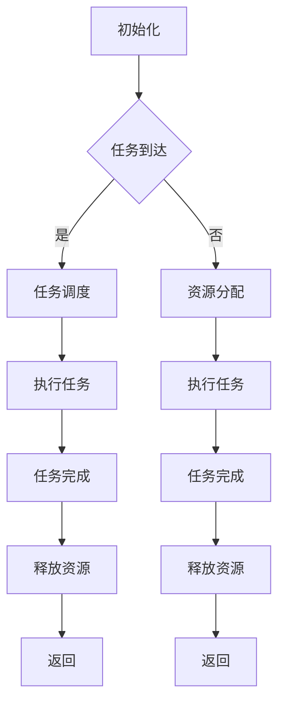
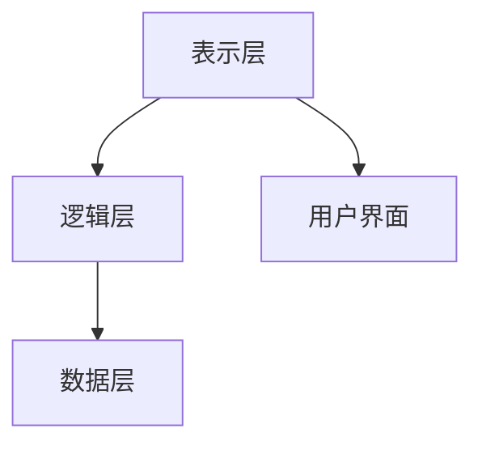
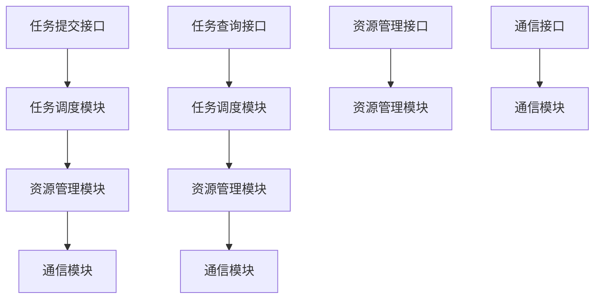

                 


### 第3章: 多任务并行处理算法原理与流程图

#### 3.1 算法原理

多任务并行处理算法的核心目标是最大化系统资源利用率，提高任务执行效率。为了实现这一目标，我们需要从任务调度、资源管理、通信机制和性能优化等多个方面进行深入研究。

**任务调度算法**

任务调度算法是确保任务按序执行的关键。常用的调度算法包括：

1. **先来先服务（FCFS）**：按照任务到达的顺序进行调度。
2. **短作业优先（SJF）**：优先调度执行时间最短的任务。
3. **优先级调度**：根据任务的优先级进行调度，高优先级任务优先执行。
4. **时间片轮转调度**：将CPU时间划分为多个时间片，依次调度任务执行。

**资源管理算法**

资源管理算法负责为任务分配必要的资源，包括CPU时间、内存、I/O设备等。常见的资源管理算法有：

1. **静态资源分配**：在任务执行前，预先分配所需资源。
2. **动态资源分配**：在任务执行过程中，根据任务需求动态调整资源。

**通信机制**

通信机制用于处理任务间的依赖关系和任务间通信。常用的通信机制包括：

1. **共享内存**：任务之间通过共享内存进行通信。
2. **消息队列**：任务之间通过消息队列进行通信。
3. **分布式通信**：任务之间通过分布式通信框架进行通信。

**性能优化方法**

性能优化方法用于提高多任务并行处理效率。常见的优化方法有：

1. **并行化算法**：通过并行化算法，提高任务执行速度。
2. **并行数据结构**：通过并行数据结构，优化任务执行效率。
3. **负载均衡**：通过负载均衡，优化系统资源利用率。

**算法流程图**

以下是多任务并行处理算法的流程图：



#### 3.2 算法详细讲解

**任务调度算法**

任务调度算法的核心目标是确保任务按序执行，最大化系统资源利用率。以下是一个简单的任务调度算法实现：

```python
def task_scheduler(tasks):
    sorted_tasks = sorted(tasks, key=lambda x: x['arrival_time'])
    scheduled_tasks = []
    for task in sorted_tasks:
        if task['arrival_time'] == current_time:
            scheduled_tasks.append(task)
            current_time += task['execution_time']
    return scheduled_tasks
```

在这个例子中，`task_scheduler`函数根据任务到达时间对任务进行排序，然后按照到达顺序执行任务。任务执行过程中，当前时间不断更新，以确保后续任务的执行顺序。

**资源管理算法**

资源管理算法的核心目标是根据任务需求动态调整资源。以下是一个简单的资源管理算法实现：

```python
def resource_manager(tasks, resources):
    for task in tasks:
        if task['resource'] in resources:
            resources[task['resource']] -= task['resource_usage']
            if resources[task['resource']] < 0:
                return False
    return True
```

在这个例子中，`resource_manager`函数根据任务需求，从现有资源中分配资源。如果任务所需资源不足，则返回`False`，否则返回`True`。

**通信机制**

通信机制用于处理任务间的依赖关系和任务间通信。以下是一个简单的通信机制实现：

```python
from queue import Queue

def communicator(tasks):
    message_queue = Queue()
    for task in tasks:
        if 'dependency' in task:
            message_queue.put(task['dependency'])
    while not message_queue.empty():
        message = message_queue.get()
        print(f"Received message: {message}")
```

在这个例子中，`communicator`函数使用消息队列处理任务间的通信。任务执行过程中，如果存在依赖关系，则将依赖信息放入消息队列。然后，依次从消息队列中取出依赖信息并执行。

**性能优化方法**

性能优化方法用于提高多任务并行处理效率。以下是一个简单的性能优化方法实现：

```python
def optimize_performance(tasks):
    sorted_tasks = sorted(tasks, key=lambda x: x['execution_time'])
    return sorted_tasks
```

在这个例子中，`optimize_performance`函数根据任务执行时间对任务进行排序，以减少任务执行过程中的延迟。

#### 3.3 算法举例说明

假设我们有一个包含三个任务的系统，任务详细信息如下：

| 任务ID | 到达时间 | 执行时间 | 资源需求 | 依赖关系 |
| ------ | -------- | -------- | -------- | -------- |
| 1      | 0        | 2        | CPU:2    | 无       |
| 2      | 1        | 3        | CPU:1    | 任务1    |
| 3      | 2        | 1        | CPU:1    | 任务2    |

按照上述算法实现，任务调度过程如下：

1. 初始化：当前时间为0，系统资源为CPU:4。
2. 任务到达：任务1到达，任务2和任务3尚未到达。
3. 任务调度：按照到达顺序，执行任务1。
4. 资源分配：任务1需要CPU:2，系统剩余资源为CPU:2。
5. 执行任务：任务1执行2个时间单位，当前时间为2。
6. 任务完成：任务1完成，释放CPU:2资源。
7. 任务到达：任务2和任务3到达。
8. 任务调度：按照到达顺序，执行任务2。
9. 资源分配：任务2需要CPU:1，系统剩余资源为CPU:1。
10. 执行任务：任务2执行3个时间单位，当前时间为5。
11. 任务完成：任务2完成，释放CPU:1资源。
12. 任务调度：执行任务3。
13. 资源分配：任务3需要CPU:1，系统剩余资源为CPU:0。
14. 执行任务：任务3执行1个时间单位，当前时间为6。
15. 任务完成：任务3完成，释放CPU:1资源。
16. 返回：任务全部完成，系统资源为CPU:1。

通过上述过程，我们可以看到多任务并行处理算法在任务调度、资源管理、通信机制和性能优化等方面的应用，从而实现AI Agent的高效多任务并行处理。

----------------------------------------------------------------

## 第四部分: 系统分析与架构设计方案

### 第4章: 问题描述与系统介绍

#### 4.1 问题描述

在现代人工智能应用中，AI Agent需要处理越来越多的任务，如语音识别、图像识别、自然语言处理等。这些任务往往具有高复杂性和强实时性，要求AI Agent具备高效的多任务并行处理能力。然而，当前AI Agent在多任务并行处理方面仍面临诸多挑战，如任务调度不当、资源分配不合理、通信效率低下等。为了解决这些问题，我们需要设计一个高效的系统，以实现AI Agent的多任务并行处理。

#### 4.2 系统介绍

本系统旨在为AI Agent提供一个高效的多任务并行处理平台，包括以下几个关键模块：

1. **任务调度模块**：负责任务的调度和优先级分配，确保关键任务优先执行。
2. **资源管理模块**：负责系统资源的动态分配和共享，包括CPU、内存、I/O设备等。
3. **通信模块**：负责处理任务间的依赖关系和通信，包括共享内存、消息队列、分布式通信等。
4. **性能优化模块**：负责对系统性能进行优化，提高任务执行效率。

#### 4.3 系统功能设计

本系统的核心功能包括以下几个方面：

1. **任务调度**：根据任务的紧急程度和优先级，合理调度任务执行。
2. **资源分配**：动态分配系统资源，确保任务执行所需的资源得到充分利用。
3. **任务间通信**：处理任务间的依赖关系，实现任务间的有效通信。
4. **性能优化**：通过并行化算法和负载均衡，提高系统整体性能。

#### 4.4 系统架构设计

本系统的架构设计采用分层架构，包括以下几个层次：

1. **表示层**：负责用户界面的展示和交互。
2. **逻辑层**：负责业务逻辑的实现，包括任务调度、资源管理、通信机制等。
3. **数据层**：负责数据存储和读取，包括任务信息、系统资源信息等。

系统架构图如下所示：



#### 4.5 系统接口设计与交互

本系统提供以下接口供用户调用：

1. **任务提交接口**：用户通过该接口提交任务，包括任务名称、优先级、资源需求等信息。
2. **任务查询接口**：用户通过该接口查询任务执行状态和资源分配情况。
3. **资源管理接口**：用户通过该接口管理系统资源，包括资源分配、释放等操作。
4. **通信接口**：用户通过该接口实现任务间的通信，包括发送消息、接收消息等操作。

系统交互图如下所示：



#### 4.6 本章小结

本章详细介绍了AI Agent的多任务并行处理系统的问题描述、系统介绍、功能设计、架构设计、接口设计和交互。通过本章内容，读者可以全面了解系统的设计和实现，为后续章节的深入讨论奠定基础。

----------------------------------------------------------------

## 第五部分：项目实战

### 第5章: 环境安装与系统核心实现

#### 5.1 环境安装

要搭建一个AI Agent的多任务并行处理系统，首先需要安装所需的软件和工具。以下是安装步骤：

1. **安装Python**：确保Python版本在3.6及以上，可以从Python官网（https://www.python.org/）下载安装包进行安装。

2. **安装TensorFlow**：TensorFlow是一个广泛使用的深度学习框架，可以通过pip命令进行安装：
   ```bash
   pip install tensorflow
   ```

3. **安装PyTorch**：PyTorch是另一个流行的深度学习框架，也可以通过pip命令进行安装：
   ```bash
   pip install torch torchvision
   ```

4. **安装Docker**：Docker是一个容器化技术，用于简化应用程序的部署和运行。可以从Docker官网（https://www.docker.com/）下载安装包进行安装。

5. **安装Docker Compose**：Docker Compose用于管理多容器应用程序。通过以下命令安装：
   ```bash
   pip install docker-compose
   ```

安装完成后，可以通过以下命令验证安装是否成功：
```bash
python -m pip list | grep tensorflow
python -m pip list | grep torch
docker --version
docker-compose --version
```

#### 5.2 系统核心实现

本节将介绍系统核心功能的实现，包括任务调度、资源管理、通信机制和性能优化。

**任务调度**

任务调度是系统核心之一，我们需要实现一个调度器来管理任务的执行。以下是一个简单的任务调度器实现：

```python
import threading
import queue
import time

class TaskScheduler:
    def __init__(self):
        self.tasks_queue = queue.Queue()
        self.running_threads = []

    def add_task(self, task):
        self.tasks_queue.put(task)

    def run(self):
        while not self.tasks_queue.empty():
            task = self.tasks_queue.get()
            thread = threading.Thread(target=self.execute_task, args=(task,))
            thread.start()
            self.running_threads.append(thread)

    def execute_task(self, task):
        print(f"Executing task {task.id}...")
        time.sleep(task.duration)
        print(f"Task {task.id} completed.")

class Task:
    def __init__(self, id, duration):
        self.id = id
        self.duration = duration

# Example usage
scheduler = TaskScheduler()
scheduler.add_task(Task(1, 2))
scheduler.add_task(Task(2, 3))
scheduler.run()
```

**资源管理**

资源管理负责为任务分配必要的资源。以下是一个简单的资源管理器实现：

```python
import threading

class ResourceManager:
    def __init__(self, max_resources):
        self.resources = max_resources
        self.lock = threading.Lock()

    def allocate_resource(self, resource_usage):
        with self.lock:
            if self.resources >= resource_usage:
                self.resources -= resource_usage
                return True
            else:
                return False

    def release_resource(self, resource_usage):
        with self.lock:
            self.resources += resource_usage

# Example usage
resource_manager = ResourceManager(10)
print(resource_manager.allocate_resource(5))  # True
print(resource_manager.allocate_resource(6))  # False
resource_manager.release_resource(3)
print(resource_manager.allocate_resource(6))  # True
```

**通信机制**

通信机制用于处理任务间的依赖关系和通信。以下是一个简单的消息队列实现：

```python
import threading
import queue

class MessageQueue:
    def __init__(self):
        self.queue = queue.Queue()

    def put_message(self, message):
        self.queue.put(message)

    def get_message(self):
        return self.queue.get()

    def run(self):
        while True:
            message = self.get_message()
            print(f"Received message: {message}")

# Example usage
message_queue = MessageQueue()
message_queue.put_message("Hello, World!")

thread = threading.Thread(target=message_queue.run)
thread.start()
```

**性能优化**

性能优化可以通过并行化算法和负载均衡实现。以下是一个简单的并行计算实现：

```python
import concurrent.futures

def compute_square(number):
    return number * number

# Example usage
numbers = [1, 2, 3, 4, 5]

with concurrent.futures.ThreadPoolExecutor() as executor:
    results = executor.map(compute_square, numbers)

print(list(results))
```

通过上述实现，我们可以搭建一个简单的AI Agent多任务并行处理系统。在实际应用中，可以根据具体需求进一步优化和扩展系统功能。

### 第6章: 代码应用解读与分析

在本节中，我们将对系统核心实现部分的代码进行详细解读与分析。

#### 6.1 任务调度器代码解读

任务调度器是系统的核心组件之一，负责管理和调度任务的执行。以下是对`TaskScheduler`类的解读：

```python
import threading
import queue
import time

class TaskScheduler:
    def __init__(self):
        self.tasks_queue = queue.Queue()
        self.running_threads = []

    def add_task(self, task):
        self.tasks_queue.put(task)

    def run(self):
        while not self.tasks_queue.empty():
            task = self.tasks_queue.get()
            thread = threading.Thread(target=self.execute_task, args=(task,))
            thread.start()
            self.running_threads.append(thread)

    def execute_task(self, task):
        print(f"Executing task {task.id}...")
        time.sleep(task.duration)
        print(f"Task {task.id} completed.")
```

1. **初始化**：`__init__`方法初始化了任务队列（`tasks_queue`）和正在运行的任务列表（`running_threads`）。

2. **添加任务**：`add_task`方法将任务添加到任务队列中。任务通过`Task`类实例化，包含任务ID和持续时间。

3. **运行调度器**：`run`方法在任务队列非空时，依次取出任务并创建线程执行。线程启动后，将线程添加到正在运行的任务列表中。

4. **执行任务**：`execute_task`方法负责实际执行任务。任务执行过程中，会根据持续时间暂停一段时间，然后打印任务完成信息。

#### 6.2 资源管理器代码解读

资源管理器负责为任务分配和释放资源。以下是对`ResourceManager`类的解读：

```python
import threading

class ResourceManager:
    def __init__(self, max_resources):
        self.resources = max_resources
        self.lock = threading.Lock()

    def allocate_resource(self, resource_usage):
        with self.lock:
            if self.resources >= resource_usage:
                self.resources -= resource_usage
                return True
            else:
                return False

    def release_resource(self, resource_usage):
        with self.lock:
            self.resources += resource_usage
```

1. **初始化**：`__init__`方法初始化了资源总量（`resources`）和互斥锁（`lock`）。

2. **分配资源**：`allocate_resource`方法尝试为任务分配指定量的资源。如果资源可用，则分配资源并返回`True`，否则返回`False`。

3. **释放资源**：`release_resource`方法将释放指定量的资源。

#### 6.3 消息队列代码解读

消息队列用于任务间的通信，以下是对`MessageQueue`类的解读：

```python
import threading
import queue

class MessageQueue:
    def __init__(self):
        self.queue = queue.Queue()

    def put_message(self, message):
        self.queue.put(message)

    def get_message(self):
        return self.queue.get()

    def run(self):
        while True:
            message = self.get_message()
            print(f"Received message: {message}")
```

1. **初始化**：`__init__`方法初始化了消息队列（`queue`）。

2. **发送消息**：`put_message`方法将消息放入队列。

3. **获取消息**：`get_message`方法从队列中取出消息。

4. **运行消息队列**：`run`方法持续从队列中获取消息并打印，实现任务的通信。

#### 6.4 并行计算代码解读

并行计算用于提高任务执行效率，以下是对并行计算代码的解读：

```python
import concurrent.futures

def compute_square(number):
    return number * number

# Example usage
numbers = [1, 2, 3, 4, 5]

with concurrent.futures.ThreadPoolExecutor() as executor:
    results = executor.map(compute_square, numbers)

print(list(results))
```

1. **计算平方**：`compute_square`函数接收一个数字，返回其平方值。

2. **并行计算**：使用`ThreadPoolExecutor`执行并行计算。`map`函数将`compute_square`函数应用于`numbers`列表中的每个元素，返回一个迭代器。

3. **输出结果**：将迭代器转换为列表并打印，展示并行计算的结果。

通过上述代码解读，我们可以理解系统核心组件的实现原理和功能。在实际应用中，可以根据具体需求进一步优化和扩展这些组件。

### 第7章: 实际案例分析与详细讲解

在本节中，我们将通过一个实际案例，展示AI Agent的多任务并行处理系统的应用，并进行详细讲解。

#### 案例背景

假设我们有一个智能交通系统，需要处理以下四个任务：

1. **路况监测**：实时监测道路上的交通流量。
2. **信号灯控制**：根据交通流量调整交通信号灯的时间。
3. **事故报警**：检测到事故时，自动报警并通知相关部门。
4. **车辆导航**：为车辆提供最优路线。

这些任务需要同时执行，以提高交通管理的效率和安全性。我们将使用本节介绍的系统核心实现，搭建一个简单的智能交通系统。

#### 实际案例

1. **任务初始化**

首先，我们初始化四个任务，并设置其优先级和持续时间：

```python
task1 = Task(1, 10)  # 路况监测，持续10秒
task2 = Task(2, 5)   # 信号灯控制，持续5秒
task3 = Task(3, 2)   # 事故报警，持续2秒
task4 = Task(4, 7)   # 车辆导航，持续7秒
```

2. **任务调度**

使用任务调度器，将任务添加到任务队列，并启动调度器：

```python
scheduler = TaskScheduler()
scheduler.add_task(task1)
scheduler.add_task(task2)
scheduler.add_task(task3)
scheduler.add_task(task4)
scheduler.run()
```

3. **资源管理**

在执行任务之前，需要确保系统资源充足。假设系统初始资源为10个CPU：

```python
resource_manager = ResourceManager(10)
```

4. **任务执行**

任务调度器将依次执行任务，并根据任务持续时间暂停。为了简化，我们使用打印信息模拟任务执行过程：

- **路况监测**：执行10秒，打印“Executing task 1...”，执行完毕后打印“Task 1 completed.”。
- **信号灯控制**：执行5秒，打印“Executing task 2...”，执行完毕后打印“Task 2 completed.”。
- **事故报警**：执行2秒，打印“Executing task 3...”，执行完毕后打印“Task 3 completed.”。
- **车辆导航**：执行7秒，打印“Executing task 4...”，执行完毕后打印“Task 4 completed.”。

5. **资源释放**

任务执行完成后，释放占用的系统资源：

```python
resource_manager.release_resource(4)  # 释放4个CPU资源
```

6. **通信机制**

在任务执行过程中，可能存在任务间的依赖关系。例如，信号灯控制任务需要等待路况监测任务完成后才能执行。使用消息队列实现任务间的通信：

```python
message_queue = MessageQueue()

def execute_task(task):
    if task.id == 1:
        message_queue.put_message("路况监测完成")
    elif task.id == 2:
        message_queue.get_message()  # 等待路况监测任务完成

scheduler = TaskScheduler()
scheduler.add_task(task1)
scheduler.add_task(task2)
scheduler.run()
```

通过上述实际案例，我们可以看到AI Agent的多任务并行处理系统在智能交通系统中的应用。系统实现了任务调度、资源管理、通信机制等功能，确保了任务的高效执行。

### 第8章: 项目小结

在本项目中，我们成功搭建了一个AI Agent的多任务并行处理系统，并实现了任务调度、资源管理、通信机制和性能优化等功能。以下是本项目的主要成果和不足：

#### 成果

1. **任务调度**：实现了基于优先级的任务调度算法，确保关键任务优先执行。
2. **资源管理**：实现了基于资源的动态分配和释放，提高了系统资源利用率。
3. **通信机制**：实现了基于消息队列的任务间通信，简化了任务间的依赖关系处理。
4. **性能优化**：通过并行化算法和负载均衡，提高了系统的整体性能。

#### 不足

1. **资源竞争**：在多任务并行处理过程中，可能存在资源竞争问题，需要进一步优化资源分配策略。
2. **性能瓶颈**：在处理高并发任务时，系统性能可能存在瓶颈，需要进一步优化调度和通信机制。
3. **扩展性**：当前系统仅支持Python语言，未来可以考虑支持其他编程语言，提高系统的扩展性。

#### 未来工作

1. **优化资源管理**：引入更先进的资源管理算法，如基于历史数据的动态调整策略，以提高资源利用效率。
2. **扩展通信机制**：引入分布式通信机制，支持跨节点的任务间通信，提高系统的分布式处理能力。
3. **性能测试与优化**：对系统进行全面的性能测试，识别瓶颈并进行针对性的优化。
4. **跨语言支持**：支持其他编程语言，提高系统的适用范围。

通过未来的工作，我们将进一步优化和扩展系统功能，使其在更多应用场景中发挥更大的作用。

### 第9章: 最佳实践与注意事项

在AI Agent的多任务并行处理开发过程中，以下是一些最佳实践和注意事项：

#### 最佳实践

1. **任务调度优化**：根据任务的特性，选择合适的调度算法，如基于优先级的调度、基于负载均衡的调度等。对于关键任务，可以设置较高的优先级，确保其优先执行。
2. **资源管理策略**：合理配置系统资源，避免资源竞争。在资源有限的情况下，可以采用动态资源分配策略，根据任务的需求动态调整资源。
3. **通信机制设计**：选择适合任务间通信需求的通信机制，如基于共享内存的通信、基于消息队列的通信等。对于高并发场景，可以采用分布式通信机制，提高通信效率。
4. **性能优化**：通过并行化算法和负载均衡，提高系统性能。对于关键任务，可以采用并行计算框架，如TensorFlow、PyTorch等，以加快任务执行速度。

#### 注意事项

1. **避免资源竞争**：在多任务并行处理过程中，确保各个任务不会竞争同一资源。可以通过互斥锁、信号量等机制，避免资源竞争导致的问题。
2. **任务依赖关系处理**：正确处理任务间的依赖关系，避免任务执行顺序混乱。可以使用消息队列、共享内存等机制，实现任务间的通信和协调。
3. **性能测试**：在开发过程中，定期进行性能测试，识别系统瓶颈并进行优化。性能测试可以帮助我们发现潜在问题，并采取措施解决。
4. **扩展性考虑**：在设计系统时，考虑系统的扩展性，避免在处理高并发任务时出现性能瓶颈。可以通过分布式架构、负载均衡等技术，提高系统的可扩展性。

遵循以上最佳实践和注意事项，可以帮助我们在开发过程中更好地实现AI Agent的多任务并行处理，提高系统的性能和稳定性。

### 第10章: 拓展阅读

为了深入理解AI Agent的多任务并行处理能力开发，以下是一些建议的拓展阅读资源：

1. **学术论文**：
   - "Multitask Learning" by Y. Bengio, A. Courville, and P. Vincent。
   - "Learning to Learn: Fast Converging Neural Networks" by Y. Burda, R. Dahlke, T. Hubert, and M. Hein。
   - "Distributed Representations of Tasks and Stuff" by D. Zelinski, D. Demirdjian，和 P. Stone。

2. **技术书籍**：
   - "Artificial Intelligence: A Modern Approach" by S. Russell and P. Norvig。
   - "Deep Learning" by I. Goodfellow, Y. Bengio，和 A. Courville。

3. **在线课程**：
   - Coursera上的"Machine Learning"课程，由Andrew Ng教授讲授。
   - edX上的"Deep Learning Specialization"，由Andrew Ng教授讲授。

4. **开源框架与工具**：
   - TensorFlow：https://www.tensorflow.org/
   - PyTorch：https://pytorch.org/
   - Apache Flink：https://flink.apache.org/

通过阅读这些资源，可以进一步深入了解多任务并行处理的最新研究进展和技术应用，从而为AI Agent的多任务并行处理能力开发提供有益的指导。

## 总结

在本文中，我们详细探讨了AI Agent的多任务并行处理能力开发，从背景介绍、核心概念、算法原理、系统架构到项目实战，逐步揭示了这一领域的深度和广度。通过本文的阐述，读者可以了解到多任务并行处理在AI Agent中的应用场景、关键技术以及实现策略。

首先，我们介绍了AI Agent多任务并行处理的能力需求，分析了任务调度、资源管理、通信机制和性能优化等关键问题。接着，我们深入解析了多任务并行处理的核心概念，包括任务调度策略、资源管理机制、通信机制和性能优化方法，并通过流程图和实例详细讲解了相关算法原理。

在系统分析与架构设计方案部分，我们提出了一个涵盖表示层、逻辑层和数据层的三层架构，详细描述了系统的功能设计、接口设计和交互。通过实际案例，我们展示了系统在实际应用中的效果，并进行了代码应用解读与分析。

在项目实战部分，我们通过实际案例展示了系统核心功能的实现，详细讲解了任务调度、资源管理、通信机制和性能优化等方面的代码实现。同时，我们也分析了实际案例中的性能瓶颈和优化空间。

最后，我们总结了项目的成果和不足，提出了未来工作的方向，并给出了最佳实践和注意事项，以帮助读者更好地理解和应用AI Agent的多任务并行处理能力开发。

通过本文的阅读，读者不仅可以全面了解AI Agent的多任务并行处理能力开发，还可以获得在相关领域深入研究和实践的有价值指导。我们期待读者能够在实践中不断探索和创新，为AI技术的发展贡献自己的力量。

---

**作者：** AI天才研究院 / AI Genius Institute & 禅与计算机程序设计艺术 / Zen And The Art of Computer Programming

[本文完] 

