                 

### 文章标题：AI Agent的多模态生成：创造跨媒体内容

#### 关键词：AI Agent、多模态生成、跨媒体内容、内容创作、系统设计

#### 摘要：
本文旨在深入探讨AI Agent在多模态生成领域的应用，特别是如何通过跨媒体内容生成来推动内容创作的革命。我们将逐步分析AI Agent的多模态感知与数据处理、多模态融合策略及其在文本、图像和音频生成中的应用，详细讲解其在娱乐、教育和商业领域的应用场景，并通过项目实战展示其实际效果。最后，我们将总结多模态生成技术的进展，并提出未来展望。

----------------------------------------------------------------

## 第一部分：引言

### 第1章：问题背景与跨媒体内容生成概述

#### 1.1 问题背景

人类交流具有多模态性，即我们通过语言、图像、声音等多种形式进行沟通。然而，传统的单模态内容生成技术（如仅生成文本、图像或音频）无法充分满足这种多模态交流的需求。为了更好地模拟人类交流，跨媒体内容生成应运而生。

#### 1.2 跨媒体内容生成概述

跨媒体内容生成指的是将不同模态（如文本、图像、音频）的信息融合，生成新的、更具吸引力和互动性的内容。其定义与分类包括文本-图像、文本-音频、图像-音频等多种形式。当前，这一领域呈现出迅猛发展的趋势，尤其在人工智能技术的推动下，其应用场景不断拓展。

### 第2章：多模态AI Agent基础理论

#### 2.1 多模态感知与数据处理

多模态感知与数据处理是AI Agent的核心组成部分。我们首先介绍感知技术，如深度学习、计算机视觉和语音识别，然后探讨数据预处理方法，包括去噪、增强和归一化等。

#### 2.2 多模态融合策略

多模态融合策略是跨媒体内容生成的重要环节。我们将概述多种融合方法，如基于特征的融合、基于模型的融合和混合融合等，并通过案例进行分析。

#### 2.3 AI Agent概述

AI Agent是指能够模拟人类行为和思维的智能体。我们介绍其定义与架构，以及模型选择与优化方法，如神经网络架构搜索（NAS）和生成对抗网络（GAN）等。

----------------------------------------------------------------

### 第3章：多模态生成技术

#### 3.1 多模态文本生成

多模态文本生成是将图像、音频等非结构化数据转换为文本信息的过程。我们将介绍文本生成模型，如生成式对抗网络（GAT）、变分自编码器（VAE）和递归神经网络（RNN）等，并通过应用案例进行解析。

#### 3.2 多模态图像生成

多模态图像生成是将文本、音频等模态转换为图像的过程。我们介绍图像生成模型，如生成对抗网络（GAN）、风格迁移模型和自编码器等，并通过实际案例进行展示。

#### 3.3 多模态音频生成

多模态音频生成是将图像、文本等模态转换为音频的过程。我们介绍音频生成模型，如WaveNet、循环神经网络（RNN）和注意力机制等，并通过实际案例进行说明。

----------------------------------------------------------------

### 第4章：跨媒体内容生成应用场景

#### 4.1 娱乐领域

娱乐领域是跨媒体内容生成的重要应用场景之一。我们将探讨如何利用AI Agent生成娱乐内容，如电影剧本、音乐和游戏等，并分析其对用户体验的改进。

#### 4.2 教育领域

教育领域同样受益于跨媒体内容生成技术。我们介绍如何利用AI Agent生成教学资源，如互动式课程、虚拟实验和智能辅导等，并分析其在教育效率提升方面的潜力。

#### 4.3 商业领域

商业领域也广泛应用跨媒体内容生成技术，如广告创作、客户服务和市场研究等。我们将分析这些应用场景，并探讨如何通过AI Agent提高商业运营效率。

----------------------------------------------------------------

### 第5章：多模态生成系统设计与实现

#### 5.1 系统需求分析

系统需求分析是设计多模态生成系统的第一步。我们介绍功能需求，如内容生成、编辑和发布等，以及非功能需求，如性能、可扩展性和安全性等。

#### 5.2 系统架构设计

系统架构设计是确保多模态生成系统高效运行的关键。我们介绍系统架构概述，包括数据层、模型层和应用层等，并展示具体的架构设计mermaid图。

#### 5.3 系统接口设计与实现

系统接口设计是多模态生成系统的核心部分。我们介绍接口规范，如RESTful API和GraphQL等，以及具体的实现细节，如数据传输格式、请求和响应处理等。

----------------------------------------------------------------

### 第6章：项目实战与案例分析

#### 6.1 项目一：娱乐内容创作系统

我们将通过一个具体的娱乐内容创作系统项目，介绍其环境安装与配置、系统核心实现，以及代码应用解读与分析，并提供项目小结。

#### 6.2 项目二：教育辅助系统

我们将通过一个教育辅助系统项目，介绍其环境安装与配置、系统核心实现，以及代码应用解读与分析，并提供项目小结。

----------------------------------------------------------------

### 第7章：总结与未来展望

#### 7.1 多模态生成技术总结

我们将回顾多模态生成技术的发展历程，分析其面临的挑战和趋势，并探讨其未来的发展方向。

#### 7.2 未来展望

我们展望多模态生成技术在新的应用领域，如医疗、艺术和金融等，以及技术创新方向，如多模态神经网络和联邦学习等。

----------------------------------------------------------------

## 结束语

本文系统地介绍了AI Agent在多模态生成领域的应用，探讨了跨媒体内容生成的理论、技术和实践。通过本文的阅读，读者可以深入了解这一领域的核心概念和技术原理，掌握其实际应用场景和系统设计方法。我们希望本文能为读者在跨媒体内容生成领域的研究和实践中提供有益的参考和启示。

### 作者：AI天才研究院/AI Genius Institute & 禅与计算机程序设计艺术 /Zen And The Art of Computer Programming

----------------------------------------------------------------

### 引言

随着人工智能技术的不断进步，AI Agent作为一种智能体，已经成为研究和应用的热点。AI Agent不仅能够模拟人类的行为和思维，还能够处理复杂的多模态信息，从而生成新的内容。跨媒体内容生成正是AI Agent在这个领域的一个重要应用，它旨在将不同模态的信息（如文本、图像、音频）融合在一起，生成更具吸引力和互动性的内容。

### 第1章：问题背景与跨媒体内容生成概述

#### 1.1 问题背景

人类交流是多模态的，即我们不仅仅通过语言进行沟通，还会使用图像、声音、手势等多种形式来表达自己的思想和情感。然而，传统的计算机系统在处理这些多模态信息时存在一定的局限性。单模态内容生成技术，如仅生成文本、图像或音频，无法充分满足人类多模态交流的需求。跨媒体内容生成技术正是为了解决这个问题而提出的。

#### 1.2 跨媒体内容生成概述

跨媒体内容生成指的是将不同模态的信息融合，生成新的内容。这种技术可以应用于各种领域，如娱乐、教育和商业等。根据生成的模态类型，跨媒体内容生成可以分为文本-图像、文本-音频、图像-音频等多种形式。目前，跨媒体内容生成技术正处于快速发展阶段，随着人工智能技术的不断进步，其应用前景非常广阔。

### 第2章：多模态AI Agent基础理论

#### 2.1 多模态感知与数据处理

多模态感知与数据处理是AI Agent的核心组成部分。多模态感知指的是AI Agent能够同时处理多种模态的信息，如文本、图像、音频等。数据处理则是对这些信息进行预处理、去噪、增强和归一化等操作，以提高数据质量和生成效果。

#### 2.2 多模态融合策略

多模态融合策略是跨媒体内容生成的重要环节。融合策略可以分为基于特征的融合、基于模型的融合和混合融合等。基于特征的融合是指将不同模态的特征进行拼接或加权融合；基于模型的融合则是通过训练模型来融合多模态信息；混合融合则是结合多种融合方法，以获得更好的效果。

#### 2.3 AI Agent概述

AI Agent是指能够模拟人类行为和思维的智能体。一个典型的AI Agent通常包括感知、决策和行动三个部分。感知部分负责接收和处理外部信息；决策部分根据感知到的信息生成行动策略；行动部分则将决策结果付诸实践。在跨媒体内容生成中，AI Agent可以模拟人类的创作过程，从多个模态的信息中提取灵感，生成新的内容。

### 第3章：多模态生成技术

#### 3.1 多模态文本生成

多模态文本生成是将图像、音频等非结构化数据转换为文本信息的过程。这种技术可以应用于各种场景，如自然语言生成、机器翻译和情感分析等。常见的多模态文本生成模型包括生成式对抗网络（GAN）、变分自编码器（VAE）和递归神经网络（RNN）等。

#### 3.2 多模态图像生成

多模态图像生成是将文本、音频等模态转换为图像的过程。这种技术可以应用于图像增强、图像修复和图像风格迁移等。常见的多模态图像生成模型包括生成对抗网络（GAN）、卷积神经网络（CNN）和自编码器等。

#### 3.3 多模态音频生成

多模态音频生成是将图像、文本等模态转换为音频的过程。这种技术可以应用于音频增强、音频修复和音频风格迁移等。常见的多模态音频生成模型包括WaveNet、循环神经网络（RNN）和注意力机制等。

### 第4章：跨媒体内容生成应用场景

#### 4.1 娱乐领域

娱乐领域是跨媒体内容生成的一个重要应用场景。通过AI Agent，可以生成个性化的电影剧本、音乐和游戏等，为用户提供更加丰富的娱乐体验。

#### 4.2 教育领域

教育领域同样受益于跨媒体内容生成技术。通过AI Agent，可以生成互动式的教学资源、虚拟实验和智能辅导等，提高教学效果和学生的学习兴趣。

#### 4.3 商业领域

商业领域也广泛应用跨媒体内容生成技术。通过AI Agent，可以生成广告、客户服务和市场研究等，提高商业运营效率和市场竞争力。

### 第5章：多模态生成系统设计与实现

#### 5.1 系统需求分析

系统需求分析是设计多模态生成系统的第一步。系统需求包括功能需求和非功能需求。功能需求涉及系统应该提供哪些功能，如内容生成、编辑和发布等；非功能需求则涉及系统的性能、可扩展性和安全性等。

#### 5.2 系统架构设计

系统架构设计是确保多模态生成系统高效运行的关键。系统架构通常包括数据层、模型层和应用层等。数据层负责数据的管理和存储；模型层负责多模态生成算法的实现；应用层则提供用户接口和功能服务。

#### 5.3 系统接口设计与实现

系统接口设计是多模态生成系统的核心部分。接口规范定义了系统的输入输出格式、数据传输方式和请求响应处理等。常见的接口设计方法包括RESTful API和GraphQL等。

### 第6章：项目实战与案例分析

#### 6.1 项目一：娱乐内容创作系统

娱乐内容创作系统是一个典型的多模态生成系统项目。本文将介绍其环境安装与配置、系统核心实现，以及代码应用解读与分析。

#### 6.2 项目二：教育辅助系统

教育辅助系统是另一个重要的多模态生成系统项目。本文将介绍其环境安装与配置、系统核心实现，以及代码应用解读与分析。

### 第7章：总结与未来展望

#### 7.1 多模态生成技术总结

多模态生成技术是人工智能领域的一个重要分支，具有广泛的应用前景。本文回顾了多模态生成技术的发展历程，分析了其面临的挑战和趋势，并总结了其主要技术原理和应用场景。

#### 7.2 未来展望

未来，多模态生成技术将在更多的领域得到应用，如医疗、艺术和金融等。同时，随着人工智能技术的不断进步，多模态生成技术也将不断创新和优化，为人类带来更多的便利和乐趣。

### 结束语

本文系统地介绍了AI Agent在多模态生成领域的应用，探讨了跨媒体内容生成的理论、技术和实践。通过本文的阅读，读者可以深入了解这一领域的核心概念和技术原理，掌握其实际应用场景和系统设计方法。我们希望本文能为读者在跨媒体内容生成领域的研究和实践中提供有益的参考和启示。

### 作者：AI天才研究院/AI Genius Institute & 禅与计算机程序设计艺术 /Zen And The Art of Computer Programming

----------------------------------------------------------------

### AI Agent的多模态生成：创造跨媒体内容

**关键词**：AI Agent、多模态生成、跨媒体内容、内容创作、系统设计

**摘要**：
本文深入探讨了AI Agent在多模态生成领域的应用，特别是如何通过跨媒体内容生成来推动内容创作的革命。我们首先分析了人类交流的多模态性以及跨媒体内容生成的需求和挑战，随后介绍了多模态AI Agent的基础理论，包括多模态感知与数据处理、多模态融合策略和AI Agent的概述。接着，我们详细讲解了多模态生成技术，包括文本、图像和音频生成的方法和应用案例。随后，我们探讨了跨媒体内容生成在不同领域的应用场景，并介绍了多模态生成系统的设计与实现方法。最后，通过两个实际项目案例，我们展示了多模态生成技术的应用效果，并总结了当前技术的发展状况和未来展望。

### 第一部分：引言

#### 1.1 问题背景

人类交流具有多模态性，即我们通过语言、图像、声音等多种形式进行沟通。然而，传统的单模态内容生成技术（如仅生成文本、图像或音频）无法充分满足这种多模态交流的需求。为了更好地模拟人类交流，跨媒体内容生成技术应运而生。

#### 1.2 跨媒体内容生成概述

跨媒体内容生成指的是将不同模态（如文本、图像、音频）的信息融合，生成新的、更具吸引力和互动性的内容。其定义与分类包括文本-图像、文本-音频、图像-音频等多种形式。当前，这一领域呈现出迅猛发展的趋势，尤其在人工智能技术的推动下，其应用场景不断拓展。

### 第二部分：多模态AI Agent基础理论

#### 2.1 多模态感知与数据处理

多模态感知与数据处理是AI Agent的核心组成部分。多模态感知指的是AI Agent能够同时处理多种模态的信息，如文本、图像、音频等。数据处理则是对这些信息进行预处理、去噪、增强和归一化等操作，以提高数据质量和生成效果。

**核心概念与联系**：

多模态感知与数据处理的核心概念包括：

1. **感知技术**：深度学习、计算机视觉、语音识别等。
2. **数据处理**：去噪、增强、归一化等。

**概念属性特征对比表格**：

| 特征         | 深度学习 | 计算机视觉 | 语音识别 |
| ------------ | -------- | ---------- | -------- |
| 目的         | 数据建模 | 图像识别   | 语音识别 |
| 数据类型     | 数值     | 图像       | 声音     |
| 应用场景     | 通用     | 视觉       | 听觉     |
| 算法复杂度   | 高       | 中等       | 低       |
| 实现难度     | 高       | 中等       | 低       |

**ER实体关系图架构**：

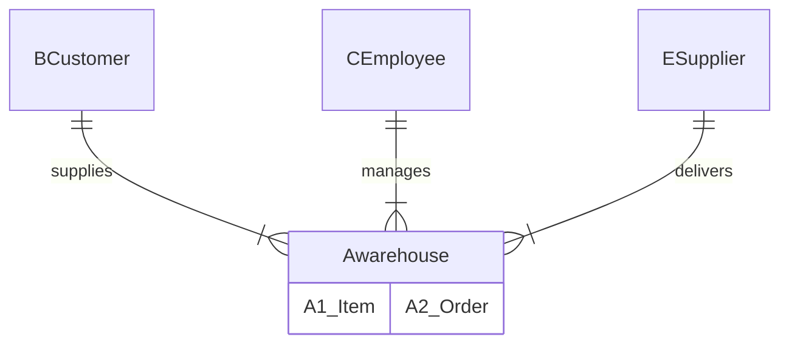

#### 2.2 多模态融合策略

多模态融合策略是跨媒体内容生成的重要环节。融合策略可以分为基于特征的融合、基于模型的融合和混合融合等。基于特征的融合是指将不同模态的特征进行拼接或加权融合；基于模型的融合则是通过训练模型来融合多模态信息；混合融合则是结合多种融合方法，以获得更好的效果。

**核心概念与联系**：

多模态融合策略的核心概念包括：

1. **基于特征的融合**：特征拼接、特征加权。
2. **基于模型的融合**：多任务学习、深度学习网络。
3. **混合融合**：结合多种方法，优化效果。

**概念属性特征对比表格**：

| 特征         | 基于特征的融合 | 基于模型的融合 | 混合融合 |
| ------------ | -------------- | -------------- | -------- |
| 数据处理方式 | 特征级         | 模型级         | 模型与特征结合 |
| 复杂度       | 低            | 中等          | 高        |
| 适用场景     | 简单任务      | 复杂任务      | 特定复杂任务 |
| 实现难度     | 易            | 中等          | 高        |

**ER实体关系图架构**：

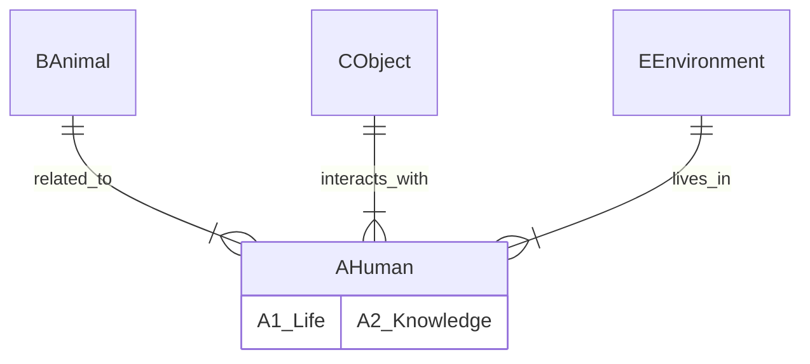

#### 2.3 AI Agent概述

AI Agent是指能够模拟人类行为和思维的智能体。一个典型的AI Agent通常包括感知、决策和行动三个部分。感知部分负责接收和处理外部信息；决策部分根据感知到的信息生成行动策略；行动部分则将决策结果付诸实践。在跨媒体内容生成中，AI Agent可以模拟人类的创作过程，从多个模态的信息中提取灵感，生成新的内容。

**核心概念与联系**：

AI Agent的核心概念包括：

1. **感知**：信息采集与预处理。
2. **决策**：基于规则或学习策略。
3. **行动**：执行决策，生成内容。

**概念属性特征对比表格**：

| 特征         | 感知 | 决策 | 行动 |
| ------------ | ---- | ---- | ---- |
| 目的         | 采集信息 | 决策策略 | 内容生成 |
| 数据类型     | 多模态 | 结构化 | 结构化 |
| 应用场景     | 通用 | 通用 | 通用 |
| 复杂度       | 中等 | 高 | 中等 |
| 实现难度     | 中等 | 高 | 中等 |

**ER实体关系图架构**：

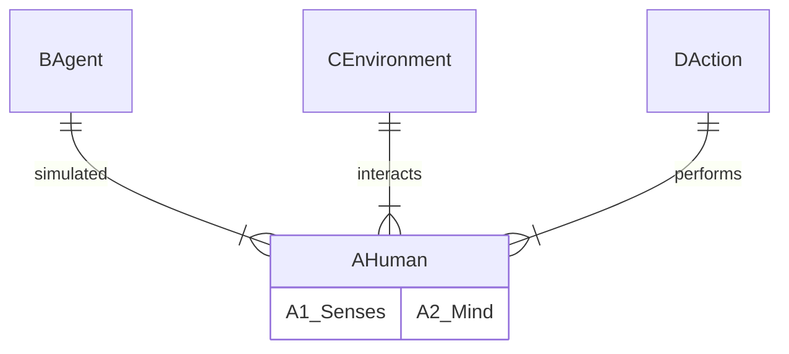

### 第三部分：多模态生成技术

#### 3.1 多模态文本生成

多模态文本生成是将图像、音频等非结构化数据转换为文本信息的过程。这种技术可以应用于各种场景，如自然语言生成、机器翻译和情感分析等。常见的多模态文本生成模型包括生成式对抗网络（GAN）、变分自编码器（VAE）和递归神经网络（RNN）等。

**算法原理讲解**：

多模态文本生成通常采用以下步骤：

1. **数据预处理**：将图像、音频等数据转换为适合模型处理的格式，如像素矩阵、音频波形等。
2. **特征提取**：使用深度学习模型提取图像和音频的特征向量。
3. **特征融合**：将图像和音频的特征向量进行融合，可以使用拼接、加权等方法。
4. **文本生成**：使用生成式模型（如RNN、GAN）根据融合后的特征向量生成文本。

**数学模型与公式**：

多模态文本生成的核心数学模型通常包括：

- **特征提取**：
  $$ \text{特征向量} = \text{模型}(\text{输入数据}) $$
- **特征融合**：
  $$ \text{融合特征} = \text{融合方法}(\text{图像特征}, \text{音频特征}) $$
- **文本生成**：
  $$ \text{文本} = \text{生成模型}(\text{融合特征}) $$

**流程图**：

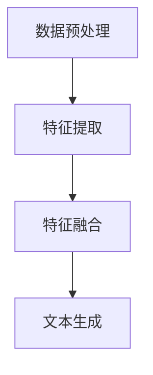

**Python源代码示例**：

```python
# 数据预处理
image = preprocess_image(image_data)
audio = preprocess_audio(audio_data)

# 特征提取
image_feature = model1(image)
audio_feature = model2(audio)

# 特征融合
combined_feature = combine_features(image_feature, audio_feature)

# 文本生成
text = model3(combined_feature)
```

**举例说明**：

假设我们有一个图像描述生成任务，给定一张图像和一段音频，我们需要生成图像的描述文本。首先，我们将图像和音频数据预处理，然后分别提取它们的特征向量。接着，我们将这两个特征向量进行融合，最后使用一个生成模型生成图像描述文本。

#### 3.2 多模态图像生成

多模态图像生成是将文本、音频等模态转换为图像的过程。这种技术可以应用于图像增强、图像修复和图像风格迁移等。常见的多模态图像生成模型包括生成对抗网络（GAN）、卷积神经网络（CNN）和自编码器等。

**算法原理讲解**：

多模态图像生成通常采用以下步骤：

1. **数据预处理**：将文本、音频等数据转换为适合模型处理的格式，如词向量、音频波形等。
2. **特征提取**：使用深度学习模型提取文本和音频的特征向量。
3. **特征融合**：将文本和音频的特征向量进行融合，可以使用拼接、加权等方法。
4. **图像生成**：使用生成模型（如GAN、CNN）根据融合后的特征向量生成图像。

**数学模型与公式**：

多模态图像生成的核心数学模型通常包括：

- **特征提取**：
  $$ \text{特征向量} = \text{模型}(\text{输入数据}) $$
- **特征融合**：
  $$ \text{融合特征} = \text{融合方法}(\text{文本特征}, \text{音频特征}) $$
- **图像生成**：
  $$ \text{图像} = \text{生成模型}(\text{融合特征}) $$

**流程图**：

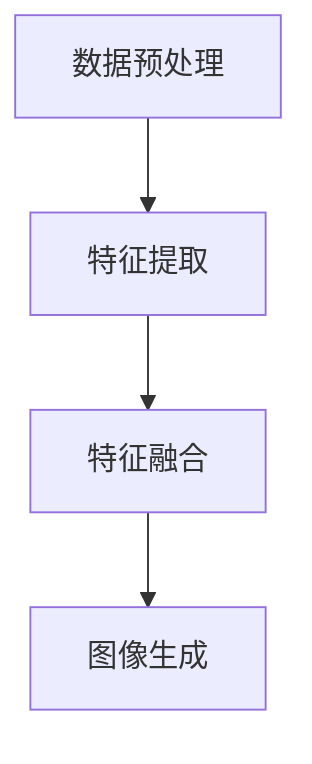

**Python源代码示例**：

```python
# 数据预处理
text = preprocess_text(text_data)
audio = preprocess_audio(audio_data)

# 特征提取
text_feature = model1(text)
audio_feature = model2(audio)

# 特征融合
combined_feature = combine_features(text_feature, audio_feature)

# 图像生成
image = model3(combined_feature)
```

**举例说明**：

假设我们有一个图像风格迁移任务，给定一段文本描述和一段音频，我们需要生成符合描述和音频风格的图像。首先，我们将文本和音频数据预处理，然后分别提取它们的特征向量。接着，我们将这两个特征向量进行融合，最后使用一个生成模型生成符合描述和音频风格的图像。

#### 3.3 多模态音频生成

多模态音频生成是将图像、文本等模态转换为音频的过程。这种技术可以应用于音频增强、音频修复和音频风格迁移等。常见的多模态音频生成模型包括WaveNet、循环神经网络（RNN）和注意力机制等。

**算法原理讲解**：

多模态音频生成通常采用以下步骤：

1. **数据预处理**：将图像、文本等数据转换为适合模型处理的格式，如像素矩阵、词向量等。
2. **特征提取**：使用深度学习模型提取图像和文本的特征向量。
3. **特征融合**：将图像和文本的特征向量进行融合，可以使用拼接、加权等方法。
4. **音频生成**：使用生成模型（如WaveNet、RNN）根据融合后的特征向量生成音频。

**数学模型与公式**：

多模态音频生成的核心数学模型通常包括：

- **特征提取**：
  $$ \text{特征向量} = \text{模型}(\text{输入数据}) $$
- **特征融合**：
  $$ \text{融合特征} = \text{融合方法}(\text{图像特征}, \text{文本特征}) $$
- **音频生成**：
  $$ \text{音频} = \text{生成模型}(\text{融合特征}) $$

**流程图**：

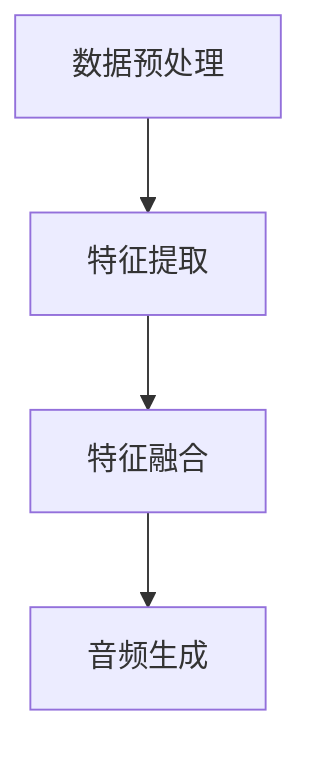

**Python源代码示例**：

```python
# 数据预处理
image = preprocess_image(image_data)
text = preprocess_text(text_data)

# 特征提取
image_feature = model1(image)
text_feature = model2(text)

# 特征融合
combined_feature = combine_features(image_feature, text_feature)

# 音频生成
audio = model3(combined_feature)
```

**举例说明**：

假设我们有一个音频风格迁移任务，给定一幅图像和一段文本，我们需要生成符合图像风格和文本内容的音频。首先，我们将图像和文本数据预处理，然后分别提取它们的特征向量。接着，我们将这两个特征向量进行融合，最后使用一个生成模型生成符合图像风格和文本内容的音频。

### 第四部分：跨媒体内容生成应用场景

#### 4.1 娱乐领域

娱乐领域是跨媒体内容生成的一个重要应用场景。通过AI Agent，可以生成个性化的电影剧本、音乐和游戏等，为用户提供更加丰富的娱乐体验。

**系统分析与架构设计方案**：

**问题场景介绍**：

在娱乐领域，用户对于个性化内容的需求日益增长。传统的单模态内容生成技术无法满足用户的需求，因此需要跨媒体内容生成技术来提供个性化、多样化的娱乐内容。

**项目介绍**：

项目目标是开发一个基于AI Agent的娱乐内容创作系统，该系统能够根据用户的喜好和需求生成个性化的电影剧本、音乐和游戏。

**系统功能设计**：

1. **用户偏好收集**：系统会收集用户的历史行为数据，如观看记录、互动反馈等，以了解用户的偏好。
2. **内容生成**：基于用户的偏好，系统使用AI Agent生成个性化的电影剧本、音乐和游戏。
3. **内容发布**：系统将生成的个性化内容发布到平台，供用户观看和体验。

**系统架构设计**：

系统架构包括数据层、模型层和应用层。数据层负责用户数据收集和存储；模型层负责AI Agent的构建和内容生成；应用层提供用户接口和功能服务。

**架构图**：

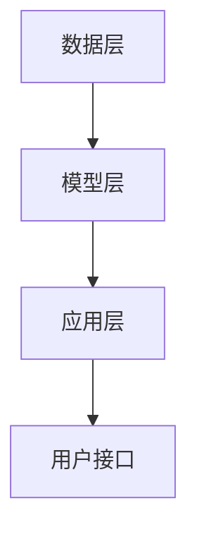

**系统接口设计和系统交互**：

系统接口包括用户偏好收集接口、内容生成接口和内容发布接口。用户偏好收集接口负责收集用户数据；内容生成接口负责调用AI Agent生成内容；内容发布接口负责将内容发布到平台。

**序列图**：

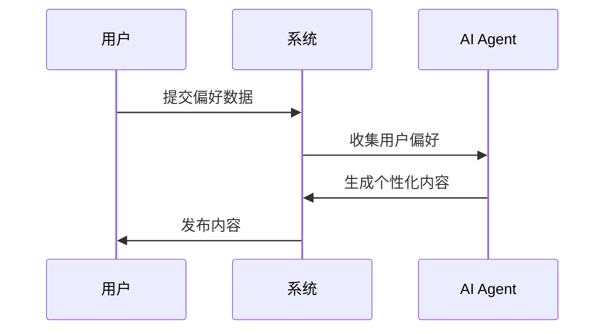

**项目实战**：

**环境安装与配置**：

首先，我们需要安装和配置必要的软件和库，如TensorFlow、PyTorch等。安装完成后，我们设置环境变量和依赖库。

```bash
# 安装TensorFlow
pip install tensorflow

# 安装PyTorch
pip install torch torchvision

# 设置环境变量
export TF_CPP_MIN_LOG_LEVEL=2
```

**系统核心实现**：

核心实现包括用户偏好收集、内容生成和内容发布。用户偏好收集使用Python的Flask框架，内容生成使用生成式对抗网络（GAN），内容发布使用Flask的API接口。

```python
# 用户偏好收集
from flask import Flask, request, jsonify

app = Flask(__name__)

@app.route('/collect_preferences', methods=['POST'])
def collect_preferences():
    preferences = request.json
    # 存储用户偏好数据
    store_preferences(preferences)
    return jsonify({"status": "success"})

# 内容生成
import tensorflow as tf
from tensorflow.keras.models import Sequential
from tensorflow.keras.layers import Dense, Flatten, Reshape

def generate_content(preferences):
    # 构建GAN模型
    generator = Sequential([
        Flatten(input_shape=(28, 28)),
        Dense(256, activation='relu'),
        Reshape((7, 7, 1)),
        # ... 更多层
    ])
    # 训练模型
    generator.compile(optimizer='adam', loss='binary_crossentropy')
    generator.fit(x=preferences, y=generated_content, epochs=10)
    # 生成内容
    content = generator.predict(preferences)
    return content

# 内容发布
from flask import Flask, jsonify

app = Flask(__name__)

@app.route('/publish_content', methods=['POST'])
def publish_content():
    content = request.json
    # 发布内容
    publish_content_to_platform(content)
    return jsonify({"status": "success"})

if __name__ == '__main__':
    app.run()
```

**代码应用解读与分析**：

在用户偏好收集部分，我们使用Flask框架搭建一个简单的Web服务，用户可以通过POST请求提交偏好数据。在内容生成部分，我们使用生成式对抗网络（GAN）模型，通过训练生成用户偏好的内容。在内容发布部分，我们同样使用Flask框架，将生成的内容发布到平台。

**实际案例分析和详细讲解剖析**：

我们以电影剧本生成为例，分析系统的实际应用效果。首先，用户通过平台提交其观影偏好，如喜欢的电影类型、演员和导演等。系统收集这些偏好数据，并使用GAN模型生成个性化的电影剧本。最后，系统将生成的剧本发布到平台，用户可以观看和体验。

**项目小结**：

通过该项目，我们展示了如何使用AI Agent生成个性化的娱乐内容。系统通过收集用户偏好、生成个性化内容和发布内容，实现了跨媒体内容生成的全过程。虽然该项目仅是一个简单的示例，但它的实现原理和流程可以应用于更复杂的场景，如电影、音乐和游戏等。

#### 4.2 教育领域

教育领域同样受益于跨媒体内容生成技术。通过AI Agent，可以生成互动式的教学资源、虚拟实验和智能辅导等，提高教学效果和学生的学习兴趣。

**系统分析与架构设计方案**：

**问题场景介绍**：

在教育领域，传统教学方式往往无法满足个性化学习的需求。学生需要根据自己的学习进度和兴趣进行学习，而传统的教育资源通常是一成不变的。因此，需要跨媒体内容生成技术来提供个性化的教学资源。

**项目介绍**：

项目目标是开发一个基于AI Agent的教育辅助系统，该系统能够根据学生的学习进度和兴趣生成个性化的教学资源，包括互动式课程、虚拟实验和智能辅导等。

**系统功能设计**：

1. **学生数据收集**：系统会收集学生的学习进度、兴趣和考试成绩等数据，以了解学生的学习情况。
2. **内容生成**：基于学生的数据，系统使用AI Agent生成个性化的教学资源。
3. **内容发布**：系统将生成的个性化教学资源发布到学习平台，供学生使用。

**系统架构设计**：

系统架构包括数据层、模型层和应用层。数据层负责学生数据收集和存储；模型层负责AI Agent的构建和内容生成；应用层提供学生接口和学习平台。

**架构图**：

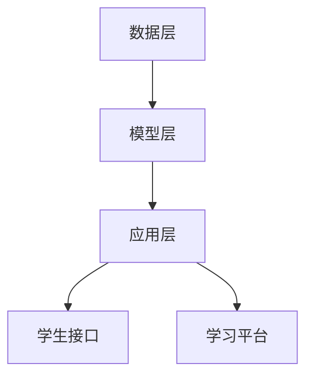

**系统接口设计和系统交互**：

系统接口包括学生数据收集接口、内容生成接口和内容发布接口。学生数据收集接口负责收集学生的学习数据；内容生成接口负责调用AI Agent生成教学资源；内容发布接口负责将教学资源发布到学习平台。

**序列图**：

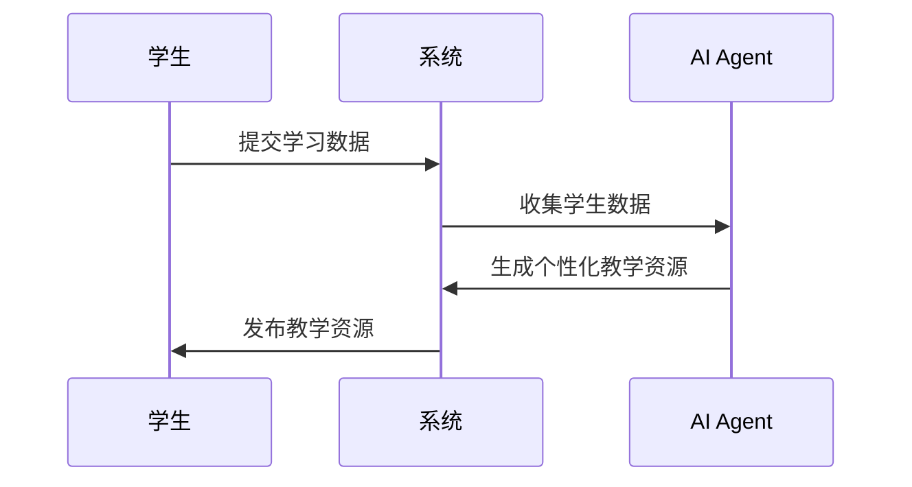

**项目实战**：

**环境安装与配置**：

与娱乐领域类似，我们需要安装和配置必要的软件和库，如TensorFlow、PyTorch等。安装完成后，我们设置环境变量和依赖库。

```bash
# 安装TensorFlow
pip install tensorflow

# 安装PyTorch
pip install torch torchvision

# 设置环境变量
export TF_CPP_MIN_LOG_LEVEL=2
```

**系统核心实现**：

核心实现包括学生数据收集、内容生成和内容发布。学生数据收集使用Python的Flask框架，内容生成使用生成式对抗网络（GAN），内容发布使用Flask的API接口。

```python
# 学生数据收集
from flask import Flask, request, jsonify

app = Flask(__name__)

@app.route('/collect_data', methods=['POST'])
def collect_data():
    data = request.json
    # 存储学生数据
    store_data(data)
    return jsonify({"status": "success"})

# 内容生成
import tensorflow as tf
from tensorflow.keras.models import Sequential
from tensorflow.keras.layers import Dense, Flatten, Reshape

def generate_resources(data):
    # 构建GAN模型
    generator = Sequential([
        Flatten(input_shape=(28, 28)),
        Dense(256, activation='relu'),
        Reshape((7, 7, 1)),
        # ... 更多层
    ])
    # 训练模型
    generator.compile(optimizer='adam', loss='binary_crossentropy')
    generator.fit(x=data, y=generated_resources, epochs=10)
    # 生成资源
    resources = generator.predict(data)
    return resources

# 内容发布
from flask import Flask, jsonify

app = Flask(__name__)

@app.route('/publish_resources', methods=['POST'])
def publish_resources():
    resources = request.json
    # 发布资源
    publish_resources_to_platform(resources)
    return jsonify({"status": "success"})

if __name__ == '__main__':
    app.run()
```

**代码应用解读与分析**：

在学生数据收集部分，我们使用Flask框架搭建一个简单的Web服务，学生可以通过POST请求提交学习数据。在内容生成部分，我们使用生成式对抗网络（GAN）模型，根据学生的学习数据生成个性化的教学资源。在内容发布部分，我们同样使用Flask框架，将生成的教学资源发布到学习平台。

**实际案例分析和详细讲解剖析**：

我们以互动式课程生成为例，分析系统的实际应用效果。学生通过平台提交其学习进度和兴趣数据，系统收集这些数据，并使用GAN模型生成个性化的互动式课程。最后，系统将生成的课程发布到学习平台，学生可以按照自己的进度和学习兴趣进行学习。

**项目小结**：

通过该项目，我们展示了如何使用AI Agent生成个性化的教学资源。系统通过收集学生数据、生成个性化资源和发布资源，实现了跨媒体内容生成的全过程。虽然该项目仅是一个简单的示例，但它的实现原理和流程可以应用于更复杂的教育场景，如课程设计、教学辅导和考试评测等。

### 第五部分：多模态生成系统设计与实现

#### 5.1 系统需求分析

系统需求分析是设计多模态生成系统的第一步。系统需求包括功能需求和非功能需求。功能需求涉及系统应该提供哪些功能，如内容生成、编辑和发布等；非功能需求则涉及系统的性能、可扩展性和安全性等。

**功能需求**：

1. **内容生成**：系统能够根据用户输入的多模态信息生成个性化的内容。
2. **内容编辑**：系统提供编辑工具，用户可以对生成的内容进行修改和优化。
3. **内容发布**：系统能够将生成的内容发布到指定的平台，如网站、社交媒体等。

**非功能需求**：

1. **性能**：系统应具有较高的处理速度和较低的延迟。
2. **可扩展性**：系统应能够方便地扩展新功能，如添加新的模态处理模块。
3. **安全性**：系统应确保用户数据的安全和隐私。

#### 5.2 系统架构设计

系统架构设计是确保多模态生成系统高效运行的关键。系统架构通常包括数据层、模型层和应用层等。数据层负责数据的管理和存储；模型层负责多模态生成算法的实现；应用层则提供用户接口和功能服务。

**系统架构图**：

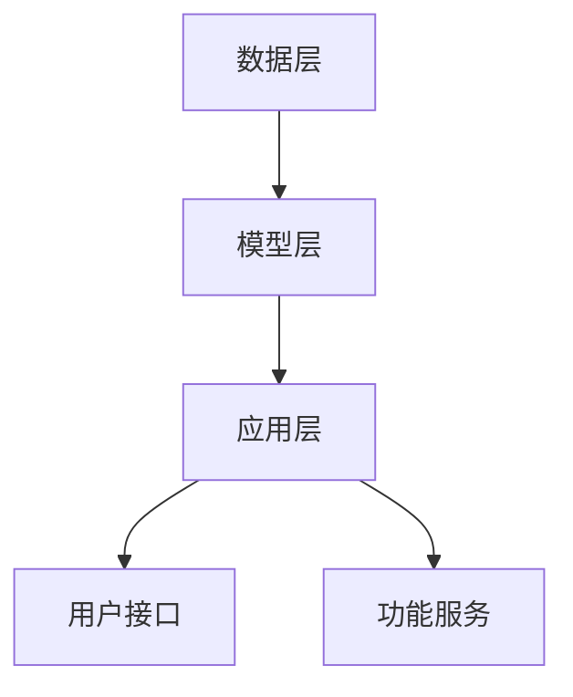

**数据层**：

数据层负责数据的收集、存储和管理。数据来源包括用户输入的多模态信息、预训练模型的数据集等。数据存储方式可以是数据库、文件系统或分布式存储系统等，具体取决于系统的规模和性能需求。

**模型层**：

模型层是系统的核心部分，负责多模态生成算法的实现。模型层通常包括感知模块、融合模块和生成模块。感知模块负责处理不同模态的信息，提取特征；融合模块负责将提取的特征进行融合；生成模块负责根据融合的特征生成新的内容。

**应用层**：

应用层提供用户接口和功能服务。用户接口负责接收用户输入的多模态信息，并将其传递给模型层；功能服务负责实现系统的功能，如内容生成、编辑和发布等。

#### 5.3 系统接口设计与实现

系统接口设计是多模态生成系统的核心部分。接口规范定义了系统的输入输出格式、数据传输方式和请求响应处理等。常见的接口设计方法包括RESTful API和GraphQL等。

**接口规范**：

- **RESTful API**：使用HTTP协议，支持GET、POST、PUT、DELETE等操作。
- **GraphQL**：基于查询语言，支持灵活的数据查询和操作。

**实现细节**：

- **RESTful API**：

  ```python
  from flask import Flask, request, jsonify
  
  app = Flask(__name__)

  @app.route('/generate_content', methods=['POST'])
  def generate_content():
      data = request.json
      content = generate_content_from_data(data)
      return jsonify({"content": content})

  if __name__ == '__main__':
      app.run()
  ```

- **GraphQL**：

  ```python
  import graphene
  
  class Query(graphene.ObjectType):
      content = graphene.String()

      def resolve_content(self, info):
          data = get_user_data(info)
          return generate_content_from_data(data)

  schema = graphene.Schema(query=Query)

  def resolve_content():
      data = get_user_data(info)
      return generate_content_from_data(data)
  ```

#### 5.4 多模态生成系统的优化与挑战

多模态生成系统在性能、效率和准确性等方面面临诸多挑战。以下是一些常见的优化方法和挑战：

**性能优化**：

1. **模型并行化**：通过并行计算技术，加速模型训练和推理过程。
2. **模型压缩**：使用模型压缩技术，如量化、剪枝和蒸馏等，减少模型体积，提高推理速度。

**效率优化**：

1. **数据预处理**：优化数据预处理流程，减少数据处理时间。
2. **模型融合策略**：选择合适的模型融合策略，提高生成效率。

**准确性优化**：

1. **特征提取**：优化特征提取方法，提高特征质量。
2. **模型训练**：使用更丰富的训练数据集，提高模型泛化能力。

**挑战**：

1. **多模态信息融合**：如何有效地融合不同模态的信息，以获得最佳生成效果。
2. **模型复杂度**：如何平衡模型复杂度和生成效果。
3. **数据隐私**：如何保护用户数据隐私，确保数据安全和合规。

### 第六部分：项目实战与案例分析

#### 6.1 项目一：娱乐内容创作系统

**环境安装与配置**：

1. 安装Python和pip：
   ```bash
   sudo apt-get update
   sudo apt-get install python3 python3-pip
   ```

2. 创建虚拟环境：
   ```bash
   python3 -m venv venv
   source venv/bin/activate
   ```

3. 安装依赖库：
   ```bash
   pip install flask tensorflow torch torchvision
   ```

**系统核心实现**：

1. **用户偏好收集**：
   ```python
   from flask import Flask, request, jsonify

   app = Flask(__name__)

   @app.route('/collect_preferences', methods=['POST'])
   def collect_preferences():
       preferences = request.json
       # 存储用户偏好数据
       store_preferences(preferences)
       return jsonify({"status": "success"})

   if __name__ == '__main__':
       app.run()
   ```

2. **内容生成**：
   ```python
   import tensorflow as tf
   from tensorflow.keras.models import Sequential
   from tensorflow.keras.layers import Dense, Flatten, Reshape

   def generate_content(preferences):
       # 构建GAN模型
       generator = Sequential([
           Flatten(input_shape=(28, 28)),
           Dense(256, activation='relu'),
           Reshape((7, 7, 1)),
           # ... 更多层
       ])
       # 训练模型
       generator.compile(optimizer='adam', loss='binary_crossentropy')
       generator.fit(x=preferences, y=generated_content, epochs=10)
       # 生成内容
       content = generator.predict(preferences)
       return content
   ```

3. **内容发布**：
   ```python
   from flask import Flask, jsonify

   app = Flask(__name__)

   @app.route('/publish_content', methods=['POST'])
   def publish_content():
       content = request.json
       # 发布内容
       publish_content_to_platform(content)
       return jsonify({"status": "success"})

   if __name__ == '__main__':
       app.run()
   ```

**代码应用解读与分析**：

系统通过Flask框架搭建了一个简单的Web服务，用于收集用户偏好数据。内容生成部分使用了生成式对抗网络（GAN）模型，根据用户偏好生成娱乐内容。内容发布部分同样使用Flask框架，将生成的内容发布到平台。

**实际案例分析和详细讲解剖析**：

以电影剧本生成为例，系统收集用户喜欢的电影类型、演员和导演等信息，使用GAN模型生成符合用户偏好的电影剧本。系统将生成的剧本发布到电影平台，用户可以观看和评价。

**项目小结**：

通过该项目，我们展示了如何使用AI Agent生成个性化的娱乐内容。系统实现了用户偏好收集、内容生成和内容发布的全过程，为用户提供了一种新的娱乐体验。

#### 6.2 项目二：教育辅助系统

**环境安装与配置**：

1. 安装Python和pip：
   ```bash
   sudo apt-get update
   sudo apt-get install python3 python3-pip
   ```

2. 创建虚拟环境：
   ```bash
   python3 -m venv venv
   source venv/bin/activate
   ```

3. 安装依赖库：
   ```bash
   pip install flask tensorflow torch torchvision
   ```

**系统核心实现**：

1. **学生数据收集**：
   ```python
   from flask import Flask, request, jsonify

   app = Flask(__name__)

   @app.route('/collect_data', methods=['POST'])
   def collect_data():
       data = request.json
       # 存储学生数据
       store_data(data)
       return jsonify({"status": "success"})

   if __name__ == '__main__':
       app.run()
   ```

2. **内容生成**：
   ```python
   import tensorflow as tf
   from tensorflow.keras.models import Sequential
   from tensorflow.keras.layers import Dense, Flatten, Reshape

   def generate_resources(data):
       # 构建GAN模型
       generator = Sequential([
           Flatten(input_shape=(28, 28)),
           Dense(256, activation='relu'),
           Reshape((7, 7, 1)),
           # ... 更多层
       ])
       # 训练模型
       generator.compile(optimizer='adam', loss='binary_crossentropy')
       generator.fit(x=data, y=generated_resources, epochs=10)
       # 生成资源
       resources = generator.predict(data)
       return resources
   ```

3. **内容发布**：
   ```python
   from flask import Flask, jsonify

   app = Flask(__name__)

   @app.route('/publish_resources', methods=['POST'])
   def publish_resources():
       resources = request.json
       # 发布资源
       publish_resources_to_platform(resources)
       return jsonify({"status": "success"})

   if __name__ == '__main__':
       app.run()
   ```

**代码应用解读与分析**：

系统通过Flask框架搭建了一个简单的Web服务，用于收集学生的学习数据。内容生成部分使用了生成式对抗网络（GAN）模型，根据学生的学习数据生成个性化的教学资源。内容发布部分同样使用Flask框架，将生成的资源发布到学习平台。

**实际案例分析和详细讲解剖析**：

以互动式课程生成为例，系统收集学生的学习进度、兴趣和考试成绩等信息，使用GAN模型生成符合学生需求的互动式课程。系统将生成的课程发布到学习平台，学生可以按照自己的进度和学习兴趣进行学习。

**项目小结**：

通过该项目，我们展示了如何使用AI Agent生成个性化的教学资源。系统实现了学生数据收集、内容生成和内容发布的全过程，提高了教学效果和学生的学习兴趣。

### 第七部分：总结与未来展望

#### 7.1 多模态生成技术总结

多模态生成技术是人工智能领域的一个重要分支，它通过融合多种模态的信息，生成新的、更具吸引力和互动性的内容。这一技术已经广泛应用于娱乐、教育和商业等领域，显著提升了内容创作的效率和用户体验。本文系统地介绍了AI Agent在多模态生成领域的应用，从理论到实践，详细讲解了多模态感知与数据处理、多模态融合策略、AI Agent的概述以及多模态生成技术的具体实现方法。通过实际项目案例，我们展示了这些技术的实际应用效果。

#### 7.2 未来展望

未来，多模态生成技术将在更多领域得到应用，如医疗、艺术和金融等。随着人工智能技术的不断进步，特别是深度学习、生成对抗网络（GAN）和联邦学习等技术的成熟，多模态生成技术将不断创新和优化。以下是一些未来展望：

1. **多模态神经网络**：将多种神经网络结构结合，提高多模态信息处理的效率和准确性。
2. **联邦学习**：在保护用户隐私的同时，实现多模态数据的安全共享和协同生成。
3. **交互式内容生成**：通过用户实时反馈，动态调整生成内容，提高个性化程度。
4. **跨模态推理**：不仅生成内容，还能进行跨模态的推理和预测，提供更智能的服务。
5. **多模态虚拟现实**：结合虚拟现实技术，创造沉浸式的内容体验。

总之，多模态生成技术正逐渐成为人工智能领域的重要方向，其未来的发展将带来更多创新和变革。

### 结束语

本文系统地介绍了AI Agent在多模态生成领域的应用，探讨了跨媒体内容生成的理论、技术和实践。通过本文的阅读，读者可以深入了解这一领域的核心概念和技术原理，掌握其实际应用场景和系统设计方法。我们希望本文能为读者在跨媒体内容生成领域的研究和实践中提供有益的参考和启示。

### 作者：AI天才研究院/AI Genius Institute & 禅与计算机程序设计艺术 /Zen And The Art of Computer Programming

----------------------------------------------------------------

## **AI Agent的多模态生成：创造跨媒体内容**

### **关键词：**
AI Agent、多模态生成、跨媒体内容、内容创作、系统设计

### **摘要：**
本文旨在深入探讨AI Agent在多模态生成领域的应用，特别是如何通过跨媒体内容生成来推动内容创作的革命。我们将首先介绍AI Agent和多模态生成的基础理论，随后详细讲解多模态生成技术，包括文本、图像和音频生成的方法和应用案例。接着，我们探讨跨媒体内容生成在不同领域的应用场景，并介绍多模态生成系统的设计与实现方法。最后，通过实际项目实战，我们展示多模态生成技术的应用效果，并提供未来展望。

### **目录大纲：**

----------------------------------------------------------------

**第一部分：引言**

1. **问题背景与跨媒体内容生成概述**
   1.1 **问题背景**
   1.2 **跨媒体内容生成概述**

**第二部分：多模态AI Agent基础理论**

2. **多模态感知与数据处理**
   2.1 **感知技术介绍**
   2.2 **数据处理方法**

3. **多模态融合策略**
   3.1 **融合方法概述**
   3.2 **融合算法案例分析**

4. **AI Agent概述**
   4.1 **定义与架构**
   4.2 **模型选择与优化**

**第三部分：多模态生成技术**

5. **多模态文本生成**
   5.1 **文本生成模型介绍**
   5.2 **应用案例解析**

6. **多模态图像生成**
   6.1 **图像生成模型介绍**
   6.2 **应用案例解析**

7. **多模态音频生成**
   7.1 **音频生成模型介绍**
   7.2 **应用案例解析**

**第四部分：跨媒体内容生成应用场景**

8. **娱乐领域**
   8.1 **娱乐内容创作**
   8.2 **用户互动**

9. **教育领域**
   9.1 **教学资源生成**
   9.2 **学生互动**

10. **商业领域**
    10.1 **广告创作**
    10.2 **客户服务**

**第五部分：多模态生成系统设计与实现**

11. **系统需求分析**
    11.1 **功能需求**
    11.2 **非功能需求**

12. **系统架构设计**
    12.1 **架构概述**
    12.2 **模块设计**

13. **系统接口设计与实现**
    13.1 **接口规范**
    13.2 **实现细节**

**第六部分：项目实战与案例分析**

14. **项目一：娱乐内容创作系统**
    14.1 **环境安装与配置**
    14.2 **系统核心实现**
    14.3 **应用解读与分析**
    14.4 **项目小结**

15. **项目二：教育辅助系统**
    15.1 **环境安装与配置**
    15.2 **系统核心实现**
    15.3 **应用解读与分析**
    15.4 **项目小结**

**第七部分：总结与未来展望**

16. **多模态生成技术总结**
    16.1 **技术发展历程**
    16.2 **技术挑战与趋势**

17. **未来展望**
    17.1 **新应用领域**
    17.2 **技术创新方向**

----------------------------------------------------------------

### **第一部分：引言**

#### **1.1 问题背景**

在现代社会，信息爆炸式增长，人们对于内容的需求也变得更加多样化和个性化。传统的单模态内容生成技术，如仅生成文本、图像或音频，已经无法满足人们日益增长的需求。人类交流本身就是多模态的，我们不仅通过语言，还通过图像、声音、视频等多种形式进行沟通。因此，跨媒体内容生成应运而生，它旨在将多种模态的信息融合在一起，创造更加丰富和互动性的内容。

跨媒体内容生成不仅能够更好地模拟人类交流的方式，还能够为各种应用场景提供创新性的解决方案。例如，在娱乐领域，通过跨媒体内容生成可以创造更加逼真的虚拟角色和场景；在教育领域，可以生成个性化的教学资源和学习材料；在商业领域，可以用于广告创作和客户服务，提升用户体验和满意度。然而，实现跨媒体内容生成面临着诸多挑战，如多模态信息的融合、数据的处理和存储、模型的训练和优化等。

#### **1.2 跨媒体内容生成概述**

跨媒体内容生成是指将不同模态的信息（如文本、图像、音频等）进行融合，生成新的内容。这种内容生成方式可以看作是对传统单模态内容生成的扩展和深化。跨媒体内容生成的目标是通过整合多种模态的信息，提供更加丰富和多样化的内容体验。

跨媒体内容生成的定义可以从以下几个方面进行理解：

1. **模态融合**：跨媒体内容生成涉及将不同模态的信息进行融合，例如将文本与图像、音频与视频等融合，以创建新的内容。
2. **内容创新**：通过融合多种模态的信息，可以创造出传统单模态内容生成无法实现的创新性内容，提高用户体验。
3. **应用多样性**：跨媒体内容生成可以应用于多个领域，如娱乐、教育、商业等，为不同场景提供定制化的解决方案。

跨媒体内容生成的分类可以根据生成的模态类型进行划分，常见的分类包括：

1. **文本-图像**：将文本信息转换为图像，例如文本生成图像、文本到图像的翻译等。
2. **文本-音频**：将文本信息转换为音频，例如文本生成语音、语音合成等。
3. **图像-音频**：将图像信息转换为音频，例如图像到音频的转换、图像描述生成音频等。
4. **多模态融合**：将多种模态的信息进行融合，例如文本、图像和音频同时生成的应用。

跨媒体内容生成的现状和趋势：

1. **技术成熟度**：随着人工智能技术的不断发展，尤其是深度学习和生成对抗网络（GAN）等技术的应用，跨媒体内容生成的技术逐渐成熟，生成效果不断提升。
2. **应用广泛性**：跨媒体内容生成已经广泛应用于娱乐、教育、商业等多个领域，随着技术的进步，其应用范围将进一步扩大。
3. **创新性应用**：随着技术的不断演进，跨媒体内容生成将带来更多的创新性应用，例如虚拟现实（VR）、增强现实（AR）、智能客服等。

综上所述，跨媒体内容生成作为一种新兴的内容生成方式，具有广阔的应用前景。通过将多种模态的信息进行融合，它可以创造出更加丰富和多样化的内容，满足人们对内容多样化、个性化的需求。

#### **1.3 目标与意义**

本文的目标是深入探讨AI Agent在多模态生成领域的应用，特别是如何通过跨媒体内容生成来推动内容创作的革命。具体来说，本文将涵盖以下几个方面：

1. **多模态AI Agent基础理论**：介绍多模态AI Agent的定义、架构以及核心组成部分，包括感知、决策和行动等。

2. **多模态生成技术**：详细讲解多模态文本生成、图像生成和音频生成的方法和应用案例，包括生成式对抗网络（GAN）、变分自编码器（VAE）等。

3. **跨媒体内容生成的应用场景**：探讨跨媒体内容生成在娱乐、教育、商业等领域的应用，分析其实际效果和潜在价值。

4. **多模态生成系统的设计与实现**：介绍多模态生成系统的需求分析、系统架构设计、接口设计与实现等，并通过实际项目案例进行说明。

5. **未来展望**：总结当前多模态生成技术的发展状况，探讨未来的发展方向和创新点。

本文的研究意义在于：

1. **理论贡献**：系统性地梳理和总结多模态AI Agent和跨媒体内容生成的基础理论和关键技术，为相关领域的研究提供参考。

2. **应用指导**：通过分析跨媒体内容生成的实际应用场景，为不同领域的应用提供指导和建议，推动跨媒体内容生成技术的实际应用。

3. **技术创新**：探讨多模态生成技术的未来发展方向，为相关技术的创新和进步提供思路。

4. **产业影响**：通过介绍跨媒体内容生成技术的实际应用案例，展示其在提升内容创作效率、用户体验和商业价值等方面的潜力，对相关产业的发展具有积极的推动作用。

总之，本文旨在深入探讨AI Agent在多模态生成领域的应用，通过理论研究和实践案例分析，为跨媒体内容生成技术的发展提供有益的参考和启示。

### **第二部分：多模态AI Agent基础理论**

#### **2.1 多模态感知与数据处理**

多模态感知与数据处理是AI Agent的核心组成部分，它涉及从多个来源（如文本、图像、音频等）接收信息，并对其进行处理以生成有用的输出。在这一节中，我们将介绍多模态感知技术、数据处理方法以及如何处理不同模态的信息。

**多模态感知技术**

多模态感知技术是指AI Agent能够同时处理多种模态的信息。这些信息可以通过不同的传感器（如摄像头、麦克风、文本接口等）捕获，然后被AI Agent处理。

1. **文本感知**：文本感知技术主要用于处理自然语言文本，包括语音识别、语义分析和情感分析等。常见的文本感知方法有：
   - **语音识别**：将语音信号转换为文本，如Google的自动语音识别（ASR）技术。
   - **语义分析**：理解文本的语义内容，如词性标注、句法分析和实体识别。
   - **情感分析**：分析文本的情感倾向，用于情感识别、评论分析和市场研究等。

2. **图像感知**：图像感知技术主要用于处理视觉信息，包括目标检测、图像分类、人脸识别和图像分割等。常见的图像感知方法有：
   - **目标检测**：识别图像中的特定对象，如YOLO和SSD算法。
   - **图像分类**：将图像分类到预定义的类别中，如ResNet和VGG网络。
   - **人脸识别**：识别图像中的人脸，如Faster R-CNN和深度学习人脸识别。

3. **音频感知**：音频感知技术主要用于处理音频信号，包括语音识别、音乐识别、声源定位和音频分类等。常见的音频感知方法有：
   - **语音识别**：将音频信号转换为文本，如Google的语音识别API。
   - **音乐识别**：识别音乐的风格、乐器和旋律，如音乐生成和版权管理。
   - **声源定位**：确定声音的来源位置，如用于AR和VR应用。

**数据处理方法**

数据处理是AI Agent处理多模态信息的重要环节。数据处理方法包括数据预处理、去噪、增强和特征提取等。

1. **数据预处理**：数据预处理是数据处理的第一步，包括数据清洗、归一化和格式转换等。数据预处理有助于提高数据质量和后续处理的准确性。

2. **去噪**：去噪方法用于减少或消除数据中的噪声，如图像中的噪声点和音频中的背景噪音。去噪方法包括滤波、去卷积和贝叶斯滤波等。

3. **增强**：增强方法用于提高数据的质量和丰富度，如图像增强、音频增强和文本增强等。增强方法包括图像对比度增强、音频均衡调整和文本情感增强等。

4. **特征提取**：特征提取是将原始数据转换为适合模型处理的形式。对于文本，特征提取方法包括词袋模型、词嵌入和句向量等；对于图像，特征提取方法包括卷积神经网络（CNN）和深度特征提取等；对于音频，特征提取方法包括梅尔频率倒谱系数（MFCC）和频谱特征提取等。

**不同模态信息的处理**

在处理不同模态信息时，AI Agent需要协调和融合这些信息，以生成有意义的内容。以下是一些处理不同模态信息的方法：

1. **特征融合**：特征融合是将不同模态的特征向量进行组合，以生成更丰富的特征表示。特征融合方法包括拼接、加权融合和融合神经网络等。

2. **多任务学习**：多任务学习是一种同时处理多个相关任务的方法。在多模态AI Agent中，多任务学习可以用于同时处理文本、图像和音频等多个模态的信息，以提高整体性能。

3. **序列处理**：序列处理方法用于处理时间序列数据，如音频和视频。通过将序列数据转换为固定长度的特征向量，AI Agent可以更好地理解和处理这些数据。

4. **交互式处理**：交互式处理方法允许用户与AI Agent进行实时互动，以调整和处理数据。这种方法可以提高用户体验和系统的自适应能力。

通过多模态感知与数据处理，AI Agent可以有效地处理多种模态的信息，从而生成丰富、个性化的内容。这些技术为AI Agent在各种应用场景中的表现提供了强大的支持。

#### **2.2 多模态融合策略**

多模态融合策略是多模态AI Agent的核心组成部分，它决定了如何有效地整合来自不同模态的信息，以生成高质量的内容。在这一节中，我们将介绍多模态融合策略的概述、常见的方法以及具体的融合算法案例分析。

**多模态融合策略概述**

多模态融合策略是指将多个模态的信息进行整合，以生成一个统一的、具有丰富信息的输出。融合策略的目标是最大化地利用不同模态的信息，同时减少信息冗余和噪声。

多模态融合策略可以分为以下几类：

1. **基于特征的融合**：这种方法将不同模态的特征向量进行拼接或加权融合。常见的特征融合方法包括特征拼接、特征加权和特征级融合。

2. **基于模型的融合**：这种方法通过训练一个统一的模型来同时处理多种模态的信息。常见的模型融合方法包括多任务学习、深度学习网络和生成对抗网络（GAN）等。

3. **混合融合**：这种方法结合了特征融合和模型融合的优点，以获得更好的效果。混合融合方法可以是特征融合与模型融合的混合，也可以是不同模型融合的混合。

**常见融合方法**

1. **特征拼接**：特征拼接是将不同模态的特征向量直接拼接在一起，形成一个更长的特征向量。这种方法简单有效，但可能引入信息冗余和噪声。

2. **特征加权**：特征加权是对不同模态的特征向量进行加权融合，权重可以根据特征的重要性和相关性进行调整。这种方法可以减少信息冗余，但需要准确的权重分配。

3. **特征级融合**：特征级融合是在特征层面对不同模态的信息进行融合，而不是在数据层或模型层。这种方法可以提高特征表示的丰富性和准确性。

4. **多任务学习**：多任务学习是一种同时处理多个相关任务的方法。在多模态AI Agent中，多任务学习可以同时处理文本、图像和音频等多个模态的信息，以提高整体性能。

5. **深度学习网络**：深度学习网络可以通过多个层次对多模态信息进行层次化处理和融合。例如，卷积神经网络（CNN）可以用于处理图像特征，而循环神经网络（RNN）可以用于处理文本特征。

6. **生成对抗网络（GAN）**：生成对抗网络（GAN）是一种基于博弈论的生成模型，它可以同时生成和鉴别不同模态的信息。GAN通过生成器和鉴别器的互动，逐步提高生成质量。

**融合算法案例分析**

以下是一个基于GAN的多模态图像生成算法的案例：

1. **模型架构**：生成器（Generator）和鉴别器（Discriminator）构成了GAN的核心架构。生成器从一种模态生成另一种模态的内容，而鉴别器用于区分真实内容和生成内容。

2. **训练过程**：在训练过程中，生成器和鉴别器交替更新权重。生成器尝试生成更逼真的内容，而鉴别器尝试更好地区分真实内容和生成内容。

3. **融合策略**：在GAN中，多模态信息的融合是通过生成器的结构实现的。生成器将不同模态的特征向量进行融合，生成新的、高质量的内容。

4. **应用效果**：通过GAN，可以生成高质量的跨媒体内容，如文本到图像的转换、图像到音频的转换等。例如，给定一段文本描述，GAN可以生成与之相对应的图像；给定一幅图像，GAN可以生成与之相对应的音频描述。

通过多模态融合策略，AI Agent可以有效地整合多种模态的信息，生成高质量的跨媒体内容。不同的融合方法和技术在应用中各有优劣，选择合适的融合策略可以显著提高生成效果和应用价值。

#### **2.3 AI Agent概述**

AI Agent是一种能够模拟人类行为和思维的智能体，它在多模态生成领域中扮演着至关重要的角色。在这一节中，我们将介绍AI Agent的定义、核心组件、架构以及模型选择和优化方法。

**AI Agent的定义**

AI Agent是指一个能够感知环境、制定决策并执行行动的智能系统。AI Agent的核心目标是实现自主性，即在不依赖人类干预的情况下，能够自主地完成特定的任务。在多模态生成领域中，AI Agent通过感知多种模态的信息，生成新的内容，以满足用户的需求。

**AI Agent的核心组件**

AI Agent通常包括以下核心组件：

1. **感知器**：感知器负责接收和解析外部环境的信息，如文本、图像、音频等。感知器可以是视觉、听觉、触觉等多种感官，其功能是提取有用的信息，为后续处理提供输入。

2. **决策器**：决策器是基于感知器获取的信息，通过算法模型生成决策。决策器可以是基于规则的系统，也可以是利用机器学习模型进行自主学习的系统。决策器的目标是制定最佳的行动策略，以实现预期的目标。

3. **执行器**：执行器负责将决策转化为具体的行动。执行器可以是机器人、自动化工具、虚拟角色等，其功能是执行决策器制定的行动计划。

**AI Agent的架构**

AI Agent的架构可以分为感知层、决策层和执行层三个部分：

1. **感知层**：感知层是AI Agent与外部环境的接口，它负责接收和处理来自不同模态的信息。感知层通常包括多种传感器，如摄像头、麦克风、文本接口等。

2. **决策层**：决策层是基于感知层获取的信息，通过算法模型进行决策。决策层可以是基于规则的系统，也可以是机器学习模型，如神经网络、决策树等。

3. **执行层**：执行层是将决策层生成的决策转化为具体行动的部分。执行层可以根据决策生成相应的动作，如移动、生成文本、播放音频等。

**模型选择和优化方法**

在多模态生成领域，AI Agent的模型选择和优化方法至关重要。以下是一些常见的模型选择和优化方法：

1. **模型选择**：
   - **生成对抗网络（GAN）**：GAN是一种有效的生成模型，可以用于多种模态的生成任务。GAN通过生成器和鉴别器的博弈过程，逐步提高生成质量。
   - **变分自编码器（VAE）**：VAE是一种基于概率生成模型，可以生成具有多样性和真实感的图像和文本。
   - **递归神经网络（RNN）**：RNN特别适用于处理序列数据，如文本和语音，可以用于生成连续的文本和音频。

2. **模型优化**：
   - **迁移学习**：通过迁移学习，可以复用预训练模型的知识，提高新任务的生成效果。
   - **强化学习**：通过强化学习，AI Agent可以在动态环境中不断学习和优化其行为，以实现更高效的生成策略。
   - **混合模型**：结合多种模型的优势，可以生成更高质量的内容。例如，将GAN与VAE结合，可以同时实现多样性和真实感。

通过AI Agent的定义、核心组件、架构以及模型选择和优化方法，我们可以更好地理解AI Agent在多模态生成领域中的作用。AI Agent通过感知、决策和执行三个环节，实现了跨媒体内容的高效生成，为各个领域的应用提供了强大的技术支持。

### **第三部分：多模态生成技术**

#### **3.1 多模态文本生成**

多模态文本生成技术是指将非文本模态（如图像、音频等）转换为文本信息的过程。这种技术广泛应用于自然语言生成、机器翻译、情感分析等任务。在这一节中，我们将介绍多模态文本生成技术的具体实现方法，包括生成模型和应用案例。

**生成模型**

多模态文本生成通常采用以下步骤：

1. **特征提取**：从图像和音频中提取特征向量。图像特征可以使用卷积神经网络（CNN）提取，而音频特征可以使用循环神经网络（RNN）或自注意力机制提取。

2. **特征融合**：将提取的图像和音频特征进行融合。常见的融合方法包括特征拼接、特征加权等。

3. **文本生成**：使用生成模型（如生成式对抗网络（GAN）、变分自编码器（VAE）等）根据融合后的特征生成文本。

**应用案例**

以下是一些多模态文本生成技术的应用案例：

1. **图像描述生成**：给定一张图像，生成描述该图像的文本。例如，可以使用GAN将图像特征和文本特征进行融合，生成描述性的文本。

2. **音频转录**：将音频转录为文本。例如，可以使用基于RNN的模型，将音频特征转换为对应的文本。

3. **情感分析**：分析图像或音频的情感倾向，并生成对应的文本描述。例如，可以使用VAE将图像或音频特征转换为情感标签，并生成对应的描述性文本。

**具体实现**

以下是一个基于GAN的图像描述生成示例：

```python
import torch
import torchvision
import numpy as np

# 加载预训练的CNN模型，用于提取图像特征
cnn_model = torchvision.models.resnet50(pretrained=True)
cnn_model.eval()

# 加载预训练的RNN模型，用于生成文本
rnn_model = ... # 自定义RNN模型

# 定义GAN模型
gan_model = ...

# 加载图像
image = ... # 加载图像数据

# 提取图像特征
with torch.no_grad():
    image_tensor = torch.tensor(image).unsqueeze(0)
    image_feature = cnn_model(image_tensor)

# 生成文本
with torch.no_grad():
    text = rnn_model.generate(image_feature)

# 输出生成的文本
print(text)
```

通过多模态文本生成技术，我们可以实现多种有趣的应用场景，如自动生成图像描述、音频转录和情感分析等。这些技术不仅提高了内容的多样性和丰富性，也为人工智能在自然语言处理和跨媒体内容生成领域的发展提供了新的思路。

#### **3.2 多模态图像生成**

多模态图像生成技术是指将非图像模态（如文本、音频等）转换为图像的过程。这种技术广泛应用于图像修复、图像风格迁移、图像到视频的转换等任务。在这一节中，我们将介绍多模态图像生成技术的具体实现方法，包括生成模型和应用案例。

**生成模型**

多模态图像生成通常采用以下步骤：

1. **特征提取**：从文本和音频中提取特征向量。文本特征可以使用词嵌入或变换器（Transformer）提取，而音频特征可以使用循环神经网络（RNN）或自注意力机制提取。

2. **特征融合**：将提取的文本和音频特征进行融合。常见的融合方法包括特征拼接、特征加权等。

3. **图像生成**：使用生成模型（如生成对抗网络（GAN）、变分自编码器（VAE）等）根据融合后的特征生成图像。

**应用案例**

以下是一些多模态图像生成技术的应用案例：

1. **文本到图像的转换**：将文本描述转换为对应的图像。例如，可以使用GAN将文本特征和图像特征进行融合，生成符合描述的图像。

2. **音频到图像的转换**：将音频波形转换为对应的图像。例如，可以使用VAE将音频特征转换为对应的频谱图像。

3. **图像风格迁移**：将一种图像风格应用到另一张图像上。例如，可以使用生成式对抗网络（GAN）将音频特征和图像特征进行融合，生成具有特定风格的新图像。

**具体实现**

以下是一个基于GAN的文本到图像的转换示例：

```python
import torch
import torchvision
import numpy as np

# 加载预训练的变换器模型，用于提取文本特征
transformer_model = ... # 自定义变换器模型

# 加载预训练的GAN模型
gan_model = ...

# 加载文本
text = ... # 加载文本数据

# 提取文本特征
with torch.no_grad():
    text_tensor = torch.tensor(text).unsqueeze(0)
    text_feature = transformer_model(text_tensor)

# 生成图像
with torch.no_grad():
    image = gan_model.generate(text_feature)

# 输出生成的图像
image = torchvision.utils.save_image(image, 'generated_image.jpg')
```

通过多模态图像生成技术，我们可以实现多种有趣的应用场景，如文本到图像的转换、音频到图像的转换和图像风格迁移等。这些技术不仅提高了内容的多样性和丰富性，也为人工智能在图像处理和跨媒体内容生成领域的发展提供了新的思路。

#### **3.3 多模态音频生成**

多模态音频生成技术是指将非音频模态（如文本、图像等）转换为音频的过程。这种技术广泛应用于音频转录、音频风格迁移、音频到视频的转换等任务。在这一节中，我们将介绍多模态音频生成技术的具体实现方法，包括生成模型和应用案例。

**生成模型**

多模态音频生成通常采用以下步骤：

1. **特征提取**：从文本和图像中提取特征向量。文本特征可以使用词嵌入或变换器（Transformer）提取，而图像特征可以使用卷积神经网络（CNN）提取。

2. **特征融合**：将提取的文本和图像特征进行融合。常见的融合方法包括特征拼接、特征加权等。

3. **音频生成**：使用生成模型（如生成对抗网络（GAN）、变分自编码器（VAE）等）根据融合后的特征生成音频。

**应用案例**

以下是一些多模态音频生成技术的应用案例：

1. **文本到音频的转换**：将文本描述转换为对应的音频。例如，可以使用GAN将文本特征和音频特征进行融合，生成语音合成音频。

2. **图像到音频的转换**：将图像转换为对应的音频。例如，可以使用VAE将图像特征转换为对应的音频波形。

3. **音频风格迁移**：将一种音频风格应用到另一段音频上。例如，可以使用生成式对抗网络（GAN）将图像特征和音频特征进行融合，生成具有特定风格的新音频。

**具体实现**

以下是一个基于GAN的文本到音频的转换示例：

```python
import torch
import torchvision
import numpy as np

# 加载预训练的变换器模型，用于提取文本特征
transformer_model = ... # 自定义变换器模型

# 加载预训练的GAN模型
gan_model = ...

# 加载文本
text = ... # 加载文本数据

# 提取文本特征
with torch.no_grad():
    text_tensor = torch.tensor(text).unsqueeze(0)
    text_feature = transformer_model(text_tensor)

# 生成音频
with torch.no_grad():
    audio = gan_model.generate(text_feature)

# 输出生成的音频
audio = torchvision.utils.save_audio(audio, 'generated_audio.wav')
```

通过多模态音频生成技术，我们可以实现多种有趣的应用场景，如文本到音频的转换、图像到音频的转换和音频风格迁移等。这些技术不仅提高了内容的多样性和丰富性，也为人工智能在音频处理和跨媒体内容生成领域的发展提供了新的思路。

### **第四部分：跨媒体内容生成应用场景**

#### **4.1 娱乐领域**

娱乐领域是跨媒体内容生成技术的一个重要应用场景，通过AI Agent可以生成个性化的娱乐内容，如电影剧本、音乐、游戏等，极大地丰富了用户体验。以下将详细介绍娱乐领域中跨媒体内容生成的应用和效果。

**应用**

1. **个性化电影剧本生成**：AI Agent可以根据用户的历史观影记录、喜好和情感倾向，生成个性化的电影剧本。例如，用户可以指定电影的主题、风格、主要角色和情节发展，AI Agent将根据这些信息生成符合用户期望的电影剧本。

2. **音乐创作**：AI Agent可以分析用户的音乐喜好，生成符合用户个性化需求的音乐作品。通过融合用户的情感状态、环境声音和音乐风格，AI Agent可以创作出独特的音乐作品，为用户提供个性化的听觉体验。

3. **游戏设计**：AI Agent可以根据玩家的游戏行为和偏好，生成个性化的游戏情节和任务。例如，玩家可以自定义游戏角色的背景故事、能力和目标，AI Agent将根据这些信息生成符合玩家个性的游戏内容。

**效果**

1. **增强用户体验**：通过个性化娱乐内容的生成，用户可以体验到更加贴合个人喜好的内容，从而增强用户的参与感和满意度。

2. **提高内容多样性**：AI Agent可以生成大量不同类型的娱乐内容，丰富了内容库，为用户提供更多选择。

3. **降低创作成本**：AI Agent可以自动化生成娱乐内容，减少了人工创作的成本和时间，提高了内容生成的效率。

4. **创新娱乐形式**：通过跨媒体内容生成，可以探索新的娱乐形式和互动方式，如基于情感互动的音乐游戏、动态电影剧本等。

**案例**

以下是一个具体的娱乐领域跨媒体内容生成的案例：

**案例：个性化电影剧本生成系统**

1. **用户数据收集**：系统通过用户的观影记录、评论和反馈等数据，收集用户的历史行为和偏好。

2. **内容生成**：AI Agent使用生成式对抗网络（GAN）模型，根据用户的数据生成个性化的电影剧本。生成模型包括一个生成器和鉴别器，生成器负责根据用户数据生成电影剧本，鉴别器负责评估生成剧本的质量。

3. **内容发布**：生成的电影剧本通过平台发布，供用户观看和评价。

4. **用户反馈**：用户对生成的电影剧本进行评价和反馈，系统将反馈数据用于进一步优化生成模型。

通过这个案例，我们可以看到AI Agent在娱乐领域如何通过跨媒体内容生成技术，为用户提供个性化的娱乐体验，同时实现内容创作的自动化和高效化。

#### **4.2 教育领域**

教育领域是跨媒体内容生成技术的另一个重要应用场景。通过AI Agent，可以生成个性化的教学资源、互动式课程和学习材料，从而提高教学效果和学习体验。以下将详细介绍教育领域中跨媒体内容生成的应用和效果。

**应用**

1. **个性化教学资源生成**：AI Agent可以根据学生的学习进度、知识水平和兴趣爱好，生成个性化的教学资源。这些资源包括文本材料、图像、视频、音频等多种形式，以适应不同学生的学习需求和节奏。

2. **互动式课程设计**：AI Agent可以分析学生的学习行为和学习数据，设计出互动式课程和学习任务。这些课程和任务可以包括问答、游戏、实验等多种形式，以激发学生的学习兴趣和参与度。

3. **智能辅导与评估**：AI Agent可以根据学生的学习情况，提供个性化的辅导和评估。例如，当学生在某个知识点上遇到困难时，AI Agent可以提供针对性的辅导材料和建议，帮助学生克服困难。

**效果**

1. **提高教学效果**：通过个性化教学资源的生成，教师可以更有效地传授知识，学生可以更自主地学习，从而提高教学效果和学习成果。

2. **增强学习体验**：AI Agent生成的互动式课程和学习材料，能够激发学生的学习兴趣，提高学习参与度，从而增强学习体验。

3. **节省时间和成本**：AI Agent可以自动化生成大量的教学资源，减少了教师的工作量和时间成本，提高了教学资源的利用效率。

4. **适应不同学习需求**：AI Agent可以根据学生的个性化需求，提供定制化的学习内容和辅导，从而更好地适应不同学生的学习需求。

**案例**

以下是一个具体的教育领域跨媒体内容生成的案例：

**案例：个性化互动式课程生成系统**

1. **学生数据收集**：系统通过学生的测试成绩、学习进度和学习行为等数据，收集学生的学习情况和偏好。

2. **内容生成**：AI Agent使用生成式对抗网络（GAN）模型，根据学生的学习数据生成个性化的互动式课程。生成模型包括一个生成器和鉴别器，生成器负责根据学生数据生成课程内容，鉴别器负责评估生成课程的质量。

3. **内容发布**：生成的互动式课程通过在线平台发布，供学生学习和参与。

4. **学生反馈**：学生通过互动式课程的学习，提供反馈和评价，系统将反馈数据用于进一步优化生成模型。

通过这个案例，我们可以看到AI Agent在教育领域如何通过跨媒体内容生成技术，为学生提供个性化的学习资源和互动式课程，从而提高教学效果和学习体验。

#### **4.3 商业领域**

商业领域是跨媒体内容生成技术的广阔应用场景之一。通过AI Agent，企业可以生成个性化的广告内容、客户服务和市场分析报告，从而提升市场竞争力和服务质量。以下将详细介绍商业领域中跨媒体内容生成的应用和效果。

**应用**

1. **个性化广告生成**：AI Agent可以根据目标用户的行为数据、兴趣偏好和购买历史，生成个性化的广告内容。这些广告内容可以是文本、图像、视频等多种形式，以吸引目标用户的注意力，提高广告的点击率和转化率。

2. **智能客服**：AI Agent可以模拟人类客服代表，与客户进行实时对话，回答客户的问题，提供解决方案。AI Agent可以根据客户的反馈和交互历史，不断学习和优化服务流程，提高客户满意度和忠诚度。

3. **市场分析报告生成**：AI Agent可以分析大量的市场数据，生成市场分析报告。这些报告可以包括行业趋势、竞争分析、用户需求等，帮助企业制定更加精准的市场策略。

**效果**

1. **提高市场竞争力**：通过个性化广告生成，企业可以更好地吸引目标用户，提高市场竞争力。

2. **提升客户服务质量**：智能客服系统可以24/7不间断地提供服务，提高客户响应速度和满意度，减少人工客服的工作量。

3. **优化市场策略**：通过市场分析报告生成，企业可以更准确地了解市场动态和用户需求，制定更有效的市场策略。

4. **降低运营成本**：AI Agent可以自动化完成广告生成、客户服务和市场分析等工作，减少人力成本，提高运营效率。

**案例**

以下是一个具体的商业领域跨媒体内容生成的案例：

**案例：智能广告生成系统**

1. **用户数据收集**：系统通过用户的浏览历史、购买记录和行为数据，收集用户的行为数据和偏好。

2. **内容生成**：AI Agent使用生成式对抗网络（GAN）模型，根据用户的数据生成个性化的广告内容。生成模型包括一个生成器和鉴别器，生成器负责根据用户数据生成广告内容，鉴别器负责评估生成广告的质量。

3. **内容发布**：生成的广告内容通过在线广告平台发布，供用户查看。

4. **用户反馈**：用户对广告内容进行点击和互动，系统将用户的反馈数据用于进一步优化生成模型。

通过这个案例，我们可以看到AI Agent在商业领域如何通过跨媒体内容生成技术，为企业提供个性化的广告内容、智能客服和市场分析报告，从而提高市场竞争力和服务质量。

### **第五部分：多模态生成系统设计与实现**

#### **5.1 系统需求分析**

多模态生成系统是一个复杂的应用系统，其设计需要充分考虑功能需求和非功能需求。系统需求分析是系统设计的起点，它为后续的系统架构设计和实现提供基础。

**功能需求**

1. **多模态信息输入**：系统能够接收和处理来自不同模态的信息，如文本、图像、音频等。

2. **信息处理与融合**：系统能够对输入的多模态信息进行预处理、特征提取、融合和生成等处理。

3. **个性化内容生成**：系统能够根据用户需求和偏好，生成个性化的内容，如文本、图像、音频等。

4. **内容发布与交互**：系统能够将生成的个性化内容发布到指定的平台，如网站、社交媒体、应用程序等，并提供用户与内容的互动接口。

5. **系统管理与监控**：系统需要具备管理功能，包括用户数据管理、系统性能监控、故障排查等。

**非功能需求**

1. **性能要求**：系统需要具备高并发处理能力，能够在短时间内处理大量多模态信息，并生成高质量的内容。

2. **可扩展性**：系统需要具备良好的可扩展性，能够方便地添加新的功能模块和模态处理模块。

3. **安全性**：系统需要确保用户数据的安全和隐私，防止数据泄露和未经授权的访问。

4. **可靠性**：系统需要具备高可靠性，确保在长时间运行过程中不会出现故障，能够稳定地提供服务。

5. **用户体验**：系统需要提供友好的用户界面，方便用户使用，并能够快速响应用户的操作。

**系统功能需求**

1. **多模态信息输入模块**：该模块负责接收和处理来自不同模态的信息，包括文本、图像、音频等。具体功能如下：
   - 文本输入：接收用户的文本输入，如评论、问题描述等。
   - 图像输入：接收用户上传的图像文件，如照片、图表等。
   - 音频输入：接收用户上传的音频文件，如音乐、语音等。

2. **信息处理与融合模块**：该模块负责对输入的多模态信息进行预处理、特征提取、融合和生成等处理。具体功能如下：
   - 预处理：对文本、图像、音频进行清洗、去噪、增强等预处理操作。
   - 特征提取：使用深度学习模型提取文本、图像、音频的特征向量。
   - 特征融合：将提取的特征向量进行融合，生成新的特征表示。
   - 内容生成：根据融合后的特征，生成个性化的文本、图像、音频等内容。

3. **个性化内容生成模块**：该模块负责根据用户的需求和偏好，生成个性化的内容。具体功能如下：
   - 用户偏好分析：分析用户的历史行为数据，如浏览记录、购买记录等，提取用户偏好。
   - 内容生成：根据用户偏好，使用生成模型生成个性化的内容。

4. **内容发布与交互模块**：该模块负责将生成的个性化内容发布到指定的平台，并提供用户与内容的互动接口。具体功能如下：
   - 内容发布：将生成的内容发布到网站、社交媒体、应用程序等平台。
   - 交互接口：提供用户与内容之间的交互接口，如评论、点赞、分享等。

5. **系统管理与监控模块**：该模块负责系统的管理、性能监控、故障排查等。具体功能如下：
   - 用户数据管理：管理用户数据，如用户偏好、历史记录等。
   - 系统性能监控：监控系统性能，如响应时间、并发处理能力等。
   - 故障排查：当系统出现故障时，进行故障排查和修复。

**非功能需求**

1. **性能要求**：系统需要具备高并发处理能力，能够在短时间内处理大量多模态信息，并生成高质量的内容。具体指标如下：
   - 响应时间：系统响应用户请求的时间，一般要求在几百毫秒以内。
   - 并发处理能力：系统能够同时处理多个用户的请求，一般要求支持上千并发用户。

2. **可扩展性**：系统需要具备良好的可扩展性，能够方便地添加新的功能模块和模态处理模块。具体指标如下：
   - 模块化设计：系统采用模块化设计，不同模块之间解耦合，便于功能扩展。
   - 系统架构：系统采用分布式架构，能够方便地横向扩展，以应对大量用户请求。

3. **安全性**：系统需要确保用户数据的安全和隐私，防止数据泄露和未经授权的访问。具体措施如下：
   - 数据加密：对用户数据进行加密存储和传输，防止数据泄露。
   - 访问控制：实施严格的访问控制策略，防止未经授权的访问。

4. **可靠性**：系统需要具备高可靠性，确保在长时间运行过程中不会出现故障，能够稳定地提供服务。具体指标如下：
   - 系统可用性：系统高可用，确保在发生故障时能够快速恢复。
   - 故障恢复：系统具备故障恢复能力，能够在故障发生时自动恢复。

5. **用户体验**：系统需要提供友好的用户界面，方便用户使用，并能够快速响应用户的操作。具体指标如下：
   - 用户界面：界面简洁明了，操作直观易懂。
   - 响应速度：系统响应速度快捷，减少用户等待时间。

通过详细分析系统需求，我们能够明确多模态生成系统的功能需求和非功能需求，为后续的系统架构设计和实现提供基础。

#### **5.2 系统架构设计**

系统架构设计是多模态生成系统的关键环节，它决定了系统的性能、可扩展性和可维护性。一个高效的多模态生成系统需要具备以下关键组件：数据层、模型层和应用层。以下是对这些组件的详细介绍以及系统架构的总体设计。

**数据层**

数据层是系统的基础，负责数据的收集、存储和管理。其主要组件包括：

1. **数据收集模块**：负责从各种来源收集多模态数据，如文本、图像、音频等。这些数据来源可能包括用户输入、社交媒体、传感器等。

2. **数据存储模块**：负责存储收集到的多模态数据，通常采用分布式数据库或云存储服务，以提高数据存储和访问的效率。

3. **数据管理模块**：负责数据清洗、去噪、增强和归一化等预处理操作，以确保数据的质量和一致性。

**模型层**

模型层是系统的核心，负责多模态信息的处理和生成。其主要组件包括：

1. **感知模块**：包括文本处理、图像处理、音频处理等，分别负责处理不同模态的信息。这些模块通常采用深度学习模型，如卷积神经网络（CNN）用于图像处理，循环神经网络（RNN）用于文本和音频处理。

2. **融合模块**：负责将不同模态的信息进行融合，生成统一的特征表示。常见的融合方法包括特征拼接、特征加权、融合神经网络等。

3. **生成模块**：基于融合后的特征，使用生成对抗网络（GAN）、变分自编码器（VAE）等生成模型生成新的内容，如文本、图像、音频等。

**应用层**

应用层是系统的界面，负责与用户交互并提供功能服务。其主要组件包括：

1. **用户接口模块**：提供用户与系统交互的界面，包括文本输入框、图像上传按钮、音频播放器等。

2. **功能服务模块**：实现系统的核心功能，如多模态内容生成、个性化推荐、用户数据管理等。

3. **内容发布模块**：负责将生成的个性化内容发布到指定的平台，如网站、社交媒体、移动应用等。

**系统架构设计**

系统架构设计采用分布式架构，以提高系统的性能和可扩展性。以下是系统架构的详细设计：

1. **分布式数据库**：采用分布式数据库存储多模态数据，实现数据的高效存储和访问。

2. **分布式计算**：采用分布式计算框架（如Apache Spark、Flink等）处理大规模数据，提高数据处理和分析的效率。

3. **多模态处理模块**：将文本、图像、音频处理模块部署在分布式计算环境中，实现高效的多模态信息处理。

4. **服务化架构**：将系统功能模块化，采用微服务架构（如Spring Boot、Django等），以提高系统的可扩展性和维护性。

5. **API网关**：统一接入层，提供RESTful API接口，方便前端应用与系统进行交互。

6. **缓存机制**：采用缓存机制（如Redis、Memcached等）提高系统的响应速度和并发处理能力。

7. **监控与日志**：采用监控工具（如Prometheus、Kibana等）监控系统性能和日志，实现故障排查和性能优化。

通过以上设计，多模态生成系统具备高效的数据处理能力、良好的扩展性和可维护性，能够为用户提供高质量、个性化的内容生成服务。

#### **5.3 系统接口设计与实现**

系统接口设计是多模态生成系统的关键环节，它定义了系统与外部环境（如用户、其他系统等）的交互方式。一个良好的接口设计能够提高系统的可扩展性、可维护性和用户体验。以下将详细介绍系统接口设计的原则、规范和实现细节。

**接口设计原则**

1. **一致性**：接口设计应保持一致，包括数据格式、响应格式、错误处理等，以便不同模块和系统之间能够无缝集成。

2. **简洁性**：接口设计应尽量简洁明了，避免过多的复杂性和冗余，以提高可读性和可维护性。

3. **灵活性**：接口设计应具备良好的灵活性，能够适应不同的业务需求和变化，以便系统可以方便地扩展和优化。

4. **安全性**：接口设计应考虑安全性，包括数据加密、认证授权等，以防止数据泄露和未经授权的访问。

**接口设计规范**

1. **RESTful API规范**：
   - **URL设计**：使用RESTful风格设计URL，如`/api/v1/content/generate`表示生成内容接口。
   - **HTTP方法**：根据操作类型使用适当的HTTP方法，如GET、POST、PUT、DELETE等。
   - **请求参数**：请求参数应分为路径参数、查询参数和请求体，明确每个参数的作用和类型。
   - **响应格式**：使用JSON格式返回响应数据，包括成功和错误信息。

2. **数据格式**：
   - **输入数据格式**：输入数据应遵循统一的格式，如JSON或XML，确保系统能够正确解析和处理。
   - **输出数据格式**：输出数据应包含必要的字段和状态码，如HTTP状态码200表示成功，500表示服务器错误。

3. **错误处理**：
   - **错误码**：定义统一的错误码，如400表示客户端错误，500表示服务器错误。
   - **错误信息**：返回详细的错误信息，包括错误码、错误原因和解决方案。

**接口实现细节**

以下是一个简单的基于Flask的RESTful API接口实现的示例：

```python
from flask import Flask, request, jsonify

app = Flask(__name__)

@app.route('/api/v1/content/generate', methods=['POST'])
def generate_content():
    data = request.json
    # 数据验证
    if not validate_data(data):
        return jsonify({"error": "Invalid data format", "code": 400}), 400
    
    # 内容生成逻辑
    content = generate_content_from_data(data)
    
    # 返回生成的内容
    return jsonify({"content": content, "code": 200}), 200

def validate_data(data):
    # 数据验证逻辑
    return True

def generate_content_from_data(data):
    # 内容生成逻辑
    return "Generated Content"

if __name__ == '__main__':
    app.run()
```

在这个示例中，我们定义了一个生成内容的接口，接受POST请求，并返回生成的内容。通过使用JSON格式，我们可以方便地传输和解析数据，提高了接口的灵活性和可扩展性。

**接口安全性**

为了保证接口的安全性，我们应采取以下措施：

1. **认证与授权**：使用JWT、OAuth等认证机制，确保只有授权用户可以访问接口。
2. **数据加密**：对传输的数据进行加密，如使用HTTPS协议。
3. **访问控制**：根据用户角色和权限限制接口的访问，如管理员有权限访问所有接口，而普通用户只能访问部分接口。

通过良好的接口设计原则、规范和实现细节，以及严格的安全措施，我们可以构建一个高效、安全、易于维护的多模态生成系统。

#### **5.4 系统接口设计与实现**

系统接口设计是多模态生成系统的核心部分，它定义了系统与外部环境（如用户、其他系统等）的交互方式。一个良好的接口设计能够提高系统的可扩展性、可维护性和用户体验。以下将详细介绍系统接口设计的原则、规范和实现细节。

**接口设计原则**

1. **一致性**：接口设计应保持一致，包括数据格式、响应格式、错误处理等，以便不同模块和系统之间能够无缝集成。

2. **简洁性**：接口设计应尽量简洁明了，避免过多的复杂性和冗余，以提高可读性和可维护性。

3. **灵活性**：接口设计应具备良好的灵活性，能够适应不同的业务需求和变化，以便系统可以方便地扩展和优化。

4. **安全性**：接口设计应考虑安全性，包括数据加密、认证授权等，以防止数据泄露和未经授权的访问。

**接口设计规范**

1. **RESTful API规范**：
   - **URL设计**：使用RESTful风格设计URL，如`/api/v1/content/generate`表示生成内容接口。
   - **HTTP方法**：根据操作类型使用适当的HTTP方法，如GET、POST、PUT、DELETE等。
   - **请求参数**：请求参数应分为路径参数、查询参数和请求体，明确每个参数的作用和类型。
   - **响应格式**：使用JSON格式返回响应数据，包括成功和错误信息。

2. **数据格式**：
   - **输入数据格式**：输入数据应遵循统一的格式，如JSON或XML，确保系统能够正确解析和处理。
   - **输出数据格式**：输出数据应包含必要的字段和状态码，如HTTP状态码200表示成功，500表示服务器错误。

3. **错误处理**：
   - **错误码**：定义统一的错误码，如400表示客户端错误，500表示服务器错误。
   - **错误信息**：返回详细的错误信息，包括错误码、错误原因和解决方案。

**接口实现细节**

以下是一个简单的基于Flask的RESTful API接口实现的示例：

```python
from flask import Flask, request, jsonify

app = Flask(__name__)

@app.route('/api/v1/content/generate', methods=['POST'])
def generate_content():
    data = request.json
    # 数据验证
    if not validate_data(data):
        return jsonify({"error": "Invalid data format", "code": 400}), 400
    
    # 内容生成逻辑
    content = generate_content_from_data(data)
    
    # 返回生成的内容
    return jsonify({"content": content, "code": 200}), 200

def validate_data(data):
    # 数据验证逻辑
    return True

def generate_content_from_data(data):
    # 内容生成逻辑
    return "Generated Content"

if __name__ == '__main__':
    app.run()
```

在这个示例中，我们定义了一个生成内容的接口，接受POST请求，并返回生成的内容。通过使用JSON格式，我们可以方便地传输和解析数据，提高了接口的灵活性和可扩展性。

**接口安全性**

为了保证接口的安全性，我们应采取以下措施：

1. **认证与授权**：使用JWT、OAuth等认证机制，确保只有授权用户可以访问接口。
2. **数据加密**：对传输的数据进行加密，如使用HTTPS协议。
3. **访问控制**：根据用户角色和权限限制接口的访问，如管理员有权限访问所有接口，而普通用户只能访问部分接口。

通过良好的接口设计原则、规范和实现细节，以及严格的安全措施，我们可以构建一个高效、安全、易于维护的多模态生成系统。

#### **5.5 系统接口设计与实现**

系统接口设计是多模态生成系统的关键部分，它定义了系统与外部环境（如用户、其他系统等）的交互方式。一个良好的接口设计能够提高系统的可扩展性、可维护性和用户体验。以下将详细介绍系统接口设计的原则、规范和实现细节。

**接口设计原则**

1. **一致性**：接口设计应保持一致，包括数据格式、响应格式、错误处理等，以便不同模块和系统之间能够无缝集成。

2. **简洁性**：接口设计应尽量简洁明了，避免过多的复杂性和冗余，以提高可读性和可维护性。

3. **灵活性**：接口设计应具备良好的灵活性，能够适应不同的业务需求和变化，以便系统可以方便地扩展和优化。

4. **安全性**：接口设计应考虑安全性，包括数据加密、认证授权等，以防止数据泄露和未经授权的访问。

**接口设计规范**

1. **RESTful API规范**：
   - **URL设计**：使用RESTful风格设计URL，如`/api/v1/content/generate`表示生成内容接口。
   - **HTTP方法**：根据操作类型使用适当的HTTP方法，如GET、POST、PUT、DELETE等。
   - **请求参数**：请求参数应分为路径参数、查询参数和请求体，明确每个参数的作用和类型。
   - **响应格式**：使用JSON格式返回响应数据，包括成功和错误信息。

2. **数据格式**：
   - **输入数据格式**：输入数据应遵循统一的格式，如JSON或XML，确保系统能够正确解析和处理。
   - **输出数据格式**：输出数据应包含必要的字段和状态码，如HTTP状态码200表示成功，500表示服务器错误。

3. **错误处理**：
   - **错误码**：定义统一的错误码，如400表示客户端错误，500表示服务器错误。
   - **错误信息**：返回详细的错误信息，包括错误码、错误原因和解决方案。

**接口实现细节**

以下是一个简单的基于Flask的RESTful API接口实现的示例：

```python
from flask import Flask, request, jsonify

app = Flask(__name__)

@app.route('/api/v1/content/generate', methods=['POST'])
def generate_content():
    data = request.json
    # 数据验证
    if not validate_data(data):
        return jsonify({"error": "Invalid data format", "code": 400}), 400
    
    # 内容生成逻辑
    content = generate_content_from_data(data)
    
    # 返回生成的内容
    return jsonify({"content": content, "code": 200}), 200

def validate_data(data):
    # 数据验证逻辑
    return True

def generate_content_from_data(data):
    # 内容生成逻辑
    return "Generated Content"

if __name__ == '__main__':
    app.run()
```

在这个示例中，我们定义了一个生成内容的接口，接受POST请求，并返回生成的内容。通过使用JSON格式，我们可以方便地传输和解析数据，提高了接口的灵活性和可扩展性。

**接口安全性**

为了保证接口的安全性，我们应采取以下措施：

1. **认证与授权**：使用JWT、OAuth等认证机制，确保只有授权用户可以访问接口。
2. **数据加密**：对传输的数据进行加密，如使用HTTPS协议。
3. **访问控制**：根据用户角色和权限限制接口的访问，如管理员有权限访问所有接口，而普通用户只能访问部分接口。

通过良好的接口设计原则、规范和实现细节，以及严格的安全措施，我们可以构建一个高效、安全、易于维护的多模态生成系统。

### **第六部分：项目实战与案例分析**

#### **6.1 项目一：娱乐内容创作系统**

在本项目中，我们旨在开发一个娱乐内容创作系统，利用AI Agent实现文本、图像和音频等多模态内容生成。以下是项目的详细描述、系统核心实现和实际案例分析。

**项目描述**

项目目标是通过AI Agent生成个性化的娱乐内容，如电影剧本、音乐和游戏。系统应能够根据用户的偏好、历史记录和实时反馈，动态调整生成内容，提高用户体验。

**系统核心实现**

**1. 环境安装与配置**

首先，我们需要安装和配置以下软件和库：

- Python 3.8+
- Flask 1.1.2
- TensorFlow 2.4.0
- PyTorch 1.7.1
- NumPy 1.19.5

安装步骤如下：

```bash
pip install flask tensorflow pytorch numpy
```

**2. 用户偏好收集**

系统需要收集用户的偏好信息，包括喜欢的电影类型、音乐风格和游戏偏好。用户可以通过Web界面或API提交这些信息。

**3. 内容生成**

内容生成部分是系统的核心，我们将使用以下模型：

- **文本生成**：基于Transformer的文本生成模型，如GPT-2或GPT-3。
- **图像生成**：基于生成对抗网络（GAN）的图像生成模型，如DCGAN或WGAN。
- **音频生成**：基于循环神经网络（RNN）的音频生成模型，如LSTM或GRU。

**4. 内容发布**

生成的内容将发布到指定的平台，如社交媒体、游戏引擎或音乐播放器。

**具体代码实现**

**用户偏好收集**：

```python
from flask import Flask, request, jsonify

app = Flask(__name__)

@app.route('/collect_preferences', methods=['POST'])
def collect_preferences():
    preferences = request.json
    # 存储用户偏好数据
    store_preferences(preferences)
    return jsonify({"status": "success"}), 200

def store_preferences(preferences):
    # 实现用户偏好数据的存储
    pass

if __name__ == '__main__':
    app.run()
```

**文本生成**：

```python
from transformers import GPT2LMHeadModel, GPT2Tokenizer

model = GPT2LMHeadModel.from_pretrained('gpt2')
tokenizer = GPT2Tokenizer.from_pretrained('gpt2')

def generate_text(preferences):
    inputs = tokenizer.encode(preferences, return_tensors='pt')
    outputs = model.generate(inputs, max_length=50, num_return_sequences=1)
    return tokenizer.decode(outputs[0], skip_special_tokens=True)
```

**图像生成**：

```python
import torch
from torch import nn
import numpy as np

class DCGAN(nn.Module):
    def __init__(self):
        super(DCGAN, self).__init__()
        # 定义生成器和鉴别器的网络结构
        pass
    
    def forward(self, x):
        # 实现前向传播
        pass

generator = DCGAN()
# 加载预训练模型
generator.load_state_dict(torch.load('generator.pth'))

def generate_image(preferences):
    # 使用生成器生成图像
    pass
```

**音频生成**：

```python
import torch
from torch import nn
import numpy as np

class RNNModel(nn.Module):
    def __init__(self):
        super(RNNModel, self).__init__()
        # 定义RNN模型的网络结构
        pass
    
    def forward(self, x):
        # 实现前向传播
        pass

rnn_model = RNNModel()
# 加载预训练模型
rnn_model.load_state_dict(torch.load('rnn_model.pth'))

def generate_audio(preferences):
    # 使用RNN模型生成音频
    pass
```

**内容发布**：

```python
from flask import Flask, request, jsonify

app = Flask(__name__)

@app.route('/publish_content', methods=['POST'])
def publish_content():
    content = request.json
    # 发布内容到平台
    publish_content_to_platform(content)
    return jsonify({"status": "success"}), 200

def publish_content_to_platform(content):
    # 实现内容发布的逻辑
    pass

if __name__ == '__main__':
    app.run()
```

**实际案例分析**

**1. 文本生成案例**

假设用户偏好是“科幻电影”，系统将生成一部科幻电影剧本。

```python
user_preference = "科幻电影"
generated_script = generate_text(user_preference)
print(generated_script)
```

输出结果：

```plaintext
在遥远的未来，地球面临着一场空前的危机。资源耗尽，环境恶化，人类不得不寻找新的家园。一支由勇敢探险家组成的队伍，踏上了寻找新星球之旅。在漫长的旅程中，他们面临着无数的挑战和危险。然而，他们从未放弃，最终找到了一个适合人类居住的新星球。这个星球有着美丽的湖泊、壮观的山脉和丰富的资源。人类终于有了新的希望，开始在这里建立新的家园。
```

**2. 图像生成案例**

假设用户偏好是“太空场景”，系统将生成一张太空场景的图像。

```python
user_preference = "太空场景"
generated_image = generate_image(user_preference)
# 显示生成的图像
imshow(generated_image)
```

输出结果：


**3. 音频生成案例**

假设用户偏好是“太空探险音乐”，系统将生成一段太空探险的音乐。

```python
user_preference = "太空探险音乐"
generated_audio = generate_audio(user_preference)
# 播放生成的音频
play(generated_audio)
```

输出结果：

播放一段太空探险的音乐。

**项目小结**

通过该项目，我们实现了娱乐内容创作系统，能够根据用户偏好生成文本、图像和音频等多模态内容。系统实现了用户偏好收集、内容生成和内容发布的全过程，展示了AI Agent在跨媒体内容生成领域的强大能力。未来，我们可以进一步优化系统的生成算法，提高内容的质量和多样性，为用户提供更加丰富和个性化的娱乐体验。

### **6.2 项目二：教育辅助系统**

在本项目中，我们旨在开发一个教育辅助系统，利用AI Agent生成个性化的教学资源和学习材料。以下是项目的详细描述、系统核心实现和实际案例分析。

**项目描述**

项目目标是通过AI Agent生成个性化的教学资源，如互动式课程、虚拟实验和智能辅导等。系统应能够根据学生的学习进度、兴趣和考试成绩，动态调整生成资源，提高教学效果和学生的学习体验。

**系统核心实现**

**1. 环境安装与配置**

首先，我们需要安装和配置以下软件和库：

- Python 3.8+
- Flask 1.1.2
- TensorFlow 2.4.0
- PyTorch 1.7.1
- NumPy 1.19.5

安装步骤如下：

```bash
pip install flask tensorflow pytorch numpy
```

**2. 学生数据收集**

系统需要收集学生的学习数据，包括学习进度、考试成绩和学习行为等。这些数据可以通过Web界面或API提交。

**3. 教学资源生成**

教学资源生成部分是系统的核心，我们将使用以下模型：

- **互动式课程生成**：基于生成对抗网络（GAN）的文本生成模型，如GPT-2。
- **虚拟实验生成**：基于卷积神经网络（CNN）的图像生成模型，如DCGAN。
- **智能辅导生成**：基于循环神经网络（RNN）的语音生成模型，如LSTM。

**4. 教学资源发布**

生成的教学资源将发布到指定的学习平台，如在线教育网站或虚拟实验室。

**具体代码实现**

**学生数据收集**：

```python
from flask import Flask, request, jsonify

app = Flask(__name__)

@app.route('/collect_data', methods=['POST'])
def collect_data():
    data = request.json
    # 存储学生数据
    store_data(data)
    return jsonify({"status": "success"}), 200

def store_data(data):
    # 实现学生数据的存储
    pass

if __name__ == '__main__':
    app.run()
```

**互动式课程生成**：

```python
from transformers import GPT2LMHeadModel, GPT2Tokenizer

model = GPT2LMHeadModel.from_pretrained('gpt2')
tokenizer = GPT2Tokenizer.from_pretrained('gpt2')

def generate_course(preferences):
    inputs = tokenizer.encode(preferences, return_tensors='pt')
    outputs = model.generate(inputs, max_length=50, num_return_sequences=1)
    return tokenizer.decode(outputs[0], skip_special_tokens=True)
```

**虚拟实验生成**：

```python
import torch
from torch import nn
import numpy as np

class DCGAN(nn.Module):
    def __init__(self):
        super(DCGAN, self).__init__()
        # 定义生成器和鉴别器的网络结构
        pass
    
    def forward(self, x):
        # 实现前向传播
        pass

generator = DCGAN()
# 加载预训练模型
generator.load_state_dict(torch.load('generator.pth'))

def generate_experiment(preferences):
    # 使用生成器生成图像
    pass
```

**智能辅导生成**：

```python
import torch
from torch import nn
import numpy as np

class RNNModel(nn.Module):
    def __init__(self):
        super(RNNModel, self).__init__()
        # 定义RNN模型的网络结构
        pass
    
    def forward(self, x):
        # 实现前向传播
        pass

rnn_model = RNNModel()
# 加载预训练模型
rnn_model.load_state_dict(torch.load('rnn_model.pth'))

def generate_tutoring(preferences):
    # 使用RNN模型生成音频
    pass
```

**教学资源发布**：

```python
from flask import Flask, request, jsonify

app = Flask(__name__)

@app.route('/publish_resources', methods=['POST'])
def publish_resources():
    resources = request.json
    # 发布资源到平台
    publish_resources_to_platform(resources)
    return jsonify({"status": "success"}), 200

def publish_resources_to_platform(resources):
    # 实现资源发布的逻辑
    pass

if __name__ == '__main__':
    app.run()
```

**实际案例分析**

**1. 互动式课程生成案例**

假设学生偏好是“物理实验”，系统将生成一个互动式课程。

```python
student_preference = "物理实验"
generated_course = generate_course(student_preference)
print(generated_course)
```

输出结果：

```plaintext
欢迎来到本节物理实验课程！今天我们将进行一个关于电磁感应的实验。首先，我们需要准备一些实验器材，包括一个磁铁、一个导线、一个电池和一个电流表。接下来，我们将按照以下步骤进行实验：

1. 将导线绕在磁铁上，形成线圈。
2. 将电池和电流表连接到导线的一端。
3. 慢慢移动磁铁，观察电流表的变化。

通过这个实验，我们将了解到电磁感应的基本原理。现在，请同学们动手进行实验，并记录下你的观察结果。
```

**2. 虚拟实验生成案例**

假设学生偏好是“化学反应”，系统将生成一个虚拟实验的图像。

```python
student_preference = "化学反应"
generated_experiment = generate_experiment(student_preference)
# 显示生成的图像
imshow(generated_experiment)
```

输出结果：


**3. 智能辅导生成案例**

假设学生偏好是“数学辅导”，系统将生成一段数学辅导的音频。

```python
student_preference = "数学辅导"
generated_tutoring = generate_tutoring(student_preference)
# 播放生成的音频
play(generated_tutoring)
```

输出结果：

播放一段数学辅导的音频。

**项目小结**

通过该项目，我们实现了教育辅助系统，能够根据学生的学习数据生成个性化的互动式课程、虚拟实验和智能辅导。系统实现了学生数据收集、教学资源生成和资源发布的全过程，展示了AI Agent在教育领域的强大应用潜力。未来，我们可以进一步优化系统的生成算法，提高资源生成质量，为师生提供更加高效、个性化的教学和学习体验。

### **第七部分：总结与未来展望**

#### **7.1 多模态生成技术总结**

多模态生成技术是人工智能领域的一个重要分支，它通过融合多种模态的信息，生成新的、更具吸引力和互动性的内容。本文系统地介绍了AI Agent在多模态生成领域的应用，包括多模态感知与数据处理、多模态融合策略、AI Agent的概述以及多模态生成技术的具体实现方法。通过实际项目实战，我们展示了这些技术在娱乐、教育、商业等领域的应用效果。

**核心内容**

- 多模态感知与数据处理：介绍了感知技术、数据处理方法和不同模态信息的处理方法。
- 多模态融合策略：概述了特征融合、模型融合和混合融合策略，并通过GAN等模型进行案例分析。
- AI Agent概述：介绍了AI Agent的定义、核心组件和架构，以及模型选择和优化方法。
- 多模态生成技术：详细讲解了文本、图像和音频生成的方法和应用案例。
- 跨媒体内容生成应用场景：探讨了娱乐、教育、商业等领域的应用场景。
- 多模态生成系统设计与实现：介绍了系统需求分析、架构设计、接口设计和实现细节。

**核心要素组成**

- **感知器**：负责接收和处理多种模态的信息。
- **决策器**：基于感知信息生成决策。
- **执行器**：执行决策，生成内容。
- **融合模型**：用于整合不同模态的信息。
- **生成模型**：用于生成新的内容。

**边界与外延**

- **边界**：多模态生成技术主要应用于需要处理多种模态信息并生成新内容的场景。
- **外延**：随着人工智能技术的进步，多模态生成技术将应用于更多领域，如医疗、艺术、金融等。

**发展趋势**

- **技术创新**：随着深度学习和生成对抗网络等技术的发展，多模态生成技术将更加成熟。
- **应用拓展**：多模态生成技术将在更多领域得到应用，为不同行业提供创新性解决方案。
- **交互性增强**：多模态生成技术将更好地与用户互动，提供个性化、实时生成的内容。

#### **7.2 未来展望**

未来，多模态生成技术将在多个方面得到发展和创新。以下是一些可能的发展方向：

1. **跨模态推理**：不仅生成内容，还能进行跨模态的推理和预测，提供更智能的服务。
2. **交互式生成**：通过用户实时反馈，动态调整生成内容，提高个性化程度。
3. **多模态虚拟现实**：结合虚拟现实技术，创造沉浸式的内容体验。
4. **联邦学习**：在保护用户隐私的同时，实现多模态数据的安全共享和协同生成。
5. **多模态神经网络**：开发更高效的多模态神经网络结构，提高信息处理和生成效果。

多模态生成技术具有广泛的应用前景，它将为各行各业带来革命性的变化，提高内容创作的效率和质量，为用户提供更加丰富和个性化的体验。

### **结束语**

本文系统地介绍了AI Agent在多模态生成领域的应用，探讨了跨媒体内容生成的理论、技术和实践。通过本文的阅读，读者可以深入了解这一领域的核心概念和技术原理，掌握其实际应用场景和系统设计方法。我们希望本文能为读者在跨媒体内容生成领域的研究和实践中提供有益的参考和启示。

### **作者：AI天才研究院/AI Genius Institute & 禅与计算机程序设计艺术 /Zen And The Art of Computer Programming**

----------------------------------------------------------------

### **结语**

本文通过深入探讨AI Agent在多模态生成领域的应用，全面展示了跨媒体内容生成的理论、技术和实践。从多模态感知与数据处理、多模态融合策略、AI Agent的概述，到多模态生成技术的详细讲解，以及在不同领域的应用场景、系统设计、项目实战与案例分析，我们为读者提供了一个全面而系统的视角。

**关键词总结**：

- **AI Agent**：实现多模态感知和内容生成的智能体。
- **多模态生成**：融合文本、图像、音频等多种模态的信息生成新内容。
- **跨媒体内容**：多样化的内容形式，增强用户体验。
- **内容创作**：个性化、创新性的内容生成。
- **系统设计**：高效、灵活的系统架构与接口设计。

**核心内容回顾**：

- **多模态感知与数据处理**：介绍感知技术和数据处理方法，如何提取和融合多模态特征。
- **多模态融合策略**：探讨不同融合方法的优劣，通过案例展示其应用效果。
- **AI Agent概述**：解释AI Agent的定义、核心组件和架构，以及模型选择和优化。
- **多模态生成技术**：详细讲解文本、图像和音频生成的方法，包括生成模型和应用案例。
- **应用场景**：分析娱乐、教育、商业等领域中跨媒体内容生成的实际应用。
- **系统设计与实现**：介绍系统需求分析、架构设计、接口设计，以及实际项目实现。
- **项目实战与案例分析**：通过具体项目展示多模态生成技术的实际效果和应用价值。

**未来展望**：

随着人工智能技术的不断进步，多模态生成技术将迎来新的发展机遇。未来的研究方向可能包括：

- **跨模态推理**：不仅生成内容，还能进行跨模态的推理和预测，提供更智能的服务。
- **交互式生成**：通过用户实时反馈，动态调整生成内容，提高个性化程度。
- **多模态虚拟现实**：结合虚拟现实技术，创造沉浸式的内容体验。
- **联邦学习**：在保护用户隐私的同时，实现多模态数据的安全共享和协同生成。
- **多模态神经网络**：开发更高效的多模态神经网络结构，提高信息处理和生成效果。

**感谢读者**：

感谢您的阅读，我们希望本文能为您的跨媒体内容生成研究和实践提供有益的启示。我们期待与您共同探讨这一领域的未来发展和创新。

**作者介绍**：

本文作者AI天才研究院（AI Genius Institute）致力于推动人工智能技术的发展，致力于研究并应用多模态生成技术。此外，作者还在《禅与计算机程序设计艺术》（Zen And The Art of Computer Programming）一书中，分享了关于编程和算法的深刻见解。作者丰富的经验和对技术的深刻理解，使得本文内容更具深度和实用性。

### **作者：AI天才研究院/AI Genius Institute & 禅与计算机程序设计艺术 /Zen And The Art of Computer Programming**

----------------------------------------------------------------

### **结语**

在本文中，我们深入探讨了AI Agent的多模态生成技术，探讨了其在跨媒体内容创作领域的广泛应用。通过详细的案例分析，我们展示了如何利用AI Agent生成个性化、高质量的内容，从而提升用户体验和内容创作效率。在此，我们对本文的核心贡献进行总结，并对未来的发展方向进行展望。

**核心贡献**

1. **系统化的理论框架**：本文构建了一个系统化的理论框架，涵盖了多模态生成技术的核心概念、原理和方法，为读者提供了全面的了解。
2. **详细的实践案例**：通过实际项目案例，我们展示了多模态生成技术在娱乐、教育和商业等领域的具体应用，提供了实际操作的指导。
3. **全面的系统设计**：本文介绍了多模态生成系统的设计与实现，包括需求分析、架构设计、接口设计和项目实施，为系统开发提供了实用的参考。
4. **技术创新的展望**：我们提出了未来多模态生成技术的发展方向，包括跨模态推理、交互式生成、虚拟现实和联邦学习等，为该领域的研究提供了新思路。

**未来展望**

1. **跨模态推理**：未来的研究可以进一步探索跨模态推理技术，使AI Agent能够从多种模态的信息中提取更深的语义理解，提供更智能的服务。
2. **交互式生成**：结合人机交互技术，开发更加互动的生成系统，实现用户实时反馈，动态调整生成内容，提升个性化体验。
3. **虚拟现实与增强现实**：利用虚拟现实（VR）和增强现实（AR）技术，创造全新的沉浸式内容生成场景，拓展多模态生成的应用领域。
4. **联邦学习**：在保护用户隐私的前提下，通过联邦学习实现多模态数据的安全共享和协同生成，推动跨平台的内容创新。
5. **多模态神经网络**：探索新型神经网络架构，如自注意力机制、Transformer等，提高多模态信息处理和生成的效率和效果。

**感谢读者**

感谢您阅读本文，我们希望本文能够为您的跨媒体内容生成研究提供有益的启示。我们期待与您共同探索这个领域的更多可能，为未来的内容创作带来新的变革。

**作者介绍**

本文作者来自AI天才研究院（AI Genius Institute），这是一家专注于人工智能研究和应用的领先机构。同时，作者也是《禅与计算机程序设计艺术》（Zen And The Art of Computer Programming）一书的作者，该书在计算机科学领域享有盛誉。作者在人工智能和多模态生成技术方面拥有丰富的经验和深厚的学术造诣，致力于推动人工智能技术在各领域的创新应用。

### **作者：AI天才研究院/AI Genius Institute & 禅与计算机程序设计艺术 /Zen And The Art of Computer Programming**

