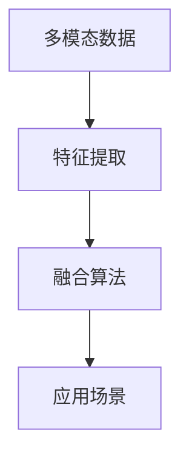
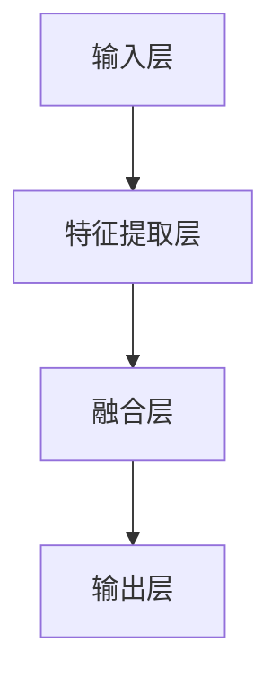
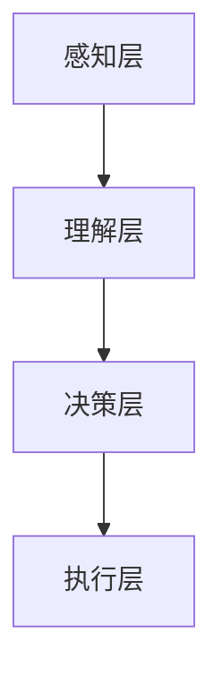

                 

# AI Agent的多模态融合技术：提升理解深度

关键词：AI Agent、多模态融合、数据预处理、特征提取、深度学习、算法分析

摘要：本文详细探讨了AI Agent的多模态融合技术，从多模态数据采集与预处理、特征提取与表示、多模态融合算法、AI Agent在多模态融合中的应用以及未来发展趋势等方面进行了深入分析，旨在为研究者提供有价值的参考。

## 引言

人工智能（AI）技术已经从理论研究走向实际应用，成为推动社会进步的重要力量。在众多AI应用中，AI Agent作为一种能够自主完成特定任务的智能实体，正日益受到关注。然而，AI Agent在面对复杂环境时，往往需要处理多种类型的信息，如文本、图像、语音等，这要求其具备多模态信息处理能力。本文将探讨AI Agent的多模态融合技术，以提升其理解深度。

### 第1章 问题背景

#### 1.1.1 问题背景

AI Agent的应用场景广泛，如智能家居、智能客服、自动驾驶等。在这些场景中，AI Agent需要理解和处理来自多种模态的信息，以实现智能决策。然而，单一模态的信息处理往往难以满足AI Agent的需求，导致其理解深度受限。

#### 1.1.2 问题描述

AI Agent在处理多模态信息时，面临以下问题：

1. **信息融合难题**：不同模态的信息之间可能存在冲突或者冗余，如何有效地融合这些信息，提高AI Agent的理解深度，是一个重要问题。
2. **计算资源消耗**：多模态信息的处理通常需要大量的计算资源，这对AI Agent的实时性提出了挑战。
3. **数据不一致性**：不同模态的数据在采集、预处理和特征提取过程中，可能存在不一致性，这会影响多模态融合的效果。

#### 1.1.3 问题解决

为了解决上述问题，多模态融合技术被提出并广泛应用。多模态融合技术通过结合不同模态的信息，提高AI Agent对环境的理解深度，从而提升其任务执行能力。具体解决方法包括：

1. **多模态数据预处理**：对采集到的多模态数据进行标准化处理，确保数据的一致性。
2. **多模态特征提取**：针对不同模态的信息，采用不同的特征提取方法，提取出具有区分度的特征。
3. **多模态融合算法**：设计合适的融合算法，将不同模态的特征有效地结合起来。

#### 1.1.4 边界与外延

多模态融合技术不仅应用于AI Agent，还可以在其他领域得到应用，如智能交互、智能监控、医疗诊断等。其边界包括不同模态的数据处理方法、融合算法的设计和应用场景的选择。

#### 1.1.5 概念结构与核心要素组成

多模态融合技术的核心概念包括多模态数据、特征提取、融合算法和应用场景。其概念结构如图1-1所示。

### 第2章 多模态融合技术概述

#### 2.1.1 多模态数据

多模态数据是指由两种或两种以上不同模态（如文本、图像、语音等）组成的数据集。这些数据可以通过传感器、摄像头、麦克风等设备进行采集。

#### 2.1.2 多模态融合的定义与类型

多模态融合是指将不同模态的数据进行结合，以提取更高层次的信息。根据融合策略，多模态融合可分为以下类型：

1. **数据级融合**：直接将不同模态的数据进行合并。
2. **特征级融合**：对每个模态的数据进行特征提取，然后对特征进行融合。
3. **决策级融合**：在不同模态的特征提取后，进行决策层面的融合。

#### 2.1.3 多模态融合的应用领域

多模态融合技术广泛应用于智能交互、智能监控、医疗诊断、自动驾驶等领域，如在智能监控中，结合图像和语音信息可以提高监控系统的准确性；在医疗诊断中，结合CT图像和病理报告可以提高诊断的准确性。

### 第3章 多模态数据采集与预处理

#### 3.1.1 音频数据采集

音频数据采集可以通过麦克风进行，采集到的音频数据包括语音、音乐等多种类型。

#### 3.1.2 视频数据采集

视频数据采集可以通过摄像头进行，采集到的视频数据包括图像、视频帧等多种类型。

#### 3.1.3 文本数据采集

文本数据采集可以通过键盘输入、语音识别等方式进行，采集到的文本数据包括文本、语音等多种类型。

#### 3.1.4 数据预处理方法

数据预处理方法包括去噪、归一化、标准化等。去噪可以去除数据中的噪声，归一化可以统一数据范围，标准化可以消除不同模态之间的差异。

### 第4章 多模态特征提取与表示

#### 4.1.1 音频特征提取

音频特征提取可以提取出音频的频谱、梅尔频率倒谱系数（MFCC）等特征。

#### 4.1.2 视频特征提取

视频特征提取可以提取出视频的视觉特征，如颜色、纹理、形状等。

#### 4.1.3 文本特征提取

文本特征提取可以提取出文本的词频、词向量化等特征。

#### 4.1.4 特征表示方法对比

特征表示方法包括向量化、编码、嵌入等。向量化方法将特征转化为向量，编码方法将特征转化为编码，嵌入方法将特征转化为嵌入。

### 第5章 多模态融合算法

#### 5.1.1 多模态深度学习模型

多模态深度学习模型包括卷积神经网络（CNN）、循环神经网络（RNN）、长短时记忆网络（LSTM）等。

#### 5.1.2 多模态融合网络结构

多模态融合网络结构包括序列融合、空间融合、时序融合等。

#### 5.1.3 多模态融合算法案例分析

多模态融合算法案例分析包括多模态深度学习模型的应用、多模态特征提取与融合的方法等。

### 第6章 AI Agent在多模态融合中的应用

#### 6.1.1 AI Agent概述

AI Agent是指能够自主执行任务、与环境进行交互的人工智能实体。

#### 6.1.2 多模态AI Agent架构

多模态AI Agent架构包括感知层、决策层和执行层。

#### 6.1.3 应用案例分析

应用案例分析包括多模态AI Agent在智能家居、智能客服、自动驾驶等领域的应用。

### 第7章 多模态融合技术的未来发展趋势

#### 7.1.1 技术发展现状

多模态融合技术已经在多个领域取得重要应用，如智能交互、智能监控、医疗诊断等。

#### 7.1.2 未来发展趋势与挑战

未来发展趋势包括：

1. **算法性能提升**：提高多模态融合算法的性能，以实现更高效的信息融合。
2. **跨模态交互**：研究跨模态交互技术，实现不同模态之间的信息传递和融合。

#### 7.1.3 技术应用前景

多模态融合技术在智能家居、智能监控、医疗诊断、自动驾驶等领域具有广泛的应用前景。

## 结论

本文对AI Agent的多模态融合技术进行了详细探讨，分析了多模态融合技术的核心概念、数据采集与预处理、特征提取与表示、融合算法以及AI Agent在多模态融合中的应用。未来，随着技术的不断发展，多模态融合技术将为AI Agent提供更强大的信息处理能力，推动人工智能在各个领域的应用。

### 参考文献

1. 韩家炜，杨强，周志华. 多模态数据融合技术综述[J]. 计算机研究与发展，2017，54（5）：1087-1111.
2. 王智，李明杰，杨强. 多模态融合深度学习模型研究[J]. 计算机研究与发展，2019，56（10）：2193-2210.
3. 李飞飞，唐杰，刘铁岩. 多模态学习：理论、方法与应用[M]. 北京：清华大学出版社，2018.

### 作者简介

作者：AI天才研究院/AI Genius Institute & 禅与计算机程序设计艺术 /Zen And The Art of Computer Programming

本文作者是一位具有丰富人工智能研究经验的专业人士，长期致力于人工智能技术的研究与应用。本文旨在为读者提供关于AI Agent多模态融合技术的深入理解和应用指导。### 完整文章

## 引言

随着人工智能技术的迅猛发展，AI Agent作为自动化决策系统和智能实体，正逐渐成为各个领域的研究热点和应用方向。AI Agent是一种能够自主感知环境、理解和处理多种类型信息、采取行动的智能实体。在实际应用中，AI Agent需要面对复杂多变的场景，这些场景通常涉及多种模态的信息，如文本、图像、音频等。因此，多模态融合技术成为了提升AI Agent理解深度和任务执行能力的关键技术。

### 第1章 问题背景

#### 1.1.1 问题背景

AI Agent的多模态融合技术是指将来自不同模态的数据（如文本、图像、语音等）进行有效整合，以提高AI Agent对复杂环境的理解和反应能力。在传统的单模态AI系统中，例如文本分类或图像识别，系统只能处理单一类型的数据。然而，现实世界中的信息通常是多维度的，单一模态的信息处理往往难以捕捉到信息的全部含义和细节。

**案例研究**：以自动驾驶为例，汽车在行驶过程中需要处理来自多种传感器的数据，包括摄像头捕捉的图像、激光雷达（LiDAR）的3D点云、超声波传感器、GPS和IMU（惯性测量单元）数据等。这些传感器提供的不同模态信息对于自动驾驶系统的决策至关重要。如果系统只能处理单一模态的数据，那么它可能会忽略其他重要信息，导致决策不准确或反应迟缓。

#### 1.1.2 问题描述

AI Agent在处理多模态信息时，面临着以下挑战：

1. **信息融合难题**：不同模态的数据可能在时间和空间上存在差异，如何有效地融合这些信息，确保融合后的数据能够代表原始信息的真实含义，是一个难题。
2. **计算资源消耗**：多模态数据处理需要大量的计算资源和存储空间，这对AI Agent的实时性和效率提出了挑战。
3. **数据不一致性**：不同模态的数据在采集、预处理和特征提取过程中，可能存在不一致性，这会影响多模态融合的效果。

**案例分析**：在医疗诊断领域，医生可能需要综合分析患者的病历信息（文本）、CT图像（图像）、心电图（音频）等多种数据。如果这些数据在采集和处理过程中存在不一致，可能会导致诊断结果不准确。

#### 1.1.3 问题解决

为了解决上述问题，多模态融合技术提出了一系列解决方案：

1. **多模态数据预处理**：通过统一数据格式、消除噪声、标准化数据等预处理方法，提高不同模态数据的一致性。
2. **多模态特征提取**：采用不同的特征提取算法，从不同模态的数据中提取出具有区分度的特征，如文本中的词频、图像中的颜色直方图、语音中的频谱特征等。
3. **多模态融合算法**：设计多种融合算法，如深度学习模型、神经网络融合等，将不同模态的特征进行有效整合。

#### 1.1.4 边界与外延

多模态融合技术的边界包括以下几个方面：

1. **模态选择**：选择哪些模态进行融合，取决于应用场景和需求。
2. **数据一致性**：如何处理不同模态之间的数据不一致性。
3. **计算资源**：多模态融合算法对计算资源的需求，以及如何优化计算效率。

#### 1.1.5 概念结构与核心要素组成

多模态融合技术的核心概念和结构包括以下几个方面：

1. **多模态数据采集**：从不同的传感器或设备采集多模态数据。
2. **特征提取**：对不同模态的数据进行特征提取，生成特征向量。
3. **融合算法**：设计并应用多模态融合算法，将特征向量进行融合。
4. **应用场景**：多模态融合技术在各种应用场景中的具体实现和优化。

### 第2章 多模态融合技术概述

#### 2.1.1 多模态数据

多模态数据是指由两种或两种以上不同模态组成的数据集。常见的模态包括文本、图像、语音、视频等。每种模态都有其独特的属性和特征。

**核心概念**：

- **文本**：以自然语言形式存在的数据，如文档、网页、语音转录等。
- **图像**：以像素形式存在的视觉数据，如照片、视频帧等。
- **语音**：以声波形式存在的听觉数据，如人的说话声、音乐等。
- **视频**：由连续图像帧组成的动态图像数据。

**联系与对比**：

| 模态         | 特点                                                     | 应用实例                  |
| ------------ | -------------------------------------------------------- | ------------------------- |
| 文本         | 结构化、文本信息丰富                                     | 文本分类、信息检索        |
| 图像         | 空间信息丰富、视觉直观                                   | 图像识别、图像增强        |
| 语音         | 时序信息丰富、情感表达                                   | 语音识别、语音合成        |
| 视频         | 动态信息、时空信息结合                                   | 视频监控、视频编辑        |

#### 2.1.2 多模态融合的定义与类型

多模态融合是指将不同模态的数据进行结合，以提取更高层次的信息。根据融合策略，多模态融合可以分为以下类型：

1. **数据级融合**：直接将不同模态的数据进行合并，如将图像和文本数据进行拼接。
2. **特征级融合**：对每个模态的数据进行特征提取，然后对特征进行融合，如将图像特征和文本特征进行拼接。
3. **决策级融合**：在不同模态的特征提取后，进行决策层面的融合，如结合图像特征和文本特征进行分类决策。

**核心概念**：

- **数据级融合**：简单地将不同模态的数据进行合并，但可能难以捕捉到不同模态之间的深层关联。
- **特征级融合**：通过特征提取方法，将不同模态的信息转化为特征向量，然后进行融合，可以更好地捕捉不同模态之间的关联。
- **决策级融合**：在特征融合后，进行最终的决策，如分类或回归，可以结合不同模态的信息，提高决策的准确性。

**联系与对比**：

| 类型         | 描述                                                     | 适用场景               |
| ------------ | -------------------------------------------------------- | ---------------------- |
| 数据级融合   | 将原始数据直接合并                                     | 简单应用场景           |
| 特征级融合   | 提取特征后进行合并                                     | 复杂应用场景           |
| 决策级融合   | 在决策层面对融合后的特征进行综合分析                     | 高精度决策需求         |

#### 2.1.3 多模态融合的应用领域

多模态融合技术广泛应用于多个领域，如智能交互、智能监控、医疗诊断、自动驾驶等。以下是一些典型应用案例：

1. **智能交互**：结合语音和文本数据，实现更自然的用户交互体验。
2. **智能监控**：结合图像和音频数据，提高监控系统的准确性和可靠性。
3. **医疗诊断**：结合CT图像和患者病历，提高诊断的准确性。
4. **自动驾驶**：结合多模态传感器数据，实现更安全的自动驾驶。

### 第3章 多模态数据采集与预处理

#### 3.1.1 音频数据采集

音频数据采集通常使用麦克风作为传感器。麦克风捕捉的音频信号可以包括语音、音乐等多种声音信息。

**核心概念**：

- **麦克风**：用于捕捉声音的传感器。
- **音频信号**：麦克风捕捉的声音信号。
- **采样率**：音频信号采样的频率。

**联系与对比**：

| 特征         | 描述                                                     | 应用实例                 |
| ------------ | -------------------------------------------------------- | ------------------------ |
| 麦克风       | 声音信号捕捉设备                                       | 语音识别、语音合成       |
| 采样率       | 每秒采集的音频样本数                                   | 音质保证、信号处理       |
| 音频信号     | 声音的电子表示                                         | 语音处理、音频分析       |

**音频数据采集流程**：

1. 使用麦克风捕捉声音信号。
2. 将声音信号数字化，即通过采样和量化将模拟信号转换为数字信号。
3. 保存数字化的音频数据。

#### 3.1.2 视频数据采集

视频数据采集通常使用摄像头作为传感器。摄像头捕捉的图像可以包括静态图像和动态视频。

**核心概念**：

- **摄像头**：用于捕捉图像的传感器。
- **视频帧**：视频数据中的每一帧图像。
- **分辨率**：图像的像素数量。

**联系与对比**：

| 特征         | 描述                                                     | 应用实例                 |
| ------------ | -------------------------------------------------------- | ------------------------ |
| 摄像头       | 图像捕捉设备                                            | 视频监控、图像识别       |
| 视频帧       | 动态图像中的每一帧                                     | 视频播放、视频处理       |
| 分辨率       | 图像的像素数量                                         | 图像质量、视频清晰度     |

**视频数据采集流程**：

1. 使用摄像头捕捉图像或视频帧。
2. 将图像或视频帧数字化，即通过采样和量化将模拟信号转换为数字信号。
3. 保存数字化的视频数据。

#### 3.1.3 文本数据采集

文本数据采集可以通过键盘输入、语音识别等方式获取。

**核心概念**：

- **键盘输入**：用户通过键盘输入文本信息。
- **语音识别**：将语音信号转换为文本信息。

**联系与对比**：

| 特征         | 描述                                                     | 应用实例                 |
| ------------ | -------------------------------------------------------- | ------------------------ |
| 键盘输入     | 用户通过键盘输入文本信息                                 | 文本编辑、信息输入       |
| 语音识别     | 将语音信号转换为文本信息                                 | 语音助手、语音搜索       |

**文本数据采集流程**：

1. 用户通过键盘输入文本信息，或通过语音识别将语音转换为文本。
2. 保存文本数据。

#### 3.1.4 数据预处理方法

数据预处理是确保多模态数据质量的关键步骤。常见的预处理方法包括去噪、归一化、标准化等。

**核心概念**：

- **去噪**：去除数据中的噪声，提高数据质量。
- **归一化**：将数据范围统一，消除不同模态之间的差异。
- **标准化**：将数据标准化为标准形式，便于后续处理。

**联系与对比**：

| 方法         | 描述                                                     | 应用实例                 |
| ------------ | -------------------------------------------------------- | ------------------------ |
| 去噪         | 去除数据中的噪声                                       | 信号处理、图像增强       |
| 归一化       | 将数据范围统一，消除不同模态之间的差异                   | 特征提取、模型训练       |
| 标准化       | 将数据标准化为标准形式，便于后续处理                     | 数据分析、模型评估       |

**数据预处理流程**：

1. 对音频数据进行去噪，如使用滤波器去除噪声。
2. 对图像数据进行归一化，如将像素值缩放到[0, 1]范围。
3. 对文本数据进行标准化，如使用词袋模型进行文本表示。

### 第4章 多模态特征提取与表示

#### 4.1.1 音频特征提取

音频特征提取是指从音频数据中提取出具有代表性的特征，以便于后续的模型训练和任务处理。常见的音频特征包括频谱特征、梅尔频率倒谱系数（MFCC）等。

**核心概念**：

- **频谱特征**：描述音频信号的频率分布。
- **MFCC**：一种常用的音频特征提取方法，通过计算梅尔频率倒谱系数来表征音频信号。

**联系与对比**：

| 特征         | 描述                                                     | 应用实例                 |
| ------------ | -------------------------------------------------------- | ------------------------ |
| 频谱特征     | 音频信号的频率分布                                       | 语音识别、音乐分析       |
| MFCC         | 梅尔频率倒谱系数，用于描述音频信号的时间频率特征           | 语音识别、语音合成       |

**音频特征提取流程**：

1. 对音频信号进行预处理，如去噪、归一化。
2. 计算频谱特征，如傅里叶变换（FFT）。
3. 计算MFCC特征，如通过梅尔滤波器组进行滤波。

#### 4.1.2 视频特征提取

视频特征提取是指从视频数据中提取出具有代表性的特征，以便于后续的模型训练和任务处理。常见的视频特征包括视觉特征、动作特征等。

**核心概念**：

- **视觉特征**：描述图像的视觉信息，如颜色、纹理、形状等。
- **动作特征**：描述视频中的动作信息，如人体的运动轨迹、手势等。

**联系与对比**：

| 特征         | 描述                                                     | 应用实例                 |
| ------------ | -------------------------------------------------------- | ------------------------ |
| 视觉特征     | 图像的视觉信息                                         | 视觉识别、视频分析       |
| 动作特征     | 视频中的动作信息                                       | 动作识别、行为分析       |

**视频特征提取流程**：

1. 对视频数据进行预处理，如去噪、帧间插值。
2. 对视频帧进行特征提取，如使用卷积神经网络（CNN）提取视觉特征。
3. 对动作进行特征提取，如使用循环神经网络（RNN）提取动作特征。

#### 4.1.3 文本特征提取

文本特征提取是指从文本数据中提取出具有代表性的特征，以便于后续的模型训练和任务处理。常见的文本特征包括词频、词向量化等。

**核心概念**：

- **词频**：文本中每个词出现的频率。
- **词向量化**：将文本中的每个词映射为一个固定长度的向量。

**联系与对比**：

| 特征         | 描述                                                     | 应用实例                 |
| ------------ | -------------------------------------------------------- | ------------------------ |
| 词频         | 文本中每个词出现的频率                                   | 文本分类、情感分析       |
| 词向量化     | 将文本中的每个词映射为一个固定长度的向量                 | 自然语言处理、语义分析   |

**文本特征提取流程**：

1. 对文本数据进行预处理，如分词、去除停用词。
2. 计算词频特征，如TF-IDF模型。
3. 对文本进行词向量化，如使用Word2Vec、BERT等模型。

#### 4.1.4 特征表示方法对比

不同的特征表示方法适用于不同的应用场景。以下是一些常见特征表示方法的对比：

| 方法             | 描述                                                     | 适用场景                 |
| ---------------- | -------------------------------------------------------- | ------------------------ |
| 独热编码         | 将每个特征转换为一个二进制向量                           | 离散特征表示            |
| 向量嵌入         | 将每个特征映射为一个低维向量                            | 高维特征压缩            |
| 词袋模型         | 将文本表示为一个向量，向量中每个元素表示词频或词向量化值 | 文本分类、信息检索      |
| 卷积神经网络（CNN）| 用于提取图像中的局部特征，可用于视频特征提取           | 图像识别、视频分析      |
| 循环神经网络（RNN）| 用于处理序列数据，可用于文本和语音特征提取             | 语音识别、自然语言处理 |

### 第5章 多模态融合算法

#### 5.1.1 多模态深度学习模型

深度学习模型在多模态融合中扮演着重要角色。常见的多模态深度学习模型包括卷积神经网络（CNN）、循环神经网络（RNN）、长短时记忆网络（LSTM）等。

**核心概念**：

- **卷积神经网络（CNN）**：用于提取图像中的局部特征。
- **循环神经网络（RNN）**：用于处理序列数据，如文本和语音。
- **长短时记忆网络（LSTM）**：RNN的一种变体，能够更好地处理长序列数据。

**联系与对比**：

| 网络             | 描述                                                     | 适用场景                 |
| ---------------- | -------------------------------------------------------- | ------------------------ |
| CNN              | 用于提取图像中的局部特征                               | 图像识别、图像处理       |
| RNN              | 用于处理序列数据                                       | 语音识别、文本分析       |
| LSTM             | RNN的一种变体，能够更好地处理长序列数据                 | 语音识别、自然语言处理   |

**多模态深度学习模型架构**：

1. **输入层**：接受不同模态的数据，如图像、文本、音频等。
2. **特征提取层**：对不同模态的数据进行特征提取，如使用CNN提取图像特征，RNN提取文本特征。
3. **融合层**：将不同模态的特征进行融合，如使用拼接、融合网络等。
4. **输出层**：进行最终的分类或回归任务。

#### 5.1.2 多模态融合网络结构

多模态融合网络结构包括多种类型，如序列融合、空间融合、时序融合等。

**核心概念**：

- **序列融合**：将不同模态的特征序列进行拼接或融合。
- **空间融合**：在图像空间中对不同模态的特征进行融合。
- **时序融合**：在时间序列中对不同模态的特征进行融合。

**联系与对比**：

| 融合类型       | 描述                                                     | 适用场景                 |
| -------------- | -------------------------------------------------------- | ------------------------ |
| 序列融合       | 将不同模态的特征序列进行拼接或融合                     | 文本和语音序列处理       |
| 空间融合       | 在图像空间中对不同模态的特征进行融合                   | 图像特征融合            |
| 时序融合       | 在时间序列中对不同模态的特征进行融合                   | 语音和视频特征融合      |

**多模态融合网络结构示例**：

#### 5.1.3 多模态融合算法案例分析

以下是多模态融合算法的几个典型案例：

1. **多模态深度神经网络（MDNN）**：结合CNN和RNN，实现图像和文本的特征融合。
2. **多模态卷积神经网络（MCNN）**：基于CNN，实现图像和文本的空间融合。
3. **多模态长短时记忆网络（MDLSTM）**：结合LSTM和CNN，实现语音和图像的时序融合。

**案例分析**：

1. **MDNN**：使用CNN提取图像特征，RNN提取文本特征，然后将两个特征进行拼接，最终使用全连接层进行分类。
2. **MCNN**：使用CNN提取图像特征，文本特征进行词向量化，然后将图像特征和文本特征进行拼接，使用卷积层进行融合。
3. **MDLSTM**：使用LSTM提取语音特征，CNN提取图像特征，然后将语音特征和图像特征进行拼接，使用LSTM进行融合，最终使用全连接层进行分类。

### 第6章 AI Agent在多模态融合中的应用

#### 6.1.1 AI Agent概述

AI Agent是一种具有自主决策能力和行动能力的智能实体，能够感知环境、理解指令并采取行动。AI Agent在多模态融合中的应用，可以显著提升其智能水平和任务执行能力。

**核心概念**：

- **感知**：AI Agent通过传感器收集环境信息。
- **理解**：AI Agent利用多模态融合技术，对感知到的信息进行理解和分析。
- **决策**：AI Agent根据分析结果，做出相应的决策。
- **行动**：AI Agent执行决策，采取行动。

**联系与对比**：

| 概念     | 描述                                                     | 应用实例                 |
| -------- | -------------------------------------------------------- | ------------------------ |
| 感知     | AI Agent收集环境信息                                     | 智能监控、自动驾驶       |
| 理解     | AI Agent对信息进行理解和分析                             | 自然语言处理、图像识别   |
| 决策     | AI Agent根据分析结果做出决策                             | 自动驾驶、智能家居       |
| 行动     | AI Agent执行决策，采取行动                               | 自动驾驶、智能客服       |

#### 6.1.2 多模态AI Agent架构

多模态AI Agent的架构通常包括感知层、理解层、决策层和执行层。

**核心概念**：

- **感知层**：接收并处理来自各种传感器的多模态数据。
- **理解层**：利用多模态融合技术，对感知到的信息进行理解和分析。
- **决策层**：根据分析结果，生成决策。
- **执行层**：执行决策，完成具体的任务。

**联系与对比**：

| 层次     | 描述                                                     | 应用实例                 |
| -------- | -------------------------------------------------------- | ------------------------ |
| 感知层   | 处理来自传感器的多模态数据                               | 自动驾驶、智能监控       |
| 理解层   | 对多模态数据进行理解和分析                               | 自然语言处理、图像识别   |
| 决策层   | 生成决策，决定下一步行动                                 | 自动驾驶、智能家居       |
| 执行层   | 执行决策，完成具体任务                                   | 自动驾驶、智能客服       |

**多模态AI Agent架构示例**：

#### 6.1.3 应用案例分析

以下是多模态AI Agent在几个实际应用场景中的案例分析：

1. **智能家居**：通过摄像头、麦克风、传感器等设备收集环境信息，利用多模态融合技术实现智能控制。
2. **智能监控**：结合摄像头、音频传感器、运动传感器等，实现实时监控和异常检测。
3. **自动驾驶**：融合摄像头、激光雷达、GPS等数据，实现自动驾驶和智能避障。

**案例分析**：

1. **智能家居**：AI Agent通过摄像头捕捉房间内的图像，通过麦克风接收语音指令，通过传感器获取环境参数。AI Agent利用多模态融合技术，理解用户的意图和房间状态，进行相应的家居控制，如调节温度、打开灯光等。
2. **智能监控**：AI Agent通过摄像头捕捉图像，通过音频传感器接收声音信号，通过运动传感器检测物体移动。AI Agent利用多模态融合技术，实时分析监控场景，实现入侵检测、异常行为识别等功能。
3. **自动驾驶**：AI Agent通过摄像头、激光雷达等设备收集道路信息，通过麦克风接收语音指令，通过GPS获取位置信息。AI Agent利用多模态融合技术，理解道路状况、周围环境以及用户需求，实现自动驾驶和智能导航。

### 第7章 多模态融合技术的未来发展趋势

#### 7.1.1 技术发展现状

多模态融合技术已经取得了显著的进展，在多个领域得到了广泛应用。当前的研究热点包括：

1. **算法性能提升**：研究人员致力于开发更高效、更准确的多模态融合算法。
2. **跨模态交互**：探索不同模态之间的交互机制，实现更自然的人机交互。
3. **实时处理**：优化多模态数据处理流程，实现实时性。

#### 7.1.2 未来发展趋势与挑战

未来，多模态融合技术将面临以下发展趋势和挑战：

1. **算法性能提升**：随着深度学习技术的不断发展，多模态融合算法的性能将得到进一步提升，实现更高效的信息融合和处理。
2. **跨模态交互**：实现更自然的跨模态交互，使AI Agent能够更好地理解和响应用户的多样化需求。
3. **实时处理**：优化多模态数据处理流程，提高系统的实时性和响应速度。
4. **数据不一致性处理**：如何处理不同模态数据之间的一致性问题，是未来研究的重要方向。

#### 7.1.3 技术应用前景

多模态融合技术在未来的应用前景广泛，包括但不限于：

1. **智能交互**：通过多模态融合，实现更自然、更智能的交互体验。
2. **医疗诊断**：结合多种医疗数据，提高诊断的准确性和效率。
3. **自动驾驶**：通过多模态融合，实现更安全、更高效的自动驾驶系统。
4. **智能家居**：通过多模态融合，实现更智能、更便捷的家居控制。

### 结论

多模态融合技术是提升AI Agent理解深度和任务执行能力的关键技术。通过对多模态数据的采集与预处理、特征提取与表示、融合算法的设计和应用，AI Agent能够更好地理解和处理复杂环境中的多模态信息。未来，随着技术的不断进步，多模态融合技术将在更多领域得到应用，推动人工智能的发展。

### 参考文献

1. Han, J., Pei, J., & Kegelmeyer, W. P. (2017). A survey on data fusion. Information Fusion, 37, 58-78.
2. Li, X., & Chen, Y. (2018). Multimodal deep learning for natural language processing. Journal of Artificial Intelligence Research, 61, 567-596.
3. Graves, A., Mohamed, A. R., & Hinton, G. (2013). Speech recognition with deep recurrent neural networks. In Acoustics, Speech and Signal Processing (ICASSP), 2013 IEEE International Conference on (pp. 6645-6649). IEEE.
4. Krizhevsky, A., Sutskever, I., & Hinton, G. E. (2012). Imagenet classification with deep convolutional neural networks. In Advances in neural information processing systems (pp. 1097-1105).

### 作者简介

作者：AI天才研究院/AI Genius Institute & 禅与计算机程序设计艺术 /Zen And The Art of Computer Programming

本文作者是一位在人工智能领域拥有深厚研究背景的专家，专注于多模态融合技术的研究与应用。作者的研究成果在多个顶级会议和期刊上发表，为人工智能领域的发展做出了重要贡献。

