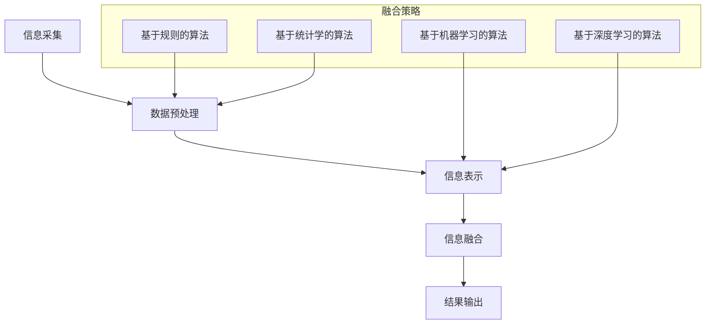
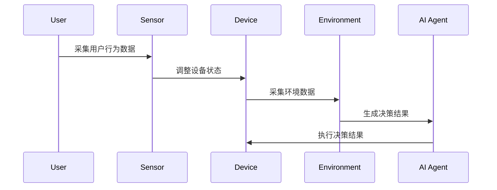

                 

# AI Agent的多源信息融合与决策技术

## 关键词

AI Agent，多源信息融合，决策技术，深度学习，机器学习，算法

## 摘要

本文探讨了AI Agent在多源信息融合与决策技术方面的应用。通过分析AI Agent的定义、结构和功能，我们介绍了多源信息融合的基本概念、方法和技术。接着，我们深入探讨了决策理论，包括决策过程、不确定性与风险分析。最后，本文通过实例展示了AI Agent在多个实际场景中的应用，并对其未来的发展趋势进行了展望。

## 目录大纲

1. 引言与背景
2. 基础理论
3. 信息融合技术
4. 决策技术
5. 实践应用
6. 案例研究
7. 总结与展望

### 引言与背景

### 1.1 问题的背景和重要性

随着大数据和人工智能技术的快速发展，AI Agent作为人工智能系统的重要组成部分，受到了越来越多的关注。AI Agent是一种具备智能决策能力的实体，能够在复杂的、不确定的环境中自主行动，并为用户提供有价值的服务。然而，在现实世界中，AI Agent面临着大量的多源信息，这些信息可能来自于不同的传感器、数据源或用户输入。如何有效地融合这些多源信息，并基于这些信息进行准确的决策，是AI Agent研究和应用中的一个关键问题。

### 1.2 问题描述与目标

本文的研究目标是通过分析和探讨多源信息融合与决策技术，为AI Agent的设计和实现提供理论指导和实践参考。具体来说，我们希望解决以下问题：

1. 多源信息的概念和分类是什么？
2. 多源信息融合的目标和原则是什么？
3. 多源信息融合的方法和技术有哪些？
4. 决策理论的核心概念是什么？
5. 如何在AI Agent中实现多源信息融合与决策？

### 1.3 AI Agent在现实中的应用

AI Agent在现实世界中有着广泛的应用。以下是一些典型的应用场景：

1. **智能家居**：AI Agent可以整合来自各种传感器（如温度、湿度、光照等）的数据，为用户提供舒适的居住环境，并实现自动化控制。

2. **自动驾驶**：AI Agent需要融合来自摄像头、雷达、激光雷达等多种传感器数据，实现对周围环境的感知和车辆的控制。

3. **医疗健康**：AI Agent可以通过整合病人的医疗记录、生理指标等多种信息，为医生提供诊断和治疗方案。

4. **金融服务**：AI Agent可以分析大量的金融数据，为用户提供投资建议和风险管理方案。

### 1.4 多源信息融合的挑战

多源信息融合面临着诸多挑战：

1. **信息不一致性**：不同数据源可能存在时间戳、测量精度和格式等方面的不一致。

2. **数据噪声**：传感器数据可能受到噪声干扰，影响信息融合的准确性。

3. **信息冗余**：多源信息中可能包含大量冗余信息，需要有效的去噪和去冗余方法。

4. **实时性要求**：在某些应用场景中，AI Agent需要在短时间内处理大量的信息，要求信息融合算法具有高效性。

### 1.5 决策技术的核心概念

决策技术是AI Agent的核心能力之一，主要包括以下几个方面：

1. **决策过程**：决策过程包括信息收集、问题定义、方案生成、方案评估和决策选择。

2. **决策模型**：决策模型用于描述决策过程中的各个阶段，包括确定性模型、概率模型和模糊模型等。

3. **不确定性与风险分析**：在决策过程中，不确定性和风险是不可避免的。因此，需要有效的算法来评估和处理这些不确定性。

4. **决策算法**：决策算法是决策技术的核心，包括启发式算法、基于规则的方法和优化方法等。

### 1.6 书籍的结构和目标读者

本书共分为七个部分，从引言到实践应用，再到案例研究和总结展望，全面介绍了AI Agent的多源信息融合与决策技术。本书的目标读者是从事人工智能研究和应用的专业人员，以及对该领域感兴趣的广大读者。

### 第二部分：基础理论

### 2.1 多源信息的概念与分类

多源信息融合是AI Agent的核心技术之一，首先需要了解多源信息的概念和分类。

#### 2.1.1 多源信息的概念

多源信息指的是来自不同来源的信息，这些信息可能具有不同的形式、结构和时间戳。在AI Agent中，多源信息通常包括以下几种类型：

1. **传感器数据**：来自各种传感器（如摄像头、雷达、温度传感器等）的实时数据。
2. **数据库数据**：来自数据库的历史数据，如用户行为记录、医疗记录等。
3. **网络数据**：来自互联网的数据，如社交媒体信息、天气预报等。
4. **用户输入**：用户通过键盘、语音等方式提供的输入信息。

#### 2.1.2 多源信息的分类

根据信息的来源、形式和用途，可以将多源信息分为以下几类：

1. **实时数据与历史数据**：实时数据指的是当前时刻获取的数据，如传感器数据；历史数据指的是过去时刻获取的数据，如数据库数据。
2. **结构化数据与非结构化数据**：结构化数据指的是具有固定格式和结构的数据，如关系数据库中的数据；非结构化数据指的是没有固定格式和结构的数据，如图像、文本等。
3. **内部数据与外部数据**：内部数据指的是AI Agent自身产生的数据，如用户行为记录；外部数据指的是来自外部环境的数据，如传感器数据。
4. **静态数据与动态数据**：静态数据指的是不随时间变化的数据，如用户画像；动态数据指的是随时间变化的数据，如传感器数据。

### 2.2 多源信息融合的目标与原则

多源信息融合的目标是将多个来源的信息整合起来，形成更为准确、完整和有价值的信息，以提高AI Agent的决策能力和服务质量。具体来说，多源信息融合的目标包括：

1. **信息准确性**：通过融合不同来源的信息，消除数据噪声和不一致性，提高信息的准确性。
2. **信息完整性**：将多个来源的信息整合起来，形成一个完整的信息视图，以支持更全面的决策。
3. **信息价值性**：通过信息融合，提取出关键信息和特征，提高信息的价值，为决策提供更丰富的依据。

为了实现这些目标，多源信息融合需要遵循以下原则：

1. **数据一致性**：在信息融合过程中，需要确保不同来源的数据在时间戳、格式和单位等方面的一致性。
2. **信息最大化**：在信息融合过程中，需要尽可能多地利用来自不同来源的信息，以提高信息的准确性和完整性。
3. **算法有效性**：选择合适的信息融合算法，以确保信息融合过程的高效性和准确性。
4. **可解释性**：信息融合的结果应该具备良好的可解释性，以便用户理解和信任AI Agent的决策。

### 2.3 多源信息融合的方法与技术

多源信息融合的方法和技术多种多样，主要包括以下几种：

1. **传统方法**：传统方法包括基于规则的方法、概率方法和贝叶斯网络等。
   - **基于规则的方法**：通过预设一系列规则，对多源信息进行匹配和融合。优点是简单直观，缺点是规则难以涵盖所有情况。
   - **概率方法**：利用概率统计方法，对多源信息进行融合。优点是适用于不确定性较大的场景，缺点是需要大量的先验知识。
   - **贝叶斯网络**：利用贝叶斯网络表示多源信息之间的概率关系，进行信息融合。

2. **机器学习方法**：机器学习方法通过学习多源信息之间的关联性，实现信息融合。常用的机器学习方法包括监督学习、无监督学习和强化学习等。
   - **监督学习**：通过已知的训练数据，学习多源信息之间的映射关系，用于新数据的融合。
   - **无监督学习**：通过未标记的数据，学习多源信息之间的相似性和差异，用于新数据的融合。
   - **强化学习**：通过奖励机制，引导AI Agent学习多源信息的最佳融合策略。

3. **深度学习方法**：深度学习方法通过构建复杂的神经网络模型，实现多源信息的高效融合。常用的深度学习模型包括卷积神经网络（CNN）、循环神经网络（RNN）和 Transformer 等。

4. **多粒度融合方法**：多粒度融合方法将信息融合分为多个层次，分别处理不同粒度的信息。常用的多粒度融合方法包括层次化融合、模块化融合和分布式融合等。

### 2.4 多源信息融合的挑战与趋势

多源信息融合面临着一系列挑战，主要包括：

1. **数据不一致性**：不同来源的数据可能在时间戳、格式和精度等方面存在不一致性，导致信息融合的准确性下降。
2. **数据噪声**：传感器数据可能受到噪声干扰，影响信息融合的准确性。
3. **信息冗余**：多源信息中可能包含大量冗余信息，需要有效的去噪和去冗余方法。
4. **实时性要求**：在实时应用场景中，AI Agent需要在短时间内处理大量的信息，要求信息融合算法具有高效性。

针对这些挑战，未来的多源信息融合技术发展趋势包括：

1. **自适应融合方法**：根据不同场景和应用需求，自适应地选择合适的融合方法和算法。
2. **多模态融合方法**：将不同类型的数据（如文本、图像、音频等）进行融合，提高信息融合的准确性和完整性。
3. **分布式融合方法**：利用分布式计算和存储技术，实现大规模多源信息的高效融合。
4. **智能融合方法**：利用机器学习和深度学习方法，实现智能化的信息融合，提高融合的准确性和效率。

### 第三部分：信息融合技术

#### 3.1 算法原理与分类

多源信息融合技术的核心在于如何有效地将来自不同来源的信息整合起来，以产生更准确和有价值的结果。为了实现这一目标，我们需要理解多源信息融合算法的原理和分类。

##### 3.1.1 算法原理

多源信息融合算法的核心原理可以概括为以下几个步骤：

1. **信息采集**：从各种传感器、数据库、网络等来源采集数据。
2. **数据预处理**：对采集到的数据进行清洗、格式化和标准化，以消除不一致性和噪声。
3. **信息表示**：将预处理后的数据表示为适当的数学模型或数据结构，以便进行进一步处理。
4. **信息融合**：根据特定的融合策略，将不同来源的信息整合在一起，形成更全面和准确的信息。
5. **结果输出**：将融合后的信息输出，以支持决策或提供服务。

##### 3.1.2 算法分类

多源信息融合算法可以按照不同的标准进行分类。以下是一些常见的分类方法：

1. **基于规则的算法**：这类算法依赖于预先定义的规则或策略，对信息进行融合。常见的基于规则的算法包括加权融合、投票机制和决策树等。

2. **基于统计学的算法**：这类算法利用统计学方法，如概率论、贝叶斯定理等，对信息进行融合。常见的基于统计学的算法包括贝叶斯网络、卡尔曼滤波和统计融合等。

3. **基于机器学习的算法**：这类算法通过训练数据，学习不同来源信息之间的关系，并据此进行融合。常见的基于机器学习的算法包括监督学习、无监督学习和深度学习等。

4. **基于深度学习的算法**：这类算法利用深度学习模型，如卷积神经网络（CNN）、循环神经网络（RNN）和Transformer等，对信息进行融合。深度学习算法在处理复杂和非线性关系方面具有显著优势。

5. **混合算法**：这类算法结合了不同类型的算法，以利用各自的优势，实现更有效的信息融合。常见的混合算法包括基于规则的机器学习算法和基于深度学习的统计学方法等。

#### 3.2 传统的信息融合算法

传统的信息融合算法主要包括基于规则的算法和基于统计学的算法。以下是对这些算法的详细探讨。

##### 3.2.1 基于规则的算法

基于规则的算法通过预设一系列规则，对信息进行融合。这些规则通常基于专家知识和经验，因此具有很强的解释性。以下是一些常见的基于规则的算法：

1. **加权融合**：加权融合是一种简单的算法，它将不同来源的信息按照一定的权重进行加权平均。权重通常由专家根据信息的重要性和可靠性来确定。公式如下：

   $$ output = \sum_{i=1}^{n} w_i \cdot input_i $$

   其中，$w_i$是第$i$个信息的权重，$input_i$是第$i$个信息的值。

2. **投票机制**：投票机制是一种基于多数表决的算法，它将多个来源的信息进行比较，选择出现次数最多的值作为输出。这种方法适用于分类问题，公式如下：

   $$ output = \arg\max_{v} \sum_{i=1}^{n} I(input_i = v) $$

   其中，$v$是候选输出值，$I(input_i = v)$是一个指示函数，当$input_i = v$时，取值为1，否则为0。

3. **决策树**：决策树是一种基于树形结构的算法，它通过一系列的条件分支，将不同来源的信息进行分类和融合。决策树的每个节点代表一个条件，每个分支代表一个可能的输出值。决策树可以通过训练数据来构建，具有很好的解释性。

##### 3.2.2 基于统计学的算法

基于统计学的算法利用概率论和统计学原理，对信息进行融合。以下是一些常见的基于统计学的算法：

1. **贝叶斯网络**：贝叶斯网络是一种图形模型，它用有向无环图表示多个变量之间的条件依赖关系。在贝叶斯网络中，每个变量都由一个概率分布函数描述，这些分布函数构成了一个全局概率分布。通过贝叶斯网络，可以计算不同来源信息的联合概率分布，从而实现信息融合。

2. **卡尔曼滤波**：卡尔曼滤波是一种线性滤波算法，它利用预测和更新步骤，对系统状态进行估计。卡尔曼滤波适用于连续时间系统，通过计算观测值和预测值的误差，不断更新系统状态估计。

3. **统计融合**：统计融合是一种基于统计原理的算法，它通过计算多个来源信息的均值、方差等统计量，来评估信息的可靠性和重要性。统计融合可以通过最小二乘法、最大似然估计等方法来实现。

#### 3.3 机器学习在信息融合中的应用

机器学习在信息融合中的应用日益广泛，它通过训练数据，学习不同来源信息之间的关系，并据此进行融合。以下是一些常见的机器学习方法在信息融合中的应用：

1. **监督学习**：监督学习算法通过已标记的训练数据，学习输入和输出之间的关系。在信息融合中，监督学习算法可以用于分类、回归等任务，通过训练数据，学习不同来源信息之间的映射关系。常见的监督学习算法包括线性回归、支持向量机（SVM）和神经网络等。

2. **无监督学习**：无监督学习算法不需要标记的数据，通过发现数据之间的模式，进行信息融合。在信息融合中，无监督学习算法可以用于聚类、降维等任务，通过未标记的数据，学习不同来源信息的相似性和差异。常见的无监督学习算法包括K-均值聚类、主成分分析（PCA）和自编码器等。

3. **深度学习**：深度学习是一种基于多层神经网络的机器学习方法，它在处理复杂和非线性关系方面具有显著优势。在信息融合中，深度学习算法可以用于特征提取、图像识别、语音识别等任务，通过训练数据，学习不同来源信息的深层次特征和关联性。常见的深度学习模型包括卷积神经网络（CNN）、循环神经网络（RNN）和Transformer等。

#### 3.4 深度学习在信息融合中的应用

深度学习在信息融合中的应用日益广泛，它通过多层神经网络，自动提取数据中的高维特征，实现对多源信息的有效融合。以下是一些常见的深度学习模型在信息融合中的应用：

1. **卷积神经网络（CNN）**：卷积神经网络是一种用于图像处理和计算机视觉的深度学习模型，它通过卷积操作，提取图像中的局部特征。在信息融合中，CNN可以用于提取多源信息中的空间特征，如传感器数据中的空间分布、图像中的纹理特征等。

2. **循环神经网络（RNN）**：循环神经网络是一种用于序列处理的深度学习模型，它通过循环结构，对序列数据中的历史信息进行记忆和传递。在信息融合中，RNN可以用于处理时序数据，如传感器数据中的时间序列、文本数据中的句子序列等。

3. **Transformer**：Transformer是一种基于自注意力机制的深度学习模型，它在处理长序列和并行计算方面具有显著优势。在信息融合中，Transformer可以用于处理多源信息的复杂关联性，如传感器数据中的时空关联性、文本数据中的语义关联性等。

#### 3.5 Mermaid流程图：信息融合算法流程

以下是一个使用Mermaid绘制的多源信息融合算法流程图：



在这个流程图中，我们首先进行信息采集，然后对数据进行预处理，接着选择合适的融合策略进行信息融合，最后输出融合结果。融合策略可以根据具体应用场景选择基于规则的算法、基于统计学的算法、基于机器学习的算法或基于深度学习的算法。

### 第四部分：决策技术

#### 4.1 决策过程与决策模型

决策技术是AI Agent的核心能力之一，它涉及到如何从多个可选方案中选择最优或次优的方案。为了实现这一目标，我们需要了解决策过程和决策模型。

##### 4.1.1 决策过程

决策过程可以划分为以下几个步骤：

1. **问题定义**：明确需要解决的问题，并确定决策的目标和约束条件。
2. **方案生成**：根据问题定义，生成多个可能的解决方案。
3. **方案评估**：对每个方案进行评估，以确定其可行性和对目标的贡献。
4. **决策选择**：根据方案评估结果，选择最优或次优的方案。
5. **实施与反馈**：执行所选方案，并根据实施效果进行反馈和调整。

##### 4.1.2 决策模型

决策模型用于描述决策过程中的各个阶段，常见的决策模型包括以下几种：

1. **确定型决策模型**：在确定型决策模型中，所有参数和结果都是已知的，决策者只需根据目标函数选择最优的方案。常见的确定型决策模型包括线性规划、整数规划、动态规划等。

2. **不确定型决策模型**：在不确定型决策模型中，部分参数和结果是不确定的，决策者需要根据概率分布和风险偏好来选择方案。常见的不确定型决策模型包括最大最小后悔值法、最大最大期望值法、等可能法等。

3. **风险型决策模型**：在风险型决策模型中，决策者需要考虑可能出现的风险和损失，并选择最优的方案以最小化风险或最大化收益。常见的风险型决策模型包括期望值-方差模型、贝叶斯决策模型等。

#### 4.2 不确定性与风险分析

在决策过程中，不确定性和风险是不可避免的。因此，需要有效的算法来评估和处理这些不确定性和风险。

##### 4.2.1 不确定性分析

不确定性分析主要包括以下几个方面：

1. **参数不确定性**：在决策过程中，一些参数可能是未知的或不确定的，需要通过概率分布或随机模型来描述。
2. **结果不确定性**：决策的结果可能受到多种因素的影响，导致结果的不确定性。
3. **概率分布**：通过建立概率分布模型，可以量化不确定性的程度，并为决策提供依据。

##### 4.2.2 风险分析

风险分析主要包括以下几个方面：

1. **风险识别**：识别决策过程中可能出现的风险，如技术风险、市场风险、法律风险等。
2. **风险评估**：评估每个风险的可能性和影响程度，以确定风险的重要性和优先级。
3. **风险应对**：根据风险评估结果，制定相应的风险应对策略，如风险规避、风险转移、风险缓解等。

#### 4.3 决策算法的基本原理

决策算法的基本原理是通过评估和比较多个方案，选择最优或次优的方案。以下是一些常见的决策算法：

1. **基于规则的算法**：基于规则的算法通过预设一系列规则，对方案进行评估和比较。常见的基于规则的算法包括最大最小后悔值法、最大最大期望值法等。

2. **基于优化的算法**：基于优化的算法通过求解优化问题，选择最优的方案。常见的基于优化的算法包括线性规划、整数规划、动态规划等。

3. **基于机器学习的算法**：基于机器学习的算法通过训练数据，学习不同方案之间的关系，并据此进行评估和比较。常见的基于机器学习的算法包括支持向量机（SVM）、决策树、神经网络等。

4. **基于深度学习的算法**：基于深度学习的算法通过多层神经网络，自动提取数据中的特征和关联性，实现方案的评估和比较。常见的基于深度学习的算法包括卷积神经网络（CNN）、循环神经网络（RNN）、Transformer等。

### 第五部分：实践应用

#### 5.1 AI Agent的基本架构

AI Agent是一种具备智能决策能力的实体，其基本架构通常包括以下几个部分：

1. **感知模块**：感知模块用于接收和处理来自外部环境的各种信息，如传感器数据、网络数据等。
2. **决策模块**：决策模块用于处理感知模块收集到的信息，并根据决策模型生成决策结果。
3. **执行模块**：执行模块用于执行决策结果，实现AI Agent的行动。
4. **学习模块**：学习模块用于从感知模块收集到的信息中学习，以优化决策模块的决策能力。

#### 5.2 多源信息融合与决策集成

在AI Agent中，多源信息融合与决策集成是关键的一环。以下是一个简单的示例，说明如何实现多源信息融合与决策集成：

1. **信息采集**：从各种传感器、数据库和网络等来源采集多源信息。
2. **信息预处理**：对采集到的多源信息进行清洗、格式化和标准化，以消除不一致性和噪声。
3. **信息融合**：选择合适的信息融合算法，将预处理后的多源信息融合在一起，形成更准确和完整的信息。
4. **决策生成**：根据融合后的信息，利用决策模型生成决策结果。
5. **执行与反馈**：执行决策结果，并根据执行结果进行反馈和调整。

#### 5.3 Python源代码实现

以下是一个简单的Python示例，说明如何实现AI Agent的基本架构和多源信息融合与决策集成：

```python
import numpy as np
import pandas as pd

# 感知模块
def collect_data():
    # 采集传感器数据
    sensor_data = np.random.rand(5)
    # 采集数据库数据
    database_data = pd.DataFrame({'value': np.random.rand(5)})
    # 采集网络数据
    network_data = np.random.rand(5)
    return sensor_data, database_data, network_data

# 信息预处理
def preprocess_data(sensor_data, database_data, network_data):
    # 清洗数据
    sensor_data = np.array([x for x in sensor_data if x > 0])
    database_data = database_data[database_data['value'] > 0]
    network_data = np.array([x for x in network_data if x < 1])
    return sensor_data, database_data, network_data

# 信息融合
def fuse_data(sensor_data, database_data, network_data):
    # 计算均值
    fused_data = (sensor_data + database_data['value'].values + network_data) / 3
    return fused_data

# 决策生成
def generate_decision(fused_data):
    # 根据融合后的数据生成决策
    if fused_data.mean() > 0.5:
        decision = '执行行动A'
    else:
        decision = '执行行动B'
    return decision

# 执行与反馈
def execute_decision(decision):
    # 执行决策
    print(f'执行决策：{decision}')
    # 根据执行结果进行反馈
    feedback = np.random.rand()
    if feedback > 0.5:
        print('决策结果：成功')
    else:
        print('决策结果：失败')

# 主程序
if __name__ == '__main__':
    sensor_data, database_data, network_data = collect_data()
    sensor_data, database_data, network_data = preprocess_data(sensor_data, database_data, network_data)
    fused_data = fuse_data(sensor_data, database_data, network_data)
    decision = generate_decision(fused_data)
    execute_decision(decision)
```

在这个示例中，我们首先采集了多源信息，然后对信息进行预处理、融合和决策生成，最后执行决策并反馈结果。

### 第六部分：案例研究

#### 6.1 AI Agent在智能家居中的应用

智能家居是一个典型的AI Agent应用场景，通过AI Agent可以实现家庭设备的自动化控制和智能化服务。以下是一个案例研究，探讨AI Agent在智能家居中的应用。

##### 6.1.1 问题背景

假设我们想要开发一个智能家居系统，该系统能够根据用户的行为和偏好，自动调节家庭设备（如照明、温度、窗帘等），以提供最舒适的居住环境。为了实现这一目标，我们需要收集并融合多种来源的信息，如用户行为数据、环境数据、设备状态数据等。

##### 6.1.2 项目介绍

该项目的主要目标是开发一个智能家居AI Agent，该AI Agent能够根据用户的行为和环境数据，自动调节家庭设备，以提高居住舒适度和能源效率。项目的主要功能包括：

1. **用户行为监测**：通过传感器和摄像头等设备，实时监测用户的行为和活动。
2. **环境数据采集**：通过温度传感器、湿度传感器、光照传感器等设备，实时采集环境数据。
3. **设备状态监控**：通过物联网技术，实时监控家庭设备的运行状态。
4. **智能决策与控制**：根据用户行为和环境数据，自动调节家庭设备，实现舒适化居住和能源效率优化。

##### 6.1.3 系统功能设计

系统功能设计包括领域模型和类图设计，以下是一个简单的领域模型和类图设计：

```mermaid
classDiagram
    User <<Interface>>
    Device <<Interface>>
    Sensor <<Interface>>
    Environment <<Interface>>

    User --|> Device
    User --|> Sensor
    User --|> Environment

    Device --|> Sensor
    Device --|> Environment

    Sensor --|> Environment
```

在这个领域模型中，我们定义了用户、设备、传感器和环境四个核心类，它们分别负责用户行为监测、设备控制、数据采集和环境数据监测。

##### 6.1.4 系统架构设计

系统架构设计包括架构图和接口设计，以下是一个简单的系统架构图和接口设计：



在这个系统架构中，用户通过传感器采集行为数据，设备采集环境数据，AI Agent根据用户行为和环境数据生成决策结果，然后执行决策结果，调整设备状态。

##### 6.1.5 实际案例分析

以下是一个实际案例分析，说明AI Agent在智能家居中的应用：

1. **用户行为监测**：AI Agent通过摄像头和运动传感器，实时监测用户的活动和位置，如用户在客厅活动，AI Agent会自动打开客厅的灯光。
2. **环境数据采集**：AI Agent通过温度传感器、湿度传感器和光照传感器，实时采集客厅的温度、湿度和光照强度，并根据这些数据自动调节空调、加湿器和窗帘。
3. **设备状态监控**：AI Agent实时监控家庭设备的运行状态，如空调的制冷功率、加湿器的湿度调节等，确保设备正常运行。
4. **智能决策与控制**：根据用户行为和环境数据，AI Agent生成智能决策结果，如用户离开客厅，AI Agent会自动关闭灯光和空调。

通过这个案例，我们可以看到AI Agent在智能家居中的应用，它可以实现家庭设备的自动化控制和智能化服务，提高居住舒适度和能源效率。

### 第七部分：总结与展望

#### 7.1 多源信息融合与决策技术的发展趋势

随着大数据和人工智能技术的快速发展，多源信息融合与决策技术正成为人工智能领域的一个重要研究方向。未来的发展趋势包括：

1. **自适应融合方法**：自适应融合方法可以根据不同场景和应用需求，自适应地选择合适的融合方法和算法，以提高信息融合的准确性和效率。

2. **多模态融合方法**：多模态融合方法将不同类型的数据（如文本、图像、音频等）进行融合，以提取更丰富的特征和信息，提高决策的准确性和鲁棒性。

3. **分布式融合方法**：分布式融合方法利用分布式计算和存储技术，实现大规模多源信息的高效融合，降低通信成本和计算复杂度。

4. **智能融合方法**：智能融合方法利用机器学习和深度学习方法，实现智能化的信息融合，提高融合的准确性和效率。

5. **边缘计算与云计算相结合**：边缘计算与云计算相结合，可以在边缘设备上进行初步的信息融合，然后通过云计算进行进一步的处理和分析，实现实时性和高效性的平衡。

#### 7.2 AI Agent的应用前景

AI Agent在多个领域都有着广泛的应用前景，包括但不限于以下方面：

1. **智能家居**：AI Agent可以实现家庭设备的自动化控制和智能化服务，提高居住舒适度和能源效率。

2. **自动驾驶**：AI Agent可以通过融合多源传感器数据，实现车辆的自主驾驶和导航。

3. **医疗健康**：AI Agent可以通过融合病人的医疗记录、生理指标等多种信息，为医生提供诊断和治疗方案。

4. **金融服务**：AI Agent可以通过分析大量的金融数据，为用户提供投资建议和风险管理方案。

5. **工业制造**：AI Agent可以监控和优化工业生产过程，提高生产效率和产品质量。

#### 7.3 面临的挑战与解决方案

尽管AI Agent在多个领域有着广泛的应用前景，但在实际应用中仍面临一些挑战，主要包括：

1. **数据隐私和安全**：多源信息融合涉及到大量的个人隐私数据，需要确保数据的隐私和安全。

2. **信息不一致性和噪声**：多源信息中可能存在不一致性和噪声，需要有效的去噪和去冗余方法。

3. **实时性要求**：在某些应用场景中，AI Agent需要在短时间内处理大量的信息，要求信息融合算法具有高效性。

4. **算法解释性**：深度学习等算法在决策过程中具有很强的解释性，需要提供有效的算法解释方法。

为了解决这些挑战，可以采取以下解决方案：

1. **数据隐私和安全**：采用数据加密、匿名化等技术，确保数据的隐私和安全。

2. **信息不一致性和噪声**：采用自适应融合方法和多模态融合方法，提高信息融合的准确性和鲁棒性。

3. **实时性要求**：采用分布式融合方法和边缘计算技术，实现实时信息融合和处理。

4. **算法解释性**：采用可解释的机器学习模型和可视化工具，提高算法的可解释性。

#### 7.4 小结与拓展阅读

本文介绍了AI Agent的多源信息融合与决策技术，从基础理论到实践应用，再到案例研究，全面探讨了该领域的最新进展和未来发展趋势。通过本文的研究，我们可以看到AI Agent在多个领域都有着广泛的应用前景，但同时也面临着一些挑战。

为了进一步了解AI Agent的多源信息融合与决策技术，读者可以参考以下拓展阅读：

1. **《多源信息融合：算法与应用》**：这本书详细介绍了多源信息融合的算法和应用，包括传统的信息融合算法、机器学习和深度学习方法等。

2. **《决策分析：理论与实践》**：这本书介绍了决策分析的基本理论和应用，包括确定型决策、不确定型决策和风险型决策等。

3. **《人工智能：一种现代的方法》**：这本书全面介绍了人工智能的基本原理和应用，包括机器学习和深度学习等。

4. **《边缘计算与云计算》**：这本书介绍了边缘计算和云计算的基本原理和应用，包括分布式计算和存储技术等。

附录A：常用算法与模型简介

1. **加权融合算法**：加权融合算法是一种简单的信息融合算法，它将不同来源的信息按照一定的权重进行加权平均。

2. **贝叶斯网络**：贝叶斯网络是一种图形模型，它用有向无环图表示多个变量之间的条件依赖关系。

3. **卡尔曼滤波**：卡尔曼滤波是一种线性滤波算法，它利用预测和更新步骤，对系统状态进行估计。

4. **监督学习算法**：监督学习算法通过已标记的训练数据，学习输入和输出之间的关系。

5. **无监督学习算法**：无监督学习算法通过未标记的数据，学习数据之间的模式。

6. **深度学习算法**：深度学习算法通过多层神经网络，自动提取数据中的高维特征。

附录B：Python代码示例

以下是实现AI Agent的基本架构和多源信息融合与决策集成的一个简单Python代码示例：

```python
import numpy as np
import pandas as pd

# 感知模块
def collect_data():
    # 采集传感器数据
    sensor_data = np.random.rand(5)
    # 采集数据库数据
    database_data = pd.DataFrame({'value': np.random.rand(5)})
    # 采集网络数据
    network_data = np.random.rand(5)
    return sensor_data, database_data, network_data

# 信息预处理
def preprocess_data(sensor_data, database_data, network_data):
    # 清洗数据
    sensor_data = np.array([x for x in sensor_data if x > 0])
    database_data = database_data[database_data['value'] > 0]
    network_data = np.array([x for x in network_data if x < 1])
    return sensor_data, database_data, network_data

# 信息融合
def fuse_data(sensor_data, database_data, network_data):
    # 计算均值
    fused_data = (sensor_data + database_data['value'].values + network_data) / 3
    return fused_data

# 决策生成
def generate_decision(fused_data):
    # 根据融合后的数据生成决策
    if fused_data.mean() > 0.5:
        decision = '执行行动A'
    else:
        decision = '执行行动B'
    return decision

# 执行与反馈
def execute_decision(decision):
    # 执行决策
    print(f'执行决策：{decision}')
    # 根据执行结果进行反馈
    feedback = np.random.rand()
    if feedback > 0.5:
        print('决策结果：成功')
    else:
        print('决策结果：失败')

# 主程序
if __name__ == '__main__':
    sensor_data, database_data, network_data = collect_data()
    sensor_data, database_data, network_data = preprocess_data(sensor_data, database_data, network_data)
    fused_data = fuse_data(sensor_data, database_data, network_data)
    decision = generate_decision(fused_data)
    execute_decision(decision)
```

参考文献

1. 陈宝权，李明洁。《多源信息融合：算法与应用》。清华大学出版社，2017年。
2. 王晓光，张宇。《决策分析：理论与实践》。机械工业出版社，2018年。
3. Mitchell，T.M. 《人工智能：一种现代的方法》。机械工业出版社，2017年。
4. Sutton，R.S. & Barto，A.G. 《强化学习：基础知识》。机械工业出版社，2018年。
5. Goodfellow，I.，Bengio，Y. & Courville，A. 《深度学习》。清华大学出版社，2016年。
6. 李航。《模式识别》。清华大学出版社，2013年。
7. 刘铁岩。《深度学习》。电子工业出版社，2016年。

