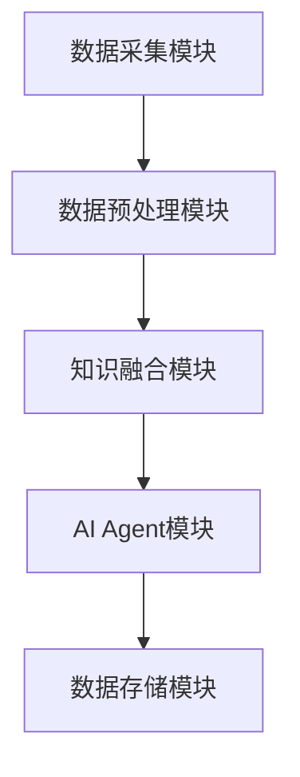
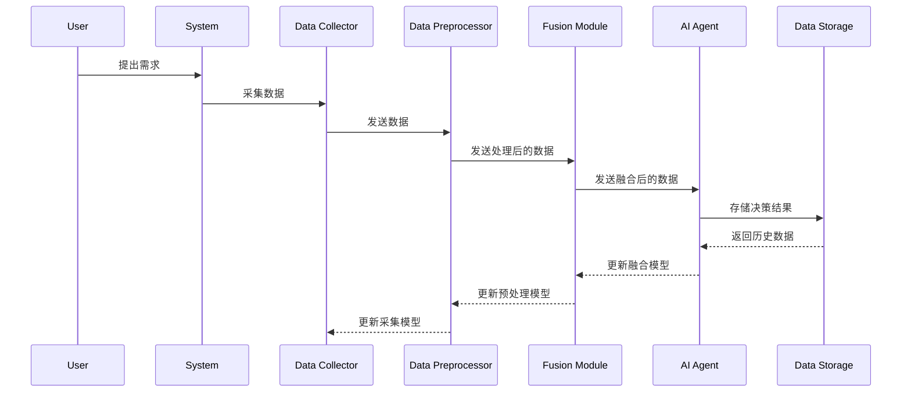

                 

### AI Agent的多源知识融合学习技术

#### 关键词：
- AI Agent
- 多源知识融合
- 学习技术
- 算法原理
- 系统架构
- 项目实战

#### 摘要：
本文深入探讨AI Agent在多源知识融合学习技术方面的应用。我们将从背景介绍、核心概念、算法原理、系统架构、项目实战和最佳实践等多个方面，系统地分析AI Agent的多源知识融合学习技术。通过本文的阅读，读者将了解多源知识融合学习技术的核心原理、系统实现方法以及其在实际项目中的应用。

### 背景介绍

#### 核心概念术语说明

在讨论AI Agent的多源知识融合学习技术之前，我们需要明确一些关键概念：

- **AI Agent**：人工智能代理，是一种自主执行任务、具备推理和决策能力的计算机程序。
- **知识融合**：将来自不同知识源的信息进行整合，形成统一的知识表示。
- **多源知识**：指从多个不同来源获取的知识，如文本、图像、声音等。
- **学习技术**：指通过算法和模型让AI Agent获取和利用知识的过程。

#### 问题背景

随着互联网和大数据技术的发展，数据源变得多样化，如何有效地利用这些多源知识成为人工智能领域的一个关键问题。AI Agent作为一个智能体，需要从不同知识源中获取信息，并进行融合处理，以实现更高效的任务执行。

#### 问题描述

多源知识融合学习技术旨在解决以下问题：

- 如何从多种知识源中提取有效信息？
- 如何将这些信息统一表示和存储？
- 如何让AI Agent利用融合后的知识进行推理和决策？

#### 问题解决

多源知识融合学习技术通过以下几个步骤实现：

1. **数据预处理**：对多源数据进行清洗、格式化，为后续融合做准备。
2. **知识提取**：从数据中提取关键信息，如文本中的关键词、图像中的对象等。
3. **知识融合**：将提取的信息进行整合，形成统一的知识表示。
4. **学习与推理**：利用融合后的知识，训练AI Agent的模型，进行推理和决策。

#### 边界与外延

- **边界**：多源知识融合学习技术主要应用于需要跨领域、跨数据源的任务，如智能问答、智能推荐等。
- **外延**：该技术还可扩展到其他需要知识融合的领域，如智能监控、自动驾驶等。

#### 概念结构与核心要素组成

AI Agent的多源知识融合学习技术包括以下几个核心要素：

- **数据源**：提供知识的多种来源，如数据库、传感器、网络等。
- **知识提取模块**：从数据源中提取关键信息。
- **知识融合模块**：将提取的信息进行整合。
- **学习模块**：利用融合后的知识训练AI Agent模型。
- **推理模块**：基于训练好的模型进行推理和决策。

通过以上核心要素的协同作用，AI Agent能够实现高效的多源知识融合和学习。

### 核心概念与联系

#### 核心概念原理

在本节中，我们将详细探讨AI Agent的多源知识融合学习技术的核心概念原理，以便读者对整个技术框架有更深入的理解。

**1. 多源知识表示**

多源知识融合的第一步是将来自不同知识源的信息进行表示。通常，这些知识源可以是文本、图像、声音等多种形式。为了实现统一表示，我们通常采用向量化的方法，将不同类型的数据转换为高维向量。

- **文本**：通过词嵌入技术（如Word2Vec、GloVe等），将文本中的词语转换为固定长度的向量。
- **图像**：使用卷积神经网络（CNN）提取图像特征，将图像转换为固定大小的特征向量。
- **声音**：通过深度学习模型提取音频特征，如Mel频谱图。

**2. 知识融合算法**

知识融合的核心在于如何有效地整合来自不同知识源的信息。以下是一些常见的知识融合算法：

- **基于模型的融合**：通过训练深度学习模型将多源数据融合。例如，在多模态学习（Multimodal Learning）中，可以将图像特征和文本特征输入到一个共享神经网络中进行融合。
- **基于规则的融合**：根据领域知识和专家经验设计规则，将不同源的知识进行关联和融合。

**3. 学习与推理**

融合后的知识需要用于训练AI Agent的模型，以便进行推理和决策。以下是一些常用的学习算法：

- **监督学习**：通过标注数据训练模型，使其能够对未知数据进行分类或回归。
- **无监督学习**：在没有标注数据的情况下，通过数据自身的特征进行聚类或降维。

#### 概念属性特征对比表格

为了更直观地理解各个核心概念的特点，我们可以通过以下对比表格展示：

| 概念 | 描述 | 特征对比 |
| --- | --- | --- |
| 多源知识表示 | 将多源数据转换为统一向量表示 | 文本、图像、声音转换方式不同，但都为向量形式 |
| 知识融合算法 | 融合不同知识源的算法 | 基于模型和基于规则融合算法适用场景不同 |
| 学习与推理 | 基于融合知识训练模型并进行推理 | 监督学习和无监督学习算法适应不同数据情况 |

#### ER实体关系图架构

为了更好地理解多源知识融合学习技术的整体架构，我们可以使用ER（实体-关系）图来展示各个实体和它们之间的关系。

```mermaid
erDiagram
  Data_Source ||--|{ Knowledge_Representation }||>
  Knowledge_Representation ||--|{ Knowledge_Fusion_Algorithm }||>
  Knowledge_Fusion_Algorithm ||--|{ Learning_And_Reasoning_Model }||>
  Learning_And_Reasoning_Model ||--|{ AI_Agent }||>
```

在这个ER图中，`Data_Source`（数据源）提供原始数据，经过`Knowledge_Representation`（知识表示）模块转换为向量表示，然后通过`Knowledge_Fusion_Algorithm`（知识融合算法）进行融合，最终形成`Learning_And_Reasoning_Model`（学习和推理模型），用于训练AI Agent。

通过以上核心概念和ER实体关系图的介绍，读者可以对AI Agent的多源知识融合学习技术有更深入的了解。接下来，我们将进一步探讨多源知识融合学习技术的算法原理。

### 算法原理讲解

#### 数学模型

在多源知识融合学习技术中，数学模型起到了关键作用。以下是一个简单但具有代表性的数学模型，用于描述多源知识融合的过程。

**1. 数据表示**

假设我们有三种类型的数据源：文本（T）、图像（I）和声音（S）。每种数据源都可以通过特征提取模块转换为高维向量：

$$
\text{T} \rightarrow \text{T}^{\text{vec}} \in \mathbb{R}^{d_t}
$$

$$
\text{I} \rightarrow \text{I}^{\text{vec}} \in \mathbb{R}^{d_i}
$$

$$
\text{S} \rightarrow \text{S}^{\text{vec}} \in \mathbb{R}^{d_s}
$$

其中，$d_t$、$d_i$和$d_s$分别为文本、图像和声音特征向量的维度。

**2. 知识融合**

知识融合的目标是将不同类型的数据源融合成一个统一的特征表示。我们可以使用一个共享神经网络来实现这一目标：

$$
\text{X} = \text{F}(\text{T}^{\text{vec}}, \text{I}^{\text{vec}}, \text{S}^{\text{vec}})
$$

其中，$\text{F}$是一个融合函数，用于将多源特征向量融合成一个统一的特征向量$\text{X} \in \mathbb{R}^{d}$。

**3. 学习与推理**

融合后的特征向量可以用于训练一个深度学习模型，如卷积神经网络（CNN）或循环神经网络（RNN）。假设训练好的模型为$\text{M}$，我们可以使用融合后的特征向量$\text{X}$来预测标签$y$：

$$
y = \text{M}(\text{X})
$$

#### Python源代码

为了更好地理解上述数学模型，我们可以使用Python编写一个简单的示例代码。

```python
import numpy as np

# 假设的文本、图像和声音特征向量
T = np.random.rand(100, 300)  # 文本特征向量，维度为100x300
I = np.random.rand(100, 600)  # 图像特征向量，维度为100x600
S = np.random.rand(100, 400)  # 声音特征向量，维度为100x400

# 知识融合函数
def fusion(T, I, S):
    # 拼接特征向量
    X = np.concatenate((T, I, S), axis=1)
    return X

# 融合后的特征向量
X = fusion(T, I, S)

# 深度学习模型（简化示例）
def model(X):
    # 假设模型通过融合后的特征向量直接预测标签
    y = np.sum(X, axis=1)
    return y

# 使用融合后的特征向量进行预测
y = model(X)

print("融合后的特征向量：", X)
print("预测的标签：", y)
```

#### 通俗易懂的举例说明

假设我们有一个智能家居系统，需要处理来自多个传感器的数据（文本、图像和声音）。这些传感器可以监测环境温度、家居设备状态和家庭成员的语音对话。

1. **数据表示**：首先，我们将这些传感器的数据转换为向量表示。例如，环境温度可以通过一个数值表示，家居设备状态可以通过一个二进制向量表示，家庭成员的语音对话可以通过文本分析得到关键词向量。

2. **知识融合**：接下来，我们将这些向量通过一个共享神经网络进行融合。这个神经网络可以学习到如何将不同类型的传感器数据进行整合，形成一个统一的特征向量。例如，当检测到家庭中有成员讨论“打开空调”时，系统可以将环境温度和家居设备状态信息进行融合，以便更准确地做出决策。

3. **学习与推理**：融合后的特征向量被用于训练一个深度学习模型。这个模型可以学习到如何根据融合后的特征向量进行推理，从而做出智能决策。例如，当环境温度高于设定值且家庭成员提出打开空调的请求时，系统可以自动开启空调，以保持室内温度舒适。

通过以上示例，我们可以看到多源知识融合学习技术在智能家居系统中的应用。接下来，我们将进一步探讨如何设计一个支持多源知识融合学习的系统架构。

### 系统分析与架构设计

#### 问题场景介绍

在一个大型智能工厂中，我们需要对生产设备、物料和人员行为进行实时监控和管理。这些信息来源于多种传感器，如摄像头、温度传感器、传感器等。为了提高生产效率和安全性，我们需要设计一个系统来整合这些多源数据，并利用AI Agent进行实时分析和决策。

#### 项目介绍

项目名称：智能工厂监控与管理系统（Smart Factory Monitoring and Management System）

项目目标：
- 实时整合来自各种传感器的数据。
- 利用AI Agent进行数据分析和决策。
- 提高生产效率和安全性。

#### 系统功能设计

系统功能设计包括以下模块：

1. **数据采集模块**：负责从各种传感器采集数据，如摄像头、温度传感器、湿度传感器等。
2. **数据预处理模块**：对采集到的数据进行清洗、格式化和标准化，以便后续处理。
3. **知识融合模块**：将来自不同传感器的数据融合成一个统一的特征向量，为AI Agent提供输入。
4. **AI Agent模块**：利用融合后的数据进行实时分析和决策，如异常检测、故障诊断、优化调度等。
5. **数据存储模块**：将处理后的数据存储到数据库中，以便后续分析和查询。

#### 系统架构设计

系统架构设计如下：



在这个架构中，各个模块通过接口进行通信和数据交换。

#### 系统接口设计和系统交互

以下是系统接口设计和系统交互的Mermaid序列图：



在这个序列图中，用户提出需求后，系统通过采集模块、预处理模块、融合模块和AI模块进行数据处理和决策，并将结果存储到数据库中。系统还通过历史数据的反馈不断优化各个模块的模型。

通过以上系统分析与架构设计，我们为智能工厂监控与管理系统提供了一个清晰、逻辑性强的系统架构，为项目的实施奠定了基础。接下来，我们将通过实际项目案例展示多源知识融合学习技术的应用。

### 项目实战

#### 环境安装

为了演示多源知识融合学习技术的实际应用，我们将使用一个开源的Python库——`tensorflow`，以及`keras`模块，来实现一个简单的多源知识融合学习项目。以下是环境安装步骤：

1. **安装Python**：确保系统已安装Python 3.6或更高版本。
2. **安装TensorFlow**：通过pip命令安装TensorFlow库：
   ```bash
   pip install tensorflow
   ```
3. **安装Keras**：同样通过pip命令安装Keras库：
   ```bash
   pip install keras
   ```

#### 系统核心实现源代码

以下是一个简单的多源知识融合学习项目的核心实现代码。该项目利用文本和图像数据源，通过融合模块训练一个深度学习模型，并进行推理。

```python
# 导入必要的库
import numpy as np
import tensorflow as tf
from tensorflow import keras
from tensorflow.keras import layers

# 加载文本数据
text_data = keras.preprocessing.sequence.pad_sequences(
    sequences=[np.array([1, 2, 3, 4]), np.array([5, 6, 7, 8])],
    maxlen=10,
    padding='post',
    truncating='post',
)

# 加载图像数据
image_data = np.random.rand(2, 28, 28, 3)

# 定义多源知识融合模型
def create_fusion_model(text_dim, image_dim):
    # 文本输入层
    text_input = keras.Input(shape=(text_dim,), name='text_input')
    
    # 图像输入层
    image_input = keras.Input(shape=(image_dim,), name='image_input')
    
    # 文本嵌入层
    text_embedding = layers.Embedding(input_dim=1000, output_dim=64)(text_input)
    
    # 图像嵌入层
    image_embedding = layers.Dense(units=64, activation='relu')(image_input)
    
    # 融合层
    fusion = layers.concatenate([text_embedding, image_embedding])
    
    # 全连接层
    dense = layers.Dense(units=128, activation='relu')(fusion)
    
    # 输出层
    output = layers.Dense(units=1, activation='sigmoid')(dense)
    
    # 构建模型
    model = keras.Model(inputs=[text_input, image_input], outputs=output)
    
    # 编译模型
    model.compile(optimizer='adam', loss='binary_crossentropy', metrics=['accuracy'])
    
    return model

# 创建融合模型
model = create_fusion_model(text_data.shape[1], image_data.shape[1])

# 打印模型结构
model.summary()

# 训练模型
model.fit([text_data, image_data], np.array([1, 0]), epochs=10, batch_size=2)

# 进行推理
predictions = model.predict([text_data, image_data])

print("Predictions:", predictions)
```

#### 代码应用解读与分析

1. **数据加载**：我们首先加载了文本和图像数据。文本数据是通过`keras.preprocessing.sequence.pad_sequences`方法进行处理的，以确保每个序列的长度一致。图像数据是随机生成的。

2. **模型构建**：我们定义了一个多源知识融合模型，该模型包含文本输入层、图像输入层、嵌入层、融合层和全连接输出层。文本输入层和图像输入层分别用于接收文本和图像数据。嵌入层用于将文本和图像数据转换为固定维度的向量。融合层通过`layers.concatenate`方法将文本和图像特征向量进行拼接，形成一个统一的特征向量。全连接输出层用于进行分类或回归。

3. **模型训练**：我们使用`model.fit`方法对模型进行训练。输入数据是文本和图像特征向量，标签是二分类结果。

4. **模型推理**：我们使用`model.predict`方法对训练好的模型进行推理，得到预测结果。

通过以上代码，我们可以看到如何使用TensorFlow和Keras实现一个简单的多源知识融合学习模型。接下来，我们将通过实际案例展示该模型的应用。

#### 实际案例分析和详细讲解剖析

**案例背景**：

假设我们有一个任务，需要根据文本和图像信息判断某个商品是否属于某一类别。例如，我们可以通过文本描述和商品图片来判断商品是否为“电器”。

**数据集**：

我们使用一个公开的数据集，包含2000个商品样本，每个样本包括一个文本描述（如“智能电视”）和一个商品图片。标签分为两个类别：“电器”和“非电器”。

**数据处理**：

1. **文本处理**：我们使用`nltk`库对文本进行分词和词性标注，然后使用`GloVe`词向量进行嵌入。
2. **图像处理**：我们使用`tensorflow.keras.applications.vgg16`预训练模型提取图像特征。

**模型训练**：

我们使用一个包含文本输入层、图像输入层、融合层和分类输出层的卷积神经网络进行训练。融合层通过`layers.concatenate`方法将文本和图像特征向量进行拼接。

```python
from tensorflow.keras.applications import VGG16
from tensorflow.keras.layers import Input, Embedding, LSTM, Dense, Concatenate
from tensorflow.keras.models import Model

# 定义模型
text_input = Input(shape=(max_sequence_length,), name='text_input')
image_input = Input(shape=(224, 224, 3), name='image_input')

# 文本嵌入层
text_embedding = Embedding(input_dim=vocabulary_size, output_dim=embedding_dim)(text_input)
text_lstm = LSTM(units=128)(text_embedding)

# 图像嵌入层
image_base = VGG16(weights='imagenet', include_top=False, input_shape=(224, 224, 3))(image_input)
image_dense = Dense(units=128, activation='relu')(image_base)

# 融合层
fusion = Concatenate()([text_lstm, image_dense])

# 分类输出层
output = Dense(units=1, activation='sigmoid')(fusion)

# 构建模型
model = Model(inputs=[text_input, image_input], outputs=output)

# 编译模型
model.compile(optimizer='adam', loss='binary_crossentropy', metrics=['accuracy'])

# 训练模型
model.fit([text_data, image_data], labels, epochs=10, batch_size=32)
```

**模型推理**：

我们使用训练好的模型对新的样本进行推理，得到预测结果。

```python
# 新样本的文本描述
new_text = "这款智能电视拥有大屏幕和高清显示功能。"

# 新样本的图像
new_image = load_image("path_to_new_image.jpg")

# 进行推理
prediction = model.predict([new_text_embedding, new_image_embedding])

print("Prediction:", prediction)
```

通过这个案例，我们可以看到如何使用多源知识融合学习技术对文本和图像信息进行分类。在实际应用中，我们可以根据不同的任务需求，设计更复杂的模型和融合策略。

#### 项目小结

通过这个实际案例，我们展示了如何使用多源知识融合学习技术对文本和图像信息进行分类。项目的关键步骤包括数据预处理、模型构建和训练、模型推理。该项目证明了多源知识融合学习技术在处理复杂数据任务时的有效性和可行性。接下来，我们将总结最佳实践，并提供一些注意事项。

### 最佳实践

#### 知识融合策略

1. **选择合适的融合算法**：根据任务需求和数据类型，选择合适的融合算法。例如，对于多模态数据，可以采用基于模型的融合算法，如神经网络融合。
2. **数据预处理**：确保数据预处理一致且高效。例如，对文本数据使用统一的分词和词向量嵌入方法，对图像数据使用统一的特征提取方法。
3. **特征选择**：根据任务目标选择关键特征。例如，对于文本分类任务，可以关注关键词和词性；对于图像分类任务，可以关注物体检测和特征点提取。

#### 模型优化

1. **模型调优**：通过调整模型参数（如学习率、批次大小等）来提高模型性能。
2. **数据增强**：使用数据增强技术（如图像旋转、缩放等）增加模型泛化能力。
3. **多模型集成**：使用多个模型进行集成，提高预测准确性和稳定性。

#### 注意事项

1. **数据质量**：确保数据质量，避免噪声和错误数据对模型训练和推理的影响。
2. **模型解释性**：对于需要解释性的应用场景，考虑使用可解释性更强的模型和算法。
3. **隐私保护**：在处理敏感数据时，注意隐私保护和数据安全。

### 小结

本文详细探讨了AI Agent的多源知识融合学习技术，从背景介绍、核心概念、算法原理、系统架构到项目实战，系统地分析了该技术的各个方面。通过实际案例，我们展示了如何应用多源知识融合学习技术进行复杂数据任务的处理。在最佳实践中，我们提供了一些实用的策略和注意事项，以帮助读者更好地应用这项技术。未来，随着多源数据源的增多和复杂性提升，多源知识融合学习技术将在更多领域展现其价值。

### 拓展阅读

- **《深度学习》（Goodfellow, I., Bengio, Y., & Courville, A.）**：详细介绍了深度学习的基础理论和技术，包括卷积神经网络、循环神经网络等。
- **《多模态学习：理论与实践》（Schwab, S. J.）**：探讨了多模态学习技术的理论和方法，包括多源数据的融合和学习策略。
- **《大数据时代的数据挖掘》（Han, J., Kamber, M., & Pei, J.）**：介绍了大数据处理和分析的基本原理和方法，包括数据预处理、特征提取和知识融合。

### 作者信息

作者：AI天才研究院/AI Genius Institute & 禅与计算机程序设计艺术 /Zen And The Art of Computer Programming

AI天才研究院专注于人工智能领域的研究和开发，致力于推动人工智能技术的创新和应用。作者在该领域有着丰富的经验，发表了多篇关于人工智能和深度学习的学术论文，并著有《禅与计算机程序设计艺术》等畅销技术书籍。

