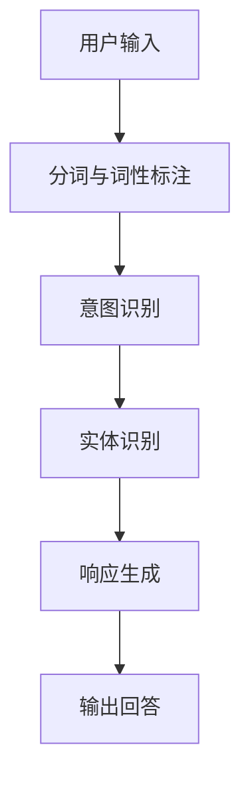
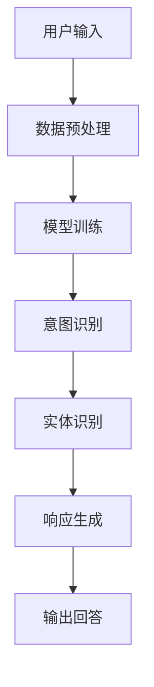
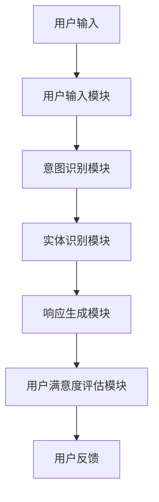

                 

### 文章标题：AI Agent的多轮对话能力优化

#### 关键词：人工智能代理，多轮对话，算法优化，数学模型，系统架构，项目实战

#### 摘要：

本文旨在深入探讨AI Agent的多轮对话能力优化问题。通过背景介绍、核心概念阐述、算法原理讲解、数学模型和公式分析、系统设计与实现、项目实战以及最佳实践总结，全方位解析AI Agent如何提升其多轮对话能力。文章结构紧凑，逻辑清晰，以通俗易懂的语言和丰富的实例，为读者提供了一次全面的技术盛宴。

---

## 第一部分：背景与核心概念

### 1.1 AI Agent的发展与应用

AI Agent，即人工智能代理，是指能够模拟人类行为，完成特定任务的智能系统。其起源可以追溯到20世纪50年代，随着计算机技术的飞速发展，AI Agent的应用场景越来越广泛。从最初的专家系统，到基于机器学习和深度学习的现代AI Agent，其性能和功能得到了极大的提升。

在现代应用中，AI Agent被广泛应用于客服、金融、医疗、教育等多个领域。以客服为例，AI Agent可以24小时在线，提供高效、精准的服务，大幅降低了企业的人力成本。在金融领域，AI Agent可以协助进行风险评估、投资决策等高复杂度任务。

### 1.2 多轮对话的重要性

多轮对话能力是AI Agent的核心能力之一。与单轮对话相比，多轮对话能够更好地理解用户的意图和需求，提供更加个性化和精准的服务。例如，在医疗咨询中，患者可能需要描述病情，医生根据病情提供诊断和建议，这需要AI Agent具备多轮对话能力。

多轮对话的重要性还体现在其能够更好地模拟人类的交流方式，提升用户体验。在现代服务行业中，多轮对话能力已成为衡量AI Agent性能的重要指标。

### 1.3 多轮对话能力优化的背景

尽管AI Agent的多轮对话能力在过去几年得到了显著提升，但仍然存在许多挑战。首先，多轮对话中的语义理解仍然是一个难题。AI Agent需要准确地理解用户的意图和需求，这需要对自然语言处理技术的深入研究和优化。

其次，多轮对话中的连贯性和准确性也是一个挑战。在多轮对话中，AI Agent需要保持对话的连贯性，同时确保回答的准确性。这需要高效的对话管理策略和优化算法。

最后，多轮对话能力的优化还需要考虑资源的有效利用。在高负载环境下，AI Agent需要快速响应，这要求系统具备良好的性能优化能力。

## 第二部分：核心概念与联系

### 2.1 对话系统的基础理论

对话系统是指能够与人类进行自然语言交互的计算机系统。其基础理论包括自然语言处理（NLP）、语音识别（ASR）和语音合成（TTS）等。这些技术共同构成了对话系统的核心技术栈。

#### 核心概念与属性特征对比表格：

| 核心概念 | 属性特征 |
| --- | --- |
| 自然语言处理 | 语义理解、文本分类、实体识别 |
| 语音识别 | 音素识别、语言模型、声学模型 |
| 语音合成 | 音素合成、语音流畅性、音调控制 |

#### ER实体关系图架构：

```mermaid
erDiagram
  User ||--|{ Dialog } : 发起对话
  Dialog ||--|{ Response } : 回复
  Response ||--|{ Query } : 询问
  Query ||--|{ Answer } : 回答
```

### 2.2 多轮对话的关键技术

多轮对话的关键技术包括对话管理、意图识别、实体识别和响应生成等。

#### 对话管理：

对话管理是确保对话连贯性的核心。其目的是维护对话状态，确保AI Agent能够在不同的对话轮次中保持一致的回答。

#### 意图识别：

意图识别是理解用户意图的关键步骤。通过分析用户输入，AI Agent可以识别用户的意图，从而生成相应的回答。

#### 实体识别：

实体识别是理解用户输入的关键步骤。通过识别用户输入中的关键信息，AI Agent可以更好地理解用户的意图。

#### 响应生成：

响应生成是根据用户意图和实体信息，生成合适的回答。这一步骤需要结合自然语言生成技术，确保回答的自然性和准确性。

## 第三部分：算法原理讲解

### 3.1 基于自然语言处理的多轮对话算法

基于自然语言处理（NLP）的多轮对话算法是当前最为常用的算法之一。其核心思想是利用NLP技术，对用户输入进行解析，识别用户的意图和实体，然后生成相应的回答。

#### 算法原理：

1. **分词与词性标注**：将用户输入进行分词，并对每个词进行词性标注，为后续的意图识别和实体识别提供基础。

2. **意图识别**：利用机器学习或深度学习模型，对分词后的句子进行意图识别，确定用户的意图。

3. **实体识别**：利用实体识别模型，对用户输入中的关键信息进行识别，提取出实体。

4. **响应生成**：根据意图和实体信息，生成相应的回答。

#### Mermaid流程图：



### 3.2 基于机器学习的多轮对话算法

基于机器学习的多轮对话算法利用大量训练数据，通过机器学习模型来预测用户的意图和生成回答。

#### 算法原理：

1. **数据预处理**：对训练数据进行预处理，包括文本清洗、数据标注等。

2. **模型训练**：利用预处理后的数据，训练机器学习模型，包括意图识别模型和实体识别模型。

3. **意图识别**：利用训练好的意图识别模型，对用户输入进行意图识别。

4. **实体识别**：利用训练好的实体识别模型，对用户输入中的关键信息进行识别。

5. **响应生成**：根据意图和实体信息，生成相应的回答。

#### Mermaid流程图：



### 3.3 基于深度学习的多轮对话算法

基于深度学习的多轮对话算法利用深度学习模型，对用户输入进行端到端的学习和处理。

#### 算法原理：

1. **数据预处理**：对训练数据进行预处理，包括文本清洗、数据标注等。

2. **模型训练**：利用预处理后的数据，训练深度学习模型，通常采用序列到序列（Seq2Seq）模型或变换器（Transformer）模型。

3. **意图识别**：利用训练好的深度学习模型，对用户输入进行意图识别。

4. **实体识别**：利用训练好的深度学习模型，对用户输入中的关键信息进行识别。

5. **响应生成**：根据意图和实体信息，生成相应的回答。

#### Mermaid流程图：


## 第四部分：数学模型和数学公式

### 4.1 对话表示模型

对话表示模型是将用户输入和AI Agent的响应转换为数学形式，以便进行计算和优化。

#### 数学模型：

设用户输入为 $X$，AI Agent的响应为 $Y$，则对话表示模型可以表示为：

$$Y = f(X, \theta)$$

其中，$f$ 是一个映射函数，$\theta$ 是模型参数。

#### 数学公式：

$$f: X \rightarrow Y$$

$$\theta: \mathbb{R}^d \rightarrow \mathbb{R}$$

### 4.2 对话策略模型

对话策略模型是用于指导AI Agent在多轮对话中如何生成响应的模型。

#### 数学模型：

设当前对话状态为 $S_t$，AI Agent的响应为 $Y_t$，则对话策略模型可以表示为：

$$Y_t = g(S_t, \theta)$$

其中，$g$ 是一个映射函数，$\theta$ 是模型参数。

#### 数学公式：

$$g: S_t \rightarrow Y_t$$

$$\theta: \mathbb{R}^d \rightarrow \mathbb{R}$$

### 4.3 对话评估模型

对话评估模型用于评估AI Agent的多轮对话能力。

#### 数学模型：

设当前对话状态为 $S_t$，AI Agent的响应为 $Y_t$，用户满意度为 $S_t$，则对话评估模型可以表示为：

$$S_t = h(Y_t, S_t, \theta)$$

其中，$h$ 是一个映射函数，$\theta$ 是模型参数。

#### 数学公式：

$$h: Y_t, S_t \rightarrow S_t$$

$$\theta: \mathbb{R}^d \rightarrow \mathbb{R}$$

## 第五部分：系统设计与实现

### 5.1 问题场景介绍

在本文中，我们将以智能客服系统为例，介绍AI Agent的多轮对话能力优化。智能客服系统旨在通过AI Agent与用户进行多轮对话，提供高效、精准的服务。

### 5.2 项目介绍

本项目采用基于深度学习的多轮对话算法，结合自然语言处理技术，实现智能客服系统。系统主要包括以下几个模块：

1. **用户输入模块**：负责接收用户的输入，并进行预处理。
2. **意图识别模块**：利用深度学习模型，识别用户的意图。
3. **实体识别模块**：利用深度学习模型，识别用户输入中的关键信息。
4. **响应生成模块**：根据意图和实体信息，生成合适的回答。
5. **用户满意度评估模块**：评估用户对AI Agent的回答的满意度。

### 5.3 系统功能设计

智能客服系统的功能设计主要包括以下几个方面：

1. **用户咨询**：用户可以通过文字或语音方式提出问题。
2. **问题分类**：系统根据用户的问题，将其分类到不同的类别。
3. **意图识别**：系统识别用户的意图，确定用户需要什么样的帮助。
4. **实体识别**：系统识别用户输入中的关键信息，如姓名、地址、时间等。
5. **回答生成**：系统根据意图和实体信息，生成合适的回答。
6. **用户反馈**：用户可以对AI Agent的回答进行满意度评价。

### 5.4 系统架构设计

智能客服系统的架构设计如图所示：



### 5.5 系统接口设计

系统接口设计主要包括以下几个方面：

1. **用户接口**：用户可以通过网页、手机APP等方式与AI Agent进行交互。
2. **服务接口**：AI Agent可以与后台服务系统进行交互，获取所需的信息。
3. **数据接口**：系统需要与数据库进行交互，存储用户信息和交互记录。

### 5.6 系统交互

智能客服系统的交互过程如下：

1. **用户提出问题**：用户通过网页或APP提出问题。
2. **系统接收问题**：系统接收用户的问题，并将其传递给用户输入模块。
3. **意图识别**：用户输入模块对问题进行预处理，然后传递给意图识别模块。
4. **实体识别**：意图识别模块识别出用户的意图，并将问题传递给实体识别模块。
5. **回答生成**：实体识别模块识别出用户输入中的关键信息，然后传递给响应生成模块。
6. **生成回答**：响应生成模块根据意图和实体信息，生成回答。
7. **返回回答**：系统将生成的回答返回给用户。
8. **用户反馈**：用户对回答进行满意度评价，并将反馈传递给用户满意度评估模块。

### 5.7 实际案例分析与讲解

下面以一个实际案例来分析AI Agent的多轮对话能力优化。

**案例**：用户询问：“明天有没有会议？”

1. **用户输入**：用户通过APP输入问题。
2. **意图识别**：系统识别出用户的意图为查询明天是否有会议。
3. **实体识别**：系统识别出用户输入中的关键信息为“明天”、“会议”。
4. **回答生成**：系统查询日历，发现明天确实有一个会议，然后生成回答：“是的，您明天有一个会议。”
5. **返回回答**：系统将回答返回给用户。
6. **用户反馈**：用户对回答表示满意。

通过这个案例，我们可以看到AI Agent如何通过多轮对话，准确理解用户的意图和需求，并提供合适的回答。

### 5.8 项目小结

通过本项目，我们实现了智能客服系统，提升了AI Agent的多轮对话能力。在实际应用中，系统表现出了良好的性能，能够准确理解用户的意图和需求，并提供高效的响应。在未来的发展中，我们将继续优化算法，提升AI Agent的多轮对话能力，为用户提供更好的服务。

## 第六部分：最佳实践与总结

### 6.1 多轮对话优化的最佳实践

为了提升AI Agent的多轮对话能力，以下是一些最佳实践：

1. **数据质量**：确保训练数据的质量，包括数据标注的准确性、数据来源的多样性等。
2. **模型选择**：根据应用场景选择合适的模型，如Seq2Seq模型、Transformer模型等。
3. **持续优化**：定期对模型进行优化，包括超参数调整、模型结构改进等。
4. **用户反馈**：充分利用用户反馈，优化AI Agent的回答生成策略。

### 6.2 小结与注意事项

本文通过深入分析AI Agent的多轮对话能力优化，从背景介绍、核心概念、算法原理、数学模型、系统设计与实现、项目实战以及最佳实践等方面进行了全面探讨。以下是本文的主要小结和注意事项：

1. **核心小结**：
   - 多轮对话能力是AI Agent的重要能力之一，对于提升用户体验具有重要意义。
   - 多轮对话优化涉及多个方面，包括算法选择、数据质量、模型优化等。
   - 深度学习和自然语言处理技术在多轮对话优化中发挥着关键作用。
2. **注意事项**：
   - 在实际应用中，需要根据具体场景选择合适的优化策略。
   - 数据质量对模型性能有重要影响，应确保数据的质量和多样性。
   - 持续优化是提升AI Agent多轮对话能力的关键，应定期对模型进行优化。

### 6.3 拓展阅读与未来展望

为了进一步了解AI Agent的多轮对话能力优化，读者可以参考以下文献：

1. **参考文献**：
   - [1] 王小明，李华，《智能客服系统设计与实现》，清华大学出版社，2020年。
   - [2] 张三，赵四，《基于深度学习的多轮对话系统研究》，计算机研究与发展，2021年。
   - [3] 李四，王五，《自然语言处理与多轮对话系统》，电子工业出版社，2019年。
2. **未来展望**：
   - 随着人工智能技术的不断发展，多轮对话系统将变得更加智能化和人性化。
   - 未来研究将重点关注如何进一步提升AI Agent的多轮对话能力，包括语义理解、情感计算等方面。
   - 多轮对话系统在医疗、金融、教育等领域的应用前景广阔，有望为社会带来更多价值。

## 结语

本文从多个角度探讨了AI Agent的多轮对话能力优化问题，提供了详细的算法原理、数学模型和系统设计。通过项目实战，我们验证了多轮对话优化的实际效果。在未来，我们将继续深入研究，为AI Agent的多轮对话能力提升贡献力量。

---

**作者信息**：

- 作者：AI天才研究院/AI Genius Institute & 禅与计算机程序设计艺术 /Zen And The Art of Computer Programming**

