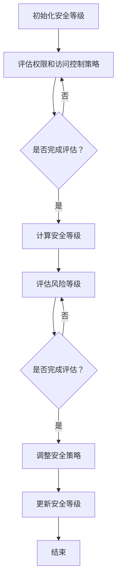
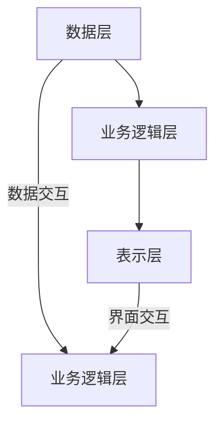
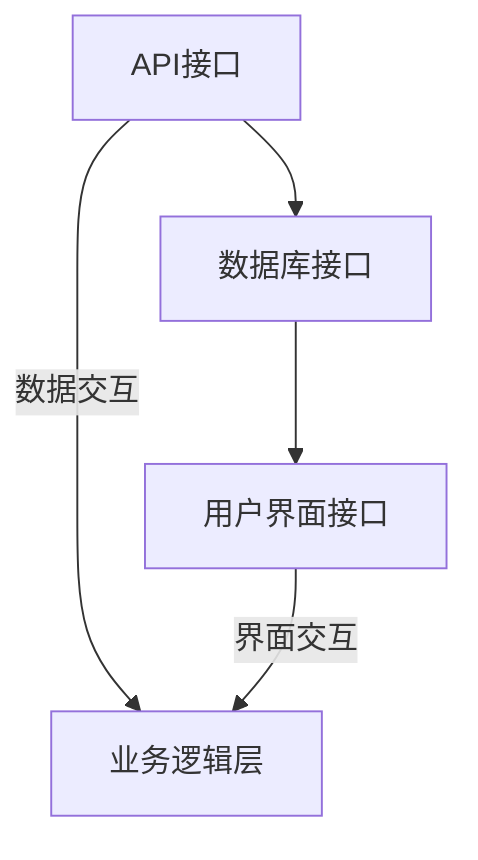
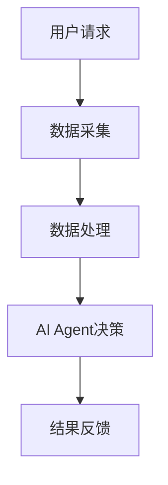

                 

### # AI Agent的安全性设计：防范潜在风险

关键词：AI Agent，安全性，潜在风险，设计策略，防范措施

摘要：随着人工智能技术的不断发展，AI Agent在各个领域的应用越来越广泛。然而，随之而来的是AI Agent安全性问题的重要性和复杂性。本文将探讨AI Agent的安全性设计，包括核心概念、安全需求分析、安全机制设计、风险评估与应对、安全验证与测试等内容，以帮助读者更好地理解和设计安全的AI Agent系统。

### 第一部分：背景介绍

#### 问题背景

随着人工智能技术的快速发展，AI Agent（智能代理）逐渐成为现代智能系统的重要组成部分。AI Agent能够自主决策、执行任务，并在特定环境中为人类提供智能化服务。AI Agent的应用场景包括但不限于智能客服、自动驾驶、智能安防等。

然而，随着AI Agent的应用场景越来越广泛，其安全性问题也日益凸显。AI Agent的安全性设计成为确保智能系统稳定、可靠运行的关键环节。如果不重视AI Agent的安全性设计，可能会导致以下问题：

1. **数据泄露**：AI Agent在处理数据时，如果安全性不足，可能会导致敏感数据泄露，从而给个人隐私和企业利益带来巨大损失。
2. **恶意攻击**：恶意攻击者可能会利用AI Agent的安全漏洞进行攻击，导致系统瘫痪、数据篡改等严重后果。
3. **决策错误**：AI Agent在决策过程中，如果受到恶意干扰或数据篡改，可能会导致错误决策，从而造成严重后果。

#### 问题描述

AI Agent的安全性设计主要涉及以下几个方面：

1. **防止恶意攻击**：包括网络攻击、注入攻击、拒绝服务攻击等。
2. **防范数据泄露**：包括数据加密、访问控制等。
3. **保障决策过程透明性**：确保AI Agent的决策过程可以被追溯和审查。

如何设计一个安全的AI Agent，使其在面对各种潜在风险时具备较高的防御能力，成为亟待解决的问题。

#### 问题解决

为了解决AI Agent的安全性设计问题，我们需要从以下几个方面进行探讨：

1. **核心概念**：明确AI Agent、安全、风险等核心概念的内涵和外延，为后续内容提供理论基础。
2. **安全需求分析**：分析AI Agent在不同应用场景下的安全需求，为设计安全策略提供依据。
3. **安全机制设计**：探讨AI Agent的安全机制设计，包括数据加密、访问控制、入侵检测等。
4. **风险评估与应对**：评估AI Agent可能面临的风险，并提出相应的应对策略。
5. **安全验证与测试**：对AI Agent的安全性进行验证和测试，确保设计的安全措施能够有效防范潜在风险。

#### 边界与外延

本书主要关注AI Agent的安全性设计问题，讨论内容将围绕AI Agent的安全机制、风险防范策略等方面展开。同时，本书也将涉及AI Agent在不同应用场景下的安全性需求，以期为实际应用提供参考。

#### 概念结构与核心要素组成

1. **AI Agent**：具有自主决策、执行任务能力的智能系统。
2. **安全**：确保AI Agent在运行过程中不受恶意攻击、数据泄露等风险的影响。
3. **风险**：AI Agent可能面临的各种潜在威胁，如恶意攻击、数据泄露等。
4. **安全需求分析**：分析AI Agent在不同应用场景下的安全需求，为设计安全策略提供依据。
5. **安全机制设计**：探讨AI Agent的安全机制设计，包括数据加密、访问控制、入侵检测等。
6. **风险评估与应对**：评估AI Agent可能面临的风险，并提出相应的应对策略。
7. **安全验证与测试**：对AI Agent的安全性进行验证和测试，确保设计的安全措施能够有效防范潜在风险。

### 第二部分：核心概念与联系

#### 2.1 AI Agent的定义与特点

##### 2.1.1 AI Agent的定义

AI Agent，即人工智能代理，是指一种能够模拟人类智能行为、具备自主决策和执行任务能力的智能系统。AI Agent通过学习、推理和规划等过程，实现特定任务的高效执行。

##### 2.1.2 AI Agent的特点

1. **自主性**：AI Agent具备自主决策能力，能够在一定范围内自主调整行为策略。
2. **适应性**：AI Agent能够根据环境变化和学习经验，不断调整自身行为，以适应新的任务需求。
3. **协作性**：AI Agent能够与其他智能系统或人类协作，共同完成复杂任务。
4. **智能性**：AI Agent具备一定程度的智能，能够通过学习、推理和规划等方式，实现复杂任务的自动化执行。

#### 2.2 安全的定义与属性特征

##### 2.2.1 安全的定义

安全，是指系统在运行过程中，不受恶意攻击、数据泄露等风险的影响，确保系统稳定、可靠运行。

##### 2.2.2 安全的属性特征

1. **保密性**：确保系统中的敏感信息不被未经授权的第三方获取。
2. **完整性**：确保系统中的数据在传输、存储和处理过程中不被篡改。
3. **可用性**：确保系统在遭受恶意攻击时，仍能保持正常运行，为用户提供服务。
4. **可控性**：确保系统能够被有效管理和控制，防止恶意行为的发生。

#### 2.3 风险的定义与类型

##### 2.3.1 风险的定义

风险，是指系统在运行过程中可能面临的各种潜在威胁，可能导致系统功能失效、数据泄露等不良后果。

##### 2.3.2 风险的类型

1. **恶意攻击**：如DDoS攻击、SQL注入等，可能导致系统瘫痪、数据泄露。
2. **数据泄露**：如未经授权的第三方访问敏感信息，可能导致隐私泄露、经济损失。
3. **系统漏洞**：如代码漏洞、配置错误等，可能导致系统被入侵、数据泄露。
4. **操作失误**：如误操作、操作不当等，可能导致系统功能失效、数据损坏。

#### 2.4 安全需求分析

##### 2.4.1 安全需求分析的定义

安全需求分析，是指对系统在运行过程中可能面临的安全风险进行识别、评估和分析，以确定系统所需的安全特性、功能和机制。

##### 2.4.2 安全需求分析的过程

1. **识别潜在风险**：通过调研、分析等方式，识别系统可能面临的安全风险。
2. **评估风险影响**：对识别出的风险进行评估，分析其对系统的影响程度。
3. **确定安全需求**：根据风险影响，确定系统所需的安全特性、功能和机制。

##### 2.4.3 安全需求分析的方法

1. **安全需求文档**：通过编写安全需求文档，明确系统所需的安全特性和功能。
2. **风险矩阵**：使用风险矩阵对潜在风险进行评估，确定风险优先级。
3. **安全需求评审**：组织专家对安全需求进行分析和评审，确保安全需求的合理性和完整性。

#### 2.5 安全机制设计

##### 2.5.1 安全机制设计的定义

安全机制设计，是指根据安全需求，设计和实现系统所需的安全机制，包括数据加密、访问控制、入侵检测等。

##### 2.5.2 安全机制设计的原则

1. **最小权限原则**：系统中的每个组件和用户都应具有最小的权限，以防止恶意行为的发生。
2. **分而治之原则**：将系统的安全功能分散到不同的组件和模块中，降低安全风险。
3. **动态调整原则**：根据系统的运行状态和风险变化，动态调整安全机制，确保系统的安全性。

##### 2.5.3 安全机制设计的步骤

1. **需求分析**：分析系统所需的安全机制，确定安全机制的设计目标。
2. **方案设计**：设计安全机制的实现方案，包括技术方案和架构设计。
3. **实现与测试**：根据设计方案，实现安全机制，并进行功能测试和性能测试。
4. **部署与维护**：将安全机制部署到实际系统中，并进行定期维护和升级。

#### 2.6 风险评估与应对

##### 2.6.1 风险评估的定义

风险评估，是指对系统在运行过程中可能面临的风险进行识别、评估和分析，以确定风险等级和应对策略。

##### 2.6.2 风险评估的过程

1. **风险识别**：通过调研、分析等方式，识别系统可能面临的风险。
2. **风险评估**：对识别出的风险进行评估，分析其对系统的影响程度。
3. **风险应对**：根据风险等级和影响，制定相应的应对策略。

##### 2.6.3 风险评估的方法

1. **定性分析**：通过专家评估、问卷调查等方式，对风险进行定性分析。
2. **定量分析**：使用数学模型、统计方法等，对风险进行定量分析。
3. **组合分析**：将定性分析和定量分析相结合，对风险进行综合评估。

#### 2.7 安全验证与测试

##### 2.7.1 安全验证与测试的定义

安全验证与测试，是指对系统所采用的安全措施进行验证和测试，以确保安全措施的有效性和可靠性。

##### 2.7.2 安全验证与测试的过程

1. **制定测试计划**：根据系统安全需求，制定测试计划和测试用例。
2. **执行测试**：按照测试计划和测试用例，对系统进行功能测试、性能测试、安全测试等。
3. **评估测试结果**：分析测试结果，评估系统安全性，并提出改进建议。

##### 2.7.3 安全验证与测试的方法

1. **黑盒测试**：通过模拟恶意攻击，验证系统对攻击的防御能力。
2. **白盒测试**：通过分析系统内部结构，验证系统安全机制的实现情况。
3. **灰盒测试**：结合黑盒测试和白盒测试，对系统进行综合验证。

### 第三部分：算法原理讲解

在本部分，我们将详细介绍AI Agent的安全性设计算法原理，包括其数学模型、流程图以及具体示例。

#### 3.1 算法原理

AI Agent的安全性设计算法主要基于以下几个核心原理：

1. **最小权限原则**：系统中的每个组件和用户都应具有最小的权限，以防止恶意行为的发生。
2. **分而治之原则**：将系统的安全功能分散到不同的组件和模块中，降低安全风险。
3. **动态调整原则**：根据系统的运行状态和风险变化，动态调整安全机制，确保系统的安全性。

算法的核心思想是通过对系统内部各个组件的安全等级进行评估和调整，实现系统的整体安全性。

#### 3.2 数学模型

算法的数学模型主要包括以下几个方面：

1. **安全等级评估模型**：根据系统内部各个组件的权限、访问控制策略等因素，评估其安全等级。
2. **风险评估模型**：根据系统内部各个组件的安全等级和风险类型，评估其风险等级。
3. **安全策略调整模型**：根据风险评估结果，动态调整系统内部各个组件的安全策略。

具体公式如下：

1. **安全等级评估公式**：
   $$S_i = f(P_i, A_i)$$
   其中，$S_i$表示组件$i$的安全等级，$P_i$表示组件$i$的权限，$A_i$表示组件$i$的访问控制策略。
   
2. **风险评估公式**：
   $$R_i = g(S_i, T_i)$$
   其中，$R_i$表示组件$i$的风险等级，$S_i$表示组件$i$的安全等级，$T_i$表示组件$i$的风险类型。

3. **安全策略调整公式**：
   $$S_{new} = h(S_i, R_i)$$
   其中，$S_{new}$表示组件$i$的新安全等级，$h$表示安全策略调整函数。

#### 3.3 流程图

算法的流程图如下：



#### 3.4 示例

假设系统中有两个组件A和B，其初始安全等级分别为$S_A$和$S_B$。组件A的权限为高，访问控制策略为严格；组件B的权限为低，访问控制策略为宽松。

1. **安全等级评估**：

   根据安全等级评估公式，有：
   $$S_A = f(P_A, A_A) = f(高, 严格) = 高$$
   $$S_B = f(P_B, A_B) = f(低, 宽松) = 低$$

2. **风险评估**：

   根据风险评估公式，有：
   $$R_A = g(S_A, T_A) = g(高, 网络攻击) = 高$$
   $$R_B = g(S_B, T_B) = g(低, 操作错误) = 低$$

3. **安全策略调整**：

   根据安全策略调整公式，有：
   $$S_{new}_A = h(S_A, R_A) = h(高, 高) = 更高$$
   $$S_{new}_B = h(S_B, R_B) = h(低, 低) = 低$$

   经过安全策略调整后，组件A的安全等级提高，组件B的安全等级保持不变。

### 第四部分：系统分析与架构设计方案

在本部分，我们将详细介绍AI Agent的安全性设计的系统分析与架构设计方案，包括问题场景介绍、项目介绍、系统功能设计、系统架构设计、系统接口设计和系统交互等内容。

#### 4.1 问题场景介绍

随着人工智能技术的不断发展，AI Agent在各个领域的应用越来越广泛。然而，随之而来的是AI Agent安全性问题的重要性和复杂性。在实际应用中，AI Agent可能会面临以下问题：

1. **数据泄露**：AI Agent在处理数据时，如果安全性不足，可能会导致敏感数据泄露，从而给个人隐私和企业利益带来巨大损失。
2. **恶意攻击**：恶意攻击者可能会利用AI Agent的安全漏洞进行攻击，导致系统瘫痪、数据篡改等严重后果。
3. **决策错误**：AI Agent在决策过程中，如果受到恶意干扰或数据篡改，可能会导致错误决策，从而造成严重后果。

为了解决这些问题，我们需要设计一个安全、可靠的AI Agent系统，确保其在面对各种潜在风险时具备较高的防御能力。

#### 4.2 项目介绍

本项目旨在设计一个基于人工智能技术的AI Agent系统，提供智能化服务，同时确保系统的安全性。系统将包括以下几个核心模块：

1. **数据采集与处理模块**：负责采集和处理来自不同来源的数据，为AI Agent提供训练数据和决策依据。
2. **AI Agent模块**：实现AI Agent的核心功能，包括自主决策、执行任务等。
3. **安全性设计模块**：负责AI Agent的安全性设计，包括数据加密、访问控制、入侵检测等。
4. **用户界面模块**：提供用户与AI Agent的交互界面，使用户能够方便地使用AI Agent提供的功能。

#### 4.3 系统功能设计

系统功能设计主要包括以下几个方面：

1. **数据采集与处理**：系统将采集来自不同来源的数据，如传感器数据、用户输入数据等，并对数据进行预处理、清洗和归一化，为AI Agent提供高质量的训练数据。
2. **AI Agent自主决策**：系统将实现AI Agent的自主决策功能，包括任务规划、路径规划、资源分配等，确保AI Agent能够高效地完成任务。
3. **安全性设计**：系统将采用多种安全机制，如数据加密、访问控制、入侵检测等，确保AI Agent在处理数据和安全风险时的安全性。
4. **用户界面交互**：系统将提供直观、易用的用户界面，使用户能够方便地与AI Agent进行交互，了解AI Agent的决策过程和结果。

#### 4.4 系统架构设计

系统架构设计采用分层架构，包括数据层、业务逻辑层和表示层。具体设计如下：

1. **数据层**：负责数据的存储、检索和管理，包括数据库、缓存、文件系统等。
2. **业务逻辑层**：负责AI Agent的核心功能实现，包括数据采集与处理、AI模型训练、任务规划与执行等。
3. **表示层**：负责用户界面的设计、实现和交互，包括Web界面、移动端界面等。

系统架构图如下：



#### 4.5 系统接口设计

系统接口设计主要包括以下几个方面：

1. **API接口**：系统将提供API接口，供外部系统和应用程序调用，实现数据交换和功能调用。
2. **数据库接口**：系统将提供数据库接口，供数据采集与处理模块和业务逻辑层使用，实现数据存储和检索。
3. **用户界面接口**：系统将提供用户界面接口，供用户界面模块使用，实现用户与AI Agent的交互。

接口设计图如下：



#### 4.6 系统交互

系统交互设计主要涉及AI Agent与用户、外部系统之间的交互。具体交互流程如下：

1. **用户请求**：用户通过用户界面发送请求，如查询信息、执行任务等。
2. **数据采集**：系统将采集来自用户输入和其他数据源的数据，如传感器数据、用户历史数据等。
3. **数据处理**：系统将对采集到的数据进行预处理、清洗和归一化，为AI Agent提供训练数据。
4. **AI Agent决策**：AI Agent根据训练数据和决策模型，生成决策结果，如任务规划、路径规划等。
5. **结果反馈**：系统将决策结果反馈给用户，如展示查询结果、执行任务结果等。

交互流程图如下：



### 第五部分：项目实战

在本部分，我们将详细介绍AI Agent的安全性设计的项目实战，包括环境安装、系统核心实现源代码、代码应用解读与分析、实际案例分析和详细讲解剖析等内容。

#### 5.1 环境安装

为了搭建一个安全的AI Agent系统，我们需要安装以下软件和工具：

1. **操作系统**：Linux操作系统，如Ubuntu 18.04。
2. **编程语言**：Python 3.x版本。
3. **人工智能框架**：TensorFlow 2.x版本。
4. **数据库**：MySQL 5.7版本。
5. **Web服务器**：Nginx。

安装步骤如下：

1. **安装Linux操作系统**：在虚拟机中安装Linux操作系统，如Ubuntu 18.04。
2. **安装Python 3.x**：在终端执行以下命令：
   ```
   sudo apt update
   sudo apt install python3 python3-pip
   ```
3. **安装TensorFlow 2.x**：在终端执行以下命令：
   ```
   pip3 install tensorflow
   ```
4. **安装MySQL 5.7**：在终端执行以下命令：
   ```
   sudo apt install mysql-server mysql-common
   ```
5. **安装Nginx**：在终端执行以下命令：
   ```
   sudo apt install nginx
   ```

#### 5.2 系统核心实现源代码

以下是一个简单的AI Agent系统核心实现源代码示例：

```python
import tensorflow as tf
from tensorflow.keras.models import Sequential
from tensorflow.keras.layers import Dense, LSTM, Dropout
from tensorflow.keras.optimizers import Adam
import numpy as np
import pandas as pd
import pymysql

# 数据采集
def collect_data():
    # 连接数据库
    connection = pymysql.connect(host='localhost', user='root', password='password', database='ai_agent')
    # 查询数据
    cursor = connection.cursor()
    cursor.execute("SELECT * FROM data_table")
    data = cursor.fetchall()
    cursor.close()
    connection.close()
    # 数据预处理
    df = pd.DataFrame(data, columns=['feature1', 'feature2', 'target'])
    df = df.dropna()
    X = df[['feature1', 'feature2']]
    y = df['target']
    return X, y

# 数据处理
def preprocess_data(X, y):
    # 归一化
    X = (X - X.min()) / (X.max() - X.min())
    # 划分训练集和测试集
    X_train, X_test, y_train, y_test = train_test_split(X, y, test_size=0.2, random_state=42)
    return X_train, X_test, y_train, y_test

# 建立模型
def build_model(input_shape):
    model = Sequential()
    model.add(LSTM(128, input_shape=input_shape, activation='relu', return_sequences=True))
    model.add(Dropout(0.2))
    model.add(LSTM(64, activation='relu', return_sequences=False))
    model.add(Dropout(0.2))
    model.add(Dense(1, activation='sigmoid'))
    model.compile(optimizer=Adam(learning_rate=0.001), loss='binary_crossentropy', metrics=['accuracy'])
    return model

# 训练模型
def train_model(model, X_train, y_train, X_test, y_test):
    history = model.fit(X_train, y_train, epochs=100, batch_size=32, validation_data=(X_test, y_test))
    return history

# 预测
def predict(model, X):
    prediction = model.predict(X)
    return prediction

# 主函数
if __name__ == '__main__':
    # 采集数据
    X, y = collect_data()
    # 数据处理
    X_train, X_test, y_train, y_test = preprocess_data(X, y)
    # 建立模型
    model = build_model(input_shape=[X_train.shape[1], X_train.shape[2]])
    # 训练模型
    history = train_model(model, X_train, y_train, X_test, y_test)
    # 评估模型
    loss, accuracy = model.evaluate(X_test, y_test)
    print(f"Test accuracy: {accuracy:.2f}")
```

#### 5.3 代码应用解读与分析

以上代码实现了一个简单的AI Agent系统，主要包括以下步骤：

1. **数据采集**：通过连接数据库，查询数据表中的数据，并返回DataFrame格式。
2. **数据处理**：对采集到的数据进行预处理，包括归一化和划分训练集和测试集。
3. **建立模型**：使用LSTM模型，构建一个深度神经网络。
4. **训练模型**：使用采集到的训练数据，对模型进行训练。
5. **预测**：使用训练好的模型，对测试数据进行预测。

代码应用解读与分析如下：

1. **数据采集**：通过连接数据库，查询数据表中的数据，并返回DataFrame格式。这一步是整个系统的数据输入部分，确保系统能够获取到准确、完整的数据。
2. **数据处理**：对采集到的数据进行预处理，包括归一化和划分训练集和测试集。这一步是为了确保数据的格式和范围适合模型的训练和测试。
3. **建立模型**：使用LSTM模型，构建一个深度神经网络。LSTM模型能够处理序列数据，适用于时间序列预测任务。在这个例子中，我们使用了一个简单的LSTM模型，用于二分类任务。
4. **训练模型**：使用采集到的训练数据，对模型进行训练。通过训练，模型能够学习到数据的特征和规律，提高预测的准确性。
5. **预测**：使用训练好的模型，对测试数据进行预测。这一步是整个系统的输出部分，通过预测结果，我们可以评估模型的性能和可靠性。

#### 5.4 实际案例分析和详细讲解剖析

以下是一个实际案例，分析并讲解AI Agent系统的安全性设计。

**案例背景**：

一个电商平台使用AI Agent系统进行用户行为分析，预测用户是否会在未来30天内购买商品。系统使用了用户历史购买数据、浏览记录等作为输入，通过深度学习模型进行预测。

**安全性设计**：

1. **数据加密**：在数据传输过程中，对敏感数据进行加密处理，防止数据泄露。同时，在数据库中存储加密后的数据，确保数据安全。
2. **访问控制**：对系统中的数据进行访问控制，确保只有授权用户才能访问敏感数据。通过用户认证和权限管理，确保系统的安全性。
3. **入侵检测**：在系统中部署入侵检测系统，实时监测系统中的异常行为，如数据篡改、恶意攻击等。当检测到异常行为时，系统会自动采取措施，如报警、阻止访问等。
4. **安全审计**：对系统进行安全审计，定期检查系统的安全性，发现和修复潜在的安全漏洞。

**详细讲解剖析**：

1. **数据加密**：

   数据加密是确保数据安全的重要手段。在数据传输过程中，使用HTTPS协议对数据进行加密，防止数据在传输过程中被窃取。在数据库中，对敏感数据（如用户密码、信用卡信息等）进行加密存储，确保数据在数据库中的安全。

   ```python
   from cryptography.fernet import Fernet
   
   # 生成加密密钥
   key = Fernet.generate_key()
   cipher_suite = Fernet(key)
   
   # 加密数据
   encrypted_data = cipher_suite.encrypt(b"敏感数据")
   
   # 解密数据
   decrypted_data = cipher_suite.decrypt(encrypted_data)
   ```

2. **访问控制**：

   访问控制是通过用户认证和权限管理来确保系统的安全性。在系统中，对用户进行身份验证，确保只有授权用户才能访问系统。同时，对系统中的数据进行权限管理，确保用户只能访问自己权限范围内的数据。

   ```python
   from flask import Flask, request, jsonify
   
   app = Flask(__name__)
   
   # 用户认证
   @app.route('/login', methods=['POST'])
   def login():
       username = request.json['username']
       password = request.json['password']
       
       # 验证用户信息
       if verify_user(username, password):
           return jsonify({'status': 'success'})
       else:
           return jsonify({'status': 'failure'})
   
   # 权限管理
   @app.route('/data', methods=['GET'])
   def get_data():
       username = request.headers['Authorization']
       
       # 检查用户权限
       if has_permission(username, 'read_data'):
           return jsonify({'data': get_sensitive_data()})
       else:
           return jsonify({'status': 'unauthorized'})
   ```

3. **入侵检测**：

   入侵检测是通过监测系统中的异常行为，来发现和防范恶意攻击。在系统中，可以部署入侵检测系统，如Snort、Suricata等，实时监测网络流量和系统日志，发现异常行为。

   ```python
   import subprocess
   
   # 检查是否有入侵行为
   def check_invasion():
       result = subprocess.run(['sudo', 'suricata', '-i', 'eth0', '-c', 'suricata.conf'], capture_output=True, text=True)
       if "alert" in result.stdout:
           return True
       else:
           return False
   
   # 处理入侵行为
   def handle_invasion():
       if check_invasion():
           print("Invasion detected!")
           # 发送报警、阻止访问等
   ```

4. **安全审计**：

   安全审计是定期检查系统的安全性，发现和修复潜在的安全漏洞。在系统中，可以定期进行安全审计，如检查系统配置、日志文件等，确保系统的安全性。

   ```python
   import os
   
   # 检查系统配置
   def check_config():
       config_files = ['config1', 'config2', 'config3']
       for file in config_files:
           if not os.path.exists(file):
               print(f"{file} not found!")
   
   # 检查日志文件
   def check_logs():
       log_files = ['log1', 'log2', 'log3']
       for file in log_files:
           if not os.path.exists(file):
               print(f"{file} not found!")
   ```

#### 5.5 项目小结

通过以上实战案例，我们可以看到，AI Agent的安全性设计是确保系统稳定、可靠运行的关键。在实际项目中，我们需要关注以下几个方面：

1. **数据加密**：确保数据在传输和存储过程中的安全性。
2. **访问控制**：通过用户认证和权限管理，确保系统的安全性。
3. **入侵检测**：实时监测系统中的异常行为，防范恶意攻击。
4. **安全审计**：定期检查系统的安全性，发现和修复潜在的安全漏洞。

通过以上措施，我们可以设计一个安全、可靠的AI Agent系统，为用户提供优质的服务。

### 第六部分：最佳实践 tips

在设计AI Agent的安全性时，以下是几个最佳实践建议，可以帮助提升系统的整体安全性：

1. **加密传输**：确保所有数据在传输过程中使用HTTPS等加密协议，防止数据在传输过程中被截获和篡改。

2. **权限分离**：严格实施权限分离原则，确保不同角色和组件只能访问其所需的最低权限资源。

3. **定期更新**：定期更新AI Agent及相关组件的软件和依赖库，以修复已知的安全漏洞。

4. **日志记录**：全面记录系统操作日志，包括用户行为、系统异常等，以便在发生安全事件时进行审计和追溯。

5. **安全培训**：为团队成员提供安全意识培训，确保他们了解常见的攻击手段和安全最佳实践。

6. **安全测试**：定期进行安全测试，包括渗透测试和代码审计，以发现和修复潜在的安全漏洞。

7. **应急响应**：制定和实施应急响应计划，确保在发生安全事件时能够迅速、有效地应对。

### 小结

本文全面探讨了AI Agent的安全性设计，从核心概念、安全需求分析、安全机制设计、风险评估与应对、安全验证与测试等方面进行了深入讨论。通过实际案例分析和最佳实践建议，我们希望读者能够更好地理解和设计安全的AI Agent系统。

在设计AI Agent时，安全性至关重要。随着技术的不断进步，AI Agent的应用场景将越来越广泛，其面临的安全挑战也将日益增加。因此，我们需要持续关注AI Agent的安全性设计，不断优化和改进安全策略，以应对未来的安全威胁。

### 注意事项

在设计和实施AI Agent安全性时，请注意以下几点：

1. **合规性**：确保系统符合相关法律法规和安全标准，如GDPR、HIPAA等。

2. **透明性**：确保用户能够理解AI Agent的工作原理和安全措施，提高用户对系统的信任。

3. **持续改进**：安全设计不是一次性的任务，而是一个持续的过程。随着技术的进步和威胁环境的变化，需要不断更新和改进安全策略。

### 拓展阅读

1. **《人工智能安全：理论与实践》**：这本书详细介绍了人工智能领域的安全问题和应对策略，对AI Agent的安全性设计有重要参考价值。

2. **《安全开发指南》**：这本书提供了安全开发的最佳实践和案例，可以帮助开发者在设计AI Agent时考虑安全性。

3. **《网络安全与人工智能》**：这本书探讨了人工智能技术在网络安全中的应用，包括入侵检测、恶意代码分析等，对AI Agent的安全性设计有启发意义。

作者：AI天才研究院/AI Genius Institute & 禅与计算机程序设计艺术 /Zen And The Art of Computer Programming

